cola Report for GDS4206
==================

**Date**: 2019-12-25 21:19:05 CET, **cola version**: 1.3.2

----------------------------------------------------------------

<style type='text/css'>

body, td, th {
   font-family: Arial,Helvetica,sans-serif;
   background-color: white;
   font-size: 13px;
  max-width: 800px;
  margin: auto;
  margin-left:210px;
  padding: 0px 10px 0px 10px;
  border-left: 1px solid #EEEEEE;
  line-height: 150%;
}

tt, code, pre {
   font-family: 'DejaVu Sans Mono', 'Droid Sans Mono', 'Lucida Console', Consolas, Monaco, 

monospace;
}

h1 {
   font-size:2.2em;
}

h2 {
   font-size:1.8em;
}

h3 {
   font-size:1.4em;
}

h4 {
   font-size:1.0em;
}

h5 {
   font-size:0.9em;
}

h6 {
   font-size:0.8em;
}

a {
  text-decoration: none;
  color: #0366d6;
}

a:hover {
  text-decoration: underline;
}

a:visited {
   color: #0366d6;
}

pre, img {
  max-width: 100%;
}
pre {
  overflow-x: auto;
}
pre code {
   display: block; padding: 0.5em;
}

code {
  font-size: 92%;
  border: 1px solid #ccc;
}

code[class] {
  background-color: #F8F8F8;
}

table, td, th {
  border: 1px solid #ccc;
}

blockquote {
   color:#666666;
   margin:0;
   padding-left: 1em;
   border-left: 0.5em #EEE solid;
}

hr {
   height: 0px;
   border-bottom: none;
   border-top-width: thin;
   border-top-style: dotted;
   border-top-color: #999999;
}

@media print {
   * {
      background: transparent !important;
      color: black !important;
      filter:none !important;
      -ms-filter: none !important;
   }

   body {
      font-size:12pt;
      max-width:100%;
   }

   a, a:visited {
      text-decoration: underline;
   }

   hr {
      visibility: hidden;
      page-break-before: always;
   }

   pre, blockquote {
      padding-right: 1em;
      page-break-inside: avoid;
   }

   tr, img {
      page-break-inside: avoid;
   }

   img {
      max-width: 100% !important;
   }

   @page :left {
      margin: 15mm 20mm 15mm 10mm;
   }

   @page :right {
      margin: 15mm 10mm 15mm 20mm;
   }

   p, h2, h3 {
      orphans: 3; widows: 3;
   }

   h2, h3 {
      page-break-after: avoid;
   }
}
</style>


## Summary


All available functions which can be applied to this `res_list` object:


```r
res_list
```

```
#> A 'ConsensusPartitionList' object with 24 methods.
#>   On a matrix with 51941 rows and 197 columns.
#>   Top rows are extracted by 'SD, CV, MAD, ATC' methods.
#>   Subgroups are detected by 'hclust, kmeans, skmeans, pam, mclust, NMF' method.
#>   Number of partitions are tried for k = 2, 3, 4, 5, 6.
#>   Performed in total 30000 partitions by row resampling.
#> 
#> Following methods can be applied to this 'ConsensusPartitionList' object:
#>  [1] "cola_report"           "collect_classes"       "collect_plots"         "collect_stats"        
#>  [5] "colnames"              "functional_enrichment" "get_anno_col"          "get_anno"             
#>  [9] "get_classes"           "get_matrix"            "get_membership"        "get_stats"            
#> [13] "is_best_k"             "is_stable_k"           "ncol"                  "nrow"                 
#> [17] "rownames"              "show"                  "suggest_best_k"        "test_to_known_factors"
#> [21] "top_rows_heatmap"      "top_rows_overlap"     
#> 
#> You can get result for a single method by, e.g. object["SD", "hclust"] or object["SD:hclust"]
#> or a subset of methods by object[c("SD", "CV")], c("hclust", "kmeans")]
```

The call of `run_all_consensus_partition_methods()` was:


```
#> run_all_consensus_partition_methods(data = mat, mc.cores = 4, anno = anno)
```

Dimension of the input matrix:


```r
mat = get_matrix(res_list)
dim(mat)
```

```
#> [1] 51941   197
```

### Density distribution

The density distribution for each sample is visualized as in one column in the
following heatmap. The clustering is based on the distance which is the
Kolmogorov-Smirnov statistic between two distributions.


```r
library(ComplexHeatmap)
densityHeatmap(mat, top_annotation = HeatmapAnnotation(df = get_anno(res_list), 
    col = get_anno_col(res_list)), ylab = "value", cluster_columns = TRUE, show_column_names = FALSE,
    mc.cores = 4)
```

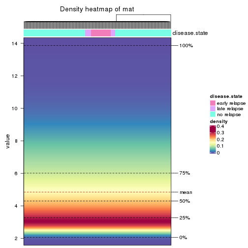


### Suggest the best k


Folowing table shows the best `k` (number of partitions) for each combination
of top-value methods and partition methods. Clicking on the method name in
the table goes to the section for a single combination of methods.

[The cola vignette](http://bioconductor.org/packages/devel/bioc/vignettes/cola/inst/doc/cola.html#toc_13)
explains the definition of the metrics used for determining the best
number of partitions.


```r
suggest_best_k(res_list)
```


|                            | The best k| 1-PAC| Mean silhouette| Concordance|   |Optional k |
|:---------------------------|----------:|-----:|---------------:|-----------:|:--|:----------|
|[ATC:hclust](#ATC-hclust)   |          2| 1.000|           0.988|       0.995|** |           |
|[ATC:kmeans](#ATC-kmeans)   |          2| 1.000|           0.997|       0.999|** |           |
|[ATC:NMF](#ATC-NMF)         |          2| 1.000|           1.000|       1.000|** |           |
|[ATC:pam](#ATC-pam)         |          3| 0.978|           0.955|       0.980|** |2          |
|[ATC:mclust](#ATC-mclust)   |          6| 0.955|           0.931|       0.952|** |2,3        |
|[ATC:skmeans](#ATC-skmeans) |          5| 0.947|           0.886|       0.937|*  |2,3        |
|[MAD:NMF](#MAD-NMF)         |          4| 0.754|           0.819|       0.901|   |           |
|[SD:skmeans](#SD-skmeans)   |          4| 0.746|           0.720|       0.867|   |           |
|[CV:mclust](#CV-mclust)     |          2| 0.678|           0.864|       0.929|   |           |
|[CV:pam](#CV-pam)           |          2| 0.602|           0.819|       0.923|   |           |
|[SD:pam](#SD-pam)           |          2| 0.578|           0.808|       0.918|   |           |
|[CV:NMF](#CV-NMF)           |          2| 0.543|           0.732|       0.884|   |           |
|[MAD:skmeans](#MAD-skmeans) |          2| 0.511|           0.857|       0.905|   |           |
|[CV:skmeans](#CV-skmeans)   |          2| 0.494|           0.683|       0.837|   |           |
|[SD:mclust](#SD-mclust)     |          2| 0.486|           0.854|       0.913|   |           |
|[SD:NMF](#SD-NMF)           |          2| 0.454|           0.661|       0.864|   |           |
|[MAD:mclust](#MAD-mclust)   |          2| 0.419|           0.644|       0.823|   |           |
|[MAD:kmeans](#MAD-kmeans)   |          2| 0.302|           0.716|       0.821|   |           |
|[CV:hclust](#CV-hclust)     |          4| 0.294|           0.501|       0.693|   |           |
|[CV:kmeans](#CV-kmeans)     |          2| 0.283|           0.658|       0.790|   |           |
|[MAD:pam](#MAD-pam)         |          2| 0.254|           0.614|       0.777|   |           |
|[SD:kmeans](#SD-kmeans)     |          2| 0.228|           0.523|       0.767|   |           |
|[MAD:hclust](#MAD-hclust)   |          2| 0.174|           0.699|       0.820|   |           |
|[SD:hclust](#SD-hclust)     |          2| 0.132|           0.504|       0.759|   |           |

\*\*: 1-PAC > 0.95, \*: 1-PAC > 0.9


### CDF of consensus matrices

Cumulative distribution function curves of consensus matrix for all methods.


```r
collect_plots(res_list, fun = plot_ecdf)
```

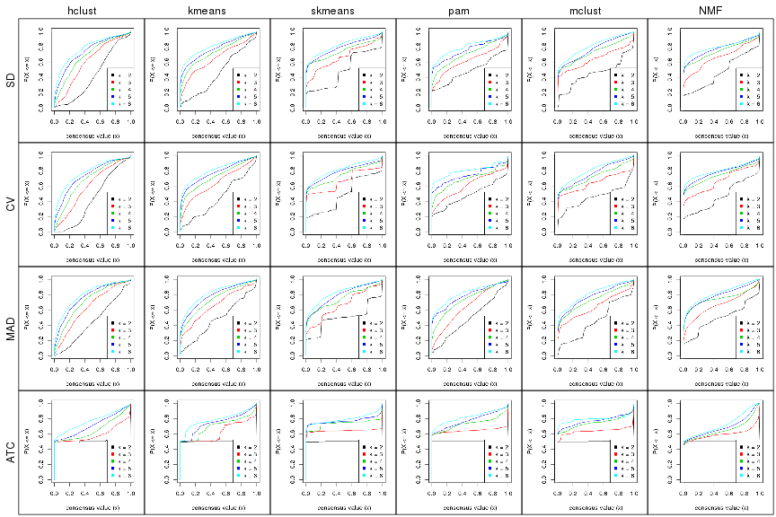


### Consensus heatmap

Consensus heatmaps for all methods. ([What is a consensus heatmap?](http://bioconductor.org/packages/devel/bioc/vignettes/cola/inst/doc/cola.html#toc_9))


<style type='text/css'>


.ui-helper-hidden {
	display: none;
}
.ui-helper-hidden-accessible {
	border: 0;
	clip: rect(0 0 0 0);
	height: 1px;
	margin: -1px;
	overflow: hidden;
	padding: 0;
	position: absolute;
	width: 1px;
}
.ui-helper-reset {
	margin: 0;
	padding: 0;
	border: 0;
	outline: 0;
	line-height: 1.3;
	text-decoration: none;
	font-size: 100%;
	list-style: none;
}
.ui-helper-clearfix:before,
.ui-helper-clearfix:after {
	content: "";
	display: table;
	border-collapse: collapse;
}
.ui-helper-clearfix:after {
	clear: both;
}
.ui-helper-zfix {
	width: 100%;
	height: 100%;
	top: 0;
	left: 0;
	position: absolute;
	opacity: 0;
	filter:Alpha(Opacity=0); 
}

.ui-front {
	z-index: 100;
}


.ui-state-disabled {
	cursor: default !important;
	pointer-events: none;
}


.ui-icon {
	display: inline-block;
	vertical-align: middle;
	margin-top: -.25em;
	position: relative;
	text-indent: -99999px;
	overflow: hidden;
	background-repeat: no-repeat;
}

.ui-widget-icon-block {
	left: 50%;
	margin-left: -8px;
	display: block;
}


.ui-widget-overlay {
	position: fixed;
	top: 0;
	left: 0;
	width: 100%;
	height: 100%;
}
.ui-accordion .ui-accordion-header {
	display: block;
	cursor: pointer;
	position: relative;
	margin: 2px 0 0 0;
	padding: .5em .5em .5em .7em;
	font-size: 100%;
}
.ui-accordion .ui-accordion-content {
	padding: 1em 2.2em;
	border-top: 0;
	overflow: auto;
}
.ui-autocomplete {
	position: absolute;
	top: 0;
	left: 0;
	cursor: default;
}
.ui-menu {
	list-style: none;
	padding: 0;
	margin: 0;
	display: block;
	outline: 0;
}
.ui-menu .ui-menu {
	position: absolute;
}
.ui-menu .ui-menu-item {
	margin: 0;
	cursor: pointer;
	
	list-style-image: url("data:image/gif;base64,R0lGODlhAQABAIAAAAAAAP///yH5BAEAAAAALAAAAAABAAEAAAIBRAA7");
}
.ui-menu .ui-menu-item-wrapper {
	position: relative;
	padding: 3px 1em 3px .4em;
}
.ui-menu .ui-menu-divider {
	margin: 5px 0;
	height: 0;
	font-size: 0;
	line-height: 0;
	border-width: 1px 0 0 0;
}
.ui-menu .ui-state-focus,
.ui-menu .ui-state-active {
	margin: -1px;
}


.ui-menu-icons {
	position: relative;
}
.ui-menu-icons .ui-menu-item-wrapper {
	padding-left: 2em;
}


.ui-menu .ui-icon {
	position: absolute;
	top: 0;
	bottom: 0;
	left: .2em;
	margin: auto 0;
}


.ui-menu .ui-menu-icon {
	left: auto;
	right: 0;
}
.ui-button {
	padding: .4em 1em;
	display: inline-block;
	position: relative;
	line-height: normal;
	margin-right: .1em;
	cursor: pointer;
	vertical-align: middle;
	text-align: center;
	-webkit-user-select: none;
	-moz-user-select: none;
	-ms-user-select: none;
	user-select: none;

	
	overflow: visible;
}

.ui-button,
.ui-button:link,
.ui-button:visited,
.ui-button:hover,
.ui-button:active {
	text-decoration: none;
}


.ui-button-icon-only {
	width: 2em;
	box-sizing: border-box;
	text-indent: -9999px;
	white-space: nowrap;
}


input.ui-button.ui-button-icon-only {
	text-indent: 0;
}


.ui-button-icon-only .ui-icon {
	position: absolute;
	top: 50%;
	left: 50%;
	margin-top: -8px;
	margin-left: -8px;
}

.ui-button.ui-icon-notext .ui-icon {
	padding: 0;
	width: 2.1em;
	height: 2.1em;
	text-indent: -9999px;
	white-space: nowrap;

}

input.ui-button.ui-icon-notext .ui-icon {
	width: auto;
	height: auto;
	text-indent: 0;
	white-space: normal;
	padding: .4em 1em;
}


input.ui-button::-moz-focus-inner,
button.ui-button::-moz-focus-inner {
	border: 0;
	padding: 0;
}
.ui-controlgroup {
	vertical-align: middle;
	display: inline-block;
}
.ui-controlgroup > .ui-controlgroup-item {
	float: left;
	margin-left: 0;
	margin-right: 0;
}
.ui-controlgroup > .ui-controlgroup-item:focus,
.ui-controlgroup > .ui-controlgroup-item.ui-visual-focus {
	z-index: 9999;
}
.ui-controlgroup-vertical > .ui-controlgroup-item {
	display: block;
	float: none;
	width: 100%;
	margin-top: 0;
	margin-bottom: 0;
	text-align: left;
}
.ui-controlgroup-vertical .ui-controlgroup-item {
	box-sizing: border-box;
}
.ui-controlgroup .ui-controlgroup-label {
	padding: .4em 1em;
}
.ui-controlgroup .ui-controlgroup-label span {
	font-size: 80%;
}
.ui-controlgroup-horizontal .ui-controlgroup-label + .ui-controlgroup-item {
	border-left: none;
}
.ui-controlgroup-vertical .ui-controlgroup-label + .ui-controlgroup-item {
	border-top: none;
}
.ui-controlgroup-horizontal .ui-controlgroup-label.ui-widget-content {
	border-right: none;
}
.ui-controlgroup-vertical .ui-controlgroup-label.ui-widget-content {
	border-bottom: none;
}


.ui-controlgroup-vertical .ui-spinner-input {

	
	width: 75%;
	width: calc( 100% - 2.4em );
}
.ui-controlgroup-vertical .ui-spinner .ui-spinner-up {
	border-top-style: solid;
}

.ui-checkboxradio-label .ui-icon-background {
	box-shadow: inset 1px 1px 1px #ccc;
	border-radius: .12em;
	border: none;
}
.ui-checkboxradio-radio-label .ui-icon-background {
	width: 16px;
	height: 16px;
	border-radius: 1em;
	overflow: visible;
	border: none;
}
.ui-checkboxradio-radio-label.ui-checkboxradio-checked .ui-icon,
.ui-checkboxradio-radio-label.ui-checkboxradio-checked:hover .ui-icon {
	background-image: none;
	width: 8px;
	height: 8px;
	border-width: 4px;
	border-style: solid;
}
.ui-checkboxradio-disabled {
	pointer-events: none;
}
.ui-datepicker {
	width: 17em;
	padding: .2em .2em 0;
	display: none;
}
.ui-datepicker .ui-datepicker-header {
	position: relative;
	padding: .2em 0;
}
.ui-datepicker .ui-datepicker-prev,
.ui-datepicker .ui-datepicker-next {
	position: absolute;
	top: 2px;
	width: 1.8em;
	height: 1.8em;
}
.ui-datepicker .ui-datepicker-prev-hover,
.ui-datepicker .ui-datepicker-next-hover {
	top: 1px;
}
.ui-datepicker .ui-datepicker-prev {
	left: 2px;
}
.ui-datepicker .ui-datepicker-next {
	right: 2px;
}
.ui-datepicker .ui-datepicker-prev-hover {
	left: 1px;
}
.ui-datepicker .ui-datepicker-next-hover {
	right: 1px;
}
.ui-datepicker .ui-datepicker-prev span,
.ui-datepicker .ui-datepicker-next span {
	display: block;
	position: absolute;
	left: 50%;
	margin-left: -8px;
	top: 50%;
	margin-top: -8px;
}
.ui-datepicker .ui-datepicker-title {
	margin: 0 2.3em;
	line-height: 1.8em;
	text-align: center;
}
.ui-datepicker .ui-datepicker-title select {
	font-size: 1em;
	margin: 1px 0;
}
.ui-datepicker select.ui-datepicker-month,
.ui-datepicker select.ui-datepicker-year {
	width: 45%;
}
.ui-datepicker table {
	width: 100%;
	font-size: .9em;
	border-collapse: collapse;
	margin: 0 0 .4em;
}
.ui-datepicker th {
	padding: .7em .3em;
	text-align: center;
	font-weight: bold;
	border: 0;
}
.ui-datepicker td {
	border: 0;
	padding: 1px;
}
.ui-datepicker td span,
.ui-datepicker td a {
	display: block;
	padding: .2em;
	text-align: right;
	text-decoration: none;
}
.ui-datepicker .ui-datepicker-buttonpane {
	background-image: none;
	margin: .7em 0 0 0;
	padding: 0 .2em;
	border-left: 0;
	border-right: 0;
	border-bottom: 0;
}
.ui-datepicker .ui-datepicker-buttonpane button {
	float: right;
	margin: .5em .2em .4em;
	cursor: pointer;
	padding: .2em .6em .3em .6em;
	width: auto;
	overflow: visible;
}
.ui-datepicker .ui-datepicker-buttonpane button.ui-datepicker-current {
	float: left;
}


.ui-datepicker.ui-datepicker-multi {
	width: auto;
}
.ui-datepicker-multi .ui-datepicker-group {
	float: left;
}
.ui-datepicker-multi .ui-datepicker-group table {
	width: 95%;
	margin: 0 auto .4em;
}
.ui-datepicker-multi-2 .ui-datepicker-group {
	width: 50%;
}
.ui-datepicker-multi-3 .ui-datepicker-group {
	width: 33.3%;
}
.ui-datepicker-multi-4 .ui-datepicker-group {
	width: 25%;
}
.ui-datepicker-multi .ui-datepicker-group-last .ui-datepicker-header,
.ui-datepicker-multi .ui-datepicker-group-middle .ui-datepicker-header {
	border-left-width: 0;
}
.ui-datepicker-multi .ui-datepicker-buttonpane {
	clear: left;
}
.ui-datepicker-row-break {
	clear: both;
	width: 100%;
	font-size: 0;
}


.ui-datepicker-rtl {
	direction: rtl;
}
.ui-datepicker-rtl .ui-datepicker-prev {
	right: 2px;
	left: auto;
}
.ui-datepicker-rtl .ui-datepicker-next {
	left: 2px;
	right: auto;
}
.ui-datepicker-rtl .ui-datepicker-prev:hover {
	right: 1px;
	left: auto;
}
.ui-datepicker-rtl .ui-datepicker-next:hover {
	left: 1px;
	right: auto;
}
.ui-datepicker-rtl .ui-datepicker-buttonpane {
	clear: right;
}
.ui-datepicker-rtl .ui-datepicker-buttonpane button {
	float: left;
}
.ui-datepicker-rtl .ui-datepicker-buttonpane button.ui-datepicker-current,
.ui-datepicker-rtl .ui-datepicker-group {
	float: right;
}
.ui-datepicker-rtl .ui-datepicker-group-last .ui-datepicker-header,
.ui-datepicker-rtl .ui-datepicker-group-middle .ui-datepicker-header {
	border-right-width: 0;
	border-left-width: 1px;
}


.ui-datepicker .ui-icon {
	display: block;
	text-indent: -99999px;
	overflow: hidden;
	background-repeat: no-repeat;
	left: .5em;
	top: .3em;
}
.ui-dialog {
	position: absolute;
	top: 0;
	left: 0;
	padding: .2em;
	outline: 0;
}
.ui-dialog .ui-dialog-titlebar {
	padding: .4em 1em;
	position: relative;
}
.ui-dialog .ui-dialog-title {
	float: left;
	margin: .1em 0;
	white-space: nowrap;
	width: 90%;
	overflow: hidden;
	text-overflow: ellipsis;
}
.ui-dialog .ui-dialog-titlebar-close {
	position: absolute;
	right: .3em;
	top: 50%;
	width: 20px;
	margin: -10px 0 0 0;
	padding: 1px;
	height: 20px;
}
.ui-dialog .ui-dialog-content {
	position: relative;
	border: 0;
	padding: .5em 1em;
	background: none;
	overflow: auto;
}
.ui-dialog .ui-dialog-buttonpane {
	text-align: left;
	border-width: 1px 0 0 0;
	background-image: none;
	margin-top: .5em;
	padding: .3em 1em .5em .4em;
}
.ui-dialog .ui-dialog-buttonpane .ui-dialog-buttonset {
	float: right;
}
.ui-dialog .ui-dialog-buttonpane button {
	margin: .5em .4em .5em 0;
	cursor: pointer;
}
.ui-dialog .ui-resizable-n {
	height: 2px;
	top: 0;
}
.ui-dialog .ui-resizable-e {
	width: 2px;
	right: 0;
}
.ui-dialog .ui-resizable-s {
	height: 2px;
	bottom: 0;
}
.ui-dialog .ui-resizable-w {
	width: 2px;
	left: 0;
}
.ui-dialog .ui-resizable-se,
.ui-dialog .ui-resizable-sw,
.ui-dialog .ui-resizable-ne,
.ui-dialog .ui-resizable-nw {
	width: 7px;
	height: 7px;
}
.ui-dialog .ui-resizable-se {
	right: 0;
	bottom: 0;
}
.ui-dialog .ui-resizable-sw {
	left: 0;
	bottom: 0;
}
.ui-dialog .ui-resizable-ne {
	right: 0;
	top: 0;
}
.ui-dialog .ui-resizable-nw {
	left: 0;
	top: 0;
}
.ui-draggable .ui-dialog-titlebar {
	cursor: move;
}
.ui-draggable-handle {
	-ms-touch-action: none;
	touch-action: none;
}
.ui-resizable {
	position: relative;
}
.ui-resizable-handle {
	position: absolute;
	font-size: 0.1px;
	display: block;
	-ms-touch-action: none;
	touch-action: none;
}
.ui-resizable-disabled .ui-resizable-handle,
.ui-resizable-autohide .ui-resizable-handle {
	display: none;
}
.ui-resizable-n {
	cursor: n-resize;
	height: 7px;
	width: 100%;
	top: -5px;
	left: 0;
}
.ui-resizable-s {
	cursor: s-resize;
	height: 7px;
	width: 100%;
	bottom: -5px;
	left: 0;
}
.ui-resizable-e {
	cursor: e-resize;
	width: 7px;
	right: -5px;
	top: 0;
	height: 100%;
}
.ui-resizable-w {
	cursor: w-resize;
	width: 7px;
	left: -5px;
	top: 0;
	height: 100%;
}
.ui-resizable-se {
	cursor: se-resize;
	width: 12px;
	height: 12px;
	right: 1px;
	bottom: 1px;
}
.ui-resizable-sw {
	cursor: sw-resize;
	width: 9px;
	height: 9px;
	left: -5px;
	bottom: -5px;
}
.ui-resizable-nw {
	cursor: nw-resize;
	width: 9px;
	height: 9px;
	left: -5px;
	top: -5px;
}
.ui-resizable-ne {
	cursor: ne-resize;
	width: 9px;
	height: 9px;
	right: -5px;
	top: -5px;
}
.ui-progressbar {
	height: 2em;
	text-align: left;
	overflow: hidden;
}
.ui-progressbar .ui-progressbar-value {
	margin: -1px;
	height: 100%;
}
.ui-progressbar .ui-progressbar-overlay {
	background: url("");
	height: 100%;
	filter: alpha(opacity=25); 
	opacity: 0.25;
}
.ui-progressbar-indeterminate .ui-progressbar-value {
	background-image: none;
}
.ui-selectable {
	-ms-touch-action: none;
	touch-action: none;
}
.ui-selectable-helper {
	position: absolute;
	z-index: 100;
	border: 1px dotted black;
}
.ui-selectmenu-menu {
	padding: 0;
	margin: 0;
	position: absolute;
	top: 0;
	left: 0;
	display: none;
}
.ui-selectmenu-menu .ui-menu {
	overflow: auto;
	overflow-x: hidden;
	padding-bottom: 1px;
}
.ui-selectmenu-menu .ui-menu .ui-selectmenu-optgroup {
	font-size: 1em;
	font-weight: bold;
	line-height: 1.5;
	padding: 2px 0.4em;
	margin: 0.5em 0 0 0;
	height: auto;
	border: 0;
}
.ui-selectmenu-open {
	display: block;
}
.ui-selectmenu-text {
	display: block;
	margin-right: 20px;
	overflow: hidden;
	text-overflow: ellipsis;
}
.ui-selectmenu-button.ui-button {
	text-align: left;
	white-space: nowrap;
	width: 14em;
}
.ui-selectmenu-icon.ui-icon {
	float: right;
	margin-top: 0;
}
.ui-slider {
	position: relative;
	text-align: left;
}
.ui-slider .ui-slider-handle {
	position: absolute;
	z-index: 2;
	width: 1.2em;
	height: 1.2em;
	cursor: default;
	-ms-touch-action: none;
	touch-action: none;
}
.ui-slider .ui-slider-range {
	position: absolute;
	z-index: 1;
	font-size: .7em;
	display: block;
	border: 0;
	background-position: 0 0;
}


.ui-slider.ui-state-disabled .ui-slider-handle,
.ui-slider.ui-state-disabled .ui-slider-range {
	filter: inherit;
}

.ui-slider-horizontal {
	height: .8em;
}
.ui-slider-horizontal .ui-slider-handle {
	top: -.3em;
	margin-left: -.6em;
}
.ui-slider-horizontal .ui-slider-range {
	top: 0;
	height: 100%;
}
.ui-slider-horizontal .ui-slider-range-min {
	left: 0;
}
.ui-slider-horizontal .ui-slider-range-max {
	right: 0;
}

.ui-slider-vertical {
	width: .8em;
	height: 100px;
}
.ui-slider-vertical .ui-slider-handle {
	left: -.3em;
	margin-left: 0;
	margin-bottom: -.6em;
}
.ui-slider-vertical .ui-slider-range {
	left: 0;
	width: 100%;
}
.ui-slider-vertical .ui-slider-range-min {
	bottom: 0;
}
.ui-slider-vertical .ui-slider-range-max {
	top: 0;
}
.ui-sortable-handle {
	-ms-touch-action: none;
	touch-action: none;
}
.ui-spinner {
	position: relative;
	display: inline-block;
	overflow: hidden;
	padding: 0;
	vertical-align: middle;
}
.ui-spinner-input {
	border: none;
	background: none;
	color: inherit;
	padding: .222em 0;
	margin: .2em 0;
	vertical-align: middle;
	margin-left: .4em;
	margin-right: 2em;
}
.ui-spinner-button {
	width: 1.6em;
	height: 50%;
	font-size: .5em;
	padding: 0;
	margin: 0;
	text-align: center;
	position: absolute;
	cursor: default;
	display: block;
	overflow: hidden;
	right: 0;
}

.ui-spinner a.ui-spinner-button {
	border-top-style: none;
	border-bottom-style: none;
	border-right-style: none;
}
.ui-spinner-up {
	top: 0;
}
.ui-spinner-down {
	bottom: 0;
}
.ui-tabs {
	position: relative;
	padding: .2em;
}
.ui-tabs .ui-tabs-nav {
	margin: 0;
	padding: .2em .2em 0;
}
.ui-tabs .ui-tabs-nav li {
	list-style: none;
	float: left;
	position: relative;
	top: 0;
	margin: 1px .2em 0 0;
	border-bottom-width: 0;
	padding: 0;
	white-space: nowrap;
}
.ui-tabs .ui-tabs-nav .ui-tabs-anchor {
	float: left;
	padding: .5em 1em;
	text-decoration: none;
}
.ui-tabs .ui-tabs-nav li.ui-tabs-active {
	margin-bottom: -1px;
	padding-bottom: 1px;
}
.ui-tabs .ui-tabs-nav li.ui-tabs-active .ui-tabs-anchor,
.ui-tabs .ui-tabs-nav li.ui-state-disabled .ui-tabs-anchor,
.ui-tabs .ui-tabs-nav li.ui-tabs-loading .ui-tabs-anchor {
	cursor: text;
}
.ui-tabs-collapsible .ui-tabs-nav li.ui-tabs-active .ui-tabs-anchor {
	cursor: pointer;
}
.ui-tabs .ui-tabs-panel {
	display: block;
	border-width: 0;
	padding: 1em 1.4em;
	background: none;
}
.ui-tooltip {
	padding: 8px;
	position: absolute;
	z-index: 9999;
	max-width: 300px;
}
body .ui-tooltip {
	border-width: 2px;
}

.ui-widget {
	font-family: Arial,Helvetica,sans-serif;
	font-size: 1em;
}
.ui-widget .ui-widget {
	font-size: 1em;
}
.ui-widget input,
.ui-widget select,
.ui-widget textarea,
.ui-widget button {
	font-family: Arial,Helvetica,sans-serif;
	font-size: 1em;
}
.ui-widget.ui-widget-content {
	border: 1px solid #c5c5c5;
}
.ui-widget-content {
	border: 1px solid #dddddd;
	background: #ffffff;
	color: #333333;
}
.ui-widget-content a {
	color: #333333;
}
.ui-widget-header {
	border: 1px solid #dddddd;
	background: #e9e9e9;
	color: #333333;
	font-weight: bold;
}
.ui-widget-header a {
	color: #333333;
}


.ui-state-default,
.ui-widget-content .ui-state-default,
.ui-widget-header .ui-state-default,
.ui-button,


html .ui-button.ui-state-disabled:hover,
html .ui-button.ui-state-disabled:active {
	border: 1px solid #c5c5c5;
	background: #f6f6f6;
	font-weight: normal;
	color: #454545;
}
.ui-state-default a,
.ui-state-default a:link,
.ui-state-default a:visited,
a.ui-button,
a:link.ui-button,
a:visited.ui-button,
.ui-button {
	color: #454545;
	text-decoration: none;
}
.ui-state-hover,
.ui-widget-content .ui-state-hover,
.ui-widget-header .ui-state-hover,
.ui-state-focus,
.ui-widget-content .ui-state-focus,
.ui-widget-header .ui-state-focus,
.ui-button:hover,
.ui-button:focus {
	border: 1px solid #cccccc;
	background: #ededed;
	font-weight: normal;
	color: #2b2b2b;
}
.ui-state-hover a,
.ui-state-hover a:hover,
.ui-state-hover a:link,
.ui-state-hover a:visited,
.ui-state-focus a,
.ui-state-focus a:hover,
.ui-state-focus a:link,
.ui-state-focus a:visited,
a.ui-button:hover,
a.ui-button:focus {
	color: #2b2b2b;
	text-decoration: none;
}

.ui-visual-focus {
	box-shadow: 0 0 3px 1px rgb(94, 158, 214);
}
.ui-state-active,
.ui-widget-content .ui-state-active,
.ui-widget-header .ui-state-active,
a.ui-button:active,
.ui-button:active,
.ui-button.ui-state-active:hover {
	border: 1px solid #003eff;
	background: #007fff;
	font-weight: normal;
	color: #ffffff;
}
.ui-icon-background,
.ui-state-active .ui-icon-background {
	border: #003eff;
	background-color: #ffffff;
}
.ui-state-active a,
.ui-state-active a:link,
.ui-state-active a:visited {
	color: #ffffff;
	text-decoration: none;
}


.ui-state-highlight,
.ui-widget-content .ui-state-highlight,
.ui-widget-header .ui-state-highlight {
	border: 1px solid #dad55e;
	background: #fffa90;
	color: #777620;
}
.ui-state-checked {
	border: 1px solid #dad55e;
	background: #fffa90;
}
.ui-state-highlight a,
.ui-widget-content .ui-state-highlight a,
.ui-widget-header .ui-state-highlight a {
	color: #777620;
}
.ui-state-error,
.ui-widget-content .ui-state-error,
.ui-widget-header .ui-state-error {
	border: 1px solid #f1a899;
	background: #fddfdf;
	color: #5f3f3f;
}
.ui-state-error a,
.ui-widget-content .ui-state-error a,
.ui-widget-header .ui-state-error a {
	color: #5f3f3f;
}
.ui-state-error-text,
.ui-widget-content .ui-state-error-text,
.ui-widget-header .ui-state-error-text {
	color: #5f3f3f;
}
.ui-priority-primary,
.ui-widget-content .ui-priority-primary,
.ui-widget-header .ui-priority-primary {
	font-weight: bold;
}
.ui-priority-secondary,
.ui-widget-content .ui-priority-secondary,
.ui-widget-header .ui-priority-secondary {
	opacity: .7;
	filter:Alpha(Opacity=70); 
	font-weight: normal;
}
.ui-state-disabled,
.ui-widget-content .ui-state-disabled,
.ui-widget-header .ui-state-disabled {
	opacity: .35;
	filter:Alpha(Opacity=35); 
	background-image: none;
}
.ui-state-disabled .ui-icon {
	filter:Alpha(Opacity=35); 
}


.ui-icon {
	width: 16px;
	height: 16px;
}
.ui-icon,
.ui-widget-content .ui-icon {
	background-image: url("images/ui-icons_444444_256x240.png");
}
.ui-widget-header .ui-icon {
	background-image: url("images/ui-icons_444444_256x240.png");
}
.ui-state-hover .ui-icon,
.ui-state-focus .ui-icon,
.ui-button:hover .ui-icon,
.ui-button:focus .ui-icon {
	background-image: url("images/ui-icons_555555_256x240.png");
}
.ui-state-active .ui-icon,
.ui-button:active .ui-icon {
	background-image: url("images/ui-icons_ffffff_256x240.png");
}
.ui-state-highlight .ui-icon,
.ui-button .ui-state-highlight.ui-icon {
	background-image: url("images/ui-icons_777620_256x240.png");
}
.ui-state-error .ui-icon,
.ui-state-error-text .ui-icon {
	background-image: url("images/ui-icons_cc0000_256x240.png");
}
.ui-button .ui-icon {
	background-image: url("images/ui-icons_777777_256x240.png");
}


.ui-icon-blank { background-position: 16px 16px; }
.ui-icon-caret-1-n { background-position: 0 0; }
.ui-icon-caret-1-ne { background-position: -16px 0; }
.ui-icon-caret-1-e { background-position: -32px 0; }
.ui-icon-caret-1-se { background-position: -48px 0; }
.ui-icon-caret-1-s { background-position: -65px 0; }
.ui-icon-caret-1-sw { background-position: -80px 0; }
.ui-icon-caret-1-w { background-position: -96px 0; }
.ui-icon-caret-1-nw { background-position: -112px 0; }
.ui-icon-caret-2-n-s { background-position: -128px 0; }
.ui-icon-caret-2-e-w { background-position: -144px 0; }
.ui-icon-triangle-1-n { background-position: 0 -16px; }
.ui-icon-triangle-1-ne { background-position: -16px -16px; }
.ui-icon-triangle-1-e { background-position: -32px -16px; }
.ui-icon-triangle-1-se { background-position: -48px -16px; }
.ui-icon-triangle-1-s { background-position: -65px -16px; }
.ui-icon-triangle-1-sw { background-position: -80px -16px; }
.ui-icon-triangle-1-w { background-position: -96px -16px; }
.ui-icon-triangle-1-nw { background-position: -112px -16px; }
.ui-icon-triangle-2-n-s { background-position: -128px -16px; }
.ui-icon-triangle-2-e-w { background-position: -144px -16px; }
.ui-icon-arrow-1-n { background-position: 0 -32px; }
.ui-icon-arrow-1-ne { background-position: -16px -32px; }
.ui-icon-arrow-1-e { background-position: -32px -32px; }
.ui-icon-arrow-1-se { background-position: -48px -32px; }
.ui-icon-arrow-1-s { background-position: -65px -32px; }
.ui-icon-arrow-1-sw { background-position: -80px -32px; }
.ui-icon-arrow-1-w { background-position: -96px -32px; }
.ui-icon-arrow-1-nw { background-position: -112px -32px; }
.ui-icon-arrow-2-n-s { background-position: -128px -32px; }
.ui-icon-arrow-2-ne-sw { background-position: -144px -32px; }
.ui-icon-arrow-2-e-w { background-position: -160px -32px; }
.ui-icon-arrow-2-se-nw { background-position: -176px -32px; }
.ui-icon-arrowstop-1-n { background-position: -192px -32px; }
.ui-icon-arrowstop-1-e { background-position: -208px -32px; }
.ui-icon-arrowstop-1-s { background-position: -224px -32px; }
.ui-icon-arrowstop-1-w { background-position: -240px -32px; }
.ui-icon-arrowthick-1-n { background-position: 1px -48px; }
.ui-icon-arrowthick-1-ne { background-position: -16px -48px; }
.ui-icon-arrowthick-1-e { background-position: -32px -48px; }
.ui-icon-arrowthick-1-se { background-position: -48px -48px; }
.ui-icon-arrowthick-1-s { background-position: -64px -48px; }
.ui-icon-arrowthick-1-sw { background-position: -80px -48px; }
.ui-icon-arrowthick-1-w { background-position: -96px -48px; }
.ui-icon-arrowthick-1-nw { background-position: -112px -48px; }
.ui-icon-arrowthick-2-n-s { background-position: -128px -48px; }
.ui-icon-arrowthick-2-ne-sw { background-position: -144px -48px; }
.ui-icon-arrowthick-2-e-w { background-position: -160px -48px; }
.ui-icon-arrowthick-2-se-nw { background-position: -176px -48px; }
.ui-icon-arrowthickstop-1-n { background-position: -192px -48px; }
.ui-icon-arrowthickstop-1-e { background-position: -208px -48px; }
.ui-icon-arrowthickstop-1-s { background-position: -224px -48px; }
.ui-icon-arrowthickstop-1-w { background-position: -240px -48px; }
.ui-icon-arrowreturnthick-1-w { background-position: 0 -64px; }
.ui-icon-arrowreturnthick-1-n { background-position: -16px -64px; }
.ui-icon-arrowreturnthick-1-e { background-position: -32px -64px; }
.ui-icon-arrowreturnthick-1-s { background-position: -48px -64px; }
.ui-icon-arrowreturn-1-w { background-position: -64px -64px; }
.ui-icon-arrowreturn-1-n { background-position: -80px -64px; }
.ui-icon-arrowreturn-1-e { background-position: -96px -64px; }
.ui-icon-arrowreturn-1-s { background-position: -112px -64px; }
.ui-icon-arrowrefresh-1-w { background-position: -128px -64px; }
.ui-icon-arrowrefresh-1-n { background-position: -144px -64px; }
.ui-icon-arrowrefresh-1-e { background-position: -160px -64px; }
.ui-icon-arrowrefresh-1-s { background-position: -176px -64px; }
.ui-icon-arrow-4 { background-position: 0 -80px; }
.ui-icon-arrow-4-diag { background-position: -16px -80px; }
.ui-icon-extlink { background-position: -32px -80px; }
.ui-icon-newwin { background-position: -48px -80px; }
.ui-icon-refresh { background-position: -64px -80px; }
.ui-icon-shuffle { background-position: -80px -80px; }
.ui-icon-transfer-e-w { background-position: -96px -80px; }
.ui-icon-transferthick-e-w { background-position: -112px -80px; }
.ui-icon-folder-collapsed { background-position: 0 -96px; }
.ui-icon-folder-open { background-position: -16px -96px; }
.ui-icon-document { background-position: -32px -96px; }
.ui-icon-document-b { background-position: -48px -96px; }
.ui-icon-note { background-position: -64px -96px; }
.ui-icon-mail-closed { background-position: -80px -96px; }
.ui-icon-mail-open { background-position: -96px -96px; }
.ui-icon-suitcase { background-position: -112px -96px; }
.ui-icon-comment { background-position: -128px -96px; }
.ui-icon-person { background-position: -144px -96px; }
.ui-icon-print { background-position: -160px -96px; }
.ui-icon-trash { background-position: -176px -96px; }
.ui-icon-locked { background-position: -192px -96px; }
.ui-icon-unlocked { background-position: -208px -96px; }
.ui-icon-bookmark { background-position: -224px -96px; }
.ui-icon-tag { background-position: -240px -96px; }
.ui-icon-home { background-position: 0 -112px; }
.ui-icon-flag { background-position: -16px -112px; }
.ui-icon-calendar { background-position: -32px -112px; }
.ui-icon-cart { background-position: -48px -112px; }
.ui-icon-pencil { background-position: -64px -112px; }
.ui-icon-clock { background-position: -80px -112px; }
.ui-icon-disk { background-position: -96px -112px; }
.ui-icon-calculator { background-position: -112px -112px; }
.ui-icon-zoomin { background-position: -128px -112px; }
.ui-icon-zoomout { background-position: -144px -112px; }
.ui-icon-search { background-position: -160px -112px; }
.ui-icon-wrench { background-position: -176px -112px; }
.ui-icon-gear { background-position: -192px -112px; }
.ui-icon-heart { background-position: -208px -112px; }
.ui-icon-star { background-position: -224px -112px; }
.ui-icon-link { background-position: -240px -112px; }
.ui-icon-cancel { background-position: 0 -128px; }
.ui-icon-plus { background-position: -16px -128px; }
.ui-icon-plusthick { background-position: -32px -128px; }
.ui-icon-minus { background-position: -48px -128px; }
.ui-icon-minusthick { background-position: -64px -128px; }
.ui-icon-close { background-position: -80px -128px; }
.ui-icon-closethick { background-position: -96px -128px; }
.ui-icon-key { background-position: -112px -128px; }
.ui-icon-lightbulb { background-position: -128px -128px; }
.ui-icon-scissors { background-position: -144px -128px; }
.ui-icon-clipboard { background-position: -160px -128px; }
.ui-icon-copy { background-position: -176px -128px; }
.ui-icon-contact { background-position: -192px -128px; }
.ui-icon-image { background-position: -208px -128px; }
.ui-icon-video { background-position: -224px -128px; }
.ui-icon-script { background-position: -240px -128px; }
.ui-icon-alert { background-position: 0 -144px; }
.ui-icon-info { background-position: -16px -144px; }
.ui-icon-notice { background-position: -32px -144px; }
.ui-icon-help { background-position: -48px -144px; }
.ui-icon-check { background-position: -64px -144px; }
.ui-icon-bullet { background-position: -80px -144px; }
.ui-icon-radio-on { background-position: -96px -144px; }
.ui-icon-radio-off { background-position: -112px -144px; }
.ui-icon-pin-w { background-position: -128px -144px; }
.ui-icon-pin-s { background-position: -144px -144px; }
.ui-icon-play { background-position: 0 -160px; }
.ui-icon-pause { background-position: -16px -160px; }
.ui-icon-seek-next { background-position: -32px -160px; }
.ui-icon-seek-prev { background-position: -48px -160px; }
.ui-icon-seek-end { background-position: -64px -160px; }
.ui-icon-seek-start { background-position: -80px -160px; }

.ui-icon-seek-first { background-position: -80px -160px; }
.ui-icon-stop { background-position: -96px -160px; }
.ui-icon-eject { background-position: -112px -160px; }
.ui-icon-volume-off { background-position: -128px -160px; }
.ui-icon-volume-on { background-position: -144px -160px; }
.ui-icon-power { background-position: 0 -176px; }
.ui-icon-signal-diag { background-position: -16px -176px; }
.ui-icon-signal { background-position: -32px -176px; }
.ui-icon-battery-0 { background-position: -48px -176px; }
.ui-icon-battery-1 { background-position: -64px -176px; }
.ui-icon-battery-2 { background-position: -80px -176px; }
.ui-icon-battery-3 { background-position: -96px -176px; }
.ui-icon-circle-plus { background-position: 0 -192px; }
.ui-icon-circle-minus { background-position: -16px -192px; }
.ui-icon-circle-close { background-position: -32px -192px; }
.ui-icon-circle-triangle-e { background-position: -48px -192px; }
.ui-icon-circle-triangle-s { background-position: -64px -192px; }
.ui-icon-circle-triangle-w { background-position: -80px -192px; }
.ui-icon-circle-triangle-n { background-position: -96px -192px; }
.ui-icon-circle-arrow-e { background-position: -112px -192px; }
.ui-icon-circle-arrow-s { background-position: -128px -192px; }
.ui-icon-circle-arrow-w { background-position: -144px -192px; }
.ui-icon-circle-arrow-n { background-position: -160px -192px; }
.ui-icon-circle-zoomin { background-position: -176px -192px; }
.ui-icon-circle-zoomout { background-position: -192px -192px; }
.ui-icon-circle-check { background-position: -208px -192px; }
.ui-icon-circlesmall-plus { background-position: 0 -208px; }
.ui-icon-circlesmall-minus { background-position: -16px -208px; }
.ui-icon-circlesmall-close { background-position: -32px -208px; }
.ui-icon-squaresmall-plus { background-position: -48px -208px; }
.ui-icon-squaresmall-minus { background-position: -64px -208px; }
.ui-icon-squaresmall-close { background-position: -80px -208px; }
.ui-icon-grip-dotted-vertical { background-position: 0 -224px; }
.ui-icon-grip-dotted-horizontal { background-position: -16px -224px; }
.ui-icon-grip-solid-vertical { background-position: -32px -224px; }
.ui-icon-grip-solid-horizontal { background-position: -48px -224px; }
.ui-icon-gripsmall-diagonal-se { background-position: -64px -224px; }
.ui-icon-grip-diagonal-se { background-position: -80px -224px; }


.ui-corner-all,
.ui-corner-top,
.ui-corner-left,
.ui-corner-tl {
	border-top-left-radius: 3px;
}
.ui-corner-all,
.ui-corner-top,
.ui-corner-right,
.ui-corner-tr {
	border-top-right-radius: 3px;
}
.ui-corner-all,
.ui-corner-bottom,
.ui-corner-left,
.ui-corner-bl {
	border-bottom-left-radius: 3px;
}
.ui-corner-all,
.ui-corner-bottom,
.ui-corner-right,
.ui-corner-br {
	border-bottom-right-radius: 3px;
}


.ui-widget-overlay {
	background: #aaaaaa;
	opacity: .3;
	filter: Alpha(Opacity=30); 
}
.ui-widget-shadow {
	-webkit-box-shadow: 0px 0px 5px #666666;
	box-shadow: 0px 0px 5px #666666;
} 
</style>
<script src='js/jquery-1.12.4.js'></script>
<script src='js/jquery-ui.js'></script>

<script>
$( function() {
	$( '#tabs-collect-consensus-heatmap' ).tabs();
} );
</script>
<div id='tabs-collect-consensus-heatmap'>
<ul>
<li><a href='#tab-collect-consensus-heatmap-1'>k = 2</a></li>
<li><a href='#tab-collect-consensus-heatmap-2'>k = 3</a></li>
<li><a href='#tab-collect-consensus-heatmap-3'>k = 4</a></li>
<li><a href='#tab-collect-consensus-heatmap-4'>k = 5</a></li>
<li><a href='#tab-collect-consensus-heatmap-5'>k = 6</a></li>
</ul>
<div id='tab-collect-consensus-heatmap-1'>
<pre><code class="r">collect_plots(res_list, k = 2, fun = consensus_heatmap, mc.cores = 4)
</code></pre>

<p>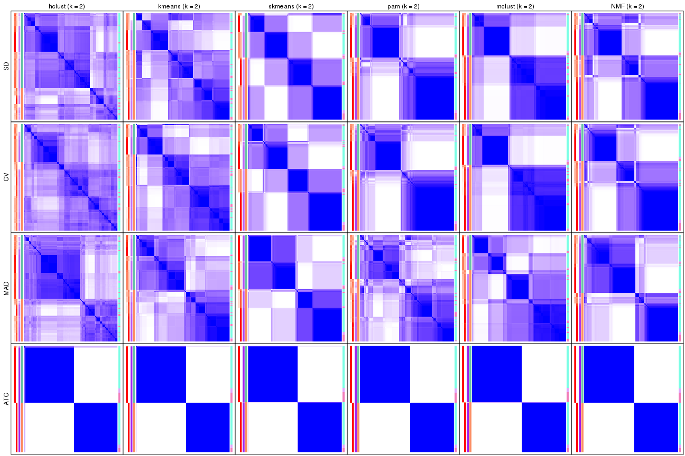</p>

</div>
<div id='tab-collect-consensus-heatmap-2'>
<pre><code class="r">collect_plots(res_list, k = 3, fun = consensus_heatmap, mc.cores = 4)
</code></pre>

<p>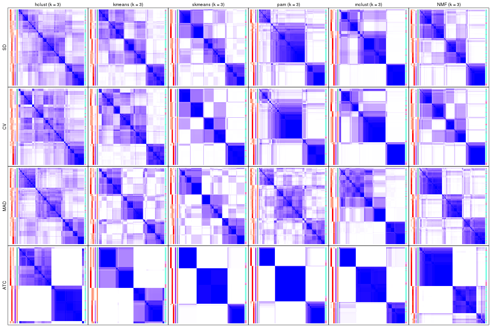</p>

</div>
<div id='tab-collect-consensus-heatmap-3'>
<pre><code class="r">collect_plots(res_list, k = 4, fun = consensus_heatmap, mc.cores = 4)
</code></pre>

<p>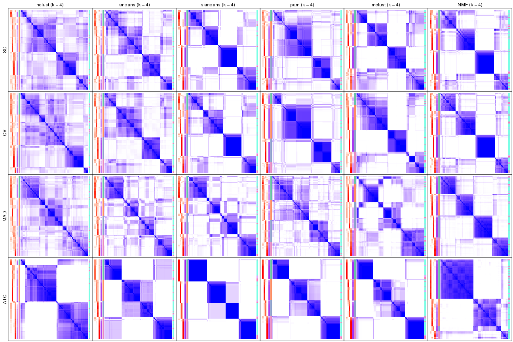</p>

</div>
<div id='tab-collect-consensus-heatmap-4'>
<pre><code class="r">collect_plots(res_list, k = 5, fun = consensus_heatmap, mc.cores = 4)
</code></pre>

<p>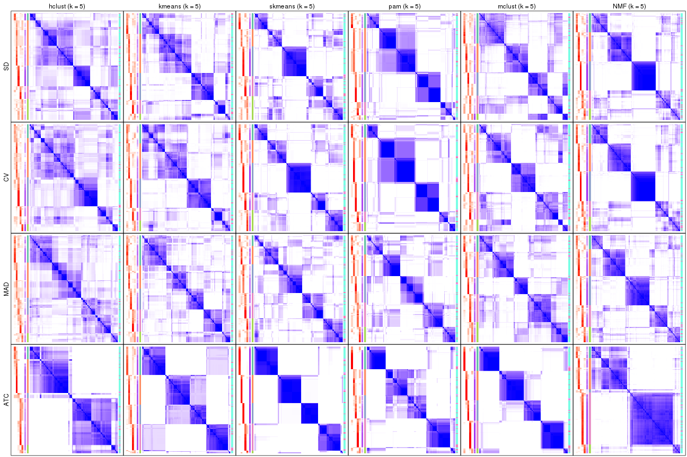</p>

</div>
<div id='tab-collect-consensus-heatmap-5'>
<pre><code class="r">collect_plots(res_list, k = 6, fun = consensus_heatmap, mc.cores = 4)
</code></pre>

<p>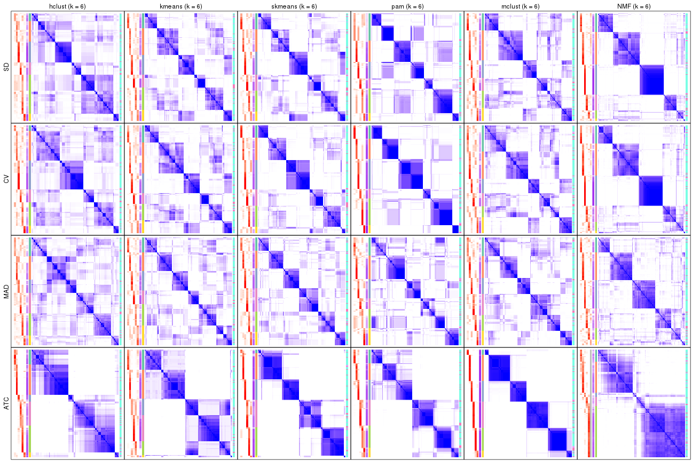</p>

</div>
</div>


### Membership heatmap

Membership heatmaps for all methods. ([What is a membership heatmap?](http://bioconductor.org/packages/devel/bioc/vignettes/cola/inst/doc/cola.html#toc_12))


<script>
$( function() {
	$( '#tabs-collect-membership-heatmap' ).tabs();
} );
</script>
<div id='tabs-collect-membership-heatmap'>
<ul>
<li><a href='#tab-collect-membership-heatmap-1'>k = 2</a></li>
<li><a href='#tab-collect-membership-heatmap-2'>k = 3</a></li>
<li><a href='#tab-collect-membership-heatmap-3'>k = 4</a></li>
<li><a href='#tab-collect-membership-heatmap-4'>k = 5</a></li>
<li><a href='#tab-collect-membership-heatmap-5'>k = 6</a></li>
</ul>
<div id='tab-collect-membership-heatmap-1'>
<pre><code class="r">collect_plots(res_list, k = 2, fun = membership_heatmap, mc.cores = 4)
</code></pre>

<p>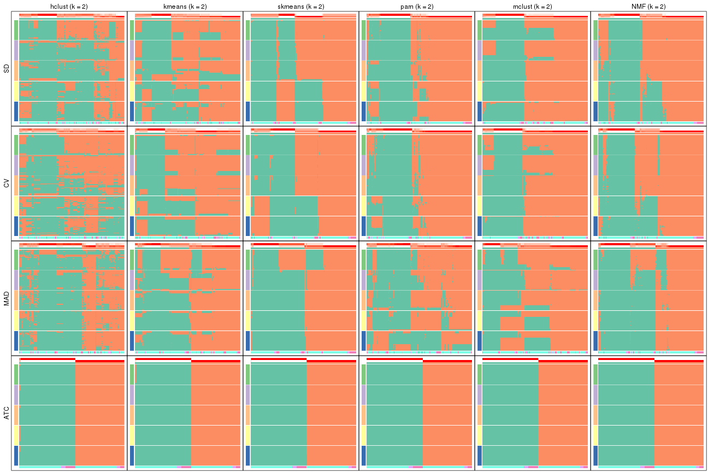</p>

</div>
<div id='tab-collect-membership-heatmap-2'>
<pre><code class="r">collect_plots(res_list, k = 3, fun = membership_heatmap, mc.cores = 4)
</code></pre>

<p>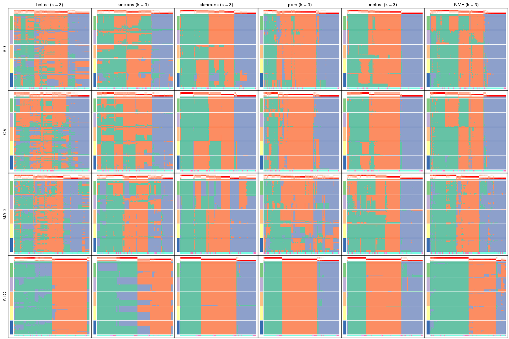</p>

</div>
<div id='tab-collect-membership-heatmap-3'>
<pre><code class="r">collect_plots(res_list, k = 4, fun = membership_heatmap, mc.cores = 4)
</code></pre>

<p>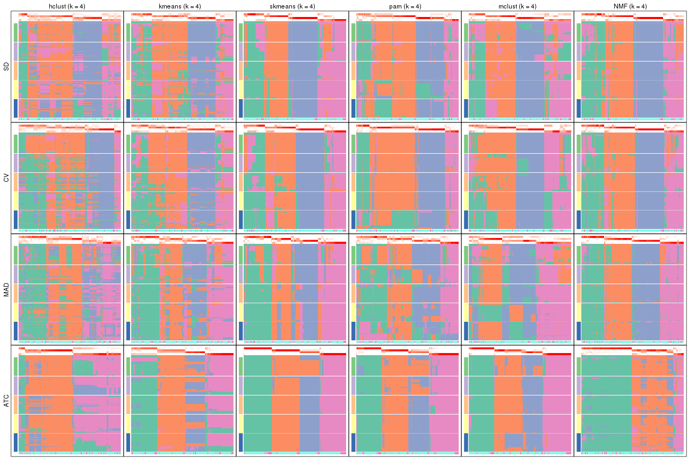</p>

</div>
<div id='tab-collect-membership-heatmap-4'>
<pre><code class="r">collect_plots(res_list, k = 5, fun = membership_heatmap, mc.cores = 4)
</code></pre>

<p>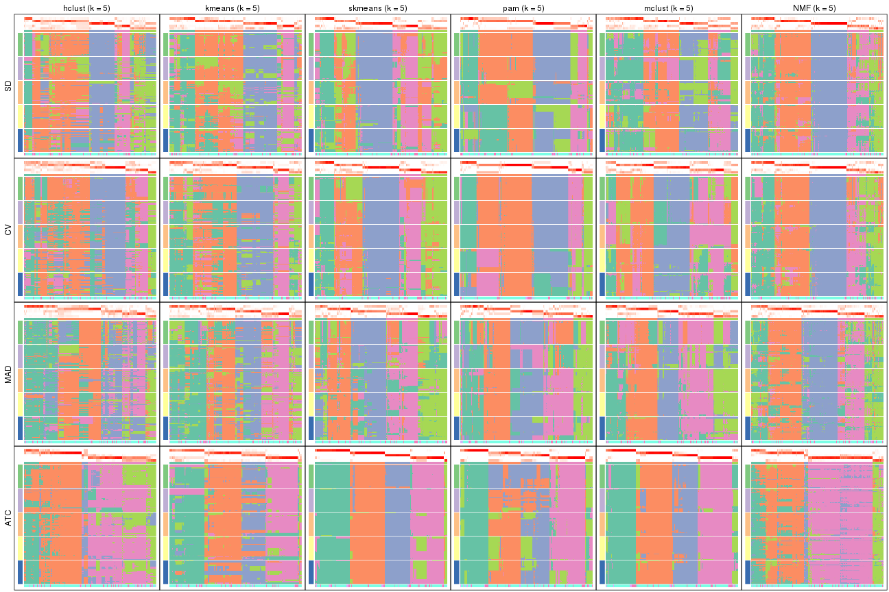</p>

</div>
<div id='tab-collect-membership-heatmap-5'>
<pre><code class="r">collect_plots(res_list, k = 6, fun = membership_heatmap, mc.cores = 4)
</code></pre>

<p>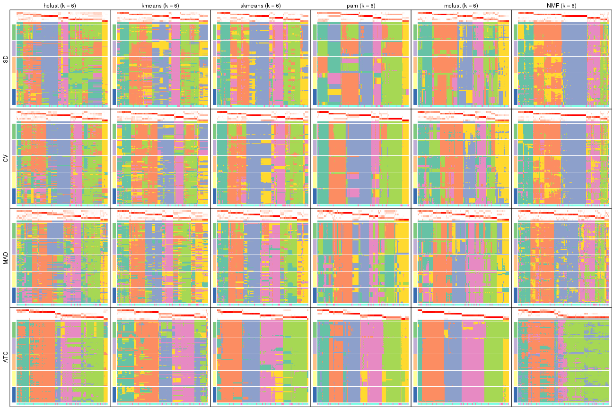</p>

</div>
</div>


### Signature heatmap

Signature heatmaps for all methods. ([What is a signature heatmap?](http://bioconductor.org/packages/devel/bioc/vignettes/cola/inst/doc/cola.html#toc_22))


Note in following heatmaps, rows are scaled.


<script>
$( function() {
	$( '#tabs-collect-get-signatures' ).tabs();
} );
</script>
<div id='tabs-collect-get-signatures'>
<ul>
<li><a href='#tab-collect-get-signatures-1'>k = 2</a></li>
<li><a href='#tab-collect-get-signatures-2'>k = 3</a></li>
<li><a href='#tab-collect-get-signatures-3'>k = 4</a></li>
<li><a href='#tab-collect-get-signatures-4'>k = 5</a></li>
<li><a href='#tab-collect-get-signatures-5'>k = 6</a></li>
</ul>
<div id='tab-collect-get-signatures-1'>
<pre><code class="r">collect_plots(res_list, k = 2, fun = get_signatures, mc.cores = 4)
</code></pre>

<p>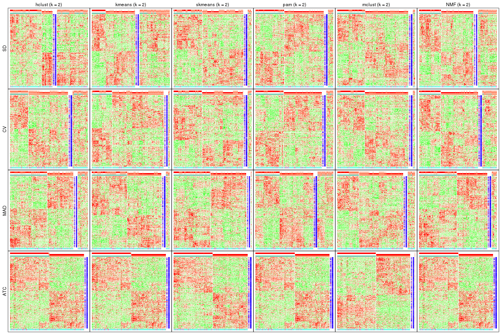</p>

</div>
<div id='tab-collect-get-signatures-2'>
<pre><code class="r">collect_plots(res_list, k = 3, fun = get_signatures, mc.cores = 4)
</code></pre>

<p>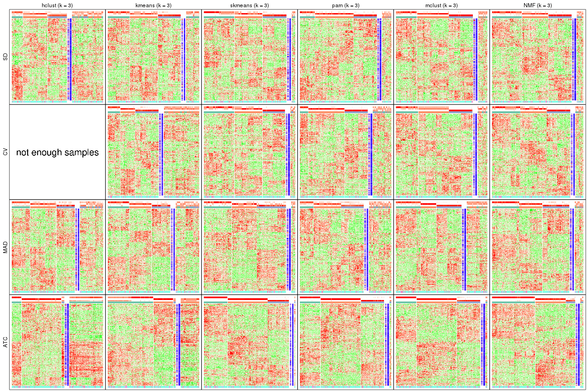</p>

</div>
<div id='tab-collect-get-signatures-3'>
<pre><code class="r">collect_plots(res_list, k = 4, fun = get_signatures, mc.cores = 4)
</code></pre>

<p>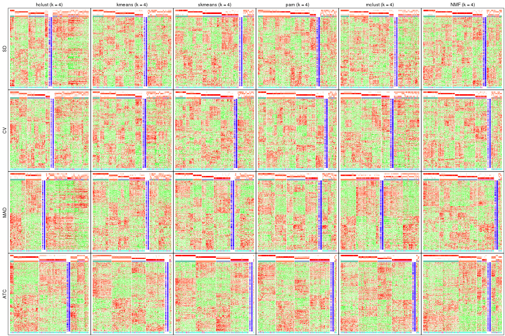</p>

</div>
<div id='tab-collect-get-signatures-4'>
<pre><code class="r">collect_plots(res_list, k = 5, fun = get_signatures, mc.cores = 4)
</code></pre>

<p>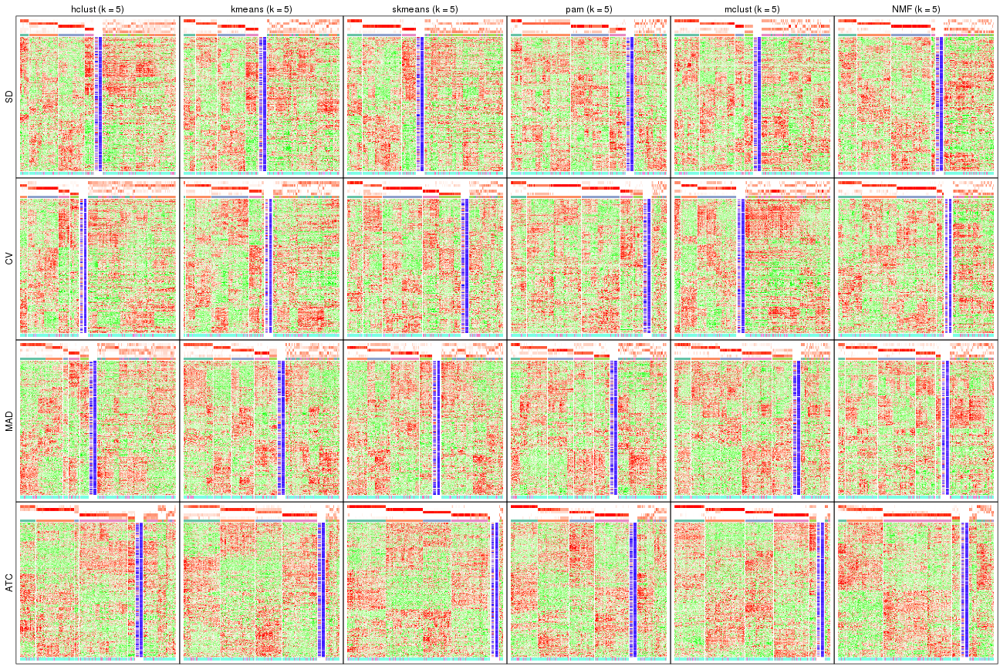</p>

</div>
<div id='tab-collect-get-signatures-5'>
<pre><code class="r">collect_plots(res_list, k = 6, fun = get_signatures, mc.cores = 4)
</code></pre>

<p>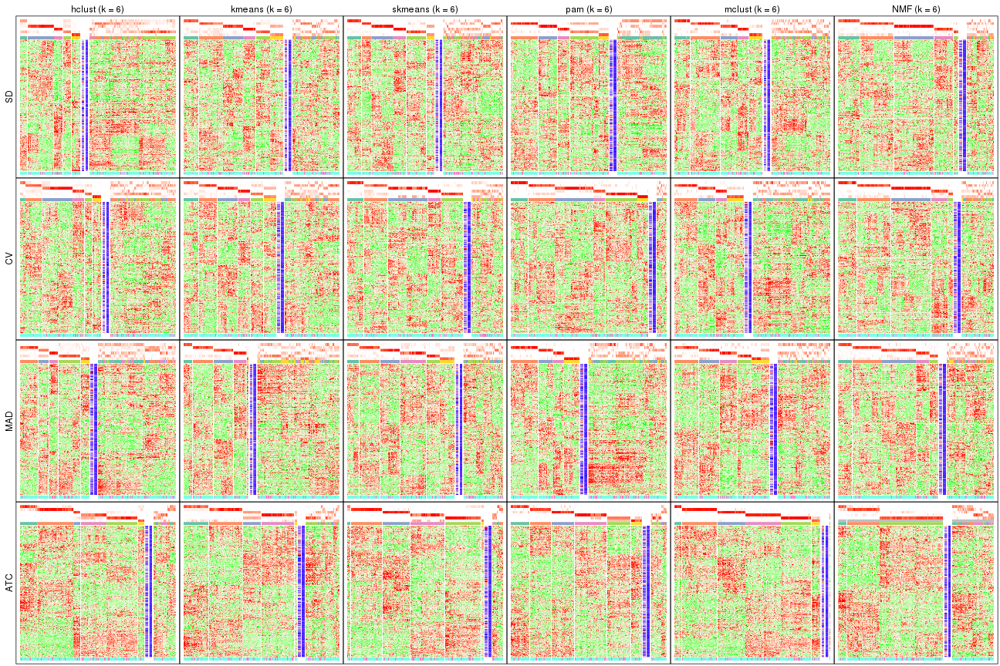</p>

</div>
</div>


### Statistics table

The statistics used for measuring the stability of consensus partitioning.
([How are they
defined?](http://bioconductor.org/packages/devel/bioc/vignettes/cola/inst/doc/cola.html#toc_13))


<script>
$( function() {
	$( '#tabs-get-stats-from-consensus-partition-list' ).tabs();
} );
</script>
<div id='tabs-get-stats-from-consensus-partition-list'>
<ul>
<li><a href='#tab-get-stats-from-consensus-partition-list-1'>k = 2</a></li>
<li><a href='#tab-get-stats-from-consensus-partition-list-2'>k = 3</a></li>
<li><a href='#tab-get-stats-from-consensus-partition-list-3'>k = 4</a></li>
<li><a href='#tab-get-stats-from-consensus-partition-list-4'>k = 5</a></li>
<li><a href='#tab-get-stats-from-consensus-partition-list-5'>k = 6</a></li>
</ul>
<div id='tab-get-stats-from-consensus-partition-list-1'>
<pre><code class="r">get_stats(res_list, k = 2)
</code></pre>

<pre><code>#&gt;             k  1-PAC mean_silhouette concordance area_increased  Rand Jaccard
#&gt; SD:NMF      2 0.4544           0.661       0.864          0.474 0.519   0.519
#&gt; CV:NMF      2 0.5429           0.732       0.884          0.469 0.546   0.546
#&gt; MAD:NMF     2 0.4903           0.806       0.896          0.495 0.501   0.501
#&gt; ATC:NMF     2 1.0000           1.000       1.000          0.501 0.500   0.500
#&gt; SD:skmeans  2 0.4920           0.621       0.802          0.493 0.512   0.512
#&gt; CV:skmeans  2 0.4940           0.683       0.837          0.493 0.510   0.510
#&gt; MAD:skmeans 2 0.5111           0.857       0.905          0.500 0.498   0.498
#&gt; ATC:skmeans 2 1.0000           0.995       0.998          0.502 0.499   0.499
#&gt; SD:mclust   2 0.4858           0.854       0.913          0.453 0.519   0.519
#&gt; CV:mclust   2 0.6785           0.864       0.929          0.457 0.526   0.526
#&gt; MAD:mclust  2 0.4194           0.644       0.823          0.462 0.556   0.556
#&gt; ATC:mclust  2 1.0000           0.995       0.998          0.501 0.499   0.499
#&gt; SD:kmeans   2 0.2278           0.523       0.767          0.458 0.546   0.546
#&gt; CV:kmeans   2 0.2827           0.658       0.790          0.445 0.591   0.591
#&gt; MAD:kmeans  2 0.3024           0.716       0.821          0.481 0.498   0.498
#&gt; ATC:kmeans  2 1.0000           0.997       0.999          0.501 0.500   0.500
#&gt; SD:pam      2 0.5776           0.808       0.918          0.487 0.512   0.512
#&gt; CV:pam      2 0.6016           0.819       0.923          0.485 0.507   0.507
#&gt; MAD:pam     2 0.2538           0.614       0.777          0.492 0.512   0.512
#&gt; ATC:pam     2 1.0000           1.000       1.000          0.501 0.500   0.500
#&gt; SD:hclust   2 0.1316           0.504       0.759          0.429 0.582   0.582
#&gt; CV:hclust   2 0.0849           0.500       0.668          0.434 0.540   0.540
#&gt; MAD:hclust  2 0.1743           0.699       0.820          0.446 0.517   0.517
#&gt; ATC:hclust  2 1.0000           0.988       0.995          0.501 0.500   0.500
</code></pre>

</div>
<div id='tab-get-stats-from-consensus-partition-list-2'>
<pre><code class="r">get_stats(res_list, k = 3)
</code></pre>

<pre><code>#&gt;             k 1-PAC mean_silhouette concordance area_increased  Rand Jaccard
#&gt; SD:NMF      3 0.593           0.736       0.851          0.404 0.702   0.482
#&gt; CV:NMF      3 0.643           0.651       0.826          0.421 0.721   0.518
#&gt; MAD:NMF     3 0.576           0.750       0.873          0.348 0.690   0.457
#&gt; ATC:NMF     3 0.857           0.896       0.937          0.188 0.891   0.785
#&gt; SD:skmeans  3 0.529           0.700       0.816          0.352 0.694   0.468
#&gt; CV:skmeans  3 0.704           0.709       0.836          0.350 0.699   0.474
#&gt; MAD:skmeans 3 0.477           0.647       0.791          0.339 0.707   0.477
#&gt; ATC:skmeans 3 1.000           0.977       0.987          0.281 0.853   0.707
#&gt; SD:mclust   3 0.698           0.775       0.888          0.414 0.740   0.538
#&gt; CV:mclust   3 0.749           0.759       0.888          0.410 0.741   0.539
#&gt; MAD:mclust  3 0.575           0.640       0.837          0.388 0.729   0.533
#&gt; ATC:mclust  3 0.940           0.943       0.963          0.274 0.853   0.706
#&gt; SD:kmeans   3 0.466           0.611       0.747          0.423 0.700   0.491
#&gt; CV:kmeans   3 0.450           0.514       0.752          0.443 0.763   0.606
#&gt; MAD:kmeans  3 0.428           0.581       0.763          0.381 0.704   0.473
#&gt; ATC:kmeans  3 0.699           0.485       0.783          0.239 0.977   0.955
#&gt; SD:pam      3 0.520           0.755       0.877          0.278 0.746   0.562
#&gt; CV:pam      3 0.612           0.702       0.874          0.258 0.794   0.619
#&gt; MAD:pam     3 0.317           0.510       0.695          0.319 0.724   0.516
#&gt; ATC:pam     3 0.978           0.955       0.980          0.284 0.858   0.716
#&gt; SD:hclust   3 0.179           0.532       0.697          0.423 0.716   0.533
#&gt; CV:hclust   3 0.196           0.388       0.641          0.387 0.713   0.520
#&gt; MAD:hclust  3 0.230           0.568       0.734          0.427 0.812   0.640
#&gt; ATC:hclust  3 0.749           0.558       0.855          0.182 0.969   0.938
</code></pre>

</div>
<div id='tab-get-stats-from-consensus-partition-list-3'>
<pre><code class="r">get_stats(res_list, k = 4)
</code></pre>

<pre><code>#&gt;             k 1-PAC mean_silhouette concordance area_increased  Rand Jaccard
#&gt; SD:NMF      4 0.709           0.674       0.847          0.118 0.808   0.505
#&gt; CV:NMF      4 0.721           0.724       0.864          0.116 0.807   0.506
#&gt; MAD:NMF     4 0.754           0.819       0.901          0.125 0.774   0.438
#&gt; ATC:NMF     4 0.689           0.725       0.854          0.098 0.908   0.787
#&gt; SD:skmeans  4 0.746           0.720       0.867          0.118 0.814   0.517
#&gt; CV:skmeans  4 0.701           0.668       0.837          0.119 0.878   0.655
#&gt; MAD:skmeans 4 0.648           0.606       0.822          0.121 0.765   0.425
#&gt; ATC:skmeans 4 0.887           0.961       0.947          0.142 0.894   0.702
#&gt; SD:mclust   4 0.644           0.627       0.788          0.145 0.829   0.557
#&gt; CV:mclust   4 0.663           0.565       0.785          0.128 0.855   0.612
#&gt; MAD:mclust  4 0.578           0.489       0.675          0.147 0.742   0.413
#&gt; ATC:mclust  4 0.791           0.857       0.916          0.165 0.881   0.672
#&gt; SD:kmeans   4 0.540           0.563       0.745          0.121 0.789   0.479
#&gt; CV:kmeans   4 0.557           0.589       0.738          0.126 0.862   0.650
#&gt; MAD:kmeans  4 0.492           0.530       0.739          0.117 0.795   0.476
#&gt; ATC:kmeans  4 0.678           0.840       0.805          0.128 0.755   0.497
#&gt; SD:pam      4 0.611           0.619       0.785          0.139 0.880   0.706
#&gt; CV:pam      4 0.693           0.748       0.850          0.136 0.844   0.627
#&gt; MAD:pam     4 0.500           0.593       0.703          0.138 0.810   0.523
#&gt; ATC:pam     4 0.785           0.874       0.894          0.142 0.892   0.699
#&gt; SD:hclust   4 0.339           0.496       0.683          0.129 0.963   0.894
#&gt; CV:hclust   4 0.294           0.501       0.693          0.137 0.853   0.640
#&gt; MAD:hclust  4 0.362           0.430       0.667          0.121 0.919   0.764
#&gt; ATC:hclust  4 0.633           0.535       0.768          0.113 0.955   0.905
</code></pre>

</div>
<div id='tab-get-stats-from-consensus-partition-list-4'>
<pre><code class="r">get_stats(res_list, k = 5)
</code></pre>

<pre><code>#&gt;             k 1-PAC mean_silhouette concordance area_increased  Rand Jaccard
#&gt; SD:NMF      5 0.703           0.626       0.796         0.0474 0.895   0.635
#&gt; CV:NMF      5 0.727           0.667       0.813         0.0490 0.919   0.705
#&gt; MAD:NMF     5 0.658           0.593       0.762         0.0543 0.849   0.507
#&gt; ATC:NMF     5 0.638           0.687       0.822         0.0528 0.931   0.822
#&gt; SD:skmeans  5 0.700           0.459       0.713         0.0602 0.849   0.504
#&gt; CV:skmeans  5 0.718           0.658       0.806         0.0597 0.869   0.556
#&gt; MAD:skmeans 5 0.600           0.485       0.677         0.0594 0.908   0.670
#&gt; ATC:skmeans 5 0.947           0.886       0.937         0.0511 0.976   0.908
#&gt; SD:mclust   5 0.583           0.398       0.666         0.0520 0.868   0.574
#&gt; CV:mclust   5 0.623           0.379       0.682         0.0596 0.863   0.568
#&gt; MAD:mclust  5 0.617           0.613       0.762         0.0578 0.809   0.441
#&gt; ATC:mclust  5 0.834           0.832       0.911         0.0354 0.907   0.675
#&gt; SD:kmeans   5 0.606           0.468       0.676         0.0612 0.934   0.775
#&gt; CV:kmeans   5 0.611           0.500       0.689         0.0699 0.884   0.632
#&gt; MAD:kmeans  5 0.556           0.502       0.686         0.0629 0.909   0.671
#&gt; ATC:kmeans  5 0.595           0.738       0.776         0.0655 0.950   0.814
#&gt; SD:pam      5 0.692           0.566       0.698         0.0708 0.919   0.758
#&gt; CV:pam      5 0.735           0.709       0.798         0.0726 0.942   0.821
#&gt; MAD:pam     5 0.631           0.566       0.728         0.0642 0.871   0.561
#&gt; ATC:pam     5 0.717           0.647       0.776         0.0602 0.958   0.837
#&gt; SD:hclust   5 0.457           0.500       0.672         0.0807 0.894   0.695
#&gt; CV:hclust   5 0.424           0.444       0.668         0.0841 0.810   0.489
#&gt; MAD:hclust  5 0.454           0.430       0.622         0.0742 0.930   0.756
#&gt; ATC:hclust  5 0.602           0.577       0.747         0.0874 0.882   0.725
</code></pre>

</div>
<div id='tab-get-stats-from-consensus-partition-list-5'>
<pre><code class="r">get_stats(res_list, k = 6)
</code></pre>

<pre><code>#&gt;             k 1-PAC mean_silhouette concordance area_increased  Rand Jaccard
#&gt; SD:NMF      6 0.783           0.673       0.797         0.0298 0.912   0.668
#&gt; CV:NMF      6 0.771           0.644       0.791         0.0311 0.920   0.690
#&gt; MAD:NMF     6 0.669           0.546       0.730         0.0337 0.918   0.668
#&gt; ATC:NMF     6 0.582           0.609       0.763         0.0530 0.974   0.926
#&gt; SD:skmeans  6 0.704           0.496       0.728         0.0420 0.875   0.507
#&gt; CV:skmeans  6 0.723           0.607       0.759         0.0393 0.974   0.879
#&gt; MAD:skmeans 6 0.662           0.580       0.736         0.0424 0.892   0.562
#&gt; ATC:skmeans 6 0.866           0.785       0.871         0.0316 0.989   0.955
#&gt; SD:mclust   6 0.630           0.468       0.726         0.0561 0.840   0.437
#&gt; CV:mclust   6 0.650           0.442       0.693         0.0545 0.831   0.427
#&gt; MAD:mclust  6 0.634           0.506       0.711         0.0474 0.909   0.607
#&gt; ATC:mclust  6 0.955           0.931       0.952         0.0307 0.969   0.865
#&gt; SD:kmeans   6 0.647           0.515       0.680         0.0498 0.852   0.488
#&gt; CV:kmeans   6 0.649           0.464       0.658         0.0449 0.898   0.609
#&gt; MAD:kmeans  6 0.621           0.475       0.648         0.0431 0.850   0.435
#&gt; ATC:kmeans  6 0.712           0.609       0.735         0.0594 0.953   0.809
#&gt; SD:pam      6 0.709           0.582       0.663         0.0565 0.813   0.433
#&gt; CV:pam      6 0.785           0.808       0.871         0.0810 0.905   0.668
#&gt; MAD:pam     6 0.656           0.439       0.700         0.0424 0.856   0.442
#&gt; ATC:pam     6 0.800           0.727       0.861         0.0558 0.890   0.571
#&gt; SD:hclust   6 0.566           0.492       0.653         0.0541 0.931   0.757
#&gt; CV:hclust   6 0.537           0.492       0.673         0.0565 0.868   0.559
#&gt; MAD:hclust  6 0.523           0.404       0.606         0.0470 0.875   0.531
#&gt; ATC:hclust  6 0.651           0.661       0.810         0.0765 0.854   0.567
</code></pre>

</div>
</div>

Following heatmap plots the partition for each combination of methods and the
lightness correspond to the silhouette scores for samples in each method. On
top the consensus subgroup is inferred from all methods by taking the mean
silhouette scores as weight.


<script>
$( function() {
	$( '#tabs-collect-stats-from-consensus-partition-list' ).tabs();
} );
</script>
<div id='tabs-collect-stats-from-consensus-partition-list'>
<ul>
<li><a href='#tab-collect-stats-from-consensus-partition-list-1'>k = 2</a></li>
<li><a href='#tab-collect-stats-from-consensus-partition-list-2'>k = 3</a></li>
<li><a href='#tab-collect-stats-from-consensus-partition-list-3'>k = 4</a></li>
<li><a href='#tab-collect-stats-from-consensus-partition-list-4'>k = 5</a></li>
<li><a href='#tab-collect-stats-from-consensus-partition-list-5'>k = 6</a></li>
</ul>
<div id='tab-collect-stats-from-consensus-partition-list-1'>
<pre><code class="r">collect_stats(res_list, k = 2)
</code></pre>

<p>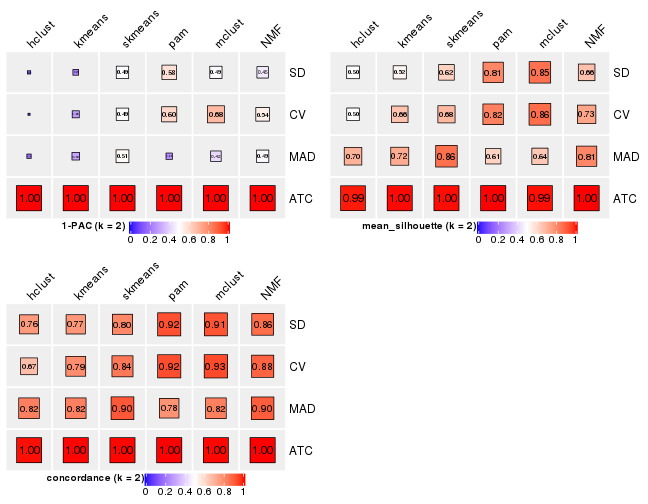</p>

</div>
<div id='tab-collect-stats-from-consensus-partition-list-2'>
<pre><code class="r">collect_stats(res_list, k = 3)
</code></pre>

<p>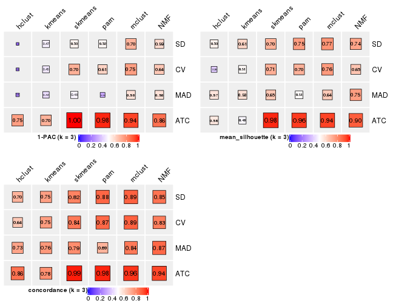</p>

</div>
<div id='tab-collect-stats-from-consensus-partition-list-3'>
<pre><code class="r">collect_stats(res_list, k = 4)
</code></pre>

<p>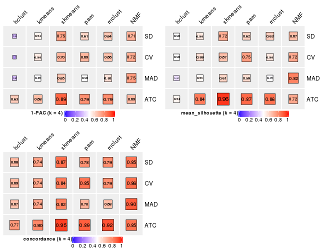</p>

</div>
<div id='tab-collect-stats-from-consensus-partition-list-4'>
<pre><code class="r">collect_stats(res_list, k = 5)
</code></pre>

<p>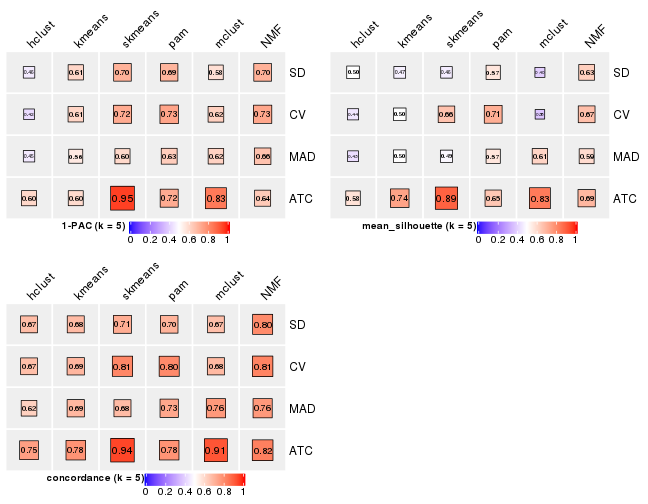</p>

</div>
<div id='tab-collect-stats-from-consensus-partition-list-5'>
<pre><code class="r">collect_stats(res_list, k = 6)
</code></pre>

<p>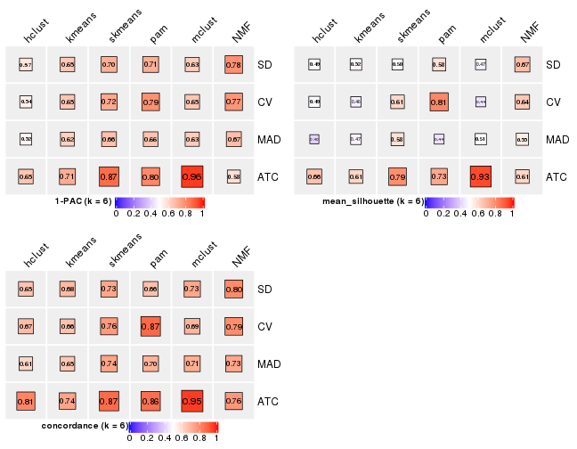</p>

</div>
</div>

### Partition from all methods


Collect partitions from all methods:


<script>
$( function() {
	$( '#tabs-collect-classes-from-consensus-partition-list' ).tabs();
} );
</script>
<div id='tabs-collect-classes-from-consensus-partition-list'>
<ul>
<li><a href='#tab-collect-classes-from-consensus-partition-list-1'>k = 2</a></li>
<li><a href='#tab-collect-classes-from-consensus-partition-list-2'>k = 3</a></li>
<li><a href='#tab-collect-classes-from-consensus-partition-list-3'>k = 4</a></li>
<li><a href='#tab-collect-classes-from-consensus-partition-list-4'>k = 5</a></li>
<li><a href='#tab-collect-classes-from-consensus-partition-list-5'>k = 6</a></li>
</ul>
<div id='tab-collect-classes-from-consensus-partition-list-1'>
<pre><code class="r">collect_classes(res_list, k = 2)
</code></pre>

<p>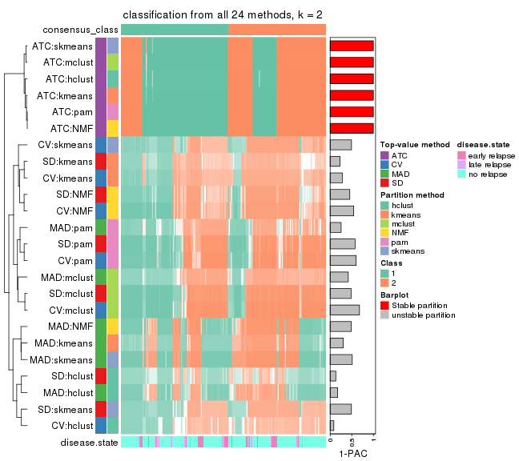</p>

</div>
<div id='tab-collect-classes-from-consensus-partition-list-2'>
<pre><code class="r">collect_classes(res_list, k = 3)
</code></pre>

<p>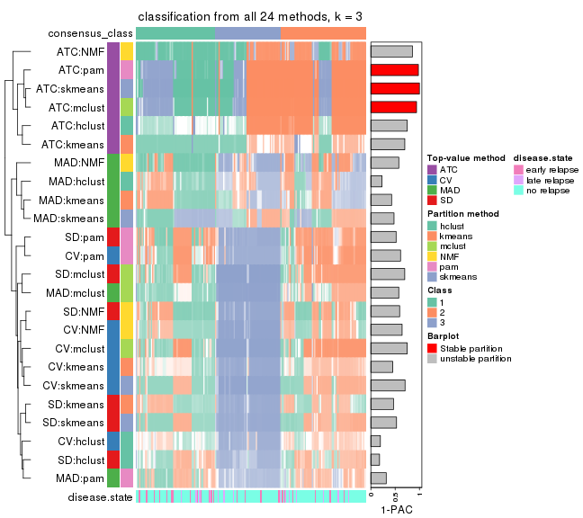</p>

</div>
<div id='tab-collect-classes-from-consensus-partition-list-3'>
<pre><code class="r">collect_classes(res_list, k = 4)
</code></pre>

<p>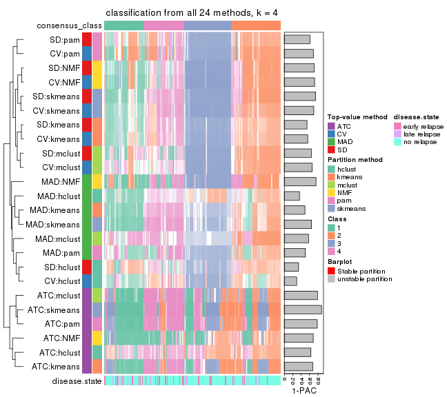</p>

</div>
<div id='tab-collect-classes-from-consensus-partition-list-4'>
<pre><code class="r">collect_classes(res_list, k = 5)
</code></pre>

<p>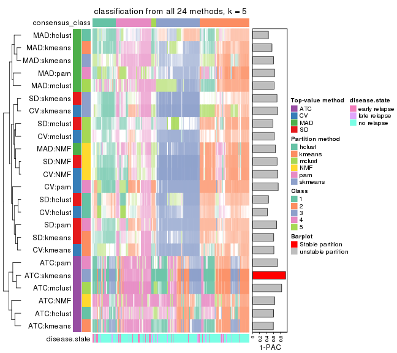</p>

</div>
<div id='tab-collect-classes-from-consensus-partition-list-5'>
<pre><code class="r">collect_classes(res_list, k = 6)
</code></pre>

<p>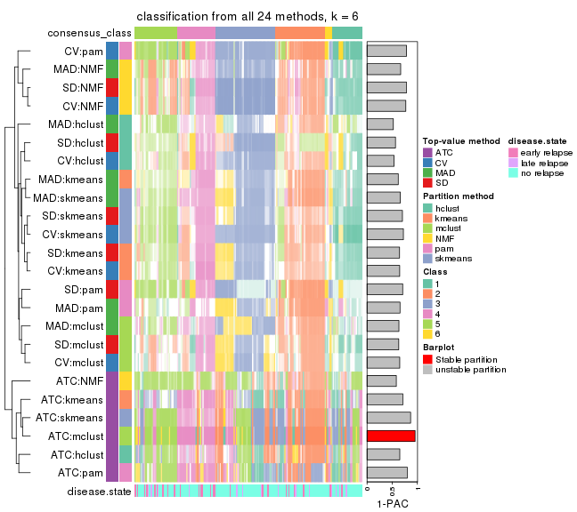</p>

</div>
</div>


### Top rows overlap


Overlap of top rows from different top-row methods:


<script>
$( function() {
	$( '#tabs-top-rows-overlap-by-euler' ).tabs();
} );
</script>
<div id='tabs-top-rows-overlap-by-euler'>
<ul>
<li><a href='#tab-top-rows-overlap-by-euler-1'>top_n = 1000</a></li>
<li><a href='#tab-top-rows-overlap-by-euler-2'>top_n = 2000</a></li>
<li><a href='#tab-top-rows-overlap-by-euler-3'>top_n = 3000</a></li>
<li><a href='#tab-top-rows-overlap-by-euler-4'>top_n = 4000</a></li>
<li><a href='#tab-top-rows-overlap-by-euler-5'>top_n = 5000</a></li>
</ul>
<div id='tab-top-rows-overlap-by-euler-1'>
<pre><code class="r">top_rows_overlap(res_list, top_n = 1000, method = &quot;euler&quot;)
</code></pre>

<p>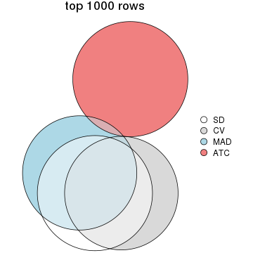</p>

</div>
<div id='tab-top-rows-overlap-by-euler-2'>
<pre><code class="r">top_rows_overlap(res_list, top_n = 2000, method = &quot;euler&quot;)
</code></pre>

<p>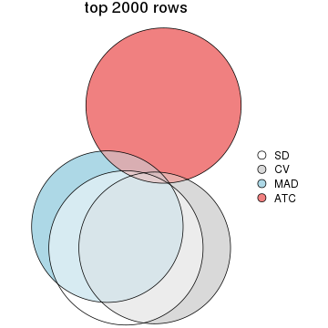</p>

</div>
<div id='tab-top-rows-overlap-by-euler-3'>
<pre><code class="r">top_rows_overlap(res_list, top_n = 3000, method = &quot;euler&quot;)
</code></pre>

<p>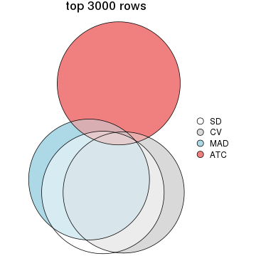</p>

</div>
<div id='tab-top-rows-overlap-by-euler-4'>
<pre><code class="r">top_rows_overlap(res_list, top_n = 4000, method = &quot;euler&quot;)
</code></pre>

<p>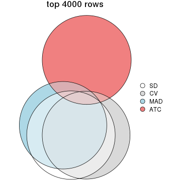</p>

</div>
<div id='tab-top-rows-overlap-by-euler-5'>
<pre><code class="r">top_rows_overlap(res_list, top_n = 5000, method = &quot;euler&quot;)
</code></pre>

<p>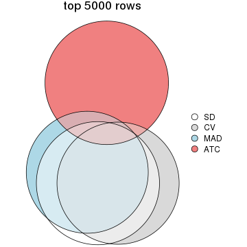</p>

</div>
</div>

Also visualize the correspondance of rankings between different top-row methods:


<script>
$( function() {
	$( '#tabs-top-rows-overlap-by-correspondance' ).tabs();
} );
</script>
<div id='tabs-top-rows-overlap-by-correspondance'>
<ul>
<li><a href='#tab-top-rows-overlap-by-correspondance-1'>top_n = 1000</a></li>
<li><a href='#tab-top-rows-overlap-by-correspondance-2'>top_n = 2000</a></li>
<li><a href='#tab-top-rows-overlap-by-correspondance-3'>top_n = 3000</a></li>
<li><a href='#tab-top-rows-overlap-by-correspondance-4'>top_n = 4000</a></li>
<li><a href='#tab-top-rows-overlap-by-correspondance-5'>top_n = 5000</a></li>
</ul>
<div id='tab-top-rows-overlap-by-correspondance-1'>
<pre><code class="r">top_rows_overlap(res_list, top_n = 1000, method = &quot;correspondance&quot;)
</code></pre>

<p>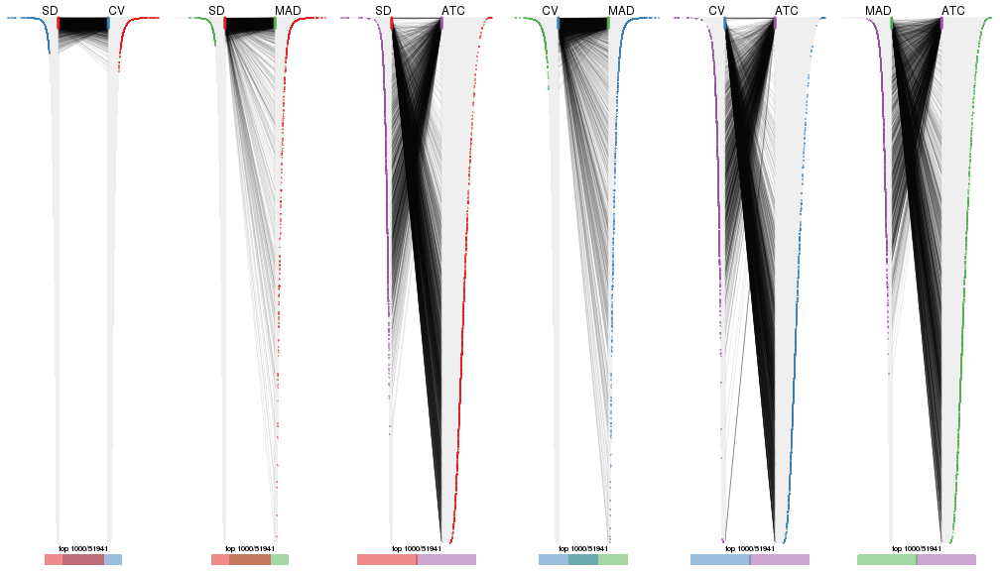</p>

</div>
<div id='tab-top-rows-overlap-by-correspondance-2'>
<pre><code class="r">top_rows_overlap(res_list, top_n = 2000, method = &quot;correspondance&quot;)
</code></pre>

<p>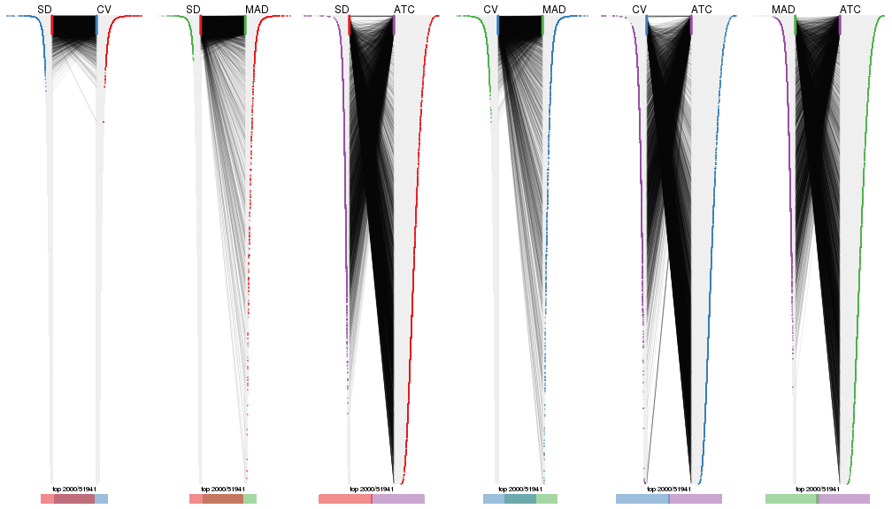</p>

</div>
<div id='tab-top-rows-overlap-by-correspondance-3'>
<pre><code class="r">top_rows_overlap(res_list, top_n = 3000, method = &quot;correspondance&quot;)
</code></pre>

<p>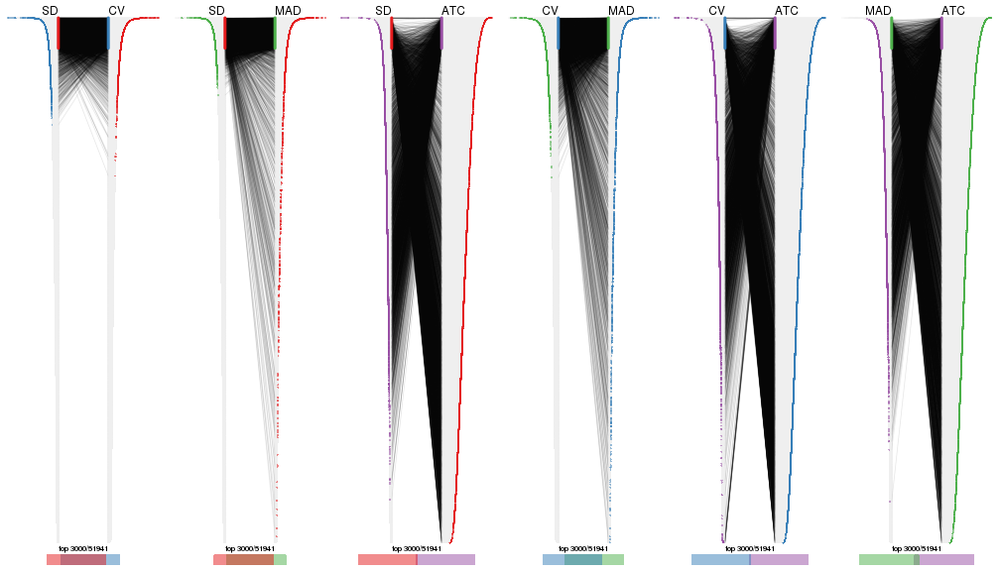</p>

</div>
<div id='tab-top-rows-overlap-by-correspondance-4'>
<pre><code class="r">top_rows_overlap(res_list, top_n = 4000, method = &quot;correspondance&quot;)
</code></pre>

<p>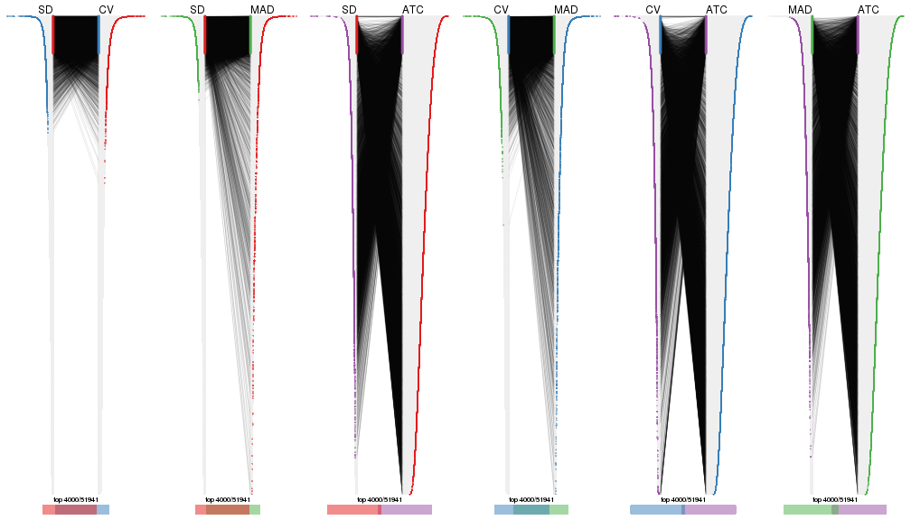</p>

</div>
<div id='tab-top-rows-overlap-by-correspondance-5'>
<pre><code class="r">top_rows_overlap(res_list, top_n = 5000, method = &quot;correspondance&quot;)
</code></pre>

<p>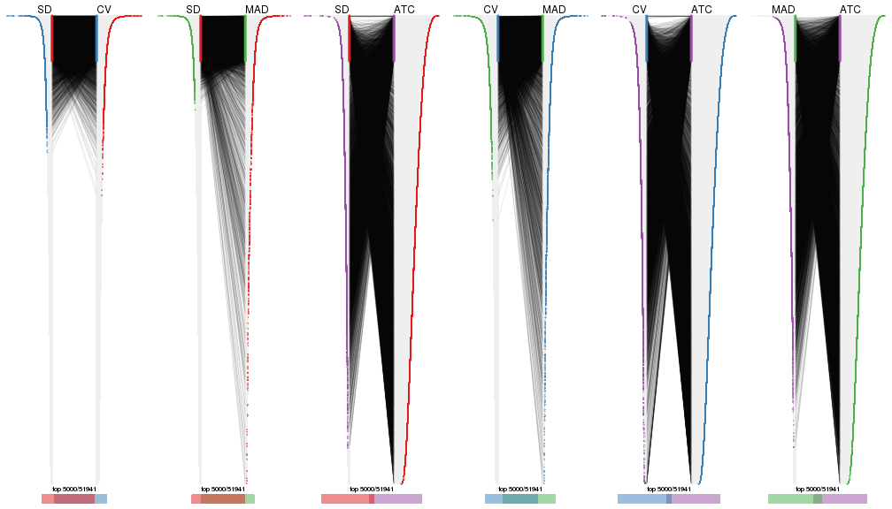</p>

</div>
</div>


Heatmaps of the top rows:


<script>
$( function() {
	$( '#tabs-top-rows-heatmap' ).tabs();
} );
</script>
<div id='tabs-top-rows-heatmap'>
<ul>
<li><a href='#tab-top-rows-heatmap-1'>top_n = 1000</a></li>
<li><a href='#tab-top-rows-heatmap-2'>top_n = 2000</a></li>
<li><a href='#tab-top-rows-heatmap-3'>top_n = 3000</a></li>
<li><a href='#tab-top-rows-heatmap-4'>top_n = 4000</a></li>
<li><a href='#tab-top-rows-heatmap-5'>top_n = 5000</a></li>
</ul>
<div id='tab-top-rows-heatmap-1'>
<pre><code class="r">top_rows_heatmap(res_list, top_n = 1000)
</code></pre>

<p>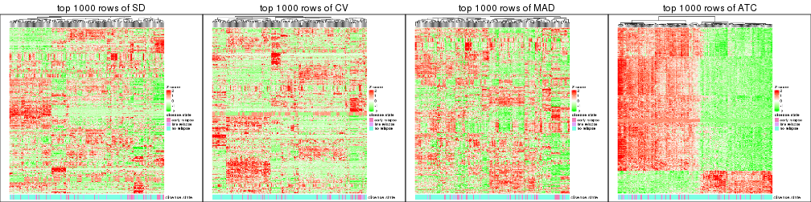</p>

</div>
<div id='tab-top-rows-heatmap-2'>
<pre><code class="r">top_rows_heatmap(res_list, top_n = 2000)
</code></pre>

<p>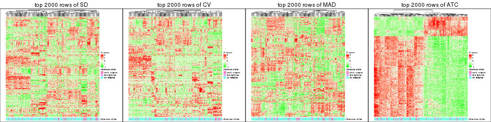</p>

</div>
<div id='tab-top-rows-heatmap-3'>
<pre><code class="r">top_rows_heatmap(res_list, top_n = 3000)
</code></pre>

<p>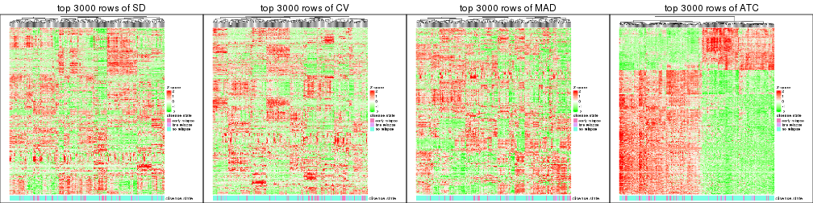</p>

</div>
<div id='tab-top-rows-heatmap-4'>
<pre><code class="r">top_rows_heatmap(res_list, top_n = 4000)
</code></pre>

<p>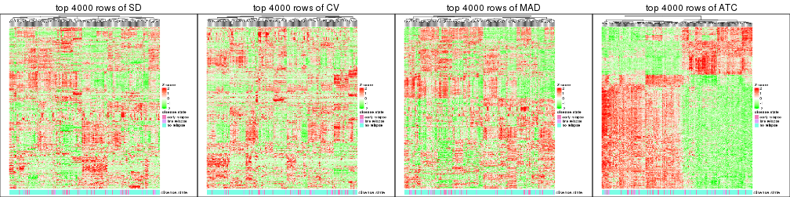</p>

</div>
<div id='tab-top-rows-heatmap-5'>
<pre><code class="r">top_rows_heatmap(res_list, top_n = 5000)
</code></pre>

<p>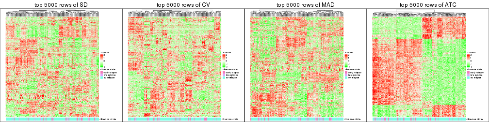</p>

</div>
</div>


### Test to known annotations


Test correlation between subgroups and known annotations. If the known
annotation is numeric, one-way ANOVA test is applied, and if the known
annotation is discrete, chi-squared contingency table test is applied.


<script>
$( function() {
	$( '#tabs-test-to-known-factors-from-consensus-partition-list' ).tabs();
} );
</script>
<div id='tabs-test-to-known-factors-from-consensus-partition-list'>
<ul>
<li><a href='#tab-test-to-known-factors-from-consensus-partition-list-1'>k = 2</a></li>
<li><a href='#tab-test-to-known-factors-from-consensus-partition-list-2'>k = 3</a></li>
<li><a href='#tab-test-to-known-factors-from-consensus-partition-list-3'>k = 4</a></li>
<li><a href='#tab-test-to-known-factors-from-consensus-partition-list-4'>k = 5</a></li>
<li><a href='#tab-test-to-known-factors-from-consensus-partition-list-5'>k = 6</a></li>
</ul>
<div id='tab-test-to-known-factors-from-consensus-partition-list-1'>
<pre><code class="r">test_to_known_factors(res_list, k = 2)
</code></pre>

<pre><code>#&gt;               n disease.state(p) k
#&gt; SD:NMF      146            0.219 2
#&gt; CV:NMF      158            0.177 2
#&gt; MAD:NMF     183            0.272 2
#&gt; ATC:NMF     197            0.193 2
#&gt; SD:skmeans  187            0.424 2
#&gt; CV:skmeans  187            0.617 2
#&gt; MAD:skmeans 195            0.394 2
#&gt; ATC:skmeans 197            0.171 2
#&gt; SD:mclust   191            0.174 2
#&gt; CV:mclust   191            0.197 2
#&gt; MAD:mclust  177            0.358 2
#&gt; ATC:mclust  196            0.182 2
#&gt; SD:kmeans   116            0.376 2
#&gt; CV:kmeans   193            0.561 2
#&gt; MAD:kmeans  187            0.397 2
#&gt; ATC:kmeans  197            0.193 2
#&gt; SD:pam      183            0.506 2
#&gt; CV:pam      178            0.644 2
#&gt; MAD:pam     155            0.529 2
#&gt; ATC:pam     197            0.193 2
#&gt; SD:hclust   114            0.240 2
#&gt; CV:hclust   156            0.507 2
#&gt; MAD:hclust  170            0.279 2
#&gt; ATC:hclust  197            0.193 2
</code></pre>

</div>
<div id='tab-test-to-known-factors-from-consensus-partition-list-2'>
<pre><code class="r">test_to_known_factors(res_list, k = 3)
</code></pre>

<pre><code>#&gt;               n disease.state(p) k
#&gt; SD:NMF      182           0.5108 3
#&gt; CV:NMF      179           0.7997 3
#&gt; MAD:NMF     177           0.1561 3
#&gt; ATC:NMF     190           0.3537 3
#&gt; SD:skmeans  189           0.2016 3
#&gt; CV:skmeans  186           0.2047 3
#&gt; MAD:skmeans 188           0.1622 3
#&gt; ATC:skmeans 195           0.0751 3
#&gt; SD:mclust   176           0.1939 3
#&gt; CV:mclust   175           0.1612 3
#&gt; MAD:mclust  150           0.0208 3
#&gt; ATC:mclust  193           0.1301 3
#&gt; SD:kmeans   167           0.3873 3
#&gt; CV:kmeans   116           0.6683 3
#&gt; MAD:kmeans  143           0.0632 3
#&gt; ATC:kmeans  155           0.4585 3
#&gt; SD:pam      176           0.3807 3
#&gt; CV:pam      155           0.2700 3
#&gt; MAD:pam     146           0.2647 3
#&gt; ATC:pam     193           0.0382 3
#&gt; SD:hclust   126           0.3454 3
#&gt; CV:hclust    49               NA 3
#&gt; MAD:hclust  144           0.5041 3
#&gt; ATC:hclust  120           0.1056 3
</code></pre>

</div>
<div id='tab-test-to-known-factors-from-consensus-partition-list-3'>
<pre><code class="r">test_to_known_factors(res_list, k = 4)
</code></pre>

<pre><code>#&gt;               n disease.state(p) k
#&gt; SD:NMF      157           0.2347 4
#&gt; CV:NMF      169           0.3134 4
#&gt; MAD:NMF     188           0.2379 4
#&gt; ATC:NMF     169           0.1876 4
#&gt; SD:skmeans  168           0.0664 4
#&gt; CV:skmeans  154           0.1304 4
#&gt; MAD:skmeans 146           0.1580 4
#&gt; ATC:skmeans 195           0.1914 4
#&gt; SD:mclust   141           0.0789 4
#&gt; CV:mclust   131           0.9764 4
#&gt; MAD:mclust  103           0.1611 4
#&gt; ATC:mclust  189           0.3210 4
#&gt; SD:kmeans   134           0.3146 4
#&gt; CV:kmeans   131           0.0319 4
#&gt; MAD:kmeans  139           0.2853 4
#&gt; ATC:kmeans  191           0.1536 4
#&gt; SD:pam      154           0.8825 4
#&gt; CV:pam      175           0.2893 4
#&gt; MAD:pam     159           0.4347 4
#&gt; ATC:pam     191           0.0914 4
#&gt; SD:hclust   101           0.9414 4
#&gt; CV:hclust   106           0.9922 4
#&gt; MAD:hclust   83           0.6062 4
#&gt; ATC:hclust  149           0.2829 4
</code></pre>

</div>
<div id='tab-test-to-known-factors-from-consensus-partition-list-4'>
<pre><code class="r">test_to_known_factors(res_list, k = 5)
</code></pre>

<pre><code>#&gt;               n disease.state(p) k
#&gt; SD:NMF      130           0.2799 5
#&gt; CV:NMF      142           0.2580 5
#&gt; MAD:NMF     138           0.6440 5
#&gt; ATC:NMF     164           0.1921 5
#&gt; SD:skmeans   92           0.0138 5
#&gt; CV:skmeans  152           0.0277 5
#&gt; MAD:skmeans 114           0.4159 5
#&gt; ATC:skmeans 192           0.3280 5
#&gt; SD:mclust   105           0.6030 5
#&gt; CV:mclust    83           0.6971 5
#&gt; MAD:mclust  158           0.2730 5
#&gt; ATC:mclust  190           0.2322 5
#&gt; SD:kmeans   100           0.0324 5
#&gt; CV:kmeans   108           0.0607 5
#&gt; MAD:kmeans  125           0.6589 5
#&gt; ATC:kmeans  179           0.2566 5
#&gt; SD:pam      154           0.7702 5
#&gt; CV:pam      177           0.2026 5
#&gt; MAD:pam     132           0.0729 5
#&gt; ATC:pam     158           0.3627 5
#&gt; SD:hclust    99           0.0101 5
#&gt; CV:hclust    79           0.1108 5
#&gt; MAD:hclust   92           0.0292 5
#&gt; ATC:hclust  154           0.3373 5
</code></pre>

</div>
<div id='tab-test-to-known-factors-from-consensus-partition-list-5'>
<pre><code class="r">test_to_known_factors(res_list, k = 6)
</code></pre>

<pre><code>#&gt;               n disease.state(p) k
#&gt; SD:NMF      161          0.08791 6
#&gt; CV:NMF      154          0.02523 6
#&gt; MAD:NMF     134          0.05329 6
#&gt; ATC:NMF     141          0.17154 6
#&gt; SD:skmeans  117          0.09800 6
#&gt; CV:skmeans  155          0.07689 6
#&gt; MAD:skmeans 144          0.41788 6
#&gt; ATC:skmeans 183          0.49361 6
#&gt; SD:mclust   118          0.04578 6
#&gt; CV:mclust    93          0.04649 6
#&gt; MAD:mclust  127          0.13287 6
#&gt; ATC:mclust  196          0.20351 6
#&gt; SD:kmeans   134          0.07548 6
#&gt; CV:kmeans   124          0.09072 6
#&gt; MAD:kmeans   87          0.02447 6
#&gt; ATC:kmeans  152          0.22392 6
#&gt; SD:pam      131          0.35581 6
#&gt; CV:pam      184          0.22546 6
#&gt; MAD:pam      92          0.59818 6
#&gt; ATC:pam     176          0.44549 6
#&gt; SD:hclust    81          0.00744 6
#&gt; CV:hclust   109          0.07267 6
#&gt; MAD:hclust   93          0.01656 6
#&gt; ATC:hclust  167          0.38264 6
</code></pre>

</div>
</div>


 
## Results for each method


---------------------------------------------------


### SD:hclust


The object with results only for a single top-value method and a single partition method 
can be extracted as:

```r
res = res_list["SD", "hclust"]
# you can also extract it by
# res = res_list["SD:hclust"]
```

A summary of `res` and all the functions that can be applied to it:

```r
res
```

```
#> A 'ConsensusPartition' object with k = 2, 3, 4, 5, 6.
#>   On a matrix with 51941 rows and 197 columns.
#>   Top rows (1000, 2000, 3000, 4000, 5000) are extracted by 'SD' method.
#>   Subgroups are detected by 'hclust' method.
#>   Performed in total 1250 partitions by row resampling.
#>   Best k for subgroups seems to be 2.
#> 
#> Following methods can be applied to this 'ConsensusPartition' object:
#>  [1] "cola_report"             "collect_classes"         "collect_plots"          
#>  [4] "collect_stats"           "colnames"                "compare_signatures"     
#>  [7] "consensus_heatmap"       "dimension_reduction"     "functional_enrichment"  
#> [10] "get_anno_col"            "get_anno"                "get_classes"            
#> [13] "get_consensus"           "get_matrix"              "get_membership"         
#> [16] "get_param"               "get_signatures"          "get_stats"              
#> [19] "is_best_k"               "is_stable_k"             "membership_heatmap"     
#> [22] "ncol"                    "nrow"                    "plot_ecdf"              
#> [25] "rownames"                "select_partition_number" "show"                   
#> [28] "suggest_best_k"          "test_to_known_factors"
```

`collect_plots()` function collects all the plots made from `res` for all `k` (number of partitions)
into one single page to provide an easy and fast comparison between different `k`.

```r
collect_plots(res)
```

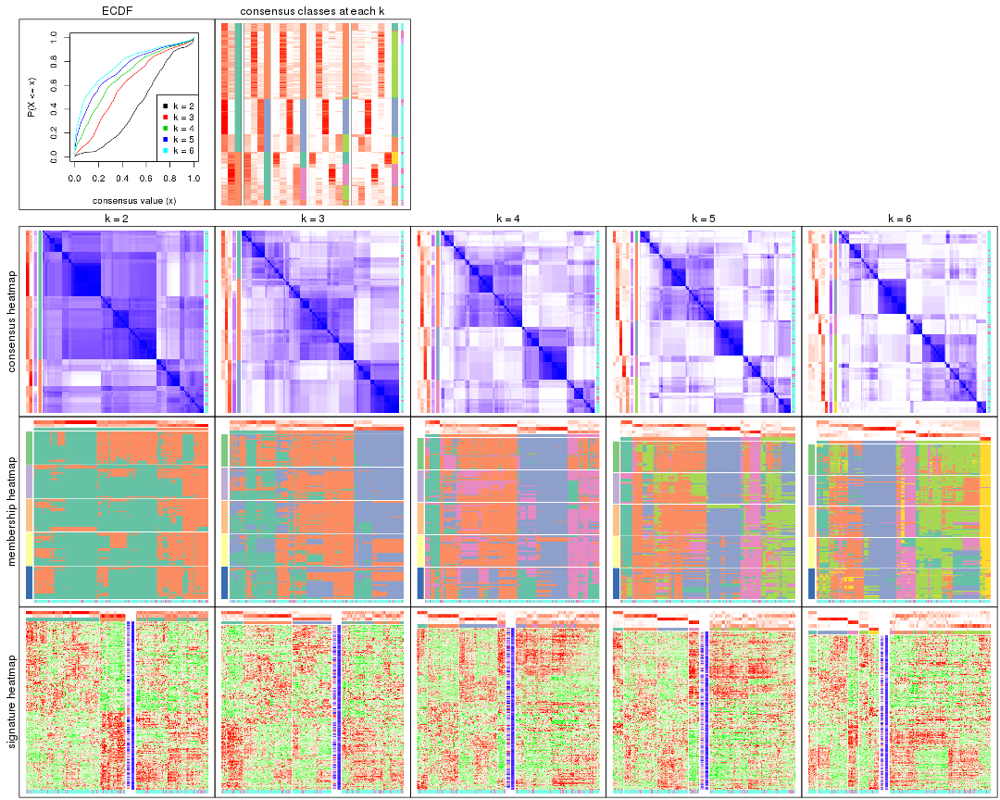

The plots are:

- The first row: a plot of the ECDF (empirical cumulative distribution
  function) curves of the consensus matrix for each `k` and the heatmap of
  predicted classes for each `k`.
- The second row: heatmaps of the consensus matrix for each `k`.
- The third row: heatmaps of the membership matrix for each `k`.
- The fouth row: heatmaps of the signatures for each `k`.

All the plots in panels can be made by individual functions and they are
plotted later in this section.

`select_partition_number()` produces several plots showing different
statistics for choosing "optimized" `k`. There are following statistics:

- ECDF curves of the consensus matrix for each `k`;
- 1-PAC. [The PAC
  score](https://en.wikipedia.org/wiki/Consensus_clustering#Over-interpretation_potential_of_consensus_clustering)
  measures the proportion of the ambiguous subgrouping.
- Mean silhouette score.
- Concordance. The mean probability of fiting the consensus class ids in all
  partitions.
- Area increased. Denote $A_k$ as the area under the ECDF curve for current
  `k`, the area increased is defined as $A_k - A_{k-1}$.
- Rand index. The percent of pairs of samples that are both in a same cluster
  or both are not in a same cluster in the partition of k and k-1.
- Jaccard index. The ratio of pairs of samples are both in a same cluster in
  the partition of k and k-1 and the pairs of samples are both in a same
  cluster in the partition k or k-1.

The detailed explanations of these statistics can be found in [the _cola_
vignette](http://bioconductor.org/packages/devel/bioc/vignettes/cola/inst/doc/cola.html#toc_13).

Generally speaking, lower PAC score, higher mean silhouette score or higher
concordance corresponds to better partition. Rand index and Jaccard index
measure how similar the current partition is compared to partition with `k-1`.
If they are too similar, we won't accept `k` is better than `k-1`.

```r
select_partition_number(res)
```

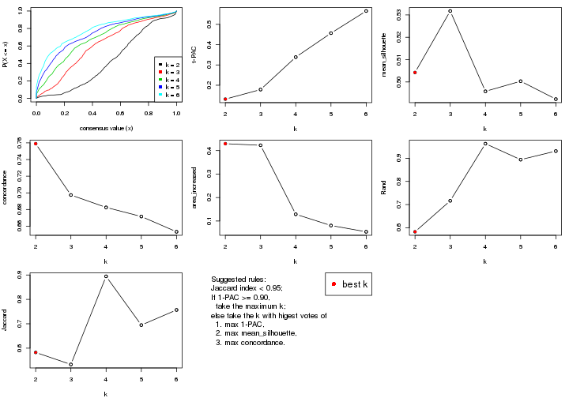

The numeric values for all these statistics can be obtained by `get_stats()`.

```r
get_stats(res)
```

```
#>   k 1-PAC mean_silhouette concordance area_increased  Rand Jaccard
#> 2 2 0.132           0.504       0.759         0.4294 0.582   0.582
#> 3 3 0.179           0.532       0.697         0.4227 0.716   0.533
#> 4 4 0.339           0.496       0.683         0.1286 0.963   0.894
#> 5 5 0.457           0.500       0.672         0.0807 0.894   0.695
#> 6 6 0.566           0.492       0.653         0.0541 0.931   0.757
```

`suggest_best_k()` suggests the best $k$ based on these statistics. The rules are as follows:

- All $k$ with Jaccard index larger than 0.95 are removed because increasing
  $k$ does not provide enough extra information. If all $k$ are removed, it is
  marked as no subgroup is detected.
- For all $k$ with 1-PAC score larger than 0.9, the maximal $k$ is taken as
  the best $k$, and other $k$ are marked as optional $k$.
- If it does not fit the second rule. The $k$ with the maximal vote of the
  highest 1-PAC score, highest mean silhouette, and highest concordance is
  taken as the best $k$.

```r
suggest_best_k(res)
```

```
#> [1] 2
```


Following shows the table of the partitions (You need to click the **show/hide
code output** link to see it). The membership matrix (columns with name `p*`)
is inferred by
[`clue::cl_consensus()`](https://www.rdocumentation.org/link/cl_consensus?package=clue)
function with the `SE` method. Basically the value in the membership matrix
represents the probability to belong to a certain group. The finall class
label for an item is determined with the group with highest probability it
belongs to.

In `get_classes()` function, the entropy is calculated from the membership
matrix and the silhouette score is calculated from the consensus matrix.


<script>
$( function() {
	$( '#tabs-SD-hclust-get-classes' ).tabs();
} );
</script>
<div id='tabs-SD-hclust-get-classes'>
<ul>
<li><a href='#tab-SD-hclust-get-classes-1'>k = 2</a></li>
<li><a href='#tab-SD-hclust-get-classes-2'>k = 3</a></li>
<li><a href='#tab-SD-hclust-get-classes-3'>k = 4</a></li>
<li><a href='#tab-SD-hclust-get-classes-4'>k = 5</a></li>
<li><a href='#tab-SD-hclust-get-classes-5'>k = 6</a></li>
</ul>

<div id='tab-SD-hclust-get-classes-1'>
<p><a id='tab-SD-hclust-get-classes-1-a' style='color:#0366d6' href='#'>show/hide code output</a></p>
<pre><code class="r">cbind(get_classes(res, k = 2), get_membership(res, k = 2))
</code></pre>

<pre><code>#&gt;           class entropy silhouette    p1    p2
#&gt; GSM342319     1  0.9996    0.30668 0.512 0.488
#&gt; GSM342323     2  0.1843    0.62569 0.028 0.972
#&gt; GSM342325     1  0.8327    0.62910 0.736 0.264
#&gt; GSM342326     2  0.0376    0.62909 0.004 0.996
#&gt; GSM342327     2  0.0376    0.62909 0.004 0.996
#&gt; GSM342329     2  0.1843    0.62569 0.028 0.972
#&gt; GSM342331     2  0.0376    0.62909 0.004 0.996
#&gt; GSM342334     2  0.9954    0.00635 0.460 0.540
#&gt; GSM342335     2  0.9909    0.01755 0.444 0.556
#&gt; GSM342354     1  0.7139    0.47567 0.804 0.196
#&gt; GSM342371     1  0.9993    0.30481 0.516 0.484
#&gt; GSM342380     1  0.8608    0.62155 0.716 0.284
#&gt; GSM342382     1  0.8016    0.63720 0.756 0.244
#&gt; GSM342399     1  0.8327    0.62910 0.736 0.264
#&gt; GSM342402     2  0.9491    0.31737 0.368 0.632
#&gt; GSM342404     2  0.9522    0.44580 0.372 0.628
#&gt; GSM342408     1  0.9358    0.19364 0.648 0.352
#&gt; GSM342409     1  0.8813    0.52168 0.700 0.300
#&gt; GSM342426     2  0.0672    0.63015 0.008 0.992
#&gt; GSM342441     1  0.0376    0.64019 0.996 0.004
#&gt; GSM342444     1  0.0376    0.64019 0.996 0.004
#&gt; GSM342451     1  0.0000    0.64080 1.000 0.000
#&gt; GSM342462     1  0.9754    0.46234 0.592 0.408
#&gt; GSM342467     2  0.8955    0.49893 0.312 0.688
#&gt; GSM342484     2  0.9795    0.43612 0.416 0.584
#&gt; GSM342491     2  0.9460    0.31140 0.364 0.636
#&gt; GSM342322     1  0.9996    0.30668 0.512 0.488
#&gt; GSM342338     1  0.1843    0.63587 0.972 0.028
#&gt; GSM342347     1  0.9358    0.19364 0.648 0.352
#&gt; GSM342356     1  0.0000    0.64080 1.000 0.000
#&gt; GSM342357     2  0.9661    0.44553 0.392 0.608
#&gt; GSM342366     1  0.9988    0.31342 0.520 0.480
#&gt; GSM342385     1  0.8608    0.62155 0.716 0.284
#&gt; GSM342421     2  0.9988   -0.19502 0.480 0.520
#&gt; GSM342437     2  0.9993    0.14716 0.484 0.516
#&gt; GSM342454     1  0.0376    0.64019 0.996 0.004
#&gt; GSM342471     1  0.8207    0.63435 0.744 0.256
#&gt; GSM342477     2  0.8661    0.51422 0.288 0.712
#&gt; GSM342495     1  0.9552    0.48769 0.624 0.376
#&gt; GSM342496     1  0.7950    0.63804 0.760 0.240
#&gt; GSM342320     2  0.0376    0.62909 0.004 0.996
#&gt; GSM342321     2  0.0376    0.62909 0.004 0.996
#&gt; GSM342324     2  0.4022    0.62739 0.080 0.920
#&gt; GSM342328     2  0.1843    0.62569 0.028 0.972
#&gt; GSM342330     2  0.0376    0.62909 0.004 0.996
#&gt; GSM342332     2  0.6887    0.58120 0.184 0.816
#&gt; GSM342333     2  0.9881    0.03741 0.436 0.564
#&gt; GSM342336     2  0.6887    0.58120 0.184 0.816
#&gt; GSM342337     1  0.0000    0.64080 1.000 0.000
#&gt; GSM342339     1  0.0000    0.64080 1.000 0.000
#&gt; GSM342340     1  0.0000    0.64080 1.000 0.000
#&gt; GSM342341     1  0.0000    0.64080 1.000 0.000
#&gt; GSM342342     1  0.0000    0.64080 1.000 0.000
#&gt; GSM342343     1  0.0000    0.64080 1.000 0.000
#&gt; GSM342344     1  0.6887    0.49071 0.816 0.184
#&gt; GSM342345     1  0.0000    0.64080 1.000 0.000
#&gt; GSM342346     2  0.9998    0.13962 0.492 0.508
#&gt; GSM342348     1  0.5842    0.60228 0.860 0.140
#&gt; GSM342349     1  0.9427    0.17141 0.640 0.360
#&gt; GSM342350     1  0.9358    0.19364 0.648 0.352
#&gt; GSM342351     1  0.9358    0.19364 0.648 0.352
#&gt; GSM342352     1  0.9358    0.19364 0.648 0.352
#&gt; GSM342353     1  0.2043    0.63412 0.968 0.032
#&gt; GSM342355     1  0.0672    0.64265 0.992 0.008
#&gt; GSM342358     2  0.8267    0.53994 0.260 0.740
#&gt; GSM342359     2  0.8267    0.53994 0.260 0.740
#&gt; GSM342360     2  0.8267    0.53994 0.260 0.740
#&gt; GSM342361     2  0.7950    0.54327 0.240 0.760
#&gt; GSM342362     2  0.9661    0.44553 0.392 0.608
#&gt; GSM342363     2  0.9661    0.44553 0.392 0.608
#&gt; GSM342364     1  0.9087    0.58760 0.676 0.324
#&gt; GSM342365     2  0.8813    0.46648 0.300 0.700
#&gt; GSM342367     1  0.9044    0.59347 0.680 0.320
#&gt; GSM342368     1  0.9970    0.33774 0.532 0.468
#&gt; GSM342369     2  0.8909    0.41983 0.308 0.692
#&gt; GSM342370     2  0.8813    0.46648 0.300 0.700
#&gt; GSM342372     2  0.9044    0.41474 0.320 0.680
#&gt; GSM342373     1  0.9996    0.28484 0.512 0.488
#&gt; GSM342374     2  0.8813    0.46648 0.300 0.700
#&gt; GSM342375     1  1.0000    0.22891 0.504 0.496
#&gt; GSM342376     1  0.8555    0.62634 0.720 0.280
#&gt; GSM342377     1  0.8499    0.62806 0.724 0.276
#&gt; GSM342378     1  0.6887    0.64003 0.816 0.184
#&gt; GSM342379     1  0.9608    0.48061 0.616 0.384
#&gt; GSM342381     1  0.8267    0.63128 0.740 0.260
#&gt; GSM342383     1  0.8713    0.61607 0.708 0.292
#&gt; GSM342384     1  0.8081    0.63630 0.752 0.248
#&gt; GSM342386     1  0.8713    0.61604 0.708 0.292
#&gt; GSM342387     1  0.9358    0.41919 0.648 0.352
#&gt; GSM342388     1  0.1414    0.64635 0.980 0.020
#&gt; GSM342389     1  0.8713    0.61604 0.708 0.292
#&gt; GSM342390     1  0.5629    0.59421 0.868 0.132
#&gt; GSM342391     1  0.7219    0.63210 0.800 0.200
#&gt; GSM342392     1  0.0000    0.64080 1.000 0.000
#&gt; GSM342393     2  0.9522    0.44580 0.372 0.628
#&gt; GSM342394     1  0.6887    0.64003 0.816 0.184
#&gt; GSM342395     1  0.9850    0.44648 0.572 0.428
#&gt; GSM342396     1  0.0000    0.64080 1.000 0.000
#&gt; GSM342397     1  0.9427    0.17141 0.640 0.360
#&gt; GSM342398     1  0.8267    0.63128 0.740 0.260
#&gt; GSM342400     1  0.8763    0.61513 0.704 0.296
#&gt; GSM342401     1  0.0000    0.64080 1.000 0.000
#&gt; GSM342403     1  0.8661    0.58295 0.712 0.288
#&gt; GSM342405     2  0.9795    0.38937 0.416 0.584
#&gt; GSM342406     1  0.5629    0.59421 0.868 0.132
#&gt; GSM342407     1  0.9358    0.19364 0.648 0.352
#&gt; GSM342410     1  0.6887    0.63268 0.816 0.184
#&gt; GSM342411     1  0.9358    0.41919 0.648 0.352
#&gt; GSM342412     2  0.9977   -0.00455 0.472 0.528
#&gt; GSM342413     1  0.9358    0.19277 0.648 0.352
#&gt; GSM342414     1  0.9358    0.19364 0.648 0.352
#&gt; GSM342415     1  0.9850    0.44313 0.572 0.428
#&gt; GSM342416     1  0.5629    0.59421 0.868 0.132
#&gt; GSM342417     2  0.3584    0.62635 0.068 0.932
#&gt; GSM342418     2  0.4022    0.62525 0.080 0.920
#&gt; GSM342419     1  0.8327    0.62910 0.736 0.264
#&gt; GSM342420     2  0.3584    0.62635 0.068 0.932
#&gt; GSM342422     1  0.8081    0.63630 0.752 0.248
#&gt; GSM342423     1  0.9993    0.30481 0.516 0.484
#&gt; GSM342424     2  0.0672    0.63015 0.008 0.992
#&gt; GSM342425     2  0.0672    0.63015 0.008 0.992
#&gt; GSM342427     2  0.7883    0.53249 0.236 0.764
#&gt; GSM342428     2  0.6623    0.58846 0.172 0.828
#&gt; GSM342429     2  0.6887    0.58120 0.184 0.816
#&gt; GSM342430     1  0.0000    0.64080 1.000 0.000
#&gt; GSM342431     1  0.0000    0.64080 1.000 0.000
#&gt; GSM342432     1  0.0672    0.64176 0.992 0.008
#&gt; GSM342433     1  0.8909    0.30137 0.692 0.308
#&gt; GSM342434     1  0.9087    0.26214 0.676 0.324
#&gt; GSM342435     1  0.8909    0.30137 0.692 0.308
#&gt; GSM342436     1  0.0376    0.64019 0.996 0.004
#&gt; GSM342438     1  0.0672    0.64176 0.992 0.008
#&gt; GSM342439     1  0.0376    0.64019 0.996 0.004
#&gt; GSM342440     1  0.0376    0.64019 0.996 0.004
#&gt; GSM342442     1  0.0672    0.64176 0.992 0.008
#&gt; GSM342443     1  0.9754    0.46234 0.592 0.408
#&gt; GSM342445     1  0.0376    0.64019 0.996 0.004
#&gt; GSM342446     1  0.0376    0.64019 0.996 0.004
#&gt; GSM342447     1  0.0000    0.64080 1.000 0.000
#&gt; GSM342448     1  0.9087    0.26214 0.676 0.324
#&gt; GSM342449     1  0.0376    0.64019 0.996 0.004
#&gt; GSM342450     1  0.9000    0.28165 0.684 0.316
#&gt; GSM342452     1  0.0376    0.64019 0.996 0.004
#&gt; GSM342453     1  0.0376    0.64019 0.996 0.004
#&gt; GSM342455     1  0.0376    0.64019 0.996 0.004
#&gt; GSM342456     2  0.7950    0.54327 0.240 0.760
#&gt; GSM342457     1  0.9970    0.33531 0.532 0.468
#&gt; GSM342458     2  0.8813    0.46774 0.300 0.700
#&gt; GSM342459     1  0.9661    0.47911 0.608 0.392
#&gt; GSM342460     1  0.9710    0.46864 0.600 0.400
#&gt; GSM342461     1  0.9732    0.47180 0.596 0.404
#&gt; GSM342463     1  0.7883    0.63924 0.764 0.236
#&gt; GSM342464     1  0.7883    0.63924 0.764 0.236
#&gt; GSM342465     1  0.7950    0.63804 0.760 0.240
#&gt; GSM342466     1  0.8207    0.63435 0.744 0.256
#&gt; GSM342468     1  0.9998    0.24972 0.508 0.492
#&gt; GSM342469     1  0.8207    0.63435 0.744 0.256
#&gt; GSM342470     1  0.9358    0.19277 0.648 0.352
#&gt; GSM342472     2  0.9983    0.29528 0.476 0.524
#&gt; GSM342473     1  0.9795    0.45880 0.584 0.416
#&gt; GSM342474     1  0.9795    0.45880 0.584 0.416
#&gt; GSM342475     1  0.0672    0.63838 0.992 0.008
#&gt; GSM342476     1  0.9552    0.48769 0.624 0.376
#&gt; GSM342478     1  0.9635    0.48255 0.612 0.388
#&gt; GSM342479     1  0.8813    0.60713 0.700 0.300
#&gt; GSM342480     1  0.9732    0.46495 0.596 0.404
#&gt; GSM342481     1  0.8763    0.61233 0.704 0.296
#&gt; GSM342482     1  0.9732    0.47180 0.596 0.404
#&gt; GSM342483     1  0.9635    0.48255 0.612 0.388
#&gt; GSM342485     1  0.8016    0.63635 0.756 0.244
#&gt; GSM342486     1  0.8207    0.63269 0.744 0.256
#&gt; GSM342487     1  0.8327    0.42708 0.736 0.264
#&gt; GSM342488     1  0.9552    0.48769 0.624 0.376
#&gt; GSM342489     1  0.9710    0.46864 0.600 0.400
#&gt; GSM342490     2  0.9522    0.46389 0.372 0.628
#&gt; GSM342492     1  0.9000    0.28165 0.684 0.316
#&gt; GSM342493     1  0.8016    0.63635 0.756 0.244
#&gt; GSM342494     2  0.9170    0.41979 0.332 0.668
#&gt; GSM342497     2  0.9460    0.40250 0.364 0.636
#&gt; GSM342498     1  0.6623    0.64520 0.828 0.172
#&gt; GSM342499     1  0.8207    0.63435 0.744 0.256
#&gt; GSM342500     1  0.9754    0.46682 0.592 0.408
#&gt; GSM342501     1  0.8813    0.60713 0.700 0.300
#&gt; GSM342502     1  0.9686    0.49361 0.604 0.396
#&gt; GSM342503     1  0.9608    0.50860 0.616 0.384
#&gt; GSM342504     1  0.9661    0.48070 0.608 0.392
#&gt; GSM342505     1  0.0376    0.64019 0.996 0.004
#&gt; GSM342506     1  0.6531    0.64622 0.832 0.168
#&gt; GSM342507     2  0.9661    0.44553 0.392 0.608
#&gt; GSM342508     1  0.6531    0.64622 0.832 0.168
#&gt; GSM342509     2  0.9795    0.43612 0.416 0.584
#&gt; GSM342510     2  0.7950    0.54327 0.240 0.760
#&gt; GSM342511     2  0.7745    0.55245 0.228 0.772
#&gt; GSM342512     1  0.7950    0.63815 0.760 0.240
#&gt; GSM342513     1  0.7883    0.63924 0.764 0.236
#&gt; GSM342514     1  0.9209    0.23795 0.664 0.336
#&gt; GSM342515     1  0.6531    0.64622 0.832 0.168
</code></pre>

<script>
$('#tab-SD-hclust-get-classes-1-a').parent().next().next().hide();
$('#tab-SD-hclust-get-classes-1-a').click(function(){
  $('#tab-SD-hclust-get-classes-1-a').parent().next().next().toggle();
  return(false);
});
</script>
</div>

<div id='tab-SD-hclust-get-classes-2'>
<p><a id='tab-SD-hclust-get-classes-2-a' style='color:#0366d6' href='#'>show/hide code output</a></p>
<pre><code class="r">cbind(get_classes(res, k = 3), get_membership(res, k = 3))
</code></pre>

<pre><code>#&gt;           class entropy silhouette    p1    p2    p3
#&gt; GSM342319     2   0.566     0.4528 0.264 0.728 0.008
#&gt; GSM342323     1   0.564     0.6147 0.760 0.220 0.020
#&gt; GSM342325     2   0.218     0.6337 0.032 0.948 0.020
#&gt; GSM342326     1   0.573     0.6269 0.772 0.196 0.032
#&gt; GSM342327     1   0.573     0.6269 0.772 0.196 0.032
#&gt; GSM342329     1   0.601     0.6167 0.748 0.220 0.032
#&gt; GSM342331     1   0.573     0.6269 0.772 0.196 0.032
#&gt; GSM342334     2   0.942    -0.0809 0.384 0.440 0.176
#&gt; GSM342335     2   0.936    -0.0475 0.368 0.460 0.172
#&gt; GSM342354     3   0.677     0.6685 0.164 0.096 0.740
#&gt; GSM342371     2   0.585     0.4850 0.216 0.756 0.028
#&gt; GSM342380     2   0.449     0.6346 0.108 0.856 0.036
#&gt; GSM342382     2   0.141     0.6463 0.000 0.964 0.036
#&gt; GSM342399     2   0.218     0.6337 0.032 0.948 0.020
#&gt; GSM342402     1   0.748     0.1726 0.508 0.456 0.036
#&gt; GSM342404     1   0.930     0.4654 0.496 0.180 0.324
#&gt; GSM342408     3   0.651     0.4890 0.300 0.024 0.676
#&gt; GSM342409     2   0.927     0.2720 0.208 0.524 0.268
#&gt; GSM342426     1   0.616     0.6293 0.756 0.196 0.048
#&gt; GSM342441     3   0.429     0.7655 0.000 0.180 0.820
#&gt; GSM342444     3   0.418     0.7688 0.000 0.172 0.828
#&gt; GSM342451     3   0.418     0.7691 0.000 0.172 0.828
#&gt; GSM342462     2   0.852     0.5223 0.180 0.612 0.208
#&gt; GSM342467     1   0.954     0.4856 0.480 0.224 0.296
#&gt; GSM342484     1   0.756     0.4549 0.692 0.156 0.152
#&gt; GSM342491     2   0.969    -0.2593 0.376 0.408 0.216
#&gt; GSM342322     2   0.566     0.4528 0.264 0.728 0.008
#&gt; GSM342338     3   0.532     0.7638 0.016 0.204 0.780
#&gt; GSM342347     3   0.657     0.4810 0.308 0.024 0.668
#&gt; GSM342356     3   0.543     0.6997 0.000 0.284 0.716
#&gt; GSM342357     1   0.710     0.4493 0.720 0.172 0.108
#&gt; GSM342366     2   0.580     0.4880 0.212 0.760 0.028
#&gt; GSM342385     2   0.449     0.6346 0.108 0.856 0.036
#&gt; GSM342421     2   0.756     0.3456 0.264 0.656 0.080
#&gt; GSM342437     1   0.955     0.3159 0.448 0.200 0.352
#&gt; GSM342454     3   0.418     0.7688 0.000 0.172 0.828
#&gt; GSM342471     2   0.191     0.6406 0.016 0.956 0.028
#&gt; GSM342477     1   0.941     0.5079 0.508 0.236 0.256
#&gt; GSM342495     2   0.884     0.5048 0.208 0.580 0.212
#&gt; GSM342496     2   0.457     0.6447 0.012 0.828 0.160
#&gt; GSM342320     1   0.536     0.6254 0.784 0.196 0.020
#&gt; GSM342321     1   0.573     0.6269 0.772 0.196 0.032
#&gt; GSM342324     1   0.590     0.5976 0.744 0.232 0.024
#&gt; GSM342328     1   0.569     0.6135 0.756 0.224 0.020
#&gt; GSM342330     1   0.573     0.6269 0.772 0.196 0.032
#&gt; GSM342332     1   0.831     0.4611 0.556 0.352 0.092
#&gt; GSM342333     2   0.938    -0.0485 0.364 0.460 0.176
#&gt; GSM342336     1   0.831     0.4611 0.556 0.352 0.092
#&gt; GSM342337     3   0.543     0.6997 0.000 0.284 0.716
#&gt; GSM342339     3   0.470     0.7637 0.000 0.212 0.788
#&gt; GSM342340     3   0.475     0.7619 0.000 0.216 0.784
#&gt; GSM342341     3   0.470     0.7637 0.000 0.212 0.788
#&gt; GSM342342     3   0.470     0.7637 0.000 0.212 0.788
#&gt; GSM342343     3   0.543     0.6997 0.000 0.284 0.716
#&gt; GSM342344     3   0.675     0.6787 0.152 0.104 0.744
#&gt; GSM342345     3   0.470     0.7637 0.000 0.212 0.788
#&gt; GSM342346     1   0.941     0.3032 0.448 0.176 0.376
#&gt; GSM342348     2   0.965    -0.0366 0.212 0.428 0.360
#&gt; GSM342349     3   0.662     0.4669 0.316 0.024 0.660
#&gt; GSM342350     3   0.651     0.4890 0.300 0.024 0.676
#&gt; GSM342351     3   0.654     0.4854 0.304 0.024 0.672
#&gt; GSM342352     3   0.654     0.4854 0.304 0.024 0.672
#&gt; GSM342353     3   0.527     0.7649 0.016 0.200 0.784
#&gt; GSM342355     3   0.565     0.6718 0.000 0.312 0.688
#&gt; GSM342358     1   0.522     0.5423 0.816 0.040 0.144
#&gt; GSM342359     1   0.522     0.5423 0.816 0.040 0.144
#&gt; GSM342360     1   0.522     0.5423 0.816 0.040 0.144
#&gt; GSM342361     1   0.474     0.5485 0.828 0.020 0.152
#&gt; GSM342362     1   0.710     0.4493 0.720 0.172 0.108
#&gt; GSM342363     1   0.710     0.4493 0.720 0.172 0.108
#&gt; GSM342364     2   0.406     0.6369 0.076 0.880 0.044
#&gt; GSM342365     1   0.942     0.4134 0.484 0.320 0.196
#&gt; GSM342367     2   0.288     0.6359 0.052 0.924 0.024
#&gt; GSM342368     2   0.583     0.4997 0.204 0.764 0.032
#&gt; GSM342369     1   0.914     0.3135 0.452 0.404 0.144
#&gt; GSM342370     1   0.942     0.4134 0.484 0.320 0.196
#&gt; GSM342372     1   0.917     0.3226 0.460 0.392 0.148
#&gt; GSM342373     2   0.614     0.4748 0.232 0.736 0.032
#&gt; GSM342374     1   0.942     0.4134 0.484 0.320 0.196
#&gt; GSM342375     2   0.801     0.3314 0.276 0.624 0.100
#&gt; GSM342376     2   0.178     0.6392 0.020 0.960 0.020
#&gt; GSM342377     2   0.164     0.6397 0.016 0.964 0.020
#&gt; GSM342378     2   0.827     0.4312 0.156 0.632 0.212
#&gt; GSM342379     2   0.527     0.5195 0.212 0.776 0.012
#&gt; GSM342381     2   0.177     0.6403 0.016 0.960 0.024
#&gt; GSM342383     2   0.445     0.6344 0.112 0.856 0.032
#&gt; GSM342384     2   0.129     0.6458 0.000 0.968 0.032
#&gt; GSM342386     2   0.269     0.6483 0.032 0.932 0.036
#&gt; GSM342387     2   0.995     0.0565 0.288 0.368 0.344
#&gt; GSM342388     3   0.493     0.7521 0.000 0.232 0.768
#&gt; GSM342389     2   0.269     0.6483 0.032 0.932 0.036
#&gt; GSM342390     2   0.968    -0.0715 0.216 0.416 0.368
#&gt; GSM342391     2   0.887     0.3355 0.172 0.568 0.260
#&gt; GSM342392     3   0.470     0.7637 0.000 0.212 0.788
#&gt; GSM342393     1   0.930     0.4654 0.496 0.180 0.324
#&gt; GSM342394     2   0.827     0.4312 0.156 0.632 0.212
#&gt; GSM342395     2   0.524     0.5553 0.160 0.808 0.032
#&gt; GSM342396     3   0.470     0.7637 0.000 0.212 0.788
#&gt; GSM342397     3   0.662     0.4669 0.316 0.024 0.660
#&gt; GSM342398     2   0.177     0.6403 0.016 0.960 0.024
#&gt; GSM342400     2   0.188     0.6393 0.032 0.956 0.012
#&gt; GSM342401     3   0.470     0.7637 0.000 0.212 0.788
#&gt; GSM342403     2   0.810     0.4871 0.196 0.648 0.156
#&gt; GSM342405     1   0.905     0.3592 0.484 0.140 0.376
#&gt; GSM342406     2   0.968    -0.0715 0.216 0.416 0.368
#&gt; GSM342407     3   0.651     0.4890 0.300 0.024 0.676
#&gt; GSM342410     2   0.899     0.2981 0.176 0.552 0.272
#&gt; GSM342411     2   0.995     0.0565 0.288 0.368 0.344
#&gt; GSM342412     2   0.949    -0.1005 0.392 0.424 0.184
#&gt; GSM342413     3   0.767     0.2587 0.380 0.052 0.568
#&gt; GSM342414     3   0.651     0.4890 0.300 0.024 0.676
#&gt; GSM342415     2   0.457     0.5421 0.160 0.828 0.012
#&gt; GSM342416     2   0.968    -0.0715 0.216 0.416 0.368
#&gt; GSM342417     1   0.529     0.6185 0.800 0.172 0.028
#&gt; GSM342418     1   0.524     0.6186 0.804 0.168 0.028
#&gt; GSM342419     2   0.164     0.6385 0.016 0.964 0.020
#&gt; GSM342420     1   0.529     0.6185 0.800 0.172 0.028
#&gt; GSM342422     2   0.140     0.6442 0.004 0.968 0.028
#&gt; GSM342423     2   0.585     0.4850 0.216 0.756 0.028
#&gt; GSM342424     1   0.616     0.6293 0.756 0.196 0.048
#&gt; GSM342425     1   0.616     0.6293 0.756 0.196 0.048
#&gt; GSM342427     1   0.939     0.4780 0.488 0.320 0.192
#&gt; GSM342428     1   0.853     0.5054 0.564 0.320 0.116
#&gt; GSM342429     1   0.831     0.4611 0.556 0.352 0.092
#&gt; GSM342430     3   0.418     0.7691 0.000 0.172 0.828
#&gt; GSM342431     3   0.470     0.7637 0.000 0.212 0.788
#&gt; GSM342432     3   0.424     0.7678 0.000 0.176 0.824
#&gt; GSM342433     3   0.511     0.5596 0.212 0.008 0.780
#&gt; GSM342434     3   0.529     0.5428 0.228 0.008 0.764
#&gt; GSM342435     3   0.511     0.5596 0.212 0.008 0.780
#&gt; GSM342436     3   0.429     0.7655 0.000 0.180 0.820
#&gt; GSM342438     3   0.435     0.7627 0.000 0.184 0.816
#&gt; GSM342439     3   0.429     0.7655 0.000 0.180 0.820
#&gt; GSM342440     3   0.429     0.7655 0.000 0.180 0.820
#&gt; GSM342442     3   0.435     0.7627 0.000 0.184 0.816
#&gt; GSM342443     2   0.852     0.5223 0.180 0.612 0.208
#&gt; GSM342445     3   0.429     0.7655 0.000 0.180 0.820
#&gt; GSM342446     3   0.429     0.7655 0.000 0.180 0.820
#&gt; GSM342447     3   0.540     0.7017 0.000 0.280 0.720
#&gt; GSM342448     3   0.529     0.5428 0.228 0.008 0.764
#&gt; GSM342449     3   0.429     0.7655 0.000 0.180 0.820
#&gt; GSM342450     3   0.520     0.5513 0.220 0.008 0.772
#&gt; GSM342452     3   0.429     0.7655 0.000 0.180 0.820
#&gt; GSM342453     3   0.429     0.7655 0.000 0.180 0.820
#&gt; GSM342455     3   0.418     0.7688 0.000 0.172 0.828
#&gt; GSM342456     1   0.474     0.5485 0.828 0.020 0.152
#&gt; GSM342457     2   0.723     0.4199 0.228 0.692 0.080
#&gt; GSM342458     1   0.946     0.4127 0.480 0.320 0.200
#&gt; GSM342459     2   0.843     0.5330 0.176 0.620 0.204
#&gt; GSM342460     2   0.857     0.5216 0.188 0.608 0.204
#&gt; GSM342461     2   0.830     0.5392 0.172 0.632 0.196
#&gt; GSM342463     2   0.447     0.6442 0.008 0.828 0.164
#&gt; GSM342464     2   0.447     0.6442 0.008 0.828 0.164
#&gt; GSM342465     2   0.441     0.6447 0.008 0.832 0.160
#&gt; GSM342466     2   0.191     0.6406 0.016 0.956 0.028
#&gt; GSM342468     2   0.785     0.3531 0.264 0.640 0.096
#&gt; GSM342469     2   0.191     0.6406 0.016 0.956 0.028
#&gt; GSM342470     3   0.767     0.2587 0.380 0.052 0.568
#&gt; GSM342472     1   0.757     0.1898 0.504 0.040 0.456
#&gt; GSM342473     2   0.826     0.5408 0.176 0.636 0.188
#&gt; GSM342474     2   0.826     0.5408 0.176 0.636 0.188
#&gt; GSM342475     3   0.452     0.7671 0.004 0.180 0.816
#&gt; GSM342476     2   0.884     0.5048 0.208 0.580 0.212
#&gt; GSM342478     2   0.860     0.5222 0.188 0.604 0.208
#&gt; GSM342479     2   0.566     0.6440 0.052 0.796 0.152
#&gt; GSM342480     2   0.852     0.5231 0.180 0.612 0.208
#&gt; GSM342481     2   0.595     0.6400 0.052 0.776 0.172
#&gt; GSM342482     2   0.830     0.5392 0.172 0.632 0.196
#&gt; GSM342483     2   0.860     0.5222 0.188 0.604 0.208
#&gt; GSM342485     2   0.423     0.6444 0.004 0.836 0.160
#&gt; GSM342486     2   0.265     0.6490 0.012 0.928 0.060
#&gt; GSM342487     3   0.734     0.5529 0.204 0.100 0.696
#&gt; GSM342488     2   0.884     0.5048 0.208 0.580 0.212
#&gt; GSM342489     2   0.857     0.5216 0.188 0.608 0.204
#&gt; GSM342490     1   0.866     0.5046 0.560 0.128 0.312
#&gt; GSM342492     3   0.520     0.5513 0.220 0.008 0.772
#&gt; GSM342493     2   0.423     0.6444 0.004 0.836 0.160
#&gt; GSM342494     1   0.975     0.4540 0.416 0.232 0.352
#&gt; GSM342497     1   0.947     0.4552 0.440 0.184 0.376
#&gt; GSM342498     2   0.867     0.3385 0.152 0.584 0.264
#&gt; GSM342499     2   0.191     0.6406 0.016 0.956 0.028
#&gt; GSM342500     2   0.826     0.5399 0.172 0.636 0.192
#&gt; GSM342501     2   0.566     0.6440 0.052 0.796 0.152
#&gt; GSM342502     2   0.777     0.5690 0.152 0.676 0.172
#&gt; GSM342503     2   0.771     0.5751 0.144 0.680 0.176
#&gt; GSM342504     2   0.857     0.5248 0.188 0.608 0.204
#&gt; GSM342505     3   0.412     0.7694 0.000 0.168 0.832
#&gt; GSM342506     2   0.819     0.4321 0.144 0.636 0.220
#&gt; GSM342507     1   0.710     0.4493 0.720 0.172 0.108
#&gt; GSM342508     2   0.819     0.4321 0.144 0.636 0.220
#&gt; GSM342509     1   0.756     0.4549 0.692 0.156 0.152
#&gt; GSM342510     1   0.474     0.5485 0.828 0.020 0.152
#&gt; GSM342511     1   0.889     0.4420 0.524 0.340 0.136
#&gt; GSM342512     2   0.463     0.6443 0.012 0.824 0.164
#&gt; GSM342513     2   0.447     0.6442 0.008 0.828 0.164
#&gt; GSM342514     3   0.752     0.2970 0.364 0.048 0.588
#&gt; GSM342515     2   0.819     0.4321 0.144 0.636 0.220
</code></pre>

<script>
$('#tab-SD-hclust-get-classes-2-a').parent().next().next().hide();
$('#tab-SD-hclust-get-classes-2-a').click(function(){
  $('#tab-SD-hclust-get-classes-2-a').parent().next().next().toggle();
  return(false);
});
</script>
</div>

<div id='tab-SD-hclust-get-classes-3'>
<p><a id='tab-SD-hclust-get-classes-3-a' style='color:#0366d6' href='#'>show/hide code output</a></p>
<pre><code class="r">cbind(get_classes(res, k = 4), get_membership(res, k = 4))
</code></pre>

<pre><code>#&gt;           class entropy silhouette    p1    p2    p3    p4
#&gt; GSM342319     2   0.699     0.2829 0.132 0.620 0.016 0.232
#&gt; GSM342323     4   0.654     0.3500 0.284 0.112 0.000 0.604
#&gt; GSM342325     2   0.387     0.5255 0.008 0.844 0.028 0.120
#&gt; GSM342326     4   0.611     0.3995 0.264 0.088 0.000 0.648
#&gt; GSM342327     4   0.611     0.3995 0.264 0.088 0.000 0.648
#&gt; GSM342329     4   0.638     0.3940 0.256 0.112 0.000 0.632
#&gt; GSM342331     4   0.611     0.3995 0.264 0.088 0.000 0.648
#&gt; GSM342334     2   0.831    -0.1736 0.064 0.420 0.112 0.404
#&gt; GSM342335     2   0.799    -0.1457 0.048 0.440 0.104 0.408
#&gt; GSM342354     3   0.599     0.6368 0.068 0.020 0.708 0.204
#&gt; GSM342371     2   0.498     0.4461 0.024 0.748 0.012 0.216
#&gt; GSM342380     2   0.452     0.5688 0.048 0.828 0.028 0.096
#&gt; GSM342382     2   0.182     0.5922 0.000 0.944 0.036 0.020
#&gt; GSM342399     2   0.387     0.5255 0.008 0.844 0.028 0.120
#&gt; GSM342402     1   0.734     0.3564 0.476 0.392 0.008 0.124
#&gt; GSM342404     4   0.828     0.5380 0.100 0.172 0.160 0.568
#&gt; GSM342408     3   0.671     0.4220 0.084 0.004 0.540 0.372
#&gt; GSM342409     2   0.821     0.1507 0.040 0.516 0.208 0.236
#&gt; GSM342426     4   0.600     0.4074 0.248 0.088 0.000 0.664
#&gt; GSM342441     3   0.158     0.7583 0.000 0.048 0.948 0.004
#&gt; GSM342444     3   0.121     0.7595 0.000 0.040 0.960 0.000
#&gt; GSM342451     3   0.121     0.7596 0.000 0.040 0.960 0.000
#&gt; GSM342462     2   0.739     0.3934 0.000 0.516 0.212 0.272
#&gt; GSM342467     4   0.771     0.5763 0.060 0.208 0.132 0.600
#&gt; GSM342484     1   0.499     0.6914 0.792 0.132 0.056 0.020
#&gt; GSM342491     4   0.904     0.3179 0.116 0.376 0.132 0.376
#&gt; GSM342322     2   0.699     0.2829 0.132 0.620 0.016 0.232
#&gt; GSM342338     3   0.345     0.7516 0.008 0.092 0.872 0.028
#&gt; GSM342347     3   0.682     0.4123 0.092 0.004 0.532 0.372
#&gt; GSM342356     3   0.373     0.6723 0.000 0.212 0.788 0.000
#&gt; GSM342357     1   0.363     0.7120 0.828 0.160 0.000 0.012
#&gt; GSM342366     2   0.495     0.4493 0.024 0.752 0.012 0.212
#&gt; GSM342385     2   0.452     0.5688 0.048 0.828 0.028 0.096
#&gt; GSM342421     2   0.620     0.2902 0.028 0.648 0.036 0.288
#&gt; GSM342437     4   0.881     0.2575 0.104 0.180 0.216 0.500
#&gt; GSM342454     3   0.121     0.7595 0.000 0.040 0.960 0.000
#&gt; GSM342471     2   0.194     0.5836 0.000 0.940 0.028 0.032
#&gt; GSM342477     4   0.765     0.5872 0.080 0.216 0.096 0.608
#&gt; GSM342495     2   0.819     0.3777 0.028 0.488 0.220 0.264
#&gt; GSM342496     2   0.444     0.5760 0.000 0.764 0.216 0.020
#&gt; GSM342320     4   0.627     0.3550 0.292 0.088 0.000 0.620
#&gt; GSM342321     4   0.611     0.3995 0.264 0.088 0.000 0.648
#&gt; GSM342324     1   0.731     0.1421 0.480 0.136 0.004 0.380
#&gt; GSM342328     4   0.657     0.3529 0.280 0.116 0.000 0.604
#&gt; GSM342330     4   0.611     0.3995 0.264 0.088 0.000 0.648
#&gt; GSM342332     4   0.617     0.4858 0.064 0.308 0.004 0.624
#&gt; GSM342333     2   0.790    -0.1413 0.040 0.444 0.108 0.408
#&gt; GSM342336     4   0.617     0.4858 0.064 0.308 0.004 0.624
#&gt; GSM342337     3   0.373     0.6723 0.000 0.212 0.788 0.000
#&gt; GSM342339     3   0.228     0.7562 0.000 0.096 0.904 0.000
#&gt; GSM342340     3   0.241     0.7538 0.000 0.104 0.896 0.000
#&gt; GSM342341     3   0.228     0.7562 0.000 0.096 0.904 0.000
#&gt; GSM342342     3   0.228     0.7562 0.000 0.096 0.904 0.000
#&gt; GSM342343     3   0.373     0.6723 0.000 0.212 0.788 0.000
#&gt; GSM342344     3   0.581     0.6474 0.064 0.020 0.724 0.192
#&gt; GSM342345     3   0.228     0.7562 0.000 0.096 0.904 0.000
#&gt; GSM342346     4   0.921     0.3730 0.160 0.136 0.264 0.440
#&gt; GSM342348     2   0.939     0.1233 0.128 0.400 0.284 0.188
#&gt; GSM342349     3   0.684     0.3975 0.092 0.004 0.524 0.380
#&gt; GSM342350     3   0.671     0.4220 0.084 0.004 0.540 0.372
#&gt; GSM342351     3   0.677     0.4171 0.088 0.004 0.536 0.372
#&gt; GSM342352     3   0.677     0.4171 0.088 0.004 0.536 0.372
#&gt; GSM342353     3   0.338     0.7523 0.008 0.088 0.876 0.028
#&gt; GSM342355     3   0.398     0.6457 0.000 0.240 0.760 0.000
#&gt; GSM342358     1   0.230     0.7201 0.924 0.028 0.000 0.048
#&gt; GSM342359     1   0.230     0.7201 0.924 0.028 0.000 0.048
#&gt; GSM342360     1   0.230     0.7201 0.924 0.028 0.000 0.048
#&gt; GSM342361     1   0.189     0.7070 0.936 0.008 0.000 0.056
#&gt; GSM342362     1   0.363     0.7120 0.828 0.160 0.000 0.012
#&gt; GSM342363     1   0.363     0.7120 0.828 0.160 0.000 0.012
#&gt; GSM342364     2   0.334     0.5709 0.004 0.868 0.020 0.108
#&gt; GSM342365     4   0.740     0.4920 0.060 0.304 0.064 0.572
#&gt; GSM342367     2   0.241     0.5788 0.004 0.920 0.016 0.060
#&gt; GSM342368     2   0.499     0.4594 0.024 0.756 0.016 0.204
#&gt; GSM342369     4   0.736     0.3681 0.052 0.396 0.052 0.500
#&gt; GSM342370     4   0.740     0.4920 0.060 0.304 0.064 0.572
#&gt; GSM342372     4   0.747     0.3762 0.060 0.384 0.052 0.504
#&gt; GSM342373     2   0.527     0.4336 0.024 0.724 0.016 0.236
#&gt; GSM342374     4   0.740     0.4920 0.060 0.304 0.064 0.572
#&gt; GSM342375     2   0.641     0.2605 0.028 0.620 0.040 0.312
#&gt; GSM342376     2   0.130     0.5826 0.004 0.964 0.004 0.028
#&gt; GSM342377     2   0.119     0.5829 0.004 0.968 0.004 0.024
#&gt; GSM342378     2   0.780     0.3786 0.072 0.604 0.180 0.144
#&gt; GSM342379     2   0.494     0.4790 0.064 0.764 0.000 0.172
#&gt; GSM342381     2   0.194     0.5849 0.000 0.940 0.028 0.032
#&gt; GSM342383     2   0.449     0.5681 0.048 0.828 0.024 0.100
#&gt; GSM342384     2   0.172     0.5908 0.000 0.948 0.032 0.020
#&gt; GSM342386     2   0.258     0.5907 0.000 0.912 0.036 0.052
#&gt; GSM342387     2   0.980     0.0898 0.172 0.336 0.248 0.244
#&gt; GSM342388     3   0.265     0.7471 0.000 0.120 0.880 0.000
#&gt; GSM342389     2   0.258     0.5907 0.000 0.912 0.036 0.052
#&gt; GSM342390     2   0.945     0.0924 0.136 0.388 0.292 0.184
#&gt; GSM342391     2   0.834     0.3212 0.072 0.540 0.216 0.172
#&gt; GSM342392     3   0.228     0.7562 0.000 0.096 0.904 0.000
#&gt; GSM342393     4   0.828     0.5380 0.100 0.172 0.160 0.568
#&gt; GSM342394     2   0.780     0.3786 0.072 0.604 0.180 0.144
#&gt; GSM342395     2   0.425     0.5047 0.008 0.800 0.016 0.176
#&gt; GSM342396     3   0.228     0.7562 0.000 0.096 0.904 0.000
#&gt; GSM342397     3   0.684     0.3975 0.092 0.004 0.524 0.380
#&gt; GSM342398     2   0.194     0.5849 0.000 0.940 0.028 0.032
#&gt; GSM342400     2   0.177     0.5855 0.004 0.948 0.012 0.036
#&gt; GSM342401     3   0.228     0.7562 0.000 0.096 0.904 0.000
#&gt; GSM342403     2   0.732     0.4014 0.072 0.648 0.112 0.168
#&gt; GSM342405     4   0.833     0.4905 0.100 0.136 0.208 0.556
#&gt; GSM342406     2   0.945     0.0924 0.136 0.388 0.292 0.184
#&gt; GSM342407     3   0.671     0.4220 0.084 0.004 0.540 0.372
#&gt; GSM342410     2   0.850     0.3014 0.080 0.524 0.224 0.172
#&gt; GSM342411     2   0.980     0.0898 0.172 0.336 0.248 0.244
#&gt; GSM342412     2   0.843    -0.1918 0.068 0.412 0.120 0.400
#&gt; GSM342413     3   0.849     0.2196 0.244 0.028 0.400 0.328
#&gt; GSM342414     3   0.671     0.4220 0.084 0.004 0.540 0.372
#&gt; GSM342415     2   0.363     0.5085 0.012 0.828 0.000 0.160
#&gt; GSM342416     2   0.945     0.0924 0.136 0.388 0.292 0.184
#&gt; GSM342417     1   0.681     0.1822 0.516 0.104 0.000 0.380
#&gt; GSM342418     1   0.680     0.1972 0.520 0.104 0.000 0.376
#&gt; GSM342419     2   0.194     0.5832 0.000 0.940 0.028 0.032
#&gt; GSM342420     1   0.681     0.1822 0.516 0.104 0.000 0.380
#&gt; GSM342422     2   0.194     0.5878 0.000 0.940 0.028 0.032
#&gt; GSM342423     2   0.498     0.4461 0.024 0.748 0.012 0.216
#&gt; GSM342424     4   0.600     0.4074 0.248 0.088 0.000 0.664
#&gt; GSM342425     4   0.600     0.4074 0.248 0.088 0.000 0.664
#&gt; GSM342427     4   0.727     0.5445 0.052 0.292 0.068 0.588
#&gt; GSM342428     4   0.581     0.5369 0.064 0.276 0.000 0.660
#&gt; GSM342429     4   0.617     0.4858 0.064 0.308 0.004 0.624
#&gt; GSM342430     3   0.121     0.7596 0.000 0.040 0.960 0.000
#&gt; GSM342431     3   0.228     0.7562 0.000 0.096 0.904 0.000
#&gt; GSM342432     3   0.130     0.7592 0.000 0.044 0.956 0.000
#&gt; GSM342433     3   0.642     0.5218 0.104 0.000 0.616 0.280
#&gt; GSM342434     3   0.656     0.5049 0.108 0.000 0.596 0.296
#&gt; GSM342435     3   0.642     0.5218 0.104 0.000 0.616 0.280
#&gt; GSM342436     3   0.158     0.7583 0.000 0.048 0.948 0.004
#&gt; GSM342438     3   0.166     0.7562 0.000 0.052 0.944 0.004
#&gt; GSM342439     3   0.158     0.7583 0.000 0.048 0.948 0.004
#&gt; GSM342440     3   0.158     0.7583 0.000 0.048 0.948 0.004
#&gt; GSM342442     3   0.166     0.7562 0.000 0.052 0.944 0.004
#&gt; GSM342443     2   0.739     0.3934 0.000 0.516 0.212 0.272
#&gt; GSM342445     3   0.158     0.7583 0.000 0.048 0.948 0.004
#&gt; GSM342446     3   0.158     0.7583 0.000 0.048 0.948 0.004
#&gt; GSM342447     3   0.369     0.6743 0.000 0.208 0.792 0.000
#&gt; GSM342448     3   0.656     0.5049 0.108 0.000 0.596 0.296
#&gt; GSM342449     3   0.158     0.7583 0.000 0.048 0.948 0.004
#&gt; GSM342450     3   0.649     0.5150 0.108 0.000 0.608 0.284
#&gt; GSM342452     3   0.158     0.7583 0.000 0.048 0.948 0.004
#&gt; GSM342453     3   0.158     0.7583 0.000 0.048 0.948 0.004
#&gt; GSM342455     3   0.121     0.7595 0.000 0.040 0.960 0.000
#&gt; GSM342456     1   0.189     0.7070 0.936 0.008 0.000 0.056
#&gt; GSM342457     2   0.557     0.3557 0.016 0.692 0.028 0.264
#&gt; GSM342458     4   0.740     0.4933 0.056 0.304 0.068 0.572
#&gt; GSM342459     2   0.748     0.4096 0.004 0.528 0.212 0.256
#&gt; GSM342460     2   0.765     0.3976 0.008 0.516 0.212 0.264
#&gt; GSM342461     2   0.726     0.4178 0.000 0.540 0.204 0.256
#&gt; GSM342463     2   0.457     0.5744 0.000 0.756 0.220 0.024
#&gt; GSM342464     2   0.457     0.5744 0.000 0.756 0.220 0.024
#&gt; GSM342465     2   0.454     0.5756 0.000 0.760 0.216 0.024
#&gt; GSM342466     2   0.194     0.5836 0.000 0.940 0.028 0.032
#&gt; GSM342468     2   0.612     0.2829 0.020 0.636 0.036 0.308
#&gt; GSM342469     2   0.194     0.5836 0.000 0.940 0.028 0.032
#&gt; GSM342470     3   0.849     0.2196 0.244 0.028 0.400 0.328
#&gt; GSM342472     4   0.816     0.2964 0.228 0.028 0.248 0.496
#&gt; GSM342473     2   0.723     0.4196 0.000 0.544 0.200 0.256
#&gt; GSM342474     2   0.723     0.4196 0.000 0.544 0.200 0.256
#&gt; GSM342475     3   0.176     0.7591 0.004 0.048 0.944 0.004
#&gt; GSM342476     2   0.819     0.3777 0.028 0.488 0.220 0.264
#&gt; GSM342478     2   0.777     0.3977 0.012 0.512 0.216 0.260
#&gt; GSM342479     2   0.567     0.5695 0.004 0.712 0.208 0.076
#&gt; GSM342480     2   0.738     0.3991 0.000 0.520 0.216 0.264
#&gt; GSM342481     2   0.578     0.5596 0.000 0.692 0.220 0.088
#&gt; GSM342482     2   0.726     0.4178 0.000 0.540 0.204 0.256
#&gt; GSM342483     2   0.777     0.3977 0.012 0.512 0.216 0.260
#&gt; GSM342485     2   0.444     0.5757 0.000 0.764 0.216 0.020
#&gt; GSM342486     2   0.274     0.5972 0.000 0.900 0.076 0.024
#&gt; GSM342487     3   0.695     0.4013 0.040 0.052 0.580 0.328
#&gt; GSM342488     2   0.819     0.3777 0.028 0.488 0.220 0.264
#&gt; GSM342489     2   0.765     0.3976 0.008 0.516 0.212 0.264
#&gt; GSM342490     4   0.796     0.5175 0.148 0.108 0.140 0.604
#&gt; GSM342492     3   0.649     0.5150 0.108 0.000 0.608 0.284
#&gt; GSM342493     2   0.444     0.5757 0.000 0.764 0.216 0.020
#&gt; GSM342494     4   0.888     0.5180 0.124 0.212 0.164 0.500
#&gt; GSM342497     4   0.892     0.5074 0.148 0.168 0.180 0.504
#&gt; GSM342498     2   0.817     0.3493 0.072 0.560 0.212 0.156
#&gt; GSM342499     2   0.194     0.5836 0.000 0.940 0.028 0.032
#&gt; GSM342500     2   0.723     0.4183 0.000 0.544 0.204 0.252
#&gt; GSM342501     2   0.567     0.5695 0.004 0.712 0.208 0.076
#&gt; GSM342502     2   0.685     0.4622 0.000 0.600 0.196 0.204
#&gt; GSM342503     2   0.679     0.4710 0.000 0.608 0.204 0.188
#&gt; GSM342504     2   0.774     0.4014 0.012 0.516 0.212 0.260
#&gt; GSM342505     3   0.112     0.7593 0.000 0.036 0.964 0.000
#&gt; GSM342506     2   0.774     0.3876 0.072 0.608 0.188 0.132
#&gt; GSM342507     1   0.363     0.7120 0.828 0.160 0.000 0.012
#&gt; GSM342508     2   0.774     0.3876 0.072 0.608 0.188 0.132
#&gt; GSM342509     1   0.499     0.6914 0.792 0.132 0.056 0.020
#&gt; GSM342510     1   0.189     0.7070 0.936 0.008 0.000 0.056
#&gt; GSM342511     4   0.685     0.4821 0.052 0.304 0.040 0.604
#&gt; GSM342512     2   0.467     0.5738 0.000 0.752 0.220 0.028
#&gt; GSM342513     2   0.457     0.5744 0.000 0.756 0.220 0.024
#&gt; GSM342514     3   0.829     0.2447 0.240 0.020 0.420 0.320
#&gt; GSM342515     2   0.774     0.3876 0.072 0.608 0.188 0.132
</code></pre>

<script>
$('#tab-SD-hclust-get-classes-3-a').parent().next().next().hide();
$('#tab-SD-hclust-get-classes-3-a').click(function(){
  $('#tab-SD-hclust-get-classes-3-a').parent().next().next().toggle();
  return(false);
});
</script>
</div>

<div id='tab-SD-hclust-get-classes-4'>
<p><a id='tab-SD-hclust-get-classes-4-a' style='color:#0366d6' href='#'>show/hide code output</a></p>
<pre><code class="r">cbind(get_classes(res, k = 5), get_membership(res, k = 5))
</code></pre>

<pre><code>#&gt;           class entropy silhouette    p1    p2    p3    p4    p5
#&gt; GSM342319     2  0.5893    0.09258 0.036 0.492 0.016 0.444 0.012
#&gt; GSM342323     4  0.1670    0.65210 0.052 0.012 0.000 0.936 0.000
#&gt; GSM342325     2  0.5068    0.42333 0.028 0.732 0.024 0.196 0.020
#&gt; GSM342326     4  0.0404    0.67222 0.012 0.000 0.000 0.988 0.000
#&gt; GSM342327     4  0.0404    0.67222 0.012 0.000 0.000 0.988 0.000
#&gt; GSM342329     4  0.1106    0.66382 0.024 0.012 0.000 0.964 0.000
#&gt; GSM342331     4  0.0404    0.67222 0.012 0.000 0.000 0.988 0.000
#&gt; GSM342334     5  0.8499    0.00592 0.076 0.356 0.052 0.148 0.368
#&gt; GSM342335     2  0.8182    0.01843 0.060 0.384 0.044 0.140 0.372
#&gt; GSM342354     3  0.4839    0.35968 0.012 0.000 0.660 0.024 0.304
#&gt; GSM342371     2  0.5671    0.50529 0.028 0.712 0.012 0.124 0.124
#&gt; GSM342380     2  0.5542    0.55529 0.064 0.752 0.032 0.080 0.072
#&gt; GSM342382     2  0.1682    0.59374 0.012 0.944 0.032 0.000 0.012
#&gt; GSM342399     2  0.5068    0.42333 0.028 0.732 0.024 0.196 0.020
#&gt; GSM342402     1  0.7442    0.29226 0.404 0.276 0.008 0.292 0.020
#&gt; GSM342404     5  0.8014    0.32856 0.040 0.148 0.084 0.212 0.516
#&gt; GSM342408     5  0.5650    0.38462 0.012 0.004 0.392 0.044 0.548
#&gt; GSM342409     2  0.8219    0.10338 0.060 0.452 0.148 0.052 0.288
#&gt; GSM342426     4  0.1310    0.66271 0.020 0.000 0.000 0.956 0.024
#&gt; GSM342441     3  0.1186    0.86994 0.020 0.008 0.964 0.000 0.008
#&gt; GSM342444     3  0.0000    0.87766 0.000 0.000 1.000 0.000 0.000
#&gt; GSM342451     3  0.0324    0.87869 0.000 0.004 0.992 0.000 0.004
#&gt; GSM342462     2  0.8750    0.44656 0.068 0.464 0.160 0.148 0.160
#&gt; GSM342467     5  0.8208   -0.05363 0.048 0.172 0.044 0.352 0.384
#&gt; GSM342484     1  0.6213    0.79155 0.704 0.116 0.056 0.076 0.048
#&gt; GSM342491     2  0.8902   -0.09980 0.064 0.320 0.068 0.276 0.272
#&gt; GSM342322     2  0.5893    0.09258 0.036 0.492 0.016 0.444 0.012
#&gt; GSM342338     3  0.3148    0.82159 0.004 0.060 0.864 0.000 0.072
#&gt; GSM342347     5  0.5800    0.39659 0.020 0.004 0.380 0.044 0.552
#&gt; GSM342356     3  0.3231    0.73412 0.000 0.196 0.800 0.000 0.004
#&gt; GSM342357     1  0.4032    0.81248 0.800 0.124 0.000 0.072 0.004
#&gt; GSM342366     2  0.5627    0.50679 0.028 0.716 0.012 0.124 0.120
#&gt; GSM342385     2  0.5542    0.55529 0.064 0.752 0.032 0.080 0.072
#&gt; GSM342421     2  0.6638    0.38162 0.028 0.604 0.012 0.152 0.204
#&gt; GSM342437     5  0.8707   -0.00605 0.056 0.112 0.148 0.256 0.428
#&gt; GSM342454     3  0.0000    0.87766 0.000 0.000 1.000 0.000 0.000
#&gt; GSM342471     2  0.3084    0.56440 0.024 0.880 0.024 0.004 0.068
#&gt; GSM342477     4  0.8137    0.06944 0.064 0.180 0.024 0.376 0.356
#&gt; GSM342495     2  0.9045    0.43458 0.096 0.436 0.164 0.144 0.160
#&gt; GSM342496     2  0.5262    0.58473 0.064 0.724 0.168 0.000 0.044
#&gt; GSM342320     4  0.1043    0.65936 0.040 0.000 0.000 0.960 0.000
#&gt; GSM342321     4  0.0404    0.67222 0.012 0.000 0.000 0.988 0.000
#&gt; GSM342324     4  0.5028    0.29293 0.312 0.024 0.004 0.648 0.012
#&gt; GSM342328     4  0.1774    0.65215 0.052 0.016 0.000 0.932 0.000
#&gt; GSM342330     4  0.0404    0.67222 0.012 0.000 0.000 0.988 0.000
#&gt; GSM342332     4  0.6474    0.35998 0.024 0.280 0.004 0.572 0.120
#&gt; GSM342333     2  0.8114    0.02267 0.052 0.388 0.048 0.136 0.376
#&gt; GSM342336     4  0.6474    0.35998 0.024 0.280 0.004 0.572 0.120
#&gt; GSM342337     3  0.3231    0.73412 0.000 0.196 0.800 0.000 0.004
#&gt; GSM342339     3  0.1571    0.87026 0.000 0.060 0.936 0.000 0.004
#&gt; GSM342340     3  0.1768    0.86501 0.000 0.072 0.924 0.000 0.004
#&gt; GSM342341     3  0.1571    0.87026 0.000 0.060 0.936 0.000 0.004
#&gt; GSM342342     3  0.1571    0.87026 0.000 0.060 0.936 0.000 0.004
#&gt; GSM342343     3  0.3231    0.73412 0.000 0.196 0.800 0.000 0.004
#&gt; GSM342344     3  0.4632    0.42169 0.008 0.000 0.684 0.024 0.284
#&gt; GSM342345     3  0.1571    0.87026 0.000 0.060 0.936 0.000 0.004
#&gt; GSM342346     5  0.8026    0.41433 0.096 0.116 0.132 0.096 0.560
#&gt; GSM342348     2  0.8612    0.06216 0.124 0.340 0.220 0.016 0.300
#&gt; GSM342349     5  0.5960    0.40607 0.020 0.004 0.372 0.056 0.548
#&gt; GSM342350     5  0.5650    0.38462 0.012 0.004 0.392 0.044 0.548
#&gt; GSM342351     5  0.5809    0.39336 0.020 0.004 0.384 0.044 0.548
#&gt; GSM342352     5  0.5809    0.39336 0.020 0.004 0.384 0.044 0.548
#&gt; GSM342353     3  0.3142    0.81781 0.004 0.056 0.864 0.000 0.076
#&gt; GSM342355     3  0.3585    0.68922 0.004 0.220 0.772 0.000 0.004
#&gt; GSM342358     1  0.4034    0.82795 0.812 0.012 0.000 0.080 0.096
#&gt; GSM342359     1  0.4034    0.82795 0.812 0.012 0.000 0.080 0.096
#&gt; GSM342360     1  0.4034    0.82795 0.812 0.012 0.000 0.080 0.096
#&gt; GSM342361     1  0.3898    0.81386 0.804 0.000 0.000 0.080 0.116
#&gt; GSM342362     1  0.4032    0.81248 0.800 0.124 0.000 0.072 0.004
#&gt; GSM342363     1  0.4032    0.81248 0.800 0.124 0.000 0.072 0.004
#&gt; GSM342364     2  0.4066    0.58651 0.020 0.832 0.024 0.036 0.088
#&gt; GSM342365     5  0.7496    0.18737 0.028 0.276 0.012 0.232 0.452
#&gt; GSM342367     2  0.2988    0.58950 0.012 0.892 0.020 0.032 0.044
#&gt; GSM342368     2  0.5680    0.51154 0.028 0.716 0.016 0.116 0.124
#&gt; GSM342369     5  0.7338    0.06285 0.020 0.376 0.008 0.212 0.384
#&gt; GSM342370     5  0.7496    0.18737 0.028 0.276 0.012 0.232 0.452
#&gt; GSM342372     5  0.7471    0.07854 0.028 0.360 0.008 0.212 0.392
#&gt; GSM342373     2  0.6094    0.49473 0.032 0.680 0.016 0.128 0.144
#&gt; GSM342374     5  0.7496    0.18737 0.028 0.276 0.012 0.232 0.452
#&gt; GSM342375     2  0.6986    0.36543 0.044 0.564 0.008 0.152 0.232
#&gt; GSM342376     2  0.1996    0.58570 0.036 0.928 0.004 0.000 0.032
#&gt; GSM342377     2  0.1822    0.58693 0.036 0.936 0.004 0.000 0.024
#&gt; GSM342378     2  0.7659    0.27346 0.064 0.496 0.156 0.016 0.268
#&gt; GSM342379     2  0.6103    0.48714 0.100 0.672 0.000 0.148 0.080
#&gt; GSM342381     2  0.2794    0.57323 0.020 0.896 0.024 0.004 0.056
#&gt; GSM342383     2  0.5574    0.55244 0.064 0.748 0.028 0.084 0.076
#&gt; GSM342384     2  0.1596    0.59238 0.012 0.948 0.028 0.000 0.012
#&gt; GSM342386     2  0.2688    0.59931 0.004 0.904 0.036 0.024 0.032
#&gt; GSM342387     5  0.7941    0.03286 0.060 0.260 0.188 0.024 0.468
#&gt; GSM342388     3  0.2011    0.85670 0.000 0.088 0.908 0.000 0.004
#&gt; GSM342389     2  0.2688    0.59931 0.004 0.904 0.036 0.024 0.032
#&gt; GSM342390     2  0.8674    0.04547 0.132 0.332 0.228 0.016 0.292
#&gt; GSM342391     2  0.7933    0.22212 0.064 0.436 0.184 0.016 0.300
#&gt; GSM342392     3  0.1638    0.86761 0.000 0.064 0.932 0.000 0.004
#&gt; GSM342393     5  0.8014    0.32856 0.040 0.148 0.084 0.212 0.516
#&gt; GSM342394     2  0.7659    0.27346 0.064 0.496 0.156 0.016 0.268
#&gt; GSM342395     2  0.5035    0.54326 0.020 0.764 0.016 0.104 0.096
#&gt; GSM342396     3  0.1571    0.87026 0.000 0.060 0.936 0.000 0.004
#&gt; GSM342397     5  0.5960    0.40607 0.020 0.004 0.372 0.056 0.548
#&gt; GSM342398     2  0.2794    0.57323 0.020 0.896 0.024 0.004 0.056
#&gt; GSM342400     2  0.2396    0.59164 0.024 0.920 0.016 0.012 0.028
#&gt; GSM342401     3  0.1638    0.86761 0.000 0.064 0.932 0.000 0.004
#&gt; GSM342403     2  0.7649    0.39869 0.096 0.576 0.084 0.060 0.184
#&gt; GSM342405     5  0.8085    0.37510 0.040 0.116 0.128 0.196 0.520
#&gt; GSM342406     2  0.8674    0.04547 0.132 0.332 0.228 0.016 0.292
#&gt; GSM342407     5  0.5650    0.38462 0.012 0.004 0.392 0.044 0.548
#&gt; GSM342410     2  0.8036    0.21223 0.072 0.428 0.188 0.016 0.296
#&gt; GSM342411     5  0.7941    0.03286 0.060 0.260 0.188 0.024 0.468
#&gt; GSM342412     5  0.8626    0.03424 0.080 0.340 0.060 0.148 0.372
#&gt; GSM342413     5  0.6385    0.22072 0.132 0.012 0.248 0.012 0.596
#&gt; GSM342414     5  0.5650    0.38462 0.012 0.004 0.392 0.044 0.548
#&gt; GSM342415     2  0.4988    0.53721 0.048 0.760 0.000 0.108 0.084
#&gt; GSM342416     2  0.8674    0.04547 0.132 0.332 0.228 0.016 0.292
#&gt; GSM342417     4  0.4591    0.29247 0.332 0.012 0.000 0.648 0.008
#&gt; GSM342418     4  0.4970    0.27759 0.340 0.028 0.000 0.624 0.008
#&gt; GSM342419     2  0.2941    0.57095 0.024 0.892 0.024 0.008 0.052
#&gt; GSM342420     4  0.4591    0.29247 0.332 0.012 0.000 0.648 0.008
#&gt; GSM342422     2  0.1913    0.58713 0.020 0.936 0.024 0.000 0.020
#&gt; GSM342423     2  0.5671    0.50529 0.028 0.712 0.012 0.124 0.124
#&gt; GSM342424     4  0.1310    0.66271 0.020 0.000 0.000 0.956 0.024
#&gt; GSM342425     4  0.1310    0.66271 0.020 0.000 0.000 0.956 0.024
#&gt; GSM342427     4  0.7623    0.19886 0.036 0.240 0.008 0.416 0.300
#&gt; GSM342428     4  0.6650    0.38509 0.028 0.252 0.000 0.556 0.164
#&gt; GSM342429     4  0.6474    0.35998 0.024 0.280 0.004 0.572 0.120
#&gt; GSM342430     3  0.0324    0.87869 0.000 0.004 0.992 0.000 0.004
#&gt; GSM342431     3  0.1638    0.86761 0.000 0.064 0.932 0.000 0.004
#&gt; GSM342432     3  0.0162    0.87783 0.000 0.004 0.996 0.000 0.000
#&gt; GSM342433     5  0.5184    0.23810 0.032 0.000 0.456 0.004 0.508
#&gt; GSM342434     5  0.5166    0.26959 0.032 0.000 0.436 0.004 0.528
#&gt; GSM342435     5  0.5184    0.23810 0.032 0.000 0.456 0.004 0.508
#&gt; GSM342436     3  0.1186    0.86994 0.020 0.008 0.964 0.000 0.008
#&gt; GSM342438     3  0.1173    0.86937 0.020 0.012 0.964 0.000 0.004
#&gt; GSM342439     3  0.1186    0.86994 0.020 0.008 0.964 0.000 0.008
#&gt; GSM342440     3  0.1186    0.86994 0.020 0.008 0.964 0.000 0.008
#&gt; GSM342442     3  0.1299    0.86614 0.020 0.012 0.960 0.000 0.008
#&gt; GSM342443     2  0.8750    0.44656 0.068 0.464 0.160 0.148 0.160
#&gt; GSM342445     3  0.1186    0.86994 0.020 0.008 0.964 0.000 0.008
#&gt; GSM342446     3  0.1186    0.86994 0.020 0.008 0.964 0.000 0.008
#&gt; GSM342447     3  0.3196    0.73826 0.000 0.192 0.804 0.000 0.004
#&gt; GSM342448     5  0.5166    0.26959 0.032 0.000 0.436 0.004 0.528
#&gt; GSM342449     3  0.1186    0.86994 0.020 0.008 0.964 0.000 0.008
#&gt; GSM342450     5  0.5178    0.25222 0.032 0.000 0.448 0.004 0.516
#&gt; GSM342452     3  0.1186    0.86994 0.020 0.008 0.964 0.000 0.008
#&gt; GSM342453     3  0.1186    0.86994 0.020 0.008 0.964 0.000 0.008
#&gt; GSM342455     3  0.0000    0.87766 0.000 0.000 1.000 0.000 0.000
#&gt; GSM342456     1  0.3898    0.81386 0.804 0.000 0.000 0.080 0.116
#&gt; GSM342457     2  0.6354    0.43378 0.040 0.636 0.004 0.140 0.180
#&gt; GSM342458     5  0.7425    0.18823 0.024 0.276 0.012 0.232 0.456
#&gt; GSM342459     2  0.8684    0.46038 0.072 0.476 0.160 0.140 0.152
#&gt; GSM342460     2  0.8787    0.45028 0.076 0.464 0.160 0.144 0.156
#&gt; GSM342461     2  0.8579    0.46392 0.068 0.488 0.156 0.140 0.148
#&gt; GSM342463     2  0.5154    0.58354 0.064 0.728 0.172 0.000 0.036
#&gt; GSM342464     2  0.5154    0.58354 0.064 0.728 0.172 0.000 0.036
#&gt; GSM342465     2  0.5191    0.58430 0.064 0.728 0.168 0.000 0.040
#&gt; GSM342466     2  0.3084    0.56440 0.024 0.880 0.024 0.004 0.068
#&gt; GSM342468     2  0.6893    0.37995 0.044 0.580 0.008 0.152 0.216
#&gt; GSM342469     2  0.3084    0.56440 0.024 0.880 0.024 0.004 0.068
#&gt; GSM342470     5  0.6385    0.22072 0.132 0.012 0.248 0.012 0.596
#&gt; GSM342472     5  0.7414    0.38314 0.132 0.024 0.112 0.144 0.588
#&gt; GSM342473     2  0.8636    0.46442 0.068 0.480 0.152 0.140 0.160
#&gt; GSM342474     2  0.8636    0.46442 0.068 0.480 0.152 0.140 0.160
#&gt; GSM342475     3  0.1299    0.86802 0.020 0.008 0.960 0.000 0.012
#&gt; GSM342476     2  0.9045    0.43458 0.096 0.436 0.164 0.144 0.160
#&gt; GSM342478     2  0.8831    0.44902 0.080 0.460 0.160 0.144 0.156
#&gt; GSM342479     2  0.6634    0.58046 0.064 0.652 0.160 0.024 0.100
#&gt; GSM342480     2  0.8721    0.45098 0.068 0.468 0.160 0.144 0.160
#&gt; GSM342481     2  0.6637    0.57029 0.060 0.636 0.168 0.012 0.124
#&gt; GSM342482     2  0.8579    0.46392 0.068 0.488 0.156 0.140 0.148
#&gt; GSM342483     2  0.8831    0.44902 0.080 0.460 0.160 0.144 0.156
#&gt; GSM342485     2  0.5130    0.58462 0.060 0.732 0.168 0.000 0.040
#&gt; GSM342486     2  0.3704    0.59542 0.024 0.848 0.060 0.004 0.064
#&gt; GSM342487     5  0.6608    0.27879 0.048 0.032 0.424 0.024 0.472
#&gt; GSM342488     2  0.9045    0.43458 0.096 0.436 0.164 0.144 0.160
#&gt; GSM342489     2  0.8787    0.45028 0.076 0.464 0.160 0.144 0.156
#&gt; GSM342490     5  0.8420   -0.03184 0.128 0.092 0.044 0.352 0.384
#&gt; GSM342492     5  0.5178    0.25222 0.032 0.000 0.448 0.004 0.516
#&gt; GSM342493     2  0.5130    0.58462 0.060 0.732 0.168 0.000 0.040
#&gt; GSM342494     5  0.7446    0.31834 0.044 0.196 0.044 0.148 0.568
#&gt; GSM342497     5  0.7613    0.34285 0.068 0.156 0.056 0.140 0.580
#&gt; GSM342498     2  0.6985    0.25328 0.036 0.504 0.168 0.000 0.292
#&gt; GSM342499     2  0.3084    0.56440 0.024 0.880 0.024 0.004 0.068
#&gt; GSM342500     2  0.8549    0.46408 0.068 0.492 0.156 0.140 0.144
#&gt; GSM342501     2  0.6634    0.58046 0.064 0.652 0.160 0.024 0.100
#&gt; GSM342502     2  0.8002    0.49485 0.064 0.552 0.152 0.132 0.100
#&gt; GSM342503     2  0.7905    0.50318 0.064 0.560 0.160 0.124 0.092
#&gt; GSM342504     2  0.8804    0.45156 0.080 0.464 0.160 0.144 0.152
#&gt; GSM342505     3  0.0162    0.87740 0.000 0.000 0.996 0.000 0.004
#&gt; GSM342506     2  0.6769    0.29003 0.036 0.548 0.156 0.000 0.260
#&gt; GSM342507     1  0.4032    0.81248 0.800 0.124 0.000 0.072 0.004
#&gt; GSM342508     2  0.6769    0.29003 0.036 0.548 0.156 0.000 0.260
#&gt; GSM342509     1  0.6213    0.79155 0.704 0.116 0.056 0.076 0.048
#&gt; GSM342510     1  0.3898    0.81386 0.804 0.000 0.000 0.080 0.116
#&gt; GSM342511     4  0.7380    0.29756 0.028 0.272 0.020 0.500 0.180
#&gt; GSM342512     2  0.5381    0.58284 0.064 0.720 0.172 0.004 0.040
#&gt; GSM342513     2  0.5154    0.58354 0.064 0.728 0.172 0.000 0.036
#&gt; GSM342514     5  0.6151    0.22091 0.132 0.004 0.264 0.008 0.592
#&gt; GSM342515     2  0.6769    0.29003 0.036 0.548 0.156 0.000 0.260
</code></pre>

<script>
$('#tab-SD-hclust-get-classes-4-a').parent().next().next().hide();
$('#tab-SD-hclust-get-classes-4-a').click(function(){
  $('#tab-SD-hclust-get-classes-4-a').parent().next().next().toggle();
  return(false);
});
</script>
</div>

<div id='tab-SD-hclust-get-classes-5'>
<p><a id='tab-SD-hclust-get-classes-5-a' style='color:#0366d6' href='#'>show/hide code output</a></p>
<pre><code class="r">cbind(get_classes(res, k = 6), get_membership(res, k = 6))
</code></pre>

<pre><code>#&gt;           class entropy silhouette    p1    p2    p3    p4    p5    p6
#&gt; GSM342319     5  0.5477   -0.00585 0.056 0.012 0.000 0.444 0.476 0.012
#&gt; GSM342323     4  0.1799    0.66255 0.008 0.004 0.000 0.928 0.008 0.052
#&gt; GSM342325     5  0.4327    0.12749 0.056 0.016 0.000 0.196 0.732 0.000
#&gt; GSM342326     4  0.0603    0.68011 0.000 0.004 0.000 0.980 0.000 0.016
#&gt; GSM342327     4  0.0603    0.68011 0.000 0.004 0.000 0.980 0.000 0.016
#&gt; GSM342329     4  0.1294    0.67171 0.008 0.004 0.000 0.956 0.008 0.024
#&gt; GSM342331     4  0.0603    0.68011 0.000 0.004 0.000 0.980 0.000 0.016
#&gt; GSM342334     2  0.7694    0.20437 0.112 0.480 0.040 0.048 0.268 0.052
#&gt; GSM342335     2  0.7545    0.15867 0.116 0.468 0.040 0.040 0.296 0.040
#&gt; GSM342354     3  0.4046    0.34595 0.000 0.368 0.620 0.000 0.004 0.008
#&gt; GSM342371     5  0.6463    0.40666 0.120 0.204 0.012 0.036 0.600 0.028
#&gt; GSM342380     5  0.5605    0.38294 0.084 0.092 0.008 0.056 0.716 0.044
#&gt; GSM342382     5  0.1149    0.44825 0.008 0.024 0.008 0.000 0.960 0.000
#&gt; GSM342399     5  0.4327    0.12749 0.056 0.016 0.000 0.196 0.732 0.000
#&gt; GSM342402     6  0.7334    0.30847 0.064 0.028 0.000 0.208 0.260 0.440
#&gt; GSM342404     2  0.6147    0.45760 0.052 0.676 0.032 0.124 0.088 0.028
#&gt; GSM342408     2  0.3758    0.43519 0.000 0.668 0.324 0.000 0.000 0.008
#&gt; GSM342409     2  0.7479    0.04988 0.100 0.388 0.100 0.016 0.376 0.020
#&gt; GSM342426     4  0.1555    0.66977 0.012 0.008 0.000 0.940 0.000 0.040
#&gt; GSM342441     3  0.0865    0.87290 0.036 0.000 0.964 0.000 0.000 0.000
#&gt; GSM342444     3  0.0000    0.88237 0.000 0.000 1.000 0.000 0.000 0.000
#&gt; GSM342451     3  0.0291    0.88259 0.004 0.004 0.992 0.000 0.000 0.000
#&gt; GSM342462     5  0.8287    0.41391 0.212 0.220 0.144 0.064 0.360 0.000
#&gt; GSM342467     2  0.8109    0.11885 0.124 0.436 0.024 0.240 0.136 0.040
#&gt; GSM342484     6  0.3931    0.79882 0.008 0.012 0.056 0.008 0.108 0.808
#&gt; GSM342491     2  0.9451   -0.02131 0.156 0.256 0.060 0.184 0.244 0.100
#&gt; GSM342322     5  0.5477   -0.00585 0.056 0.012 0.000 0.444 0.476 0.012
#&gt; GSM342338     3  0.3039    0.81966 0.004 0.088 0.848 0.000 0.060 0.000
#&gt; GSM342347     2  0.3634    0.46263 0.000 0.696 0.296 0.000 0.000 0.008
#&gt; GSM342356     3  0.3121    0.74673 0.008 0.004 0.796 0.000 0.192 0.000
#&gt; GSM342357     6  0.2547    0.82471 0.016 0.000 0.000 0.004 0.112 0.868
#&gt; GSM342366     5  0.6439    0.40766 0.120 0.200 0.012 0.036 0.604 0.028
#&gt; GSM342385     5  0.5605    0.38294 0.084 0.092 0.008 0.056 0.716 0.044
#&gt; GSM342421     5  0.7172    0.24506 0.124 0.280 0.012 0.060 0.496 0.028
#&gt; GSM342437     1  0.7612    0.34496 0.532 0.136 0.048 0.180 0.068 0.036
#&gt; GSM342454     3  0.0000    0.88237 0.000 0.000 1.000 0.000 0.000 0.000
#&gt; GSM342471     5  0.3541    0.23267 0.132 0.044 0.000 0.008 0.812 0.004
#&gt; GSM342477     2  0.8015    0.05040 0.124 0.416 0.004 0.260 0.136 0.060
#&gt; GSM342495     5  0.8670    0.40205 0.212 0.228 0.144 0.064 0.336 0.016
#&gt; GSM342496     5  0.5783    0.53226 0.148 0.068 0.148 0.000 0.636 0.000
#&gt; GSM342320     4  0.1152    0.67037 0.000 0.004 0.000 0.952 0.000 0.044
#&gt; GSM342321     4  0.0603    0.68011 0.000 0.004 0.000 0.980 0.000 0.016
#&gt; GSM342324     4  0.5314    0.24520 0.048 0.012 0.000 0.572 0.016 0.352
#&gt; GSM342328     4  0.1901    0.66169 0.008 0.004 0.000 0.924 0.012 0.052
#&gt; GSM342330     4  0.0603    0.68011 0.000 0.004 0.000 0.980 0.000 0.016
#&gt; GSM342332     4  0.7530    0.30955 0.172 0.176 0.004 0.444 0.196 0.008
#&gt; GSM342333     2  0.7315    0.15978 0.112 0.476 0.036 0.036 0.308 0.032
#&gt; GSM342336     4  0.7530    0.30955 0.172 0.176 0.004 0.444 0.196 0.008
#&gt; GSM342337     3  0.3121    0.74673 0.008 0.004 0.796 0.000 0.192 0.000
#&gt; GSM342339     3  0.1555    0.87346 0.004 0.004 0.932 0.000 0.060 0.000
#&gt; GSM342340     3  0.1732    0.86862 0.004 0.004 0.920 0.000 0.072 0.000
#&gt; GSM342341     3  0.1555    0.87346 0.004 0.004 0.932 0.000 0.060 0.000
#&gt; GSM342342     3  0.1555    0.87346 0.004 0.004 0.932 0.000 0.060 0.000
#&gt; GSM342343     3  0.3121    0.74673 0.008 0.004 0.796 0.000 0.192 0.000
#&gt; GSM342344     3  0.3955    0.41500 0.000 0.340 0.648 0.000 0.004 0.008
#&gt; GSM342345     3  0.1555    0.87346 0.004 0.004 0.932 0.000 0.060 0.000
#&gt; GSM342346     2  0.5177    0.47499 0.024 0.752 0.076 0.020 0.076 0.052
#&gt; GSM342348     1  0.7160    0.69808 0.464 0.116 0.064 0.000 0.312 0.044
#&gt; GSM342349     2  0.3840    0.47133 0.000 0.696 0.288 0.008 0.000 0.008
#&gt; GSM342350     2  0.3758    0.43519 0.000 0.668 0.324 0.000 0.000 0.008
#&gt; GSM342351     2  0.3653    0.45997 0.000 0.692 0.300 0.000 0.000 0.008
#&gt; GSM342352     2  0.3653    0.45997 0.000 0.692 0.300 0.000 0.000 0.008
#&gt; GSM342353     3  0.2948    0.81603 0.000 0.092 0.848 0.000 0.060 0.000
#&gt; GSM342355     3  0.3783    0.71083 0.024 0.008 0.764 0.000 0.200 0.004
#&gt; GSM342358     6  0.1655    0.84438 0.004 0.032 0.000 0.012 0.012 0.940
#&gt; GSM342359     6  0.1655    0.84438 0.004 0.032 0.000 0.012 0.012 0.940
#&gt; GSM342360     6  0.1655    0.84438 0.004 0.032 0.000 0.012 0.012 0.940
#&gt; GSM342361     6  0.1225    0.83216 0.000 0.036 0.000 0.012 0.000 0.952
#&gt; GSM342362     6  0.2547    0.82471 0.016 0.000 0.000 0.004 0.112 0.868
#&gt; GSM342363     6  0.2547    0.82471 0.016 0.000 0.000 0.004 0.112 0.868
#&gt; GSM342364     5  0.4346    0.49219 0.072 0.132 0.016 0.012 0.768 0.000
#&gt; GSM342365     2  0.6682    0.34601 0.088 0.576 0.004 0.128 0.188 0.016
#&gt; GSM342367     5  0.4015    0.47934 0.092 0.080 0.016 0.012 0.800 0.000
#&gt; GSM342368     5  0.6377    0.41633 0.116 0.196 0.012 0.036 0.612 0.028
#&gt; GSM342369     2  0.7062    0.22278 0.084 0.476 0.004 0.120 0.300 0.016
#&gt; GSM342370     2  0.6682    0.34601 0.088 0.576 0.004 0.128 0.188 0.016
#&gt; GSM342372     2  0.7104    0.24091 0.088 0.492 0.004 0.120 0.276 0.020
#&gt; GSM342373     5  0.6541    0.39508 0.116 0.224 0.012 0.036 0.584 0.028
#&gt; GSM342374     2  0.6682    0.34601 0.088 0.576 0.004 0.128 0.188 0.016
#&gt; GSM342375     5  0.7146    0.20783 0.148 0.308 0.000 0.064 0.452 0.028
#&gt; GSM342376     5  0.3351    0.43881 0.096 0.040 0.000 0.004 0.840 0.020
#&gt; GSM342377     5  0.3369    0.44410 0.092 0.044 0.000 0.004 0.840 0.020
#&gt; GSM342378     1  0.5637    0.57339 0.480 0.004 0.056 0.004 0.432 0.024
#&gt; GSM342379     5  0.7093    0.36258 0.160 0.144 0.000 0.072 0.556 0.068
#&gt; GSM342381     5  0.2173    0.34272 0.064 0.028 0.000 0.004 0.904 0.000
#&gt; GSM342383     5  0.5652    0.37886 0.088 0.092 0.008 0.056 0.712 0.044
#&gt; GSM342384     5  0.0777    0.44700 0.000 0.024 0.004 0.000 0.972 0.000
#&gt; GSM342386     5  0.3120    0.48907 0.040 0.076 0.016 0.008 0.860 0.000
#&gt; GSM342387     1  0.7477    0.65617 0.500 0.136 0.060 0.004 0.224 0.076
#&gt; GSM342388     3  0.1949    0.86207 0.004 0.004 0.904 0.000 0.088 0.000
#&gt; GSM342389     5  0.3120    0.48907 0.040 0.076 0.016 0.008 0.860 0.000
#&gt; GSM342390     1  0.7263    0.69606 0.456 0.124 0.064 0.000 0.308 0.048
#&gt; GSM342391     1  0.5906    0.64588 0.512 0.024 0.060 0.000 0.380 0.024
#&gt; GSM342392     3  0.1615    0.87098 0.004 0.004 0.928 0.000 0.064 0.000
#&gt; GSM342393     2  0.6147    0.45760 0.052 0.676 0.032 0.124 0.088 0.028
#&gt; GSM342394     1  0.5637    0.57339 0.480 0.004 0.056 0.004 0.432 0.024
#&gt; GSM342395     5  0.5843    0.45752 0.120 0.164 0.016 0.024 0.660 0.016
#&gt; GSM342396     3  0.1555    0.87346 0.004 0.004 0.932 0.000 0.060 0.000
#&gt; GSM342397     2  0.3840    0.47133 0.000 0.696 0.288 0.008 0.000 0.008
#&gt; GSM342398     5  0.2420    0.31819 0.076 0.032 0.000 0.004 0.888 0.000
#&gt; GSM342400     5  0.3236    0.45229 0.092 0.040 0.012 0.008 0.848 0.000
#&gt; GSM342401     3  0.1615    0.87098 0.004 0.004 0.928 0.000 0.064 0.000
#&gt; GSM342403     5  0.7505    0.26870 0.108 0.280 0.048 0.024 0.484 0.056
#&gt; GSM342405     2  0.6304    0.47710 0.052 0.672 0.068 0.116 0.064 0.028
#&gt; GSM342406     1  0.7263    0.69606 0.456 0.124 0.064 0.000 0.308 0.048
#&gt; GSM342407     2  0.3741    0.44053 0.000 0.672 0.320 0.000 0.000 0.008
#&gt; GSM342410     1  0.6156    0.65404 0.500 0.036 0.060 0.000 0.376 0.028
#&gt; GSM342411     1  0.7477    0.65617 0.500 0.136 0.060 0.004 0.224 0.076
#&gt; GSM342412     2  0.7720    0.21981 0.116 0.488 0.040 0.048 0.252 0.056
#&gt; GSM342413     1  0.6432    0.39720 0.464 0.368 0.064 0.004 0.000 0.100
#&gt; GSM342414     2  0.3741    0.44053 0.000 0.672 0.320 0.000 0.000 0.008
#&gt; GSM342415     5  0.5949    0.40682 0.176 0.128 0.000 0.036 0.636 0.024
#&gt; GSM342416     1  0.7263    0.69606 0.456 0.124 0.064 0.000 0.308 0.048
#&gt; GSM342417     4  0.4767    0.25964 0.016 0.012 0.000 0.584 0.012 0.376
#&gt; GSM342418     4  0.5170    0.23787 0.016 0.024 0.000 0.560 0.020 0.380
#&gt; GSM342419     5  0.2776    0.29633 0.104 0.032 0.000 0.004 0.860 0.000
#&gt; GSM342420     4  0.4767    0.25964 0.016 0.012 0.000 0.584 0.012 0.376
#&gt; GSM342422     5  0.1036    0.42708 0.008 0.024 0.000 0.004 0.964 0.000
#&gt; GSM342423     5  0.6463    0.40666 0.120 0.204 0.012 0.036 0.600 0.028
#&gt; GSM342424     4  0.1555    0.66977 0.012 0.008 0.000 0.940 0.000 0.040
#&gt; GSM342425     4  0.1555    0.66977 0.012 0.008 0.000 0.940 0.000 0.040
#&gt; GSM342427     4  0.8159    0.04176 0.152 0.316 0.004 0.316 0.176 0.036
#&gt; GSM342428     4  0.7608    0.27453 0.148 0.212 0.000 0.436 0.184 0.020
#&gt; GSM342429     4  0.7530    0.30955 0.172 0.176 0.004 0.444 0.196 0.008
#&gt; GSM342430     3  0.0291    0.88259 0.004 0.004 0.992 0.000 0.000 0.000
#&gt; GSM342431     3  0.1615    0.87098 0.004 0.004 0.928 0.000 0.064 0.000
#&gt; GSM342432     3  0.0146    0.88223 0.000 0.000 0.996 0.000 0.004 0.000
#&gt; GSM342433     2  0.5850    0.25849 0.064 0.480 0.404 0.000 0.000 0.052
#&gt; GSM342434     2  0.5869    0.29360 0.064 0.500 0.380 0.000 0.000 0.056
#&gt; GSM342435     2  0.5850    0.25849 0.064 0.480 0.404 0.000 0.000 0.052
#&gt; GSM342436     3  0.0865    0.87290 0.036 0.000 0.964 0.000 0.000 0.000
#&gt; GSM342438     3  0.1080    0.87253 0.032 0.004 0.960 0.000 0.004 0.000
#&gt; GSM342439     3  0.0865    0.87290 0.036 0.000 0.964 0.000 0.000 0.000
#&gt; GSM342440     3  0.0865    0.87290 0.036 0.000 0.964 0.000 0.000 0.000
#&gt; GSM342442     3  0.1010    0.87089 0.036 0.000 0.960 0.000 0.004 0.000
#&gt; GSM342443     5  0.8275    0.41423 0.212 0.216 0.144 0.064 0.364 0.000
#&gt; GSM342445     3  0.1010    0.87141 0.036 0.004 0.960 0.000 0.000 0.000
#&gt; GSM342446     3  0.0865    0.87290 0.036 0.000 0.964 0.000 0.000 0.000
#&gt; GSM342447     3  0.3089    0.75143 0.008 0.004 0.800 0.000 0.188 0.000
#&gt; GSM342448     2  0.5869    0.29360 0.064 0.500 0.380 0.000 0.000 0.056
#&gt; GSM342449     3  0.0865    0.87290 0.036 0.000 0.964 0.000 0.000 0.000
#&gt; GSM342450     2  0.5836    0.27945 0.064 0.492 0.392 0.000 0.000 0.052
#&gt; GSM342452     3  0.0865    0.87290 0.036 0.000 0.964 0.000 0.000 0.000
#&gt; GSM342453     3  0.0865    0.87290 0.036 0.000 0.964 0.000 0.000 0.000
#&gt; GSM342455     3  0.0000    0.88237 0.000 0.000 1.000 0.000 0.000 0.000
#&gt; GSM342456     6  0.1225    0.83216 0.000 0.036 0.000 0.012 0.000 0.952
#&gt; GSM342457     5  0.7146    0.29658 0.156 0.248 0.004 0.064 0.500 0.028
#&gt; GSM342458     2  0.6682    0.34632 0.088 0.576 0.004 0.128 0.188 0.016
#&gt; GSM342459     5  0.8210    0.42618 0.212 0.208 0.144 0.060 0.376 0.000
#&gt; GSM342460     5  0.8275    0.41752 0.212 0.216 0.144 0.064 0.364 0.000
#&gt; GSM342461     5  0.8166    0.43188 0.216 0.192 0.144 0.060 0.388 0.000
#&gt; GSM342463     5  0.5766    0.53241 0.140 0.072 0.148 0.000 0.640 0.000
#&gt; GSM342464     5  0.5766    0.53241 0.140 0.072 0.148 0.000 0.640 0.000
#&gt; GSM342465     5  0.5750    0.53328 0.144 0.068 0.148 0.000 0.640 0.000
#&gt; GSM342466     5  0.3541    0.23267 0.132 0.044 0.000 0.008 0.812 0.004
#&gt; GSM342468     5  0.7281    0.22552 0.152 0.300 0.004 0.064 0.452 0.028
#&gt; GSM342469     5  0.3541    0.23267 0.132 0.044 0.000 0.008 0.812 0.004
#&gt; GSM342470     1  0.6432    0.39720 0.464 0.368 0.064 0.004 0.000 0.100
#&gt; GSM342472     2  0.5536    0.41561 0.040 0.704 0.032 0.096 0.004 0.124
#&gt; GSM342473     5  0.8206    0.43068 0.244 0.188 0.140 0.060 0.368 0.000
#&gt; GSM342474     5  0.8206    0.43068 0.244 0.188 0.140 0.060 0.368 0.000
#&gt; GSM342475     3  0.1010    0.87131 0.036 0.004 0.960 0.000 0.000 0.000
#&gt; GSM342476     5  0.8670    0.40205 0.212 0.228 0.144 0.064 0.336 0.016
#&gt; GSM342478     5  0.8398    0.41705 0.212 0.216 0.144 0.064 0.360 0.004
#&gt; GSM342479     5  0.6333    0.52080 0.184 0.100 0.140 0.000 0.576 0.000
#&gt; GSM342480     5  0.8263    0.41957 0.212 0.212 0.144 0.064 0.368 0.000
#&gt; GSM342481     5  0.6662    0.51952 0.176 0.124 0.144 0.004 0.552 0.000
#&gt; GSM342482     5  0.8168    0.43058 0.212 0.196 0.144 0.060 0.388 0.000
#&gt; GSM342483     5  0.8398    0.41705 0.212 0.216 0.144 0.064 0.360 0.004
#&gt; GSM342485     5  0.5647    0.53373 0.144 0.060 0.148 0.000 0.648 0.000
#&gt; GSM342486     5  0.3188    0.42066 0.076 0.032 0.040 0.000 0.852 0.000
#&gt; GSM342487     2  0.5368    0.38581 0.064 0.572 0.344 0.008 0.004 0.008
#&gt; GSM342488     5  0.8670    0.40205 0.212 0.228 0.144 0.064 0.336 0.016
#&gt; GSM342489     5  0.8275    0.41752 0.212 0.216 0.144 0.064 0.364 0.000
#&gt; GSM342490     2  0.7953    0.13296 0.120 0.456 0.012 0.236 0.060 0.116
#&gt; GSM342492     2  0.5836    0.27945 0.064 0.492 0.392 0.000 0.000 0.052
#&gt; GSM342493     5  0.5647    0.53373 0.144 0.060 0.148 0.000 0.648 0.000
#&gt; GSM342494     2  0.6725    0.43663 0.052 0.616 0.016 0.104 0.156 0.056
#&gt; GSM342497     2  0.6636    0.44355 0.044 0.632 0.016 0.100 0.128 0.080
#&gt; GSM342498     5  0.5580   -0.60071 0.456 0.028 0.056 0.000 0.456 0.004
#&gt; GSM342499     5  0.3541    0.23267 0.132 0.044 0.000 0.008 0.812 0.004
#&gt; GSM342500     5  0.8150    0.43261 0.216 0.188 0.144 0.060 0.392 0.000
#&gt; GSM342501     5  0.6333    0.52080 0.184 0.100 0.140 0.000 0.576 0.000
#&gt; GSM342502     5  0.7840    0.46836 0.208 0.136 0.144 0.060 0.452 0.000
#&gt; GSM342503     5  0.7719    0.47516 0.208 0.132 0.144 0.052 0.464 0.000
#&gt; GSM342504     5  0.8386    0.41924 0.212 0.212 0.144 0.064 0.364 0.004
#&gt; GSM342505     3  0.0146    0.88221 0.000 0.004 0.996 0.000 0.000 0.000
#&gt; GSM342506     5  0.5104   -0.54159 0.440 0.000 0.056 0.004 0.496 0.004
#&gt; GSM342507     6  0.2547    0.82471 0.016 0.000 0.000 0.004 0.112 0.868
#&gt; GSM342508     5  0.5104   -0.54159 0.440 0.000 0.056 0.004 0.496 0.004
#&gt; GSM342509     6  0.3931    0.79882 0.008 0.012 0.056 0.008 0.108 0.808
#&gt; GSM342510     6  0.1225    0.83216 0.000 0.036 0.000 0.012 0.000 0.952
#&gt; GSM342511     4  0.7948    0.21070 0.176 0.252 0.012 0.368 0.184 0.008
#&gt; GSM342512     5  0.5935    0.53412 0.144 0.072 0.148 0.004 0.632 0.000
#&gt; GSM342513     5  0.5766    0.53241 0.140 0.072 0.148 0.000 0.640 0.000
#&gt; GSM342514     1  0.6610    0.39250 0.460 0.352 0.080 0.004 0.000 0.104
#&gt; GSM342515     5  0.5104   -0.54159 0.440 0.000 0.056 0.004 0.496 0.004
</code></pre>

<script>
$('#tab-SD-hclust-get-classes-5-a').parent().next().next().hide();
$('#tab-SD-hclust-get-classes-5-a').click(function(){
  $('#tab-SD-hclust-get-classes-5-a').parent().next().next().toggle();
  return(false);
});
</script>
</div>
</div>

Heatmaps for the consensus matrix. It visualizes the probability of two
samples to be in a same group.


<script>
$( function() {
	$( '#tabs-SD-hclust-consensus-heatmap' ).tabs();
} );
</script>
<div id='tabs-SD-hclust-consensus-heatmap'>
<ul>
<li><a href='#tab-SD-hclust-consensus-heatmap-1'>k = 2</a></li>
<li><a href='#tab-SD-hclust-consensus-heatmap-2'>k = 3</a></li>
<li><a href='#tab-SD-hclust-consensus-heatmap-3'>k = 4</a></li>
<li><a href='#tab-SD-hclust-consensus-heatmap-4'>k = 5</a></li>
<li><a href='#tab-SD-hclust-consensus-heatmap-5'>k = 6</a></li>
</ul>
<div id='tab-SD-hclust-consensus-heatmap-1'>
<pre><code class="r">consensus_heatmap(res, k = 2)
</code></pre>

<p>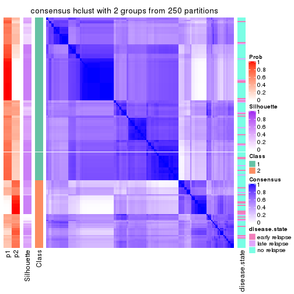</p>

</div>
<div id='tab-SD-hclust-consensus-heatmap-2'>
<pre><code class="r">consensus_heatmap(res, k = 3)
</code></pre>

<p>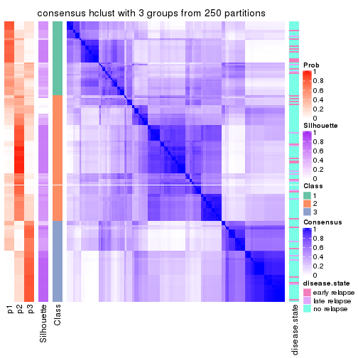</p>

</div>
<div id='tab-SD-hclust-consensus-heatmap-3'>
<pre><code class="r">consensus_heatmap(res, k = 4)
</code></pre>

<p>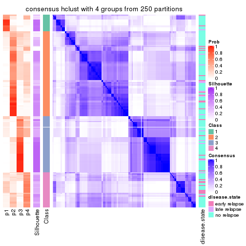</p>

</div>
<div id='tab-SD-hclust-consensus-heatmap-4'>
<pre><code class="r">consensus_heatmap(res, k = 5)
</code></pre>

<p>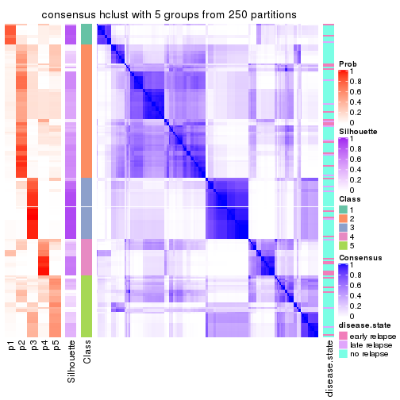</p>

</div>
<div id='tab-SD-hclust-consensus-heatmap-5'>
<pre><code class="r">consensus_heatmap(res, k = 6)
</code></pre>

<p>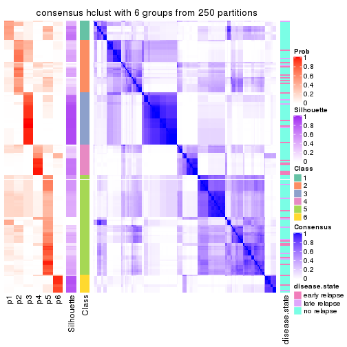</p>

</div>
</div>

Heatmaps for the membership of samples in all partitions to see how consistent they are:


<script>
$( function() {
	$( '#tabs-SD-hclust-membership-heatmap' ).tabs();
} );
</script>
<div id='tabs-SD-hclust-membership-heatmap'>
<ul>
<li><a href='#tab-SD-hclust-membership-heatmap-1'>k = 2</a></li>
<li><a href='#tab-SD-hclust-membership-heatmap-2'>k = 3</a></li>
<li><a href='#tab-SD-hclust-membership-heatmap-3'>k = 4</a></li>
<li><a href='#tab-SD-hclust-membership-heatmap-4'>k = 5</a></li>
<li><a href='#tab-SD-hclust-membership-heatmap-5'>k = 6</a></li>
</ul>
<div id='tab-SD-hclust-membership-heatmap-1'>
<pre><code class="r">membership_heatmap(res, k = 2)
</code></pre>

<p>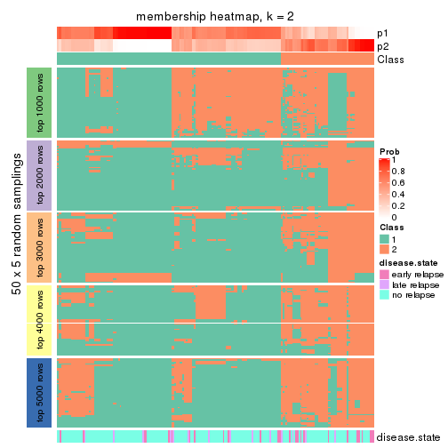</p>

</div>
<div id='tab-SD-hclust-membership-heatmap-2'>
<pre><code class="r">membership_heatmap(res, k = 3)
</code></pre>

<p>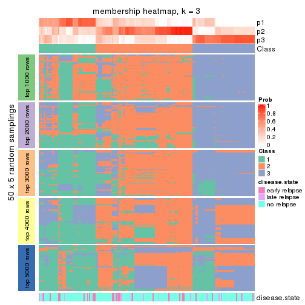</p>

</div>
<div id='tab-SD-hclust-membership-heatmap-3'>
<pre><code class="r">membership_heatmap(res, k = 4)
</code></pre>

<p>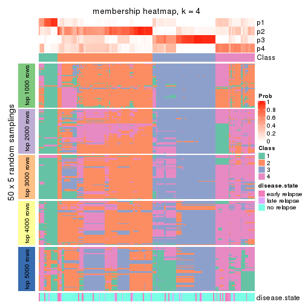</p>

</div>
<div id='tab-SD-hclust-membership-heatmap-4'>
<pre><code class="r">membership_heatmap(res, k = 5)
</code></pre>

<p>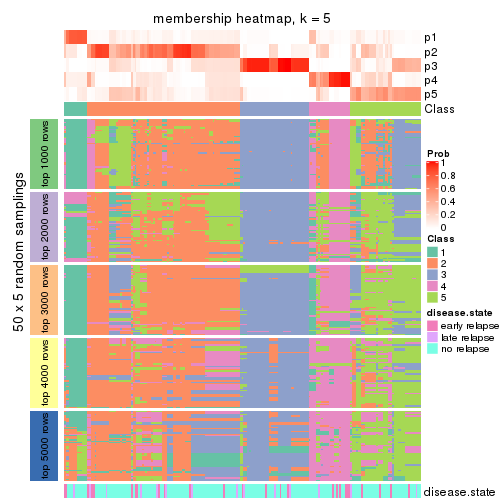</p>

</div>
<div id='tab-SD-hclust-membership-heatmap-5'>
<pre><code class="r">membership_heatmap(res, k = 6)
</code></pre>

<p>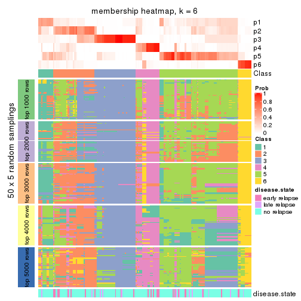</p>

</div>
</div>

As soon as we have had the classes for columns, we can look for signatures
which are significantly different between classes which can be candidate marks
for certain classes. Following are the heatmaps for signatures.


Signature heatmaps where rows are scaled:


<script>
$( function() {
	$( '#tabs-SD-hclust-get-signatures' ).tabs();
} );
</script>
<div id='tabs-SD-hclust-get-signatures'>
<ul>
<li><a href='#tab-SD-hclust-get-signatures-1'>k = 2</a></li>
<li><a href='#tab-SD-hclust-get-signatures-2'>k = 3</a></li>
<li><a href='#tab-SD-hclust-get-signatures-3'>k = 4</a></li>
<li><a href='#tab-SD-hclust-get-signatures-4'>k = 5</a></li>
<li><a href='#tab-SD-hclust-get-signatures-5'>k = 6</a></li>
</ul>
<div id='tab-SD-hclust-get-signatures-1'>
<pre><code class="r">get_signatures(res, k = 2)
</code></pre>

<p>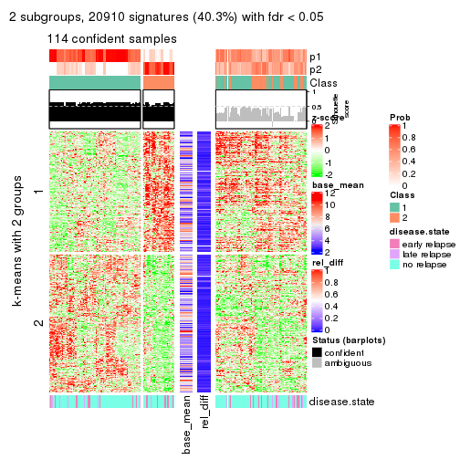</p>

</div>
<div id='tab-SD-hclust-get-signatures-2'>
<pre><code class="r">get_signatures(res, k = 3)
</code></pre>

<p>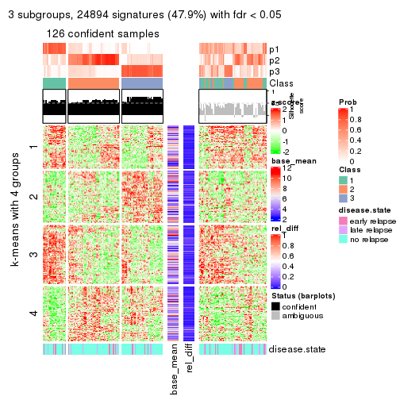</p>

</div>
<div id='tab-SD-hclust-get-signatures-3'>
<pre><code class="r">get_signatures(res, k = 4)
</code></pre>

<p>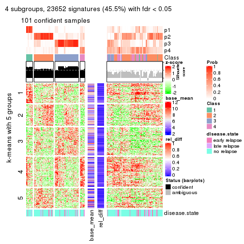</p>

</div>
<div id='tab-SD-hclust-get-signatures-4'>
<pre><code class="r">get_signatures(res, k = 5)
</code></pre>

<p>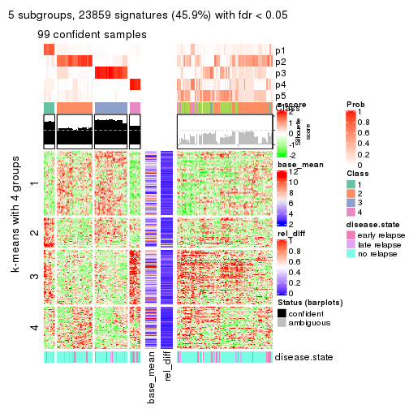</p>

</div>
<div id='tab-SD-hclust-get-signatures-5'>
<pre><code class="r">get_signatures(res, k = 6)
</code></pre>

<p>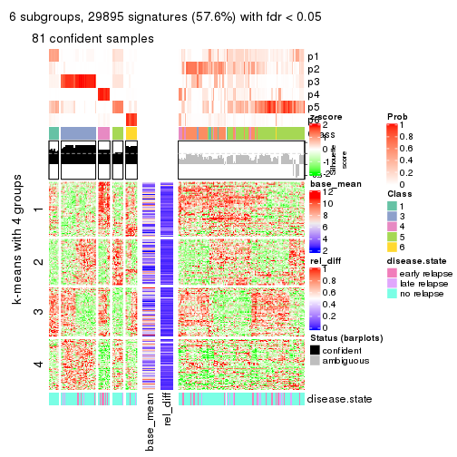</p>

</div>
</div>


Signature heatmaps where rows are not scaled:


<script>
$( function() {
	$( '#tabs-SD-hclust-get-signatures-no-scale' ).tabs();
} );
</script>
<div id='tabs-SD-hclust-get-signatures-no-scale'>
<ul>
<li><a href='#tab-SD-hclust-get-signatures-no-scale-1'>k = 2</a></li>
<li><a href='#tab-SD-hclust-get-signatures-no-scale-2'>k = 3</a></li>
<li><a href='#tab-SD-hclust-get-signatures-no-scale-3'>k = 4</a></li>
<li><a href='#tab-SD-hclust-get-signatures-no-scale-4'>k = 5</a></li>
<li><a href='#tab-SD-hclust-get-signatures-no-scale-5'>k = 6</a></li>
</ul>
<div id='tab-SD-hclust-get-signatures-no-scale-1'>
<pre><code class="r">get_signatures(res, k = 2, scale_rows = FALSE)
</code></pre>

<p>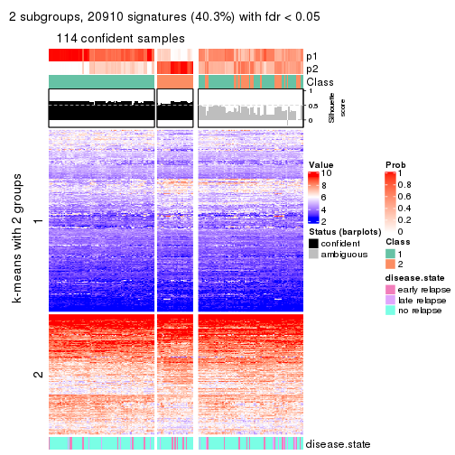</p>

</div>
<div id='tab-SD-hclust-get-signatures-no-scale-2'>
<pre><code class="r">get_signatures(res, k = 3, scale_rows = FALSE)
</code></pre>

<p>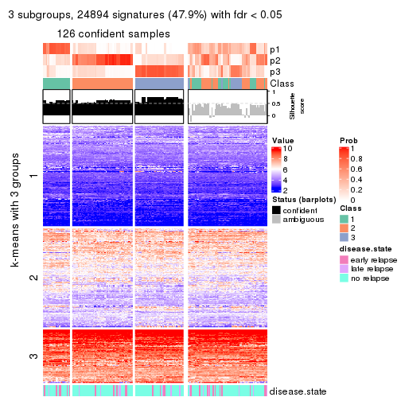</p>

</div>
<div id='tab-SD-hclust-get-signatures-no-scale-3'>
<pre><code class="r">get_signatures(res, k = 4, scale_rows = FALSE)
</code></pre>

<p>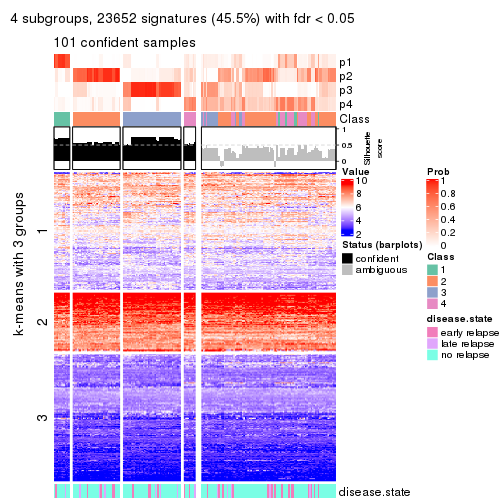</p>

</div>
<div id='tab-SD-hclust-get-signatures-no-scale-4'>
<pre><code class="r">get_signatures(res, k = 5, scale_rows = FALSE)
</code></pre>

<p>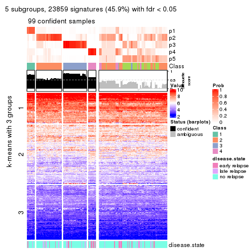</p>

</div>
<div id='tab-SD-hclust-get-signatures-no-scale-5'>
<pre><code class="r">get_signatures(res, k = 6, scale_rows = FALSE)
</code></pre>

<p>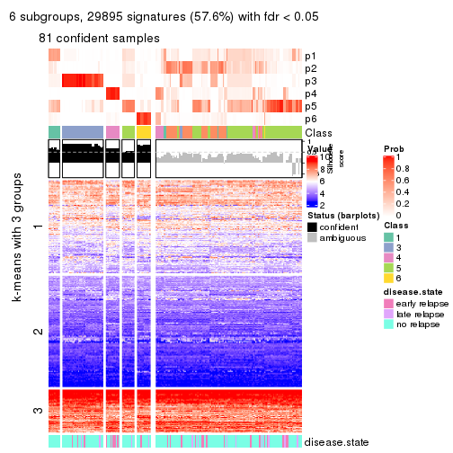</p>

</div>
</div>


Compare the overlap of signatures from different k:

```r
compare_signatures(res)
```

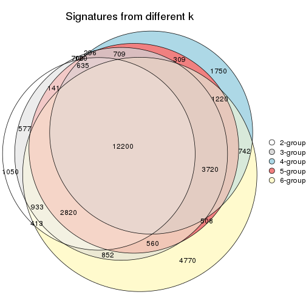

`get_signature()` returns a data frame invisibly. TO get the list of signatures, the function
call should be assigned to a variable explicitly. In following code, if `plot` argument is set
to `FALSE`, no heatmap is plotted while only the differential analysis is performed.

```r
# code only for demonstration
tb = get_signature(res, k = ..., plot = FALSE)
```

An example of the output of `tb` is:

```
#>   which_row         fdr    mean_1    mean_2 scaled_mean_1 scaled_mean_2 km
#> 1        38 0.042760348  8.373488  9.131774    -0.5533452     0.5164555  1
#> 2        40 0.018707592  7.106213  8.469186    -0.6173731     0.5762149  1
#> 3        55 0.019134737 10.221463 11.207825    -0.6159697     0.5749050  1
#> 4        59 0.006059896  5.921854  7.869574    -0.6899429     0.6439467  1
#> 5        60 0.018055526  8.928898 10.211722    -0.6204761     0.5791110  1
#> 6        98 0.009384629 15.714769 14.887706     0.6635654    -0.6193277  2
...
```

The columns in `tb` are:

1. `which_row`: row indices corresponding to the input matrix.
2. `fdr`: FDR for the differential test. 
3. `mean_x`: The mean value in group x.
4. `scaled_mean_x`: The mean value in group x after rows are scaled.
5. `km`: Row groups if k-means clustering is applied to rows.


UMAP plot which shows how samples are separated.


<script>
$( function() {
	$( '#tabs-SD-hclust-dimension-reduction' ).tabs();
} );
</script>
<div id='tabs-SD-hclust-dimension-reduction'>
<ul>
<li><a href='#tab-SD-hclust-dimension-reduction-1'>k = 2</a></li>
<li><a href='#tab-SD-hclust-dimension-reduction-2'>k = 3</a></li>
<li><a href='#tab-SD-hclust-dimension-reduction-3'>k = 4</a></li>
<li><a href='#tab-SD-hclust-dimension-reduction-4'>k = 5</a></li>
<li><a href='#tab-SD-hclust-dimension-reduction-5'>k = 6</a></li>
</ul>
<div id='tab-SD-hclust-dimension-reduction-1'>
<pre><code class="r">dimension_reduction(res, k = 2, method = &quot;UMAP&quot;)
</code></pre>

<p>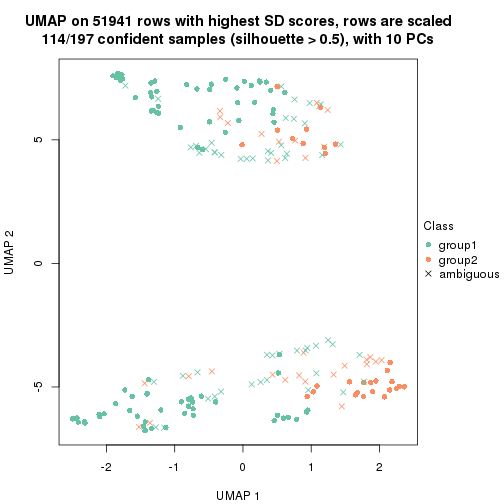</p>

</div>
<div id='tab-SD-hclust-dimension-reduction-2'>
<pre><code class="r">dimension_reduction(res, k = 3, method = &quot;UMAP&quot;)
</code></pre>

<p>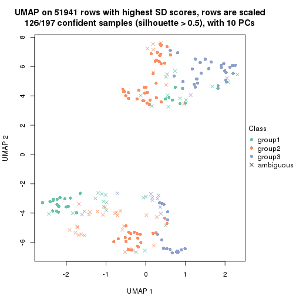</p>

</div>
<div id='tab-SD-hclust-dimension-reduction-3'>
<pre><code class="r">dimension_reduction(res, k = 4, method = &quot;UMAP&quot;)
</code></pre>

<p>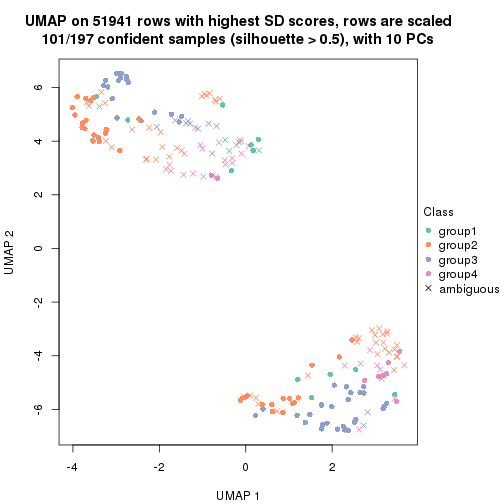</p>

</div>
<div id='tab-SD-hclust-dimension-reduction-4'>
<pre><code class="r">dimension_reduction(res, k = 5, method = &quot;UMAP&quot;)
</code></pre>

<p>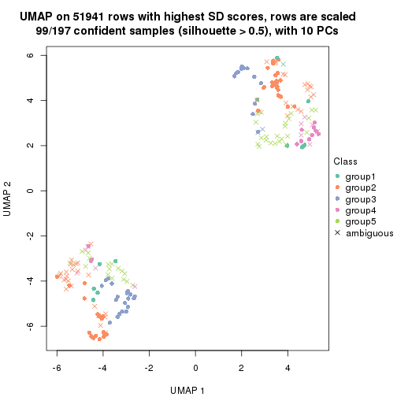</p>

</div>
<div id='tab-SD-hclust-dimension-reduction-5'>
<pre><code class="r">dimension_reduction(res, k = 6, method = &quot;UMAP&quot;)
</code></pre>

<p>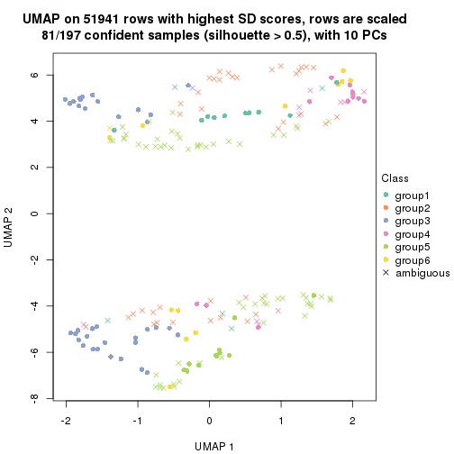</p>

</div>
</div>


Following heatmap shows how subgroups are split when increasing `k`:

```r
collect_classes(res)
```

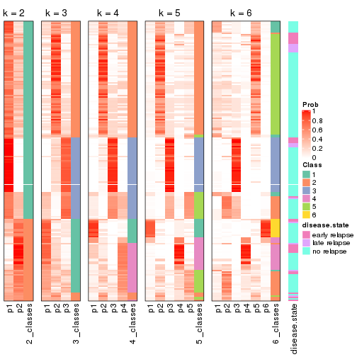


Test correlation between subgroups and known annotations. If the known
annotation is numeric, one-way ANOVA test is applied, and if the known
annotation is discrete, chi-squared contingency table test is applied.

```r
test_to_known_factors(res)
```

```
#>             n disease.state(p) k
#> SD:hclust 114          0.23999 2
#> SD:hclust 126          0.34542 3
#> SD:hclust 101          0.94143 4
#> SD:hclust  99          0.01011 5
#> SD:hclust  81          0.00744 6
```


If matrix rows can be associated to genes, consider to use `functional_enrichment(res,
...)` to perform function enrichment for the signature genes. See [this vignette](http://bioconductor.org/packages/devel/bioc/vignettes/cola/inst/doc/functional_enrichment.html) for more detailed explanations.


 

---------------------------------------------------


### SD:kmeans


The object with results only for a single top-value method and a single partition method 
can be extracted as:

```r
res = res_list["SD", "kmeans"]
# you can also extract it by
# res = res_list["SD:kmeans"]
```

A summary of `res` and all the functions that can be applied to it:

```r
res
```

```
#> A 'ConsensusPartition' object with k = 2, 3, 4, 5, 6.
#>   On a matrix with 51941 rows and 197 columns.
#>   Top rows (1000, 2000, 3000, 4000, 5000) are extracted by 'SD' method.
#>   Subgroups are detected by 'kmeans' method.
#>   Performed in total 1250 partitions by row resampling.
#>   Best k for subgroups seems to be 2.
#> 
#> Following methods can be applied to this 'ConsensusPartition' object:
#>  [1] "cola_report"             "collect_classes"         "collect_plots"          
#>  [4] "collect_stats"           "colnames"                "compare_signatures"     
#>  [7] "consensus_heatmap"       "dimension_reduction"     "functional_enrichment"  
#> [10] "get_anno_col"            "get_anno"                "get_classes"            
#> [13] "get_consensus"           "get_matrix"              "get_membership"         
#> [16] "get_param"               "get_signatures"          "get_stats"              
#> [19] "is_best_k"               "is_stable_k"             "membership_heatmap"     
#> [22] "ncol"                    "nrow"                    "plot_ecdf"              
#> [25] "rownames"                "select_partition_number" "show"                   
#> [28] "suggest_best_k"          "test_to_known_factors"
```

`collect_plots()` function collects all the plots made from `res` for all `k` (number of partitions)
into one single page to provide an easy and fast comparison between different `k`.

```r
collect_plots(res)
```

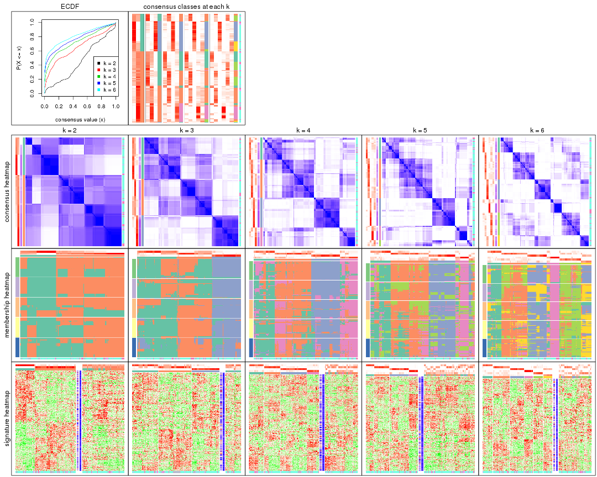

The plots are:

- The first row: a plot of the ECDF (empirical cumulative distribution
  function) curves of the consensus matrix for each `k` and the heatmap of
  predicted classes for each `k`.
- The second row: heatmaps of the consensus matrix for each `k`.
- The third row: heatmaps of the membership matrix for each `k`.
- The fouth row: heatmaps of the signatures for each `k`.

All the plots in panels can be made by individual functions and they are
plotted later in this section.

`select_partition_number()` produces several plots showing different
statistics for choosing "optimized" `k`. There are following statistics:

- ECDF curves of the consensus matrix for each `k`;
- 1-PAC. [The PAC
  score](https://en.wikipedia.org/wiki/Consensus_clustering#Over-interpretation_potential_of_consensus_clustering)
  measures the proportion of the ambiguous subgrouping.
- Mean silhouette score.
- Concordance. The mean probability of fiting the consensus class ids in all
  partitions.
- Area increased. Denote $A_k$ as the area under the ECDF curve for current
  `k`, the area increased is defined as $A_k - A_{k-1}$.
- Rand index. The percent of pairs of samples that are both in a same cluster
  or both are not in a same cluster in the partition of k and k-1.
- Jaccard index. The ratio of pairs of samples are both in a same cluster in
  the partition of k and k-1 and the pairs of samples are both in a same
  cluster in the partition k or k-1.

The detailed explanations of these statistics can be found in [the _cola_
vignette](http://bioconductor.org/packages/devel/bioc/vignettes/cola/inst/doc/cola.html#toc_13).

Generally speaking, lower PAC score, higher mean silhouette score or higher
concordance corresponds to better partition. Rand index and Jaccard index
measure how similar the current partition is compared to partition with `k-1`.
If they are too similar, we won't accept `k` is better than `k-1`.

```r
select_partition_number(res)
```

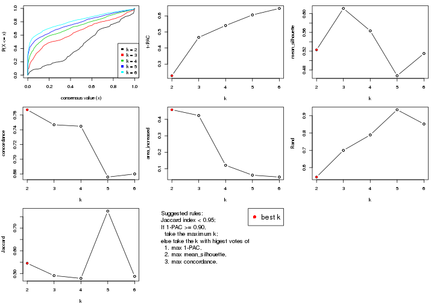

The numeric values for all these statistics can be obtained by `get_stats()`.

```r
get_stats(res)
```

```
#>   k 1-PAC mean_silhouette concordance area_increased  Rand Jaccard
#> 2 2 0.228           0.523       0.767         0.4582 0.546   0.546
#> 3 3 0.466           0.611       0.747         0.4231 0.700   0.491
#> 4 4 0.540           0.563       0.745         0.1211 0.789   0.479
#> 5 5 0.606           0.468       0.676         0.0612 0.934   0.775
#> 6 6 0.647           0.515       0.680         0.0498 0.852   0.488
```

`suggest_best_k()` suggests the best $k$ based on these statistics. The rules are as follows:

- All $k$ with Jaccard index larger than 0.95 are removed because increasing
  $k$ does not provide enough extra information. If all $k$ are removed, it is
  marked as no subgroup is detected.
- For all $k$ with 1-PAC score larger than 0.9, the maximal $k$ is taken as
  the best $k$, and other $k$ are marked as optional $k$.
- If it does not fit the second rule. The $k$ with the maximal vote of the
  highest 1-PAC score, highest mean silhouette, and highest concordance is
  taken as the best $k$.

```r
suggest_best_k(res)
```

```
#> [1] 2
```


Following shows the table of the partitions (You need to click the **show/hide
code output** link to see it). The membership matrix (columns with name `p*`)
is inferred by
[`clue::cl_consensus()`](https://www.rdocumentation.org/link/cl_consensus?package=clue)
function with the `SE` method. Basically the value in the membership matrix
represents the probability to belong to a certain group. The finall class
label for an item is determined with the group with highest probability it
belongs to.

In `get_classes()` function, the entropy is calculated from the membership
matrix and the silhouette score is calculated from the consensus matrix.


<script>
$( function() {
	$( '#tabs-SD-kmeans-get-classes' ).tabs();
} );
</script>
<div id='tabs-SD-kmeans-get-classes'>
<ul>
<li><a href='#tab-SD-kmeans-get-classes-1'>k = 2</a></li>
<li><a href='#tab-SD-kmeans-get-classes-2'>k = 3</a></li>
<li><a href='#tab-SD-kmeans-get-classes-3'>k = 4</a></li>
<li><a href='#tab-SD-kmeans-get-classes-4'>k = 5</a></li>
<li><a href='#tab-SD-kmeans-get-classes-5'>k = 6</a></li>
</ul>

<div id='tab-SD-kmeans-get-classes-1'>
<p><a id='tab-SD-kmeans-get-classes-1-a' style='color:#0366d6' href='#'>show/hide code output</a></p>
<pre><code class="r">cbind(get_classes(res, k = 2), get_membership(res, k = 2))
</code></pre>

<pre><code>#&gt;           class entropy silhouette    p1    p2
#&gt; GSM342319     2  0.9393      0.490 0.356 0.644
#&gt; GSM342323     2  0.0376      0.672 0.004 0.996
#&gt; GSM342325     2  0.9393      0.490 0.356 0.644
#&gt; GSM342326     2  0.0376      0.672 0.004 0.996
#&gt; GSM342327     2  0.0376      0.672 0.004 0.996
#&gt; GSM342329     2  0.0376      0.672 0.004 0.996
#&gt; GSM342331     2  0.0376      0.672 0.004 0.996
#&gt; GSM342334     2  0.4431      0.664 0.092 0.908
#&gt; GSM342335     2  0.5519      0.650 0.128 0.872
#&gt; GSM342354     1  0.9323      0.450 0.652 0.348
#&gt; GSM342371     2  0.5519      0.650 0.128 0.872
#&gt; GSM342380     2  0.9427      0.490 0.360 0.640
#&gt; GSM342382     1  0.9833     -0.189 0.576 0.424
#&gt; GSM342399     2  0.9393      0.490 0.356 0.644
#&gt; GSM342402     2  0.9393      0.490 0.356 0.644
#&gt; GSM342404     2  0.5519      0.650 0.128 0.872
#&gt; GSM342408     1  0.9686      0.387 0.604 0.396
#&gt; GSM342409     2  0.6801      0.614 0.180 0.820
#&gt; GSM342426     2  0.0938      0.671 0.012 0.988
#&gt; GSM342441     1  0.2043      0.690 0.968 0.032
#&gt; GSM342444     1  0.0000      0.701 1.000 0.000
#&gt; GSM342451     1  0.0000      0.701 1.000 0.000
#&gt; GSM342462     2  0.7745      0.572 0.228 0.772
#&gt; GSM342467     2  0.5842      0.649 0.140 0.860
#&gt; GSM342484     2  0.9881      0.399 0.436 0.564
#&gt; GSM342491     2  0.5178      0.630 0.116 0.884
#&gt; GSM342322     2  0.9209      0.507 0.336 0.664
#&gt; GSM342338     1  0.0672      0.700 0.992 0.008
#&gt; GSM342347     1  0.9710      0.384 0.600 0.400
#&gt; GSM342356     1  0.0938      0.697 0.988 0.012
#&gt; GSM342357     2  0.9393      0.490 0.356 0.644
#&gt; GSM342366     2  0.6343      0.650 0.160 0.840
#&gt; GSM342385     2  0.9460      0.481 0.364 0.636
#&gt; GSM342421     2  0.2236      0.673 0.036 0.964
#&gt; GSM342437     2  0.2603      0.666 0.044 0.956
#&gt; GSM342454     1  0.0000      0.701 1.000 0.000
#&gt; GSM342471     2  0.0672      0.673 0.008 0.992
#&gt; GSM342477     2  0.1633      0.671 0.024 0.976
#&gt; GSM342495     2  0.7745      0.572 0.228 0.772
#&gt; GSM342496     1  0.9754     -0.156 0.592 0.408
#&gt; GSM342320     2  0.0376      0.672 0.004 0.996
#&gt; GSM342321     2  0.0376      0.672 0.004 0.996
#&gt; GSM342324     2  0.0376      0.672 0.004 0.996
#&gt; GSM342328     2  0.0376      0.672 0.004 0.996
#&gt; GSM342330     2  0.0376      0.672 0.004 0.996
#&gt; GSM342332     2  0.0376      0.672 0.004 0.996
#&gt; GSM342333     2  0.5629      0.650 0.132 0.868
#&gt; GSM342336     2  0.0672      0.673 0.008 0.992
#&gt; GSM342337     1  0.0938      0.697 0.988 0.012
#&gt; GSM342339     1  0.0672      0.700 0.992 0.008
#&gt; GSM342340     1  0.0672      0.700 0.992 0.008
#&gt; GSM342341     1  0.0672      0.700 0.992 0.008
#&gt; GSM342342     1  0.0672      0.700 0.992 0.008
#&gt; GSM342343     1  0.0672      0.700 0.992 0.008
#&gt; GSM342344     1  0.0672      0.700 0.992 0.008
#&gt; GSM342345     1  0.0672      0.700 0.992 0.008
#&gt; GSM342346     2  0.6438      0.629 0.164 0.836
#&gt; GSM342348     2  0.9427      0.490 0.360 0.640
#&gt; GSM342349     1  0.9460      0.430 0.636 0.364
#&gt; GSM342350     1  0.9358      0.445 0.648 0.352
#&gt; GSM342351     1  0.9608      0.401 0.616 0.384
#&gt; GSM342352     1  0.9358      0.445 0.648 0.352
#&gt; GSM342353     1  0.0672      0.700 0.992 0.008
#&gt; GSM342355     1  0.4690      0.606 0.900 0.100
#&gt; GSM342358     2  0.0376      0.672 0.004 0.996
#&gt; GSM342359     2  0.0376      0.672 0.004 0.996
#&gt; GSM342360     2  0.0376      0.672 0.004 0.996
#&gt; GSM342361     2  0.0376      0.672 0.004 0.996
#&gt; GSM342362     2  0.0376      0.672 0.004 0.996
#&gt; GSM342363     2  0.9358      0.493 0.352 0.648
#&gt; GSM342364     2  0.9710      0.485 0.400 0.600
#&gt; GSM342365     2  0.5519      0.650 0.128 0.872
#&gt; GSM342367     2  0.9988      0.385 0.480 0.520
#&gt; GSM342368     2  0.9833      0.458 0.424 0.576
#&gt; GSM342369     2  0.5519      0.650 0.128 0.872
#&gt; GSM342370     2  0.5519      0.650 0.128 0.872
#&gt; GSM342372     2  0.5519      0.650 0.128 0.872
#&gt; GSM342373     2  0.5519      0.650 0.128 0.872
#&gt; GSM342374     2  0.5519      0.650 0.128 0.872
#&gt; GSM342375     2  0.5519      0.650 0.128 0.872
#&gt; GSM342376     2  0.9993      0.378 0.484 0.516
#&gt; GSM342377     2  0.9988      0.385 0.480 0.520
#&gt; GSM342378     2  0.9460      0.485 0.364 0.636
#&gt; GSM342379     2  0.9209      0.507 0.336 0.664
#&gt; GSM342381     2  0.9988      0.385 0.480 0.520
#&gt; GSM342383     2  0.9393      0.490 0.356 0.644
#&gt; GSM342384     2  0.9988      0.385 0.480 0.520
#&gt; GSM342386     2  0.9996      0.373 0.488 0.512
#&gt; GSM342387     2  0.0672      0.673 0.008 0.992
#&gt; GSM342388     1  0.0672      0.700 0.992 0.008
#&gt; GSM342389     2  0.9988      0.385 0.480 0.520
#&gt; GSM342390     2  0.9491      0.481 0.368 0.632
#&gt; GSM342391     2  0.9460      0.485 0.364 0.636
#&gt; GSM342392     1  0.0000      0.701 1.000 0.000
#&gt; GSM342393     2  0.5519      0.650 0.128 0.872
#&gt; GSM342394     2  0.9427      0.490 0.360 0.640
#&gt; GSM342395     2  0.6343      0.650 0.160 0.840
#&gt; GSM342396     1  0.0672      0.700 0.992 0.008
#&gt; GSM342397     1  0.9460      0.430 0.636 0.364
#&gt; GSM342398     2  0.9996      0.371 0.488 0.512
#&gt; GSM342400     2  0.9988      0.385 0.480 0.520
#&gt; GSM342401     1  0.0672      0.700 0.992 0.008
#&gt; GSM342403     2  0.9996      0.378 0.488 0.512
#&gt; GSM342405     2  0.8661      0.447 0.288 0.712
#&gt; GSM342406     2  0.9460      0.485 0.364 0.636
#&gt; GSM342407     1  0.9248      0.455 0.660 0.340
#&gt; GSM342410     2  0.9460      0.485 0.364 0.636
#&gt; GSM342411     2  0.0672      0.673 0.008 0.992
#&gt; GSM342412     2  0.1184      0.673 0.016 0.984
#&gt; GSM342413     2  0.0938      0.672 0.012 0.988
#&gt; GSM342414     1  0.9248      0.455 0.660 0.340
#&gt; GSM342415     2  0.5519      0.650 0.128 0.872
#&gt; GSM342416     2  0.9000      0.527 0.316 0.684
#&gt; GSM342417     2  0.0376      0.672 0.004 0.996
#&gt; GSM342418     2  0.0376      0.672 0.004 0.996
#&gt; GSM342419     2  0.9393      0.490 0.356 0.644
#&gt; GSM342420     2  0.0376      0.672 0.004 0.996
#&gt; GSM342422     2  0.9988      0.385 0.480 0.520
#&gt; GSM342423     2  0.5519      0.650 0.128 0.872
#&gt; GSM342424     2  0.0376      0.672 0.004 0.996
#&gt; GSM342425     2  0.0938      0.671 0.012 0.988
#&gt; GSM342427     2  0.5408      0.657 0.124 0.876
#&gt; GSM342428     2  0.0672      0.673 0.008 0.992
#&gt; GSM342429     2  0.9000      0.538 0.316 0.684
#&gt; GSM342430     1  0.0000      0.701 1.000 0.000
#&gt; GSM342431     1  0.0000      0.701 1.000 0.000
#&gt; GSM342432     1  0.0000      0.701 1.000 0.000
#&gt; GSM342433     1  0.9170      0.458 0.668 0.332
#&gt; GSM342434     1  0.9358      0.432 0.648 0.352
#&gt; GSM342435     1  0.9170      0.458 0.668 0.332
#&gt; GSM342436     1  0.2043      0.690 0.968 0.032
#&gt; GSM342438     1  0.0000      0.701 1.000 0.000
#&gt; GSM342439     1  0.0000      0.701 1.000 0.000
#&gt; GSM342440     1  0.2043      0.690 0.968 0.032
#&gt; GSM342442     1  0.0000      0.701 1.000 0.000
#&gt; GSM342443     2  0.7745      0.572 0.228 0.772
#&gt; GSM342445     1  0.2043      0.690 0.968 0.032
#&gt; GSM342446     1  0.0000      0.701 1.000 0.000
#&gt; GSM342447     1  0.0000      0.701 1.000 0.000
#&gt; GSM342448     1  0.9248      0.448 0.660 0.340
#&gt; GSM342449     1  0.0000      0.701 1.000 0.000
#&gt; GSM342450     1  0.9170      0.458 0.668 0.332
#&gt; GSM342452     1  0.0000      0.701 1.000 0.000
#&gt; GSM342453     1  0.0000      0.701 1.000 0.000
#&gt; GSM342455     1  0.0000      0.701 1.000 0.000
#&gt; GSM342456     2  0.0376      0.672 0.004 0.996
#&gt; GSM342457     2  0.9850      0.454 0.428 0.572
#&gt; GSM342458     2  0.5519      0.650 0.128 0.872
#&gt; GSM342459     2  0.7745      0.572 0.228 0.772
#&gt; GSM342460     2  0.7745      0.572 0.228 0.772
#&gt; GSM342461     1  1.0000     -0.321 0.504 0.496
#&gt; GSM342463     1  0.9754     -0.156 0.592 0.408
#&gt; GSM342464     1  0.9754     -0.156 0.592 0.408
#&gt; GSM342465     1  0.9754     -0.156 0.592 0.408
#&gt; GSM342466     2  0.9710      0.446 0.400 0.600
#&gt; GSM342468     2  0.5519      0.650 0.128 0.872
#&gt; GSM342469     2  0.9427      0.490 0.360 0.640
#&gt; GSM342470     2  0.0938      0.672 0.012 0.988
#&gt; GSM342472     2  0.8327      0.521 0.264 0.736
#&gt; GSM342473     2  0.9996      0.335 0.488 0.512
#&gt; GSM342474     2  0.9996      0.335 0.488 0.512
#&gt; GSM342475     1  0.1633      0.693 0.976 0.024
#&gt; GSM342476     2  0.7745      0.572 0.228 0.772
#&gt; GSM342478     2  0.9427      0.489 0.360 0.640
#&gt; GSM342479     2  0.9686      0.454 0.396 0.604
#&gt; GSM342480     2  0.7745      0.572 0.228 0.772
#&gt; GSM342481     1  0.9998     -0.312 0.508 0.492
#&gt; GSM342482     2  0.7745      0.572 0.228 0.772
#&gt; GSM342483     2  0.9815      0.425 0.420 0.580
#&gt; GSM342485     1  0.9754     -0.156 0.592 0.408
#&gt; GSM342486     1  0.9754     -0.156 0.592 0.408
#&gt; GSM342487     1  0.9170      0.458 0.668 0.332
#&gt; GSM342488     2  0.7745      0.572 0.228 0.772
#&gt; GSM342489     2  0.7745      0.572 0.228 0.772
#&gt; GSM342490     2  0.5294      0.632 0.120 0.880
#&gt; GSM342492     1  0.9170      0.458 0.668 0.332
#&gt; GSM342493     1  0.9754     -0.156 0.592 0.408
#&gt; GSM342494     2  0.7745      0.572 0.228 0.772
#&gt; GSM342497     2  0.7745      0.572 0.228 0.772
#&gt; GSM342498     2  0.9815      0.426 0.420 0.580
#&gt; GSM342499     2  0.9661      0.455 0.392 0.608
#&gt; GSM342500     2  0.7815      0.567 0.232 0.768
#&gt; GSM342501     2  0.9993      0.331 0.484 0.516
#&gt; GSM342502     1  0.9866     -0.211 0.568 0.432
#&gt; GSM342503     2  1.0000      0.317 0.496 0.504
#&gt; GSM342504     2  0.8661      0.543 0.288 0.712
#&gt; GSM342505     1  0.0000      0.701 1.000 0.000
#&gt; GSM342506     2  0.9866      0.410 0.432 0.568
#&gt; GSM342507     2  0.9393      0.490 0.356 0.644
#&gt; GSM342508     2  0.9710      0.448 0.400 0.600
#&gt; GSM342509     2  0.9881      0.399 0.436 0.564
#&gt; GSM342510     2  0.3274      0.657 0.060 0.940
#&gt; GSM342511     1  0.9635      0.382 0.612 0.388
#&gt; GSM342512     1  0.9754     -0.156 0.592 0.408
#&gt; GSM342513     1  0.9754     -0.156 0.592 0.408
#&gt; GSM342514     2  0.9522      0.112 0.372 0.628
#&gt; GSM342515     2  0.9460      0.485 0.364 0.636
</code></pre>

<script>
$('#tab-SD-kmeans-get-classes-1-a').parent().next().next().hide();
$('#tab-SD-kmeans-get-classes-1-a').click(function(){
  $('#tab-SD-kmeans-get-classes-1-a').parent().next().next().toggle();
  return(false);
});
</script>
</div>

<div id='tab-SD-kmeans-get-classes-2'>
<p><a id='tab-SD-kmeans-get-classes-2-a' style='color:#0366d6' href='#'>show/hide code output</a></p>
<pre><code class="r">cbind(get_classes(res, k = 3), get_membership(res, k = 3))
</code></pre>

<pre><code>#&gt;           class entropy silhouette    p1    p2    p3
#&gt; GSM342319     1  0.6189     0.5386 0.632 0.364 0.004
#&gt; GSM342323     2  0.2261     0.6239 0.068 0.932 0.000
#&gt; GSM342325     1  0.6126     0.5467 0.644 0.352 0.004
#&gt; GSM342326     2  0.2261     0.6239 0.068 0.932 0.000
#&gt; GSM342327     2  0.2261     0.6239 0.068 0.932 0.000
#&gt; GSM342329     2  0.2261     0.6239 0.068 0.932 0.000
#&gt; GSM342331     2  0.2261     0.6239 0.068 0.932 0.000
#&gt; GSM342334     2  0.7163     0.6180 0.332 0.628 0.040
#&gt; GSM342335     2  0.7581     0.5880 0.408 0.548 0.044
#&gt; GSM342354     3  0.2682     0.8555 0.004 0.076 0.920
#&gt; GSM342371     1  0.5346     0.4534 0.808 0.152 0.040
#&gt; GSM342380     1  0.6129     0.5755 0.700 0.284 0.016
#&gt; GSM342382     1  0.1289     0.6273 0.968 0.000 0.032
#&gt; GSM342399     1  0.6252     0.5507 0.648 0.344 0.008
#&gt; GSM342402     1  0.6252     0.4872 0.556 0.444 0.000
#&gt; GSM342404     2  0.7660     0.5901 0.404 0.548 0.048
#&gt; GSM342408     3  0.6205     0.4823 0.008 0.336 0.656
#&gt; GSM342409     1  0.6853     0.2574 0.712 0.224 0.064
#&gt; GSM342426     2  0.2261     0.6239 0.068 0.932 0.000
#&gt; GSM342441     3  0.0237     0.8803 0.004 0.000 0.996
#&gt; GSM342444     3  0.3349     0.8617 0.108 0.004 0.888
#&gt; GSM342451     3  0.3349     0.8617 0.108 0.004 0.888
#&gt; GSM342462     2  0.9027     0.5066 0.428 0.440 0.132
#&gt; GSM342467     2  0.8097     0.5929 0.388 0.540 0.072
#&gt; GSM342484     1  0.7555     0.4831 0.520 0.440 0.040
#&gt; GSM342491     2  0.6271     0.5536 0.088 0.772 0.140
#&gt; GSM342322     1  0.6298     0.5214 0.608 0.388 0.004
#&gt; GSM342338     3  0.3715     0.8513 0.128 0.004 0.868
#&gt; GSM342347     3  0.3755     0.8256 0.008 0.120 0.872
#&gt; GSM342356     3  0.6008     0.6023 0.332 0.004 0.664
#&gt; GSM342357     1  0.6215     0.5026 0.572 0.428 0.000
#&gt; GSM342366     1  0.3155     0.5868 0.916 0.044 0.040
#&gt; GSM342385     1  0.6129     0.5755 0.700 0.284 0.016
#&gt; GSM342421     2  0.7389     0.5908 0.408 0.556 0.036
#&gt; GSM342437     2  0.3973     0.5489 0.032 0.880 0.088
#&gt; GSM342454     3  0.1525     0.8833 0.032 0.004 0.964
#&gt; GSM342471     2  0.6307    -0.3593 0.488 0.512 0.000
#&gt; GSM342477     2  0.6887     0.6192 0.204 0.720 0.076
#&gt; GSM342495     2  0.9014     0.5366 0.408 0.460 0.132
#&gt; GSM342496     1  0.3038     0.6048 0.896 0.000 0.104
#&gt; GSM342320     2  0.2261     0.6239 0.068 0.932 0.000
#&gt; GSM342321     2  0.2261     0.6239 0.068 0.932 0.000
#&gt; GSM342324     2  0.1860     0.6089 0.052 0.948 0.000
#&gt; GSM342328     2  0.2261     0.6239 0.068 0.932 0.000
#&gt; GSM342330     2  0.2261     0.6239 0.068 0.932 0.000
#&gt; GSM342332     2  0.2625     0.6244 0.084 0.916 0.000
#&gt; GSM342333     2  0.7671     0.5867 0.408 0.544 0.048
#&gt; GSM342336     2  0.6388     0.6258 0.284 0.692 0.024
#&gt; GSM342337     3  0.6008     0.6023 0.332 0.004 0.664
#&gt; GSM342339     3  0.3425     0.8603 0.112 0.004 0.884
#&gt; GSM342340     3  0.4293     0.8224 0.164 0.004 0.832
#&gt; GSM342341     3  0.3425     0.8603 0.112 0.004 0.884
#&gt; GSM342342     3  0.3425     0.8603 0.112 0.004 0.884
#&gt; GSM342343     3  0.4931     0.7716 0.212 0.004 0.784
#&gt; GSM342344     3  0.1482     0.8850 0.020 0.012 0.968
#&gt; GSM342345     3  0.3425     0.8603 0.112 0.004 0.884
#&gt; GSM342346     2  0.7974     0.6132 0.312 0.604 0.084
#&gt; GSM342348     1  0.6260     0.4826 0.552 0.448 0.000
#&gt; GSM342349     3  0.2955     0.8502 0.008 0.080 0.912
#&gt; GSM342350     3  0.2955     0.8502 0.008 0.080 0.912
#&gt; GSM342351     3  0.4099     0.7915 0.008 0.140 0.852
#&gt; GSM342352     3  0.2866     0.8521 0.008 0.076 0.916
#&gt; GSM342353     3  0.2269     0.8847 0.040 0.016 0.944
#&gt; GSM342355     3  0.6008     0.6023 0.332 0.004 0.664
#&gt; GSM342358     2  0.1411     0.5829 0.036 0.964 0.000
#&gt; GSM342359     2  0.1411     0.5829 0.036 0.964 0.000
#&gt; GSM342360     2  0.1643     0.5759 0.044 0.956 0.000
#&gt; GSM342361     2  0.1411     0.5829 0.036 0.964 0.000
#&gt; GSM342362     2  0.6095    -0.2213 0.392 0.608 0.000
#&gt; GSM342363     1  0.6252     0.4872 0.556 0.444 0.000
#&gt; GSM342364     1  0.2414     0.6041 0.940 0.020 0.040
#&gt; GSM342365     2  0.7636     0.5952 0.396 0.556 0.048
#&gt; GSM342367     1  0.1289     0.6273 0.968 0.000 0.032
#&gt; GSM342368     1  0.1765     0.6134 0.956 0.004 0.040
#&gt; GSM342369     2  0.7671     0.5867 0.408 0.544 0.048
#&gt; GSM342370     2  0.7636     0.5952 0.396 0.556 0.048
#&gt; GSM342372     2  0.7671     0.5867 0.408 0.544 0.048
#&gt; GSM342373     1  0.5466     0.4386 0.800 0.160 0.040
#&gt; GSM342374     2  0.7648     0.5929 0.400 0.552 0.048
#&gt; GSM342375     2  0.7660     0.5901 0.404 0.548 0.048
#&gt; GSM342376     1  0.1289     0.6273 0.968 0.000 0.032
#&gt; GSM342377     1  0.1289     0.6273 0.968 0.000 0.032
#&gt; GSM342378     1  0.6451     0.5395 0.608 0.384 0.008
#&gt; GSM342379     1  0.6008     0.5327 0.628 0.372 0.000
#&gt; GSM342381     1  0.1453     0.6273 0.968 0.008 0.024
#&gt; GSM342383     1  0.5986     0.5747 0.704 0.284 0.012
#&gt; GSM342384     1  0.1289     0.6273 0.968 0.000 0.032
#&gt; GSM342386     1  0.1289     0.6273 0.968 0.000 0.032
#&gt; GSM342387     2  0.1411     0.5737 0.036 0.964 0.000
#&gt; GSM342388     3  0.5158     0.7466 0.232 0.004 0.764
#&gt; GSM342389     1  0.1289     0.6273 0.968 0.000 0.032
#&gt; GSM342390     1  0.6235     0.4925 0.564 0.436 0.000
#&gt; GSM342391     1  0.6467     0.5374 0.604 0.388 0.008
#&gt; GSM342392     3  0.3425     0.8603 0.112 0.004 0.884
#&gt; GSM342393     2  0.7636     0.5952 0.396 0.556 0.048
#&gt; GSM342394     1  0.6314     0.5355 0.604 0.392 0.004
#&gt; GSM342395     1  0.4526     0.5195 0.856 0.104 0.040
#&gt; GSM342396     3  0.3425     0.8603 0.112 0.004 0.884
#&gt; GSM342397     3  0.2955     0.8502 0.008 0.080 0.912
#&gt; GSM342398     1  0.1289     0.6273 0.968 0.000 0.032
#&gt; GSM342400     1  0.1267     0.6268 0.972 0.004 0.024
#&gt; GSM342401     3  0.3425     0.8603 0.112 0.004 0.884
#&gt; GSM342403     1  0.3237     0.6256 0.912 0.056 0.032
#&gt; GSM342405     2  0.9182     0.5376 0.260 0.536 0.204
#&gt; GSM342406     1  0.6244     0.4892 0.560 0.440 0.000
#&gt; GSM342407     3  0.2774     0.8550 0.008 0.072 0.920
#&gt; GSM342410     1  0.6345     0.5293 0.596 0.400 0.004
#&gt; GSM342411     2  0.2537     0.5246 0.080 0.920 0.000
#&gt; GSM342412     2  0.6195     0.6263 0.276 0.704 0.020
#&gt; GSM342413     2  0.1753     0.5689 0.048 0.952 0.000
#&gt; GSM342414     3  0.2866     0.8521 0.008 0.076 0.916
#&gt; GSM342415     1  0.4799     0.5051 0.836 0.132 0.032
#&gt; GSM342416     1  0.6260     0.4826 0.552 0.448 0.000
#&gt; GSM342417     2  0.2261     0.6239 0.068 0.932 0.000
#&gt; GSM342418     2  0.2261     0.6239 0.068 0.932 0.000
#&gt; GSM342419     1  0.5763     0.5779 0.716 0.276 0.008
#&gt; GSM342420     2  0.2261     0.6239 0.068 0.932 0.000
#&gt; GSM342422     1  0.1289     0.6273 0.968 0.000 0.032
#&gt; GSM342423     1  0.7012     0.0343 0.652 0.308 0.040
#&gt; GSM342424     2  0.2261     0.6239 0.068 0.932 0.000
#&gt; GSM342425     2  0.2261     0.6239 0.068 0.932 0.000
#&gt; GSM342427     2  0.7969     0.5913 0.396 0.540 0.064
#&gt; GSM342428     2  0.6742     0.6216 0.316 0.656 0.028
#&gt; GSM342429     1  0.9183    -0.1390 0.484 0.360 0.156
#&gt; GSM342430     3  0.3349     0.8617 0.108 0.004 0.888
#&gt; GSM342431     3  0.3349     0.8617 0.108 0.004 0.888
#&gt; GSM342432     3  0.1399     0.8834 0.028 0.004 0.968
#&gt; GSM342433     3  0.0661     0.8773 0.008 0.004 0.988
#&gt; GSM342434     3  0.3965     0.7991 0.008 0.132 0.860
#&gt; GSM342435     3  0.0661     0.8773 0.008 0.004 0.988
#&gt; GSM342436     3  0.0237     0.8803 0.004 0.000 0.996
#&gt; GSM342438     3  0.1129     0.8844 0.020 0.004 0.976
#&gt; GSM342439     3  0.0892     0.8844 0.020 0.000 0.980
#&gt; GSM342440     3  0.0237     0.8803 0.004 0.000 0.996
#&gt; GSM342442     3  0.0892     0.8844 0.020 0.000 0.980
#&gt; GSM342443     2  0.9014     0.5366 0.408 0.460 0.132
#&gt; GSM342445     3  0.0237     0.8803 0.004 0.000 0.996
#&gt; GSM342446     3  0.0892     0.8844 0.020 0.000 0.980
#&gt; GSM342447     3  0.3573     0.8551 0.120 0.004 0.876
#&gt; GSM342448     3  0.2063     0.8613 0.008 0.044 0.948
#&gt; GSM342449     3  0.0892     0.8844 0.020 0.000 0.980
#&gt; GSM342450     3  0.0661     0.8773 0.008 0.004 0.988
#&gt; GSM342452     3  0.1129     0.8844 0.020 0.004 0.976
#&gt; GSM342453     3  0.1525     0.8833 0.032 0.004 0.964
#&gt; GSM342455     3  0.0892     0.8844 0.020 0.000 0.980
#&gt; GSM342456     2  0.1411     0.5829 0.036 0.964 0.000
#&gt; GSM342457     1  0.1765     0.6134 0.956 0.004 0.040
#&gt; GSM342458     2  0.7660     0.5901 0.404 0.548 0.048
#&gt; GSM342459     2  0.9027     0.5066 0.428 0.440 0.132
#&gt; GSM342460     2  0.9021     0.5254 0.416 0.452 0.132
#&gt; GSM342461     1  0.6062     0.4729 0.776 0.064 0.160
#&gt; GSM342463     1  0.3038     0.6048 0.896 0.000 0.104
#&gt; GSM342464     1  0.3686     0.5781 0.860 0.000 0.140
#&gt; GSM342465     1  0.2448     0.6179 0.924 0.000 0.076
#&gt; GSM342466     1  0.6467     0.5382 0.604 0.388 0.008
#&gt; GSM342468     2  0.7671     0.5867 0.408 0.544 0.048
#&gt; GSM342469     1  0.6102     0.5643 0.672 0.320 0.008
#&gt; GSM342470     2  0.1753     0.5689 0.048 0.952 0.000
#&gt; GSM342472     2  0.9295     0.5218 0.224 0.524 0.252
#&gt; GSM342473     1  0.7072     0.3882 0.724 0.116 0.160
#&gt; GSM342474     1  0.7072     0.3882 0.724 0.116 0.160
#&gt; GSM342475     3  0.0237     0.8803 0.004 0.000 0.996
#&gt; GSM342476     2  0.8963     0.5447 0.404 0.468 0.128
#&gt; GSM342478     1  0.7825     0.2824 0.672 0.156 0.172
#&gt; GSM342479     1  0.8872     0.2877 0.552 0.296 0.152
#&gt; GSM342480     2  0.9014     0.5366 0.408 0.460 0.132
#&gt; GSM342481     1  0.7059     0.3924 0.724 0.112 0.164
#&gt; GSM342482     1  0.7666     0.3053 0.684 0.148 0.168
#&gt; GSM342483     1  0.7297     0.3655 0.708 0.120 0.172
#&gt; GSM342485     1  0.2448     0.6179 0.924 0.000 0.076
#&gt; GSM342486     1  0.2165     0.6213 0.936 0.000 0.064
#&gt; GSM342487     3  0.0661     0.8773 0.008 0.004 0.988
#&gt; GSM342488     2  0.9014     0.5366 0.408 0.460 0.132
#&gt; GSM342489     2  0.9014     0.5366 0.408 0.460 0.132
#&gt; GSM342490     2  0.8372     0.5988 0.312 0.580 0.108
#&gt; GSM342492     3  0.0661     0.8773 0.008 0.004 0.988
#&gt; GSM342493     1  0.2448     0.6179 0.924 0.000 0.076
#&gt; GSM342494     2  0.8963     0.5447 0.404 0.468 0.128
#&gt; GSM342497     2  0.8951     0.5518 0.396 0.476 0.128
#&gt; GSM342498     1  0.7114     0.5359 0.584 0.388 0.028
#&gt; GSM342499     1  0.6102     0.5643 0.672 0.320 0.008
#&gt; GSM342500     1  0.9392    -0.4448 0.436 0.392 0.172
#&gt; GSM342501     1  0.5961     0.6060 0.788 0.136 0.076
#&gt; GSM342502     1  0.4995     0.5348 0.824 0.032 0.144
#&gt; GSM342503     1  0.7297     0.3655 0.708 0.120 0.172
#&gt; GSM342504     1  0.7772     0.2915 0.676 0.152 0.172
#&gt; GSM342505     3  0.1525     0.8833 0.032 0.004 0.964
#&gt; GSM342506     1  0.6721     0.5395 0.604 0.380 0.016
#&gt; GSM342507     1  0.6252     0.4872 0.556 0.444 0.000
#&gt; GSM342508     1  0.6434     0.5394 0.612 0.380 0.008
#&gt; GSM342509     1  0.7555     0.4831 0.520 0.440 0.040
#&gt; GSM342510     2  0.2810     0.5765 0.036 0.928 0.036
#&gt; GSM342511     3  0.8494     0.2934 0.236 0.156 0.608
#&gt; GSM342512     1  0.2448     0.6179 0.924 0.000 0.076
#&gt; GSM342513     1  0.2448     0.6179 0.924 0.000 0.076
#&gt; GSM342514     3  0.7634     0.2411 0.044 0.432 0.524
#&gt; GSM342515     1  0.6467     0.5374 0.604 0.388 0.008
</code></pre>

<script>
$('#tab-SD-kmeans-get-classes-2-a').parent().next().next().hide();
$('#tab-SD-kmeans-get-classes-2-a').click(function(){
  $('#tab-SD-kmeans-get-classes-2-a').parent().next().next().toggle();
  return(false);
});
</script>
</div>

<div id='tab-SD-kmeans-get-classes-3'>
<p><a id='tab-SD-kmeans-get-classes-3-a' style='color:#0366d6' href='#'>show/hide code output</a></p>
<pre><code class="r">cbind(get_classes(res, k = 4), get_membership(res, k = 4))
</code></pre>

<pre><code>#&gt;           class entropy silhouette    p1    p2    p3    p4
#&gt; GSM342319     1  0.6707     0.5961 0.612 0.104 0.008 0.276
#&gt; GSM342323     4  0.3198     0.7312 0.080 0.040 0.000 0.880
#&gt; GSM342325     1  0.6537     0.6185 0.652 0.104 0.012 0.232
#&gt; GSM342326     4  0.3107     0.7322 0.080 0.036 0.000 0.884
#&gt; GSM342327     4  0.3107     0.7322 0.080 0.036 0.000 0.884
#&gt; GSM342329     4  0.3107     0.7322 0.080 0.036 0.000 0.884
#&gt; GSM342331     4  0.3107     0.7322 0.080 0.036 0.000 0.884
#&gt; GSM342334     4  0.6662     0.0334 0.072 0.436 0.004 0.488
#&gt; GSM342335     2  0.5279     0.3476 0.012 0.588 0.000 0.400
#&gt; GSM342354     3  0.4834     0.8171 0.000 0.096 0.784 0.120
#&gt; GSM342371     2  0.3932     0.6204 0.128 0.836 0.004 0.032
#&gt; GSM342380     1  0.6891     0.5494 0.648 0.212 0.028 0.112
#&gt; GSM342382     2  0.5887     0.1700 0.420 0.548 0.028 0.004
#&gt; GSM342399     1  0.6756     0.6303 0.664 0.112 0.028 0.196
#&gt; GSM342402     1  0.4631     0.5317 0.728 0.004 0.008 0.260
#&gt; GSM342404     2  0.5365     0.3143 0.008 0.576 0.004 0.412
#&gt; GSM342408     3  0.6464     0.5563 0.000 0.096 0.596 0.308
#&gt; GSM342409     2  0.3981     0.6353 0.040 0.848 0.012 0.100
#&gt; GSM342426     4  0.3286     0.7293 0.080 0.044 0.000 0.876
#&gt; GSM342441     3  0.2586     0.8630 0.000 0.048 0.912 0.040
#&gt; GSM342444     3  0.1543     0.8581 0.032 0.008 0.956 0.004
#&gt; GSM342451     3  0.1443     0.8592 0.028 0.008 0.960 0.004
#&gt; GSM342462     2  0.2142     0.6349 0.000 0.928 0.016 0.056
#&gt; GSM342467     2  0.6272     0.2404 0.044 0.556 0.008 0.392
#&gt; GSM342484     1  0.5543     0.5069 0.696 0.008 0.040 0.256
#&gt; GSM342491     4  0.8122     0.4956 0.176 0.280 0.036 0.508
#&gt; GSM342322     1  0.6774     0.4860 0.528 0.076 0.008 0.388
#&gt; GSM342338     3  0.1968     0.8559 0.044 0.008 0.940 0.008
#&gt; GSM342347     3  0.5594     0.7488 0.000 0.092 0.716 0.192
#&gt; GSM342356     3  0.5393     0.4007 0.376 0.008 0.608 0.008
#&gt; GSM342357     1  0.4601     0.5346 0.732 0.004 0.008 0.256
#&gt; GSM342366     2  0.3995     0.6064 0.148 0.824 0.004 0.024
#&gt; GSM342385     1  0.6995     0.5938 0.648 0.176 0.028 0.148
#&gt; GSM342421     2  0.4800     0.4331 0.004 0.656 0.000 0.340
#&gt; GSM342437     4  0.7877     0.3884 0.380 0.152 0.020 0.448
#&gt; GSM342454     3  0.1124     0.8640 0.012 0.012 0.972 0.004
#&gt; GSM342471     1  0.4655     0.6421 0.796 0.088 0.000 0.116
#&gt; GSM342477     2  0.7100    -0.0564 0.080 0.480 0.016 0.424
#&gt; GSM342495     2  0.3607     0.5984 0.008 0.852 0.016 0.124
#&gt; GSM342496     2  0.6345     0.4473 0.236 0.664 0.088 0.012
#&gt; GSM342320     4  0.3107     0.7322 0.080 0.036 0.000 0.884
#&gt; GSM342321     4  0.3198     0.7312 0.080 0.040 0.000 0.880
#&gt; GSM342324     4  0.3056     0.7305 0.072 0.040 0.000 0.888
#&gt; GSM342328     4  0.3198     0.7312 0.080 0.040 0.000 0.880
#&gt; GSM342330     4  0.3107     0.7322 0.080 0.036 0.000 0.884
#&gt; GSM342332     4  0.5051     0.6621 0.100 0.132 0.000 0.768
#&gt; GSM342333     2  0.5660     0.3194 0.020 0.576 0.004 0.400
#&gt; GSM342336     4  0.6543     0.2323 0.084 0.372 0.000 0.544
#&gt; GSM342337     3  0.5393     0.4007 0.376 0.008 0.608 0.008
#&gt; GSM342339     3  0.1968     0.8559 0.044 0.008 0.940 0.008
#&gt; GSM342340     3  0.3470     0.7846 0.132 0.008 0.852 0.008
#&gt; GSM342341     3  0.1968     0.8559 0.044 0.008 0.940 0.008
#&gt; GSM342342     3  0.1968     0.8559 0.044 0.008 0.940 0.008
#&gt; GSM342343     3  0.4175     0.7118 0.192 0.008 0.792 0.008
#&gt; GSM342344     3  0.2830     0.8619 0.000 0.040 0.900 0.060
#&gt; GSM342345     3  0.1968     0.8559 0.044 0.008 0.940 0.008
#&gt; GSM342346     4  0.6884     0.0928 0.064 0.428 0.016 0.492
#&gt; GSM342348     1  0.3375     0.6039 0.864 0.012 0.008 0.116
#&gt; GSM342349     3  0.5116     0.8013 0.000 0.108 0.764 0.128
#&gt; GSM342350     3  0.5167     0.7993 0.000 0.108 0.760 0.132
#&gt; GSM342351     3  0.5705     0.7509 0.000 0.108 0.712 0.180
#&gt; GSM342352     3  0.5063     0.8036 0.000 0.108 0.768 0.124
#&gt; GSM342353     3  0.2262     0.8682 0.012 0.040 0.932 0.016
#&gt; GSM342355     3  0.5393     0.4007 0.376 0.008 0.608 0.008
#&gt; GSM342358     4  0.5208     0.5606 0.288 0.012 0.012 0.688
#&gt; GSM342359     4  0.4896     0.5603 0.280 0.004 0.012 0.704
#&gt; GSM342360     4  0.5045     0.5283 0.304 0.004 0.012 0.680
#&gt; GSM342361     4  0.4673     0.6044 0.232 0.008 0.012 0.748
#&gt; GSM342362     1  0.5290     0.1395 0.552 0.004 0.004 0.440
#&gt; GSM342363     1  0.4741     0.5312 0.728 0.008 0.008 0.256
#&gt; GSM342364     2  0.3774     0.5883 0.168 0.820 0.008 0.004
#&gt; GSM342365     2  0.5190     0.3400 0.004 0.596 0.004 0.396
#&gt; GSM342367     2  0.5598     0.3494 0.332 0.636 0.028 0.004
#&gt; GSM342368     2  0.3950     0.5741 0.184 0.804 0.008 0.004
#&gt; GSM342369     2  0.4950     0.3770 0.004 0.620 0.000 0.376
#&gt; GSM342370     2  0.5190     0.3400 0.004 0.596 0.004 0.396
#&gt; GSM342372     2  0.4964     0.3674 0.004 0.616 0.000 0.380
#&gt; GSM342373     2  0.3765     0.6271 0.116 0.848 0.004 0.032
#&gt; GSM342374     2  0.5190     0.3400 0.004 0.596 0.004 0.396
#&gt; GSM342375     2  0.4991     0.3596 0.004 0.608 0.000 0.388
#&gt; GSM342376     1  0.6069     0.0453 0.504 0.460 0.028 0.008
#&gt; GSM342377     1  0.6071     0.0349 0.500 0.464 0.028 0.008
#&gt; GSM342378     1  0.3665     0.6822 0.872 0.052 0.016 0.060
#&gt; GSM342379     1  0.6292     0.6211 0.664 0.112 0.004 0.220
#&gt; GSM342381     1  0.6076    -0.0262 0.484 0.480 0.028 0.008
#&gt; GSM342383     1  0.6990     0.5493 0.640 0.212 0.028 0.120
#&gt; GSM342384     2  0.5920     0.1204 0.440 0.528 0.028 0.004
#&gt; GSM342386     2  0.5540     0.3723 0.320 0.648 0.028 0.004
#&gt; GSM342387     4  0.5766     0.4390 0.404 0.032 0.000 0.564
#&gt; GSM342388     3  0.4175     0.7118 0.192 0.008 0.792 0.008
#&gt; GSM342389     2  0.5717     0.3012 0.360 0.608 0.028 0.004
#&gt; GSM342390     1  0.3196     0.5974 0.876 0.012 0.008 0.104
#&gt; GSM342391     1  0.3665     0.6822 0.872 0.052 0.016 0.060
#&gt; GSM342392     3  0.1968     0.8559 0.044 0.008 0.940 0.008
#&gt; GSM342393     2  0.5488     0.3119 0.008 0.576 0.008 0.408
#&gt; GSM342394     1  0.3665     0.6822 0.872 0.052 0.016 0.060
#&gt; GSM342395     2  0.3836     0.6207 0.128 0.840 0.004 0.028
#&gt; GSM342396     3  0.1968     0.8559 0.044 0.008 0.940 0.008
#&gt; GSM342397     3  0.5116     0.8013 0.000 0.108 0.764 0.128
#&gt; GSM342398     1  0.6075    -0.0130 0.488 0.476 0.028 0.008
#&gt; GSM342400     2  0.5908     0.1430 0.432 0.536 0.028 0.004
#&gt; GSM342401     3  0.1968     0.8559 0.044 0.008 0.940 0.008
#&gt; GSM342403     1  0.6462     0.2459 0.576 0.364 0.028 0.032
#&gt; GSM342405     4  0.7334    -0.0555 0.008 0.428 0.120 0.444
#&gt; GSM342406     1  0.3257     0.5937 0.872 0.012 0.008 0.108
#&gt; GSM342407     3  0.4547     0.8271 0.000 0.104 0.804 0.092
#&gt; GSM342410     1  0.3742     0.6802 0.868 0.052 0.016 0.064
#&gt; GSM342411     1  0.5696    -0.2524 0.496 0.024 0.000 0.480
#&gt; GSM342412     4  0.6634     0.2045 0.076 0.384 0.004 0.536
#&gt; GSM342413     4  0.5919     0.3217 0.480 0.016 0.012 0.492
#&gt; GSM342414     3  0.4956     0.8104 0.000 0.108 0.776 0.116
#&gt; GSM342415     2  0.6350     0.4766 0.252 0.636 0.000 0.112
#&gt; GSM342416     1  0.3317     0.5903 0.868 0.012 0.008 0.112
#&gt; GSM342417     4  0.3056     0.7305 0.072 0.040 0.000 0.888
#&gt; GSM342418     4  0.3107     0.7294 0.080 0.036 0.000 0.884
#&gt; GSM342419     1  0.6460     0.4911 0.648 0.268 0.028 0.056
#&gt; GSM342420     4  0.3107     0.7322 0.080 0.036 0.000 0.884
#&gt; GSM342422     2  0.6054     0.0974 0.444 0.520 0.028 0.008
#&gt; GSM342423     2  0.3934     0.6342 0.048 0.836 0.000 0.116
#&gt; GSM342424     4  0.3107     0.7322 0.080 0.036 0.000 0.884
#&gt; GSM342425     4  0.3833     0.7105 0.080 0.072 0.000 0.848
#&gt; GSM342427     2  0.6201     0.2658 0.052 0.580 0.004 0.364
#&gt; GSM342428     4  0.6542     0.0996 0.076 0.428 0.000 0.496
#&gt; GSM342429     2  0.6280     0.5315 0.088 0.720 0.044 0.148
#&gt; GSM342430     3  0.1443     0.8592 0.028 0.008 0.960 0.004
#&gt; GSM342431     3  0.1443     0.8592 0.028 0.008 0.960 0.004
#&gt; GSM342432     3  0.0779     0.8664 0.004 0.016 0.980 0.000
#&gt; GSM342433     3  0.4875     0.8095 0.000 0.160 0.772 0.068
#&gt; GSM342434     3  0.5560     0.7670 0.000 0.116 0.728 0.156
#&gt; GSM342435     3  0.4875     0.8095 0.000 0.160 0.772 0.068
#&gt; GSM342436     3  0.2586     0.8630 0.000 0.048 0.912 0.040
#&gt; GSM342438     3  0.0895     0.8666 0.004 0.020 0.976 0.000
#&gt; GSM342439     3  0.1484     0.8676 0.004 0.020 0.960 0.016
#&gt; GSM342440     3  0.2500     0.8641 0.000 0.044 0.916 0.040
#&gt; GSM342442     3  0.1484     0.8676 0.004 0.020 0.960 0.016
#&gt; GSM342443     2  0.3292     0.6046 0.004 0.868 0.016 0.112
#&gt; GSM342445     3  0.2578     0.8633 0.000 0.052 0.912 0.036
#&gt; GSM342446     3  0.1920     0.8672 0.004 0.028 0.944 0.024
#&gt; GSM342447     3  0.2860     0.8155 0.100 0.008 0.888 0.004
#&gt; GSM342448     3  0.4944     0.8063 0.000 0.160 0.768 0.072
#&gt; GSM342449     3  0.2123     0.8667 0.004 0.028 0.936 0.032
#&gt; GSM342450     3  0.4898     0.8079 0.000 0.156 0.772 0.072
#&gt; GSM342452     3  0.1114     0.8653 0.008 0.016 0.972 0.004
#&gt; GSM342453     3  0.1124     0.8640 0.012 0.012 0.972 0.004
#&gt; GSM342455     3  0.0927     0.8660 0.008 0.016 0.976 0.000
#&gt; GSM342456     4  0.4673     0.6044 0.232 0.008 0.012 0.748
#&gt; GSM342457     2  0.4194     0.5356 0.228 0.764 0.008 0.000
#&gt; GSM342458     2  0.4964     0.3653 0.004 0.616 0.000 0.380
#&gt; GSM342459     2  0.2300     0.6312 0.000 0.920 0.016 0.064
#&gt; GSM342460     2  0.3108     0.6068 0.000 0.872 0.016 0.112
#&gt; GSM342461     2  0.2670     0.6453 0.052 0.908 0.040 0.000
#&gt; GSM342463     2  0.5842     0.4627 0.220 0.688 0.092 0.000
#&gt; GSM342464     2  0.5141     0.5358 0.160 0.756 0.084 0.000
#&gt; GSM342465     2  0.6022     0.4180 0.260 0.656 0.084 0.000
#&gt; GSM342466     1  0.3339     0.6820 0.888 0.052 0.016 0.044
#&gt; GSM342468     2  0.4978     0.3668 0.004 0.612 0.000 0.384
#&gt; GSM342469     1  0.4498     0.6668 0.816 0.124 0.012 0.048
#&gt; GSM342470     1  0.6268    -0.3513 0.480 0.032 0.012 0.476
#&gt; GSM342472     4  0.7816     0.1263 0.016 0.360 0.160 0.464
#&gt; GSM342473     2  0.2924     0.6468 0.060 0.900 0.036 0.004
#&gt; GSM342474     2  0.2924     0.6468 0.060 0.900 0.036 0.004
#&gt; GSM342475     3  0.2585     0.8648 0.004 0.048 0.916 0.032
#&gt; GSM342476     2  0.4929     0.4987 0.008 0.736 0.020 0.236
#&gt; GSM342478     2  0.2207     0.6533 0.024 0.932 0.040 0.004
#&gt; GSM342479     2  0.6682     0.5023 0.124 0.692 0.044 0.140
#&gt; GSM342480     2  0.3292     0.6046 0.004 0.868 0.016 0.112
#&gt; GSM342481     2  0.3211     0.6469 0.056 0.892 0.040 0.012
#&gt; GSM342482     2  0.2023     0.6540 0.028 0.940 0.028 0.004
#&gt; GSM342483     2  0.2319     0.6492 0.036 0.924 0.040 0.000
#&gt; GSM342485     2  0.6049     0.4118 0.264 0.652 0.084 0.000
#&gt; GSM342486     2  0.5807     0.3738 0.312 0.636 0.052 0.000
#&gt; GSM342487     3  0.4852     0.8114 0.000 0.152 0.776 0.072
#&gt; GSM342488     2  0.3909     0.5943 0.016 0.840 0.016 0.128
#&gt; GSM342489     2  0.3292     0.6046 0.004 0.868 0.016 0.112
#&gt; GSM342490     2  0.6660     0.0881 0.052 0.528 0.016 0.404
#&gt; GSM342492     3  0.4875     0.8095 0.000 0.160 0.772 0.068
#&gt; GSM342493     2  0.6049     0.4118 0.264 0.652 0.084 0.000
#&gt; GSM342494     2  0.4955     0.4559 0.004 0.708 0.016 0.272
#&gt; GSM342497     2  0.5316     0.4114 0.008 0.668 0.016 0.308
#&gt; GSM342498     1  0.4064     0.6793 0.856 0.056 0.028 0.060
#&gt; GSM342499     1  0.4671     0.6658 0.812 0.120 0.020 0.048
#&gt; GSM342500     2  0.2400     0.6405 0.004 0.924 0.028 0.044
#&gt; GSM342501     2  0.8210    -0.0621 0.396 0.440 0.080 0.084
#&gt; GSM342502     2  0.3168     0.6334 0.056 0.884 0.060 0.000
#&gt; GSM342503     2  0.2411     0.6483 0.040 0.920 0.040 0.000
#&gt; GSM342504     2  0.2099     0.6539 0.020 0.936 0.040 0.004
#&gt; GSM342505     3  0.0927     0.8660 0.008 0.016 0.976 0.000
#&gt; GSM342506     1  0.3424     0.6819 0.884 0.052 0.016 0.048
#&gt; GSM342507     1  0.4770     0.5217 0.724 0.008 0.008 0.260
#&gt; GSM342508     1  0.3339     0.6813 0.888 0.052 0.016 0.044
#&gt; GSM342509     1  0.5543     0.5069 0.696 0.008 0.040 0.256
#&gt; GSM342510     4  0.5804     0.5481 0.272 0.036 0.016 0.676
#&gt; GSM342511     2  0.8105    -0.0944 0.032 0.424 0.396 0.148
#&gt; GSM342512     2  0.5910     0.4506 0.236 0.676 0.088 0.000
#&gt; GSM342513     2  0.6074     0.4071 0.268 0.648 0.084 0.000
#&gt; GSM342514     1  0.8756     0.0772 0.464 0.120 0.308 0.108
#&gt; GSM342515     1  0.3665     0.6822 0.872 0.052 0.016 0.060
</code></pre>

<script>
$('#tab-SD-kmeans-get-classes-3-a').parent().next().next().hide();
$('#tab-SD-kmeans-get-classes-3-a').click(function(){
  $('#tab-SD-kmeans-get-classes-3-a').parent().next().next().toggle();
  return(false);
});
</script>
</div>

<div id='tab-SD-kmeans-get-classes-4'>
<p><a id='tab-SD-kmeans-get-classes-4-a' style='color:#0366d6' href='#'>show/hide code output</a></p>
<pre><code class="r">cbind(get_classes(res, k = 5), get_membership(res, k = 5))
</code></pre>

<pre><code>#&gt;           class entropy silhouette    p1    p2    p3    p4    p5
#&gt; GSM342319     1  0.7371    0.33600 0.428 0.128 0.008 0.384 0.052
#&gt; GSM342323     4  0.0798    0.75546 0.016 0.008 0.000 0.976 0.000
#&gt; GSM342325     1  0.7508    0.41064 0.480 0.164 0.008 0.292 0.056
#&gt; GSM342326     4  0.0693    0.75721 0.012 0.008 0.000 0.980 0.000
#&gt; GSM342327     4  0.0693    0.75721 0.012 0.008 0.000 0.980 0.000
#&gt; GSM342329     4  0.0798    0.75546 0.016 0.008 0.000 0.976 0.000
#&gt; GSM342331     4  0.0693    0.75721 0.012 0.008 0.000 0.980 0.000
#&gt; GSM342334     5  0.7478    0.03419 0.032 0.312 0.000 0.308 0.348
#&gt; GSM342335     2  0.6755    0.15217 0.004 0.436 0.000 0.228 0.332
#&gt; GSM342354     3  0.4522    0.49345 0.000 0.008 0.552 0.000 0.440
#&gt; GSM342371     2  0.3119    0.58937 0.072 0.860 0.000 0.000 0.068
#&gt; GSM342380     1  0.7190    0.31745 0.520 0.284 0.008 0.048 0.140
#&gt; GSM342382     2  0.5639    0.32963 0.320 0.596 0.008 0.000 0.076
#&gt; GSM342399     1  0.7526    0.46137 0.524 0.184 0.008 0.208 0.076
#&gt; GSM342402     1  0.6278    0.44568 0.560 0.004 0.000 0.208 0.228
#&gt; GSM342404     2  0.6821    0.08397 0.004 0.420 0.000 0.248 0.328
#&gt; GSM342408     5  0.6272   -0.00525 0.000 0.016 0.344 0.108 0.532
#&gt; GSM342409     2  0.5198    0.34466 0.020 0.556 0.000 0.016 0.408
#&gt; GSM342426     4  0.0693    0.75721 0.012 0.008 0.000 0.980 0.000
#&gt; GSM342441     3  0.4224    0.68284 0.004 0.004 0.724 0.012 0.256
#&gt; GSM342444     3  0.0162    0.74814 0.004 0.000 0.996 0.000 0.000
#&gt; GSM342451     3  0.0162    0.74814 0.004 0.000 0.996 0.000 0.000
#&gt; GSM342462     2  0.3527    0.53436 0.000 0.820 0.004 0.028 0.148
#&gt; GSM342467     5  0.7064   -0.06718 0.024 0.376 0.000 0.188 0.412
#&gt; GSM342484     1  0.6392    0.43321 0.556 0.008 0.000 0.208 0.228
#&gt; GSM342491     2  0.8515   -0.05894 0.144 0.316 0.004 0.280 0.256
#&gt; GSM342322     4  0.6608   -0.18657 0.364 0.080 0.004 0.512 0.040
#&gt; GSM342338     3  0.0693    0.74707 0.012 0.000 0.980 0.000 0.008
#&gt; GSM342347     5  0.5454   -0.29642 0.000 0.012 0.448 0.036 0.504
#&gt; GSM342356     3  0.4808    0.46775 0.248 0.004 0.696 0.000 0.052
#&gt; GSM342357     1  0.6276    0.44691 0.560 0.004 0.000 0.204 0.232
#&gt; GSM342366     2  0.3255    0.58943 0.100 0.848 0.000 0.000 0.052
#&gt; GSM342385     1  0.7328    0.33120 0.516 0.276 0.008 0.060 0.140
#&gt; GSM342421     2  0.6348    0.32495 0.004 0.548 0.000 0.216 0.232
#&gt; GSM342437     1  0.7490    0.18463 0.516 0.116 0.000 0.224 0.144
#&gt; GSM342454     3  0.0889    0.74973 0.004 0.004 0.976 0.012 0.004
#&gt; GSM342471     1  0.2987    0.63573 0.888 0.044 0.004 0.044 0.020
#&gt; GSM342477     2  0.7476   -0.03359 0.040 0.372 0.000 0.232 0.356
#&gt; GSM342495     2  0.4872    0.44466 0.000 0.692 0.004 0.056 0.248
#&gt; GSM342496     2  0.5108    0.50681 0.160 0.728 0.020 0.000 0.092
#&gt; GSM342320     4  0.0693    0.75721 0.012 0.008 0.000 0.980 0.000
#&gt; GSM342321     4  0.0798    0.75546 0.016 0.008 0.000 0.976 0.000
#&gt; GSM342324     4  0.0566    0.75268 0.012 0.004 0.000 0.984 0.000
#&gt; GSM342328     4  0.0798    0.75546 0.016 0.008 0.000 0.976 0.000
#&gt; GSM342330     4  0.0693    0.75721 0.012 0.008 0.000 0.980 0.000
#&gt; GSM342332     4  0.5034    0.53275 0.056 0.068 0.000 0.756 0.120
#&gt; GSM342333     2  0.7232    0.03245 0.024 0.380 0.000 0.232 0.364
#&gt; GSM342336     4  0.7723   -0.23112 0.056 0.288 0.000 0.380 0.276
#&gt; GSM342337     3  0.4808    0.46775 0.248 0.004 0.696 0.000 0.052
#&gt; GSM342339     3  0.0693    0.74707 0.012 0.000 0.980 0.000 0.008
#&gt; GSM342340     3  0.2075    0.70855 0.032 0.004 0.924 0.000 0.040
#&gt; GSM342341     3  0.0693    0.74707 0.012 0.000 0.980 0.000 0.008
#&gt; GSM342342     3  0.0693    0.74707 0.012 0.000 0.980 0.000 0.008
#&gt; GSM342343     3  0.2747    0.67454 0.060 0.004 0.888 0.000 0.048
#&gt; GSM342344     3  0.4127    0.65514 0.000 0.008 0.680 0.000 0.312
#&gt; GSM342345     3  0.0693    0.74707 0.012 0.000 0.980 0.000 0.008
#&gt; GSM342346     5  0.7145    0.16836 0.028 0.260 0.000 0.244 0.468
#&gt; GSM342348     1  0.3018    0.60046 0.872 0.004 0.000 0.056 0.068
#&gt; GSM342349     3  0.4800    0.39280 0.000 0.012 0.508 0.004 0.476
#&gt; GSM342350     3  0.4644    0.44326 0.000 0.012 0.528 0.000 0.460
#&gt; GSM342351     5  0.5508   -0.26224 0.000 0.012 0.436 0.040 0.512
#&gt; GSM342352     3  0.4637    0.46021 0.000 0.012 0.536 0.000 0.452
#&gt; GSM342353     3  0.2660    0.73861 0.000 0.008 0.864 0.000 0.128
#&gt; GSM342355     3  0.5018    0.42347 0.284 0.004 0.660 0.000 0.052
#&gt; GSM342358     4  0.6465    0.33903 0.220 0.000 0.000 0.492 0.288
#&gt; GSM342359     4  0.6465    0.33903 0.220 0.000 0.000 0.492 0.288
#&gt; GSM342360     4  0.6504    0.32252 0.228 0.000 0.000 0.484 0.288
#&gt; GSM342361     4  0.6252    0.40253 0.164 0.000 0.000 0.508 0.328
#&gt; GSM342362     1  0.6598    0.21205 0.448 0.000 0.000 0.324 0.228
#&gt; GSM342363     1  0.6228    0.45216 0.568 0.004 0.000 0.200 0.228
#&gt; GSM342364     2  0.3532    0.58671 0.092 0.832 0.000 0.000 0.076
#&gt; GSM342365     2  0.6700    0.18339 0.004 0.472 0.000 0.260 0.264
#&gt; GSM342367     2  0.4967    0.44585 0.244 0.688 0.004 0.000 0.064
#&gt; GSM342368     2  0.3526    0.58573 0.096 0.832 0.000 0.000 0.072
#&gt; GSM342369     2  0.6626    0.22473 0.004 0.488 0.000 0.232 0.276
#&gt; GSM342370     2  0.6700    0.18339 0.004 0.472 0.000 0.260 0.264
#&gt; GSM342372     2  0.6644    0.21798 0.004 0.484 0.000 0.236 0.276
#&gt; GSM342373     2  0.2708    0.58957 0.044 0.884 0.000 0.000 0.072
#&gt; GSM342374     2  0.6700    0.18339 0.004 0.472 0.000 0.260 0.264
#&gt; GSM342375     2  0.6662    0.21104 0.004 0.480 0.000 0.240 0.276
#&gt; GSM342376     2  0.5856    0.18579 0.400 0.516 0.008 0.000 0.076
#&gt; GSM342377     2  0.5856    0.18579 0.400 0.516 0.008 0.000 0.076
#&gt; GSM342378     1  0.2639    0.64341 0.908 0.032 0.008 0.032 0.020
#&gt; GSM342379     1  0.7705    0.47115 0.524 0.180 0.008 0.168 0.120
#&gt; GSM342381     2  0.5922    0.24238 0.364 0.540 0.008 0.000 0.088
#&gt; GSM342383     1  0.7157    0.32223 0.524 0.284 0.008 0.048 0.136
#&gt; GSM342384     2  0.5654    0.32476 0.324 0.592 0.008 0.000 0.076
#&gt; GSM342386     2  0.4737    0.46834 0.228 0.712 0.004 0.000 0.056
#&gt; GSM342387     1  0.5750    0.02195 0.528 0.008 0.000 0.396 0.068
#&gt; GSM342388     3  0.2679    0.67854 0.056 0.004 0.892 0.000 0.048
#&gt; GSM342389     2  0.5290    0.39553 0.280 0.644 0.004 0.000 0.072
#&gt; GSM342390     1  0.3635    0.58660 0.828 0.004 0.000 0.056 0.112
#&gt; GSM342391     1  0.1828    0.64721 0.936 0.028 0.004 0.032 0.000
#&gt; GSM342392     3  0.0693    0.74707 0.012 0.000 0.980 0.000 0.008
#&gt; GSM342393     2  0.6625    0.04910 0.000 0.412 0.000 0.220 0.368
#&gt; GSM342394     1  0.1828    0.64721 0.936 0.028 0.004 0.032 0.000
#&gt; GSM342395     2  0.2989    0.59091 0.072 0.868 0.000 0.000 0.060
#&gt; GSM342396     3  0.0693    0.74707 0.012 0.000 0.980 0.000 0.008
#&gt; GSM342397     3  0.4800    0.39280 0.000 0.012 0.508 0.004 0.476
#&gt; GSM342398     2  0.6010    0.23293 0.364 0.532 0.008 0.000 0.096
#&gt; GSM342400     2  0.5554    0.32166 0.328 0.592 0.004 0.000 0.076
#&gt; GSM342401     3  0.0693    0.74707 0.012 0.000 0.980 0.000 0.008
#&gt; GSM342403     1  0.6618    0.06117 0.456 0.388 0.008 0.004 0.144
#&gt; GSM342405     5  0.6581    0.45537 0.000 0.152 0.076 0.148 0.624
#&gt; GSM342406     1  0.3635    0.58660 0.828 0.004 0.000 0.056 0.112
#&gt; GSM342407     3  0.4522    0.49345 0.000 0.008 0.552 0.000 0.440
#&gt; GSM342410     1  0.1739    0.64681 0.940 0.024 0.004 0.032 0.000
#&gt; GSM342411     1  0.4616    0.35789 0.680 0.004 0.000 0.288 0.028
#&gt; GSM342412     5  0.7523    0.06833 0.036 0.292 0.000 0.316 0.356
#&gt; GSM342413     1  0.6240    0.22393 0.544 0.000 0.000 0.212 0.244
#&gt; GSM342414     3  0.4637    0.46021 0.000 0.012 0.536 0.000 0.452
#&gt; GSM342415     2  0.6538    0.49098 0.180 0.620 0.000 0.064 0.136
#&gt; GSM342416     1  0.3635    0.58660 0.828 0.004 0.000 0.056 0.112
#&gt; GSM342417     4  0.0579    0.75570 0.008 0.008 0.000 0.984 0.000
#&gt; GSM342418     4  0.1087    0.74851 0.008 0.008 0.000 0.968 0.016
#&gt; GSM342419     1  0.6350    0.16830 0.516 0.376 0.008 0.016 0.084
#&gt; GSM342420     4  0.0693    0.75721 0.012 0.008 0.000 0.980 0.000
#&gt; GSM342422     2  0.5669    0.31683 0.328 0.588 0.008 0.000 0.076
#&gt; GSM342423     2  0.3506    0.58006 0.028 0.852 0.000 0.036 0.084
#&gt; GSM342424     4  0.0693    0.75721 0.012 0.008 0.000 0.980 0.000
#&gt; GSM342425     4  0.0981    0.75170 0.012 0.008 0.000 0.972 0.008
#&gt; GSM342427     2  0.7362    0.08464 0.040 0.424 0.000 0.208 0.328
#&gt; GSM342428     4  0.7721   -0.27333 0.052 0.328 0.000 0.340 0.280
#&gt; GSM342429     2  0.6137    0.45040 0.064 0.668 0.008 0.072 0.188
#&gt; GSM342430     3  0.0162    0.74814 0.004 0.000 0.996 0.000 0.000
#&gt; GSM342431     3  0.0162    0.74814 0.004 0.000 0.996 0.000 0.000
#&gt; GSM342432     3  0.1990    0.75130 0.004 0.004 0.928 0.012 0.052
#&gt; GSM342433     3  0.5441    0.51742 0.004 0.032 0.564 0.012 0.388
#&gt; GSM342434     5  0.5179   -0.32795 0.000 0.016 0.460 0.016 0.508
#&gt; GSM342435     3  0.5441    0.51742 0.004 0.032 0.564 0.012 0.388
#&gt; GSM342436     3  0.4224    0.68284 0.004 0.004 0.724 0.012 0.256
#&gt; GSM342438     3  0.1990    0.75130 0.004 0.004 0.928 0.012 0.052
#&gt; GSM342439     3  0.2891    0.74129 0.004 0.004 0.868 0.012 0.112
#&gt; GSM342440     3  0.4224    0.68284 0.004 0.004 0.724 0.012 0.256
#&gt; GSM342442     3  0.2942    0.74026 0.004 0.004 0.864 0.012 0.116
#&gt; GSM342443     2  0.4458    0.48504 0.000 0.748 0.004 0.056 0.192
#&gt; GSM342445     3  0.4224    0.68284 0.004 0.004 0.724 0.012 0.256
#&gt; GSM342446     3  0.3739    0.71490 0.004 0.004 0.788 0.012 0.192
#&gt; GSM342447     3  0.0865    0.74140 0.024 0.000 0.972 0.000 0.004
#&gt; GSM342448     3  0.5455    0.43317 0.004 0.028 0.516 0.012 0.440
#&gt; GSM342449     3  0.3774    0.71317 0.004 0.004 0.784 0.012 0.196
#&gt; GSM342450     3  0.5450    0.51176 0.004 0.032 0.560 0.012 0.392
#&gt; GSM342452     3  0.0889    0.75075 0.004 0.004 0.976 0.004 0.012
#&gt; GSM342453     3  0.0324    0.74890 0.000 0.004 0.992 0.000 0.004
#&gt; GSM342455     3  0.2197    0.75017 0.004 0.004 0.916 0.012 0.064
#&gt; GSM342456     4  0.6252    0.40253 0.164 0.000 0.000 0.508 0.328
#&gt; GSM342457     2  0.3558    0.57480 0.136 0.824 0.004 0.000 0.036
#&gt; GSM342458     2  0.6510    0.19923 0.000 0.488 0.000 0.260 0.252
#&gt; GSM342459     2  0.3484    0.53607 0.000 0.824 0.004 0.028 0.144
#&gt; GSM342460     2  0.4424    0.48843 0.000 0.752 0.004 0.056 0.188
#&gt; GSM342461     2  0.1988    0.58438 0.016 0.928 0.008 0.000 0.048
#&gt; GSM342463     2  0.3911    0.52928 0.152 0.804 0.020 0.000 0.024
#&gt; GSM342464     2  0.3375    0.57551 0.096 0.852 0.012 0.000 0.040
#&gt; GSM342465     2  0.4183    0.51188 0.180 0.776 0.020 0.000 0.024
#&gt; GSM342466     1  0.2110    0.64531 0.932 0.024 0.012 0.020 0.012
#&gt; GSM342468     2  0.6620    0.22194 0.004 0.492 0.000 0.244 0.260
#&gt; GSM342469     1  0.4039    0.60760 0.820 0.100 0.004 0.016 0.060
#&gt; GSM342470     1  0.6236    0.22696 0.544 0.000 0.000 0.208 0.248
#&gt; GSM342472     5  0.6283    0.44398 0.000 0.128 0.068 0.152 0.652
#&gt; GSM342473     2  0.2162    0.58296 0.012 0.916 0.008 0.000 0.064
#&gt; GSM342474     2  0.2162    0.58296 0.012 0.916 0.008 0.000 0.064
#&gt; GSM342475     3  0.4198    0.68527 0.004 0.004 0.728 0.012 0.252
#&gt; GSM342476     2  0.5359    0.34031 0.000 0.608 0.000 0.076 0.316
#&gt; GSM342478     2  0.2780    0.56343 0.004 0.872 0.008 0.004 0.112
#&gt; GSM342479     2  0.6143    0.43976 0.068 0.660 0.008 0.060 0.204
#&gt; GSM342480     2  0.4458    0.48504 0.000 0.748 0.004 0.056 0.192
#&gt; GSM342481     2  0.3622    0.54552 0.016 0.804 0.008 0.000 0.172
#&gt; GSM342482     2  0.2358    0.56927 0.000 0.888 0.008 0.000 0.104
#&gt; GSM342483     2  0.2304    0.57045 0.000 0.892 0.008 0.000 0.100
#&gt; GSM342485     2  0.4183    0.51188 0.180 0.776 0.020 0.000 0.024
#&gt; GSM342486     2  0.4362    0.48703 0.208 0.748 0.008 0.000 0.036
#&gt; GSM342487     3  0.5574    0.47993 0.004 0.044 0.540 0.008 0.404
#&gt; GSM342488     2  0.5076    0.42274 0.000 0.664 0.004 0.060 0.272
#&gt; GSM342489     2  0.4424    0.48843 0.000 0.752 0.004 0.056 0.188
#&gt; GSM342490     2  0.7012    0.06108 0.020 0.428 0.000 0.196 0.356
#&gt; GSM342492     3  0.5441    0.51742 0.004 0.032 0.564 0.012 0.388
#&gt; GSM342493     2  0.4183    0.51188 0.180 0.776 0.020 0.000 0.024
#&gt; GSM342494     2  0.5446    0.36302 0.000 0.628 0.000 0.100 0.272
#&gt; GSM342497     2  0.6166    0.21008 0.000 0.512 0.000 0.148 0.340
#&gt; GSM342498     1  0.2234    0.64474 0.920 0.036 0.012 0.032 0.000
#&gt; GSM342499     1  0.4176    0.60313 0.812 0.104 0.008 0.012 0.064
#&gt; GSM342500     2  0.3635    0.53830 0.004 0.824 0.008 0.024 0.140
#&gt; GSM342501     2  0.7001    0.26671 0.272 0.552 0.016 0.036 0.124
#&gt; GSM342502     2  0.1597    0.58756 0.024 0.948 0.008 0.000 0.020
#&gt; GSM342503     2  0.1914    0.58225 0.008 0.928 0.008 0.000 0.056
#&gt; GSM342504     2  0.2621    0.56530 0.000 0.876 0.008 0.004 0.112
#&gt; GSM342505     3  0.1843    0.75161 0.004 0.004 0.936 0.012 0.044
#&gt; GSM342506     1  0.1743    0.64750 0.940 0.028 0.004 0.028 0.000
#&gt; GSM342507     1  0.6253    0.43981 0.564 0.004 0.000 0.204 0.228
#&gt; GSM342508     1  0.1743    0.64750 0.940 0.028 0.004 0.028 0.000
#&gt; GSM342509     1  0.6367    0.43725 0.560 0.008 0.000 0.204 0.228
#&gt; GSM342510     4  0.6579    0.29617 0.220 0.000 0.000 0.448 0.332
#&gt; GSM342511     5  0.6789    0.42105 0.028 0.188 0.152 0.024 0.608
#&gt; GSM342512     2  0.4015    0.52006 0.172 0.788 0.016 0.000 0.024
#&gt; GSM342513     2  0.4303    0.50781 0.184 0.768 0.020 0.000 0.028
#&gt; GSM342514     1  0.7333    0.29899 0.532 0.036 0.092 0.048 0.292
#&gt; GSM342515     1  0.1828    0.64721 0.936 0.028 0.004 0.032 0.000
</code></pre>

<script>
$('#tab-SD-kmeans-get-classes-4-a').parent().next().next().hide();
$('#tab-SD-kmeans-get-classes-4-a').click(function(){
  $('#tab-SD-kmeans-get-classes-4-a').parent().next().next().toggle();
  return(false);
});
</script>
</div>

<div id='tab-SD-kmeans-get-classes-5'>
<p><a id='tab-SD-kmeans-get-classes-5-a' style='color:#0366d6' href='#'>show/hide code output</a></p>
<pre><code class="r">cbind(get_classes(res, k = 6), get_membership(res, k = 6))
</code></pre>

<pre><code>#&gt;           class entropy silhouette    p1    p2    p3    p4    p5    p6
#&gt; GSM342319     5  0.5951     0.1160 0.112 0.000 0.000 0.384 0.476 0.028
#&gt; GSM342323     4  0.0146     0.7816 0.000 0.004 0.000 0.996 0.000 0.000
#&gt; GSM342325     5  0.5998     0.2499 0.124 0.004 0.000 0.268 0.568 0.036
#&gt; GSM342326     4  0.0146     0.7816 0.000 0.004 0.000 0.996 0.000 0.000
#&gt; GSM342327     4  0.0146     0.7816 0.000 0.004 0.000 0.996 0.000 0.000
#&gt; GSM342329     4  0.0146     0.7816 0.000 0.004 0.000 0.996 0.000 0.000
#&gt; GSM342331     4  0.0146     0.7816 0.000 0.004 0.000 0.996 0.000 0.000
#&gt; GSM342334     2  0.6650     0.5351 0.032 0.564 0.000 0.160 0.048 0.196
#&gt; GSM342335     2  0.6620     0.5833 0.024 0.592 0.000 0.128 0.108 0.148
#&gt; GSM342354     6  0.4004     0.7232 0.000 0.012 0.368 0.000 0.000 0.620
#&gt; GSM342371     5  0.5030     0.2035 0.020 0.360 0.000 0.000 0.576 0.044
#&gt; GSM342380     5  0.5920     0.4379 0.132 0.152 0.000 0.008 0.640 0.068
#&gt; GSM342382     5  0.2613     0.6328 0.032 0.068 0.000 0.000 0.884 0.016
#&gt; GSM342399     5  0.6179     0.3735 0.132 0.060 0.000 0.124 0.644 0.040
#&gt; GSM342402     1  0.7100     0.3670 0.484 0.000 0.008 0.148 0.124 0.236
#&gt; GSM342404     2  0.6545     0.5932 0.016 0.584 0.000 0.124 0.096 0.180
#&gt; GSM342408     6  0.4998     0.6308 0.000 0.056 0.268 0.028 0.000 0.648
#&gt; GSM342409     2  0.5676     0.5562 0.028 0.604 0.000 0.000 0.140 0.228
#&gt; GSM342426     4  0.0146     0.7816 0.000 0.004 0.000 0.996 0.000 0.000
#&gt; GSM342441     3  0.4603    -0.2443 0.012 0.008 0.588 0.000 0.012 0.380
#&gt; GSM342444     3  0.0508     0.7039 0.004 0.000 0.984 0.000 0.012 0.000
#&gt; GSM342451     3  0.0603     0.7043 0.004 0.000 0.980 0.000 0.016 0.000
#&gt; GSM342462     2  0.3023     0.5180 0.000 0.768 0.000 0.000 0.232 0.000
#&gt; GSM342467     2  0.5469     0.5794 0.024 0.672 0.000 0.092 0.024 0.188
#&gt; GSM342484     1  0.6806     0.3627 0.520 0.000 0.016 0.164 0.064 0.236
#&gt; GSM342491     2  0.6432     0.3994 0.108 0.652 0.012 0.104 0.064 0.060
#&gt; GSM342322     4  0.4981     0.2291 0.072 0.000 0.000 0.584 0.340 0.004
#&gt; GSM342338     3  0.2189     0.7032 0.004 0.000 0.904 0.000 0.032 0.060
#&gt; GSM342347     6  0.4109     0.7121 0.000 0.012 0.328 0.008 0.000 0.652
#&gt; GSM342356     3  0.4812     0.5111 0.044 0.000 0.716 0.000 0.172 0.068
#&gt; GSM342357     1  0.7100     0.3670 0.484 0.000 0.008 0.148 0.124 0.236
#&gt; GSM342366     5  0.4732     0.3308 0.020 0.324 0.000 0.000 0.624 0.032
#&gt; GSM342385     5  0.5920     0.4379 0.132 0.152 0.000 0.008 0.640 0.068
#&gt; GSM342421     2  0.6871     0.5645 0.020 0.540 0.000 0.124 0.216 0.100
#&gt; GSM342437     1  0.5271     0.5069 0.664 0.220 0.000 0.084 0.012 0.020
#&gt; GSM342454     3  0.1419     0.6867 0.012 0.004 0.952 0.000 0.016 0.016
#&gt; GSM342471     1  0.4430     0.6520 0.748 0.028 0.000 0.020 0.180 0.024
#&gt; GSM342477     2  0.4714     0.5764 0.020 0.756 0.000 0.092 0.028 0.104
#&gt; GSM342495     2  0.2039     0.6063 0.000 0.904 0.000 0.000 0.076 0.020
#&gt; GSM342496     5  0.5119     0.4503 0.012 0.396 0.020 0.000 0.548 0.024
#&gt; GSM342320     4  0.0146     0.7816 0.000 0.004 0.000 0.996 0.000 0.000
#&gt; GSM342321     4  0.0291     0.7808 0.000 0.004 0.000 0.992 0.000 0.004
#&gt; GSM342324     4  0.0291     0.7808 0.000 0.004 0.000 0.992 0.000 0.004
#&gt; GSM342328     4  0.0146     0.7816 0.000 0.004 0.000 0.996 0.000 0.000
#&gt; GSM342330     4  0.0146     0.7816 0.000 0.004 0.000 0.996 0.000 0.000
#&gt; GSM342332     4  0.5014     0.5094 0.020 0.188 0.000 0.708 0.028 0.056
#&gt; GSM342333     2  0.6421     0.5538 0.032 0.596 0.000 0.124 0.052 0.196
#&gt; GSM342336     2  0.6842     0.4943 0.036 0.536 0.000 0.220 0.048 0.160
#&gt; GSM342337     3  0.4874     0.5011 0.044 0.000 0.708 0.000 0.180 0.068
#&gt; GSM342339     3  0.2189     0.7032 0.004 0.000 0.904 0.000 0.032 0.060
#&gt; GSM342340     3  0.3047     0.6620 0.004 0.000 0.848 0.000 0.084 0.064
#&gt; GSM342341     3  0.2189     0.7032 0.004 0.000 0.904 0.000 0.032 0.060
#&gt; GSM342342     3  0.2189     0.7032 0.004 0.000 0.904 0.000 0.032 0.060
#&gt; GSM342343     3  0.3244     0.6458 0.004 0.000 0.832 0.000 0.100 0.064
#&gt; GSM342344     6  0.3991     0.5010 0.000 0.004 0.472 0.000 0.000 0.524
#&gt; GSM342345     3  0.2189     0.7032 0.004 0.000 0.904 0.000 0.032 0.060
#&gt; GSM342346     2  0.6061     0.4649 0.016 0.528 0.000 0.076 0.036 0.344
#&gt; GSM342348     1  0.2373     0.6986 0.888 0.000 0.000 0.024 0.084 0.004
#&gt; GSM342349     6  0.3954     0.7271 0.000 0.012 0.352 0.000 0.000 0.636
#&gt; GSM342350     6  0.3954     0.7260 0.000 0.012 0.352 0.000 0.000 0.636
#&gt; GSM342351     6  0.4109     0.7121 0.000 0.012 0.328 0.008 0.000 0.652
#&gt; GSM342352     6  0.4004     0.7232 0.000 0.012 0.368 0.000 0.000 0.620
#&gt; GSM342353     3  0.3789     0.2089 0.000 0.004 0.668 0.000 0.004 0.324
#&gt; GSM342355     3  0.5544     0.3917 0.064 0.000 0.628 0.000 0.240 0.068
#&gt; GSM342358     4  0.7020     0.1017 0.340 0.008 0.008 0.368 0.028 0.248
#&gt; GSM342359     4  0.7107     0.1042 0.336 0.012 0.008 0.364 0.028 0.252
#&gt; GSM342360     4  0.6938     0.0912 0.344 0.004 0.008 0.364 0.028 0.252
#&gt; GSM342361     4  0.7236     0.2067 0.264 0.020 0.008 0.384 0.028 0.296
#&gt; GSM342362     1  0.6824     0.1408 0.444 0.000 0.008 0.272 0.040 0.236
#&gt; GSM342363     1  0.6999     0.3796 0.496 0.000 0.008 0.140 0.116 0.240
#&gt; GSM342364     5  0.4685     0.3829 0.020 0.296 0.000 0.000 0.648 0.036
#&gt; GSM342365     2  0.7010     0.5902 0.016 0.532 0.000 0.136 0.164 0.152
#&gt; GSM342367     5  0.2826     0.6157 0.028 0.128 0.000 0.000 0.844 0.000
#&gt; GSM342368     5  0.4464     0.4453 0.020 0.264 0.000 0.000 0.684 0.032
#&gt; GSM342369     2  0.6992     0.5877 0.016 0.532 0.000 0.124 0.176 0.152
#&gt; GSM342370     2  0.7010     0.5902 0.016 0.532 0.000 0.136 0.164 0.152
#&gt; GSM342372     2  0.7008     0.5908 0.016 0.532 0.000 0.136 0.168 0.148
#&gt; GSM342373     5  0.5050     0.1832 0.020 0.368 0.000 0.000 0.568 0.044
#&gt; GSM342374     2  0.7010     0.5902 0.016 0.532 0.000 0.136 0.164 0.152
#&gt; GSM342375     2  0.7062     0.5885 0.016 0.524 0.000 0.136 0.172 0.152
#&gt; GSM342376     5  0.3776     0.6144 0.104 0.060 0.000 0.000 0.808 0.028
#&gt; GSM342377     5  0.3657     0.6097 0.104 0.052 0.000 0.000 0.816 0.028
#&gt; GSM342378     1  0.4301     0.5755 0.684 0.000 0.004 0.016 0.280 0.016
#&gt; GSM342379     5  0.6494     0.3956 0.140 0.104 0.000 0.068 0.624 0.064
#&gt; GSM342381     5  0.3637     0.6184 0.056 0.080 0.000 0.000 0.824 0.040
#&gt; GSM342383     5  0.5869     0.4405 0.132 0.152 0.000 0.008 0.644 0.064
#&gt; GSM342384     5  0.2604     0.6343 0.032 0.056 0.000 0.000 0.888 0.024
#&gt; GSM342386     5  0.3037     0.5928 0.016 0.176 0.000 0.000 0.808 0.000
#&gt; GSM342387     1  0.5014     0.5002 0.672 0.008 0.000 0.244 0.036 0.040
#&gt; GSM342388     3  0.3244     0.6458 0.004 0.000 0.832 0.000 0.100 0.064
#&gt; GSM342389     5  0.2605     0.6207 0.028 0.108 0.000 0.000 0.864 0.000
#&gt; GSM342390     1  0.2604     0.6883 0.888 0.000 0.000 0.024 0.056 0.032
#&gt; GSM342391     1  0.3430     0.6753 0.772 0.000 0.004 0.016 0.208 0.000
#&gt; GSM342392     3  0.2189     0.7032 0.004 0.000 0.904 0.000 0.032 0.060
#&gt; GSM342393     2  0.6546     0.5921 0.016 0.580 0.000 0.120 0.092 0.192
#&gt; GSM342394     1  0.3459     0.6728 0.768 0.000 0.004 0.016 0.212 0.000
#&gt; GSM342395     5  0.4864     0.2745 0.020 0.344 0.000 0.000 0.600 0.036
#&gt; GSM342396     3  0.2189     0.7032 0.004 0.000 0.904 0.000 0.032 0.060
#&gt; GSM342397     6  0.3954     0.7271 0.000 0.012 0.352 0.000 0.000 0.636
#&gt; GSM342398     5  0.3914     0.6014 0.052 0.108 0.000 0.000 0.800 0.040
#&gt; GSM342400     5  0.2614     0.6344 0.036 0.052 0.000 0.000 0.888 0.024
#&gt; GSM342401     3  0.2189     0.7032 0.004 0.000 0.904 0.000 0.032 0.060
#&gt; GSM342403     5  0.5683     0.4761 0.112 0.184 0.000 0.000 0.640 0.064
#&gt; GSM342405     6  0.6167     0.0188 0.012 0.356 0.040 0.040 0.024 0.528
#&gt; GSM342406     1  0.2604     0.6883 0.888 0.000 0.000 0.024 0.056 0.032
#&gt; GSM342407     6  0.4004     0.7232 0.000 0.012 0.368 0.000 0.000 0.620
#&gt; GSM342410     1  0.3430     0.6753 0.772 0.000 0.004 0.016 0.208 0.000
#&gt; GSM342411     1  0.4472     0.6334 0.752 0.000 0.000 0.136 0.076 0.036
#&gt; GSM342412     2  0.6662     0.5320 0.028 0.560 0.000 0.160 0.052 0.200
#&gt; GSM342413     1  0.3768     0.6051 0.808 0.012 0.000 0.088 0.004 0.088
#&gt; GSM342414     6  0.4004     0.7232 0.000 0.012 0.368 0.000 0.000 0.620
#&gt; GSM342415     5  0.6010     0.3805 0.048 0.216 0.000 0.016 0.616 0.104
#&gt; GSM342416     1  0.2604     0.6883 0.888 0.000 0.000 0.024 0.056 0.032
#&gt; GSM342417     4  0.0291     0.7808 0.000 0.004 0.000 0.992 0.000 0.004
#&gt; GSM342418     4  0.0291     0.7808 0.000 0.004 0.000 0.992 0.000 0.004
#&gt; GSM342419     5  0.5093     0.5209 0.124 0.096 0.000 0.016 0.724 0.040
#&gt; GSM342420     4  0.0291     0.7808 0.000 0.004 0.000 0.992 0.000 0.004
#&gt; GSM342422     5  0.2754     0.6343 0.048 0.048 0.000 0.000 0.880 0.024
#&gt; GSM342423     5  0.5896    -0.0554 0.020 0.400 0.000 0.032 0.496 0.052
#&gt; GSM342424     4  0.0146     0.7816 0.000 0.004 0.000 0.996 0.000 0.000
#&gt; GSM342425     4  0.0291     0.7788 0.004 0.004 0.000 0.992 0.000 0.000
#&gt; GSM342427     2  0.5069     0.5779 0.024 0.732 0.000 0.104 0.036 0.104
#&gt; GSM342428     2  0.5569     0.5570 0.024 0.664 0.000 0.184 0.024 0.104
#&gt; GSM342429     2  0.4038     0.5153 0.024 0.812 0.012 0.008 0.092 0.052
#&gt; GSM342430     3  0.0363     0.7036 0.000 0.000 0.988 0.000 0.012 0.000
#&gt; GSM342431     3  0.0363     0.7036 0.000 0.000 0.988 0.000 0.012 0.000
#&gt; GSM342432     3  0.2680     0.6278 0.012 0.008 0.876 0.000 0.012 0.092
#&gt; GSM342433     6  0.5461     0.6085 0.012 0.048 0.456 0.000 0.016 0.468
#&gt; GSM342434     6  0.4688     0.7016 0.008 0.032 0.400 0.000 0.000 0.560
#&gt; GSM342435     6  0.5461     0.6085 0.012 0.048 0.456 0.000 0.016 0.468
#&gt; GSM342436     3  0.4603    -0.2443 0.012 0.008 0.588 0.000 0.012 0.380
#&gt; GSM342438     3  0.2680     0.6278 0.012 0.008 0.876 0.000 0.012 0.092
#&gt; GSM342439     3  0.3094     0.5779 0.012 0.008 0.840 0.000 0.012 0.128
#&gt; GSM342440     3  0.4603    -0.2443 0.012 0.008 0.588 0.000 0.012 0.380
#&gt; GSM342442     3  0.3094     0.5779 0.012 0.008 0.840 0.000 0.012 0.128
#&gt; GSM342443     2  0.2454     0.5729 0.000 0.840 0.000 0.000 0.160 0.000
#&gt; GSM342445     3  0.4603    -0.2443 0.012 0.008 0.588 0.000 0.012 0.380
#&gt; GSM342446     3  0.4009     0.3235 0.012 0.008 0.728 0.000 0.012 0.240
#&gt; GSM342447     3  0.2302     0.7000 0.008 0.000 0.900 0.000 0.032 0.060
#&gt; GSM342448     6  0.5339     0.6599 0.012 0.040 0.428 0.000 0.016 0.504
#&gt; GSM342449     3  0.4149     0.2442 0.012 0.008 0.704 0.000 0.012 0.264
#&gt; GSM342450     6  0.5374     0.6190 0.008 0.048 0.452 0.000 0.016 0.476
#&gt; GSM342452     3  0.1842     0.6759 0.012 0.008 0.932 0.000 0.012 0.036
#&gt; GSM342453     3  0.0748     0.6986 0.004 0.000 0.976 0.000 0.016 0.004
#&gt; GSM342455     3  0.2779     0.6206 0.012 0.008 0.868 0.000 0.012 0.100
#&gt; GSM342456     4  0.7236     0.2067 0.264 0.020 0.008 0.384 0.028 0.296
#&gt; GSM342457     5  0.4029     0.4809 0.028 0.292 0.000 0.000 0.680 0.000
#&gt; GSM342458     2  0.6870     0.5996 0.016 0.552 0.000 0.136 0.152 0.144
#&gt; GSM342459     2  0.3076     0.5120 0.000 0.760 0.000 0.000 0.240 0.000
#&gt; GSM342460     2  0.2527     0.5677 0.000 0.832 0.000 0.000 0.168 0.000
#&gt; GSM342461     2  0.4151     0.1644 0.004 0.576 0.008 0.000 0.412 0.000
#&gt; GSM342463     5  0.4178     0.5125 0.012 0.284 0.020 0.000 0.684 0.000
#&gt; GSM342464     5  0.4494     0.3167 0.012 0.400 0.016 0.000 0.572 0.000
#&gt; GSM342465     5  0.4117     0.5267 0.012 0.272 0.020 0.000 0.696 0.000
#&gt; GSM342466     1  0.3868     0.6700 0.764 0.008 0.004 0.016 0.200 0.008
#&gt; GSM342468     2  0.6895     0.5971 0.016 0.548 0.000 0.132 0.160 0.144
#&gt; GSM342469     5  0.5938    -0.1416 0.448 0.044 0.000 0.020 0.448 0.040
#&gt; GSM342470     1  0.3847     0.6090 0.812 0.028 0.000 0.080 0.004 0.076
#&gt; GSM342472     6  0.5216     0.0451 0.004 0.376 0.020 0.036 0.004 0.560
#&gt; GSM342473     2  0.4377     0.2434 0.008 0.612 0.008 0.000 0.364 0.008
#&gt; GSM342474     2  0.4377     0.2434 0.008 0.612 0.008 0.000 0.364 0.008
#&gt; GSM342475     3  0.4593    -0.2302 0.012 0.008 0.592 0.000 0.012 0.376
#&gt; GSM342476     2  0.2630     0.6216 0.000 0.872 0.000 0.000 0.064 0.064
#&gt; GSM342478     2  0.3679     0.4794 0.004 0.724 0.012 0.000 0.260 0.000
#&gt; GSM342479     2  0.4562     0.4762 0.032 0.772 0.012 0.008 0.120 0.056
#&gt; GSM342480     2  0.2454     0.5729 0.000 0.840 0.000 0.000 0.160 0.000
#&gt; GSM342481     2  0.4300     0.4715 0.020 0.768 0.012 0.000 0.148 0.052
#&gt; GSM342482     2  0.3606     0.4551 0.004 0.708 0.004 0.000 0.284 0.000
#&gt; GSM342483     2  0.3693     0.4553 0.004 0.708 0.008 0.000 0.280 0.000
#&gt; GSM342485     5  0.4117     0.5267 0.012 0.272 0.020 0.000 0.696 0.000
#&gt; GSM342486     5  0.3535     0.5831 0.012 0.220 0.008 0.000 0.760 0.000
#&gt; GSM342487     6  0.5289     0.6369 0.008 0.064 0.428 0.000 0.004 0.496
#&gt; GSM342488     2  0.1887     0.5865 0.016 0.924 0.000 0.000 0.012 0.048
#&gt; GSM342489     2  0.2378     0.5773 0.000 0.848 0.000 0.000 0.152 0.000
#&gt; GSM342490     2  0.3737     0.5954 0.020 0.816 0.000 0.072 0.004 0.088
#&gt; GSM342492     6  0.5383     0.5999 0.012 0.048 0.460 0.000 0.012 0.468
#&gt; GSM342493     5  0.4117     0.5267 0.012 0.272 0.020 0.000 0.696 0.000
#&gt; GSM342494     2  0.3416     0.6021 0.000 0.804 0.000 0.000 0.140 0.056
#&gt; GSM342497     2  0.4210     0.6309 0.008 0.796 0.000 0.060 0.064 0.072
#&gt; GSM342498     1  0.3449     0.6777 0.780 0.000 0.008 0.016 0.196 0.000
#&gt; GSM342499     5  0.5808    -0.0946 0.432 0.040 0.000 0.016 0.472 0.040
#&gt; GSM342500     2  0.3405     0.4764 0.000 0.724 0.004 0.000 0.272 0.000
#&gt; GSM342501     5  0.6407     0.4272 0.056 0.360 0.016 0.004 0.496 0.068
#&gt; GSM342502     2  0.4306    -0.0188 0.004 0.520 0.012 0.000 0.464 0.000
#&gt; GSM342503     2  0.4022     0.2987 0.004 0.628 0.008 0.000 0.360 0.000
#&gt; GSM342504     2  0.3543     0.4704 0.004 0.720 0.004 0.000 0.272 0.000
#&gt; GSM342505     3  0.2395     0.6497 0.012 0.004 0.896 0.000 0.016 0.072
#&gt; GSM342506     1  0.3340     0.6795 0.784 0.000 0.004 0.016 0.196 0.000
#&gt; GSM342507     1  0.6614     0.3666 0.528 0.000 0.008 0.168 0.060 0.236
#&gt; GSM342508     1  0.3401     0.6767 0.776 0.000 0.004 0.016 0.204 0.000
#&gt; GSM342509     1  0.6806     0.3627 0.520 0.000 0.016 0.164 0.064 0.236
#&gt; GSM342510     4  0.7374     0.0816 0.336 0.028 0.008 0.344 0.028 0.256
#&gt; GSM342511     2  0.5566     0.1490 0.016 0.512 0.060 0.000 0.012 0.400
#&gt; GSM342512     5  0.4178     0.5119 0.012 0.284 0.020 0.000 0.684 0.000
#&gt; GSM342513     5  0.3983     0.5475 0.012 0.248 0.020 0.000 0.720 0.000
#&gt; GSM342514     1  0.4205     0.5922 0.788 0.028 0.024 0.016 0.008 0.136
#&gt; GSM342515     1  0.3430     0.6742 0.772 0.000 0.004 0.016 0.208 0.000
</code></pre>

<script>
$('#tab-SD-kmeans-get-classes-5-a').parent().next().next().hide();
$('#tab-SD-kmeans-get-classes-5-a').click(function(){
  $('#tab-SD-kmeans-get-classes-5-a').parent().next().next().toggle();
  return(false);
});
</script>
</div>
</div>

Heatmaps for the consensus matrix. It visualizes the probability of two
samples to be in a same group.


<script>
$( function() {
	$( '#tabs-SD-kmeans-consensus-heatmap' ).tabs();
} );
</script>
<div id='tabs-SD-kmeans-consensus-heatmap'>
<ul>
<li><a href='#tab-SD-kmeans-consensus-heatmap-1'>k = 2</a></li>
<li><a href='#tab-SD-kmeans-consensus-heatmap-2'>k = 3</a></li>
<li><a href='#tab-SD-kmeans-consensus-heatmap-3'>k = 4</a></li>
<li><a href='#tab-SD-kmeans-consensus-heatmap-4'>k = 5</a></li>
<li><a href='#tab-SD-kmeans-consensus-heatmap-5'>k = 6</a></li>
</ul>
<div id='tab-SD-kmeans-consensus-heatmap-1'>
<pre><code class="r">consensus_heatmap(res, k = 2)
</code></pre>

<p>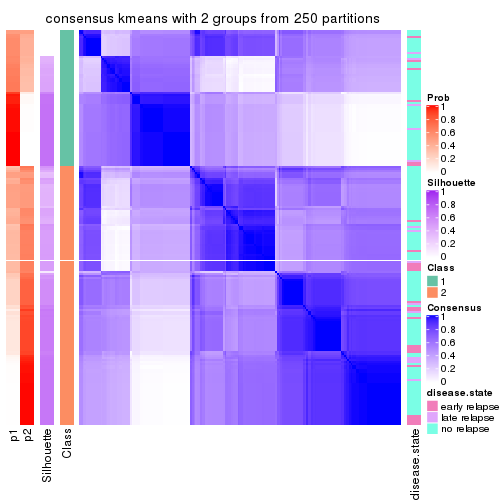</p>

</div>
<div id='tab-SD-kmeans-consensus-heatmap-2'>
<pre><code class="r">consensus_heatmap(res, k = 3)
</code></pre>

<p>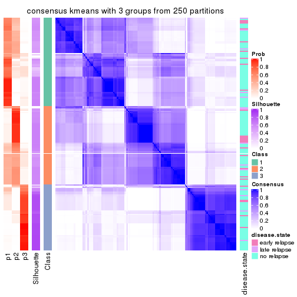</p>

</div>
<div id='tab-SD-kmeans-consensus-heatmap-3'>
<pre><code class="r">consensus_heatmap(res, k = 4)
</code></pre>

<p>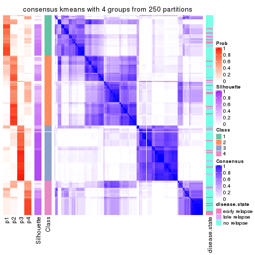</p>

</div>
<div id='tab-SD-kmeans-consensus-heatmap-4'>
<pre><code class="r">consensus_heatmap(res, k = 5)
</code></pre>

<p>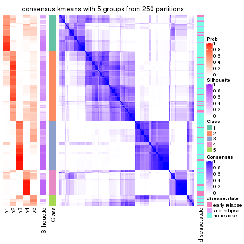</p>

</div>
<div id='tab-SD-kmeans-consensus-heatmap-5'>
<pre><code class="r">consensus_heatmap(res, k = 6)
</code></pre>

<p>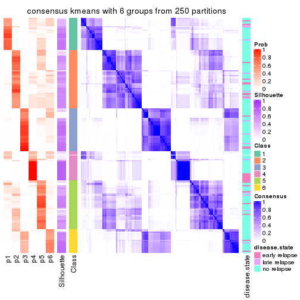</p>

</div>
</div>

Heatmaps for the membership of samples in all partitions to see how consistent they are:


<script>
$( function() {
	$( '#tabs-SD-kmeans-membership-heatmap' ).tabs();
} );
</script>
<div id='tabs-SD-kmeans-membership-heatmap'>
<ul>
<li><a href='#tab-SD-kmeans-membership-heatmap-1'>k = 2</a></li>
<li><a href='#tab-SD-kmeans-membership-heatmap-2'>k = 3</a></li>
<li><a href='#tab-SD-kmeans-membership-heatmap-3'>k = 4</a></li>
<li><a href='#tab-SD-kmeans-membership-heatmap-4'>k = 5</a></li>
<li><a href='#tab-SD-kmeans-membership-heatmap-5'>k = 6</a></li>
</ul>
<div id='tab-SD-kmeans-membership-heatmap-1'>
<pre><code class="r">membership_heatmap(res, k = 2)
</code></pre>

<p>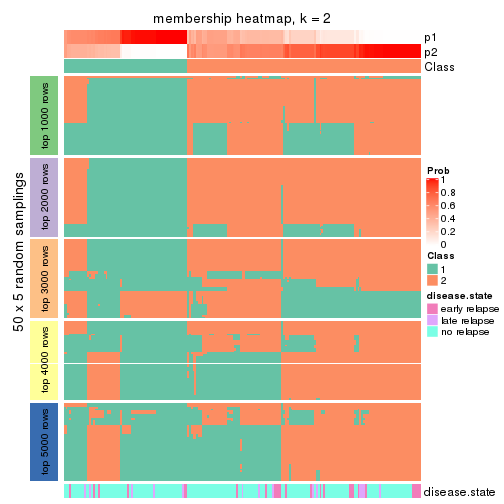</p>

</div>
<div id='tab-SD-kmeans-membership-heatmap-2'>
<pre><code class="r">membership_heatmap(res, k = 3)
</code></pre>

<p>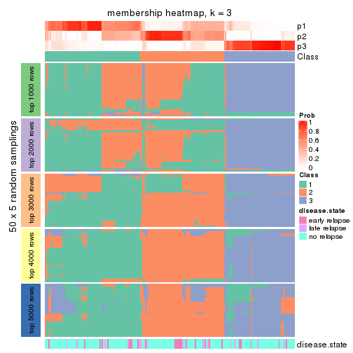</p>

</div>
<div id='tab-SD-kmeans-membership-heatmap-3'>
<pre><code class="r">membership_heatmap(res, k = 4)
</code></pre>

<p>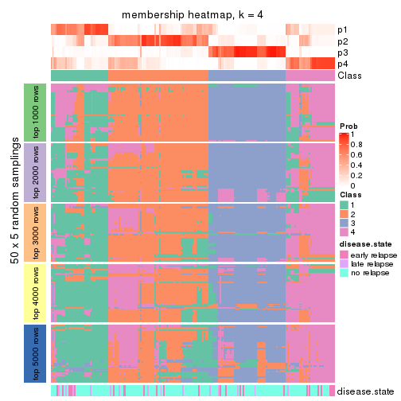</p>

</div>
<div id='tab-SD-kmeans-membership-heatmap-4'>
<pre><code class="r">membership_heatmap(res, k = 5)
</code></pre>

<p>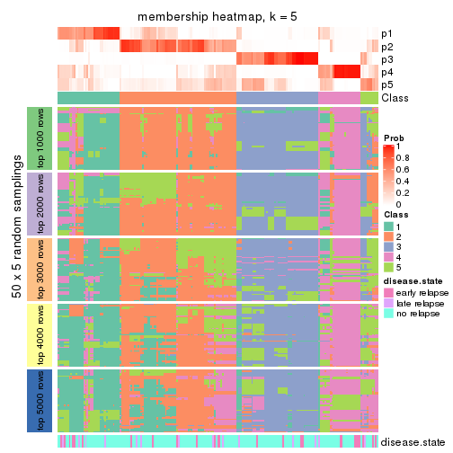</p>

</div>
<div id='tab-SD-kmeans-membership-heatmap-5'>
<pre><code class="r">membership_heatmap(res, k = 6)
</code></pre>

<p>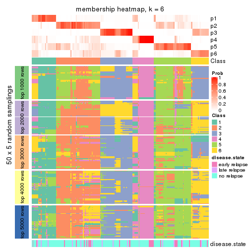</p>

</div>
</div>

As soon as we have had the classes for columns, we can look for signatures
which are significantly different between classes which can be candidate marks
for certain classes. Following are the heatmaps for signatures.


Signature heatmaps where rows are scaled:


<script>
$( function() {
	$( '#tabs-SD-kmeans-get-signatures' ).tabs();
} );
</script>
<div id='tabs-SD-kmeans-get-signatures'>
<ul>
<li><a href='#tab-SD-kmeans-get-signatures-1'>k = 2</a></li>
<li><a href='#tab-SD-kmeans-get-signatures-2'>k = 3</a></li>
<li><a href='#tab-SD-kmeans-get-signatures-3'>k = 4</a></li>
<li><a href='#tab-SD-kmeans-get-signatures-4'>k = 5</a></li>
<li><a href='#tab-SD-kmeans-get-signatures-5'>k = 6</a></li>
</ul>
<div id='tab-SD-kmeans-get-signatures-1'>
<pre><code class="r">get_signatures(res, k = 2)
</code></pre>

<p>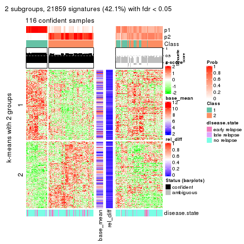</p>

</div>
<div id='tab-SD-kmeans-get-signatures-2'>
<pre><code class="r">get_signatures(res, k = 3)
</code></pre>

<p>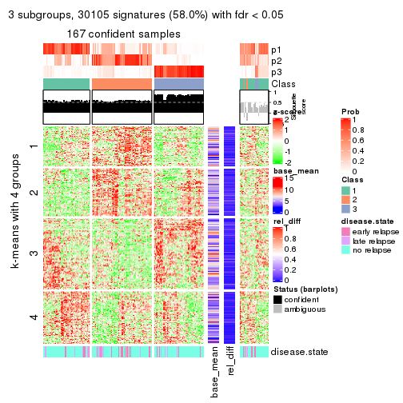</p>

</div>
<div id='tab-SD-kmeans-get-signatures-3'>
<pre><code class="r">get_signatures(res, k = 4)
</code></pre>

<p>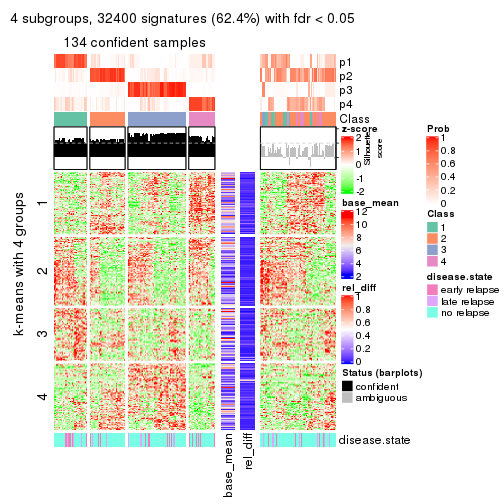</p>

</div>
<div id='tab-SD-kmeans-get-signatures-4'>
<pre><code class="r">get_signatures(res, k = 5)
</code></pre>

<p>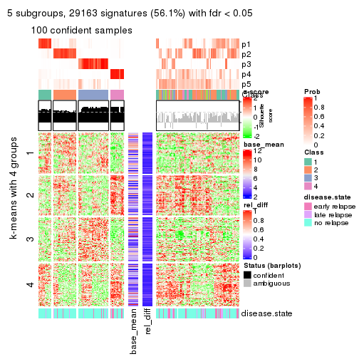</p>

</div>
<div id='tab-SD-kmeans-get-signatures-5'>
<pre><code class="r">get_signatures(res, k = 6)
</code></pre>

<p>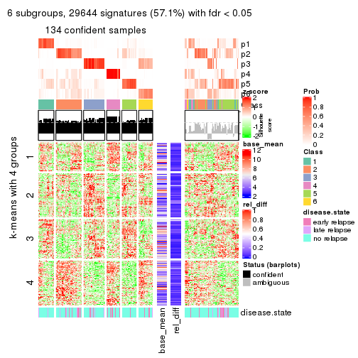</p>

</div>
</div>


Signature heatmaps where rows are not scaled:


<script>
$( function() {
	$( '#tabs-SD-kmeans-get-signatures-no-scale' ).tabs();
} );
</script>
<div id='tabs-SD-kmeans-get-signatures-no-scale'>
<ul>
<li><a href='#tab-SD-kmeans-get-signatures-no-scale-1'>k = 2</a></li>
<li><a href='#tab-SD-kmeans-get-signatures-no-scale-2'>k = 3</a></li>
<li><a href='#tab-SD-kmeans-get-signatures-no-scale-3'>k = 4</a></li>
<li><a href='#tab-SD-kmeans-get-signatures-no-scale-4'>k = 5</a></li>
<li><a href='#tab-SD-kmeans-get-signatures-no-scale-5'>k = 6</a></li>
</ul>
<div id='tab-SD-kmeans-get-signatures-no-scale-1'>
<pre><code class="r">get_signatures(res, k = 2, scale_rows = FALSE)
</code></pre>

<p>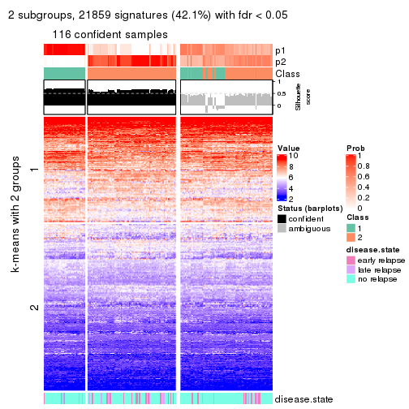</p>

</div>
<div id='tab-SD-kmeans-get-signatures-no-scale-2'>
<pre><code class="r">get_signatures(res, k = 3, scale_rows = FALSE)
</code></pre>

<p>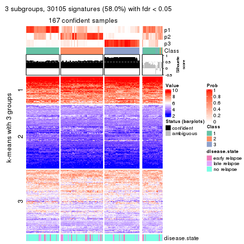</p>

</div>
<div id='tab-SD-kmeans-get-signatures-no-scale-3'>
<pre><code class="r">get_signatures(res, k = 4, scale_rows = FALSE)
</code></pre>

<p>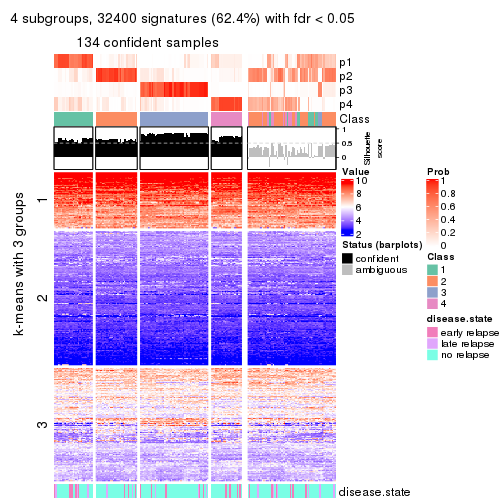</p>

</div>
<div id='tab-SD-kmeans-get-signatures-no-scale-4'>
<pre><code class="r">get_signatures(res, k = 5, scale_rows = FALSE)
</code></pre>

<p>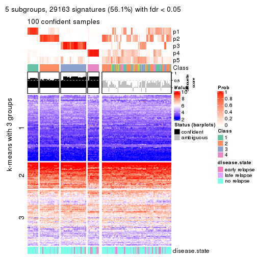</p>

</div>
<div id='tab-SD-kmeans-get-signatures-no-scale-5'>
<pre><code class="r">get_signatures(res, k = 6, scale_rows = FALSE)
</code></pre>

<p>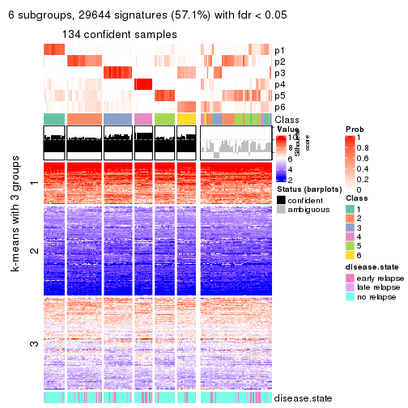</p>

</div>
</div>


Compare the overlap of signatures from different k:

```r
compare_signatures(res)
```

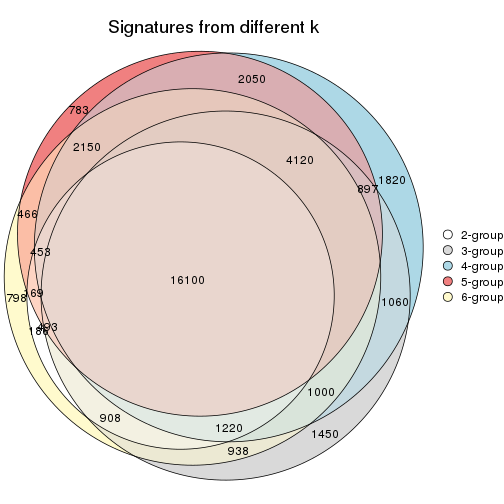

`get_signature()` returns a data frame invisibly. TO get the list of signatures, the function
call should be assigned to a variable explicitly. In following code, if `plot` argument is set
to `FALSE`, no heatmap is plotted while only the differential analysis is performed.

```r
# code only for demonstration
tb = get_signature(res, k = ..., plot = FALSE)
```

An example of the output of `tb` is:

```
#>   which_row         fdr    mean_1    mean_2 scaled_mean_1 scaled_mean_2 km
#> 1        38 0.042760348  8.373488  9.131774    -0.5533452     0.5164555  1
#> 2        40 0.018707592  7.106213  8.469186    -0.6173731     0.5762149  1
#> 3        55 0.019134737 10.221463 11.207825    -0.6159697     0.5749050  1
#> 4        59 0.006059896  5.921854  7.869574    -0.6899429     0.6439467  1
#> 5        60 0.018055526  8.928898 10.211722    -0.6204761     0.5791110  1
#> 6        98 0.009384629 15.714769 14.887706     0.6635654    -0.6193277  2
...
```

The columns in `tb` are:

1. `which_row`: row indices corresponding to the input matrix.
2. `fdr`: FDR for the differential test. 
3. `mean_x`: The mean value in group x.
4. `scaled_mean_x`: The mean value in group x after rows are scaled.
5. `km`: Row groups if k-means clustering is applied to rows.


UMAP plot which shows how samples are separated.


<script>
$( function() {
	$( '#tabs-SD-kmeans-dimension-reduction' ).tabs();
} );
</script>
<div id='tabs-SD-kmeans-dimension-reduction'>
<ul>
<li><a href='#tab-SD-kmeans-dimension-reduction-1'>k = 2</a></li>
<li><a href='#tab-SD-kmeans-dimension-reduction-2'>k = 3</a></li>
<li><a href='#tab-SD-kmeans-dimension-reduction-3'>k = 4</a></li>
<li><a href='#tab-SD-kmeans-dimension-reduction-4'>k = 5</a></li>
<li><a href='#tab-SD-kmeans-dimension-reduction-5'>k = 6</a></li>
</ul>
<div id='tab-SD-kmeans-dimension-reduction-1'>
<pre><code class="r">dimension_reduction(res, k = 2, method = &quot;UMAP&quot;)
</code></pre>

<p>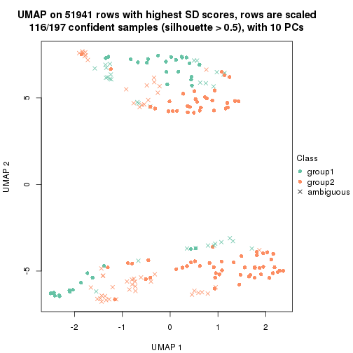</p>

</div>
<div id='tab-SD-kmeans-dimension-reduction-2'>
<pre><code class="r">dimension_reduction(res, k = 3, method = &quot;UMAP&quot;)
</code></pre>

<p>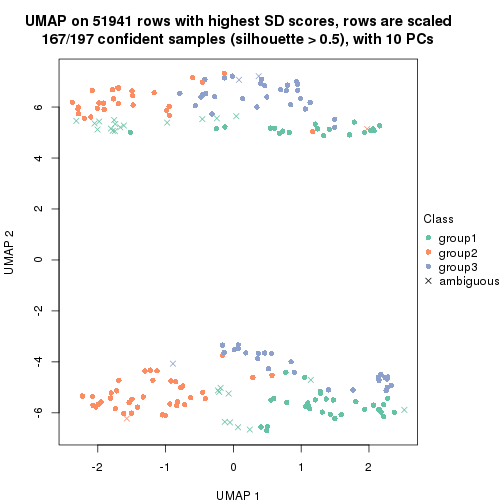</p>

</div>
<div id='tab-SD-kmeans-dimension-reduction-3'>
<pre><code class="r">dimension_reduction(res, k = 4, method = &quot;UMAP&quot;)
</code></pre>

<p>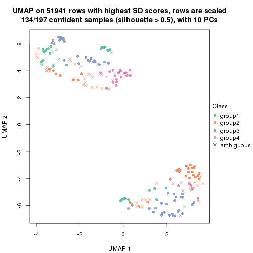</p>

</div>
<div id='tab-SD-kmeans-dimension-reduction-4'>
<pre><code class="r">dimension_reduction(res, k = 5, method = &quot;UMAP&quot;)
</code></pre>

<p>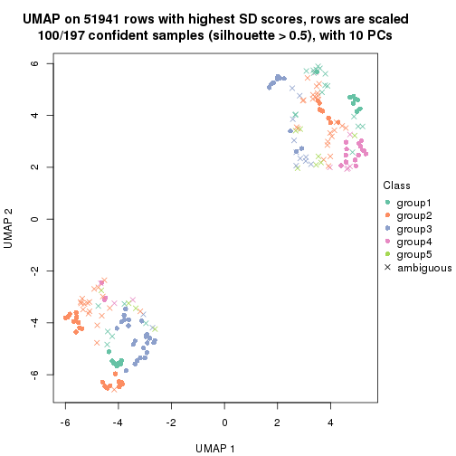</p>

</div>
<div id='tab-SD-kmeans-dimension-reduction-5'>
<pre><code class="r">dimension_reduction(res, k = 6, method = &quot;UMAP&quot;)
</code></pre>

<p>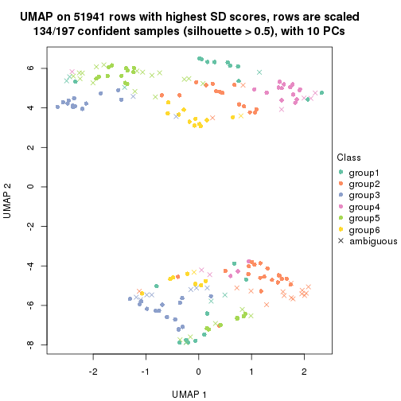</p>

</div>
</div>


Following heatmap shows how subgroups are split when increasing `k`:

```r
collect_classes(res)
```

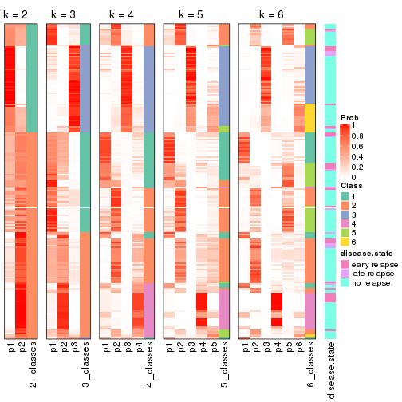


Test correlation between subgroups and known annotations. If the known
annotation is numeric, one-way ANOVA test is applied, and if the known
annotation is discrete, chi-squared contingency table test is applied.

```r
test_to_known_factors(res)
```

```
#>             n disease.state(p) k
#> SD:kmeans 116           0.3756 2
#> SD:kmeans 167           0.3873 3
#> SD:kmeans 134           0.3146 4
#> SD:kmeans 100           0.0324 5
#> SD:kmeans 134           0.0755 6
```


If matrix rows can be associated to genes, consider to use `functional_enrichment(res,
...)` to perform function enrichment for the signature genes. See [this vignette](http://bioconductor.org/packages/devel/bioc/vignettes/cola/inst/doc/functional_enrichment.html) for more detailed explanations.


 

---------------------------------------------------


### SD:skmeans


The object with results only for a single top-value method and a single partition method 
can be extracted as:

```r
res = res_list["SD", "skmeans"]
# you can also extract it by
# res = res_list["SD:skmeans"]
```

A summary of `res` and all the functions that can be applied to it:

```r
res
```

```
#> A 'ConsensusPartition' object with k = 2, 3, 4, 5, 6.
#>   On a matrix with 51941 rows and 197 columns.
#>   Top rows (1000, 2000, 3000, 4000, 5000) are extracted by 'SD' method.
#>   Subgroups are detected by 'skmeans' method.
#>   Performed in total 1250 partitions by row resampling.
#>   Best k for subgroups seems to be 4.
#> 
#> Following methods can be applied to this 'ConsensusPartition' object:
#>  [1] "cola_report"             "collect_classes"         "collect_plots"          
#>  [4] "collect_stats"           "colnames"                "compare_signatures"     
#>  [7] "consensus_heatmap"       "dimension_reduction"     "functional_enrichment"  
#> [10] "get_anno_col"            "get_anno"                "get_classes"            
#> [13] "get_consensus"           "get_matrix"              "get_membership"         
#> [16] "get_param"               "get_signatures"          "get_stats"              
#> [19] "is_best_k"               "is_stable_k"             "membership_heatmap"     
#> [22] "ncol"                    "nrow"                    "plot_ecdf"              
#> [25] "rownames"                "select_partition_number" "show"                   
#> [28] "suggest_best_k"          "test_to_known_factors"
```

`collect_plots()` function collects all the plots made from `res` for all `k` (number of partitions)
into one single page to provide an easy and fast comparison between different `k`.

```r
collect_plots(res)
```

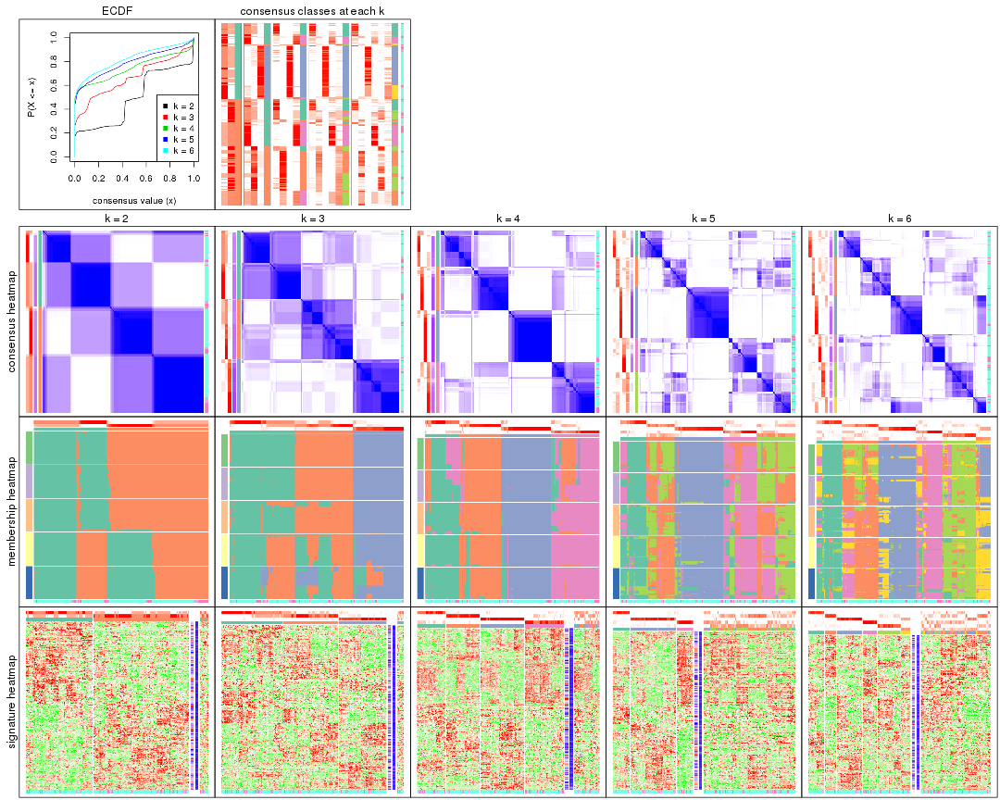

The plots are:

- The first row: a plot of the ECDF (empirical cumulative distribution
  function) curves of the consensus matrix for each `k` and the heatmap of
  predicted classes for each `k`.
- The second row: heatmaps of the consensus matrix for each `k`.
- The third row: heatmaps of the membership matrix for each `k`.
- The fouth row: heatmaps of the signatures for each `k`.

All the plots in panels can be made by individual functions and they are
plotted later in this section.

`select_partition_number()` produces several plots showing different
statistics for choosing "optimized" `k`. There are following statistics:

- ECDF curves of the consensus matrix for each `k`;
- 1-PAC. [The PAC
  score](https://en.wikipedia.org/wiki/Consensus_clustering#Over-interpretation_potential_of_consensus_clustering)
  measures the proportion of the ambiguous subgrouping.
- Mean silhouette score.
- Concordance. The mean probability of fiting the consensus class ids in all
  partitions.
- Area increased. Denote $A_k$ as the area under the ECDF curve for current
  `k`, the area increased is defined as $A_k - A_{k-1}$.
- Rand index. The percent of pairs of samples that are both in a same cluster
  or both are not in a same cluster in the partition of k and k-1.
- Jaccard index. The ratio of pairs of samples are both in a same cluster in
  the partition of k and k-1 and the pairs of samples are both in a same
  cluster in the partition k or k-1.

The detailed explanations of these statistics can be found in [the _cola_
vignette](http://bioconductor.org/packages/devel/bioc/vignettes/cola/inst/doc/cola.html#toc_13).

Generally speaking, lower PAC score, higher mean silhouette score or higher
concordance corresponds to better partition. Rand index and Jaccard index
measure how similar the current partition is compared to partition with `k-1`.
If they are too similar, we won't accept `k` is better than `k-1`.

```r
select_partition_number(res)
```

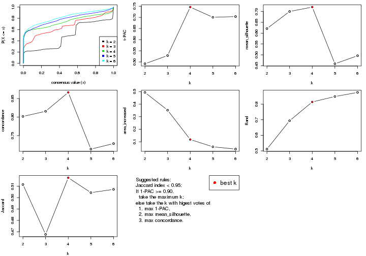

The numeric values for all these statistics can be obtained by `get_stats()`.

```r
get_stats(res)
```

```
#>   k 1-PAC mean_silhouette concordance area_increased  Rand Jaccard
#> 2 2 0.492           0.621       0.802         0.4933 0.512   0.512
#> 3 3 0.529           0.700       0.816         0.3519 0.694   0.468
#> 4 4 0.746           0.720       0.867         0.1182 0.814   0.517
#> 5 5 0.700           0.459       0.713         0.0602 0.849   0.504
#> 6 6 0.704           0.496       0.728         0.0420 0.875   0.507
```

`suggest_best_k()` suggests the best $k$ based on these statistics. The rules are as follows:

- All $k$ with Jaccard index larger than 0.95 are removed because increasing
  $k$ does not provide enough extra information. If all $k$ are removed, it is
  marked as no subgroup is detected.
- For all $k$ with 1-PAC score larger than 0.9, the maximal $k$ is taken as
  the best $k$, and other $k$ are marked as optional $k$.
- If it does not fit the second rule. The $k$ with the maximal vote of the
  highest 1-PAC score, highest mean silhouette, and highest concordance is
  taken as the best $k$.

```r
suggest_best_k(res)
```

```
#> [1] 4
```


Following shows the table of the partitions (You need to click the **show/hide
code output** link to see it). The membership matrix (columns with name `p*`)
is inferred by
[`clue::cl_consensus()`](https://www.rdocumentation.org/link/cl_consensus?package=clue)
function with the `SE` method. Basically the value in the membership matrix
represents the probability to belong to a certain group. The finall class
label for an item is determined with the group with highest probability it
belongs to.

In `get_classes()` function, the entropy is calculated from the membership
matrix and the silhouette score is calculated from the consensus matrix.


<script>
$( function() {
	$( '#tabs-SD-skmeans-get-classes' ).tabs();
} );
</script>
<div id='tabs-SD-skmeans-get-classes'>
<ul>
<li><a href='#tab-SD-skmeans-get-classes-1'>k = 2</a></li>
<li><a href='#tab-SD-skmeans-get-classes-2'>k = 3</a></li>
<li><a href='#tab-SD-skmeans-get-classes-3'>k = 4</a></li>
<li><a href='#tab-SD-skmeans-get-classes-4'>k = 5</a></li>
<li><a href='#tab-SD-skmeans-get-classes-5'>k = 6</a></li>
</ul>

<div id='tab-SD-skmeans-get-classes-1'>
<p><a id='tab-SD-skmeans-get-classes-1-a' style='color:#0366d6' href='#'>show/hide code output</a></p>
<pre><code class="r">cbind(get_classes(res, k = 2), get_membership(res, k = 2))
</code></pre>

<pre><code>#&gt;           class entropy silhouette    p1    p2
#&gt; GSM342319     2  0.0000      0.600 0.000 1.000
#&gt; GSM342323     2  0.9795      0.707 0.416 0.584
#&gt; GSM342325     2  0.0000      0.600 0.000 1.000
#&gt; GSM342326     2  0.9795      0.707 0.416 0.584
#&gt; GSM342327     2  0.9795      0.707 0.416 0.584
#&gt; GSM342329     2  0.9795      0.707 0.416 0.584
#&gt; GSM342331     2  0.9795      0.707 0.416 0.584
#&gt; GSM342334     2  0.9795      0.707 0.416 0.584
#&gt; GSM342335     2  0.9795      0.707 0.416 0.584
#&gt; GSM342354     1  0.0938      0.563 0.988 0.012
#&gt; GSM342371     2  0.9795      0.707 0.416 0.584
#&gt; GSM342380     2  0.0000      0.600 0.000 1.000
#&gt; GSM342382     2  0.0000      0.600 0.000 1.000
#&gt; GSM342399     2  0.0000      0.600 0.000 1.000
#&gt; GSM342402     2  0.9129     -0.262 0.328 0.672
#&gt; GSM342404     2  0.9795      0.707 0.416 0.584
#&gt; GSM342408     1  0.0000      0.559 1.000 0.000
#&gt; GSM342409     1  0.6887      0.195 0.816 0.184
#&gt; GSM342426     2  0.9795      0.707 0.416 0.584
#&gt; GSM342441     1  0.9795      0.719 0.584 0.416
#&gt; GSM342444     1  0.9795      0.719 0.584 0.416
#&gt; GSM342451     1  0.9795      0.719 0.584 0.416
#&gt; GSM342462     2  0.9795      0.707 0.416 0.584
#&gt; GSM342467     1  1.0000     -0.604 0.504 0.496
#&gt; GSM342484     1  0.9833      0.712 0.576 0.424
#&gt; GSM342491     1  0.0000      0.559 1.000 0.000
#&gt; GSM342322     2  0.0000      0.600 0.000 1.000
#&gt; GSM342338     1  0.9795      0.719 0.584 0.416
#&gt; GSM342347     1  0.0000      0.559 1.000 0.000
#&gt; GSM342356     1  0.9795      0.719 0.584 0.416
#&gt; GSM342357     2  0.9580     -0.396 0.380 0.620
#&gt; GSM342366     2  0.9795      0.707 0.416 0.584
#&gt; GSM342385     2  0.0000      0.600 0.000 1.000
#&gt; GSM342421     2  0.9795      0.707 0.416 0.584
#&gt; GSM342437     2  0.9795      0.707 0.416 0.584
#&gt; GSM342454     1  0.9795      0.719 0.584 0.416
#&gt; GSM342471     2  0.9795      0.707 0.416 0.584
#&gt; GSM342477     2  0.9795      0.707 0.416 0.584
#&gt; GSM342495     2  0.9795      0.707 0.416 0.584
#&gt; GSM342496     2  0.6247      0.299 0.156 0.844
#&gt; GSM342320     2  0.9795      0.707 0.416 0.584
#&gt; GSM342321     2  0.9795      0.707 0.416 0.584
#&gt; GSM342324     2  0.9795      0.707 0.416 0.584
#&gt; GSM342328     2  0.9795      0.707 0.416 0.584
#&gt; GSM342330     2  0.9795      0.707 0.416 0.584
#&gt; GSM342332     2  0.9795      0.707 0.416 0.584
#&gt; GSM342333     2  0.9944      0.663 0.456 0.544
#&gt; GSM342336     2  0.9795      0.707 0.416 0.584
#&gt; GSM342337     1  0.9795      0.719 0.584 0.416
#&gt; GSM342339     1  0.9795      0.719 0.584 0.416
#&gt; GSM342340     1  0.9795      0.719 0.584 0.416
#&gt; GSM342341     1  0.9795      0.719 0.584 0.416
#&gt; GSM342342     1  0.9795      0.719 0.584 0.416
#&gt; GSM342343     1  0.9795      0.719 0.584 0.416
#&gt; GSM342344     1  0.9732      0.715 0.596 0.404
#&gt; GSM342345     1  0.9795      0.719 0.584 0.416
#&gt; GSM342346     1  0.9954     -0.548 0.540 0.460
#&gt; GSM342348     1  0.9795      0.719 0.584 0.416
#&gt; GSM342349     1  0.0000      0.559 1.000 0.000
#&gt; GSM342350     1  0.0000      0.559 1.000 0.000
#&gt; GSM342351     1  0.0000      0.559 1.000 0.000
#&gt; GSM342352     1  0.0000      0.559 1.000 0.000
#&gt; GSM342353     1  0.9795      0.719 0.584 0.416
#&gt; GSM342355     1  0.9795      0.719 0.584 0.416
#&gt; GSM342358     1  0.7299      0.140 0.796 0.204
#&gt; GSM342359     1  0.0672      0.550 0.992 0.008
#&gt; GSM342360     1  0.0672      0.550 0.992 0.008
#&gt; GSM342361     1  0.0672      0.550 0.992 0.008
#&gt; GSM342362     1  0.9896     -0.513 0.560 0.440
#&gt; GSM342363     2  0.5178      0.396 0.116 0.884
#&gt; GSM342364     2  0.1414      0.607 0.020 0.980
#&gt; GSM342365     2  0.9795      0.707 0.416 0.584
#&gt; GSM342367     2  0.0000      0.600 0.000 1.000
#&gt; GSM342368     2  0.1184      0.606 0.016 0.984
#&gt; GSM342369     2  0.9795      0.707 0.416 0.584
#&gt; GSM342370     2  0.9795      0.707 0.416 0.584
#&gt; GSM342372     2  0.9795      0.707 0.416 0.584
#&gt; GSM342373     2  0.9795      0.707 0.416 0.584
#&gt; GSM342374     2  0.9795      0.707 0.416 0.584
#&gt; GSM342375     2  0.9795      0.707 0.416 0.584
#&gt; GSM342376     2  0.0000      0.600 0.000 1.000
#&gt; GSM342377     2  0.0000      0.600 0.000 1.000
#&gt; GSM342378     2  0.0000      0.600 0.000 1.000
#&gt; GSM342379     2  0.0376      0.601 0.004 0.996
#&gt; GSM342381     2  0.0000      0.600 0.000 1.000
#&gt; GSM342383     2  0.0000      0.600 0.000 1.000
#&gt; GSM342384     2  0.0000      0.600 0.000 1.000
#&gt; GSM342386     2  0.0000      0.600 0.000 1.000
#&gt; GSM342387     2  0.9795      0.707 0.416 0.584
#&gt; GSM342388     1  0.9795      0.719 0.584 0.416
#&gt; GSM342389     2  0.0000      0.600 0.000 1.000
#&gt; GSM342390     1  0.9795      0.719 0.584 0.416
#&gt; GSM342391     2  0.4690      0.433 0.100 0.900
#&gt; GSM342392     1  0.9795      0.719 0.584 0.416
#&gt; GSM342393     2  0.9795      0.707 0.416 0.584
#&gt; GSM342394     2  0.0000      0.600 0.000 1.000
#&gt; GSM342395     2  0.9795      0.707 0.416 0.584
#&gt; GSM342396     1  0.9795      0.719 0.584 0.416
#&gt; GSM342397     1  0.0000      0.559 1.000 0.000
#&gt; GSM342398     2  0.0000      0.600 0.000 1.000
#&gt; GSM342400     2  0.0000      0.600 0.000 1.000
#&gt; GSM342401     1  0.9795      0.719 0.584 0.416
#&gt; GSM342403     2  0.0938      0.584 0.012 0.988
#&gt; GSM342405     1  0.0000      0.559 1.000 0.000
#&gt; GSM342406     1  0.9795      0.719 0.584 0.416
#&gt; GSM342407     1  0.0000      0.559 1.000 0.000
#&gt; GSM342410     1  0.9944      0.675 0.544 0.456
#&gt; GSM342411     2  0.9795      0.707 0.416 0.584
#&gt; GSM342412     2  0.9795      0.707 0.416 0.584
#&gt; GSM342413     1  0.0000      0.559 1.000 0.000
#&gt; GSM342414     1  0.0000      0.559 1.000 0.000
#&gt; GSM342415     2  0.9795      0.707 0.416 0.584
#&gt; GSM342416     1  0.7950      0.647 0.760 0.240
#&gt; GSM342417     2  0.9795      0.707 0.416 0.584
#&gt; GSM342418     2  0.9795      0.707 0.416 0.584
#&gt; GSM342419     2  0.0000      0.600 0.000 1.000
#&gt; GSM342420     2  0.9795      0.707 0.416 0.584
#&gt; GSM342422     2  0.0000      0.600 0.000 1.000
#&gt; GSM342423     2  0.9795      0.707 0.416 0.584
#&gt; GSM342424     2  0.9795      0.707 0.416 0.584
#&gt; GSM342425     2  0.9795      0.707 0.416 0.584
#&gt; GSM342427     2  0.9795      0.707 0.416 0.584
#&gt; GSM342428     2  0.9795      0.707 0.416 0.584
#&gt; GSM342429     2  0.5629      0.632 0.132 0.868
#&gt; GSM342430     1  0.9795      0.719 0.584 0.416
#&gt; GSM342431     1  0.9795      0.719 0.584 0.416
#&gt; GSM342432     1  0.9795      0.719 0.584 0.416
#&gt; GSM342433     1  0.0000      0.559 1.000 0.000
#&gt; GSM342434     1  0.0000      0.559 1.000 0.000
#&gt; GSM342435     1  0.0000      0.559 1.000 0.000
#&gt; GSM342436     1  0.9795      0.719 0.584 0.416
#&gt; GSM342438     1  0.9795      0.719 0.584 0.416
#&gt; GSM342439     1  0.9795      0.719 0.584 0.416
#&gt; GSM342440     1  0.9795      0.719 0.584 0.416
#&gt; GSM342442     1  0.9795      0.719 0.584 0.416
#&gt; GSM342443     2  0.9795      0.707 0.416 0.584
#&gt; GSM342445     1  0.9795      0.719 0.584 0.416
#&gt; GSM342446     1  0.9795      0.719 0.584 0.416
#&gt; GSM342447     1  0.9795      0.719 0.584 0.416
#&gt; GSM342448     1  0.0000      0.559 1.000 0.000
#&gt; GSM342449     1  0.9795      0.719 0.584 0.416
#&gt; GSM342450     1  0.0000      0.559 1.000 0.000
#&gt; GSM342452     1  0.9795      0.719 0.584 0.416
#&gt; GSM342453     1  0.9795      0.719 0.584 0.416
#&gt; GSM342455     1  0.9795      0.719 0.584 0.416
#&gt; GSM342456     1  0.0672      0.550 0.992 0.008
#&gt; GSM342457     2  0.0938      0.604 0.012 0.988
#&gt; GSM342458     2  0.9795      0.707 0.416 0.584
#&gt; GSM342459     2  0.9795      0.707 0.416 0.584
#&gt; GSM342460     2  0.9795      0.707 0.416 0.584
#&gt; GSM342461     2  0.0938      0.604 0.012 0.988
#&gt; GSM342463     2  0.0000      0.600 0.000 1.000
#&gt; GSM342464     2  0.0000      0.600 0.000 1.000
#&gt; GSM342465     2  0.0000      0.600 0.000 1.000
#&gt; GSM342466     1  0.9795      0.719 0.584 0.416
#&gt; GSM342468     2  0.9795      0.707 0.416 0.584
#&gt; GSM342469     2  0.0000      0.600 0.000 1.000
#&gt; GSM342470     1  0.0000      0.559 1.000 0.000
#&gt; GSM342472     1  0.0000      0.559 1.000 0.000
#&gt; GSM342473     2  0.1843      0.609 0.028 0.972
#&gt; GSM342474     2  0.1843      0.609 0.028 0.972
#&gt; GSM342475     1  0.9795      0.719 0.584 0.416
#&gt; GSM342476     2  0.9795      0.707 0.416 0.584
#&gt; GSM342478     2  0.8144      0.663 0.252 0.748
#&gt; GSM342479     2  0.0000      0.600 0.000 1.000
#&gt; GSM342480     2  0.9795      0.707 0.416 0.584
#&gt; GSM342481     2  0.0376      0.601 0.004 0.996
#&gt; GSM342482     2  0.9795      0.707 0.416 0.584
#&gt; GSM342483     2  0.7602      0.654 0.220 0.780
#&gt; GSM342485     2  0.0000      0.600 0.000 1.000
#&gt; GSM342486     2  0.0000      0.600 0.000 1.000
#&gt; GSM342487     1  0.0000      0.559 1.000 0.000
#&gt; GSM342488     2  0.9795      0.707 0.416 0.584
#&gt; GSM342489     2  0.9795      0.707 0.416 0.584
#&gt; GSM342490     2  0.9795      0.707 0.416 0.584
#&gt; GSM342492     1  0.0000      0.559 1.000 0.000
#&gt; GSM342493     2  0.0000      0.600 0.000 1.000
#&gt; GSM342494     2  0.9795      0.707 0.416 0.584
#&gt; GSM342497     2  0.9795      0.707 0.416 0.584
#&gt; GSM342498     2  0.0000      0.600 0.000 1.000
#&gt; GSM342499     2  0.0000      0.600 0.000 1.000
#&gt; GSM342500     2  0.9795      0.707 0.416 0.584
#&gt; GSM342501     2  0.0000      0.600 0.000 1.000
#&gt; GSM342502     2  0.0000      0.600 0.000 1.000
#&gt; GSM342503     2  0.1184      0.606 0.016 0.984
#&gt; GSM342504     2  0.9754      0.705 0.408 0.592
#&gt; GSM342505     1  0.9795      0.719 0.584 0.416
#&gt; GSM342506     1  0.9815      0.716 0.580 0.420
#&gt; GSM342507     1  0.9833      0.712 0.576 0.424
#&gt; GSM342508     1  0.9795      0.719 0.584 0.416
#&gt; GSM342509     1  0.9795      0.719 0.584 0.416
#&gt; GSM342510     1  0.0672      0.550 0.992 0.008
#&gt; GSM342511     1  0.0000      0.559 1.000 0.000
#&gt; GSM342512     2  0.0000      0.600 0.000 1.000
#&gt; GSM342513     2  0.0000      0.600 0.000 1.000
#&gt; GSM342514     1  0.0938      0.563 0.988 0.012
#&gt; GSM342515     2  0.0000      0.600 0.000 1.000
</code></pre>

<script>
$('#tab-SD-skmeans-get-classes-1-a').parent().next().next().hide();
$('#tab-SD-skmeans-get-classes-1-a').click(function(){
  $('#tab-SD-skmeans-get-classes-1-a').parent().next().next().toggle();
  return(false);
});
</script>
</div>

<div id='tab-SD-skmeans-get-classes-2'>
<p><a id='tab-SD-skmeans-get-classes-2-a' style='color:#0366d6' href='#'>show/hide code output</a></p>
<pre><code class="r">cbind(get_classes(res, k = 3), get_membership(res, k = 3))
</code></pre>

<pre><code>#&gt;           class entropy silhouette    p1    p2    p3
#&gt; GSM342319     1  0.6225     0.6252 0.568 0.432 0.000
#&gt; GSM342323     1  0.0000     0.6893 1.000 0.000 0.000
#&gt; GSM342325     1  0.6225     0.6252 0.568 0.432 0.000
#&gt; GSM342326     1  0.0000     0.6893 1.000 0.000 0.000
#&gt; GSM342327     1  0.0000     0.6893 1.000 0.000 0.000
#&gt; GSM342329     1  0.0000     0.6893 1.000 0.000 0.000
#&gt; GSM342331     1  0.0000     0.6893 1.000 0.000 0.000
#&gt; GSM342334     1  0.0424     0.6827 0.992 0.008 0.000
#&gt; GSM342335     2  0.6225     0.5982 0.432 0.568 0.000
#&gt; GSM342354     3  0.3340     0.8604 0.120 0.000 0.880
#&gt; GSM342371     2  0.3551     0.6984 0.132 0.868 0.000
#&gt; GSM342380     1  0.6225     0.6252 0.568 0.432 0.000
#&gt; GSM342382     2  0.0000     0.6822 0.000 1.000 0.000
#&gt; GSM342399     1  0.6225     0.6252 0.568 0.432 0.000
#&gt; GSM342402     1  0.6204     0.6289 0.576 0.424 0.000
#&gt; GSM342404     2  0.6225     0.5982 0.432 0.568 0.000
#&gt; GSM342408     3  0.5706     0.6310 0.320 0.000 0.680
#&gt; GSM342409     2  0.8731     0.3424 0.120 0.528 0.352
#&gt; GSM342426     1  0.0000     0.6893 1.000 0.000 0.000
#&gt; GSM342441     3  0.0000     0.8926 0.000 0.000 1.000
#&gt; GSM342444     3  0.2796     0.8808 0.000 0.092 0.908
#&gt; GSM342451     3  0.2796     0.8808 0.000 0.092 0.908
#&gt; GSM342462     2  0.8354     0.6471 0.320 0.576 0.104
#&gt; GSM342467     1  0.7624    -0.3241 0.560 0.392 0.048
#&gt; GSM342484     1  0.8312     0.5999 0.576 0.324 0.100
#&gt; GSM342491     1  0.3412     0.6336 0.876 0.000 0.124
#&gt; GSM342322     1  0.6225     0.6252 0.568 0.432 0.000
#&gt; GSM342338     3  0.3340     0.8687 0.000 0.120 0.880
#&gt; GSM342347     3  0.3412     0.8577 0.124 0.000 0.876
#&gt; GSM342356     3  0.4555     0.8059 0.000 0.200 0.800
#&gt; GSM342357     1  0.6225     0.6252 0.568 0.432 0.000
#&gt; GSM342366     2  0.0424     0.6847 0.008 0.992 0.000
#&gt; GSM342385     1  0.6225     0.6252 0.568 0.432 0.000
#&gt; GSM342421     2  0.6225     0.5982 0.432 0.568 0.000
#&gt; GSM342437     1  0.3038     0.6399 0.896 0.000 0.104
#&gt; GSM342454     3  0.0000     0.8926 0.000 0.000 1.000
#&gt; GSM342471     1  0.4062     0.6705 0.836 0.164 0.000
#&gt; GSM342477     1  0.2711     0.6479 0.912 0.000 0.088
#&gt; GSM342495     2  0.8395     0.6427 0.328 0.568 0.104
#&gt; GSM342496     2  0.3267     0.6997 0.000 0.884 0.116
#&gt; GSM342320     1  0.0000     0.6893 1.000 0.000 0.000
#&gt; GSM342321     1  0.0000     0.6893 1.000 0.000 0.000
#&gt; GSM342324     1  0.0000     0.6893 1.000 0.000 0.000
#&gt; GSM342328     1  0.0000     0.6893 1.000 0.000 0.000
#&gt; GSM342330     1  0.0000     0.6893 1.000 0.000 0.000
#&gt; GSM342332     1  0.0000     0.6893 1.000 0.000 0.000
#&gt; GSM342333     2  0.6442     0.5956 0.432 0.564 0.004
#&gt; GSM342336     1  0.0000     0.6893 1.000 0.000 0.000
#&gt; GSM342337     3  0.4605     0.8016 0.000 0.204 0.796
#&gt; GSM342339     3  0.3038     0.8773 0.000 0.104 0.896
#&gt; GSM342340     3  0.3816     0.8507 0.000 0.148 0.852
#&gt; GSM342341     3  0.3038     0.8773 0.000 0.104 0.896
#&gt; GSM342342     3  0.3038     0.8773 0.000 0.104 0.896
#&gt; GSM342343     3  0.4399     0.8170 0.000 0.188 0.812
#&gt; GSM342344     3  0.3359     0.8756 0.084 0.016 0.900
#&gt; GSM342345     3  0.3038     0.8773 0.000 0.104 0.896
#&gt; GSM342346     1  0.2261     0.6340 0.932 0.000 0.068
#&gt; GSM342348     1  0.6180     0.6312 0.584 0.416 0.000
#&gt; GSM342349     3  0.3340     0.8604 0.120 0.000 0.880
#&gt; GSM342350     3  0.3340     0.8604 0.120 0.000 0.880
#&gt; GSM342351     3  0.3879     0.8365 0.152 0.000 0.848
#&gt; GSM342352     3  0.3340     0.8604 0.120 0.000 0.880
#&gt; GSM342353     3  0.3359     0.8756 0.084 0.016 0.900
#&gt; GSM342355     3  0.4555     0.8059 0.000 0.200 0.800
#&gt; GSM342358     1  0.0000     0.6893 1.000 0.000 0.000
#&gt; GSM342359     1  0.0000     0.6893 1.000 0.000 0.000
#&gt; GSM342360     1  0.0000     0.6893 1.000 0.000 0.000
#&gt; GSM342361     1  0.0000     0.6893 1.000 0.000 0.000
#&gt; GSM342362     1  0.3619     0.6764 0.864 0.136 0.000
#&gt; GSM342363     1  0.6204     0.6289 0.576 0.424 0.000
#&gt; GSM342364     2  0.0000     0.6822 0.000 1.000 0.000
#&gt; GSM342365     2  0.6225     0.5982 0.432 0.568 0.000
#&gt; GSM342367     2  0.0000     0.6822 0.000 1.000 0.000
#&gt; GSM342368     2  0.0000     0.6822 0.000 1.000 0.000
#&gt; GSM342369     2  0.6225     0.5982 0.432 0.568 0.000
#&gt; GSM342370     2  0.6225     0.5982 0.432 0.568 0.000
#&gt; GSM342372     2  0.6225     0.5982 0.432 0.568 0.000
#&gt; GSM342373     2  0.3752     0.6992 0.144 0.856 0.000
#&gt; GSM342374     2  0.6225     0.5982 0.432 0.568 0.000
#&gt; GSM342375     2  0.6225     0.5982 0.432 0.568 0.000
#&gt; GSM342376     2  0.0000     0.6822 0.000 1.000 0.000
#&gt; GSM342377     2  0.0000     0.6822 0.000 1.000 0.000
#&gt; GSM342378     1  0.6225     0.6252 0.568 0.432 0.000
#&gt; GSM342379     1  0.6225     0.6252 0.568 0.432 0.000
#&gt; GSM342381     2  0.0000     0.6822 0.000 1.000 0.000
#&gt; GSM342383     1  0.6225     0.6252 0.568 0.432 0.000
#&gt; GSM342384     2  0.0000     0.6822 0.000 1.000 0.000
#&gt; GSM342386     2  0.0000     0.6822 0.000 1.000 0.000
#&gt; GSM342387     1  0.0000     0.6893 1.000 0.000 0.000
#&gt; GSM342388     3  0.4399     0.8170 0.000 0.188 0.812
#&gt; GSM342389     2  0.0000     0.6822 0.000 1.000 0.000
#&gt; GSM342390     1  0.7169     0.6235 0.568 0.404 0.028
#&gt; GSM342391     1  0.6225     0.6252 0.568 0.432 0.000
#&gt; GSM342392     3  0.3038     0.8773 0.000 0.104 0.896
#&gt; GSM342393     2  0.6225     0.5982 0.432 0.568 0.000
#&gt; GSM342394     1  0.6225     0.6252 0.568 0.432 0.000
#&gt; GSM342395     2  0.1031     0.6917 0.024 0.976 0.000
#&gt; GSM342396     3  0.3038     0.8773 0.000 0.104 0.896
#&gt; GSM342397     3  0.3340     0.8604 0.120 0.000 0.880
#&gt; GSM342398     2  0.0000     0.6822 0.000 1.000 0.000
#&gt; GSM342400     2  0.0000     0.6822 0.000 1.000 0.000
#&gt; GSM342401     3  0.3038     0.8773 0.000 0.104 0.896
#&gt; GSM342403     1  0.6307     0.5538 0.512 0.488 0.000
#&gt; GSM342405     3  0.6442     0.4342 0.432 0.004 0.564
#&gt; GSM342406     1  0.6937     0.6287 0.576 0.404 0.020
#&gt; GSM342407     3  0.3340     0.8604 0.120 0.000 0.880
#&gt; GSM342410     1  0.6225     0.6252 0.568 0.432 0.000
#&gt; GSM342411     1  0.0237     0.6894 0.996 0.004 0.000
#&gt; GSM342412     1  0.0000     0.6893 1.000 0.000 0.000
#&gt; GSM342413     1  0.0000     0.6893 1.000 0.000 0.000
#&gt; GSM342414     3  0.3340     0.8604 0.120 0.000 0.880
#&gt; GSM342415     2  0.4178     0.6874 0.172 0.828 0.000
#&gt; GSM342416     1  0.6600     0.6373 0.604 0.384 0.012
#&gt; GSM342417     1  0.0000     0.6893 1.000 0.000 0.000
#&gt; GSM342418     1  0.0000     0.6893 1.000 0.000 0.000
#&gt; GSM342419     1  0.6225     0.6252 0.568 0.432 0.000
#&gt; GSM342420     1  0.0000     0.6893 1.000 0.000 0.000
#&gt; GSM342422     2  0.0000     0.6822 0.000 1.000 0.000
#&gt; GSM342423     2  0.5621     0.6624 0.308 0.692 0.000
#&gt; GSM342424     1  0.0000     0.6893 1.000 0.000 0.000
#&gt; GSM342425     1  0.0237     0.6880 0.996 0.000 0.004
#&gt; GSM342427     1  0.5929    -0.0129 0.676 0.320 0.004
#&gt; GSM342428     1  0.2625     0.5936 0.916 0.084 0.000
#&gt; GSM342429     1  0.8255     0.2923 0.620 0.252 0.128
#&gt; GSM342430     3  0.2796     0.8808 0.000 0.092 0.908
#&gt; GSM342431     3  0.2796     0.8808 0.000 0.092 0.908
#&gt; GSM342432     3  0.0000     0.8926 0.000 0.000 1.000
#&gt; GSM342433     3  0.0000     0.8926 0.000 0.000 1.000
#&gt; GSM342434     3  0.3816     0.8392 0.148 0.000 0.852
#&gt; GSM342435     3  0.0000     0.8926 0.000 0.000 1.000
#&gt; GSM342436     3  0.0000     0.8926 0.000 0.000 1.000
#&gt; GSM342438     3  0.0000     0.8926 0.000 0.000 1.000
#&gt; GSM342439     3  0.0000     0.8926 0.000 0.000 1.000
#&gt; GSM342440     3  0.0000     0.8926 0.000 0.000 1.000
#&gt; GSM342442     3  0.0000     0.8926 0.000 0.000 1.000
#&gt; GSM342443     2  0.8395     0.6427 0.328 0.568 0.104
#&gt; GSM342445     3  0.0000     0.8926 0.000 0.000 1.000
#&gt; GSM342446     3  0.0000     0.8926 0.000 0.000 1.000
#&gt; GSM342447     3  0.3038     0.8773 0.000 0.104 0.896
#&gt; GSM342448     3  0.0892     0.8872 0.020 0.000 0.980
#&gt; GSM342449     3  0.0000     0.8926 0.000 0.000 1.000
#&gt; GSM342450     3  0.0000     0.8926 0.000 0.000 1.000
#&gt; GSM342452     3  0.0000     0.8926 0.000 0.000 1.000
#&gt; GSM342453     3  0.0000     0.8926 0.000 0.000 1.000
#&gt; GSM342455     3  0.0000     0.8926 0.000 0.000 1.000
#&gt; GSM342456     1  0.0000     0.6893 1.000 0.000 0.000
#&gt; GSM342457     2  0.0000     0.6822 0.000 1.000 0.000
#&gt; GSM342458     2  0.6225     0.5982 0.432 0.568 0.000
#&gt; GSM342459     2  0.8354     0.6471 0.320 0.576 0.104
#&gt; GSM342460     2  0.8395     0.6427 0.328 0.568 0.104
#&gt; GSM342461     2  0.4891     0.7098 0.040 0.836 0.124
#&gt; GSM342463     2  0.3267     0.6997 0.000 0.884 0.116
#&gt; GSM342464     2  0.3412     0.6995 0.000 0.876 0.124
#&gt; GSM342465     2  0.1289     0.6901 0.000 0.968 0.032
#&gt; GSM342466     1  0.6962     0.6248 0.568 0.412 0.020
#&gt; GSM342468     2  0.6225     0.5982 0.432 0.568 0.000
#&gt; GSM342469     1  0.6225     0.6252 0.568 0.432 0.000
#&gt; GSM342470     1  0.0000     0.6893 1.000 0.000 0.000
#&gt; GSM342472     3  0.6225     0.4396 0.432 0.000 0.568
#&gt; GSM342473     2  0.5677     0.7132 0.072 0.804 0.124
#&gt; GSM342474     2  0.5677     0.7132 0.072 0.804 0.124
#&gt; GSM342475     3  0.0000     0.8926 0.000 0.000 1.000
#&gt; GSM342476     2  0.8261     0.6382 0.340 0.568 0.092
#&gt; GSM342478     2  0.6590     0.7084 0.112 0.756 0.132
#&gt; GSM342479     1  0.7739     0.6027 0.672 0.204 0.124
#&gt; GSM342480     2  0.8395     0.6427 0.328 0.568 0.104
#&gt; GSM342481     2  0.5588     0.7131 0.068 0.808 0.124
#&gt; GSM342482     2  0.6597     0.7085 0.120 0.756 0.124
#&gt; GSM342483     2  0.5677     0.7132 0.072 0.804 0.124
#&gt; GSM342485     2  0.1289     0.6901 0.000 0.968 0.032
#&gt; GSM342486     2  0.0892     0.6863 0.000 0.980 0.020
#&gt; GSM342487     3  0.0000     0.8926 0.000 0.000 1.000
#&gt; GSM342488     2  0.8395     0.6427 0.328 0.568 0.104
#&gt; GSM342489     2  0.8395     0.6427 0.328 0.568 0.104
#&gt; GSM342490     1  0.6157     0.4797 0.780 0.128 0.092
#&gt; GSM342492     3  0.0000     0.8926 0.000 0.000 1.000
#&gt; GSM342493     2  0.1289     0.6901 0.000 0.968 0.032
#&gt; GSM342494     2  0.8261     0.6382 0.340 0.568 0.092
#&gt; GSM342497     2  0.8261     0.6382 0.340 0.568 0.092
#&gt; GSM342498     1  0.7169     0.6178 0.568 0.404 0.028
#&gt; GSM342499     1  0.6225     0.6252 0.568 0.432 0.000
#&gt; GSM342500     2  0.8536     0.6490 0.300 0.576 0.124
#&gt; GSM342501     1  0.8610     0.5672 0.548 0.336 0.116
#&gt; GSM342502     2  0.3412     0.6995 0.000 0.876 0.124
#&gt; GSM342503     2  0.5307     0.7122 0.056 0.820 0.124
#&gt; GSM342504     2  0.6529     0.7091 0.116 0.760 0.124
#&gt; GSM342505     3  0.0000     0.8926 0.000 0.000 1.000
#&gt; GSM342506     1  0.6587     0.6234 0.568 0.424 0.008
#&gt; GSM342507     1  0.6204     0.6289 0.576 0.424 0.000
#&gt; GSM342508     1  0.6225     0.6252 0.568 0.432 0.000
#&gt; GSM342509     1  0.7726     0.6173 0.572 0.372 0.056
#&gt; GSM342510     1  0.0892     0.6823 0.980 0.000 0.020
#&gt; GSM342511     3  0.0237     0.8917 0.004 0.000 0.996
#&gt; GSM342512     2  0.1411     0.6911 0.000 0.964 0.036
#&gt; GSM342513     2  0.1289     0.6901 0.000 0.968 0.032
#&gt; GSM342514     3  0.5835     0.3784 0.340 0.000 0.660
#&gt; GSM342515     1  0.6225     0.6252 0.568 0.432 0.000
</code></pre>

<script>
$('#tab-SD-skmeans-get-classes-2-a').parent().next().next().hide();
$('#tab-SD-skmeans-get-classes-2-a').click(function(){
  $('#tab-SD-skmeans-get-classes-2-a').parent().next().next().toggle();
  return(false);
});
</script>
</div>

<div id='tab-SD-skmeans-get-classes-3'>
<p><a id='tab-SD-skmeans-get-classes-3-a' style='color:#0366d6' href='#'>show/hide code output</a></p>
<pre><code class="r">cbind(get_classes(res, k = 4), get_membership(res, k = 4))
</code></pre>

<pre><code>#&gt;           class entropy silhouette    p1    p2    p3    p4
#&gt; GSM342319     1  0.4382     0.7092 0.704 0.000 0.000 0.296
#&gt; GSM342323     4  0.0336     0.7471 0.008 0.000 0.000 0.992
#&gt; GSM342325     1  0.4382     0.7092 0.704 0.000 0.000 0.296
#&gt; GSM342326     4  0.0336     0.7471 0.008 0.000 0.000 0.992
#&gt; GSM342327     4  0.0336     0.7471 0.008 0.000 0.000 0.992
#&gt; GSM342329     4  0.0336     0.7471 0.008 0.000 0.000 0.992
#&gt; GSM342331     4  0.0336     0.7471 0.008 0.000 0.000 0.992
#&gt; GSM342334     4  0.0469     0.7458 0.000 0.012 0.000 0.988
#&gt; GSM342335     4  0.4679     0.5486 0.000 0.352 0.000 0.648
#&gt; GSM342354     3  0.0000     0.9387 0.000 0.000 1.000 0.000
#&gt; GSM342371     2  0.0779     0.8747 0.016 0.980 0.000 0.004
#&gt; GSM342380     1  0.4560     0.7096 0.700 0.004 0.000 0.296
#&gt; GSM342382     2  0.4866     0.3097 0.404 0.596 0.000 0.000
#&gt; GSM342399     1  0.4560     0.7096 0.700 0.004 0.000 0.296
#&gt; GSM342402     1  0.4134     0.7272 0.740 0.000 0.000 0.260
#&gt; GSM342404     4  0.4605     0.5694 0.000 0.336 0.000 0.664
#&gt; GSM342408     3  0.4804     0.3068 0.000 0.000 0.616 0.384
#&gt; GSM342409     2  0.6273     0.1305 0.000 0.488 0.456 0.056
#&gt; GSM342426     4  0.0336     0.7471 0.008 0.000 0.000 0.992
#&gt; GSM342441     3  0.0000     0.9387 0.000 0.000 1.000 0.000
#&gt; GSM342444     3  0.0000     0.9387 0.000 0.000 1.000 0.000
#&gt; GSM342451     3  0.0000     0.9387 0.000 0.000 1.000 0.000
#&gt; GSM342462     2  0.0336     0.8745 0.000 0.992 0.000 0.008
#&gt; GSM342467     4  0.3427     0.7218 0.000 0.112 0.028 0.860
#&gt; GSM342484     1  0.4313     0.7248 0.736 0.004 0.000 0.260
#&gt; GSM342491     4  0.4784     0.5998 0.112 0.100 0.000 0.788
#&gt; GSM342322     1  0.4661     0.6561 0.652 0.000 0.000 0.348
#&gt; GSM342338     3  0.0000     0.9387 0.000 0.000 1.000 0.000
#&gt; GSM342347     3  0.0817     0.9189 0.000 0.000 0.976 0.024
#&gt; GSM342356     3  0.4998     0.0864 0.488 0.000 0.512 0.000
#&gt; GSM342357     1  0.4103     0.7282 0.744 0.000 0.000 0.256
#&gt; GSM342366     2  0.0707     0.8748 0.020 0.980 0.000 0.000
#&gt; GSM342385     1  0.4560     0.7096 0.700 0.004 0.000 0.296
#&gt; GSM342421     4  0.4996     0.2909 0.000 0.484 0.000 0.516
#&gt; GSM342437     4  0.5576     0.3809 0.444 0.020 0.000 0.536
#&gt; GSM342454     3  0.0000     0.9387 0.000 0.000 1.000 0.000
#&gt; GSM342471     1  0.1940     0.7329 0.924 0.000 0.000 0.076
#&gt; GSM342477     4  0.0524     0.7455 0.004 0.008 0.000 0.988
#&gt; GSM342495     2  0.1716     0.8262 0.000 0.936 0.000 0.064
#&gt; GSM342496     2  0.1118     0.8687 0.036 0.964 0.000 0.000
#&gt; GSM342320     4  0.0336     0.7471 0.008 0.000 0.000 0.992
#&gt; GSM342321     4  0.0336     0.7471 0.008 0.000 0.000 0.992
#&gt; GSM342324     4  0.0336     0.7471 0.008 0.000 0.000 0.992
#&gt; GSM342328     4  0.0336     0.7471 0.008 0.000 0.000 0.992
#&gt; GSM342330     4  0.0336     0.7471 0.008 0.000 0.000 0.992
#&gt; GSM342332     4  0.0336     0.7471 0.008 0.000 0.000 0.992
#&gt; GSM342333     4  0.4761     0.5721 0.000 0.332 0.004 0.664
#&gt; GSM342336     4  0.3428     0.6924 0.144 0.012 0.000 0.844
#&gt; GSM342337     3  0.4998     0.0864 0.488 0.000 0.512 0.000
#&gt; GSM342339     3  0.0000     0.9387 0.000 0.000 1.000 0.000
#&gt; GSM342340     3  0.3649     0.7152 0.204 0.000 0.796 0.000
#&gt; GSM342341     3  0.0000     0.9387 0.000 0.000 1.000 0.000
#&gt; GSM342342     3  0.0000     0.9387 0.000 0.000 1.000 0.000
#&gt; GSM342343     3  0.4008     0.6561 0.244 0.000 0.756 0.000
#&gt; GSM342344     3  0.0000     0.9387 0.000 0.000 1.000 0.000
#&gt; GSM342345     3  0.0000     0.9387 0.000 0.000 1.000 0.000
#&gt; GSM342346     4  0.0188     0.7467 0.000 0.004 0.000 0.996
#&gt; GSM342348     1  0.1118     0.7610 0.964 0.000 0.000 0.036
#&gt; GSM342349     3  0.0000     0.9387 0.000 0.000 1.000 0.000
#&gt; GSM342350     3  0.0000     0.9387 0.000 0.000 1.000 0.000
#&gt; GSM342351     3  0.0817     0.9189 0.000 0.000 0.976 0.024
#&gt; GSM342352     3  0.0000     0.9387 0.000 0.000 1.000 0.000
#&gt; GSM342353     3  0.0000     0.9387 0.000 0.000 1.000 0.000
#&gt; GSM342355     3  0.4998     0.0864 0.488 0.000 0.512 0.000
#&gt; GSM342358     4  0.3400     0.6293 0.180 0.000 0.000 0.820
#&gt; GSM342359     4  0.3356     0.6343 0.176 0.000 0.000 0.824
#&gt; GSM342360     4  0.3942     0.5497 0.236 0.000 0.000 0.764
#&gt; GSM342361     4  0.2011     0.7202 0.080 0.000 0.000 0.920
#&gt; GSM342362     1  0.4193     0.7194 0.732 0.000 0.000 0.268
#&gt; GSM342363     1  0.4103     0.7282 0.744 0.000 0.000 0.256
#&gt; GSM342364     2  0.0707     0.8748 0.020 0.980 0.000 0.000
#&gt; GSM342365     4  0.4605     0.5694 0.000 0.336 0.000 0.664
#&gt; GSM342367     2  0.2868     0.7823 0.136 0.864 0.000 0.000
#&gt; GSM342368     2  0.0707     0.8748 0.020 0.980 0.000 0.000
#&gt; GSM342369     4  0.4933     0.4177 0.000 0.432 0.000 0.568
#&gt; GSM342370     4  0.4605     0.5694 0.000 0.336 0.000 0.664
#&gt; GSM342372     4  0.4730     0.5319 0.000 0.364 0.000 0.636
#&gt; GSM342373     2  0.0000     0.8763 0.000 1.000 0.000 0.000
#&gt; GSM342374     4  0.4605     0.5694 0.000 0.336 0.000 0.664
#&gt; GSM342375     4  0.4916     0.4335 0.000 0.424 0.000 0.576
#&gt; GSM342376     1  0.4941     0.1580 0.564 0.436 0.000 0.000
#&gt; GSM342377     1  0.4941     0.1580 0.564 0.436 0.000 0.000
#&gt; GSM342378     1  0.0000     0.7691 1.000 0.000 0.000 0.000
#&gt; GSM342379     1  0.4584     0.7084 0.696 0.004 0.000 0.300
#&gt; GSM342381     1  0.5000    -0.0335 0.504 0.496 0.000 0.000
#&gt; GSM342383     1  0.4697     0.7093 0.696 0.008 0.000 0.296
#&gt; GSM342384     2  0.4907     0.2671 0.420 0.580 0.000 0.000
#&gt; GSM342386     2  0.1557     0.8585 0.056 0.944 0.000 0.000
#&gt; GSM342387     4  0.4996     0.3128 0.484 0.000 0.000 0.516
#&gt; GSM342388     3  0.3873     0.6810 0.228 0.000 0.772 0.000
#&gt; GSM342389     2  0.3907     0.6539 0.232 0.768 0.000 0.000
#&gt; GSM342390     1  0.1022     0.7624 0.968 0.000 0.000 0.032
#&gt; GSM342391     1  0.0000     0.7691 1.000 0.000 0.000 0.000
#&gt; GSM342392     3  0.0000     0.9387 0.000 0.000 1.000 0.000
#&gt; GSM342393     4  0.4585     0.5736 0.000 0.332 0.000 0.668
#&gt; GSM342394     1  0.0000     0.7691 1.000 0.000 0.000 0.000
#&gt; GSM342395     2  0.0000     0.8763 0.000 1.000 0.000 0.000
#&gt; GSM342396     3  0.0000     0.9387 0.000 0.000 1.000 0.000
#&gt; GSM342397     3  0.0000     0.9387 0.000 0.000 1.000 0.000
#&gt; GSM342398     1  0.5000    -0.0335 0.504 0.496 0.000 0.000
#&gt; GSM342400     2  0.4898     0.2782 0.416 0.584 0.000 0.000
#&gt; GSM342401     3  0.0000     0.9387 0.000 0.000 1.000 0.000
#&gt; GSM342403     1  0.4511     0.7251 0.724 0.008 0.000 0.268
#&gt; GSM342405     4  0.5475     0.5082 0.000 0.036 0.308 0.656
#&gt; GSM342406     1  0.1118     0.7610 0.964 0.000 0.000 0.036
#&gt; GSM342407     3  0.0000     0.9387 0.000 0.000 1.000 0.000
#&gt; GSM342410     1  0.0188     0.7686 0.996 0.000 0.000 0.004
#&gt; GSM342411     1  0.4888    -0.0291 0.588 0.000 0.000 0.412
#&gt; GSM342412     4  0.0188     0.7467 0.000 0.004 0.000 0.996
#&gt; GSM342413     4  0.4998     0.3036 0.488 0.000 0.000 0.512
#&gt; GSM342414     3  0.0000     0.9387 0.000 0.000 1.000 0.000
#&gt; GSM342415     1  0.6969     0.0367 0.448 0.440 0.000 0.112
#&gt; GSM342416     1  0.1118     0.7610 0.964 0.000 0.000 0.036
#&gt; GSM342417     4  0.0336     0.7471 0.008 0.000 0.000 0.992
#&gt; GSM342418     4  0.0336     0.7471 0.008 0.000 0.000 0.992
#&gt; GSM342419     1  0.2402     0.7537 0.912 0.012 0.000 0.076
#&gt; GSM342420     4  0.0336     0.7471 0.008 0.000 0.000 0.992
#&gt; GSM342422     2  0.4948     0.2080 0.440 0.560 0.000 0.000
#&gt; GSM342423     2  0.0707     0.8676 0.000 0.980 0.000 0.020
#&gt; GSM342424     4  0.0336     0.7471 0.008 0.000 0.000 0.992
#&gt; GSM342425     4  0.0336     0.7471 0.008 0.000 0.000 0.992
#&gt; GSM342427     4  0.4344     0.7039 0.108 0.076 0.000 0.816
#&gt; GSM342428     4  0.4050     0.6915 0.144 0.036 0.000 0.820
#&gt; GSM342429     2  0.6781     0.3901 0.148 0.596 0.000 0.256
#&gt; GSM342430     3  0.0000     0.9387 0.000 0.000 1.000 0.000
#&gt; GSM342431     3  0.0000     0.9387 0.000 0.000 1.000 0.000
#&gt; GSM342432     3  0.0000     0.9387 0.000 0.000 1.000 0.000
#&gt; GSM342433     3  0.0000     0.9387 0.000 0.000 1.000 0.000
#&gt; GSM342434     3  0.0592     0.9258 0.000 0.000 0.984 0.016
#&gt; GSM342435     3  0.0000     0.9387 0.000 0.000 1.000 0.000
#&gt; GSM342436     3  0.0000     0.9387 0.000 0.000 1.000 0.000
#&gt; GSM342438     3  0.0000     0.9387 0.000 0.000 1.000 0.000
#&gt; GSM342439     3  0.0000     0.9387 0.000 0.000 1.000 0.000
#&gt; GSM342440     3  0.0000     0.9387 0.000 0.000 1.000 0.000
#&gt; GSM342442     3  0.0000     0.9387 0.000 0.000 1.000 0.000
#&gt; GSM342443     2  0.0336     0.8745 0.000 0.992 0.000 0.008
#&gt; GSM342445     3  0.0000     0.9387 0.000 0.000 1.000 0.000
#&gt; GSM342446     3  0.0000     0.9387 0.000 0.000 1.000 0.000
#&gt; GSM342447     3  0.0469     0.9293 0.012 0.000 0.988 0.000
#&gt; GSM342448     3  0.0000     0.9387 0.000 0.000 1.000 0.000
#&gt; GSM342449     3  0.0000     0.9387 0.000 0.000 1.000 0.000
#&gt; GSM342450     3  0.0000     0.9387 0.000 0.000 1.000 0.000
#&gt; GSM342452     3  0.0000     0.9387 0.000 0.000 1.000 0.000
#&gt; GSM342453     3  0.0000     0.9387 0.000 0.000 1.000 0.000
#&gt; GSM342455     3  0.0000     0.9387 0.000 0.000 1.000 0.000
#&gt; GSM342456     4  0.2011     0.7202 0.080 0.000 0.000 0.920
#&gt; GSM342457     2  0.0707     0.8759 0.020 0.980 0.000 0.000
#&gt; GSM342458     4  0.4697     0.5432 0.000 0.356 0.000 0.644
#&gt; GSM342459     2  0.0336     0.8745 0.000 0.992 0.000 0.008
#&gt; GSM342460     2  0.0336     0.8745 0.000 0.992 0.000 0.008
#&gt; GSM342461     2  0.0188     0.8768 0.004 0.996 0.000 0.000
#&gt; GSM342463     2  0.1118     0.8687 0.036 0.964 0.000 0.000
#&gt; GSM342464     2  0.1118     0.8687 0.036 0.964 0.000 0.000
#&gt; GSM342465     2  0.1211     0.8675 0.040 0.960 0.000 0.000
#&gt; GSM342466     1  0.0000     0.7691 1.000 0.000 0.000 0.000
#&gt; GSM342468     4  0.4925     0.4260 0.000 0.428 0.000 0.572
#&gt; GSM342469     1  0.0804     0.7671 0.980 0.008 0.000 0.012
#&gt; GSM342470     4  0.4999     0.2941 0.492 0.000 0.000 0.508
#&gt; GSM342472     4  0.4453     0.5871 0.000 0.012 0.244 0.744
#&gt; GSM342473     2  0.0188     0.8768 0.004 0.996 0.000 0.000
#&gt; GSM342474     2  0.0188     0.8768 0.004 0.996 0.000 0.000
#&gt; GSM342475     3  0.0000     0.9387 0.000 0.000 1.000 0.000
#&gt; GSM342476     4  0.4977     0.3560 0.000 0.460 0.000 0.540
#&gt; GSM342478     2  0.0336     0.8745 0.000 0.992 0.000 0.008
#&gt; GSM342479     2  0.6310     0.1540 0.060 0.512 0.000 0.428
#&gt; GSM342480     2  0.0336     0.8745 0.000 0.992 0.000 0.008
#&gt; GSM342481     2  0.0376     0.8765 0.004 0.992 0.000 0.004
#&gt; GSM342482     2  0.0188     0.8756 0.000 0.996 0.000 0.004
#&gt; GSM342483     2  0.0188     0.8756 0.000 0.996 0.000 0.004
#&gt; GSM342485     2  0.1211     0.8675 0.040 0.960 0.000 0.000
#&gt; GSM342486     2  0.1302     0.8657 0.044 0.956 0.000 0.000
#&gt; GSM342487     3  0.0000     0.9387 0.000 0.000 1.000 0.000
#&gt; GSM342488     2  0.3610     0.6412 0.000 0.800 0.000 0.200
#&gt; GSM342489     2  0.0336     0.8745 0.000 0.992 0.000 0.008
#&gt; GSM342490     4  0.1474     0.7382 0.000 0.052 0.000 0.948
#&gt; GSM342492     3  0.0000     0.9387 0.000 0.000 1.000 0.000
#&gt; GSM342493     2  0.1211     0.8675 0.040 0.960 0.000 0.000
#&gt; GSM342494     4  0.4967     0.3808 0.000 0.452 0.000 0.548
#&gt; GSM342497     4  0.4661     0.5595 0.000 0.348 0.000 0.652
#&gt; GSM342498     1  0.0000     0.7691 1.000 0.000 0.000 0.000
#&gt; GSM342499     1  0.0336     0.7663 0.992 0.008 0.000 0.000
#&gt; GSM342500     2  0.0336     0.8745 0.000 0.992 0.000 0.008
#&gt; GSM342501     2  0.7329     0.1628 0.188 0.516 0.000 0.296
#&gt; GSM342502     2  0.0188     0.8768 0.004 0.996 0.000 0.000
#&gt; GSM342503     2  0.0000     0.8763 0.000 1.000 0.000 0.000
#&gt; GSM342504     2  0.0336     0.8745 0.000 0.992 0.000 0.008
#&gt; GSM342505     3  0.0000     0.9387 0.000 0.000 1.000 0.000
#&gt; GSM342506     1  0.0000     0.7691 1.000 0.000 0.000 0.000
#&gt; GSM342507     1  0.4134     0.7258 0.740 0.000 0.000 0.260
#&gt; GSM342508     1  0.0000     0.7691 1.000 0.000 0.000 0.000
#&gt; GSM342509     1  0.4134     0.7258 0.740 0.000 0.000 0.260
#&gt; GSM342510     4  0.3356     0.6343 0.176 0.000 0.000 0.824
#&gt; GSM342511     3  0.0817     0.9195 0.000 0.000 0.976 0.024
#&gt; GSM342512     2  0.1211     0.8675 0.040 0.960 0.000 0.000
#&gt; GSM342513     2  0.1302     0.8657 0.044 0.956 0.000 0.000
#&gt; GSM342514     3  0.5366     0.2757 0.440 0.000 0.548 0.012
#&gt; GSM342515     1  0.0000     0.7691 1.000 0.000 0.000 0.000
</code></pre>

<script>
$('#tab-SD-skmeans-get-classes-3-a').parent().next().next().hide();
$('#tab-SD-skmeans-get-classes-3-a').click(function(){
  $('#tab-SD-skmeans-get-classes-3-a').parent().next().next().toggle();
  return(false);
});
</script>
</div>

<div id='tab-SD-skmeans-get-classes-4'>
<p><a id='tab-SD-skmeans-get-classes-4-a' style='color:#0366d6' href='#'>show/hide code output</a></p>
<pre><code class="r">cbind(get_classes(res, k = 5), get_membership(res, k = 5))
</code></pre>

<pre><code>#&gt;           class entropy silhouette    p1    p2    p3    p4    p5
#&gt; GSM342319     4  0.7974    0.02315 0.220 0.096 0.000 0.396 0.288
#&gt; GSM342323     4  0.0000    0.68183 0.000 0.000 0.000 1.000 0.000
#&gt; GSM342325     4  0.8215   -0.00574 0.228 0.124 0.000 0.360 0.288
#&gt; GSM342326     4  0.0000    0.68183 0.000 0.000 0.000 1.000 0.000
#&gt; GSM342327     4  0.0000    0.68183 0.000 0.000 0.000 1.000 0.000
#&gt; GSM342329     4  0.0000    0.68183 0.000 0.000 0.000 1.000 0.000
#&gt; GSM342331     4  0.0000    0.68183 0.000 0.000 0.000 1.000 0.000
#&gt; GSM342334     4  0.5940    0.32753 0.000 0.140 0.000 0.568 0.292
#&gt; GSM342335     5  0.5922    0.06744 0.000 0.108 0.000 0.388 0.504
#&gt; GSM342354     3  0.1478    0.91463 0.000 0.000 0.936 0.000 0.064
#&gt; GSM342371     5  0.4639   -0.02122 0.012 0.344 0.000 0.008 0.636
#&gt; GSM342380     5  0.8576   -0.05118 0.228 0.264 0.000 0.220 0.288
#&gt; GSM342382     5  0.5946    0.08770 0.112 0.380 0.000 0.000 0.508
#&gt; GSM342399     4  0.8313   -0.02065 0.228 0.140 0.000 0.344 0.288
#&gt; GSM342402     1  0.5511    0.34056 0.548 0.044 0.000 0.396 0.012
#&gt; GSM342404     5  0.5815    0.05664 0.000 0.096 0.000 0.396 0.508
#&gt; GSM342408     3  0.6131    0.37144 0.000 0.000 0.548 0.284 0.168
#&gt; GSM342409     5  0.4659    0.06186 0.000 0.140 0.044 0.044 0.772
#&gt; GSM342426     4  0.0290    0.67922 0.000 0.000 0.000 0.992 0.008
#&gt; GSM342441     3  0.0794    0.92254 0.000 0.000 0.972 0.000 0.028
#&gt; GSM342444     3  0.0451    0.92375 0.000 0.008 0.988 0.000 0.004
#&gt; GSM342451     3  0.0451    0.92375 0.000 0.008 0.988 0.000 0.004
#&gt; GSM342462     2  0.4304    0.34397 0.000 0.516 0.000 0.000 0.484
#&gt; GSM342467     4  0.6698    0.15228 0.000 0.204 0.004 0.424 0.368
#&gt; GSM342484     1  0.6000    0.26228 0.488 0.044 0.020 0.440 0.008
#&gt; GSM342491     4  0.5926    0.31984 0.056 0.320 0.012 0.596 0.016
#&gt; GSM342322     4  0.6903    0.13968 0.168 0.032 0.000 0.512 0.288
#&gt; GSM342338     3  0.0451    0.92375 0.000 0.008 0.988 0.000 0.004
#&gt; GSM342347     3  0.4020    0.80172 0.000 0.000 0.796 0.096 0.108
#&gt; GSM342356     3  0.5784    0.56309 0.160 0.012 0.652 0.000 0.176
#&gt; GSM342357     1  0.5503    0.34576 0.552 0.044 0.000 0.392 0.012
#&gt; GSM342366     5  0.4567   -0.01750 0.012 0.356 0.000 0.004 0.628
#&gt; GSM342385     5  0.8702   -0.05636 0.220 0.256 0.004 0.228 0.292
#&gt; GSM342421     5  0.5255    0.20053 0.000 0.052 0.000 0.388 0.560
#&gt; GSM342437     1  0.5308    0.55854 0.704 0.136 0.000 0.148 0.012
#&gt; GSM342454     3  0.0451    0.92375 0.000 0.008 0.988 0.000 0.004
#&gt; GSM342471     1  0.1836    0.74231 0.936 0.008 0.000 0.040 0.016
#&gt; GSM342477     4  0.4854    0.48915 0.000 0.308 0.000 0.648 0.044
#&gt; GSM342495     2  0.4533    0.25404 0.000 0.544 0.000 0.008 0.448
#&gt; GSM342496     2  0.4391    0.28716 0.016 0.744 0.024 0.000 0.216
#&gt; GSM342320     4  0.0000    0.68183 0.000 0.000 0.000 1.000 0.000
#&gt; GSM342321     4  0.0162    0.68033 0.000 0.000 0.000 0.996 0.004
#&gt; GSM342324     4  0.0486    0.67682 0.004 0.004 0.000 0.988 0.004
#&gt; GSM342328     4  0.0162    0.68033 0.000 0.000 0.000 0.996 0.004
#&gt; GSM342330     4  0.0000    0.68183 0.000 0.000 0.000 1.000 0.000
#&gt; GSM342332     4  0.2020    0.64042 0.000 0.100 0.000 0.900 0.000
#&gt; GSM342333     5  0.6105   -0.00231 0.000 0.128 0.000 0.392 0.480
#&gt; GSM342336     4  0.5849    0.35350 0.004 0.128 0.000 0.604 0.264
#&gt; GSM342337     3  0.5749    0.56772 0.156 0.012 0.656 0.000 0.176
#&gt; GSM342339     3  0.0451    0.92375 0.000 0.008 0.988 0.000 0.004
#&gt; GSM342340     3  0.2949    0.84569 0.036 0.012 0.880 0.000 0.072
#&gt; GSM342341     3  0.0451    0.92375 0.000 0.008 0.988 0.000 0.004
#&gt; GSM342342     3  0.0451    0.92375 0.000 0.008 0.988 0.000 0.004
#&gt; GSM342343     3  0.3680    0.79701 0.048 0.012 0.832 0.000 0.108
#&gt; GSM342344     3  0.1197    0.91843 0.000 0.000 0.952 0.000 0.048
#&gt; GSM342345     3  0.0451    0.92375 0.000 0.008 0.988 0.000 0.004
#&gt; GSM342346     4  0.5946    0.38914 0.000 0.132 0.004 0.588 0.276
#&gt; GSM342348     1  0.0510    0.74386 0.984 0.000 0.000 0.016 0.000
#&gt; GSM342349     3  0.1704    0.91212 0.000 0.000 0.928 0.004 0.068
#&gt; GSM342350     3  0.1704    0.91212 0.000 0.000 0.928 0.004 0.068
#&gt; GSM342351     3  0.3536    0.83595 0.000 0.000 0.832 0.084 0.084
#&gt; GSM342352     3  0.1478    0.91463 0.000 0.000 0.936 0.000 0.064
#&gt; GSM342353     3  0.1124    0.92205 0.000 0.004 0.960 0.000 0.036
#&gt; GSM342355     3  0.5843    0.53231 0.168 0.008 0.636 0.000 0.188
#&gt; GSM342358     4  0.5238    0.16348 0.336 0.044 0.000 0.612 0.008
#&gt; GSM342359     4  0.5207    0.18456 0.328 0.044 0.000 0.620 0.008
#&gt; GSM342360     4  0.5238    0.16348 0.336 0.044 0.000 0.612 0.008
#&gt; GSM342361     4  0.3709    0.57720 0.108 0.044 0.000 0.832 0.016
#&gt; GSM342362     1  0.5491    0.20779 0.476 0.044 0.000 0.472 0.008
#&gt; GSM342363     1  0.5536    0.37270 0.572 0.044 0.000 0.368 0.016
#&gt; GSM342364     5  0.4594   -0.01606 0.012 0.364 0.000 0.004 0.620
#&gt; GSM342365     5  0.4331    0.18011 0.000 0.004 0.000 0.400 0.596
#&gt; GSM342367     5  0.5616    0.03698 0.076 0.412 0.000 0.000 0.512
#&gt; GSM342368     5  0.4686   -0.01298 0.012 0.396 0.000 0.004 0.588
#&gt; GSM342369     5  0.4835    0.20863 0.000 0.028 0.000 0.380 0.592
#&gt; GSM342370     5  0.4331    0.18011 0.000 0.004 0.000 0.400 0.596
#&gt; GSM342372     5  0.4321    0.18501 0.000 0.004 0.000 0.396 0.600
#&gt; GSM342373     5  0.4392   -0.05807 0.000 0.380 0.000 0.008 0.612
#&gt; GSM342374     5  0.4331    0.18011 0.000 0.004 0.000 0.400 0.596
#&gt; GSM342375     5  0.4835    0.20863 0.000 0.028 0.000 0.380 0.592
#&gt; GSM342376     5  0.6252    0.09686 0.164 0.328 0.000 0.000 0.508
#&gt; GSM342377     5  0.6282    0.09581 0.164 0.340 0.000 0.000 0.496
#&gt; GSM342378     1  0.2519    0.69171 0.884 0.016 0.000 0.000 0.100
#&gt; GSM342379     4  0.8160    0.00163 0.228 0.116 0.000 0.368 0.288
#&gt; GSM342381     5  0.6125    0.09576 0.136 0.364 0.000 0.000 0.500
#&gt; GSM342383     2  0.8160   -0.07623 0.228 0.368 0.000 0.116 0.288
#&gt; GSM342384     5  0.5928    0.08784 0.108 0.392 0.000 0.000 0.500
#&gt; GSM342386     5  0.5291   -0.02201 0.048 0.456 0.000 0.000 0.496
#&gt; GSM342387     1  0.4524    0.22446 0.572 0.004 0.000 0.420 0.004
#&gt; GSM342388     3  0.3608    0.80092 0.044 0.012 0.836 0.000 0.108
#&gt; GSM342389     5  0.5652    0.04571 0.080 0.404 0.000 0.000 0.516
#&gt; GSM342390     1  0.0510    0.74386 0.984 0.000 0.000 0.016 0.000
#&gt; GSM342391     1  0.1117    0.74599 0.964 0.016 0.000 0.000 0.020
#&gt; GSM342392     3  0.0451    0.92375 0.000 0.008 0.988 0.000 0.004
#&gt; GSM342393     5  0.5843    0.03935 0.000 0.100 0.000 0.388 0.512
#&gt; GSM342394     1  0.1117    0.74599 0.964 0.016 0.000 0.000 0.020
#&gt; GSM342395     5  0.4607   -0.03569 0.012 0.368 0.000 0.004 0.616
#&gt; GSM342396     3  0.0451    0.92375 0.000 0.008 0.988 0.000 0.004
#&gt; GSM342397     3  0.1704    0.91212 0.000 0.000 0.928 0.004 0.068
#&gt; GSM342398     5  0.6054    0.09260 0.124 0.380 0.000 0.000 0.496
#&gt; GSM342400     5  0.5928    0.08784 0.108 0.392 0.000 0.000 0.500
#&gt; GSM342401     3  0.0451    0.92375 0.000 0.008 0.988 0.000 0.004
#&gt; GSM342403     2  0.7366   -0.07593 0.212 0.428 0.000 0.040 0.320
#&gt; GSM342405     5  0.6902   -0.07056 0.000 0.020 0.180 0.340 0.460
#&gt; GSM342406     1  0.0510    0.74386 0.984 0.000 0.000 0.016 0.000
#&gt; GSM342407     3  0.1478    0.91463 0.000 0.000 0.936 0.000 0.064
#&gt; GSM342410     1  0.0898    0.74676 0.972 0.008 0.000 0.000 0.020
#&gt; GSM342411     1  0.3333    0.65593 0.820 0.008 0.000 0.164 0.008
#&gt; GSM342412     4  0.5519    0.44476 0.000 0.148 0.000 0.648 0.204
#&gt; GSM342413     1  0.3343    0.62691 0.812 0.000 0.000 0.172 0.016
#&gt; GSM342414     3  0.1478    0.91463 0.000 0.000 0.936 0.000 0.064
#&gt; GSM342415     5  0.6443    0.09333 0.072 0.232 0.000 0.084 0.612
#&gt; GSM342416     1  0.0510    0.74386 0.984 0.000 0.000 0.016 0.000
#&gt; GSM342417     4  0.0000    0.68183 0.000 0.000 0.000 1.000 0.000
#&gt; GSM342418     4  0.0290    0.67960 0.000 0.008 0.000 0.992 0.000
#&gt; GSM342419     5  0.7614    0.06363 0.252 0.320 0.000 0.048 0.380
#&gt; GSM342420     4  0.0000    0.68183 0.000 0.000 0.000 1.000 0.000
#&gt; GSM342422     5  0.5959    0.08879 0.112 0.388 0.000 0.000 0.500
#&gt; GSM342423     5  0.5566   -0.04487 0.000 0.332 0.000 0.088 0.580
#&gt; GSM342424     4  0.0000    0.68183 0.000 0.000 0.000 1.000 0.000
#&gt; GSM342425     4  0.0798    0.67196 0.000 0.016 0.000 0.976 0.008
#&gt; GSM342427     2  0.6953   -0.09891 0.004 0.344 0.000 0.344 0.308
#&gt; GSM342428     4  0.6233    0.26329 0.004 0.152 0.000 0.540 0.304
#&gt; GSM342429     2  0.5848    0.25709 0.012 0.644 0.000 0.160 0.184
#&gt; GSM342430     3  0.0451    0.92375 0.000 0.008 0.988 0.000 0.004
#&gt; GSM342431     3  0.0451    0.92375 0.000 0.008 0.988 0.000 0.004
#&gt; GSM342432     3  0.0324    0.92415 0.000 0.004 0.992 0.000 0.004
#&gt; GSM342433     3  0.1704    0.91222 0.000 0.004 0.928 0.000 0.068
#&gt; GSM342434     3  0.2248    0.89765 0.000 0.000 0.900 0.012 0.088
#&gt; GSM342435     3  0.1704    0.91222 0.000 0.004 0.928 0.000 0.068
#&gt; GSM342436     3  0.0794    0.92254 0.000 0.000 0.972 0.000 0.028
#&gt; GSM342438     3  0.0324    0.92415 0.000 0.004 0.992 0.000 0.004
#&gt; GSM342439     3  0.0324    0.92415 0.000 0.004 0.992 0.000 0.004
#&gt; GSM342440     3  0.0794    0.92254 0.000 0.000 0.972 0.000 0.028
#&gt; GSM342442     3  0.0324    0.92415 0.000 0.004 0.992 0.000 0.004
#&gt; GSM342443     5  0.4430   -0.31285 0.000 0.456 0.000 0.004 0.540
#&gt; GSM342445     3  0.0794    0.92254 0.000 0.000 0.972 0.000 0.028
#&gt; GSM342446     3  0.0510    0.92371 0.000 0.000 0.984 0.000 0.016
#&gt; GSM342447     3  0.0981    0.91679 0.008 0.008 0.972 0.000 0.012
#&gt; GSM342448     3  0.1831    0.90901 0.000 0.004 0.920 0.000 0.076
#&gt; GSM342449     3  0.0510    0.92371 0.000 0.000 0.984 0.000 0.016
#&gt; GSM342450     3  0.1704    0.91222 0.000 0.004 0.928 0.000 0.068
#&gt; GSM342452     3  0.0451    0.92375 0.000 0.008 0.988 0.000 0.004
#&gt; GSM342453     3  0.0451    0.92375 0.000 0.008 0.988 0.000 0.004
#&gt; GSM342455     3  0.0324    0.92415 0.000 0.004 0.992 0.000 0.004
#&gt; GSM342456     4  0.3709    0.57720 0.108 0.044 0.000 0.832 0.016
#&gt; GSM342457     5  0.4902   -0.06809 0.028 0.408 0.000 0.000 0.564
#&gt; GSM342458     5  0.4537    0.18545 0.000 0.012 0.000 0.396 0.592
#&gt; GSM342459     2  0.4306    0.33570 0.000 0.508 0.000 0.000 0.492
#&gt; GSM342460     5  0.4425   -0.31009 0.000 0.452 0.000 0.004 0.544
#&gt; GSM342461     2  0.3612    0.44058 0.000 0.732 0.000 0.000 0.268
#&gt; GSM342463     2  0.4777    0.25519 0.016 0.620 0.008 0.000 0.356
#&gt; GSM342464     2  0.3336    0.39018 0.000 0.772 0.000 0.000 0.228
#&gt; GSM342465     2  0.4874    0.21648 0.016 0.588 0.008 0.000 0.388
#&gt; GSM342466     1  0.0898    0.74676 0.972 0.008 0.000 0.000 0.020
#&gt; GSM342468     5  0.4835    0.20716 0.000 0.028 0.000 0.380 0.592
#&gt; GSM342469     1  0.4647    0.53715 0.732 0.084 0.000 0.000 0.184
#&gt; GSM342470     1  0.3409    0.63433 0.816 0.000 0.000 0.160 0.024
#&gt; GSM342472     4  0.7256    0.24067 0.000 0.144 0.056 0.448 0.352
#&gt; GSM342473     2  0.3612    0.44481 0.000 0.732 0.000 0.000 0.268
#&gt; GSM342474     2  0.3612    0.44481 0.000 0.732 0.000 0.000 0.268
#&gt; GSM342475     3  0.0703    0.92298 0.000 0.000 0.976 0.000 0.024
#&gt; GSM342476     2  0.5296    0.19331 0.000 0.480 0.000 0.048 0.472
#&gt; GSM342478     2  0.4278    0.37666 0.000 0.548 0.000 0.000 0.452
#&gt; GSM342479     2  0.5212    0.10585 0.016 0.620 0.000 0.332 0.032
#&gt; GSM342480     5  0.4430   -0.31285 0.000 0.456 0.000 0.004 0.540
#&gt; GSM342481     2  0.2813    0.40151 0.000 0.832 0.000 0.000 0.168
#&gt; GSM342482     2  0.3932    0.43593 0.000 0.672 0.000 0.000 0.328
#&gt; GSM342483     2  0.3949    0.43551 0.000 0.668 0.000 0.000 0.332
#&gt; GSM342485     2  0.4863    0.22088 0.016 0.592 0.008 0.000 0.384
#&gt; GSM342486     2  0.4872    0.06366 0.024 0.540 0.000 0.000 0.436
#&gt; GSM342487     3  0.2046    0.90738 0.000 0.016 0.916 0.000 0.068
#&gt; GSM342488     2  0.4848    0.23415 0.000 0.556 0.000 0.024 0.420
#&gt; GSM342489     5  0.4425   -0.31009 0.000 0.452 0.000 0.004 0.544
#&gt; GSM342490     2  0.6745   -0.00371 0.000 0.408 0.000 0.312 0.280
#&gt; GSM342492     3  0.1704    0.91222 0.000 0.004 0.928 0.000 0.068
#&gt; GSM342493     2  0.4863    0.22088 0.016 0.592 0.008 0.000 0.384
#&gt; GSM342494     5  0.5086   -0.25708 0.000 0.396 0.000 0.040 0.564
#&gt; GSM342497     5  0.6238   -0.11453 0.000 0.376 0.000 0.148 0.476
#&gt; GSM342498     1  0.1117    0.74599 0.964 0.016 0.000 0.000 0.020
#&gt; GSM342499     1  0.4982    0.47703 0.692 0.088 0.000 0.000 0.220
#&gt; GSM342500     2  0.4219    0.39975 0.000 0.584 0.000 0.000 0.416
#&gt; GSM342501     2  0.4999    0.24236 0.068 0.780 0.016 0.084 0.052
#&gt; GSM342502     2  0.3508    0.43018 0.000 0.748 0.000 0.000 0.252
#&gt; GSM342503     2  0.3857    0.43726 0.000 0.688 0.000 0.000 0.312
#&gt; GSM342504     2  0.4171    0.41192 0.000 0.604 0.000 0.000 0.396
#&gt; GSM342505     3  0.0324    0.92415 0.000 0.004 0.992 0.000 0.004
#&gt; GSM342506     1  0.1117    0.74599 0.964 0.016 0.000 0.000 0.020
#&gt; GSM342507     1  0.5357    0.29630 0.520 0.044 0.000 0.432 0.004
#&gt; GSM342508     1  0.1117    0.74599 0.964 0.016 0.000 0.000 0.020
#&gt; GSM342509     1  0.6049    0.28074 0.496 0.048 0.020 0.428 0.008
#&gt; GSM342510     4  0.5603    0.14473 0.336 0.044 0.000 0.596 0.024
#&gt; GSM342511     3  0.6204    0.37730 0.000 0.164 0.524 0.000 0.312
#&gt; GSM342512     2  0.4817    0.24158 0.016 0.608 0.008 0.000 0.368
#&gt; GSM342513     2  0.4936    0.17094 0.016 0.560 0.008 0.000 0.416
#&gt; GSM342514     1  0.3825    0.60577 0.804 0.000 0.136 0.000 0.060
#&gt; GSM342515     1  0.1117    0.74599 0.964 0.016 0.000 0.000 0.020
</code></pre>

<script>
$('#tab-SD-skmeans-get-classes-4-a').parent().next().next().hide();
$('#tab-SD-skmeans-get-classes-4-a').click(function(){
  $('#tab-SD-skmeans-get-classes-4-a').parent().next().next().toggle();
  return(false);
});
</script>
</div>

<div id='tab-SD-skmeans-get-classes-5'>
<p><a id='tab-SD-skmeans-get-classes-5-a' style='color:#0366d6' href='#'>show/hide code output</a></p>
<pre><code class="r">cbind(get_classes(res, k = 6), get_membership(res, k = 6))
</code></pre>

<pre><code>#&gt;           class entropy silhouette    p1    p2    p3    p4    p5    p6
#&gt; GSM342319     5  0.5178     0.2053 0.088 0.000 0.000 0.424 0.488 0.000
#&gt; GSM342323     4  0.0000     0.7489 0.000 0.000 0.000 1.000 0.000 0.000
#&gt; GSM342325     5  0.5203     0.3301 0.104 0.000 0.000 0.348 0.548 0.000
#&gt; GSM342326     4  0.0000     0.7489 0.000 0.000 0.000 1.000 0.000 0.000
#&gt; GSM342327     4  0.0000     0.7489 0.000 0.000 0.000 1.000 0.000 0.000
#&gt; GSM342329     4  0.0000     0.7489 0.000 0.000 0.000 1.000 0.000 0.000
#&gt; GSM342331     4  0.0000     0.7489 0.000 0.000 0.000 1.000 0.000 0.000
#&gt; GSM342334     4  0.6598     0.1801 0.020 0.208 0.000 0.492 0.020 0.260
#&gt; GSM342335     2  0.6930     0.2669 0.020 0.416 0.000 0.312 0.028 0.224
#&gt; GSM342354     6  0.3864     0.5172 0.000 0.000 0.480 0.000 0.000 0.520
#&gt; GSM342371     5  0.4912     0.5140 0.020 0.232 0.000 0.000 0.672 0.076
#&gt; GSM342380     5  0.6899     0.4386 0.104 0.052 0.004 0.084 0.584 0.172
#&gt; GSM342382     5  0.1219     0.7050 0.004 0.048 0.000 0.000 0.948 0.000
#&gt; GSM342399     5  0.5525     0.3848 0.104 0.000 0.000 0.296 0.580 0.020
#&gt; GSM342402     1  0.6831     0.2467 0.412 0.000 0.000 0.284 0.052 0.252
#&gt; GSM342404     2  0.6826     0.3126 0.020 0.440 0.000 0.316 0.028 0.196
#&gt; GSM342408     6  0.4395     0.5288 0.000 0.016 0.396 0.008 0.000 0.580
#&gt; GSM342409     6  0.5908    -0.0441 0.020 0.300 0.004 0.008 0.104 0.564
#&gt; GSM342426     4  0.0000     0.7489 0.000 0.000 0.000 1.000 0.000 0.000
#&gt; GSM342441     3  0.3464     0.2596 0.000 0.000 0.688 0.000 0.000 0.312
#&gt; GSM342444     3  0.0000     0.7601 0.000 0.000 1.000 0.000 0.000 0.000
#&gt; GSM342451     3  0.0000     0.7601 0.000 0.000 1.000 0.000 0.000 0.000
#&gt; GSM342462     2  0.1765     0.5481 0.000 0.904 0.000 0.000 0.096 0.000
#&gt; GSM342467     2  0.6529     0.2165 0.000 0.416 0.004 0.232 0.020 0.328
#&gt; GSM342484     1  0.6438     0.2774 0.444 0.000 0.004 0.284 0.016 0.252
#&gt; GSM342491     4  0.6804     0.1331 0.040 0.388 0.000 0.408 0.020 0.144
#&gt; GSM342322     4  0.5002     0.0879 0.080 0.000 0.000 0.556 0.364 0.000
#&gt; GSM342338     3  0.0260     0.7599 0.000 0.000 0.992 0.000 0.000 0.008
#&gt; GSM342347     6  0.3950     0.5362 0.000 0.000 0.432 0.004 0.000 0.564
#&gt; GSM342356     3  0.2604     0.6509 0.036 0.000 0.880 0.000 0.076 0.008
#&gt; GSM342357     1  0.6813     0.2625 0.420 0.000 0.000 0.276 0.052 0.252
#&gt; GSM342366     5  0.4737     0.5541 0.020 0.212 0.000 0.000 0.696 0.072
#&gt; GSM342385     5  0.6907     0.4424 0.104 0.040 0.004 0.120 0.584 0.148
#&gt; GSM342421     2  0.7354     0.3342 0.020 0.404 0.000 0.336 0.136 0.104
#&gt; GSM342437     1  0.4046     0.6007 0.752 0.176 0.000 0.068 0.000 0.004
#&gt; GSM342454     3  0.0000     0.7601 0.000 0.000 1.000 0.000 0.000 0.000
#&gt; GSM342471     1  0.1888     0.7322 0.916 0.000 0.000 0.068 0.012 0.004
#&gt; GSM342477     4  0.6280     0.1935 0.000 0.332 0.000 0.436 0.016 0.216
#&gt; GSM342495     2  0.1693     0.5714 0.000 0.932 0.000 0.004 0.020 0.044
#&gt; GSM342496     5  0.6243     0.3912 0.000 0.324 0.120 0.000 0.504 0.052
#&gt; GSM342320     4  0.0000     0.7489 0.000 0.000 0.000 1.000 0.000 0.000
#&gt; GSM342321     4  0.0000     0.7489 0.000 0.000 0.000 1.000 0.000 0.000
#&gt; GSM342324     4  0.0405     0.7431 0.008 0.000 0.000 0.988 0.000 0.004
#&gt; GSM342328     4  0.0000     0.7489 0.000 0.000 0.000 1.000 0.000 0.000
#&gt; GSM342330     4  0.0000     0.7489 0.000 0.000 0.000 1.000 0.000 0.000
#&gt; GSM342332     4  0.2615     0.6616 0.000 0.028 0.000 0.876 0.008 0.088
#&gt; GSM342333     2  0.7141     0.1722 0.020 0.332 0.000 0.296 0.032 0.320
#&gt; GSM342336     4  0.5595     0.4000 0.020 0.120 0.000 0.636 0.012 0.212
#&gt; GSM342337     3  0.2532     0.6551 0.032 0.000 0.884 0.000 0.076 0.008
#&gt; GSM342339     3  0.0260     0.7599 0.000 0.000 0.992 0.000 0.000 0.008
#&gt; GSM342340     3  0.1382     0.7216 0.008 0.000 0.948 0.000 0.036 0.008
#&gt; GSM342341     3  0.0260     0.7599 0.000 0.000 0.992 0.000 0.000 0.008
#&gt; GSM342342     3  0.0260     0.7599 0.000 0.000 0.992 0.000 0.000 0.008
#&gt; GSM342343     3  0.1523     0.7123 0.008 0.000 0.940 0.000 0.044 0.008
#&gt; GSM342344     3  0.3838    -0.3009 0.000 0.000 0.552 0.000 0.000 0.448
#&gt; GSM342345     3  0.0260     0.7599 0.000 0.000 0.992 0.000 0.000 0.008
#&gt; GSM342346     6  0.5821    -0.0669 0.000 0.176 0.000 0.268 0.012 0.544
#&gt; GSM342348     1  0.0951     0.7421 0.968 0.000 0.000 0.020 0.004 0.008
#&gt; GSM342349     6  0.3860     0.5296 0.000 0.000 0.472 0.000 0.000 0.528
#&gt; GSM342350     6  0.3864     0.5172 0.000 0.000 0.480 0.000 0.000 0.520
#&gt; GSM342351     6  0.3975     0.5409 0.000 0.000 0.452 0.004 0.000 0.544
#&gt; GSM342352     6  0.3866     0.5048 0.000 0.000 0.484 0.000 0.000 0.516
#&gt; GSM342353     3  0.3563     0.1334 0.000 0.000 0.664 0.000 0.000 0.336
#&gt; GSM342355     3  0.3075     0.6067 0.040 0.000 0.844 0.000 0.108 0.008
#&gt; GSM342358     4  0.6266     0.1506 0.268 0.000 0.000 0.464 0.016 0.252
#&gt; GSM342359     4  0.6253     0.1615 0.264 0.000 0.000 0.468 0.016 0.252
#&gt; GSM342360     4  0.6289     0.1274 0.276 0.000 0.000 0.456 0.016 0.252
#&gt; GSM342361     4  0.5267     0.4754 0.096 0.000 0.000 0.616 0.016 0.272
#&gt; GSM342362     1  0.6407     0.1458 0.388 0.000 0.000 0.344 0.016 0.252
#&gt; GSM342363     1  0.6725     0.2620 0.424 0.000 0.000 0.280 0.044 0.252
#&gt; GSM342364     5  0.4343     0.6001 0.020 0.160 0.000 0.000 0.748 0.072
#&gt; GSM342365     2  0.7116     0.3511 0.020 0.428 0.000 0.324 0.060 0.168
#&gt; GSM342367     5  0.1531     0.7025 0.004 0.068 0.000 0.000 0.928 0.000
#&gt; GSM342368     5  0.4162     0.6206 0.020 0.140 0.000 0.000 0.768 0.072
#&gt; GSM342369     2  0.7274     0.3574 0.020 0.416 0.000 0.320 0.076 0.168
#&gt; GSM342370     2  0.7116     0.3511 0.020 0.428 0.000 0.324 0.060 0.168
#&gt; GSM342372     2  0.7195     0.3539 0.020 0.424 0.000 0.320 0.068 0.168
#&gt; GSM342373     5  0.4677     0.5538 0.020 0.196 0.000 0.000 0.708 0.076
#&gt; GSM342374     2  0.7116     0.3511 0.020 0.428 0.000 0.324 0.060 0.168
#&gt; GSM342375     2  0.7311     0.3568 0.020 0.412 0.000 0.320 0.080 0.168
#&gt; GSM342376     5  0.2150     0.6998 0.044 0.036 0.004 0.000 0.912 0.004
#&gt; GSM342377     5  0.1575     0.7025 0.032 0.032 0.000 0.000 0.936 0.000
#&gt; GSM342378     1  0.2146     0.7135 0.880 0.000 0.000 0.004 0.116 0.000
#&gt; GSM342379     5  0.5455     0.3153 0.104 0.000 0.000 0.356 0.532 0.008
#&gt; GSM342381     5  0.1232     0.7006 0.024 0.016 0.000 0.000 0.956 0.004
#&gt; GSM342383     5  0.6124     0.5164 0.104 0.040 0.000 0.080 0.656 0.120
#&gt; GSM342384     5  0.0935     0.7057 0.004 0.032 0.000 0.000 0.964 0.000
#&gt; GSM342386     5  0.1753     0.6982 0.004 0.084 0.000 0.000 0.912 0.000
#&gt; GSM342387     1  0.3531     0.4072 0.672 0.000 0.000 0.328 0.000 0.000
#&gt; GSM342388     3  0.1590     0.7078 0.008 0.000 0.936 0.000 0.048 0.008
#&gt; GSM342389     5  0.1531     0.7025 0.004 0.068 0.000 0.000 0.928 0.000
#&gt; GSM342390     1  0.1176     0.7389 0.956 0.000 0.000 0.020 0.000 0.024
#&gt; GSM342391     1  0.1531     0.7446 0.928 0.000 0.000 0.004 0.068 0.000
#&gt; GSM342392     3  0.0260     0.7599 0.000 0.000 0.992 0.000 0.000 0.008
#&gt; GSM342393     2  0.6858     0.3077 0.020 0.432 0.000 0.292 0.024 0.232
#&gt; GSM342394     1  0.1531     0.7446 0.928 0.000 0.000 0.004 0.068 0.000
#&gt; GSM342395     5  0.4839     0.5308 0.020 0.228 0.000 0.000 0.680 0.072
#&gt; GSM342396     3  0.0260     0.7599 0.000 0.000 0.992 0.000 0.000 0.008
#&gt; GSM342397     6  0.3860     0.5296 0.000 0.000 0.472 0.000 0.000 0.528
#&gt; GSM342398     5  0.1194     0.6990 0.008 0.032 0.000 0.000 0.956 0.004
#&gt; GSM342400     5  0.0935     0.7057 0.004 0.032 0.000 0.000 0.964 0.000
#&gt; GSM342401     3  0.0260     0.7599 0.000 0.000 0.992 0.000 0.000 0.008
#&gt; GSM342403     5  0.6057     0.4902 0.080 0.068 0.008 0.008 0.624 0.212
#&gt; GSM342405     6  0.5812     0.3804 0.016 0.216 0.116 0.028 0.000 0.624
#&gt; GSM342406     1  0.1176     0.7389 0.956 0.000 0.000 0.020 0.000 0.024
#&gt; GSM342407     6  0.3864     0.5172 0.000 0.000 0.480 0.000 0.000 0.520
#&gt; GSM342410     1  0.1471     0.7458 0.932 0.000 0.000 0.004 0.064 0.000
#&gt; GSM342411     1  0.2520     0.6709 0.844 0.000 0.000 0.152 0.004 0.000
#&gt; GSM342412     4  0.6414     0.2836 0.020 0.152 0.000 0.524 0.024 0.280
#&gt; GSM342413     1  0.2462     0.6958 0.876 0.000 0.000 0.096 0.000 0.028
#&gt; GSM342414     6  0.3864     0.5172 0.000 0.000 0.480 0.000 0.000 0.520
#&gt; GSM342415     5  0.5963     0.4801 0.032 0.116 0.000 0.096 0.668 0.088
#&gt; GSM342416     1  0.1176     0.7389 0.956 0.000 0.000 0.020 0.000 0.024
#&gt; GSM342417     4  0.0000     0.7489 0.000 0.000 0.000 1.000 0.000 0.000
#&gt; GSM342418     4  0.0000     0.7489 0.000 0.000 0.000 1.000 0.000 0.000
#&gt; GSM342419     5  0.3244     0.6448 0.100 0.000 0.000 0.064 0.832 0.004
#&gt; GSM342420     4  0.0000     0.7489 0.000 0.000 0.000 1.000 0.000 0.000
#&gt; GSM342422     5  0.0858     0.7055 0.004 0.028 0.000 0.000 0.968 0.000
#&gt; GSM342423     5  0.6243     0.3824 0.020 0.244 0.000 0.064 0.588 0.084
#&gt; GSM342424     4  0.0000     0.7489 0.000 0.000 0.000 1.000 0.000 0.000
#&gt; GSM342425     4  0.0260     0.7444 0.000 0.008 0.000 0.992 0.000 0.000
#&gt; GSM342427     2  0.6055     0.2276 0.000 0.520 0.000 0.304 0.028 0.148
#&gt; GSM342428     4  0.5735     0.2074 0.000 0.288 0.000 0.548 0.012 0.152
#&gt; GSM342429     2  0.5567     0.3111 0.000 0.608 0.000 0.260 0.036 0.096
#&gt; GSM342430     3  0.0000     0.7601 0.000 0.000 1.000 0.000 0.000 0.000
#&gt; GSM342431     3  0.0000     0.7601 0.000 0.000 1.000 0.000 0.000 0.000
#&gt; GSM342432     3  0.0632     0.7537 0.000 0.000 0.976 0.000 0.000 0.024
#&gt; GSM342433     3  0.4175    -0.4127 0.000 0.012 0.524 0.000 0.000 0.464
#&gt; GSM342434     6  0.3989     0.5345 0.000 0.004 0.468 0.000 0.000 0.528
#&gt; GSM342435     3  0.4175    -0.4127 0.000 0.012 0.524 0.000 0.000 0.464
#&gt; GSM342436     3  0.3464     0.2596 0.000 0.000 0.688 0.000 0.000 0.312
#&gt; GSM342438     3  0.0632     0.7537 0.000 0.000 0.976 0.000 0.000 0.024
#&gt; GSM342439     3  0.0937     0.7443 0.000 0.000 0.960 0.000 0.000 0.040
#&gt; GSM342440     3  0.3482     0.2454 0.000 0.000 0.684 0.000 0.000 0.316
#&gt; GSM342442     3  0.0937     0.7443 0.000 0.000 0.960 0.000 0.000 0.040
#&gt; GSM342443     2  0.1411     0.5663 0.000 0.936 0.000 0.000 0.060 0.004
#&gt; GSM342445     3  0.3464     0.2596 0.000 0.000 0.688 0.000 0.000 0.312
#&gt; GSM342446     3  0.1957     0.6729 0.000 0.000 0.888 0.000 0.000 0.112
#&gt; GSM342447     3  0.0291     0.7589 0.004 0.000 0.992 0.000 0.000 0.004
#&gt; GSM342448     6  0.4185     0.4806 0.000 0.012 0.492 0.000 0.000 0.496
#&gt; GSM342449     3  0.2219     0.6417 0.000 0.000 0.864 0.000 0.000 0.136
#&gt; GSM342450     3  0.4183    -0.4705 0.000 0.012 0.508 0.000 0.000 0.480
#&gt; GSM342452     3  0.0146     0.7598 0.000 0.000 0.996 0.000 0.000 0.004
#&gt; GSM342453     3  0.0000     0.7601 0.000 0.000 1.000 0.000 0.000 0.000
#&gt; GSM342455     3  0.0790     0.7495 0.000 0.000 0.968 0.000 0.000 0.032
#&gt; GSM342456     4  0.5267     0.4754 0.096 0.000 0.000 0.616 0.016 0.272
#&gt; GSM342457     5  0.3455     0.6314 0.000 0.180 0.000 0.000 0.784 0.036
#&gt; GSM342458     2  0.7071     0.3665 0.020 0.440 0.000 0.324 0.064 0.152
#&gt; GSM342459     2  0.1714     0.5503 0.000 0.908 0.000 0.000 0.092 0.000
#&gt; GSM342460     2  0.1411     0.5663 0.000 0.936 0.000 0.000 0.060 0.004
#&gt; GSM342461     2  0.3592     0.2751 0.000 0.656 0.000 0.000 0.344 0.000
#&gt; GSM342463     5  0.3711     0.5728 0.000 0.260 0.020 0.000 0.720 0.000
#&gt; GSM342464     2  0.3864    -0.0505 0.000 0.520 0.000 0.000 0.480 0.000
#&gt; GSM342465     5  0.3695     0.5894 0.000 0.244 0.024 0.000 0.732 0.000
#&gt; GSM342466     1  0.1536     0.7456 0.940 0.000 0.016 0.000 0.040 0.004
#&gt; GSM342468     2  0.7047     0.3677 0.020 0.444 0.000 0.324 0.064 0.148
#&gt; GSM342469     1  0.3626     0.4908 0.704 0.000 0.000 0.004 0.288 0.004
#&gt; GSM342470     1  0.2579     0.6990 0.876 0.004 0.000 0.088 0.000 0.032
#&gt; GSM342472     6  0.5159     0.2409 0.000 0.260 0.020 0.084 0.000 0.636
#&gt; GSM342473     2  0.3795     0.2716 0.000 0.632 0.000 0.000 0.364 0.004
#&gt; GSM342474     2  0.3795     0.2716 0.000 0.632 0.000 0.000 0.364 0.004
#&gt; GSM342475     3  0.3288     0.3633 0.000 0.000 0.724 0.000 0.000 0.276
#&gt; GSM342476     2  0.2069     0.5701 0.000 0.908 0.000 0.004 0.020 0.068
#&gt; GSM342478     2  0.2135     0.5267 0.000 0.872 0.000 0.000 0.128 0.000
#&gt; GSM342479     2  0.6375     0.2503 0.004 0.560 0.000 0.220 0.064 0.152
#&gt; GSM342480     2  0.1411     0.5663 0.000 0.936 0.000 0.000 0.060 0.004
#&gt; GSM342481     2  0.4638     0.3438 0.000 0.672 0.000 0.000 0.232 0.096
#&gt; GSM342482     2  0.3198     0.3944 0.000 0.740 0.000 0.000 0.260 0.000
#&gt; GSM342483     2  0.2762     0.4645 0.000 0.804 0.000 0.000 0.196 0.000
#&gt; GSM342485     5  0.3617     0.5920 0.000 0.244 0.020 0.000 0.736 0.000
#&gt; GSM342486     5  0.1863     0.6893 0.000 0.104 0.000 0.000 0.896 0.000
#&gt; GSM342487     3  0.4336    -0.4743 0.000 0.020 0.504 0.000 0.000 0.476
#&gt; GSM342488     2  0.2051     0.5512 0.000 0.896 0.000 0.004 0.004 0.096
#&gt; GSM342489     2  0.1719     0.5684 0.000 0.924 0.000 0.000 0.060 0.016
#&gt; GSM342490     2  0.4641     0.3870 0.000 0.668 0.000 0.240 0.000 0.092
#&gt; GSM342492     3  0.4175    -0.4127 0.000 0.012 0.524 0.000 0.000 0.464
#&gt; GSM342493     5  0.3617     0.5920 0.000 0.244 0.020 0.000 0.736 0.000
#&gt; GSM342494     2  0.2519     0.5730 0.000 0.888 0.000 0.008 0.056 0.048
#&gt; GSM342497     2  0.3408     0.5662 0.000 0.832 0.000 0.080 0.016 0.072
#&gt; GSM342498     1  0.1699     0.7452 0.928 0.004 0.004 0.004 0.060 0.000
#&gt; GSM342499     1  0.3918     0.3612 0.632 0.000 0.000 0.004 0.360 0.004
#&gt; GSM342500     2  0.2941     0.4454 0.000 0.780 0.000 0.000 0.220 0.000
#&gt; GSM342501     5  0.7701     0.2119 0.048 0.340 0.020 0.040 0.392 0.160
#&gt; GSM342502     2  0.3607     0.2636 0.000 0.652 0.000 0.000 0.348 0.000
#&gt; GSM342503     2  0.3531     0.2958 0.000 0.672 0.000 0.000 0.328 0.000
#&gt; GSM342504     2  0.2340     0.5122 0.000 0.852 0.000 0.000 0.148 0.000
#&gt; GSM342505     3  0.0547     0.7553 0.000 0.000 0.980 0.000 0.000 0.020
#&gt; GSM342506     1  0.1349     0.7468 0.940 0.000 0.004 0.000 0.056 0.000
#&gt; GSM342507     1  0.6311     0.2804 0.448 0.000 0.000 0.284 0.016 0.252
#&gt; GSM342508     1  0.1471     0.7457 0.932 0.000 0.004 0.000 0.064 0.000
#&gt; GSM342509     1  0.6438     0.2774 0.444 0.000 0.004 0.284 0.016 0.252
#&gt; GSM342510     4  0.6464     0.1129 0.264 0.004 0.000 0.436 0.016 0.280
#&gt; GSM342511     6  0.5384     0.4468 0.000 0.176 0.200 0.000 0.008 0.616
#&gt; GSM342512     5  0.3789     0.5778 0.000 0.260 0.024 0.000 0.716 0.000
#&gt; GSM342513     5  0.3483     0.6208 0.000 0.212 0.024 0.000 0.764 0.000
#&gt; GSM342514     1  0.2400     0.6939 0.872 0.008 0.004 0.000 0.000 0.116
#&gt; GSM342515     1  0.1531     0.7446 0.928 0.000 0.000 0.004 0.068 0.000
</code></pre>

<script>
$('#tab-SD-skmeans-get-classes-5-a').parent().next().next().hide();
$('#tab-SD-skmeans-get-classes-5-a').click(function(){
  $('#tab-SD-skmeans-get-classes-5-a').parent().next().next().toggle();
  return(false);
});
</script>
</div>
</div>

Heatmaps for the consensus matrix. It visualizes the probability of two
samples to be in a same group.


<script>
$( function() {
	$( '#tabs-SD-skmeans-consensus-heatmap' ).tabs();
} );
</script>
<div id='tabs-SD-skmeans-consensus-heatmap'>
<ul>
<li><a href='#tab-SD-skmeans-consensus-heatmap-1'>k = 2</a></li>
<li><a href='#tab-SD-skmeans-consensus-heatmap-2'>k = 3</a></li>
<li><a href='#tab-SD-skmeans-consensus-heatmap-3'>k = 4</a></li>
<li><a href='#tab-SD-skmeans-consensus-heatmap-4'>k = 5</a></li>
<li><a href='#tab-SD-skmeans-consensus-heatmap-5'>k = 6</a></li>
</ul>
<div id='tab-SD-skmeans-consensus-heatmap-1'>
<pre><code class="r">consensus_heatmap(res, k = 2)
</code></pre>

<p>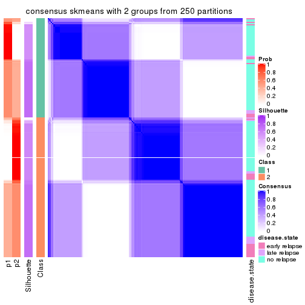</p>

</div>
<div id='tab-SD-skmeans-consensus-heatmap-2'>
<pre><code class="r">consensus_heatmap(res, k = 3)
</code></pre>

<p>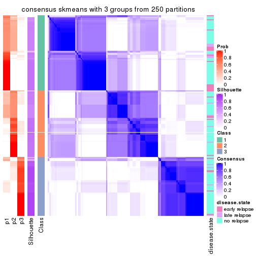</p>

</div>
<div id='tab-SD-skmeans-consensus-heatmap-3'>
<pre><code class="r">consensus_heatmap(res, k = 4)
</code></pre>

<p>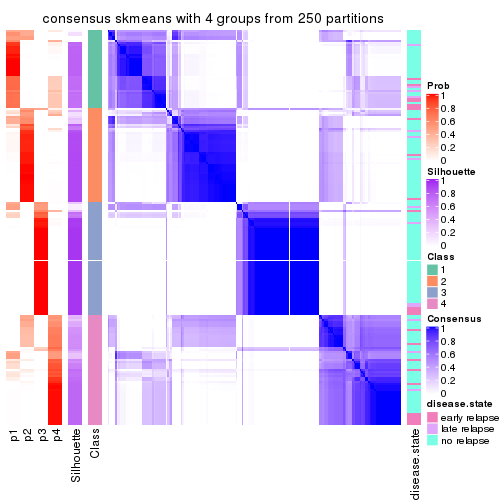</p>

</div>
<div id='tab-SD-skmeans-consensus-heatmap-4'>
<pre><code class="r">consensus_heatmap(res, k = 5)
</code></pre>

<p>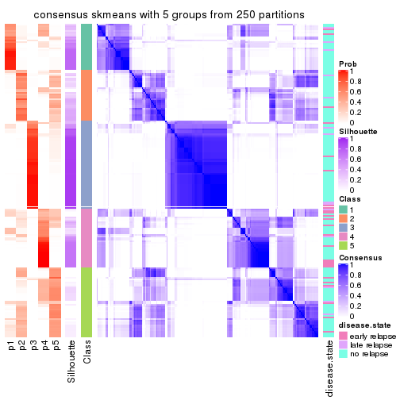</p>

</div>
<div id='tab-SD-skmeans-consensus-heatmap-5'>
<pre><code class="r">consensus_heatmap(res, k = 6)
</code></pre>

<p>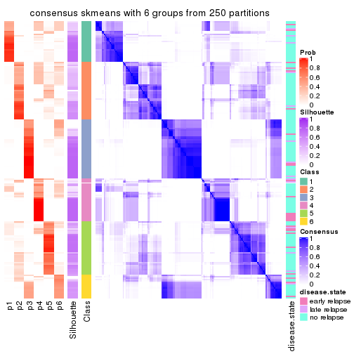</p>

</div>
</div>

Heatmaps for the membership of samples in all partitions to see how consistent they are:


<script>
$( function() {
	$( '#tabs-SD-skmeans-membership-heatmap' ).tabs();
} );
</script>
<div id='tabs-SD-skmeans-membership-heatmap'>
<ul>
<li><a href='#tab-SD-skmeans-membership-heatmap-1'>k = 2</a></li>
<li><a href='#tab-SD-skmeans-membership-heatmap-2'>k = 3</a></li>
<li><a href='#tab-SD-skmeans-membership-heatmap-3'>k = 4</a></li>
<li><a href='#tab-SD-skmeans-membership-heatmap-4'>k = 5</a></li>
<li><a href='#tab-SD-skmeans-membership-heatmap-5'>k = 6</a></li>
</ul>
<div id='tab-SD-skmeans-membership-heatmap-1'>
<pre><code class="r">membership_heatmap(res, k = 2)
</code></pre>

<p>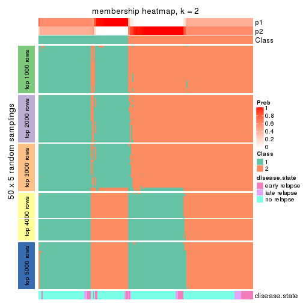</p>

</div>
<div id='tab-SD-skmeans-membership-heatmap-2'>
<pre><code class="r">membership_heatmap(res, k = 3)
</code></pre>

<p>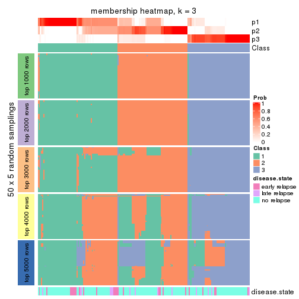</p>

</div>
<div id='tab-SD-skmeans-membership-heatmap-3'>
<pre><code class="r">membership_heatmap(res, k = 4)
</code></pre>

<p>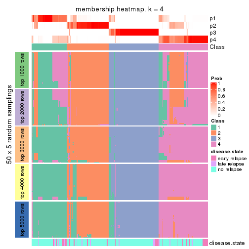</p>

</div>
<div id='tab-SD-skmeans-membership-heatmap-4'>
<pre><code class="r">membership_heatmap(res, k = 5)
</code></pre>

<p>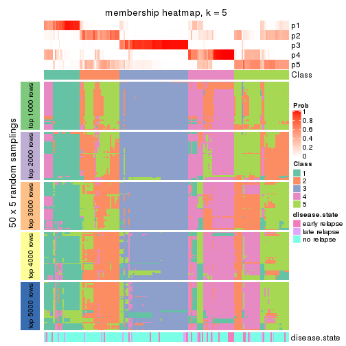</p>

</div>
<div id='tab-SD-skmeans-membership-heatmap-5'>
<pre><code class="r">membership_heatmap(res, k = 6)
</code></pre>

<p></p>

</div>
</div>

As soon as we have had the classes for columns, we can look for signatures
which are significantly different between classes which can be candidate marks
for certain classes. Following are the heatmaps for signatures.


Signature heatmaps where rows are scaled:


<script>
$( function() {
	$( '#tabs-SD-skmeans-get-signatures' ).tabs();
} );
</script>
<div id='tabs-SD-skmeans-get-signatures'>
<ul>
<li><a href='#tab-SD-skmeans-get-signatures-1'>k = 2</a></li>
<li><a href='#tab-SD-skmeans-get-signatures-2'>k = 3</a></li>
<li><a href='#tab-SD-skmeans-get-signatures-3'>k = 4</a></li>
<li><a href='#tab-SD-skmeans-get-signatures-4'>k = 5</a></li>
<li><a href='#tab-SD-skmeans-get-signatures-5'>k = 6</a></li>
</ul>
<div id='tab-SD-skmeans-get-signatures-1'>
<pre><code class="r">get_signatures(res, k = 2)
</code></pre>

<p>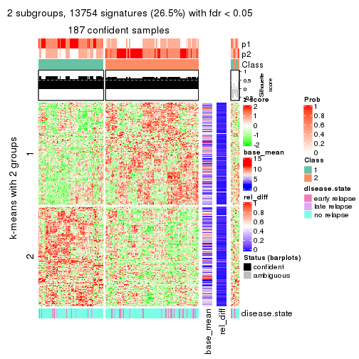</p>

</div>
<div id='tab-SD-skmeans-get-signatures-2'>
<pre><code class="r">get_signatures(res, k = 3)
</code></pre>

<p>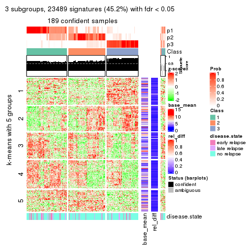</p>

</div>
<div id='tab-SD-skmeans-get-signatures-3'>
<pre><code class="r">get_signatures(res, k = 4)
</code></pre>

<p>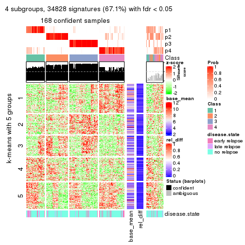</p>

</div>
<div id='tab-SD-skmeans-get-signatures-4'>
<pre><code class="r">get_signatures(res, k = 5)
</code></pre>

<p>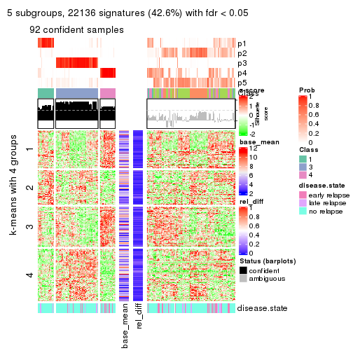</p>

</div>
<div id='tab-SD-skmeans-get-signatures-5'>
<pre><code class="r">get_signatures(res, k = 6)
</code></pre>

<p>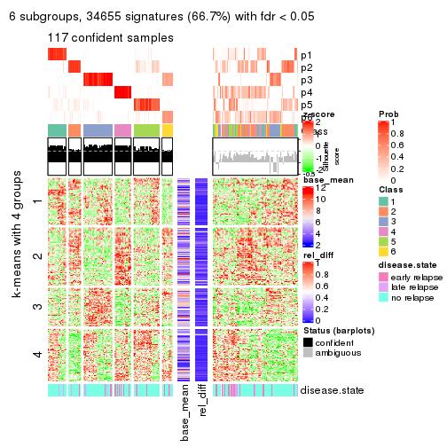</p>

</div>
</div>


Signature heatmaps where rows are not scaled:


<script>
$( function() {
	$( '#tabs-SD-skmeans-get-signatures-no-scale' ).tabs();
} );
</script>
<div id='tabs-SD-skmeans-get-signatures-no-scale'>
<ul>
<li><a href='#tab-SD-skmeans-get-signatures-no-scale-1'>k = 2</a></li>
<li><a href='#tab-SD-skmeans-get-signatures-no-scale-2'>k = 3</a></li>
<li><a href='#tab-SD-skmeans-get-signatures-no-scale-3'>k = 4</a></li>
<li><a href='#tab-SD-skmeans-get-signatures-no-scale-4'>k = 5</a></li>
<li><a href='#tab-SD-skmeans-get-signatures-no-scale-5'>k = 6</a></li>
</ul>
<div id='tab-SD-skmeans-get-signatures-no-scale-1'>
<pre><code class="r">get_signatures(res, k = 2, scale_rows = FALSE)
</code></pre>

<p>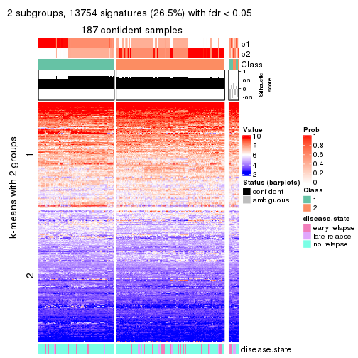</p>

</div>
<div id='tab-SD-skmeans-get-signatures-no-scale-2'>
<pre><code class="r">get_signatures(res, k = 3, scale_rows = FALSE)
</code></pre>

<p>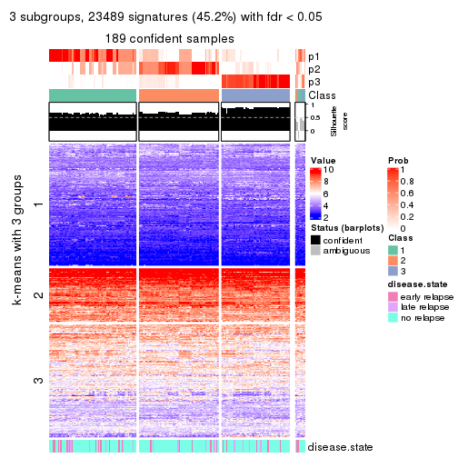</p>

</div>
<div id='tab-SD-skmeans-get-signatures-no-scale-3'>
<pre><code class="r">get_signatures(res, k = 4, scale_rows = FALSE)
</code></pre>

<p>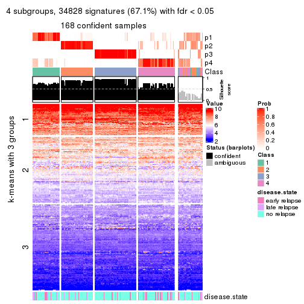</p>

</div>
<div id='tab-SD-skmeans-get-signatures-no-scale-4'>
<pre><code class="r">get_signatures(res, k = 5, scale_rows = FALSE)
</code></pre>

<p>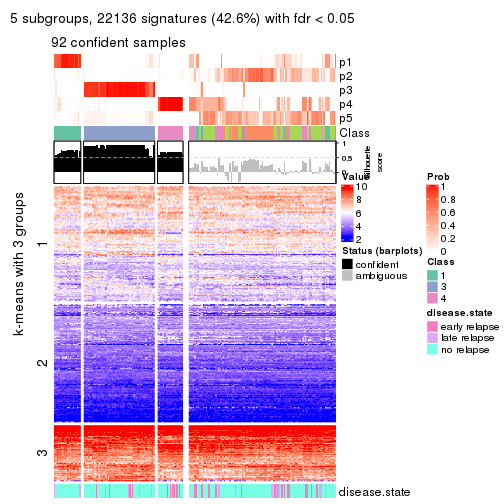</p>

</div>
<div id='tab-SD-skmeans-get-signatures-no-scale-5'>
<pre><code class="r">get_signatures(res, k = 6, scale_rows = FALSE)
</code></pre>

<p>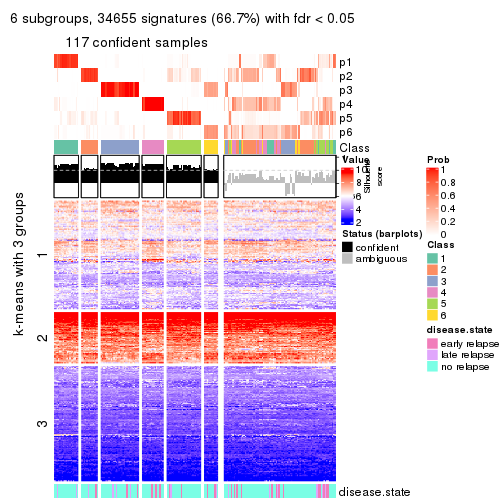</p>

</div>
</div>


Compare the overlap of signatures from different k:

```r
compare_signatures(res)
```

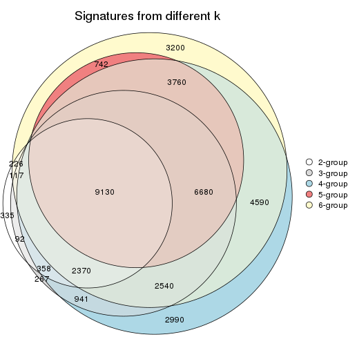

`get_signature()` returns a data frame invisibly. TO get the list of signatures, the function
call should be assigned to a variable explicitly. In following code, if `plot` argument is set
to `FALSE`, no heatmap is plotted while only the differential analysis is performed.

```r
# code only for demonstration
tb = get_signature(res, k = ..., plot = FALSE)
```

An example of the output of `tb` is:

```
#>   which_row         fdr    mean_1    mean_2 scaled_mean_1 scaled_mean_2 km
#> 1        38 0.042760348  8.373488  9.131774    -0.5533452     0.5164555  1
#> 2        40 0.018707592  7.106213  8.469186    -0.6173731     0.5762149  1
#> 3        55 0.019134737 10.221463 11.207825    -0.6159697     0.5749050  1
#> 4        59 0.006059896  5.921854  7.869574    -0.6899429     0.6439467  1
#> 5        60 0.018055526  8.928898 10.211722    -0.6204761     0.5791110  1
#> 6        98 0.009384629 15.714769 14.887706     0.6635654    -0.6193277  2
...
```

The columns in `tb` are:

1. `which_row`: row indices corresponding to the input matrix.
2. `fdr`: FDR for the differential test. 
3. `mean_x`: The mean value in group x.
4. `scaled_mean_x`: The mean value in group x after rows are scaled.
5. `km`: Row groups if k-means clustering is applied to rows.


UMAP plot which shows how samples are separated.


<script>
$( function() {
	$( '#tabs-SD-skmeans-dimension-reduction' ).tabs();
} );
</script>
<div id='tabs-SD-skmeans-dimension-reduction'>
<ul>
<li><a href='#tab-SD-skmeans-dimension-reduction-1'>k = 2</a></li>
<li><a href='#tab-SD-skmeans-dimension-reduction-2'>k = 3</a></li>
<li><a href='#tab-SD-skmeans-dimension-reduction-3'>k = 4</a></li>
<li><a href='#tab-SD-skmeans-dimension-reduction-4'>k = 5</a></li>
<li><a href='#tab-SD-skmeans-dimension-reduction-5'>k = 6</a></li>
</ul>
<div id='tab-SD-skmeans-dimension-reduction-1'>
<pre><code class="r">dimension_reduction(res, k = 2, method = &quot;UMAP&quot;)
</code></pre>

<p>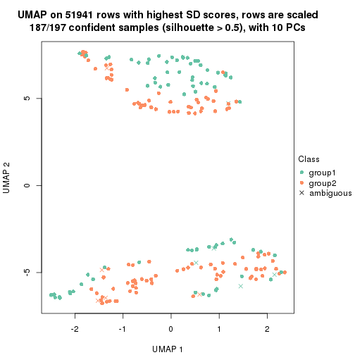</p>

</div>
<div id='tab-SD-skmeans-dimension-reduction-2'>
<pre><code class="r">dimension_reduction(res, k = 3, method = &quot;UMAP&quot;)
</code></pre>

<p>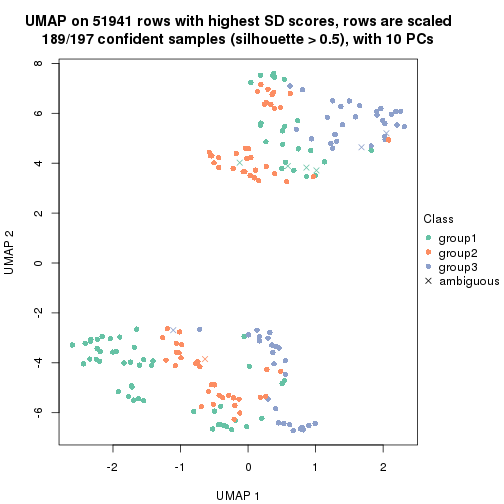</p>

</div>
<div id='tab-SD-skmeans-dimension-reduction-3'>
<pre><code class="r">dimension_reduction(res, k = 4, method = &quot;UMAP&quot;)
</code></pre>

<p>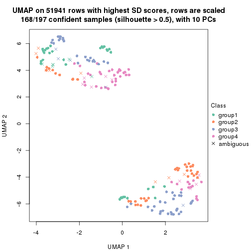</p>

</div>
<div id='tab-SD-skmeans-dimension-reduction-4'>
<pre><code class="r">dimension_reduction(res, k = 5, method = &quot;UMAP&quot;)
</code></pre>

<p>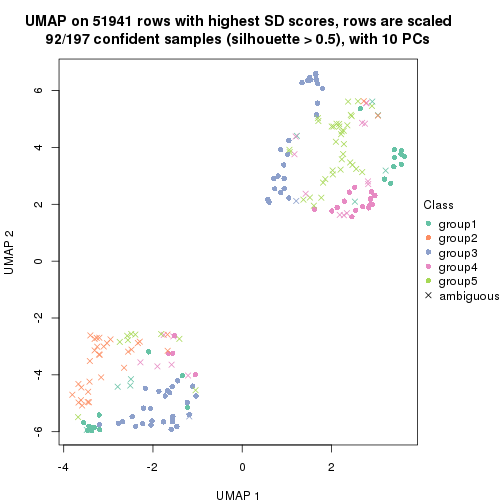</p>

</div>
<div id='tab-SD-skmeans-dimension-reduction-5'>
<pre><code class="r">dimension_reduction(res, k = 6, method = &quot;UMAP&quot;)
</code></pre>

<p>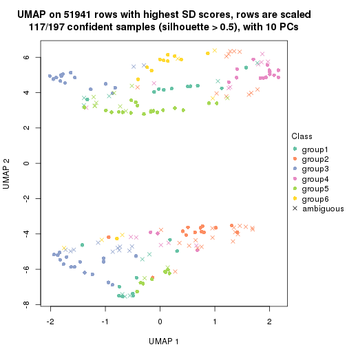</p>

</div>
</div>


Following heatmap shows how subgroups are split when increasing `k`:

```r
collect_classes(res)
```

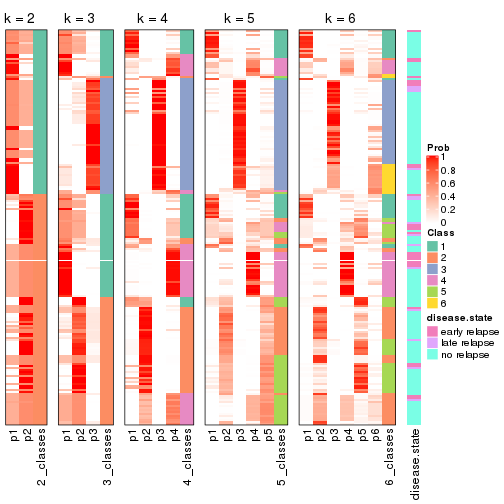


Test correlation between subgroups and known annotations. If the known
annotation is numeric, one-way ANOVA test is applied, and if the known
annotation is discrete, chi-squared contingency table test is applied.

```r
test_to_known_factors(res)
```

```
#>              n disease.state(p) k
#> SD:skmeans 187           0.4239 2
#> SD:skmeans 189           0.2016 3
#> SD:skmeans 168           0.0664 4
#> SD:skmeans  92           0.0138 5
#> SD:skmeans 117           0.0980 6
```


If matrix rows can be associated to genes, consider to use `functional_enrichment(res,
...)` to perform function enrichment for the signature genes. See [this vignette](http://bioconductor.org/packages/devel/bioc/vignettes/cola/inst/doc/functional_enrichment.html) for more detailed explanations.


 

---------------------------------------------------


### SD:pam


The object with results only for a single top-value method and a single partition method 
can be extracted as:

```r
res = res_list["SD", "pam"]
# you can also extract it by
# res = res_list["SD:pam"]
```

A summary of `res` and all the functions that can be applied to it:

```r
res
```

```
#> A 'ConsensusPartition' object with k = 2, 3, 4, 5, 6.
#>   On a matrix with 51941 rows and 197 columns.
#>   Top rows (1000, 2000, 3000, 4000, 5000) are extracted by 'SD' method.
#>   Subgroups are detected by 'pam' method.
#>   Performed in total 1250 partitions by row resampling.
#>   Best k for subgroups seems to be 2.
#> 
#> Following methods can be applied to this 'ConsensusPartition' object:
#>  [1] "cola_report"             "collect_classes"         "collect_plots"          
#>  [4] "collect_stats"           "colnames"                "compare_signatures"     
#>  [7] "consensus_heatmap"       "dimension_reduction"     "functional_enrichment"  
#> [10] "get_anno_col"            "get_anno"                "get_classes"            
#> [13] "get_consensus"           "get_matrix"              "get_membership"         
#> [16] "get_param"               "get_signatures"          "get_stats"              
#> [19] "is_best_k"               "is_stable_k"             "membership_heatmap"     
#> [22] "ncol"                    "nrow"                    "plot_ecdf"              
#> [25] "rownames"                "select_partition_number" "show"                   
#> [28] "suggest_best_k"          "test_to_known_factors"
```

`collect_plots()` function collects all the plots made from `res` for all `k` (number of partitions)
into one single page to provide an easy and fast comparison between different `k`.

```r
collect_plots(res)
```

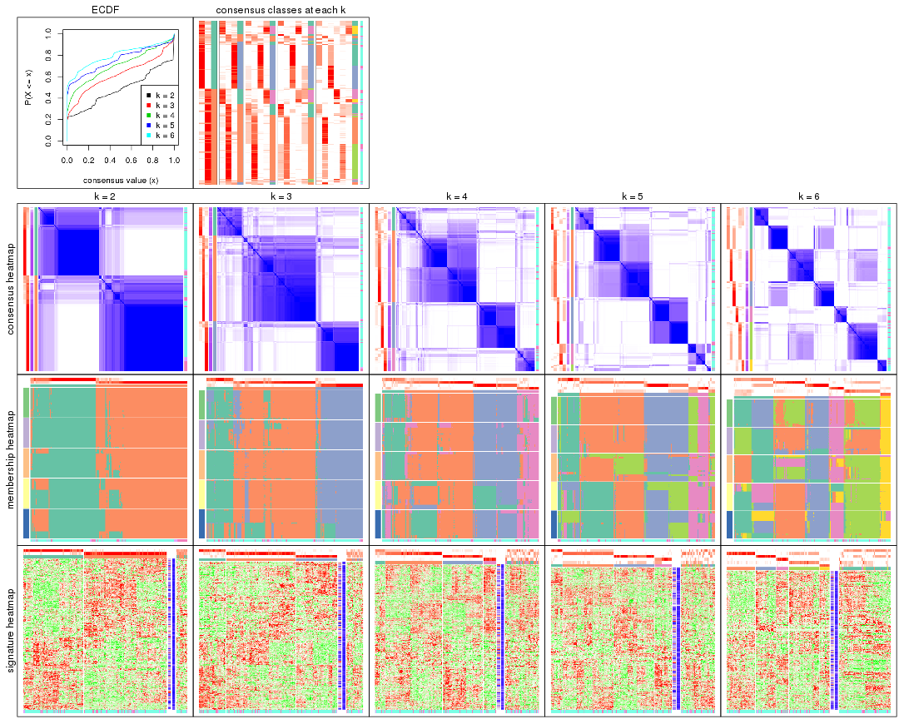

The plots are:

- The first row: a plot of the ECDF (empirical cumulative distribution
  function) curves of the consensus matrix for each `k` and the heatmap of
  predicted classes for each `k`.
- The second row: heatmaps of the consensus matrix for each `k`.
- The third row: heatmaps of the membership matrix for each `k`.
- The fouth row: heatmaps of the signatures for each `k`.

All the plots in panels can be made by individual functions and they are
plotted later in this section.

`select_partition_number()` produces several plots showing different
statistics for choosing "optimized" `k`. There are following statistics:

- ECDF curves of the consensus matrix for each `k`;
- 1-PAC. [The PAC
  score](https://en.wikipedia.org/wiki/Consensus_clustering#Over-interpretation_potential_of_consensus_clustering)
  measures the proportion of the ambiguous subgrouping.
- Mean silhouette score.
- Concordance. The mean probability of fiting the consensus class ids in all
  partitions.
- Area increased. Denote $A_k$ as the area under the ECDF curve for current
  `k`, the area increased is defined as $A_k - A_{k-1}$.
- Rand index. The percent of pairs of samples that are both in a same cluster
  or both are not in a same cluster in the partition of k and k-1.
- Jaccard index. The ratio of pairs of samples are both in a same cluster in
  the partition of k and k-1 and the pairs of samples are both in a same
  cluster in the partition k or k-1.

The detailed explanations of these statistics can be found in [the _cola_
vignette](http://bioconductor.org/packages/devel/bioc/vignettes/cola/inst/doc/cola.html#toc_13).

Generally speaking, lower PAC score, higher mean silhouette score or higher
concordance corresponds to better partition. Rand index and Jaccard index
measure how similar the current partition is compared to partition with `k-1`.
If they are too similar, we won't accept `k` is better than `k-1`.

```r
select_partition_number(res)
```

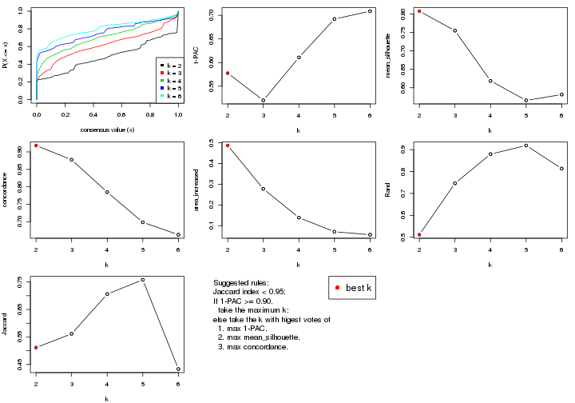

The numeric values for all these statistics can be obtained by `get_stats()`.

```r
get_stats(res)
```

```
#>   k 1-PAC mean_silhouette concordance area_increased  Rand Jaccard
#> 2 2 0.578           0.808       0.918         0.4868 0.512   0.512
#> 3 3 0.520           0.755       0.877         0.2777 0.746   0.562
#> 4 4 0.611           0.619       0.785         0.1388 0.880   0.706
#> 5 5 0.692           0.566       0.698         0.0708 0.919   0.758
#> 6 6 0.709           0.582       0.663         0.0565 0.813   0.433
```

`suggest_best_k()` suggests the best $k$ based on these statistics. The rules are as follows:

- All $k$ with Jaccard index larger than 0.95 are removed because increasing
  $k$ does not provide enough extra information. If all $k$ are removed, it is
  marked as no subgroup is detected.
- For all $k$ with 1-PAC score larger than 0.9, the maximal $k$ is taken as
  the best $k$, and other $k$ are marked as optional $k$.
- If it does not fit the second rule. The $k$ with the maximal vote of the
  highest 1-PAC score, highest mean silhouette, and highest concordance is
  taken as the best $k$.

```r
suggest_best_k(res)
```

```
#> [1] 2
```


Following shows the table of the partitions (You need to click the **show/hide
code output** link to see it). The membership matrix (columns with name `p*`)
is inferred by
[`clue::cl_consensus()`](https://www.rdocumentation.org/link/cl_consensus?package=clue)
function with the `SE` method. Basically the value in the membership matrix
represents the probability to belong to a certain group. The finall class
label for an item is determined with the group with highest probability it
belongs to.

In `get_classes()` function, the entropy is calculated from the membership
matrix and the silhouette score is calculated from the consensus matrix.


<script>
$( function() {
	$( '#tabs-SD-pam-get-classes' ).tabs();
} );
</script>
<div id='tabs-SD-pam-get-classes'>
<ul>
<li><a href='#tab-SD-pam-get-classes-1'>k = 2</a></li>
<li><a href='#tab-SD-pam-get-classes-2'>k = 3</a></li>
<li><a href='#tab-SD-pam-get-classes-3'>k = 4</a></li>
<li><a href='#tab-SD-pam-get-classes-4'>k = 5</a></li>
<li><a href='#tab-SD-pam-get-classes-5'>k = 6</a></li>
</ul>

<div id='tab-SD-pam-get-classes-1'>
<p><a id='tab-SD-pam-get-classes-1-a' style='color:#0366d6' href='#'>show/hide code output</a></p>
<pre><code class="r">cbind(get_classes(res, k = 2), get_membership(res, k = 2))
</code></pre>

<pre><code>#&gt;           class entropy silhouette    p1    p2
#&gt; GSM342319     2  0.0000     0.9097 0.000 1.000
#&gt; GSM342323     2  0.0000     0.9097 0.000 1.000
#&gt; GSM342325     2  0.0000     0.9097 0.000 1.000
#&gt; GSM342326     2  0.3879     0.8555 0.076 0.924
#&gt; GSM342327     2  0.7745     0.6809 0.228 0.772
#&gt; GSM342329     2  0.7745     0.6809 0.228 0.772
#&gt; GSM342331     2  0.7745     0.6809 0.228 0.772
#&gt; GSM342334     2  0.0000     0.9097 0.000 1.000
#&gt; GSM342335     2  0.0000     0.9097 0.000 1.000
#&gt; GSM342354     1  0.0000     0.8950 1.000 0.000
#&gt; GSM342371     2  0.0000     0.9097 0.000 1.000
#&gt; GSM342380     2  0.0376     0.9072 0.004 0.996
#&gt; GSM342382     2  0.0000     0.9097 0.000 1.000
#&gt; GSM342399     2  0.0000     0.9097 0.000 1.000
#&gt; GSM342402     2  0.0000     0.9097 0.000 1.000
#&gt; GSM342404     2  0.0000     0.9097 0.000 1.000
#&gt; GSM342408     1  0.0000     0.8950 1.000 0.000
#&gt; GSM342409     2  0.0000     0.9097 0.000 1.000
#&gt; GSM342426     2  0.9993     0.1633 0.484 0.516
#&gt; GSM342441     1  0.0000     0.8950 1.000 0.000
#&gt; GSM342444     1  0.0000     0.8950 1.000 0.000
#&gt; GSM342451     1  0.0000     0.8950 1.000 0.000
#&gt; GSM342462     2  0.0000     0.9097 0.000 1.000
#&gt; GSM342467     1  0.9000     0.5860 0.684 0.316
#&gt; GSM342484     1  0.3584     0.8469 0.932 0.068
#&gt; GSM342491     1  0.0376     0.8925 0.996 0.004
#&gt; GSM342322     2  0.0000     0.9097 0.000 1.000
#&gt; GSM342338     1  0.0000     0.8950 1.000 0.000
#&gt; GSM342347     1  0.6531     0.7710 0.832 0.168
#&gt; GSM342356     1  0.8327     0.6699 0.736 0.264
#&gt; GSM342357     2  0.0938     0.9019 0.012 0.988
#&gt; GSM342366     2  0.0000     0.9097 0.000 1.000
#&gt; GSM342385     2  0.0000     0.9097 0.000 1.000
#&gt; GSM342421     2  0.0000     0.9097 0.000 1.000
#&gt; GSM342437     1  0.5408     0.7932 0.876 0.124
#&gt; GSM342454     1  0.0000     0.8950 1.000 0.000
#&gt; GSM342471     2  0.5178     0.8234 0.116 0.884
#&gt; GSM342477     1  0.9552     0.4349 0.624 0.376
#&gt; GSM342495     2  0.0000     0.9097 0.000 1.000
#&gt; GSM342496     2  0.8207     0.6317 0.256 0.744
#&gt; GSM342320     2  0.7745     0.6809 0.228 0.772
#&gt; GSM342321     2  0.0000     0.9097 0.000 1.000
#&gt; GSM342324     2  0.7883     0.6687 0.236 0.764
#&gt; GSM342328     2  0.5294     0.8158 0.120 0.880
#&gt; GSM342330     2  0.9170     0.4847 0.332 0.668
#&gt; GSM342332     2  0.0000     0.9097 0.000 1.000
#&gt; GSM342333     2  0.9909     0.1032 0.444 0.556
#&gt; GSM342336     2  0.7815     0.6751 0.232 0.768
#&gt; GSM342337     1  0.8267     0.6744 0.740 0.260
#&gt; GSM342339     1  0.0000     0.8950 1.000 0.000
#&gt; GSM342340     1  0.6623     0.7324 0.828 0.172
#&gt; GSM342341     1  0.0000     0.8950 1.000 0.000
#&gt; GSM342342     1  0.0000     0.8950 1.000 0.000
#&gt; GSM342343     1  0.4562     0.8325 0.904 0.096
#&gt; GSM342344     1  0.0000     0.8950 1.000 0.000
#&gt; GSM342345     1  0.0000     0.8950 1.000 0.000
#&gt; GSM342346     1  0.9460     0.3519 0.636 0.364
#&gt; GSM342348     1  0.9393     0.5204 0.644 0.356
#&gt; GSM342349     1  0.0000     0.8950 1.000 0.000
#&gt; GSM342350     1  0.0000     0.8950 1.000 0.000
#&gt; GSM342351     1  0.0000     0.8950 1.000 0.000
#&gt; GSM342352     1  0.0000     0.8950 1.000 0.000
#&gt; GSM342353     1  0.0000     0.8950 1.000 0.000
#&gt; GSM342355     1  0.8207     0.6787 0.744 0.256
#&gt; GSM342358     1  0.8327     0.6699 0.736 0.264
#&gt; GSM342359     1  0.8327     0.6699 0.736 0.264
#&gt; GSM342360     1  0.8443     0.6593 0.728 0.272
#&gt; GSM342361     1  0.0000     0.8950 1.000 0.000
#&gt; GSM342362     2  0.6247     0.7642 0.156 0.844
#&gt; GSM342363     2  0.0000     0.9097 0.000 1.000
#&gt; GSM342364     2  0.0000     0.9097 0.000 1.000
#&gt; GSM342365     2  0.0000     0.9097 0.000 1.000
#&gt; GSM342367     2  0.0000     0.9097 0.000 1.000
#&gt; GSM342368     2  0.0000     0.9097 0.000 1.000
#&gt; GSM342369     2  0.0000     0.9097 0.000 1.000
#&gt; GSM342370     2  0.0000     0.9097 0.000 1.000
#&gt; GSM342372     2  0.0000     0.9097 0.000 1.000
#&gt; GSM342373     2  0.0000     0.9097 0.000 1.000
#&gt; GSM342374     2  0.0000     0.9097 0.000 1.000
#&gt; GSM342375     2  0.5294     0.8072 0.120 0.880
#&gt; GSM342376     2  0.0000     0.9097 0.000 1.000
#&gt; GSM342377     2  0.0000     0.9097 0.000 1.000
#&gt; GSM342378     2  0.0000     0.9097 0.000 1.000
#&gt; GSM342379     2  0.0000     0.9097 0.000 1.000
#&gt; GSM342381     2  0.0000     0.9097 0.000 1.000
#&gt; GSM342383     2  0.0000     0.9097 0.000 1.000
#&gt; GSM342384     2  0.0000     0.9097 0.000 1.000
#&gt; GSM342386     2  0.0000     0.9097 0.000 1.000
#&gt; GSM342387     2  0.0000     0.9097 0.000 1.000
#&gt; GSM342388     2  0.9795     0.1799 0.416 0.584
#&gt; GSM342389     2  0.0000     0.9097 0.000 1.000
#&gt; GSM342390     1  0.8327     0.6699 0.736 0.264
#&gt; GSM342391     1  0.8555     0.6469 0.720 0.280
#&gt; GSM342392     1  0.0000     0.8950 1.000 0.000
#&gt; GSM342393     2  0.7056     0.7317 0.192 0.808
#&gt; GSM342394     2  0.0000     0.9097 0.000 1.000
#&gt; GSM342395     2  0.0000     0.9097 0.000 1.000
#&gt; GSM342396     1  0.0000     0.8950 1.000 0.000
#&gt; GSM342397     1  0.0000     0.8950 1.000 0.000
#&gt; GSM342398     2  0.0000     0.9097 0.000 1.000
#&gt; GSM342400     2  0.0000     0.9097 0.000 1.000
#&gt; GSM342401     1  0.0000     0.8950 1.000 0.000
#&gt; GSM342403     2  0.0000     0.9097 0.000 1.000
#&gt; GSM342405     1  0.8327     0.6699 0.736 0.264
#&gt; GSM342406     1  0.8327     0.6699 0.736 0.264
#&gt; GSM342407     1  0.0000     0.8950 1.000 0.000
#&gt; GSM342410     1  1.0000     0.0757 0.504 0.496
#&gt; GSM342411     2  0.0000     0.9097 0.000 1.000
#&gt; GSM342412     2  0.5178     0.8215 0.116 0.884
#&gt; GSM342413     1  0.8608     0.6426 0.716 0.284
#&gt; GSM342414     1  0.0000     0.8950 1.000 0.000
#&gt; GSM342415     2  0.0000     0.9097 0.000 1.000
#&gt; GSM342416     1  0.8327     0.6699 0.736 0.264
#&gt; GSM342417     2  0.0000     0.9097 0.000 1.000
#&gt; GSM342418     2  0.6438     0.7668 0.164 0.836
#&gt; GSM342419     2  0.0000     0.9097 0.000 1.000
#&gt; GSM342420     2  0.7674     0.6868 0.224 0.776
#&gt; GSM342422     2  0.0000     0.9097 0.000 1.000
#&gt; GSM342423     2  0.0000     0.9097 0.000 1.000
#&gt; GSM342424     2  0.4815     0.8316 0.104 0.896
#&gt; GSM342425     2  0.9993     0.1633 0.484 0.516
#&gt; GSM342427     1  0.9815     0.3408 0.580 0.420
#&gt; GSM342428     2  0.9909     0.1499 0.444 0.556
#&gt; GSM342429     2  0.8661     0.5936 0.288 0.712
#&gt; GSM342430     1  0.0000     0.8950 1.000 0.000
#&gt; GSM342431     1  0.0000     0.8950 1.000 0.000
#&gt; GSM342432     1  0.0000     0.8950 1.000 0.000
#&gt; GSM342433     1  0.0000     0.8950 1.000 0.000
#&gt; GSM342434     1  0.0000     0.8950 1.000 0.000
#&gt; GSM342435     1  0.0000     0.8950 1.000 0.000
#&gt; GSM342436     1  0.0000     0.8950 1.000 0.000
#&gt; GSM342438     1  0.0000     0.8950 1.000 0.000
#&gt; GSM342439     1  0.0000     0.8950 1.000 0.000
#&gt; GSM342440     1  0.0000     0.8950 1.000 0.000
#&gt; GSM342442     1  0.0000     0.8950 1.000 0.000
#&gt; GSM342443     2  0.0000     0.9097 0.000 1.000
#&gt; GSM342445     1  0.0000     0.8950 1.000 0.000
#&gt; GSM342446     1  0.0000     0.8950 1.000 0.000
#&gt; GSM342447     1  0.0000     0.8950 1.000 0.000
#&gt; GSM342448     1  0.0000     0.8950 1.000 0.000
#&gt; GSM342449     1  0.0000     0.8950 1.000 0.000
#&gt; GSM342450     1  0.0000     0.8950 1.000 0.000
#&gt; GSM342452     1  0.0000     0.8950 1.000 0.000
#&gt; GSM342453     1  0.0000     0.8950 1.000 0.000
#&gt; GSM342455     1  0.0000     0.8950 1.000 0.000
#&gt; GSM342456     1  0.3879     0.8400 0.924 0.076
#&gt; GSM342457     2  0.0000     0.9097 0.000 1.000
#&gt; GSM342458     2  0.0000     0.9097 0.000 1.000
#&gt; GSM342459     2  0.0000     0.9097 0.000 1.000
#&gt; GSM342460     2  0.0000     0.9097 0.000 1.000
#&gt; GSM342461     2  0.0000     0.9097 0.000 1.000
#&gt; GSM342463     2  0.0000     0.9097 0.000 1.000
#&gt; GSM342464     2  0.0000     0.9097 0.000 1.000
#&gt; GSM342465     2  0.0000     0.9097 0.000 1.000
#&gt; GSM342466     1  0.8327     0.6699 0.736 0.264
#&gt; GSM342468     2  0.0000     0.9097 0.000 1.000
#&gt; GSM342469     2  0.0000     0.9097 0.000 1.000
#&gt; GSM342470     1  0.0000     0.8950 1.000 0.000
#&gt; GSM342472     1  0.0000     0.8950 1.000 0.000
#&gt; GSM342473     2  0.0000     0.9097 0.000 1.000
#&gt; GSM342474     2  0.0000     0.9097 0.000 1.000
#&gt; GSM342475     1  0.0000     0.8950 1.000 0.000
#&gt; GSM342476     2  0.8386     0.6262 0.268 0.732
#&gt; GSM342478     2  0.7815     0.6687 0.232 0.768
#&gt; GSM342479     2  0.7883     0.6640 0.236 0.764
#&gt; GSM342480     2  0.7815     0.6693 0.232 0.768
#&gt; GSM342481     2  0.0000     0.9097 0.000 1.000
#&gt; GSM342482     2  0.0000     0.9097 0.000 1.000
#&gt; GSM342483     2  0.0000     0.9097 0.000 1.000
#&gt; GSM342485     2  0.0000     0.9097 0.000 1.000
#&gt; GSM342486     2  0.0000     0.9097 0.000 1.000
#&gt; GSM342487     1  0.0000     0.8950 1.000 0.000
#&gt; GSM342488     2  0.5946     0.7821 0.144 0.856
#&gt; GSM342489     2  0.0000     0.9097 0.000 1.000
#&gt; GSM342490     1  1.0000    -0.1279 0.500 0.500
#&gt; GSM342492     1  0.0000     0.8950 1.000 0.000
#&gt; GSM342493     2  0.0000     0.9097 0.000 1.000
#&gt; GSM342494     2  0.9754     0.3766 0.408 0.592
#&gt; GSM342497     2  0.9988     0.1763 0.480 0.520
#&gt; GSM342498     2  0.0000     0.9097 0.000 1.000
#&gt; GSM342499     2  0.2423     0.8818 0.040 0.960
#&gt; GSM342500     2  0.0000     0.9097 0.000 1.000
#&gt; GSM342501     2  0.0672     0.9046 0.008 0.992
#&gt; GSM342502     2  0.0000     0.9097 0.000 1.000
#&gt; GSM342503     2  0.0000     0.9097 0.000 1.000
#&gt; GSM342504     2  0.6887     0.7343 0.184 0.816
#&gt; GSM342505     1  0.0000     0.8950 1.000 0.000
#&gt; GSM342506     2  0.9944     0.1102 0.456 0.544
#&gt; GSM342507     1  0.8327     0.6699 0.736 0.264
#&gt; GSM342508     2  0.7219     0.7021 0.200 0.800
#&gt; GSM342509     1  0.0000     0.8950 1.000 0.000
#&gt; GSM342510     1  0.0000     0.8950 1.000 0.000
#&gt; GSM342511     1  0.0000     0.8950 1.000 0.000
#&gt; GSM342512     2  0.0000     0.9097 0.000 1.000
#&gt; GSM342513     2  0.0000     0.9097 0.000 1.000
#&gt; GSM342514     1  0.0000     0.8950 1.000 0.000
#&gt; GSM342515     2  0.0000     0.9097 0.000 1.000
</code></pre>

<script>
$('#tab-SD-pam-get-classes-1-a').parent().next().next().hide();
$('#tab-SD-pam-get-classes-1-a').click(function(){
  $('#tab-SD-pam-get-classes-1-a').parent().next().next().toggle();
  return(false);
});
</script>
</div>

<div id='tab-SD-pam-get-classes-2'>
<p><a id='tab-SD-pam-get-classes-2-a' style='color:#0366d6' href='#'>show/hide code output</a></p>
<pre><code class="r">cbind(get_classes(res, k = 3), get_membership(res, k = 3))
</code></pre>

<pre><code>#&gt;           class entropy silhouette    p1    p2    p3
#&gt; GSM342319     2  0.4178    0.74571 0.172 0.828 0.000
#&gt; GSM342323     1  0.4121    0.80924 0.832 0.168 0.000
#&gt; GSM342325     2  0.4002    0.75781 0.160 0.840 0.000
#&gt; GSM342326     2  0.6204    0.42775 0.424 0.576 0.000
#&gt; GSM342327     1  0.0475    0.83075 0.992 0.004 0.004
#&gt; GSM342329     1  0.4883    0.77651 0.788 0.208 0.004
#&gt; GSM342331     1  0.0592    0.83149 0.988 0.012 0.000
#&gt; GSM342334     2  0.1964    0.83379 0.056 0.944 0.000
#&gt; GSM342335     2  0.0892    0.84708 0.020 0.980 0.000
#&gt; GSM342354     3  0.3038    0.79194 0.000 0.104 0.896
#&gt; GSM342371     2  0.0000    0.85057 0.000 1.000 0.000
#&gt; GSM342380     2  0.2313    0.83712 0.024 0.944 0.032
#&gt; GSM342382     2  0.0000    0.85057 0.000 1.000 0.000
#&gt; GSM342399     2  0.6026    0.38385 0.376 0.624 0.000
#&gt; GSM342402     1  0.3816    0.82132 0.852 0.148 0.000
#&gt; GSM342404     2  0.3340    0.80673 0.120 0.880 0.000
#&gt; GSM342408     3  0.3038    0.83415 0.104 0.000 0.896
#&gt; GSM342409     2  0.0892    0.84708 0.020 0.980 0.000
#&gt; GSM342426     1  0.0237    0.82985 0.996 0.004 0.000
#&gt; GSM342441     3  0.0000    0.88065 0.000 0.000 1.000
#&gt; GSM342444     3  0.0000    0.88065 0.000 0.000 1.000
#&gt; GSM342451     3  0.0000    0.88065 0.000 0.000 1.000
#&gt; GSM342462     2  0.3116    0.80718 0.108 0.892 0.000
#&gt; GSM342467     2  0.7865    0.59916 0.124 0.660 0.216
#&gt; GSM342484     1  0.6336    0.76285 0.756 0.064 0.180
#&gt; GSM342491     1  0.5891    0.69867 0.780 0.052 0.168
#&gt; GSM342322     2  0.5465    0.57596 0.288 0.712 0.000
#&gt; GSM342338     3  0.0000    0.88065 0.000 0.000 1.000
#&gt; GSM342347     3  0.5493    0.60697 0.012 0.232 0.756
#&gt; GSM342356     2  0.6274    0.29708 0.000 0.544 0.456
#&gt; GSM342357     1  0.4796    0.77395 0.780 0.220 0.000
#&gt; GSM342366     2  0.0000    0.85057 0.000 1.000 0.000
#&gt; GSM342385     2  0.5058    0.62992 0.244 0.756 0.000
#&gt; GSM342421     2  0.1753    0.83652 0.048 0.952 0.000
#&gt; GSM342437     3  0.8482    0.23071 0.408 0.092 0.500
#&gt; GSM342454     3  0.0000    0.88065 0.000 0.000 1.000
#&gt; GSM342471     2  0.2651    0.83032 0.060 0.928 0.012
#&gt; GSM342477     2  0.8887    0.11702 0.424 0.456 0.120
#&gt; GSM342495     2  0.3116    0.80718 0.108 0.892 0.000
#&gt; GSM342496     3  0.8731    0.27159 0.116 0.368 0.516
#&gt; GSM342320     1  0.1525    0.83197 0.964 0.032 0.004
#&gt; GSM342321     2  0.5397    0.59618 0.280 0.720 0.000
#&gt; GSM342324     1  0.3349    0.82291 0.888 0.108 0.004
#&gt; GSM342328     1  0.5158    0.75263 0.764 0.232 0.004
#&gt; GSM342330     1  0.0475    0.83075 0.992 0.004 0.004
#&gt; GSM342332     2  0.4235    0.74337 0.176 0.824 0.000
#&gt; GSM342333     2  0.3618    0.79245 0.012 0.884 0.104
#&gt; GSM342336     2  0.3045    0.82103 0.020 0.916 0.064
#&gt; GSM342337     2  0.6654    0.28792 0.008 0.536 0.456
#&gt; GSM342339     3  0.0000    0.88065 0.000 0.000 1.000
#&gt; GSM342340     3  0.0237    0.87799 0.000 0.004 0.996
#&gt; GSM342341     3  0.0000    0.88065 0.000 0.000 1.000
#&gt; GSM342342     3  0.0000    0.88065 0.000 0.000 1.000
#&gt; GSM342343     3  0.2537    0.80194 0.000 0.080 0.920
#&gt; GSM342344     3  0.0000    0.88065 0.000 0.000 1.000
#&gt; GSM342345     3  0.0000    0.88065 0.000 0.000 1.000
#&gt; GSM342346     3  0.8976   -0.00489 0.416 0.128 0.456
#&gt; GSM342348     2  0.9749   -0.08941 0.296 0.444 0.260
#&gt; GSM342349     3  0.0000    0.88065 0.000 0.000 1.000
#&gt; GSM342350     3  0.3692    0.83242 0.056 0.048 0.896
#&gt; GSM342351     3  0.3038    0.83415 0.104 0.000 0.896
#&gt; GSM342352     3  0.0000    0.88065 0.000 0.000 1.000
#&gt; GSM342353     3  0.0000    0.88065 0.000 0.000 1.000
#&gt; GSM342355     2  0.6848    0.29622 0.016 0.568 0.416
#&gt; GSM342358     1  0.0424    0.82925 0.992 0.000 0.008
#&gt; GSM342359     1  0.1289    0.82484 0.968 0.000 0.032
#&gt; GSM342360     1  0.3921    0.82463 0.872 0.112 0.016
#&gt; GSM342361     1  0.3686    0.76159 0.860 0.000 0.140
#&gt; GSM342362     1  0.3941    0.81841 0.844 0.156 0.000
#&gt; GSM342363     1  0.4452    0.79873 0.808 0.192 0.000
#&gt; GSM342364     2  0.0000    0.85057 0.000 1.000 0.000
#&gt; GSM342365     2  0.3340    0.80673 0.120 0.880 0.000
#&gt; GSM342367     2  0.0000    0.85057 0.000 1.000 0.000
#&gt; GSM342368     2  0.0000    0.85057 0.000 1.000 0.000
#&gt; GSM342369     2  0.0237    0.85041 0.004 0.996 0.000
#&gt; GSM342370     2  0.3482    0.80465 0.128 0.872 0.000
#&gt; GSM342372     2  0.0592    0.84861 0.012 0.988 0.000
#&gt; GSM342373     2  0.0000    0.85057 0.000 1.000 0.000
#&gt; GSM342374     2  0.3267    0.80845 0.116 0.884 0.000
#&gt; GSM342375     2  0.0475    0.85068 0.004 0.992 0.004
#&gt; GSM342376     2  0.0424    0.84952 0.008 0.992 0.000
#&gt; GSM342377     2  0.0000    0.85057 0.000 1.000 0.000
#&gt; GSM342378     2  0.1860    0.83550 0.052 0.948 0.000
#&gt; GSM342379     2  0.2165    0.82978 0.064 0.936 0.000
#&gt; GSM342381     2  0.0000    0.85057 0.000 1.000 0.000
#&gt; GSM342383     2  0.1964    0.83379 0.056 0.944 0.000
#&gt; GSM342384     2  0.0000    0.85057 0.000 1.000 0.000
#&gt; GSM342386     2  0.0000    0.85057 0.000 1.000 0.000
#&gt; GSM342387     2  0.5327    0.58025 0.272 0.728 0.000
#&gt; GSM342388     2  0.6309    0.14966 0.000 0.500 0.500
#&gt; GSM342389     2  0.0000    0.85057 0.000 1.000 0.000
#&gt; GSM342390     1  0.7147    0.76308 0.720 0.124 0.156
#&gt; GSM342391     2  0.5938    0.61189 0.020 0.732 0.248
#&gt; GSM342392     3  0.0000    0.88065 0.000 0.000 1.000
#&gt; GSM342393     2  0.3482    0.80465 0.128 0.872 0.000
#&gt; GSM342394     2  0.2066    0.83182 0.060 0.940 0.000
#&gt; GSM342395     2  0.0000    0.85057 0.000 1.000 0.000
#&gt; GSM342396     3  0.0000    0.88065 0.000 0.000 1.000
#&gt; GSM342397     3  0.3412    0.81933 0.124 0.000 0.876
#&gt; GSM342398     2  0.0424    0.84977 0.008 0.992 0.000
#&gt; GSM342400     2  0.0000    0.85057 0.000 1.000 0.000
#&gt; GSM342401     3  0.0000    0.88065 0.000 0.000 1.000
#&gt; GSM342403     2  0.0892    0.84708 0.020 0.980 0.000
#&gt; GSM342405     2  0.8503    0.46342 0.120 0.576 0.304
#&gt; GSM342406     1  0.6854    0.77917 0.740 0.124 0.136
#&gt; GSM342407     3  0.2947    0.85070 0.060 0.020 0.920
#&gt; GSM342410     1  0.8608    0.68449 0.604 0.192 0.204
#&gt; GSM342411     2  0.2066    0.83182 0.060 0.940 0.000
#&gt; GSM342412     2  0.3369    0.82210 0.052 0.908 0.040
#&gt; GSM342413     1  0.4551    0.76411 0.840 0.020 0.140
#&gt; GSM342414     3  0.3038    0.83415 0.104 0.000 0.896
#&gt; GSM342415     2  0.1015    0.84830 0.012 0.980 0.008
#&gt; GSM342416     1  0.8229    0.64181 0.620 0.124 0.256
#&gt; GSM342417     1  0.4062    0.80215 0.836 0.164 0.000
#&gt; GSM342418     1  0.0475    0.83075 0.992 0.004 0.004
#&gt; GSM342419     2  0.0592    0.84940 0.012 0.988 0.000
#&gt; GSM342420     1  0.3272    0.80823 0.892 0.104 0.004
#&gt; GSM342422     2  0.0000    0.85057 0.000 1.000 0.000
#&gt; GSM342423     2  0.0000    0.85057 0.000 1.000 0.000
#&gt; GSM342424     1  0.5431    0.53169 0.716 0.284 0.000
#&gt; GSM342425     1  0.3116    0.80335 0.892 0.108 0.000
#&gt; GSM342427     2  0.5656    0.76859 0.128 0.804 0.068
#&gt; GSM342428     2  0.5330    0.77370 0.144 0.812 0.044
#&gt; GSM342429     3  0.8820    0.14643 0.116 0.408 0.476
#&gt; GSM342430     3  0.0000    0.88065 0.000 0.000 1.000
#&gt; GSM342431     3  0.0000    0.88065 0.000 0.000 1.000
#&gt; GSM342432     3  0.0000    0.88065 0.000 0.000 1.000
#&gt; GSM342433     3  0.3038    0.83415 0.104 0.000 0.896
#&gt; GSM342434     3  0.3038    0.83415 0.104 0.000 0.896
#&gt; GSM342435     3  0.3038    0.83415 0.104 0.000 0.896
#&gt; GSM342436     3  0.0000    0.88065 0.000 0.000 1.000
#&gt; GSM342438     3  0.0000    0.88065 0.000 0.000 1.000
#&gt; GSM342439     3  0.0237    0.87858 0.004 0.000 0.996
#&gt; GSM342440     3  0.0000    0.88065 0.000 0.000 1.000
#&gt; GSM342442     3  0.0237    0.87858 0.004 0.000 0.996
#&gt; GSM342443     2  0.3116    0.80718 0.108 0.892 0.000
#&gt; GSM342445     3  0.0000    0.88065 0.000 0.000 1.000
#&gt; GSM342446     3  0.0000    0.88065 0.000 0.000 1.000
#&gt; GSM342447     3  0.0000    0.88065 0.000 0.000 1.000
#&gt; GSM342448     3  0.3038    0.83415 0.104 0.000 0.896
#&gt; GSM342449     3  0.0000    0.88065 0.000 0.000 1.000
#&gt; GSM342450     3  0.3038    0.83415 0.104 0.000 0.896
#&gt; GSM342452     3  0.0000    0.88065 0.000 0.000 1.000
#&gt; GSM342453     3  0.0000    0.88065 0.000 0.000 1.000
#&gt; GSM342455     3  0.0000    0.88065 0.000 0.000 1.000
#&gt; GSM342456     1  0.0475    0.83075 0.992 0.004 0.004
#&gt; GSM342457     2  0.0000    0.85057 0.000 1.000 0.000
#&gt; GSM342458     2  0.3116    0.80718 0.108 0.892 0.000
#&gt; GSM342459     2  0.3116    0.80718 0.108 0.892 0.000
#&gt; GSM342460     2  0.3116    0.80718 0.108 0.892 0.000
#&gt; GSM342461     2  0.0237    0.85041 0.004 0.996 0.000
#&gt; GSM342463     2  0.0237    0.85041 0.004 0.996 0.000
#&gt; GSM342464     2  0.0475    0.85038 0.004 0.992 0.004
#&gt; GSM342465     2  0.0000    0.85057 0.000 1.000 0.000
#&gt; GSM342466     3  0.9894   -0.20049 0.324 0.276 0.400
#&gt; GSM342468     2  0.0000    0.85057 0.000 1.000 0.000
#&gt; GSM342469     2  0.0747    0.84912 0.016 0.984 0.000
#&gt; GSM342470     1  0.5560    0.54021 0.700 0.000 0.300
#&gt; GSM342472     3  0.3267    0.82570 0.116 0.000 0.884
#&gt; GSM342473     2  0.0237    0.85041 0.004 0.996 0.000
#&gt; GSM342474     2  0.0237    0.85041 0.004 0.996 0.000
#&gt; GSM342475     3  0.0000    0.88065 0.000 0.000 1.000
#&gt; GSM342476     2  0.8588    0.30662 0.112 0.544 0.344
#&gt; GSM342478     2  0.8476    0.34257 0.108 0.560 0.332
#&gt; GSM342479     2  0.8875    0.24781 0.128 0.508 0.364
#&gt; GSM342480     2  0.8325    0.41493 0.108 0.588 0.304
#&gt; GSM342481     2  0.2537    0.82789 0.080 0.920 0.000
#&gt; GSM342482     2  0.1163    0.84612 0.028 0.972 0.000
#&gt; GSM342483     2  0.3116    0.80718 0.108 0.892 0.000
#&gt; GSM342485     2  0.0000    0.85057 0.000 1.000 0.000
#&gt; GSM342486     2  0.0000    0.85057 0.000 1.000 0.000
#&gt; GSM342487     3  0.3116    0.83218 0.108 0.000 0.892
#&gt; GSM342488     2  0.6031    0.72793 0.116 0.788 0.096
#&gt; GSM342489     2  0.3116    0.80718 0.108 0.892 0.000
#&gt; GSM342490     3  0.8801    0.38857 0.152 0.284 0.564
#&gt; GSM342492     3  0.3038    0.83415 0.104 0.000 0.896
#&gt; GSM342493     2  0.0000    0.85057 0.000 1.000 0.000
#&gt; GSM342494     2  0.8619    0.23807 0.108 0.524 0.368
#&gt; GSM342497     3  0.8836    0.20584 0.120 0.388 0.492
#&gt; GSM342498     2  0.4845    0.79228 0.052 0.844 0.104
#&gt; GSM342499     2  0.3425    0.79865 0.004 0.884 0.112
#&gt; GSM342500     2  0.3116    0.80718 0.108 0.892 0.000
#&gt; GSM342501     2  0.1337    0.84824 0.016 0.972 0.012
#&gt; GSM342502     2  0.1289    0.84486 0.032 0.968 0.000
#&gt; GSM342503     2  0.0237    0.85041 0.004 0.996 0.000
#&gt; GSM342504     2  0.6764    0.66844 0.108 0.744 0.148
#&gt; GSM342505     3  0.0000    0.88065 0.000 0.000 1.000
#&gt; GSM342506     2  0.5443    0.65847 0.004 0.736 0.260
#&gt; GSM342507     1  0.6243    0.80327 0.776 0.124 0.100
#&gt; GSM342508     2  0.4629    0.73706 0.004 0.808 0.188
#&gt; GSM342509     1  0.6443    0.70323 0.720 0.040 0.240
#&gt; GSM342510     1  0.1643    0.82281 0.956 0.000 0.044
#&gt; GSM342511     3  0.3412    0.81933 0.124 0.000 0.876
#&gt; GSM342512     2  0.3272    0.80281 0.004 0.892 0.104
#&gt; GSM342513     2  0.0000    0.85057 0.000 1.000 0.000
#&gt; GSM342514     3  0.3116    0.83281 0.108 0.000 0.892
#&gt; GSM342515     2  0.1753    0.83619 0.048 0.952 0.000
</code></pre>

<script>
$('#tab-SD-pam-get-classes-2-a').parent().next().next().hide();
$('#tab-SD-pam-get-classes-2-a').click(function(){
  $('#tab-SD-pam-get-classes-2-a').parent().next().next().toggle();
  return(false);
});
</script>
</div>

<div id='tab-SD-pam-get-classes-3'>
<p><a id='tab-SD-pam-get-classes-3-a' style='color:#0366d6' href='#'>show/hide code output</a></p>
<pre><code class="r">cbind(get_classes(res, k = 4), get_membership(res, k = 4))
</code></pre>

<pre><code>#&gt;           class entropy silhouette    p1    p2    p3    p4
#&gt; GSM342319     1  0.6070    0.52175 0.548 0.404 0.000 0.048
#&gt; GSM342323     4  0.4983    0.47875 0.272 0.024 0.000 0.704
#&gt; GSM342325     1  0.5290    0.53952 0.584 0.404 0.000 0.012
#&gt; GSM342326     4  0.7374    0.17277 0.188 0.308 0.000 0.504
#&gt; GSM342327     4  0.0921    0.71858 0.028 0.000 0.000 0.972
#&gt; GSM342329     4  0.3421    0.67849 0.088 0.044 0.000 0.868
#&gt; GSM342331     4  0.0921    0.71858 0.028 0.000 0.000 0.972
#&gt; GSM342334     2  0.2197    0.69404 0.000 0.916 0.004 0.080
#&gt; GSM342335     2  0.1557    0.71010 0.000 0.944 0.000 0.056
#&gt; GSM342354     3  0.3659    0.86153 0.136 0.000 0.840 0.024
#&gt; GSM342371     2  0.0000    0.72727 0.000 1.000 0.000 0.000
#&gt; GSM342380     2  0.2658    0.68634 0.012 0.904 0.004 0.080
#&gt; GSM342382     2  0.0000    0.72727 0.000 1.000 0.000 0.000
#&gt; GSM342399     2  0.6702    0.18651 0.168 0.616 0.000 0.216
#&gt; GSM342402     4  0.4539    0.46838 0.008 0.272 0.000 0.720
#&gt; GSM342404     2  0.5448    0.67998 0.244 0.700 0.000 0.056
#&gt; GSM342408     3  0.3659    0.86153 0.136 0.000 0.840 0.024
#&gt; GSM342409     2  0.1557    0.71010 0.000 0.944 0.000 0.056
#&gt; GSM342426     4  0.4560    0.49251 0.296 0.000 0.004 0.700
#&gt; GSM342441     3  0.2469    0.86939 0.108 0.000 0.892 0.000
#&gt; GSM342444     3  0.0188    0.87510 0.004 0.000 0.996 0.000
#&gt; GSM342451     3  0.0188    0.87510 0.004 0.000 0.996 0.000
#&gt; GSM342462     2  0.4164    0.68898 0.264 0.736 0.000 0.000
#&gt; GSM342467     2  0.8239    0.47272 0.304 0.512 0.104 0.080
#&gt; GSM342484     4  0.4933    0.47783 0.016 0.000 0.296 0.688
#&gt; GSM342491     4  0.8103    0.34335 0.080 0.088 0.320 0.512
#&gt; GSM342322     2  0.7716   -0.43899 0.356 0.416 0.000 0.228
#&gt; GSM342338     3  0.3325    0.86793 0.112 0.000 0.864 0.024
#&gt; GSM342347     3  0.7939    0.53151 0.136 0.192 0.592 0.080
#&gt; GSM342356     2  0.7475   -0.10845 0.108 0.488 0.384 0.020
#&gt; GSM342357     4  0.5759    0.46790 0.080 0.232 0.000 0.688
#&gt; GSM342366     2  0.0000    0.72727 0.000 1.000 0.000 0.000
#&gt; GSM342385     2  0.5272    0.36465 0.032 0.680 0.000 0.288
#&gt; GSM342421     2  0.2021    0.70295 0.012 0.932 0.000 0.056
#&gt; GSM342437     1  0.2839    0.29995 0.884 0.004 0.004 0.108
#&gt; GSM342454     3  0.0188    0.87510 0.004 0.000 0.996 0.000
#&gt; GSM342471     1  0.5523    0.55177 0.596 0.380 0.000 0.024
#&gt; GSM342477     2  0.7628    0.48644 0.304 0.504 0.008 0.184
#&gt; GSM342495     2  0.4164    0.68898 0.264 0.736 0.000 0.000
#&gt; GSM342496     3  0.6296    0.09666 0.064 0.388 0.548 0.000
#&gt; GSM342320     4  0.2197    0.71005 0.048 0.024 0.000 0.928
#&gt; GSM342321     2  0.7882   -0.39566 0.284 0.368 0.000 0.348
#&gt; GSM342324     4  0.0921    0.71858 0.028 0.000 0.000 0.972
#&gt; GSM342328     4  0.4466    0.59535 0.180 0.036 0.000 0.784
#&gt; GSM342330     4  0.0921    0.71858 0.028 0.000 0.000 0.972
#&gt; GSM342332     2  0.6258    0.18576 0.076 0.600 0.000 0.324
#&gt; GSM342333     2  0.2510    0.70065 0.012 0.916 0.008 0.064
#&gt; GSM342336     2  0.4287    0.62729 0.088 0.828 0.004 0.080
#&gt; GSM342337     2  0.6082   -0.00029 0.024 0.520 0.444 0.012
#&gt; GSM342339     3  0.0188    0.87510 0.004 0.000 0.996 0.000
#&gt; GSM342340     3  0.0188    0.87510 0.004 0.000 0.996 0.000
#&gt; GSM342341     3  0.0188    0.87510 0.004 0.000 0.996 0.000
#&gt; GSM342342     3  0.0188    0.87510 0.004 0.000 0.996 0.000
#&gt; GSM342343     3  0.2593    0.76217 0.004 0.104 0.892 0.000
#&gt; GSM342344     3  0.3659    0.86153 0.136 0.000 0.840 0.024
#&gt; GSM342345     3  0.0188    0.87510 0.004 0.000 0.996 0.000
#&gt; GSM342346     3  0.9152    0.13775 0.168 0.108 0.412 0.312
#&gt; GSM342348     1  0.5931    0.55420 0.580 0.384 0.028 0.008
#&gt; GSM342349     3  0.3659    0.86153 0.136 0.000 0.840 0.024
#&gt; GSM342350     3  0.3659    0.86153 0.136 0.000 0.840 0.024
#&gt; GSM342351     3  0.3659    0.86153 0.136 0.000 0.840 0.024
#&gt; GSM342352     3  0.3659    0.86153 0.136 0.000 0.840 0.024
#&gt; GSM342353     3  0.3659    0.86153 0.136 0.000 0.840 0.024
#&gt; GSM342355     2  0.8693   -0.19719 0.140 0.400 0.384 0.076
#&gt; GSM342358     4  0.0000    0.71736 0.000 0.000 0.000 1.000
#&gt; GSM342359     4  0.0469    0.71654 0.012 0.000 0.000 0.988
#&gt; GSM342360     4  0.1443    0.71015 0.028 0.008 0.004 0.960
#&gt; GSM342361     4  0.0657    0.71588 0.004 0.000 0.012 0.984
#&gt; GSM342362     4  0.4539    0.46838 0.008 0.272 0.000 0.720
#&gt; GSM342363     4  0.4882    0.46052 0.020 0.272 0.000 0.708
#&gt; GSM342364     2  0.0000    0.72727 0.000 1.000 0.000 0.000
#&gt; GSM342365     2  0.5417    0.68210 0.240 0.704 0.000 0.056
#&gt; GSM342367     2  0.0000    0.72727 0.000 1.000 0.000 0.000
#&gt; GSM342368     2  0.0000    0.72727 0.000 1.000 0.000 0.000
#&gt; GSM342369     2  0.2011    0.72801 0.080 0.920 0.000 0.000
#&gt; GSM342370     2  0.5448    0.67998 0.244 0.700 0.000 0.056
#&gt; GSM342372     2  0.1557    0.71010 0.000 0.944 0.000 0.056
#&gt; GSM342373     2  0.0000    0.72727 0.000 1.000 0.000 0.000
#&gt; GSM342374     2  0.1557    0.71010 0.000 0.944 0.000 0.056
#&gt; GSM342375     2  0.0707    0.72278 0.000 0.980 0.000 0.020
#&gt; GSM342376     2  0.0921    0.72073 0.000 0.972 0.000 0.028
#&gt; GSM342377     2  0.0817    0.71590 0.024 0.976 0.000 0.000
#&gt; GSM342378     1  0.4925    0.52937 0.572 0.428 0.000 0.000
#&gt; GSM342379     2  0.2751    0.67910 0.040 0.904 0.000 0.056
#&gt; GSM342381     2  0.0000    0.72727 0.000 1.000 0.000 0.000
#&gt; GSM342383     2  0.3245    0.65490 0.064 0.880 0.000 0.056
#&gt; GSM342384     2  0.0000    0.72727 0.000 1.000 0.000 0.000
#&gt; GSM342386     2  0.0000    0.72727 0.000 1.000 0.000 0.000
#&gt; GSM342387     1  0.7028    0.36254 0.568 0.172 0.000 0.260
#&gt; GSM342388     3  0.5080    0.10067 0.004 0.420 0.576 0.000
#&gt; GSM342389     2  0.0000    0.72727 0.000 1.000 0.000 0.000
#&gt; GSM342390     1  0.5738    0.17577 0.596 0.012 0.016 0.376
#&gt; GSM342391     1  0.5987    0.55300 0.600 0.360 0.016 0.024
#&gt; GSM342392     3  0.0188    0.87510 0.004 0.000 0.996 0.000
#&gt; GSM342393     2  0.6318    0.54126 0.380 0.560 0.004 0.056
#&gt; GSM342394     1  0.4933    0.52500 0.568 0.432 0.000 0.000
#&gt; GSM342395     2  0.0000    0.72727 0.000 1.000 0.000 0.000
#&gt; GSM342396     3  0.0188    0.87510 0.004 0.000 0.996 0.000
#&gt; GSM342397     3  0.4791    0.81411 0.136 0.000 0.784 0.080
#&gt; GSM342398     2  0.0000    0.72727 0.000 1.000 0.000 0.000
#&gt; GSM342400     2  0.0000    0.72727 0.000 1.000 0.000 0.000
#&gt; GSM342401     3  0.0188    0.87510 0.004 0.000 0.996 0.000
#&gt; GSM342403     2  0.1557    0.71010 0.000 0.944 0.000 0.056
#&gt; GSM342405     2  0.8804    0.26313 0.332 0.432 0.156 0.080
#&gt; GSM342406     1  0.5256    0.15835 0.596 0.012 0.000 0.392
#&gt; GSM342407     3  0.3659    0.86153 0.136 0.000 0.840 0.024
#&gt; GSM342410     1  0.5826    0.18232 0.596 0.012 0.020 0.372
#&gt; GSM342411     1  0.4933    0.52500 0.568 0.432 0.000 0.000
#&gt; GSM342412     2  0.4082    0.64048 0.020 0.812 0.004 0.164
#&gt; GSM342413     1  0.4382    0.22583 0.704 0.000 0.000 0.296
#&gt; GSM342414     3  0.3659    0.86153 0.136 0.000 0.840 0.024
#&gt; GSM342415     2  0.1557    0.71010 0.000 0.944 0.000 0.056
#&gt; GSM342416     1  0.5983    0.18546 0.596 0.012 0.028 0.364
#&gt; GSM342417     4  0.2443    0.69852 0.024 0.060 0.000 0.916
#&gt; GSM342418     4  0.0921    0.71858 0.028 0.000 0.000 0.972
#&gt; GSM342419     2  0.4277    0.29993 0.280 0.720 0.000 0.000
#&gt; GSM342420     4  0.4630    0.51174 0.252 0.016 0.000 0.732
#&gt; GSM342422     2  0.0000    0.72727 0.000 1.000 0.000 0.000
#&gt; GSM342423     2  0.0000    0.72727 0.000 1.000 0.000 0.000
#&gt; GSM342424     1  0.6024   -0.18016 0.540 0.044 0.000 0.416
#&gt; GSM342425     4  0.5914    0.32621 0.436 0.028 0.004 0.532
#&gt; GSM342427     2  0.6127    0.64758 0.288 0.644 0.008 0.060
#&gt; GSM342428     2  0.7922    0.34806 0.292 0.432 0.004 0.272
#&gt; GSM342429     1  0.7789   -0.09787 0.400 0.352 0.248 0.000
#&gt; GSM342430     3  0.0188    0.87510 0.004 0.000 0.996 0.000
#&gt; GSM342431     3  0.0188    0.87510 0.004 0.000 0.996 0.000
#&gt; GSM342432     3  0.0000    0.87568 0.000 0.000 1.000 0.000
#&gt; GSM342433     3  0.3659    0.86153 0.136 0.000 0.840 0.024
#&gt; GSM342434     3  0.3659    0.86153 0.136 0.000 0.840 0.024
#&gt; GSM342435     3  0.3659    0.86153 0.136 0.000 0.840 0.024
#&gt; GSM342436     3  0.0188    0.87622 0.004 0.000 0.996 0.000
#&gt; GSM342438     3  0.0000    0.87568 0.000 0.000 1.000 0.000
#&gt; GSM342439     3  0.0000    0.87568 0.000 0.000 1.000 0.000
#&gt; GSM342440     3  0.2760    0.86683 0.128 0.000 0.872 0.000
#&gt; GSM342442     3  0.0000    0.87568 0.000 0.000 1.000 0.000
#&gt; GSM342443     2  0.4343    0.68657 0.264 0.732 0.004 0.000
#&gt; GSM342445     3  0.1356    0.87474 0.032 0.000 0.960 0.008
#&gt; GSM342446     3  0.2469    0.86939 0.108 0.000 0.892 0.000
#&gt; GSM342447     3  0.0188    0.87510 0.004 0.000 0.996 0.000
#&gt; GSM342448     3  0.3659    0.86153 0.136 0.000 0.840 0.024
#&gt; GSM342449     3  0.0000    0.87568 0.000 0.000 1.000 0.000
#&gt; GSM342450     3  0.3659    0.86153 0.136 0.000 0.840 0.024
#&gt; GSM342452     3  0.0000    0.87568 0.000 0.000 1.000 0.000
#&gt; GSM342453     3  0.0188    0.87510 0.004 0.000 0.996 0.000
#&gt; GSM342455     3  0.0000    0.87568 0.000 0.000 1.000 0.000
#&gt; GSM342456     4  0.0000    0.71736 0.000 0.000 0.000 1.000
#&gt; GSM342457     2  0.0000    0.72727 0.000 1.000 0.000 0.000
#&gt; GSM342458     2  0.4164    0.68898 0.264 0.736 0.000 0.000
#&gt; GSM342459     2  0.4164    0.68898 0.264 0.736 0.000 0.000
#&gt; GSM342460     2  0.4164    0.68898 0.264 0.736 0.000 0.000
#&gt; GSM342461     2  0.4164    0.68898 0.264 0.736 0.000 0.000
#&gt; GSM342463     2  0.4164    0.68898 0.264 0.736 0.000 0.000
#&gt; GSM342464     2  0.4164    0.68898 0.264 0.736 0.000 0.000
#&gt; GSM342465     2  0.2413    0.69363 0.020 0.916 0.064 0.000
#&gt; GSM342466     1  0.8605    0.43783 0.472 0.204 0.268 0.056
#&gt; GSM342468     2  0.0000    0.72727 0.000 1.000 0.000 0.000
#&gt; GSM342469     1  0.4916    0.52806 0.576 0.424 0.000 0.000
#&gt; GSM342470     1  0.5473    0.20725 0.644 0.000 0.032 0.324
#&gt; GSM342472     3  0.4037    0.85042 0.136 0.000 0.824 0.040
#&gt; GSM342473     2  0.4164    0.68898 0.264 0.736 0.000 0.000
#&gt; GSM342474     2  0.4164    0.68898 0.264 0.736 0.000 0.000
#&gt; GSM342475     3  0.1109    0.87478 0.028 0.000 0.968 0.004
#&gt; GSM342476     2  0.5697    0.62946 0.280 0.664 0.056 0.000
#&gt; GSM342478     2  0.5284    0.65916 0.264 0.696 0.040 0.000
#&gt; GSM342479     2  0.8189    0.52541 0.264 0.532 0.144 0.060
#&gt; GSM342480     2  0.4606    0.68244 0.264 0.724 0.012 0.000
#&gt; GSM342481     2  0.4164    0.68898 0.264 0.736 0.000 0.000
#&gt; GSM342482     2  0.4164    0.68898 0.264 0.736 0.000 0.000
#&gt; GSM342483     2  0.4164    0.68898 0.264 0.736 0.000 0.000
#&gt; GSM342485     2  0.0707    0.72733 0.020 0.980 0.000 0.000
#&gt; GSM342486     2  0.0707    0.72733 0.020 0.980 0.000 0.000
#&gt; GSM342487     3  0.3172    0.85662 0.160 0.000 0.840 0.000
#&gt; GSM342488     2  0.4785    0.68473 0.264 0.720 0.004 0.012
#&gt; GSM342489     2  0.4164    0.68898 0.264 0.736 0.000 0.000
#&gt; GSM342490     1  0.8910   -0.03395 0.384 0.280 0.284 0.052
#&gt; GSM342492     3  0.3659    0.86153 0.136 0.000 0.840 0.024
#&gt; GSM342493     2  0.0707    0.72733 0.020 0.980 0.000 0.000
#&gt; GSM342494     2  0.6036    0.59739 0.292 0.636 0.072 0.000
#&gt; GSM342497     1  0.8502   -0.09682 0.400 0.320 0.252 0.028
#&gt; GSM342498     1  0.4152    0.38789 0.808 0.032 0.160 0.000
#&gt; GSM342499     1  0.6860    0.53061 0.592 0.244 0.164 0.000
#&gt; GSM342500     2  0.4343    0.68657 0.264 0.732 0.004 0.000
#&gt; GSM342501     2  0.5016    0.58448 0.036 0.792 0.136 0.036
#&gt; GSM342502     2  0.4164    0.68898 0.264 0.736 0.000 0.000
#&gt; GSM342503     2  0.4164    0.68898 0.264 0.736 0.000 0.000
#&gt; GSM342504     2  0.4164    0.68898 0.264 0.736 0.000 0.000
#&gt; GSM342505     3  0.0188    0.87510 0.004 0.000 0.996 0.000
#&gt; GSM342506     1  0.6381    0.52497 0.652 0.196 0.152 0.000
#&gt; GSM342507     4  0.5085    0.43785 0.288 0.012 0.008 0.692
#&gt; GSM342508     1  0.6860    0.53061 0.592 0.244 0.164 0.000
#&gt; GSM342509     4  0.6425    0.46593 0.032 0.052 0.260 0.656
#&gt; GSM342510     4  0.4706    0.50192 0.020 0.000 0.248 0.732
#&gt; GSM342511     3  0.5902    0.78271 0.136 0.052 0.748 0.064
#&gt; GSM342512     2  0.4675    0.68786 0.244 0.736 0.020 0.000
#&gt; GSM342513     2  0.0000    0.72727 0.000 1.000 0.000 0.000
#&gt; GSM342514     1  0.5288   -0.24308 0.520 0.000 0.472 0.008
#&gt; GSM342515     1  0.6832    0.53737 0.572 0.296 0.132 0.000
</code></pre>

<script>
$('#tab-SD-pam-get-classes-3-a').parent().next().next().hide();
$('#tab-SD-pam-get-classes-3-a').click(function(){
  $('#tab-SD-pam-get-classes-3-a').parent().next().next().toggle();
  return(false);
});
</script>
</div>

<div id='tab-SD-pam-get-classes-4'>
<p><a id='tab-SD-pam-get-classes-4-a' style='color:#0366d6' href='#'>show/hide code output</a></p>
<pre><code class="r">cbind(get_classes(res, k = 5), get_membership(res, k = 5))
</code></pre>

<pre><code>#&gt;           class entropy silhouette    p1    p2    p3    p4    p5
#&gt; GSM342319     1  0.3895     0.3115 0.680 0.000 0.000 0.000 0.320
#&gt; GSM342323     4  0.6003     0.4221 0.112 0.000 0.000 0.448 0.440
#&gt; GSM342325     1  0.3109     0.4715 0.800 0.000 0.000 0.000 0.200
#&gt; GSM342326     5  0.6209     0.2716 0.004 0.208 0.000 0.216 0.572
#&gt; GSM342327     4  0.4283     0.5405 0.000 0.000 0.000 0.544 0.456
#&gt; GSM342329     4  0.5171     0.4990 0.040 0.000 0.000 0.504 0.456
#&gt; GSM342331     4  0.4283     0.5405 0.000 0.000 0.000 0.544 0.456
#&gt; GSM342334     2  0.5533     0.5538 0.268 0.656 0.004 0.032 0.040
#&gt; GSM342335     2  0.4090     0.6042 0.268 0.716 0.000 0.000 0.016
#&gt; GSM342354     3  0.3816     0.7686 0.000 0.000 0.696 0.000 0.304
#&gt; GSM342371     2  0.4090     0.6042 0.268 0.716 0.000 0.000 0.016
#&gt; GSM342380     2  0.5753     0.5124 0.288 0.620 0.004 0.076 0.012
#&gt; GSM342382     2  0.3636     0.6072 0.272 0.728 0.000 0.000 0.000
#&gt; GSM342399     1  0.6916     0.0112 0.452 0.348 0.000 0.020 0.180
#&gt; GSM342402     4  0.2488     0.5759 0.004 0.124 0.000 0.872 0.000
#&gt; GSM342404     2  0.3916     0.5132 0.012 0.732 0.000 0.000 0.256
#&gt; GSM342408     3  0.3837     0.7658 0.000 0.000 0.692 0.000 0.308
#&gt; GSM342409     2  0.4090     0.6042 0.268 0.716 0.000 0.000 0.016
#&gt; GSM342426     5  0.5901     0.3774 0.000 0.268 0.000 0.148 0.584
#&gt; GSM342441     3  0.3274     0.7810 0.000 0.000 0.780 0.000 0.220
#&gt; GSM342444     3  0.0000     0.8011 0.000 0.000 1.000 0.000 0.000
#&gt; GSM342451     3  0.0000     0.8011 0.000 0.000 1.000 0.000 0.000
#&gt; GSM342462     2  0.3424     0.5174 0.000 0.760 0.000 0.000 0.240
#&gt; GSM342467     2  0.5215     0.3819 0.000 0.656 0.088 0.000 0.256
#&gt; GSM342484     4  0.2488     0.5759 0.000 0.004 0.124 0.872 0.000
#&gt; GSM342491     4  0.7476     0.3060 0.000 0.136 0.196 0.528 0.140
#&gt; GSM342322     1  0.4942     0.0376 0.540 0.000 0.000 0.028 0.432
#&gt; GSM342338     3  0.3480     0.7784 0.000 0.000 0.752 0.000 0.248
#&gt; GSM342347     3  0.5615     0.6592 0.000 0.096 0.584 0.000 0.320
#&gt; GSM342356     3  0.6261     0.0109 0.180 0.296 0.524 0.000 0.000
#&gt; GSM342357     4  0.2722     0.5987 0.108 0.020 0.000 0.872 0.000
#&gt; GSM342366     2  0.3612     0.6083 0.268 0.732 0.000 0.000 0.000
#&gt; GSM342385     2  0.8328     0.1316 0.272 0.404 0.016 0.212 0.096
#&gt; GSM342421     2  0.4227     0.5860 0.292 0.692 0.000 0.000 0.016
#&gt; GSM342437     1  0.4114     0.3786 0.712 0.272 0.000 0.000 0.016
#&gt; GSM342454     3  0.0000     0.8011 0.000 0.000 1.000 0.000 0.000
#&gt; GSM342471     1  0.0566     0.6181 0.984 0.012 0.000 0.000 0.004
#&gt; GSM342477     2  0.5201     0.0554 0.000 0.532 0.000 0.044 0.424
#&gt; GSM342495     2  0.3424     0.5174 0.000 0.760 0.000 0.000 0.240
#&gt; GSM342496     2  0.5736     0.1271 0.000 0.512 0.400 0.000 0.088
#&gt; GSM342320     4  0.4283     0.5405 0.000 0.000 0.000 0.544 0.456
#&gt; GSM342321     5  0.6800     0.0724 0.376 0.024 0.000 0.144 0.456
#&gt; GSM342324     4  0.4262     0.5465 0.000 0.000 0.000 0.560 0.440
#&gt; GSM342328     4  0.4283     0.5405 0.000 0.000 0.000 0.544 0.456
#&gt; GSM342330     4  0.4283     0.5405 0.000 0.000 0.000 0.544 0.456
#&gt; GSM342332     5  0.7489     0.1152 0.344 0.088 0.000 0.128 0.440
#&gt; GSM342333     2  0.4581     0.5894 0.268 0.696 0.004 0.000 0.032
#&gt; GSM342336     2  0.4779     0.4627 0.396 0.584 0.004 0.000 0.016
#&gt; GSM342337     3  0.4825     0.1114 0.024 0.408 0.568 0.000 0.000
#&gt; GSM342339     3  0.0000     0.8011 0.000 0.000 1.000 0.000 0.000
#&gt; GSM342340     3  0.0000     0.8011 0.000 0.000 1.000 0.000 0.000
#&gt; GSM342341     3  0.0000     0.8011 0.000 0.000 1.000 0.000 0.000
#&gt; GSM342342     3  0.0000     0.8011 0.000 0.000 1.000 0.000 0.000
#&gt; GSM342343     3  0.1571     0.7469 0.004 0.060 0.936 0.000 0.000
#&gt; GSM342344     3  0.3816     0.7686 0.000 0.000 0.696 0.000 0.304
#&gt; GSM342345     3  0.0000     0.8011 0.000 0.000 1.000 0.000 0.000
#&gt; GSM342346     5  0.7773    -0.0894 0.000 0.096 0.260 0.192 0.452
#&gt; GSM342348     1  0.0609     0.6231 0.980 0.000 0.000 0.020 0.000
#&gt; GSM342349     3  0.3816     0.7686 0.000 0.000 0.696 0.000 0.304
#&gt; GSM342350     3  0.3816     0.7686 0.000 0.000 0.696 0.000 0.304
#&gt; GSM342351     3  0.3837     0.7658 0.000 0.000 0.692 0.000 0.308
#&gt; GSM342352     3  0.3816     0.7686 0.000 0.000 0.696 0.000 0.304
#&gt; GSM342353     3  0.3816     0.7686 0.000 0.000 0.696 0.000 0.304
#&gt; GSM342355     3  0.6828     0.3959 0.004 0.264 0.428 0.000 0.304
#&gt; GSM342358     4  0.0000     0.6496 0.000 0.000 0.000 1.000 0.000
#&gt; GSM342359     4  0.0000     0.6496 0.000 0.000 0.000 1.000 0.000
#&gt; GSM342360     4  0.1121     0.6360 0.000 0.044 0.000 0.956 0.000
#&gt; GSM342361     4  0.0000     0.6496 0.000 0.000 0.000 1.000 0.000
#&gt; GSM342362     4  0.2488     0.5759 0.004 0.124 0.000 0.872 0.000
#&gt; GSM342363     4  0.2488     0.5759 0.004 0.124 0.000 0.872 0.000
#&gt; GSM342364     2  0.3612     0.6083 0.268 0.732 0.000 0.000 0.000
#&gt; GSM342365     2  0.4219     0.5045 0.016 0.716 0.000 0.004 0.264
#&gt; GSM342367     2  0.3612     0.6083 0.268 0.732 0.000 0.000 0.000
#&gt; GSM342368     2  0.3612     0.6083 0.268 0.732 0.000 0.000 0.000
#&gt; GSM342369     2  0.4930     0.5545 0.144 0.716 0.000 0.000 0.140
#&gt; GSM342370     2  0.3916     0.5132 0.012 0.732 0.000 0.000 0.256
#&gt; GSM342372     2  0.4090     0.6042 0.268 0.716 0.000 0.000 0.016
#&gt; GSM342373     2  0.3766     0.6076 0.268 0.728 0.000 0.000 0.004
#&gt; GSM342374     2  0.4090     0.6042 0.268 0.716 0.000 0.000 0.016
#&gt; GSM342375     2  0.4090     0.6042 0.268 0.716 0.000 0.000 0.016
#&gt; GSM342376     2  0.4090     0.6042 0.268 0.716 0.000 0.000 0.016
#&gt; GSM342377     2  0.4173     0.5811 0.300 0.688 0.000 0.000 0.012
#&gt; GSM342378     1  0.0000     0.6185 1.000 0.000 0.000 0.000 0.000
#&gt; GSM342379     2  0.4722     0.4911 0.368 0.608 0.000 0.000 0.024
#&gt; GSM342381     2  0.4090     0.6042 0.268 0.716 0.000 0.000 0.016
#&gt; GSM342383     2  0.4161     0.4846 0.392 0.608 0.000 0.000 0.000
#&gt; GSM342384     2  0.3636     0.6072 0.272 0.728 0.000 0.000 0.000
#&gt; GSM342386     2  0.3612     0.6083 0.268 0.732 0.000 0.000 0.000
#&gt; GSM342387     1  0.3196     0.5553 0.804 0.000 0.000 0.192 0.004
#&gt; GSM342388     3  0.3969     0.3743 0.004 0.304 0.692 0.000 0.000
#&gt; GSM342389     2  0.3612     0.6083 0.268 0.732 0.000 0.000 0.000
#&gt; GSM342390     1  0.3612     0.4693 0.732 0.000 0.000 0.268 0.000
#&gt; GSM342391     1  0.0000     0.6185 1.000 0.000 0.000 0.000 0.000
#&gt; GSM342392     3  0.0000     0.8011 0.000 0.000 1.000 0.000 0.000
#&gt; GSM342393     2  0.3816     0.4683 0.000 0.696 0.000 0.000 0.304
#&gt; GSM342394     1  0.0000     0.6185 1.000 0.000 0.000 0.000 0.000
#&gt; GSM342395     2  0.4090     0.6042 0.268 0.716 0.000 0.000 0.016
#&gt; GSM342396     3  0.0000     0.8011 0.000 0.000 1.000 0.000 0.000
#&gt; GSM342397     3  0.3816     0.7686 0.000 0.000 0.696 0.000 0.304
#&gt; GSM342398     2  0.3636     0.6072 0.272 0.728 0.000 0.000 0.000
#&gt; GSM342400     2  0.3885     0.6068 0.268 0.724 0.000 0.000 0.008
#&gt; GSM342401     3  0.0000     0.8011 0.000 0.000 1.000 0.000 0.000
#&gt; GSM342403     2  0.3612     0.6083 0.268 0.732 0.000 0.000 0.000
#&gt; GSM342405     5  0.6217    -0.0514 0.000 0.416 0.140 0.000 0.444
#&gt; GSM342406     1  0.3636     0.4648 0.728 0.000 0.000 0.272 0.000
#&gt; GSM342407     3  0.3816     0.7686 0.000 0.000 0.696 0.000 0.304
#&gt; GSM342410     1  0.3586     0.4752 0.736 0.000 0.000 0.264 0.000
#&gt; GSM342411     1  0.0000     0.6185 1.000 0.000 0.000 0.000 0.000
#&gt; GSM342412     2  0.6195     0.4782 0.224 0.616 0.004 0.140 0.016
#&gt; GSM342413     1  0.4014     0.5012 0.728 0.000 0.000 0.016 0.256
#&gt; GSM342414     3  0.3816     0.7686 0.000 0.000 0.696 0.000 0.304
#&gt; GSM342415     2  0.4090     0.6042 0.268 0.716 0.000 0.000 0.016
#&gt; GSM342416     1  0.3612     0.4693 0.732 0.000 0.000 0.268 0.000
#&gt; GSM342417     4  0.4403     0.5456 0.000 0.004 0.000 0.560 0.436
#&gt; GSM342418     4  0.4278     0.5426 0.000 0.000 0.000 0.548 0.452
#&gt; GSM342419     1  0.3876     0.0909 0.684 0.316 0.000 0.000 0.000
#&gt; GSM342420     4  0.4283     0.5405 0.000 0.000 0.000 0.544 0.456
#&gt; GSM342422     2  0.3636     0.6072 0.272 0.728 0.000 0.000 0.000
#&gt; GSM342423     2  0.4090     0.6042 0.268 0.716 0.000 0.000 0.016
#&gt; GSM342424     5  0.6265     0.3837 0.020 0.268 0.000 0.128 0.584
#&gt; GSM342425     5  0.5870     0.3834 0.000 0.276 0.000 0.140 0.584
#&gt; GSM342427     2  0.3534     0.5106 0.000 0.744 0.000 0.000 0.256
#&gt; GSM342428     2  0.4649     0.2093 0.000 0.580 0.000 0.016 0.404
#&gt; GSM342429     2  0.6384     0.2792 0.124 0.600 0.036 0.000 0.240
#&gt; GSM342430     3  0.0000     0.8011 0.000 0.000 1.000 0.000 0.000
#&gt; GSM342431     3  0.0000     0.8011 0.000 0.000 1.000 0.000 0.000
#&gt; GSM342432     3  0.0000     0.8011 0.000 0.000 1.000 0.000 0.000
#&gt; GSM342433     3  0.3816     0.7686 0.000 0.000 0.696 0.000 0.304
#&gt; GSM342434     3  0.3816     0.7686 0.000 0.000 0.696 0.000 0.304
#&gt; GSM342435     3  0.3816     0.7686 0.000 0.000 0.696 0.000 0.304
#&gt; GSM342436     3  0.0880     0.7998 0.000 0.000 0.968 0.000 0.032
#&gt; GSM342438     3  0.0000     0.8011 0.000 0.000 1.000 0.000 0.000
#&gt; GSM342439     3  0.0000     0.8011 0.000 0.000 1.000 0.000 0.000
#&gt; GSM342440     3  0.3816     0.7686 0.000 0.000 0.696 0.000 0.304
#&gt; GSM342442     3  0.0000     0.8011 0.000 0.000 1.000 0.000 0.000
#&gt; GSM342443     2  0.3424     0.5174 0.000 0.760 0.000 0.000 0.240
#&gt; GSM342445     3  0.0404     0.8008 0.000 0.000 0.988 0.000 0.012
#&gt; GSM342446     3  0.3684     0.7733 0.000 0.000 0.720 0.000 0.280
#&gt; GSM342447     3  0.0000     0.8011 0.000 0.000 1.000 0.000 0.000
#&gt; GSM342448     3  0.3816     0.7686 0.000 0.000 0.696 0.000 0.304
#&gt; GSM342449     3  0.0000     0.8011 0.000 0.000 1.000 0.000 0.000
#&gt; GSM342450     3  0.3816     0.7686 0.000 0.000 0.696 0.000 0.304
#&gt; GSM342452     3  0.0000     0.8011 0.000 0.000 1.000 0.000 0.000
#&gt; GSM342453     3  0.0000     0.8011 0.000 0.000 1.000 0.000 0.000
#&gt; GSM342455     3  0.0000     0.8011 0.000 0.000 1.000 0.000 0.000
#&gt; GSM342456     4  0.0000     0.6496 0.000 0.000 0.000 1.000 0.000
#&gt; GSM342457     2  0.3612     0.6083 0.268 0.732 0.000 0.000 0.000
#&gt; GSM342458     2  0.3534     0.5106 0.000 0.744 0.000 0.000 0.256
#&gt; GSM342459     2  0.3424     0.5174 0.000 0.760 0.000 0.000 0.240
#&gt; GSM342460     2  0.3424     0.5174 0.000 0.760 0.000 0.000 0.240
#&gt; GSM342461     2  0.3424     0.5174 0.000 0.760 0.000 0.000 0.240
#&gt; GSM342463     2  0.3424     0.5174 0.000 0.760 0.000 0.000 0.240
#&gt; GSM342464     2  0.3424     0.5174 0.000 0.760 0.000 0.000 0.240
#&gt; GSM342465     2  0.4587     0.5571 0.160 0.744 0.096 0.000 0.000
#&gt; GSM342466     1  0.4210     0.4270 0.588 0.000 0.412 0.000 0.000
#&gt; GSM342468     2  0.4090     0.6042 0.268 0.716 0.000 0.000 0.016
#&gt; GSM342469     1  0.0162     0.6192 0.996 0.004 0.000 0.000 0.000
#&gt; GSM342470     1  0.4796     0.5205 0.728 0.000 0.000 0.152 0.120
#&gt; GSM342472     3  0.3816     0.7686 0.000 0.000 0.696 0.000 0.304
#&gt; GSM342473     2  0.3424     0.5174 0.000 0.760 0.000 0.000 0.240
#&gt; GSM342474     2  0.3424     0.5174 0.000 0.760 0.000 0.000 0.240
#&gt; GSM342475     3  0.0000     0.8011 0.000 0.000 1.000 0.000 0.000
#&gt; GSM342476     2  0.3700     0.5093 0.000 0.752 0.008 0.000 0.240
#&gt; GSM342478     2  0.3579     0.5135 0.000 0.756 0.004 0.000 0.240
#&gt; GSM342479     2  0.4061     0.4972 0.000 0.740 0.016 0.004 0.240
#&gt; GSM342480     2  0.3424     0.5174 0.000 0.760 0.000 0.000 0.240
#&gt; GSM342481     2  0.3424     0.5174 0.000 0.760 0.000 0.000 0.240
#&gt; GSM342482     2  0.3424     0.5174 0.000 0.760 0.000 0.000 0.240
#&gt; GSM342483     2  0.3424     0.5174 0.000 0.760 0.000 0.000 0.240
#&gt; GSM342485     2  0.3534     0.6078 0.256 0.744 0.000 0.000 0.000
#&gt; GSM342486     2  0.3534     0.6078 0.256 0.744 0.000 0.000 0.000
#&gt; GSM342487     3  0.3816     0.7686 0.000 0.000 0.696 0.000 0.304
#&gt; GSM342488     2  0.3424     0.5174 0.000 0.760 0.000 0.000 0.240
#&gt; GSM342489     2  0.3424     0.5174 0.000 0.760 0.000 0.000 0.240
#&gt; GSM342490     2  0.6176     0.2283 0.000 0.592 0.152 0.012 0.244
#&gt; GSM342492     3  0.3816     0.7686 0.000 0.000 0.696 0.000 0.304
#&gt; GSM342493     2  0.3534     0.6078 0.256 0.744 0.000 0.000 0.000
#&gt; GSM342494     2  0.3700     0.5092 0.000 0.752 0.008 0.000 0.240
#&gt; GSM342497     2  0.5819     0.2451 0.000 0.600 0.148 0.000 0.252
#&gt; GSM342498     1  0.3988     0.5627 0.732 0.016 0.252 0.000 0.000
#&gt; GSM342499     1  0.3586     0.5635 0.736 0.000 0.264 0.000 0.000
#&gt; GSM342500     2  0.3424     0.5174 0.000 0.760 0.000 0.000 0.240
#&gt; GSM342501     2  0.4624     0.4984 0.096 0.740 0.164 0.000 0.000
#&gt; GSM342502     2  0.3424     0.5174 0.000 0.760 0.000 0.000 0.240
#&gt; GSM342503     2  0.3424     0.5174 0.000 0.760 0.000 0.000 0.240
#&gt; GSM342504     2  0.3424     0.5174 0.000 0.760 0.000 0.000 0.240
#&gt; GSM342505     3  0.0000     0.8011 0.000 0.000 1.000 0.000 0.000
#&gt; GSM342506     1  0.3612     0.5605 0.732 0.000 0.268 0.000 0.000
#&gt; GSM342507     4  0.2377     0.5916 0.128 0.000 0.000 0.872 0.000
#&gt; GSM342508     1  0.3612     0.5605 0.732 0.000 0.268 0.000 0.000
#&gt; GSM342509     4  0.2488     0.5759 0.000 0.004 0.124 0.872 0.000
#&gt; GSM342510     4  0.2077     0.6053 0.000 0.000 0.084 0.908 0.008
#&gt; GSM342511     3  0.5376     0.6746 0.000 0.080 0.612 0.000 0.308
#&gt; GSM342512     2  0.4904     0.4858 0.000 0.688 0.072 0.000 0.240
#&gt; GSM342513     2  0.3612     0.6083 0.268 0.732 0.000 0.000 0.000
#&gt; GSM342514     1  0.6564     0.0295 0.444 0.000 0.344 0.000 0.212
#&gt; GSM342515     1  0.2773     0.6109 0.836 0.000 0.164 0.000 0.000
</code></pre>

<script>
$('#tab-SD-pam-get-classes-4-a').parent().next().next().hide();
$('#tab-SD-pam-get-classes-4-a').click(function(){
  $('#tab-SD-pam-get-classes-4-a').parent().next().next().toggle();
  return(false);
});
</script>
</div>

<div id='tab-SD-pam-get-classes-5'>
<p><a id='tab-SD-pam-get-classes-5-a' style='color:#0366d6' href='#'>show/hide code output</a></p>
<pre><code class="r">cbind(get_classes(res, k = 6), get_membership(res, k = 6))
</code></pre>

<pre><code>#&gt;           class entropy silhouette    p1    p2    p3    p4    p5    p6
#&gt; GSM342319     4  0.7629     0.1953 0.188 0.000 0.000 0.320 0.268 0.224
#&gt; GSM342323     4  0.1471     0.7583 0.000 0.000 0.000 0.932 0.004 0.064
#&gt; GSM342325     5  0.7607    -0.3214 0.232 0.000 0.000 0.200 0.344 0.224
#&gt; GSM342326     4  0.2340     0.7152 0.000 0.148 0.000 0.852 0.000 0.000
#&gt; GSM342327     4  0.0000     0.7709 0.000 0.000 0.000 1.000 0.000 0.000
#&gt; GSM342329     4  0.0713     0.7702 0.000 0.000 0.000 0.972 0.000 0.028
#&gt; GSM342331     4  0.0000     0.7709 0.000 0.000 0.000 1.000 0.000 0.000
#&gt; GSM342334     5  0.4474     0.5037 0.000 0.116 0.160 0.004 0.720 0.000
#&gt; GSM342335     5  0.3852     0.7559 0.000 0.384 0.000 0.004 0.612 0.000
#&gt; GSM342354     3  0.0000     0.8505 0.000 0.000 1.000 0.000 0.000 0.000
#&gt; GSM342371     5  0.3955     0.7752 0.000 0.436 0.000 0.004 0.560 0.000
#&gt; GSM342380     5  0.4048     0.5388 0.000 0.100 0.000 0.004 0.764 0.132
#&gt; GSM342382     5  0.3828     0.7747 0.000 0.440 0.000 0.000 0.560 0.000
#&gt; GSM342399     5  0.3530     0.4107 0.044 0.056 0.000 0.012 0.844 0.044
#&gt; GSM342402     6  0.3770     0.8390 0.000 0.000 0.000 0.148 0.076 0.776
#&gt; GSM342404     2  0.1578     0.8213 0.000 0.936 0.012 0.004 0.048 0.000
#&gt; GSM342408     3  0.0146     0.8480 0.000 0.000 0.996 0.000 0.004 0.000
#&gt; GSM342409     5  0.3702     0.6632 0.000 0.264 0.012 0.004 0.720 0.000
#&gt; GSM342426     4  0.2340     0.7152 0.000 0.148 0.000 0.852 0.000 0.000
#&gt; GSM342441     3  0.1765     0.7495 0.096 0.000 0.904 0.000 0.000 0.000
#&gt; GSM342444     1  0.3817     0.2161 0.568 0.000 0.432 0.000 0.000 0.000
#&gt; GSM342451     1  0.3817     0.2161 0.568 0.000 0.432 0.000 0.000 0.000
#&gt; GSM342462     2  0.0146     0.8364 0.000 0.996 0.000 0.000 0.004 0.000
#&gt; GSM342467     2  0.3043     0.7184 0.000 0.796 0.004 0.004 0.196 0.000
#&gt; GSM342484     6  0.3770     0.8328 0.076 0.000 0.000 0.148 0.000 0.776
#&gt; GSM342491     6  0.9471     0.2622 0.088 0.232 0.076 0.148 0.184 0.272
#&gt; GSM342322     4  0.6847     0.3867 0.152 0.000 0.000 0.500 0.124 0.224
#&gt; GSM342338     3  0.2597     0.6348 0.176 0.000 0.824 0.000 0.000 0.000
#&gt; GSM342347     3  0.1957     0.7349 0.000 0.000 0.888 0.000 0.112 0.000
#&gt; GSM342356     1  0.4721     0.2077 0.672 0.000 0.212 0.000 0.116 0.000
#&gt; GSM342357     6  0.2340     0.8340 0.000 0.000 0.000 0.148 0.000 0.852
#&gt; GSM342366     5  0.3828     0.7747 0.000 0.440 0.000 0.000 0.560 0.000
#&gt; GSM342385     5  0.4862     0.5076 0.084 0.068 0.000 0.004 0.740 0.104
#&gt; GSM342421     5  0.3841     0.7560 0.000 0.380 0.000 0.004 0.616 0.000
#&gt; GSM342437     1  0.7222     0.1352 0.416 0.116 0.000 0.000 0.244 0.224
#&gt; GSM342454     1  0.3817     0.2161 0.568 0.000 0.432 0.000 0.000 0.000
#&gt; GSM342471     1  0.6233     0.1713 0.432 0.012 0.000 0.000 0.332 0.224
#&gt; GSM342477     2  0.3481     0.7005 0.000 0.776 0.000 0.000 0.192 0.032
#&gt; GSM342495     2  0.0260     0.8397 0.000 0.992 0.000 0.000 0.008 0.000
#&gt; GSM342496     2  0.6367     0.2450 0.284 0.520 0.132 0.000 0.064 0.000
#&gt; GSM342320     4  0.0000     0.7709 0.000 0.000 0.000 1.000 0.000 0.000
#&gt; GSM342321     4  0.2442     0.7128 0.000 0.000 0.000 0.852 0.004 0.144
#&gt; GSM342324     4  0.0146     0.7674 0.000 0.000 0.000 0.996 0.000 0.004
#&gt; GSM342328     4  0.0000     0.7709 0.000 0.000 0.000 1.000 0.000 0.000
#&gt; GSM342330     4  0.0000     0.7709 0.000 0.000 0.000 1.000 0.000 0.000
#&gt; GSM342332     4  0.4507     0.6274 0.000 0.012 0.000 0.716 0.196 0.076
#&gt; GSM342333     5  0.4786     0.7085 0.000 0.412 0.044 0.004 0.540 0.000
#&gt; GSM342336     5  0.3135     0.4819 0.000 0.124 0.000 0.028 0.836 0.012
#&gt; GSM342337     1  0.5488     0.1487 0.568 0.000 0.212 0.000 0.220 0.000
#&gt; GSM342339     1  0.3817     0.2161 0.568 0.000 0.432 0.000 0.000 0.000
#&gt; GSM342340     1  0.3817     0.2161 0.568 0.000 0.432 0.000 0.000 0.000
#&gt; GSM342341     1  0.3817     0.2161 0.568 0.000 0.432 0.000 0.000 0.000
#&gt; GSM342342     1  0.3817     0.2161 0.568 0.000 0.432 0.000 0.000 0.000
#&gt; GSM342343     1  0.4788     0.1876 0.568 0.000 0.372 0.000 0.060 0.000
#&gt; GSM342344     3  0.0000     0.8505 0.000 0.000 1.000 0.000 0.000 0.000
#&gt; GSM342345     1  0.3817     0.2161 0.568 0.000 0.432 0.000 0.000 0.000
#&gt; GSM342346     3  0.7219     0.1401 0.000 0.160 0.468 0.004 0.188 0.180
#&gt; GSM342348     1  0.5943     0.1713 0.432 0.000 0.000 0.000 0.344 0.224
#&gt; GSM342349     3  0.0000     0.8505 0.000 0.000 1.000 0.000 0.000 0.000
#&gt; GSM342350     3  0.0000     0.8505 0.000 0.000 1.000 0.000 0.000 0.000
#&gt; GSM342351     3  0.0146     0.8480 0.000 0.000 0.996 0.000 0.004 0.000
#&gt; GSM342352     3  0.0000     0.8505 0.000 0.000 1.000 0.000 0.000 0.000
#&gt; GSM342353     3  0.0000     0.8505 0.000 0.000 1.000 0.000 0.000 0.000
#&gt; GSM342355     3  0.3288     0.5568 0.000 0.000 0.724 0.000 0.276 0.000
#&gt; GSM342358     6  0.2969     0.8680 0.000 0.000 0.000 0.224 0.000 0.776
#&gt; GSM342359     6  0.2969     0.8680 0.000 0.000 0.000 0.224 0.000 0.776
#&gt; GSM342360     6  0.3161     0.8691 0.000 0.000 0.000 0.216 0.008 0.776
#&gt; GSM342361     6  0.2969     0.8680 0.000 0.000 0.000 0.224 0.000 0.776
#&gt; GSM342362     6  0.3770     0.8390 0.000 0.000 0.000 0.148 0.076 0.776
#&gt; GSM342363     6  0.3770     0.8390 0.000 0.000 0.000 0.148 0.076 0.776
#&gt; GSM342364     5  0.3828     0.7747 0.000 0.440 0.000 0.000 0.560 0.000
#&gt; GSM342365     2  0.2786     0.7635 0.000 0.860 0.000 0.084 0.056 0.000
#&gt; GSM342367     5  0.3828     0.7747 0.000 0.440 0.000 0.000 0.560 0.000
#&gt; GSM342368     5  0.3828     0.7747 0.000 0.440 0.000 0.000 0.560 0.000
#&gt; GSM342369     2  0.3652    -0.0964 0.000 0.672 0.000 0.004 0.324 0.000
#&gt; GSM342370     2  0.2805     0.7388 0.000 0.812 0.000 0.004 0.184 0.000
#&gt; GSM342372     5  0.3937     0.7735 0.000 0.424 0.000 0.004 0.572 0.000
#&gt; GSM342373     5  0.3828     0.7747 0.000 0.440 0.000 0.000 0.560 0.000
#&gt; GSM342374     5  0.3923     0.7705 0.000 0.416 0.000 0.004 0.580 0.000
#&gt; GSM342375     5  0.3950     0.7748 0.000 0.432 0.000 0.004 0.564 0.000
#&gt; GSM342376     5  0.3937     0.7738 0.000 0.424 0.000 0.004 0.572 0.000
#&gt; GSM342377     5  0.3742     0.7178 0.000 0.348 0.000 0.004 0.648 0.000
#&gt; GSM342378     1  0.5943     0.1713 0.432 0.000 0.000 0.000 0.344 0.224
#&gt; GSM342379     5  0.2361     0.5639 0.004 0.104 0.000 0.012 0.880 0.000
#&gt; GSM342381     5  0.3950     0.7714 0.000 0.432 0.000 0.004 0.564 0.000
#&gt; GSM342383     5  0.1700     0.5429 0.004 0.080 0.000 0.000 0.916 0.000
#&gt; GSM342384     5  0.3823     0.7737 0.000 0.436 0.000 0.000 0.564 0.000
#&gt; GSM342386     5  0.3828     0.7747 0.000 0.440 0.000 0.000 0.560 0.000
#&gt; GSM342387     1  0.6125     0.1665 0.432 0.000 0.000 0.004 0.264 0.300
#&gt; GSM342388     1  0.5473     0.1523 0.568 0.000 0.240 0.000 0.192 0.000
#&gt; GSM342389     5  0.3828     0.7747 0.000 0.440 0.000 0.000 0.560 0.000
#&gt; GSM342390     1  0.5983     0.1631 0.432 0.000 0.000 0.000 0.244 0.324
#&gt; GSM342391     1  0.5943     0.1713 0.432 0.000 0.000 0.000 0.344 0.224
#&gt; GSM342392     1  0.3817     0.2161 0.568 0.000 0.432 0.000 0.000 0.000
#&gt; GSM342393     2  0.4493     0.6202 0.000 0.720 0.144 0.004 0.132 0.000
#&gt; GSM342394     1  0.5943     0.1713 0.432 0.000 0.000 0.000 0.344 0.224
#&gt; GSM342395     5  0.3955     0.7752 0.000 0.436 0.000 0.004 0.560 0.000
#&gt; GSM342396     1  0.3817     0.2161 0.568 0.000 0.432 0.000 0.000 0.000
#&gt; GSM342397     3  0.1957     0.7537 0.000 0.000 0.888 0.000 0.112 0.000
#&gt; GSM342398     5  0.3446     0.6848 0.000 0.308 0.000 0.000 0.692 0.000
#&gt; GSM342400     5  0.3955     0.7752 0.000 0.436 0.000 0.004 0.560 0.000
#&gt; GSM342401     1  0.3817     0.2161 0.568 0.000 0.432 0.000 0.000 0.000
#&gt; GSM342403     5  0.3390     0.6030 0.000 0.296 0.000 0.000 0.704 0.000
#&gt; GSM342405     3  0.4809     0.4837 0.000 0.128 0.664 0.000 0.208 0.000
#&gt; GSM342406     1  0.5983     0.1631 0.432 0.000 0.000 0.000 0.244 0.324
#&gt; GSM342407     3  0.0000     0.8505 0.000 0.000 1.000 0.000 0.000 0.000
#&gt; GSM342410     1  0.5983     0.1631 0.432 0.000 0.000 0.000 0.244 0.324
#&gt; GSM342411     1  0.5943     0.1713 0.432 0.000 0.000 0.000 0.344 0.224
#&gt; GSM342412     5  0.4658     0.4717 0.000 0.092 0.000 0.008 0.696 0.204
#&gt; GSM342413     1  0.7100     0.1713 0.432 0.000 0.100 0.000 0.244 0.224
#&gt; GSM342414     3  0.0000     0.8505 0.000 0.000 1.000 0.000 0.000 0.000
#&gt; GSM342415     5  0.3915     0.7667 0.000 0.412 0.000 0.004 0.584 0.000
#&gt; GSM342416     1  0.5983     0.1631 0.432 0.000 0.000 0.000 0.244 0.324
#&gt; GSM342417     4  0.4217     0.2391 0.000 0.008 0.000 0.672 0.024 0.296
#&gt; GSM342418     4  0.2454     0.6341 0.000 0.000 0.000 0.840 0.160 0.000
#&gt; GSM342419     5  0.7305     0.1519 0.196 0.208 0.000 0.000 0.428 0.168
#&gt; GSM342420     4  0.0000     0.7709 0.000 0.000 0.000 1.000 0.000 0.000
#&gt; GSM342422     5  0.3828     0.7747 0.000 0.440 0.000 0.000 0.560 0.000
#&gt; GSM342423     5  0.3950     0.7748 0.000 0.432 0.000 0.004 0.564 0.000
#&gt; GSM342424     4  0.2340     0.7152 0.000 0.148 0.000 0.852 0.000 0.000
#&gt; GSM342425     4  0.2340     0.7152 0.000 0.148 0.000 0.852 0.000 0.000
#&gt; GSM342427     2  0.2902     0.7203 0.000 0.800 0.000 0.004 0.196 0.000
#&gt; GSM342428     2  0.3883     0.6778 0.000 0.768 0.000 0.144 0.088 0.000
#&gt; GSM342429     2  0.2775     0.7706 0.040 0.856 0.000 0.000 0.104 0.000
#&gt; GSM342430     1  0.3817     0.2161 0.568 0.000 0.432 0.000 0.000 0.000
#&gt; GSM342431     1  0.3817     0.2161 0.568 0.000 0.432 0.000 0.000 0.000
#&gt; GSM342432     1  0.3817     0.2161 0.568 0.000 0.432 0.000 0.000 0.000
#&gt; GSM342433     3  0.0000     0.8505 0.000 0.000 1.000 0.000 0.000 0.000
#&gt; GSM342434     3  0.0000     0.8505 0.000 0.000 1.000 0.000 0.000 0.000
#&gt; GSM342435     3  0.0000     0.8505 0.000 0.000 1.000 0.000 0.000 0.000
#&gt; GSM342436     3  0.3747     0.1718 0.396 0.000 0.604 0.000 0.000 0.000
#&gt; GSM342438     1  0.3817     0.2161 0.568 0.000 0.432 0.000 0.000 0.000
#&gt; GSM342439     1  0.3817     0.2161 0.568 0.000 0.432 0.000 0.000 0.000
#&gt; GSM342440     3  0.0000     0.8505 0.000 0.000 1.000 0.000 0.000 0.000
#&gt; GSM342442     1  0.4334     0.2056 0.568 0.000 0.408 0.000 0.024 0.000
#&gt; GSM342443     2  0.0146     0.8364 0.000 0.996 0.000 0.000 0.004 0.000
#&gt; GSM342445     3  0.3869    -0.1094 0.500 0.000 0.500 0.000 0.000 0.000
#&gt; GSM342446     3  0.0713     0.8257 0.028 0.000 0.972 0.000 0.000 0.000
#&gt; GSM342447     1  0.3817     0.2161 0.568 0.000 0.432 0.000 0.000 0.000
#&gt; GSM342448     3  0.0000     0.8505 0.000 0.000 1.000 0.000 0.000 0.000
#&gt; GSM342449     1  0.3817     0.2161 0.568 0.000 0.432 0.000 0.000 0.000
#&gt; GSM342450     3  0.0000     0.8505 0.000 0.000 1.000 0.000 0.000 0.000
#&gt; GSM342452     1  0.3817     0.2161 0.568 0.000 0.432 0.000 0.000 0.000
#&gt; GSM342453     1  0.3817     0.2161 0.568 0.000 0.432 0.000 0.000 0.000
#&gt; GSM342455     1  0.3817     0.2161 0.568 0.000 0.432 0.000 0.000 0.000
#&gt; GSM342456     6  0.2969     0.8680 0.000 0.000 0.000 0.224 0.000 0.776
#&gt; GSM342457     5  0.3828     0.7747 0.000 0.440 0.000 0.000 0.560 0.000
#&gt; GSM342458     2  0.0405     0.8364 0.000 0.988 0.000 0.004 0.008 0.000
#&gt; GSM342459     2  0.0363     0.8387 0.000 0.988 0.000 0.000 0.012 0.000
#&gt; GSM342460     2  0.0000     0.8378 0.000 1.000 0.000 0.000 0.000 0.000
#&gt; GSM342461     2  0.0937     0.8182 0.000 0.960 0.000 0.000 0.040 0.000
#&gt; GSM342463     2  0.1075     0.7990 0.000 0.952 0.000 0.000 0.048 0.000
#&gt; GSM342464     2  0.1075     0.7990 0.000 0.952 0.000 0.000 0.048 0.000
#&gt; GSM342465     5  0.5153     0.6611 0.084 0.452 0.000 0.000 0.464 0.000
#&gt; GSM342466     1  0.4922     0.2765 0.712 0.000 0.096 0.000 0.040 0.152
#&gt; GSM342468     5  0.3955     0.7752 0.000 0.436 0.000 0.004 0.560 0.000
#&gt; GSM342469     1  0.6074     0.1687 0.424 0.004 0.000 0.000 0.348 0.224
#&gt; GSM342470     1  0.6741     0.1720 0.432 0.000 0.048 0.000 0.244 0.276
#&gt; GSM342472     3  0.2896     0.6881 0.000 0.016 0.824 0.000 0.160 0.000
#&gt; GSM342473     2  0.0458     0.8383 0.000 0.984 0.000 0.000 0.016 0.000
#&gt; GSM342474     2  0.0363     0.8387 0.000 0.988 0.000 0.000 0.012 0.000
#&gt; GSM342475     1  0.3817     0.2161 0.568 0.000 0.432 0.000 0.000 0.000
#&gt; GSM342476     2  0.1387     0.8174 0.000 0.932 0.000 0.000 0.068 0.000
#&gt; GSM342478     2  0.0260     0.8369 0.000 0.992 0.000 0.000 0.008 0.000
#&gt; GSM342479     2  0.3168     0.7138 0.016 0.792 0.000 0.000 0.192 0.000
#&gt; GSM342480     2  0.1075     0.7990 0.000 0.952 0.000 0.000 0.048 0.000
#&gt; GSM342481     2  0.2597     0.7362 0.000 0.824 0.000 0.000 0.176 0.000
#&gt; GSM342482     2  0.0632     0.8276 0.000 0.976 0.000 0.000 0.024 0.000
#&gt; GSM342483     2  0.1075     0.7990 0.000 0.952 0.000 0.000 0.048 0.000
#&gt; GSM342485     5  0.3843     0.7616 0.000 0.452 0.000 0.000 0.548 0.000
#&gt; GSM342486     5  0.3833     0.7573 0.000 0.444 0.000 0.000 0.556 0.000
#&gt; GSM342487     3  0.0000     0.8505 0.000 0.000 1.000 0.000 0.000 0.000
#&gt; GSM342488     2  0.2631     0.7319 0.000 0.820 0.000 0.000 0.180 0.000
#&gt; GSM342489     2  0.0260     0.8385 0.000 0.992 0.000 0.000 0.008 0.000
#&gt; GSM342490     2  0.3923     0.6787 0.000 0.748 0.000 0.060 0.192 0.000
#&gt; GSM342492     3  0.0000     0.8505 0.000 0.000 1.000 0.000 0.000 0.000
#&gt; GSM342493     5  0.3843     0.7616 0.000 0.452 0.000 0.000 0.548 0.000
#&gt; GSM342494     2  0.0363     0.8392 0.000 0.988 0.000 0.000 0.012 0.000
#&gt; GSM342497     2  0.0993     0.8333 0.000 0.964 0.012 0.000 0.024 0.000
#&gt; GSM342498     1  0.6066     0.2082 0.516 0.016 0.000 0.000 0.244 0.224
#&gt; GSM342499     1  0.5846     0.2119 0.516 0.004 0.000 0.000 0.256 0.224
#&gt; GSM342500     2  0.0260     0.8385 0.000 0.992 0.000 0.000 0.008 0.000
#&gt; GSM342501     5  0.5665     0.3678 0.172 0.284 0.000 0.000 0.540 0.004
#&gt; GSM342502     2  0.0000     0.8378 0.000 1.000 0.000 0.000 0.000 0.000
#&gt; GSM342503     2  0.1204     0.8034 0.000 0.944 0.000 0.000 0.056 0.000
#&gt; GSM342504     2  0.0146     0.8364 0.000 0.996 0.000 0.000 0.004 0.000
#&gt; GSM342505     1  0.3817     0.2161 0.568 0.000 0.432 0.000 0.000 0.000
#&gt; GSM342506     1  0.5665     0.2146 0.532 0.000 0.000 0.000 0.244 0.224
#&gt; GSM342507     6  0.2340     0.8340 0.000 0.000 0.000 0.148 0.000 0.852
#&gt; GSM342508     1  0.5665     0.2146 0.532 0.000 0.000 0.000 0.244 0.224
#&gt; GSM342509     6  0.3770     0.8328 0.076 0.000 0.000 0.148 0.000 0.776
#&gt; GSM342510     6  0.2969     0.8680 0.000 0.000 0.000 0.224 0.000 0.776
#&gt; GSM342511     3  0.3516     0.6511 0.000 0.048 0.788 0.000 0.164 0.000
#&gt; GSM342512     2  0.1556     0.7745 0.080 0.920 0.000 0.000 0.000 0.000
#&gt; GSM342513     5  0.3828     0.7747 0.000 0.440 0.000 0.000 0.560 0.000
#&gt; GSM342514     1  0.7718     0.1934 0.276 0.000 0.260 0.000 0.244 0.220
#&gt; GSM342515     1  0.5760     0.2083 0.508 0.000 0.000 0.000 0.268 0.224
</code></pre>

<script>
$('#tab-SD-pam-get-classes-5-a').parent().next().next().hide();
$('#tab-SD-pam-get-classes-5-a').click(function(){
  $('#tab-SD-pam-get-classes-5-a').parent().next().next().toggle();
  return(false);
});
</script>
</div>
</div>

Heatmaps for the consensus matrix. It visualizes the probability of two
samples to be in a same group.


<script>
$( function() {
	$( '#tabs-SD-pam-consensus-heatmap' ).tabs();
} );
</script>
<div id='tabs-SD-pam-consensus-heatmap'>
<ul>
<li><a href='#tab-SD-pam-consensus-heatmap-1'>k = 2</a></li>
<li><a href='#tab-SD-pam-consensus-heatmap-2'>k = 3</a></li>
<li><a href='#tab-SD-pam-consensus-heatmap-3'>k = 4</a></li>
<li><a href='#tab-SD-pam-consensus-heatmap-4'>k = 5</a></li>
<li><a href='#tab-SD-pam-consensus-heatmap-5'>k = 6</a></li>
</ul>
<div id='tab-SD-pam-consensus-heatmap-1'>
<pre><code class="r">consensus_heatmap(res, k = 2)
</code></pre>

<p>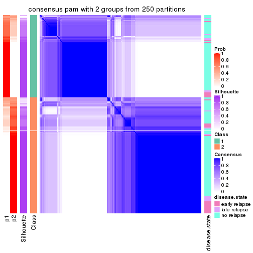</p>

</div>
<div id='tab-SD-pam-consensus-heatmap-2'>
<pre><code class="r">consensus_heatmap(res, k = 3)
</code></pre>

<p>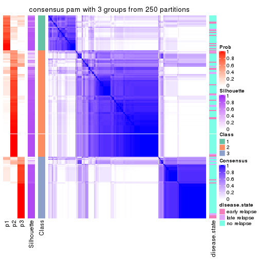</p>

</div>
<div id='tab-SD-pam-consensus-heatmap-3'>
<pre><code class="r">consensus_heatmap(res, k = 4)
</code></pre>

<p>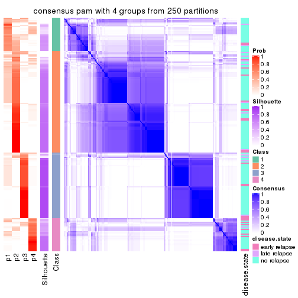</p>

</div>
<div id='tab-SD-pam-consensus-heatmap-4'>
<pre><code class="r">consensus_heatmap(res, k = 5)
</code></pre>

<p>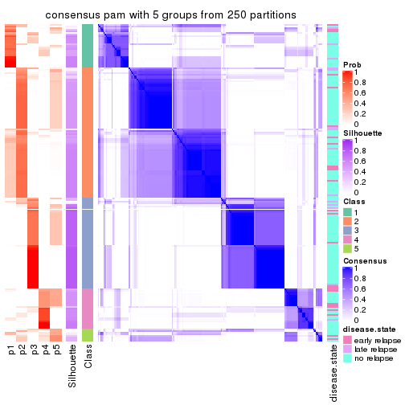</p>

</div>
<div id='tab-SD-pam-consensus-heatmap-5'>
<pre><code class="r">consensus_heatmap(res, k = 6)
</code></pre>

<p>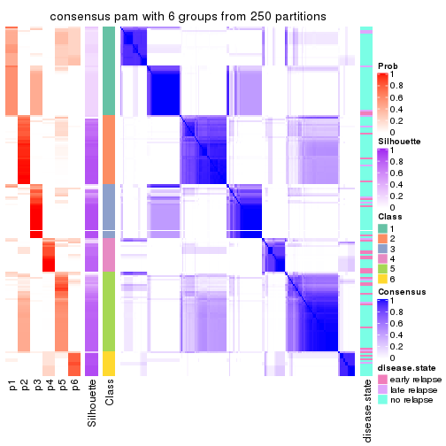</p>

</div>
</div>

Heatmaps for the membership of samples in all partitions to see how consistent they are:


<script>
$( function() {
	$( '#tabs-SD-pam-membership-heatmap' ).tabs();
} );
</script>
<div id='tabs-SD-pam-membership-heatmap'>
<ul>
<li><a href='#tab-SD-pam-membership-heatmap-1'>k = 2</a></li>
<li><a href='#tab-SD-pam-membership-heatmap-2'>k = 3</a></li>
<li><a href='#tab-SD-pam-membership-heatmap-3'>k = 4</a></li>
<li><a href='#tab-SD-pam-membership-heatmap-4'>k = 5</a></li>
<li><a href='#tab-SD-pam-membership-heatmap-5'>k = 6</a></li>
</ul>
<div id='tab-SD-pam-membership-heatmap-1'>
<pre><code class="r">membership_heatmap(res, k = 2)
</code></pre>

<p>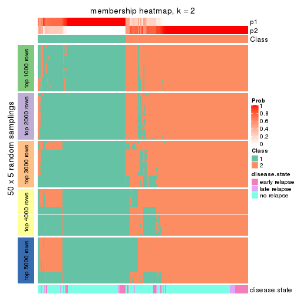</p>

</div>
<div id='tab-SD-pam-membership-heatmap-2'>
<pre><code class="r">membership_heatmap(res, k = 3)
</code></pre>

<p>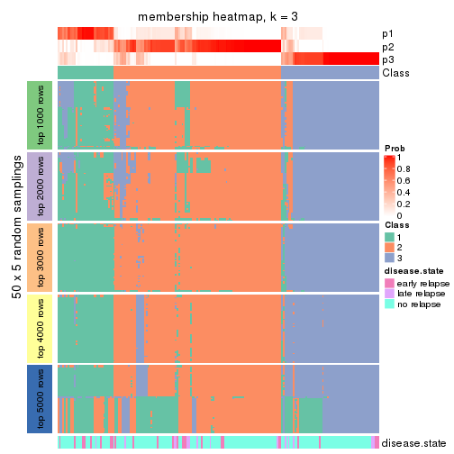</p>

</div>
<div id='tab-SD-pam-membership-heatmap-3'>
<pre><code class="r">membership_heatmap(res, k = 4)
</code></pre>

<p>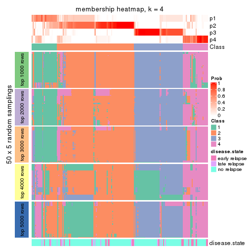</p>

</div>
<div id='tab-SD-pam-membership-heatmap-4'>
<pre><code class="r">membership_heatmap(res, k = 5)
</code></pre>

<p>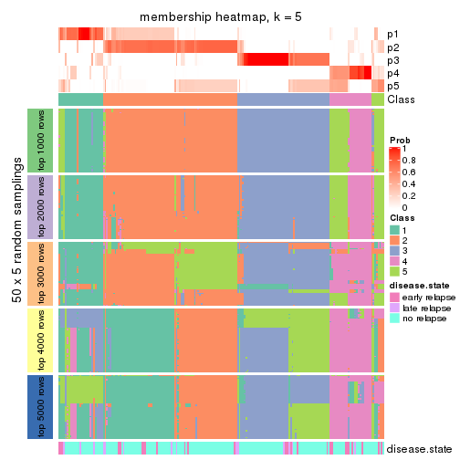</p>

</div>
<div id='tab-SD-pam-membership-heatmap-5'>
<pre><code class="r">membership_heatmap(res, k = 6)
</code></pre>

<p>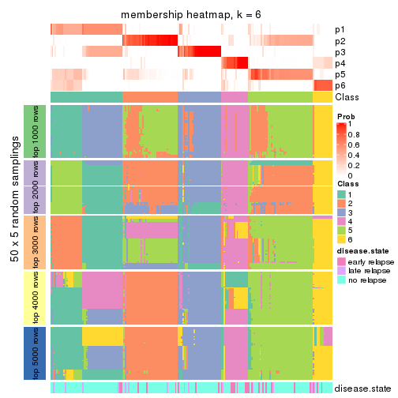</p>

</div>
</div>

As soon as we have had the classes for columns, we can look for signatures
which are significantly different between classes which can be candidate marks
for certain classes. Following are the heatmaps for signatures.


Signature heatmaps where rows are scaled:


<script>
$( function() {
	$( '#tabs-SD-pam-get-signatures' ).tabs();
} );
</script>
<div id='tabs-SD-pam-get-signatures'>
<ul>
<li><a href='#tab-SD-pam-get-signatures-1'>k = 2</a></li>
<li><a href='#tab-SD-pam-get-signatures-2'>k = 3</a></li>
<li><a href='#tab-SD-pam-get-signatures-3'>k = 4</a></li>
<li><a href='#tab-SD-pam-get-signatures-4'>k = 5</a></li>
<li><a href='#tab-SD-pam-get-signatures-5'>k = 6</a></li>
</ul>
<div id='tab-SD-pam-get-signatures-1'>
<pre><code class="r">get_signatures(res, k = 2)
</code></pre>

<p>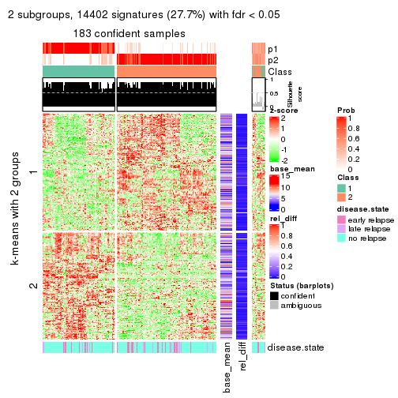</p>

</div>
<div id='tab-SD-pam-get-signatures-2'>
<pre><code class="r">get_signatures(res, k = 3)
</code></pre>

<p>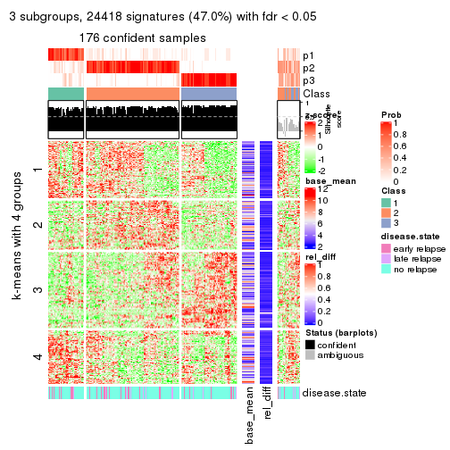</p>

</div>
<div id='tab-SD-pam-get-signatures-3'>
<pre><code class="r">get_signatures(res, k = 4)
</code></pre>

<p>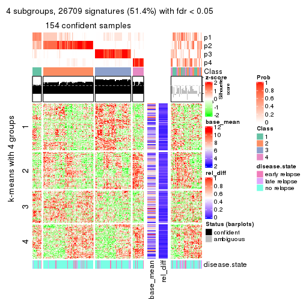</p>

</div>
<div id='tab-SD-pam-get-signatures-4'>
<pre><code class="r">get_signatures(res, k = 5)
</code></pre>

<p>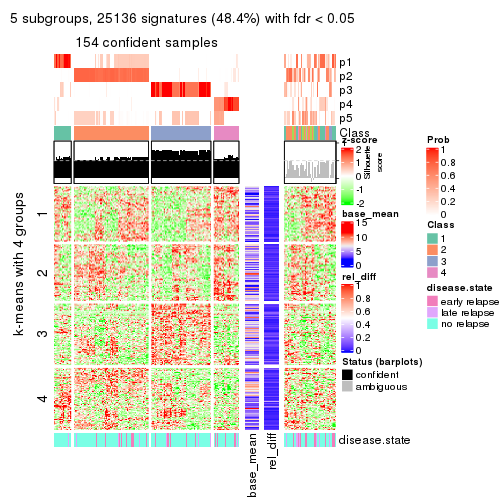</p>

</div>
<div id='tab-SD-pam-get-signatures-5'>
<pre><code class="r">get_signatures(res, k = 6)
</code></pre>

<p>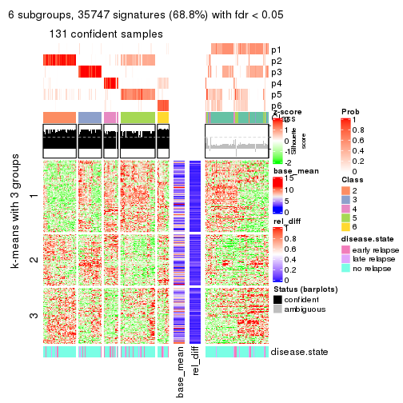</p>

</div>
</div>


Signature heatmaps where rows are not scaled:


<script>
$( function() {
	$( '#tabs-SD-pam-get-signatures-no-scale' ).tabs();
} );
</script>
<div id='tabs-SD-pam-get-signatures-no-scale'>
<ul>
<li><a href='#tab-SD-pam-get-signatures-no-scale-1'>k = 2</a></li>
<li><a href='#tab-SD-pam-get-signatures-no-scale-2'>k = 3</a></li>
<li><a href='#tab-SD-pam-get-signatures-no-scale-3'>k = 4</a></li>
<li><a href='#tab-SD-pam-get-signatures-no-scale-4'>k = 5</a></li>
<li><a href='#tab-SD-pam-get-signatures-no-scale-5'>k = 6</a></li>
</ul>
<div id='tab-SD-pam-get-signatures-no-scale-1'>
<pre><code class="r">get_signatures(res, k = 2, scale_rows = FALSE)
</code></pre>

<p>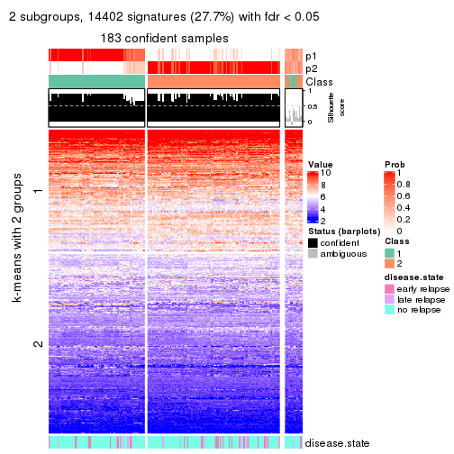</p>

</div>
<div id='tab-SD-pam-get-signatures-no-scale-2'>
<pre><code class="r">get_signatures(res, k = 3, scale_rows = FALSE)
</code></pre>

<p>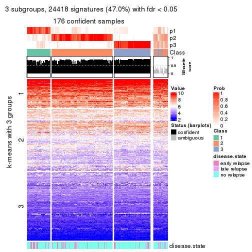</p>

</div>
<div id='tab-SD-pam-get-signatures-no-scale-3'>
<pre><code class="r">get_signatures(res, k = 4, scale_rows = FALSE)
</code></pre>

<p>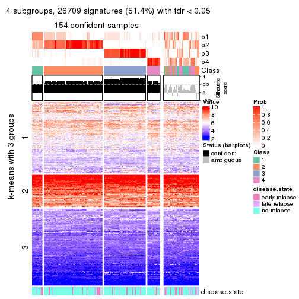</p>

</div>
<div id='tab-SD-pam-get-signatures-no-scale-4'>
<pre><code class="r">get_signatures(res, k = 5, scale_rows = FALSE)
</code></pre>

<p>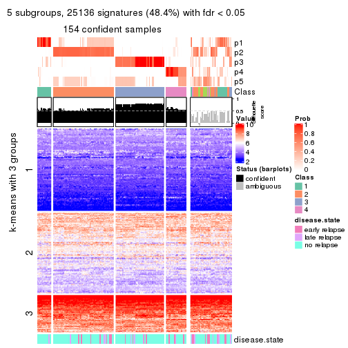</p>

</div>
<div id='tab-SD-pam-get-signatures-no-scale-5'>
<pre><code class="r">get_signatures(res, k = 6, scale_rows = FALSE)
</code></pre>

<p>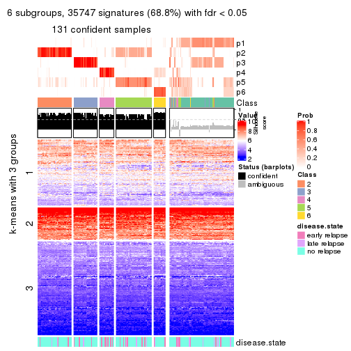</p>

</div>
</div>


Compare the overlap of signatures from different k:

```r
compare_signatures(res)
```

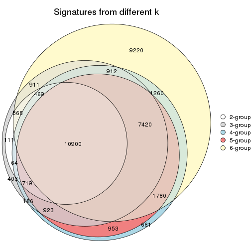

`get_signature()` returns a data frame invisibly. TO get the list of signatures, the function
call should be assigned to a variable explicitly. In following code, if `plot` argument is set
to `FALSE`, no heatmap is plotted while only the differential analysis is performed.

```r
# code only for demonstration
tb = get_signature(res, k = ..., plot = FALSE)
```

An example of the output of `tb` is:

```
#>   which_row         fdr    mean_1    mean_2 scaled_mean_1 scaled_mean_2 km
#> 1        38 0.042760348  8.373488  9.131774    -0.5533452     0.5164555  1
#> 2        40 0.018707592  7.106213  8.469186    -0.6173731     0.5762149  1
#> 3        55 0.019134737 10.221463 11.207825    -0.6159697     0.5749050  1
#> 4        59 0.006059896  5.921854  7.869574    -0.6899429     0.6439467  1
#> 5        60 0.018055526  8.928898 10.211722    -0.6204761     0.5791110  1
#> 6        98 0.009384629 15.714769 14.887706     0.6635654    -0.6193277  2
...
```

The columns in `tb` are:

1. `which_row`: row indices corresponding to the input matrix.
2. `fdr`: FDR for the differential test. 
3. `mean_x`: The mean value in group x.
4. `scaled_mean_x`: The mean value in group x after rows are scaled.
5. `km`: Row groups if k-means clustering is applied to rows.


UMAP plot which shows how samples are separated.


<script>
$( function() {
	$( '#tabs-SD-pam-dimension-reduction' ).tabs();
} );
</script>
<div id='tabs-SD-pam-dimension-reduction'>
<ul>
<li><a href='#tab-SD-pam-dimension-reduction-1'>k = 2</a></li>
<li><a href='#tab-SD-pam-dimension-reduction-2'>k = 3</a></li>
<li><a href='#tab-SD-pam-dimension-reduction-3'>k = 4</a></li>
<li><a href='#tab-SD-pam-dimension-reduction-4'>k = 5</a></li>
<li><a href='#tab-SD-pam-dimension-reduction-5'>k = 6</a></li>
</ul>
<div id='tab-SD-pam-dimension-reduction-1'>
<pre><code class="r">dimension_reduction(res, k = 2, method = &quot;UMAP&quot;)
</code></pre>

<p>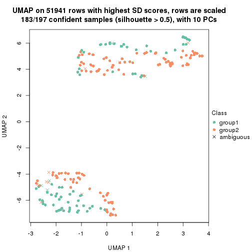</p>

</div>
<div id='tab-SD-pam-dimension-reduction-2'>
<pre><code class="r">dimension_reduction(res, k = 3, method = &quot;UMAP&quot;)
</code></pre>

<p>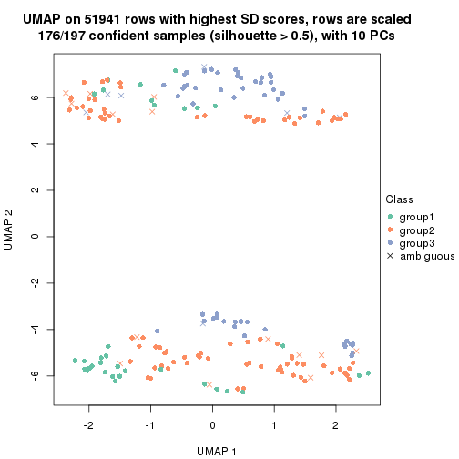</p>

</div>
<div id='tab-SD-pam-dimension-reduction-3'>
<pre><code class="r">dimension_reduction(res, k = 4, method = &quot;UMAP&quot;)
</code></pre>

<p>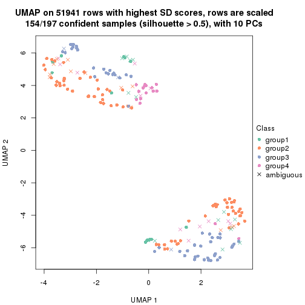</p>

</div>
<div id='tab-SD-pam-dimension-reduction-4'>
<pre><code class="r">dimension_reduction(res, k = 5, method = &quot;UMAP&quot;)
</code></pre>

<p>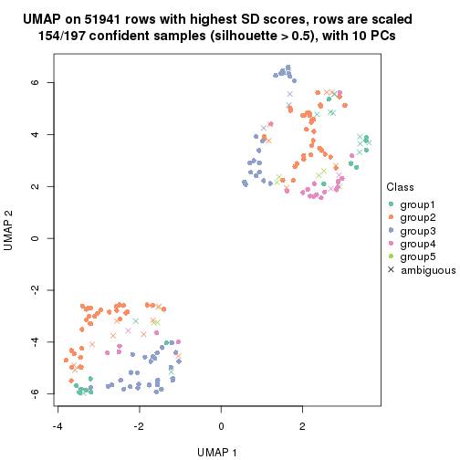</p>

</div>
<div id='tab-SD-pam-dimension-reduction-5'>
<pre><code class="r">dimension_reduction(res, k = 6, method = &quot;UMAP&quot;)
</code></pre>

<p>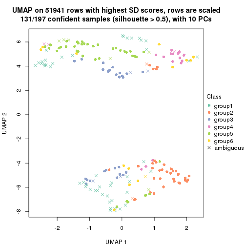</p>

</div>
</div>


Following heatmap shows how subgroups are split when increasing `k`:

```r
collect_classes(res)
```

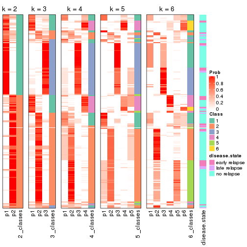


Test correlation between subgroups and known annotations. If the known
annotation is numeric, one-way ANOVA test is applied, and if the known
annotation is discrete, chi-squared contingency table test is applied.

```r
test_to_known_factors(res)
```

```
#>          n disease.state(p) k
#> SD:pam 183            0.506 2
#> SD:pam 176            0.381 3
#> SD:pam 154            0.882 4
#> SD:pam 154            0.770 5
#> SD:pam 131            0.356 6
```


If matrix rows can be associated to genes, consider to use `functional_enrichment(res,
...)` to perform function enrichment for the signature genes. See [this vignette](http://bioconductor.org/packages/devel/bioc/vignettes/cola/inst/doc/functional_enrichment.html) for more detailed explanations.


 

---------------------------------------------------


### SD:mclust


The object with results only for a single top-value method and a single partition method 
can be extracted as:

```r
res = res_list["SD", "mclust"]
# you can also extract it by
# res = res_list["SD:mclust"]
```

A summary of `res` and all the functions that can be applied to it:

```r
res
```

```
#> A 'ConsensusPartition' object with k = 2, 3, 4, 5, 6.
#>   On a matrix with 51941 rows and 197 columns.
#>   Top rows (1000, 2000, 3000, 4000, 5000) are extracted by 'SD' method.
#>   Subgroups are detected by 'mclust' method.
#>   Performed in total 1250 partitions by row resampling.
#>   Best k for subgroups seems to be 2.
#> 
#> Following methods can be applied to this 'ConsensusPartition' object:
#>  [1] "cola_report"             "collect_classes"         "collect_plots"          
#>  [4] "collect_stats"           "colnames"                "compare_signatures"     
#>  [7] "consensus_heatmap"       "dimension_reduction"     "functional_enrichment"  
#> [10] "get_anno_col"            "get_anno"                "get_classes"            
#> [13] "get_consensus"           "get_matrix"              "get_membership"         
#> [16] "get_param"               "get_signatures"          "get_stats"              
#> [19] "is_best_k"               "is_stable_k"             "membership_heatmap"     
#> [22] "ncol"                    "nrow"                    "plot_ecdf"              
#> [25] "rownames"                "select_partition_number" "show"                   
#> [28] "suggest_best_k"          "test_to_known_factors"
```

`collect_plots()` function collects all the plots made from `res` for all `k` (number of partitions)
into one single page to provide an easy and fast comparison between different `k`.

```r
collect_plots(res)
```

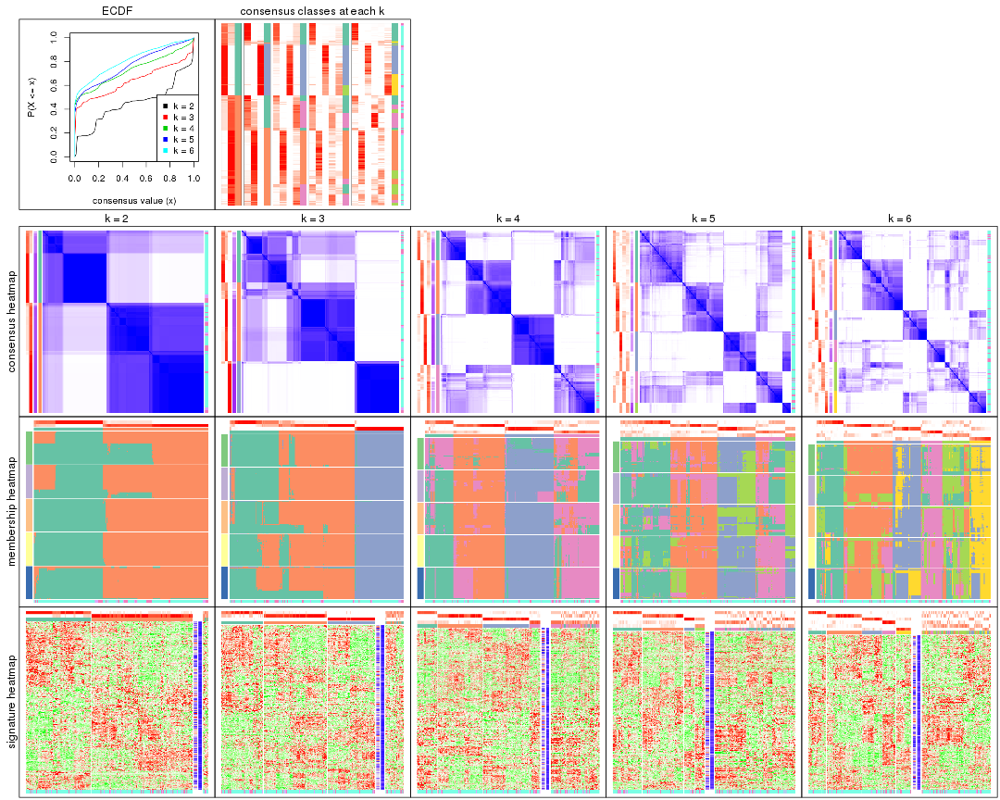

The plots are:

- The first row: a plot of the ECDF (empirical cumulative distribution
  function) curves of the consensus matrix for each `k` and the heatmap of
  predicted classes for each `k`.
- The second row: heatmaps of the consensus matrix for each `k`.
- The third row: heatmaps of the membership matrix for each `k`.
- The fouth row: heatmaps of the signatures for each `k`.

All the plots in panels can be made by individual functions and they are
plotted later in this section.

`select_partition_number()` produces several plots showing different
statistics for choosing "optimized" `k`. There are following statistics:

- ECDF curves of the consensus matrix for each `k`;
- 1-PAC. [The PAC
  score](https://en.wikipedia.org/wiki/Consensus_clustering#Over-interpretation_potential_of_consensus_clustering)
  measures the proportion of the ambiguous subgrouping.
- Mean silhouette score.
- Concordance. The mean probability of fiting the consensus class ids in all
  partitions.
- Area increased. Denote $A_k$ as the area under the ECDF curve for current
  `k`, the area increased is defined as $A_k - A_{k-1}$.
- Rand index. The percent of pairs of samples that are both in a same cluster
  or both are not in a same cluster in the partition of k and k-1.
- Jaccard index. The ratio of pairs of samples are both in a same cluster in
  the partition of k and k-1 and the pairs of samples are both in a same
  cluster in the partition k or k-1.

The detailed explanations of these statistics can be found in [the _cola_
vignette](http://bioconductor.org/packages/devel/bioc/vignettes/cola/inst/doc/cola.html#toc_13).

Generally speaking, lower PAC score, higher mean silhouette score or higher
concordance corresponds to better partition. Rand index and Jaccard index
measure how similar the current partition is compared to partition with `k-1`.
If they are too similar, we won't accept `k` is better than `k-1`.

```r
select_partition_number(res)
```

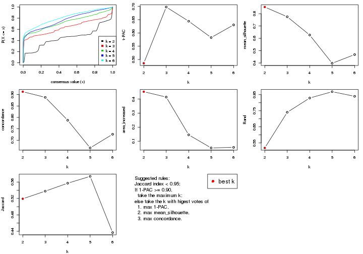

The numeric values for all these statistics can be obtained by `get_stats()`.

```r
get_stats(res)
```

```
#>   k 1-PAC mean_silhouette concordance area_increased  Rand Jaccard
#> 2 2 0.486           0.854       0.913         0.4526 0.519   0.519
#> 3 3 0.698           0.775       0.888         0.4143 0.740   0.538
#> 4 4 0.644           0.627       0.788         0.1452 0.829   0.557
#> 5 5 0.583           0.398       0.666         0.0520 0.868   0.574
#> 6 6 0.630           0.468       0.726         0.0561 0.840   0.437
```

`suggest_best_k()` suggests the best $k$ based on these statistics. The rules are as follows:

- All $k$ with Jaccard index larger than 0.95 are removed because increasing
  $k$ does not provide enough extra information. If all $k$ are removed, it is
  marked as no subgroup is detected.
- For all $k$ with 1-PAC score larger than 0.9, the maximal $k$ is taken as
  the best $k$, and other $k$ are marked as optional $k$.
- If it does not fit the second rule. The $k$ with the maximal vote of the
  highest 1-PAC score, highest mean silhouette, and highest concordance is
  taken as the best $k$.

```r
suggest_best_k(res)
```

```
#> [1] 2
```


Following shows the table of the partitions (You need to click the **show/hide
code output** link to see it). The membership matrix (columns with name `p*`)
is inferred by
[`clue::cl_consensus()`](https://www.rdocumentation.org/link/cl_consensus?package=clue)
function with the `SE` method. Basically the value in the membership matrix
represents the probability to belong to a certain group. The finall class
label for an item is determined with the group with highest probability it
belongs to.

In `get_classes()` function, the entropy is calculated from the membership
matrix and the silhouette score is calculated from the consensus matrix.


<script>
$( function() {
	$( '#tabs-SD-mclust-get-classes' ).tabs();
} );
</script>
<div id='tabs-SD-mclust-get-classes'>
<ul>
<li><a href='#tab-SD-mclust-get-classes-1'>k = 2</a></li>
<li><a href='#tab-SD-mclust-get-classes-2'>k = 3</a></li>
<li><a href='#tab-SD-mclust-get-classes-3'>k = 4</a></li>
<li><a href='#tab-SD-mclust-get-classes-4'>k = 5</a></li>
<li><a href='#tab-SD-mclust-get-classes-5'>k = 6</a></li>
</ul>

<div id='tab-SD-mclust-get-classes-1'>
<p><a id='tab-SD-mclust-get-classes-1-a' style='color:#0366d6' href='#'>show/hide code output</a></p>
<pre><code class="r">cbind(get_classes(res, k = 2), get_membership(res, k = 2))
</code></pre>

<pre><code>#&gt;           class entropy silhouette    p1    p2
#&gt; GSM342319     2  0.6712     0.8637 0.176 0.824
#&gt; GSM342323     2  0.6343     0.8639 0.160 0.840
#&gt; GSM342325     2  0.6712     0.8637 0.176 0.824
#&gt; GSM342326     2  0.6343     0.8639 0.160 0.840
#&gt; GSM342327     2  0.6343     0.8639 0.160 0.840
#&gt; GSM342329     2  0.6343     0.8639 0.160 0.840
#&gt; GSM342331     2  0.6343     0.8639 0.160 0.840
#&gt; GSM342334     2  0.6148     0.8705 0.152 0.848
#&gt; GSM342335     2  0.0000     0.9012 0.000 1.000
#&gt; GSM342354     1  0.0938     0.8999 0.988 0.012
#&gt; GSM342371     2  0.0376     0.9030 0.004 0.996
#&gt; GSM342380     2  0.6438     0.8627 0.164 0.836
#&gt; GSM342382     2  0.0376     0.9030 0.004 0.996
#&gt; GSM342399     2  0.6712     0.8637 0.176 0.824
#&gt; GSM342402     1  0.9815     0.3109 0.580 0.420
#&gt; GSM342404     2  0.0000     0.9012 0.000 1.000
#&gt; GSM342408     1  0.0938     0.8999 0.988 0.012
#&gt; GSM342409     2  0.6801     0.8475 0.180 0.820
#&gt; GSM342426     2  0.6343     0.8639 0.160 0.840
#&gt; GSM342441     1  0.0938     0.8999 0.988 0.012
#&gt; GSM342444     1  0.0938     0.8999 0.988 0.012
#&gt; GSM342451     1  0.0938     0.8999 0.988 0.012
#&gt; GSM342462     2  0.0376     0.9030 0.004 0.996
#&gt; GSM342467     2  0.6247     0.8684 0.156 0.844
#&gt; GSM342484     1  0.8713     0.6453 0.708 0.292
#&gt; GSM342491     2  0.7815     0.7752 0.232 0.768
#&gt; GSM342322     2  0.6712     0.8637 0.176 0.824
#&gt; GSM342338     1  0.0938     0.8999 0.988 0.012
#&gt; GSM342347     1  0.0938     0.8999 0.988 0.012
#&gt; GSM342356     1  0.0938     0.8999 0.988 0.012
#&gt; GSM342357     1  0.9427     0.4908 0.640 0.360
#&gt; GSM342366     2  0.0376     0.9030 0.004 0.996
#&gt; GSM342385     2  0.6438     0.8627 0.164 0.836
#&gt; GSM342421     2  0.0376     0.9030 0.004 0.996
#&gt; GSM342437     2  0.6438     0.8627 0.164 0.836
#&gt; GSM342454     1  0.0938     0.8999 0.988 0.012
#&gt; GSM342471     2  0.6048     0.8719 0.148 0.852
#&gt; GSM342477     2  0.6438     0.8627 0.164 0.836
#&gt; GSM342495     2  0.0376     0.9030 0.004 0.996
#&gt; GSM342496     2  0.4690     0.8869 0.100 0.900
#&gt; GSM342320     2  0.6343     0.8639 0.160 0.840
#&gt; GSM342321     2  0.6438     0.8627 0.164 0.836
#&gt; GSM342324     2  0.6343     0.8639 0.160 0.840
#&gt; GSM342328     2  0.6343     0.8639 0.160 0.840
#&gt; GSM342330     2  0.6343     0.8639 0.160 0.840
#&gt; GSM342332     2  0.6343     0.8657 0.160 0.840
#&gt; GSM342333     2  0.4690     0.8868 0.100 0.900
#&gt; GSM342336     2  0.5946     0.8724 0.144 0.856
#&gt; GSM342337     1  0.0938     0.8999 0.988 0.012
#&gt; GSM342339     1  0.0938     0.8999 0.988 0.012
#&gt; GSM342340     1  0.0938     0.8999 0.988 0.012
#&gt; GSM342341     1  0.0938     0.8999 0.988 0.012
#&gt; GSM342342     1  0.0938     0.8999 0.988 0.012
#&gt; GSM342343     1  0.0938     0.8999 0.988 0.012
#&gt; GSM342344     1  0.0938     0.8999 0.988 0.012
#&gt; GSM342345     1  0.0938     0.8999 0.988 0.012
#&gt; GSM342346     1  0.8144     0.7162 0.748 0.252
#&gt; GSM342348     1  0.8861     0.6218 0.696 0.304
#&gt; GSM342349     1  0.0938     0.8999 0.988 0.012
#&gt; GSM342350     1  0.0938     0.8999 0.988 0.012
#&gt; GSM342351     1  0.0938     0.8999 0.988 0.012
#&gt; GSM342352     1  0.0938     0.8999 0.988 0.012
#&gt; GSM342353     1  0.0938     0.8999 0.988 0.012
#&gt; GSM342355     1  0.5294     0.8327 0.880 0.120
#&gt; GSM342358     1  0.8267     0.7088 0.740 0.260
#&gt; GSM342359     1  0.8144     0.7210 0.748 0.252
#&gt; GSM342360     1  0.8081     0.7210 0.752 0.248
#&gt; GSM342361     1  0.8016     0.7313 0.756 0.244
#&gt; GSM342362     2  0.9754     0.3708 0.408 0.592
#&gt; GSM342363     2  0.7674     0.7875 0.224 0.776
#&gt; GSM342364     2  0.0376     0.9030 0.004 0.996
#&gt; GSM342365     2  0.0000     0.9012 0.000 1.000
#&gt; GSM342367     2  0.1184     0.8954 0.016 0.984
#&gt; GSM342368     2  0.0376     0.9030 0.004 0.996
#&gt; GSM342369     2  0.0000     0.9012 0.000 1.000
#&gt; GSM342370     2  0.0000     0.9012 0.000 1.000
#&gt; GSM342372     2  0.0000     0.9012 0.000 1.000
#&gt; GSM342373     2  0.0376     0.9030 0.004 0.996
#&gt; GSM342374     2  0.0000     0.9012 0.000 1.000
#&gt; GSM342375     2  0.0000     0.9012 0.000 1.000
#&gt; GSM342376     2  0.2236     0.8994 0.036 0.964
#&gt; GSM342377     2  0.1184     0.8954 0.016 0.984
#&gt; GSM342378     2  0.6712     0.8637 0.176 0.824
#&gt; GSM342379     2  0.6438     0.8627 0.164 0.836
#&gt; GSM342381     2  0.1184     0.8954 0.016 0.984
#&gt; GSM342383     2  0.6343     0.8724 0.160 0.840
#&gt; GSM342384     2  0.1184     0.8954 0.016 0.984
#&gt; GSM342386     2  0.0376     0.9030 0.004 0.996
#&gt; GSM342387     2  0.6343     0.8639 0.160 0.840
#&gt; GSM342388     1  0.0938     0.8999 0.988 0.012
#&gt; GSM342389     2  0.1184     0.8954 0.016 0.984
#&gt; GSM342390     1  0.7883     0.7360 0.764 0.236
#&gt; GSM342391     2  0.6623     0.8639 0.172 0.828
#&gt; GSM342392     1  0.0938     0.8999 0.988 0.012
#&gt; GSM342393     2  0.0000     0.9012 0.000 1.000
#&gt; GSM342394     2  0.6712     0.8637 0.176 0.824
#&gt; GSM342395     2  0.0376     0.9030 0.004 0.996
#&gt; GSM342396     1  0.0938     0.8999 0.988 0.012
#&gt; GSM342397     1  0.1414     0.8956 0.980 0.020
#&gt; GSM342398     2  0.1184     0.8954 0.016 0.984
#&gt; GSM342400     2  0.1184     0.8954 0.016 0.984
#&gt; GSM342401     1  0.0938     0.8999 0.988 0.012
#&gt; GSM342403     2  0.6438     0.8627 0.164 0.836
#&gt; GSM342405     1  0.8081     0.7210 0.752 0.248
#&gt; GSM342406     1  0.8016     0.7262 0.756 0.244
#&gt; GSM342407     1  0.0938     0.8999 0.988 0.012
#&gt; GSM342410     1  0.9988     0.0742 0.520 0.480
#&gt; GSM342411     2  0.6438     0.8627 0.164 0.836
#&gt; GSM342412     2  0.6343     0.8639 0.160 0.840
#&gt; GSM342413     1  0.7883     0.7360 0.764 0.236
#&gt; GSM342414     1  0.0938     0.8999 0.988 0.012
#&gt; GSM342415     2  0.0376     0.9030 0.004 0.996
#&gt; GSM342416     1  0.8081     0.7210 0.752 0.248
#&gt; GSM342417     2  0.6343     0.8639 0.160 0.840
#&gt; GSM342418     2  0.6343     0.8639 0.160 0.840
#&gt; GSM342419     2  0.6343     0.8724 0.160 0.840
#&gt; GSM342420     2  0.6343     0.8639 0.160 0.840
#&gt; GSM342422     2  0.1184     0.8954 0.016 0.984
#&gt; GSM342423     2  0.0376     0.9030 0.004 0.996
#&gt; GSM342424     2  0.6343     0.8639 0.160 0.840
#&gt; GSM342425     2  0.6438     0.8627 0.164 0.836
#&gt; GSM342427     2  0.0376     0.9030 0.004 0.996
#&gt; GSM342428     2  0.2778     0.8965 0.048 0.952
#&gt; GSM342429     2  0.4161     0.8903 0.084 0.916
#&gt; GSM342430     1  0.0938     0.8999 0.988 0.012
#&gt; GSM342431     1  0.0938     0.8999 0.988 0.012
#&gt; GSM342432     1  0.0938     0.8999 0.988 0.012
#&gt; GSM342433     1  0.0938     0.8999 0.988 0.012
#&gt; GSM342434     1  0.0938     0.8999 0.988 0.012
#&gt; GSM342435     1  0.0938     0.8999 0.988 0.012
#&gt; GSM342436     1  0.0938     0.8999 0.988 0.012
#&gt; GSM342438     1  0.0938     0.8999 0.988 0.012
#&gt; GSM342439     1  0.0938     0.8999 0.988 0.012
#&gt; GSM342440     1  0.0938     0.8999 0.988 0.012
#&gt; GSM342442     1  0.0938     0.8999 0.988 0.012
#&gt; GSM342443     2  0.0376     0.9030 0.004 0.996
#&gt; GSM342445     1  0.0938     0.8999 0.988 0.012
#&gt; GSM342446     1  0.0938     0.8999 0.988 0.012
#&gt; GSM342447     1  0.0938     0.8999 0.988 0.012
#&gt; GSM342448     1  0.0938     0.8999 0.988 0.012
#&gt; GSM342449     1  0.0938     0.8999 0.988 0.012
#&gt; GSM342450     1  0.0938     0.8999 0.988 0.012
#&gt; GSM342452     1  0.0938     0.8999 0.988 0.012
#&gt; GSM342453     1  0.0938     0.8999 0.988 0.012
#&gt; GSM342455     1  0.0938     0.8999 0.988 0.012
#&gt; GSM342456     1  0.8144     0.7210 0.748 0.252
#&gt; GSM342457     2  0.0376     0.9030 0.004 0.996
#&gt; GSM342458     2  0.0000     0.9012 0.000 1.000
#&gt; GSM342459     2  0.0376     0.9030 0.004 0.996
#&gt; GSM342460     2  0.0376     0.9030 0.004 0.996
#&gt; GSM342461     2  0.0376     0.9030 0.004 0.996
#&gt; GSM342463     2  0.0376     0.9030 0.004 0.996
#&gt; GSM342464     2  0.0376     0.9030 0.004 0.996
#&gt; GSM342465     2  0.0376     0.9030 0.004 0.996
#&gt; GSM342466     1  0.8081     0.7210 0.752 0.248
#&gt; GSM342468     2  0.0000     0.9012 0.000 1.000
#&gt; GSM342469     2  0.6343     0.8724 0.160 0.840
#&gt; GSM342470     1  0.7883     0.7360 0.764 0.236
#&gt; GSM342472     1  0.7883     0.7360 0.764 0.236
#&gt; GSM342473     2  0.0376     0.9030 0.004 0.996
#&gt; GSM342474     2  0.0376     0.9030 0.004 0.996
#&gt; GSM342475     1  0.0938     0.8999 0.988 0.012
#&gt; GSM342476     2  0.0376     0.9030 0.004 0.996
#&gt; GSM342478     2  0.0376     0.9030 0.004 0.996
#&gt; GSM342479     2  0.5946     0.8736 0.144 0.856
#&gt; GSM342480     2  0.0376     0.9030 0.004 0.996
#&gt; GSM342481     2  0.0376     0.9030 0.004 0.996
#&gt; GSM342482     2  0.0376     0.9030 0.004 0.996
#&gt; GSM342483     2  0.0376     0.9030 0.004 0.996
#&gt; GSM342485     2  0.0376     0.9030 0.004 0.996
#&gt; GSM342486     2  0.0376     0.9030 0.004 0.996
#&gt; GSM342487     1  0.0938     0.8999 0.988 0.012
#&gt; GSM342488     2  0.0376     0.9030 0.004 0.996
#&gt; GSM342489     2  0.0376     0.9030 0.004 0.996
#&gt; GSM342490     2  0.5408     0.8802 0.124 0.876
#&gt; GSM342492     1  0.0938     0.8999 0.988 0.012
#&gt; GSM342493     2  0.0376     0.9030 0.004 0.996
#&gt; GSM342494     2  0.0376     0.9030 0.004 0.996
#&gt; GSM342497     2  0.0376     0.9030 0.004 0.996
#&gt; GSM342498     2  0.6438     0.8627 0.164 0.836
#&gt; GSM342499     2  0.6343     0.8724 0.160 0.840
#&gt; GSM342500     2  0.0376     0.9030 0.004 0.996
#&gt; GSM342501     2  0.6148     0.8701 0.152 0.848
#&gt; GSM342502     2  0.0376     0.9030 0.004 0.996
#&gt; GSM342503     2  0.0376     0.9030 0.004 0.996
#&gt; GSM342504     2  0.0376     0.9030 0.004 0.996
#&gt; GSM342505     1  0.0938     0.8999 0.988 0.012
#&gt; GSM342506     2  0.9661     0.4207 0.392 0.608
#&gt; GSM342507     1  0.8909     0.6133 0.692 0.308
#&gt; GSM342508     2  0.9552     0.4671 0.376 0.624
#&gt; GSM342509     1  0.8081     0.7210 0.752 0.248
#&gt; GSM342510     1  0.7883     0.7360 0.764 0.236
#&gt; GSM342511     1  0.7883     0.7360 0.764 0.236
#&gt; GSM342512     2  0.0376     0.9030 0.004 0.996
#&gt; GSM342513     2  0.0376     0.9030 0.004 0.996
#&gt; GSM342514     1  0.7883     0.7360 0.764 0.236
#&gt; GSM342515     2  0.6712     0.8637 0.176 0.824
</code></pre>

<script>
$('#tab-SD-mclust-get-classes-1-a').parent().next().next().hide();
$('#tab-SD-mclust-get-classes-1-a').click(function(){
  $('#tab-SD-mclust-get-classes-1-a').parent().next().next().toggle();
  return(false);
});
</script>
</div>

<div id='tab-SD-mclust-get-classes-2'>
<p><a id='tab-SD-mclust-get-classes-2-a' style='color:#0366d6' href='#'>show/hide code output</a></p>
<pre><code class="r">cbind(get_classes(res, k = 3), get_membership(res, k = 3))
</code></pre>

<pre><code>#&gt;           class entropy silhouette    p1    p2    p3
#&gt; GSM342319     1  0.5882     0.5863 0.652 0.348 0.000
#&gt; GSM342323     1  0.5882     0.5841 0.652 0.348 0.000
#&gt; GSM342325     1  0.5882     0.5863 0.652 0.348 0.000
#&gt; GSM342326     1  0.5882     0.5841 0.652 0.348 0.000
#&gt; GSM342327     1  0.5882     0.5841 0.652 0.348 0.000
#&gt; GSM342329     1  0.5882     0.5841 0.652 0.348 0.000
#&gt; GSM342331     1  0.5882     0.5841 0.652 0.348 0.000
#&gt; GSM342334     2  0.6291     0.2774 0.468 0.532 0.000
#&gt; GSM342335     2  0.3192     0.8276 0.112 0.888 0.000
#&gt; GSM342354     3  0.0000     0.9811 0.000 0.000 1.000
#&gt; GSM342371     2  0.2301     0.8574 0.060 0.936 0.004
#&gt; GSM342380     1  0.5443     0.4897 0.736 0.260 0.004
#&gt; GSM342382     2  0.2301     0.8574 0.060 0.936 0.004
#&gt; GSM342399     1  0.5859     0.5905 0.656 0.344 0.000
#&gt; GSM342402     1  0.0424     0.7511 0.992 0.000 0.008
#&gt; GSM342404     2  0.3192     0.8276 0.112 0.888 0.000
#&gt; GSM342408     3  0.0000     0.9811 0.000 0.000 1.000
#&gt; GSM342409     2  0.7919     0.1781 0.464 0.480 0.056
#&gt; GSM342426     1  0.6111     0.4890 0.604 0.396 0.000
#&gt; GSM342441     3  0.0237     0.9795 0.004 0.000 0.996
#&gt; GSM342444     3  0.0237     0.9779 0.004 0.000 0.996
#&gt; GSM342451     3  0.0000     0.9811 0.000 0.000 1.000
#&gt; GSM342462     2  0.0237     0.8535 0.000 0.996 0.004
#&gt; GSM342467     2  0.6483     0.3059 0.452 0.544 0.004
#&gt; GSM342484     1  0.0592     0.7506 0.988 0.000 0.012
#&gt; GSM342491     1  0.6104     0.2980 0.648 0.348 0.004
#&gt; GSM342322     1  0.5905     0.5832 0.648 0.352 0.000
#&gt; GSM342338     3  0.0000     0.9811 0.000 0.000 1.000
#&gt; GSM342347     3  0.0000     0.9811 0.000 0.000 1.000
#&gt; GSM342356     3  0.0000     0.9811 0.000 0.000 1.000
#&gt; GSM342357     1  0.0424     0.7511 0.992 0.000 0.008
#&gt; GSM342366     2  0.2301     0.8574 0.060 0.936 0.004
#&gt; GSM342385     1  0.6008     0.3302 0.664 0.332 0.004
#&gt; GSM342421     2  0.2448     0.8524 0.076 0.924 0.000
#&gt; GSM342437     1  0.5656     0.5839 0.712 0.284 0.004
#&gt; GSM342454     3  0.0237     0.9795 0.004 0.000 0.996
#&gt; GSM342471     2  0.5480     0.6007 0.264 0.732 0.004
#&gt; GSM342477     2  0.5982     0.5474 0.328 0.668 0.004
#&gt; GSM342495     2  0.0237     0.8535 0.000 0.996 0.004
#&gt; GSM342496     2  0.3193     0.8158 0.100 0.896 0.004
#&gt; GSM342320     1  0.4750     0.6898 0.784 0.216 0.000
#&gt; GSM342321     1  0.5882     0.5841 0.652 0.348 0.000
#&gt; GSM342324     1  0.0475     0.7505 0.992 0.004 0.004
#&gt; GSM342328     1  0.5882     0.5841 0.652 0.348 0.000
#&gt; GSM342330     1  0.5882     0.5841 0.652 0.348 0.000
#&gt; GSM342332     2  0.6291    -0.0674 0.468 0.532 0.000
#&gt; GSM342333     2  0.6286     0.2866 0.464 0.536 0.000
#&gt; GSM342336     2  0.4605     0.7420 0.204 0.796 0.000
#&gt; GSM342337     3  0.0000     0.9811 0.000 0.000 1.000
#&gt; GSM342339     3  0.0000     0.9811 0.000 0.000 1.000
#&gt; GSM342340     3  0.0000     0.9811 0.000 0.000 1.000
#&gt; GSM342341     3  0.0000     0.9811 0.000 0.000 1.000
#&gt; GSM342342     3  0.0000     0.9811 0.000 0.000 1.000
#&gt; GSM342343     3  0.0000     0.9811 0.000 0.000 1.000
#&gt; GSM342344     3  0.0000     0.9811 0.000 0.000 1.000
#&gt; GSM342345     3  0.0000     0.9811 0.000 0.000 1.000
#&gt; GSM342346     2  0.6664     0.2724 0.464 0.528 0.008
#&gt; GSM342348     1  0.0424     0.7511 0.992 0.000 0.008
#&gt; GSM342349     3  0.0000     0.9811 0.000 0.000 1.000
#&gt; GSM342350     3  0.0000     0.9811 0.000 0.000 1.000
#&gt; GSM342351     3  0.0000     0.9811 0.000 0.000 1.000
#&gt; GSM342352     3  0.0000     0.9811 0.000 0.000 1.000
#&gt; GSM342353     3  0.0000     0.9811 0.000 0.000 1.000
#&gt; GSM342355     3  0.5397     0.6164 0.280 0.000 0.720
#&gt; GSM342358     1  0.0424     0.7505 0.992 0.000 0.008
#&gt; GSM342359     1  0.0424     0.7505 0.992 0.000 0.008
#&gt; GSM342360     1  0.0592     0.7506 0.988 0.000 0.012
#&gt; GSM342361     1  0.0424     0.7505 0.992 0.000 0.008
#&gt; GSM342362     1  0.0661     0.7511 0.988 0.004 0.008
#&gt; GSM342363     1  0.0424     0.7511 0.992 0.000 0.008
#&gt; GSM342364     2  0.2301     0.8574 0.060 0.936 0.004
#&gt; GSM342365     2  0.2878     0.8396 0.096 0.904 0.000
#&gt; GSM342367     2  0.2066     0.8570 0.060 0.940 0.000
#&gt; GSM342368     2  0.2301     0.8574 0.060 0.936 0.004
#&gt; GSM342369     2  0.2165     0.8567 0.064 0.936 0.000
#&gt; GSM342370     2  0.3192     0.8276 0.112 0.888 0.000
#&gt; GSM342372     2  0.2165     0.8567 0.064 0.936 0.000
#&gt; GSM342373     2  0.2301     0.8574 0.060 0.936 0.004
#&gt; GSM342374     2  0.3192     0.8276 0.112 0.888 0.000
#&gt; GSM342375     2  0.3192     0.8276 0.112 0.888 0.000
#&gt; GSM342376     2  0.5678     0.5670 0.316 0.684 0.000
#&gt; GSM342377     2  0.3192     0.8272 0.112 0.888 0.000
#&gt; GSM342378     1  0.3192     0.7319 0.888 0.112 0.000
#&gt; GSM342379     1  0.6104     0.5816 0.648 0.348 0.004
#&gt; GSM342381     2  0.2066     0.8570 0.060 0.940 0.000
#&gt; GSM342383     2  0.5859     0.4069 0.344 0.656 0.000
#&gt; GSM342384     2  0.2066     0.8570 0.060 0.940 0.000
#&gt; GSM342386     2  0.2301     0.8574 0.060 0.936 0.004
#&gt; GSM342387     1  0.4121     0.7127 0.832 0.168 0.000
#&gt; GSM342388     3  0.0000     0.9811 0.000 0.000 1.000
#&gt; GSM342389     2  0.2066     0.8570 0.060 0.940 0.000
#&gt; GSM342390     1  0.1289     0.7454 0.968 0.000 0.032
#&gt; GSM342391     1  0.0237     0.7490 0.996 0.004 0.000
#&gt; GSM342392     3  0.0000     0.9811 0.000 0.000 1.000
#&gt; GSM342393     2  0.5431     0.6226 0.284 0.716 0.000
#&gt; GSM342394     1  0.4605     0.6984 0.796 0.204 0.000
#&gt; GSM342395     2  0.2301     0.8574 0.060 0.936 0.004
#&gt; GSM342396     3  0.0000     0.9811 0.000 0.000 1.000
#&gt; GSM342397     3  0.0592     0.9695 0.012 0.000 0.988
#&gt; GSM342398     2  0.2165     0.8564 0.064 0.936 0.000
#&gt; GSM342400     2  0.2066     0.8570 0.060 0.940 0.000
#&gt; GSM342401     3  0.0000     0.9811 0.000 0.000 1.000
#&gt; GSM342403     2  0.6505     0.2729 0.468 0.528 0.004
#&gt; GSM342405     1  0.9088     0.1142 0.464 0.140 0.396
#&gt; GSM342406     1  0.0424     0.7511 0.992 0.000 0.008
#&gt; GSM342407     3  0.0000     0.9811 0.000 0.000 1.000
#&gt; GSM342410     1  0.0424     0.7511 0.992 0.000 0.008
#&gt; GSM342411     1  0.4178     0.7111 0.828 0.172 0.000
#&gt; GSM342412     2  0.6235     0.3463 0.436 0.564 0.000
#&gt; GSM342413     1  0.0424     0.7505 0.992 0.000 0.008
#&gt; GSM342414     3  0.0000     0.9811 0.000 0.000 1.000
#&gt; GSM342415     2  0.3349     0.8283 0.108 0.888 0.004
#&gt; GSM342416     1  0.0424     0.7511 0.992 0.000 0.008
#&gt; GSM342417     1  0.5882     0.5841 0.652 0.348 0.000
#&gt; GSM342418     1  0.4504     0.7007 0.804 0.196 0.000
#&gt; GSM342419     2  0.5835     0.4191 0.340 0.660 0.000
#&gt; GSM342420     1  0.5882     0.5841 0.652 0.348 0.000
#&gt; GSM342422     2  0.2165     0.8564 0.064 0.936 0.000
#&gt; GSM342423     2  0.2301     0.8574 0.060 0.936 0.004
#&gt; GSM342424     1  0.5882     0.5841 0.652 0.348 0.000
#&gt; GSM342425     1  0.6520     0.2175 0.508 0.488 0.004
#&gt; GSM342427     2  0.3425     0.8256 0.112 0.884 0.004
#&gt; GSM342428     2  0.3267     0.8246 0.116 0.884 0.000
#&gt; GSM342429     2  0.0829     0.8528 0.012 0.984 0.004
#&gt; GSM342430     3  0.0000     0.9811 0.000 0.000 1.000
#&gt; GSM342431     3  0.0000     0.9811 0.000 0.000 1.000
#&gt; GSM342432     3  0.0592     0.9729 0.012 0.000 0.988
#&gt; GSM342433     3  0.0237     0.9795 0.004 0.000 0.996
#&gt; GSM342434     3  0.0000     0.9811 0.000 0.000 1.000
#&gt; GSM342435     3  0.0237     0.9795 0.004 0.000 0.996
#&gt; GSM342436     3  0.0237     0.9795 0.004 0.000 0.996
#&gt; GSM342438     3  0.0237     0.9795 0.004 0.000 0.996
#&gt; GSM342439     3  0.0237     0.9795 0.004 0.000 0.996
#&gt; GSM342440     3  0.0237     0.9795 0.004 0.000 0.996
#&gt; GSM342442     3  0.0237     0.9795 0.004 0.000 0.996
#&gt; GSM342443     2  0.0237     0.8535 0.000 0.996 0.004
#&gt; GSM342445     3  0.0000     0.9811 0.000 0.000 1.000
#&gt; GSM342446     3  0.0000     0.9811 0.000 0.000 1.000
#&gt; GSM342447     3  0.0000     0.9811 0.000 0.000 1.000
#&gt; GSM342448     3  0.0000     0.9811 0.000 0.000 1.000
#&gt; GSM342449     3  0.0237     0.9795 0.004 0.000 0.996
#&gt; GSM342450     3  0.0000     0.9811 0.000 0.000 1.000
#&gt; GSM342452     3  0.0000     0.9811 0.000 0.000 1.000
#&gt; GSM342453     3  0.0237     0.9795 0.004 0.000 0.996
#&gt; GSM342455     3  0.0000     0.9811 0.000 0.000 1.000
#&gt; GSM342456     1  0.0424     0.7505 0.992 0.000 0.008
#&gt; GSM342457     2  0.2301     0.8574 0.060 0.936 0.004
#&gt; GSM342458     2  0.2165     0.8567 0.064 0.936 0.000
#&gt; GSM342459     2  0.0237     0.8535 0.000 0.996 0.004
#&gt; GSM342460     2  0.0237     0.8535 0.000 0.996 0.004
#&gt; GSM342461     2  0.0237     0.8535 0.000 0.996 0.004
#&gt; GSM342463     2  0.0237     0.8535 0.000 0.996 0.004
#&gt; GSM342464     2  0.0237     0.8535 0.000 0.996 0.004
#&gt; GSM342465     2  0.0237     0.8535 0.000 0.996 0.004
#&gt; GSM342466     1  0.1529     0.7381 0.960 0.000 0.040
#&gt; GSM342468     2  0.2165     0.8567 0.064 0.936 0.000
#&gt; GSM342469     2  0.5650     0.4884 0.312 0.688 0.000
#&gt; GSM342470     1  0.0592     0.7506 0.988 0.000 0.012
#&gt; GSM342472     1  0.9018     0.0529 0.456 0.132 0.412
#&gt; GSM342473     2  0.0237     0.8535 0.000 0.996 0.004
#&gt; GSM342474     2  0.0237     0.8535 0.000 0.996 0.004
#&gt; GSM342475     3  0.0237     0.9795 0.004 0.000 0.996
#&gt; GSM342476     2  0.0475     0.8539 0.004 0.992 0.004
#&gt; GSM342478     2  0.0237     0.8535 0.000 0.996 0.004
#&gt; GSM342479     2  0.2590     0.8409 0.072 0.924 0.004
#&gt; GSM342480     2  0.0237     0.8535 0.000 0.996 0.004
#&gt; GSM342481     2  0.0237     0.8535 0.000 0.996 0.004
#&gt; GSM342482     2  0.0237     0.8535 0.000 0.996 0.004
#&gt; GSM342483     2  0.0237     0.8535 0.000 0.996 0.004
#&gt; GSM342485     2  0.0237     0.8535 0.000 0.996 0.004
#&gt; GSM342486     2  0.0237     0.8535 0.000 0.996 0.004
#&gt; GSM342487     3  0.0237     0.9795 0.004 0.000 0.996
#&gt; GSM342488     2  0.0237     0.8535 0.000 0.996 0.004
#&gt; GSM342489     2  0.0237     0.8535 0.000 0.996 0.004
#&gt; GSM342490     2  0.2301     0.8411 0.060 0.936 0.004
#&gt; GSM342492     3  0.0237     0.9795 0.004 0.000 0.996
#&gt; GSM342493     2  0.0237     0.8535 0.000 0.996 0.004
#&gt; GSM342494     2  0.0237     0.8535 0.000 0.996 0.004
#&gt; GSM342497     2  0.1647     0.8508 0.036 0.960 0.004
#&gt; GSM342498     2  0.6495     0.1128 0.460 0.536 0.004
#&gt; GSM342499     2  0.5621     0.5033 0.308 0.692 0.000
#&gt; GSM342500     2  0.0237     0.8535 0.000 0.996 0.004
#&gt; GSM342501     2  0.2682     0.8359 0.076 0.920 0.004
#&gt; GSM342502     2  0.0237     0.8535 0.000 0.996 0.004
#&gt; GSM342503     2  0.0237     0.8535 0.000 0.996 0.004
#&gt; GSM342504     2  0.0237     0.8535 0.000 0.996 0.004
#&gt; GSM342505     3  0.0000     0.9811 0.000 0.000 1.000
#&gt; GSM342506     1  0.6723     0.4799 0.704 0.248 0.048
#&gt; GSM342507     1  0.0424     0.7511 0.992 0.000 0.008
#&gt; GSM342508     1  0.0237     0.7502 0.996 0.000 0.004
#&gt; GSM342509     1  0.1289     0.7432 0.968 0.000 0.032
#&gt; GSM342510     1  0.3038     0.7005 0.896 0.000 0.104
#&gt; GSM342511     3  0.6095     0.4182 0.392 0.000 0.608
#&gt; GSM342512     2  0.0237     0.8535 0.000 0.996 0.004
#&gt; GSM342513     2  0.0237     0.8535 0.000 0.996 0.004
#&gt; GSM342514     3  0.4931     0.6656 0.232 0.000 0.768
#&gt; GSM342515     1  0.5733     0.6101 0.676 0.324 0.000
</code></pre>

<script>
$('#tab-SD-mclust-get-classes-2-a').parent().next().next().hide();
$('#tab-SD-mclust-get-classes-2-a').click(function(){
  $('#tab-SD-mclust-get-classes-2-a').parent().next().next().toggle();
  return(false);
});
</script>
</div>

<div id='tab-SD-mclust-get-classes-3'>
<p><a id='tab-SD-mclust-get-classes-3-a' style='color:#0366d6' href='#'>show/hide code output</a></p>
<pre><code class="r">cbind(get_classes(res, k = 4), get_membership(res, k = 4))
</code></pre>

<pre><code>#&gt;           class entropy silhouette    p1    p2    p3    p4
#&gt; GSM342319     4  0.3486    0.50713 0.188 0.000 0.000 0.812
#&gt; GSM342323     4  0.4331    0.48956 0.288 0.000 0.000 0.712
#&gt; GSM342325     4  0.3486    0.50194 0.188 0.000 0.000 0.812
#&gt; GSM342326     4  0.4331    0.48956 0.288 0.000 0.000 0.712
#&gt; GSM342327     4  0.4331    0.48956 0.288 0.000 0.000 0.712
#&gt; GSM342329     4  0.4331    0.48956 0.288 0.000 0.000 0.712
#&gt; GSM342331     4  0.4331    0.48956 0.288 0.000 0.000 0.712
#&gt; GSM342334     4  0.7425   -0.20701 0.412 0.168 0.000 0.420
#&gt; GSM342335     4  0.5138    0.14472 0.008 0.392 0.000 0.600
#&gt; GSM342354     3  0.0592    0.91662 0.016 0.000 0.984 0.000
#&gt; GSM342371     2  0.4011    0.71402 0.008 0.784 0.000 0.208
#&gt; GSM342380     4  0.5607   -0.47844 0.484 0.020 0.000 0.496
#&gt; GSM342382     2  0.3801    0.72855 0.000 0.780 0.000 0.220
#&gt; GSM342399     4  0.3172    0.50118 0.160 0.000 0.000 0.840
#&gt; GSM342402     1  0.3266    0.75650 0.832 0.000 0.000 0.168
#&gt; GSM342404     4  0.5183    0.07307 0.008 0.408 0.000 0.584
#&gt; GSM342408     3  0.0707    0.91580 0.020 0.000 0.980 0.000
#&gt; GSM342409     1  0.8062    0.22117 0.472 0.180 0.024 0.324
#&gt; GSM342426     4  0.4898    0.50478 0.260 0.024 0.000 0.716
#&gt; GSM342441     3  0.0707    0.91580 0.020 0.000 0.980 0.000
#&gt; GSM342444     3  0.3024    0.90343 0.148 0.000 0.852 0.000
#&gt; GSM342451     3  0.3024    0.90343 0.148 0.000 0.852 0.000
#&gt; GSM342462     2  0.0336    0.80991 0.000 0.992 0.000 0.008
#&gt; GSM342467     1  0.7645    0.15636 0.428 0.212 0.000 0.360
#&gt; GSM342484     1  0.3610    0.75203 0.800 0.000 0.000 0.200
#&gt; GSM342491     4  0.7661   -0.26115 0.376 0.212 0.000 0.412
#&gt; GSM342322     4  0.4040    0.50235 0.248 0.000 0.000 0.752
#&gt; GSM342338     3  0.2921    0.90562 0.140 0.000 0.860 0.000
#&gt; GSM342347     3  0.0817    0.91453 0.024 0.000 0.976 0.000
#&gt; GSM342356     3  0.4543    0.71722 0.324 0.000 0.676 0.000
#&gt; GSM342357     1  0.3311    0.75711 0.828 0.000 0.000 0.172
#&gt; GSM342366     2  0.4452    0.66757 0.008 0.732 0.000 0.260
#&gt; GSM342385     4  0.5168   -0.49867 0.492 0.004 0.000 0.504
#&gt; GSM342421     2  0.5294    0.21349 0.008 0.508 0.000 0.484
#&gt; GSM342437     4  0.7683   -0.30608 0.384 0.216 0.000 0.400
#&gt; GSM342454     3  0.3024    0.90343 0.148 0.000 0.852 0.000
#&gt; GSM342471     4  0.3205    0.50786 0.024 0.104 0.000 0.872
#&gt; GSM342477     4  0.7834   -0.09617 0.320 0.276 0.000 0.404
#&gt; GSM342495     2  0.0592    0.80824 0.000 0.984 0.000 0.016
#&gt; GSM342496     2  0.4820    0.53942 0.012 0.692 0.000 0.296
#&gt; GSM342320     4  0.4331    0.48956 0.288 0.000 0.000 0.712
#&gt; GSM342321     4  0.4356    0.48618 0.292 0.000 0.000 0.708
#&gt; GSM342324     1  0.4072    0.66942 0.748 0.000 0.000 0.252
#&gt; GSM342328     4  0.4331    0.48956 0.288 0.000 0.000 0.712
#&gt; GSM342330     4  0.4331    0.48956 0.288 0.000 0.000 0.712
#&gt; GSM342332     4  0.3320    0.52077 0.056 0.068 0.000 0.876
#&gt; GSM342333     4  0.7760   -0.04891 0.372 0.236 0.000 0.392
#&gt; GSM342336     4  0.3900    0.48617 0.020 0.164 0.000 0.816
#&gt; GSM342337     3  0.4585    0.70495 0.332 0.000 0.668 0.000
#&gt; GSM342339     3  0.2921    0.90562 0.140 0.000 0.860 0.000
#&gt; GSM342340     3  0.3024    0.90343 0.148 0.000 0.852 0.000
#&gt; GSM342341     3  0.2760    0.90885 0.128 0.000 0.872 0.000
#&gt; GSM342342     3  0.2921    0.90562 0.140 0.000 0.860 0.000
#&gt; GSM342343     3  0.3024    0.90343 0.148 0.000 0.852 0.000
#&gt; GSM342344     3  0.0188    0.91855 0.004 0.000 0.996 0.000
#&gt; GSM342345     3  0.3024    0.90343 0.148 0.000 0.852 0.000
#&gt; GSM342346     1  0.7362    0.25946 0.464 0.164 0.000 0.372
#&gt; GSM342348     1  0.3688    0.74965 0.792 0.000 0.000 0.208
#&gt; GSM342349     3  0.0469    0.91969 0.012 0.000 0.988 0.000
#&gt; GSM342350     3  0.0707    0.91580 0.020 0.000 0.980 0.000
#&gt; GSM342351     3  0.0707    0.91580 0.020 0.000 0.980 0.000
#&gt; GSM342352     3  0.1792    0.91845 0.068 0.000 0.932 0.000
#&gt; GSM342353     3  0.1792    0.91845 0.068 0.000 0.932 0.000
#&gt; GSM342355     1  0.6044   -0.14571 0.528 0.000 0.428 0.044
#&gt; GSM342358     1  0.3266    0.75650 0.832 0.000 0.000 0.168
#&gt; GSM342359     1  0.3266    0.75650 0.832 0.000 0.000 0.168
#&gt; GSM342360     1  0.3266    0.75650 0.832 0.000 0.000 0.168
#&gt; GSM342361     1  0.3266    0.75650 0.832 0.000 0.000 0.168
#&gt; GSM342362     1  0.3266    0.75650 0.832 0.000 0.000 0.168
#&gt; GSM342363     1  0.4790    0.31682 0.620 0.000 0.000 0.380
#&gt; GSM342364     2  0.3893    0.72482 0.008 0.796 0.000 0.196
#&gt; GSM342365     4  0.5290   -0.15183 0.008 0.476 0.000 0.516
#&gt; GSM342367     2  0.3837    0.72270 0.000 0.776 0.000 0.224
#&gt; GSM342368     2  0.3972    0.72429 0.008 0.788 0.000 0.204
#&gt; GSM342369     2  0.4673    0.60571 0.008 0.700 0.000 0.292
#&gt; GSM342370     4  0.5236    0.00594 0.008 0.432 0.000 0.560
#&gt; GSM342372     2  0.5244    0.31148 0.008 0.556 0.000 0.436
#&gt; GSM342373     2  0.3893    0.72482 0.008 0.796 0.000 0.196
#&gt; GSM342374     4  0.5268   -0.06288 0.008 0.452 0.000 0.540
#&gt; GSM342375     4  0.5193    0.09226 0.008 0.412 0.000 0.580
#&gt; GSM342376     4  0.6147    0.38510 0.112 0.224 0.000 0.664
#&gt; GSM342377     4  0.4989   -0.11711 0.000 0.472 0.000 0.528
#&gt; GSM342378     4  0.4776    0.11420 0.376 0.000 0.000 0.624
#&gt; GSM342379     4  0.3400    0.50259 0.180 0.000 0.000 0.820
#&gt; GSM342381     2  0.4500    0.63385 0.000 0.684 0.000 0.316
#&gt; GSM342383     4  0.2813    0.51937 0.024 0.080 0.000 0.896
#&gt; GSM342384     2  0.3837    0.72270 0.000 0.776 0.000 0.224
#&gt; GSM342386     2  0.3837    0.72270 0.000 0.776 0.000 0.224
#&gt; GSM342387     4  0.4250    0.48038 0.276 0.000 0.000 0.724
#&gt; GSM342388     3  0.3052    0.90629 0.136 0.000 0.860 0.004
#&gt; GSM342389     2  0.3873    0.71930 0.000 0.772 0.000 0.228
#&gt; GSM342390     1  0.3486    0.75869 0.812 0.000 0.000 0.188
#&gt; GSM342391     1  0.4985    0.43007 0.532 0.000 0.000 0.468
#&gt; GSM342392     3  0.3024    0.90343 0.148 0.000 0.852 0.000
#&gt; GSM342393     4  0.7573    0.21569 0.208 0.332 0.000 0.460
#&gt; GSM342394     4  0.3123    0.50107 0.156 0.000 0.000 0.844
#&gt; GSM342395     2  0.3933    0.72462 0.008 0.792 0.000 0.200
#&gt; GSM342396     3  0.2973    0.90458 0.144 0.000 0.856 0.000
#&gt; GSM342397     3  0.1767    0.89808 0.012 0.000 0.944 0.044
#&gt; GSM342398     2  0.4222    0.69527 0.000 0.728 0.000 0.272
#&gt; GSM342400     2  0.4250    0.68103 0.000 0.724 0.000 0.276
#&gt; GSM342401     3  0.3024    0.90343 0.148 0.000 0.852 0.000
#&gt; GSM342403     1  0.7149    0.26496 0.452 0.132 0.000 0.416
#&gt; GSM342405     1  0.8289    0.35850 0.484 0.056 0.136 0.324
#&gt; GSM342406     1  0.3444    0.75836 0.816 0.000 0.000 0.184
#&gt; GSM342407     3  0.0707    0.91580 0.020 0.000 0.980 0.000
#&gt; GSM342410     1  0.3688    0.74965 0.792 0.000 0.000 0.208
#&gt; GSM342411     4  0.3837    0.49570 0.224 0.000 0.000 0.776
#&gt; GSM342412     4  0.4875    0.46467 0.068 0.160 0.000 0.772
#&gt; GSM342413     1  0.3444    0.75836 0.816 0.000 0.000 0.184
#&gt; GSM342414     3  0.0707    0.91580 0.020 0.000 0.980 0.000
#&gt; GSM342415     4  0.5183    0.11948 0.008 0.408 0.000 0.584
#&gt; GSM342416     1  0.3444    0.75836 0.816 0.000 0.000 0.184
#&gt; GSM342417     4  0.4331    0.48921 0.288 0.000 0.000 0.712
#&gt; GSM342418     4  0.4406    0.48399 0.300 0.000 0.000 0.700
#&gt; GSM342419     4  0.4671    0.49378 0.028 0.220 0.000 0.752
#&gt; GSM342420     4  0.4331    0.48956 0.288 0.000 0.000 0.712
#&gt; GSM342422     2  0.3942    0.71461 0.000 0.764 0.000 0.236
#&gt; GSM342423     2  0.4123    0.70120 0.008 0.772 0.000 0.220
#&gt; GSM342424     4  0.4331    0.48956 0.288 0.000 0.000 0.712
#&gt; GSM342425     4  0.4741    0.51501 0.228 0.028 0.000 0.744
#&gt; GSM342427     2  0.4804    0.62474 0.016 0.708 0.000 0.276
#&gt; GSM342428     4  0.5535    0.01515 0.020 0.420 0.000 0.560
#&gt; GSM342429     2  0.3808    0.67710 0.012 0.812 0.000 0.176
#&gt; GSM342430     3  0.2814    0.90775 0.132 0.000 0.868 0.000
#&gt; GSM342431     3  0.3024    0.90343 0.148 0.000 0.852 0.000
#&gt; GSM342432     3  0.2101    0.91789 0.060 0.000 0.928 0.012
#&gt; GSM342433     3  0.0707    0.92083 0.020 0.000 0.980 0.000
#&gt; GSM342434     3  0.0707    0.91580 0.020 0.000 0.980 0.000
#&gt; GSM342435     3  0.0707    0.91580 0.020 0.000 0.980 0.000
#&gt; GSM342436     3  0.0707    0.91580 0.020 0.000 0.980 0.000
#&gt; GSM342438     3  0.0707    0.92070 0.020 0.000 0.980 0.000
#&gt; GSM342439     3  0.1118    0.92046 0.036 0.000 0.964 0.000
#&gt; GSM342440     3  0.0707    0.91580 0.020 0.000 0.980 0.000
#&gt; GSM342442     3  0.1389    0.91983 0.048 0.000 0.952 0.000
#&gt; GSM342443     2  0.0336    0.80991 0.000 0.992 0.000 0.008
#&gt; GSM342445     3  0.0469    0.92042 0.012 0.000 0.988 0.000
#&gt; GSM342446     3  0.0469    0.91726 0.012 0.000 0.988 0.000
#&gt; GSM342447     3  0.3024    0.90343 0.148 0.000 0.852 0.000
#&gt; GSM342448     3  0.0707    0.91580 0.020 0.000 0.980 0.000
#&gt; GSM342449     3  0.0592    0.91667 0.016 0.000 0.984 0.000
#&gt; GSM342450     3  0.0707    0.91580 0.020 0.000 0.980 0.000
#&gt; GSM342452     3  0.2011    0.91732 0.080 0.000 0.920 0.000
#&gt; GSM342453     3  0.3024    0.90343 0.148 0.000 0.852 0.000
#&gt; GSM342455     3  0.0469    0.91880 0.012 0.000 0.988 0.000
#&gt; GSM342456     1  0.3266    0.75650 0.832 0.000 0.000 0.168
#&gt; GSM342457     2  0.3933    0.72474 0.008 0.792 0.000 0.200
#&gt; GSM342458     2  0.4228    0.70559 0.008 0.760 0.000 0.232
#&gt; GSM342459     2  0.0336    0.80991 0.000 0.992 0.000 0.008
#&gt; GSM342460     2  0.0336    0.80991 0.000 0.992 0.000 0.008
#&gt; GSM342461     2  0.0000    0.80948 0.000 1.000 0.000 0.000
#&gt; GSM342463     2  0.0707    0.80567 0.000 0.980 0.000 0.020
#&gt; GSM342464     2  0.0707    0.80567 0.000 0.980 0.000 0.020
#&gt; GSM342465     2  0.0817    0.80653 0.000 0.976 0.000 0.024
#&gt; GSM342466     1  0.5417    0.68366 0.676 0.000 0.040 0.284
#&gt; GSM342468     2  0.5085    0.43956 0.008 0.616 0.000 0.376
#&gt; GSM342469     4  0.4323    0.50820 0.028 0.184 0.000 0.788
#&gt; GSM342470     1  0.3486    0.75869 0.812 0.000 0.000 0.188
#&gt; GSM342472     1  0.7952    0.36457 0.496 0.028 0.320 0.156
#&gt; GSM342473     2  0.0000    0.80948 0.000 1.000 0.000 0.000
#&gt; GSM342474     2  0.0000    0.80948 0.000 1.000 0.000 0.000
#&gt; GSM342475     3  0.1557    0.91943 0.056 0.000 0.944 0.000
#&gt; GSM342476     2  0.2530    0.75688 0.000 0.888 0.000 0.112
#&gt; GSM342478     2  0.0592    0.80761 0.000 0.984 0.000 0.016
#&gt; GSM342479     2  0.5217    0.34273 0.012 0.608 0.000 0.380
#&gt; GSM342480     2  0.1211    0.79759 0.000 0.960 0.000 0.040
#&gt; GSM342481     2  0.0336    0.80991 0.000 0.992 0.000 0.008
#&gt; GSM342482     2  0.0000    0.80948 0.000 1.000 0.000 0.000
#&gt; GSM342483     2  0.0592    0.80761 0.000 0.984 0.000 0.016
#&gt; GSM342485     2  0.0707    0.80567 0.000 0.980 0.000 0.020
#&gt; GSM342486     2  0.0707    0.80567 0.000 0.980 0.000 0.020
#&gt; GSM342487     3  0.1297    0.90840 0.020 0.000 0.964 0.016
#&gt; GSM342488     2  0.1940    0.78233 0.000 0.924 0.000 0.076
#&gt; GSM342489     2  0.0336    0.80991 0.000 0.992 0.000 0.008
#&gt; GSM342490     2  0.5110    0.39756 0.012 0.636 0.000 0.352
#&gt; GSM342492     3  0.0707    0.91580 0.020 0.000 0.980 0.000
#&gt; GSM342493     2  0.0707    0.80567 0.000 0.980 0.000 0.020
#&gt; GSM342494     2  0.1022    0.80146 0.000 0.968 0.000 0.032
#&gt; GSM342497     2  0.2921    0.73539 0.000 0.860 0.000 0.140
#&gt; GSM342498     4  0.7075    0.10654 0.128 0.384 0.000 0.488
#&gt; GSM342499     4  0.5411    0.32281 0.032 0.312 0.000 0.656
#&gt; GSM342500     2  0.0188    0.80967 0.000 0.996 0.000 0.004
#&gt; GSM342501     2  0.5143    0.40769 0.012 0.628 0.000 0.360
#&gt; GSM342502     2  0.0469    0.80801 0.000 0.988 0.000 0.012
#&gt; GSM342503     2  0.0000    0.80948 0.000 1.000 0.000 0.000
#&gt; GSM342504     2  0.0336    0.80991 0.000 0.992 0.000 0.008
#&gt; GSM342505     3  0.2216    0.91369 0.092 0.000 0.908 0.000
#&gt; GSM342506     1  0.4967    0.54840 0.548 0.000 0.000 0.452
#&gt; GSM342507     1  0.3266    0.75650 0.832 0.000 0.000 0.168
#&gt; GSM342508     1  0.4585    0.66219 0.668 0.000 0.000 0.332
#&gt; GSM342509     1  0.4163    0.75145 0.792 0.000 0.020 0.188
#&gt; GSM342510     1  0.4423    0.73665 0.792 0.000 0.040 0.168
#&gt; GSM342511     3  0.8403   -0.21455 0.316 0.020 0.388 0.276
#&gt; GSM342512     2  0.0921    0.80698 0.000 0.972 0.000 0.028
#&gt; GSM342513     2  0.0921    0.80661 0.000 0.972 0.000 0.028
#&gt; GSM342514     3  0.6001    0.52705 0.128 0.000 0.688 0.184
#&gt; GSM342515     4  0.3743    0.49478 0.160 0.016 0.000 0.824
</code></pre>

<script>
$('#tab-SD-mclust-get-classes-3-a').parent().next().next().hide();
$('#tab-SD-mclust-get-classes-3-a').click(function(){
  $('#tab-SD-mclust-get-classes-3-a').parent().next().next().toggle();
  return(false);
});
</script>
</div>

<div id='tab-SD-mclust-get-classes-4'>
<p><a id='tab-SD-mclust-get-classes-4-a' style='color:#0366d6' href='#'>show/hide code output</a></p>
<pre><code class="r">cbind(get_classes(res, k = 5), get_membership(res, k = 5))
</code></pre>

<pre><code>#&gt;           class entropy silhouette    p1    p2    p3    p4    p5
#&gt; GSM342319     1  0.7734     0.1685 0.436 0.080 0.000 0.280 0.204
#&gt; GSM342323     4  0.4798     0.3645 0.440 0.000 0.000 0.540 0.020
#&gt; GSM342325     1  0.7973     0.1940 0.412 0.080 0.004 0.268 0.236
#&gt; GSM342326     4  0.4878     0.3600 0.440 0.000 0.000 0.536 0.024
#&gt; GSM342327     4  0.4798     0.3645 0.440 0.000 0.000 0.540 0.020
#&gt; GSM342329     4  0.4803     0.3592 0.444 0.000 0.000 0.536 0.020
#&gt; GSM342331     4  0.4798     0.3645 0.440 0.000 0.000 0.540 0.020
#&gt; GSM342334     1  0.5489     0.5446 0.640 0.012 0.000 0.276 0.072
#&gt; GSM342335     4  0.3953     0.3729 0.048 0.168 0.000 0.784 0.000
#&gt; GSM342354     5  0.4655     0.8995 0.012 0.000 0.476 0.000 0.512
#&gt; GSM342371     2  0.5775     0.6311 0.000 0.608 0.000 0.244 0.148
#&gt; GSM342380     1  0.4701     0.6193 0.764 0.008 0.004 0.116 0.108
#&gt; GSM342382     2  0.4827     0.6443 0.028 0.772 0.004 0.104 0.092
#&gt; GSM342399     1  0.7676     0.3350 0.464 0.080 0.004 0.164 0.288
#&gt; GSM342402     1  0.0566     0.6258 0.984 0.000 0.000 0.012 0.004
#&gt; GSM342404     4  0.5906     0.1137 0.120 0.268 0.000 0.604 0.008
#&gt; GSM342408     5  0.4644     0.9082 0.012 0.000 0.460 0.000 0.528
#&gt; GSM342409     1  0.6242     0.3844 0.528 0.032 0.000 0.368 0.072
#&gt; GSM342426     4  0.4604     0.3670 0.404 0.008 0.000 0.584 0.004
#&gt; GSM342441     3  0.4287    -0.5149 0.000 0.000 0.540 0.000 0.460
#&gt; GSM342444     3  0.0703     0.5056 0.000 0.000 0.976 0.000 0.024
#&gt; GSM342451     3  0.0963     0.5008 0.000 0.000 0.964 0.000 0.036
#&gt; GSM342462     2  0.3336     0.6931 0.000 0.772 0.000 0.228 0.000
#&gt; GSM342467     1  0.6381     0.4369 0.552 0.044 0.000 0.328 0.076
#&gt; GSM342484     1  0.2330     0.6370 0.920 0.004 0.020 0.020 0.036
#&gt; GSM342491     1  0.5368     0.6107 0.720 0.036 0.000 0.148 0.096
#&gt; GSM342322     1  0.7509     0.0550 0.444 0.064 0.000 0.312 0.180
#&gt; GSM342338     3  0.0798     0.5025 0.008 0.000 0.976 0.000 0.016
#&gt; GSM342347     5  0.4622     0.8708 0.012 0.000 0.440 0.000 0.548
#&gt; GSM342356     3  0.1981     0.4370 0.064 0.000 0.920 0.000 0.016
#&gt; GSM342357     1  0.1074     0.6296 0.968 0.000 0.004 0.012 0.016
#&gt; GSM342366     2  0.6206     0.5971 0.000 0.528 0.000 0.304 0.168
#&gt; GSM342385     1  0.4796     0.6185 0.756 0.008 0.004 0.116 0.116
#&gt; GSM342421     4  0.4747     0.2305 0.036 0.232 0.000 0.716 0.016
#&gt; GSM342437     1  0.5525     0.6054 0.708 0.036 0.000 0.140 0.116
#&gt; GSM342454     3  0.1544     0.4895 0.000 0.000 0.932 0.000 0.068
#&gt; GSM342471     4  0.6599     0.1348 0.324 0.024 0.000 0.520 0.132
#&gt; GSM342477     1  0.5250     0.5691 0.668 0.008 0.000 0.252 0.072
#&gt; GSM342495     2  0.3521     0.6905 0.000 0.764 0.000 0.232 0.004
#&gt; GSM342496     2  0.7175     0.2700 0.152 0.552 0.000 0.208 0.088
#&gt; GSM342320     4  0.4803     0.3592 0.444 0.000 0.000 0.536 0.020
#&gt; GSM342321     4  0.4713     0.3599 0.440 0.000 0.000 0.544 0.016
#&gt; GSM342324     1  0.2946     0.6025 0.868 0.000 0.000 0.088 0.044
#&gt; GSM342328     4  0.4872     0.3647 0.436 0.000 0.000 0.540 0.024
#&gt; GSM342330     4  0.4798     0.3645 0.440 0.000 0.000 0.540 0.020
#&gt; GSM342332     4  0.5918     0.2403 0.348 0.032 0.000 0.568 0.052
#&gt; GSM342333     1  0.6490     0.4013 0.532 0.048 0.000 0.344 0.076
#&gt; GSM342336     4  0.5556     0.0882 0.328 0.020 0.000 0.604 0.048
#&gt; GSM342337     3  0.2293     0.4126 0.084 0.000 0.900 0.000 0.016
#&gt; GSM342339     3  0.0290     0.5067 0.000 0.000 0.992 0.000 0.008
#&gt; GSM342340     3  0.0693     0.4984 0.008 0.000 0.980 0.000 0.012
#&gt; GSM342341     3  0.1544     0.4702 0.000 0.000 0.932 0.000 0.068
#&gt; GSM342342     3  0.0162     0.5071 0.000 0.000 0.996 0.000 0.004
#&gt; GSM342343     3  0.0566     0.5014 0.004 0.000 0.984 0.000 0.012
#&gt; GSM342344     3  0.4390    -0.5973 0.004 0.000 0.568 0.000 0.428
#&gt; GSM342345     3  0.0000     0.5072 0.000 0.000 1.000 0.000 0.000
#&gt; GSM342346     1  0.5995     0.5807 0.636 0.000 0.024 0.220 0.120
#&gt; GSM342348     1  0.1704     0.6358 0.928 0.000 0.000 0.004 0.068
#&gt; GSM342349     5  0.4659     0.8615 0.012 0.000 0.488 0.000 0.500
#&gt; GSM342350     5  0.4650     0.9132 0.012 0.000 0.468 0.000 0.520
#&gt; GSM342351     5  0.4610     0.8376 0.012 0.000 0.432 0.000 0.556
#&gt; GSM342352     3  0.4547    -0.5028 0.012 0.000 0.588 0.000 0.400
#&gt; GSM342353     3  0.3949    -0.1184 0.004 0.000 0.696 0.000 0.300
#&gt; GSM342355     1  0.5406     0.3584 0.572 0.000 0.360 0.000 0.068
#&gt; GSM342358     1  0.1809     0.6127 0.928 0.000 0.000 0.012 0.060
#&gt; GSM342359     1  0.2674     0.5921 0.868 0.000 0.000 0.012 0.120
#&gt; GSM342360     1  0.2305     0.6021 0.896 0.000 0.000 0.012 0.092
#&gt; GSM342361     1  0.3171     0.5862 0.816 0.000 0.000 0.008 0.176
#&gt; GSM342362     1  0.0955     0.6201 0.968 0.000 0.000 0.028 0.004
#&gt; GSM342363     1  0.2255     0.6181 0.916 0.008 0.004 0.060 0.012
#&gt; GSM342364     2  0.4454     0.6604 0.000 0.760 0.000 0.112 0.128
#&gt; GSM342365     4  0.4025     0.2228 0.012 0.232 0.000 0.748 0.008
#&gt; GSM342367     2  0.4519     0.6301 0.004 0.760 0.000 0.088 0.148
#&gt; GSM342368     2  0.4437     0.6463 0.000 0.760 0.000 0.100 0.140
#&gt; GSM342369     4  0.4557    -0.1385 0.012 0.404 0.000 0.584 0.000
#&gt; GSM342370     4  0.3774     0.2811 0.012 0.200 0.000 0.780 0.008
#&gt; GSM342372     4  0.4591     0.0491 0.012 0.332 0.000 0.648 0.008
#&gt; GSM342373     2  0.4680     0.6590 0.000 0.740 0.000 0.132 0.128
#&gt; GSM342374     4  0.4770     0.2410 0.024 0.244 0.000 0.708 0.024
#&gt; GSM342375     4  0.4544     0.3176 0.040 0.208 0.000 0.740 0.012
#&gt; GSM342376     1  0.7525     0.4170 0.496 0.084 0.004 0.272 0.144
#&gt; GSM342377     2  0.7163     0.4474 0.080 0.568 0.004 0.160 0.188
#&gt; GSM342378     1  0.5831     0.5515 0.672 0.020 0.004 0.136 0.168
#&gt; GSM342379     4  0.5967     0.1425 0.416 0.016 0.000 0.500 0.068
#&gt; GSM342381     2  0.6333     0.5176 0.024 0.604 0.000 0.176 0.196
#&gt; GSM342383     1  0.8243     0.2744 0.392 0.140 0.004 0.172 0.292
#&gt; GSM342384     2  0.5287     0.5920 0.004 0.696 0.004 0.108 0.188
#&gt; GSM342386     2  0.4149     0.6538 0.000 0.784 0.000 0.088 0.128
#&gt; GSM342387     1  0.5691     0.0302 0.536 0.000 0.000 0.376 0.088
#&gt; GSM342388     3  0.1117     0.4901 0.020 0.000 0.964 0.000 0.016
#&gt; GSM342389     2  0.4767     0.6088 0.004 0.732 0.000 0.084 0.180
#&gt; GSM342390     1  0.2074     0.6203 0.896 0.000 0.000 0.000 0.104
#&gt; GSM342391     1  0.4444     0.6185 0.784 0.008 0.004 0.088 0.116
#&gt; GSM342392     3  0.0162     0.5066 0.000 0.000 0.996 0.000 0.004
#&gt; GSM342393     4  0.6890     0.1920 0.240 0.152 0.000 0.556 0.052
#&gt; GSM342394     1  0.7300     0.3754 0.500 0.056 0.004 0.152 0.288
#&gt; GSM342395     2  0.5851     0.6226 0.000 0.580 0.000 0.288 0.132
#&gt; GSM342396     3  0.0162     0.5066 0.000 0.000 0.996 0.000 0.004
#&gt; GSM342397     3  0.6098    -0.5669 0.064 0.000 0.464 0.024 0.448
#&gt; GSM342398     2  0.6678     0.5052 0.036 0.592 0.004 0.176 0.192
#&gt; GSM342400     2  0.5513     0.5754 0.004 0.664 0.000 0.144 0.188
#&gt; GSM342401     3  0.0162     0.5066 0.000 0.000 0.996 0.000 0.004
#&gt; GSM342403     1  0.5057     0.5757 0.684 0.000 0.004 0.240 0.072
#&gt; GSM342405     1  0.7109     0.3701 0.484 0.016 0.040 0.360 0.100
#&gt; GSM342406     1  0.1831     0.6219 0.920 0.000 0.000 0.004 0.076
#&gt; GSM342407     5  0.4448     0.9107 0.004 0.000 0.480 0.000 0.516
#&gt; GSM342410     1  0.2054     0.6354 0.916 0.000 0.004 0.008 0.072
#&gt; GSM342411     1  0.5781     0.2644 0.576 0.000 0.000 0.308 0.116
#&gt; GSM342412     1  0.5586     0.4490 0.556 0.004 0.000 0.372 0.068
#&gt; GSM342413     1  0.2848     0.5923 0.840 0.000 0.000 0.004 0.156
#&gt; GSM342414     5  0.4448     0.9107 0.004 0.000 0.480 0.000 0.516
#&gt; GSM342415     4  0.5669     0.4372 0.128 0.200 0.000 0.660 0.012
#&gt; GSM342416     1  0.1892     0.6214 0.916 0.000 0.000 0.004 0.080
#&gt; GSM342417     4  0.4900     0.3096 0.464 0.000 0.000 0.512 0.024
#&gt; GSM342418     4  0.4744     0.3097 0.476 0.000 0.000 0.508 0.016
#&gt; GSM342419     1  0.8329     0.1492 0.368 0.248 0.004 0.120 0.260
#&gt; GSM342420     4  0.4872     0.3647 0.436 0.000 0.000 0.540 0.024
#&gt; GSM342422     2  0.5927     0.5638 0.024 0.652 0.000 0.136 0.188
#&gt; GSM342423     2  0.5161     0.5201 0.012 0.568 0.000 0.396 0.024
#&gt; GSM342424     4  0.4522     0.3581 0.440 0.000 0.000 0.552 0.008
#&gt; GSM342425     4  0.4620     0.3542 0.368 0.008 0.000 0.616 0.008
#&gt; GSM342427     4  0.5956    -0.3114 0.060 0.424 0.000 0.496 0.020
#&gt; GSM342428     4  0.4709     0.3310 0.060 0.176 0.000 0.748 0.016
#&gt; GSM342429     2  0.5784     0.5640 0.068 0.600 0.000 0.312 0.020
#&gt; GSM342430     3  0.1544     0.4911 0.000 0.000 0.932 0.000 0.068
#&gt; GSM342431     3  0.1043     0.5004 0.000 0.000 0.960 0.000 0.040
#&gt; GSM342432     3  0.4419    -0.1220 0.020 0.000 0.668 0.000 0.312
#&gt; GSM342433     3  0.4307    -0.7577 0.000 0.000 0.504 0.000 0.496
#&gt; GSM342434     5  0.4446     0.9069 0.004 0.000 0.476 0.000 0.520
#&gt; GSM342435     3  0.4294    -0.5503 0.000 0.000 0.532 0.000 0.468
#&gt; GSM342436     3  0.4287    -0.5149 0.000 0.000 0.540 0.000 0.460
#&gt; GSM342438     3  0.4242    -0.4282 0.000 0.000 0.572 0.000 0.428
#&gt; GSM342439     3  0.4161    -0.3140 0.000 0.000 0.608 0.000 0.392
#&gt; GSM342440     3  0.4287    -0.5149 0.000 0.000 0.540 0.000 0.460
#&gt; GSM342442     3  0.4030    -0.1740 0.000 0.000 0.648 0.000 0.352
#&gt; GSM342443     2  0.3750     0.6878 0.000 0.756 0.000 0.232 0.012
#&gt; GSM342445     3  0.4291    -0.5334 0.000 0.000 0.536 0.000 0.464
#&gt; GSM342446     3  0.4278    -0.4913 0.000 0.000 0.548 0.000 0.452
#&gt; GSM342447     3  0.0404     0.5035 0.000 0.000 0.988 0.000 0.012
#&gt; GSM342448     5  0.4278     0.8498 0.000 0.000 0.452 0.000 0.548
#&gt; GSM342449     3  0.4278    -0.4913 0.000 0.000 0.548 0.000 0.452
#&gt; GSM342450     5  0.4283     0.8406 0.000 0.000 0.456 0.000 0.544
#&gt; GSM342452     3  0.3534     0.1750 0.000 0.000 0.744 0.000 0.256
#&gt; GSM342453     3  0.1544     0.4895 0.000 0.000 0.932 0.000 0.068
#&gt; GSM342455     3  0.4227    -0.3960 0.000 0.000 0.580 0.000 0.420
#&gt; GSM342456     1  0.3132     0.5863 0.820 0.000 0.000 0.008 0.172
#&gt; GSM342457     2  0.4300     0.6499 0.000 0.772 0.000 0.096 0.132
#&gt; GSM342458     4  0.4851    -0.2035 0.012 0.420 0.000 0.560 0.008
#&gt; GSM342459     2  0.3720     0.6902 0.000 0.760 0.000 0.228 0.012
#&gt; GSM342460     2  0.3720     0.6902 0.000 0.760 0.000 0.228 0.012
#&gt; GSM342461     2  0.1364     0.7208 0.000 0.952 0.000 0.036 0.012
#&gt; GSM342463     2  0.0404     0.7196 0.000 0.988 0.000 0.012 0.000
#&gt; GSM342464     2  0.0290     0.7184 0.000 0.992 0.000 0.008 0.000
#&gt; GSM342465     2  0.0880     0.7188 0.000 0.968 0.000 0.032 0.000
#&gt; GSM342466     1  0.3542     0.6390 0.840 0.000 0.020 0.028 0.112
#&gt; GSM342468     4  0.4723    -0.0445 0.012 0.368 0.000 0.612 0.008
#&gt; GSM342469     1  0.8386     0.1447 0.348 0.232 0.000 0.160 0.260
#&gt; GSM342470     1  0.3880     0.5866 0.772 0.000 0.020 0.004 0.204
#&gt; GSM342472     1  0.6943     0.4902 0.564 0.000 0.080 0.116 0.240
#&gt; GSM342473     2  0.1331     0.7215 0.000 0.952 0.000 0.040 0.008
#&gt; GSM342474     2  0.0955     0.7207 0.000 0.968 0.000 0.028 0.004
#&gt; GSM342475     3  0.3983    -0.1323 0.000 0.000 0.660 0.000 0.340
#&gt; GSM342476     2  0.4576     0.5625 0.000 0.608 0.000 0.376 0.016
#&gt; GSM342478     2  0.3612     0.6914 0.000 0.764 0.000 0.228 0.008
#&gt; GSM342479     2  0.7705    -0.0742 0.272 0.440 0.000 0.212 0.076
#&gt; GSM342480     2  0.3612     0.6818 0.000 0.732 0.000 0.268 0.000
#&gt; GSM342481     2  0.1341     0.7176 0.000 0.944 0.000 0.056 0.000
#&gt; GSM342482     2  0.3596     0.6963 0.000 0.776 0.000 0.212 0.012
#&gt; GSM342483     2  0.3366     0.6931 0.000 0.768 0.000 0.232 0.000
#&gt; GSM342485     2  0.0000     0.7168 0.000 1.000 0.000 0.000 0.000
#&gt; GSM342486     2  0.0703     0.7166 0.000 0.976 0.000 0.024 0.000
#&gt; GSM342487     3  0.4291    -0.5218 0.000 0.000 0.536 0.000 0.464
#&gt; GSM342488     2  0.4086     0.6713 0.000 0.704 0.000 0.284 0.012
#&gt; GSM342489     2  0.3720     0.6902 0.000 0.760 0.000 0.228 0.012
#&gt; GSM342490     2  0.7565     0.0630 0.160 0.392 0.000 0.376 0.072
#&gt; GSM342492     3  0.4291    -0.5332 0.000 0.000 0.536 0.000 0.464
#&gt; GSM342493     2  0.0000     0.7168 0.000 1.000 0.000 0.000 0.000
#&gt; GSM342494     2  0.4063     0.6404 0.000 0.708 0.000 0.280 0.012
#&gt; GSM342497     2  0.4702     0.5023 0.000 0.552 0.000 0.432 0.016
#&gt; GSM342498     1  0.7750     0.3290 0.452 0.276 0.000 0.100 0.172
#&gt; GSM342499     1  0.8410     0.1909 0.360 0.220 0.004 0.140 0.276
#&gt; GSM342500     2  0.3659     0.6937 0.000 0.768 0.000 0.220 0.012
#&gt; GSM342501     2  0.7414    -0.0513 0.300 0.476 0.000 0.148 0.076
#&gt; GSM342502     2  0.1168     0.7223 0.000 0.960 0.000 0.032 0.008
#&gt; GSM342503     2  0.3231     0.7035 0.000 0.800 0.000 0.196 0.004
#&gt; GSM342504     2  0.3336     0.6931 0.000 0.772 0.000 0.228 0.000
#&gt; GSM342505     3  0.3177     0.3141 0.000 0.000 0.792 0.000 0.208
#&gt; GSM342506     1  0.4469     0.6248 0.776 0.004 0.004 0.092 0.124
#&gt; GSM342507     1  0.1251     0.6173 0.956 0.000 0.000 0.008 0.036
#&gt; GSM342508     1  0.4347     0.6265 0.792 0.008 0.004 0.088 0.108
#&gt; GSM342509     1  0.2712     0.6257 0.880 0.000 0.032 0.000 0.088
#&gt; GSM342510     1  0.4264     0.5641 0.760 0.000 0.036 0.008 0.196
#&gt; GSM342511     1  0.8794     0.2156 0.296 0.012 0.184 0.292 0.216
#&gt; GSM342512     2  0.0880     0.7188 0.000 0.968 0.000 0.032 0.000
#&gt; GSM342513     2  0.1770     0.7088 0.008 0.936 0.000 0.048 0.008
#&gt; GSM342514     3  0.7140    -0.0928 0.360 0.000 0.372 0.016 0.252
#&gt; GSM342515     1  0.7836     0.3382 0.444 0.096 0.004 0.160 0.296
</code></pre>

<script>
$('#tab-SD-mclust-get-classes-4-a').parent().next().next().hide();
$('#tab-SD-mclust-get-classes-4-a').click(function(){
  $('#tab-SD-mclust-get-classes-4-a').parent().next().next().toggle();
  return(false);
});
</script>
</div>

<div id='tab-SD-mclust-get-classes-5'>
<p><a id='tab-SD-mclust-get-classes-5-a' style='color:#0366d6' href='#'>show/hide code output</a></p>
<pre><code class="r">cbind(get_classes(res, k = 6), get_membership(res, k = 6))
</code></pre>

<pre><code>#&gt;           class entropy silhouette    p1    p2    p3    p4    p5    p6
#&gt; GSM342319     4  0.5886    0.32087 0.172 0.020 0.000 0.556 0.252 0.000
#&gt; GSM342323     4  0.0260    0.73953 0.008 0.000 0.000 0.992 0.000 0.000
#&gt; GSM342325     4  0.6143    0.26231 0.236 0.020 0.000 0.512 0.232 0.000
#&gt; GSM342326     4  0.1010    0.72414 0.004 0.036 0.000 0.960 0.000 0.000
#&gt; GSM342327     4  0.0260    0.73953 0.008 0.000 0.000 0.992 0.000 0.000
#&gt; GSM342329     4  0.0260    0.73953 0.008 0.000 0.000 0.992 0.000 0.000
#&gt; GSM342331     4  0.0260    0.73953 0.008 0.000 0.000 0.992 0.000 0.000
#&gt; GSM342334     5  0.5454   -0.11538 0.424 0.000 0.000 0.084 0.480 0.012
#&gt; GSM342335     4  0.5342   -0.09874 0.004 0.420 0.000 0.484 0.092 0.000
#&gt; GSM342354     6  0.2597    0.59913 0.000 0.000 0.176 0.000 0.000 0.824
#&gt; GSM342371     2  0.2854    0.63706 0.000 0.792 0.000 0.000 0.208 0.000
#&gt; GSM342380     1  0.4408    0.28757 0.560 0.000 0.000 0.020 0.416 0.004
#&gt; GSM342382     2  0.5397    0.41625 0.052 0.484 0.000 0.028 0.436 0.000
#&gt; GSM342399     5  0.6262    0.19680 0.276 0.016 0.000 0.244 0.464 0.000
#&gt; GSM342402     1  0.0806    0.73008 0.972 0.000 0.000 0.008 0.020 0.000
#&gt; GSM342404     2  0.6576    0.39742 0.108 0.532 0.000 0.232 0.128 0.000
#&gt; GSM342408     6  0.1075    0.70603 0.000 0.000 0.048 0.000 0.000 0.952
#&gt; GSM342409     1  0.6259    0.05514 0.436 0.092 0.000 0.016 0.424 0.032
#&gt; GSM342426     4  0.2658    0.67866 0.008 0.036 0.000 0.876 0.080 0.000
#&gt; GSM342441     6  0.3737    0.52038 0.000 0.000 0.392 0.000 0.000 0.608
#&gt; GSM342444     3  0.2416    0.68827 0.000 0.000 0.844 0.000 0.000 0.156
#&gt; GSM342451     3  0.0146    0.65197 0.000 0.000 0.996 0.000 0.000 0.004
#&gt; GSM342462     2  0.0000    0.69226 0.000 1.000 0.000 0.000 0.000 0.000
#&gt; GSM342467     5  0.7208    0.13995 0.272 0.056 0.000 0.180 0.460 0.032
#&gt; GSM342484     1  0.0951    0.73050 0.968 0.000 0.000 0.008 0.020 0.004
#&gt; GSM342491     1  0.6793    0.09743 0.424 0.172 0.000 0.056 0.344 0.004
#&gt; GSM342322     4  0.4794    0.45546 0.100 0.004 0.000 0.668 0.228 0.000
#&gt; GSM342338     3  0.2664    0.67039 0.000 0.000 0.816 0.000 0.000 0.184
#&gt; GSM342347     6  0.1075    0.70603 0.000 0.000 0.048 0.000 0.000 0.952
#&gt; GSM342356     3  0.2838    0.56602 0.188 0.000 0.808 0.000 0.000 0.004
#&gt; GSM342357     1  0.0806    0.73008 0.972 0.000 0.000 0.008 0.020 0.000
#&gt; GSM342366     2  0.3266    0.61643 0.000 0.728 0.000 0.000 0.272 0.000
#&gt; GSM342385     1  0.4141    0.35008 0.596 0.000 0.000 0.016 0.388 0.000
#&gt; GSM342421     2  0.6417    0.26291 0.016 0.444 0.000 0.304 0.232 0.004
#&gt; GSM342437     1  0.7318    0.00636 0.372 0.136 0.000 0.180 0.312 0.000
#&gt; GSM342454     3  0.0632    0.64840 0.000 0.000 0.976 0.000 0.000 0.024
#&gt; GSM342471     5  0.5503   -0.00739 0.132 0.000 0.000 0.384 0.484 0.000
#&gt; GSM342477     5  0.6865    0.15330 0.272 0.060 0.000 0.172 0.484 0.012
#&gt; GSM342495     2  0.0146    0.69125 0.000 0.996 0.000 0.000 0.004 0.000
#&gt; GSM342496     5  0.5593    0.39163 0.076 0.256 0.000 0.012 0.624 0.032
#&gt; GSM342320     4  0.0260    0.73953 0.008 0.000 0.000 0.992 0.000 0.000
#&gt; GSM342321     4  0.1267    0.71700 0.060 0.000 0.000 0.940 0.000 0.000
#&gt; GSM342324     1  0.5390    0.35344 0.540 0.000 0.000 0.328 0.132 0.000
#&gt; GSM342328     4  0.0260    0.73899 0.008 0.000 0.000 0.992 0.000 0.000
#&gt; GSM342330     4  0.0260    0.73953 0.008 0.000 0.000 0.992 0.000 0.000
#&gt; GSM342332     4  0.5258    0.39171 0.152 0.000 0.000 0.596 0.252 0.000
#&gt; GSM342333     5  0.6736   -0.01234 0.368 0.064 0.000 0.076 0.460 0.032
#&gt; GSM342336     5  0.5630    0.12406 0.112 0.004 0.000 0.344 0.532 0.008
#&gt; GSM342337     3  0.2933    0.55551 0.200 0.000 0.796 0.000 0.000 0.004
#&gt; GSM342339     3  0.2416    0.68827 0.000 0.000 0.844 0.000 0.000 0.156
#&gt; GSM342340     3  0.2416    0.68827 0.000 0.000 0.844 0.000 0.000 0.156
#&gt; GSM342341     3  0.3563    0.55982 0.000 0.000 0.664 0.000 0.000 0.336
#&gt; GSM342342     3  0.2491    0.68695 0.000 0.000 0.836 0.000 0.000 0.164
#&gt; GSM342343     3  0.2416    0.68827 0.000 0.000 0.844 0.000 0.000 0.156
#&gt; GSM342344     6  0.2491    0.64040 0.000 0.000 0.164 0.000 0.000 0.836
#&gt; GSM342345     3  0.2416    0.68827 0.000 0.000 0.844 0.000 0.000 0.156
#&gt; GSM342346     5  0.5473   -0.16927 0.452 0.000 0.000 0.036 0.464 0.048
#&gt; GSM342348     1  0.0777    0.72879 0.972 0.000 0.000 0.004 0.024 0.000
#&gt; GSM342349     6  0.1714    0.68319 0.000 0.000 0.092 0.000 0.000 0.908
#&gt; GSM342350     6  0.1075    0.70603 0.000 0.000 0.048 0.000 0.000 0.952
#&gt; GSM342351     6  0.1528    0.70480 0.016 0.000 0.048 0.000 0.000 0.936
#&gt; GSM342352     6  0.3101    0.47454 0.000 0.000 0.244 0.000 0.000 0.756
#&gt; GSM342353     3  0.3659    0.51669 0.000 0.000 0.636 0.000 0.000 0.364
#&gt; GSM342355     3  0.3857    0.09268 0.468 0.000 0.532 0.000 0.000 0.000
#&gt; GSM342358     1  0.1010    0.72228 0.960 0.000 0.000 0.036 0.000 0.004
#&gt; GSM342359     1  0.2536    0.68069 0.864 0.000 0.000 0.020 0.000 0.116
#&gt; GSM342360     1  0.1088    0.72316 0.960 0.000 0.000 0.024 0.000 0.016
#&gt; GSM342361     1  0.3245    0.63950 0.800 0.000 0.000 0.028 0.000 0.172
#&gt; GSM342362     1  0.3122    0.60404 0.804 0.000 0.000 0.176 0.020 0.000
#&gt; GSM342363     1  0.3156    0.58434 0.800 0.000 0.000 0.180 0.020 0.000
#&gt; GSM342364     2  0.3797    0.52231 0.000 0.580 0.000 0.000 0.420 0.000
#&gt; GSM342365     2  0.5498    0.42331 0.004 0.548 0.000 0.332 0.112 0.004
#&gt; GSM342367     2  0.3868    0.45205 0.000 0.508 0.000 0.000 0.492 0.000
#&gt; GSM342368     2  0.3838    0.49805 0.000 0.552 0.000 0.000 0.448 0.000
#&gt; GSM342369     2  0.5032    0.50488 0.004 0.612 0.000 0.292 0.092 0.000
#&gt; GSM342370     2  0.5588    0.39937 0.004 0.532 0.000 0.340 0.120 0.004
#&gt; GSM342372     2  0.5032    0.50488 0.004 0.612 0.000 0.292 0.092 0.000
#&gt; GSM342373     2  0.3050    0.63392 0.000 0.764 0.000 0.000 0.236 0.000
#&gt; GSM342374     2  0.4819    0.30320 0.004 0.532 0.000 0.424 0.036 0.004
#&gt; GSM342375     2  0.5525    0.31551 0.004 0.484 0.000 0.396 0.116 0.000
#&gt; GSM342376     5  0.5130    0.34855 0.188 0.008 0.000 0.092 0.688 0.024
#&gt; GSM342377     5  0.5764   -0.24562 0.028 0.376 0.000 0.092 0.504 0.000
#&gt; GSM342378     5  0.5604    0.01989 0.404 0.000 0.000 0.144 0.452 0.000
#&gt; GSM342379     4  0.5528    0.35160 0.192 0.000 0.000 0.556 0.252 0.000
#&gt; GSM342381     5  0.3992   -0.24608 0.012 0.364 0.000 0.000 0.624 0.000
#&gt; GSM342383     5  0.4755    0.37485 0.164 0.020 0.000 0.104 0.712 0.000
#&gt; GSM342384     5  0.3868   -0.46682 0.000 0.496 0.000 0.000 0.504 0.000
#&gt; GSM342386     2  0.3862    0.47064 0.000 0.524 0.000 0.000 0.476 0.000
#&gt; GSM342387     4  0.5461    0.27620 0.272 0.000 0.000 0.560 0.168 0.000
#&gt; GSM342388     3  0.2805    0.67963 0.012 0.000 0.828 0.000 0.000 0.160
#&gt; GSM342389     2  0.3868    0.45205 0.000 0.508 0.000 0.000 0.492 0.000
#&gt; GSM342390     1  0.1265    0.71444 0.948 0.000 0.044 0.000 0.000 0.008
#&gt; GSM342391     1  0.4377    0.49995 0.688 0.000 0.000 0.068 0.244 0.000
#&gt; GSM342392     3  0.2416    0.68827 0.000 0.000 0.844 0.000 0.000 0.156
#&gt; GSM342393     5  0.7908    0.19823 0.196 0.244 0.000 0.224 0.324 0.012
#&gt; GSM342394     5  0.5612    0.18638 0.308 0.000 0.000 0.172 0.520 0.000
#&gt; GSM342395     2  0.2793    0.63666 0.000 0.800 0.000 0.000 0.200 0.000
#&gt; GSM342396     3  0.2416    0.68827 0.000 0.000 0.844 0.000 0.000 0.156
#&gt; GSM342397     6  0.4120    0.58495 0.060 0.000 0.116 0.000 0.040 0.784
#&gt; GSM342398     5  0.4358   -0.20554 0.020 0.352 0.000 0.008 0.620 0.000
#&gt; GSM342400     5  0.3838   -0.39882 0.000 0.448 0.000 0.000 0.552 0.000
#&gt; GSM342401     3  0.2416    0.68827 0.000 0.000 0.844 0.000 0.000 0.156
#&gt; GSM342403     1  0.4491    0.19660 0.516 0.000 0.000 0.012 0.460 0.012
#&gt; GSM342405     5  0.7629   -0.01899 0.332 0.068 0.000 0.064 0.396 0.140
#&gt; GSM342406     1  0.0146    0.72936 0.996 0.000 0.000 0.000 0.000 0.004
#&gt; GSM342407     6  0.1204    0.70536 0.000 0.000 0.056 0.000 0.000 0.944
#&gt; GSM342410     1  0.0935    0.72744 0.964 0.000 0.000 0.004 0.032 0.000
#&gt; GSM342411     4  0.5871    0.09094 0.320 0.000 0.000 0.464 0.216 0.000
#&gt; GSM342412     5  0.5830    0.11093 0.136 0.000 0.000 0.372 0.480 0.012
#&gt; GSM342413     1  0.3037    0.63902 0.808 0.000 0.000 0.016 0.000 0.176
#&gt; GSM342414     6  0.1204    0.70536 0.000 0.000 0.056 0.000 0.000 0.944
#&gt; GSM342415     4  0.6239    0.16764 0.016 0.284 0.000 0.468 0.232 0.000
#&gt; GSM342416     1  0.0146    0.72936 0.996 0.000 0.000 0.000 0.000 0.004
#&gt; GSM342417     4  0.1765    0.69676 0.096 0.000 0.000 0.904 0.000 0.000
#&gt; GSM342418     4  0.1327    0.72036 0.064 0.000 0.000 0.936 0.000 0.000
#&gt; GSM342419     5  0.6512    0.34191 0.140 0.208 0.000 0.104 0.548 0.000
#&gt; GSM342420     4  0.0146    0.73874 0.004 0.000 0.000 0.996 0.000 0.000
#&gt; GSM342422     5  0.4229   -0.38068 0.016 0.436 0.000 0.000 0.548 0.000
#&gt; GSM342423     2  0.3649    0.63176 0.004 0.800 0.000 0.084 0.112 0.000
#&gt; GSM342424     4  0.1010    0.72414 0.004 0.036 0.000 0.960 0.000 0.000
#&gt; GSM342425     4  0.2863    0.67181 0.008 0.036 0.000 0.860 0.096 0.000
#&gt; GSM342427     2  0.6680    0.00760 0.024 0.392 0.000 0.196 0.376 0.012
#&gt; GSM342428     2  0.6805    0.07136 0.024 0.352 0.000 0.332 0.284 0.008
#&gt; GSM342429     2  0.3566    0.39851 0.024 0.752 0.000 0.000 0.224 0.000
#&gt; GSM342430     3  0.0865    0.64461 0.000 0.000 0.964 0.000 0.000 0.036
#&gt; GSM342431     3  0.0260    0.65140 0.000 0.000 0.992 0.000 0.000 0.008
#&gt; GSM342432     3  0.4335    0.19001 0.020 0.000 0.508 0.000 0.000 0.472
#&gt; GSM342433     6  0.3531    0.63923 0.000 0.000 0.328 0.000 0.000 0.672
#&gt; GSM342434     6  0.2092    0.70623 0.000 0.000 0.124 0.000 0.000 0.876
#&gt; GSM342435     6  0.3409    0.64719 0.000 0.000 0.300 0.000 0.000 0.700
#&gt; GSM342436     6  0.3774    0.48549 0.000 0.000 0.408 0.000 0.000 0.592
#&gt; GSM342438     3  0.3847   -0.15960 0.000 0.000 0.544 0.000 0.000 0.456
#&gt; GSM342439     3  0.3810   -0.06919 0.000 0.000 0.572 0.000 0.000 0.428
#&gt; GSM342440     6  0.3810    0.46178 0.000 0.000 0.428 0.000 0.000 0.572
#&gt; GSM342442     3  0.3804   -0.10952 0.000 0.000 0.576 0.000 0.000 0.424
#&gt; GSM342443     2  0.0000    0.69226 0.000 1.000 0.000 0.000 0.000 0.000
#&gt; GSM342445     6  0.3823    0.45220 0.000 0.000 0.436 0.000 0.000 0.564
#&gt; GSM342446     3  0.3810   -0.05772 0.000 0.000 0.572 0.000 0.000 0.428
#&gt; GSM342447     3  0.2416    0.68827 0.000 0.000 0.844 0.000 0.000 0.156
#&gt; GSM342448     6  0.2996    0.67522 0.000 0.000 0.228 0.000 0.000 0.772
#&gt; GSM342449     3  0.3810   -0.05591 0.000 0.000 0.572 0.000 0.000 0.428
#&gt; GSM342450     6  0.3023    0.67490 0.000 0.000 0.232 0.000 0.000 0.768
#&gt; GSM342452     3  0.2219    0.56566 0.000 0.000 0.864 0.000 0.000 0.136
#&gt; GSM342453     3  0.1141    0.63545 0.000 0.000 0.948 0.000 0.000 0.052
#&gt; GSM342455     3  0.3592    0.21070 0.000 0.000 0.656 0.000 0.000 0.344
#&gt; GSM342456     1  0.3351    0.64401 0.800 0.000 0.000 0.040 0.000 0.160
#&gt; GSM342457     2  0.3695    0.56989 0.000 0.624 0.000 0.000 0.376 0.000
#&gt; GSM342458     2  0.5032    0.50488 0.004 0.612 0.000 0.292 0.092 0.000
#&gt; GSM342459     2  0.0000    0.69226 0.000 1.000 0.000 0.000 0.000 0.000
#&gt; GSM342460     2  0.0000    0.69226 0.000 1.000 0.000 0.000 0.000 0.000
#&gt; GSM342461     2  0.1610    0.67975 0.000 0.916 0.000 0.000 0.084 0.000
#&gt; GSM342463     2  0.3244    0.59964 0.000 0.732 0.000 0.000 0.268 0.000
#&gt; GSM342464     2  0.2597    0.65481 0.000 0.824 0.000 0.000 0.176 0.000
#&gt; GSM342465     2  0.3330    0.59010 0.000 0.716 0.000 0.000 0.284 0.000
#&gt; GSM342466     1  0.1082    0.72599 0.956 0.000 0.000 0.004 0.040 0.000
#&gt; GSM342468     2  0.5032    0.50488 0.004 0.612 0.000 0.292 0.092 0.000
#&gt; GSM342469     5  0.5484    0.39961 0.172 0.152 0.000 0.032 0.644 0.000
#&gt; GSM342470     1  0.2762    0.62890 0.804 0.000 0.000 0.000 0.000 0.196
#&gt; GSM342472     6  0.6726   -0.08794 0.292 0.004 0.016 0.012 0.240 0.436
#&gt; GSM342473     2  0.1387    0.68488 0.000 0.932 0.000 0.000 0.068 0.000
#&gt; GSM342474     2  0.1663    0.67876 0.000 0.912 0.000 0.000 0.088 0.000
#&gt; GSM342475     3  0.3851   -0.23277 0.000 0.000 0.540 0.000 0.000 0.460
#&gt; GSM342476     2  0.3541    0.62242 0.000 0.804 0.000 0.148 0.032 0.016
#&gt; GSM342478     2  0.0000    0.69226 0.000 1.000 0.000 0.000 0.000 0.000
#&gt; GSM342479     5  0.5546    0.37235 0.100 0.272 0.000 0.016 0.604 0.008
#&gt; GSM342480     2  0.1059    0.68586 0.000 0.964 0.000 0.004 0.016 0.016
#&gt; GSM342481     2  0.2048    0.66916 0.000 0.880 0.000 0.000 0.120 0.000
#&gt; GSM342482     2  0.0000    0.69226 0.000 1.000 0.000 0.000 0.000 0.000
#&gt; GSM342483     2  0.0000    0.69226 0.000 1.000 0.000 0.000 0.000 0.000
#&gt; GSM342485     2  0.3330    0.59071 0.000 0.716 0.000 0.000 0.284 0.000
#&gt; GSM342486     2  0.3390    0.58285 0.000 0.704 0.000 0.000 0.296 0.000
#&gt; GSM342487     6  0.3409    0.64455 0.000 0.000 0.300 0.000 0.000 0.700
#&gt; GSM342488     2  0.1346    0.68352 0.000 0.952 0.000 0.008 0.024 0.016
#&gt; GSM342489     2  0.0000    0.69226 0.000 1.000 0.000 0.000 0.000 0.000
#&gt; GSM342490     5  0.6778    0.24273 0.024 0.344 0.000 0.164 0.440 0.028
#&gt; GSM342492     6  0.3409    0.64719 0.000 0.000 0.300 0.000 0.000 0.700
#&gt; GSM342493     2  0.3309    0.59299 0.000 0.720 0.000 0.000 0.280 0.000
#&gt; GSM342494     2  0.3107    0.64220 0.000 0.832 0.000 0.136 0.016 0.016
#&gt; GSM342497     2  0.4343    0.57725 0.000 0.748 0.000 0.160 0.072 0.020
#&gt; GSM342498     5  0.6040    0.21441 0.280 0.192 0.000 0.016 0.512 0.000
#&gt; GSM342499     5  0.4025    0.37475 0.176 0.052 0.000 0.012 0.760 0.000
#&gt; GSM342500     2  0.0146    0.69226 0.000 0.996 0.000 0.000 0.004 0.000
#&gt; GSM342501     5  0.5372    0.37822 0.120 0.236 0.000 0.012 0.628 0.004
#&gt; GSM342502     2  0.1387    0.68343 0.000 0.932 0.000 0.000 0.068 0.000
#&gt; GSM342503     2  0.0632    0.69136 0.000 0.976 0.000 0.000 0.024 0.000
#&gt; GSM342504     2  0.0000    0.69226 0.000 1.000 0.000 0.000 0.000 0.000
#&gt; GSM342505     3  0.2048    0.58772 0.000 0.000 0.880 0.000 0.000 0.120
#&gt; GSM342506     1  0.3972    0.47167 0.680 0.004 0.000 0.016 0.300 0.000
#&gt; GSM342507     1  0.0717    0.73042 0.976 0.000 0.000 0.008 0.016 0.000
#&gt; GSM342508     1  0.2838    0.63247 0.808 0.000 0.000 0.004 0.188 0.000
#&gt; GSM342509     1  0.0405    0.72975 0.988 0.000 0.000 0.000 0.004 0.008
#&gt; GSM342510     1  0.4153    0.43581 0.640 0.000 0.012 0.008 0.000 0.340
#&gt; GSM342511     5  0.7575    0.09239 0.168 0.040 0.044 0.016 0.428 0.304
#&gt; GSM342512     2  0.3309    0.59299 0.000 0.720 0.000 0.000 0.280 0.000
#&gt; GSM342513     2  0.3371    0.58499 0.000 0.708 0.000 0.000 0.292 0.000
#&gt; GSM342514     6  0.5063    0.14912 0.372 0.000 0.084 0.000 0.000 0.544
#&gt; GSM342515     5  0.5528    0.21091 0.308 0.016 0.000 0.108 0.568 0.000
</code></pre>

<script>
$('#tab-SD-mclust-get-classes-5-a').parent().next().next().hide();
$('#tab-SD-mclust-get-classes-5-a').click(function(){
  $('#tab-SD-mclust-get-classes-5-a').parent().next().next().toggle();
  return(false);
});
</script>
</div>
</div>

Heatmaps for the consensus matrix. It visualizes the probability of two
samples to be in a same group.


<script>
$( function() {
	$( '#tabs-SD-mclust-consensus-heatmap' ).tabs();
} );
</script>
<div id='tabs-SD-mclust-consensus-heatmap'>
<ul>
<li><a href='#tab-SD-mclust-consensus-heatmap-1'>k = 2</a></li>
<li><a href='#tab-SD-mclust-consensus-heatmap-2'>k = 3</a></li>
<li><a href='#tab-SD-mclust-consensus-heatmap-3'>k = 4</a></li>
<li><a href='#tab-SD-mclust-consensus-heatmap-4'>k = 5</a></li>
<li><a href='#tab-SD-mclust-consensus-heatmap-5'>k = 6</a></li>
</ul>
<div id='tab-SD-mclust-consensus-heatmap-1'>
<pre><code class="r">consensus_heatmap(res, k = 2)
</code></pre>

<p>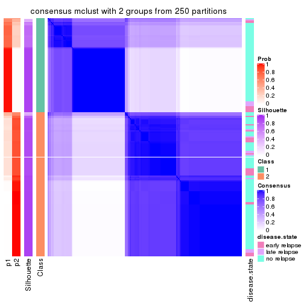</p>

</div>
<div id='tab-SD-mclust-consensus-heatmap-2'>
<pre><code class="r">consensus_heatmap(res, k = 3)
</code></pre>

<p>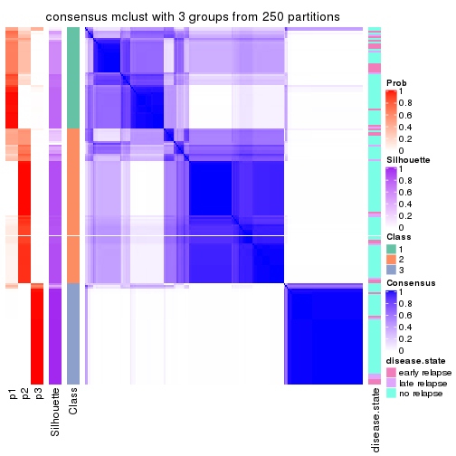</p>

</div>
<div id='tab-SD-mclust-consensus-heatmap-3'>
<pre><code class="r">consensus_heatmap(res, k = 4)
</code></pre>

<p>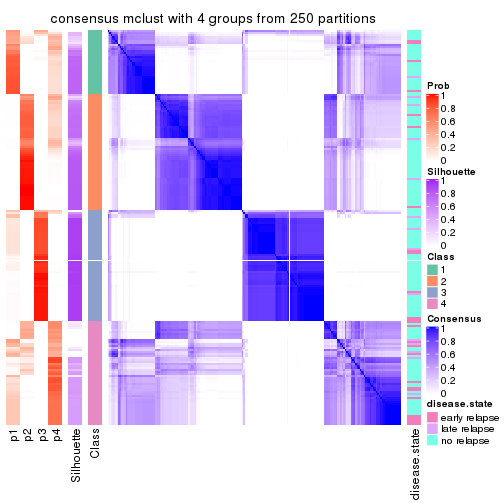</p>

</div>
<div id='tab-SD-mclust-consensus-heatmap-4'>
<pre><code class="r">consensus_heatmap(res, k = 5)
</code></pre>

<p>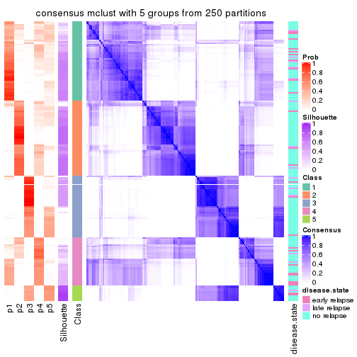</p>

</div>
<div id='tab-SD-mclust-consensus-heatmap-5'>
<pre><code class="r">consensus_heatmap(res, k = 6)
</code></pre>

<p>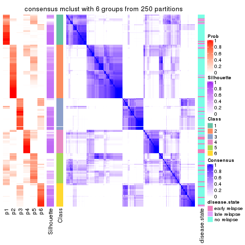</p>

</div>
</div>

Heatmaps for the membership of samples in all partitions to see how consistent they are:


<script>
$( function() {
	$( '#tabs-SD-mclust-membership-heatmap' ).tabs();
} );
</script>
<div id='tabs-SD-mclust-membership-heatmap'>
<ul>
<li><a href='#tab-SD-mclust-membership-heatmap-1'>k = 2</a></li>
<li><a href='#tab-SD-mclust-membership-heatmap-2'>k = 3</a></li>
<li><a href='#tab-SD-mclust-membership-heatmap-3'>k = 4</a></li>
<li><a href='#tab-SD-mclust-membership-heatmap-4'>k = 5</a></li>
<li><a href='#tab-SD-mclust-membership-heatmap-5'>k = 6</a></li>
</ul>
<div id='tab-SD-mclust-membership-heatmap-1'>
<pre><code class="r">membership_heatmap(res, k = 2)
</code></pre>

<p>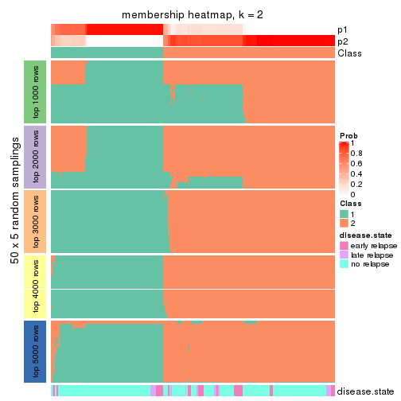</p>

</div>
<div id='tab-SD-mclust-membership-heatmap-2'>
<pre><code class="r">membership_heatmap(res, k = 3)
</code></pre>

<p>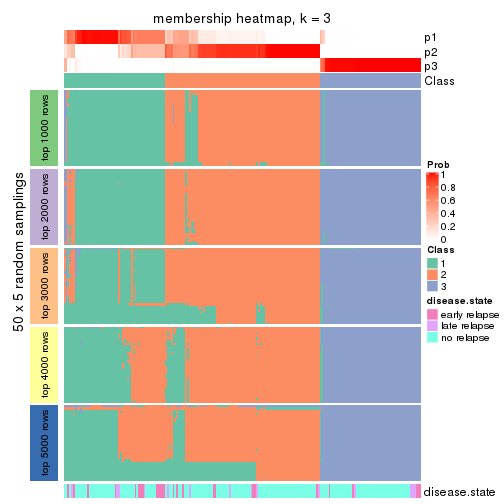</p>

</div>
<div id='tab-SD-mclust-membership-heatmap-3'>
<pre><code class="r">membership_heatmap(res, k = 4)
</code></pre>

<p>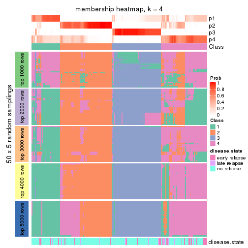</p>

</div>
<div id='tab-SD-mclust-membership-heatmap-4'>
<pre><code class="r">membership_heatmap(res, k = 5)
</code></pre>

<p>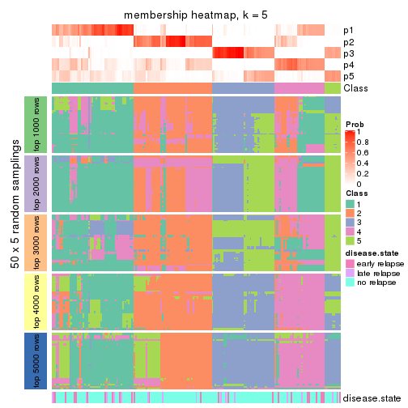</p>

</div>
<div id='tab-SD-mclust-membership-heatmap-5'>
<pre><code class="r">membership_heatmap(res, k = 6)
</code></pre>

<p>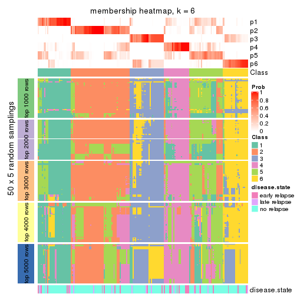</p>

</div>
</div>

As soon as we have had the classes for columns, we can look for signatures
which are significantly different between classes which can be candidate marks
for certain classes. Following are the heatmaps for signatures.


Signature heatmaps where rows are scaled:


<script>
$( function() {
	$( '#tabs-SD-mclust-get-signatures' ).tabs();
} );
</script>
<div id='tabs-SD-mclust-get-signatures'>
<ul>
<li><a href='#tab-SD-mclust-get-signatures-1'>k = 2</a></li>
<li><a href='#tab-SD-mclust-get-signatures-2'>k = 3</a></li>
<li><a href='#tab-SD-mclust-get-signatures-3'>k = 4</a></li>
<li><a href='#tab-SD-mclust-get-signatures-4'>k = 5</a></li>
<li><a href='#tab-SD-mclust-get-signatures-5'>k = 6</a></li>
</ul>
<div id='tab-SD-mclust-get-signatures-1'>
<pre><code class="r">get_signatures(res, k = 2)
</code></pre>

<p>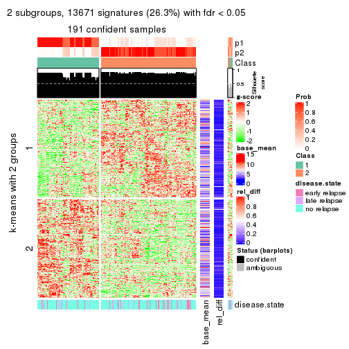</p>

</div>
<div id='tab-SD-mclust-get-signatures-2'>
<pre><code class="r">get_signatures(res, k = 3)
</code></pre>

<p>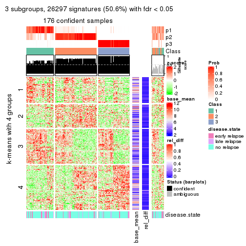</p>

</div>
<div id='tab-SD-mclust-get-signatures-3'>
<pre><code class="r">get_signatures(res, k = 4)
</code></pre>

<p>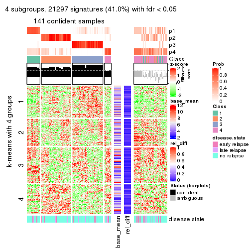</p>

</div>
<div id='tab-SD-mclust-get-signatures-4'>
<pre><code class="r">get_signatures(res, k = 5)
</code></pre>

<p>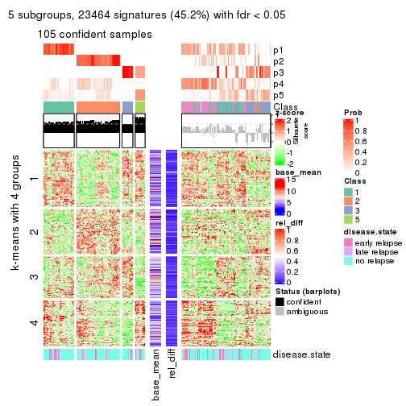</p>

</div>
<div id='tab-SD-mclust-get-signatures-5'>
<pre><code class="r">get_signatures(res, k = 6)
</code></pre>

<p>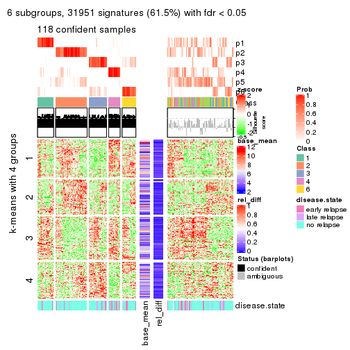</p>

</div>
</div>


Signature heatmaps where rows are not scaled:


<script>
$( function() {
	$( '#tabs-SD-mclust-get-signatures-no-scale' ).tabs();
} );
</script>
<div id='tabs-SD-mclust-get-signatures-no-scale'>
<ul>
<li><a href='#tab-SD-mclust-get-signatures-no-scale-1'>k = 2</a></li>
<li><a href='#tab-SD-mclust-get-signatures-no-scale-2'>k = 3</a></li>
<li><a href='#tab-SD-mclust-get-signatures-no-scale-3'>k = 4</a></li>
<li><a href='#tab-SD-mclust-get-signatures-no-scale-4'>k = 5</a></li>
<li><a href='#tab-SD-mclust-get-signatures-no-scale-5'>k = 6</a></li>
</ul>
<div id='tab-SD-mclust-get-signatures-no-scale-1'>
<pre><code class="r">get_signatures(res, k = 2, scale_rows = FALSE)
</code></pre>

<p>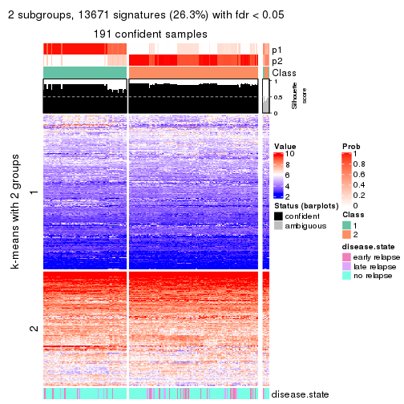</p>

</div>
<div id='tab-SD-mclust-get-signatures-no-scale-2'>
<pre><code class="r">get_signatures(res, k = 3, scale_rows = FALSE)
</code></pre>

<p>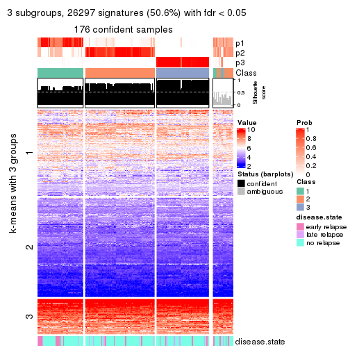</p>

</div>
<div id='tab-SD-mclust-get-signatures-no-scale-3'>
<pre><code class="r">get_signatures(res, k = 4, scale_rows = FALSE)
</code></pre>

<p>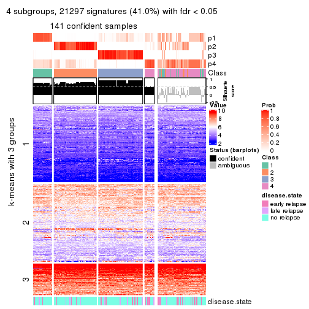</p>

</div>
<div id='tab-SD-mclust-get-signatures-no-scale-4'>
<pre><code class="r">get_signatures(res, k = 5, scale_rows = FALSE)
</code></pre>

<p>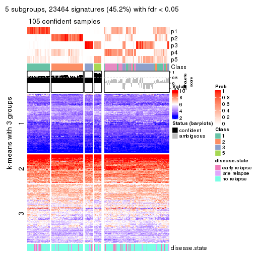</p>

</div>
<div id='tab-SD-mclust-get-signatures-no-scale-5'>
<pre><code class="r">get_signatures(res, k = 6, scale_rows = FALSE)
</code></pre>

<p>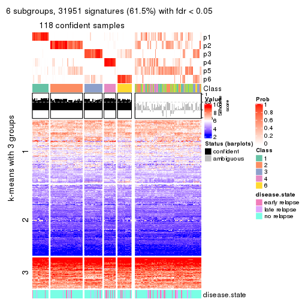</p>

</div>
</div>


Compare the overlap of signatures from different k:

```r
compare_signatures(res)
```

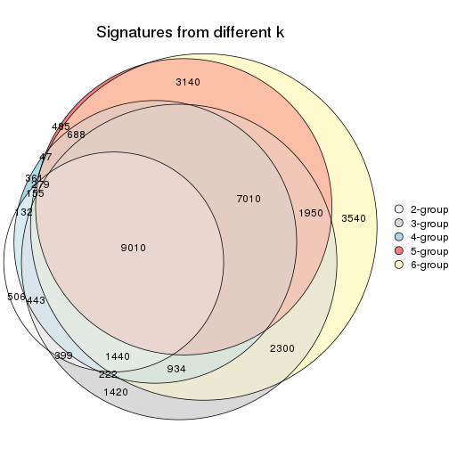

`get_signature()` returns a data frame invisibly. TO get the list of signatures, the function
call should be assigned to a variable explicitly. In following code, if `plot` argument is set
to `FALSE`, no heatmap is plotted while only the differential analysis is performed.

```r
# code only for demonstration
tb = get_signature(res, k = ..., plot = FALSE)
```

An example of the output of `tb` is:

```
#>   which_row         fdr    mean_1    mean_2 scaled_mean_1 scaled_mean_2 km
#> 1        38 0.042760348  8.373488  9.131774    -0.5533452     0.5164555  1
#> 2        40 0.018707592  7.106213  8.469186    -0.6173731     0.5762149  1
#> 3        55 0.019134737 10.221463 11.207825    -0.6159697     0.5749050  1
#> 4        59 0.006059896  5.921854  7.869574    -0.6899429     0.6439467  1
#> 5        60 0.018055526  8.928898 10.211722    -0.6204761     0.5791110  1
#> 6        98 0.009384629 15.714769 14.887706     0.6635654    -0.6193277  2
...
```

The columns in `tb` are:

1. `which_row`: row indices corresponding to the input matrix.
2. `fdr`: FDR for the differential test. 
3. `mean_x`: The mean value in group x.
4. `scaled_mean_x`: The mean value in group x after rows are scaled.
5. `km`: Row groups if k-means clustering is applied to rows.


UMAP plot which shows how samples are separated.


<script>
$( function() {
	$( '#tabs-SD-mclust-dimension-reduction' ).tabs();
} );
</script>
<div id='tabs-SD-mclust-dimension-reduction'>
<ul>
<li><a href='#tab-SD-mclust-dimension-reduction-1'>k = 2</a></li>
<li><a href='#tab-SD-mclust-dimension-reduction-2'>k = 3</a></li>
<li><a href='#tab-SD-mclust-dimension-reduction-3'>k = 4</a></li>
<li><a href='#tab-SD-mclust-dimension-reduction-4'>k = 5</a></li>
<li><a href='#tab-SD-mclust-dimension-reduction-5'>k = 6</a></li>
</ul>
<div id='tab-SD-mclust-dimension-reduction-1'>
<pre><code class="r">dimension_reduction(res, k = 2, method = &quot;UMAP&quot;)
</code></pre>

<p>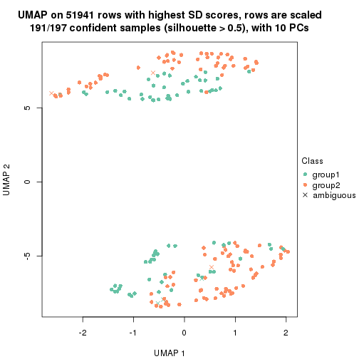</p>

</div>
<div id='tab-SD-mclust-dimension-reduction-2'>
<pre><code class="r">dimension_reduction(res, k = 3, method = &quot;UMAP&quot;)
</code></pre>

<p>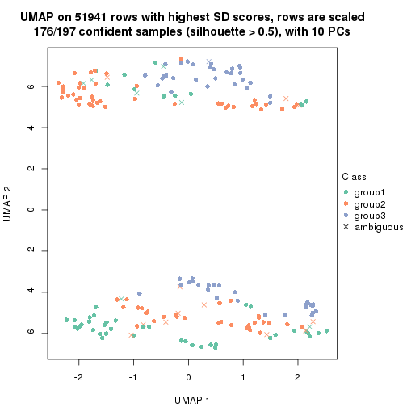</p>

</div>
<div id='tab-SD-mclust-dimension-reduction-3'>
<pre><code class="r">dimension_reduction(res, k = 4, method = &quot;UMAP&quot;)
</code></pre>

<p>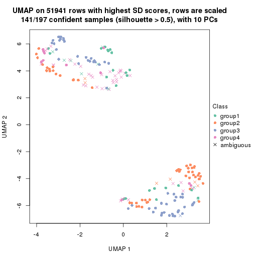</p>

</div>
<div id='tab-SD-mclust-dimension-reduction-4'>
<pre><code class="r">dimension_reduction(res, k = 5, method = &quot;UMAP&quot;)
</code></pre>

<p>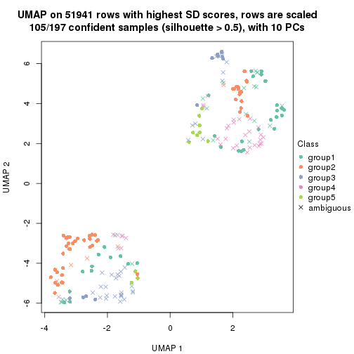</p>

</div>
<div id='tab-SD-mclust-dimension-reduction-5'>
<pre><code class="r">dimension_reduction(res, k = 6, method = &quot;UMAP&quot;)
</code></pre>

<p>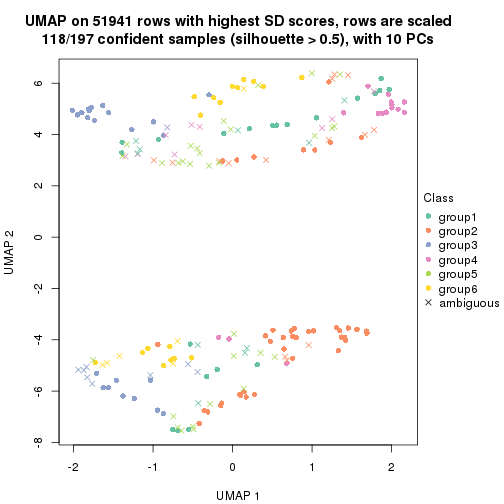</p>

</div>
</div>


Following heatmap shows how subgroups are split when increasing `k`:

```r
collect_classes(res)
```

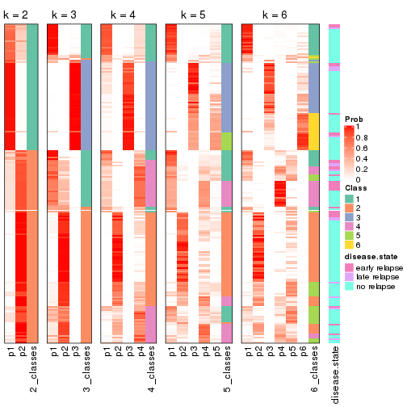


Test correlation between subgroups and known annotations. If the known
annotation is numeric, one-way ANOVA test is applied, and if the known
annotation is discrete, chi-squared contingency table test is applied.

```r
test_to_known_factors(res)
```

```
#>             n disease.state(p) k
#> SD:mclust 191           0.1737 2
#> SD:mclust 176           0.1939 3
#> SD:mclust 141           0.0789 4
#> SD:mclust 105           0.6030 5
#> SD:mclust 118           0.0458 6
```


If matrix rows can be associated to genes, consider to use `functional_enrichment(res,
...)` to perform function enrichment for the signature genes. See [this vignette](http://bioconductor.org/packages/devel/bioc/vignettes/cola/inst/doc/functional_enrichment.html) for more detailed explanations.


 

---------------------------------------------------


### SD:NMF


The object with results only for a single top-value method and a single partition method 
can be extracted as:

```r
res = res_list["SD", "NMF"]
# you can also extract it by
# res = res_list["SD:NMF"]
```

A summary of `res` and all the functions that can be applied to it:

```r
res
```

```
#> A 'ConsensusPartition' object with k = 2, 3, 4, 5, 6.
#>   On a matrix with 51941 rows and 197 columns.
#>   Top rows (1000, 2000, 3000, 4000, 5000) are extracted by 'SD' method.
#>   Subgroups are detected by 'NMF' method.
#>   Performed in total 1250 partitions by row resampling.
#>   Best k for subgroups seems to be 2.
#> 
#> Following methods can be applied to this 'ConsensusPartition' object:
#>  [1] "cola_report"             "collect_classes"         "collect_plots"          
#>  [4] "collect_stats"           "colnames"                "compare_signatures"     
#>  [7] "consensus_heatmap"       "dimension_reduction"     "functional_enrichment"  
#> [10] "get_anno_col"            "get_anno"                "get_classes"            
#> [13] "get_consensus"           "get_matrix"              "get_membership"         
#> [16] "get_param"               "get_signatures"          "get_stats"              
#> [19] "is_best_k"               "is_stable_k"             "membership_heatmap"     
#> [22] "ncol"                    "nrow"                    "plot_ecdf"              
#> [25] "rownames"                "select_partition_number" "show"                   
#> [28] "suggest_best_k"          "test_to_known_factors"
```

`collect_plots()` function collects all the plots made from `res` for all `k` (number of partitions)
into one single page to provide an easy and fast comparison between different `k`.

```r
collect_plots(res)
```

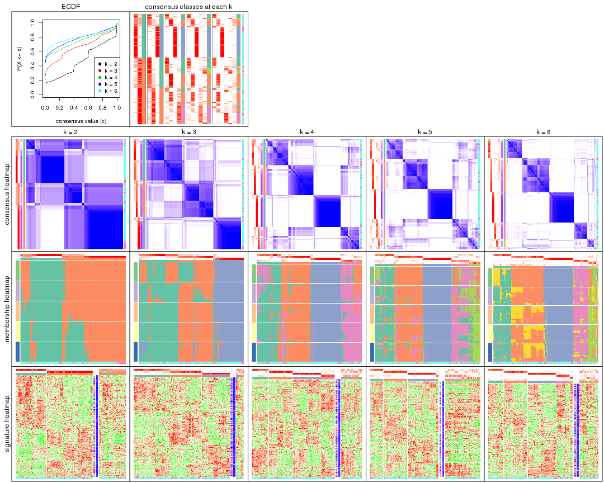

The plots are:

- The first row: a plot of the ECDF (empirical cumulative distribution
  function) curves of the consensus matrix for each `k` and the heatmap of
  predicted classes for each `k`.
- The second row: heatmaps of the consensus matrix for each `k`.
- The third row: heatmaps of the membership matrix for each `k`.
- The fouth row: heatmaps of the signatures for each `k`.

All the plots in panels can be made by individual functions and they are
plotted later in this section.

`select_partition_number()` produces several plots showing different
statistics for choosing "optimized" `k`. There are following statistics:

- ECDF curves of the consensus matrix for each `k`;
- 1-PAC. [The PAC
  score](https://en.wikipedia.org/wiki/Consensus_clustering#Over-interpretation_potential_of_consensus_clustering)
  measures the proportion of the ambiguous subgrouping.
- Mean silhouette score.
- Concordance. The mean probability of fiting the consensus class ids in all
  partitions.
- Area increased. Denote $A_k$ as the area under the ECDF curve for current
  `k`, the area increased is defined as $A_k - A_{k-1}$.
- Rand index. The percent of pairs of samples that are both in a same cluster
  or both are not in a same cluster in the partition of k and k-1.
- Jaccard index. The ratio of pairs of samples are both in a same cluster in
  the partition of k and k-1 and the pairs of samples are both in a same
  cluster in the partition k or k-1.

The detailed explanations of these statistics can be found in [the _cola_
vignette](http://bioconductor.org/packages/devel/bioc/vignettes/cola/inst/doc/cola.html#toc_13).

Generally speaking, lower PAC score, higher mean silhouette score or higher
concordance corresponds to better partition. Rand index and Jaccard index
measure how similar the current partition is compared to partition with `k-1`.
If they are too similar, we won't accept `k` is better than `k-1`.

```r
select_partition_number(res)
```

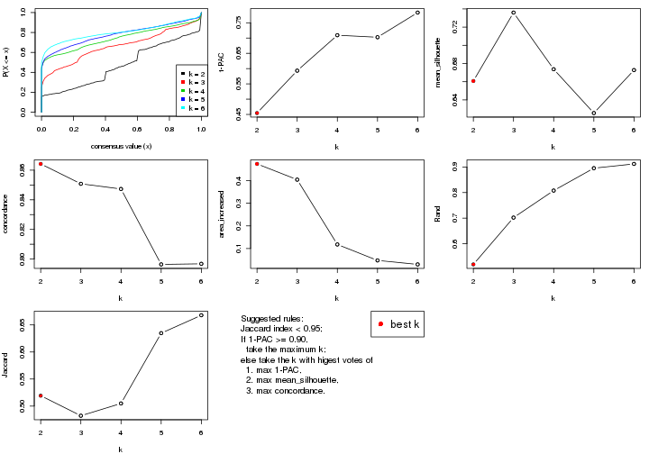

The numeric values for all these statistics can be obtained by `get_stats()`.

```r
get_stats(res)
```

```
#>   k 1-PAC mean_silhouette concordance area_increased  Rand Jaccard
#> 2 2 0.454           0.661       0.864         0.4740 0.519   0.519
#> 3 3 0.593           0.736       0.851         0.4043 0.702   0.482
#> 4 4 0.709           0.674       0.847         0.1179 0.808   0.505
#> 5 5 0.703           0.626       0.796         0.0474 0.895   0.635
#> 6 6 0.783           0.673       0.797         0.0298 0.912   0.668
```

`suggest_best_k()` suggests the best $k$ based on these statistics. The rules are as follows:

- All $k$ with Jaccard index larger than 0.95 are removed because increasing
  $k$ does not provide enough extra information. If all $k$ are removed, it is
  marked as no subgroup is detected.
- For all $k$ with 1-PAC score larger than 0.9, the maximal $k$ is taken as
  the best $k$, and other $k$ are marked as optional $k$.
- If it does not fit the second rule. The $k$ with the maximal vote of the
  highest 1-PAC score, highest mean silhouette, and highest concordance is
  taken as the best $k$.

```r
suggest_best_k(res)
```

```
#> [1] 2
```


Following shows the table of the partitions (You need to click the **show/hide
code output** link to see it). The membership matrix (columns with name `p*`)
is inferred by
[`clue::cl_consensus()`](https://www.rdocumentation.org/link/cl_consensus?package=clue)
function with the `SE` method. Basically the value in the membership matrix
represents the probability to belong to a certain group. The finall class
label for an item is determined with the group with highest probability it
belongs to.

In `get_classes()` function, the entropy is calculated from the membership
matrix and the silhouette score is calculated from the consensus matrix.


<script>
$( function() {
	$( '#tabs-SD-NMF-get-classes' ).tabs();
} );
</script>
<div id='tabs-SD-NMF-get-classes'>
<ul>
<li><a href='#tab-SD-NMF-get-classes-1'>k = 2</a></li>
<li><a href='#tab-SD-NMF-get-classes-2'>k = 3</a></li>
<li><a href='#tab-SD-NMF-get-classes-3'>k = 4</a></li>
<li><a href='#tab-SD-NMF-get-classes-4'>k = 5</a></li>
<li><a href='#tab-SD-NMF-get-classes-5'>k = 6</a></li>
</ul>

<div id='tab-SD-NMF-get-classes-1'>
<p><a id='tab-SD-NMF-get-classes-1-a' style='color:#0366d6' href='#'>show/hide code output</a></p>
<pre><code class="r">cbind(get_classes(res, k = 2), get_membership(res, k = 2))
</code></pre>

<pre><code>#&gt;           class entropy silhouette    p1    p2
#&gt; GSM342319     2  0.8955     0.5601 0.312 0.688
#&gt; GSM342323     2  0.0000     0.8148 0.000 1.000
#&gt; GSM342325     2  0.9608     0.4539 0.384 0.616
#&gt; GSM342326     2  0.0000     0.8148 0.000 1.000
#&gt; GSM342327     2  0.0000     0.8148 0.000 1.000
#&gt; GSM342329     2  0.0000     0.8148 0.000 1.000
#&gt; GSM342331     2  0.0000     0.8148 0.000 1.000
#&gt; GSM342334     2  0.0000     0.8148 0.000 1.000
#&gt; GSM342335     2  0.0000     0.8148 0.000 1.000
#&gt; GSM342354     1  0.0000     0.8254 1.000 0.000
#&gt; GSM342371     2  0.0000     0.8148 0.000 1.000
#&gt; GSM342380     2  0.9732     0.4180 0.404 0.596
#&gt; GSM342382     1  0.9732     0.2150 0.596 0.404
#&gt; GSM342399     2  0.9710     0.4271 0.400 0.600
#&gt; GSM342402     2  0.9710     0.4271 0.400 0.600
#&gt; GSM342404     2  0.0000     0.8148 0.000 1.000
#&gt; GSM342408     1  0.9710     0.3253 0.600 0.400
#&gt; GSM342409     1  0.9129     0.4756 0.672 0.328
#&gt; GSM342426     2  0.0000     0.8148 0.000 1.000
#&gt; GSM342441     1  0.0000     0.8254 1.000 0.000
#&gt; GSM342444     1  0.0000     0.8254 1.000 0.000
#&gt; GSM342451     1  0.0000     0.8254 1.000 0.000
#&gt; GSM342462     2  0.0000     0.8148 0.000 1.000
#&gt; GSM342467     2  0.0000     0.8148 0.000 1.000
#&gt; GSM342484     1  0.9963    -0.0017 0.536 0.464
#&gt; GSM342491     2  0.1184     0.8074 0.016 0.984
#&gt; GSM342322     2  0.5408     0.7443 0.124 0.876
#&gt; GSM342338     1  0.0000     0.8254 1.000 0.000
#&gt; GSM342347     1  0.7674     0.6164 0.776 0.224
#&gt; GSM342356     1  0.0000     0.8254 1.000 0.000
#&gt; GSM342357     2  0.9710     0.4271 0.400 0.600
#&gt; GSM342366     2  0.0000     0.8148 0.000 1.000
#&gt; GSM342385     2  0.9977     0.2280 0.472 0.528
#&gt; GSM342421     2  0.0000     0.8148 0.000 1.000
#&gt; GSM342437     2  0.0000     0.8148 0.000 1.000
#&gt; GSM342454     1  0.0000     0.8254 1.000 0.000
#&gt; GSM342471     2  0.0000     0.8148 0.000 1.000
#&gt; GSM342477     2  0.0000     0.8148 0.000 1.000
#&gt; GSM342495     2  0.0000     0.8148 0.000 1.000
#&gt; GSM342496     1  0.8861     0.4571 0.696 0.304
#&gt; GSM342320     2  0.0000     0.8148 0.000 1.000
#&gt; GSM342321     2  0.0000     0.8148 0.000 1.000
#&gt; GSM342324     2  0.0000     0.8148 0.000 1.000
#&gt; GSM342328     2  0.0000     0.8148 0.000 1.000
#&gt; GSM342330     2  0.0000     0.8148 0.000 1.000
#&gt; GSM342332     2  0.0000     0.8148 0.000 1.000
#&gt; GSM342333     2  0.0000     0.8148 0.000 1.000
#&gt; GSM342336     2  0.0000     0.8148 0.000 1.000
#&gt; GSM342337     1  0.0000     0.8254 1.000 0.000
#&gt; GSM342339     1  0.0000     0.8254 1.000 0.000
#&gt; GSM342340     1  0.0000     0.8254 1.000 0.000
#&gt; GSM342341     1  0.0000     0.8254 1.000 0.000
#&gt; GSM342342     1  0.0000     0.8254 1.000 0.000
#&gt; GSM342343     1  0.0000     0.8254 1.000 0.000
#&gt; GSM342344     1  0.0000     0.8254 1.000 0.000
#&gt; GSM342345     1  0.0000     0.8254 1.000 0.000
#&gt; GSM342346     2  0.0000     0.8148 0.000 1.000
#&gt; GSM342348     2  0.9358     0.5027 0.352 0.648
#&gt; GSM342349     1  0.7674     0.6167 0.776 0.224
#&gt; GSM342350     1  0.7139     0.6502 0.804 0.196
#&gt; GSM342351     1  0.9710     0.3253 0.600 0.400
#&gt; GSM342352     1  0.2603     0.7960 0.956 0.044
#&gt; GSM342353     1  0.0000     0.8254 1.000 0.000
#&gt; GSM342355     1  0.0000     0.8254 1.000 0.000
#&gt; GSM342358     2  0.0000     0.8148 0.000 1.000
#&gt; GSM342359     2  0.0000     0.8148 0.000 1.000
#&gt; GSM342360     2  0.0000     0.8148 0.000 1.000
#&gt; GSM342361     2  0.1414     0.7994 0.020 0.980
#&gt; GSM342362     2  0.0000     0.8148 0.000 1.000
#&gt; GSM342363     2  0.4298     0.7685 0.088 0.912
#&gt; GSM342364     2  0.5629     0.7388 0.132 0.868
#&gt; GSM342365     2  0.0000     0.8148 0.000 1.000
#&gt; GSM342367     2  0.9710     0.4271 0.400 0.600
#&gt; GSM342368     2  0.3584     0.7801 0.068 0.932
#&gt; GSM342369     2  0.0000     0.8148 0.000 1.000
#&gt; GSM342370     2  0.0000     0.8148 0.000 1.000
#&gt; GSM342372     2  0.0000     0.8148 0.000 1.000
#&gt; GSM342373     2  0.0000     0.8148 0.000 1.000
#&gt; GSM342374     2  0.0000     0.8148 0.000 1.000
#&gt; GSM342375     2  0.0000     0.8148 0.000 1.000
#&gt; GSM342376     1  0.9993    -0.0835 0.516 0.484
#&gt; GSM342377     2  0.9710     0.4271 0.400 0.600
#&gt; GSM342378     2  0.9866     0.3490 0.432 0.568
#&gt; GSM342379     2  0.0000     0.8148 0.000 1.000
#&gt; GSM342381     2  0.9710     0.4271 0.400 0.600
#&gt; GSM342383     2  0.9710     0.4271 0.400 0.600
#&gt; GSM342384     2  0.9710     0.4271 0.400 0.600
#&gt; GSM342386     2  0.9710     0.4271 0.400 0.600
#&gt; GSM342387     2  0.0000     0.8148 0.000 1.000
#&gt; GSM342388     1  0.0000     0.8254 1.000 0.000
#&gt; GSM342389     2  0.9710     0.4271 0.400 0.600
#&gt; GSM342390     1  0.0000     0.8254 1.000 0.000
#&gt; GSM342391     2  0.9815     0.3798 0.420 0.580
#&gt; GSM342392     1  0.0000     0.8254 1.000 0.000
#&gt; GSM342393     2  0.0000     0.8148 0.000 1.000
#&gt; GSM342394     2  0.9710     0.4271 0.400 0.600
#&gt; GSM342395     2  0.0000     0.8148 0.000 1.000
#&gt; GSM342396     1  0.0000     0.8254 1.000 0.000
#&gt; GSM342397     1  0.6343     0.6921 0.840 0.160
#&gt; GSM342398     2  0.9881     0.3383 0.436 0.564
#&gt; GSM342400     2  0.9710     0.4271 0.400 0.600
#&gt; GSM342401     1  0.0000     0.8254 1.000 0.000
#&gt; GSM342403     1  0.9954     0.0149 0.540 0.460
#&gt; GSM342405     2  0.9608     0.2011 0.384 0.616
#&gt; GSM342406     1  0.8144     0.5555 0.748 0.252
#&gt; GSM342407     1  0.0000     0.8254 1.000 0.000
#&gt; GSM342410     2  0.9833     0.3698 0.424 0.576
#&gt; GSM342411     2  0.0000     0.8148 0.000 1.000
#&gt; GSM342412     2  0.0000     0.8148 0.000 1.000
#&gt; GSM342413     2  0.9661     0.1811 0.392 0.608
#&gt; GSM342414     1  0.6343     0.6916 0.840 0.160
#&gt; GSM342415     2  0.0000     0.8148 0.000 1.000
#&gt; GSM342416     1  0.8081     0.6015 0.752 0.248
#&gt; GSM342417     2  0.0000     0.8148 0.000 1.000
#&gt; GSM342418     2  0.0000     0.8148 0.000 1.000
#&gt; GSM342419     2  0.9710     0.4271 0.400 0.600
#&gt; GSM342420     2  0.0000     0.8148 0.000 1.000
#&gt; GSM342422     2  0.9710     0.4271 0.400 0.600
#&gt; GSM342423     2  0.0000     0.8148 0.000 1.000
#&gt; GSM342424     2  0.0000     0.8148 0.000 1.000
#&gt; GSM342425     2  0.0000     0.8148 0.000 1.000
#&gt; GSM342427     2  0.0000     0.8148 0.000 1.000
#&gt; GSM342428     2  0.0000     0.8148 0.000 1.000
#&gt; GSM342429     2  0.8499     0.6050 0.276 0.724
#&gt; GSM342430     1  0.0000     0.8254 1.000 0.000
#&gt; GSM342431     1  0.0000     0.8254 1.000 0.000
#&gt; GSM342432     1  0.0000     0.8254 1.000 0.000
#&gt; GSM342433     1  0.0376     0.8230 0.996 0.004
#&gt; GSM342434     1  0.9710     0.3253 0.600 0.400
#&gt; GSM342435     1  0.0000     0.8254 1.000 0.000
#&gt; GSM342436     1  0.0000     0.8254 1.000 0.000
#&gt; GSM342438     1  0.0000     0.8254 1.000 0.000
#&gt; GSM342439     1  0.0000     0.8254 1.000 0.000
#&gt; GSM342440     1  0.0000     0.8254 1.000 0.000
#&gt; GSM342442     1  0.0000     0.8254 1.000 0.000
#&gt; GSM342443     2  0.0000     0.8148 0.000 1.000
#&gt; GSM342445     1  0.0000     0.8254 1.000 0.000
#&gt; GSM342446     1  0.0000     0.8254 1.000 0.000
#&gt; GSM342447     1  0.0000     0.8254 1.000 0.000
#&gt; GSM342448     1  0.7602     0.6215 0.780 0.220
#&gt; GSM342449     1  0.0000     0.8254 1.000 0.000
#&gt; GSM342450     1  0.2043     0.8047 0.968 0.032
#&gt; GSM342452     1  0.0000     0.8254 1.000 0.000
#&gt; GSM342453     1  0.0000     0.8254 1.000 0.000
#&gt; GSM342455     1  0.0000     0.8254 1.000 0.000
#&gt; GSM342456     2  0.1414     0.7994 0.020 0.980
#&gt; GSM342457     2  0.5408     0.7443 0.124 0.876
#&gt; GSM342458     2  0.0000     0.8148 0.000 1.000
#&gt; GSM342459     2  0.0000     0.8148 0.000 1.000
#&gt; GSM342460     2  0.0000     0.8148 0.000 1.000
#&gt; GSM342461     2  0.8267     0.6224 0.260 0.740
#&gt; GSM342463     1  0.9732     0.2150 0.596 0.404
#&gt; GSM342464     1  1.0000    -0.1304 0.504 0.496
#&gt; GSM342465     1  0.9710     0.2271 0.600 0.400
#&gt; GSM342466     1  0.0000     0.8254 1.000 0.000
#&gt; GSM342468     2  0.0000     0.8148 0.000 1.000
#&gt; GSM342469     2  0.9710     0.4271 0.400 0.600
#&gt; GSM342470     2  0.9710     0.1611 0.400 0.600
#&gt; GSM342472     2  0.9710     0.1608 0.400 0.600
#&gt; GSM342473     2  0.3431     0.7823 0.064 0.936
#&gt; GSM342474     2  0.6048     0.7260 0.148 0.852
#&gt; GSM342475     1  0.0000     0.8254 1.000 0.000
#&gt; GSM342476     2  0.0000     0.8148 0.000 1.000
#&gt; GSM342478     2  0.8813     0.5752 0.300 0.700
#&gt; GSM342479     2  0.9209     0.5267 0.336 0.664
#&gt; GSM342480     2  0.0000     0.8148 0.000 1.000
#&gt; GSM342481     2  0.9710     0.4271 0.400 0.600
#&gt; GSM342482     2  0.0000     0.8148 0.000 1.000
#&gt; GSM342483     2  0.8327     0.6179 0.264 0.736
#&gt; GSM342485     1  0.9710     0.2271 0.600 0.400
#&gt; GSM342486     1  0.9922     0.0614 0.552 0.448
#&gt; GSM342487     1  0.0000     0.8254 1.000 0.000
#&gt; GSM342488     2  0.0000     0.8148 0.000 1.000
#&gt; GSM342489     2  0.0000     0.8148 0.000 1.000
#&gt; GSM342490     2  0.0000     0.8148 0.000 1.000
#&gt; GSM342492     1  0.0000     0.8254 1.000 0.000
#&gt; GSM342493     1  0.9710     0.2271 0.600 0.400
#&gt; GSM342494     2  0.0000     0.8148 0.000 1.000
#&gt; GSM342497     2  0.0000     0.8148 0.000 1.000
#&gt; GSM342498     2  0.9944     0.2796 0.456 0.544
#&gt; GSM342499     2  0.9993     0.1866 0.484 0.516
#&gt; GSM342500     2  0.0000     0.8148 0.000 1.000
#&gt; GSM342501     1  0.9710     0.2271 0.600 0.400
#&gt; GSM342502     2  0.9710     0.4271 0.400 0.600
#&gt; GSM342503     2  0.9710     0.4271 0.400 0.600
#&gt; GSM342504     2  0.6438     0.7129 0.164 0.836
#&gt; GSM342505     1  0.0000     0.8254 1.000 0.000
#&gt; GSM342506     1  0.9170     0.3975 0.668 0.332
#&gt; GSM342507     2  0.8499     0.6063 0.276 0.724
#&gt; GSM342508     1  0.8555     0.5030 0.720 0.280
#&gt; GSM342509     1  0.5519     0.7180 0.872 0.128
#&gt; GSM342510     2  0.6887     0.6054 0.184 0.816
#&gt; GSM342511     1  0.5178     0.7371 0.884 0.116
#&gt; GSM342512     1  0.9993    -0.0837 0.516 0.484
#&gt; GSM342513     1  0.9710     0.2271 0.600 0.400
#&gt; GSM342514     1  0.0000     0.8254 1.000 0.000
#&gt; GSM342515     2  0.9881     0.3379 0.436 0.564
</code></pre>

<script>
$('#tab-SD-NMF-get-classes-1-a').parent().next().next().hide();
$('#tab-SD-NMF-get-classes-1-a').click(function(){
  $('#tab-SD-NMF-get-classes-1-a').parent().next().next().toggle();
  return(false);
});
</script>
</div>

<div id='tab-SD-NMF-get-classes-2'>
<p><a id='tab-SD-NMF-get-classes-2-a' style='color:#0366d6' href='#'>show/hide code output</a></p>
<pre><code class="r">cbind(get_classes(res, k = 3), get_membership(res, k = 3))
</code></pre>

<pre><code>#&gt;           class entropy silhouette    p1    p2    p3
#&gt; GSM342319     1  0.0237     0.7544 0.996 0.004 0.000
#&gt; GSM342323     2  0.5706     0.6988 0.320 0.680 0.000
#&gt; GSM342325     1  0.0000     0.7567 1.000 0.000 0.000
#&gt; GSM342326     2  0.4931     0.7613 0.232 0.768 0.000
#&gt; GSM342327     2  0.4974     0.7592 0.236 0.764 0.000
#&gt; GSM342329     2  0.5560     0.7185 0.300 0.700 0.000
#&gt; GSM342331     2  0.4887     0.7618 0.228 0.772 0.000
#&gt; GSM342334     2  0.1860     0.7790 0.052 0.948 0.000
#&gt; GSM342335     2  0.5760     0.2981 0.328 0.672 0.000
#&gt; GSM342354     3  0.0000     0.9197 0.000 0.000 1.000
#&gt; GSM342371     1  0.5058     0.7733 0.756 0.244 0.000
#&gt; GSM342380     1  0.0000     0.7567 1.000 0.000 0.000
#&gt; GSM342382     1  0.5070     0.7809 0.772 0.224 0.004
#&gt; GSM342399     1  0.0000     0.7567 1.000 0.000 0.000
#&gt; GSM342402     1  0.1411     0.7331 0.964 0.036 0.000
#&gt; GSM342404     2  0.0237     0.7762 0.004 0.996 0.000
#&gt; GSM342408     3  0.6126     0.3087 0.000 0.400 0.600
#&gt; GSM342409     3  0.9810    -0.0018 0.240 0.372 0.388
#&gt; GSM342426     2  0.4842     0.7631 0.224 0.776 0.000
#&gt; GSM342441     3  0.0000     0.9197 0.000 0.000 1.000
#&gt; GSM342444     3  0.0000     0.9197 0.000 0.000 1.000
#&gt; GSM342451     3  0.0000     0.9197 0.000 0.000 1.000
#&gt; GSM342462     2  0.3340     0.6874 0.120 0.880 0.000
#&gt; GSM342467     2  0.0000     0.7774 0.000 1.000 0.000
#&gt; GSM342484     1  0.7297     0.5208 0.704 0.108 0.188
#&gt; GSM342491     2  0.7421     0.7110 0.240 0.676 0.084
#&gt; GSM342322     1  0.1163     0.7393 0.972 0.028 0.000
#&gt; GSM342338     3  0.0000     0.9197 0.000 0.000 1.000
#&gt; GSM342347     3  0.4399     0.7299 0.000 0.188 0.812
#&gt; GSM342356     3  0.6126     0.3024 0.400 0.000 0.600
#&gt; GSM342357     1  0.0892     0.7451 0.980 0.020 0.000
#&gt; GSM342366     1  0.5058     0.7733 0.756 0.244 0.000
#&gt; GSM342385     1  0.0000     0.7567 1.000 0.000 0.000
#&gt; GSM342421     2  0.5016     0.5123 0.240 0.760 0.000
#&gt; GSM342437     2  0.4974     0.7593 0.236 0.764 0.000
#&gt; GSM342454     3  0.0000     0.9197 0.000 0.000 1.000
#&gt; GSM342471     1  0.3879     0.7833 0.848 0.152 0.000
#&gt; GSM342477     2  0.0424     0.7788 0.008 0.992 0.000
#&gt; GSM342495     2  0.1411     0.7613 0.036 0.964 0.000
#&gt; GSM342496     3  0.9770    -0.2966 0.368 0.232 0.400
#&gt; GSM342320     2  0.4931     0.7601 0.232 0.768 0.000
#&gt; GSM342321     1  0.4842     0.4849 0.776 0.224 0.000
#&gt; GSM342324     2  0.5178     0.7506 0.256 0.744 0.000
#&gt; GSM342328     1  0.6299    -0.3313 0.524 0.476 0.000
#&gt; GSM342330     2  0.4931     0.7601 0.232 0.768 0.000
#&gt; GSM342332     1  0.3879     0.6126 0.848 0.152 0.000
#&gt; GSM342333     2  0.3686     0.6823 0.140 0.860 0.000
#&gt; GSM342336     2  0.5138     0.7526 0.252 0.748 0.000
#&gt; GSM342337     1  0.6302     0.0972 0.520 0.000 0.480
#&gt; GSM342339     3  0.0000     0.9197 0.000 0.000 1.000
#&gt; GSM342340     3  0.2537     0.8535 0.080 0.000 0.920
#&gt; GSM342341     3  0.0000     0.9197 0.000 0.000 1.000
#&gt; GSM342342     3  0.0000     0.9197 0.000 0.000 1.000
#&gt; GSM342343     3  0.3482     0.8003 0.128 0.000 0.872
#&gt; GSM342344     3  0.0000     0.9197 0.000 0.000 1.000
#&gt; GSM342345     3  0.0000     0.9197 0.000 0.000 1.000
#&gt; GSM342346     2  0.4654     0.7676 0.208 0.792 0.000
#&gt; GSM342348     1  0.1031     0.7423 0.976 0.024 0.000
#&gt; GSM342349     3  0.2537     0.8572 0.000 0.080 0.920
#&gt; GSM342350     3  0.1860     0.8842 0.000 0.052 0.948
#&gt; GSM342351     3  0.5216     0.6189 0.000 0.260 0.740
#&gt; GSM342352     3  0.0747     0.9118 0.000 0.016 0.984
#&gt; GSM342353     3  0.0000     0.9197 0.000 0.000 1.000
#&gt; GSM342355     3  0.6168     0.2816 0.412 0.000 0.588
#&gt; GSM342358     2  0.5016     0.7573 0.240 0.760 0.000
#&gt; GSM342359     2  0.4931     0.7601 0.232 0.768 0.000
#&gt; GSM342360     2  0.5098     0.7543 0.248 0.752 0.000
#&gt; GSM342361     2  0.4842     0.7631 0.224 0.776 0.000
#&gt; GSM342362     1  0.4842     0.4841 0.776 0.224 0.000
#&gt; GSM342363     1  0.0892     0.7451 0.980 0.020 0.000
#&gt; GSM342364     1  0.5016     0.7751 0.760 0.240 0.000
#&gt; GSM342365     2  0.0000     0.7774 0.000 1.000 0.000
#&gt; GSM342367     1  0.4842     0.7811 0.776 0.224 0.000
#&gt; GSM342368     1  0.4974     0.7764 0.764 0.236 0.000
#&gt; GSM342369     2  0.1753     0.7547 0.048 0.952 0.000
#&gt; GSM342370     2  0.0000     0.7774 0.000 1.000 0.000
#&gt; GSM342372     2  0.2448     0.7417 0.076 0.924 0.000
#&gt; GSM342373     1  0.5016     0.7751 0.760 0.240 0.000
#&gt; GSM342374     2  0.0000     0.7774 0.000 1.000 0.000
#&gt; GSM342375     2  0.1643     0.7572 0.044 0.956 0.000
#&gt; GSM342376     1  0.4842     0.7811 0.776 0.224 0.000
#&gt; GSM342377     1  0.4842     0.7811 0.776 0.224 0.000
#&gt; GSM342378     1  0.0000     0.7567 1.000 0.000 0.000
#&gt; GSM342379     1  0.0000     0.7567 1.000 0.000 0.000
#&gt; GSM342381     1  0.4842     0.7811 0.776 0.224 0.000
#&gt; GSM342383     1  0.0000     0.7567 1.000 0.000 0.000
#&gt; GSM342384     1  0.4842     0.7811 0.776 0.224 0.000
#&gt; GSM342386     1  0.4974     0.7764 0.764 0.236 0.000
#&gt; GSM342387     2  0.5591     0.7187 0.304 0.696 0.000
#&gt; GSM342388     3  0.4931     0.6519 0.232 0.000 0.768
#&gt; GSM342389     1  0.4931     0.7778 0.768 0.232 0.000
#&gt; GSM342390     1  0.4235     0.6316 0.824 0.000 0.176
#&gt; GSM342391     1  0.0000     0.7567 1.000 0.000 0.000
#&gt; GSM342392     3  0.0000     0.9197 0.000 0.000 1.000
#&gt; GSM342393     2  0.0000     0.7774 0.000 1.000 0.000
#&gt; GSM342394     1  0.0000     0.7567 1.000 0.000 0.000
#&gt; GSM342395     1  0.5138     0.7688 0.748 0.252 0.000
#&gt; GSM342396     3  0.0000     0.9197 0.000 0.000 1.000
#&gt; GSM342397     3  0.1411     0.8973 0.000 0.036 0.964
#&gt; GSM342398     1  0.4842     0.7811 0.776 0.224 0.000
#&gt; GSM342400     1  0.4842     0.7811 0.776 0.224 0.000
#&gt; GSM342401     3  0.0000     0.9197 0.000 0.000 1.000
#&gt; GSM342403     1  0.3272     0.7829 0.892 0.104 0.004
#&gt; GSM342405     2  0.5397     0.5620 0.000 0.720 0.280
#&gt; GSM342406     1  0.2116     0.7292 0.948 0.012 0.040
#&gt; GSM342407     3  0.0424     0.9164 0.000 0.008 0.992
#&gt; GSM342410     1  0.0237     0.7544 0.996 0.004 0.000
#&gt; GSM342411     1  0.2711     0.6915 0.912 0.088 0.000
#&gt; GSM342412     2  0.5098     0.7550 0.248 0.752 0.000
#&gt; GSM342413     2  0.7731     0.7044 0.228 0.664 0.108
#&gt; GSM342414     3  0.1163     0.9036 0.000 0.028 0.972
#&gt; GSM342415     1  0.4842     0.7811 0.776 0.224 0.000
#&gt; GSM342416     1  0.3784     0.6576 0.864 0.004 0.132
#&gt; GSM342417     2  0.5178     0.7510 0.256 0.744 0.000
#&gt; GSM342418     2  0.4931     0.7601 0.232 0.768 0.000
#&gt; GSM342419     1  0.0000     0.7567 1.000 0.000 0.000
#&gt; GSM342420     2  0.5098     0.7552 0.248 0.752 0.000
#&gt; GSM342422     1  0.4842     0.7811 0.776 0.224 0.000
#&gt; GSM342423     1  0.5431     0.7439 0.716 0.284 0.000
#&gt; GSM342424     2  0.5058     0.7571 0.244 0.756 0.000
#&gt; GSM342425     2  0.4842     0.7631 0.224 0.776 0.000
#&gt; GSM342427     2  0.2261     0.7431 0.068 0.932 0.000
#&gt; GSM342428     2  0.0000     0.7774 0.000 1.000 0.000
#&gt; GSM342429     1  0.9598     0.5069 0.468 0.304 0.228
#&gt; GSM342430     3  0.0000     0.9197 0.000 0.000 1.000
#&gt; GSM342431     3  0.0000     0.9197 0.000 0.000 1.000
#&gt; GSM342432     3  0.0000     0.9197 0.000 0.000 1.000
#&gt; GSM342433     3  0.0424     0.9164 0.000 0.008 0.992
#&gt; GSM342434     3  0.4605     0.7086 0.000 0.204 0.796
#&gt; GSM342435     3  0.0424     0.9164 0.000 0.008 0.992
#&gt; GSM342436     3  0.0000     0.9197 0.000 0.000 1.000
#&gt; GSM342438     3  0.0000     0.9197 0.000 0.000 1.000
#&gt; GSM342439     3  0.0000     0.9197 0.000 0.000 1.000
#&gt; GSM342440     3  0.0000     0.9197 0.000 0.000 1.000
#&gt; GSM342442     3  0.0000     0.9197 0.000 0.000 1.000
#&gt; GSM342443     2  0.1643     0.7571 0.044 0.956 0.000
#&gt; GSM342445     3  0.0000     0.9197 0.000 0.000 1.000
#&gt; GSM342446     3  0.0000     0.9197 0.000 0.000 1.000
#&gt; GSM342447     3  0.0237     0.9175 0.004 0.000 0.996
#&gt; GSM342448     3  0.1031     0.9064 0.000 0.024 0.976
#&gt; GSM342449     3  0.0000     0.9197 0.000 0.000 1.000
#&gt; GSM342450     3  0.0747     0.9118 0.000 0.016 0.984
#&gt; GSM342452     3  0.0000     0.9197 0.000 0.000 1.000
#&gt; GSM342453     3  0.0000     0.9197 0.000 0.000 1.000
#&gt; GSM342455     3  0.0000     0.9197 0.000 0.000 1.000
#&gt; GSM342456     2  0.4842     0.7631 0.224 0.776 0.000
#&gt; GSM342457     1  0.4974     0.7764 0.764 0.236 0.000
#&gt; GSM342458     2  0.0237     0.7762 0.004 0.996 0.000
#&gt; GSM342459     2  0.3038     0.7058 0.104 0.896 0.000
#&gt; GSM342460     2  0.2625     0.7261 0.084 0.916 0.000
#&gt; GSM342461     1  0.5578     0.7735 0.748 0.240 0.012
#&gt; GSM342463     1  0.8231     0.7003 0.628 0.236 0.136
#&gt; GSM342464     1  0.8543     0.6774 0.604 0.236 0.160
#&gt; GSM342465     1  0.7344     0.7445 0.684 0.232 0.084
#&gt; GSM342466     1  0.6111     0.3709 0.604 0.000 0.396
#&gt; GSM342468     2  0.2356     0.7370 0.072 0.928 0.000
#&gt; GSM342469     1  0.3116     0.7826 0.892 0.108 0.000
#&gt; GSM342470     2  0.8199     0.6422 0.160 0.640 0.200
#&gt; GSM342472     2  0.4842     0.6401 0.000 0.776 0.224
#&gt; GSM342473     1  0.5244     0.7749 0.756 0.240 0.004
#&gt; GSM342474     1  0.5244     0.7749 0.756 0.240 0.004
#&gt; GSM342475     3  0.0000     0.9197 0.000 0.000 1.000
#&gt; GSM342476     2  0.0237     0.7762 0.004 0.996 0.000
#&gt; GSM342478     2  0.8573     0.2173 0.104 0.524 0.372
#&gt; GSM342479     1  0.9083     0.6221 0.548 0.256 0.196
#&gt; GSM342480     2  0.0475     0.7756 0.004 0.992 0.004
#&gt; GSM342481     1  0.8894     0.6441 0.572 0.236 0.192
#&gt; GSM342482     2  0.6280    -0.2612 0.460 0.540 0.000
#&gt; GSM342483     2  0.9208     0.0776 0.264 0.532 0.204
#&gt; GSM342485     1  0.6936     0.7562 0.704 0.232 0.064
#&gt; GSM342486     1  0.5595     0.7775 0.756 0.228 0.016
#&gt; GSM342487     3  0.0237     0.9181 0.000 0.004 0.996
#&gt; GSM342488     2  0.0237     0.7762 0.004 0.996 0.000
#&gt; GSM342489     2  0.2066     0.7465 0.060 0.940 0.000
#&gt; GSM342490     2  0.0000     0.7774 0.000 1.000 0.000
#&gt; GSM342492     3  0.0424     0.9164 0.000 0.008 0.992
#&gt; GSM342493     1  0.7106     0.7519 0.696 0.232 0.072
#&gt; GSM342494     2  0.0237     0.7762 0.004 0.996 0.000
#&gt; GSM342497     2  0.0000     0.7774 0.000 1.000 0.000
#&gt; GSM342498     1  0.1411     0.7521 0.964 0.000 0.036
#&gt; GSM342499     1  0.2878     0.7810 0.904 0.096 0.000
#&gt; GSM342500     2  0.3918     0.6613 0.140 0.856 0.004
#&gt; GSM342501     1  0.7272     0.7507 0.700 0.204 0.096
#&gt; GSM342502     1  0.7306     0.7449 0.684 0.236 0.080
#&gt; GSM342503     1  0.9383     0.5770 0.512 0.252 0.236
#&gt; GSM342504     2  0.7829     0.4325 0.164 0.672 0.164
#&gt; GSM342505     3  0.0000     0.9197 0.000 0.000 1.000
#&gt; GSM342506     1  0.2448     0.7416 0.924 0.000 0.076
#&gt; GSM342507     1  0.3340     0.6479 0.880 0.120 0.000
#&gt; GSM342508     1  0.0424     0.7570 0.992 0.000 0.008
#&gt; GSM342509     3  0.5958     0.5716 0.300 0.008 0.692
#&gt; GSM342510     2  0.5450     0.7596 0.228 0.760 0.012
#&gt; GSM342511     3  0.2261     0.8745 0.000 0.068 0.932
#&gt; GSM342512     1  0.7306     0.7449 0.684 0.236 0.080
#&gt; GSM342513     1  0.7106     0.7519 0.696 0.232 0.072
#&gt; GSM342514     3  0.0237     0.9182 0.000 0.004 0.996
#&gt; GSM342515     1  0.0000     0.7567 1.000 0.000 0.000
</code></pre>

<script>
$('#tab-SD-NMF-get-classes-2-a').parent().next().next().hide();
$('#tab-SD-NMF-get-classes-2-a').click(function(){
  $('#tab-SD-NMF-get-classes-2-a').parent().next().next().toggle();
  return(false);
});
</script>
</div>

<div id='tab-SD-NMF-get-classes-3'>
<p><a id='tab-SD-NMF-get-classes-3-a' style='color:#0366d6' href='#'>show/hide code output</a></p>
<pre><code class="r">cbind(get_classes(res, k = 4), get_membership(res, k = 4))
</code></pre>

<pre><code>#&gt;           class entropy silhouette    p1    p2    p3    p4
#&gt; GSM342319     1  0.3528     0.6809 0.808 0.000 0.000 0.192
#&gt; GSM342323     1  0.4907     0.4446 0.580 0.000 0.000 0.420
#&gt; GSM342325     1  0.2831     0.6979 0.876 0.004 0.000 0.120
#&gt; GSM342326     4  0.1867     0.6101 0.072 0.000 0.000 0.928
#&gt; GSM342327     4  0.2704     0.5659 0.124 0.000 0.000 0.876
#&gt; GSM342329     1  0.4925     0.4360 0.572 0.000 0.000 0.428
#&gt; GSM342331     4  0.1302     0.6257 0.044 0.000 0.000 0.956
#&gt; GSM342334     4  0.6784     0.4425 0.244 0.156 0.000 0.600
#&gt; GSM342335     2  0.7227     0.1954 0.256 0.544 0.000 0.200
#&gt; GSM342354     3  0.0000     0.9544 0.000 0.000 1.000 0.000
#&gt; GSM342371     2  0.0188     0.8582 0.000 0.996 0.000 0.004
#&gt; GSM342380     1  0.3498     0.6918 0.832 0.008 0.000 0.160
#&gt; GSM342382     2  0.2081     0.8080 0.084 0.916 0.000 0.000
#&gt; GSM342399     1  0.3450     0.6913 0.836 0.008 0.000 0.156
#&gt; GSM342402     1  0.3172     0.6878 0.840 0.000 0.000 0.160
#&gt; GSM342404     4  0.4624     0.4963 0.000 0.340 0.000 0.660
#&gt; GSM342408     3  0.4933     0.2125 0.000 0.000 0.568 0.432
#&gt; GSM342409     2  0.9313     0.0957 0.172 0.440 0.236 0.152
#&gt; GSM342426     4  0.1118     0.6308 0.036 0.000 0.000 0.964
#&gt; GSM342441     3  0.0000     0.9544 0.000 0.000 1.000 0.000
#&gt; GSM342444     3  0.0000     0.9544 0.000 0.000 1.000 0.000
#&gt; GSM342451     3  0.0000     0.9544 0.000 0.000 1.000 0.000
#&gt; GSM342462     2  0.1211     0.8376 0.000 0.960 0.000 0.040
#&gt; GSM342467     4  0.4220     0.6062 0.000 0.248 0.004 0.748
#&gt; GSM342484     1  0.5636     0.5581 0.724 0.004 0.184 0.088
#&gt; GSM342491     4  0.4533     0.5661 0.232 0.004 0.012 0.752
#&gt; GSM342322     1  0.3726     0.6740 0.788 0.000 0.000 0.212
#&gt; GSM342338     3  0.0000     0.9544 0.000 0.000 1.000 0.000
#&gt; GSM342347     3  0.0000     0.9544 0.000 0.000 1.000 0.000
#&gt; GSM342356     3  0.2973     0.8128 0.144 0.000 0.856 0.000
#&gt; GSM342357     1  0.2973     0.6921 0.856 0.000 0.000 0.144
#&gt; GSM342366     2  0.0000     0.8591 0.000 1.000 0.000 0.000
#&gt; GSM342385     1  0.3725     0.6872 0.812 0.008 0.000 0.180
#&gt; GSM342421     2  0.4730     0.3023 0.000 0.636 0.000 0.364
#&gt; GSM342437     4  0.3801     0.5823 0.220 0.000 0.000 0.780
#&gt; GSM342454     3  0.0000     0.9544 0.000 0.000 1.000 0.000
#&gt; GSM342471     1  0.4252     0.5541 0.744 0.252 0.000 0.004
#&gt; GSM342477     4  0.3743     0.6576 0.016 0.160 0.000 0.824
#&gt; GSM342495     2  0.3726     0.6393 0.000 0.788 0.000 0.212
#&gt; GSM342496     2  0.0469     0.8571 0.012 0.988 0.000 0.000
#&gt; GSM342320     4  0.1637     0.6179 0.060 0.000 0.000 0.940
#&gt; GSM342321     1  0.4406     0.6132 0.700 0.000 0.000 0.300
#&gt; GSM342324     1  0.4916     0.4544 0.576 0.000 0.000 0.424
#&gt; GSM342328     1  0.4500     0.5969 0.684 0.000 0.000 0.316
#&gt; GSM342330     4  0.3172     0.5312 0.160 0.000 0.000 0.840
#&gt; GSM342332     1  0.4222     0.6313 0.728 0.000 0.000 0.272
#&gt; GSM342333     1  0.7842    -0.1401 0.376 0.360 0.000 0.264
#&gt; GSM342336     4  0.6143     0.0460 0.456 0.048 0.000 0.496
#&gt; GSM342337     3  0.4193     0.6319 0.268 0.000 0.732 0.000
#&gt; GSM342339     3  0.0000     0.9544 0.000 0.000 1.000 0.000
#&gt; GSM342340     3  0.0469     0.9453 0.012 0.000 0.988 0.000
#&gt; GSM342341     3  0.0000     0.9544 0.000 0.000 1.000 0.000
#&gt; GSM342342     3  0.0000     0.9544 0.000 0.000 1.000 0.000
#&gt; GSM342343     3  0.1474     0.9113 0.052 0.000 0.948 0.000
#&gt; GSM342344     3  0.0000     0.9544 0.000 0.000 1.000 0.000
#&gt; GSM342345     3  0.0000     0.9544 0.000 0.000 1.000 0.000
#&gt; GSM342346     4  0.0657     0.6363 0.012 0.004 0.000 0.984
#&gt; GSM342348     1  0.0469     0.6939 0.988 0.000 0.000 0.012
#&gt; GSM342349     3  0.0000     0.9544 0.000 0.000 1.000 0.000
#&gt; GSM342350     3  0.0000     0.9544 0.000 0.000 1.000 0.000
#&gt; GSM342351     3  0.1211     0.9196 0.000 0.000 0.960 0.040
#&gt; GSM342352     3  0.0000     0.9544 0.000 0.000 1.000 0.000
#&gt; GSM342353     3  0.0000     0.9544 0.000 0.000 1.000 0.000
#&gt; GSM342355     3  0.4746     0.4131 0.368 0.000 0.632 0.000
#&gt; GSM342358     1  0.4830     0.4351 0.608 0.000 0.000 0.392
#&gt; GSM342359     1  0.4998     0.2181 0.512 0.000 0.000 0.488
#&gt; GSM342360     1  0.4661     0.5099 0.652 0.000 0.000 0.348
#&gt; GSM342361     4  0.2081     0.6267 0.084 0.000 0.000 0.916
#&gt; GSM342362     1  0.4040     0.6301 0.752 0.000 0.000 0.248
#&gt; GSM342363     1  0.3024     0.6908 0.852 0.000 0.000 0.148
#&gt; GSM342364     2  0.0000     0.8591 0.000 1.000 0.000 0.000
#&gt; GSM342365     4  0.4356     0.5625 0.000 0.292 0.000 0.708
#&gt; GSM342367     2  0.0707     0.8540 0.020 0.980 0.000 0.000
#&gt; GSM342368     2  0.0188     0.8591 0.004 0.996 0.000 0.000
#&gt; GSM342369     2  0.4996    -0.1070 0.000 0.516 0.000 0.484
#&gt; GSM342370     4  0.4356     0.5621 0.000 0.292 0.000 0.708
#&gt; GSM342372     4  0.4999     0.1514 0.000 0.492 0.000 0.508
#&gt; GSM342373     2  0.0000     0.8591 0.000 1.000 0.000 0.000
#&gt; GSM342374     4  0.4522     0.5259 0.000 0.320 0.000 0.680
#&gt; GSM342375     4  0.4916     0.3389 0.000 0.424 0.000 0.576
#&gt; GSM342376     1  0.4941     0.2090 0.564 0.436 0.000 0.000
#&gt; GSM342377     2  0.4008     0.6099 0.244 0.756 0.000 0.000
#&gt; GSM342378     1  0.0469     0.6912 0.988 0.012 0.000 0.000
#&gt; GSM342379     1  0.3402     0.6888 0.832 0.004 0.000 0.164
#&gt; GSM342381     2  0.4584     0.4980 0.300 0.696 0.000 0.004
#&gt; GSM342383     1  0.4791     0.6789 0.784 0.080 0.000 0.136
#&gt; GSM342384     2  0.1302     0.8396 0.044 0.956 0.000 0.000
#&gt; GSM342386     2  0.0336     0.8583 0.008 0.992 0.000 0.000
#&gt; GSM342387     1  0.2530     0.6587 0.888 0.000 0.000 0.112
#&gt; GSM342388     3  0.1474     0.9110 0.052 0.000 0.948 0.000
#&gt; GSM342389     2  0.0817     0.8524 0.024 0.976 0.000 0.000
#&gt; GSM342390     1  0.0657     0.6940 0.984 0.000 0.004 0.012
#&gt; GSM342391     1  0.0188     0.6927 0.996 0.004 0.000 0.000
#&gt; GSM342392     3  0.0000     0.9544 0.000 0.000 1.000 0.000
#&gt; GSM342393     4  0.3975     0.6130 0.000 0.240 0.000 0.760
#&gt; GSM342394     1  0.0188     0.6927 0.996 0.004 0.000 0.000
#&gt; GSM342395     2  0.0188     0.8582 0.000 0.996 0.000 0.004
#&gt; GSM342396     3  0.0000     0.9544 0.000 0.000 1.000 0.000
#&gt; GSM342397     3  0.0000     0.9544 0.000 0.000 1.000 0.000
#&gt; GSM342398     2  0.4319     0.6084 0.228 0.760 0.000 0.012
#&gt; GSM342400     2  0.1637     0.8274 0.060 0.940 0.000 0.000
#&gt; GSM342401     3  0.0000     0.9544 0.000 0.000 1.000 0.000
#&gt; GSM342403     1  0.6434     0.2261 0.500 0.432 0.000 0.068
#&gt; GSM342405     4  0.4535     0.5349 0.000 0.016 0.240 0.744
#&gt; GSM342406     1  0.0592     0.6939 0.984 0.000 0.000 0.016
#&gt; GSM342407     3  0.0000     0.9544 0.000 0.000 1.000 0.000
#&gt; GSM342410     1  0.0000     0.6931 1.000 0.000 0.000 0.000
#&gt; GSM342411     1  0.0817     0.6934 0.976 0.000 0.000 0.024
#&gt; GSM342412     4  0.5016    -0.0626 0.396 0.004 0.000 0.600
#&gt; GSM342413     4  0.5151     0.2040 0.464 0.000 0.004 0.532
#&gt; GSM342414     3  0.0000     0.9544 0.000 0.000 1.000 0.000
#&gt; GSM342415     1  0.4996     0.0494 0.516 0.484 0.000 0.000
#&gt; GSM342416     1  0.0592     0.6939 0.984 0.000 0.000 0.016
#&gt; GSM342417     4  0.4996    -0.2984 0.484 0.000 0.000 0.516
#&gt; GSM342418     4  0.2921     0.5351 0.140 0.000 0.000 0.860
#&gt; GSM342419     1  0.5458     0.5706 0.704 0.236 0.000 0.060
#&gt; GSM342420     4  0.4164     0.3582 0.264 0.000 0.000 0.736
#&gt; GSM342422     2  0.2760     0.7655 0.128 0.872 0.000 0.000
#&gt; GSM342423     2  0.0188     0.8582 0.000 0.996 0.000 0.004
#&gt; GSM342424     4  0.3219     0.5320 0.164 0.000 0.000 0.836
#&gt; GSM342425     4  0.1211     0.6297 0.040 0.000 0.000 0.960
#&gt; GSM342427     4  0.5488     0.2621 0.016 0.452 0.000 0.532
#&gt; GSM342428     4  0.4767     0.5972 0.020 0.256 0.000 0.724
#&gt; GSM342429     2  0.2773     0.7637 0.116 0.880 0.000 0.004
#&gt; GSM342430     3  0.0000     0.9544 0.000 0.000 1.000 0.000
#&gt; GSM342431     3  0.0000     0.9544 0.000 0.000 1.000 0.000
#&gt; GSM342432     3  0.0336     0.9484 0.008 0.000 0.992 0.000
#&gt; GSM342433     3  0.0000     0.9544 0.000 0.000 1.000 0.000
#&gt; GSM342434     3  0.4072     0.6284 0.000 0.000 0.748 0.252
#&gt; GSM342435     3  0.0000     0.9544 0.000 0.000 1.000 0.000
#&gt; GSM342436     3  0.0000     0.9544 0.000 0.000 1.000 0.000
#&gt; GSM342438     3  0.0000     0.9544 0.000 0.000 1.000 0.000
#&gt; GSM342439     3  0.0000     0.9544 0.000 0.000 1.000 0.000
#&gt; GSM342440     3  0.0000     0.9544 0.000 0.000 1.000 0.000
#&gt; GSM342442     3  0.0000     0.9544 0.000 0.000 1.000 0.000
#&gt; GSM342443     2  0.4222     0.5297 0.000 0.728 0.000 0.272
#&gt; GSM342445     3  0.0000     0.9544 0.000 0.000 1.000 0.000
#&gt; GSM342446     3  0.0000     0.9544 0.000 0.000 1.000 0.000
#&gt; GSM342447     3  0.0000     0.9544 0.000 0.000 1.000 0.000
#&gt; GSM342448     3  0.0000     0.9544 0.000 0.000 1.000 0.000
#&gt; GSM342449     3  0.0000     0.9544 0.000 0.000 1.000 0.000
#&gt; GSM342450     3  0.0000     0.9544 0.000 0.000 1.000 0.000
#&gt; GSM342452     3  0.0000     0.9544 0.000 0.000 1.000 0.000
#&gt; GSM342453     3  0.0000     0.9544 0.000 0.000 1.000 0.000
#&gt; GSM342455     3  0.0000     0.9544 0.000 0.000 1.000 0.000
#&gt; GSM342456     4  0.1867     0.6312 0.072 0.000 0.000 0.928
#&gt; GSM342457     2  0.0188     0.8591 0.004 0.996 0.000 0.000
#&gt; GSM342458     4  0.4941     0.3063 0.000 0.436 0.000 0.564
#&gt; GSM342459     2  0.1557     0.8256 0.000 0.944 0.000 0.056
#&gt; GSM342460     2  0.2530     0.7714 0.000 0.888 0.000 0.112
#&gt; GSM342461     2  0.0000     0.8591 0.000 1.000 0.000 0.000
#&gt; GSM342463     2  0.0188     0.8591 0.004 0.996 0.000 0.000
#&gt; GSM342464     2  0.0188     0.8591 0.004 0.996 0.000 0.000
#&gt; GSM342465     2  0.0469     0.8571 0.012 0.988 0.000 0.000
#&gt; GSM342466     1  0.4843     0.2075 0.604 0.000 0.396 0.000
#&gt; GSM342468     2  0.4925     0.1032 0.000 0.572 0.000 0.428
#&gt; GSM342469     1  0.4961     0.1859 0.552 0.448 0.000 0.000
#&gt; GSM342470     4  0.5172     0.5407 0.260 0.000 0.036 0.704
#&gt; GSM342472     4  0.4158     0.5463 0.000 0.008 0.224 0.768
#&gt; GSM342473     2  0.0000     0.8591 0.000 1.000 0.000 0.000
#&gt; GSM342474     2  0.0188     0.8591 0.004 0.996 0.000 0.000
#&gt; GSM342475     3  0.0000     0.9544 0.000 0.000 1.000 0.000
#&gt; GSM342476     4  0.4994     0.1838 0.000 0.480 0.000 0.520
#&gt; GSM342478     2  0.0817     0.8488 0.000 0.976 0.000 0.024
#&gt; GSM342479     2  0.3342     0.7655 0.100 0.868 0.000 0.032
#&gt; GSM342480     2  0.4817     0.2477 0.000 0.612 0.000 0.388
#&gt; GSM342481     2  0.0188     0.8591 0.004 0.996 0.000 0.000
#&gt; GSM342482     2  0.0336     0.8567 0.000 0.992 0.000 0.008
#&gt; GSM342483     2  0.0336     0.8567 0.000 0.992 0.000 0.008
#&gt; GSM342485     2  0.0592     0.8556 0.016 0.984 0.000 0.000
#&gt; GSM342486     2  0.0707     0.8540 0.020 0.980 0.000 0.000
#&gt; GSM342487     3  0.0000     0.9544 0.000 0.000 1.000 0.000
#&gt; GSM342488     2  0.4713     0.3312 0.000 0.640 0.000 0.360
#&gt; GSM342489     2  0.3024     0.7284 0.000 0.852 0.000 0.148
#&gt; GSM342490     4  0.3873     0.6237 0.000 0.228 0.000 0.772
#&gt; GSM342492     3  0.0000     0.9544 0.000 0.000 1.000 0.000
#&gt; GSM342493     2  0.0592     0.8556 0.016 0.984 0.000 0.000
#&gt; GSM342494     4  0.4994     0.1852 0.000 0.480 0.000 0.520
#&gt; GSM342497     4  0.4661     0.4856 0.000 0.348 0.000 0.652
#&gt; GSM342498     1  0.4967     0.1798 0.548 0.452 0.000 0.000
#&gt; GSM342499     1  0.4999     0.0525 0.508 0.492 0.000 0.000
#&gt; GSM342500     2  0.0592     0.8530 0.000 0.984 0.000 0.016
#&gt; GSM342501     2  0.5130     0.3939 0.332 0.652 0.000 0.016
#&gt; GSM342502     2  0.0188     0.8582 0.000 0.996 0.000 0.004
#&gt; GSM342503     2  0.0188     0.8582 0.000 0.996 0.000 0.004
#&gt; GSM342504     2  0.0707     0.8509 0.000 0.980 0.000 0.020
#&gt; GSM342505     3  0.0000     0.9544 0.000 0.000 1.000 0.000
#&gt; GSM342506     1  0.4677     0.4673 0.680 0.316 0.004 0.000
#&gt; GSM342507     1  0.2647     0.6928 0.880 0.000 0.000 0.120
#&gt; GSM342508     1  0.4134     0.5472 0.740 0.260 0.000 0.000
#&gt; GSM342509     3  0.6337     0.0268 0.464 0.000 0.476 0.060
#&gt; GSM342510     4  0.2542     0.6239 0.084 0.000 0.012 0.904
#&gt; GSM342511     3  0.2131     0.8932 0.000 0.036 0.932 0.032
#&gt; GSM342512     2  0.0000     0.8591 0.000 1.000 0.000 0.000
#&gt; GSM342513     2  0.0707     0.8540 0.020 0.980 0.000 0.000
#&gt; GSM342514     3  0.3266     0.7845 0.168 0.000 0.832 0.000
#&gt; GSM342515     1  0.4222     0.5379 0.728 0.272 0.000 0.000
</code></pre>

<script>
$('#tab-SD-NMF-get-classes-3-a').parent().next().next().hide();
$('#tab-SD-NMF-get-classes-3-a').click(function(){
  $('#tab-SD-NMF-get-classes-3-a').parent().next().next().toggle();
  return(false);
});
</script>
</div>

<div id='tab-SD-NMF-get-classes-4'>
<p><a id='tab-SD-NMF-get-classes-4-a' style='color:#0366d6' href='#'>show/hide code output</a></p>
<pre><code class="r">cbind(get_classes(res, k = 5), get_membership(res, k = 5))
</code></pre>

<pre><code>#&gt;           class entropy silhouette    p1    p2    p3    p4    p5
#&gt; GSM342319     1  0.6105   0.141952 0.480 0.000 0.000 0.128 0.392
#&gt; GSM342323     4  0.6583   0.226374 0.256 0.000 0.000 0.468 0.276
#&gt; GSM342325     5  0.5652  -0.110769 0.464 0.004 0.000 0.064 0.468
#&gt; GSM342326     4  0.4461   0.478532 0.052 0.000 0.000 0.728 0.220
#&gt; GSM342327     4  0.5369   0.474391 0.124 0.000 0.000 0.660 0.216
#&gt; GSM342329     4  0.6439   0.230668 0.184 0.000 0.000 0.460 0.356
#&gt; GSM342331     4  0.4444   0.521918 0.104 0.000 0.000 0.760 0.136
#&gt; GSM342334     5  0.4609   0.452501 0.000 0.152 0.000 0.104 0.744
#&gt; GSM342335     5  0.5083   0.056005 0.000 0.432 0.000 0.036 0.532
#&gt; GSM342354     3  0.0000   0.971673 0.000 0.000 1.000 0.000 0.000
#&gt; GSM342371     2  0.2922   0.776763 0.000 0.872 0.000 0.056 0.072
#&gt; GSM342380     5  0.1638   0.485129 0.064 0.000 0.000 0.004 0.932
#&gt; GSM342382     2  0.3262   0.744172 0.124 0.840 0.000 0.000 0.036
#&gt; GSM342399     5  0.4964  -0.000096 0.428 0.012 0.000 0.012 0.548
#&gt; GSM342402     1  0.5619   0.603224 0.636 0.000 0.000 0.208 0.156
#&gt; GSM342404     4  0.5092  -0.029410 0.000 0.440 0.000 0.524 0.036
#&gt; GSM342408     3  0.4083   0.663894 0.000 0.000 0.744 0.228 0.028
#&gt; GSM342409     5  0.7178   0.180815 0.000 0.344 0.168 0.040 0.448
#&gt; GSM342426     4  0.4343   0.524258 0.136 0.000 0.000 0.768 0.096
#&gt; GSM342441     3  0.0000   0.971673 0.000 0.000 1.000 0.000 0.000
#&gt; GSM342444     3  0.2193   0.881565 0.092 0.008 0.900 0.000 0.000
#&gt; GSM342451     3  0.0510   0.962805 0.016 0.000 0.984 0.000 0.000
#&gt; GSM342462     2  0.1908   0.785743 0.000 0.908 0.000 0.092 0.000
#&gt; GSM342467     4  0.4460   0.383656 0.000 0.252 0.020 0.716 0.012
#&gt; GSM342484     1  0.4612   0.629464 0.712 0.000 0.000 0.232 0.056
#&gt; GSM342491     1  0.4444   0.523303 0.624 0.000 0.000 0.364 0.012
#&gt; GSM342322     5  0.6281  -0.024942 0.388 0.000 0.000 0.152 0.460
#&gt; GSM342338     3  0.0000   0.971673 0.000 0.000 1.000 0.000 0.000
#&gt; GSM342347     3  0.3430   0.723058 0.000 0.000 0.776 0.004 0.220
#&gt; GSM342356     3  0.3496   0.737161 0.012 0.000 0.788 0.000 0.200
#&gt; GSM342357     1  0.5410   0.616907 0.656 0.000 0.000 0.216 0.128
#&gt; GSM342366     2  0.1800   0.799912 0.000 0.932 0.000 0.048 0.020
#&gt; GSM342385     5  0.2953   0.432767 0.144 0.000 0.000 0.012 0.844
#&gt; GSM342421     2  0.4062   0.699547 0.000 0.764 0.000 0.196 0.040
#&gt; GSM342437     1  0.4067   0.523663 0.692 0.000 0.000 0.300 0.008
#&gt; GSM342454     3  0.0963   0.946333 0.036 0.000 0.964 0.000 0.000
#&gt; GSM342471     1  0.3065   0.676627 0.872 0.008 0.000 0.072 0.048
#&gt; GSM342477     4  0.2802   0.520200 0.100 0.016 0.000 0.876 0.008
#&gt; GSM342495     2  0.3010   0.737774 0.000 0.824 0.000 0.172 0.004
#&gt; GSM342496     2  0.2583   0.757958 0.132 0.864 0.000 0.000 0.004
#&gt; GSM342320     4  0.4457   0.523894 0.116 0.000 0.000 0.760 0.124
#&gt; GSM342321     5  0.6569   0.082432 0.292 0.000 0.000 0.240 0.468
#&gt; GSM342324     4  0.6620   0.172194 0.288 0.000 0.000 0.456 0.256
#&gt; GSM342328     5  0.6785  -0.032507 0.312 0.000 0.000 0.300 0.388
#&gt; GSM342330     4  0.5543   0.462749 0.136 0.000 0.000 0.640 0.224
#&gt; GSM342332     5  0.6200   0.100125 0.180 0.000 0.000 0.280 0.540
#&gt; GSM342333     5  0.5107   0.433095 0.000 0.248 0.004 0.072 0.676
#&gt; GSM342336     5  0.4681   0.405988 0.060 0.012 0.000 0.184 0.744
#&gt; GSM342337     3  0.4571   0.659515 0.076 0.000 0.736 0.000 0.188
#&gt; GSM342339     3  0.0000   0.971673 0.000 0.000 1.000 0.000 0.000
#&gt; GSM342340     3  0.0000   0.971673 0.000 0.000 1.000 0.000 0.000
#&gt; GSM342341     3  0.0000   0.971673 0.000 0.000 1.000 0.000 0.000
#&gt; GSM342342     3  0.0000   0.971673 0.000 0.000 1.000 0.000 0.000
#&gt; GSM342343     3  0.0693   0.959645 0.012 0.000 0.980 0.000 0.008
#&gt; GSM342344     3  0.0000   0.971673 0.000 0.000 1.000 0.000 0.000
#&gt; GSM342345     3  0.0000   0.971673 0.000 0.000 1.000 0.000 0.000
#&gt; GSM342346     4  0.6435   0.296340 0.004 0.024 0.116 0.576 0.280
#&gt; GSM342348     1  0.2989   0.672518 0.868 0.000 0.000 0.060 0.072
#&gt; GSM342349     3  0.0162   0.969821 0.000 0.000 0.996 0.000 0.004
#&gt; GSM342350     3  0.0162   0.969821 0.000 0.000 0.996 0.000 0.004
#&gt; GSM342351     3  0.0566   0.961941 0.000 0.000 0.984 0.004 0.012
#&gt; GSM342352     3  0.0000   0.971673 0.000 0.000 1.000 0.000 0.000
#&gt; GSM342353     3  0.0000   0.971673 0.000 0.000 1.000 0.000 0.000
#&gt; GSM342355     5  0.4622   0.038624 0.012 0.000 0.440 0.000 0.548
#&gt; GSM342358     1  0.5836   0.350615 0.492 0.000 0.000 0.412 0.096
#&gt; GSM342359     4  0.5697   0.016135 0.360 0.000 0.000 0.548 0.092
#&gt; GSM342360     1  0.5874   0.440508 0.528 0.000 0.000 0.364 0.108
#&gt; GSM342361     4  0.4662   0.411187 0.168 0.000 0.000 0.736 0.096
#&gt; GSM342362     1  0.5795   0.569798 0.596 0.000 0.000 0.268 0.136
#&gt; GSM342363     1  0.6233   0.309772 0.460 0.000 0.000 0.144 0.396
#&gt; GSM342364     2  0.1845   0.796777 0.000 0.928 0.000 0.016 0.056
#&gt; GSM342365     4  0.4824   0.174872 0.000 0.376 0.000 0.596 0.028
#&gt; GSM342367     2  0.1701   0.797359 0.048 0.936 0.000 0.000 0.016
#&gt; GSM342368     2  0.1357   0.799893 0.000 0.948 0.000 0.004 0.048
#&gt; GSM342369     2  0.4990   0.506590 0.000 0.628 0.000 0.324 0.048
#&gt; GSM342370     4  0.4930   0.142082 0.000 0.388 0.000 0.580 0.032
#&gt; GSM342372     2  0.6231   0.398782 0.000 0.544 0.000 0.204 0.252
#&gt; GSM342373     2  0.1774   0.798424 0.000 0.932 0.000 0.052 0.016
#&gt; GSM342374     4  0.5065   0.042339 0.000 0.420 0.000 0.544 0.036
#&gt; GSM342375     2  0.6439   0.333437 0.000 0.504 0.000 0.236 0.260
#&gt; GSM342376     5  0.4885   0.438514 0.056 0.276 0.000 0.000 0.668
#&gt; GSM342377     5  0.5488   0.068647 0.064 0.428 0.000 0.000 0.508
#&gt; GSM342378     1  0.3216   0.604411 0.848 0.044 0.000 0.000 0.108
#&gt; GSM342379     5  0.1830   0.491222 0.040 0.000 0.000 0.028 0.932
#&gt; GSM342381     2  0.5850   0.025093 0.096 0.476 0.000 0.000 0.428
#&gt; GSM342383     5  0.5341   0.176069 0.356 0.064 0.000 0.000 0.580
#&gt; GSM342384     2  0.2446   0.782333 0.044 0.900 0.000 0.000 0.056
#&gt; GSM342386     2  0.1195   0.801960 0.028 0.960 0.000 0.000 0.012
#&gt; GSM342387     1  0.3934   0.565317 0.740 0.000 0.000 0.244 0.016
#&gt; GSM342388     3  0.0566   0.962711 0.012 0.000 0.984 0.000 0.004
#&gt; GSM342389     2  0.2193   0.778628 0.008 0.900 0.000 0.000 0.092
#&gt; GSM342390     1  0.3327   0.671785 0.852 0.000 0.004 0.060 0.084
#&gt; GSM342391     1  0.2006   0.664981 0.916 0.000 0.000 0.012 0.072
#&gt; GSM342392     3  0.0000   0.971673 0.000 0.000 1.000 0.000 0.000
#&gt; GSM342393     4  0.4608   0.275974 0.000 0.336 0.000 0.640 0.024
#&gt; GSM342394     1  0.1041   0.670761 0.964 0.000 0.000 0.004 0.032
#&gt; GSM342395     2  0.1484   0.800638 0.000 0.944 0.000 0.048 0.008
#&gt; GSM342396     3  0.0000   0.971673 0.000 0.000 1.000 0.000 0.000
#&gt; GSM342397     3  0.0162   0.969821 0.000 0.000 0.996 0.000 0.004
#&gt; GSM342398     2  0.5312   0.451649 0.096 0.648 0.000 0.000 0.256
#&gt; GSM342400     2  0.3099   0.744987 0.028 0.848 0.000 0.000 0.124
#&gt; GSM342401     3  0.0000   0.971673 0.000 0.000 1.000 0.000 0.000
#&gt; GSM342403     5  0.4533   0.454511 0.032 0.260 0.000 0.004 0.704
#&gt; GSM342405     4  0.6662   0.226845 0.000 0.120 0.292 0.548 0.040
#&gt; GSM342406     1  0.3037   0.677944 0.860 0.000 0.000 0.100 0.040
#&gt; GSM342407     3  0.0000   0.971673 0.000 0.000 1.000 0.000 0.000
#&gt; GSM342410     1  0.2674   0.629047 0.856 0.000 0.000 0.004 0.140
#&gt; GSM342411     1  0.3575   0.668301 0.824 0.000 0.000 0.120 0.056
#&gt; GSM342412     5  0.1831   0.463962 0.000 0.004 0.000 0.076 0.920
#&gt; GSM342413     4  0.5319  -0.094817 0.464 0.000 0.004 0.492 0.040
#&gt; GSM342414     3  0.0162   0.969821 0.000 0.000 0.996 0.000 0.004
#&gt; GSM342415     5  0.4405   0.440921 0.020 0.280 0.000 0.004 0.696
#&gt; GSM342416     1  0.3390   0.675891 0.840 0.000 0.000 0.100 0.060
#&gt; GSM342417     4  0.5797   0.416164 0.132 0.000 0.000 0.592 0.276
#&gt; GSM342418     4  0.5197   0.495653 0.116 0.000 0.000 0.680 0.204
#&gt; GSM342419     1  0.5971   0.266878 0.584 0.172 0.000 0.000 0.244
#&gt; GSM342420     4  0.5904   0.419912 0.204 0.000 0.000 0.600 0.196
#&gt; GSM342422     2  0.3758   0.715767 0.096 0.816 0.000 0.000 0.088
#&gt; GSM342423     2  0.3354   0.762149 0.000 0.844 0.000 0.088 0.068
#&gt; GSM342424     4  0.5756   0.452614 0.176 0.000 0.000 0.620 0.204
#&gt; GSM342425     4  0.4781   0.504888 0.160 0.000 0.000 0.728 0.112
#&gt; GSM342427     4  0.5710   0.380078 0.112 0.216 0.000 0.656 0.016
#&gt; GSM342428     4  0.4415   0.440322 0.048 0.156 0.000 0.776 0.020
#&gt; GSM342429     2  0.5970   0.363645 0.296 0.596 0.000 0.088 0.020
#&gt; GSM342430     3  0.0000   0.971673 0.000 0.000 1.000 0.000 0.000
#&gt; GSM342431     3  0.0162   0.969983 0.004 0.000 0.996 0.000 0.000
#&gt; GSM342432     3  0.1732   0.905394 0.080 0.000 0.920 0.000 0.000
#&gt; GSM342433     3  0.0162   0.969780 0.000 0.004 0.996 0.000 0.000
#&gt; GSM342434     3  0.2017   0.889714 0.000 0.000 0.912 0.080 0.008
#&gt; GSM342435     3  0.0162   0.969780 0.000 0.004 0.996 0.000 0.000
#&gt; GSM342436     3  0.0000   0.971673 0.000 0.000 1.000 0.000 0.000
#&gt; GSM342438     3  0.0000   0.971673 0.000 0.000 1.000 0.000 0.000
#&gt; GSM342439     3  0.0290   0.967725 0.008 0.000 0.992 0.000 0.000
#&gt; GSM342440     3  0.0000   0.971673 0.000 0.000 1.000 0.000 0.000
#&gt; GSM342442     3  0.0510   0.962652 0.016 0.000 0.984 0.000 0.000
#&gt; GSM342443     2  0.3246   0.725993 0.000 0.808 0.000 0.184 0.008
#&gt; GSM342445     3  0.0000   0.971673 0.000 0.000 1.000 0.000 0.000
#&gt; GSM342446     3  0.0000   0.971673 0.000 0.000 1.000 0.000 0.000
#&gt; GSM342447     3  0.0162   0.969983 0.004 0.000 0.996 0.000 0.000
#&gt; GSM342448     3  0.0000   0.971673 0.000 0.000 1.000 0.000 0.000
#&gt; GSM342449     3  0.0000   0.971673 0.000 0.000 1.000 0.000 0.000
#&gt; GSM342450     3  0.0000   0.971673 0.000 0.000 1.000 0.000 0.000
#&gt; GSM342452     3  0.0000   0.971673 0.000 0.000 1.000 0.000 0.000
#&gt; GSM342453     3  0.0000   0.971673 0.000 0.000 1.000 0.000 0.000
#&gt; GSM342455     3  0.0000   0.971673 0.000 0.000 1.000 0.000 0.000
#&gt; GSM342456     4  0.4317   0.431150 0.160 0.000 0.000 0.764 0.076
#&gt; GSM342457     2  0.0693   0.803959 0.012 0.980 0.000 0.000 0.008
#&gt; GSM342458     2  0.4656   0.188675 0.000 0.508 0.000 0.480 0.012
#&gt; GSM342459     2  0.2020   0.782382 0.000 0.900 0.000 0.100 0.000
#&gt; GSM342460     2  0.2516   0.761567 0.000 0.860 0.000 0.140 0.000
#&gt; GSM342461     2  0.1341   0.797732 0.056 0.944 0.000 0.000 0.000
#&gt; GSM342463     2  0.2233   0.776726 0.104 0.892 0.000 0.000 0.004
#&gt; GSM342464     2  0.2124   0.781095 0.096 0.900 0.000 0.000 0.004
#&gt; GSM342465     2  0.2488   0.763476 0.124 0.872 0.000 0.000 0.004
#&gt; GSM342466     1  0.2006   0.650553 0.932 0.020 0.024 0.000 0.024
#&gt; GSM342468     2  0.3992   0.634098 0.000 0.720 0.000 0.268 0.012
#&gt; GSM342469     1  0.3639   0.529739 0.812 0.144 0.000 0.000 0.044
#&gt; GSM342470     1  0.4644   0.344360 0.604 0.000 0.004 0.380 0.012
#&gt; GSM342472     4  0.4743   0.364146 0.004 0.040 0.180 0.752 0.024
#&gt; GSM342473     2  0.1478   0.796629 0.064 0.936 0.000 0.000 0.000
#&gt; GSM342474     2  0.1792   0.789200 0.084 0.916 0.000 0.000 0.000
#&gt; GSM342475     3  0.0000   0.971673 0.000 0.000 1.000 0.000 0.000
#&gt; GSM342476     2  0.4494   0.454027 0.000 0.608 0.000 0.380 0.012
#&gt; GSM342478     2  0.1282   0.802534 0.004 0.952 0.000 0.044 0.000
#&gt; GSM342479     1  0.6577   0.266231 0.536 0.276 0.000 0.172 0.016
#&gt; GSM342480     2  0.3700   0.679104 0.000 0.752 0.000 0.240 0.008
#&gt; GSM342481     2  0.2233   0.777146 0.104 0.892 0.000 0.000 0.004
#&gt; GSM342482     2  0.0671   0.805284 0.004 0.980 0.000 0.016 0.000
#&gt; GSM342483     2  0.0807   0.806108 0.012 0.976 0.000 0.012 0.000
#&gt; GSM342485     2  0.2488   0.763476 0.124 0.872 0.000 0.000 0.004
#&gt; GSM342486     2  0.2818   0.751364 0.132 0.856 0.000 0.000 0.012
#&gt; GSM342487     3  0.0162   0.969780 0.000 0.004 0.996 0.000 0.000
#&gt; GSM342488     2  0.3534   0.673850 0.000 0.744 0.000 0.256 0.000
#&gt; GSM342489     2  0.2648   0.754262 0.000 0.848 0.000 0.152 0.000
#&gt; GSM342490     4  0.2445   0.480767 0.004 0.108 0.000 0.884 0.004
#&gt; GSM342492     3  0.0000   0.971673 0.000 0.000 1.000 0.000 0.000
#&gt; GSM342493     2  0.2389   0.768504 0.116 0.880 0.000 0.000 0.004
#&gt; GSM342494     2  0.4632   0.289541 0.000 0.540 0.000 0.448 0.012
#&gt; GSM342497     4  0.4182   0.243366 0.000 0.352 0.000 0.644 0.004
#&gt; GSM342498     1  0.1455   0.660253 0.952 0.032 0.000 0.008 0.008
#&gt; GSM342499     1  0.4136   0.465079 0.764 0.188 0.000 0.000 0.048
#&gt; GSM342500     2  0.1430   0.800666 0.004 0.944 0.000 0.052 0.000
#&gt; GSM342501     1  0.5604   0.219262 0.584 0.352 0.000 0.032 0.032
#&gt; GSM342502     2  0.1197   0.799614 0.048 0.952 0.000 0.000 0.000
#&gt; GSM342503     2  0.0324   0.805434 0.004 0.992 0.000 0.004 0.000
#&gt; GSM342504     2  0.1205   0.803248 0.004 0.956 0.000 0.040 0.000
#&gt; GSM342505     3  0.0000   0.971673 0.000 0.000 1.000 0.000 0.000
#&gt; GSM342506     1  0.1329   0.658137 0.956 0.032 0.000 0.008 0.004
#&gt; GSM342507     1  0.5215   0.601111 0.656 0.000 0.000 0.256 0.088
#&gt; GSM342508     1  0.2006   0.625152 0.916 0.072 0.000 0.000 0.012
#&gt; GSM342509     1  0.4555   0.644174 0.732 0.000 0.000 0.200 0.068
#&gt; GSM342510     4  0.5484   0.112700 0.336 0.000 0.000 0.584 0.080
#&gt; GSM342511     3  0.0968   0.951592 0.000 0.012 0.972 0.012 0.004
#&gt; GSM342512     2  0.1952   0.786545 0.084 0.912 0.000 0.000 0.004
#&gt; GSM342513     2  0.2583   0.757958 0.132 0.864 0.000 0.000 0.004
#&gt; GSM342514     1  0.6183   0.380115 0.572 0.000 0.272 0.148 0.008
#&gt; GSM342515     1  0.2110   0.622667 0.912 0.072 0.000 0.000 0.016
</code></pre>

<script>
$('#tab-SD-NMF-get-classes-4-a').parent().next().next().hide();
$('#tab-SD-NMF-get-classes-4-a').click(function(){
  $('#tab-SD-NMF-get-classes-4-a').parent().next().next().toggle();
  return(false);
});
</script>
</div>

<div id='tab-SD-NMF-get-classes-5'>
<p><a id='tab-SD-NMF-get-classes-5-a' style='color:#0366d6' href='#'>show/hide code output</a></p>
<pre><code class="r">cbind(get_classes(res, k = 6), get_membership(res, k = 6))
</code></pre>

<pre><code>#&gt;           class entropy silhouette    p1    p2    p3    p4    p5    p6
#&gt; GSM342319     4  0.4817      0.637 0.008 0.000 0.000 0.684 0.196 0.112
#&gt; GSM342323     4  0.1952      0.798 0.012 0.000 0.000 0.920 0.052 0.016
#&gt; GSM342325     4  0.6609      0.289 0.060 0.004 0.000 0.476 0.320 0.140
#&gt; GSM342326     4  0.1268      0.796 0.000 0.004 0.000 0.952 0.008 0.036
#&gt; GSM342327     4  0.0777      0.798 0.004 0.000 0.000 0.972 0.000 0.024
#&gt; GSM342329     4  0.2367      0.788 0.008 0.000 0.000 0.888 0.088 0.016
#&gt; GSM342331     4  0.0865      0.794 0.000 0.000 0.000 0.964 0.000 0.036
#&gt; GSM342334     5  0.3796      0.538 0.000 0.188 0.000 0.032 0.768 0.012
#&gt; GSM342335     2  0.4218      0.134 0.000 0.556 0.000 0.000 0.428 0.016
#&gt; GSM342354     3  0.0000      0.953 0.000 0.000 1.000 0.000 0.000 0.000
#&gt; GSM342371     2  0.0993      0.702 0.000 0.964 0.000 0.000 0.012 0.024
#&gt; GSM342380     5  0.1078      0.510 0.012 0.000 0.000 0.008 0.964 0.016
#&gt; GSM342382     2  0.3984      0.518 0.000 0.648 0.000 0.000 0.016 0.336
#&gt; GSM342399     5  0.5520      0.342 0.072 0.000 0.000 0.124 0.668 0.136
#&gt; GSM342402     1  0.4372      0.707 0.764 0.000 0.000 0.036 0.084 0.116
#&gt; GSM342404     2  0.4692      0.491 0.000 0.644 0.000 0.080 0.000 0.276
#&gt; GSM342408     3  0.5023      0.503 0.000 0.068 0.652 0.024 0.000 0.256
#&gt; GSM342409     2  0.5562      0.117 0.000 0.528 0.048 0.000 0.376 0.048
#&gt; GSM342426     4  0.0777      0.798 0.004 0.000 0.000 0.972 0.000 0.024
#&gt; GSM342441     3  0.0000      0.953 0.000 0.000 1.000 0.000 0.000 0.000
#&gt; GSM342444     3  0.2706      0.799 0.008 0.000 0.832 0.000 0.000 0.160
#&gt; GSM342451     3  0.0260      0.949 0.008 0.000 0.992 0.000 0.000 0.000
#&gt; GSM342462     2  0.0858      0.702 0.000 0.968 0.000 0.004 0.000 0.028
#&gt; GSM342467     2  0.6533     -0.038 0.000 0.352 0.012 0.324 0.004 0.308
#&gt; GSM342484     1  0.3377      0.739 0.828 0.000 0.000 0.044 0.016 0.112
#&gt; GSM342491     4  0.3147      0.743 0.016 0.000 0.000 0.816 0.008 0.160
#&gt; GSM342322     4  0.4419      0.655 0.004 0.000 0.000 0.704 0.220 0.072
#&gt; GSM342338     3  0.0000      0.953 0.000 0.000 1.000 0.000 0.000 0.000
#&gt; GSM342347     3  0.2730      0.799 0.000 0.000 0.836 0.000 0.152 0.012
#&gt; GSM342356     3  0.3874      0.702 0.068 0.000 0.760 0.000 0.172 0.000
#&gt; GSM342357     1  0.3603      0.733 0.816 0.000 0.000 0.032 0.036 0.116
#&gt; GSM342366     2  0.0891      0.703 0.000 0.968 0.000 0.000 0.008 0.024
#&gt; GSM342385     5  0.3598      0.443 0.004 0.000 0.000 0.112 0.804 0.080
#&gt; GSM342421     2  0.2600      0.662 0.000 0.860 0.000 0.008 0.008 0.124
#&gt; GSM342437     1  0.3521      0.728 0.812 0.000 0.000 0.120 0.008 0.060
#&gt; GSM342454     3  0.0713      0.937 0.000 0.000 0.972 0.000 0.000 0.028
#&gt; GSM342471     1  0.4235      0.450 0.672 0.004 0.000 0.032 0.000 0.292
#&gt; GSM342477     4  0.2544      0.731 0.000 0.004 0.000 0.852 0.004 0.140
#&gt; GSM342495     2  0.1719      0.691 0.000 0.924 0.000 0.016 0.000 0.060
#&gt; GSM342496     2  0.4090      0.466 0.008 0.604 0.000 0.000 0.004 0.384
#&gt; GSM342320     4  0.1349      0.787 0.004 0.000 0.000 0.940 0.000 0.056
#&gt; GSM342321     4  0.3304      0.750 0.004 0.000 0.000 0.816 0.140 0.040
#&gt; GSM342324     4  0.2444      0.794 0.012 0.000 0.000 0.892 0.068 0.028
#&gt; GSM342328     4  0.3224      0.759 0.008 0.000 0.000 0.828 0.128 0.036
#&gt; GSM342330     4  0.0777      0.798 0.004 0.000 0.000 0.972 0.000 0.024
#&gt; GSM342332     4  0.3291      0.765 0.004 0.000 0.000 0.828 0.104 0.064
#&gt; GSM342333     5  0.3656      0.515 0.000 0.256 0.000 0.004 0.728 0.012
#&gt; GSM342336     4  0.3771      0.764 0.024 0.004 0.000 0.808 0.120 0.044
#&gt; GSM342337     3  0.4205      0.702 0.076 0.000 0.760 0.000 0.148 0.016
#&gt; GSM342339     3  0.0000      0.953 0.000 0.000 1.000 0.000 0.000 0.000
#&gt; GSM342340     3  0.0146      0.951 0.000 0.000 0.996 0.000 0.004 0.000
#&gt; GSM342341     3  0.0000      0.953 0.000 0.000 1.000 0.000 0.000 0.000
#&gt; GSM342342     3  0.0000      0.953 0.000 0.000 1.000 0.000 0.000 0.000
#&gt; GSM342343     3  0.0291      0.949 0.004 0.000 0.992 0.000 0.004 0.000
#&gt; GSM342344     3  0.0000      0.953 0.000 0.000 1.000 0.000 0.000 0.000
#&gt; GSM342345     3  0.0000      0.953 0.000 0.000 1.000 0.000 0.000 0.000
#&gt; GSM342346     4  0.7884      0.129 0.000 0.040 0.188 0.412 0.228 0.132
#&gt; GSM342348     1  0.1615      0.741 0.928 0.000 0.000 0.004 0.004 0.064
#&gt; GSM342349     3  0.0000      0.953 0.000 0.000 1.000 0.000 0.000 0.000
#&gt; GSM342350     3  0.0000      0.953 0.000 0.000 1.000 0.000 0.000 0.000
#&gt; GSM342351     3  0.0632      0.938 0.000 0.000 0.976 0.000 0.000 0.024
#&gt; GSM342352     3  0.0000      0.953 0.000 0.000 1.000 0.000 0.000 0.000
#&gt; GSM342353     3  0.0000      0.953 0.000 0.000 1.000 0.000 0.000 0.000
#&gt; GSM342355     5  0.3699      0.255 0.004 0.000 0.336 0.000 0.660 0.000
#&gt; GSM342358     1  0.4820      0.680 0.716 0.000 0.000 0.112 0.028 0.144
#&gt; GSM342359     1  0.5132      0.651 0.680 0.000 0.000 0.120 0.028 0.172
#&gt; GSM342360     1  0.4643      0.689 0.728 0.000 0.000 0.096 0.024 0.152
#&gt; GSM342361     1  0.6164      0.376 0.480 0.000 0.000 0.164 0.024 0.332
#&gt; GSM342362     1  0.4029      0.723 0.784 0.000 0.000 0.052 0.032 0.132
#&gt; GSM342363     1  0.4426      0.690 0.740 0.000 0.000 0.012 0.132 0.116
#&gt; GSM342364     2  0.1265      0.698 0.000 0.948 0.000 0.000 0.044 0.008
#&gt; GSM342365     2  0.4963      0.450 0.000 0.612 0.000 0.100 0.000 0.288
#&gt; GSM342367     2  0.2838      0.652 0.000 0.808 0.000 0.000 0.004 0.188
#&gt; GSM342368     2  0.1334      0.701 0.000 0.948 0.000 0.000 0.032 0.020
#&gt; GSM342369     2  0.3680      0.580 0.000 0.744 0.000 0.020 0.004 0.232
#&gt; GSM342370     2  0.4986      0.450 0.000 0.612 0.000 0.104 0.000 0.284
#&gt; GSM342372     2  0.4412      0.565 0.000 0.732 0.000 0.008 0.100 0.160
#&gt; GSM342373     2  0.0935      0.704 0.000 0.964 0.000 0.000 0.004 0.032
#&gt; GSM342374     2  0.4634      0.489 0.000 0.644 0.000 0.072 0.000 0.284
#&gt; GSM342375     2  0.4314      0.549 0.000 0.712 0.000 0.004 0.064 0.220
#&gt; GSM342376     5  0.3714      0.521 0.008 0.264 0.000 0.000 0.720 0.008
#&gt; GSM342377     5  0.5529      0.169 0.020 0.428 0.000 0.000 0.476 0.076
#&gt; GSM342378     1  0.4634      0.464 0.672 0.004 0.000 0.004 0.060 0.260
#&gt; GSM342379     5  0.1511      0.518 0.004 0.000 0.000 0.044 0.940 0.012
#&gt; GSM342381     5  0.7066      0.120 0.008 0.284 0.000 0.048 0.380 0.280
#&gt; GSM342383     5  0.4608      0.413 0.028 0.020 0.000 0.032 0.736 0.184
#&gt; GSM342384     2  0.3612      0.637 0.000 0.780 0.000 0.000 0.052 0.168
#&gt; GSM342386     2  0.2520      0.672 0.000 0.844 0.000 0.000 0.004 0.152
#&gt; GSM342387     1  0.3372      0.735 0.816 0.000 0.000 0.084 0.000 0.100
#&gt; GSM342388     3  0.1049      0.929 0.000 0.000 0.960 0.000 0.008 0.032
#&gt; GSM342389     2  0.3552      0.642 0.000 0.800 0.000 0.000 0.084 0.116
#&gt; GSM342390     1  0.0622      0.758 0.980 0.000 0.000 0.008 0.000 0.012
#&gt; GSM342391     1  0.2377      0.713 0.868 0.000 0.000 0.004 0.004 0.124
#&gt; GSM342392     3  0.0000      0.953 0.000 0.000 1.000 0.000 0.000 0.000
#&gt; GSM342393     2  0.5495      0.351 0.000 0.540 0.000 0.156 0.000 0.304
#&gt; GSM342394     1  0.2442      0.702 0.852 0.000 0.000 0.004 0.000 0.144
#&gt; GSM342395     2  0.0405      0.705 0.000 0.988 0.000 0.000 0.004 0.008
#&gt; GSM342396     3  0.0000      0.953 0.000 0.000 1.000 0.000 0.000 0.000
#&gt; GSM342397     3  0.0363      0.947 0.000 0.000 0.988 0.000 0.012 0.000
#&gt; GSM342398     5  0.6398     -0.076 0.000 0.288 0.000 0.012 0.352 0.348
#&gt; GSM342400     2  0.4083      0.606 0.000 0.752 0.000 0.000 0.116 0.132
#&gt; GSM342401     3  0.0000      0.953 0.000 0.000 1.000 0.000 0.000 0.000
#&gt; GSM342403     5  0.4271      0.475 0.004 0.300 0.000 0.000 0.664 0.032
#&gt; GSM342405     3  0.7196     -0.152 0.000 0.236 0.372 0.092 0.000 0.300
#&gt; GSM342406     1  0.0909      0.756 0.968 0.000 0.000 0.012 0.000 0.020
#&gt; GSM342407     3  0.0000      0.953 0.000 0.000 1.000 0.000 0.000 0.000
#&gt; GSM342410     1  0.3029      0.702 0.840 0.000 0.000 0.004 0.036 0.120
#&gt; GSM342411     1  0.2595      0.742 0.880 0.000 0.000 0.020 0.016 0.084
#&gt; GSM342412     5  0.1701      0.510 0.000 0.000 0.000 0.072 0.920 0.008
#&gt; GSM342413     1  0.3220      0.739 0.832 0.000 0.000 0.056 0.004 0.108
#&gt; GSM342414     3  0.0000      0.953 0.000 0.000 1.000 0.000 0.000 0.000
#&gt; GSM342415     5  0.3595      0.499 0.000 0.288 0.000 0.000 0.704 0.008
#&gt; GSM342416     1  0.0551      0.758 0.984 0.000 0.000 0.004 0.004 0.008
#&gt; GSM342417     4  0.2901      0.778 0.000 0.000 0.000 0.840 0.128 0.032
#&gt; GSM342418     4  0.3215      0.740 0.000 0.000 0.000 0.828 0.072 0.100
#&gt; GSM342419     6  0.8261      0.209 0.168 0.160 0.000 0.076 0.204 0.392
#&gt; GSM342420     4  0.0508      0.801 0.012 0.000 0.000 0.984 0.000 0.004
#&gt; GSM342422     2  0.4955      0.490 0.000 0.644 0.000 0.000 0.136 0.220
#&gt; GSM342423     2  0.1367      0.698 0.000 0.944 0.000 0.000 0.012 0.044
#&gt; GSM342424     4  0.0820      0.802 0.016 0.000 0.000 0.972 0.000 0.012
#&gt; GSM342425     4  0.0405      0.801 0.008 0.000 0.000 0.988 0.000 0.004
#&gt; GSM342427     4  0.3638      0.745 0.012 0.040 0.000 0.836 0.044 0.068
#&gt; GSM342428     4  0.2948      0.746 0.012 0.060 0.000 0.868 0.004 0.056
#&gt; GSM342429     4  0.5098      0.529 0.008 0.020 0.000 0.620 0.044 0.308
#&gt; GSM342430     3  0.0000      0.953 0.000 0.000 1.000 0.000 0.000 0.000
#&gt; GSM342431     3  0.0146      0.951 0.000 0.000 0.996 0.000 0.000 0.004
#&gt; GSM342432     3  0.1719      0.897 0.016 0.000 0.924 0.000 0.000 0.060
#&gt; GSM342433     3  0.0146      0.951 0.000 0.000 0.996 0.000 0.004 0.000
#&gt; GSM342434     3  0.3624      0.718 0.000 0.016 0.780 0.012 0.004 0.188
#&gt; GSM342435     3  0.0000      0.953 0.000 0.000 1.000 0.000 0.000 0.000
#&gt; GSM342436     3  0.0000      0.953 0.000 0.000 1.000 0.000 0.000 0.000
#&gt; GSM342438     3  0.0632      0.941 0.000 0.000 0.976 0.000 0.000 0.024
#&gt; GSM342439     3  0.0146      0.951 0.000 0.000 0.996 0.000 0.000 0.004
#&gt; GSM342440     3  0.0000      0.953 0.000 0.000 1.000 0.000 0.000 0.000
#&gt; GSM342442     3  0.1910      0.868 0.000 0.000 0.892 0.000 0.000 0.108
#&gt; GSM342443     2  0.2112      0.679 0.000 0.896 0.000 0.016 0.000 0.088
#&gt; GSM342445     3  0.0000      0.953 0.000 0.000 1.000 0.000 0.000 0.000
#&gt; GSM342446     3  0.0000      0.953 0.000 0.000 1.000 0.000 0.000 0.000
#&gt; GSM342447     3  0.0713      0.934 0.028 0.000 0.972 0.000 0.000 0.000
#&gt; GSM342448     3  0.0000      0.953 0.000 0.000 1.000 0.000 0.000 0.000
#&gt; GSM342449     3  0.0000      0.953 0.000 0.000 1.000 0.000 0.000 0.000
#&gt; GSM342450     3  0.0000      0.953 0.000 0.000 1.000 0.000 0.000 0.000
#&gt; GSM342452     3  0.0000      0.953 0.000 0.000 1.000 0.000 0.000 0.000
#&gt; GSM342453     3  0.0000      0.953 0.000 0.000 1.000 0.000 0.000 0.000
#&gt; GSM342455     3  0.0000      0.953 0.000 0.000 1.000 0.000 0.000 0.000
#&gt; GSM342456     1  0.6278      0.350 0.468 0.004 0.000 0.172 0.020 0.336
#&gt; GSM342457     2  0.2494      0.684 0.016 0.864 0.000 0.000 0.000 0.120
#&gt; GSM342458     2  0.4249      0.534 0.000 0.688 0.000 0.052 0.000 0.260
#&gt; GSM342459     2  0.0777      0.703 0.000 0.972 0.000 0.004 0.000 0.024
#&gt; GSM342460     2  0.1010      0.700 0.000 0.960 0.000 0.004 0.000 0.036
#&gt; GSM342461     2  0.2697      0.653 0.000 0.812 0.000 0.000 0.000 0.188
#&gt; GSM342463     2  0.3592      0.540 0.000 0.656 0.000 0.000 0.000 0.344
#&gt; GSM342464     2  0.3266      0.606 0.000 0.728 0.000 0.000 0.000 0.272
#&gt; GSM342465     2  0.3620      0.525 0.000 0.648 0.000 0.000 0.000 0.352
#&gt; GSM342466     1  0.2948      0.664 0.804 0.000 0.000 0.008 0.000 0.188
#&gt; GSM342468     2  0.2980      0.627 0.000 0.808 0.000 0.012 0.000 0.180
#&gt; GSM342469     1  0.6230     -0.242 0.440 0.036 0.000 0.052 0.036 0.436
#&gt; GSM342470     1  0.1976      0.758 0.916 0.000 0.000 0.016 0.008 0.060
#&gt; GSM342472     6  0.8095     -0.068 0.052 0.172 0.120 0.260 0.004 0.392
#&gt; GSM342473     2  0.3265      0.613 0.000 0.748 0.000 0.000 0.004 0.248
#&gt; GSM342474     2  0.3421      0.603 0.000 0.736 0.000 0.000 0.008 0.256
#&gt; GSM342475     3  0.0000      0.953 0.000 0.000 1.000 0.000 0.000 0.000
#&gt; GSM342476     2  0.4522      0.527 0.000 0.672 0.000 0.076 0.000 0.252
#&gt; GSM342478     2  0.1075      0.707 0.000 0.952 0.000 0.000 0.000 0.048
#&gt; GSM342479     4  0.4521      0.579 0.000 0.016 0.000 0.660 0.032 0.292
#&gt; GSM342480     2  0.3123      0.646 0.000 0.824 0.000 0.040 0.000 0.136
#&gt; GSM342481     2  0.4471      0.321 0.000 0.532 0.000 0.008 0.016 0.444
#&gt; GSM342482     2  0.1387      0.701 0.000 0.932 0.000 0.000 0.000 0.068
#&gt; GSM342483     2  0.1444      0.702 0.000 0.928 0.000 0.000 0.000 0.072
#&gt; GSM342485     2  0.3647      0.509 0.000 0.640 0.000 0.000 0.000 0.360
#&gt; GSM342486     2  0.4641      0.335 0.000 0.552 0.000 0.000 0.044 0.404
#&gt; GSM342487     3  0.0260      0.949 0.000 0.000 0.992 0.000 0.000 0.008
#&gt; GSM342488     2  0.4253      0.576 0.000 0.732 0.000 0.160 0.000 0.108
#&gt; GSM342489     2  0.1082      0.699 0.000 0.956 0.000 0.004 0.000 0.040
#&gt; GSM342490     4  0.5158      0.389 0.000 0.144 0.000 0.632 0.004 0.220
#&gt; GSM342492     3  0.0000      0.953 0.000 0.000 1.000 0.000 0.000 0.000
#&gt; GSM342493     2  0.3198      0.606 0.000 0.740 0.000 0.000 0.000 0.260
#&gt; GSM342494     2  0.4989      0.483 0.000 0.632 0.000 0.100 0.004 0.264
#&gt; GSM342497     2  0.5849      0.297 0.000 0.508 0.000 0.204 0.004 0.284
#&gt; GSM342498     1  0.2402      0.707 0.856 0.000 0.000 0.004 0.000 0.140
#&gt; GSM342499     6  0.6530      0.168 0.396 0.076 0.000 0.040 0.036 0.452
#&gt; GSM342500     2  0.1124      0.707 0.000 0.956 0.000 0.008 0.000 0.036
#&gt; GSM342501     6  0.6737      0.276 0.100 0.184 0.000 0.088 0.044 0.584
#&gt; GSM342502     2  0.3023      0.633 0.000 0.768 0.000 0.000 0.000 0.232
#&gt; GSM342503     2  0.1610      0.697 0.000 0.916 0.000 0.000 0.000 0.084
#&gt; GSM342504     2  0.1075      0.707 0.000 0.952 0.000 0.000 0.000 0.048
#&gt; GSM342505     3  0.0146      0.951 0.000 0.000 0.996 0.000 0.000 0.004
#&gt; GSM342506     1  0.1858      0.730 0.904 0.000 0.000 0.004 0.000 0.092
#&gt; GSM342507     1  0.2847      0.743 0.852 0.000 0.000 0.012 0.016 0.120
#&gt; GSM342508     1  0.2773      0.683 0.828 0.004 0.000 0.004 0.000 0.164
#&gt; GSM342509     1  0.2712      0.747 0.864 0.000 0.000 0.016 0.012 0.108
#&gt; GSM342510     1  0.5098      0.647 0.680 0.000 0.000 0.124 0.024 0.172
#&gt; GSM342511     3  0.0692      0.938 0.000 0.000 0.976 0.020 0.000 0.004
#&gt; GSM342512     2  0.3126      0.621 0.000 0.752 0.000 0.000 0.000 0.248
#&gt; GSM342513     2  0.3795      0.508 0.004 0.632 0.000 0.000 0.000 0.364
#&gt; GSM342514     1  0.2292      0.757 0.908 0.000 0.008 0.048 0.008 0.028
#&gt; GSM342515     1  0.3052      0.627 0.780 0.000 0.000 0.004 0.000 0.216
</code></pre>

<script>
$('#tab-SD-NMF-get-classes-5-a').parent().next().next().hide();
$('#tab-SD-NMF-get-classes-5-a').click(function(){
  $('#tab-SD-NMF-get-classes-5-a').parent().next().next().toggle();
  return(false);
});
</script>
</div>
</div>

Heatmaps for the consensus matrix. It visualizes the probability of two
samples to be in a same group.


<script>
$( function() {
	$( '#tabs-SD-NMF-consensus-heatmap' ).tabs();
} );
</script>
<div id='tabs-SD-NMF-consensus-heatmap'>
<ul>
<li><a href='#tab-SD-NMF-consensus-heatmap-1'>k = 2</a></li>
<li><a href='#tab-SD-NMF-consensus-heatmap-2'>k = 3</a></li>
<li><a href='#tab-SD-NMF-consensus-heatmap-3'>k = 4</a></li>
<li><a href='#tab-SD-NMF-consensus-heatmap-4'>k = 5</a></li>
<li><a href='#tab-SD-NMF-consensus-heatmap-5'>k = 6</a></li>
</ul>
<div id='tab-SD-NMF-consensus-heatmap-1'>
<pre><code class="r">consensus_heatmap(res, k = 2)
</code></pre>

<p>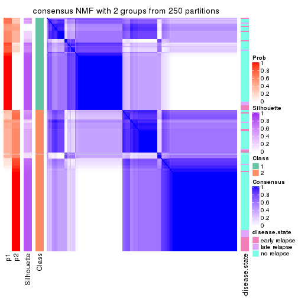</p>

</div>
<div id='tab-SD-NMF-consensus-heatmap-2'>
<pre><code class="r">consensus_heatmap(res, k = 3)
</code></pre>

<p>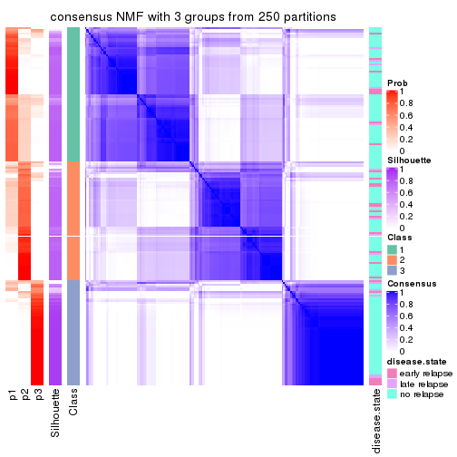</p>

</div>
<div id='tab-SD-NMF-consensus-heatmap-3'>
<pre><code class="r">consensus_heatmap(res, k = 4)
</code></pre>

<p>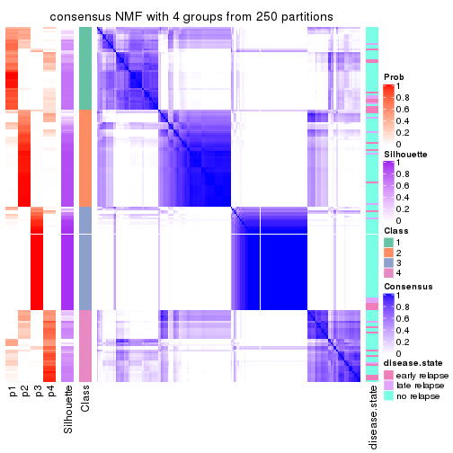</p>

</div>
<div id='tab-SD-NMF-consensus-heatmap-4'>
<pre><code class="r">consensus_heatmap(res, k = 5)
</code></pre>

<p>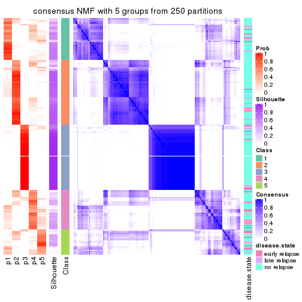</p>

</div>
<div id='tab-SD-NMF-consensus-heatmap-5'>
<pre><code class="r">consensus_heatmap(res, k = 6)
</code></pre>

<p>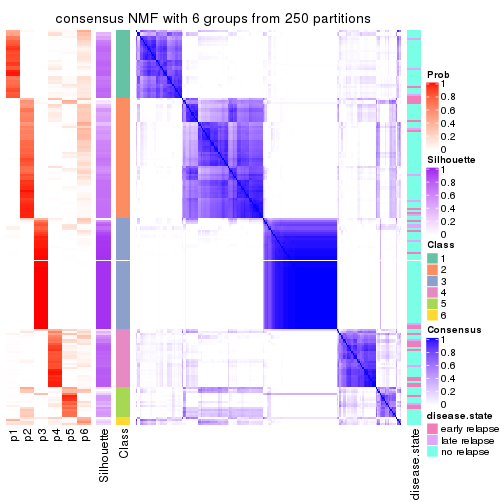</p>

</div>
</div>

Heatmaps for the membership of samples in all partitions to see how consistent they are:


<script>
$( function() {
	$( '#tabs-SD-NMF-membership-heatmap' ).tabs();
} );
</script>
<div id='tabs-SD-NMF-membership-heatmap'>
<ul>
<li><a href='#tab-SD-NMF-membership-heatmap-1'>k = 2</a></li>
<li><a href='#tab-SD-NMF-membership-heatmap-2'>k = 3</a></li>
<li><a href='#tab-SD-NMF-membership-heatmap-3'>k = 4</a></li>
<li><a href='#tab-SD-NMF-membership-heatmap-4'>k = 5</a></li>
<li><a href='#tab-SD-NMF-membership-heatmap-5'>k = 6</a></li>
</ul>
<div id='tab-SD-NMF-membership-heatmap-1'>
<pre><code class="r">membership_heatmap(res, k = 2)
</code></pre>

<p>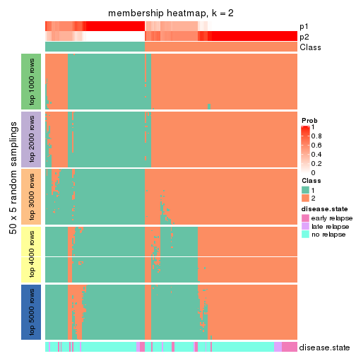</p>

</div>
<div id='tab-SD-NMF-membership-heatmap-2'>
<pre><code class="r">membership_heatmap(res, k = 3)
</code></pre>

<p>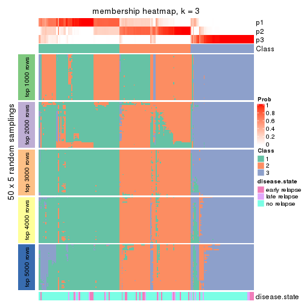</p>

</div>
<div id='tab-SD-NMF-membership-heatmap-3'>
<pre><code class="r">membership_heatmap(res, k = 4)
</code></pre>

<p>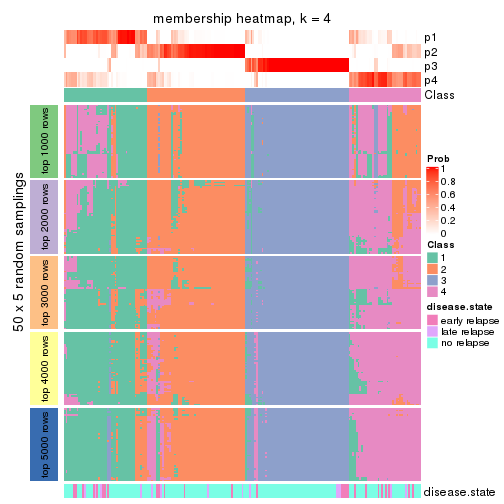</p>

</div>
<div id='tab-SD-NMF-membership-heatmap-4'>
<pre><code class="r">membership_heatmap(res, k = 5)
</code></pre>

<p>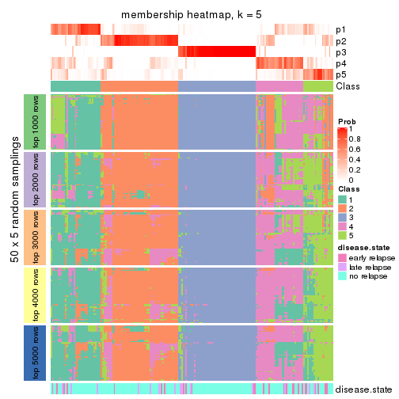</p>

</div>
<div id='tab-SD-NMF-membership-heatmap-5'>
<pre><code class="r">membership_heatmap(res, k = 6)
</code></pre>

<p>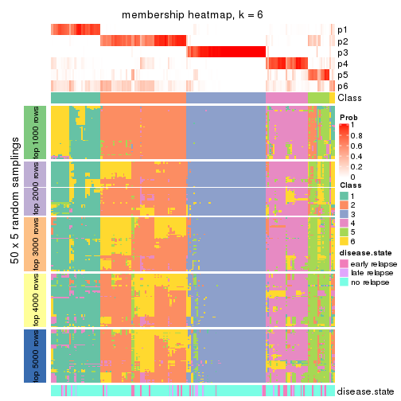</p>

</div>
</div>

As soon as we have had the classes for columns, we can look for signatures
which are significantly different between classes which can be candidate marks
for certain classes. Following are the heatmaps for signatures.


Signature heatmaps where rows are scaled:


<script>
$( function() {
	$( '#tabs-SD-NMF-get-signatures' ).tabs();
} );
</script>
<div id='tabs-SD-NMF-get-signatures'>
<ul>
<li><a href='#tab-SD-NMF-get-signatures-1'>k = 2</a></li>
<li><a href='#tab-SD-NMF-get-signatures-2'>k = 3</a></li>
<li><a href='#tab-SD-NMF-get-signatures-3'>k = 4</a></li>
<li><a href='#tab-SD-NMF-get-signatures-4'>k = 5</a></li>
<li><a href='#tab-SD-NMF-get-signatures-5'>k = 6</a></li>
</ul>
<div id='tab-SD-NMF-get-signatures-1'>
<pre><code class="r">get_signatures(res, k = 2)
</code></pre>

<p>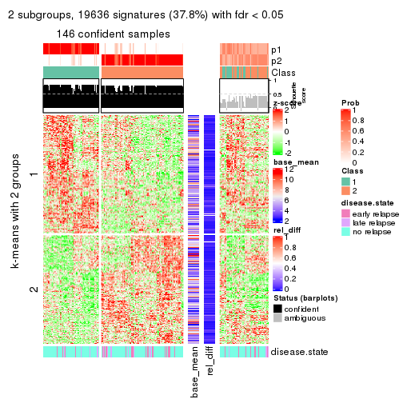</p>

</div>
<div id='tab-SD-NMF-get-signatures-2'>
<pre><code class="r">get_signatures(res, k = 3)
</code></pre>

<p>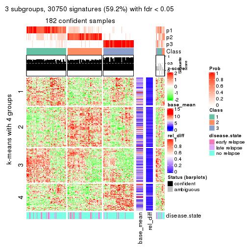</p>

</div>
<div id='tab-SD-NMF-get-signatures-3'>
<pre><code class="r">get_signatures(res, k = 4)
</code></pre>

<p>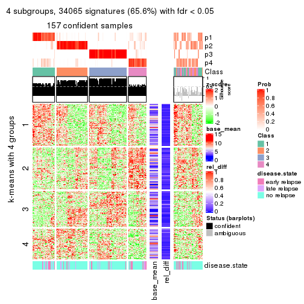</p>

</div>
<div id='tab-SD-NMF-get-signatures-4'>
<pre><code class="r">get_signatures(res, k = 5)
</code></pre>

<p>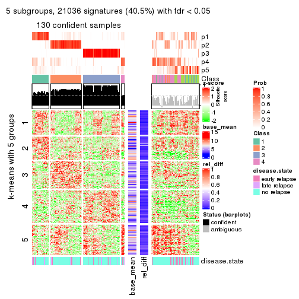</p>

</div>
<div id='tab-SD-NMF-get-signatures-5'>
<pre><code class="r">get_signatures(res, k = 6)
</code></pre>

<p>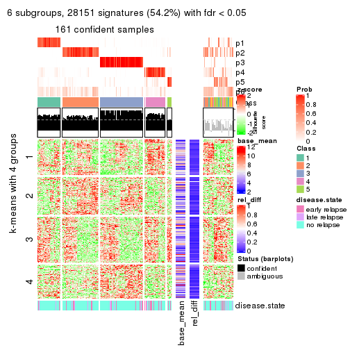</p>

</div>
</div>


Signature heatmaps where rows are not scaled:


<script>
$( function() {
	$( '#tabs-SD-NMF-get-signatures-no-scale' ).tabs();
} );
</script>
<div id='tabs-SD-NMF-get-signatures-no-scale'>
<ul>
<li><a href='#tab-SD-NMF-get-signatures-no-scale-1'>k = 2</a></li>
<li><a href='#tab-SD-NMF-get-signatures-no-scale-2'>k = 3</a></li>
<li><a href='#tab-SD-NMF-get-signatures-no-scale-3'>k = 4</a></li>
<li><a href='#tab-SD-NMF-get-signatures-no-scale-4'>k = 5</a></li>
<li><a href='#tab-SD-NMF-get-signatures-no-scale-5'>k = 6</a></li>
</ul>
<div id='tab-SD-NMF-get-signatures-no-scale-1'>
<pre><code class="r">get_signatures(res, k = 2, scale_rows = FALSE)
</code></pre>

<p>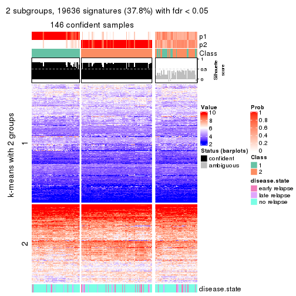</p>

</div>
<div id='tab-SD-NMF-get-signatures-no-scale-2'>
<pre><code class="r">get_signatures(res, k = 3, scale_rows = FALSE)
</code></pre>

<p>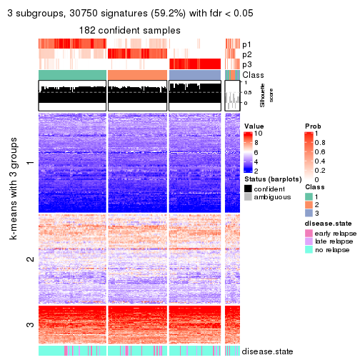</p>

</div>
<div id='tab-SD-NMF-get-signatures-no-scale-3'>
<pre><code class="r">get_signatures(res, k = 4, scale_rows = FALSE)
</code></pre>

<p>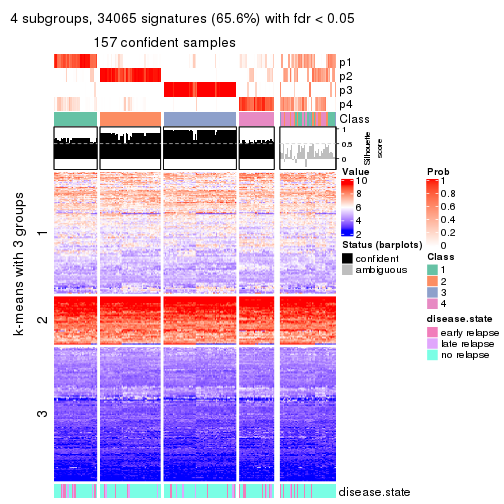</p>

</div>
<div id='tab-SD-NMF-get-signatures-no-scale-4'>
<pre><code class="r">get_signatures(res, k = 5, scale_rows = FALSE)
</code></pre>

<p>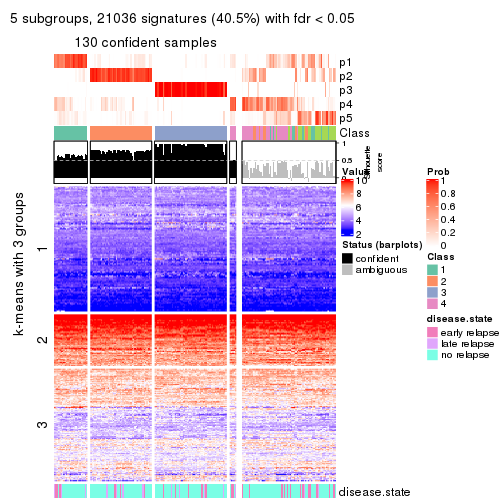</p>

</div>
<div id='tab-SD-NMF-get-signatures-no-scale-5'>
<pre><code class="r">get_signatures(res, k = 6, scale_rows = FALSE)
</code></pre>

<p>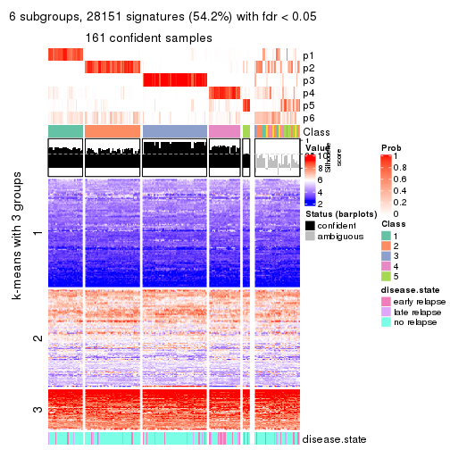</p>

</div>
</div>


Compare the overlap of signatures from different k:

```r
compare_signatures(res)
```

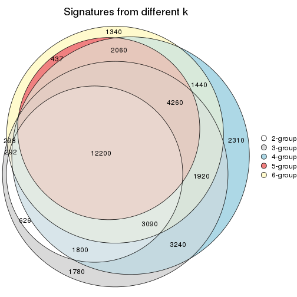

`get_signature()` returns a data frame invisibly. TO get the list of signatures, the function
call should be assigned to a variable explicitly. In following code, if `plot` argument is set
to `FALSE`, no heatmap is plotted while only the differential analysis is performed.

```r
# code only for demonstration
tb = get_signature(res, k = ..., plot = FALSE)
```

An example of the output of `tb` is:

```
#>   which_row         fdr    mean_1    mean_2 scaled_mean_1 scaled_mean_2 km
#> 1        38 0.042760348  8.373488  9.131774    -0.5533452     0.5164555  1
#> 2        40 0.018707592  7.106213  8.469186    -0.6173731     0.5762149  1
#> 3        55 0.019134737 10.221463 11.207825    -0.6159697     0.5749050  1
#> 4        59 0.006059896  5.921854  7.869574    -0.6899429     0.6439467  1
#> 5        60 0.018055526  8.928898 10.211722    -0.6204761     0.5791110  1
#> 6        98 0.009384629 15.714769 14.887706     0.6635654    -0.6193277  2
...
```

The columns in `tb` are:

1. `which_row`: row indices corresponding to the input matrix.
2. `fdr`: FDR for the differential test. 
3. `mean_x`: The mean value in group x.
4. `scaled_mean_x`: The mean value in group x after rows are scaled.
5. `km`: Row groups if k-means clustering is applied to rows.


UMAP plot which shows how samples are separated.


<script>
$( function() {
	$( '#tabs-SD-NMF-dimension-reduction' ).tabs();
} );
</script>
<div id='tabs-SD-NMF-dimension-reduction'>
<ul>
<li><a href='#tab-SD-NMF-dimension-reduction-1'>k = 2</a></li>
<li><a href='#tab-SD-NMF-dimension-reduction-2'>k = 3</a></li>
<li><a href='#tab-SD-NMF-dimension-reduction-3'>k = 4</a></li>
<li><a href='#tab-SD-NMF-dimension-reduction-4'>k = 5</a></li>
<li><a href='#tab-SD-NMF-dimension-reduction-5'>k = 6</a></li>
</ul>
<div id='tab-SD-NMF-dimension-reduction-1'>
<pre><code class="r">dimension_reduction(res, k = 2, method = &quot;UMAP&quot;)
</code></pre>

<p>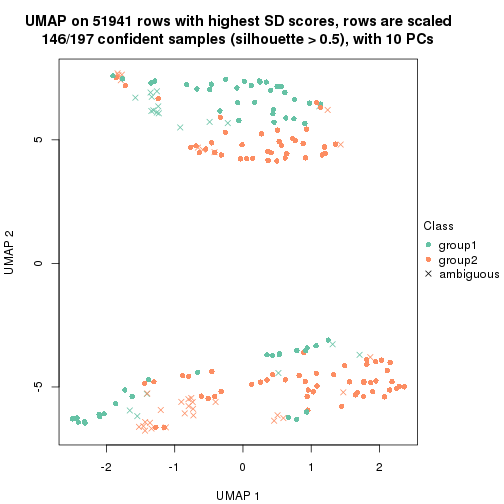</p>

</div>
<div id='tab-SD-NMF-dimension-reduction-2'>
<pre><code class="r">dimension_reduction(res, k = 3, method = &quot;UMAP&quot;)
</code></pre>

<p>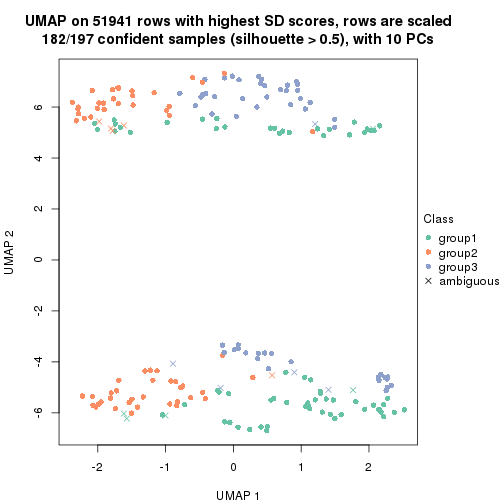</p>

</div>
<div id='tab-SD-NMF-dimension-reduction-3'>
<pre><code class="r">dimension_reduction(res, k = 4, method = &quot;UMAP&quot;)
</code></pre>

<p>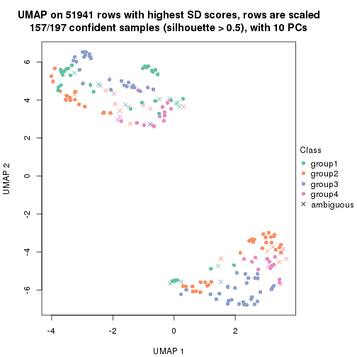</p>

</div>
<div id='tab-SD-NMF-dimension-reduction-4'>
<pre><code class="r">dimension_reduction(res, k = 5, method = &quot;UMAP&quot;)
</code></pre>

<p>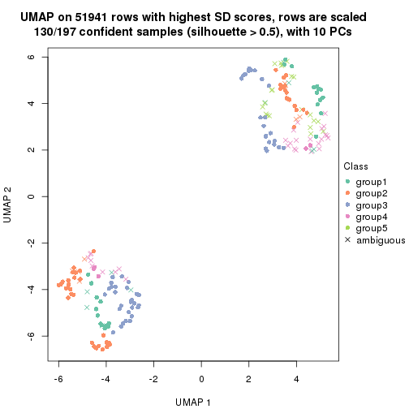</p>

</div>
<div id='tab-SD-NMF-dimension-reduction-5'>
<pre><code class="r">dimension_reduction(res, k = 6, method = &quot;UMAP&quot;)
</code></pre>

<p>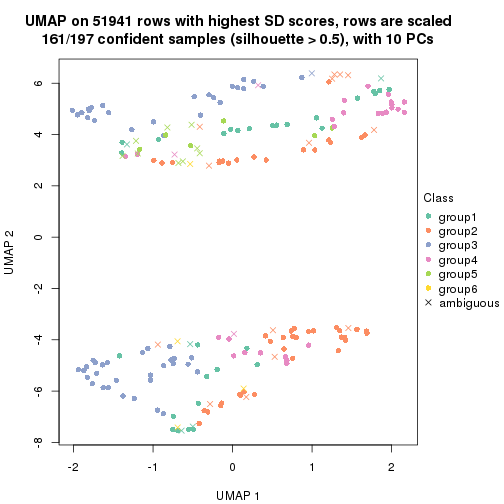</p>

</div>
</div>


Following heatmap shows how subgroups are split when increasing `k`:

```r
collect_classes(res)
```

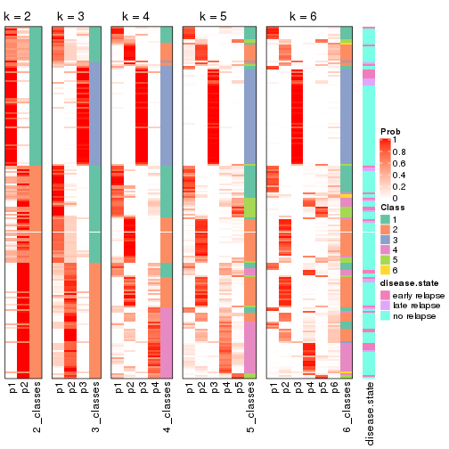


Test correlation between subgroups and known annotations. If the known
annotation is numeric, one-way ANOVA test is applied, and if the known
annotation is discrete, chi-squared contingency table test is applied.

```r
test_to_known_factors(res)
```

```
#>          n disease.state(p) k
#> SD:NMF 146           0.2189 2
#> SD:NMF 182           0.5108 3
#> SD:NMF 157           0.2347 4
#> SD:NMF 130           0.2799 5
#> SD:NMF 161           0.0879 6
```


If matrix rows can be associated to genes, consider to use `functional_enrichment(res,
...)` to perform function enrichment for the signature genes. See [this vignette](http://bioconductor.org/packages/devel/bioc/vignettes/cola/inst/doc/functional_enrichment.html) for more detailed explanations.


 

---------------------------------------------------


### CV:hclust


The object with results only for a single top-value method and a single partition method 
can be extracted as:

```r
res = res_list["CV", "hclust"]
# you can also extract it by
# res = res_list["CV:hclust"]
```

A summary of `res` and all the functions that can be applied to it:

```r
res
```

```
#> A 'ConsensusPartition' object with k = 2, 3, 4, 5, 6.
#>   On a matrix with 51941 rows and 197 columns.
#>   Top rows (1000, 2000, 3000, 4000, 5000) are extracted by 'CV' method.
#>   Subgroups are detected by 'hclust' method.
#>   Performed in total 1250 partitions by row resampling.
#>   Best k for subgroups seems to be 4.
#> 
#> Following methods can be applied to this 'ConsensusPartition' object:
#>  [1] "cola_report"             "collect_classes"         "collect_plots"          
#>  [4] "collect_stats"           "colnames"                "compare_signatures"     
#>  [7] "consensus_heatmap"       "dimension_reduction"     "functional_enrichment"  
#> [10] "get_anno_col"            "get_anno"                "get_classes"            
#> [13] "get_consensus"           "get_matrix"              "get_membership"         
#> [16] "get_param"               "get_signatures"          "get_stats"              
#> [19] "is_best_k"               "is_stable_k"             "membership_heatmap"     
#> [22] "ncol"                    "nrow"                    "plot_ecdf"              
#> [25] "rownames"                "select_partition_number" "show"                   
#> [28] "suggest_best_k"          "test_to_known_factors"
```

`collect_plots()` function collects all the plots made from `res` for all `k` (number of partitions)
into one single page to provide an easy and fast comparison between different `k`.

```r
collect_plots(res)
```

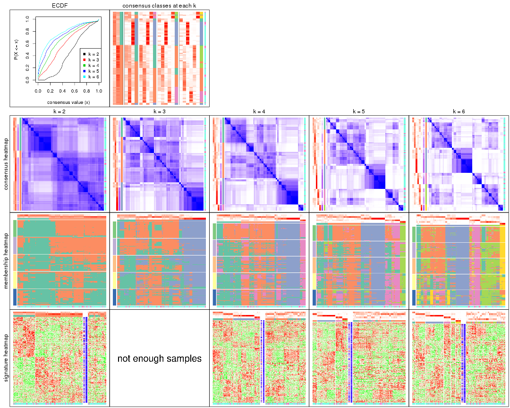

The plots are:

- The first row: a plot of the ECDF (empirical cumulative distribution
  function) curves of the consensus matrix for each `k` and the heatmap of
  predicted classes for each `k`.
- The second row: heatmaps of the consensus matrix for each `k`.
- The third row: heatmaps of the membership matrix for each `k`.
- The fouth row: heatmaps of the signatures for each `k`.

All the plots in panels can be made by individual functions and they are
plotted later in this section.

`select_partition_number()` produces several plots showing different
statistics for choosing "optimized" `k`. There are following statistics:

- ECDF curves of the consensus matrix for each `k`;
- 1-PAC. [The PAC
  score](https://en.wikipedia.org/wiki/Consensus_clustering#Over-interpretation_potential_of_consensus_clustering)
  measures the proportion of the ambiguous subgrouping.
- Mean silhouette score.
- Concordance. The mean probability of fiting the consensus class ids in all
  partitions.
- Area increased. Denote $A_k$ as the area under the ECDF curve for current
  `k`, the area increased is defined as $A_k - A_{k-1}$.
- Rand index. The percent of pairs of samples that are both in a same cluster
  or both are not in a same cluster in the partition of k and k-1.
- Jaccard index. The ratio of pairs of samples are both in a same cluster in
  the partition of k and k-1 and the pairs of samples are both in a same
  cluster in the partition k or k-1.

The detailed explanations of these statistics can be found in [the _cola_
vignette](http://bioconductor.org/packages/devel/bioc/vignettes/cola/inst/doc/cola.html#toc_13).

Generally speaking, lower PAC score, higher mean silhouette score or higher
concordance corresponds to better partition. Rand index and Jaccard index
measure how similar the current partition is compared to partition with `k-1`.
If they are too similar, we won't accept `k` is better than `k-1`.

```r
select_partition_number(res)
```

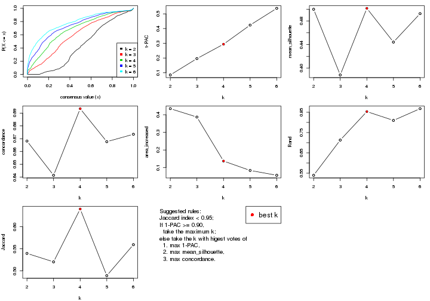

The numeric values for all these statistics can be obtained by `get_stats()`.

```r
get_stats(res)
```

```
#>   k  1-PAC mean_silhouette concordance area_increased  Rand Jaccard
#> 2 2 0.0849           0.500       0.668         0.4342 0.540   0.540
#> 3 3 0.1961           0.388       0.641         0.3868 0.713   0.520
#> 4 4 0.2938           0.501       0.693         0.1372 0.853   0.640
#> 5 5 0.4237           0.444       0.668         0.0841 0.810   0.489
#> 6 6 0.5375           0.492       0.673         0.0565 0.868   0.559
```

`suggest_best_k()` suggests the best $k$ based on these statistics. The rules are as follows:

- All $k$ with Jaccard index larger than 0.95 are removed because increasing
  $k$ does not provide enough extra information. If all $k$ are removed, it is
  marked as no subgroup is detected.
- For all $k$ with 1-PAC score larger than 0.9, the maximal $k$ is taken as
  the best $k$, and other $k$ are marked as optional $k$.
- If it does not fit the second rule. The $k$ with the maximal vote of the
  highest 1-PAC score, highest mean silhouette, and highest concordance is
  taken as the best $k$.

```r
suggest_best_k(res)
```

```
#> [1] 4
```


Following shows the table of the partitions (You need to click the **show/hide
code output** link to see it). The membership matrix (columns with name `p*`)
is inferred by
[`clue::cl_consensus()`](https://www.rdocumentation.org/link/cl_consensus?package=clue)
function with the `SE` method. Basically the value in the membership matrix
represents the probability to belong to a certain group. The finall class
label for an item is determined with the group with highest probability it
belongs to.

In `get_classes()` function, the entropy is calculated from the membership
matrix and the silhouette score is calculated from the consensus matrix.


<script>
$( function() {
	$( '#tabs-CV-hclust-get-classes' ).tabs();
} );
</script>
<div id='tabs-CV-hclust-get-classes'>
<ul>
<li><a href='#tab-CV-hclust-get-classes-1'>k = 2</a></li>
<li><a href='#tab-CV-hclust-get-classes-2'>k = 3</a></li>
<li><a href='#tab-CV-hclust-get-classes-3'>k = 4</a></li>
<li><a href='#tab-CV-hclust-get-classes-4'>k = 5</a></li>
<li><a href='#tab-CV-hclust-get-classes-5'>k = 6</a></li>
</ul>

<div id='tab-CV-hclust-get-classes-1'>
<p><a id='tab-CV-hclust-get-classes-1-a' style='color:#0366d6' href='#'>show/hide code output</a></p>
<pre><code class="r">cbind(get_classes(res, k = 2), get_membership(res, k = 2))
</code></pre>

<pre><code>#&gt;           class entropy silhouette    p1    p2
#&gt; GSM342319     2   0.850     0.5680 0.276 0.724
#&gt; GSM342323     2   0.963     0.5375 0.388 0.612
#&gt; GSM342325     2   0.402     0.5911 0.080 0.920
#&gt; GSM342326     2   0.978     0.5208 0.412 0.588
#&gt; GSM342327     2   0.978     0.5208 0.412 0.588
#&gt; GSM342329     2   0.963     0.5375 0.388 0.612
#&gt; GSM342331     2   0.978     0.5208 0.412 0.588
#&gt; GSM342334     2   0.552     0.6374 0.128 0.872
#&gt; GSM342335     2   0.563     0.6366 0.132 0.868
#&gt; GSM342354     1   0.952     0.7035 0.628 0.372
#&gt; GSM342371     2   0.584     0.6405 0.140 0.860
#&gt; GSM342380     2   0.402     0.5843 0.080 0.920
#&gt; GSM342382     2   0.402     0.5829 0.080 0.920
#&gt; GSM342399     2   0.402     0.5911 0.080 0.920
#&gt; GSM342402     2   0.900     0.5513 0.316 0.684
#&gt; GSM342404     2   0.985     0.4342 0.428 0.572
#&gt; GSM342408     1   0.788     0.6184 0.764 0.236
#&gt; GSM342409     2   0.730     0.4826 0.204 0.796
#&gt; GSM342426     2   0.978     0.5208 0.412 0.588
#&gt; GSM342441     1   0.932     0.7262 0.652 0.348
#&gt; GSM342444     1   0.939     0.7232 0.644 0.356
#&gt; GSM342451     1   0.932     0.7262 0.652 0.348
#&gt; GSM342462     2   0.814     0.6261 0.252 0.748
#&gt; GSM342467     2   0.990     0.5259 0.440 0.560
#&gt; GSM342484     1   0.963    -0.1336 0.612 0.388
#&gt; GSM342491     2   0.943     0.5802 0.360 0.640
#&gt; GSM342322     2   0.850     0.5680 0.276 0.724
#&gt; GSM342338     1   0.958     0.7064 0.620 0.380
#&gt; GSM342347     1   0.946     0.6944 0.636 0.364
#&gt; GSM342356     2   0.995    -0.5087 0.460 0.540
#&gt; GSM342357     1   0.998    -0.1634 0.524 0.476
#&gt; GSM342366     2   0.563     0.6388 0.132 0.868
#&gt; GSM342385     2   0.402     0.5843 0.080 0.920
#&gt; GSM342421     2   0.662     0.6320 0.172 0.828
#&gt; GSM342437     1   0.981    -0.2165 0.580 0.420
#&gt; GSM342454     1   0.932     0.7262 0.652 0.348
#&gt; GSM342471     2   0.358     0.5770 0.068 0.932
#&gt; GSM342477     2   0.991     0.5248 0.444 0.556
#&gt; GSM342495     2   0.921     0.5870 0.336 0.664
#&gt; GSM342496     2   0.615     0.5510 0.152 0.848
#&gt; GSM342320     2   0.978     0.5208 0.412 0.588
#&gt; GSM342321     2   0.975     0.5243 0.408 0.592
#&gt; GSM342324     2   0.961     0.5300 0.384 0.616
#&gt; GSM342328     2   0.963     0.5375 0.388 0.612
#&gt; GSM342330     2   0.978     0.5208 0.412 0.588
#&gt; GSM342332     2   0.958     0.5518 0.380 0.620
#&gt; GSM342333     2   0.662     0.6266 0.172 0.828
#&gt; GSM342336     2   0.958     0.5518 0.380 0.620
#&gt; GSM342337     2   0.995    -0.5087 0.460 0.540
#&gt; GSM342339     1   0.943     0.7223 0.640 0.360
#&gt; GSM342340     1   0.943     0.7223 0.640 0.360
#&gt; GSM342341     1   0.943     0.7223 0.640 0.360
#&gt; GSM342342     1   0.943     0.7223 0.640 0.360
#&gt; GSM342343     2   0.995    -0.5087 0.460 0.540
#&gt; GSM342344     1   0.949     0.7057 0.632 0.368
#&gt; GSM342345     1   0.943     0.7223 0.640 0.360
#&gt; GSM342346     2   0.839     0.4971 0.268 0.732
#&gt; GSM342348     1   1.000     0.4799 0.508 0.492
#&gt; GSM342349     1   0.939     0.6958 0.644 0.356
#&gt; GSM342350     1   0.943     0.6972 0.640 0.360
#&gt; GSM342351     1   0.946     0.6944 0.636 0.364
#&gt; GSM342352     1   0.946     0.6944 0.636 0.364
#&gt; GSM342353     1   0.958     0.7064 0.620 0.380
#&gt; GSM342355     2   0.990    -0.4680 0.440 0.560
#&gt; GSM342358     1   0.904    -0.1252 0.680 0.320
#&gt; GSM342359     1   0.904    -0.1252 0.680 0.320
#&gt; GSM342360     1   0.904    -0.1252 0.680 0.320
#&gt; GSM342361     1   0.904    -0.1252 0.680 0.320
#&gt; GSM342362     1   0.998    -0.1634 0.524 0.476
#&gt; GSM342363     1   0.998    -0.1634 0.524 0.476
#&gt; GSM342364     2   0.518     0.5767 0.116 0.884
#&gt; GSM342365     2   0.949     0.5733 0.368 0.632
#&gt; GSM342367     2   0.430     0.5892 0.088 0.912
#&gt; GSM342368     2   0.541     0.6362 0.124 0.876
#&gt; GSM342369     2   0.925     0.5913 0.340 0.660
#&gt; GSM342370     2   0.949     0.5733 0.368 0.632
#&gt; GSM342372     2   0.925     0.5913 0.340 0.660
#&gt; GSM342373     2   0.605     0.6352 0.148 0.852
#&gt; GSM342374     2   0.949     0.5733 0.368 0.632
#&gt; GSM342375     2   0.921     0.5996 0.336 0.664
#&gt; GSM342376     2   0.311     0.5887 0.056 0.944
#&gt; GSM342377     2   0.295     0.5901 0.052 0.948
#&gt; GSM342378     2   0.895     0.0499 0.312 0.688
#&gt; GSM342379     2   0.358     0.6090 0.068 0.932
#&gt; GSM342381     2   0.327     0.5856 0.060 0.940
#&gt; GSM342383     2   0.402     0.5843 0.080 0.920
#&gt; GSM342384     2   0.456     0.5779 0.096 0.904
#&gt; GSM342386     2   0.430     0.5825 0.088 0.912
#&gt; GSM342387     2   0.949     0.0146 0.368 0.632
#&gt; GSM342388     1   0.971     0.6852 0.600 0.400
#&gt; GSM342389     2   0.430     0.5825 0.088 0.912
#&gt; GSM342390     1   1.000     0.4799 0.508 0.492
#&gt; GSM342391     2   0.909     0.0158 0.324 0.676
#&gt; GSM342392     1   0.943     0.7223 0.640 0.360
#&gt; GSM342393     2   0.985     0.4342 0.428 0.572
#&gt; GSM342394     2   0.895     0.0499 0.312 0.688
#&gt; GSM342395     2   0.529     0.6343 0.120 0.880
#&gt; GSM342396     1   0.943     0.7223 0.640 0.360
#&gt; GSM342397     1   0.966     0.6368 0.608 0.392
#&gt; GSM342398     2   0.327     0.5856 0.060 0.940
#&gt; GSM342400     2   0.311     0.5921 0.056 0.944
#&gt; GSM342401     1   0.943     0.7223 0.640 0.360
#&gt; GSM342403     2   0.456     0.6103 0.096 0.904
#&gt; GSM342405     1   1.000    -0.1685 0.512 0.488
#&gt; GSM342406     1   1.000     0.4799 0.508 0.492
#&gt; GSM342407     1   0.943     0.6972 0.640 0.360
#&gt; GSM342410     2   0.909     0.0158 0.324 0.676
#&gt; GSM342411     2   0.949     0.0146 0.368 0.632
#&gt; GSM342412     2   0.574     0.6366 0.136 0.864
#&gt; GSM342413     1   0.900     0.4604 0.684 0.316
#&gt; GSM342414     1   0.943     0.6972 0.640 0.360
#&gt; GSM342415     2   0.327     0.6098 0.060 0.940
#&gt; GSM342416     1   1.000     0.4799 0.508 0.492
#&gt; GSM342417     2   0.963     0.5253 0.388 0.612
#&gt; GSM342418     2   0.958     0.5357 0.380 0.620
#&gt; GSM342419     2   0.327     0.5869 0.060 0.940
#&gt; GSM342420     2   0.963     0.5253 0.388 0.612
#&gt; GSM342422     2   0.311     0.5854 0.056 0.944
#&gt; GSM342423     2   0.584     0.6405 0.140 0.860
#&gt; GSM342424     2   0.978     0.5208 0.412 0.588
#&gt; GSM342425     2   0.978     0.5208 0.412 0.588
#&gt; GSM342427     2   0.966     0.5475 0.392 0.608
#&gt; GSM342428     2   0.963     0.5504 0.388 0.612
#&gt; GSM342429     2   0.958     0.5518 0.380 0.620
#&gt; GSM342430     1   0.932     0.7262 0.652 0.348
#&gt; GSM342431     1   0.943     0.7223 0.640 0.360
#&gt; GSM342432     1   0.929     0.7257 0.656 0.344
#&gt; GSM342433     1   0.753     0.6263 0.784 0.216
#&gt; GSM342434     1   0.753     0.6263 0.784 0.216
#&gt; GSM342435     1   0.753     0.6263 0.784 0.216
#&gt; GSM342436     1   0.932     0.7262 0.652 0.348
#&gt; GSM342438     1   0.932     0.7262 0.652 0.348
#&gt; GSM342439     1   0.929     0.7257 0.656 0.344
#&gt; GSM342440     1   0.932     0.7262 0.652 0.348
#&gt; GSM342442     1   0.929     0.7257 0.656 0.344
#&gt; GSM342443     2   0.876     0.5981 0.296 0.704
#&gt; GSM342445     1   0.932     0.7262 0.652 0.348
#&gt; GSM342446     1   0.932     0.7262 0.652 0.348
#&gt; GSM342447     1   0.949     0.7179 0.632 0.368
#&gt; GSM342448     1   0.753     0.6263 0.784 0.216
#&gt; GSM342449     1   0.932     0.7262 0.652 0.348
#&gt; GSM342450     1   0.753     0.6263 0.784 0.216
#&gt; GSM342452     1   0.932     0.7262 0.652 0.348
#&gt; GSM342453     1   0.932     0.7262 0.652 0.348
#&gt; GSM342455     1   0.932     0.7262 0.652 0.348
#&gt; GSM342456     1   0.904    -0.1252 0.680 0.320
#&gt; GSM342457     2   0.662     0.6491 0.172 0.828
#&gt; GSM342458     2   0.955     0.5655 0.376 0.624
#&gt; GSM342459     2   0.876     0.5981 0.296 0.704
#&gt; GSM342460     2   0.917     0.5902 0.332 0.668
#&gt; GSM342461     2   0.839     0.6085 0.268 0.732
#&gt; GSM342463     2   0.615     0.5510 0.152 0.848
#&gt; GSM342464     2   0.644     0.5703 0.164 0.836
#&gt; GSM342465     2   0.615     0.5510 0.152 0.848
#&gt; GSM342466     2   0.358     0.5770 0.068 0.932
#&gt; GSM342468     2   0.936     0.5896 0.352 0.648
#&gt; GSM342469     2   0.358     0.5770 0.068 0.932
#&gt; GSM342470     1   0.900     0.4604 0.684 0.316
#&gt; GSM342472     2   0.978     0.4732 0.412 0.588
#&gt; GSM342473     2   0.839     0.6085 0.268 0.732
#&gt; GSM342474     2   0.839     0.6085 0.268 0.732
#&gt; GSM342475     1   0.932     0.7262 0.652 0.348
#&gt; GSM342476     2   0.921     0.5870 0.336 0.664
#&gt; GSM342478     2   0.814     0.6223 0.252 0.748
#&gt; GSM342479     2   0.506     0.5988 0.112 0.888
#&gt; GSM342480     2   0.876     0.5981 0.296 0.704
#&gt; GSM342481     2   0.932     0.5827 0.348 0.652
#&gt; GSM342482     2   0.839     0.6085 0.268 0.732
#&gt; GSM342483     2   0.814     0.6223 0.252 0.748
#&gt; GSM342485     2   0.615     0.5510 0.152 0.848
#&gt; GSM342486     2   0.430     0.5782 0.088 0.912
#&gt; GSM342487     2   1.000     0.2193 0.496 0.504
#&gt; GSM342488     2   0.921     0.5870 0.336 0.664
#&gt; GSM342489     2   0.917     0.5902 0.332 0.668
#&gt; GSM342490     2   0.990     0.5285 0.440 0.560
#&gt; GSM342492     1   0.753     0.6263 0.784 0.216
#&gt; GSM342493     2   0.615     0.5510 0.152 0.848
#&gt; GSM342494     2   0.958     0.5338 0.380 0.620
#&gt; GSM342497     2   0.958     0.5335 0.380 0.620
#&gt; GSM342498     2   0.895     0.0499 0.312 0.688
#&gt; GSM342499     2   0.358     0.5770 0.068 0.932
#&gt; GSM342500     2   0.871     0.5952 0.292 0.708
#&gt; GSM342501     2   0.506     0.5988 0.112 0.888
#&gt; GSM342502     2   0.795     0.6227 0.240 0.760
#&gt; GSM342503     2   0.788     0.6240 0.236 0.764
#&gt; GSM342504     2   0.814     0.6223 0.252 0.748
#&gt; GSM342505     1   0.932     0.7262 0.652 0.348
#&gt; GSM342506     2   0.895     0.0499 0.312 0.688
#&gt; GSM342507     1   0.998    -0.1634 0.524 0.476
#&gt; GSM342508     2   0.895     0.0499 0.312 0.688
#&gt; GSM342509     1   0.963    -0.1336 0.612 0.388
#&gt; GSM342510     1   0.904    -0.1252 0.680 0.320
#&gt; GSM342511     2   0.969     0.5600 0.396 0.604
#&gt; GSM342512     2   0.615     0.5510 0.152 0.848
#&gt; GSM342513     2   0.615     0.5510 0.152 0.848
#&gt; GSM342514     1   0.900     0.4604 0.684 0.316
#&gt; GSM342515     2   0.895     0.0499 0.312 0.688
</code></pre>

<script>
$('#tab-CV-hclust-get-classes-1-a').parent().next().next().hide();
$('#tab-CV-hclust-get-classes-1-a').click(function(){
  $('#tab-CV-hclust-get-classes-1-a').parent().next().next().toggle();
  return(false);
});
</script>
</div>

<div id='tab-CV-hclust-get-classes-2'>
<p><a id='tab-CV-hclust-get-classes-2-a' style='color:#0366d6' href='#'>show/hide code output</a></p>
<pre><code class="r">cbind(get_classes(res, k = 3), get_membership(res, k = 3))
</code></pre>

<pre><code>#&gt;           class entropy silhouette    p1    p2    p3
#&gt; GSM342319     2  0.7065    0.10052 0.352 0.616 0.032
#&gt; GSM342323     2  0.4589    0.35015 0.172 0.820 0.008
#&gt; GSM342325     1  0.7990    0.40030 0.532 0.404 0.064
#&gt; GSM342326     2  0.3752    0.35971 0.144 0.856 0.000
#&gt; GSM342327     2  0.3752    0.35971 0.144 0.856 0.000
#&gt; GSM342329     2  0.4413    0.35339 0.160 0.832 0.008
#&gt; GSM342331     2  0.3752    0.35971 0.144 0.856 0.000
#&gt; GSM342334     2  0.8793    0.00961 0.308 0.552 0.140
#&gt; GSM342335     2  0.8821    0.01666 0.304 0.552 0.144
#&gt; GSM342354     3  0.4709    0.78019 0.092 0.056 0.852
#&gt; GSM342371     2  0.8238    0.04187 0.300 0.596 0.104
#&gt; GSM342380     1  0.8998    0.45512 0.472 0.396 0.132
#&gt; GSM342382     1  0.9105    0.45442 0.448 0.412 0.140
#&gt; GSM342399     1  0.7990    0.40030 0.532 0.404 0.064
#&gt; GSM342402     2  0.7263    0.13932 0.372 0.592 0.036
#&gt; GSM342404     2  0.7981    0.34342 0.076 0.584 0.340
#&gt; GSM342408     3  0.6054    0.69231 0.052 0.180 0.768
#&gt; GSM342409     2  0.9730   -0.19821 0.340 0.428 0.232
#&gt; GSM342426     2  0.3752    0.35971 0.144 0.856 0.000
#&gt; GSM342441     3  0.0000    0.82800 0.000 0.000 1.000
#&gt; GSM342444     3  0.0475    0.82693 0.004 0.004 0.992
#&gt; GSM342451     3  0.0000    0.82800 0.000 0.000 1.000
#&gt; GSM342462     2  0.8670    0.26810 0.168 0.592 0.240
#&gt; GSM342467     2  0.5111    0.44124 0.036 0.820 0.144
#&gt; GSM342484     1  0.7744   -0.14662 0.504 0.448 0.048
#&gt; GSM342491     2  0.7835    0.34533 0.232 0.656 0.112
#&gt; GSM342322     2  0.7065    0.10052 0.352 0.616 0.032
#&gt; GSM342338     3  0.3802    0.79255 0.080 0.032 0.888
#&gt; GSM342347     3  0.5492    0.76759 0.104 0.080 0.816
#&gt; GSM342356     3  0.7997    0.29702 0.360 0.072 0.568
#&gt; GSM342357     1  0.6994   -0.06639 0.556 0.424 0.020
#&gt; GSM342366     2  0.8268   -0.04277 0.328 0.576 0.096
#&gt; GSM342385     1  0.8998    0.45512 0.472 0.396 0.132
#&gt; GSM342421     2  0.8492    0.10199 0.276 0.592 0.132
#&gt; GSM342437     2  0.8763    0.21663 0.196 0.588 0.216
#&gt; GSM342454     3  0.0000    0.82800 0.000 0.000 1.000
#&gt; GSM342471     1  0.8489    0.49350 0.496 0.412 0.092
#&gt; GSM342477     2  0.5875    0.43286 0.072 0.792 0.136
#&gt; GSM342495     2  0.6211    0.43615 0.036 0.736 0.228
#&gt; GSM342496     2  0.9950   -0.23037 0.340 0.372 0.288
#&gt; GSM342320     2  0.3752    0.35971 0.144 0.856 0.000
#&gt; GSM342321     2  0.3983    0.36002 0.144 0.852 0.004
#&gt; GSM342324     2  0.5201    0.32097 0.236 0.760 0.004
#&gt; GSM342328     2  0.4589    0.35015 0.172 0.820 0.008
#&gt; GSM342330     2  0.3752    0.35971 0.144 0.856 0.000
#&gt; GSM342332     2  0.1877    0.39799 0.032 0.956 0.012
#&gt; GSM342333     2  0.9008    0.07282 0.296 0.540 0.164
#&gt; GSM342336     2  0.1877    0.39799 0.032 0.956 0.012
#&gt; GSM342337     3  0.7997    0.29702 0.360 0.072 0.568
#&gt; GSM342339     3  0.0829    0.82626 0.012 0.004 0.984
#&gt; GSM342340     3  0.0829    0.82626 0.012 0.004 0.984
#&gt; GSM342341     3  0.0829    0.82626 0.012 0.004 0.984
#&gt; GSM342342     3  0.0829    0.82626 0.012 0.004 0.984
#&gt; GSM342343     3  0.7997    0.29702 0.360 0.072 0.568
#&gt; GSM342344     3  0.4527    0.78433 0.088 0.052 0.860
#&gt; GSM342345     3  0.0829    0.82626 0.012 0.004 0.984
#&gt; GSM342346     2  0.9620    0.11888 0.204 0.416 0.380
#&gt; GSM342348     3  0.9594    0.08860 0.360 0.204 0.436
#&gt; GSM342349     3  0.5566    0.76772 0.108 0.080 0.812
#&gt; GSM342350     3  0.5331    0.77358 0.100 0.076 0.824
#&gt; GSM342351     3  0.5492    0.76759 0.104 0.080 0.816
#&gt; GSM342352     3  0.5416    0.76942 0.100 0.080 0.820
#&gt; GSM342353     3  0.3802    0.79255 0.080 0.032 0.888
#&gt; GSM342355     3  0.8402    0.21428 0.376 0.092 0.532
#&gt; GSM342358     2  0.7069    0.15048 0.472 0.508 0.020
#&gt; GSM342359     2  0.7069    0.15048 0.472 0.508 0.020
#&gt; GSM342360     2  0.7069    0.15048 0.472 0.508 0.020
#&gt; GSM342361     2  0.7069    0.15048 0.472 0.508 0.020
#&gt; GSM342362     1  0.6994   -0.06639 0.556 0.424 0.020
#&gt; GSM342363     1  0.6994   -0.06639 0.556 0.424 0.020
#&gt; GSM342364     2  0.9496   -0.32893 0.372 0.440 0.188
#&gt; GSM342365     2  0.6588    0.44164 0.060 0.732 0.208
#&gt; GSM342367     2  0.9302   -0.42397 0.420 0.420 0.160
#&gt; GSM342368     2  0.8324   -0.17181 0.372 0.540 0.088
#&gt; GSM342369     2  0.6986    0.43638 0.096 0.724 0.180
#&gt; GSM342370     2  0.6588    0.44164 0.060 0.732 0.208
#&gt; GSM342372     2  0.6986    0.43638 0.096 0.724 0.180
#&gt; GSM342373     2  0.8432    0.00681 0.312 0.576 0.112
#&gt; GSM342374     2  0.6588    0.44164 0.060 0.732 0.208
#&gt; GSM342375     2  0.6990    0.42662 0.108 0.728 0.164
#&gt; GSM342376     1  0.8119    0.48211 0.500 0.432 0.068
#&gt; GSM342377     1  0.8124    0.47930 0.496 0.436 0.068
#&gt; GSM342378     1  0.9775    0.33342 0.440 0.272 0.288
#&gt; GSM342379     1  0.7480    0.42134 0.508 0.456 0.036
#&gt; GSM342381     1  0.8316    0.48534 0.496 0.424 0.080
#&gt; GSM342383     1  0.8998    0.45512 0.472 0.396 0.132
#&gt; GSM342384     1  0.9361    0.42953 0.436 0.396 0.168
#&gt; GSM342386     1  0.9369    0.41373 0.424 0.408 0.168
#&gt; GSM342387     1  0.9919    0.22638 0.392 0.284 0.324
#&gt; GSM342388     3  0.2434    0.80628 0.036 0.024 0.940
#&gt; GSM342389     1  0.9369    0.41373 0.424 0.408 0.168
#&gt; GSM342390     3  0.9594    0.08860 0.360 0.204 0.436
#&gt; GSM342391     1  0.9808    0.31085 0.428 0.264 0.308
#&gt; GSM342392     3  0.0829    0.82626 0.012 0.004 0.984
#&gt; GSM342393     2  0.7961    0.34600 0.076 0.588 0.336
#&gt; GSM342394     1  0.9775    0.33342 0.440 0.272 0.288
#&gt; GSM342395     2  0.8395   -0.15091 0.356 0.548 0.096
#&gt; GSM342396     3  0.0829    0.82626 0.012 0.004 0.984
#&gt; GSM342397     3  0.6775    0.69878 0.112 0.144 0.744
#&gt; GSM342398     1  0.8316    0.48534 0.496 0.424 0.080
#&gt; GSM342400     1  0.8208    0.46280 0.476 0.452 0.072
#&gt; GSM342401     3  0.0829    0.82626 0.012 0.004 0.984
#&gt; GSM342403     2  0.9037   -0.30404 0.392 0.472 0.136
#&gt; GSM342405     2  0.8185    0.16834 0.072 0.500 0.428
#&gt; GSM342406     3  0.9594    0.08860 0.360 0.204 0.436
#&gt; GSM342407     3  0.5331    0.77358 0.100 0.076 0.824
#&gt; GSM342410     1  0.9808    0.31085 0.428 0.264 0.308
#&gt; GSM342411     1  0.9919    0.22638 0.392 0.284 0.324
#&gt; GSM342412     2  0.8853    0.00584 0.320 0.540 0.140
#&gt; GSM342413     3  0.9243    0.32528 0.192 0.288 0.520
#&gt; GSM342414     3  0.5331    0.77358 0.100 0.076 0.824
#&gt; GSM342415     1  0.7493    0.42065 0.488 0.476 0.036
#&gt; GSM342416     3  0.9594    0.08860 0.360 0.204 0.436
#&gt; GSM342417     2  0.5024    0.32799 0.220 0.776 0.004
#&gt; GSM342418     2  0.4834    0.33577 0.204 0.792 0.004
#&gt; GSM342419     1  0.8124    0.48149 0.496 0.436 0.068
#&gt; GSM342420     2  0.5024    0.32799 0.220 0.776 0.004
#&gt; GSM342422     1  0.8322    0.48292 0.492 0.428 0.080
#&gt; GSM342423     2  0.8238    0.04187 0.300 0.596 0.104
#&gt; GSM342424     2  0.3752    0.35971 0.144 0.856 0.000
#&gt; GSM342425     2  0.3752    0.35971 0.144 0.856 0.000
#&gt; GSM342427     2  0.2297    0.40582 0.036 0.944 0.020
#&gt; GSM342428     2  0.2176    0.40557 0.032 0.948 0.020
#&gt; GSM342429     2  0.1877    0.39799 0.032 0.956 0.012
#&gt; GSM342430     3  0.0000    0.82800 0.000 0.000 1.000
#&gt; GSM342431     3  0.0829    0.82626 0.012 0.004 0.984
#&gt; GSM342432     3  0.0237    0.82762 0.000 0.004 0.996
#&gt; GSM342433     3  0.5719    0.70682 0.052 0.156 0.792
#&gt; GSM342434     3  0.5719    0.70682 0.052 0.156 0.792
#&gt; GSM342435     3  0.5719    0.70682 0.052 0.156 0.792
#&gt; GSM342436     3  0.0000    0.82800 0.000 0.000 1.000
#&gt; GSM342438     3  0.0000    0.82800 0.000 0.000 1.000
#&gt; GSM342439     3  0.0237    0.82762 0.000 0.004 0.996
#&gt; GSM342440     3  0.0000    0.82800 0.000 0.000 1.000
#&gt; GSM342442     3  0.0237    0.82762 0.000 0.004 0.996
#&gt; GSM342443     2  0.6839    0.41032 0.044 0.684 0.272
#&gt; GSM342445     3  0.0000    0.82800 0.000 0.000 1.000
#&gt; GSM342446     3  0.0000    0.82800 0.000 0.000 1.000
#&gt; GSM342447     3  0.3207    0.79043 0.084 0.012 0.904
#&gt; GSM342448     3  0.5719    0.70682 0.052 0.156 0.792
#&gt; GSM342449     3  0.0000    0.82800 0.000 0.000 1.000
#&gt; GSM342450     3  0.5719    0.70682 0.052 0.156 0.792
#&gt; GSM342452     3  0.0000    0.82800 0.000 0.000 1.000
#&gt; GSM342453     3  0.0000    0.82800 0.000 0.000 1.000
#&gt; GSM342455     3  0.0000    0.82800 0.000 0.000 1.000
#&gt; GSM342456     2  0.7069    0.15048 0.472 0.508 0.020
#&gt; GSM342457     2  0.8233    0.10830 0.264 0.616 0.120
#&gt; GSM342458     2  0.6491    0.44277 0.052 0.732 0.216
#&gt; GSM342459     2  0.6937    0.40796 0.048 0.680 0.272
#&gt; GSM342460     2  0.6099    0.43647 0.032 0.740 0.228
#&gt; GSM342461     2  0.7916    0.36224 0.100 0.636 0.264
#&gt; GSM342463     2  0.9950   -0.23037 0.340 0.372 0.288
#&gt; GSM342464     2  0.9899   -0.18251 0.320 0.400 0.280
#&gt; GSM342465     2  0.9950   -0.23037 0.340 0.372 0.288
#&gt; GSM342466     1  0.8489    0.49350 0.496 0.412 0.092
#&gt; GSM342468     2  0.7011    0.43704 0.092 0.720 0.188
#&gt; GSM342469     1  0.8489    0.49350 0.496 0.412 0.092
#&gt; GSM342470     3  0.9243    0.32528 0.192 0.288 0.520
#&gt; GSM342472     2  0.8068    0.35903 0.088 0.596 0.316
#&gt; GSM342473     2  0.7916    0.36224 0.100 0.636 0.264
#&gt; GSM342474     2  0.7916    0.36224 0.100 0.636 0.264
#&gt; GSM342475     3  0.0000    0.82800 0.000 0.000 1.000
#&gt; GSM342476     2  0.6211    0.43615 0.036 0.736 0.228
#&gt; GSM342478     2  0.8464    0.30625 0.132 0.596 0.272
#&gt; GSM342479     1  0.9332    0.38785 0.432 0.404 0.164
#&gt; GSM342480     2  0.6839    0.41032 0.044 0.684 0.272
#&gt; GSM342481     2  0.7851    0.40570 0.100 0.644 0.256
#&gt; GSM342482     2  0.7916    0.36224 0.100 0.636 0.264
#&gt; GSM342483     2  0.8464    0.30625 0.132 0.596 0.272
#&gt; GSM342485     2  0.9950   -0.23037 0.340 0.372 0.288
#&gt; GSM342486     1  0.9167    0.45608 0.460 0.392 0.148
#&gt; GSM342487     2  0.7430    0.27536 0.036 0.540 0.424
#&gt; GSM342488     2  0.6211    0.43615 0.036 0.736 0.228
#&gt; GSM342489     2  0.6099    0.43647 0.032 0.740 0.228
#&gt; GSM342490     2  0.5202    0.43937 0.044 0.820 0.136
#&gt; GSM342492     3  0.5719    0.70682 0.052 0.156 0.792
#&gt; GSM342493     2  0.9950   -0.23037 0.340 0.372 0.288
#&gt; GSM342494     2  0.7337    0.38653 0.056 0.644 0.300
#&gt; GSM342497     2  0.7367    0.38743 0.060 0.648 0.292
#&gt; GSM342498     1  0.9759    0.33734 0.444 0.272 0.284
#&gt; GSM342499     1  0.8489    0.49350 0.496 0.412 0.092
#&gt; GSM342500     2  0.7097    0.40021 0.052 0.668 0.280
#&gt; GSM342501     1  0.9332    0.38785 0.432 0.404 0.164
#&gt; GSM342502     2  0.8896    0.23883 0.172 0.564 0.264
#&gt; GSM342503     2  0.9110    0.17614 0.196 0.544 0.260
#&gt; GSM342504     2  0.8464    0.30625 0.132 0.596 0.272
#&gt; GSM342505     3  0.0000    0.82800 0.000 0.000 1.000
#&gt; GSM342506     1  0.9759    0.33734 0.444 0.272 0.284
#&gt; GSM342507     1  0.6994   -0.06639 0.556 0.424 0.020
#&gt; GSM342508     1  0.9759    0.33734 0.444 0.272 0.284
#&gt; GSM342509     1  0.7744   -0.14662 0.504 0.448 0.048
#&gt; GSM342510     2  0.7069    0.15048 0.472 0.508 0.020
#&gt; GSM342511     2  0.5366    0.44479 0.016 0.776 0.208
#&gt; GSM342512     2  0.9950   -0.23037 0.340 0.372 0.288
#&gt; GSM342513     2  0.9950   -0.23037 0.340 0.372 0.288
#&gt; GSM342514     3  0.9243    0.32528 0.192 0.288 0.520
#&gt; GSM342515     1  0.9759    0.33734 0.444 0.272 0.284
</code></pre>

<script>
$('#tab-CV-hclust-get-classes-2-a').parent().next().next().hide();
$('#tab-CV-hclust-get-classes-2-a').click(function(){
  $('#tab-CV-hclust-get-classes-2-a').parent().next().next().toggle();
  return(false);
});
</script>
</div>

<div id='tab-CV-hclust-get-classes-3'>
<p><a id='tab-CV-hclust-get-classes-3-a' style='color:#0366d6' href='#'>show/hide code output</a></p>
<pre><code class="r">cbind(get_classes(res, k = 4), get_membership(res, k = 4))
</code></pre>

<pre><code>#&gt;           class entropy silhouette    p1    p2    p3    p4
#&gt; GSM342319     2  0.7561     0.1352 0.408 0.424 0.004 0.164
#&gt; GSM342323     2  0.6469     0.3569 0.124 0.628 0.000 0.248
#&gt; GSM342325     1  0.6276     0.4540 0.696 0.200 0.028 0.076
#&gt; GSM342326     2  0.5677     0.3404 0.064 0.680 0.000 0.256
#&gt; GSM342327     2  0.5677     0.3404 0.064 0.680 0.000 0.256
#&gt; GSM342329     2  0.6054     0.3434 0.088 0.656 0.000 0.256
#&gt; GSM342331     2  0.5677     0.3404 0.064 0.680 0.000 0.256
#&gt; GSM342334     2  0.7635    -0.1068 0.416 0.464 0.064 0.056
#&gt; GSM342335     2  0.7626    -0.0890 0.412 0.468 0.068 0.052
#&gt; GSM342354     3  0.5033     0.7482 0.124 0.064 0.792 0.020
#&gt; GSM342371     2  0.6770    -0.0395 0.436 0.496 0.040 0.028
#&gt; GSM342380     1  0.6981     0.5682 0.632 0.244 0.088 0.036
#&gt; GSM342382     1  0.6269     0.5820 0.632 0.272 0.096 0.000
#&gt; GSM342399     1  0.6276     0.4540 0.696 0.200 0.028 0.076
#&gt; GSM342402     4  0.8351    -0.0299 0.296 0.312 0.016 0.376
#&gt; GSM342404     2  0.7872     0.4000 0.052 0.580 0.200 0.168
#&gt; GSM342408     3  0.6966     0.6050 0.020 0.180 0.640 0.160
#&gt; GSM342409     1  0.8216     0.2933 0.464 0.336 0.164 0.036
#&gt; GSM342426     2  0.5677     0.3404 0.064 0.680 0.000 0.256
#&gt; GSM342441     3  0.0188     0.8209 0.004 0.000 0.996 0.000
#&gt; GSM342444     3  0.0592     0.8186 0.016 0.000 0.984 0.000
#&gt; GSM342451     3  0.0188     0.8209 0.004 0.000 0.996 0.000
#&gt; GSM342462     2  0.7386     0.2540 0.264 0.552 0.176 0.008
#&gt; GSM342467     2  0.5319     0.5518 0.040 0.788 0.076 0.096
#&gt; GSM342484     4  0.3756     0.8383 0.052 0.044 0.032 0.872
#&gt; GSM342491     2  0.8652     0.3862 0.224 0.484 0.064 0.228
#&gt; GSM342322     2  0.7561     0.1352 0.408 0.424 0.004 0.164
#&gt; GSM342338     3  0.3812     0.7682 0.116 0.028 0.848 0.008
#&gt; GSM342347     3  0.5914     0.7247 0.120 0.092 0.748 0.040
#&gt; GSM342356     3  0.5388     0.2085 0.456 0.012 0.532 0.000
#&gt; GSM342357     4  0.4425     0.8108 0.160 0.036 0.004 0.800
#&gt; GSM342366     2  0.6553    -0.1512 0.472 0.472 0.032 0.024
#&gt; GSM342385     1  0.6981     0.5682 0.632 0.244 0.088 0.036
#&gt; GSM342421     2  0.7176     0.0164 0.400 0.504 0.068 0.028
#&gt; GSM342437     2  0.9023     0.0798 0.364 0.388 0.108 0.140
#&gt; GSM342454     3  0.0188     0.8209 0.004 0.000 0.996 0.000
#&gt; GSM342471     1  0.4901     0.5976 0.764 0.188 0.044 0.004
#&gt; GSM342477     2  0.5693     0.5451 0.036 0.756 0.068 0.140
#&gt; GSM342495     2  0.5675     0.5334 0.064 0.752 0.152 0.032
#&gt; GSM342496     1  0.7688     0.4416 0.456 0.284 0.260 0.000
#&gt; GSM342320     2  0.5677     0.3404 0.064 0.680 0.000 0.256
#&gt; GSM342321     2  0.5810     0.3449 0.072 0.672 0.000 0.256
#&gt; GSM342324     2  0.7312     0.2593 0.188 0.520 0.000 0.292
#&gt; GSM342328     2  0.6469     0.3569 0.124 0.628 0.000 0.248
#&gt; GSM342330     2  0.5677     0.3404 0.064 0.680 0.000 0.256
#&gt; GSM342332     2  0.4184     0.5239 0.056 0.836 0.008 0.100
#&gt; GSM342333     2  0.7585    -0.0232 0.388 0.492 0.072 0.048
#&gt; GSM342336     2  0.4184     0.5239 0.056 0.836 0.008 0.100
#&gt; GSM342337     3  0.5388     0.2085 0.456 0.012 0.532 0.000
#&gt; GSM342339     3  0.0707     0.8182 0.020 0.000 0.980 0.000
#&gt; GSM342340     3  0.0707     0.8182 0.020 0.000 0.980 0.000
#&gt; GSM342341     3  0.0707     0.8182 0.020 0.000 0.980 0.000
#&gt; GSM342342     3  0.0707     0.8182 0.020 0.000 0.980 0.000
#&gt; GSM342343     3  0.5388     0.2085 0.456 0.012 0.532 0.000
#&gt; GSM342344     3  0.4850     0.7520 0.124 0.060 0.800 0.016
#&gt; GSM342345     3  0.0707     0.8182 0.020 0.000 0.980 0.000
#&gt; GSM342346     2  0.9106     0.1052 0.228 0.408 0.284 0.080
#&gt; GSM342348     1  0.8964     0.1478 0.448 0.100 0.292 0.160
#&gt; GSM342349     3  0.6137     0.7203 0.120 0.096 0.736 0.048
#&gt; GSM342350     3  0.5737     0.7346 0.116 0.084 0.760 0.040
#&gt; GSM342351     3  0.5914     0.7247 0.120 0.092 0.748 0.040
#&gt; GSM342352     3  0.5828     0.7272 0.120 0.092 0.752 0.036
#&gt; GSM342353     3  0.4176     0.7656 0.116 0.044 0.832 0.008
#&gt; GSM342355     3  0.5774     0.1256 0.480 0.020 0.496 0.004
#&gt; GSM342358     4  0.1576     0.8545 0.004 0.048 0.000 0.948
#&gt; GSM342359     4  0.1576     0.8545 0.004 0.048 0.000 0.948
#&gt; GSM342360     4  0.1576     0.8545 0.004 0.048 0.000 0.948
#&gt; GSM342361     4  0.1576     0.8545 0.004 0.048 0.000 0.948
#&gt; GSM342362     4  0.4425     0.8108 0.160 0.036 0.004 0.800
#&gt; GSM342363     4  0.4425     0.8108 0.160 0.036 0.004 0.800
#&gt; GSM342364     1  0.7260     0.4407 0.504 0.356 0.136 0.004
#&gt; GSM342365     2  0.5802     0.5199 0.080 0.764 0.088 0.068
#&gt; GSM342367     1  0.6627     0.5395 0.588 0.300 0.112 0.000
#&gt; GSM342368     1  0.6249     0.2815 0.536 0.420 0.024 0.020
#&gt; GSM342369     2  0.6329     0.5004 0.136 0.724 0.072 0.068
#&gt; GSM342370     2  0.5802     0.5199 0.080 0.764 0.088 0.068
#&gt; GSM342372     2  0.6329     0.5004 0.136 0.724 0.072 0.068
#&gt; GSM342373     2  0.6763    -0.0767 0.444 0.488 0.044 0.024
#&gt; GSM342374     2  0.5802     0.5199 0.080 0.764 0.088 0.068
#&gt; GSM342375     2  0.6095     0.4879 0.152 0.732 0.060 0.056
#&gt; GSM342376     1  0.4923     0.5835 0.732 0.240 0.024 0.004
#&gt; GSM342377     1  0.4776     0.5819 0.732 0.244 0.024 0.000
#&gt; GSM342378     1  0.6644     0.4458 0.692 0.056 0.172 0.080
#&gt; GSM342379     1  0.5036     0.5218 0.696 0.280 0.000 0.024
#&gt; GSM342381     1  0.4781     0.5930 0.752 0.212 0.036 0.000
#&gt; GSM342383     1  0.6981     0.5682 0.632 0.244 0.088 0.036
#&gt; GSM342384     1  0.6521     0.5777 0.620 0.256 0.124 0.000
#&gt; GSM342386     1  0.6613     0.5509 0.596 0.288 0.116 0.000
#&gt; GSM342387     1  0.7650     0.3616 0.624 0.100 0.176 0.100
#&gt; GSM342388     3  0.1994     0.7955 0.052 0.008 0.936 0.004
#&gt; GSM342389     1  0.6613     0.5509 0.596 0.288 0.116 0.000
#&gt; GSM342390     1  0.8964     0.1478 0.448 0.100 0.292 0.160
#&gt; GSM342391     1  0.6900     0.4277 0.672 0.064 0.184 0.080
#&gt; GSM342392     3  0.0707     0.8182 0.020 0.000 0.980 0.000
#&gt; GSM342393     2  0.7876     0.4023 0.052 0.580 0.196 0.172
#&gt; GSM342394     1  0.6644     0.4458 0.692 0.056 0.172 0.080
#&gt; GSM342395     1  0.6420     0.2762 0.528 0.420 0.032 0.020
#&gt; GSM342396     3  0.0707     0.8182 0.020 0.000 0.980 0.000
#&gt; GSM342397     3  0.7233     0.6309 0.120 0.176 0.648 0.056
#&gt; GSM342398     1  0.4745     0.5904 0.756 0.208 0.036 0.000
#&gt; GSM342400     1  0.5297     0.5544 0.676 0.292 0.032 0.000
#&gt; GSM342401     3  0.0707     0.8182 0.020 0.000 0.980 0.000
#&gt; GSM342403     1  0.7470     0.3941 0.520 0.360 0.084 0.036
#&gt; GSM342405     2  0.8310     0.2822 0.052 0.500 0.288 0.160
#&gt; GSM342406     1  0.8964     0.1478 0.448 0.100 0.292 0.160
#&gt; GSM342407     3  0.5737     0.7346 0.116 0.084 0.760 0.040
#&gt; GSM342410     1  0.6900     0.4277 0.672 0.064 0.184 0.080
#&gt; GSM342411     1  0.7650     0.3616 0.624 0.100 0.176 0.100
#&gt; GSM342412     2  0.7811    -0.1111 0.420 0.448 0.064 0.068
#&gt; GSM342413     3  0.9733     0.0659 0.204 0.168 0.340 0.288
#&gt; GSM342414     3  0.5737     0.7346 0.116 0.084 0.760 0.040
#&gt; GSM342415     1  0.4382     0.5218 0.704 0.296 0.000 0.000
#&gt; GSM342416     1  0.8964     0.1478 0.448 0.100 0.292 0.160
#&gt; GSM342417     2  0.7188     0.2753 0.172 0.536 0.000 0.292
#&gt; GSM342418     2  0.6974     0.3250 0.152 0.564 0.000 0.284
#&gt; GSM342419     1  0.4599     0.5857 0.760 0.212 0.028 0.000
#&gt; GSM342420     2  0.7188     0.2753 0.172 0.536 0.000 0.292
#&gt; GSM342422     1  0.4988     0.5900 0.728 0.236 0.036 0.000
#&gt; GSM342423     2  0.6770    -0.0395 0.436 0.496 0.040 0.028
#&gt; GSM342424     2  0.5677     0.3404 0.064 0.680 0.000 0.256
#&gt; GSM342425     2  0.5677     0.3404 0.064 0.680 0.000 0.256
#&gt; GSM342427     2  0.3935     0.5305 0.060 0.840 0.000 0.100
#&gt; GSM342428     2  0.3634     0.5309 0.048 0.856 0.000 0.096
#&gt; GSM342429     2  0.4184     0.5239 0.056 0.836 0.008 0.100
#&gt; GSM342430     3  0.0188     0.8209 0.004 0.000 0.996 0.000
#&gt; GSM342431     3  0.0707     0.8182 0.020 0.000 0.980 0.000
#&gt; GSM342432     3  0.0376     0.8201 0.004 0.004 0.992 0.000
#&gt; GSM342433     3  0.6971     0.6138 0.032 0.156 0.656 0.156
#&gt; GSM342434     3  0.6971     0.6138 0.032 0.156 0.656 0.156
#&gt; GSM342435     3  0.6971     0.6138 0.032 0.156 0.656 0.156
#&gt; GSM342436     3  0.0188     0.8209 0.004 0.000 0.996 0.000
#&gt; GSM342438     3  0.0188     0.8209 0.004 0.000 0.996 0.000
#&gt; GSM342439     3  0.0376     0.8201 0.004 0.004 0.992 0.000
#&gt; GSM342440     3  0.0188     0.8209 0.004 0.000 0.996 0.000
#&gt; GSM342442     3  0.0376     0.8201 0.004 0.004 0.992 0.000
#&gt; GSM342443     2  0.5710     0.4943 0.072 0.716 0.204 0.008
#&gt; GSM342445     3  0.0188     0.8209 0.004 0.000 0.996 0.000
#&gt; GSM342446     3  0.0188     0.8209 0.004 0.000 0.996 0.000
#&gt; GSM342447     3  0.2408     0.7751 0.104 0.000 0.896 0.000
#&gt; GSM342448     3  0.6971     0.6138 0.032 0.156 0.656 0.156
#&gt; GSM342449     3  0.0188     0.8209 0.004 0.000 0.996 0.000
#&gt; GSM342450     3  0.6971     0.6138 0.032 0.156 0.656 0.156
#&gt; GSM342452     3  0.0188     0.8209 0.004 0.000 0.996 0.000
#&gt; GSM342453     3  0.0188     0.8209 0.004 0.000 0.996 0.000
#&gt; GSM342455     3  0.0188     0.8209 0.004 0.000 0.996 0.000
#&gt; GSM342456     4  0.1576     0.8545 0.004 0.048 0.000 0.948
#&gt; GSM342457     2  0.6915    -0.0214 0.424 0.496 0.060 0.020
#&gt; GSM342458     2  0.5504     0.5266 0.056 0.780 0.096 0.068
#&gt; GSM342459     2  0.5901     0.4897 0.084 0.704 0.204 0.008
#&gt; GSM342460     2  0.5582     0.5328 0.064 0.756 0.152 0.028
#&gt; GSM342461     2  0.6397     0.4296 0.144 0.648 0.208 0.000
#&gt; GSM342463     1  0.7688     0.4416 0.456 0.284 0.260 0.000
#&gt; GSM342464     1  0.7753     0.3935 0.432 0.312 0.256 0.000
#&gt; GSM342465     1  0.7688     0.4416 0.456 0.284 0.260 0.000
#&gt; GSM342466     1  0.4901     0.5976 0.764 0.188 0.044 0.004
#&gt; GSM342468     2  0.6021     0.5085 0.112 0.748 0.072 0.068
#&gt; GSM342469     1  0.4901     0.5976 0.764 0.188 0.044 0.004
#&gt; GSM342470     3  0.9733     0.0659 0.204 0.168 0.340 0.288
#&gt; GSM342472     2  0.7798     0.4141 0.044 0.580 0.176 0.200
#&gt; GSM342473     2  0.6397     0.4296 0.144 0.648 0.208 0.000
#&gt; GSM342474     2  0.6397     0.4296 0.144 0.648 0.208 0.000
#&gt; GSM342475     3  0.0188     0.8209 0.004 0.000 0.996 0.000
#&gt; GSM342476     2  0.5675     0.5334 0.064 0.752 0.152 0.032
#&gt; GSM342478     2  0.7048     0.3421 0.184 0.592 0.220 0.004
#&gt; GSM342479     1  0.7542     0.5238 0.568 0.276 0.124 0.032
#&gt; GSM342480     2  0.5710     0.4943 0.072 0.716 0.204 0.008
#&gt; GSM342481     2  0.6396     0.4991 0.112 0.696 0.168 0.024
#&gt; GSM342482     2  0.6397     0.4296 0.144 0.648 0.208 0.000
#&gt; GSM342483     2  0.7048     0.3421 0.184 0.592 0.220 0.004
#&gt; GSM342485     1  0.7674     0.4452 0.460 0.280 0.260 0.000
#&gt; GSM342486     1  0.6134     0.5914 0.660 0.236 0.104 0.000
#&gt; GSM342487     2  0.6579     0.3798 0.028 0.596 0.332 0.044
#&gt; GSM342488     2  0.5675     0.5334 0.064 0.752 0.152 0.032
#&gt; GSM342489     2  0.5582     0.5328 0.064 0.756 0.152 0.028
#&gt; GSM342490     2  0.5142     0.5512 0.028 0.792 0.068 0.112
#&gt; GSM342492     3  0.6971     0.6138 0.032 0.156 0.656 0.156
#&gt; GSM342493     1  0.7674     0.4452 0.460 0.280 0.260 0.000
#&gt; GSM342494     2  0.7366     0.4450 0.052 0.636 0.160 0.152
#&gt; GSM342497     2  0.7371     0.4446 0.048 0.632 0.152 0.168
#&gt; GSM342498     1  0.6603     0.4485 0.696 0.056 0.168 0.080
#&gt; GSM342499     1  0.4901     0.5976 0.764 0.188 0.044 0.004
#&gt; GSM342500     2  0.5833     0.4807 0.084 0.700 0.212 0.004
#&gt; GSM342501     1  0.7542     0.5238 0.568 0.276 0.124 0.032
#&gt; GSM342502     2  0.7274     0.2290 0.240 0.540 0.220 0.000
#&gt; GSM342503     2  0.7445     0.1449 0.268 0.508 0.224 0.000
#&gt; GSM342504     2  0.7048     0.3421 0.184 0.592 0.220 0.004
#&gt; GSM342505     3  0.0188     0.8209 0.004 0.000 0.996 0.000
#&gt; GSM342506     1  0.6603     0.4485 0.696 0.056 0.168 0.080
#&gt; GSM342507     4  0.4425     0.8108 0.160 0.036 0.004 0.800
#&gt; GSM342508     1  0.6603     0.4485 0.696 0.056 0.168 0.080
#&gt; GSM342509     4  0.3756     0.8383 0.052 0.044 0.032 0.872
#&gt; GSM342510     4  0.1576     0.8545 0.004 0.048 0.000 0.948
#&gt; GSM342511     2  0.5000     0.5484 0.036 0.796 0.128 0.040
#&gt; GSM342512     1  0.7688     0.4416 0.456 0.284 0.260 0.000
#&gt; GSM342513     1  0.7688     0.4416 0.456 0.284 0.260 0.000
#&gt; GSM342514     3  0.9733     0.0659 0.204 0.168 0.340 0.288
#&gt; GSM342515     1  0.6603     0.4485 0.696 0.056 0.168 0.080
</code></pre>

<script>
$('#tab-CV-hclust-get-classes-3-a').parent().next().next().hide();
$('#tab-CV-hclust-get-classes-3-a').click(function(){
  $('#tab-CV-hclust-get-classes-3-a').parent().next().next().toggle();
  return(false);
});
</script>
</div>

<div id='tab-CV-hclust-get-classes-4'>
<p><a id='tab-CV-hclust-get-classes-4-a' style='color:#0366d6' href='#'>show/hide code output</a></p>
<pre><code class="r">cbind(get_classes(res, k = 5), get_membership(res, k = 5))
</code></pre>

<pre><code>#&gt;           class entropy silhouette    p1    p2    p3    p4    p5
#&gt; GSM342319     4  0.5589     0.3258 0.036 0.328 0.004 0.608 0.024
#&gt; GSM342323     4  0.2960     0.5750 0.008 0.080 0.000 0.876 0.036
#&gt; GSM342325     2  0.5823     0.2879 0.064 0.636 0.012 0.272 0.016
#&gt; GSM342326     4  0.1836     0.5833 0.000 0.032 0.000 0.932 0.036
#&gt; GSM342327     4  0.1836     0.5833 0.000 0.032 0.000 0.932 0.036
#&gt; GSM342329     4  0.2464     0.5799 0.004 0.048 0.000 0.904 0.044
#&gt; GSM342331     4  0.1836     0.5833 0.000 0.032 0.000 0.932 0.036
#&gt; GSM342334     2  0.6914     0.3170 0.228 0.588 0.028 0.128 0.028
#&gt; GSM342335     2  0.6865     0.3112 0.240 0.588 0.028 0.116 0.028
#&gt; GSM342354     3  0.5379     0.6966 0.144 0.088 0.732 0.016 0.020
#&gt; GSM342371     2  0.6232     0.3460 0.200 0.640 0.016 0.128 0.016
#&gt; GSM342380     2  0.5359     0.4845 0.048 0.756 0.080 0.096 0.020
#&gt; GSM342382     2  0.3305     0.5224 0.028 0.864 0.088 0.008 0.012
#&gt; GSM342399     2  0.5823     0.2879 0.064 0.636 0.012 0.272 0.016
#&gt; GSM342402     4  0.7469     0.0364 0.012 0.324 0.012 0.328 0.324
#&gt; GSM342404     1  0.8067     0.3035 0.516 0.208 0.040 0.136 0.100
#&gt; GSM342408     3  0.6617     0.4268 0.380 0.012 0.500 0.024 0.084
#&gt; GSM342409     2  0.7416     0.3102 0.180 0.588 0.120 0.072 0.040
#&gt; GSM342426     4  0.1996     0.5832 0.004 0.032 0.000 0.928 0.036
#&gt; GSM342441     3  0.0162     0.8059 0.004 0.000 0.996 0.000 0.000
#&gt; GSM342444     3  0.0404     0.8048 0.000 0.012 0.988 0.000 0.000
#&gt; GSM342451     3  0.0162     0.8059 0.004 0.000 0.996 0.000 0.000
#&gt; GSM342462     2  0.7721     0.2253 0.172 0.516 0.108 0.196 0.008
#&gt; GSM342467     4  0.7359     0.2150 0.260 0.220 0.008 0.480 0.032
#&gt; GSM342484     5  0.3280     0.8883 0.024 0.044 0.020 0.032 0.880
#&gt; GSM342491     4  0.8575     0.2176 0.180 0.256 0.024 0.408 0.132
#&gt; GSM342322     4  0.5589     0.3258 0.036 0.328 0.004 0.608 0.024
#&gt; GSM342338     3  0.4070     0.7443 0.080 0.080 0.820 0.004 0.016
#&gt; GSM342347     3  0.6029     0.6469 0.196 0.096 0.668 0.020 0.020
#&gt; GSM342356     3  0.5294     0.3101 0.040 0.432 0.524 0.000 0.004
#&gt; GSM342357     5  0.3356     0.8556 0.012 0.120 0.000 0.024 0.844
#&gt; GSM342366     2  0.5856     0.3827 0.180 0.676 0.012 0.116 0.016
#&gt; GSM342385     2  0.5359     0.4845 0.048 0.756 0.080 0.096 0.020
#&gt; GSM342421     2  0.6623     0.3168 0.212 0.608 0.032 0.136 0.012
#&gt; GSM342437     1  0.7896    -0.0249 0.436 0.128 0.072 0.340 0.024
#&gt; GSM342454     3  0.0162     0.8059 0.004 0.000 0.996 0.000 0.000
#&gt; GSM342471     2  0.3853     0.4726 0.084 0.840 0.024 0.044 0.008
#&gt; GSM342477     4  0.7093     0.3207 0.264 0.152 0.004 0.532 0.048
#&gt; GSM342495     4  0.8102     0.0587 0.288 0.280 0.068 0.356 0.008
#&gt; GSM342496     2  0.5346     0.4673 0.052 0.696 0.224 0.016 0.012
#&gt; GSM342320     4  0.1836     0.5833 0.000 0.032 0.000 0.932 0.036
#&gt; GSM342321     4  0.1997     0.5838 0.000 0.040 0.000 0.924 0.036
#&gt; GSM342324     4  0.5641     0.4976 0.008 0.152 0.000 0.660 0.180
#&gt; GSM342328     4  0.2960     0.5750 0.008 0.080 0.000 0.876 0.036
#&gt; GSM342330     4  0.1836     0.5833 0.000 0.032 0.000 0.932 0.036
#&gt; GSM342332     4  0.5617     0.4195 0.108 0.216 0.004 0.664 0.008
#&gt; GSM342333     2  0.7021     0.2638 0.264 0.564 0.032 0.112 0.028
#&gt; GSM342336     4  0.5617     0.4195 0.108 0.216 0.004 0.664 0.008
#&gt; GSM342337     3  0.5294     0.3101 0.040 0.432 0.524 0.000 0.004
#&gt; GSM342339     3  0.0510     0.8046 0.000 0.016 0.984 0.000 0.000
#&gt; GSM342340     3  0.0510     0.8046 0.000 0.016 0.984 0.000 0.000
#&gt; GSM342341     3  0.0510     0.8046 0.000 0.016 0.984 0.000 0.000
#&gt; GSM342342     3  0.0510     0.8046 0.000 0.016 0.984 0.000 0.000
#&gt; GSM342343     3  0.5294     0.3101 0.040 0.432 0.524 0.000 0.004
#&gt; GSM342344     3  0.5111     0.7091 0.128 0.088 0.752 0.012 0.020
#&gt; GSM342345     3  0.0510     0.8046 0.000 0.016 0.984 0.000 0.000
#&gt; GSM342346     2  0.8848    -0.0145 0.272 0.372 0.212 0.092 0.052
#&gt; GSM342348     1  0.8304     0.1704 0.420 0.272 0.184 0.016 0.108
#&gt; GSM342349     3  0.6173     0.6367 0.204 0.096 0.656 0.020 0.024
#&gt; GSM342350     3  0.5835     0.6645 0.184 0.088 0.688 0.020 0.020
#&gt; GSM342351     3  0.6029     0.6469 0.196 0.096 0.668 0.020 0.020
#&gt; GSM342352     3  0.5849     0.6533 0.196 0.096 0.676 0.016 0.016
#&gt; GSM342353     3  0.4344     0.7358 0.100 0.080 0.800 0.004 0.016
#&gt; GSM342355     3  0.5633     0.2442 0.044 0.460 0.484 0.004 0.008
#&gt; GSM342358     5  0.1907     0.9078 0.044 0.000 0.000 0.028 0.928
#&gt; GSM342359     5  0.1907     0.9078 0.044 0.000 0.000 0.028 0.928
#&gt; GSM342360     5  0.1907     0.9078 0.044 0.000 0.000 0.028 0.928
#&gt; GSM342361     5  0.1907     0.9078 0.044 0.000 0.000 0.028 0.928
#&gt; GSM342362     5  0.3356     0.8556 0.012 0.120 0.000 0.024 0.844
#&gt; GSM342363     5  0.3356     0.8556 0.012 0.120 0.000 0.024 0.844
#&gt; GSM342364     2  0.5492     0.4911 0.088 0.740 0.108 0.052 0.012
#&gt; GSM342365     1  0.7148     0.1825 0.424 0.300 0.004 0.260 0.012
#&gt; GSM342367     2  0.4218     0.5208 0.036 0.820 0.100 0.028 0.016
#&gt; GSM342368     2  0.5281     0.4358 0.148 0.732 0.012 0.092 0.016
#&gt; GSM342369     1  0.7298     0.1692 0.372 0.356 0.008 0.252 0.012
#&gt; GSM342370     1  0.7148     0.1825 0.424 0.300 0.004 0.260 0.012
#&gt; GSM342372     1  0.7298     0.1692 0.372 0.356 0.008 0.252 0.012
#&gt; GSM342373     2  0.6054     0.3560 0.200 0.652 0.016 0.120 0.012
#&gt; GSM342374     1  0.7148     0.1825 0.424 0.300 0.004 0.260 0.012
#&gt; GSM342375     2  0.7087    -0.2071 0.368 0.376 0.004 0.244 0.008
#&gt; GSM342376     2  0.2043     0.5024 0.048 0.928 0.008 0.004 0.012
#&gt; GSM342377     2  0.1883     0.5035 0.048 0.932 0.008 0.000 0.012
#&gt; GSM342378     2  0.6605     0.1260 0.372 0.484 0.120 0.000 0.024
#&gt; GSM342379     2  0.4123     0.4862 0.084 0.816 0.000 0.072 0.028
#&gt; GSM342381     2  0.3762     0.4870 0.064 0.852 0.024 0.044 0.016
#&gt; GSM342383     2  0.5359     0.4845 0.048 0.756 0.080 0.096 0.020
#&gt; GSM342384     2  0.3810     0.5208 0.032 0.832 0.112 0.008 0.016
#&gt; GSM342386     2  0.4105     0.5209 0.032 0.824 0.104 0.024 0.016
#&gt; GSM342387     1  0.7393    -0.0276 0.432 0.392 0.116 0.028 0.032
#&gt; GSM342388     3  0.1787     0.7802 0.016 0.044 0.936 0.000 0.004
#&gt; GSM342389     2  0.4105     0.5209 0.032 0.824 0.104 0.024 0.016
#&gt; GSM342390     1  0.8304     0.1704 0.420 0.272 0.184 0.016 0.108
#&gt; GSM342391     2  0.6715     0.0962 0.380 0.464 0.132 0.000 0.024
#&gt; GSM342392     3  0.0510     0.8046 0.000 0.016 0.984 0.000 0.000
#&gt; GSM342393     1  0.8035     0.3016 0.516 0.208 0.036 0.140 0.100
#&gt; GSM342394     2  0.6605     0.1260 0.372 0.484 0.120 0.000 0.024
#&gt; GSM342395     2  0.5331     0.4304 0.148 0.728 0.016 0.096 0.012
#&gt; GSM342396     3  0.0510     0.8046 0.000 0.016 0.984 0.000 0.000
#&gt; GSM342397     3  0.7051     0.5075 0.264 0.108 0.564 0.036 0.028
#&gt; GSM342398     2  0.3905     0.4817 0.064 0.844 0.024 0.052 0.016
#&gt; GSM342400     2  0.2578     0.5142 0.024 0.912 0.020 0.032 0.012
#&gt; GSM342401     3  0.0510     0.8046 0.000 0.016 0.984 0.000 0.000
#&gt; GSM342403     2  0.6673     0.4226 0.136 0.660 0.048 0.112 0.044
#&gt; GSM342405     1  0.8530     0.2893 0.504 0.152 0.132 0.120 0.092
#&gt; GSM342406     1  0.8304     0.1704 0.420 0.272 0.184 0.016 0.108
#&gt; GSM342407     3  0.5835     0.6645 0.184 0.088 0.688 0.020 0.020
#&gt; GSM342410     2  0.6715     0.0962 0.380 0.464 0.132 0.000 0.024
#&gt; GSM342411     1  0.7393    -0.0276 0.432 0.392 0.116 0.028 0.032
#&gt; GSM342412     2  0.7131     0.3091 0.228 0.568 0.028 0.144 0.032
#&gt; GSM342413     1  0.6195     0.1064 0.608 0.000 0.188 0.016 0.188
#&gt; GSM342414     3  0.5835     0.6645 0.184 0.088 0.688 0.020 0.020
#&gt; GSM342415     2  0.3585     0.4965 0.088 0.844 0.000 0.052 0.016
#&gt; GSM342416     1  0.8304     0.1704 0.420 0.272 0.184 0.016 0.108
#&gt; GSM342417     4  0.5273     0.5154 0.004 0.140 0.000 0.692 0.164
#&gt; GSM342418     4  0.5662     0.5072 0.004 0.184 0.000 0.648 0.164
#&gt; GSM342419     2  0.3646     0.4751 0.068 0.852 0.012 0.056 0.012
#&gt; GSM342420     4  0.5273     0.5154 0.004 0.140 0.000 0.692 0.164
#&gt; GSM342422     2  0.2627     0.5034 0.052 0.904 0.024 0.004 0.016
#&gt; GSM342423     2  0.6232     0.3460 0.200 0.640 0.016 0.128 0.016
#&gt; GSM342424     4  0.1836     0.5833 0.000 0.032 0.000 0.932 0.036
#&gt; GSM342425     4  0.1996     0.5832 0.004 0.032 0.000 0.928 0.036
#&gt; GSM342427     4  0.5757     0.3900 0.140 0.228 0.000 0.628 0.004
#&gt; GSM342428     4  0.5592     0.3933 0.144 0.220 0.000 0.636 0.000
#&gt; GSM342429     4  0.5617     0.4195 0.108 0.216 0.004 0.664 0.008
#&gt; GSM342430     3  0.0162     0.8059 0.004 0.000 0.996 0.000 0.000
#&gt; GSM342431     3  0.0510     0.8046 0.000 0.016 0.984 0.000 0.000
#&gt; GSM342432     3  0.0566     0.8022 0.012 0.004 0.984 0.000 0.000
#&gt; GSM342433     3  0.5742     0.4276 0.404 0.000 0.508 0.000 0.088
#&gt; GSM342434     3  0.5742     0.4276 0.404 0.000 0.508 0.000 0.088
#&gt; GSM342435     3  0.5742     0.4276 0.404 0.000 0.508 0.000 0.088
#&gt; GSM342436     3  0.0162     0.8059 0.004 0.000 0.996 0.000 0.000
#&gt; GSM342438     3  0.0162     0.8059 0.004 0.000 0.996 0.000 0.000
#&gt; GSM342439     3  0.0566     0.8022 0.012 0.004 0.984 0.000 0.000
#&gt; GSM342440     3  0.0290     0.8055 0.008 0.000 0.992 0.000 0.000
#&gt; GSM342442     3  0.0566     0.8022 0.012 0.004 0.984 0.000 0.000
#&gt; GSM342443     2  0.8390    -0.0729 0.284 0.312 0.116 0.284 0.004
#&gt; GSM342445     3  0.0290     0.8055 0.008 0.000 0.992 0.000 0.000
#&gt; GSM342446     3  0.0162     0.8059 0.004 0.000 0.996 0.000 0.000
#&gt; GSM342447     3  0.2179     0.7581 0.000 0.100 0.896 0.000 0.004
#&gt; GSM342448     3  0.5742     0.4276 0.404 0.000 0.508 0.000 0.088
#&gt; GSM342449     3  0.0290     0.8055 0.008 0.000 0.992 0.000 0.000
#&gt; GSM342450     3  0.5742     0.4276 0.404 0.000 0.508 0.000 0.088
#&gt; GSM342452     3  0.0162     0.8059 0.004 0.000 0.996 0.000 0.000
#&gt; GSM342453     3  0.0162     0.8059 0.004 0.000 0.996 0.000 0.000
#&gt; GSM342455     3  0.0162     0.8059 0.004 0.000 0.996 0.000 0.000
#&gt; GSM342456     5  0.1907     0.9078 0.044 0.000 0.000 0.028 0.928
#&gt; GSM342457     2  0.6255     0.3488 0.160 0.648 0.024 0.156 0.012
#&gt; GSM342458     1  0.7219     0.1656 0.436 0.272 0.008 0.272 0.012
#&gt; GSM342459     2  0.8388    -0.0610 0.284 0.316 0.116 0.280 0.004
#&gt; GSM342460     4  0.8016     0.0481 0.288 0.292 0.068 0.348 0.004
#&gt; GSM342461     2  0.8437     0.0628 0.240 0.376 0.128 0.248 0.008
#&gt; GSM342463     2  0.5143     0.4684 0.052 0.704 0.224 0.008 0.012
#&gt; GSM342464     2  0.5716     0.4565 0.056 0.680 0.220 0.032 0.012
#&gt; GSM342465     2  0.5143     0.4684 0.052 0.704 0.224 0.008 0.012
#&gt; GSM342466     2  0.3853     0.4726 0.084 0.840 0.024 0.044 0.008
#&gt; GSM342468     1  0.7177     0.1785 0.400 0.332 0.004 0.252 0.012
#&gt; GSM342469     2  0.3853     0.4726 0.084 0.840 0.024 0.044 0.008
#&gt; GSM342470     1  0.6195     0.1064 0.608 0.000 0.188 0.016 0.188
#&gt; GSM342472     1  0.8064     0.2371 0.500 0.172 0.020 0.184 0.124
#&gt; GSM342473     2  0.8437     0.0628 0.240 0.376 0.128 0.248 0.008
#&gt; GSM342474     2  0.8437     0.0628 0.240 0.376 0.128 0.248 0.008
#&gt; GSM342475     3  0.0290     0.8055 0.008 0.000 0.992 0.000 0.000
#&gt; GSM342476     4  0.8096     0.0570 0.288 0.276 0.068 0.360 0.008
#&gt; GSM342478     2  0.8451     0.1570 0.188 0.420 0.168 0.212 0.012
#&gt; GSM342479     2  0.6130     0.4895 0.072 0.704 0.100 0.100 0.024
#&gt; GSM342480     2  0.8390    -0.0729 0.284 0.312 0.116 0.284 0.004
#&gt; GSM342481     1  0.8182     0.0102 0.320 0.304 0.064 0.300 0.012
#&gt; GSM342482     2  0.8437     0.0628 0.240 0.376 0.128 0.248 0.008
#&gt; GSM342483     2  0.8451     0.1570 0.188 0.420 0.168 0.212 0.012
#&gt; GSM342485     2  0.5304     0.4693 0.056 0.696 0.224 0.008 0.016
#&gt; GSM342486     2  0.4086     0.5205 0.044 0.828 0.092 0.020 0.016
#&gt; GSM342487     1  0.8768     0.1267 0.352 0.148 0.216 0.264 0.020
#&gt; GSM342488     4  0.8102     0.0587 0.288 0.280 0.068 0.356 0.008
#&gt; GSM342489     4  0.8016     0.0481 0.288 0.292 0.068 0.348 0.004
#&gt; GSM342490     4  0.7298     0.2564 0.272 0.196 0.004 0.488 0.040
#&gt; GSM342492     3  0.5736     0.4321 0.400 0.000 0.512 0.000 0.088
#&gt; GSM342493     2  0.5304     0.4693 0.056 0.696 0.224 0.008 0.016
#&gt; GSM342494     1  0.7421     0.2831 0.528 0.252 0.008 0.128 0.084
#&gt; GSM342497     1  0.7591     0.2648 0.508 0.236 0.004 0.156 0.096
#&gt; GSM342498     2  0.6493     0.1333 0.372 0.492 0.116 0.000 0.020
#&gt; GSM342499     2  0.3853     0.4726 0.084 0.840 0.024 0.044 0.008
#&gt; GSM342500     2  0.8503    -0.0524 0.288 0.316 0.120 0.268 0.008
#&gt; GSM342501     2  0.6130     0.4895 0.072 0.704 0.100 0.100 0.024
#&gt; GSM342502     2  0.8188     0.2370 0.156 0.468 0.172 0.192 0.012
#&gt; GSM342503     2  0.7953     0.2873 0.128 0.500 0.184 0.176 0.012
#&gt; GSM342504     2  0.8451     0.1570 0.188 0.420 0.168 0.212 0.012
#&gt; GSM342505     3  0.0162     0.8059 0.004 0.000 0.996 0.000 0.000
#&gt; GSM342506     2  0.6493     0.1333 0.372 0.492 0.116 0.000 0.020
#&gt; GSM342507     5  0.3356     0.8556 0.012 0.120 0.000 0.024 0.844
#&gt; GSM342508     2  0.6493     0.1333 0.372 0.492 0.116 0.000 0.020
#&gt; GSM342509     5  0.3280     0.8883 0.024 0.044 0.020 0.032 0.880
#&gt; GSM342510     5  0.1907     0.9078 0.044 0.000 0.000 0.028 0.928
#&gt; GSM342511     4  0.7733     0.0708 0.312 0.232 0.044 0.404 0.008
#&gt; GSM342512     2  0.5143     0.4684 0.052 0.704 0.224 0.008 0.012
#&gt; GSM342513     2  0.5143     0.4684 0.052 0.704 0.224 0.008 0.012
#&gt; GSM342514     1  0.6195     0.1064 0.608 0.000 0.188 0.016 0.188
#&gt; GSM342515     2  0.6493     0.1333 0.372 0.492 0.116 0.000 0.020
</code></pre>

<script>
$('#tab-CV-hclust-get-classes-4-a').parent().next().next().hide();
$('#tab-CV-hclust-get-classes-4-a').click(function(){
  $('#tab-CV-hclust-get-classes-4-a').parent().next().next().toggle();
  return(false);
});
</script>
</div>

<div id='tab-CV-hclust-get-classes-5'>
<p><a id='tab-CV-hclust-get-classes-5-a' style='color:#0366d6' href='#'>show/hide code output</a></p>
<pre><code class="r">cbind(get_classes(res, k = 6), get_membership(res, k = 6))
</code></pre>

<pre><code>#&gt;           class entropy silhouette    p1    p2    p3    p4    p5    p6
#&gt; GSM342319     4  0.5220    0.45744 0.024 0.040 0.000 0.612 0.312 0.012
#&gt; GSM342323     4  0.2860    0.72657 0.012 0.064 0.000 0.876 0.040 0.008
#&gt; GSM342325     5  0.4669    0.28770 0.024 0.028 0.000 0.276 0.668 0.004
#&gt; GSM342326     4  0.1411    0.73843 0.000 0.060 0.000 0.936 0.000 0.004
#&gt; GSM342327     4  0.1411    0.73843 0.000 0.060 0.000 0.936 0.000 0.004
#&gt; GSM342329     4  0.2291    0.73340 0.008 0.064 0.000 0.904 0.016 0.008
#&gt; GSM342331     4  0.1411    0.73843 0.000 0.060 0.000 0.936 0.000 0.004
#&gt; GSM342334     2  0.7428    0.19233 0.128 0.448 0.028 0.052 0.320 0.024
#&gt; GSM342335     2  0.7248    0.22329 0.128 0.472 0.028 0.040 0.308 0.024
#&gt; GSM342354     3  0.5458    0.67602 0.112 0.128 0.700 0.020 0.036 0.004
#&gt; GSM342371     2  0.5863    0.26257 0.084 0.564 0.008 0.020 0.316 0.008
#&gt; GSM342380     5  0.6154    0.52206 0.028 0.168 0.060 0.080 0.652 0.012
#&gt; GSM342382     5  0.5103    0.49073 0.012 0.284 0.072 0.004 0.628 0.000
#&gt; GSM342399     5  0.4669    0.28770 0.024 0.028 0.000 0.276 0.668 0.004
#&gt; GSM342402     6  0.8185   -0.11039 0.036 0.096 0.012 0.300 0.244 0.312
#&gt; GSM342404     2  0.6946    0.42764 0.244 0.544 0.012 0.040 0.044 0.116
#&gt; GSM342408     3  0.7637    0.41324 0.252 0.144 0.460 0.020 0.016 0.108
#&gt; GSM342409     5  0.7687   -0.02318 0.100 0.364 0.104 0.032 0.384 0.016
#&gt; GSM342426     4  0.1588    0.73730 0.000 0.072 0.000 0.924 0.000 0.004
#&gt; GSM342441     3  0.0260    0.79647 0.000 0.008 0.992 0.000 0.000 0.000
#&gt; GSM342444     3  0.0508    0.79494 0.000 0.004 0.984 0.000 0.012 0.000
#&gt; GSM342451     3  0.0260    0.79647 0.000 0.008 0.992 0.000 0.000 0.000
#&gt; GSM342462     2  0.6023    0.41308 0.020 0.616 0.072 0.064 0.228 0.000
#&gt; GSM342467     2  0.6835    0.22818 0.076 0.520 0.004 0.288 0.084 0.028
#&gt; GSM342484     6  0.2144    0.83333 0.024 0.008 0.016 0.008 0.020 0.924
#&gt; GSM342491     4  0.8675    0.17832 0.056 0.244 0.016 0.308 0.228 0.148
#&gt; GSM342322     4  0.5204    0.45963 0.024 0.040 0.000 0.616 0.308 0.012
#&gt; GSM342338     3  0.4134    0.72906 0.076 0.068 0.808 0.020 0.024 0.004
#&gt; GSM342347     3  0.6133    0.62765 0.144 0.160 0.632 0.020 0.036 0.008
#&gt; GSM342356     3  0.4858    0.26807 0.020 0.012 0.524 0.008 0.436 0.000
#&gt; GSM342357     6  0.2804    0.79096 0.024 0.000 0.000 0.004 0.120 0.852
#&gt; GSM342366     2  0.5674    0.19826 0.084 0.552 0.004 0.012 0.340 0.008
#&gt; GSM342385     5  0.6154    0.52206 0.028 0.168 0.060 0.080 0.652 0.012
#&gt; GSM342421     2  0.6022    0.32785 0.084 0.596 0.020 0.020 0.268 0.012
#&gt; GSM342437     1  0.7948    0.28784 0.388 0.168 0.016 0.236 0.184 0.008
#&gt; GSM342454     3  0.0260    0.79647 0.000 0.008 0.992 0.000 0.000 0.000
#&gt; GSM342471     5  0.2487    0.47992 0.028 0.076 0.004 0.004 0.888 0.000
#&gt; GSM342477     2  0.6381    0.09450 0.068 0.504 0.000 0.352 0.032 0.044
#&gt; GSM342495     2  0.4898    0.53471 0.028 0.732 0.048 0.160 0.032 0.000
#&gt; GSM342496     5  0.6255    0.25937 0.016 0.372 0.172 0.004 0.436 0.000
#&gt; GSM342320     4  0.1411    0.73843 0.000 0.060 0.000 0.936 0.000 0.004
#&gt; GSM342321     4  0.1699    0.73848 0.004 0.060 0.000 0.928 0.004 0.004
#&gt; GSM342324     4  0.6101    0.59501 0.024 0.080 0.000 0.640 0.092 0.164
#&gt; GSM342328     4  0.2860    0.72657 0.012 0.064 0.000 0.876 0.040 0.008
#&gt; GSM342330     4  0.1411    0.73843 0.000 0.060 0.000 0.936 0.000 0.004
#&gt; GSM342332     4  0.5958    0.28515 0.024 0.368 0.000 0.484 0.124 0.000
#&gt; GSM342333     2  0.7022    0.25802 0.136 0.472 0.024 0.028 0.320 0.020
#&gt; GSM342336     4  0.5958    0.28515 0.024 0.368 0.000 0.484 0.124 0.000
#&gt; GSM342337     3  0.4858    0.26807 0.020 0.012 0.524 0.008 0.436 0.000
#&gt; GSM342339     3  0.0363    0.79468 0.000 0.000 0.988 0.000 0.012 0.000
#&gt; GSM342340     3  0.0363    0.79468 0.000 0.000 0.988 0.000 0.012 0.000
#&gt; GSM342341     3  0.0363    0.79468 0.000 0.000 0.988 0.000 0.012 0.000
#&gt; GSM342342     3  0.0363    0.79468 0.000 0.000 0.988 0.000 0.012 0.000
#&gt; GSM342343     3  0.4858    0.26807 0.020 0.012 0.524 0.008 0.436 0.000
#&gt; GSM342344     3  0.5168    0.69175 0.096 0.116 0.728 0.020 0.036 0.004
#&gt; GSM342345     3  0.0363    0.79468 0.000 0.000 0.988 0.000 0.012 0.000
#&gt; GSM342346     2  0.8536    0.24779 0.128 0.412 0.208 0.056 0.160 0.036
#&gt; GSM342348     1  0.5404    0.69378 0.644 0.016 0.032 0.016 0.268 0.024
#&gt; GSM342349     3  0.6288    0.61828 0.148 0.164 0.620 0.020 0.036 0.012
#&gt; GSM342350     3  0.5903    0.64324 0.144 0.148 0.652 0.020 0.028 0.008
#&gt; GSM342351     3  0.6133    0.62765 0.144 0.160 0.632 0.020 0.036 0.008
#&gt; GSM342352     3  0.5999    0.63398 0.144 0.160 0.640 0.020 0.028 0.008
#&gt; GSM342353     3  0.4396    0.72130 0.080 0.084 0.788 0.020 0.024 0.004
#&gt; GSM342355     3  0.5046    0.18883 0.020 0.016 0.484 0.012 0.468 0.000
#&gt; GSM342358     6  0.0405    0.84820 0.008 0.000 0.000 0.004 0.000 0.988
#&gt; GSM342359     6  0.0405    0.84820 0.008 0.000 0.000 0.004 0.000 0.988
#&gt; GSM342360     6  0.0405    0.84820 0.008 0.000 0.000 0.004 0.000 0.988
#&gt; GSM342361     6  0.0405    0.84820 0.008 0.000 0.000 0.004 0.000 0.988
#&gt; GSM342362     6  0.2804    0.79096 0.024 0.000 0.000 0.004 0.120 0.852
#&gt; GSM342363     6  0.2804    0.79096 0.024 0.000 0.000 0.004 0.120 0.852
#&gt; GSM342364     2  0.5591   -0.22521 0.016 0.460 0.076 0.004 0.444 0.000
#&gt; GSM342365     2  0.4915    0.56537 0.136 0.728 0.000 0.096 0.012 0.028
#&gt; GSM342367     5  0.5228    0.40048 0.012 0.360 0.072 0.000 0.556 0.000
#&gt; GSM342368     2  0.5805    0.00436 0.084 0.476 0.004 0.012 0.416 0.008
#&gt; GSM342369     2  0.5686    0.56979 0.128 0.692 0.004 0.096 0.052 0.028
#&gt; GSM342370     2  0.4915    0.56537 0.136 0.728 0.000 0.096 0.012 0.028
#&gt; GSM342372     2  0.5786    0.56901 0.128 0.684 0.004 0.100 0.056 0.028
#&gt; GSM342373     2  0.5647    0.27346 0.084 0.588 0.008 0.012 0.300 0.008
#&gt; GSM342374     2  0.4915    0.56537 0.136 0.728 0.000 0.096 0.012 0.028
#&gt; GSM342375     2  0.5587    0.56819 0.124 0.700 0.004 0.092 0.056 0.024
#&gt; GSM342376     5  0.4101    0.53255 0.024 0.232 0.004 0.012 0.728 0.000
#&gt; GSM342377     5  0.4175    0.52848 0.024 0.244 0.004 0.012 0.716 0.000
#&gt; GSM342378     5  0.4682   -0.29428 0.416 0.016 0.020 0.000 0.548 0.000
#&gt; GSM342379     5  0.6056    0.39566 0.068 0.284 0.004 0.052 0.580 0.012
#&gt; GSM342381     5  0.3585    0.55466 0.008 0.136 0.012 0.032 0.812 0.000
#&gt; GSM342383     5  0.6154    0.52206 0.028 0.168 0.060 0.080 0.652 0.012
#&gt; GSM342384     5  0.5315    0.48094 0.016 0.292 0.080 0.004 0.608 0.000
#&gt; GSM342386     5  0.5197    0.41610 0.012 0.348 0.072 0.000 0.568 0.000
#&gt; GSM342387     1  0.5932    0.46845 0.464 0.024 0.020 0.028 0.444 0.020
#&gt; GSM342388     3  0.1429    0.77290 0.004 0.004 0.940 0.000 0.052 0.000
#&gt; GSM342389     5  0.5197    0.41610 0.012 0.348 0.072 0.000 0.568 0.000
#&gt; GSM342390     1  0.5404    0.69378 0.644 0.016 0.032 0.016 0.268 0.024
#&gt; GSM342391     5  0.4775   -0.34002 0.432 0.016 0.024 0.000 0.528 0.000
#&gt; GSM342392     3  0.0363    0.79468 0.000 0.000 0.988 0.000 0.012 0.000
#&gt; GSM342393     2  0.6914    0.42643 0.244 0.544 0.008 0.044 0.044 0.116
#&gt; GSM342394     5  0.4682   -0.29428 0.416 0.016 0.020 0.000 0.548 0.000
#&gt; GSM342395     2  0.5667    0.03792 0.080 0.496 0.008 0.004 0.404 0.008
#&gt; GSM342396     3  0.0363    0.79468 0.000 0.000 0.988 0.000 0.012 0.000
#&gt; GSM342397     3  0.6902    0.51872 0.152 0.236 0.536 0.024 0.036 0.016
#&gt; GSM342398     5  0.3625    0.54245 0.008 0.120 0.012 0.044 0.816 0.000
#&gt; GSM342400     5  0.4004    0.48655 0.004 0.296 0.012 0.004 0.684 0.000
#&gt; GSM342401     3  0.0363    0.79468 0.000 0.000 0.988 0.000 0.012 0.000
#&gt; GSM342403     5  0.7239    0.15897 0.084 0.352 0.036 0.064 0.448 0.016
#&gt; GSM342405     2  0.7948    0.31923 0.244 0.468 0.100 0.028 0.052 0.108
#&gt; GSM342406     1  0.5404    0.69378 0.644 0.016 0.032 0.016 0.268 0.024
#&gt; GSM342407     3  0.5903    0.64324 0.144 0.148 0.652 0.020 0.028 0.008
#&gt; GSM342410     5  0.4775   -0.34002 0.432 0.016 0.024 0.000 0.528 0.000
#&gt; GSM342411     1  0.5932    0.46845 0.464 0.024 0.020 0.028 0.444 0.020
#&gt; GSM342412     2  0.7695    0.16205 0.128 0.432 0.028 0.072 0.312 0.028
#&gt; GSM342413     1  0.4349    0.53947 0.780 0.032 0.036 0.016 0.004 0.132
#&gt; GSM342414     3  0.5903    0.64324 0.144 0.148 0.652 0.020 0.028 0.008
#&gt; GSM342415     5  0.5729    0.39874 0.076 0.304 0.004 0.040 0.576 0.000
#&gt; GSM342416     1  0.5404    0.69378 0.644 0.016 0.032 0.016 0.268 0.024
#&gt; GSM342417     4  0.5713    0.61897 0.020 0.080 0.000 0.676 0.076 0.148
#&gt; GSM342418     4  0.6572    0.57017 0.020 0.132 0.000 0.592 0.104 0.152
#&gt; GSM342419     5  0.3571    0.52592 0.020 0.116 0.000 0.048 0.816 0.000
#&gt; GSM342420     4  0.5713    0.61897 0.020 0.080 0.000 0.676 0.076 0.148
#&gt; GSM342422     5  0.3736    0.55517 0.008 0.200 0.012 0.012 0.768 0.000
#&gt; GSM342423     2  0.5863    0.26257 0.084 0.564 0.008 0.020 0.316 0.008
#&gt; GSM342424     4  0.1471    0.73845 0.000 0.064 0.000 0.932 0.000 0.004
#&gt; GSM342425     4  0.1588    0.73730 0.000 0.072 0.000 0.924 0.000 0.004
#&gt; GSM342427     4  0.6213    0.18351 0.032 0.396 0.000 0.448 0.120 0.004
#&gt; GSM342428     4  0.5994    0.22351 0.028 0.396 0.000 0.460 0.116 0.000
#&gt; GSM342429     4  0.5958    0.28515 0.024 0.368 0.000 0.484 0.124 0.000
#&gt; GSM342430     3  0.0260    0.79647 0.000 0.008 0.992 0.000 0.000 0.000
#&gt; GSM342431     3  0.0363    0.79468 0.000 0.000 0.988 0.000 0.012 0.000
#&gt; GSM342432     3  0.0547    0.79289 0.000 0.020 0.980 0.000 0.000 0.000
#&gt; GSM342433     3  0.7137    0.40058 0.284 0.116 0.468 0.016 0.000 0.116
#&gt; GSM342434     3  0.7148    0.39545 0.288 0.116 0.464 0.016 0.000 0.116
#&gt; GSM342435     3  0.7137    0.40058 0.284 0.116 0.468 0.016 0.000 0.116
#&gt; GSM342436     3  0.0260    0.79647 0.000 0.008 0.992 0.000 0.000 0.000
#&gt; GSM342438     3  0.0260    0.79647 0.000 0.008 0.992 0.000 0.000 0.000
#&gt; GSM342439     3  0.0547    0.79289 0.000 0.020 0.980 0.000 0.000 0.000
#&gt; GSM342440     3  0.0363    0.79629 0.000 0.012 0.988 0.000 0.000 0.000
#&gt; GSM342442     3  0.0547    0.79289 0.000 0.020 0.980 0.000 0.000 0.000
#&gt; GSM342443     2  0.3864    0.57764 0.008 0.808 0.076 0.092 0.016 0.000
#&gt; GSM342445     3  0.0363    0.79629 0.000 0.012 0.988 0.000 0.000 0.000
#&gt; GSM342446     3  0.0260    0.79647 0.000 0.008 0.992 0.000 0.000 0.000
#&gt; GSM342447     3  0.2213    0.74285 0.004 0.008 0.888 0.000 0.100 0.000
#&gt; GSM342448     3  0.7137    0.40058 0.284 0.116 0.468 0.016 0.000 0.116
#&gt; GSM342449     3  0.0363    0.79629 0.000 0.012 0.988 0.000 0.000 0.000
#&gt; GSM342450     3  0.7137    0.40058 0.284 0.116 0.468 0.016 0.000 0.116
#&gt; GSM342452     3  0.0260    0.79647 0.000 0.008 0.992 0.000 0.000 0.000
#&gt; GSM342453     3  0.0260    0.79647 0.000 0.008 0.992 0.000 0.000 0.000
#&gt; GSM342455     3  0.0260    0.79647 0.000 0.008 0.992 0.000 0.000 0.000
#&gt; GSM342456     6  0.0405    0.84820 0.008 0.000 0.000 0.004 0.000 0.988
#&gt; GSM342457     2  0.6459    0.20852 0.084 0.496 0.016 0.048 0.352 0.004
#&gt; GSM342458     2  0.4742    0.55622 0.140 0.724 0.000 0.108 0.000 0.028
#&gt; GSM342459     2  0.3981    0.57814 0.008 0.804 0.076 0.088 0.024 0.000
#&gt; GSM342460     2  0.4555    0.54215 0.028 0.752 0.048 0.156 0.016 0.000
#&gt; GSM342461     2  0.4443    0.55295 0.000 0.768 0.084 0.072 0.076 0.000
#&gt; GSM342463     5  0.6143    0.24661 0.016 0.396 0.172 0.000 0.416 0.000
#&gt; GSM342464     2  0.6343   -0.21778 0.016 0.416 0.168 0.008 0.392 0.000
#&gt; GSM342465     5  0.6140    0.25563 0.016 0.388 0.172 0.000 0.424 0.000
#&gt; GSM342466     5  0.2487    0.47992 0.028 0.076 0.004 0.004 0.888 0.000
#&gt; GSM342468     2  0.5194    0.57338 0.124 0.720 0.000 0.096 0.032 0.028
#&gt; GSM342469     5  0.2487    0.47992 0.028 0.076 0.004 0.004 0.888 0.000
#&gt; GSM342470     1  0.4349    0.53947 0.780 0.032 0.036 0.016 0.004 0.132
#&gt; GSM342472     2  0.7698    0.35261 0.236 0.476 0.008 0.088 0.056 0.136
#&gt; GSM342473     2  0.4443    0.55295 0.000 0.768 0.084 0.072 0.076 0.000
#&gt; GSM342474     2  0.4443    0.55295 0.000 0.768 0.084 0.072 0.076 0.000
#&gt; GSM342475     3  0.0603    0.79582 0.004 0.016 0.980 0.000 0.000 0.000
#&gt; GSM342476     2  0.5062    0.52971 0.028 0.724 0.048 0.156 0.044 0.000
#&gt; GSM342478     2  0.5504    0.48748 0.004 0.680 0.132 0.072 0.112 0.000
#&gt; GSM342479     5  0.6615    0.46205 0.020 0.252 0.072 0.076 0.568 0.012
#&gt; GSM342480     2  0.3864    0.57764 0.008 0.808 0.076 0.092 0.016 0.000
#&gt; GSM342481     2  0.6217    0.50238 0.064 0.644 0.044 0.116 0.132 0.000
#&gt; GSM342482     2  0.4443    0.55295 0.000 0.768 0.084 0.072 0.076 0.000
#&gt; GSM342483     2  0.5504    0.48748 0.004 0.680 0.132 0.072 0.112 0.000
#&gt; GSM342485     5  0.6141    0.25569 0.016 0.392 0.172 0.000 0.420 0.000
#&gt; GSM342486     5  0.5057    0.52135 0.016 0.256 0.064 0.008 0.656 0.000
#&gt; GSM342487     2  0.7166    0.36647 0.112 0.540 0.192 0.104 0.052 0.000
#&gt; GSM342488     2  0.4966    0.53279 0.028 0.728 0.048 0.160 0.036 0.000
#&gt; GSM342489     2  0.4520    0.54286 0.028 0.756 0.048 0.152 0.016 0.000
#&gt; GSM342490     2  0.6136    0.25602 0.064 0.564 0.000 0.300 0.036 0.036
#&gt; GSM342492     3  0.7126    0.40497 0.280 0.116 0.472 0.016 0.000 0.116
#&gt; GSM342493     5  0.6141    0.25569 0.016 0.392 0.172 0.000 0.420 0.000
#&gt; GSM342494     2  0.5475    0.49327 0.220 0.636 0.000 0.036 0.000 0.108
#&gt; GSM342497     2  0.6433    0.45597 0.232 0.572 0.000 0.068 0.016 0.112
#&gt; GSM342498     5  0.4669   -0.27794 0.408 0.016 0.020 0.000 0.556 0.000
#&gt; GSM342499     5  0.2487    0.47992 0.028 0.076 0.004 0.004 0.888 0.000
#&gt; GSM342500     2  0.3932    0.57972 0.008 0.808 0.080 0.080 0.024 0.000
#&gt; GSM342501     5  0.6615    0.46205 0.020 0.252 0.072 0.076 0.568 0.012
#&gt; GSM342502     2  0.5938    0.41483 0.004 0.628 0.132 0.068 0.168 0.000
#&gt; GSM342503     2  0.6223    0.34944 0.008 0.592 0.140 0.060 0.200 0.000
#&gt; GSM342504     2  0.5504    0.48748 0.004 0.680 0.132 0.072 0.112 0.000
#&gt; GSM342505     3  0.0260    0.79647 0.000 0.008 0.992 0.000 0.000 0.000
#&gt; GSM342506     5  0.4669   -0.27794 0.408 0.016 0.020 0.000 0.556 0.000
#&gt; GSM342507     6  0.2804    0.79096 0.024 0.000 0.000 0.004 0.120 0.852
#&gt; GSM342508     5  0.4669   -0.27794 0.408 0.016 0.020 0.000 0.556 0.000
#&gt; GSM342509     6  0.2144    0.83333 0.024 0.008 0.016 0.008 0.020 0.924
#&gt; GSM342510     6  0.0405    0.84820 0.008 0.000 0.000 0.004 0.000 0.988
#&gt; GSM342511     2  0.6566    0.33241 0.064 0.584 0.032 0.200 0.120 0.000
#&gt; GSM342512     5  0.6140    0.25563 0.016 0.388 0.172 0.000 0.424 0.000
#&gt; GSM342513     5  0.6143    0.24661 0.016 0.396 0.172 0.000 0.416 0.000
#&gt; GSM342514     1  0.4349    0.53947 0.780 0.032 0.036 0.016 0.004 0.132
#&gt; GSM342515     5  0.4669   -0.27794 0.408 0.016 0.020 0.000 0.556 0.000
</code></pre>

<script>
$('#tab-CV-hclust-get-classes-5-a').parent().next().next().hide();
$('#tab-CV-hclust-get-classes-5-a').click(function(){
  $('#tab-CV-hclust-get-classes-5-a').parent().next().next().toggle();
  return(false);
});
</script>
</div>
</div>

Heatmaps for the consensus matrix. It visualizes the probability of two
samples to be in a same group.


<script>
$( function() {
	$( '#tabs-CV-hclust-consensus-heatmap' ).tabs();
} );
</script>
<div id='tabs-CV-hclust-consensus-heatmap'>
<ul>
<li><a href='#tab-CV-hclust-consensus-heatmap-1'>k = 2</a></li>
<li><a href='#tab-CV-hclust-consensus-heatmap-2'>k = 3</a></li>
<li><a href='#tab-CV-hclust-consensus-heatmap-3'>k = 4</a></li>
<li><a href='#tab-CV-hclust-consensus-heatmap-4'>k = 5</a></li>
<li><a href='#tab-CV-hclust-consensus-heatmap-5'>k = 6</a></li>
</ul>
<div id='tab-CV-hclust-consensus-heatmap-1'>
<pre><code class="r">consensus_heatmap(res, k = 2)
</code></pre>

<p>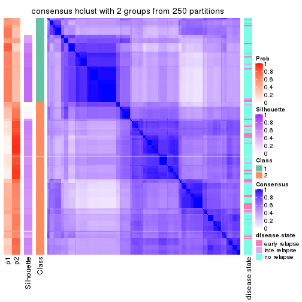</p>

</div>
<div id='tab-CV-hclust-consensus-heatmap-2'>
<pre><code class="r">consensus_heatmap(res, k = 3)
</code></pre>

<p>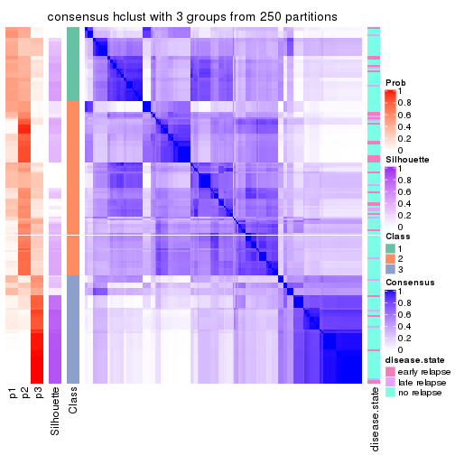</p>

</div>
<div id='tab-CV-hclust-consensus-heatmap-3'>
<pre><code class="r">consensus_heatmap(res, k = 4)
</code></pre>

<p>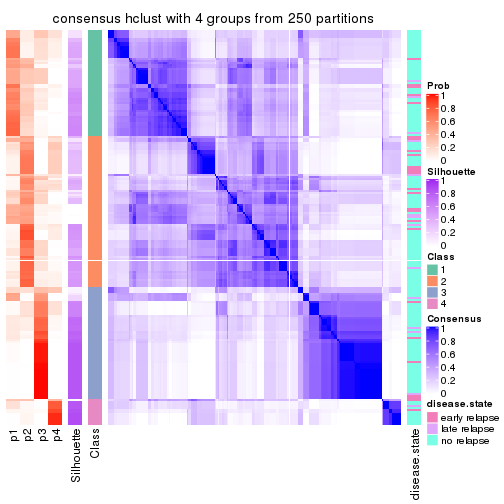</p>

</div>
<div id='tab-CV-hclust-consensus-heatmap-4'>
<pre><code class="r">consensus_heatmap(res, k = 5)
</code></pre>

<p>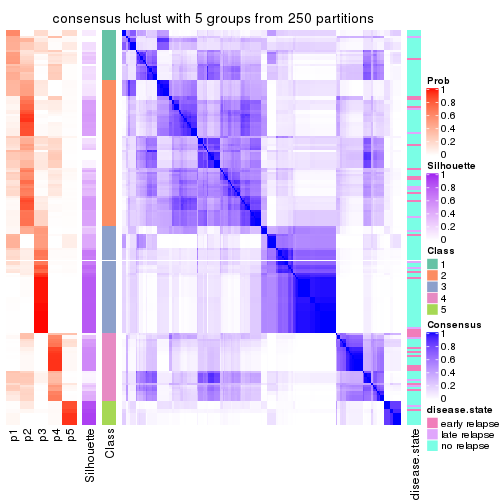</p>

</div>
<div id='tab-CV-hclust-consensus-heatmap-5'>
<pre><code class="r">consensus_heatmap(res, k = 6)
</code></pre>

<p>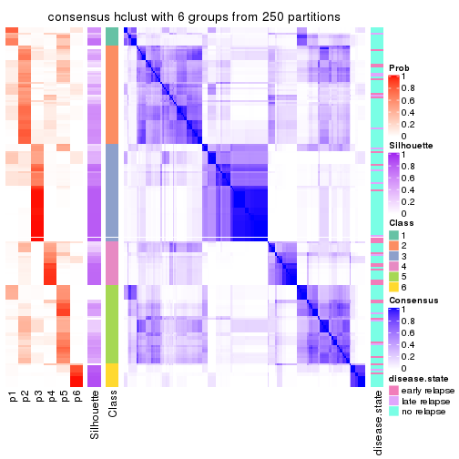</p>

</div>
</div>

Heatmaps for the membership of samples in all partitions to see how consistent they are:


<script>
$( function() {
	$( '#tabs-CV-hclust-membership-heatmap' ).tabs();
} );
</script>
<div id='tabs-CV-hclust-membership-heatmap'>
<ul>
<li><a href='#tab-CV-hclust-membership-heatmap-1'>k = 2</a></li>
<li><a href='#tab-CV-hclust-membership-heatmap-2'>k = 3</a></li>
<li><a href='#tab-CV-hclust-membership-heatmap-3'>k = 4</a></li>
<li><a href='#tab-CV-hclust-membership-heatmap-4'>k = 5</a></li>
<li><a href='#tab-CV-hclust-membership-heatmap-5'>k = 6</a></li>
</ul>
<div id='tab-CV-hclust-membership-heatmap-1'>
<pre><code class="r">membership_heatmap(res, k = 2)
</code></pre>

<p>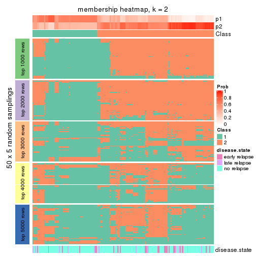</p>

</div>
<div id='tab-CV-hclust-membership-heatmap-2'>
<pre><code class="r">membership_heatmap(res, k = 3)
</code></pre>

<p>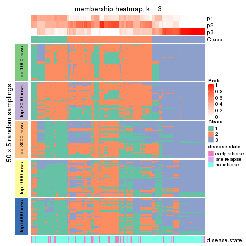</p>

</div>
<div id='tab-CV-hclust-membership-heatmap-3'>
<pre><code class="r">membership_heatmap(res, k = 4)
</code></pre>

<p>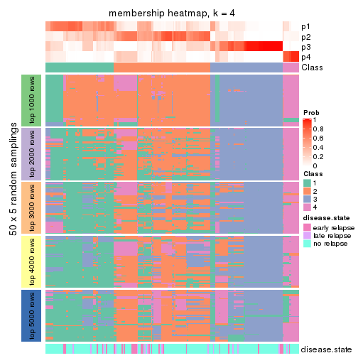</p>

</div>
<div id='tab-CV-hclust-membership-heatmap-4'>
<pre><code class="r">membership_heatmap(res, k = 5)
</code></pre>

<p>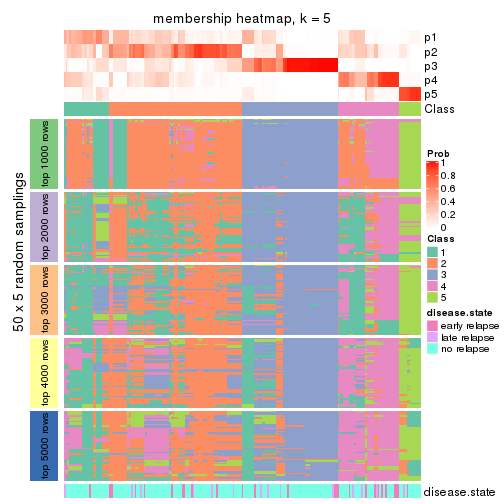</p>

</div>
<div id='tab-CV-hclust-membership-heatmap-5'>
<pre><code class="r">membership_heatmap(res, k = 6)
</code></pre>

<p>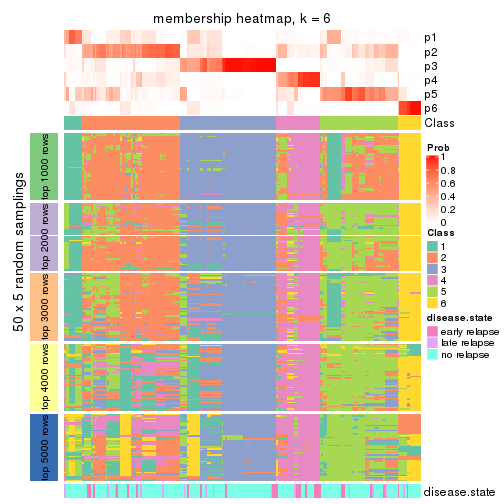</p>

</div>
</div>

As soon as we have had the classes for columns, we can look for signatures
which are significantly different between classes which can be candidate marks
for certain classes. Following are the heatmaps for signatures.


Signature heatmaps where rows are scaled:


<script>
$( function() {
	$( '#tabs-CV-hclust-get-signatures' ).tabs();
} );
</script>
<div id='tabs-CV-hclust-get-signatures'>
<ul>
<li><a href='#tab-CV-hclust-get-signatures-1'>k = 2</a></li>
<li><a href='#tab-CV-hclust-get-signatures-2'>k = 3</a></li>
<li><a href='#tab-CV-hclust-get-signatures-3'>k = 4</a></li>
<li><a href='#tab-CV-hclust-get-signatures-4'>k = 5</a></li>
<li><a href='#tab-CV-hclust-get-signatures-5'>k = 6</a></li>
</ul>
<div id='tab-CV-hclust-get-signatures-1'>
<pre><code class="r">get_signatures(res, k = 2)
</code></pre>

<p>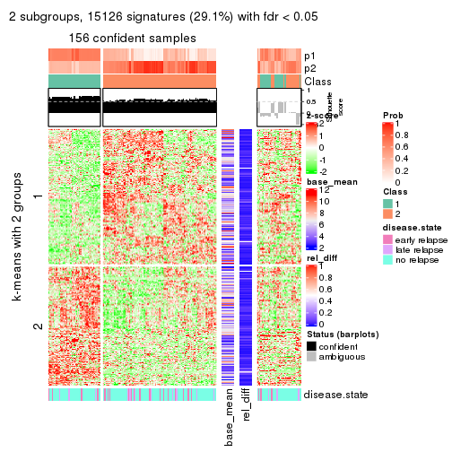</p>

</div>
<div id='tab-CV-hclust-get-signatures-2'>
<pre><code class="r">get_signatures(res, k = 3)
</code></pre>

<p></p>

</div>
<div id='tab-CV-hclust-get-signatures-3'>
<pre><code class="r">get_signatures(res, k = 4)
</code></pre>

<p>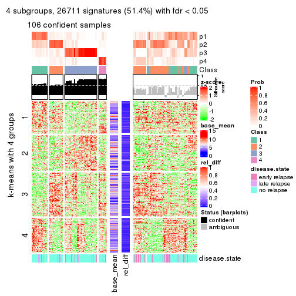</p>

</div>
<div id='tab-CV-hclust-get-signatures-4'>
<pre><code class="r">get_signatures(res, k = 5)
</code></pre>

<p>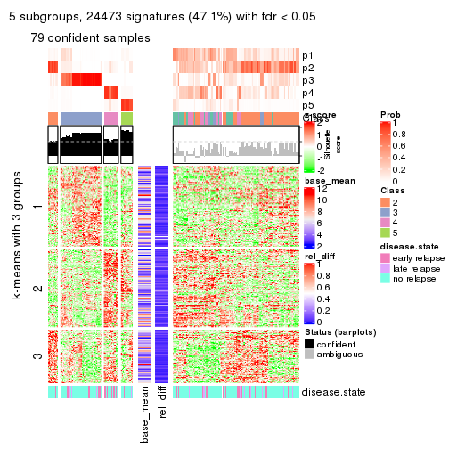</p>

</div>
<div id='tab-CV-hclust-get-signatures-5'>
<pre><code class="r">get_signatures(res, k = 6)
</code></pre>

<p>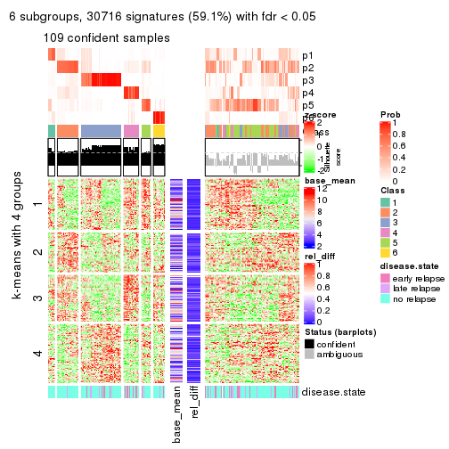</p>

</div>
</div>


Signature heatmaps where rows are not scaled:


<script>
$( function() {
	$( '#tabs-CV-hclust-get-signatures-no-scale' ).tabs();
} );
</script>
<div id='tabs-CV-hclust-get-signatures-no-scale'>
<ul>
<li><a href='#tab-CV-hclust-get-signatures-no-scale-1'>k = 2</a></li>
<li><a href='#tab-CV-hclust-get-signatures-no-scale-2'>k = 3</a></li>
<li><a href='#tab-CV-hclust-get-signatures-no-scale-3'>k = 4</a></li>
<li><a href='#tab-CV-hclust-get-signatures-no-scale-4'>k = 5</a></li>
<li><a href='#tab-CV-hclust-get-signatures-no-scale-5'>k = 6</a></li>
</ul>
<div id='tab-CV-hclust-get-signatures-no-scale-1'>
<pre><code class="r">get_signatures(res, k = 2, scale_rows = FALSE)
</code></pre>

<p>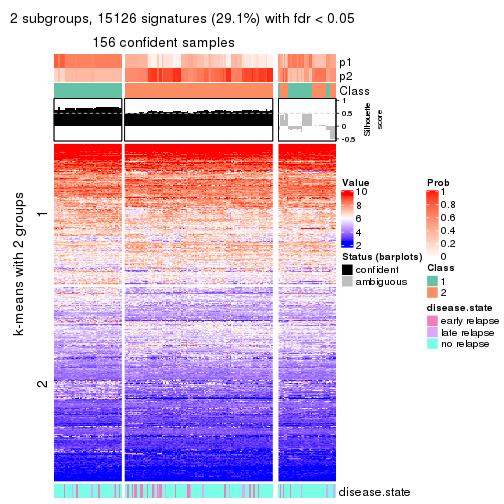</p>

</div>
<div id='tab-CV-hclust-get-signatures-no-scale-2'>
<pre><code class="r">get_signatures(res, k = 3, scale_rows = FALSE)
</code></pre>

<p></p>

</div>
<div id='tab-CV-hclust-get-signatures-no-scale-3'>
<pre><code class="r">get_signatures(res, k = 4, scale_rows = FALSE)
</code></pre>

<p>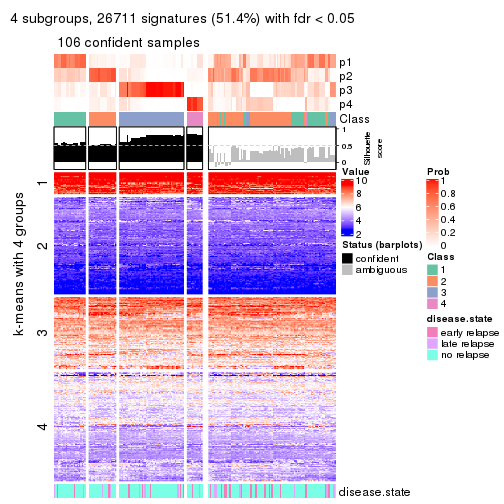</p>

</div>
<div id='tab-CV-hclust-get-signatures-no-scale-4'>
<pre><code class="r">get_signatures(res, k = 5, scale_rows = FALSE)
</code></pre>

<p>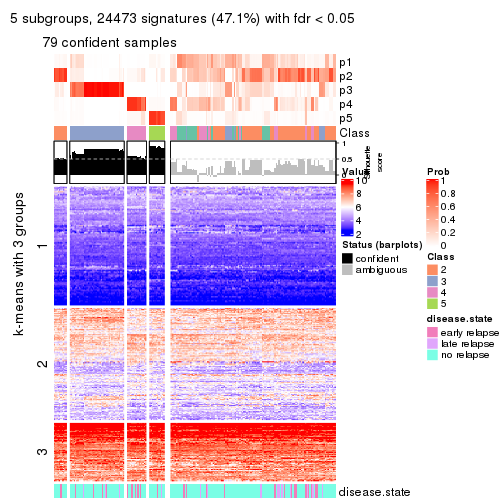</p>

</div>
<div id='tab-CV-hclust-get-signatures-no-scale-5'>
<pre><code class="r">get_signatures(res, k = 6, scale_rows = FALSE)
</code></pre>

<p>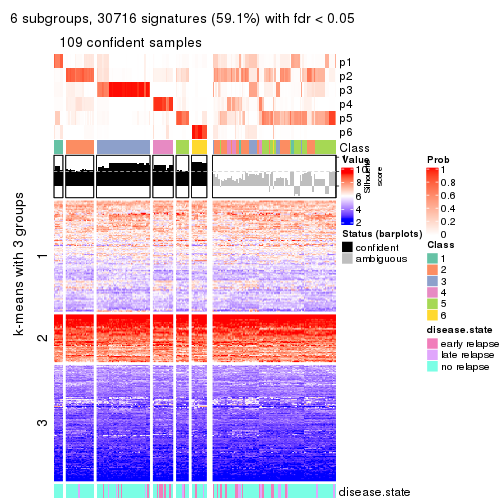</p>

</div>
</div>


Compare the overlap of signatures from different k:

```r
compare_signatures(res)
```

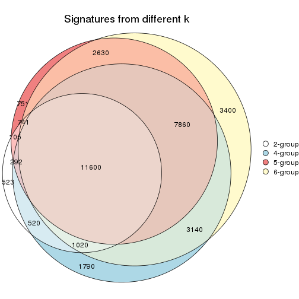

`get_signature()` returns a data frame invisibly. TO get the list of signatures, the function
call should be assigned to a variable explicitly. In following code, if `plot` argument is set
to `FALSE`, no heatmap is plotted while only the differential analysis is performed.

```r
# code only for demonstration
tb = get_signature(res, k = ..., plot = FALSE)
```

An example of the output of `tb` is:

```
#>   which_row         fdr    mean_1    mean_2 scaled_mean_1 scaled_mean_2 km
#> 1        38 0.042760348  8.373488  9.131774    -0.5533452     0.5164555  1
#> 2        40 0.018707592  7.106213  8.469186    -0.6173731     0.5762149  1
#> 3        55 0.019134737 10.221463 11.207825    -0.6159697     0.5749050  1
#> 4        59 0.006059896  5.921854  7.869574    -0.6899429     0.6439467  1
#> 5        60 0.018055526  8.928898 10.211722    -0.6204761     0.5791110  1
#> 6        98 0.009384629 15.714769 14.887706     0.6635654    -0.6193277  2
...
```

The columns in `tb` are:

1. `which_row`: row indices corresponding to the input matrix.
2. `fdr`: FDR for the differential test. 
3. `mean_x`: The mean value in group x.
4. `scaled_mean_x`: The mean value in group x after rows are scaled.
5. `km`: Row groups if k-means clustering is applied to rows.


UMAP plot which shows how samples are separated.


<script>
$( function() {
	$( '#tabs-CV-hclust-dimension-reduction' ).tabs();
} );
</script>
<div id='tabs-CV-hclust-dimension-reduction'>
<ul>
<li><a href='#tab-CV-hclust-dimension-reduction-1'>k = 2</a></li>
<li><a href='#tab-CV-hclust-dimension-reduction-2'>k = 3</a></li>
<li><a href='#tab-CV-hclust-dimension-reduction-3'>k = 4</a></li>
<li><a href='#tab-CV-hclust-dimension-reduction-4'>k = 5</a></li>
<li><a href='#tab-CV-hclust-dimension-reduction-5'>k = 6</a></li>
</ul>
<div id='tab-CV-hclust-dimension-reduction-1'>
<pre><code class="r">dimension_reduction(res, k = 2, method = &quot;UMAP&quot;)
</code></pre>

<p>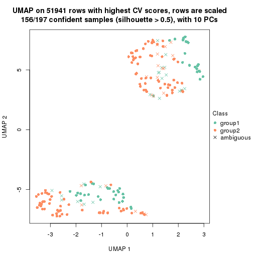</p>

</div>
<div id='tab-CV-hclust-dimension-reduction-2'>
<pre><code class="r">dimension_reduction(res, k = 3, method = &quot;UMAP&quot;)
</code></pre>

<p>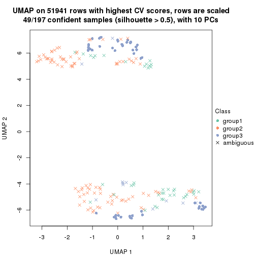</p>

</div>
<div id='tab-CV-hclust-dimension-reduction-3'>
<pre><code class="r">dimension_reduction(res, k = 4, method = &quot;UMAP&quot;)
</code></pre>

<p>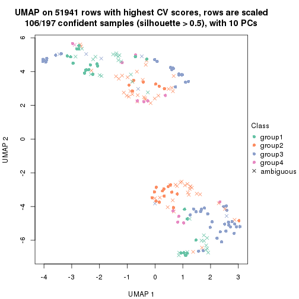</p>

</div>
<div id='tab-CV-hclust-dimension-reduction-4'>
<pre><code class="r">dimension_reduction(res, k = 5, method = &quot;UMAP&quot;)
</code></pre>

<p>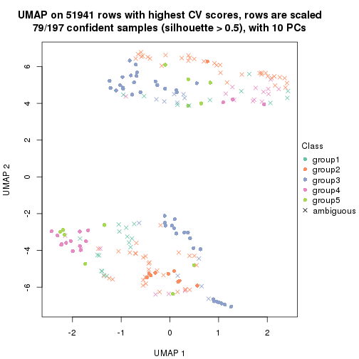</p>

</div>
<div id='tab-CV-hclust-dimension-reduction-5'>
<pre><code class="r">dimension_reduction(res, k = 6, method = &quot;UMAP&quot;)
</code></pre>

<p>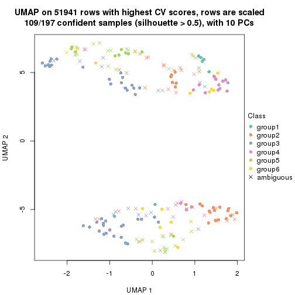</p>

</div>
</div>


Following heatmap shows how subgroups are split when increasing `k`:

```r
collect_classes(res)
```

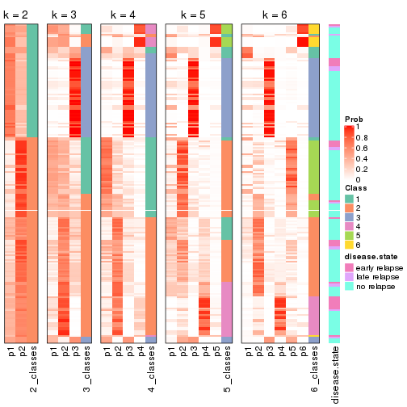


Test correlation between subgroups and known annotations. If the known
annotation is numeric, one-way ANOVA test is applied, and if the known
annotation is discrete, chi-squared contingency table test is applied.

```r
test_to_known_factors(res)
```

```
#>             n disease.state(p) k
#> CV:hclust 156           0.5069 2
#> CV:hclust  49               NA 3
#> CV:hclust 106           0.9922 4
#> CV:hclust  79           0.1108 5
#> CV:hclust 109           0.0727 6
```


If matrix rows can be associated to genes, consider to use `functional_enrichment(res,
...)` to perform function enrichment for the signature genes. See [this vignette](http://bioconductor.org/packages/devel/bioc/vignettes/cola/inst/doc/functional_enrichment.html) for more detailed explanations.


 

---------------------------------------------------


### CV:kmeans


The object with results only for a single top-value method and a single partition method 
can be extracted as:

```r
res = res_list["CV", "kmeans"]
# you can also extract it by
# res = res_list["CV:kmeans"]
```

A summary of `res` and all the functions that can be applied to it:

```r
res
```

```
#> A 'ConsensusPartition' object with k = 2, 3, 4, 5, 6.
#>   On a matrix with 51941 rows and 197 columns.
#>   Top rows (1000, 2000, 3000, 4000, 5000) are extracted by 'CV' method.
#>   Subgroups are detected by 'kmeans' method.
#>   Performed in total 1250 partitions by row resampling.
#>   Best k for subgroups seems to be 2.
#> 
#> Following methods can be applied to this 'ConsensusPartition' object:
#>  [1] "cola_report"             "collect_classes"         "collect_plots"          
#>  [4] "collect_stats"           "colnames"                "compare_signatures"     
#>  [7] "consensus_heatmap"       "dimension_reduction"     "functional_enrichment"  
#> [10] "get_anno_col"            "get_anno"                "get_classes"            
#> [13] "get_consensus"           "get_matrix"              "get_membership"         
#> [16] "get_param"               "get_signatures"          "get_stats"              
#> [19] "is_best_k"               "is_stable_k"             "membership_heatmap"     
#> [22] "ncol"                    "nrow"                    "plot_ecdf"              
#> [25] "rownames"                "select_partition_number" "show"                   
#> [28] "suggest_best_k"          "test_to_known_factors"
```

`collect_plots()` function collects all the plots made from `res` for all `k` (number of partitions)
into one single page to provide an easy and fast comparison between different `k`.

```r
collect_plots(res)
```

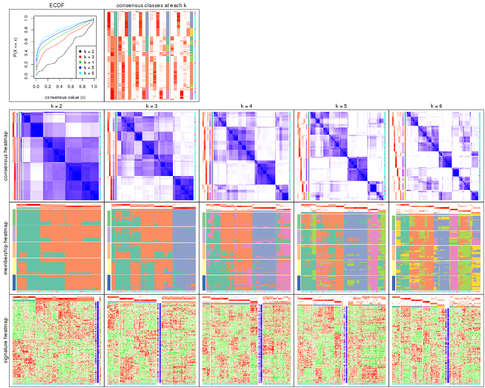

The plots are:

- The first row: a plot of the ECDF (empirical cumulative distribution
  function) curves of the consensus matrix for each `k` and the heatmap of
  predicted classes for each `k`.
- The second row: heatmaps of the consensus matrix for each `k`.
- The third row: heatmaps of the membership matrix for each `k`.
- The fouth row: heatmaps of the signatures for each `k`.

All the plots in panels can be made by individual functions and they are
plotted later in this section.

`select_partition_number()` produces several plots showing different
statistics for choosing "optimized" `k`. There are following statistics:

- ECDF curves of the consensus matrix for each `k`;
- 1-PAC. [The PAC
  score](https://en.wikipedia.org/wiki/Consensus_clustering#Over-interpretation_potential_of_consensus_clustering)
  measures the proportion of the ambiguous subgrouping.
- Mean silhouette score.
- Concordance. The mean probability of fiting the consensus class ids in all
  partitions.
- Area increased. Denote $A_k$ as the area under the ECDF curve for current
  `k`, the area increased is defined as $A_k - A_{k-1}$.
- Rand index. The percent of pairs of samples that are both in a same cluster
  or both are not in a same cluster in the partition of k and k-1.
- Jaccard index. The ratio of pairs of samples are both in a same cluster in
  the partition of k and k-1 and the pairs of samples are both in a same
  cluster in the partition k or k-1.

The detailed explanations of these statistics can be found in [the _cola_
vignette](http://bioconductor.org/packages/devel/bioc/vignettes/cola/inst/doc/cola.html#toc_13).

Generally speaking, lower PAC score, higher mean silhouette score or higher
concordance corresponds to better partition. Rand index and Jaccard index
measure how similar the current partition is compared to partition with `k-1`.
If they are too similar, we won't accept `k` is better than `k-1`.

```r
select_partition_number(res)
```

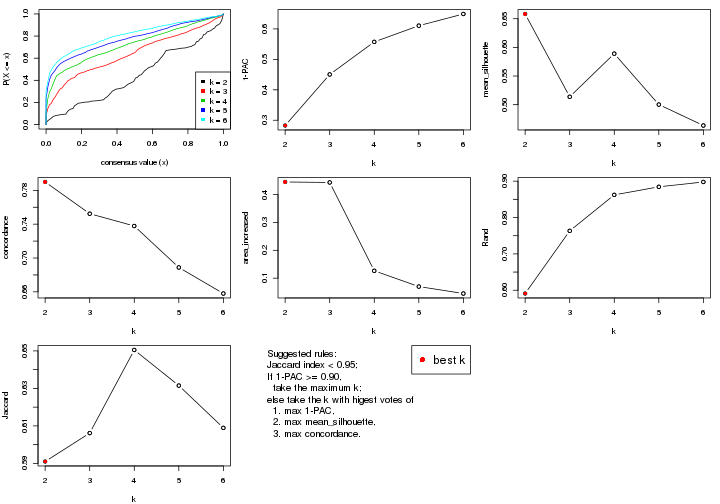

The numeric values for all these statistics can be obtained by `get_stats()`.

```r
get_stats(res)
```

```
#>   k 1-PAC mean_silhouette concordance area_increased  Rand Jaccard
#> 2 2 0.283           0.658       0.790         0.4452 0.591   0.591
#> 3 3 0.450           0.514       0.752         0.4435 0.763   0.606
#> 4 4 0.557           0.589       0.738         0.1264 0.862   0.650
#> 5 5 0.611           0.500       0.689         0.0699 0.884   0.632
#> 6 6 0.649           0.464       0.658         0.0449 0.898   0.609
```

`suggest_best_k()` suggests the best $k$ based on these statistics. The rules are as follows:

- All $k$ with Jaccard index larger than 0.95 are removed because increasing
  $k$ does not provide enough extra information. If all $k$ are removed, it is
  marked as no subgroup is detected.
- For all $k$ with 1-PAC score larger than 0.9, the maximal $k$ is taken as
  the best $k$, and other $k$ are marked as optional $k$.
- If it does not fit the second rule. The $k$ with the maximal vote of the
  highest 1-PAC score, highest mean silhouette, and highest concordance is
  taken as the best $k$.

```r
suggest_best_k(res)
```

```
#> [1] 2
```


Following shows the table of the partitions (You need to click the **show/hide
code output** link to see it). The membership matrix (columns with name `p*`)
is inferred by
[`clue::cl_consensus()`](https://www.rdocumentation.org/link/cl_consensus?package=clue)
function with the `SE` method. Basically the value in the membership matrix
represents the probability to belong to a certain group. The finall class
label for an item is determined with the group with highest probability it
belongs to.

In `get_classes()` function, the entropy is calculated from the membership
matrix and the silhouette score is calculated from the consensus matrix.


<script>
$( function() {
	$( '#tabs-CV-kmeans-get-classes' ).tabs();
} );
</script>
<div id='tabs-CV-kmeans-get-classes'>
<ul>
<li><a href='#tab-CV-kmeans-get-classes-1'>k = 2</a></li>
<li><a href='#tab-CV-kmeans-get-classes-2'>k = 3</a></li>
<li><a href='#tab-CV-kmeans-get-classes-3'>k = 4</a></li>
<li><a href='#tab-CV-kmeans-get-classes-4'>k = 5</a></li>
<li><a href='#tab-CV-kmeans-get-classes-5'>k = 6</a></li>
</ul>

<div id='tab-CV-kmeans-get-classes-1'>
<p><a id='tab-CV-kmeans-get-classes-1-a' style='color:#0366d6' href='#'>show/hide code output</a></p>
<pre><code class="r">cbind(get_classes(res, k = 2), get_membership(res, k = 2))
</code></pre>

<pre><code>#&gt;           class entropy silhouette    p1    p2
#&gt; GSM342319     2  0.9248      0.585 0.340 0.660
#&gt; GSM342323     2  0.0000      0.722 0.000 1.000
#&gt; GSM342325     2  0.9248      0.585 0.340 0.660
#&gt; GSM342326     2  0.0000      0.722 0.000 1.000
#&gt; GSM342327     2  0.0000      0.722 0.000 1.000
#&gt; GSM342329     2  0.0000      0.722 0.000 1.000
#&gt; GSM342331     2  0.0000      0.722 0.000 1.000
#&gt; GSM342334     2  0.2778      0.730 0.048 0.952
#&gt; GSM342335     2  0.5059      0.720 0.112 0.888
#&gt; GSM342354     1  0.7528      0.686 0.784 0.216
#&gt; GSM342371     2  0.5408      0.722 0.124 0.876
#&gt; GSM342380     2  0.9358      0.589 0.352 0.648
#&gt; GSM342382     2  0.9933      0.553 0.452 0.548
#&gt; GSM342399     2  0.9248      0.585 0.340 0.660
#&gt; GSM342402     2  0.9248      0.585 0.340 0.660
#&gt; GSM342404     2  0.5178      0.719 0.116 0.884
#&gt; GSM342408     1  0.9286      0.582 0.656 0.344
#&gt; GSM342409     2  0.5737      0.721 0.136 0.864
#&gt; GSM342426     2  0.0672      0.721 0.008 0.992
#&gt; GSM342441     1  0.8081      0.660 0.752 0.248
#&gt; GSM342444     1  0.0000      0.778 1.000 0.000
#&gt; GSM342451     1  0.0000      0.778 1.000 0.000
#&gt; GSM342462     2  0.6343      0.697 0.160 0.840
#&gt; GSM342467     2  0.5629      0.713 0.132 0.868
#&gt; GSM342484     2  0.9608      0.567 0.384 0.616
#&gt; GSM342491     2  0.2778      0.713 0.048 0.952
#&gt; GSM342322     2  0.9129      0.594 0.328 0.672
#&gt; GSM342338     1  0.0672      0.775 0.992 0.008
#&gt; GSM342347     1  0.9358      0.582 0.648 0.352
#&gt; GSM342356     1  0.2043      0.753 0.968 0.032
#&gt; GSM342357     2  0.9248      0.585 0.340 0.660
#&gt; GSM342366     2  0.5519      0.723 0.128 0.872
#&gt; GSM342385     2  0.9358      0.589 0.352 0.648
#&gt; GSM342421     2  0.4298      0.727 0.088 0.912
#&gt; GSM342437     2  0.2423      0.725 0.040 0.960
#&gt; GSM342454     1  0.0000      0.778 1.000 0.000
#&gt; GSM342471     2  0.1414      0.727 0.020 0.980
#&gt; GSM342477     2  0.1633      0.724 0.024 0.976
#&gt; GSM342495     2  0.6343      0.697 0.160 0.840
#&gt; GSM342496     1  1.0000     -0.521 0.500 0.500
#&gt; GSM342320     2  0.0000      0.722 0.000 1.000
#&gt; GSM342321     2  0.0000      0.722 0.000 1.000
#&gt; GSM342324     2  0.0000      0.722 0.000 1.000
#&gt; GSM342328     2  0.0000      0.722 0.000 1.000
#&gt; GSM342330     2  0.0000      0.722 0.000 1.000
#&gt; GSM342332     2  0.0000      0.722 0.000 1.000
#&gt; GSM342333     2  0.5059      0.720 0.112 0.888
#&gt; GSM342336     2  0.1633      0.728 0.024 0.976
#&gt; GSM342337     1  0.1843      0.757 0.972 0.028
#&gt; GSM342339     1  0.0376      0.778 0.996 0.004
#&gt; GSM342340     1  0.0672      0.775 0.992 0.008
#&gt; GSM342341     1  0.0376      0.778 0.996 0.004
#&gt; GSM342342     1  0.0376      0.778 0.996 0.004
#&gt; GSM342343     1  0.0672      0.775 0.992 0.008
#&gt; GSM342344     1  0.0376      0.778 0.996 0.004
#&gt; GSM342345     1  0.0376      0.778 0.996 0.004
#&gt; GSM342346     2  0.5178      0.718 0.116 0.884
#&gt; GSM342348     2  0.9427      0.591 0.360 0.640
#&gt; GSM342349     1  0.9170      0.600 0.668 0.332
#&gt; GSM342350     1  0.9170      0.600 0.668 0.332
#&gt; GSM342351     1  0.9209      0.595 0.664 0.336
#&gt; GSM342352     1  0.9170      0.600 0.668 0.332
#&gt; GSM342353     1  0.0376      0.778 0.996 0.004
#&gt; GSM342355     1  0.2778      0.735 0.952 0.048
#&gt; GSM342358     2  0.0000      0.722 0.000 1.000
#&gt; GSM342359     2  0.0000      0.722 0.000 1.000
#&gt; GSM342360     2  0.0000      0.722 0.000 1.000
#&gt; GSM342361     2  0.0376      0.721 0.004 0.996
#&gt; GSM342362     2  0.8267      0.637 0.260 0.740
#&gt; GSM342363     2  0.9248      0.585 0.340 0.660
#&gt; GSM342364     2  0.9635      0.611 0.388 0.612
#&gt; GSM342365     2  0.5059      0.720 0.112 0.888
#&gt; GSM342367     2  0.9933      0.553 0.452 0.548
#&gt; GSM342368     2  0.9427      0.630 0.360 0.640
#&gt; GSM342369     2  0.5059      0.720 0.112 0.888
#&gt; GSM342370     2  0.5059      0.720 0.112 0.888
#&gt; GSM342372     2  0.5059      0.720 0.112 0.888
#&gt; GSM342373     2  0.5408      0.722 0.124 0.876
#&gt; GSM342374     2  0.5059      0.720 0.112 0.888
#&gt; GSM342375     2  0.5059      0.720 0.112 0.888
#&gt; GSM342376     2  0.9933      0.553 0.452 0.548
#&gt; GSM342377     2  0.9933      0.553 0.452 0.548
#&gt; GSM342378     2  0.9427      0.591 0.360 0.640
#&gt; GSM342379     2  0.9129      0.594 0.328 0.672
#&gt; GSM342381     2  0.9933      0.553 0.452 0.548
#&gt; GSM342383     2  0.9323      0.588 0.348 0.652
#&gt; GSM342384     2  0.9933      0.553 0.452 0.548
#&gt; GSM342386     2  0.9933      0.553 0.452 0.548
#&gt; GSM342387     2  0.1414      0.727 0.020 0.980
#&gt; GSM342388     1  0.0672      0.775 0.992 0.008
#&gt; GSM342389     2  0.9933      0.553 0.452 0.548
#&gt; GSM342390     2  0.9427      0.591 0.360 0.640
#&gt; GSM342391     2  0.9427      0.591 0.360 0.640
#&gt; GSM342392     1  0.0376      0.778 0.996 0.004
#&gt; GSM342393     2  0.5294      0.718 0.120 0.880
#&gt; GSM342394     2  0.9427      0.591 0.360 0.640
#&gt; GSM342395     2  0.5519      0.723 0.128 0.872
#&gt; GSM342396     1  0.0376      0.778 0.996 0.004
#&gt; GSM342397     1  0.9170      0.600 0.668 0.332
#&gt; GSM342398     2  0.9933      0.553 0.452 0.548
#&gt; GSM342400     2  0.9933      0.553 0.452 0.548
#&gt; GSM342401     1  0.0376      0.778 0.996 0.004
#&gt; GSM342403     2  0.9933      0.553 0.452 0.548
#&gt; GSM342405     2  0.8861      0.440 0.304 0.696
#&gt; GSM342406     2  0.9427      0.591 0.360 0.640
#&gt; GSM342407     1  0.9170      0.600 0.668 0.332
#&gt; GSM342410     2  0.9427      0.591 0.360 0.640
#&gt; GSM342411     2  0.1414      0.727 0.020 0.980
#&gt; GSM342412     2  0.0938      0.726 0.012 0.988
#&gt; GSM342413     2  0.1414      0.727 0.020 0.980
#&gt; GSM342414     1  0.9129      0.600 0.672 0.328
#&gt; GSM342415     2  0.9608      0.613 0.384 0.616
#&gt; GSM342416     2  0.9427      0.591 0.360 0.640
#&gt; GSM342417     2  0.0000      0.722 0.000 1.000
#&gt; GSM342418     2  0.0000      0.722 0.000 1.000
#&gt; GSM342419     2  0.9427      0.591 0.360 0.640
#&gt; GSM342420     2  0.0000      0.722 0.000 1.000
#&gt; GSM342422     2  0.9933      0.553 0.452 0.548
#&gt; GSM342423     2  0.5059      0.720 0.112 0.888
#&gt; GSM342424     2  0.0000      0.722 0.000 1.000
#&gt; GSM342425     2  0.0672      0.721 0.008 0.992
#&gt; GSM342427     2  0.3733      0.729 0.072 0.928
#&gt; GSM342428     2  0.1843      0.727 0.028 0.972
#&gt; GSM342429     2  0.4431      0.723 0.092 0.908
#&gt; GSM342430     1  0.0000      0.778 1.000 0.000
#&gt; GSM342431     1  0.0000      0.778 1.000 0.000
#&gt; GSM342432     1  0.0000      0.778 1.000 0.000
#&gt; GSM342433     1  0.9129      0.600 0.672 0.328
#&gt; GSM342434     1  0.9248      0.582 0.660 0.340
#&gt; GSM342435     1  0.9129      0.600 0.672 0.328
#&gt; GSM342436     1  0.8081      0.660 0.752 0.248
#&gt; GSM342438     1  0.0000      0.778 1.000 0.000
#&gt; GSM342439     1  0.0000      0.778 1.000 0.000
#&gt; GSM342440     1  0.7219      0.691 0.800 0.200
#&gt; GSM342442     1  0.0000      0.778 1.000 0.000
#&gt; GSM342443     2  0.6343      0.697 0.160 0.840
#&gt; GSM342445     1  0.7219      0.691 0.800 0.200
#&gt; GSM342446     1  0.0000      0.778 1.000 0.000
#&gt; GSM342447     1  0.0376      0.778 0.996 0.004
#&gt; GSM342448     1  0.9129      0.600 0.672 0.328
#&gt; GSM342449     1  0.0000      0.778 1.000 0.000
#&gt; GSM342450     1  0.9129      0.600 0.672 0.328
#&gt; GSM342452     1  0.0000      0.778 1.000 0.000
#&gt; GSM342453     1  0.0000      0.778 1.000 0.000
#&gt; GSM342455     1  0.0000      0.778 1.000 0.000
#&gt; GSM342456     2  0.0376      0.721 0.004 0.996
#&gt; GSM342457     2  0.9635      0.611 0.388 0.612
#&gt; GSM342458     2  0.5294      0.718 0.120 0.880
#&gt; GSM342459     2  0.6343      0.697 0.160 0.840
#&gt; GSM342460     2  0.6343      0.697 0.160 0.840
#&gt; GSM342461     2  0.6712      0.699 0.176 0.824
#&gt; GSM342463     2  1.0000      0.509 0.500 0.500
#&gt; GSM342464     1  1.0000     -0.521 0.500 0.500
#&gt; GSM342465     2  1.0000      0.512 0.496 0.504
#&gt; GSM342466     2  0.9427      0.591 0.360 0.640
#&gt; GSM342468     2  0.5059      0.720 0.112 0.888
#&gt; GSM342469     2  0.9427      0.591 0.360 0.640
#&gt; GSM342470     2  0.1633      0.727 0.024 0.976
#&gt; GSM342472     2  0.6343      0.697 0.160 0.840
#&gt; GSM342473     2  0.6712      0.699 0.176 0.824
#&gt; GSM342474     2  0.6712      0.699 0.176 0.824
#&gt; GSM342475     1  0.7219      0.691 0.800 0.200
#&gt; GSM342476     2  0.6343      0.697 0.160 0.840
#&gt; GSM342478     2  0.6712      0.699 0.176 0.824
#&gt; GSM342479     2  0.3879      0.721 0.076 0.924
#&gt; GSM342480     2  0.6343      0.697 0.160 0.840
#&gt; GSM342481     2  0.6712      0.699 0.176 0.824
#&gt; GSM342482     2  0.6343      0.697 0.160 0.840
#&gt; GSM342483     2  0.6712      0.699 0.176 0.824
#&gt; GSM342485     2  1.0000      0.512 0.496 0.504
#&gt; GSM342486     2  1.0000      0.512 0.496 0.504
#&gt; GSM342487     1  0.9129      0.600 0.672 0.328
#&gt; GSM342488     2  0.6343      0.697 0.160 0.840
#&gt; GSM342489     2  0.6343      0.697 0.160 0.840
#&gt; GSM342490     2  0.3431      0.717 0.064 0.936
#&gt; GSM342492     1  0.9129      0.600 0.672 0.328
#&gt; GSM342493     2  1.0000      0.512 0.496 0.504
#&gt; GSM342494     2  0.6343      0.697 0.160 0.840
#&gt; GSM342497     2  0.6343      0.697 0.160 0.840
#&gt; GSM342498     2  0.9552      0.585 0.376 0.624
#&gt; GSM342499     2  0.9427      0.591 0.360 0.640
#&gt; GSM342500     2  0.6343      0.697 0.160 0.840
#&gt; GSM342501     2  0.9795      0.562 0.416 0.584
#&gt; GSM342502     2  0.9866      0.580 0.432 0.568
#&gt; GSM342503     2  0.6712      0.699 0.176 0.824
#&gt; GSM342504     2  0.6712      0.699 0.176 0.824
#&gt; GSM342505     1  0.0000      0.778 1.000 0.000
#&gt; GSM342506     2  0.9580      0.583 0.380 0.620
#&gt; GSM342507     2  0.9248      0.585 0.340 0.660
#&gt; GSM342508     2  0.9427      0.591 0.360 0.640
#&gt; GSM342509     2  0.9608      0.567 0.384 0.616
#&gt; GSM342510     2  0.2603      0.714 0.044 0.956
#&gt; GSM342511     2  0.8763      0.478 0.296 0.704
#&gt; GSM342512     2  1.0000      0.512 0.496 0.504
#&gt; GSM342513     2  1.0000      0.512 0.496 0.504
#&gt; GSM342514     2  0.6438      0.634 0.164 0.836
#&gt; GSM342515     2  0.9427      0.591 0.360 0.640
</code></pre>

<script>
$('#tab-CV-kmeans-get-classes-1-a').parent().next().next().hide();
$('#tab-CV-kmeans-get-classes-1-a').click(function(){
  $('#tab-CV-kmeans-get-classes-1-a').parent().next().next().toggle();
  return(false);
});
</script>
</div>

<div id='tab-CV-kmeans-get-classes-2'>
<p><a id='tab-CV-kmeans-get-classes-2-a' style='color:#0366d6' href='#'>show/hide code output</a></p>
<pre><code class="r">cbind(get_classes(res, k = 3), get_membership(res, k = 3))
</code></pre>

<pre><code>#&gt;           class entropy silhouette    p1    p2    p3
#&gt; GSM342319     1  0.5236    0.56778 0.804 0.168 0.028
#&gt; GSM342323     2  0.6154    0.07940 0.408 0.592 0.000
#&gt; GSM342325     1  0.5292    0.56564 0.800 0.172 0.028
#&gt; GSM342326     2  0.6079    0.10743 0.388 0.612 0.000
#&gt; GSM342327     2  0.6079    0.10743 0.388 0.612 0.000
#&gt; GSM342329     2  0.6154    0.07940 0.408 0.592 0.000
#&gt; GSM342331     2  0.6079    0.10743 0.388 0.612 0.000
#&gt; GSM342334     2  0.3573    0.46912 0.120 0.876 0.004
#&gt; GSM342335     2  0.6051    0.38262 0.292 0.696 0.012
#&gt; GSM342354     3  0.3120    0.89222 0.012 0.080 0.908
#&gt; GSM342371     2  0.6600    0.30035 0.384 0.604 0.012
#&gt; GSM342380     1  0.6937    0.41967 0.680 0.272 0.048
#&gt; GSM342382     2  0.7819    0.19776 0.440 0.508 0.052
#&gt; GSM342399     1  0.5637    0.56049 0.788 0.172 0.040
#&gt; GSM342402     1  0.1832    0.65462 0.956 0.036 0.008
#&gt; GSM342404     2  0.0747    0.54799 0.000 0.984 0.016
#&gt; GSM342408     3  0.5536    0.73666 0.012 0.236 0.752
#&gt; GSM342409     2  0.6832    0.31815 0.376 0.604 0.020
#&gt; GSM342426     2  0.6062    0.11295 0.384 0.616 0.000
#&gt; GSM342441     3  0.2116    0.90077 0.012 0.040 0.948
#&gt; GSM342444     3  0.2486    0.89026 0.060 0.008 0.932
#&gt; GSM342451     3  0.2384    0.89141 0.056 0.008 0.936
#&gt; GSM342462     2  0.4357    0.54033 0.052 0.868 0.080
#&gt; GSM342467     2  0.2050    0.54591 0.020 0.952 0.028
#&gt; GSM342484     1  0.3572    0.63497 0.900 0.040 0.060
#&gt; GSM342491     2  0.8019    0.14579 0.348 0.576 0.076
#&gt; GSM342322     1  0.4749    0.56806 0.816 0.172 0.012
#&gt; GSM342338     3  0.2772    0.87958 0.080 0.004 0.916
#&gt; GSM342347     3  0.3918    0.86936 0.012 0.120 0.868
#&gt; GSM342356     3  0.5690    0.62760 0.288 0.004 0.708
#&gt; GSM342357     1  0.1832    0.65462 0.956 0.036 0.008
#&gt; GSM342366     2  0.6701    0.27378 0.412 0.576 0.012
#&gt; GSM342385     1  0.6937    0.41967 0.680 0.272 0.048
#&gt; GSM342421     2  0.0829    0.54212 0.012 0.984 0.004
#&gt; GSM342437     2  0.7292   -0.13699 0.472 0.500 0.028
#&gt; GSM342454     3  0.0848    0.90590 0.008 0.008 0.984
#&gt; GSM342471     1  0.5623    0.50863 0.716 0.280 0.004
#&gt; GSM342477     2  0.5406    0.37269 0.200 0.780 0.020
#&gt; GSM342495     2  0.2261    0.54982 0.000 0.932 0.068
#&gt; GSM342496     2  0.8597    0.23813 0.380 0.516 0.104
#&gt; GSM342320     2  0.6079    0.10743 0.388 0.612 0.000
#&gt; GSM342321     2  0.6154    0.07940 0.408 0.592 0.000
#&gt; GSM342324     2  0.6079    0.10743 0.388 0.612 0.000
#&gt; GSM342328     2  0.6154    0.07940 0.408 0.592 0.000
#&gt; GSM342330     2  0.6079    0.10743 0.388 0.612 0.000
#&gt; GSM342332     2  0.5760    0.20096 0.328 0.672 0.000
#&gt; GSM342333     2  0.2383    0.54434 0.044 0.940 0.016
#&gt; GSM342336     2  0.4605    0.37097 0.204 0.796 0.000
#&gt; GSM342337     3  0.5690    0.62760 0.288 0.004 0.708
#&gt; GSM342339     3  0.2496    0.88680 0.068 0.004 0.928
#&gt; GSM342340     3  0.3425    0.85447 0.112 0.004 0.884
#&gt; GSM342341     3  0.2496    0.88680 0.068 0.004 0.928
#&gt; GSM342342     3  0.2496    0.88680 0.068 0.004 0.928
#&gt; GSM342343     3  0.4682    0.76446 0.192 0.004 0.804
#&gt; GSM342344     3  0.1453    0.90833 0.024 0.008 0.968
#&gt; GSM342345     3  0.2496    0.88680 0.068 0.004 0.928
#&gt; GSM342346     2  0.3181    0.51795 0.064 0.912 0.024
#&gt; GSM342348     1  0.2772    0.65750 0.916 0.080 0.004
#&gt; GSM342349     3  0.3539    0.87898 0.012 0.100 0.888
#&gt; GSM342350     3  0.3618    0.87749 0.012 0.104 0.884
#&gt; GSM342351     3  0.3918    0.86304 0.012 0.120 0.868
#&gt; GSM342352     3  0.3539    0.87898 0.012 0.100 0.888
#&gt; GSM342353     3  0.1267    0.90678 0.024 0.004 0.972
#&gt; GSM342355     3  0.5956    0.56101 0.324 0.004 0.672
#&gt; GSM342358     1  0.6286    0.18695 0.536 0.464 0.000
#&gt; GSM342359     1  0.6286    0.18695 0.536 0.464 0.000
#&gt; GSM342360     1  0.6280    0.19218 0.540 0.460 0.000
#&gt; GSM342361     1  0.6291    0.17637 0.532 0.468 0.000
#&gt; GSM342362     1  0.3340    0.60282 0.880 0.120 0.000
#&gt; GSM342363     1  0.1647    0.65378 0.960 0.036 0.004
#&gt; GSM342364     2  0.7634    0.21805 0.432 0.524 0.044
#&gt; GSM342365     2  0.0829    0.54595 0.004 0.984 0.012
#&gt; GSM342367     2  0.7819    0.19776 0.440 0.508 0.052
#&gt; GSM342368     2  0.6754    0.25211 0.432 0.556 0.012
#&gt; GSM342369     2  0.0747    0.54799 0.000 0.984 0.016
#&gt; GSM342370     2  0.0829    0.54595 0.004 0.984 0.012
#&gt; GSM342372     2  0.0592    0.54707 0.000 0.988 0.012
#&gt; GSM342373     2  0.6381    0.35048 0.340 0.648 0.012
#&gt; GSM342374     2  0.0829    0.54595 0.004 0.984 0.012
#&gt; GSM342375     2  0.0747    0.54799 0.000 0.984 0.016
#&gt; GSM342376     2  0.7824    0.19117 0.444 0.504 0.052
#&gt; GSM342377     2  0.7824    0.19117 0.444 0.504 0.052
#&gt; GSM342378     1  0.3764    0.65655 0.892 0.068 0.040
#&gt; GSM342379     1  0.5681    0.50424 0.748 0.236 0.016
#&gt; GSM342381     2  0.7740    0.18580 0.444 0.508 0.048
#&gt; GSM342383     1  0.6937    0.41967 0.680 0.272 0.048
#&gt; GSM342384     2  0.7819    0.19776 0.440 0.508 0.052
#&gt; GSM342386     2  0.7814    0.20336 0.436 0.512 0.052
#&gt; GSM342387     2  0.6309   -0.17799 0.496 0.504 0.000
#&gt; GSM342388     3  0.4682    0.76446 0.192 0.004 0.804
#&gt; GSM342389     2  0.7819    0.19776 0.440 0.508 0.052
#&gt; GSM342390     1  0.2584    0.66128 0.928 0.064 0.008
#&gt; GSM342391     1  0.3406    0.66060 0.904 0.068 0.028
#&gt; GSM342392     3  0.2496    0.88680 0.068 0.004 0.928
#&gt; GSM342393     2  0.0983    0.54694 0.004 0.980 0.016
#&gt; GSM342394     1  0.3406    0.66060 0.904 0.068 0.028
#&gt; GSM342395     2  0.6688    0.28058 0.408 0.580 0.012
#&gt; GSM342396     3  0.2496    0.88680 0.068 0.004 0.928
#&gt; GSM342397     3  0.3539    0.87898 0.012 0.100 0.888
#&gt; GSM342398     2  0.7819    0.19776 0.440 0.508 0.052
#&gt; GSM342400     2  0.7819    0.19776 0.440 0.508 0.052
#&gt; GSM342401     3  0.2496    0.88680 0.068 0.004 0.928
#&gt; GSM342403     1  0.7838   -0.12908 0.488 0.460 0.052
#&gt; GSM342405     2  0.5639    0.37654 0.016 0.752 0.232
#&gt; GSM342406     1  0.2400    0.66090 0.932 0.064 0.004
#&gt; GSM342407     3  0.3293    0.88641 0.012 0.088 0.900
#&gt; GSM342410     1  0.3310    0.66132 0.908 0.064 0.028
#&gt; GSM342411     1  0.6291    0.19894 0.532 0.468 0.000
#&gt; GSM342412     2  0.5115    0.33680 0.228 0.768 0.004
#&gt; GSM342413     1  0.6305    0.17026 0.516 0.484 0.000
#&gt; GSM342414     3  0.3539    0.87898 0.012 0.100 0.888
#&gt; GSM342415     2  0.7248    0.21938 0.436 0.536 0.028
#&gt; GSM342416     1  0.2772    0.65750 0.916 0.080 0.004
#&gt; GSM342417     2  0.6079    0.10743 0.388 0.612 0.000
#&gt; GSM342418     2  0.6079    0.10743 0.388 0.612 0.000
#&gt; GSM342419     1  0.7112    0.34693 0.648 0.308 0.044
#&gt; GSM342420     2  0.6079    0.10743 0.388 0.612 0.000
#&gt; GSM342422     2  0.7819    0.19776 0.440 0.508 0.052
#&gt; GSM342423     2  0.4749    0.49280 0.172 0.816 0.012
#&gt; GSM342424     2  0.6079    0.10743 0.388 0.612 0.000
#&gt; GSM342425     2  0.6062    0.11295 0.384 0.616 0.000
#&gt; GSM342427     2  0.2301    0.51811 0.060 0.936 0.004
#&gt; GSM342428     2  0.2711    0.49598 0.088 0.912 0.000
#&gt; GSM342429     2  0.4505    0.53278 0.048 0.860 0.092
#&gt; GSM342430     3  0.2384    0.89141 0.056 0.008 0.936
#&gt; GSM342431     3  0.2384    0.89141 0.056 0.008 0.936
#&gt; GSM342432     3  0.0424    0.90782 0.000 0.008 0.992
#&gt; GSM342433     3  0.2845    0.89104 0.012 0.068 0.920
#&gt; GSM342434     3  0.3845    0.86611 0.012 0.116 0.872
#&gt; GSM342435     3  0.2845    0.89104 0.012 0.068 0.920
#&gt; GSM342436     3  0.2116    0.90077 0.012 0.040 0.948
#&gt; GSM342438     3  0.0592    0.90781 0.000 0.012 0.988
#&gt; GSM342439     3  0.0424    0.90782 0.000 0.008 0.992
#&gt; GSM342440     3  0.1877    0.90343 0.012 0.032 0.956
#&gt; GSM342442     3  0.0592    0.90781 0.000 0.012 0.988
#&gt; GSM342443     2  0.2261    0.54982 0.000 0.932 0.068
#&gt; GSM342445     3  0.1877    0.90343 0.012 0.032 0.956
#&gt; GSM342446     3  0.0592    0.90781 0.000 0.012 0.988
#&gt; GSM342447     3  0.3425    0.85447 0.112 0.004 0.884
#&gt; GSM342448     3  0.3293    0.88322 0.012 0.088 0.900
#&gt; GSM342449     3  0.0829    0.90768 0.004 0.012 0.984
#&gt; GSM342450     3  0.2845    0.89104 0.012 0.068 0.920
#&gt; GSM342452     3  0.0661    0.90765 0.004 0.008 0.988
#&gt; GSM342453     3  0.0848    0.90590 0.008 0.008 0.984
#&gt; GSM342455     3  0.0661    0.90765 0.004 0.008 0.988
#&gt; GSM342456     1  0.6291    0.17637 0.532 0.468 0.000
#&gt; GSM342457     2  0.7641    0.21206 0.436 0.520 0.044
#&gt; GSM342458     2  0.0592    0.54826 0.000 0.988 0.012
#&gt; GSM342459     2  0.2496    0.54982 0.004 0.928 0.068
#&gt; GSM342460     2  0.2261    0.54982 0.000 0.932 0.068
#&gt; GSM342461     2  0.6663    0.48699 0.156 0.748 0.096
#&gt; GSM342463     2  0.8597    0.23813 0.380 0.516 0.104
#&gt; GSM342464     2  0.8850    0.25578 0.356 0.516 0.128
#&gt; GSM342465     2  0.8499    0.23242 0.388 0.516 0.096
#&gt; GSM342466     1  0.3875    0.65404 0.888 0.068 0.044
#&gt; GSM342468     2  0.0592    0.54826 0.000 0.988 0.012
#&gt; GSM342469     1  0.5746    0.57335 0.780 0.180 0.040
#&gt; GSM342470     1  0.6305    0.17026 0.516 0.484 0.000
#&gt; GSM342472     2  0.3797    0.52817 0.056 0.892 0.052
#&gt; GSM342473     2  0.6529    0.49198 0.152 0.756 0.092
#&gt; GSM342474     2  0.6529    0.49198 0.152 0.756 0.092
#&gt; GSM342475     3  0.1711    0.90383 0.008 0.032 0.960
#&gt; GSM342476     2  0.2066    0.55001 0.000 0.940 0.060
#&gt; GSM342478     2  0.6037    0.51278 0.112 0.788 0.100
#&gt; GSM342479     2  0.7677    0.36073 0.252 0.656 0.092
#&gt; GSM342480     2  0.2261    0.54982 0.000 0.932 0.068
#&gt; GSM342481     2  0.6605    0.48985 0.152 0.752 0.096
#&gt; GSM342482     2  0.5780    0.51424 0.120 0.800 0.080
#&gt; GSM342483     2  0.6176    0.50905 0.120 0.780 0.100
#&gt; GSM342485     2  0.8499    0.23242 0.388 0.516 0.096
#&gt; GSM342486     2  0.7956    0.21121 0.424 0.516 0.060
#&gt; GSM342487     3  0.2339    0.89720 0.012 0.048 0.940
#&gt; GSM342488     2  0.2165    0.54987 0.000 0.936 0.064
#&gt; GSM342489     2  0.2261    0.54982 0.000 0.932 0.068
#&gt; GSM342490     2  0.3356    0.52748 0.056 0.908 0.036
#&gt; GSM342492     3  0.2550    0.89449 0.012 0.056 0.932
#&gt; GSM342493     2  0.8499    0.23242 0.388 0.516 0.096
#&gt; GSM342494     2  0.2066    0.55001 0.000 0.940 0.060
#&gt; GSM342497     2  0.1765    0.54970 0.004 0.956 0.040
#&gt; GSM342498     1  0.3875    0.65648 0.888 0.068 0.044
#&gt; GSM342499     1  0.5905    0.56770 0.772 0.184 0.044
#&gt; GSM342500     2  0.2860    0.54623 0.004 0.912 0.084
#&gt; GSM342501     1  0.8595    0.00974 0.496 0.404 0.100
#&gt; GSM342502     2  0.8703    0.29259 0.332 0.544 0.124
#&gt; GSM342503     2  0.6605    0.48985 0.152 0.752 0.096
#&gt; GSM342504     2  0.6176    0.50905 0.120 0.780 0.100
#&gt; GSM342505     3  0.0661    0.90671 0.008 0.004 0.988
#&gt; GSM342506     1  0.3764    0.65655 0.892 0.068 0.040
#&gt; GSM342507     1  0.1878    0.65188 0.952 0.044 0.004
#&gt; GSM342508     1  0.3669    0.65588 0.896 0.064 0.040
#&gt; GSM342509     1  0.3572    0.63497 0.900 0.040 0.060
#&gt; GSM342510     1  0.7248    0.17729 0.536 0.436 0.028
#&gt; GSM342511     2  0.5619    0.42943 0.012 0.744 0.244
#&gt; GSM342512     2  0.8499    0.23242 0.388 0.516 0.096
#&gt; GSM342513     2  0.8499    0.23242 0.388 0.516 0.096
#&gt; GSM342514     1  0.9480    0.23464 0.496 0.268 0.236
#&gt; GSM342515     1  0.3764    0.65655 0.892 0.068 0.040
</code></pre>

<script>
$('#tab-CV-kmeans-get-classes-2-a').parent().next().next().hide();
$('#tab-CV-kmeans-get-classes-2-a').click(function(){
  $('#tab-CV-kmeans-get-classes-2-a').parent().next().next().toggle();
  return(false);
});
</script>
</div>

<div id='tab-CV-kmeans-get-classes-3'>
<p><a id='tab-CV-kmeans-get-classes-3-a' style='color:#0366d6' href='#'>show/hide code output</a></p>
<pre><code class="r">cbind(get_classes(res, k = 4), get_membership(res, k = 4))
</code></pre>

<pre><code>#&gt;           class entropy silhouette    p1    p2    p3    p4
#&gt; GSM342319     1  0.7561     0.4574 0.424 0.164 0.004 0.408
#&gt; GSM342323     4  0.3051     0.6867 0.028 0.088 0.000 0.884
#&gt; GSM342325     1  0.7557     0.4614 0.432 0.164 0.004 0.400
#&gt; GSM342326     4  0.2924     0.6940 0.016 0.100 0.000 0.884
#&gt; GSM342327     4  0.2924     0.6940 0.016 0.100 0.000 0.884
#&gt; GSM342329     4  0.3082     0.6831 0.032 0.084 0.000 0.884
#&gt; GSM342331     4  0.2924     0.6940 0.016 0.100 0.000 0.884
#&gt; GSM342334     4  0.5376     0.2371 0.016 0.396 0.000 0.588
#&gt; GSM342335     2  0.5756     0.5711 0.084 0.692 0.000 0.224
#&gt; GSM342354     3  0.3617     0.8743 0.056 0.020 0.876 0.048
#&gt; GSM342371     2  0.3289     0.6437 0.140 0.852 0.004 0.004
#&gt; GSM342380     1  0.8295     0.3816 0.432 0.284 0.020 0.264
#&gt; GSM342382     2  0.5400     0.4093 0.372 0.608 0.020 0.000
#&gt; GSM342399     1  0.7830     0.4783 0.436 0.172 0.012 0.380
#&gt; GSM342402     1  0.5446     0.5745 0.684 0.028 0.008 0.280
#&gt; GSM342404     2  0.4632     0.4811 0.004 0.688 0.000 0.308
#&gt; GSM342408     3  0.6540     0.6893 0.060 0.052 0.684 0.204
#&gt; GSM342409     2  0.4045     0.6454 0.144 0.824 0.004 0.028
#&gt; GSM342426     4  0.2924     0.6940 0.016 0.100 0.000 0.884
#&gt; GSM342441     3  0.2807     0.8784 0.044 0.020 0.912 0.024
#&gt; GSM342444     3  0.2605     0.8740 0.040 0.016 0.920 0.024
#&gt; GSM342451     3  0.2605     0.8740 0.040 0.016 0.920 0.024
#&gt; GSM342462     2  0.1610     0.6532 0.000 0.952 0.016 0.032
#&gt; GSM342467     2  0.5400     0.4682 0.020 0.684 0.012 0.284
#&gt; GSM342484     1  0.6755     0.4562 0.584 0.048 0.032 0.336
#&gt; GSM342491     4  0.6633     0.5561 0.080 0.236 0.028 0.656
#&gt; GSM342322     4  0.7493    -0.4562 0.392 0.156 0.004 0.448
#&gt; GSM342338     3  0.3159     0.8694 0.068 0.012 0.892 0.028
#&gt; GSM342347     3  0.3959     0.8693 0.064 0.024 0.860 0.052
#&gt; GSM342356     3  0.6301     0.4326 0.368 0.024 0.580 0.028
#&gt; GSM342357     1  0.5496     0.5661 0.676 0.028 0.008 0.288
#&gt; GSM342366     2  0.3632     0.6325 0.156 0.832 0.008 0.004
#&gt; GSM342385     1  0.8295     0.3816 0.432 0.284 0.020 0.264
#&gt; GSM342421     2  0.4769     0.4847 0.008 0.684 0.000 0.308
#&gt; GSM342437     4  0.7489     0.2577 0.392 0.140 0.008 0.460
#&gt; GSM342454     3  0.2531     0.8778 0.032 0.020 0.924 0.024
#&gt; GSM342471     1  0.5900     0.5923 0.664 0.076 0.000 0.260
#&gt; GSM342477     4  0.5792     0.1849 0.016 0.456 0.008 0.520
#&gt; GSM342495     2  0.3560     0.6025 0.004 0.844 0.012 0.140
#&gt; GSM342496     2  0.5908     0.5229 0.252 0.684 0.048 0.016
#&gt; GSM342320     4  0.2924     0.6940 0.016 0.100 0.000 0.884
#&gt; GSM342321     4  0.3082     0.6831 0.032 0.084 0.000 0.884
#&gt; GSM342324     4  0.3015     0.6912 0.024 0.092 0.000 0.884
#&gt; GSM342328     4  0.3082     0.6831 0.032 0.084 0.000 0.884
#&gt; GSM342330     4  0.2924     0.6940 0.016 0.100 0.000 0.884
#&gt; GSM342332     4  0.4035     0.6239 0.020 0.176 0.000 0.804
#&gt; GSM342333     2  0.5767     0.5165 0.060 0.660 0.000 0.280
#&gt; GSM342336     4  0.5149     0.3958 0.016 0.336 0.000 0.648
#&gt; GSM342337     3  0.6219     0.4253 0.372 0.020 0.580 0.028
#&gt; GSM342339     3  0.3279     0.8686 0.068 0.016 0.888 0.028
#&gt; GSM342340     3  0.4432     0.8086 0.144 0.016 0.812 0.028
#&gt; GSM342341     3  0.3279     0.8686 0.068 0.016 0.888 0.028
#&gt; GSM342342     3  0.3279     0.8686 0.068 0.016 0.888 0.028
#&gt; GSM342343     3  0.5499     0.7053 0.216 0.028 0.728 0.028
#&gt; GSM342344     3  0.2846     0.8810 0.052 0.012 0.908 0.028
#&gt; GSM342345     3  0.3279     0.8686 0.068 0.016 0.888 0.028
#&gt; GSM342346     4  0.6046     0.1673 0.024 0.420 0.012 0.544
#&gt; GSM342348     1  0.4546     0.6293 0.780 0.028 0.004 0.188
#&gt; GSM342349     3  0.3984     0.8684 0.060 0.028 0.860 0.052
#&gt; GSM342350     3  0.4064     0.8675 0.060 0.028 0.856 0.056
#&gt; GSM342351     3  0.4421     0.8603 0.060 0.040 0.840 0.060
#&gt; GSM342352     3  0.3984     0.8684 0.060 0.028 0.860 0.052
#&gt; GSM342353     3  0.3000     0.8798 0.052 0.008 0.900 0.040
#&gt; GSM342355     3  0.6349     0.4015 0.384 0.024 0.564 0.028
#&gt; GSM342358     4  0.5990     0.3595 0.352 0.036 0.008 0.604
#&gt; GSM342359     4  0.5891     0.3571 0.348 0.032 0.008 0.612
#&gt; GSM342360     4  0.5803     0.3176 0.372 0.024 0.008 0.596
#&gt; GSM342361     4  0.5834     0.4673 0.288 0.044 0.008 0.660
#&gt; GSM342362     1  0.5938     0.3066 0.544 0.024 0.008 0.424
#&gt; GSM342363     1  0.5251     0.5971 0.712 0.028 0.008 0.252
#&gt; GSM342364     2  0.3937     0.6110 0.188 0.800 0.012 0.000
#&gt; GSM342365     2  0.4584     0.4842 0.004 0.696 0.000 0.300
#&gt; GSM342367     2  0.5173     0.4762 0.320 0.660 0.020 0.000
#&gt; GSM342368     2  0.3819     0.6226 0.172 0.816 0.008 0.004
#&gt; GSM342369     2  0.4483     0.5026 0.004 0.712 0.000 0.284
#&gt; GSM342370     2  0.4584     0.4842 0.004 0.696 0.000 0.300
#&gt; GSM342372     2  0.4560     0.4949 0.004 0.700 0.000 0.296
#&gt; GSM342373     2  0.3016     0.6515 0.120 0.872 0.004 0.004
#&gt; GSM342374     2  0.4584     0.4842 0.004 0.696 0.000 0.300
#&gt; GSM342375     2  0.4560     0.4949 0.004 0.700 0.000 0.296
#&gt; GSM342376     2  0.5498     0.3624 0.404 0.576 0.020 0.000
#&gt; GSM342377     2  0.5498     0.3592 0.404 0.576 0.020 0.000
#&gt; GSM342378     1  0.4520     0.6721 0.800 0.036 0.008 0.156
#&gt; GSM342379     1  0.7862     0.4499 0.440 0.240 0.004 0.316
#&gt; GSM342381     2  0.6124     0.3250 0.404 0.556 0.020 0.020
#&gt; GSM342383     1  0.8289     0.3632 0.432 0.292 0.020 0.256
#&gt; GSM342384     2  0.5386     0.4164 0.368 0.612 0.020 0.000
#&gt; GSM342386     2  0.5108     0.4886 0.308 0.672 0.020 0.000
#&gt; GSM342387     4  0.6087     0.2720 0.412 0.048 0.000 0.540
#&gt; GSM342388     3  0.5353     0.7275 0.200 0.028 0.744 0.028
#&gt; GSM342389     2  0.5306     0.4439 0.348 0.632 0.020 0.000
#&gt; GSM342390     1  0.4376     0.6404 0.796 0.028 0.004 0.172
#&gt; GSM342391     1  0.4419     0.6733 0.792 0.028 0.004 0.176
#&gt; GSM342392     3  0.3279     0.8686 0.068 0.016 0.888 0.028
#&gt; GSM342393     2  0.4914     0.4667 0.012 0.676 0.000 0.312
#&gt; GSM342394     1  0.4419     0.6733 0.792 0.028 0.004 0.176
#&gt; GSM342395     2  0.3432     0.6410 0.140 0.848 0.008 0.004
#&gt; GSM342396     3  0.3279     0.8686 0.068 0.016 0.888 0.028
#&gt; GSM342397     3  0.3984     0.8684 0.060 0.028 0.860 0.052
#&gt; GSM342398     2  0.5508     0.3555 0.408 0.572 0.020 0.000
#&gt; GSM342400     2  0.5428     0.3973 0.380 0.600 0.020 0.000
#&gt; GSM342401     3  0.3279     0.8686 0.068 0.016 0.888 0.028
#&gt; GSM342403     2  0.6836     0.2640 0.412 0.512 0.020 0.056
#&gt; GSM342405     2  0.8672     0.1446 0.052 0.432 0.200 0.316
#&gt; GSM342406     1  0.4546     0.6293 0.780 0.028 0.004 0.188
#&gt; GSM342407     3  0.3987     0.8691 0.056 0.028 0.860 0.056
#&gt; GSM342410     1  0.4419     0.6733 0.792 0.028 0.004 0.176
#&gt; GSM342411     1  0.5771     0.0164 0.512 0.028 0.000 0.460
#&gt; GSM342412     4  0.5368     0.3894 0.024 0.340 0.000 0.636
#&gt; GSM342413     4  0.6105     0.1824 0.480 0.036 0.004 0.480
#&gt; GSM342414     3  0.4064     0.8675 0.060 0.028 0.856 0.056
#&gt; GSM342415     2  0.5467     0.3757 0.400 0.584 0.008 0.008
#&gt; GSM342416     1  0.4546     0.6293 0.780 0.028 0.004 0.188
#&gt; GSM342417     4  0.2973     0.6917 0.020 0.096 0.000 0.884
#&gt; GSM342418     4  0.2909     0.6920 0.020 0.092 0.000 0.888
#&gt; GSM342419     1  0.8024     0.1687 0.424 0.384 0.020 0.172
#&gt; GSM342420     4  0.3037     0.6927 0.020 0.100 0.000 0.880
#&gt; GSM342422     2  0.5498     0.3592 0.404 0.576 0.020 0.000
#&gt; GSM342423     2  0.3764     0.6561 0.072 0.852 0.000 0.076
#&gt; GSM342424     4  0.2924     0.6940 0.016 0.100 0.000 0.884
#&gt; GSM342425     4  0.2924     0.6940 0.016 0.100 0.000 0.884
#&gt; GSM342427     2  0.5653     0.0633 0.016 0.532 0.004 0.448
#&gt; GSM342428     4  0.5345     0.1997 0.012 0.428 0.000 0.560
#&gt; GSM342429     2  0.5733     0.3388 0.012 0.652 0.028 0.308
#&gt; GSM342430     3  0.2605     0.8740 0.040 0.016 0.920 0.024
#&gt; GSM342431     3  0.2605     0.8740 0.040 0.016 0.920 0.024
#&gt; GSM342432     3  0.1377     0.8842 0.008 0.020 0.964 0.008
#&gt; GSM342433     3  0.4689     0.8443 0.052 0.084 0.824 0.040
#&gt; GSM342434     3  0.4951     0.8369 0.052 0.080 0.812 0.056
#&gt; GSM342435     3  0.4689     0.8443 0.052 0.084 0.824 0.040
#&gt; GSM342436     3  0.2807     0.8784 0.044 0.020 0.912 0.024
#&gt; GSM342438     3  0.2107     0.8830 0.020 0.024 0.940 0.016
#&gt; GSM342439     3  0.0895     0.8846 0.000 0.020 0.976 0.004
#&gt; GSM342440     3  0.2719     0.8791 0.040 0.020 0.916 0.024
#&gt; GSM342442     3  0.1004     0.8844 0.000 0.024 0.972 0.004
#&gt; GSM342443     2  0.3345     0.6082 0.004 0.860 0.012 0.124
#&gt; GSM342445     3  0.2719     0.8791 0.040 0.020 0.916 0.024
#&gt; GSM342446     3  0.1362     0.8847 0.004 0.020 0.964 0.012
#&gt; GSM342447     3  0.4331     0.8169 0.136 0.016 0.820 0.028
#&gt; GSM342448     3  0.4840     0.8408 0.052 0.088 0.816 0.044
#&gt; GSM342449     3  0.2089     0.8827 0.028 0.020 0.940 0.012
#&gt; GSM342450     3  0.4689     0.8443 0.052 0.084 0.824 0.040
#&gt; GSM342452     3  0.2424     0.8788 0.032 0.020 0.928 0.020
#&gt; GSM342453     3  0.2531     0.8778 0.032 0.020 0.924 0.024
#&gt; GSM342455     3  0.1998     0.8828 0.020 0.020 0.944 0.016
#&gt; GSM342456     4  0.5834     0.4673 0.288 0.044 0.008 0.660
#&gt; GSM342457     2  0.4576     0.5511 0.260 0.728 0.012 0.000
#&gt; GSM342458     2  0.4509     0.4958 0.004 0.708 0.000 0.288
#&gt; GSM342459     2  0.3052     0.6197 0.004 0.880 0.012 0.104
#&gt; GSM342460     2  0.3345     0.6082 0.004 0.860 0.012 0.124
#&gt; GSM342461     2  0.1843     0.6605 0.016 0.948 0.028 0.008
#&gt; GSM342463     2  0.5090     0.5411 0.228 0.728 0.044 0.000
#&gt; GSM342464     2  0.3850     0.6239 0.116 0.840 0.044 0.000
#&gt; GSM342465     2  0.5434     0.5230 0.252 0.696 0.052 0.000
#&gt; GSM342466     1  0.4427     0.6733 0.800 0.028 0.008 0.164
#&gt; GSM342468     2  0.4509     0.4977 0.004 0.708 0.000 0.288
#&gt; GSM342469     1  0.6674     0.5941 0.648 0.168 0.008 0.176
#&gt; GSM342470     4  0.6105     0.1824 0.480 0.036 0.004 0.480
#&gt; GSM342472     2  0.7490     0.1281 0.052 0.492 0.060 0.396
#&gt; GSM342473     2  0.1575     0.6590 0.004 0.956 0.028 0.012
#&gt; GSM342474     2  0.1575     0.6590 0.004 0.956 0.028 0.012
#&gt; GSM342475     3  0.2719     0.8791 0.040 0.020 0.916 0.024
#&gt; GSM342476     2  0.3907     0.5764 0.004 0.808 0.008 0.180
#&gt; GSM342478     2  0.1510     0.6577 0.000 0.956 0.028 0.016
#&gt; GSM342479     2  0.6287     0.1907 0.028 0.604 0.028 0.340
#&gt; GSM342480     2  0.3345     0.6082 0.004 0.860 0.012 0.124
#&gt; GSM342481     2  0.2023     0.6560 0.004 0.940 0.028 0.028
#&gt; GSM342482     2  0.1733     0.6564 0.000 0.948 0.028 0.024
#&gt; GSM342483     2  0.1510     0.6577 0.000 0.956 0.028 0.016
#&gt; GSM342485     2  0.5434     0.5230 0.252 0.696 0.052 0.000
#&gt; GSM342486     2  0.5282     0.5068 0.276 0.688 0.036 0.000
#&gt; GSM342487     3  0.4640     0.8442 0.052 0.076 0.828 0.044
#&gt; GSM342488     2  0.3805     0.5961 0.008 0.832 0.012 0.148
#&gt; GSM342489     2  0.3345     0.6082 0.004 0.860 0.012 0.124
#&gt; GSM342490     2  0.5859     0.0789 0.020 0.540 0.008 0.432
#&gt; GSM342492     3  0.4623     0.8472 0.052 0.080 0.828 0.040
#&gt; GSM342493     2  0.5434     0.5230 0.252 0.696 0.052 0.000
#&gt; GSM342494     2  0.3863     0.5750 0.004 0.812 0.008 0.176
#&gt; GSM342497     2  0.4834     0.5089 0.012 0.728 0.008 0.252
#&gt; GSM342498     1  0.5065     0.6712 0.772 0.032 0.024 0.172
#&gt; GSM342499     1  0.6674     0.5941 0.648 0.168 0.008 0.176
#&gt; GSM342500     2  0.2467     0.6447 0.004 0.920 0.024 0.052
#&gt; GSM342501     2  0.8500     0.0134 0.280 0.456 0.040 0.224
#&gt; GSM342502     2  0.2494     0.6591 0.048 0.916 0.036 0.000
#&gt; GSM342503     2  0.1256     0.6592 0.000 0.964 0.028 0.008
#&gt; GSM342504     2  0.1624     0.6566 0.000 0.952 0.028 0.020
#&gt; GSM342505     3  0.2324     0.8808 0.028 0.020 0.932 0.020
#&gt; GSM342506     1  0.4686     0.6716 0.800 0.032 0.020 0.148
#&gt; GSM342507     1  0.5787     0.4848 0.620 0.028 0.008 0.344
#&gt; GSM342508     1  0.4036     0.6637 0.840 0.032 0.012 0.116
#&gt; GSM342509     1  0.6755     0.4562 0.584 0.048 0.032 0.336
#&gt; GSM342510     4  0.6505     0.3452 0.356 0.064 0.008 0.572
#&gt; GSM342511     2  0.8144     0.1738 0.040 0.460 0.360 0.140
#&gt; GSM342512     2  0.5387     0.5215 0.256 0.696 0.048 0.000
#&gt; GSM342513     2  0.5434     0.5230 0.252 0.696 0.052 0.000
#&gt; GSM342514     1  0.8627     0.1522 0.488 0.068 0.256 0.188
#&gt; GSM342515     1  0.4567     0.6739 0.792 0.032 0.008 0.168
</code></pre>

<script>
$('#tab-CV-kmeans-get-classes-3-a').parent().next().next().hide();
$('#tab-CV-kmeans-get-classes-3-a').click(function(){
  $('#tab-CV-kmeans-get-classes-3-a').parent().next().next().toggle();
  return(false);
});
</script>
</div>

<div id='tab-CV-kmeans-get-classes-4'>
<p><a id='tab-CV-kmeans-get-classes-4-a' style='color:#0366d6' href='#'>show/hide code output</a></p>
<pre><code class="r">cbind(get_classes(res, k = 5), get_membership(res, k = 5))
</code></pre>

<pre><code>#&gt;           class entropy silhouette    p1    p2    p3    p4    p5
#&gt; GSM342319     1  0.5540    0.11448 0.504 0.016 0.000 0.444 0.036
#&gt; GSM342323     4  0.1638    0.76742 0.004 0.064 0.000 0.932 0.000
#&gt; GSM342325     1  0.5353    0.28013 0.612 0.016 0.000 0.332 0.040
#&gt; GSM342326     4  0.1478    0.76877 0.000 0.064 0.000 0.936 0.000
#&gt; GSM342327     4  0.1478    0.76877 0.000 0.064 0.000 0.936 0.000
#&gt; GSM342329     4  0.1638    0.76742 0.004 0.064 0.000 0.932 0.000
#&gt; GSM342331     4  0.1478    0.76877 0.000 0.064 0.000 0.936 0.000
#&gt; GSM342334     2  0.7204    0.14918 0.132 0.428 0.000 0.384 0.056
#&gt; GSM342335     2  0.7024    0.47845 0.276 0.524 0.000 0.148 0.052
#&gt; GSM342354     3  0.4859    0.81167 0.024 0.008 0.744 0.036 0.188
#&gt; GSM342371     2  0.4736    0.37638 0.312 0.656 0.000 0.004 0.028
#&gt; GSM342380     1  0.4926    0.46501 0.768 0.072 0.004 0.116 0.040
#&gt; GSM342382     1  0.4151    0.39991 0.652 0.344 0.004 0.000 0.000
#&gt; GSM342399     1  0.5329    0.31469 0.648 0.016 0.004 0.292 0.040
#&gt; GSM342402     5  0.6581    0.50615 0.280 0.000 0.000 0.252 0.468
#&gt; GSM342404     2  0.5724    0.58733 0.072 0.700 0.000 0.152 0.076
#&gt; GSM342408     3  0.6759    0.69829 0.020 0.040 0.608 0.112 0.220
#&gt; GSM342409     2  0.5740    0.47642 0.300 0.604 0.004 0.004 0.088
#&gt; GSM342426     4  0.1478    0.76877 0.000 0.064 0.000 0.936 0.000
#&gt; GSM342441     3  0.3799    0.82260 0.008 0.008 0.820 0.028 0.136
#&gt; GSM342444     3  0.1956    0.82240 0.076 0.000 0.916 0.000 0.008
#&gt; GSM342451     3  0.1956    0.82240 0.076 0.000 0.916 0.000 0.008
#&gt; GSM342462     2  0.1502    0.61166 0.056 0.940 0.004 0.000 0.000
#&gt; GSM342467     2  0.5993    0.54390 0.108 0.680 0.000 0.144 0.068
#&gt; GSM342484     5  0.6820    0.48064 0.184 0.004 0.016 0.280 0.516
#&gt; GSM342491     2  0.7151   -0.11055 0.072 0.444 0.008 0.400 0.076
#&gt; GSM342322     4  0.5588    0.04176 0.372 0.028 0.000 0.568 0.032
#&gt; GSM342338     3  0.2568    0.82103 0.092 0.000 0.888 0.004 0.016
#&gt; GSM342347     3  0.5105    0.80281 0.028 0.008 0.720 0.036 0.208
#&gt; GSM342356     3  0.5118    0.48175 0.376 0.000 0.584 0.004 0.036
#&gt; GSM342357     5  0.6604    0.50046 0.244 0.004 0.000 0.256 0.496
#&gt; GSM342366     2  0.4854    0.32278 0.340 0.628 0.000 0.004 0.028
#&gt; GSM342385     1  0.4926    0.46501 0.768 0.072 0.004 0.116 0.040
#&gt; GSM342421     2  0.4714    0.60789 0.032 0.756 0.000 0.168 0.044
#&gt; GSM342437     5  0.7910    0.35200 0.128 0.144 0.004 0.264 0.460
#&gt; GSM342454     3  0.1557    0.82740 0.052 0.000 0.940 0.000 0.008
#&gt; GSM342471     1  0.6770   -0.21475 0.472 0.044 0.000 0.100 0.384
#&gt; GSM342477     2  0.6615    0.32906 0.112 0.568 0.004 0.280 0.036
#&gt; GSM342495     2  0.2130    0.62646 0.060 0.920 0.004 0.004 0.012
#&gt; GSM342496     1  0.5447    0.08067 0.532 0.416 0.044 0.000 0.008
#&gt; GSM342320     4  0.1478    0.76877 0.000 0.064 0.000 0.936 0.000
#&gt; GSM342321     4  0.1638    0.76742 0.004 0.064 0.000 0.932 0.000
#&gt; GSM342324     4  0.1697    0.76447 0.008 0.060 0.000 0.932 0.000
#&gt; GSM342328     4  0.1638    0.76742 0.004 0.064 0.000 0.932 0.000
#&gt; GSM342330     4  0.1478    0.76877 0.000 0.064 0.000 0.936 0.000
#&gt; GSM342332     4  0.5270    0.51145 0.104 0.196 0.000 0.692 0.008
#&gt; GSM342333     2  0.6632    0.54850 0.152 0.616 0.000 0.160 0.072
#&gt; GSM342336     4  0.6865   -0.08494 0.108 0.408 0.000 0.440 0.044
#&gt; GSM342337     3  0.5118    0.48175 0.376 0.000 0.584 0.004 0.036
#&gt; GSM342339     3  0.2568    0.82103 0.092 0.000 0.888 0.004 0.016
#&gt; GSM342340     3  0.3381    0.77588 0.160 0.000 0.820 0.004 0.016
#&gt; GSM342341     3  0.2568    0.82103 0.092 0.000 0.888 0.004 0.016
#&gt; GSM342342     3  0.2568    0.82103 0.092 0.000 0.888 0.004 0.016
#&gt; GSM342343     3  0.3974    0.70524 0.228 0.000 0.752 0.004 0.016
#&gt; GSM342344     3  0.4017    0.83098 0.024 0.004 0.816 0.032 0.124
#&gt; GSM342345     3  0.2568    0.82103 0.092 0.000 0.888 0.004 0.016
#&gt; GSM342346     2  0.7516    0.19466 0.124 0.448 0.000 0.332 0.096
#&gt; GSM342348     5  0.5384    0.44375 0.380 0.004 0.000 0.052 0.564
#&gt; GSM342349     3  0.5000    0.80863 0.024 0.012 0.736 0.036 0.192
#&gt; GSM342350     3  0.5000    0.80863 0.024 0.012 0.736 0.036 0.192
#&gt; GSM342351     3  0.5477    0.79183 0.024 0.024 0.704 0.040 0.208
#&gt; GSM342352     3  0.5000    0.80863 0.024 0.012 0.736 0.036 0.192
#&gt; GSM342353     3  0.3150    0.83408 0.072 0.004 0.872 0.008 0.044
#&gt; GSM342355     3  0.5294    0.37707 0.432 0.000 0.524 0.004 0.040
#&gt; GSM342358     4  0.5251    0.01168 0.036 0.004 0.000 0.504 0.456
#&gt; GSM342359     4  0.5116    0.02367 0.028 0.004 0.000 0.508 0.460
#&gt; GSM342360     4  0.5254   -0.00299 0.036 0.004 0.000 0.500 0.460
#&gt; GSM342361     4  0.5246    0.08051 0.024 0.012 0.000 0.512 0.452
#&gt; GSM342362     5  0.6432    0.34845 0.156 0.004 0.000 0.372 0.468
#&gt; GSM342363     5  0.6637    0.49885 0.260 0.004 0.000 0.248 0.488
#&gt; GSM342364     2  0.5005    0.21322 0.388 0.580 0.004 0.000 0.028
#&gt; GSM342365     2  0.4715    0.59840 0.012 0.740 0.000 0.188 0.060
#&gt; GSM342367     1  0.4359    0.27800 0.584 0.412 0.004 0.000 0.000
#&gt; GSM342368     2  0.4984    0.23882 0.380 0.588 0.000 0.004 0.028
#&gt; GSM342369     2  0.4729    0.60855 0.020 0.752 0.000 0.168 0.060
#&gt; GSM342370     2  0.4715    0.59840 0.012 0.740 0.000 0.188 0.060
#&gt; GSM342372     2  0.4729    0.60855 0.020 0.752 0.000 0.168 0.060
#&gt; GSM342373     2  0.4698    0.39110 0.304 0.664 0.000 0.004 0.028
#&gt; GSM342374     2  0.4715    0.59840 0.012 0.740 0.000 0.188 0.060
#&gt; GSM342375     2  0.4729    0.60855 0.020 0.752 0.000 0.168 0.060
#&gt; GSM342376     1  0.4337    0.47853 0.696 0.284 0.004 0.000 0.016
#&gt; GSM342377     1  0.4512    0.47874 0.688 0.288 0.004 0.004 0.016
#&gt; GSM342378     1  0.5439   -0.22052 0.508 0.000 0.000 0.060 0.432
#&gt; GSM342379     1  0.5111    0.45210 0.740 0.064 0.000 0.152 0.044
#&gt; GSM342381     1  0.4383    0.48204 0.700 0.280 0.004 0.008 0.008
#&gt; GSM342383     1  0.4926    0.46501 0.768 0.072 0.004 0.116 0.040
#&gt; GSM342384     1  0.4166    0.39032 0.648 0.348 0.004 0.000 0.000
#&gt; GSM342386     1  0.4448    0.11933 0.516 0.480 0.004 0.000 0.000
#&gt; GSM342387     5  0.6785    0.33391 0.152 0.020 0.000 0.380 0.448
#&gt; GSM342388     3  0.3883    0.71929 0.216 0.000 0.764 0.004 0.016
#&gt; GSM342389     1  0.4299    0.32463 0.608 0.388 0.004 0.000 0.000
#&gt; GSM342390     5  0.5193    0.46622 0.364 0.000 0.000 0.052 0.584
#&gt; GSM342391     1  0.5556   -0.27216 0.476 0.000 0.000 0.068 0.456
#&gt; GSM342392     3  0.2568    0.82103 0.092 0.000 0.888 0.004 0.016
#&gt; GSM342393     2  0.5716    0.58337 0.064 0.700 0.000 0.152 0.084
#&gt; GSM342394     1  0.5556   -0.27216 0.476 0.000 0.000 0.068 0.456
#&gt; GSM342395     2  0.4822    0.33945 0.332 0.636 0.000 0.004 0.028
#&gt; GSM342396     3  0.2568    0.82103 0.092 0.000 0.888 0.004 0.016
#&gt; GSM342397     3  0.5000    0.80863 0.024 0.012 0.736 0.036 0.192
#&gt; GSM342398     1  0.4015    0.47136 0.708 0.284 0.004 0.004 0.000
#&gt; GSM342400     1  0.4200    0.43332 0.672 0.320 0.004 0.004 0.000
#&gt; GSM342401     3  0.2568    0.82103 0.092 0.000 0.888 0.004 0.016
#&gt; GSM342403     1  0.4407    0.51038 0.780 0.160 0.004 0.028 0.028
#&gt; GSM342405     2  0.9104    0.21512 0.064 0.388 0.156 0.160 0.232
#&gt; GSM342406     5  0.5193    0.46622 0.364 0.000 0.000 0.052 0.584
#&gt; GSM342407     3  0.5000    0.80863 0.024 0.012 0.736 0.036 0.192
#&gt; GSM342410     1  0.5556   -0.27216 0.476 0.000 0.000 0.068 0.456
#&gt; GSM342411     5  0.6920    0.48332 0.232 0.016 0.000 0.276 0.476
#&gt; GSM342412     2  0.7291    0.08464 0.144 0.404 0.000 0.396 0.056
#&gt; GSM342413     5  0.5559    0.49063 0.120 0.004 0.000 0.228 0.648
#&gt; GSM342414     3  0.5000    0.80863 0.024 0.012 0.736 0.036 0.192
#&gt; GSM342415     1  0.5046    0.44837 0.656 0.292 0.000 0.008 0.044
#&gt; GSM342416     5  0.5317    0.47157 0.356 0.004 0.000 0.052 0.588
#&gt; GSM342417     4  0.1638    0.76742 0.004 0.064 0.000 0.932 0.000
#&gt; GSM342418     4  0.2104    0.75262 0.024 0.060 0.000 0.916 0.000
#&gt; GSM342419     1  0.5335    0.52254 0.700 0.216 0.004 0.048 0.032
#&gt; GSM342420     4  0.1478    0.76877 0.000 0.064 0.000 0.936 0.000
#&gt; GSM342422     1  0.4122    0.45440 0.688 0.304 0.004 0.004 0.000
#&gt; GSM342423     2  0.5213    0.44066 0.264 0.672 0.000 0.032 0.032
#&gt; GSM342424     4  0.1478    0.76877 0.000 0.064 0.000 0.936 0.000
#&gt; GSM342425     4  0.1478    0.76877 0.000 0.064 0.000 0.936 0.000
#&gt; GSM342427     2  0.6039    0.40598 0.100 0.612 0.000 0.264 0.024
#&gt; GSM342428     2  0.6361    0.25966 0.096 0.516 0.000 0.364 0.024
#&gt; GSM342429     2  0.5086    0.52864 0.096 0.740 0.008 0.144 0.012
#&gt; GSM342430     3  0.1956    0.82240 0.076 0.000 0.916 0.000 0.008
#&gt; GSM342431     3  0.1956    0.82240 0.076 0.000 0.916 0.000 0.008
#&gt; GSM342432     3  0.1277    0.83782 0.004 0.004 0.960 0.004 0.028
#&gt; GSM342433     3  0.5167    0.78628 0.008 0.044 0.728 0.032 0.188
#&gt; GSM342434     3  0.5376    0.77914 0.008 0.048 0.712 0.036 0.196
#&gt; GSM342435     3  0.5167    0.78628 0.008 0.044 0.728 0.032 0.188
#&gt; GSM342436     3  0.3799    0.82260 0.008 0.008 0.820 0.028 0.136
#&gt; GSM342438     3  0.1547    0.83507 0.032 0.004 0.948 0.000 0.016
#&gt; GSM342439     3  0.1116    0.83791 0.000 0.004 0.964 0.004 0.028
#&gt; GSM342440     3  0.3676    0.82334 0.008 0.004 0.824 0.028 0.136
#&gt; GSM342442     3  0.1116    0.83791 0.000 0.004 0.964 0.004 0.028
#&gt; GSM342443     2  0.0486    0.63045 0.000 0.988 0.004 0.004 0.004
#&gt; GSM342445     3  0.3676    0.82334 0.008 0.004 0.824 0.028 0.136
#&gt; GSM342446     3  0.1924    0.83796 0.000 0.004 0.924 0.008 0.064
#&gt; GSM342447     3  0.3124    0.78724 0.136 0.000 0.844 0.004 0.016
#&gt; GSM342448     3  0.5129    0.78648 0.008 0.040 0.728 0.032 0.192
#&gt; GSM342449     3  0.2220    0.83706 0.008 0.004 0.920 0.016 0.052
#&gt; GSM342450     3  0.5167    0.78628 0.008 0.044 0.728 0.032 0.188
#&gt; GSM342452     3  0.1430    0.82852 0.052 0.000 0.944 0.000 0.004
#&gt; GSM342453     3  0.1557    0.82740 0.052 0.000 0.940 0.000 0.008
#&gt; GSM342455     3  0.0912    0.83609 0.012 0.000 0.972 0.000 0.016
#&gt; GSM342456     4  0.5246    0.08051 0.024 0.012 0.000 0.512 0.452
#&gt; GSM342457     2  0.4567    0.05562 0.448 0.544 0.000 0.004 0.004
#&gt; GSM342458     2  0.4021    0.61477 0.000 0.780 0.000 0.168 0.052
#&gt; GSM342459     2  0.0671    0.62553 0.016 0.980 0.004 0.000 0.000
#&gt; GSM342460     2  0.0486    0.63045 0.000 0.988 0.004 0.004 0.004
#&gt; GSM342461     2  0.2536    0.56690 0.128 0.868 0.004 0.000 0.000
#&gt; GSM342463     2  0.5329    0.04468 0.412 0.540 0.044 0.000 0.004
#&gt; GSM342464     2  0.4986    0.24521 0.336 0.624 0.036 0.000 0.004
#&gt; GSM342465     2  0.5310   -0.04822 0.448 0.508 0.040 0.000 0.004
#&gt; GSM342466     1  0.5588   -0.25110 0.500 0.000 0.004 0.060 0.436
#&gt; GSM342468     2  0.4281    0.61185 0.004 0.768 0.000 0.172 0.056
#&gt; GSM342469     1  0.5263    0.23959 0.696 0.016 0.000 0.080 0.208
#&gt; GSM342470     5  0.5727    0.49254 0.120 0.012 0.000 0.220 0.648
#&gt; GSM342472     2  0.8347    0.28551 0.112 0.472 0.032 0.192 0.192
#&gt; GSM342473     2  0.2488    0.57868 0.124 0.872 0.004 0.000 0.000
#&gt; GSM342474     2  0.2488    0.57868 0.124 0.872 0.004 0.000 0.000
#&gt; GSM342475     3  0.3799    0.82260 0.008 0.008 0.820 0.028 0.136
#&gt; GSM342476     2  0.3294    0.62620 0.060 0.872 0.004 0.028 0.036
#&gt; GSM342478     2  0.1484    0.61385 0.048 0.944 0.008 0.000 0.000
#&gt; GSM342479     2  0.5618    0.48050 0.136 0.692 0.008 0.152 0.012
#&gt; GSM342480     2  0.0486    0.63045 0.000 0.988 0.004 0.004 0.004
#&gt; GSM342481     2  0.2942    0.60996 0.128 0.856 0.008 0.000 0.008
#&gt; GSM342482     2  0.1502    0.61166 0.056 0.940 0.004 0.000 0.000
#&gt; GSM342483     2  0.1502    0.61166 0.056 0.940 0.004 0.000 0.000
#&gt; GSM342485     2  0.5310   -0.04822 0.448 0.508 0.040 0.000 0.004
#&gt; GSM342486     1  0.4446    0.14202 0.520 0.476 0.004 0.000 0.000
#&gt; GSM342487     3  0.5063    0.79322 0.008 0.044 0.740 0.032 0.176
#&gt; GSM342488     2  0.3209    0.62085 0.076 0.872 0.004 0.024 0.024
#&gt; GSM342489     2  0.0486    0.63045 0.000 0.988 0.004 0.004 0.004
#&gt; GSM342490     2  0.6279    0.40424 0.092 0.612 0.004 0.256 0.036
#&gt; GSM342492     3  0.5098    0.79107 0.008 0.044 0.736 0.032 0.180
#&gt; GSM342493     2  0.5310   -0.04822 0.448 0.508 0.040 0.000 0.004
#&gt; GSM342494     2  0.1990    0.63351 0.000 0.928 0.004 0.028 0.040
#&gt; GSM342497     2  0.4932    0.60274 0.060 0.768 0.004 0.120 0.048
#&gt; GSM342498     1  0.5508   -0.27797 0.476 0.000 0.000 0.064 0.460
#&gt; GSM342499     1  0.5180    0.27297 0.716 0.016 0.004 0.072 0.192
#&gt; GSM342500     2  0.0955    0.62248 0.028 0.968 0.004 0.000 0.000
#&gt; GSM342501     1  0.7190    0.30767 0.556 0.264 0.040 0.108 0.032
#&gt; GSM342502     2  0.3720    0.46256 0.228 0.760 0.012 0.000 0.000
#&gt; GSM342503     2  0.2536    0.57009 0.128 0.868 0.004 0.000 0.000
#&gt; GSM342504     2  0.1502    0.61166 0.056 0.940 0.004 0.000 0.000
#&gt; GSM342505     3  0.1168    0.83182 0.032 0.000 0.960 0.000 0.008
#&gt; GSM342506     1  0.5406   -0.28893 0.476 0.000 0.000 0.056 0.468
#&gt; GSM342507     5  0.6510    0.50277 0.212 0.004 0.000 0.272 0.512
#&gt; GSM342508     5  0.5238    0.24497 0.476 0.000 0.000 0.044 0.480
#&gt; GSM342509     5  0.6778    0.48301 0.180 0.004 0.016 0.276 0.524
#&gt; GSM342510     5  0.5330   -0.06104 0.028 0.012 0.000 0.480 0.480
#&gt; GSM342511     2  0.8169    0.32376 0.116 0.496 0.188 0.028 0.172
#&gt; GSM342512     2  0.5307   -0.04308 0.444 0.512 0.040 0.000 0.004
#&gt; GSM342513     2  0.5310   -0.04822 0.448 0.508 0.040 0.000 0.004
#&gt; GSM342514     5  0.6249    0.47679 0.116 0.036 0.100 0.052 0.696
#&gt; GSM342515     1  0.5556   -0.27216 0.476 0.000 0.000 0.068 0.456
</code></pre>

<script>
$('#tab-CV-kmeans-get-classes-4-a').parent().next().next().hide();
$('#tab-CV-kmeans-get-classes-4-a').click(function(){
  $('#tab-CV-kmeans-get-classes-4-a').parent().next().next().toggle();
  return(false);
});
</script>
</div>

<div id='tab-CV-kmeans-get-classes-5'>
<p><a id='tab-CV-kmeans-get-classes-5-a' style='color:#0366d6' href='#'>show/hide code output</a></p>
<pre><code class="r">cbind(get_classes(res, k = 6), get_membership(res, k = 6))
</code></pre>

<pre><code>#&gt;           class entropy silhouette    p1    p2    p3    p4    p5    p6
#&gt; GSM342319     4  0.5101    0.09646 0.068 0.000 0.004 0.504 0.424 0.000
#&gt; GSM342323     4  0.0508    0.87095 0.000 0.012 0.000 0.984 0.004 0.000
#&gt; GSM342325     5  0.5463    0.28139 0.080 0.000 0.008 0.328 0.572 0.012
#&gt; GSM342326     4  0.0458    0.87425 0.000 0.016 0.000 0.984 0.000 0.000
#&gt; GSM342327     4  0.0458    0.87425 0.000 0.016 0.000 0.984 0.000 0.000
#&gt; GSM342329     4  0.0508    0.87095 0.000 0.012 0.000 0.984 0.004 0.000
#&gt; GSM342331     4  0.0458    0.87425 0.000 0.016 0.000 0.984 0.000 0.000
#&gt; GSM342334     2  0.7882    0.31081 0.016 0.360 0.000 0.228 0.196 0.200
#&gt; GSM342335     5  0.6375   -0.09222 0.008 0.372 0.000 0.036 0.460 0.124
#&gt; GSM342354     6  0.3965    0.57434 0.000 0.008 0.388 0.000 0.000 0.604
#&gt; GSM342371     2  0.4863   -0.17999 0.008 0.512 0.000 0.000 0.440 0.040
#&gt; GSM342380     5  0.4923    0.54237 0.084 0.052 0.008 0.064 0.764 0.028
#&gt; GSM342382     5  0.4096    0.59407 0.016 0.304 0.008 0.000 0.672 0.000
#&gt; GSM342399     5  0.5168    0.39570 0.080 0.000 0.008 0.240 0.656 0.016
#&gt; GSM342402     1  0.7393    0.42599 0.376 0.000 0.000 0.132 0.236 0.256
#&gt; GSM342404     2  0.6357    0.49448 0.008 0.596 0.000 0.124 0.100 0.172
#&gt; GSM342408     6  0.4293    0.57134 0.000 0.016 0.308 0.016 0.000 0.660
#&gt; GSM342409     5  0.6374   -0.17108 0.012 0.380 0.008 0.000 0.408 0.192
#&gt; GSM342426     4  0.0458    0.87425 0.000 0.016 0.000 0.984 0.000 0.000
#&gt; GSM342441     3  0.5174   -0.24323 0.016 0.012 0.484 0.004 0.020 0.464
#&gt; GSM342444     3  0.1312    0.75019 0.004 0.000 0.956 0.008 0.012 0.020
#&gt; GSM342451     3  0.1198    0.75041 0.004 0.000 0.960 0.004 0.012 0.020
#&gt; GSM342462     2  0.1644    0.50895 0.004 0.920 0.000 0.000 0.076 0.000
#&gt; GSM342467     2  0.6607    0.47310 0.012 0.576 0.000 0.108 0.148 0.156
#&gt; GSM342484     1  0.7236    0.43771 0.444 0.004 0.000 0.156 0.140 0.256
#&gt; GSM342491     2  0.7222    0.30555 0.044 0.520 0.008 0.216 0.160 0.052
#&gt; GSM342322     4  0.4539    0.41335 0.048 0.004 0.000 0.644 0.304 0.000
#&gt; GSM342338     3  0.0692    0.75126 0.000 0.000 0.976 0.004 0.020 0.000
#&gt; GSM342347     6  0.4127    0.59550 0.004 0.012 0.364 0.000 0.000 0.620
#&gt; GSM342356     3  0.3389    0.56889 0.032 0.000 0.800 0.004 0.164 0.000
#&gt; GSM342357     1  0.7383    0.42457 0.384 0.000 0.000 0.136 0.224 0.256
#&gt; GSM342366     2  0.4723   -0.26565 0.004 0.488 0.000 0.000 0.472 0.036
#&gt; GSM342385     5  0.4923    0.54237 0.084 0.052 0.008 0.064 0.764 0.028
#&gt; GSM342421     2  0.5563    0.50339 0.008 0.680 0.000 0.116 0.068 0.128
#&gt; GSM342437     1  0.5055    0.52307 0.708 0.172 0.000 0.080 0.020 0.020
#&gt; GSM342454     3  0.1746    0.73747 0.016 0.004 0.940 0.004 0.016 0.020
#&gt; GSM342471     1  0.4579    0.55004 0.700 0.008 0.000 0.028 0.240 0.024
#&gt; GSM342477     2  0.6993    0.39944 0.012 0.520 0.000 0.192 0.160 0.116
#&gt; GSM342495     2  0.2373    0.54435 0.000 0.888 0.000 0.004 0.084 0.024
#&gt; GSM342496     5  0.5136    0.28772 0.016 0.376 0.032 0.000 0.564 0.012
#&gt; GSM342320     4  0.0458    0.87425 0.000 0.016 0.000 0.984 0.000 0.000
#&gt; GSM342321     4  0.0508    0.87095 0.000 0.012 0.000 0.984 0.004 0.000
#&gt; GSM342324     4  0.0508    0.87095 0.000 0.012 0.000 0.984 0.004 0.000
#&gt; GSM342328     4  0.0508    0.87095 0.000 0.012 0.000 0.984 0.004 0.000
#&gt; GSM342330     4  0.0458    0.87425 0.000 0.016 0.000 0.984 0.000 0.000
#&gt; GSM342332     4  0.5226    0.59957 0.012 0.068 0.004 0.708 0.164 0.044
#&gt; GSM342333     2  0.7187    0.35918 0.016 0.432 0.000 0.064 0.280 0.208
#&gt; GSM342336     4  0.7880   -0.18556 0.016 0.320 0.004 0.332 0.160 0.168
#&gt; GSM342337     3  0.3459    0.55853 0.032 0.000 0.792 0.004 0.172 0.000
#&gt; GSM342339     3  0.0547    0.75208 0.000 0.000 0.980 0.000 0.020 0.000
#&gt; GSM342340     3  0.1080    0.74234 0.004 0.000 0.960 0.004 0.032 0.000
#&gt; GSM342341     3  0.0547    0.75208 0.000 0.000 0.980 0.000 0.020 0.000
#&gt; GSM342342     3  0.0547    0.75208 0.000 0.000 0.980 0.000 0.020 0.000
#&gt; GSM342343     3  0.1364    0.72864 0.004 0.000 0.944 0.004 0.048 0.000
#&gt; GSM342344     6  0.4096    0.32328 0.000 0.000 0.484 0.000 0.008 0.508
#&gt; GSM342345     3  0.0547    0.75208 0.000 0.000 0.980 0.000 0.020 0.000
#&gt; GSM342346     2  0.7783    0.30951 0.016 0.356 0.000 0.176 0.164 0.288
#&gt; GSM342348     1  0.2517    0.65695 0.876 0.000 0.000 0.016 0.100 0.008
#&gt; GSM342349     6  0.4026    0.59374 0.000 0.012 0.376 0.000 0.000 0.612
#&gt; GSM342350     6  0.4004    0.59692 0.000 0.012 0.368 0.000 0.000 0.620
#&gt; GSM342351     6  0.3927    0.59210 0.000 0.012 0.344 0.000 0.000 0.644
#&gt; GSM342352     6  0.4026    0.59374 0.000 0.012 0.376 0.000 0.000 0.612
#&gt; GSM342353     3  0.2257    0.67381 0.000 0.000 0.876 0.000 0.008 0.116
#&gt; GSM342355     3  0.4308    0.40801 0.040 0.000 0.676 0.004 0.280 0.000
#&gt; GSM342358     1  0.7483    0.27062 0.328 0.004 0.000 0.288 0.108 0.272
#&gt; GSM342359     1  0.7653    0.25922 0.316 0.012 0.000 0.288 0.108 0.276
#&gt; GSM342360     1  0.7480    0.27799 0.332 0.004 0.000 0.284 0.108 0.272
#&gt; GSM342361     6  0.7759   -0.43663 0.268 0.020 0.000 0.296 0.104 0.312
#&gt; GSM342362     1  0.7457    0.39344 0.380 0.000 0.000 0.192 0.172 0.256
#&gt; GSM342363     1  0.7407    0.42207 0.364 0.000 0.000 0.128 0.252 0.256
#&gt; GSM342364     5  0.4705    0.34413 0.004 0.440 0.000 0.000 0.520 0.036
#&gt; GSM342365     2  0.5248    0.51236 0.008 0.680 0.000 0.136 0.020 0.156
#&gt; GSM342367     5  0.4153    0.55879 0.012 0.340 0.008 0.000 0.640 0.000
#&gt; GSM342368     5  0.4717    0.30938 0.004 0.456 0.000 0.000 0.504 0.036
#&gt; GSM342369     2  0.5284    0.51239 0.008 0.688 0.000 0.120 0.032 0.152
#&gt; GSM342370     2  0.5248    0.51236 0.008 0.680 0.000 0.136 0.020 0.156
#&gt; GSM342372     2  0.5322    0.51236 0.008 0.688 0.000 0.124 0.036 0.144
#&gt; GSM342373     2  0.4856   -0.14907 0.008 0.520 0.000 0.000 0.432 0.040
#&gt; GSM342374     2  0.5248    0.51236 0.008 0.680 0.000 0.136 0.020 0.156
#&gt; GSM342375     2  0.5323    0.51144 0.008 0.684 0.000 0.124 0.032 0.152
#&gt; GSM342376     5  0.4470    0.62426 0.052 0.256 0.008 0.000 0.684 0.000
#&gt; GSM342377     5  0.4574    0.61762 0.052 0.276 0.008 0.000 0.664 0.000
#&gt; GSM342378     1  0.3509    0.57382 0.744 0.000 0.000 0.016 0.240 0.000
#&gt; GSM342379     5  0.4749    0.53802 0.080 0.044 0.004 0.072 0.772 0.028
#&gt; GSM342381     5  0.4605    0.62377 0.040 0.252 0.008 0.000 0.688 0.012
#&gt; GSM342383     5  0.4923    0.54237 0.084 0.052 0.008 0.064 0.764 0.028
#&gt; GSM342384     5  0.4009    0.59203 0.012 0.304 0.008 0.000 0.676 0.000
#&gt; GSM342386     5  0.4010    0.46081 0.000 0.408 0.008 0.000 0.584 0.000
#&gt; GSM342387     1  0.4658    0.55922 0.740 0.016 0.000 0.168 0.048 0.028
#&gt; GSM342388     3  0.1296    0.73216 0.004 0.000 0.948 0.004 0.044 0.000
#&gt; GSM342389     5  0.3940    0.55692 0.004 0.336 0.008 0.000 0.652 0.000
#&gt; GSM342390     1  0.2345    0.66118 0.896 0.000 0.000 0.016 0.072 0.016
#&gt; GSM342391     1  0.3200    0.61064 0.788 0.000 0.000 0.016 0.196 0.000
#&gt; GSM342392     3  0.0692    0.75126 0.000 0.000 0.976 0.004 0.020 0.000
#&gt; GSM342393     2  0.6506    0.48352 0.008 0.572 0.000 0.128 0.096 0.196
#&gt; GSM342394     1  0.3200    0.61064 0.788 0.000 0.000 0.016 0.196 0.000
#&gt; GSM342395     2  0.4722   -0.25267 0.004 0.492 0.000 0.000 0.468 0.036
#&gt; GSM342396     3  0.0547    0.75208 0.000 0.000 0.980 0.000 0.020 0.000
#&gt; GSM342397     6  0.4015    0.59556 0.000 0.012 0.372 0.000 0.000 0.616
#&gt; GSM342398     5  0.4257    0.62415 0.028 0.228 0.008 0.000 0.724 0.012
#&gt; GSM342400     5  0.3954    0.60137 0.012 0.292 0.008 0.000 0.688 0.000
#&gt; GSM342401     3  0.0547    0.75208 0.000 0.000 0.980 0.000 0.020 0.000
#&gt; GSM342403     5  0.4187    0.57054 0.056 0.108 0.008 0.008 0.796 0.024
#&gt; GSM342405     6  0.6040    0.33062 0.008 0.204 0.048 0.040 0.056 0.644
#&gt; GSM342406     1  0.2345    0.66118 0.896 0.000 0.000 0.016 0.072 0.016
#&gt; GSM342407     6  0.3945    0.58775 0.000 0.008 0.380 0.000 0.000 0.612
#&gt; GSM342410     1  0.3200    0.61064 0.788 0.000 0.000 0.016 0.196 0.000
#&gt; GSM342411     1  0.4032    0.63378 0.792 0.004 0.000 0.080 0.104 0.020
#&gt; GSM342412     2  0.7929    0.28111 0.016 0.344 0.000 0.232 0.208 0.200
#&gt; GSM342413     1  0.3472    0.60806 0.840 0.020 0.000 0.068 0.008 0.064
#&gt; GSM342414     6  0.4026    0.59374 0.000 0.012 0.376 0.000 0.000 0.612
#&gt; GSM342415     5  0.5183    0.59843 0.048 0.264 0.000 0.000 0.640 0.048
#&gt; GSM342416     1  0.2288    0.66106 0.900 0.000 0.000 0.016 0.068 0.016
#&gt; GSM342417     4  0.0603    0.87146 0.004 0.016 0.000 0.980 0.000 0.000
#&gt; GSM342418     4  0.0964    0.86304 0.004 0.016 0.000 0.968 0.012 0.000
#&gt; GSM342419     5  0.5410    0.61141 0.076 0.196 0.008 0.028 0.680 0.012
#&gt; GSM342420     4  0.0458    0.87425 0.000 0.016 0.000 0.984 0.000 0.000
#&gt; GSM342422     5  0.3982    0.60853 0.016 0.280 0.008 0.000 0.696 0.000
#&gt; GSM342423     2  0.4962   -0.03408 0.008 0.548 0.000 0.000 0.392 0.052
#&gt; GSM342424     4  0.0458    0.87425 0.000 0.016 0.000 0.984 0.000 0.000
#&gt; GSM342425     4  0.0458    0.87425 0.000 0.016 0.000 0.984 0.000 0.000
#&gt; GSM342427     2  0.7026    0.42181 0.008 0.524 0.004 0.180 0.164 0.120
#&gt; GSM342428     2  0.7309    0.27273 0.008 0.440 0.004 0.284 0.156 0.108
#&gt; GSM342429     2  0.5778    0.43890 0.012 0.668 0.012 0.084 0.176 0.048
#&gt; GSM342430     3  0.1053    0.74933 0.000 0.000 0.964 0.004 0.012 0.020
#&gt; GSM342431     3  0.1053    0.75014 0.000 0.000 0.964 0.004 0.012 0.020
#&gt; GSM342432     3  0.4253    0.55560 0.016 0.012 0.752 0.004 0.024 0.192
#&gt; GSM342433     6  0.5716    0.54565 0.020 0.060 0.356 0.000 0.020 0.544
#&gt; GSM342434     6  0.5147    0.58291 0.008 0.056 0.320 0.000 0.012 0.604
#&gt; GSM342435     6  0.5675    0.53976 0.020 0.056 0.360 0.000 0.020 0.544
#&gt; GSM342436     3  0.5174   -0.24323 0.016 0.012 0.484 0.004 0.020 0.464
#&gt; GSM342438     3  0.3430    0.66343 0.016 0.012 0.836 0.004 0.020 0.112
#&gt; GSM342439     3  0.4320    0.52623 0.016 0.012 0.736 0.004 0.020 0.212
#&gt; GSM342440     3  0.5174   -0.24323 0.016 0.012 0.484 0.004 0.020 0.464
#&gt; GSM342442     3  0.4320    0.52623 0.016 0.012 0.736 0.004 0.020 0.212
#&gt; GSM342443     2  0.0603    0.54920 0.000 0.980 0.000 0.004 0.000 0.016
#&gt; GSM342445     3  0.5174   -0.24323 0.016 0.012 0.484 0.004 0.020 0.464
#&gt; GSM342446     3  0.4594    0.43874 0.016 0.012 0.692 0.004 0.020 0.256
#&gt; GSM342447     3  0.0837    0.74950 0.004 0.000 0.972 0.004 0.020 0.000
#&gt; GSM342448     6  0.5635    0.56484 0.020 0.056 0.344 0.000 0.020 0.560
#&gt; GSM342449     3  0.4948    0.21443 0.016 0.012 0.612 0.004 0.020 0.336
#&gt; GSM342450     6  0.5675    0.53976 0.020 0.056 0.360 0.000 0.020 0.544
#&gt; GSM342452     3  0.2201    0.72787 0.016 0.004 0.916 0.004 0.016 0.044
#&gt; GSM342453     3  0.1551    0.74058 0.008 0.004 0.948 0.004 0.016 0.020
#&gt; GSM342455     3  0.3220    0.67032 0.016 0.004 0.844 0.004 0.020 0.112
#&gt; GSM342456     6  0.7759   -0.43663 0.268 0.020 0.000 0.296 0.104 0.312
#&gt; GSM342457     5  0.4370    0.41919 0.012 0.428 0.000 0.000 0.552 0.008
#&gt; GSM342458     2  0.4715    0.52922 0.008 0.728 0.000 0.128 0.012 0.124
#&gt; GSM342459     2  0.0790    0.53220 0.000 0.968 0.000 0.000 0.032 0.000
#&gt; GSM342460     2  0.0603    0.54920 0.000 0.980 0.000 0.004 0.000 0.016
#&gt; GSM342461     2  0.2773    0.42334 0.004 0.836 0.008 0.000 0.152 0.000
#&gt; GSM342463     2  0.4804   -0.21027 0.012 0.540 0.032 0.000 0.416 0.000
#&gt; GSM342464     2  0.4411   -0.00767 0.012 0.628 0.020 0.000 0.340 0.000
#&gt; GSM342465     2  0.4909   -0.25713 0.016 0.516 0.032 0.000 0.436 0.000
#&gt; GSM342466     1  0.4103    0.56777 0.720 0.000 0.004 0.016 0.244 0.016
#&gt; GSM342468     2  0.5002    0.52224 0.008 0.712 0.000 0.128 0.024 0.128
#&gt; GSM342469     5  0.5004   -0.09076 0.456 0.000 0.000 0.028 0.492 0.024
#&gt; GSM342470     1  0.3513    0.60815 0.840 0.028 0.000 0.068 0.008 0.056
#&gt; GSM342472     6  0.6835    0.01491 0.008 0.300 0.004 0.072 0.128 0.488
#&gt; GSM342473     2  0.3252    0.42462 0.004 0.816 0.008 0.000 0.156 0.016
#&gt; GSM342474     2  0.3252    0.42462 0.004 0.816 0.008 0.000 0.156 0.016
#&gt; GSM342475     3  0.5174   -0.24323 0.016 0.012 0.484 0.004 0.020 0.464
#&gt; GSM342476     2  0.3578    0.54313 0.000 0.812 0.000 0.008 0.088 0.092
#&gt; GSM342478     2  0.1606    0.51683 0.004 0.932 0.008 0.000 0.056 0.000
#&gt; GSM342479     2  0.6122    0.39117 0.012 0.612 0.008 0.088 0.228 0.052
#&gt; GSM342480     2  0.0603    0.54920 0.000 0.980 0.000 0.004 0.000 0.016
#&gt; GSM342481     2  0.4210    0.48507 0.008 0.748 0.008 0.000 0.188 0.048
#&gt; GSM342482     2  0.1787    0.50932 0.004 0.920 0.008 0.000 0.068 0.000
#&gt; GSM342483     2  0.1787    0.50932 0.004 0.920 0.008 0.000 0.068 0.000
#&gt; GSM342485     2  0.4905   -0.24962 0.016 0.520 0.032 0.000 0.432 0.000
#&gt; GSM342486     5  0.4389    0.40800 0.012 0.444 0.008 0.000 0.536 0.000
#&gt; GSM342487     6  0.5131    0.55900 0.016 0.048 0.356 0.000 0.004 0.576
#&gt; GSM342488     2  0.3916    0.51652 0.004 0.792 0.000 0.016 0.132 0.056
#&gt; GSM342489     2  0.0603    0.54920 0.000 0.980 0.000 0.004 0.000 0.016
#&gt; GSM342490     2  0.6488    0.45675 0.012 0.588 0.000 0.168 0.132 0.100
#&gt; GSM342492     6  0.5633    0.53429 0.020 0.052 0.364 0.000 0.020 0.544
#&gt; GSM342493     2  0.4905   -0.24962 0.016 0.520 0.032 0.000 0.432 0.000
#&gt; GSM342494     2  0.2062    0.55317 0.004 0.900 0.000 0.008 0.000 0.088
#&gt; GSM342497     2  0.5338    0.52513 0.004 0.700 0.000 0.104 0.088 0.104
#&gt; GSM342498     1  0.3212    0.61703 0.800 0.000 0.004 0.016 0.180 0.000
#&gt; GSM342499     5  0.5110   -0.00342 0.424 0.000 0.004 0.028 0.520 0.024
#&gt; GSM342500     2  0.1606    0.51730 0.004 0.932 0.008 0.000 0.056 0.000
#&gt; GSM342501     5  0.6665    0.32630 0.040 0.268 0.032 0.056 0.568 0.036
#&gt; GSM342502     2  0.3691    0.22438 0.008 0.724 0.008 0.000 0.260 0.000
#&gt; GSM342503     2  0.2773    0.42457 0.004 0.836 0.008 0.000 0.152 0.000
#&gt; GSM342504     2  0.1901    0.50485 0.004 0.912 0.008 0.000 0.076 0.000
#&gt; GSM342505     3  0.2355    0.72255 0.016 0.004 0.908 0.004 0.020 0.048
#&gt; GSM342506     1  0.3212    0.61703 0.800 0.000 0.004 0.016 0.180 0.000
#&gt; GSM342507     1  0.7159    0.44459 0.440 0.000 0.000 0.156 0.148 0.256
#&gt; GSM342508     1  0.3121    0.61806 0.804 0.000 0.004 0.012 0.180 0.000
#&gt; GSM342509     1  0.7236    0.43771 0.444 0.004 0.000 0.156 0.140 0.256
#&gt; GSM342510     1  0.7653    0.26820 0.316 0.012 0.000 0.276 0.108 0.288
#&gt; GSM342511     6  0.6788   -0.18887 0.012 0.376 0.032 0.008 0.148 0.424
#&gt; GSM342512     2  0.4905   -0.24962 0.016 0.520 0.032 0.000 0.432 0.000
#&gt; GSM342513     2  0.4909   -0.25713 0.016 0.516 0.032 0.000 0.436 0.000
#&gt; GSM342514     1  0.3306    0.60555 0.844 0.028 0.004 0.012 0.008 0.104
#&gt; GSM342515     1  0.3136    0.61260 0.796 0.000 0.000 0.016 0.188 0.000
</code></pre>

<script>
$('#tab-CV-kmeans-get-classes-5-a').parent().next().next().hide();
$('#tab-CV-kmeans-get-classes-5-a').click(function(){
  $('#tab-CV-kmeans-get-classes-5-a').parent().next().next().toggle();
  return(false);
});
</script>
</div>
</div>

Heatmaps for the consensus matrix. It visualizes the probability of two
samples to be in a same group.


<script>
$( function() {
	$( '#tabs-CV-kmeans-consensus-heatmap' ).tabs();
} );
</script>
<div id='tabs-CV-kmeans-consensus-heatmap'>
<ul>
<li><a href='#tab-CV-kmeans-consensus-heatmap-1'>k = 2</a></li>
<li><a href='#tab-CV-kmeans-consensus-heatmap-2'>k = 3</a></li>
<li><a href='#tab-CV-kmeans-consensus-heatmap-3'>k = 4</a></li>
<li><a href='#tab-CV-kmeans-consensus-heatmap-4'>k = 5</a></li>
<li><a href='#tab-CV-kmeans-consensus-heatmap-5'>k = 6</a></li>
</ul>
<div id='tab-CV-kmeans-consensus-heatmap-1'>
<pre><code class="r">consensus_heatmap(res, k = 2)
</code></pre>

<p>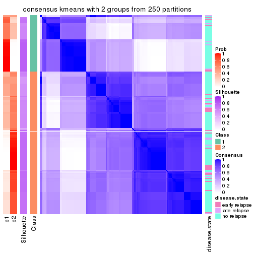</p>

</div>
<div id='tab-CV-kmeans-consensus-heatmap-2'>
<pre><code class="r">consensus_heatmap(res, k = 3)
</code></pre>

<p>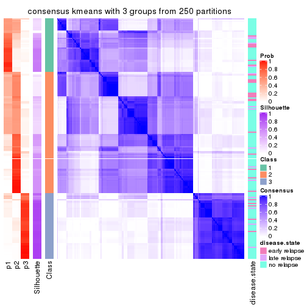</p>

</div>
<div id='tab-CV-kmeans-consensus-heatmap-3'>
<pre><code class="r">consensus_heatmap(res, k = 4)
</code></pre>

<p>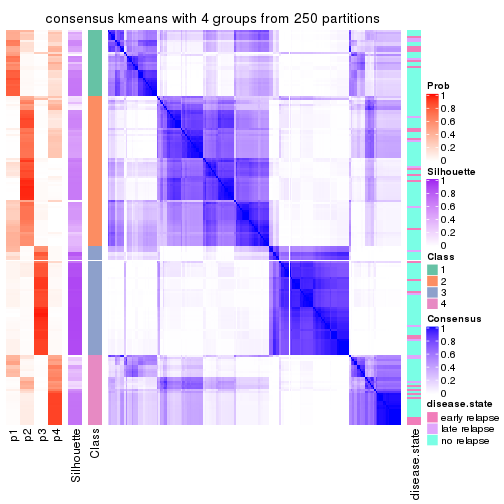</p>

</div>
<div id='tab-CV-kmeans-consensus-heatmap-4'>
<pre><code class="r">consensus_heatmap(res, k = 5)
</code></pre>

<p>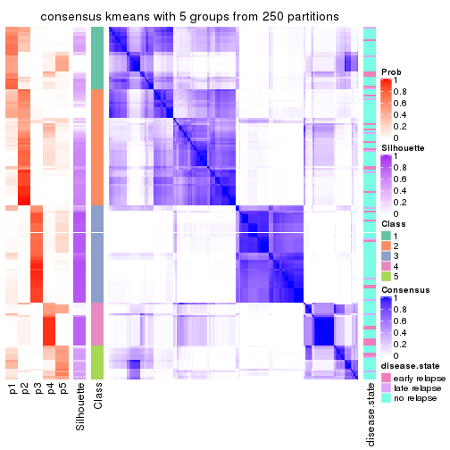</p>

</div>
<div id='tab-CV-kmeans-consensus-heatmap-5'>
<pre><code class="r">consensus_heatmap(res, k = 6)
</code></pre>

<p>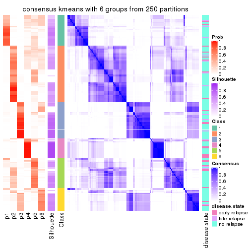</p>

</div>
</div>

Heatmaps for the membership of samples in all partitions to see how consistent they are:


<script>
$( function() {
	$( '#tabs-CV-kmeans-membership-heatmap' ).tabs();
} );
</script>
<div id='tabs-CV-kmeans-membership-heatmap'>
<ul>
<li><a href='#tab-CV-kmeans-membership-heatmap-1'>k = 2</a></li>
<li><a href='#tab-CV-kmeans-membership-heatmap-2'>k = 3</a></li>
<li><a href='#tab-CV-kmeans-membership-heatmap-3'>k = 4</a></li>
<li><a href='#tab-CV-kmeans-membership-heatmap-4'>k = 5</a></li>
<li><a href='#tab-CV-kmeans-membership-heatmap-5'>k = 6</a></li>
</ul>
<div id='tab-CV-kmeans-membership-heatmap-1'>
<pre><code class="r">membership_heatmap(res, k = 2)
</code></pre>

<p>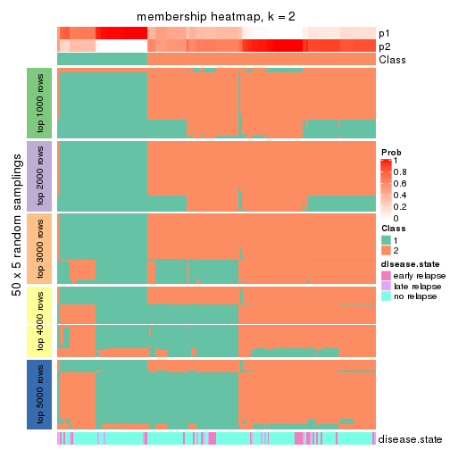</p>

</div>
<div id='tab-CV-kmeans-membership-heatmap-2'>
<pre><code class="r">membership_heatmap(res, k = 3)
</code></pre>

<p>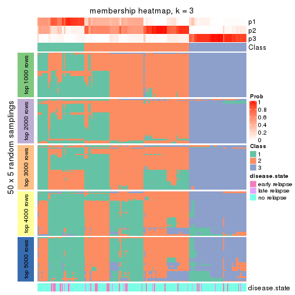</p>

</div>
<div id='tab-CV-kmeans-membership-heatmap-3'>
<pre><code class="r">membership_heatmap(res, k = 4)
</code></pre>

<p>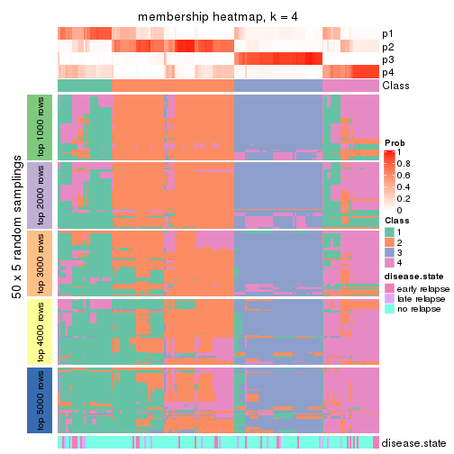</p>

</div>
<div id='tab-CV-kmeans-membership-heatmap-4'>
<pre><code class="r">membership_heatmap(res, k = 5)
</code></pre>

<p>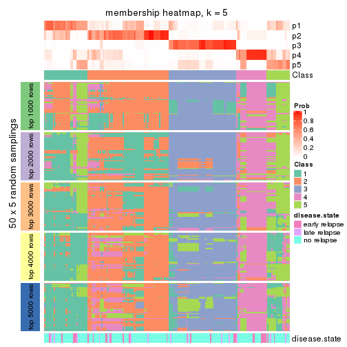</p>

</div>
<div id='tab-CV-kmeans-membership-heatmap-5'>
<pre><code class="r">membership_heatmap(res, k = 6)
</code></pre>

<p>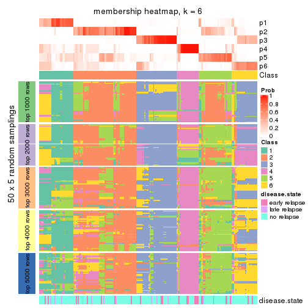</p>

</div>
</div>

As soon as we have had the classes for columns, we can look for signatures
which are significantly different between classes which can be candidate marks
for certain classes. Following are the heatmaps for signatures.


Signature heatmaps where rows are scaled:


<script>
$( function() {
	$( '#tabs-CV-kmeans-get-signatures' ).tabs();
} );
</script>
<div id='tabs-CV-kmeans-get-signatures'>
<ul>
<li><a href='#tab-CV-kmeans-get-signatures-1'>k = 2</a></li>
<li><a href='#tab-CV-kmeans-get-signatures-2'>k = 3</a></li>
<li><a href='#tab-CV-kmeans-get-signatures-3'>k = 4</a></li>
<li><a href='#tab-CV-kmeans-get-signatures-4'>k = 5</a></li>
<li><a href='#tab-CV-kmeans-get-signatures-5'>k = 6</a></li>
</ul>
<div id='tab-CV-kmeans-get-signatures-1'>
<pre><code class="r">get_signatures(res, k = 2)
</code></pre>

<p>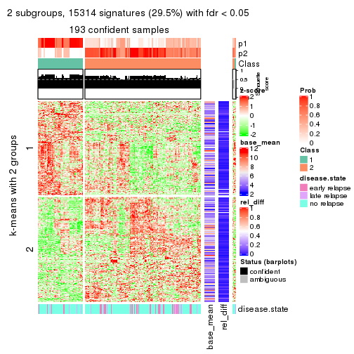</p>

</div>
<div id='tab-CV-kmeans-get-signatures-2'>
<pre><code class="r">get_signatures(res, k = 3)
</code></pre>

<p>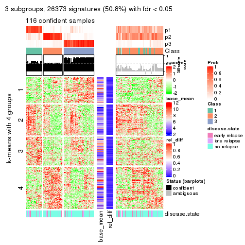</p>

</div>
<div id='tab-CV-kmeans-get-signatures-3'>
<pre><code class="r">get_signatures(res, k = 4)
</code></pre>

<p>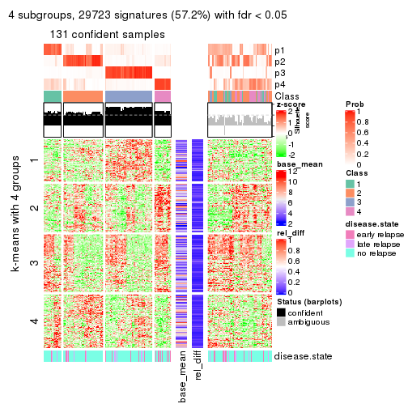</p>

</div>
<div id='tab-CV-kmeans-get-signatures-4'>
<pre><code class="r">get_signatures(res, k = 5)
</code></pre>

<p>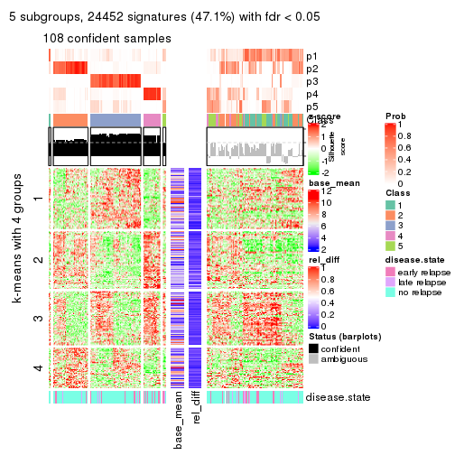</p>

</div>
<div id='tab-CV-kmeans-get-signatures-5'>
<pre><code class="r">get_signatures(res, k = 6)
</code></pre>

<p>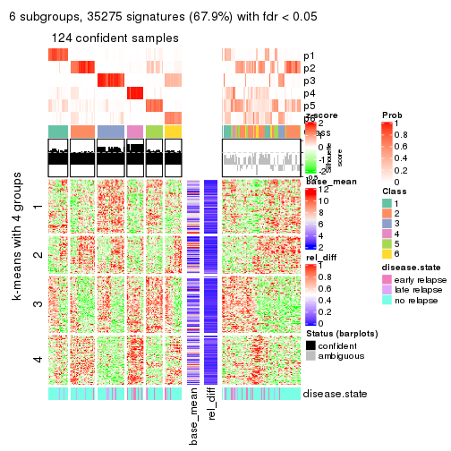</p>

</div>
</div>


Signature heatmaps where rows are not scaled:


<script>
$( function() {
	$( '#tabs-CV-kmeans-get-signatures-no-scale' ).tabs();
} );
</script>
<div id='tabs-CV-kmeans-get-signatures-no-scale'>
<ul>
<li><a href='#tab-CV-kmeans-get-signatures-no-scale-1'>k = 2</a></li>
<li><a href='#tab-CV-kmeans-get-signatures-no-scale-2'>k = 3</a></li>
<li><a href='#tab-CV-kmeans-get-signatures-no-scale-3'>k = 4</a></li>
<li><a href='#tab-CV-kmeans-get-signatures-no-scale-4'>k = 5</a></li>
<li><a href='#tab-CV-kmeans-get-signatures-no-scale-5'>k = 6</a></li>
</ul>
<div id='tab-CV-kmeans-get-signatures-no-scale-1'>
<pre><code class="r">get_signatures(res, k = 2, scale_rows = FALSE)
</code></pre>

<p>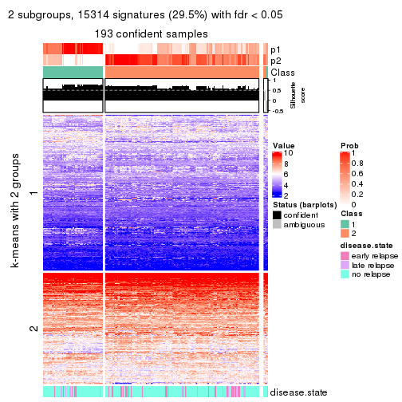</p>

</div>
<div id='tab-CV-kmeans-get-signatures-no-scale-2'>
<pre><code class="r">get_signatures(res, k = 3, scale_rows = FALSE)
</code></pre>

<p>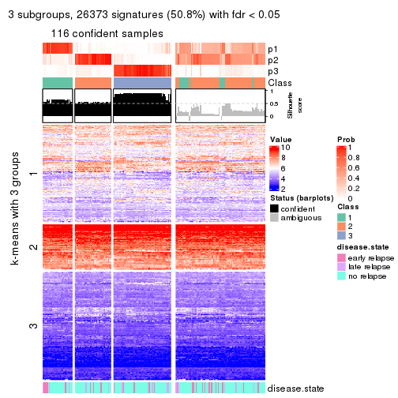</p>

</div>
<div id='tab-CV-kmeans-get-signatures-no-scale-3'>
<pre><code class="r">get_signatures(res, k = 4, scale_rows = FALSE)
</code></pre>

<p>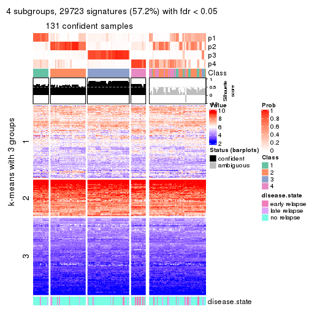</p>

</div>
<div id='tab-CV-kmeans-get-signatures-no-scale-4'>
<pre><code class="r">get_signatures(res, k = 5, scale_rows = FALSE)
</code></pre>

<p>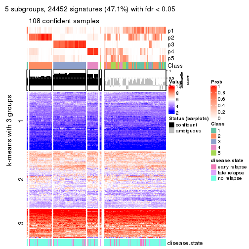</p>

</div>
<div id='tab-CV-kmeans-get-signatures-no-scale-5'>
<pre><code class="r">get_signatures(res, k = 6, scale_rows = FALSE)
</code></pre>

<p>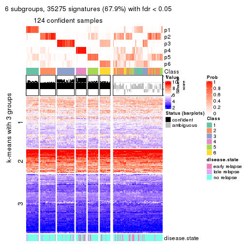</p>

</div>
</div>


Compare the overlap of signatures from different k:

```r
compare_signatures(res)
```

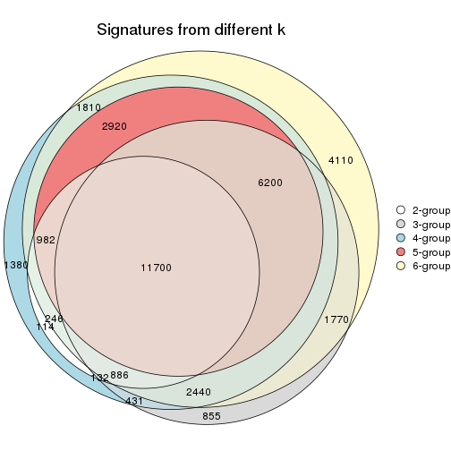

`get_signature()` returns a data frame invisibly. TO get the list of signatures, the function
call should be assigned to a variable explicitly. In following code, if `plot` argument is set
to `FALSE`, no heatmap is plotted while only the differential analysis is performed.

```r
# code only for demonstration
tb = get_signature(res, k = ..., plot = FALSE)
```

An example of the output of `tb` is:

```
#>   which_row         fdr    mean_1    mean_2 scaled_mean_1 scaled_mean_2 km
#> 1        38 0.042760348  8.373488  9.131774    -0.5533452     0.5164555  1
#> 2        40 0.018707592  7.106213  8.469186    -0.6173731     0.5762149  1
#> 3        55 0.019134737 10.221463 11.207825    -0.6159697     0.5749050  1
#> 4        59 0.006059896  5.921854  7.869574    -0.6899429     0.6439467  1
#> 5        60 0.018055526  8.928898 10.211722    -0.6204761     0.5791110  1
#> 6        98 0.009384629 15.714769 14.887706     0.6635654    -0.6193277  2
...
```

The columns in `tb` are:

1. `which_row`: row indices corresponding to the input matrix.
2. `fdr`: FDR for the differential test. 
3. `mean_x`: The mean value in group x.
4. `scaled_mean_x`: The mean value in group x after rows are scaled.
5. `km`: Row groups if k-means clustering is applied to rows.


UMAP plot which shows how samples are separated.


<script>
$( function() {
	$( '#tabs-CV-kmeans-dimension-reduction' ).tabs();
} );
</script>
<div id='tabs-CV-kmeans-dimension-reduction'>
<ul>
<li><a href='#tab-CV-kmeans-dimension-reduction-1'>k = 2</a></li>
<li><a href='#tab-CV-kmeans-dimension-reduction-2'>k = 3</a></li>
<li><a href='#tab-CV-kmeans-dimension-reduction-3'>k = 4</a></li>
<li><a href='#tab-CV-kmeans-dimension-reduction-4'>k = 5</a></li>
<li><a href='#tab-CV-kmeans-dimension-reduction-5'>k = 6</a></li>
</ul>
<div id='tab-CV-kmeans-dimension-reduction-1'>
<pre><code class="r">dimension_reduction(res, k = 2, method = &quot;UMAP&quot;)
</code></pre>

<p>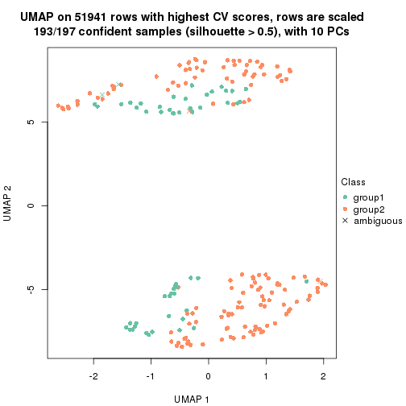</p>

</div>
<div id='tab-CV-kmeans-dimension-reduction-2'>
<pre><code class="r">dimension_reduction(res, k = 3, method = &quot;UMAP&quot;)
</code></pre>

<p>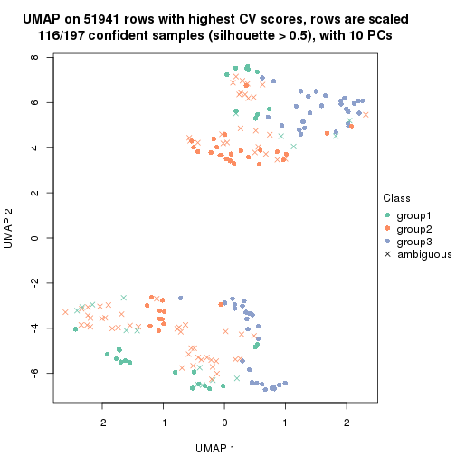</p>

</div>
<div id='tab-CV-kmeans-dimension-reduction-3'>
<pre><code class="r">dimension_reduction(res, k = 4, method = &quot;UMAP&quot;)
</code></pre>

<p>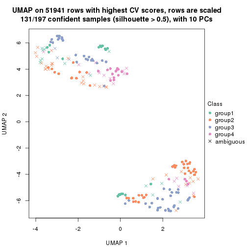</p>

</div>
<div id='tab-CV-kmeans-dimension-reduction-4'>
<pre><code class="r">dimension_reduction(res, k = 5, method = &quot;UMAP&quot;)
</code></pre>

<p>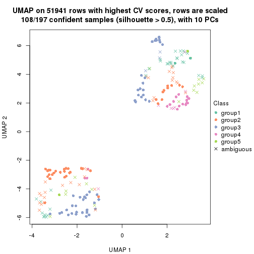</p>

</div>
<div id='tab-CV-kmeans-dimension-reduction-5'>
<pre><code class="r">dimension_reduction(res, k = 6, method = &quot;UMAP&quot;)
</code></pre>

<p>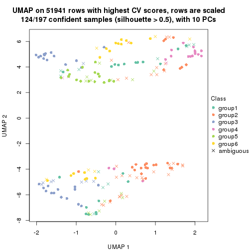</p>

</div>
</div>


Following heatmap shows how subgroups are split when increasing `k`:

```r
collect_classes(res)
```

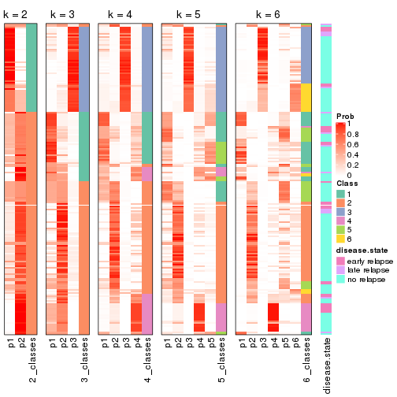


Test correlation between subgroups and known annotations. If the known
annotation is numeric, one-way ANOVA test is applied, and if the known
annotation is discrete, chi-squared contingency table test is applied.

```r
test_to_known_factors(res)
```

```
#>             n disease.state(p) k
#> CV:kmeans 193           0.5612 2
#> CV:kmeans 116           0.6683 3
#> CV:kmeans 131           0.0319 4
#> CV:kmeans 108           0.0607 5
#> CV:kmeans 124           0.0907 6
```


If matrix rows can be associated to genes, consider to use `functional_enrichment(res,
...)` to perform function enrichment for the signature genes. See [this vignette](http://bioconductor.org/packages/devel/bioc/vignettes/cola/inst/doc/functional_enrichment.html) for more detailed explanations.


 

---------------------------------------------------


### CV:skmeans


The object with results only for a single top-value method and a single partition method 
can be extracted as:

```r
res = res_list["CV", "skmeans"]
# you can also extract it by
# res = res_list["CV:skmeans"]
```

A summary of `res` and all the functions that can be applied to it:

```r
res
```

```
#> A 'ConsensusPartition' object with k = 2, 3, 4, 5, 6.
#>   On a matrix with 51941 rows and 197 columns.
#>   Top rows (1000, 2000, 3000, 4000, 5000) are extracted by 'CV' method.
#>   Subgroups are detected by 'skmeans' method.
#>   Performed in total 1250 partitions by row resampling.
#>   Best k for subgroups seems to be 2.
#> 
#> Following methods can be applied to this 'ConsensusPartition' object:
#>  [1] "cola_report"             "collect_classes"         "collect_plots"          
#>  [4] "collect_stats"           "colnames"                "compare_signatures"     
#>  [7] "consensus_heatmap"       "dimension_reduction"     "functional_enrichment"  
#> [10] "get_anno_col"            "get_anno"                "get_classes"            
#> [13] "get_consensus"           "get_matrix"              "get_membership"         
#> [16] "get_param"               "get_signatures"          "get_stats"              
#> [19] "is_best_k"               "is_stable_k"             "membership_heatmap"     
#> [22] "ncol"                    "nrow"                    "plot_ecdf"              
#> [25] "rownames"                "select_partition_number" "show"                   
#> [28] "suggest_best_k"          "test_to_known_factors"
```

`collect_plots()` function collects all the plots made from `res` for all `k` (number of partitions)
into one single page to provide an easy and fast comparison between different `k`.

```r
collect_plots(res)
```

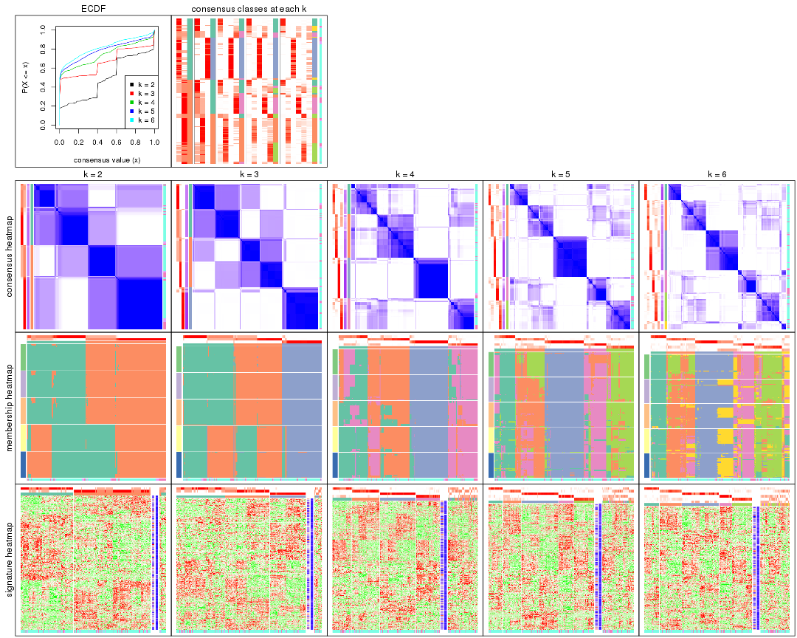

The plots are:

- The first row: a plot of the ECDF (empirical cumulative distribution
  function) curves of the consensus matrix for each `k` and the heatmap of
  predicted classes for each `k`.
- The second row: heatmaps of the consensus matrix for each `k`.
- The third row: heatmaps of the membership matrix for each `k`.
- The fouth row: heatmaps of the signatures for each `k`.

All the plots in panels can be made by individual functions and they are
plotted later in this section.

`select_partition_number()` produces several plots showing different
statistics for choosing "optimized" `k`. There are following statistics:

- ECDF curves of the consensus matrix for each `k`;
- 1-PAC. [The PAC
  score](https://en.wikipedia.org/wiki/Consensus_clustering#Over-interpretation_potential_of_consensus_clustering)
  measures the proportion of the ambiguous subgrouping.
- Mean silhouette score.
- Concordance. The mean probability of fiting the consensus class ids in all
  partitions.
- Area increased. Denote $A_k$ as the area under the ECDF curve for current
  `k`, the area increased is defined as $A_k - A_{k-1}$.
- Rand index. The percent of pairs of samples that are both in a same cluster
  or both are not in a same cluster in the partition of k and k-1.
- Jaccard index. The ratio of pairs of samples are both in a same cluster in
  the partition of k and k-1 and the pairs of samples are both in a same
  cluster in the partition k or k-1.

The detailed explanations of these statistics can be found in [the _cola_
vignette](http://bioconductor.org/packages/devel/bioc/vignettes/cola/inst/doc/cola.html#toc_13).

Generally speaking, lower PAC score, higher mean silhouette score or higher
concordance corresponds to better partition. Rand index and Jaccard index
measure how similar the current partition is compared to partition with `k-1`.
If they are too similar, we won't accept `k` is better than `k-1`.

```r
select_partition_number(res)
```

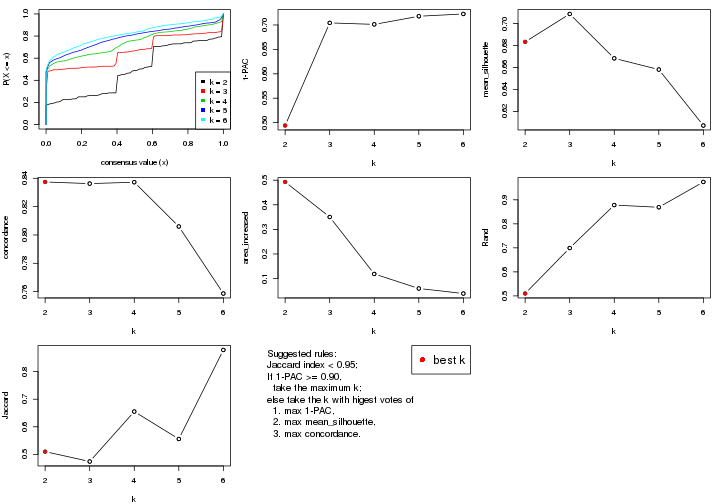

The numeric values for all these statistics can be obtained by `get_stats()`.

```r
get_stats(res)
```

```
#>   k 1-PAC mean_silhouette concordance area_increased  Rand Jaccard
#> 2 2 0.494           0.683       0.837         0.4928 0.510   0.510
#> 3 3 0.704           0.709       0.836         0.3504 0.699   0.474
#> 4 4 0.701           0.668       0.837         0.1188 0.878   0.655
#> 5 5 0.718           0.658       0.806         0.0597 0.869   0.556
#> 6 6 0.723           0.607       0.759         0.0393 0.974   0.879
```

`suggest_best_k()` suggests the best $k$ based on these statistics. The rules are as follows:

- All $k$ with Jaccard index larger than 0.95 are removed because increasing
  $k$ does not provide enough extra information. If all $k$ are removed, it is
  marked as no subgroup is detected.
- For all $k$ with 1-PAC score larger than 0.9, the maximal $k$ is taken as
  the best $k$, and other $k$ are marked as optional $k$.
- If it does not fit the second rule. The $k$ with the maximal vote of the
  highest 1-PAC score, highest mean silhouette, and highest concordance is
  taken as the best $k$.

```r
suggest_best_k(res)
```

```
#> [1] 2
```


Following shows the table of the partitions (You need to click the **show/hide
code output** link to see it). The membership matrix (columns with name `p*`)
is inferred by
[`clue::cl_consensus()`](https://www.rdocumentation.org/link/cl_consensus?package=clue)
function with the `SE` method. Basically the value in the membership matrix
represents the probability to belong to a certain group. The finall class
label for an item is determined with the group with highest probability it
belongs to.

In `get_classes()` function, the entropy is calculated from the membership
matrix and the silhouette score is calculated from the consensus matrix.


<script>
$( function() {
	$( '#tabs-CV-skmeans-get-classes' ).tabs();
} );
</script>
<div id='tabs-CV-skmeans-get-classes'>
<ul>
<li><a href='#tab-CV-skmeans-get-classes-1'>k = 2</a></li>
<li><a href='#tab-CV-skmeans-get-classes-2'>k = 3</a></li>
<li><a href='#tab-CV-skmeans-get-classes-3'>k = 4</a></li>
<li><a href='#tab-CV-skmeans-get-classes-4'>k = 5</a></li>
<li><a href='#tab-CV-skmeans-get-classes-5'>k = 6</a></li>
</ul>

<div id='tab-CV-skmeans-get-classes-1'>
<p><a id='tab-CV-skmeans-get-classes-1-a' style='color:#0366d6' href='#'>show/hide code output</a></p>
<pre><code class="r">cbind(get_classes(res, k = 2), get_membership(res, k = 2))
</code></pre>

<pre><code>#&gt;           class entropy silhouette    p1    p2
#&gt; GSM342319     2  0.9710      0.574 0.400 0.600
#&gt; GSM342323     2  0.0000      0.779 0.000 1.000
#&gt; GSM342325     2  0.9710      0.574 0.400 0.600
#&gt; GSM342326     2  0.0000      0.779 0.000 1.000
#&gt; GSM342327     2  0.0000      0.779 0.000 1.000
#&gt; GSM342329     2  0.0000      0.779 0.000 1.000
#&gt; GSM342331     2  0.0000      0.779 0.000 1.000
#&gt; GSM342334     2  0.0000      0.779 0.000 1.000
#&gt; GSM342335     2  0.0000      0.779 0.000 1.000
#&gt; GSM342354     1  0.6438      0.705 0.836 0.164
#&gt; GSM342371     2  0.0376      0.778 0.004 0.996
#&gt; GSM342380     2  0.9710      0.574 0.400 0.600
#&gt; GSM342382     2  0.9710      0.574 0.400 0.600
#&gt; GSM342399     2  0.9710      0.574 0.400 0.600
#&gt; GSM342402     1  0.6048      0.598 0.852 0.148
#&gt; GSM342404     2  0.0000      0.779 0.000 1.000
#&gt; GSM342408     1  0.9710      0.582 0.600 0.400
#&gt; GSM342409     2  0.9323      0.177 0.348 0.652
#&gt; GSM342426     2  0.0000      0.779 0.000 1.000
#&gt; GSM342441     1  0.8955      0.632 0.688 0.312
#&gt; GSM342444     1  0.0000      0.760 1.000 0.000
#&gt; GSM342451     1  0.0000      0.760 1.000 0.000
#&gt; GSM342462     2  0.0000      0.779 0.000 1.000
#&gt; GSM342467     2  0.2043      0.746 0.032 0.968
#&gt; GSM342484     1  0.2948      0.718 0.948 0.052
#&gt; GSM342491     1  0.9944      0.509 0.544 0.456
#&gt; GSM342322     2  0.9710      0.574 0.400 0.600
#&gt; GSM342338     1  0.0000      0.760 1.000 0.000
#&gt; GSM342347     1  0.9710      0.582 0.600 0.400
#&gt; GSM342356     1  0.0000      0.760 1.000 0.000
#&gt; GSM342357     1  0.4431      0.676 0.908 0.092
#&gt; GSM342366     2  0.6623      0.694 0.172 0.828
#&gt; GSM342385     2  0.9710      0.574 0.400 0.600
#&gt; GSM342421     2  0.0000      0.779 0.000 1.000
#&gt; GSM342437     2  0.0000      0.779 0.000 1.000
#&gt; GSM342454     1  0.0000      0.760 1.000 0.000
#&gt; GSM342471     2  0.0000      0.779 0.000 1.000
#&gt; GSM342477     2  0.0000      0.779 0.000 1.000
#&gt; GSM342495     2  0.0000      0.779 0.000 1.000
#&gt; GSM342496     2  0.9933      0.491 0.452 0.548
#&gt; GSM342320     2  0.0000      0.779 0.000 1.000
#&gt; GSM342321     2  0.0000      0.779 0.000 1.000
#&gt; GSM342324     2  0.0000      0.779 0.000 1.000
#&gt; GSM342328     2  0.0000      0.779 0.000 1.000
#&gt; GSM342330     2  0.0000      0.779 0.000 1.000
#&gt; GSM342332     2  0.0000      0.779 0.000 1.000
#&gt; GSM342333     2  0.2423      0.738 0.040 0.960
#&gt; GSM342336     2  0.0000      0.779 0.000 1.000
#&gt; GSM342337     1  0.0000      0.760 1.000 0.000
#&gt; GSM342339     1  0.0000      0.760 1.000 0.000
#&gt; GSM342340     1  0.0000      0.760 1.000 0.000
#&gt; GSM342341     1  0.0000      0.760 1.000 0.000
#&gt; GSM342342     1  0.0000      0.760 1.000 0.000
#&gt; GSM342343     1  0.0000      0.760 1.000 0.000
#&gt; GSM342344     1  0.0000      0.760 1.000 0.000
#&gt; GSM342345     1  0.0000      0.760 1.000 0.000
#&gt; GSM342346     2  0.0000      0.779 0.000 1.000
#&gt; GSM342348     1  0.0000      0.760 1.000 0.000
#&gt; GSM342349     1  0.9710      0.582 0.600 0.400
#&gt; GSM342350     1  0.9710      0.582 0.600 0.400
#&gt; GSM342351     1  0.9710      0.582 0.600 0.400
#&gt; GSM342352     1  0.9710      0.582 0.600 0.400
#&gt; GSM342353     1  0.0000      0.760 1.000 0.000
#&gt; GSM342355     1  0.0000      0.760 1.000 0.000
#&gt; GSM342358     1  0.9998      0.447 0.508 0.492
#&gt; GSM342359     1  0.9993      0.463 0.516 0.484
#&gt; GSM342360     1  0.9993      0.463 0.516 0.484
#&gt; GSM342361     1  0.9993      0.463 0.516 0.484
#&gt; GSM342362     1  0.8608      0.306 0.716 0.284
#&gt; GSM342363     1  0.8763      0.272 0.704 0.296
#&gt; GSM342364     2  0.9710      0.574 0.400 0.600
#&gt; GSM342365     2  0.0000      0.779 0.000 1.000
#&gt; GSM342367     2  0.9710      0.574 0.400 0.600
#&gt; GSM342368     2  0.9087      0.613 0.324 0.676
#&gt; GSM342369     2  0.0000      0.779 0.000 1.000
#&gt; GSM342370     2  0.0000      0.779 0.000 1.000
#&gt; GSM342372     2  0.0000      0.779 0.000 1.000
#&gt; GSM342373     2  0.0000      0.779 0.000 1.000
#&gt; GSM342374     2  0.0000      0.779 0.000 1.000
#&gt; GSM342375     2  0.0000      0.779 0.000 1.000
#&gt; GSM342376     2  0.9710      0.574 0.400 0.600
#&gt; GSM342377     2  0.9710      0.574 0.400 0.600
#&gt; GSM342378     2  0.9710      0.574 0.400 0.600
#&gt; GSM342379     2  0.9710      0.574 0.400 0.600
#&gt; GSM342381     2  0.9710      0.574 0.400 0.600
#&gt; GSM342383     2  0.9710      0.574 0.400 0.600
#&gt; GSM342384     2  0.9710      0.574 0.400 0.600
#&gt; GSM342386     2  0.9710      0.574 0.400 0.600
#&gt; GSM342387     2  0.0000      0.779 0.000 1.000
#&gt; GSM342388     1  0.0000      0.760 1.000 0.000
#&gt; GSM342389     2  0.9710      0.574 0.400 0.600
#&gt; GSM342390     1  0.0000      0.760 1.000 0.000
#&gt; GSM342391     1  0.2603      0.724 0.956 0.044
#&gt; GSM342392     1  0.0000      0.760 1.000 0.000
#&gt; GSM342393     2  0.0000      0.779 0.000 1.000
#&gt; GSM342394     2  0.9710      0.574 0.400 0.600
#&gt; GSM342395     2  0.6623      0.694 0.172 0.828
#&gt; GSM342396     1  0.0000      0.760 1.000 0.000
#&gt; GSM342397     1  0.9710      0.582 0.600 0.400
#&gt; GSM342398     2  0.9710      0.574 0.400 0.600
#&gt; GSM342400     2  0.9710      0.574 0.400 0.600
#&gt; GSM342401     1  0.0000      0.760 1.000 0.000
#&gt; GSM342403     2  0.9710      0.574 0.400 0.600
#&gt; GSM342405     1  0.9710      0.582 0.600 0.400
#&gt; GSM342406     1  0.0000      0.760 1.000 0.000
#&gt; GSM342407     1  0.9710      0.582 0.600 0.400
#&gt; GSM342410     1  0.0938      0.751 0.988 0.012
#&gt; GSM342411     2  0.0000      0.779 0.000 1.000
#&gt; GSM342412     2  0.0000      0.779 0.000 1.000
#&gt; GSM342413     1  0.9710      0.582 0.600 0.400
#&gt; GSM342414     1  0.9710      0.582 0.600 0.400
#&gt; GSM342415     2  0.9710      0.574 0.400 0.600
#&gt; GSM342416     1  0.0000      0.760 1.000 0.000
#&gt; GSM342417     2  0.0000      0.779 0.000 1.000
#&gt; GSM342418     2  0.0000      0.779 0.000 1.000
#&gt; GSM342419     2  0.9710      0.574 0.400 0.600
#&gt; GSM342420     2  0.0000      0.779 0.000 1.000
#&gt; GSM342422     2  0.9710      0.574 0.400 0.600
#&gt; GSM342423     2  0.0000      0.779 0.000 1.000
#&gt; GSM342424     2  0.0000      0.779 0.000 1.000
#&gt; GSM342425     2  0.0000      0.779 0.000 1.000
#&gt; GSM342427     2  0.0000      0.779 0.000 1.000
#&gt; GSM342428     2  0.0000      0.779 0.000 1.000
#&gt; GSM342429     2  0.0000      0.779 0.000 1.000
#&gt; GSM342430     1  0.0000      0.760 1.000 0.000
#&gt; GSM342431     1  0.0000      0.760 1.000 0.000
#&gt; GSM342432     1  0.0000      0.760 1.000 0.000
#&gt; GSM342433     1  0.9710      0.582 0.600 0.400
#&gt; GSM342434     1  0.9710      0.582 0.600 0.400
#&gt; GSM342435     1  0.9710      0.582 0.600 0.400
#&gt; GSM342436     1  0.8955      0.632 0.688 0.312
#&gt; GSM342438     1  0.0000      0.760 1.000 0.000
#&gt; GSM342439     1  0.0000      0.760 1.000 0.000
#&gt; GSM342440     1  0.6623      0.702 0.828 0.172
#&gt; GSM342442     1  0.0000      0.760 1.000 0.000
#&gt; GSM342443     2  0.0000      0.779 0.000 1.000
#&gt; GSM342445     1  0.6623      0.702 0.828 0.172
#&gt; GSM342446     1  0.0000      0.760 1.000 0.000
#&gt; GSM342447     1  0.0000      0.760 1.000 0.000
#&gt; GSM342448     1  0.9710      0.582 0.600 0.400
#&gt; GSM342449     1  0.0000      0.760 1.000 0.000
#&gt; GSM342450     1  0.9710      0.582 0.600 0.400
#&gt; GSM342452     1  0.0000      0.760 1.000 0.000
#&gt; GSM342453     1  0.0000      0.760 1.000 0.000
#&gt; GSM342455     1  0.0000      0.760 1.000 0.000
#&gt; GSM342456     1  0.9993      0.463 0.516 0.484
#&gt; GSM342457     2  0.9710      0.574 0.400 0.600
#&gt; GSM342458     2  0.0000      0.779 0.000 1.000
#&gt; GSM342459     2  0.0000      0.779 0.000 1.000
#&gt; GSM342460     2  0.0000      0.779 0.000 1.000
#&gt; GSM342461     2  0.0000      0.779 0.000 1.000
#&gt; GSM342463     2  0.9710      0.574 0.400 0.600
#&gt; GSM342464     2  0.9710      0.574 0.400 0.600
#&gt; GSM342465     2  0.9710      0.574 0.400 0.600
#&gt; GSM342466     1  0.0000      0.760 1.000 0.000
#&gt; GSM342468     2  0.0000      0.779 0.000 1.000
#&gt; GSM342469     2  0.9710      0.574 0.400 0.600
#&gt; GSM342470     1  0.9710      0.582 0.600 0.400
#&gt; GSM342472     1  0.9710      0.582 0.600 0.400
#&gt; GSM342473     2  0.0000      0.779 0.000 1.000
#&gt; GSM342474     2  0.0000      0.779 0.000 1.000
#&gt; GSM342475     1  0.6623      0.702 0.828 0.172
#&gt; GSM342476     2  0.0000      0.779 0.000 1.000
#&gt; GSM342478     2  0.0000      0.779 0.000 1.000
#&gt; GSM342479     2  0.0000      0.779 0.000 1.000
#&gt; GSM342480     2  0.0000      0.779 0.000 1.000
#&gt; GSM342481     2  0.0000      0.779 0.000 1.000
#&gt; GSM342482     2  0.0000      0.779 0.000 1.000
#&gt; GSM342483     2  0.0000      0.779 0.000 1.000
#&gt; GSM342485     2  0.9710      0.574 0.400 0.600
#&gt; GSM342486     2  0.9710      0.574 0.400 0.600
#&gt; GSM342487     1  0.9710      0.582 0.600 0.400
#&gt; GSM342488     2  0.0000      0.779 0.000 1.000
#&gt; GSM342489     2  0.0000      0.779 0.000 1.000
#&gt; GSM342490     2  0.0000      0.779 0.000 1.000
#&gt; GSM342492     1  0.9710      0.582 0.600 0.400
#&gt; GSM342493     2  0.9710      0.574 0.400 0.600
#&gt; GSM342494     2  0.0000      0.779 0.000 1.000
#&gt; GSM342497     2  0.0000      0.779 0.000 1.000
#&gt; GSM342498     2  0.9933      0.490 0.452 0.548
#&gt; GSM342499     2  0.9710      0.574 0.400 0.600
#&gt; GSM342500     2  0.0000      0.779 0.000 1.000
#&gt; GSM342501     2  0.9710      0.574 0.400 0.600
#&gt; GSM342502     2  0.9710      0.574 0.400 0.600
#&gt; GSM342503     2  0.0000      0.779 0.000 1.000
#&gt; GSM342504     2  0.0000      0.779 0.000 1.000
#&gt; GSM342505     1  0.0000      0.760 1.000 0.000
#&gt; GSM342506     1  0.0000      0.760 1.000 0.000
#&gt; GSM342507     1  0.4022      0.690 0.920 0.080
#&gt; GSM342508     1  0.0000      0.760 1.000 0.000
#&gt; GSM342509     1  0.1184      0.749 0.984 0.016
#&gt; GSM342510     1  0.9833      0.554 0.576 0.424
#&gt; GSM342511     1  0.9710      0.582 0.600 0.400
#&gt; GSM342512     2  0.9710      0.574 0.400 0.600
#&gt; GSM342513     2  0.9710      0.574 0.400 0.600
#&gt; GSM342514     1  0.9710      0.582 0.600 0.400
#&gt; GSM342515     2  0.9710      0.574 0.400 0.600
</code></pre>

<script>
$('#tab-CV-skmeans-get-classes-1-a').parent().next().next().hide();
$('#tab-CV-skmeans-get-classes-1-a').click(function(){
  $('#tab-CV-skmeans-get-classes-1-a').parent().next().next().toggle();
  return(false);
});
</script>
</div>

<div id='tab-CV-skmeans-get-classes-2'>
<p><a id='tab-CV-skmeans-get-classes-2-a' style='color:#0366d6' href='#'>show/hide code output</a></p>
<pre><code class="r">cbind(get_classes(res, k = 3), get_membership(res, k = 3))
</code></pre>

<pre><code>#&gt;           class entropy silhouette    p1    p2    p3
#&gt; GSM342319     1  0.0000      0.656 1.000 0.000 0.000
#&gt; GSM342323     1  0.6140      0.678 0.596 0.404 0.000
#&gt; GSM342325     1  0.0000      0.656 1.000 0.000 0.000
#&gt; GSM342326     1  0.6140      0.678 0.596 0.404 0.000
#&gt; GSM342327     1  0.6140      0.678 0.596 0.404 0.000
#&gt; GSM342329     1  0.6126      0.678 0.600 0.400 0.000
#&gt; GSM342331     1  0.6140      0.678 0.596 0.404 0.000
#&gt; GSM342334     1  0.6154      0.674 0.592 0.408 0.000
#&gt; GSM342335     2  0.4931      0.651 0.232 0.768 0.000
#&gt; GSM342354     3  0.0424      0.948 0.000 0.008 0.992
#&gt; GSM342371     2  0.6126      0.629 0.400 0.600 0.000
#&gt; GSM342380     1  0.0000      0.656 1.000 0.000 0.000
#&gt; GSM342382     2  0.6140      0.629 0.404 0.596 0.000
#&gt; GSM342399     1  0.0000      0.656 1.000 0.000 0.000
#&gt; GSM342402     1  0.0000      0.656 1.000 0.000 0.000
#&gt; GSM342404     2  0.0000      0.686 0.000 1.000 0.000
#&gt; GSM342408     3  0.0424      0.948 0.000 0.008 0.992
#&gt; GSM342409     2  0.7174      0.125 0.024 0.516 0.460
#&gt; GSM342426     1  0.6140      0.678 0.596 0.404 0.000
#&gt; GSM342441     3  0.0000      0.950 0.000 0.000 1.000
#&gt; GSM342444     3  0.0237      0.950 0.004 0.000 0.996
#&gt; GSM342451     3  0.0237      0.950 0.004 0.000 0.996
#&gt; GSM342462     2  0.0237      0.687 0.000 0.996 0.004
#&gt; GSM342467     2  0.4799      0.460 0.132 0.836 0.032
#&gt; GSM342484     1  0.0424      0.654 0.992 0.000 0.008
#&gt; GSM342491     1  0.6498      0.675 0.596 0.396 0.008
#&gt; GSM342322     1  0.0000      0.656 1.000 0.000 0.000
#&gt; GSM342338     3  0.0424      0.948 0.008 0.000 0.992
#&gt; GSM342347     3  0.0424      0.948 0.000 0.008 0.992
#&gt; GSM342356     3  0.6079      0.480 0.388 0.000 0.612
#&gt; GSM342357     1  0.0000      0.656 1.000 0.000 0.000
#&gt; GSM342366     2  0.6126      0.629 0.400 0.600 0.000
#&gt; GSM342385     1  0.0000      0.656 1.000 0.000 0.000
#&gt; GSM342421     2  0.0000      0.686 0.000 1.000 0.000
#&gt; GSM342437     1  0.6345      0.676 0.596 0.400 0.004
#&gt; GSM342454     3  0.0000      0.950 0.000 0.000 1.000
#&gt; GSM342471     1  0.2796      0.656 0.908 0.092 0.000
#&gt; GSM342477     1  0.6345      0.676 0.596 0.400 0.004
#&gt; GSM342495     2  0.0237      0.687 0.000 0.996 0.004
#&gt; GSM342496     2  0.6345      0.629 0.400 0.596 0.004
#&gt; GSM342320     1  0.6140      0.678 0.596 0.404 0.000
#&gt; GSM342321     1  0.6126      0.678 0.600 0.400 0.000
#&gt; GSM342324     1  0.6140      0.678 0.596 0.404 0.000
#&gt; GSM342328     1  0.6126      0.678 0.600 0.400 0.000
#&gt; GSM342330     1  0.6140      0.678 0.596 0.404 0.000
#&gt; GSM342332     1  0.6126      0.678 0.600 0.400 0.000
#&gt; GSM342333     2  0.1289      0.661 0.000 0.968 0.032
#&gt; GSM342336     1  0.6140      0.678 0.596 0.404 0.000
#&gt; GSM342337     3  0.6079      0.480 0.388 0.000 0.612
#&gt; GSM342339     3  0.0237      0.950 0.004 0.000 0.996
#&gt; GSM342340     3  0.1411      0.924 0.036 0.000 0.964
#&gt; GSM342341     3  0.0237      0.950 0.004 0.000 0.996
#&gt; GSM342342     3  0.0237      0.950 0.004 0.000 0.996
#&gt; GSM342343     3  0.4555      0.749 0.200 0.000 0.800
#&gt; GSM342344     3  0.0237      0.950 0.004 0.000 0.996
#&gt; GSM342345     3  0.0237      0.950 0.004 0.000 0.996
#&gt; GSM342346     1  0.6154      0.674 0.592 0.408 0.000
#&gt; GSM342348     1  0.0237      0.656 0.996 0.004 0.000
#&gt; GSM342349     3  0.0424      0.948 0.000 0.008 0.992
#&gt; GSM342350     3  0.0424      0.948 0.000 0.008 0.992
#&gt; GSM342351     3  0.0424      0.948 0.000 0.008 0.992
#&gt; GSM342352     3  0.0424      0.948 0.000 0.008 0.992
#&gt; GSM342353     3  0.0237      0.950 0.004 0.000 0.996
#&gt; GSM342355     3  0.6079      0.480 0.388 0.000 0.612
#&gt; GSM342358     1  0.6140      0.678 0.596 0.404 0.000
#&gt; GSM342359     1  0.6140      0.678 0.596 0.404 0.000
#&gt; GSM342360     1  0.6140      0.678 0.596 0.404 0.000
#&gt; GSM342361     1  0.6140      0.678 0.596 0.404 0.000
#&gt; GSM342362     1  0.0424      0.656 0.992 0.008 0.000
#&gt; GSM342363     1  0.0000      0.656 1.000 0.000 0.000
#&gt; GSM342364     2  0.6140      0.629 0.404 0.596 0.000
#&gt; GSM342365     2  0.0000      0.686 0.000 1.000 0.000
#&gt; GSM342367     2  0.6140      0.629 0.404 0.596 0.000
#&gt; GSM342368     2  0.6140      0.629 0.404 0.596 0.000
#&gt; GSM342369     2  0.0000      0.686 0.000 1.000 0.000
#&gt; GSM342370     2  0.0000      0.686 0.000 1.000 0.000
#&gt; GSM342372     2  0.0000      0.686 0.000 1.000 0.000
#&gt; GSM342373     2  0.5465      0.643 0.288 0.712 0.000
#&gt; GSM342374     2  0.0000      0.686 0.000 1.000 0.000
#&gt; GSM342375     2  0.0000      0.686 0.000 1.000 0.000
#&gt; GSM342376     2  0.6140      0.629 0.404 0.596 0.000
#&gt; GSM342377     2  0.6140      0.629 0.404 0.596 0.000
#&gt; GSM342378     1  0.0000      0.656 1.000 0.000 0.000
#&gt; GSM342379     1  0.0000      0.656 1.000 0.000 0.000
#&gt; GSM342381     2  0.6140      0.629 0.404 0.596 0.000
#&gt; GSM342383     1  0.0000      0.656 1.000 0.000 0.000
#&gt; GSM342384     2  0.6140      0.629 0.404 0.596 0.000
#&gt; GSM342386     2  0.6140      0.629 0.404 0.596 0.000
#&gt; GSM342387     1  0.6140      0.678 0.596 0.404 0.000
#&gt; GSM342388     3  0.4452      0.759 0.192 0.000 0.808
#&gt; GSM342389     2  0.6140      0.629 0.404 0.596 0.000
#&gt; GSM342390     1  0.0000      0.656 1.000 0.000 0.000
#&gt; GSM342391     1  0.0000      0.656 1.000 0.000 0.000
#&gt; GSM342392     3  0.0237      0.950 0.004 0.000 0.996
#&gt; GSM342393     2  0.0000      0.686 0.000 1.000 0.000
#&gt; GSM342394     1  0.0000      0.656 1.000 0.000 0.000
#&gt; GSM342395     2  0.6140      0.629 0.404 0.596 0.000
#&gt; GSM342396     3  0.0237      0.950 0.004 0.000 0.996
#&gt; GSM342397     3  0.0424      0.948 0.000 0.008 0.992
#&gt; GSM342398     2  0.6140      0.629 0.404 0.596 0.000
#&gt; GSM342400     2  0.6140      0.629 0.404 0.596 0.000
#&gt; GSM342401     3  0.0237      0.950 0.004 0.000 0.996
#&gt; GSM342403     1  0.5431      0.058 0.716 0.284 0.000
#&gt; GSM342405     3  0.6140      0.374 0.000 0.404 0.596
#&gt; GSM342406     1  0.0000      0.656 1.000 0.000 0.000
#&gt; GSM342407     3  0.0237      0.949 0.000 0.004 0.996
#&gt; GSM342410     1  0.0000      0.656 1.000 0.000 0.000
#&gt; GSM342411     1  0.6111      0.678 0.604 0.396 0.000
#&gt; GSM342412     1  0.6140      0.678 0.596 0.404 0.000
#&gt; GSM342413     1  0.6140      0.678 0.596 0.404 0.000
#&gt; GSM342414     3  0.0237      0.949 0.000 0.004 0.996
#&gt; GSM342415     2  0.6126      0.629 0.400 0.600 0.000
#&gt; GSM342416     1  0.0237      0.656 0.996 0.004 0.000
#&gt; GSM342417     1  0.6140      0.678 0.596 0.404 0.000
#&gt; GSM342418     1  0.6140      0.678 0.596 0.404 0.000
#&gt; GSM342419     1  0.2959      0.524 0.900 0.100 0.000
#&gt; GSM342420     1  0.6140      0.678 0.596 0.404 0.000
#&gt; GSM342422     2  0.6140      0.629 0.404 0.596 0.000
#&gt; GSM342423     2  0.0424      0.687 0.008 0.992 0.000
#&gt; GSM342424     1  0.6140      0.678 0.596 0.404 0.000
#&gt; GSM342425     1  0.6140      0.678 0.596 0.404 0.000
#&gt; GSM342427     2  0.6509     -0.495 0.472 0.524 0.004
#&gt; GSM342428     1  0.6302      0.572 0.520 0.480 0.000
#&gt; GSM342429     2  0.6680     -0.519 0.484 0.508 0.008
#&gt; GSM342430     3  0.0237      0.950 0.004 0.000 0.996
#&gt; GSM342431     3  0.0237      0.950 0.004 0.000 0.996
#&gt; GSM342432     3  0.0000      0.950 0.000 0.000 1.000
#&gt; GSM342433     3  0.0000      0.950 0.000 0.000 1.000
#&gt; GSM342434     3  0.0237      0.949 0.000 0.004 0.996
#&gt; GSM342435     3  0.0000      0.950 0.000 0.000 1.000
#&gt; GSM342436     3  0.0000      0.950 0.000 0.000 1.000
#&gt; GSM342438     3  0.0000      0.950 0.000 0.000 1.000
#&gt; GSM342439     3  0.0000      0.950 0.000 0.000 1.000
#&gt; GSM342440     3  0.0000      0.950 0.000 0.000 1.000
#&gt; GSM342442     3  0.0000      0.950 0.000 0.000 1.000
#&gt; GSM342443     2  0.0237      0.687 0.000 0.996 0.004
#&gt; GSM342445     3  0.0000      0.950 0.000 0.000 1.000
#&gt; GSM342446     3  0.0000      0.950 0.000 0.000 1.000
#&gt; GSM342447     3  0.0237      0.950 0.004 0.000 0.996
#&gt; GSM342448     3  0.0237      0.949 0.000 0.004 0.996
#&gt; GSM342449     3  0.0000      0.950 0.000 0.000 1.000
#&gt; GSM342450     3  0.0000      0.950 0.000 0.000 1.000
#&gt; GSM342452     3  0.0000      0.950 0.000 0.000 1.000
#&gt; GSM342453     3  0.0000      0.950 0.000 0.000 1.000
#&gt; GSM342455     3  0.0000      0.950 0.000 0.000 1.000
#&gt; GSM342456     1  0.6140      0.678 0.596 0.404 0.000
#&gt; GSM342457     2  0.6140      0.629 0.404 0.596 0.000
#&gt; GSM342458     2  0.0000      0.686 0.000 1.000 0.000
#&gt; GSM342459     2  0.0237      0.687 0.000 0.996 0.004
#&gt; GSM342460     2  0.0237      0.687 0.000 0.996 0.004
#&gt; GSM342461     2  0.1170      0.688 0.016 0.976 0.008
#&gt; GSM342463     2  0.6345      0.629 0.400 0.596 0.004
#&gt; GSM342464     2  0.6498      0.630 0.396 0.596 0.008
#&gt; GSM342465     2  0.6345      0.629 0.400 0.596 0.004
#&gt; GSM342466     1  0.0237      0.653 0.996 0.000 0.004
#&gt; GSM342468     2  0.0000      0.686 0.000 1.000 0.000
#&gt; GSM342469     1  0.0000      0.656 1.000 0.000 0.000
#&gt; GSM342470     1  0.6140      0.678 0.596 0.404 0.000
#&gt; GSM342472     3  0.6126      0.376 0.000 0.400 0.600
#&gt; GSM342473     2  0.0661      0.688 0.004 0.988 0.008
#&gt; GSM342474     2  0.0661      0.688 0.004 0.988 0.008
#&gt; GSM342475     3  0.0000      0.950 0.000 0.000 1.000
#&gt; GSM342476     2  0.0237      0.687 0.000 0.996 0.004
#&gt; GSM342478     2  0.0661      0.688 0.004 0.988 0.008
#&gt; GSM342479     1  0.6498      0.675 0.596 0.396 0.008
#&gt; GSM342480     2  0.0237      0.687 0.000 0.996 0.004
#&gt; GSM342481     2  0.0661      0.688 0.004 0.988 0.008
#&gt; GSM342482     2  0.0661      0.688 0.004 0.988 0.008
#&gt; GSM342483     2  0.0661      0.688 0.004 0.988 0.008
#&gt; GSM342485     2  0.6345      0.629 0.400 0.596 0.004
#&gt; GSM342486     2  0.6345      0.629 0.400 0.596 0.004
#&gt; GSM342487     3  0.0000      0.950 0.000 0.000 1.000
#&gt; GSM342488     2  0.0237      0.687 0.000 0.996 0.004
#&gt; GSM342489     2  0.0237      0.687 0.000 0.996 0.004
#&gt; GSM342490     1  0.6516      0.564 0.516 0.480 0.004
#&gt; GSM342492     3  0.0000      0.950 0.000 0.000 1.000
#&gt; GSM342493     2  0.6345      0.629 0.400 0.596 0.004
#&gt; GSM342494     2  0.0237      0.687 0.000 0.996 0.004
#&gt; GSM342497     2  0.0237      0.687 0.000 0.996 0.004
#&gt; GSM342498     1  0.0000      0.656 1.000 0.000 0.000
#&gt; GSM342499     1  0.0000      0.656 1.000 0.000 0.000
#&gt; GSM342500     2  0.0424      0.687 0.000 0.992 0.008
#&gt; GSM342501     1  0.0237      0.655 0.996 0.000 0.004
#&gt; GSM342502     2  0.6498      0.630 0.396 0.596 0.008
#&gt; GSM342503     2  0.0661      0.688 0.004 0.988 0.008
#&gt; GSM342504     2  0.0661      0.688 0.004 0.988 0.008
#&gt; GSM342505     3  0.0000      0.950 0.000 0.000 1.000
#&gt; GSM342506     1  0.0237      0.655 0.996 0.000 0.004
#&gt; GSM342507     1  0.0000      0.656 1.000 0.000 0.000
#&gt; GSM342508     1  0.0000      0.656 1.000 0.000 0.000
#&gt; GSM342509     1  0.0424      0.654 0.992 0.000 0.008
#&gt; GSM342510     1  0.6345      0.676 0.596 0.400 0.004
#&gt; GSM342511     3  0.0237      0.949 0.000 0.004 0.996
#&gt; GSM342512     2  0.6345      0.629 0.400 0.596 0.004
#&gt; GSM342513     2  0.6345      0.629 0.400 0.596 0.004
#&gt; GSM342514     1  0.6235      0.246 0.564 0.000 0.436
#&gt; GSM342515     1  0.0000      0.656 1.000 0.000 0.000
</code></pre>

<script>
$('#tab-CV-skmeans-get-classes-2-a').parent().next().next().hide();
$('#tab-CV-skmeans-get-classes-2-a').click(function(){
  $('#tab-CV-skmeans-get-classes-2-a').parent().next().next().toggle();
  return(false);
});
</script>
</div>

<div id='tab-CV-skmeans-get-classes-3'>
<p><a id='tab-CV-skmeans-get-classes-3-a' style='color:#0366d6' href='#'>show/hide code output</a></p>
<pre><code class="r">cbind(get_classes(res, k = 4), get_membership(res, k = 4))
</code></pre>

<pre><code>#&gt;           class entropy silhouette    p1    p2    p3    p4
#&gt; GSM342319     1  0.4877     0.5099 0.592 0.000 0.000 0.408
#&gt; GSM342323     4  0.0336     0.7969 0.008 0.000 0.000 0.992
#&gt; GSM342325     1  0.4776     0.5296 0.624 0.000 0.000 0.376
#&gt; GSM342326     4  0.0336     0.7969 0.008 0.000 0.000 0.992
#&gt; GSM342327     4  0.0336     0.7969 0.008 0.000 0.000 0.992
#&gt; GSM342329     4  0.0336     0.7969 0.008 0.000 0.000 0.992
#&gt; GSM342331     4  0.0336     0.7969 0.008 0.000 0.000 0.992
#&gt; GSM342334     4  0.0921     0.7828 0.000 0.028 0.000 0.972
#&gt; GSM342335     2  0.5915     0.4225 0.040 0.560 0.000 0.400
#&gt; GSM342354     3  0.0000     0.9514 0.000 0.000 1.000 0.000
#&gt; GSM342371     2  0.1557     0.7515 0.056 0.944 0.000 0.000
#&gt; GSM342380     1  0.4936     0.5306 0.624 0.004 0.000 0.372
#&gt; GSM342382     2  0.4925     0.2834 0.428 0.572 0.000 0.000
#&gt; GSM342399     1  0.4761     0.5303 0.628 0.000 0.000 0.372
#&gt; GSM342402     1  0.4585     0.5525 0.668 0.000 0.000 0.332
#&gt; GSM342404     2  0.4925     0.3601 0.000 0.572 0.000 0.428
#&gt; GSM342408     3  0.3873     0.6568 0.000 0.000 0.772 0.228
#&gt; GSM342409     2  0.6405     0.3802 0.048 0.568 0.372 0.012
#&gt; GSM342426     4  0.0336     0.7969 0.008 0.000 0.000 0.992
#&gt; GSM342441     3  0.0000     0.9514 0.000 0.000 1.000 0.000
#&gt; GSM342444     3  0.0000     0.9514 0.000 0.000 1.000 0.000
#&gt; GSM342451     3  0.0000     0.9514 0.000 0.000 1.000 0.000
#&gt; GSM342462     2  0.0000     0.7602 0.000 1.000 0.000 0.000
#&gt; GSM342467     4  0.3257     0.6913 0.004 0.152 0.000 0.844
#&gt; GSM342484     1  0.5279     0.4451 0.588 0.012 0.000 0.400
#&gt; GSM342491     4  0.1936     0.7727 0.032 0.028 0.000 0.940
#&gt; GSM342322     1  0.4933     0.4888 0.568 0.000 0.000 0.432
#&gt; GSM342338     3  0.0000     0.9514 0.000 0.000 1.000 0.000
#&gt; GSM342347     3  0.0000     0.9514 0.000 0.000 1.000 0.000
#&gt; GSM342356     3  0.4967     0.2003 0.452 0.000 0.548 0.000
#&gt; GSM342357     1  0.4585     0.5525 0.668 0.000 0.000 0.332
#&gt; GSM342366     2  0.1637     0.7501 0.060 0.940 0.000 0.000
#&gt; GSM342385     1  0.5085     0.5266 0.616 0.008 0.000 0.376
#&gt; GSM342421     2  0.4830     0.4277 0.000 0.608 0.000 0.392
#&gt; GSM342437     4  0.5203     0.4077 0.416 0.008 0.000 0.576
#&gt; GSM342454     3  0.0000     0.9514 0.000 0.000 1.000 0.000
#&gt; GSM342471     1  0.2345     0.6530 0.900 0.000 0.000 0.100
#&gt; GSM342477     4  0.1389     0.7741 0.000 0.048 0.000 0.952
#&gt; GSM342495     2  0.0921     0.7563 0.000 0.972 0.000 0.028
#&gt; GSM342496     2  0.3219     0.6845 0.164 0.836 0.000 0.000
#&gt; GSM342320     4  0.0336     0.7969 0.008 0.000 0.000 0.992
#&gt; GSM342321     4  0.0336     0.7969 0.008 0.000 0.000 0.992
#&gt; GSM342324     4  0.0336     0.7969 0.008 0.000 0.000 0.992
#&gt; GSM342328     4  0.0336     0.7969 0.008 0.000 0.000 0.992
#&gt; GSM342330     4  0.0336     0.7969 0.008 0.000 0.000 0.992
#&gt; GSM342332     4  0.0188     0.7958 0.004 0.000 0.000 0.996
#&gt; GSM342333     4  0.7301    -0.1210 0.088 0.436 0.020 0.456
#&gt; GSM342336     4  0.2699     0.7587 0.068 0.028 0.000 0.904
#&gt; GSM342337     3  0.4967     0.2003 0.452 0.000 0.548 0.000
#&gt; GSM342339     3  0.0000     0.9514 0.000 0.000 1.000 0.000
#&gt; GSM342340     3  0.3219     0.7769 0.164 0.000 0.836 0.000
#&gt; GSM342341     3  0.0000     0.9514 0.000 0.000 1.000 0.000
#&gt; GSM342342     3  0.0000     0.9514 0.000 0.000 1.000 0.000
#&gt; GSM342343     3  0.3837     0.6917 0.224 0.000 0.776 0.000
#&gt; GSM342344     3  0.0000     0.9514 0.000 0.000 1.000 0.000
#&gt; GSM342345     3  0.0000     0.9514 0.000 0.000 1.000 0.000
#&gt; GSM342346     4  0.1118     0.7785 0.000 0.036 0.000 0.964
#&gt; GSM342348     1  0.2868     0.6224 0.864 0.000 0.000 0.136
#&gt; GSM342349     3  0.0000     0.9514 0.000 0.000 1.000 0.000
#&gt; GSM342350     3  0.0000     0.9514 0.000 0.000 1.000 0.000
#&gt; GSM342351     3  0.0000     0.9514 0.000 0.000 1.000 0.000
#&gt; GSM342352     3  0.0000     0.9514 0.000 0.000 1.000 0.000
#&gt; GSM342353     3  0.0000     0.9514 0.000 0.000 1.000 0.000
#&gt; GSM342355     3  0.4972     0.1883 0.456 0.000 0.544 0.000
#&gt; GSM342358     4  0.3610     0.6606 0.200 0.000 0.000 0.800
#&gt; GSM342359     4  0.3610     0.6606 0.200 0.000 0.000 0.800
#&gt; GSM342360     4  0.3764     0.6407 0.216 0.000 0.000 0.784
#&gt; GSM342361     4  0.3311     0.6874 0.172 0.000 0.000 0.828
#&gt; GSM342362     1  0.4898     0.4264 0.584 0.000 0.000 0.416
#&gt; GSM342363     1  0.4522     0.5644 0.680 0.000 0.000 0.320
#&gt; GSM342364     2  0.1716     0.7487 0.064 0.936 0.000 0.000
#&gt; GSM342365     2  0.4933     0.3517 0.000 0.568 0.000 0.432
#&gt; GSM342367     2  0.4304     0.5545 0.284 0.716 0.000 0.000
#&gt; GSM342368     2  0.1637     0.7501 0.060 0.940 0.000 0.000
#&gt; GSM342369     2  0.4804     0.4395 0.000 0.616 0.000 0.384
#&gt; GSM342370     2  0.4933     0.3517 0.000 0.568 0.000 0.432
#&gt; GSM342372     2  0.4843     0.4207 0.000 0.604 0.000 0.396
#&gt; GSM342373     2  0.1118     0.7547 0.036 0.964 0.000 0.000
#&gt; GSM342374     2  0.4933     0.3517 0.000 0.568 0.000 0.432
#&gt; GSM342375     2  0.4830     0.4270 0.000 0.608 0.000 0.392
#&gt; GSM342376     1  0.4925     0.0990 0.572 0.428 0.000 0.000
#&gt; GSM342377     1  0.4925     0.0990 0.572 0.428 0.000 0.000
#&gt; GSM342378     1  0.0707     0.6710 0.980 0.000 0.000 0.020
#&gt; GSM342379     1  0.4776     0.5263 0.624 0.000 0.000 0.376
#&gt; GSM342381     1  0.5097     0.0974 0.568 0.428 0.000 0.004
#&gt; GSM342383     1  0.5189     0.5289 0.616 0.012 0.000 0.372
#&gt; GSM342384     2  0.4907     0.3031 0.420 0.580 0.000 0.000
#&gt; GSM342386     2  0.3311     0.6811 0.172 0.828 0.000 0.000
#&gt; GSM342387     4  0.4933     0.3867 0.432 0.000 0.000 0.568
#&gt; GSM342388     3  0.3569     0.7338 0.196 0.000 0.804 0.000
#&gt; GSM342389     2  0.4679     0.4453 0.352 0.648 0.000 0.000
#&gt; GSM342390     1  0.2704     0.6309 0.876 0.000 0.000 0.124
#&gt; GSM342391     1  0.1118     0.6723 0.964 0.000 0.000 0.036
#&gt; GSM342392     3  0.0000     0.9514 0.000 0.000 1.000 0.000
#&gt; GSM342393     2  0.4933     0.3517 0.000 0.568 0.000 0.432
#&gt; GSM342394     1  0.1118     0.6723 0.964 0.000 0.000 0.036
#&gt; GSM342395     2  0.1389     0.7520 0.048 0.952 0.000 0.000
#&gt; GSM342396     3  0.0000     0.9514 0.000 0.000 1.000 0.000
#&gt; GSM342397     3  0.0000     0.9514 0.000 0.000 1.000 0.000
#&gt; GSM342398     1  0.4941     0.0781 0.564 0.436 0.000 0.000
#&gt; GSM342400     2  0.4933     0.2751 0.432 0.568 0.000 0.000
#&gt; GSM342401     3  0.0000     0.9514 0.000 0.000 1.000 0.000
#&gt; GSM342403     1  0.5313     0.5229 0.608 0.016 0.000 0.376
#&gt; GSM342405     4  0.7343     0.1480 0.000 0.156 0.420 0.424
#&gt; GSM342406     1  0.2868     0.6224 0.864 0.000 0.000 0.136
#&gt; GSM342407     3  0.0000     0.9514 0.000 0.000 1.000 0.000
#&gt; GSM342410     1  0.1118     0.6723 0.964 0.000 0.000 0.036
#&gt; GSM342411     1  0.4817     0.1150 0.612 0.000 0.000 0.388
#&gt; GSM342412     4  0.0817     0.7848 0.000 0.024 0.000 0.976
#&gt; GSM342413     4  0.4933     0.3867 0.432 0.000 0.000 0.568
#&gt; GSM342414     3  0.0000     0.9514 0.000 0.000 1.000 0.000
#&gt; GSM342415     1  0.4933     0.0886 0.568 0.432 0.000 0.000
#&gt; GSM342416     1  0.2868     0.6224 0.864 0.000 0.000 0.136
#&gt; GSM342417     4  0.0336     0.7969 0.008 0.000 0.000 0.992
#&gt; GSM342418     4  0.0336     0.7969 0.008 0.000 0.000 0.992
#&gt; GSM342419     1  0.5630     0.5820 0.724 0.136 0.000 0.140
#&gt; GSM342420     4  0.0336     0.7969 0.008 0.000 0.000 0.992
#&gt; GSM342422     1  0.4967     0.0292 0.548 0.452 0.000 0.000
#&gt; GSM342423     2  0.1520     0.7592 0.024 0.956 0.000 0.020
#&gt; GSM342424     4  0.0336     0.7969 0.008 0.000 0.000 0.992
#&gt; GSM342425     4  0.0336     0.7969 0.008 0.000 0.000 0.992
#&gt; GSM342427     4  0.4152     0.6773 0.032 0.160 0.000 0.808
#&gt; GSM342428     4  0.4590     0.6707 0.060 0.148 0.000 0.792
#&gt; GSM342429     2  0.6347     0.0461 0.064 0.524 0.000 0.412
#&gt; GSM342430     3  0.0000     0.9514 0.000 0.000 1.000 0.000
#&gt; GSM342431     3  0.0000     0.9514 0.000 0.000 1.000 0.000
#&gt; GSM342432     3  0.0000     0.9514 0.000 0.000 1.000 0.000
#&gt; GSM342433     3  0.0000     0.9514 0.000 0.000 1.000 0.000
#&gt; GSM342434     3  0.0188     0.9477 0.000 0.000 0.996 0.004
#&gt; GSM342435     3  0.0000     0.9514 0.000 0.000 1.000 0.000
#&gt; GSM342436     3  0.0000     0.9514 0.000 0.000 1.000 0.000
#&gt; GSM342438     3  0.0000     0.9514 0.000 0.000 1.000 0.000
#&gt; GSM342439     3  0.0000     0.9514 0.000 0.000 1.000 0.000
#&gt; GSM342440     3  0.0000     0.9514 0.000 0.000 1.000 0.000
#&gt; GSM342442     3  0.0000     0.9514 0.000 0.000 1.000 0.000
#&gt; GSM342443     2  0.0921     0.7563 0.000 0.972 0.000 0.028
#&gt; GSM342445     3  0.0000     0.9514 0.000 0.000 1.000 0.000
#&gt; GSM342446     3  0.0000     0.9514 0.000 0.000 1.000 0.000
#&gt; GSM342447     3  0.2589     0.8354 0.116 0.000 0.884 0.000
#&gt; GSM342448     3  0.0000     0.9514 0.000 0.000 1.000 0.000
#&gt; GSM342449     3  0.0000     0.9514 0.000 0.000 1.000 0.000
#&gt; GSM342450     3  0.0000     0.9514 0.000 0.000 1.000 0.000
#&gt; GSM342452     3  0.0000     0.9514 0.000 0.000 1.000 0.000
#&gt; GSM342453     3  0.0000     0.9514 0.000 0.000 1.000 0.000
#&gt; GSM342455     3  0.0000     0.9514 0.000 0.000 1.000 0.000
#&gt; GSM342456     4  0.3311     0.6874 0.172 0.000 0.000 0.828
#&gt; GSM342457     2  0.2589     0.7224 0.116 0.884 0.000 0.000
#&gt; GSM342458     2  0.4877     0.3989 0.000 0.592 0.000 0.408
#&gt; GSM342459     2  0.0336     0.7595 0.000 0.992 0.000 0.008
#&gt; GSM342460     2  0.0817     0.7568 0.000 0.976 0.000 0.024
#&gt; GSM342461     2  0.0000     0.7602 0.000 1.000 0.000 0.000
#&gt; GSM342463     2  0.3074     0.6927 0.152 0.848 0.000 0.000
#&gt; GSM342464     2  0.2345     0.7272 0.100 0.900 0.000 0.000
#&gt; GSM342465     2  0.3219     0.6855 0.164 0.836 0.000 0.000
#&gt; GSM342466     1  0.1209     0.6718 0.964 0.000 0.004 0.032
#&gt; GSM342468     2  0.4830     0.4277 0.000 0.608 0.000 0.392
#&gt; GSM342469     1  0.0707     0.6686 0.980 0.000 0.000 0.020
#&gt; GSM342470     4  0.4933     0.3867 0.432 0.000 0.000 0.568
#&gt; GSM342472     4  0.6098     0.5500 0.000 0.124 0.200 0.676
#&gt; GSM342473     2  0.0000     0.7602 0.000 1.000 0.000 0.000
#&gt; GSM342474     2  0.0000     0.7602 0.000 1.000 0.000 0.000
#&gt; GSM342475     3  0.0000     0.9514 0.000 0.000 1.000 0.000
#&gt; GSM342476     2  0.4382     0.5526 0.000 0.704 0.000 0.296
#&gt; GSM342478     2  0.0336     0.7595 0.000 0.992 0.000 0.008
#&gt; GSM342479     4  0.4978     0.3182 0.004 0.384 0.000 0.612
#&gt; GSM342480     2  0.0921     0.7563 0.000 0.972 0.000 0.028
#&gt; GSM342481     2  0.0336     0.7595 0.000 0.992 0.000 0.008
#&gt; GSM342482     2  0.0000     0.7602 0.000 1.000 0.000 0.000
#&gt; GSM342483     2  0.0188     0.7600 0.000 0.996 0.000 0.004
#&gt; GSM342485     2  0.3219     0.6855 0.164 0.836 0.000 0.000
#&gt; GSM342486     2  0.3311     0.6782 0.172 0.828 0.000 0.000
#&gt; GSM342487     3  0.0000     0.9514 0.000 0.000 1.000 0.000
#&gt; GSM342488     2  0.4103     0.5954 0.000 0.744 0.000 0.256
#&gt; GSM342489     2  0.0921     0.7563 0.000 0.972 0.000 0.028
#&gt; GSM342490     4  0.2814     0.7106 0.000 0.132 0.000 0.868
#&gt; GSM342492     3  0.0000     0.9514 0.000 0.000 1.000 0.000
#&gt; GSM342493     2  0.3219     0.6855 0.164 0.836 0.000 0.000
#&gt; GSM342494     2  0.4304     0.5664 0.000 0.716 0.000 0.284
#&gt; GSM342497     2  0.4981     0.2640 0.000 0.536 0.000 0.464
#&gt; GSM342498     1  0.1118     0.6723 0.964 0.000 0.000 0.036
#&gt; GSM342499     1  0.0927     0.6651 0.976 0.008 0.000 0.016
#&gt; GSM342500     2  0.0336     0.7595 0.000 0.992 0.000 0.008
#&gt; GSM342501     4  0.7834    -0.1444 0.260 0.368 0.000 0.372
#&gt; GSM342502     2  0.0921     0.7559 0.028 0.972 0.000 0.000
#&gt; GSM342503     2  0.0000     0.7602 0.000 1.000 0.000 0.000
#&gt; GSM342504     2  0.0000     0.7602 0.000 1.000 0.000 0.000
#&gt; GSM342505     3  0.0000     0.9514 0.000 0.000 1.000 0.000
#&gt; GSM342506     1  0.1118     0.6723 0.964 0.000 0.000 0.036
#&gt; GSM342507     1  0.4855     0.4554 0.600 0.000 0.000 0.400
#&gt; GSM342508     1  0.1022     0.6725 0.968 0.000 0.000 0.032
#&gt; GSM342509     1  0.5028     0.4516 0.596 0.004 0.000 0.400
#&gt; GSM342510     4  0.3610     0.6606 0.200 0.000 0.000 0.800
#&gt; GSM342511     3  0.1284     0.9183 0.000 0.024 0.964 0.012
#&gt; GSM342512     2  0.3219     0.6855 0.164 0.836 0.000 0.000
#&gt; GSM342513     2  0.3219     0.6855 0.164 0.836 0.000 0.000
#&gt; GSM342514     1  0.7221     0.0244 0.432 0.000 0.428 0.140
#&gt; GSM342515     1  0.1022     0.6725 0.968 0.000 0.000 0.032
</code></pre>

<script>
$('#tab-CV-skmeans-get-classes-3-a').parent().next().next().hide();
$('#tab-CV-skmeans-get-classes-3-a').click(function(){
  $('#tab-CV-skmeans-get-classes-3-a').parent().next().next().toggle();
  return(false);
});
</script>
</div>

<div id='tab-CV-skmeans-get-classes-4'>
<p><a id='tab-CV-skmeans-get-classes-4-a' style='color:#0366d6' href='#'>show/hide code output</a></p>
<pre><code class="r">cbind(get_classes(res, k = 5), get_membership(res, k = 5))
</code></pre>

<pre><code>#&gt;           class entropy silhouette    p1    p2    p3    p4    p5
#&gt; GSM342319     4  0.6164     0.1958 0.152 0.000 0.000 0.520 0.328
#&gt; GSM342323     4  0.0162     0.7752 0.000 0.004 0.000 0.996 0.000
#&gt; GSM342325     4  0.6324    -0.0531 0.156 0.000 0.000 0.432 0.412
#&gt; GSM342326     4  0.0162     0.7752 0.000 0.004 0.000 0.996 0.000
#&gt; GSM342327     4  0.0162     0.7752 0.000 0.004 0.000 0.996 0.000
#&gt; GSM342329     4  0.0162     0.7752 0.000 0.004 0.000 0.996 0.000
#&gt; GSM342331     4  0.0162     0.7752 0.000 0.004 0.000 0.996 0.000
#&gt; GSM342334     4  0.4519     0.5212 0.000 0.228 0.000 0.720 0.052
#&gt; GSM342335     5  0.5991     0.2067 0.000 0.288 0.000 0.148 0.564
#&gt; GSM342354     3  0.0404     0.9544 0.000 0.012 0.988 0.000 0.000
#&gt; GSM342371     5  0.2179     0.6726 0.000 0.112 0.000 0.000 0.888
#&gt; GSM342380     5  0.7808     0.2616 0.156 0.128 0.000 0.252 0.464
#&gt; GSM342382     5  0.1478     0.7373 0.064 0.000 0.000 0.000 0.936
#&gt; GSM342399     5  0.6312     0.1086 0.156 0.000 0.000 0.392 0.452
#&gt; GSM342402     1  0.6169     0.2794 0.524 0.084 0.000 0.372 0.020
#&gt; GSM342404     2  0.5958     0.5056 0.000 0.568 0.000 0.288 0.144
#&gt; GSM342408     3  0.4407     0.6926 0.000 0.028 0.756 0.196 0.020
#&gt; GSM342409     5  0.4834     0.4477 0.000 0.308 0.028 0.008 0.656
#&gt; GSM342426     4  0.0162     0.7752 0.000 0.004 0.000 0.996 0.000
#&gt; GSM342441     3  0.0290     0.9552 0.000 0.008 0.992 0.000 0.000
#&gt; GSM342444     3  0.0451     0.9533 0.008 0.004 0.988 0.000 0.000
#&gt; GSM342451     3  0.0324     0.9549 0.004 0.004 0.992 0.000 0.000
#&gt; GSM342462     2  0.3966     0.4871 0.000 0.664 0.000 0.000 0.336
#&gt; GSM342467     2  0.3857     0.3879 0.000 0.688 0.000 0.312 0.000
#&gt; GSM342484     1  0.5869     0.2051 0.484 0.084 0.004 0.428 0.000
#&gt; GSM342491     4  0.4451     0.4549 0.016 0.340 0.000 0.644 0.000
#&gt; GSM342322     4  0.5972     0.2959 0.152 0.000 0.000 0.572 0.276
#&gt; GSM342338     3  0.0324     0.9549 0.004 0.004 0.992 0.000 0.000
#&gt; GSM342347     3  0.1012     0.9455 0.000 0.012 0.968 0.000 0.020
#&gt; GSM342356     3  0.5044     0.6584 0.140 0.004 0.716 0.000 0.140
#&gt; GSM342357     1  0.6169     0.2794 0.524 0.084 0.000 0.372 0.020
#&gt; GSM342366     5  0.1965     0.6863 0.000 0.096 0.000 0.000 0.904
#&gt; GSM342385     5  0.7823     0.2535 0.156 0.128 0.000 0.256 0.460
#&gt; GSM342421     2  0.6806     0.4652 0.000 0.352 0.000 0.296 0.352
#&gt; GSM342437     1  0.4617     0.6257 0.744 0.108 0.000 0.148 0.000
#&gt; GSM342454     3  0.0162     0.9555 0.004 0.000 0.996 0.000 0.000
#&gt; GSM342471     1  0.1952     0.7490 0.912 0.000 0.000 0.084 0.004
#&gt; GSM342477     4  0.4161     0.3856 0.000 0.392 0.000 0.608 0.000
#&gt; GSM342495     2  0.2230     0.6041 0.000 0.884 0.000 0.000 0.116
#&gt; GSM342496     5  0.4275     0.5991 0.020 0.284 0.000 0.000 0.696
#&gt; GSM342320     4  0.0162     0.7752 0.000 0.004 0.000 0.996 0.000
#&gt; GSM342321     4  0.0162     0.7752 0.000 0.004 0.000 0.996 0.000
#&gt; GSM342324     4  0.0000     0.7732 0.000 0.000 0.000 1.000 0.000
#&gt; GSM342328     4  0.0000     0.7732 0.000 0.000 0.000 1.000 0.000
#&gt; GSM342330     4  0.0162     0.7752 0.000 0.004 0.000 0.996 0.000
#&gt; GSM342332     4  0.2286     0.7016 0.000 0.108 0.000 0.888 0.004
#&gt; GSM342333     2  0.6678     0.4701 0.000 0.500 0.008 0.256 0.236
#&gt; GSM342336     4  0.4522     0.4740 0.000 0.248 0.000 0.708 0.044
#&gt; GSM342337     3  0.5084     0.6529 0.140 0.004 0.712 0.000 0.144
#&gt; GSM342339     3  0.0324     0.9549 0.004 0.004 0.992 0.000 0.000
#&gt; GSM342340     3  0.1728     0.9170 0.036 0.004 0.940 0.000 0.020
#&gt; GSM342341     3  0.0324     0.9549 0.004 0.004 0.992 0.000 0.000
#&gt; GSM342342     3  0.0324     0.9549 0.004 0.004 0.992 0.000 0.000
#&gt; GSM342343     3  0.3081     0.8458 0.056 0.004 0.868 0.000 0.072
#&gt; GSM342344     3  0.0290     0.9554 0.000 0.008 0.992 0.000 0.000
#&gt; GSM342345     3  0.0324     0.9549 0.004 0.004 0.992 0.000 0.000
#&gt; GSM342346     4  0.3812     0.6018 0.000 0.204 0.000 0.772 0.024
#&gt; GSM342348     1  0.0771     0.7644 0.976 0.000 0.000 0.020 0.004
#&gt; GSM342349     3  0.0404     0.9544 0.000 0.012 0.988 0.000 0.000
#&gt; GSM342350     3  0.0404     0.9544 0.000 0.012 0.988 0.000 0.000
#&gt; GSM342351     3  0.0510     0.9533 0.000 0.016 0.984 0.000 0.000
#&gt; GSM342352     3  0.0404     0.9544 0.000 0.012 0.988 0.000 0.000
#&gt; GSM342353     3  0.0290     0.9558 0.000 0.008 0.992 0.000 0.000
#&gt; GSM342355     3  0.5581     0.5687 0.148 0.004 0.656 0.000 0.192
#&gt; GSM342358     4  0.5519     0.2263 0.332 0.084 0.000 0.584 0.000
#&gt; GSM342359     4  0.5505     0.2373 0.328 0.084 0.000 0.588 0.000
#&gt; GSM342360     4  0.5571     0.1774 0.348 0.084 0.000 0.568 0.000
#&gt; GSM342361     4  0.4428     0.5678 0.160 0.084 0.000 0.756 0.000
#&gt; GSM342362     1  0.6082     0.1535 0.460 0.084 0.000 0.444 0.012
#&gt; GSM342363     1  0.6562     0.2778 0.512 0.084 0.000 0.360 0.044
#&gt; GSM342364     5  0.1671     0.6973 0.000 0.076 0.000 0.000 0.924
#&gt; GSM342365     2  0.6655     0.5710 0.000 0.444 0.000 0.296 0.260
#&gt; GSM342367     5  0.1943     0.7380 0.056 0.020 0.000 0.000 0.924
#&gt; GSM342368     5  0.1732     0.6988 0.000 0.080 0.000 0.000 0.920
#&gt; GSM342369     2  0.6647     0.5672 0.000 0.448 0.000 0.264 0.288
#&gt; GSM342370     2  0.6655     0.5710 0.000 0.444 0.000 0.296 0.260
#&gt; GSM342372     2  0.6684     0.5631 0.000 0.436 0.000 0.276 0.288
#&gt; GSM342373     5  0.2127     0.6743 0.000 0.108 0.000 0.000 0.892
#&gt; GSM342374     2  0.6655     0.5710 0.000 0.444 0.000 0.296 0.260
#&gt; GSM342375     2  0.6672     0.5654 0.000 0.440 0.000 0.272 0.288
#&gt; GSM342376     5  0.1892     0.7313 0.080 0.004 0.000 0.000 0.916
#&gt; GSM342377     5  0.1732     0.7325 0.080 0.000 0.000 0.000 0.920
#&gt; GSM342378     1  0.1571     0.7475 0.936 0.000 0.000 0.004 0.060
#&gt; GSM342379     5  0.7514     0.2313 0.156 0.080 0.000 0.300 0.464
#&gt; GSM342381     5  0.1732     0.7325 0.080 0.000 0.000 0.000 0.920
#&gt; GSM342383     5  0.7457     0.3962 0.156 0.128 0.000 0.184 0.532
#&gt; GSM342384     5  0.1410     0.7377 0.060 0.000 0.000 0.000 0.940
#&gt; GSM342386     5  0.2036     0.7305 0.024 0.056 0.000 0.000 0.920
#&gt; GSM342387     1  0.3612     0.5566 0.732 0.000 0.000 0.268 0.000
#&gt; GSM342388     3  0.2740     0.8667 0.044 0.004 0.888 0.000 0.064
#&gt; GSM342389     5  0.1845     0.7378 0.056 0.016 0.000 0.000 0.928
#&gt; GSM342390     1  0.0510     0.7646 0.984 0.000 0.000 0.016 0.000
#&gt; GSM342391     1  0.0955     0.7661 0.968 0.000 0.000 0.004 0.028
#&gt; GSM342392     3  0.0324     0.9549 0.004 0.004 0.992 0.000 0.000
#&gt; GSM342393     2  0.5923     0.5073 0.000 0.572 0.000 0.288 0.140
#&gt; GSM342394     1  0.0955     0.7661 0.968 0.000 0.000 0.004 0.028
#&gt; GSM342395     5  0.1965     0.6863 0.000 0.096 0.000 0.000 0.904
#&gt; GSM342396     3  0.0324     0.9549 0.004 0.004 0.992 0.000 0.000
#&gt; GSM342397     3  0.0404     0.9544 0.000 0.012 0.988 0.000 0.000
#&gt; GSM342398     5  0.1671     0.7339 0.076 0.000 0.000 0.000 0.924
#&gt; GSM342400     5  0.1478     0.7371 0.064 0.000 0.000 0.000 0.936
#&gt; GSM342401     3  0.0324     0.9549 0.004 0.004 0.992 0.000 0.000
#&gt; GSM342403     5  0.6858     0.4964 0.132 0.168 0.000 0.100 0.600
#&gt; GSM342405     2  0.7521     0.3205 0.000 0.448 0.224 0.272 0.056
#&gt; GSM342406     1  0.0609     0.7638 0.980 0.000 0.000 0.020 0.000
#&gt; GSM342407     3  0.0404     0.9544 0.000 0.012 0.988 0.000 0.000
#&gt; GSM342410     1  0.0955     0.7661 0.968 0.000 0.000 0.004 0.028
#&gt; GSM342411     1  0.2424     0.7129 0.868 0.000 0.000 0.132 0.000
#&gt; GSM342412     4  0.4096     0.6103 0.000 0.176 0.000 0.772 0.052
#&gt; GSM342413     1  0.2690     0.6796 0.844 0.000 0.000 0.156 0.000
#&gt; GSM342414     3  0.0404     0.9544 0.000 0.012 0.988 0.000 0.000
#&gt; GSM342415     5  0.0794     0.7288 0.028 0.000 0.000 0.000 0.972
#&gt; GSM342416     1  0.0609     0.7638 0.980 0.000 0.000 0.020 0.000
#&gt; GSM342417     4  0.0162     0.7752 0.000 0.004 0.000 0.996 0.000
#&gt; GSM342418     4  0.0290     0.7737 0.000 0.008 0.000 0.992 0.000
#&gt; GSM342419     5  0.4199     0.6417 0.160 0.000 0.000 0.068 0.772
#&gt; GSM342420     4  0.0162     0.7752 0.000 0.004 0.000 0.996 0.000
#&gt; GSM342422     5  0.1544     0.7364 0.068 0.000 0.000 0.000 0.932
#&gt; GSM342423     5  0.3805     0.5089 0.000 0.184 0.000 0.032 0.784
#&gt; GSM342424     4  0.0162     0.7752 0.000 0.004 0.000 0.996 0.000
#&gt; GSM342425     4  0.0162     0.7752 0.000 0.004 0.000 0.996 0.000
#&gt; GSM342427     2  0.4444     0.3251 0.000 0.624 0.000 0.364 0.012
#&gt; GSM342428     2  0.4451     0.1298 0.000 0.504 0.000 0.492 0.004
#&gt; GSM342429     2  0.4141     0.4307 0.000 0.728 0.000 0.248 0.024
#&gt; GSM342430     3  0.0324     0.9549 0.004 0.004 0.992 0.000 0.000
#&gt; GSM342431     3  0.0324     0.9549 0.004 0.004 0.992 0.000 0.000
#&gt; GSM342432     3  0.0162     0.9555 0.004 0.000 0.996 0.000 0.000
#&gt; GSM342433     3  0.0880     0.9455 0.000 0.032 0.968 0.000 0.000
#&gt; GSM342434     3  0.0880     0.9455 0.000 0.032 0.968 0.000 0.000
#&gt; GSM342435     3  0.0880     0.9455 0.000 0.032 0.968 0.000 0.000
#&gt; GSM342436     3  0.0290     0.9552 0.000 0.008 0.992 0.000 0.000
#&gt; GSM342438     3  0.0000     0.9558 0.000 0.000 1.000 0.000 0.000
#&gt; GSM342439     3  0.0000     0.9558 0.000 0.000 1.000 0.000 0.000
#&gt; GSM342440     3  0.0290     0.9552 0.000 0.008 0.992 0.000 0.000
#&gt; GSM342442     3  0.0000     0.9558 0.000 0.000 1.000 0.000 0.000
#&gt; GSM342443     2  0.3274     0.6011 0.000 0.780 0.000 0.000 0.220
#&gt; GSM342445     3  0.0290     0.9552 0.000 0.008 0.992 0.000 0.000
#&gt; GSM342446     3  0.0000     0.9558 0.000 0.000 1.000 0.000 0.000
#&gt; GSM342447     3  0.0771     0.9458 0.020 0.004 0.976 0.000 0.000
#&gt; GSM342448     3  0.0880     0.9455 0.000 0.032 0.968 0.000 0.000
#&gt; GSM342449     3  0.0000     0.9558 0.000 0.000 1.000 0.000 0.000
#&gt; GSM342450     3  0.0880     0.9455 0.000 0.032 0.968 0.000 0.000
#&gt; GSM342452     3  0.0000     0.9558 0.000 0.000 1.000 0.000 0.000
#&gt; GSM342453     3  0.0162     0.9555 0.004 0.000 0.996 0.000 0.000
#&gt; GSM342455     3  0.0000     0.9558 0.000 0.000 1.000 0.000 0.000
#&gt; GSM342456     4  0.4428     0.5678 0.160 0.084 0.000 0.756 0.000
#&gt; GSM342457     5  0.2248     0.7077 0.012 0.088 0.000 0.000 0.900
#&gt; GSM342458     2  0.6541     0.5882 0.000 0.480 0.000 0.264 0.256
#&gt; GSM342459     2  0.3336     0.5973 0.000 0.772 0.000 0.000 0.228
#&gt; GSM342460     2  0.3274     0.6011 0.000 0.780 0.000 0.000 0.220
#&gt; GSM342461     2  0.3983     0.4837 0.000 0.660 0.000 0.000 0.340
#&gt; GSM342463     5  0.3562     0.6421 0.016 0.196 0.000 0.000 0.788
#&gt; GSM342464     5  0.3983     0.3993 0.000 0.340 0.000 0.000 0.660
#&gt; GSM342465     5  0.3476     0.6651 0.020 0.176 0.000 0.000 0.804
#&gt; GSM342466     1  0.0771     0.7673 0.976 0.000 0.000 0.004 0.020
#&gt; GSM342468     2  0.6622     0.5731 0.000 0.456 0.000 0.260 0.284
#&gt; GSM342469     1  0.3563     0.5837 0.780 0.000 0.000 0.012 0.208
#&gt; GSM342470     1  0.2763     0.6852 0.848 0.004 0.000 0.148 0.000
#&gt; GSM342472     2  0.4747     0.3039 0.000 0.620 0.028 0.352 0.000
#&gt; GSM342473     2  0.4015     0.4860 0.000 0.652 0.000 0.000 0.348
#&gt; GSM342474     2  0.4015     0.4860 0.000 0.652 0.000 0.000 0.348
#&gt; GSM342475     3  0.0290     0.9552 0.000 0.008 0.992 0.000 0.000
#&gt; GSM342476     2  0.2464     0.6063 0.000 0.888 0.000 0.016 0.096
#&gt; GSM342478     2  0.3424     0.5895 0.000 0.760 0.000 0.000 0.240
#&gt; GSM342479     2  0.5036    -0.1051 0.000 0.516 0.000 0.452 0.032
#&gt; GSM342480     2  0.3274     0.6011 0.000 0.780 0.000 0.000 0.220
#&gt; GSM342481     2  0.2424     0.5922 0.000 0.868 0.000 0.000 0.132
#&gt; GSM342482     2  0.3876     0.5146 0.000 0.684 0.000 0.000 0.316
#&gt; GSM342483     2  0.3816     0.5285 0.000 0.696 0.000 0.000 0.304
#&gt; GSM342485     5  0.3476     0.6651 0.020 0.176 0.000 0.000 0.804
#&gt; GSM342486     5  0.2773     0.7062 0.020 0.112 0.000 0.000 0.868
#&gt; GSM342487     3  0.0880     0.9455 0.000 0.032 0.968 0.000 0.000
#&gt; GSM342488     2  0.2588     0.5944 0.000 0.892 0.000 0.060 0.048
#&gt; GSM342489     2  0.3274     0.6011 0.000 0.780 0.000 0.000 0.220
#&gt; GSM342490     2  0.3913     0.3883 0.000 0.676 0.000 0.324 0.000
#&gt; GSM342492     3  0.0880     0.9455 0.000 0.032 0.968 0.000 0.000
#&gt; GSM342493     5  0.3438     0.6681 0.020 0.172 0.000 0.000 0.808
#&gt; GSM342494     2  0.3596     0.6084 0.000 0.776 0.000 0.012 0.212
#&gt; GSM342497     2  0.4595     0.6035 0.000 0.740 0.000 0.172 0.088
#&gt; GSM342498     1  0.0771     0.7673 0.976 0.000 0.000 0.004 0.020
#&gt; GSM342499     1  0.3992     0.4781 0.720 0.000 0.000 0.012 0.268
#&gt; GSM342500     2  0.3561     0.5742 0.000 0.740 0.000 0.000 0.260
#&gt; GSM342501     2  0.7739    -0.1610 0.064 0.396 0.000 0.236 0.304
#&gt; GSM342502     5  0.4182     0.2560 0.000 0.400 0.000 0.000 0.600
#&gt; GSM342503     2  0.4138     0.3987 0.000 0.616 0.000 0.000 0.384
#&gt; GSM342504     2  0.3895     0.5100 0.000 0.680 0.000 0.000 0.320
#&gt; GSM342505     3  0.0162     0.9555 0.004 0.000 0.996 0.000 0.000
#&gt; GSM342506     1  0.0609     0.7670 0.980 0.000 0.000 0.000 0.020
#&gt; GSM342507     1  0.5713     0.2387 0.500 0.084 0.000 0.416 0.000
#&gt; GSM342508     1  0.0703     0.7666 0.976 0.000 0.000 0.000 0.024
#&gt; GSM342509     1  0.5858     0.2352 0.496 0.084 0.004 0.416 0.000
#&gt; GSM342510     4  0.5671     0.2008 0.336 0.096 0.000 0.568 0.000
#&gt; GSM342511     3  0.4192     0.3959 0.000 0.404 0.596 0.000 0.000
#&gt; GSM342512     5  0.3476     0.6651 0.020 0.176 0.000 0.000 0.804
#&gt; GSM342513     5  0.3399     0.6678 0.020 0.168 0.000 0.000 0.812
#&gt; GSM342514     1  0.3594     0.6784 0.844 0.032 0.096 0.028 0.000
#&gt; GSM342515     1  0.0955     0.7661 0.968 0.000 0.000 0.004 0.028
</code></pre>

<script>
$('#tab-CV-skmeans-get-classes-4-a').parent().next().next().hide();
$('#tab-CV-skmeans-get-classes-4-a').click(function(){
  $('#tab-CV-skmeans-get-classes-4-a').parent().next().next().toggle();
  return(false);
});
</script>
</div>

<div id='tab-CV-skmeans-get-classes-5'>
<p><a id='tab-CV-skmeans-get-classes-5-a' style='color:#0366d6' href='#'>show/hide code output</a></p>
<pre><code class="r">cbind(get_classes(res, k = 6), get_membership(res, k = 6))
</code></pre>

<pre><code>#&gt;           class entropy silhouette    p1    p2    p3    p4    p5    p6
#&gt; GSM342319     4  0.5264     0.1716 0.068 0.000 0.000 0.556 0.360 0.016
#&gt; GSM342323     4  0.0000     0.7103 0.000 0.000 0.000 1.000 0.000 0.000
#&gt; GSM342325     5  0.5744     0.2197 0.088 0.000 0.000 0.388 0.496 0.028
#&gt; GSM342326     4  0.0000     0.7103 0.000 0.000 0.000 1.000 0.000 0.000
#&gt; GSM342327     4  0.0000     0.7103 0.000 0.000 0.000 1.000 0.000 0.000
#&gt; GSM342329     4  0.0000     0.7103 0.000 0.000 0.000 1.000 0.000 0.000
#&gt; GSM342331     4  0.0000     0.7103 0.000 0.000 0.000 1.000 0.000 0.000
#&gt; GSM342334     4  0.5197     0.4523 0.004 0.204 0.000 0.652 0.008 0.132
#&gt; GSM342335     5  0.6660     0.2763 0.004 0.320 0.000 0.088 0.480 0.108
#&gt; GSM342354     3  0.3817     0.6840 0.000 0.000 0.568 0.000 0.000 0.432
#&gt; GSM342371     5  0.3633     0.6299 0.004 0.148 0.000 0.000 0.792 0.056
#&gt; GSM342380     5  0.7410     0.4082 0.088 0.120 0.000 0.140 0.536 0.116
#&gt; GSM342382     5  0.0725     0.7386 0.012 0.000 0.000 0.000 0.976 0.012
#&gt; GSM342399     5  0.6034     0.3252 0.088 0.004 0.000 0.324 0.536 0.048
#&gt; GSM342402     6  0.7101     0.4381 0.272 0.012 0.000 0.268 0.048 0.400
#&gt; GSM342404     2  0.5531     0.5492 0.004 0.652 0.000 0.184 0.036 0.124
#&gt; GSM342408     3  0.4488     0.6249 0.000 0.016 0.508 0.008 0.000 0.468
#&gt; GSM342409     5  0.6379     0.2306 0.004 0.284 0.008 0.000 0.412 0.292
#&gt; GSM342426     4  0.0000     0.7103 0.000 0.000 0.000 1.000 0.000 0.000
#&gt; GSM342441     3  0.3695     0.7064 0.000 0.000 0.624 0.000 0.000 0.376
#&gt; GSM342444     3  0.0000     0.7878 0.000 0.000 1.000 0.000 0.000 0.000
#&gt; GSM342451     3  0.0000     0.7878 0.000 0.000 1.000 0.000 0.000 0.000
#&gt; GSM342462     2  0.3271     0.6098 0.000 0.760 0.000 0.000 0.232 0.008
#&gt; GSM342467     2  0.4700     0.5119 0.000 0.704 0.000 0.160 0.008 0.128
#&gt; GSM342484     6  0.6355     0.4250 0.280 0.012 0.000 0.308 0.000 0.400
#&gt; GSM342491     6  0.6436     0.0498 0.004 0.284 0.000 0.348 0.008 0.356
#&gt; GSM342322     4  0.4771     0.3247 0.064 0.000 0.000 0.660 0.264 0.012
#&gt; GSM342338     3  0.0146     0.7877 0.000 0.000 0.996 0.000 0.000 0.004
#&gt; GSM342347     3  0.3847     0.6657 0.000 0.000 0.544 0.000 0.000 0.456
#&gt; GSM342356     3  0.2566     0.7101 0.028 0.000 0.888 0.000 0.064 0.020
#&gt; GSM342357     6  0.6976     0.4411 0.276 0.012 0.000 0.276 0.036 0.400
#&gt; GSM342366     5  0.3595     0.6390 0.004 0.144 0.000 0.000 0.796 0.056
#&gt; GSM342385     5  0.7410     0.4082 0.088 0.120 0.000 0.140 0.536 0.116
#&gt; GSM342421     2  0.7005     0.5183 0.004 0.452 0.000 0.252 0.216 0.076
#&gt; GSM342437     1  0.3605     0.7401 0.804 0.128 0.000 0.060 0.000 0.008
#&gt; GSM342454     3  0.0000     0.7878 0.000 0.000 1.000 0.000 0.000 0.000
#&gt; GSM342471     1  0.1124     0.8948 0.956 0.000 0.000 0.036 0.000 0.008
#&gt; GSM342477     4  0.5796     0.1824 0.000 0.388 0.000 0.432 0.000 0.180
#&gt; GSM342495     2  0.1257     0.6518 0.000 0.952 0.000 0.000 0.028 0.020
#&gt; GSM342496     5  0.4926     0.5650 0.000 0.268 0.056 0.000 0.652 0.024
#&gt; GSM342320     4  0.0000     0.7103 0.000 0.000 0.000 1.000 0.000 0.000
#&gt; GSM342321     4  0.0000     0.7103 0.000 0.000 0.000 1.000 0.000 0.000
#&gt; GSM342324     4  0.0000     0.7103 0.000 0.000 0.000 1.000 0.000 0.000
#&gt; GSM342328     4  0.0000     0.7103 0.000 0.000 0.000 1.000 0.000 0.000
#&gt; GSM342330     4  0.0000     0.7103 0.000 0.000 0.000 1.000 0.000 0.000
#&gt; GSM342332     4  0.2173     0.6498 0.000 0.028 0.000 0.904 0.004 0.064
#&gt; GSM342333     2  0.7270     0.3408 0.004 0.456 0.000 0.200 0.152 0.188
#&gt; GSM342336     4  0.4787     0.5004 0.004 0.172 0.000 0.708 0.012 0.104
#&gt; GSM342337     3  0.2624     0.7060 0.028 0.000 0.884 0.000 0.068 0.020
#&gt; GSM342339     3  0.0146     0.7877 0.000 0.000 0.996 0.000 0.000 0.004
#&gt; GSM342340     3  0.1049     0.7653 0.000 0.000 0.960 0.000 0.032 0.008
#&gt; GSM342341     3  0.0146     0.7877 0.000 0.000 0.996 0.000 0.000 0.004
#&gt; GSM342342     3  0.0146     0.7877 0.000 0.000 0.996 0.000 0.000 0.004
#&gt; GSM342343     3  0.1367     0.7529 0.000 0.000 0.944 0.000 0.044 0.012
#&gt; GSM342344     3  0.2762     0.7584 0.000 0.000 0.804 0.000 0.000 0.196
#&gt; GSM342345     3  0.0146     0.7877 0.000 0.000 0.996 0.000 0.000 0.004
#&gt; GSM342346     4  0.5296     0.3977 0.000 0.184 0.000 0.600 0.000 0.216
#&gt; GSM342348     1  0.0405     0.8976 0.988 0.000 0.000 0.004 0.000 0.008
#&gt; GSM342349     3  0.3817     0.6840 0.000 0.000 0.568 0.000 0.000 0.432
#&gt; GSM342350     3  0.3828     0.6784 0.000 0.000 0.560 0.000 0.000 0.440
#&gt; GSM342351     3  0.3833     0.6752 0.000 0.000 0.556 0.000 0.000 0.444
#&gt; GSM342352     3  0.3817     0.6840 0.000 0.000 0.568 0.000 0.000 0.432
#&gt; GSM342353     3  0.1204     0.7862 0.000 0.000 0.944 0.000 0.000 0.056
#&gt; GSM342355     3  0.3371     0.6560 0.036 0.000 0.828 0.000 0.116 0.020
#&gt; GSM342358     4  0.5983    -0.2222 0.156 0.012 0.000 0.432 0.000 0.400
#&gt; GSM342359     4  0.5960    -0.2118 0.152 0.012 0.000 0.436 0.000 0.400
#&gt; GSM342360     4  0.6048    -0.2556 0.168 0.012 0.000 0.420 0.000 0.400
#&gt; GSM342361     4  0.5288    -0.0151 0.068 0.012 0.000 0.496 0.000 0.424
#&gt; GSM342362     6  0.6326     0.3834 0.252 0.012 0.000 0.336 0.000 0.400
#&gt; GSM342363     6  0.7108     0.4310 0.272 0.012 0.000 0.252 0.052 0.412
#&gt; GSM342364     5  0.3159     0.6744 0.004 0.108 0.000 0.000 0.836 0.052
#&gt; GSM342365     2  0.6556     0.6064 0.004 0.552 0.000 0.204 0.152 0.088
#&gt; GSM342367     5  0.1196     0.7343 0.008 0.040 0.000 0.000 0.952 0.000
#&gt; GSM342368     5  0.3017     0.6797 0.004 0.096 0.000 0.000 0.848 0.052
#&gt; GSM342369     2  0.6574     0.6060 0.004 0.552 0.000 0.188 0.168 0.088
#&gt; GSM342370     2  0.6556     0.6064 0.004 0.552 0.000 0.204 0.152 0.088
#&gt; GSM342372     2  0.6575     0.6043 0.004 0.548 0.000 0.200 0.164 0.084
#&gt; GSM342373     5  0.3911     0.5763 0.004 0.180 0.000 0.000 0.760 0.056
#&gt; GSM342374     2  0.6577     0.6040 0.004 0.548 0.000 0.208 0.152 0.088
#&gt; GSM342375     2  0.6646     0.6013 0.004 0.540 0.000 0.196 0.172 0.088
#&gt; GSM342376     5  0.1313     0.7369 0.028 0.004 0.000 0.000 0.952 0.016
#&gt; GSM342377     5  0.1088     0.7366 0.024 0.000 0.000 0.000 0.960 0.016
#&gt; GSM342378     1  0.1010     0.9005 0.960 0.000 0.000 0.000 0.036 0.004
#&gt; GSM342379     5  0.5924     0.3141 0.084 0.004 0.000 0.340 0.532 0.040
#&gt; GSM342381     5  0.1642     0.7318 0.028 0.004 0.000 0.000 0.936 0.032
#&gt; GSM342383     5  0.6991     0.4707 0.088 0.120 0.000 0.112 0.584 0.096
#&gt; GSM342384     5  0.0820     0.7385 0.012 0.000 0.000 0.000 0.972 0.016
#&gt; GSM342386     5  0.1219     0.7327 0.004 0.048 0.000 0.000 0.948 0.000
#&gt; GSM342387     1  0.2631     0.7280 0.820 0.000 0.000 0.180 0.000 0.000
#&gt; GSM342388     3  0.1265     0.7559 0.000 0.000 0.948 0.000 0.044 0.008
#&gt; GSM342389     5  0.1268     0.7356 0.008 0.036 0.000 0.000 0.952 0.004
#&gt; GSM342390     1  0.0777     0.8903 0.972 0.000 0.000 0.004 0.000 0.024
#&gt; GSM342391     1  0.0713     0.9081 0.972 0.000 0.000 0.000 0.028 0.000
#&gt; GSM342392     3  0.0146     0.7877 0.000 0.000 0.996 0.000 0.000 0.004
#&gt; GSM342393     2  0.5529     0.5381 0.004 0.648 0.000 0.188 0.032 0.128
#&gt; GSM342394     1  0.0713     0.9081 0.972 0.000 0.000 0.000 0.028 0.000
#&gt; GSM342395     5  0.3557     0.6425 0.004 0.140 0.000 0.000 0.800 0.056
#&gt; GSM342396     3  0.0146     0.7877 0.000 0.000 0.996 0.000 0.000 0.004
#&gt; GSM342397     3  0.3817     0.6840 0.000 0.000 0.568 0.000 0.000 0.432
#&gt; GSM342398     5  0.1642     0.7318 0.028 0.004 0.000 0.000 0.936 0.032
#&gt; GSM342400     5  0.0964     0.7386 0.012 0.004 0.000 0.000 0.968 0.016
#&gt; GSM342401     3  0.0146     0.7877 0.000 0.000 0.996 0.000 0.000 0.004
#&gt; GSM342403     5  0.6278     0.5219 0.064 0.136 0.000 0.032 0.628 0.140
#&gt; GSM342405     6  0.6239    -0.1064 0.000 0.248 0.200 0.032 0.000 0.520
#&gt; GSM342406     1  0.0777     0.8903 0.972 0.000 0.000 0.004 0.000 0.024
#&gt; GSM342407     3  0.3817     0.6840 0.000 0.000 0.568 0.000 0.000 0.432
#&gt; GSM342410     1  0.0713     0.9081 0.972 0.000 0.000 0.000 0.028 0.000
#&gt; GSM342411     1  0.1444     0.8698 0.928 0.000 0.000 0.072 0.000 0.000
#&gt; GSM342412     4  0.5174     0.4684 0.004 0.176 0.000 0.660 0.008 0.152
#&gt; GSM342413     1  0.2058     0.8476 0.908 0.000 0.000 0.056 0.000 0.036
#&gt; GSM342414     3  0.3817     0.6840 0.000 0.000 0.568 0.000 0.000 0.432
#&gt; GSM342415     5  0.2624     0.7219 0.024 0.016 0.000 0.000 0.880 0.080
#&gt; GSM342416     1  0.0777     0.8903 0.972 0.000 0.000 0.004 0.000 0.024
#&gt; GSM342417     4  0.0000     0.7103 0.000 0.000 0.000 1.000 0.000 0.000
#&gt; GSM342418     4  0.0146     0.7077 0.000 0.000 0.000 0.996 0.000 0.004
#&gt; GSM342419     5  0.3275     0.6952 0.072 0.004 0.000 0.040 0.852 0.032
#&gt; GSM342420     4  0.0000     0.7103 0.000 0.000 0.000 1.000 0.000 0.000
#&gt; GSM342422     5  0.0820     0.7385 0.012 0.000 0.000 0.000 0.972 0.016
#&gt; GSM342423     5  0.4921     0.4235 0.004 0.236 0.000 0.020 0.676 0.064
#&gt; GSM342424     4  0.0000     0.7103 0.000 0.000 0.000 1.000 0.000 0.000
#&gt; GSM342425     4  0.0000     0.7103 0.000 0.000 0.000 1.000 0.000 0.000
#&gt; GSM342427     2  0.5327     0.3856 0.000 0.612 0.000 0.280 0.024 0.084
#&gt; GSM342428     2  0.5225     0.1612 0.000 0.496 0.000 0.420 0.004 0.080
#&gt; GSM342429     2  0.4926     0.3180 0.000 0.624 0.000 0.296 0.008 0.072
#&gt; GSM342430     3  0.0000     0.7878 0.000 0.000 1.000 0.000 0.000 0.000
#&gt; GSM342431     3  0.0000     0.7878 0.000 0.000 1.000 0.000 0.000 0.000
#&gt; GSM342432     3  0.0146     0.7884 0.000 0.000 0.996 0.000 0.000 0.004
#&gt; GSM342433     3  0.3944     0.6816 0.000 0.004 0.568 0.000 0.000 0.428
#&gt; GSM342434     3  0.3961     0.6717 0.000 0.004 0.556 0.000 0.000 0.440
#&gt; GSM342435     3  0.3944     0.6816 0.000 0.004 0.568 0.000 0.000 0.428
#&gt; GSM342436     3  0.3706     0.7048 0.000 0.000 0.620 0.000 0.000 0.380
#&gt; GSM342438     3  0.0260     0.7888 0.000 0.000 0.992 0.000 0.000 0.008
#&gt; GSM342439     3  0.0363     0.7889 0.000 0.000 0.988 0.000 0.000 0.012
#&gt; GSM342440     3  0.3695     0.7064 0.000 0.000 0.624 0.000 0.000 0.376
#&gt; GSM342442     3  0.0458     0.7889 0.000 0.000 0.984 0.000 0.000 0.016
#&gt; GSM342443     2  0.2442     0.6652 0.000 0.852 0.000 0.000 0.144 0.004
#&gt; GSM342445     3  0.3695     0.7064 0.000 0.000 0.624 0.000 0.000 0.376
#&gt; GSM342446     3  0.1556     0.7831 0.000 0.000 0.920 0.000 0.000 0.080
#&gt; GSM342447     3  0.0000     0.7878 0.000 0.000 1.000 0.000 0.000 0.000
#&gt; GSM342448     3  0.3950     0.6785 0.000 0.004 0.564 0.000 0.000 0.432
#&gt; GSM342449     3  0.1663     0.7816 0.000 0.000 0.912 0.000 0.000 0.088
#&gt; GSM342450     3  0.3950     0.6785 0.000 0.004 0.564 0.000 0.000 0.432
#&gt; GSM342452     3  0.0000     0.7878 0.000 0.000 1.000 0.000 0.000 0.000
#&gt; GSM342453     3  0.0000     0.7878 0.000 0.000 1.000 0.000 0.000 0.000
#&gt; GSM342455     3  0.0146     0.7884 0.000 0.000 0.996 0.000 0.000 0.004
#&gt; GSM342456     4  0.5288    -0.0151 0.068 0.012 0.000 0.496 0.000 0.424
#&gt; GSM342457     5  0.2701     0.6940 0.004 0.104 0.000 0.000 0.864 0.028
#&gt; GSM342458     2  0.6338     0.6215 0.004 0.584 0.000 0.180 0.148 0.084
#&gt; GSM342459     2  0.2558     0.6583 0.000 0.840 0.000 0.000 0.156 0.004
#&gt; GSM342460     2  0.2442     0.6646 0.000 0.852 0.000 0.000 0.144 0.004
#&gt; GSM342461     2  0.3690     0.5343 0.000 0.684 0.000 0.000 0.308 0.008
#&gt; GSM342463     5  0.3197     0.6503 0.000 0.176 0.012 0.000 0.804 0.008
#&gt; GSM342464     5  0.4034     0.3305 0.000 0.364 0.004 0.000 0.624 0.008
#&gt; GSM342465     5  0.2944     0.6767 0.000 0.148 0.012 0.000 0.832 0.008
#&gt; GSM342466     1  0.0951     0.9050 0.968 0.000 0.008 0.000 0.020 0.004
#&gt; GSM342468     2  0.6505     0.6112 0.004 0.556 0.000 0.200 0.160 0.080
#&gt; GSM342469     1  0.3102     0.7452 0.816 0.000 0.000 0.000 0.156 0.028
#&gt; GSM342470     1  0.2070     0.8505 0.908 0.000 0.000 0.048 0.000 0.044
#&gt; GSM342472     6  0.5479    -0.1059 0.000 0.424 0.008 0.096 0.000 0.472
#&gt; GSM342473     2  0.4045     0.5337 0.000 0.664 0.000 0.000 0.312 0.024
#&gt; GSM342474     2  0.4045     0.5337 0.000 0.664 0.000 0.000 0.312 0.024
#&gt; GSM342475     3  0.3634     0.7128 0.000 0.000 0.644 0.000 0.000 0.356
#&gt; GSM342476     2  0.1341     0.6481 0.000 0.948 0.000 0.000 0.024 0.028
#&gt; GSM342478     2  0.2848     0.6492 0.000 0.816 0.000 0.000 0.176 0.008
#&gt; GSM342479     2  0.5984    -0.0319 0.004 0.492 0.000 0.356 0.016 0.132
#&gt; GSM342480     2  0.2442     0.6652 0.000 0.852 0.000 0.000 0.144 0.004
#&gt; GSM342481     2  0.3159     0.6005 0.000 0.832 0.000 0.000 0.100 0.068
#&gt; GSM342482     2  0.3298     0.6052 0.000 0.756 0.000 0.000 0.236 0.008
#&gt; GSM342483     2  0.3161     0.6233 0.000 0.776 0.000 0.000 0.216 0.008
#&gt; GSM342485     5  0.2944     0.6767 0.000 0.148 0.012 0.000 0.832 0.008
#&gt; GSM342486     5  0.1738     0.7271 0.004 0.052 0.000 0.000 0.928 0.016
#&gt; GSM342487     3  0.4136     0.6757 0.000 0.012 0.560 0.000 0.000 0.428
#&gt; GSM342488     2  0.1523     0.6332 0.000 0.940 0.000 0.008 0.008 0.044
#&gt; GSM342489     2  0.2402     0.6653 0.000 0.856 0.000 0.000 0.140 0.004
#&gt; GSM342490     2  0.3740     0.4968 0.000 0.740 0.000 0.228 0.000 0.032
#&gt; GSM342492     3  0.3937     0.6839 0.000 0.004 0.572 0.000 0.000 0.424
#&gt; GSM342493     5  0.2944     0.6767 0.000 0.148 0.012 0.000 0.832 0.008
#&gt; GSM342494     2  0.2513     0.6659 0.000 0.852 0.000 0.000 0.140 0.008
#&gt; GSM342497     2  0.3363     0.6255 0.000 0.832 0.000 0.108 0.024 0.036
#&gt; GSM342498     1  0.0713     0.9081 0.972 0.000 0.000 0.000 0.028 0.000
#&gt; GSM342499     1  0.3686     0.6513 0.748 0.000 0.000 0.000 0.220 0.032
#&gt; GSM342500     2  0.3043     0.6349 0.000 0.792 0.000 0.000 0.200 0.008
#&gt; GSM342501     2  0.8144    -0.2413 0.040 0.344 0.016 0.128 0.340 0.132
#&gt; GSM342502     2  0.4097     0.0616 0.000 0.504 0.000 0.000 0.488 0.008
#&gt; GSM342503     2  0.3804     0.4792 0.000 0.656 0.000 0.000 0.336 0.008
#&gt; GSM342504     2  0.3161     0.6233 0.000 0.776 0.000 0.000 0.216 0.008
#&gt; GSM342505     3  0.0000     0.7878 0.000 0.000 1.000 0.000 0.000 0.000
#&gt; GSM342506     1  0.0713     0.9081 0.972 0.000 0.000 0.000 0.028 0.000
#&gt; GSM342507     6  0.6359     0.4357 0.296 0.012 0.000 0.292 0.000 0.400
#&gt; GSM342508     1  0.0713     0.9081 0.972 0.000 0.000 0.000 0.028 0.000
#&gt; GSM342509     6  0.6359     0.4345 0.292 0.012 0.000 0.296 0.000 0.400
#&gt; GSM342510     4  0.5986    -0.2523 0.156 0.012 0.000 0.416 0.000 0.416
#&gt; GSM342511     6  0.5974    -0.2202 0.000 0.244 0.268 0.004 0.000 0.484
#&gt; GSM342512     5  0.3128     0.6675 0.000 0.168 0.012 0.000 0.812 0.008
#&gt; GSM342513     5  0.2865     0.6805 0.000 0.140 0.012 0.000 0.840 0.008
#&gt; GSM342514     1  0.1806     0.8434 0.908 0.004 0.000 0.000 0.000 0.088
#&gt; GSM342515     1  0.0713     0.9081 0.972 0.000 0.000 0.000 0.028 0.000
</code></pre>

<script>
$('#tab-CV-skmeans-get-classes-5-a').parent().next().next().hide();
$('#tab-CV-skmeans-get-classes-5-a').click(function(){
  $('#tab-CV-skmeans-get-classes-5-a').parent().next().next().toggle();
  return(false);
});
</script>
</div>
</div>

Heatmaps for the consensus matrix. It visualizes the probability of two
samples to be in a same group.


<script>
$( function() {
	$( '#tabs-CV-skmeans-consensus-heatmap' ).tabs();
} );
</script>
<div id='tabs-CV-skmeans-consensus-heatmap'>
<ul>
<li><a href='#tab-CV-skmeans-consensus-heatmap-1'>k = 2</a></li>
<li><a href='#tab-CV-skmeans-consensus-heatmap-2'>k = 3</a></li>
<li><a href='#tab-CV-skmeans-consensus-heatmap-3'>k = 4</a></li>
<li><a href='#tab-CV-skmeans-consensus-heatmap-4'>k = 5</a></li>
<li><a href='#tab-CV-skmeans-consensus-heatmap-5'>k = 6</a></li>
</ul>
<div id='tab-CV-skmeans-consensus-heatmap-1'>
<pre><code class="r">consensus_heatmap(res, k = 2)
</code></pre>

<p>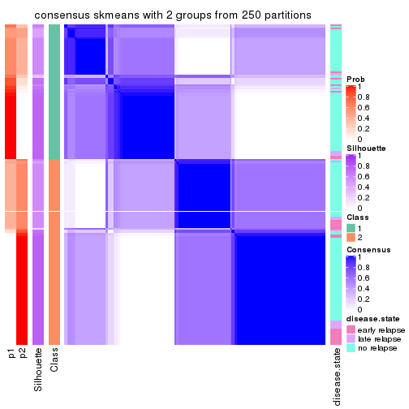</p>

</div>
<div id='tab-CV-skmeans-consensus-heatmap-2'>
<pre><code class="r">consensus_heatmap(res, k = 3)
</code></pre>

<p>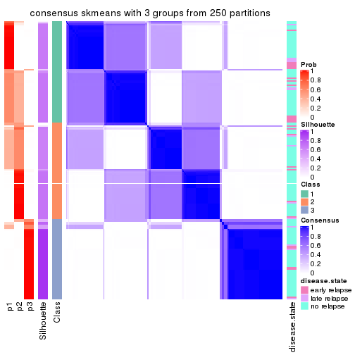</p>

</div>
<div id='tab-CV-skmeans-consensus-heatmap-3'>
<pre><code class="r">consensus_heatmap(res, k = 4)
</code></pre>

<p>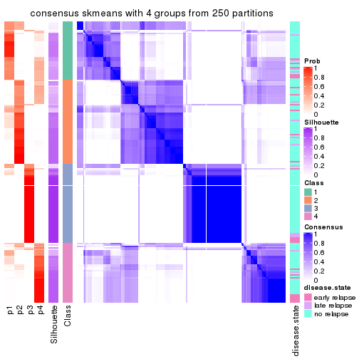</p>

</div>
<div id='tab-CV-skmeans-consensus-heatmap-4'>
<pre><code class="r">consensus_heatmap(res, k = 5)
</code></pre>

<p>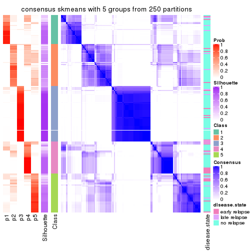</p>

</div>
<div id='tab-CV-skmeans-consensus-heatmap-5'>
<pre><code class="r">consensus_heatmap(res, k = 6)
</code></pre>

<p>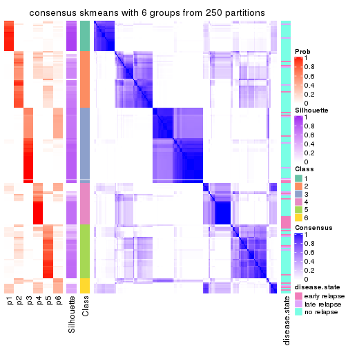</p>

</div>
</div>

Heatmaps for the membership of samples in all partitions to see how consistent they are:


<script>
$( function() {
	$( '#tabs-CV-skmeans-membership-heatmap' ).tabs();
} );
</script>
<div id='tabs-CV-skmeans-membership-heatmap'>
<ul>
<li><a href='#tab-CV-skmeans-membership-heatmap-1'>k = 2</a></li>
<li><a href='#tab-CV-skmeans-membership-heatmap-2'>k = 3</a></li>
<li><a href='#tab-CV-skmeans-membership-heatmap-3'>k = 4</a></li>
<li><a href='#tab-CV-skmeans-membership-heatmap-4'>k = 5</a></li>
<li><a href='#tab-CV-skmeans-membership-heatmap-5'>k = 6</a></li>
</ul>
<div id='tab-CV-skmeans-membership-heatmap-1'>
<pre><code class="r">membership_heatmap(res, k = 2)
</code></pre>

<p>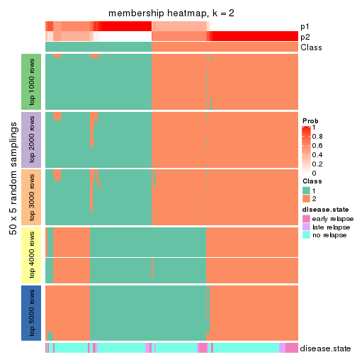</p>

</div>
<div id='tab-CV-skmeans-membership-heatmap-2'>
<pre><code class="r">membership_heatmap(res, k = 3)
</code></pre>

<p>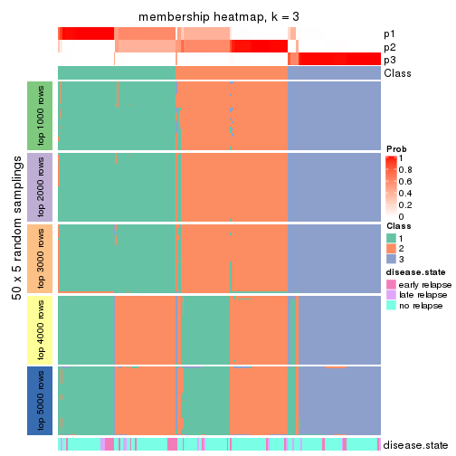</p>

</div>
<div id='tab-CV-skmeans-membership-heatmap-3'>
<pre><code class="r">membership_heatmap(res, k = 4)
</code></pre>

<p>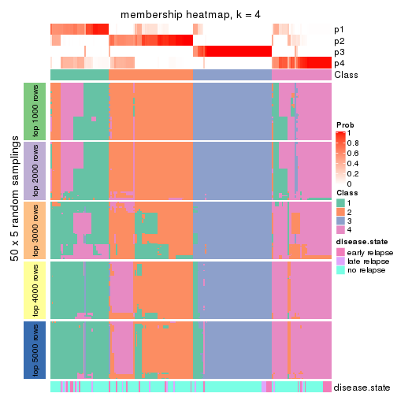</p>

</div>
<div id='tab-CV-skmeans-membership-heatmap-4'>
<pre><code class="r">membership_heatmap(res, k = 5)
</code></pre>

<p>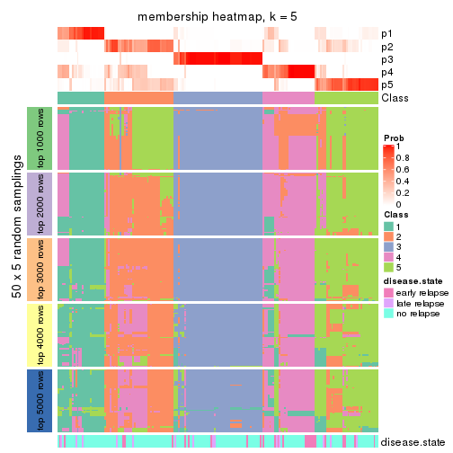</p>

</div>
<div id='tab-CV-skmeans-membership-heatmap-5'>
<pre><code class="r">membership_heatmap(res, k = 6)
</code></pre>

<p>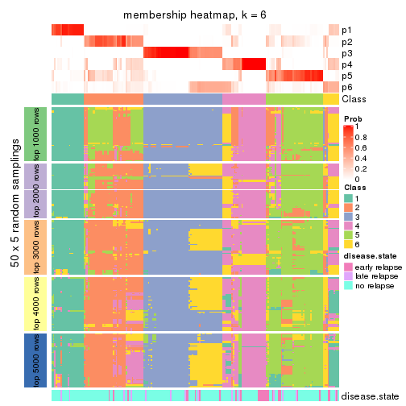</p>

</div>
</div>

As soon as we have had the classes for columns, we can look for signatures
which are significantly different between classes which can be candidate marks
for certain classes. Following are the heatmaps for signatures.


Signature heatmaps where rows are scaled:


<script>
$( function() {
	$( '#tabs-CV-skmeans-get-signatures' ).tabs();
} );
</script>
<div id='tabs-CV-skmeans-get-signatures'>
<ul>
<li><a href='#tab-CV-skmeans-get-signatures-1'>k = 2</a></li>
<li><a href='#tab-CV-skmeans-get-signatures-2'>k = 3</a></li>
<li><a href='#tab-CV-skmeans-get-signatures-3'>k = 4</a></li>
<li><a href='#tab-CV-skmeans-get-signatures-4'>k = 5</a></li>
<li><a href='#tab-CV-skmeans-get-signatures-5'>k = 6</a></li>
</ul>
<div id='tab-CV-skmeans-get-signatures-1'>
<pre><code class="r">get_signatures(res, k = 2)
</code></pre>

<p>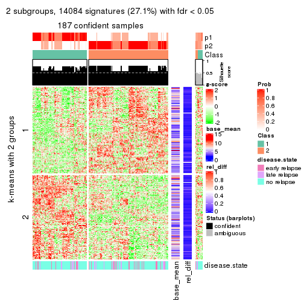</p>

</div>
<div id='tab-CV-skmeans-get-signatures-2'>
<pre><code class="r">get_signatures(res, k = 3)
</code></pre>

<p>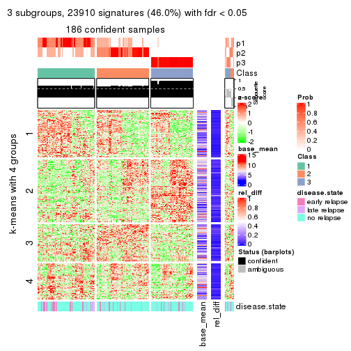</p>

</div>
<div id='tab-CV-skmeans-get-signatures-3'>
<pre><code class="r">get_signatures(res, k = 4)
</code></pre>

<p>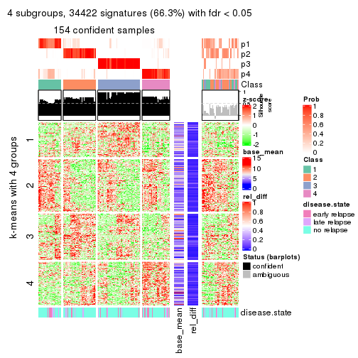</p>

</div>
<div id='tab-CV-skmeans-get-signatures-4'>
<pre><code class="r">get_signatures(res, k = 5)
</code></pre>

<p>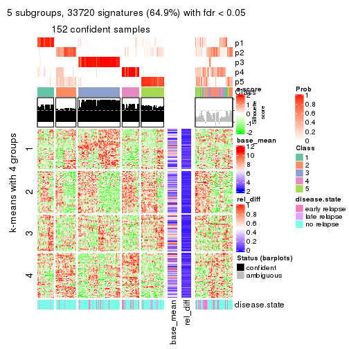</p>

</div>
<div id='tab-CV-skmeans-get-signatures-5'>
<pre><code class="r">get_signatures(res, k = 6)
</code></pre>

<p>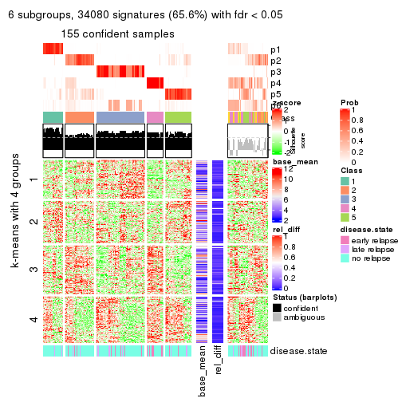</p>

</div>
</div>


Signature heatmaps where rows are not scaled:


<script>
$( function() {
	$( '#tabs-CV-skmeans-get-signatures-no-scale' ).tabs();
} );
</script>
<div id='tabs-CV-skmeans-get-signatures-no-scale'>
<ul>
<li><a href='#tab-CV-skmeans-get-signatures-no-scale-1'>k = 2</a></li>
<li><a href='#tab-CV-skmeans-get-signatures-no-scale-2'>k = 3</a></li>
<li><a href='#tab-CV-skmeans-get-signatures-no-scale-3'>k = 4</a></li>
<li><a href='#tab-CV-skmeans-get-signatures-no-scale-4'>k = 5</a></li>
<li><a href='#tab-CV-skmeans-get-signatures-no-scale-5'>k = 6</a></li>
</ul>
<div id='tab-CV-skmeans-get-signatures-no-scale-1'>
<pre><code class="r">get_signatures(res, k = 2, scale_rows = FALSE)
</code></pre>

<p>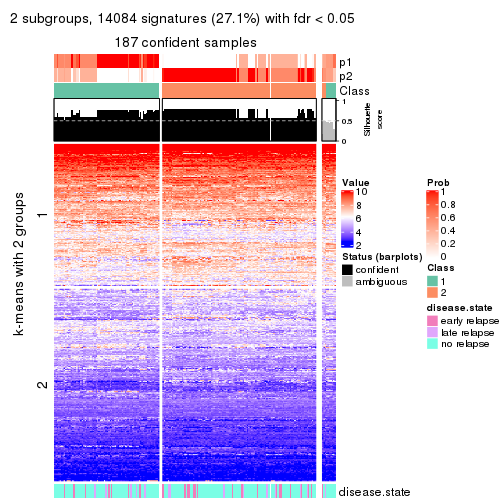</p>

</div>
<div id='tab-CV-skmeans-get-signatures-no-scale-2'>
<pre><code class="r">get_signatures(res, k = 3, scale_rows = FALSE)
</code></pre>

<p>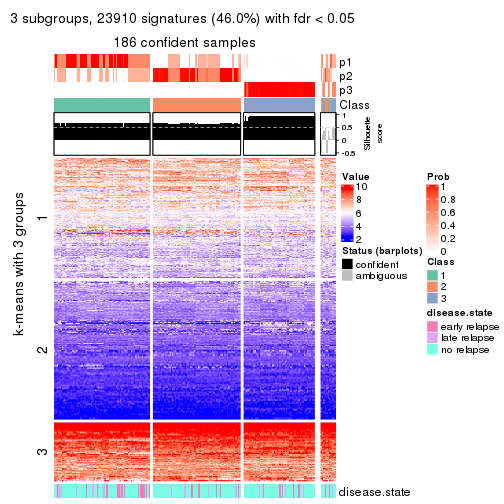</p>

</div>
<div id='tab-CV-skmeans-get-signatures-no-scale-3'>
<pre><code class="r">get_signatures(res, k = 4, scale_rows = FALSE)
</code></pre>

<p>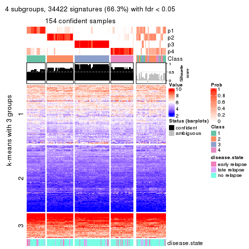</p>

</div>
<div id='tab-CV-skmeans-get-signatures-no-scale-4'>
<pre><code class="r">get_signatures(res, k = 5, scale_rows = FALSE)
</code></pre>

<p>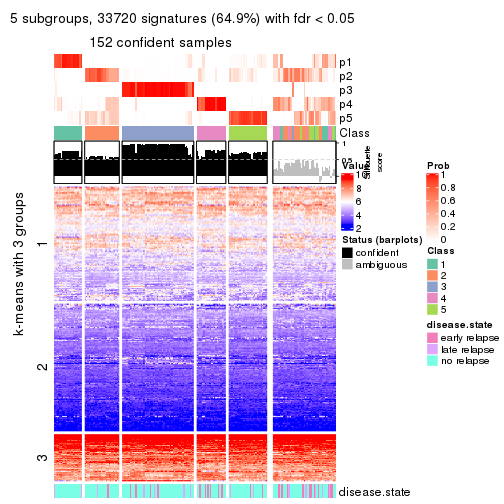</p>

</div>
<div id='tab-CV-skmeans-get-signatures-no-scale-5'>
<pre><code class="r">get_signatures(res, k = 6, scale_rows = FALSE)
</code></pre>

<p>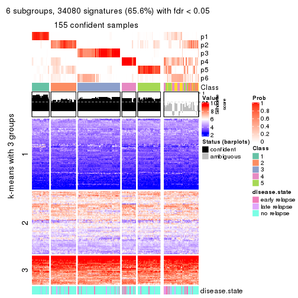</p>

</div>
</div>


Compare the overlap of signatures from different k:

```r
compare_signatures(res)
```

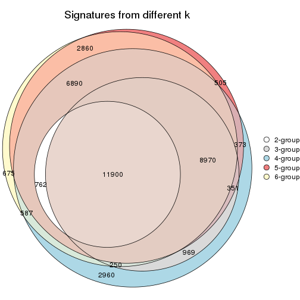

`get_signature()` returns a data frame invisibly. TO get the list of signatures, the function
call should be assigned to a variable explicitly. In following code, if `plot` argument is set
to `FALSE`, no heatmap is plotted while only the differential analysis is performed.

```r
# code only for demonstration
tb = get_signature(res, k = ..., plot = FALSE)
```

An example of the output of `tb` is:

```
#>   which_row         fdr    mean_1    mean_2 scaled_mean_1 scaled_mean_2 km
#> 1        38 0.042760348  8.373488  9.131774    -0.5533452     0.5164555  1
#> 2        40 0.018707592  7.106213  8.469186    -0.6173731     0.5762149  1
#> 3        55 0.019134737 10.221463 11.207825    -0.6159697     0.5749050  1
#> 4        59 0.006059896  5.921854  7.869574    -0.6899429     0.6439467  1
#> 5        60 0.018055526  8.928898 10.211722    -0.6204761     0.5791110  1
#> 6        98 0.009384629 15.714769 14.887706     0.6635654    -0.6193277  2
...
```

The columns in `tb` are:

1. `which_row`: row indices corresponding to the input matrix.
2. `fdr`: FDR for the differential test. 
3. `mean_x`: The mean value in group x.
4. `scaled_mean_x`: The mean value in group x after rows are scaled.
5. `km`: Row groups if k-means clustering is applied to rows.


UMAP plot which shows how samples are separated.


<script>
$( function() {
	$( '#tabs-CV-skmeans-dimension-reduction' ).tabs();
} );
</script>
<div id='tabs-CV-skmeans-dimension-reduction'>
<ul>
<li><a href='#tab-CV-skmeans-dimension-reduction-1'>k = 2</a></li>
<li><a href='#tab-CV-skmeans-dimension-reduction-2'>k = 3</a></li>
<li><a href='#tab-CV-skmeans-dimension-reduction-3'>k = 4</a></li>
<li><a href='#tab-CV-skmeans-dimension-reduction-4'>k = 5</a></li>
<li><a href='#tab-CV-skmeans-dimension-reduction-5'>k = 6</a></li>
</ul>
<div id='tab-CV-skmeans-dimension-reduction-1'>
<pre><code class="r">dimension_reduction(res, k = 2, method = &quot;UMAP&quot;)
</code></pre>

<p>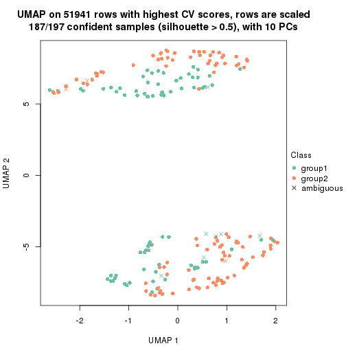</p>

</div>
<div id='tab-CV-skmeans-dimension-reduction-2'>
<pre><code class="r">dimension_reduction(res, k = 3, method = &quot;UMAP&quot;)
</code></pre>

<p>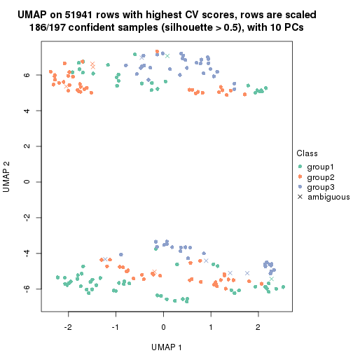</p>

</div>
<div id='tab-CV-skmeans-dimension-reduction-3'>
<pre><code class="r">dimension_reduction(res, k = 4, method = &quot;UMAP&quot;)
</code></pre>

<p>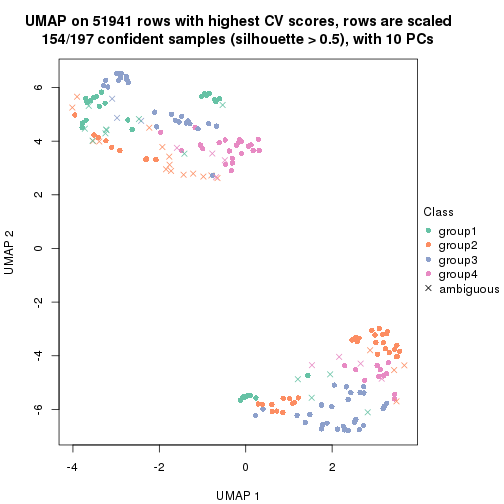</p>

</div>
<div id='tab-CV-skmeans-dimension-reduction-4'>
<pre><code class="r">dimension_reduction(res, k = 5, method = &quot;UMAP&quot;)
</code></pre>

<p>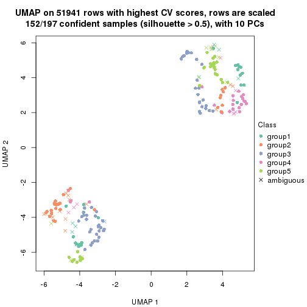</p>

</div>
<div id='tab-CV-skmeans-dimension-reduction-5'>
<pre><code class="r">dimension_reduction(res, k = 6, method = &quot;UMAP&quot;)
</code></pre>

<p>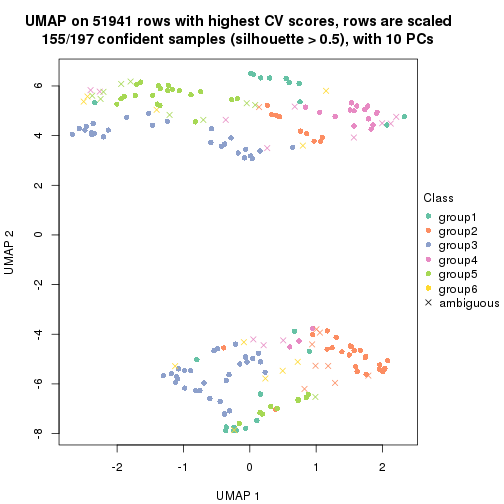</p>

</div>
</div>


Following heatmap shows how subgroups are split when increasing `k`:

```r
collect_classes(res)
```

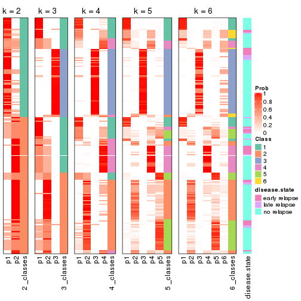


Test correlation between subgroups and known annotations. If the known
annotation is numeric, one-way ANOVA test is applied, and if the known
annotation is discrete, chi-squared contingency table test is applied.

```r
test_to_known_factors(res)
```

```
#>              n disease.state(p) k
#> CV:skmeans 187           0.6170 2
#> CV:skmeans 186           0.2047 3
#> CV:skmeans 154           0.1304 4
#> CV:skmeans 152           0.0277 5
#> CV:skmeans 155           0.0769 6
```


If matrix rows can be associated to genes, consider to use `functional_enrichment(res,
...)` to perform function enrichment for the signature genes. See [this vignette](http://bioconductor.org/packages/devel/bioc/vignettes/cola/inst/doc/functional_enrichment.html) for more detailed explanations.


 

---------------------------------------------------


### CV:pam


The object with results only for a single top-value method and a single partition method 
can be extracted as:

```r
res = res_list["CV", "pam"]
# you can also extract it by
# res = res_list["CV:pam"]
```

A summary of `res` and all the functions that can be applied to it:

```r
res
```

```
#> A 'ConsensusPartition' object with k = 2, 3, 4, 5, 6.
#>   On a matrix with 51941 rows and 197 columns.
#>   Top rows (1000, 2000, 3000, 4000, 5000) are extracted by 'CV' method.
#>   Subgroups are detected by 'pam' method.
#>   Performed in total 1250 partitions by row resampling.
#>   Best k for subgroups seems to be 2.
#> 
#> Following methods can be applied to this 'ConsensusPartition' object:
#>  [1] "cola_report"             "collect_classes"         "collect_plots"          
#>  [4] "collect_stats"           "colnames"                "compare_signatures"     
#>  [7] "consensus_heatmap"       "dimension_reduction"     "functional_enrichment"  
#> [10] "get_anno_col"            "get_anno"                "get_classes"            
#> [13] "get_consensus"           "get_matrix"              "get_membership"         
#> [16] "get_param"               "get_signatures"          "get_stats"              
#> [19] "is_best_k"               "is_stable_k"             "membership_heatmap"     
#> [22] "ncol"                    "nrow"                    "plot_ecdf"              
#> [25] "rownames"                "select_partition_number" "show"                   
#> [28] "suggest_best_k"          "test_to_known_factors"
```

`collect_plots()` function collects all the plots made from `res` for all `k` (number of partitions)
into one single page to provide an easy and fast comparison between different `k`.

```r
collect_plots(res)
```

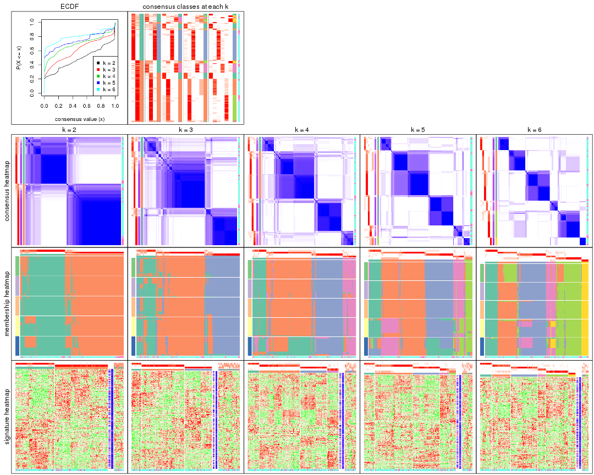

The plots are:

- The first row: a plot of the ECDF (empirical cumulative distribution
  function) curves of the consensus matrix for each `k` and the heatmap of
  predicted classes for each `k`.
- The second row: heatmaps of the consensus matrix for each `k`.
- The third row: heatmaps of the membership matrix for each `k`.
- The fouth row: heatmaps of the signatures for each `k`.

All the plots in panels can be made by individual functions and they are
plotted later in this section.

`select_partition_number()` produces several plots showing different
statistics for choosing "optimized" `k`. There are following statistics:

- ECDF curves of the consensus matrix for each `k`;
- 1-PAC. [The PAC
  score](https://en.wikipedia.org/wiki/Consensus_clustering#Over-interpretation_potential_of_consensus_clustering)
  measures the proportion of the ambiguous subgrouping.
- Mean silhouette score.
- Concordance. The mean probability of fiting the consensus class ids in all
  partitions.
- Area increased. Denote $A_k$ as the area under the ECDF curve for current
  `k`, the area increased is defined as $A_k - A_{k-1}$.
- Rand index. The percent of pairs of samples that are both in a same cluster
  or both are not in a same cluster in the partition of k and k-1.
- Jaccard index. The ratio of pairs of samples are both in a same cluster in
  the partition of k and k-1 and the pairs of samples are both in a same
  cluster in the partition k or k-1.

The detailed explanations of these statistics can be found in [the _cola_
vignette](http://bioconductor.org/packages/devel/bioc/vignettes/cola/inst/doc/cola.html#toc_13).

Generally speaking, lower PAC score, higher mean silhouette score or higher
concordance corresponds to better partition. Rand index and Jaccard index
measure how similar the current partition is compared to partition with `k-1`.
If they are too similar, we won't accept `k` is better than `k-1`.

```r
select_partition_number(res)
```

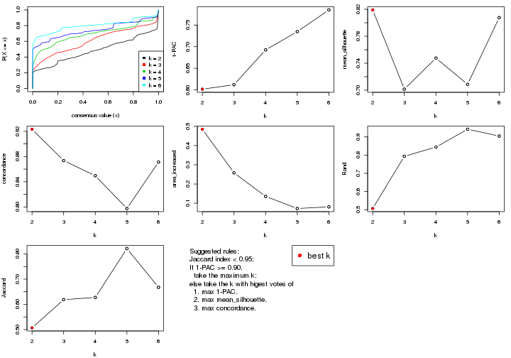

The numeric values for all these statistics can be obtained by `get_stats()`.

```r
get_stats(res)
```

```
#>   k 1-PAC mean_silhouette concordance area_increased  Rand Jaccard
#> 2 2 0.602           0.819       0.923         0.4848 0.507   0.507
#> 3 3 0.612           0.702       0.874         0.2580 0.794   0.619
#> 4 4 0.693           0.748       0.850         0.1355 0.844   0.627
#> 5 5 0.735           0.709       0.798         0.0726 0.942   0.821
#> 6 6 0.785           0.808       0.871         0.0810 0.905   0.668
```

`suggest_best_k()` suggests the best $k$ based on these statistics. The rules are as follows:

- All $k$ with Jaccard index larger than 0.95 are removed because increasing
  $k$ does not provide enough extra information. If all $k$ are removed, it is
  marked as no subgroup is detected.
- For all $k$ with 1-PAC score larger than 0.9, the maximal $k$ is taken as
  the best $k$, and other $k$ are marked as optional $k$.
- If it does not fit the second rule. The $k$ with the maximal vote of the
  highest 1-PAC score, highest mean silhouette, and highest concordance is
  taken as the best $k$.

```r
suggest_best_k(res)
```

```
#> [1] 2
```


Following shows the table of the partitions (You need to click the **show/hide
code output** link to see it). The membership matrix (columns with name `p*`)
is inferred by
[`clue::cl_consensus()`](https://www.rdocumentation.org/link/cl_consensus?package=clue)
function with the `SE` method. Basically the value in the membership matrix
represents the probability to belong to a certain group. The finall class
label for an item is determined with the group with highest probability it
belongs to.

In `get_classes()` function, the entropy is calculated from the membership
matrix and the silhouette score is calculated from the consensus matrix.


<script>
$( function() {
	$( '#tabs-CV-pam-get-classes' ).tabs();
} );
</script>
<div id='tabs-CV-pam-get-classes'>
<ul>
<li><a href='#tab-CV-pam-get-classes-1'>k = 2</a></li>
<li><a href='#tab-CV-pam-get-classes-2'>k = 3</a></li>
<li><a href='#tab-CV-pam-get-classes-3'>k = 4</a></li>
<li><a href='#tab-CV-pam-get-classes-4'>k = 5</a></li>
<li><a href='#tab-CV-pam-get-classes-5'>k = 6</a></li>
</ul>

<div id='tab-CV-pam-get-classes-1'>
<p><a id='tab-CV-pam-get-classes-1-a' style='color:#0366d6' href='#'>show/hide code output</a></p>
<pre><code class="r">cbind(get_classes(res, k = 2), get_membership(res, k = 2))
</code></pre>

<pre><code>#&gt;           class entropy silhouette    p1    p2
#&gt; GSM342319     2  0.0000     0.9311 0.000 1.000
#&gt; GSM342323     2  0.0000     0.9311 0.000 1.000
#&gt; GSM342325     2  0.0000     0.9311 0.000 1.000
#&gt; GSM342326     2  0.2043     0.9068 0.032 0.968
#&gt; GSM342327     2  0.9686     0.2531 0.396 0.604
#&gt; GSM342329     2  0.9209     0.4247 0.336 0.664
#&gt; GSM342331     2  0.9393     0.3709 0.356 0.644
#&gt; GSM342334     2  0.0000     0.9311 0.000 1.000
#&gt; GSM342335     2  0.0000     0.9311 0.000 1.000
#&gt; GSM342354     1  0.0000     0.8844 1.000 0.000
#&gt; GSM342371     2  0.0000     0.9311 0.000 1.000
#&gt; GSM342380     2  0.0376     0.9284 0.004 0.996
#&gt; GSM342382     2  0.0000     0.9311 0.000 1.000
#&gt; GSM342399     2  0.0000     0.9311 0.000 1.000
#&gt; GSM342402     2  0.0000     0.9311 0.000 1.000
#&gt; GSM342404     2  0.0000     0.9311 0.000 1.000
#&gt; GSM342408     1  0.0000     0.8844 1.000 0.000
#&gt; GSM342409     2  0.0000     0.9311 0.000 1.000
#&gt; GSM342426     1  0.9954     0.1693 0.540 0.460
#&gt; GSM342441     1  0.0000     0.8844 1.000 0.000
#&gt; GSM342444     1  0.0000     0.8844 1.000 0.000
#&gt; GSM342451     1  0.0000     0.8844 1.000 0.000
#&gt; GSM342462     2  0.0000     0.9311 0.000 1.000
#&gt; GSM342467     1  0.7219     0.7596 0.800 0.200
#&gt; GSM342484     1  0.9933     0.1866 0.548 0.452
#&gt; GSM342491     1  0.5842     0.7946 0.860 0.140
#&gt; GSM342322     2  0.0000     0.9311 0.000 1.000
#&gt; GSM342338     1  0.0000     0.8844 1.000 0.000
#&gt; GSM342347     1  0.6247     0.7938 0.844 0.156
#&gt; GSM342356     1  0.7056     0.7656 0.808 0.192
#&gt; GSM342357     2  0.0376     0.9284 0.004 0.996
#&gt; GSM342366     2  0.0000     0.9311 0.000 1.000
#&gt; GSM342385     2  0.0000     0.9311 0.000 1.000
#&gt; GSM342421     2  0.0000     0.9311 0.000 1.000
#&gt; GSM342437     1  0.2603     0.8632 0.956 0.044
#&gt; GSM342454     1  0.0000     0.8844 1.000 0.000
#&gt; GSM342471     2  0.9248     0.4211 0.340 0.660
#&gt; GSM342477     1  0.9732     0.4219 0.596 0.404
#&gt; GSM342495     2  0.0000     0.9311 0.000 1.000
#&gt; GSM342496     2  0.6623     0.7488 0.172 0.828
#&gt; GSM342320     2  0.9491     0.3375 0.368 0.632
#&gt; GSM342321     2  0.0000     0.9311 0.000 1.000
#&gt; GSM342324     2  0.6531     0.7529 0.168 0.832
#&gt; GSM342328     2  0.1633     0.9135 0.024 0.976
#&gt; GSM342330     2  0.9881     0.1139 0.436 0.564
#&gt; GSM342332     2  0.0000     0.9311 0.000 1.000
#&gt; GSM342333     2  0.8386     0.5753 0.268 0.732
#&gt; GSM342336     2  0.9754     0.2305 0.408 0.592
#&gt; GSM342337     1  0.7056     0.7656 0.808 0.192
#&gt; GSM342339     1  0.0000     0.8844 1.000 0.000
#&gt; GSM342340     1  0.6801     0.7356 0.820 0.180
#&gt; GSM342341     1  0.0000     0.8844 1.000 0.000
#&gt; GSM342342     1  0.0000     0.8844 1.000 0.000
#&gt; GSM342343     1  0.4022     0.8447 0.920 0.080
#&gt; GSM342344     1  0.0000     0.8844 1.000 0.000
#&gt; GSM342345     1  0.0000     0.8844 1.000 0.000
#&gt; GSM342346     1  0.8813     0.5748 0.700 0.300
#&gt; GSM342348     1  0.8016     0.7127 0.756 0.244
#&gt; GSM342349     1  0.0000     0.8844 1.000 0.000
#&gt; GSM342350     1  0.0000     0.8844 1.000 0.000
#&gt; GSM342351     1  0.0000     0.8844 1.000 0.000
#&gt; GSM342352     1  0.0000     0.8844 1.000 0.000
#&gt; GSM342353     1  0.0000     0.8844 1.000 0.000
#&gt; GSM342355     1  0.7056     0.7656 0.808 0.192
#&gt; GSM342358     1  0.9661     0.4566 0.608 0.392
#&gt; GSM342359     1  0.9323     0.5509 0.652 0.348
#&gt; GSM342360     1  0.9909     0.3195 0.556 0.444
#&gt; GSM342361     1  0.0376     0.8828 0.996 0.004
#&gt; GSM342362     2  0.0000     0.9311 0.000 1.000
#&gt; GSM342363     2  0.0000     0.9311 0.000 1.000
#&gt; GSM342364     2  0.0000     0.9311 0.000 1.000
#&gt; GSM342365     2  0.0000     0.9311 0.000 1.000
#&gt; GSM342367     2  0.0000     0.9311 0.000 1.000
#&gt; GSM342368     2  0.0000     0.9311 0.000 1.000
#&gt; GSM342369     2  0.0000     0.9311 0.000 1.000
#&gt; GSM342370     2  0.0000     0.9311 0.000 1.000
#&gt; GSM342372     2  0.0000     0.9311 0.000 1.000
#&gt; GSM342373     2  0.0000     0.9311 0.000 1.000
#&gt; GSM342374     2  0.0000     0.9311 0.000 1.000
#&gt; GSM342375     2  0.3114     0.8848 0.056 0.944
#&gt; GSM342376     2  0.0000     0.9311 0.000 1.000
#&gt; GSM342377     2  0.0000     0.9311 0.000 1.000
#&gt; GSM342378     2  0.0000     0.9311 0.000 1.000
#&gt; GSM342379     2  0.0000     0.9311 0.000 1.000
#&gt; GSM342381     2  0.0000     0.9311 0.000 1.000
#&gt; GSM342383     2  0.0000     0.9311 0.000 1.000
#&gt; GSM342384     2  0.0000     0.9311 0.000 1.000
#&gt; GSM342386     2  0.0000     0.9311 0.000 1.000
#&gt; GSM342387     2  0.0000     0.9311 0.000 1.000
#&gt; GSM342388     2  0.9552     0.3246 0.376 0.624
#&gt; GSM342389     2  0.0000     0.9311 0.000 1.000
#&gt; GSM342390     1  0.7056     0.7656 0.808 0.192
#&gt; GSM342391     1  0.7056     0.7656 0.808 0.192
#&gt; GSM342392     1  0.0000     0.8844 1.000 0.000
#&gt; GSM342393     2  0.3879     0.8653 0.076 0.924
#&gt; GSM342394     2  0.0000     0.9311 0.000 1.000
#&gt; GSM342395     2  0.0000     0.9311 0.000 1.000
#&gt; GSM342396     1  0.0000     0.8844 1.000 0.000
#&gt; GSM342397     1  0.0000     0.8844 1.000 0.000
#&gt; GSM342398     2  0.0000     0.9311 0.000 1.000
#&gt; GSM342400     2  0.0000     0.9311 0.000 1.000
#&gt; GSM342401     1  0.0000     0.8844 1.000 0.000
#&gt; GSM342403     2  0.0000     0.9311 0.000 1.000
#&gt; GSM342405     1  0.8555     0.6649 0.720 0.280
#&gt; GSM342406     1  0.7056     0.7656 0.808 0.192
#&gt; GSM342407     1  0.0000     0.8844 1.000 0.000
#&gt; GSM342410     1  0.9795     0.3805 0.584 0.416
#&gt; GSM342411     2  0.0000     0.9311 0.000 1.000
#&gt; GSM342412     2  0.0000     0.9311 0.000 1.000
#&gt; GSM342413     1  0.7056     0.7656 0.808 0.192
#&gt; GSM342414     1  0.0000     0.8844 1.000 0.000
#&gt; GSM342415     2  0.0000     0.9311 0.000 1.000
#&gt; GSM342416     1  0.7056     0.7656 0.808 0.192
#&gt; GSM342417     2  0.0000     0.9311 0.000 1.000
#&gt; GSM342418     2  0.1184     0.9198 0.016 0.984
#&gt; GSM342419     2  0.0000     0.9311 0.000 1.000
#&gt; GSM342420     2  0.7376     0.6904 0.208 0.792
#&gt; GSM342422     2  0.0000     0.9311 0.000 1.000
#&gt; GSM342423     2  0.0000     0.9311 0.000 1.000
#&gt; GSM342424     2  0.6247     0.7697 0.156 0.844
#&gt; GSM342425     1  0.9933     0.1976 0.548 0.452
#&gt; GSM342427     1  0.9552     0.4929 0.624 0.376
#&gt; GSM342428     2  0.9996    -0.0995 0.488 0.512
#&gt; GSM342429     2  0.6801     0.7393 0.180 0.820
#&gt; GSM342430     1  0.0000     0.8844 1.000 0.000
#&gt; GSM342431     1  0.0000     0.8844 1.000 0.000
#&gt; GSM342432     1  0.0000     0.8844 1.000 0.000
#&gt; GSM342433     1  0.0000     0.8844 1.000 0.000
#&gt; GSM342434     1  0.0000     0.8844 1.000 0.000
#&gt; GSM342435     1  0.0000     0.8844 1.000 0.000
#&gt; GSM342436     1  0.0000     0.8844 1.000 0.000
#&gt; GSM342438     1  0.0000     0.8844 1.000 0.000
#&gt; GSM342439     1  0.0000     0.8844 1.000 0.000
#&gt; GSM342440     1  0.0000     0.8844 1.000 0.000
#&gt; GSM342442     1  0.0000     0.8844 1.000 0.000
#&gt; GSM342443     2  0.0000     0.9311 0.000 1.000
#&gt; GSM342445     1  0.0000     0.8844 1.000 0.000
#&gt; GSM342446     1  0.0000     0.8844 1.000 0.000
#&gt; GSM342447     1  0.0000     0.8844 1.000 0.000
#&gt; GSM342448     1  0.0000     0.8844 1.000 0.000
#&gt; GSM342449     1  0.0000     0.8844 1.000 0.000
#&gt; GSM342450     1  0.0000     0.8844 1.000 0.000
#&gt; GSM342452     1  0.0000     0.8844 1.000 0.000
#&gt; GSM342453     1  0.0000     0.8844 1.000 0.000
#&gt; GSM342455     1  0.0000     0.8844 1.000 0.000
#&gt; GSM342456     1  0.7219     0.7304 0.800 0.200
#&gt; GSM342457     2  0.0000     0.9311 0.000 1.000
#&gt; GSM342458     2  0.0000     0.9311 0.000 1.000
#&gt; GSM342459     2  0.0000     0.9311 0.000 1.000
#&gt; GSM342460     2  0.0000     0.9311 0.000 1.000
#&gt; GSM342461     2  0.0000     0.9311 0.000 1.000
#&gt; GSM342463     2  0.0000     0.9311 0.000 1.000
#&gt; GSM342464     2  0.0000     0.9311 0.000 1.000
#&gt; GSM342465     2  0.0000     0.9311 0.000 1.000
#&gt; GSM342466     1  0.7056     0.7656 0.808 0.192
#&gt; GSM342468     2  0.0000     0.9311 0.000 1.000
#&gt; GSM342469     2  0.0000     0.9311 0.000 1.000
#&gt; GSM342470     1  0.0000     0.8844 1.000 0.000
#&gt; GSM342472     1  0.0938     0.8792 0.988 0.012
#&gt; GSM342473     2  0.0000     0.9311 0.000 1.000
#&gt; GSM342474     2  0.0000     0.9311 0.000 1.000
#&gt; GSM342475     1  0.0000     0.8844 1.000 0.000
#&gt; GSM342476     2  0.4690     0.8391 0.100 0.900
#&gt; GSM342478     2  0.4815     0.8346 0.104 0.896
#&gt; GSM342479     2  0.6801     0.7391 0.180 0.820
#&gt; GSM342480     2  0.3431     0.8788 0.064 0.936
#&gt; GSM342481     2  0.0000     0.9311 0.000 1.000
#&gt; GSM342482     2  0.0000     0.9311 0.000 1.000
#&gt; GSM342483     2  0.0376     0.9284 0.004 0.996
#&gt; GSM342485     2  0.0000     0.9311 0.000 1.000
#&gt; GSM342486     2  0.0000     0.9311 0.000 1.000
#&gt; GSM342487     1  0.0000     0.8844 1.000 0.000
#&gt; GSM342488     2  0.2948     0.8885 0.052 0.948
#&gt; GSM342489     2  0.0000     0.9311 0.000 1.000
#&gt; GSM342490     1  0.9944     0.1748 0.544 0.456
#&gt; GSM342492     1  0.0000     0.8844 1.000 0.000
#&gt; GSM342493     2  0.0000     0.9311 0.000 1.000
#&gt; GSM342494     2  0.6712     0.7656 0.176 0.824
#&gt; GSM342497     2  0.9983     0.0707 0.476 0.524
#&gt; GSM342498     2  0.0000     0.9311 0.000 1.000
#&gt; GSM342499     2  0.4939     0.8351 0.108 0.892
#&gt; GSM342500     2  0.0000     0.9311 0.000 1.000
#&gt; GSM342501     2  0.1414     0.9168 0.020 0.980
#&gt; GSM342502     2  0.0000     0.9311 0.000 1.000
#&gt; GSM342503     2  0.0000     0.9311 0.000 1.000
#&gt; GSM342504     2  0.1633     0.9131 0.024 0.976
#&gt; GSM342505     1  0.0000     0.8844 1.000 0.000
#&gt; GSM342506     1  0.8861     0.6232 0.696 0.304
#&gt; GSM342507     1  0.8386     0.6817 0.732 0.268
#&gt; GSM342508     2  0.8207     0.5982 0.256 0.744
#&gt; GSM342509     1  0.6247     0.7786 0.844 0.156
#&gt; GSM342510     1  0.6973     0.7442 0.812 0.188
#&gt; GSM342511     1  0.0672     0.8811 0.992 0.008
#&gt; GSM342512     2  0.0000     0.9311 0.000 1.000
#&gt; GSM342513     2  0.0000     0.9311 0.000 1.000
#&gt; GSM342514     1  0.0000     0.8844 1.000 0.000
#&gt; GSM342515     2  0.0000     0.9311 0.000 1.000
</code></pre>

<script>
$('#tab-CV-pam-get-classes-1-a').parent().next().next().hide();
$('#tab-CV-pam-get-classes-1-a').click(function(){
  $('#tab-CV-pam-get-classes-1-a').parent().next().next().toggle();
  return(false);
});
</script>
</div>

<div id='tab-CV-pam-get-classes-2'>
<p><a id='tab-CV-pam-get-classes-2-a' style='color:#0366d6' href='#'>show/hide code output</a></p>
<pre><code class="r">cbind(get_classes(res, k = 3), get_membership(res, k = 3))
</code></pre>

<pre><code>#&gt;           class entropy silhouette    p1    p2    p3
#&gt; GSM342319     1  0.6305    0.18536 0.516 0.484 0.000
#&gt; GSM342323     1  0.3038    0.71274 0.896 0.104 0.000
#&gt; GSM342325     2  0.6204    0.13850 0.424 0.576 0.000
#&gt; GSM342326     1  0.6026    0.43983 0.624 0.376 0.000
#&gt; GSM342327     1  0.1753    0.70383 0.952 0.048 0.000
#&gt; GSM342329     1  0.2356    0.70831 0.928 0.072 0.000
#&gt; GSM342331     1  0.2625    0.71259 0.916 0.084 0.000
#&gt; GSM342334     2  0.0892    0.88390 0.020 0.980 0.000
#&gt; GSM342335     2  0.0000    0.89467 0.000 1.000 0.000
#&gt; GSM342354     3  0.0747    0.84415 0.016 0.000 0.984
#&gt; GSM342371     2  0.0000    0.89467 0.000 1.000 0.000
#&gt; GSM342380     2  0.0747    0.88595 0.016 0.984 0.000
#&gt; GSM342382     2  0.0000    0.89467 0.000 1.000 0.000
#&gt; GSM342399     2  0.4842    0.64197 0.224 0.776 0.000
#&gt; GSM342402     1  0.6308    0.20179 0.508 0.492 0.000
#&gt; GSM342404     2  0.0592    0.88838 0.012 0.988 0.000
#&gt; GSM342408     3  0.0747    0.84415 0.016 0.000 0.984
#&gt; GSM342409     2  0.0592    0.88855 0.012 0.988 0.000
#&gt; GSM342426     1  0.1860    0.70550 0.948 0.052 0.000
#&gt; GSM342441     3  0.0000    0.84517 0.000 0.000 1.000
#&gt; GSM342444     3  0.0000    0.84517 0.000 0.000 1.000
#&gt; GSM342451     3  0.0000    0.84517 0.000 0.000 1.000
#&gt; GSM342462     2  0.0000    0.89467 0.000 1.000 0.000
#&gt; GSM342467     3  0.7346    0.24520 0.032 0.432 0.536
#&gt; GSM342484     1  0.8961    0.41353 0.504 0.360 0.136
#&gt; GSM342491     1  0.6379    0.49081 0.712 0.032 0.256
#&gt; GSM342322     1  0.6286    0.22404 0.536 0.464 0.000
#&gt; GSM342338     3  0.0747    0.84415 0.016 0.000 0.984
#&gt; GSM342347     3  0.6341    0.45275 0.016 0.312 0.672
#&gt; GSM342356     3  0.6154    0.31071 0.000 0.408 0.592
#&gt; GSM342357     1  0.6305    0.22364 0.516 0.484 0.000
#&gt; GSM342366     2  0.0000    0.89467 0.000 1.000 0.000
#&gt; GSM342385     2  0.0747    0.88595 0.016 0.984 0.000
#&gt; GSM342421     2  0.0000    0.89467 0.000 1.000 0.000
#&gt; GSM342437     1  0.6451    0.27278 0.608 0.008 0.384
#&gt; GSM342454     3  0.0000    0.84517 0.000 0.000 1.000
#&gt; GSM342471     2  0.8167    0.40378 0.212 0.640 0.148
#&gt; GSM342477     2  0.6836    0.50032 0.056 0.704 0.240
#&gt; GSM342495     2  0.0000    0.89467 0.000 1.000 0.000
#&gt; GSM342496     2  0.6045    0.28698 0.000 0.620 0.380
#&gt; GSM342320     1  0.2165    0.70850 0.936 0.064 0.000
#&gt; GSM342321     1  0.6111    0.38526 0.604 0.396 0.000
#&gt; GSM342324     1  0.1411    0.69445 0.964 0.036 0.000
#&gt; GSM342328     1  0.2711    0.71131 0.912 0.088 0.000
#&gt; GSM342330     1  0.1753    0.70156 0.952 0.048 0.000
#&gt; GSM342332     1  0.6192    0.35351 0.580 0.420 0.000
#&gt; GSM342333     2  0.3846    0.77898 0.016 0.876 0.108
#&gt; GSM342336     2  0.8405    0.31011 0.132 0.604 0.264
#&gt; GSM342337     3  0.6154    0.31071 0.000 0.408 0.592
#&gt; GSM342339     3  0.0000    0.84517 0.000 0.000 1.000
#&gt; GSM342340     3  0.0000    0.84517 0.000 0.000 1.000
#&gt; GSM342341     3  0.0000    0.84517 0.000 0.000 1.000
#&gt; GSM342342     3  0.0000    0.84517 0.000 0.000 1.000
#&gt; GSM342343     3  0.3551    0.70621 0.000 0.132 0.868
#&gt; GSM342344     3  0.0747    0.84415 0.016 0.000 0.984
#&gt; GSM342345     3  0.0000    0.84517 0.000 0.000 1.000
#&gt; GSM342346     3  0.7221    0.54308 0.136 0.148 0.716
#&gt; GSM342348     3  0.8009    0.23755 0.064 0.412 0.524
#&gt; GSM342349     3  0.0747    0.84415 0.016 0.000 0.984
#&gt; GSM342350     3  0.0747    0.84415 0.016 0.000 0.984
#&gt; GSM342351     3  0.0747    0.84415 0.016 0.000 0.984
#&gt; GSM342352     3  0.0747    0.84415 0.016 0.000 0.984
#&gt; GSM342353     3  0.0747    0.84415 0.016 0.000 0.984
#&gt; GSM342355     3  0.7181    0.29296 0.028 0.408 0.564
#&gt; GSM342358     1  0.1411    0.69445 0.964 0.036 0.000
#&gt; GSM342359     1  0.1711    0.69137 0.960 0.032 0.008
#&gt; GSM342360     1  0.6410    0.65369 0.764 0.144 0.092
#&gt; GSM342361     1  0.6941   -0.00914 0.520 0.016 0.464
#&gt; GSM342362     1  0.6305    0.22364 0.516 0.484 0.000
#&gt; GSM342363     1  0.6307    0.21312 0.512 0.488 0.000
#&gt; GSM342364     2  0.0000    0.89467 0.000 1.000 0.000
#&gt; GSM342365     2  0.0000    0.89467 0.000 1.000 0.000
#&gt; GSM342367     2  0.0000    0.89467 0.000 1.000 0.000
#&gt; GSM342368     2  0.0000    0.89467 0.000 1.000 0.000
#&gt; GSM342369     2  0.0000    0.89467 0.000 1.000 0.000
#&gt; GSM342370     2  0.0424    0.89071 0.008 0.992 0.000
#&gt; GSM342372     2  0.0000    0.89467 0.000 1.000 0.000
#&gt; GSM342373     2  0.0000    0.89467 0.000 1.000 0.000
#&gt; GSM342374     2  0.0000    0.89467 0.000 1.000 0.000
#&gt; GSM342375     2  0.0237    0.89237 0.000 0.996 0.004
#&gt; GSM342376     2  0.0000    0.89467 0.000 1.000 0.000
#&gt; GSM342377     2  0.0000    0.89467 0.000 1.000 0.000
#&gt; GSM342378     2  0.2711    0.82822 0.088 0.912 0.000
#&gt; GSM342379     2  0.4062    0.72496 0.164 0.836 0.000
#&gt; GSM342381     2  0.0000    0.89467 0.000 1.000 0.000
#&gt; GSM342383     2  0.0747    0.88595 0.016 0.984 0.000
#&gt; GSM342384     2  0.0000    0.89467 0.000 1.000 0.000
#&gt; GSM342386     2  0.0000    0.89467 0.000 1.000 0.000
#&gt; GSM342387     2  0.4750    0.66485 0.216 0.784 0.000
#&gt; GSM342388     2  0.5560    0.49141 0.000 0.700 0.300
#&gt; GSM342389     2  0.0000    0.89467 0.000 1.000 0.000
#&gt; GSM342390     3  0.8581    0.02516 0.444 0.096 0.460
#&gt; GSM342391     3  0.8000    0.24966 0.064 0.408 0.528
#&gt; GSM342392     3  0.0000    0.84517 0.000 0.000 1.000
#&gt; GSM342393     2  0.1289    0.87608 0.032 0.968 0.000
#&gt; GSM342394     2  0.4235    0.71850 0.176 0.824 0.000
#&gt; GSM342395     2  0.0000    0.89467 0.000 1.000 0.000
#&gt; GSM342396     3  0.0000    0.84517 0.000 0.000 1.000
#&gt; GSM342397     3  0.1163    0.83614 0.028 0.000 0.972
#&gt; GSM342398     2  0.0000    0.89467 0.000 1.000 0.000
#&gt; GSM342400     2  0.0000    0.89467 0.000 1.000 0.000
#&gt; GSM342401     3  0.0000    0.84517 0.000 0.000 1.000
#&gt; GSM342403     2  0.0747    0.88595 0.016 0.984 0.000
#&gt; GSM342405     2  0.7067   -0.02976 0.020 0.512 0.468
#&gt; GSM342406     1  0.8410    0.23930 0.544 0.096 0.360
#&gt; GSM342407     3  0.0747    0.84415 0.016 0.000 0.984
#&gt; GSM342410     3  0.9751    0.03152 0.252 0.308 0.440
#&gt; GSM342411     2  0.4399    0.70661 0.188 0.812 0.000
#&gt; GSM342412     2  0.0747    0.88595 0.016 0.984 0.000
#&gt; GSM342413     1  0.8581   -0.01616 0.456 0.096 0.448
#&gt; GSM342414     3  0.0747    0.84415 0.016 0.000 0.984
#&gt; GSM342415     2  0.0747    0.88595 0.016 0.984 0.000
#&gt; GSM342416     3  0.8649    0.21323 0.360 0.112 0.528
#&gt; GSM342417     1  0.4235    0.69543 0.824 0.176 0.000
#&gt; GSM342418     1  0.1964    0.70327 0.944 0.056 0.000
#&gt; GSM342419     2  0.0000    0.89467 0.000 1.000 0.000
#&gt; GSM342420     1  0.2711    0.71263 0.912 0.088 0.000
#&gt; GSM342422     2  0.0000    0.89467 0.000 1.000 0.000
#&gt; GSM342423     2  0.0000    0.89467 0.000 1.000 0.000
#&gt; GSM342424     1  0.4291    0.66842 0.820 0.180 0.000
#&gt; GSM342425     1  0.2356    0.70831 0.928 0.072 0.000
#&gt; GSM342427     2  0.7207    0.24839 0.032 0.584 0.384
#&gt; GSM342428     1  0.8743    0.23392 0.452 0.440 0.108
#&gt; GSM342429     2  0.8762    0.00111 0.112 0.484 0.404
#&gt; GSM342430     3  0.0000    0.84517 0.000 0.000 1.000
#&gt; GSM342431     3  0.0000    0.84517 0.000 0.000 1.000
#&gt; GSM342432     3  0.0000    0.84517 0.000 0.000 1.000
#&gt; GSM342433     3  0.0747    0.84415 0.016 0.000 0.984
#&gt; GSM342434     3  0.0747    0.84415 0.016 0.000 0.984
#&gt; GSM342435     3  0.0747    0.84415 0.016 0.000 0.984
#&gt; GSM342436     3  0.0424    0.84490 0.008 0.000 0.992
#&gt; GSM342438     3  0.0000    0.84517 0.000 0.000 1.000
#&gt; GSM342439     3  0.0000    0.84517 0.000 0.000 1.000
#&gt; GSM342440     3  0.0237    0.84511 0.004 0.000 0.996
#&gt; GSM342442     3  0.0000    0.84517 0.000 0.000 1.000
#&gt; GSM342443     2  0.0000    0.89467 0.000 1.000 0.000
#&gt; GSM342445     3  0.0747    0.84415 0.016 0.000 0.984
#&gt; GSM342446     3  0.0000    0.84517 0.000 0.000 1.000
#&gt; GSM342447     3  0.0000    0.84517 0.000 0.000 1.000
#&gt; GSM342448     3  0.0747    0.84415 0.016 0.000 0.984
#&gt; GSM342449     3  0.0000    0.84517 0.000 0.000 1.000
#&gt; GSM342450     3  0.0747    0.84415 0.016 0.000 0.984
#&gt; GSM342452     3  0.0000    0.84517 0.000 0.000 1.000
#&gt; GSM342453     3  0.0000    0.84517 0.000 0.000 1.000
#&gt; GSM342455     3  0.0000    0.84517 0.000 0.000 1.000
#&gt; GSM342456     1  0.1964    0.70221 0.944 0.056 0.000
#&gt; GSM342457     2  0.0000    0.89467 0.000 1.000 0.000
#&gt; GSM342458     2  0.0000    0.89467 0.000 1.000 0.000
#&gt; GSM342459     2  0.0000    0.89467 0.000 1.000 0.000
#&gt; GSM342460     2  0.0000    0.89467 0.000 1.000 0.000
#&gt; GSM342461     2  0.0000    0.89467 0.000 1.000 0.000
#&gt; GSM342463     2  0.0000    0.89467 0.000 1.000 0.000
#&gt; GSM342464     2  0.0000    0.89467 0.000 1.000 0.000
#&gt; GSM342465     2  0.0747    0.88500 0.000 0.984 0.016
#&gt; GSM342466     3  0.7905    0.28197 0.064 0.376 0.560
#&gt; GSM342468     2  0.0000    0.89467 0.000 1.000 0.000
#&gt; GSM342469     2  0.1860    0.86216 0.052 0.948 0.000
#&gt; GSM342470     3  0.5968    0.39521 0.364 0.000 0.636
#&gt; GSM342472     3  0.1525    0.83054 0.032 0.004 0.964
#&gt; GSM342473     2  0.0000    0.89467 0.000 1.000 0.000
#&gt; GSM342474     2  0.0000    0.89467 0.000 1.000 0.000
#&gt; GSM342475     3  0.0747    0.84415 0.016 0.000 0.984
#&gt; GSM342476     2  0.4233    0.70066 0.004 0.836 0.160
#&gt; GSM342478     2  0.4235    0.67652 0.000 0.824 0.176
#&gt; GSM342479     2  0.6566    0.32897 0.016 0.636 0.348
#&gt; GSM342480     2  0.2537    0.81636 0.000 0.920 0.080
#&gt; GSM342481     2  0.0424    0.89067 0.008 0.992 0.000
#&gt; GSM342482     2  0.0000    0.89467 0.000 1.000 0.000
#&gt; GSM342483     2  0.0000    0.89467 0.000 1.000 0.000
#&gt; GSM342485     2  0.0000    0.89467 0.000 1.000 0.000
#&gt; GSM342486     2  0.0000    0.89467 0.000 1.000 0.000
#&gt; GSM342487     3  0.0747    0.84415 0.016 0.000 0.984
#&gt; GSM342488     2  0.2998    0.82655 0.016 0.916 0.068
#&gt; GSM342489     2  0.0000    0.89467 0.000 1.000 0.000
#&gt; GSM342490     3  0.9841   -0.24431 0.348 0.252 0.400
#&gt; GSM342492     3  0.0747    0.84415 0.016 0.000 0.984
#&gt; GSM342493     2  0.0000    0.89467 0.000 1.000 0.000
#&gt; GSM342494     2  0.4805    0.66345 0.012 0.812 0.176
#&gt; GSM342497     3  0.8509    0.06592 0.096 0.392 0.512
#&gt; GSM342498     2  0.4953    0.70671 0.176 0.808 0.016
#&gt; GSM342499     2  0.5276    0.72360 0.052 0.820 0.128
#&gt; GSM342500     2  0.0000    0.89467 0.000 1.000 0.000
#&gt; GSM342501     2  0.1774    0.87556 0.016 0.960 0.024
#&gt; GSM342502     2  0.0000    0.89467 0.000 1.000 0.000
#&gt; GSM342503     2  0.0000    0.89467 0.000 1.000 0.000
#&gt; GSM342504     2  0.1643    0.85697 0.000 0.956 0.044
#&gt; GSM342505     3  0.0000    0.84517 0.000 0.000 1.000
#&gt; GSM342506     3  0.7828    0.18028 0.052 0.448 0.500
#&gt; GSM342507     1  0.9089    0.38999 0.536 0.176 0.288
#&gt; GSM342508     2  0.5940    0.61419 0.036 0.760 0.204
#&gt; GSM342509     1  0.9129    0.26334 0.480 0.148 0.372
#&gt; GSM342510     1  0.6481    0.54528 0.728 0.048 0.224
#&gt; GSM342511     3  0.1289    0.83321 0.032 0.000 0.968
#&gt; GSM342512     2  0.0747    0.88500 0.000 0.984 0.016
#&gt; GSM342513     2  0.0000    0.89467 0.000 1.000 0.000
#&gt; GSM342514     3  0.1860    0.82058 0.052 0.000 0.948
#&gt; GSM342515     2  0.4953    0.70671 0.176 0.808 0.016
</code></pre>

<script>
$('#tab-CV-pam-get-classes-2-a').parent().next().next().hide();
$('#tab-CV-pam-get-classes-2-a').click(function(){
  $('#tab-CV-pam-get-classes-2-a').parent().next().next().toggle();
  return(false);
});
</script>
</div>

<div id='tab-CV-pam-get-classes-3'>
<p><a id='tab-CV-pam-get-classes-3-a' style='color:#0366d6' href='#'>show/hide code output</a></p>
<pre><code class="r">cbind(get_classes(res, k = 4), get_membership(res, k = 4))
</code></pre>

<pre><code>#&gt;           class entropy silhouette    p1    p2    p3    p4
#&gt; GSM342319     1  0.5291     0.3732 0.652 0.024 0.000 0.324
#&gt; GSM342323     4  0.2919     0.7678 0.060 0.044 0.000 0.896
#&gt; GSM342325     1  0.4307     0.6144 0.784 0.024 0.000 0.192
#&gt; GSM342326     4  0.4353     0.6937 0.012 0.232 0.000 0.756
#&gt; GSM342327     4  0.0707     0.7709 0.000 0.020 0.000 0.980
#&gt; GSM342329     4  0.2466     0.7766 0.028 0.056 0.000 0.916
#&gt; GSM342331     4  0.1940     0.7792 0.000 0.076 0.000 0.924
#&gt; GSM342334     2  0.3577     0.8522 0.156 0.832 0.000 0.012
#&gt; GSM342335     2  0.3219     0.8536 0.164 0.836 0.000 0.000
#&gt; GSM342354     3  0.1520     0.8882 0.024 0.000 0.956 0.020
#&gt; GSM342371     2  0.3219     0.8536 0.164 0.836 0.000 0.000
#&gt; GSM342380     2  0.3402     0.8526 0.164 0.832 0.000 0.004
#&gt; GSM342382     2  0.3219     0.8536 0.164 0.836 0.000 0.000
#&gt; GSM342399     2  0.7188     0.5234 0.204 0.552 0.000 0.244
#&gt; GSM342402     2  0.4576     0.7011 0.020 0.748 0.000 0.232
#&gt; GSM342404     2  0.0188     0.8235 0.000 0.996 0.000 0.004
#&gt; GSM342408     3  0.1520     0.8882 0.024 0.000 0.956 0.020
#&gt; GSM342409     2  0.3219     0.8536 0.164 0.836 0.000 0.000
#&gt; GSM342426     4  0.3528     0.7170 0.000 0.192 0.000 0.808
#&gt; GSM342441     3  0.0188     0.8912 0.004 0.000 0.996 0.000
#&gt; GSM342444     3  0.0000     0.8915 0.000 0.000 1.000 0.000
#&gt; GSM342451     3  0.0000     0.8915 0.000 0.000 1.000 0.000
#&gt; GSM342462     2  0.0000     0.8249 0.000 1.000 0.000 0.000
#&gt; GSM342467     2  0.5691     0.4419 0.020 0.676 0.280 0.024
#&gt; GSM342484     3  0.9435     0.0188 0.164 0.180 0.424 0.232
#&gt; GSM342491     4  0.5061     0.4816 0.020 0.004 0.272 0.704
#&gt; GSM342322     4  0.6514     0.2616 0.408 0.076 0.000 0.516
#&gt; GSM342338     3  0.1297     0.8893 0.020 0.000 0.964 0.016
#&gt; GSM342347     3  0.6648     0.5131 0.156 0.152 0.672 0.020
#&gt; GSM342356     3  0.7707     0.0235 0.272 0.276 0.452 0.000
#&gt; GSM342357     2  0.7508     0.2117 0.272 0.496 0.000 0.232
#&gt; GSM342366     2  0.3219     0.8536 0.164 0.836 0.000 0.000
#&gt; GSM342385     2  0.3402     0.8526 0.164 0.832 0.000 0.004
#&gt; GSM342421     2  0.3219     0.8536 0.164 0.836 0.000 0.000
#&gt; GSM342437     1  0.3402     0.6469 0.832 0.164 0.000 0.004
#&gt; GSM342454     3  0.0000     0.8915 0.000 0.000 1.000 0.000
#&gt; GSM342471     1  0.0895     0.7911 0.976 0.004 0.000 0.020
#&gt; GSM342477     2  0.4157     0.7241 0.020 0.848 0.060 0.072
#&gt; GSM342495     2  0.0000     0.8249 0.000 1.000 0.000 0.000
#&gt; GSM342496     2  0.4817     0.4244 0.000 0.612 0.388 0.000
#&gt; GSM342320     4  0.1302     0.7799 0.000 0.044 0.000 0.956
#&gt; GSM342321     4  0.4996     0.6214 0.192 0.056 0.000 0.752
#&gt; GSM342324     4  0.0336     0.7581 0.008 0.000 0.000 0.992
#&gt; GSM342328     4  0.2466     0.7766 0.028 0.056 0.000 0.916
#&gt; GSM342330     4  0.0336     0.7628 0.000 0.008 0.000 0.992
#&gt; GSM342332     4  0.5569     0.5911 0.172 0.104 0.000 0.724
#&gt; GSM342333     2  0.5366     0.7874 0.164 0.748 0.084 0.004
#&gt; GSM342336     1  0.7805     0.1117 0.500 0.360 0.052 0.088
#&gt; GSM342337     3  0.7273    -0.1245 0.148 0.400 0.452 0.000
#&gt; GSM342339     3  0.0000     0.8915 0.000 0.000 1.000 0.000
#&gt; GSM342340     3  0.0000     0.8915 0.000 0.000 1.000 0.000
#&gt; GSM342341     3  0.0000     0.8915 0.000 0.000 1.000 0.000
#&gt; GSM342342     3  0.0000     0.8915 0.000 0.000 1.000 0.000
#&gt; GSM342343     3  0.3037     0.7639 0.100 0.020 0.880 0.000
#&gt; GSM342344     3  0.1520     0.8882 0.024 0.000 0.956 0.020
#&gt; GSM342345     3  0.0000     0.8915 0.000 0.000 1.000 0.000
#&gt; GSM342346     3  0.7455     0.1846 0.020 0.400 0.476 0.104
#&gt; GSM342348     1  0.0927     0.7903 0.976 0.016 0.000 0.008
#&gt; GSM342349     3  0.1520     0.8882 0.024 0.000 0.956 0.020
#&gt; GSM342350     3  0.1520     0.8882 0.024 0.000 0.956 0.020
#&gt; GSM342351     3  0.1520     0.8882 0.024 0.000 0.956 0.020
#&gt; GSM342352     3  0.1520     0.8882 0.024 0.000 0.956 0.020
#&gt; GSM342353     3  0.1520     0.8882 0.024 0.000 0.956 0.020
#&gt; GSM342355     3  0.8083    -0.0786 0.168 0.384 0.424 0.024
#&gt; GSM342358     4  0.0188     0.7549 0.004 0.000 0.000 0.996
#&gt; GSM342359     4  0.0188     0.7549 0.004 0.000 0.000 0.996
#&gt; GSM342360     4  0.5461     0.4759 0.020 0.276 0.016 0.688
#&gt; GSM342361     4  0.4392     0.5415 0.012 0.004 0.216 0.768
#&gt; GSM342362     2  0.4576     0.7011 0.020 0.748 0.000 0.232
#&gt; GSM342363     2  0.4576     0.7011 0.020 0.748 0.000 0.232
#&gt; GSM342364     2  0.3219     0.8536 0.164 0.836 0.000 0.000
#&gt; GSM342365     2  0.0000     0.8249 0.000 1.000 0.000 0.000
#&gt; GSM342367     2  0.3219     0.8536 0.164 0.836 0.000 0.000
#&gt; GSM342368     2  0.3219     0.8536 0.164 0.836 0.000 0.000
#&gt; GSM342369     2  0.3123     0.8541 0.156 0.844 0.000 0.000
#&gt; GSM342370     2  0.0188     0.8235 0.000 0.996 0.000 0.004
#&gt; GSM342372     2  0.3123     0.8541 0.156 0.844 0.000 0.000
#&gt; GSM342373     2  0.3172     0.8540 0.160 0.840 0.000 0.000
#&gt; GSM342374     2  0.3123     0.8541 0.156 0.844 0.000 0.000
#&gt; GSM342375     2  0.3219     0.8536 0.164 0.836 0.000 0.000
#&gt; GSM342376     2  0.3219     0.8536 0.164 0.836 0.000 0.000
#&gt; GSM342377     2  0.3219     0.8536 0.164 0.836 0.000 0.000
#&gt; GSM342378     1  0.0817     0.7848 0.976 0.024 0.000 0.000
#&gt; GSM342379     2  0.3900     0.8449 0.164 0.816 0.000 0.020
#&gt; GSM342381     2  0.3219     0.8536 0.164 0.836 0.000 0.000
#&gt; GSM342383     2  0.3402     0.8526 0.164 0.832 0.000 0.004
#&gt; GSM342384     2  0.3219     0.8536 0.164 0.836 0.000 0.000
#&gt; GSM342386     2  0.3219     0.8536 0.164 0.836 0.000 0.000
#&gt; GSM342387     1  0.1284     0.7880 0.964 0.024 0.000 0.012
#&gt; GSM342388     3  0.7167    -0.0885 0.136 0.396 0.468 0.000
#&gt; GSM342389     2  0.3219     0.8536 0.164 0.836 0.000 0.000
#&gt; GSM342390     1  0.3266     0.6943 0.832 0.000 0.000 0.168
#&gt; GSM342391     1  0.0895     0.7911 0.976 0.004 0.000 0.020
#&gt; GSM342392     3  0.0000     0.8915 0.000 0.000 1.000 0.000
#&gt; GSM342393     2  0.0895     0.8129 0.020 0.976 0.000 0.004
#&gt; GSM342394     1  0.0817     0.7848 0.976 0.024 0.000 0.000
#&gt; GSM342395     2  0.3219     0.8536 0.164 0.836 0.000 0.000
#&gt; GSM342396     3  0.0000     0.8915 0.000 0.000 1.000 0.000
#&gt; GSM342397     3  0.1629     0.8860 0.024 0.000 0.952 0.024
#&gt; GSM342398     2  0.3219     0.8536 0.164 0.836 0.000 0.000
#&gt; GSM342400     2  0.3219     0.8536 0.164 0.836 0.000 0.000
#&gt; GSM342401     3  0.0000     0.8915 0.000 0.000 1.000 0.000
#&gt; GSM342403     2  0.3402     0.8526 0.164 0.832 0.000 0.004
#&gt; GSM342405     2  0.6034     0.4958 0.044 0.680 0.252 0.024
#&gt; GSM342406     1  0.3266     0.6943 0.832 0.000 0.000 0.168
#&gt; GSM342407     3  0.1520     0.8882 0.024 0.000 0.956 0.020
#&gt; GSM342410     1  0.2466     0.7570 0.900 0.004 0.000 0.096
#&gt; GSM342411     1  0.0817     0.7848 0.976 0.024 0.000 0.000
#&gt; GSM342412     2  0.3577     0.8522 0.156 0.832 0.000 0.012
#&gt; GSM342413     1  0.3219     0.6954 0.836 0.000 0.000 0.164
#&gt; GSM342414     3  0.1520     0.8882 0.024 0.000 0.956 0.020
#&gt; GSM342415     2  0.3402     0.8526 0.164 0.832 0.000 0.004
#&gt; GSM342416     1  0.3266     0.6943 0.832 0.000 0.000 0.168
#&gt; GSM342417     4  0.3853     0.7057 0.020 0.160 0.000 0.820
#&gt; GSM342418     4  0.1042     0.7648 0.020 0.008 0.000 0.972
#&gt; GSM342419     2  0.4382     0.7296 0.296 0.704 0.000 0.000
#&gt; GSM342420     4  0.2335     0.7777 0.020 0.060 0.000 0.920
#&gt; GSM342422     2  0.3219     0.8536 0.164 0.836 0.000 0.000
#&gt; GSM342423     2  0.3219     0.8536 0.164 0.836 0.000 0.000
#&gt; GSM342424     4  0.4671     0.6970 0.028 0.220 0.000 0.752
#&gt; GSM342425     4  0.4364     0.7026 0.016 0.220 0.000 0.764
#&gt; GSM342427     2  0.5169     0.5590 0.020 0.744 0.212 0.024
#&gt; GSM342428     4  0.5612     0.6485 0.024 0.268 0.020 0.688
#&gt; GSM342429     2  0.8304     0.0414 0.076 0.520 0.280 0.124
#&gt; GSM342430     3  0.0000     0.8915 0.000 0.000 1.000 0.000
#&gt; GSM342431     3  0.0000     0.8915 0.000 0.000 1.000 0.000
#&gt; GSM342432     3  0.0000     0.8915 0.000 0.000 1.000 0.000
#&gt; GSM342433     3  0.1520     0.8882 0.024 0.000 0.956 0.020
#&gt; GSM342434     3  0.1520     0.8882 0.024 0.000 0.956 0.020
#&gt; GSM342435     3  0.1520     0.8882 0.024 0.000 0.956 0.020
#&gt; GSM342436     3  0.0672     0.8913 0.008 0.000 0.984 0.008
#&gt; GSM342438     3  0.0000     0.8915 0.000 0.000 1.000 0.000
#&gt; GSM342439     3  0.0000     0.8915 0.000 0.000 1.000 0.000
#&gt; GSM342440     3  0.0937     0.8908 0.012 0.000 0.976 0.012
#&gt; GSM342442     3  0.0000     0.8915 0.000 0.000 1.000 0.000
#&gt; GSM342443     2  0.0000     0.8249 0.000 1.000 0.000 0.000
#&gt; GSM342445     3  0.1411     0.8885 0.020 0.000 0.960 0.020
#&gt; GSM342446     3  0.0188     0.8912 0.004 0.000 0.996 0.000
#&gt; GSM342447     3  0.0000     0.8915 0.000 0.000 1.000 0.000
#&gt; GSM342448     3  0.1520     0.8882 0.024 0.000 0.956 0.020
#&gt; GSM342449     3  0.0000     0.8915 0.000 0.000 1.000 0.000
#&gt; GSM342450     3  0.1520     0.8882 0.024 0.000 0.956 0.020
#&gt; GSM342452     3  0.0000     0.8915 0.000 0.000 1.000 0.000
#&gt; GSM342453     3  0.0000     0.8915 0.000 0.000 1.000 0.000
#&gt; GSM342455     3  0.0000     0.8915 0.000 0.000 1.000 0.000
#&gt; GSM342456     4  0.1118     0.7630 0.000 0.036 0.000 0.964
#&gt; GSM342457     2  0.3219     0.8536 0.164 0.836 0.000 0.000
#&gt; GSM342458     2  0.0000     0.8249 0.000 1.000 0.000 0.000
#&gt; GSM342459     2  0.0000     0.8249 0.000 1.000 0.000 0.000
#&gt; GSM342460     2  0.0000     0.8249 0.000 1.000 0.000 0.000
#&gt; GSM342461     2  0.0000     0.8249 0.000 1.000 0.000 0.000
#&gt; GSM342463     2  0.0000     0.8249 0.000 1.000 0.000 0.000
#&gt; GSM342464     2  0.0000     0.8249 0.000 1.000 0.000 0.000
#&gt; GSM342465     2  0.4139     0.8385 0.144 0.816 0.040 0.000
#&gt; GSM342466     1  0.5489     0.5012 0.664 0.000 0.296 0.040
#&gt; GSM342468     2  0.3123     0.8541 0.156 0.844 0.000 0.000
#&gt; GSM342469     1  0.0817     0.7848 0.976 0.024 0.000 0.000
#&gt; GSM342470     1  0.3219     0.6954 0.836 0.000 0.000 0.164
#&gt; GSM342472     3  0.1629     0.8860 0.024 0.000 0.952 0.024
#&gt; GSM342473     2  0.0000     0.8249 0.000 1.000 0.000 0.000
#&gt; GSM342474     2  0.0000     0.8249 0.000 1.000 0.000 0.000
#&gt; GSM342475     3  0.1411     0.8885 0.020 0.000 0.960 0.020
#&gt; GSM342476     2  0.0817     0.8115 0.000 0.976 0.024 0.000
#&gt; GSM342478     2  0.1022     0.8060 0.000 0.968 0.032 0.000
#&gt; GSM342479     2  0.3539     0.6342 0.000 0.820 0.176 0.004
#&gt; GSM342480     2  0.0336     0.8211 0.000 0.992 0.008 0.000
#&gt; GSM342481     2  0.0000     0.8249 0.000 1.000 0.000 0.000
#&gt; GSM342482     2  0.0000     0.8249 0.000 1.000 0.000 0.000
#&gt; GSM342483     2  0.0000     0.8249 0.000 1.000 0.000 0.000
#&gt; GSM342485     2  0.3219     0.8536 0.164 0.836 0.000 0.000
#&gt; GSM342486     2  0.3219     0.8536 0.164 0.836 0.000 0.000
#&gt; GSM342487     3  0.1520     0.8835 0.024 0.020 0.956 0.000
#&gt; GSM342488     2  0.0657     0.8180 0.000 0.984 0.012 0.004
#&gt; GSM342489     2  0.0000     0.8249 0.000 1.000 0.000 0.000
#&gt; GSM342490     2  0.7692    -0.1027 0.020 0.456 0.396 0.128
#&gt; GSM342492     3  0.1520     0.8882 0.024 0.000 0.956 0.020
#&gt; GSM342493     2  0.3219     0.8536 0.164 0.836 0.000 0.000
#&gt; GSM342494     2  0.1610     0.7957 0.016 0.952 0.032 0.000
#&gt; GSM342497     2  0.5689     0.0945 0.020 0.564 0.412 0.004
#&gt; GSM342498     1  0.1398     0.7882 0.956 0.004 0.040 0.000
#&gt; GSM342499     1  0.1302     0.7869 0.956 0.000 0.044 0.000
#&gt; GSM342500     2  0.0000     0.8249 0.000 1.000 0.000 0.000
#&gt; GSM342501     2  0.4494     0.8333 0.132 0.808 0.056 0.004
#&gt; GSM342502     2  0.0000     0.8249 0.000 1.000 0.000 0.000
#&gt; GSM342503     2  0.0000     0.8249 0.000 1.000 0.000 0.000
#&gt; GSM342504     2  0.0000     0.8249 0.000 1.000 0.000 0.000
#&gt; GSM342505     3  0.0000     0.8915 0.000 0.000 1.000 0.000
#&gt; GSM342506     1  0.1229     0.7921 0.968 0.004 0.008 0.020
#&gt; GSM342507     1  0.8892     0.3732 0.484 0.140 0.124 0.252
#&gt; GSM342508     1  0.1302     0.7869 0.956 0.000 0.044 0.000
#&gt; GSM342509     3  0.7986     0.3090 0.036 0.176 0.536 0.252
#&gt; GSM342510     4  0.6296     0.2048 0.020 0.028 0.400 0.552
#&gt; GSM342511     3  0.1629     0.8860 0.024 0.000 0.952 0.024
#&gt; GSM342512     2  0.3862     0.8458 0.152 0.824 0.024 0.000
#&gt; GSM342513     2  0.3219     0.8536 0.164 0.836 0.000 0.000
#&gt; GSM342514     1  0.5339     0.3674 0.624 0.000 0.356 0.020
#&gt; GSM342515     1  0.1388     0.7905 0.960 0.012 0.028 0.000
</code></pre>

<script>
$('#tab-CV-pam-get-classes-3-a').parent().next().next().hide();
$('#tab-CV-pam-get-classes-3-a').click(function(){
  $('#tab-CV-pam-get-classes-3-a').parent().next().next().toggle();
  return(false);
});
</script>
</div>

<div id='tab-CV-pam-get-classes-4'>
<p><a id='tab-CV-pam-get-classes-4-a' style='color:#0366d6' href='#'>show/hide code output</a></p>
<pre><code class="r">cbind(get_classes(res, k = 5), get_membership(res, k = 5))
</code></pre>

<pre><code>#&gt;           class entropy silhouette    p1    p2    p3    p4    p5
#&gt; GSM342319     1  0.6207     0.1531 0.460 0.140 0.000 0.400 0.000
#&gt; GSM342323     4  0.2561     0.6484 0.144 0.000 0.000 0.856 0.000
#&gt; GSM342325     1  0.5414     0.5989 0.660 0.140 0.000 0.200 0.000
#&gt; GSM342326     4  0.4157     0.5818 0.000 0.020 0.000 0.716 0.264
#&gt; GSM342327     4  0.0000     0.6836 0.000 0.000 0.000 1.000 0.000
#&gt; GSM342329     4  0.2471     0.6522 0.136 0.000 0.000 0.864 0.000
#&gt; GSM342331     4  0.0000     0.6836 0.000 0.000 0.000 1.000 0.000
#&gt; GSM342334     2  0.0000     0.7817 0.000 1.000 0.000 0.000 0.000
#&gt; GSM342335     2  0.0000     0.7817 0.000 1.000 0.000 0.000 0.000
#&gt; GSM342354     3  0.2674     0.8806 0.140 0.000 0.856 0.000 0.004
#&gt; GSM342371     2  0.0000     0.7817 0.000 1.000 0.000 0.000 0.000
#&gt; GSM342380     2  0.0000     0.7817 0.000 1.000 0.000 0.000 0.000
#&gt; GSM342382     2  0.0000     0.7817 0.000 1.000 0.000 0.000 0.000
#&gt; GSM342399     2  0.4829     0.4809 0.044 0.732 0.000 0.200 0.024
#&gt; GSM342402     5  0.5144     0.6406 0.000 0.068 0.000 0.292 0.640
#&gt; GSM342404     2  0.4045     0.7025 0.000 0.644 0.000 0.000 0.356
#&gt; GSM342408     3  0.2674     0.8806 0.140 0.000 0.856 0.000 0.004
#&gt; GSM342409     2  0.0000     0.7817 0.000 1.000 0.000 0.000 0.000
#&gt; GSM342426     4  0.3752     0.5667 0.000 0.000 0.000 0.708 0.292
#&gt; GSM342441     3  0.2674     0.8806 0.140 0.000 0.856 0.000 0.004
#&gt; GSM342444     3  0.0000     0.8864 0.000 0.000 1.000 0.000 0.000
#&gt; GSM342451     3  0.0000     0.8864 0.000 0.000 1.000 0.000 0.000
#&gt; GSM342462     2  0.4045     0.7025 0.000 0.644 0.000 0.000 0.356
#&gt; GSM342467     2  0.6688     0.3700 0.000 0.404 0.240 0.000 0.356
#&gt; GSM342484     5  0.5144     0.6289 0.000 0.000 0.068 0.292 0.640
#&gt; GSM342491     4  0.5524    -0.3234 0.000 0.000 0.068 0.516 0.416
#&gt; GSM342322     4  0.5831     0.3480 0.268 0.140 0.000 0.592 0.000
#&gt; GSM342338     3  0.0000     0.8864 0.000 0.000 1.000 0.000 0.000
#&gt; GSM342347     3  0.5595     0.6411 0.140 0.204 0.652 0.000 0.004
#&gt; GSM342356     3  0.6163     0.1945 0.164 0.300 0.536 0.000 0.000
#&gt; GSM342357     5  0.5144     0.6237 0.068 0.000 0.000 0.292 0.640
#&gt; GSM342366     2  0.0000     0.7817 0.000 1.000 0.000 0.000 0.000
#&gt; GSM342385     2  0.0000     0.7817 0.000 1.000 0.000 0.000 0.000
#&gt; GSM342421     2  0.0000     0.7817 0.000 1.000 0.000 0.000 0.000
#&gt; GSM342437     1  0.2648     0.6953 0.848 0.000 0.000 0.000 0.152
#&gt; GSM342454     3  0.0000     0.8864 0.000 0.000 1.000 0.000 0.000
#&gt; GSM342471     1  0.2516     0.7994 0.860 0.140 0.000 0.000 0.000
#&gt; GSM342477     2  0.5768     0.6233 0.000 0.560 0.012 0.068 0.360
#&gt; GSM342495     2  0.4045     0.7025 0.000 0.644 0.000 0.000 0.356
#&gt; GSM342496     2  0.4171     0.4380 0.000 0.604 0.396 0.000 0.000
#&gt; GSM342320     4  0.0000     0.6836 0.000 0.000 0.000 1.000 0.000
#&gt; GSM342321     4  0.5010     0.5356 0.148 0.144 0.000 0.708 0.000
#&gt; GSM342324     4  0.0000     0.6836 0.000 0.000 0.000 1.000 0.000
#&gt; GSM342328     4  0.0000     0.6836 0.000 0.000 0.000 1.000 0.000
#&gt; GSM342330     4  0.0000     0.6836 0.000 0.000 0.000 1.000 0.000
#&gt; GSM342332     4  0.4958     0.5176 0.084 0.224 0.000 0.692 0.000
#&gt; GSM342333     2  0.1043     0.7509 0.000 0.960 0.040 0.000 0.000
#&gt; GSM342336     2  0.6649    -0.1844 0.360 0.504 0.044 0.092 0.000
#&gt; GSM342337     3  0.4291     0.1143 0.000 0.464 0.536 0.000 0.000
#&gt; GSM342339     3  0.0000     0.8864 0.000 0.000 1.000 0.000 0.000
#&gt; GSM342340     3  0.0000     0.8864 0.000 0.000 1.000 0.000 0.000
#&gt; GSM342341     3  0.0000     0.8864 0.000 0.000 1.000 0.000 0.000
#&gt; GSM342342     3  0.0000     0.8864 0.000 0.000 1.000 0.000 0.000
#&gt; GSM342343     3  0.1410     0.8366 0.000 0.060 0.940 0.000 0.000
#&gt; GSM342344     3  0.2674     0.8806 0.140 0.000 0.856 0.000 0.004
#&gt; GSM342345     3  0.0000     0.8864 0.000 0.000 1.000 0.000 0.000
#&gt; GSM342346     5  0.9189     0.0300 0.120 0.184 0.280 0.072 0.344
#&gt; GSM342348     1  0.2516     0.7994 0.860 0.140 0.000 0.000 0.000
#&gt; GSM342349     3  0.2674     0.8806 0.140 0.000 0.856 0.000 0.004
#&gt; GSM342350     3  0.2674     0.8806 0.140 0.000 0.856 0.000 0.004
#&gt; GSM342351     3  0.2674     0.8806 0.140 0.000 0.856 0.000 0.004
#&gt; GSM342352     3  0.2674     0.8806 0.140 0.000 0.856 0.000 0.004
#&gt; GSM342353     3  0.2674     0.8806 0.140 0.000 0.856 0.000 0.004
#&gt; GSM342355     2  0.5390    -0.0176 0.048 0.536 0.412 0.000 0.004
#&gt; GSM342358     5  0.4060     0.6297 0.000 0.000 0.000 0.360 0.640
#&gt; GSM342359     5  0.4060     0.6297 0.000 0.000 0.000 0.360 0.640
#&gt; GSM342360     5  0.5107     0.6420 0.000 0.064 0.000 0.296 0.640
#&gt; GSM342361     5  0.4060     0.6297 0.000 0.000 0.000 0.360 0.640
#&gt; GSM342362     5  0.5144     0.6406 0.000 0.068 0.000 0.292 0.640
#&gt; GSM342363     5  0.5144     0.6406 0.000 0.068 0.000 0.292 0.640
#&gt; GSM342364     2  0.0000     0.7817 0.000 1.000 0.000 0.000 0.000
#&gt; GSM342365     2  0.4045     0.7025 0.000 0.644 0.000 0.000 0.356
#&gt; GSM342367     2  0.0000     0.7817 0.000 1.000 0.000 0.000 0.000
#&gt; GSM342368     2  0.0000     0.7817 0.000 1.000 0.000 0.000 0.000
#&gt; GSM342369     2  0.0609     0.7792 0.000 0.980 0.000 0.000 0.020
#&gt; GSM342370     2  0.4045     0.7025 0.000 0.644 0.000 0.000 0.356
#&gt; GSM342372     2  0.0000     0.7817 0.000 1.000 0.000 0.000 0.000
#&gt; GSM342373     2  0.0000     0.7817 0.000 1.000 0.000 0.000 0.000
#&gt; GSM342374     2  0.0000     0.7817 0.000 1.000 0.000 0.000 0.000
#&gt; GSM342375     2  0.0000     0.7817 0.000 1.000 0.000 0.000 0.000
#&gt; GSM342376     2  0.0000     0.7817 0.000 1.000 0.000 0.000 0.000
#&gt; GSM342377     2  0.0000     0.7817 0.000 1.000 0.000 0.000 0.000
#&gt; GSM342378     1  0.2516     0.7994 0.860 0.140 0.000 0.000 0.000
#&gt; GSM342379     2  0.0510     0.7711 0.000 0.984 0.000 0.016 0.000
#&gt; GSM342381     2  0.0000     0.7817 0.000 1.000 0.000 0.000 0.000
#&gt; GSM342383     2  0.0000     0.7817 0.000 1.000 0.000 0.000 0.000
#&gt; GSM342384     2  0.0000     0.7817 0.000 1.000 0.000 0.000 0.000
#&gt; GSM342386     2  0.0000     0.7817 0.000 1.000 0.000 0.000 0.000
#&gt; GSM342387     1  0.2629     0.8000 0.860 0.136 0.000 0.004 0.000
#&gt; GSM342388     3  0.4283     0.1264 0.000 0.456 0.544 0.000 0.000
#&gt; GSM342389     2  0.0000     0.7817 0.000 1.000 0.000 0.000 0.000
#&gt; GSM342390     1  0.2516     0.7428 0.860 0.000 0.000 0.140 0.000
#&gt; GSM342391     1  0.2516     0.7994 0.860 0.140 0.000 0.000 0.000
#&gt; GSM342392     3  0.0000     0.8864 0.000 0.000 1.000 0.000 0.000
#&gt; GSM342393     2  0.4060     0.6995 0.000 0.640 0.000 0.000 0.360
#&gt; GSM342394     1  0.2516     0.7994 0.860 0.140 0.000 0.000 0.000
#&gt; GSM342395     2  0.0000     0.7817 0.000 1.000 0.000 0.000 0.000
#&gt; GSM342396     3  0.0000     0.8864 0.000 0.000 1.000 0.000 0.000
#&gt; GSM342397     3  0.2674     0.8806 0.140 0.000 0.856 0.000 0.004
#&gt; GSM342398     2  0.0000     0.7817 0.000 1.000 0.000 0.000 0.000
#&gt; GSM342400     2  0.0000     0.7817 0.000 1.000 0.000 0.000 0.000
#&gt; GSM342401     3  0.0000     0.8864 0.000 0.000 1.000 0.000 0.000
#&gt; GSM342403     2  0.0000     0.7817 0.000 1.000 0.000 0.000 0.000
#&gt; GSM342405     2  0.7763     0.3369 0.140 0.484 0.220 0.000 0.156
#&gt; GSM342406     1  0.2516     0.7428 0.860 0.000 0.000 0.140 0.000
#&gt; GSM342407     3  0.2674     0.8806 0.140 0.000 0.856 0.000 0.004
#&gt; GSM342410     1  0.3202     0.7876 0.860 0.056 0.004 0.080 0.000
#&gt; GSM342411     1  0.2516     0.7994 0.860 0.140 0.000 0.000 0.000
#&gt; GSM342412     2  0.0000     0.7817 0.000 1.000 0.000 0.000 0.000
#&gt; GSM342413     1  0.0000     0.7449 1.000 0.000 0.000 0.000 0.000
#&gt; GSM342414     3  0.2674     0.8806 0.140 0.000 0.856 0.000 0.004
#&gt; GSM342415     2  0.0000     0.7817 0.000 1.000 0.000 0.000 0.000
#&gt; GSM342416     1  0.2516     0.7428 0.860 0.000 0.000 0.140 0.000
#&gt; GSM342417     4  0.3043     0.5512 0.000 0.056 0.000 0.864 0.080
#&gt; GSM342418     4  0.0000     0.6836 0.000 0.000 0.000 1.000 0.000
#&gt; GSM342419     2  0.2179     0.7127 0.112 0.888 0.000 0.000 0.000
#&gt; GSM342420     4  0.0000     0.6836 0.000 0.000 0.000 1.000 0.000
#&gt; GSM342422     2  0.0000     0.7817 0.000 1.000 0.000 0.000 0.000
#&gt; GSM342423     2  0.0000     0.7817 0.000 1.000 0.000 0.000 0.000
#&gt; GSM342424     4  0.3752     0.5667 0.000 0.000 0.000 0.708 0.292
#&gt; GSM342425     4  0.3752     0.5667 0.000 0.000 0.000 0.708 0.292
#&gt; GSM342427     2  0.6439     0.4686 0.000 0.460 0.184 0.000 0.356
#&gt; GSM342428     4  0.5343     0.4408 0.012 0.040 0.000 0.592 0.356
#&gt; GSM342429     5  0.8935    -0.2587 0.068 0.316 0.100 0.160 0.356
#&gt; GSM342430     3  0.0000     0.8864 0.000 0.000 1.000 0.000 0.000
#&gt; GSM342431     3  0.0000     0.8864 0.000 0.000 1.000 0.000 0.000
#&gt; GSM342432     3  0.0000     0.8864 0.000 0.000 1.000 0.000 0.000
#&gt; GSM342433     3  0.2674     0.8806 0.140 0.000 0.856 0.000 0.004
#&gt; GSM342434     3  0.2674     0.8806 0.140 0.000 0.856 0.000 0.004
#&gt; GSM342435     3  0.2674     0.8806 0.140 0.000 0.856 0.000 0.004
#&gt; GSM342436     3  0.2583     0.8813 0.132 0.000 0.864 0.000 0.004
#&gt; GSM342438     3  0.0000     0.8864 0.000 0.000 1.000 0.000 0.000
#&gt; GSM342439     3  0.0000     0.8864 0.000 0.000 1.000 0.000 0.000
#&gt; GSM342440     3  0.2674     0.8806 0.140 0.000 0.856 0.000 0.004
#&gt; GSM342442     3  0.0000     0.8864 0.000 0.000 1.000 0.000 0.000
#&gt; GSM342443     2  0.4045     0.7025 0.000 0.644 0.000 0.000 0.356
#&gt; GSM342445     3  0.0510     0.8866 0.016 0.000 0.984 0.000 0.000
#&gt; GSM342446     3  0.2674     0.8806 0.140 0.000 0.856 0.000 0.004
#&gt; GSM342447     3  0.0000     0.8864 0.000 0.000 1.000 0.000 0.000
#&gt; GSM342448     3  0.2674     0.8806 0.140 0.000 0.856 0.000 0.004
#&gt; GSM342449     3  0.0000     0.8864 0.000 0.000 1.000 0.000 0.000
#&gt; GSM342450     3  0.2674     0.8806 0.140 0.000 0.856 0.000 0.004
#&gt; GSM342452     3  0.0000     0.8864 0.000 0.000 1.000 0.000 0.000
#&gt; GSM342453     3  0.0000     0.8864 0.000 0.000 1.000 0.000 0.000
#&gt; GSM342455     3  0.0000     0.8864 0.000 0.000 1.000 0.000 0.000
#&gt; GSM342456     5  0.4060     0.6297 0.000 0.000 0.000 0.360 0.640
#&gt; GSM342457     2  0.0000     0.7817 0.000 1.000 0.000 0.000 0.000
#&gt; GSM342458     2  0.4045     0.7025 0.000 0.644 0.000 0.000 0.356
#&gt; GSM342459     2  0.4045     0.7025 0.000 0.644 0.000 0.000 0.356
#&gt; GSM342460     2  0.4045     0.7025 0.000 0.644 0.000 0.000 0.356
#&gt; GSM342461     2  0.4045     0.7025 0.000 0.644 0.000 0.000 0.356
#&gt; GSM342463     2  0.4045     0.7025 0.000 0.644 0.000 0.000 0.356
#&gt; GSM342464     2  0.4045     0.7025 0.000 0.644 0.000 0.000 0.356
#&gt; GSM342465     2  0.2377     0.7161 0.000 0.872 0.128 0.000 0.000
#&gt; GSM342466     1  0.4101     0.4966 0.628 0.000 0.372 0.000 0.000
#&gt; GSM342468     2  0.0000     0.7817 0.000 1.000 0.000 0.000 0.000
#&gt; GSM342469     1  0.2516     0.7994 0.860 0.140 0.000 0.000 0.000
#&gt; GSM342470     1  0.0794     0.7567 0.972 0.000 0.000 0.028 0.000
#&gt; GSM342472     3  0.2674     0.8806 0.140 0.000 0.856 0.000 0.004
#&gt; GSM342473     2  0.4045     0.7025 0.000 0.644 0.000 0.000 0.356
#&gt; GSM342474     2  0.4045     0.7025 0.000 0.644 0.000 0.000 0.356
#&gt; GSM342475     3  0.1608     0.8852 0.072 0.000 0.928 0.000 0.000
#&gt; GSM342476     2  0.4045     0.7025 0.000 0.644 0.000 0.000 0.356
#&gt; GSM342478     2  0.4045     0.7025 0.000 0.644 0.000 0.000 0.356
#&gt; GSM342479     2  0.4761     0.6763 0.000 0.616 0.028 0.000 0.356
#&gt; GSM342480     2  0.4045     0.7025 0.000 0.644 0.000 0.000 0.356
#&gt; GSM342481     2  0.4045     0.7025 0.000 0.644 0.000 0.000 0.356
#&gt; GSM342482     2  0.4045     0.7025 0.000 0.644 0.000 0.000 0.356
#&gt; GSM342483     2  0.4045     0.7025 0.000 0.644 0.000 0.000 0.356
#&gt; GSM342485     2  0.0000     0.7817 0.000 1.000 0.000 0.000 0.000
#&gt; GSM342486     2  0.0000     0.7817 0.000 1.000 0.000 0.000 0.000
#&gt; GSM342487     3  0.2674     0.8806 0.140 0.000 0.856 0.000 0.004
#&gt; GSM342488     2  0.4045     0.7025 0.000 0.644 0.000 0.000 0.356
#&gt; GSM342489     2  0.4045     0.7025 0.000 0.644 0.000 0.000 0.356
#&gt; GSM342490     5  0.8361    -0.1015 0.000 0.252 0.236 0.156 0.356
#&gt; GSM342492     3  0.2674     0.8806 0.140 0.000 0.856 0.000 0.004
#&gt; GSM342493     2  0.0000     0.7817 0.000 1.000 0.000 0.000 0.000
#&gt; GSM342494     2  0.4045     0.7025 0.000 0.644 0.000 0.000 0.356
#&gt; GSM342497     2  0.6691     0.3433 0.000 0.400 0.240 0.000 0.360
#&gt; GSM342498     1  0.2516     0.7670 0.860 0.000 0.140 0.000 0.000
#&gt; GSM342499     1  0.2516     0.7670 0.860 0.000 0.140 0.000 0.000
#&gt; GSM342500     2  0.4045     0.7025 0.000 0.644 0.000 0.000 0.356
#&gt; GSM342501     2  0.2329     0.7197 0.000 0.876 0.124 0.000 0.000
#&gt; GSM342502     2  0.4045     0.7025 0.000 0.644 0.000 0.000 0.356
#&gt; GSM342503     2  0.4045     0.7025 0.000 0.644 0.000 0.000 0.356
#&gt; GSM342504     2  0.4045     0.7025 0.000 0.644 0.000 0.000 0.356
#&gt; GSM342505     3  0.0000     0.8864 0.000 0.000 1.000 0.000 0.000
#&gt; GSM342506     1  0.2516     0.7670 0.860 0.000 0.140 0.000 0.000
#&gt; GSM342507     5  0.5144     0.6237 0.068 0.000 0.000 0.292 0.640
#&gt; GSM342508     1  0.2516     0.7670 0.860 0.000 0.140 0.000 0.000
#&gt; GSM342509     5  0.5238     0.6322 0.000 0.004 0.064 0.292 0.640
#&gt; GSM342510     5  0.5107     0.6302 0.000 0.000 0.064 0.296 0.640
#&gt; GSM342511     3  0.2674     0.8806 0.140 0.000 0.856 0.000 0.004
#&gt; GSM342512     2  0.1704     0.7528 0.000 0.928 0.068 0.000 0.004
#&gt; GSM342513     2  0.0000     0.7817 0.000 1.000 0.000 0.000 0.000
#&gt; GSM342514     1  0.3534     0.4463 0.744 0.000 0.256 0.000 0.000
#&gt; GSM342515     1  0.3075     0.7941 0.860 0.048 0.092 0.000 0.000
</code></pre>

<script>
$('#tab-CV-pam-get-classes-4-a').parent().next().next().hide();
$('#tab-CV-pam-get-classes-4-a').click(function(){
  $('#tab-CV-pam-get-classes-4-a').parent().next().next().toggle();
  return(false);
});
</script>
</div>

<div id='tab-CV-pam-get-classes-5'>
<p><a id='tab-CV-pam-get-classes-5-a' style='color:#0366d6' href='#'>show/hide code output</a></p>
<pre><code class="r">cbind(get_classes(res, k = 6), get_membership(res, k = 6))
</code></pre>

<pre><code>#&gt;           class entropy silhouette    p1    p2    p3    p4    p5    p6
#&gt; GSM342319     1  0.4084     0.2646 0.588 0.000 0.000 0.400 0.012 0.000
#&gt; GSM342323     4  0.3014     0.7612 0.132 0.000 0.000 0.832 0.000 0.036
#&gt; GSM342325     1  0.3141     0.7072 0.788 0.000 0.000 0.200 0.012 0.000
#&gt; GSM342326     4  0.2883     0.7472 0.000 0.152 0.000 0.832 0.008 0.008
#&gt; GSM342327     4  0.2527     0.7890 0.000 0.000 0.000 0.832 0.000 0.168
#&gt; GSM342329     4  0.3088     0.7673 0.120 0.000 0.000 0.832 0.000 0.048
#&gt; GSM342331     4  0.2527     0.7890 0.000 0.000 0.000 0.832 0.000 0.168
#&gt; GSM342334     5  0.2793     0.7492 0.000 0.200 0.000 0.000 0.800 0.000
#&gt; GSM342335     5  0.0000     0.8624 0.000 0.000 0.000 0.000 1.000 0.000
#&gt; GSM342354     3  0.3558     0.8420 0.012 0.028 0.792 0.168 0.000 0.000
#&gt; GSM342371     5  0.0000     0.8624 0.000 0.000 0.000 0.000 1.000 0.000
#&gt; GSM342380     5  0.2793     0.7492 0.000 0.200 0.000 0.000 0.800 0.000
#&gt; GSM342382     5  0.0000     0.8624 0.000 0.000 0.000 0.000 1.000 0.000
#&gt; GSM342399     5  0.4720     0.6759 0.084 0.200 0.000 0.000 0.700 0.016
#&gt; GSM342402     6  0.0000     0.9788 0.000 0.000 0.000 0.000 0.000 1.000
#&gt; GSM342404     2  0.2048     0.8339 0.000 0.880 0.000 0.000 0.120 0.000
#&gt; GSM342408     3  0.3558     0.8420 0.012 0.028 0.792 0.168 0.000 0.000
#&gt; GSM342409     5  0.2416     0.7806 0.000 0.156 0.000 0.000 0.844 0.000
#&gt; GSM342426     4  0.2527     0.7379 0.000 0.168 0.000 0.832 0.000 0.000
#&gt; GSM342441     3  0.3558     0.8420 0.012 0.028 0.792 0.168 0.000 0.000
#&gt; GSM342444     3  0.0000     0.8592 0.000 0.000 1.000 0.000 0.000 0.000
#&gt; GSM342451     3  0.0000     0.8592 0.000 0.000 1.000 0.000 0.000 0.000
#&gt; GSM342462     2  0.2996     0.8966 0.000 0.772 0.000 0.000 0.228 0.000
#&gt; GSM342467     2  0.2696     0.6420 0.000 0.856 0.116 0.000 0.028 0.000
#&gt; GSM342484     6  0.0000     0.9788 0.000 0.000 0.000 0.000 0.000 1.000
#&gt; GSM342491     6  0.3329     0.6366 0.000 0.004 0.008 0.220 0.000 0.768
#&gt; GSM342322     4  0.4076     0.3300 0.396 0.000 0.000 0.592 0.012 0.000
#&gt; GSM342338     3  0.0146     0.8593 0.000 0.000 0.996 0.004 0.000 0.000
#&gt; GSM342347     3  0.5842     0.6855 0.012 0.028 0.624 0.168 0.168 0.000
#&gt; GSM342356     3  0.5232     0.2519 0.116 0.000 0.564 0.000 0.320 0.000
#&gt; GSM342357     6  0.0000     0.9788 0.000 0.000 0.000 0.000 0.000 1.000
#&gt; GSM342366     5  0.0000     0.8624 0.000 0.000 0.000 0.000 1.000 0.000
#&gt; GSM342385     5  0.2793     0.7492 0.000 0.200 0.000 0.000 0.800 0.000
#&gt; GSM342421     5  0.0000     0.8624 0.000 0.000 0.000 0.000 1.000 0.000
#&gt; GSM342437     1  0.0937     0.8964 0.960 0.040 0.000 0.000 0.000 0.000
#&gt; GSM342454     3  0.0000     0.8592 0.000 0.000 1.000 0.000 0.000 0.000
#&gt; GSM342471     1  0.0363     0.9306 0.988 0.000 0.000 0.000 0.012 0.000
#&gt; GSM342477     2  0.0713     0.7613 0.000 0.972 0.000 0.000 0.028 0.000
#&gt; GSM342495     2  0.2996     0.8966 0.000 0.772 0.000 0.000 0.228 0.000
#&gt; GSM342496     5  0.3782     0.3628 0.000 0.000 0.412 0.000 0.588 0.000
#&gt; GSM342320     4  0.2527     0.7890 0.000 0.000 0.000 0.832 0.000 0.168
#&gt; GSM342321     4  0.2821     0.7441 0.152 0.000 0.000 0.832 0.016 0.000
#&gt; GSM342324     4  0.2527     0.7890 0.000 0.000 0.000 0.832 0.000 0.168
#&gt; GSM342328     4  0.2527     0.7890 0.000 0.000 0.000 0.832 0.000 0.168
#&gt; GSM342330     4  0.2527     0.7890 0.000 0.000 0.000 0.832 0.000 0.168
#&gt; GSM342332     4  0.5758     0.5975 0.080 0.184 0.000 0.636 0.100 0.000
#&gt; GSM342333     5  0.3171     0.7408 0.000 0.204 0.012 0.000 0.784 0.000
#&gt; GSM342336     5  0.6532     0.3769 0.112 0.364 0.008 0.056 0.460 0.000
#&gt; GSM342337     3  0.3823     0.0836 0.000 0.000 0.564 0.000 0.436 0.000
#&gt; GSM342339     3  0.0000     0.8592 0.000 0.000 1.000 0.000 0.000 0.000
#&gt; GSM342340     3  0.0000     0.8592 0.000 0.000 1.000 0.000 0.000 0.000
#&gt; GSM342341     3  0.0000     0.8592 0.000 0.000 1.000 0.000 0.000 0.000
#&gt; GSM342342     3  0.0000     0.8592 0.000 0.000 1.000 0.000 0.000 0.000
#&gt; GSM342343     3  0.1267     0.8152 0.000 0.000 0.940 0.000 0.060 0.000
#&gt; GSM342344     3  0.3558     0.8420 0.012 0.028 0.792 0.168 0.000 0.000
#&gt; GSM342345     3  0.0000     0.8592 0.000 0.000 1.000 0.000 0.000 0.000
#&gt; GSM342346     2  0.4296     0.4786 0.012 0.772 0.088 0.116 0.000 0.012
#&gt; GSM342348     1  0.0363     0.9306 0.988 0.000 0.000 0.000 0.012 0.000
#&gt; GSM342349     3  0.3558     0.8420 0.012 0.028 0.792 0.168 0.000 0.000
#&gt; GSM342350     3  0.3558     0.8420 0.012 0.028 0.792 0.168 0.000 0.000
#&gt; GSM342351     3  0.3558     0.8420 0.012 0.028 0.792 0.168 0.000 0.000
#&gt; GSM342352     3  0.3558     0.8420 0.012 0.028 0.792 0.168 0.000 0.000
#&gt; GSM342353     3  0.3558     0.8420 0.012 0.028 0.792 0.168 0.000 0.000
#&gt; GSM342355     5  0.6590     0.4014 0.000 0.168 0.232 0.080 0.520 0.000
#&gt; GSM342358     6  0.0000     0.9788 0.000 0.000 0.000 0.000 0.000 1.000
#&gt; GSM342359     6  0.0000     0.9788 0.000 0.000 0.000 0.000 0.000 1.000
#&gt; GSM342360     6  0.0000     0.9788 0.000 0.000 0.000 0.000 0.000 1.000
#&gt; GSM342361     6  0.0000     0.9788 0.000 0.000 0.000 0.000 0.000 1.000
#&gt; GSM342362     6  0.0000     0.9788 0.000 0.000 0.000 0.000 0.000 1.000
#&gt; GSM342363     6  0.0000     0.9788 0.000 0.000 0.000 0.000 0.000 1.000
#&gt; GSM342364     5  0.0000     0.8624 0.000 0.000 0.000 0.000 1.000 0.000
#&gt; GSM342365     2  0.3023     0.8937 0.000 0.768 0.000 0.000 0.232 0.000
#&gt; GSM342367     5  0.0000     0.8624 0.000 0.000 0.000 0.000 1.000 0.000
#&gt; GSM342368     5  0.0000     0.8624 0.000 0.000 0.000 0.000 1.000 0.000
#&gt; GSM342369     5  0.3515     0.2917 0.000 0.324 0.000 0.000 0.676 0.000
#&gt; GSM342370     2  0.2996     0.8966 0.000 0.772 0.000 0.000 0.228 0.000
#&gt; GSM342372     5  0.0000     0.8624 0.000 0.000 0.000 0.000 1.000 0.000
#&gt; GSM342373     5  0.0000     0.8624 0.000 0.000 0.000 0.000 1.000 0.000
#&gt; GSM342374     5  0.0790     0.8365 0.000 0.032 0.000 0.000 0.968 0.000
#&gt; GSM342375     5  0.0000     0.8624 0.000 0.000 0.000 0.000 1.000 0.000
#&gt; GSM342376     5  0.0000     0.8624 0.000 0.000 0.000 0.000 1.000 0.000
#&gt; GSM342377     5  0.0000     0.8624 0.000 0.000 0.000 0.000 1.000 0.000
#&gt; GSM342378     1  0.0363     0.9306 0.988 0.000 0.000 0.000 0.012 0.000
#&gt; GSM342379     5  0.2793     0.7492 0.000 0.200 0.000 0.000 0.800 0.000
#&gt; GSM342381     5  0.0000     0.8624 0.000 0.000 0.000 0.000 1.000 0.000
#&gt; GSM342383     5  0.2793     0.7492 0.000 0.200 0.000 0.000 0.800 0.000
#&gt; GSM342384     5  0.0000     0.8624 0.000 0.000 0.000 0.000 1.000 0.000
#&gt; GSM342386     5  0.0000     0.8624 0.000 0.000 0.000 0.000 1.000 0.000
#&gt; GSM342387     1  0.0363     0.9306 0.988 0.000 0.000 0.000 0.012 0.000
#&gt; GSM342388     3  0.3659     0.3234 0.000 0.000 0.636 0.000 0.364 0.000
#&gt; GSM342389     5  0.0000     0.8624 0.000 0.000 0.000 0.000 1.000 0.000
#&gt; GSM342390     1  0.0363     0.9272 0.988 0.000 0.000 0.000 0.000 0.012
#&gt; GSM342391     1  0.0363     0.9306 0.988 0.000 0.000 0.000 0.012 0.000
#&gt; GSM342392     3  0.0000     0.8592 0.000 0.000 1.000 0.000 0.000 0.000
#&gt; GSM342393     2  0.0458     0.7521 0.000 0.984 0.000 0.000 0.016 0.000
#&gt; GSM342394     1  0.0363     0.9306 0.988 0.000 0.000 0.000 0.012 0.000
#&gt; GSM342395     5  0.0000     0.8624 0.000 0.000 0.000 0.000 1.000 0.000
#&gt; GSM342396     3  0.0000     0.8592 0.000 0.000 1.000 0.000 0.000 0.000
#&gt; GSM342397     3  0.5561     0.6518 0.012 0.224 0.596 0.168 0.000 0.000
#&gt; GSM342398     5  0.0000     0.8624 0.000 0.000 0.000 0.000 1.000 0.000
#&gt; GSM342400     5  0.0000     0.8624 0.000 0.000 0.000 0.000 1.000 0.000
#&gt; GSM342401     3  0.0000     0.8592 0.000 0.000 1.000 0.000 0.000 0.000
#&gt; GSM342403     5  0.2823     0.7473 0.000 0.204 0.000 0.000 0.796 0.000
#&gt; GSM342405     5  0.6974     0.2897 0.012 0.164 0.128 0.168 0.528 0.000
#&gt; GSM342406     1  0.0363     0.9272 0.988 0.000 0.000 0.000 0.000 0.012
#&gt; GSM342407     3  0.3558     0.8420 0.012 0.028 0.792 0.168 0.000 0.000
#&gt; GSM342410     1  0.0363     0.9306 0.988 0.000 0.000 0.000 0.012 0.000
#&gt; GSM342411     1  0.0363     0.9306 0.988 0.000 0.000 0.000 0.012 0.000
#&gt; GSM342412     5  0.2793     0.7492 0.000 0.200 0.000 0.000 0.800 0.000
#&gt; GSM342413     1  0.0000     0.9260 1.000 0.000 0.000 0.000 0.000 0.000
#&gt; GSM342414     3  0.3558     0.8420 0.012 0.028 0.792 0.168 0.000 0.000
#&gt; GSM342415     5  0.2793     0.7492 0.000 0.200 0.000 0.000 0.800 0.000
#&gt; GSM342416     1  0.0363     0.9272 0.988 0.000 0.000 0.000 0.000 0.012
#&gt; GSM342417     4  0.5753     0.2303 0.000 0.092 0.000 0.444 0.024 0.440
#&gt; GSM342418     4  0.5088     0.6268 0.000 0.200 0.000 0.632 0.000 0.168
#&gt; GSM342419     5  0.2597     0.7211 0.176 0.000 0.000 0.000 0.824 0.000
#&gt; GSM342420     4  0.2527     0.7890 0.000 0.000 0.000 0.832 0.000 0.168
#&gt; GSM342422     5  0.0000     0.8624 0.000 0.000 0.000 0.000 1.000 0.000
#&gt; GSM342423     5  0.0000     0.8624 0.000 0.000 0.000 0.000 1.000 0.000
#&gt; GSM342424     4  0.2527     0.7379 0.000 0.168 0.000 0.832 0.000 0.000
#&gt; GSM342425     4  0.2527     0.7379 0.000 0.168 0.000 0.832 0.000 0.000
#&gt; GSM342427     2  0.0713     0.7613 0.000 0.972 0.000 0.000 0.028 0.000
#&gt; GSM342428     2  0.0713     0.7339 0.000 0.972 0.000 0.028 0.000 0.000
#&gt; GSM342429     2  0.2800     0.8077 0.004 0.876 0.024 0.020 0.076 0.000
#&gt; GSM342430     3  0.0000     0.8592 0.000 0.000 1.000 0.000 0.000 0.000
#&gt; GSM342431     3  0.0000     0.8592 0.000 0.000 1.000 0.000 0.000 0.000
#&gt; GSM342432     3  0.0000     0.8592 0.000 0.000 1.000 0.000 0.000 0.000
#&gt; GSM342433     3  0.3558     0.8420 0.012 0.028 0.792 0.168 0.000 0.000
#&gt; GSM342434     3  0.3558     0.8420 0.012 0.028 0.792 0.168 0.000 0.000
#&gt; GSM342435     3  0.3558     0.8420 0.012 0.028 0.792 0.168 0.000 0.000
#&gt; GSM342436     3  0.3294     0.8448 0.012 0.020 0.812 0.156 0.000 0.000
#&gt; GSM342438     3  0.0000     0.8592 0.000 0.000 1.000 0.000 0.000 0.000
#&gt; GSM342439     3  0.0000     0.8592 0.000 0.000 1.000 0.000 0.000 0.000
#&gt; GSM342440     3  0.3558     0.8420 0.012 0.028 0.792 0.168 0.000 0.000
#&gt; GSM342442     3  0.0000     0.8592 0.000 0.000 1.000 0.000 0.000 0.000
#&gt; GSM342443     2  0.2996     0.8966 0.000 0.772 0.000 0.000 0.228 0.000
#&gt; GSM342445     3  0.0520     0.8589 0.008 0.000 0.984 0.008 0.000 0.000
#&gt; GSM342446     3  0.3558     0.8420 0.012 0.028 0.792 0.168 0.000 0.000
#&gt; GSM342447     3  0.0000     0.8592 0.000 0.000 1.000 0.000 0.000 0.000
#&gt; GSM342448     3  0.3558     0.8420 0.012 0.028 0.792 0.168 0.000 0.000
#&gt; GSM342449     3  0.0000     0.8592 0.000 0.000 1.000 0.000 0.000 0.000
#&gt; GSM342450     3  0.3558     0.8420 0.012 0.028 0.792 0.168 0.000 0.000
#&gt; GSM342452     3  0.0000     0.8592 0.000 0.000 1.000 0.000 0.000 0.000
#&gt; GSM342453     3  0.0000     0.8592 0.000 0.000 1.000 0.000 0.000 0.000
#&gt; GSM342455     3  0.0000     0.8592 0.000 0.000 1.000 0.000 0.000 0.000
#&gt; GSM342456     6  0.0000     0.9788 0.000 0.000 0.000 0.000 0.000 1.000
#&gt; GSM342457     5  0.0000     0.8624 0.000 0.000 0.000 0.000 1.000 0.000
#&gt; GSM342458     2  0.2996     0.8966 0.000 0.772 0.000 0.000 0.228 0.000
#&gt; GSM342459     2  0.2996     0.8966 0.000 0.772 0.000 0.000 0.228 0.000
#&gt; GSM342460     2  0.2996     0.8966 0.000 0.772 0.000 0.000 0.228 0.000
#&gt; GSM342461     2  0.2996     0.8966 0.000 0.772 0.000 0.000 0.228 0.000
#&gt; GSM342463     2  0.3175     0.8704 0.000 0.744 0.000 0.000 0.256 0.000
#&gt; GSM342464     2  0.3023     0.8937 0.000 0.768 0.000 0.000 0.232 0.000
#&gt; GSM342465     5  0.2260     0.7535 0.000 0.000 0.140 0.000 0.860 0.000
#&gt; GSM342466     1  0.4432     0.6094 0.708 0.104 0.188 0.000 0.000 0.000
#&gt; GSM342468     5  0.0000     0.8624 0.000 0.000 0.000 0.000 1.000 0.000
#&gt; GSM342469     1  0.0363     0.9306 0.988 0.000 0.000 0.000 0.012 0.000
#&gt; GSM342470     1  0.0000     0.9260 1.000 0.000 0.000 0.000 0.000 0.000
#&gt; GSM342472     3  0.5966     0.5028 0.012 0.332 0.488 0.168 0.000 0.000
#&gt; GSM342473     2  0.2996     0.8966 0.000 0.772 0.000 0.000 0.228 0.000
#&gt; GSM342474     2  0.2996     0.8966 0.000 0.772 0.000 0.000 0.228 0.000
#&gt; GSM342475     3  0.1625     0.8559 0.012 0.000 0.928 0.060 0.000 0.000
#&gt; GSM342476     2  0.2996     0.8966 0.000 0.772 0.000 0.000 0.228 0.000
#&gt; GSM342478     2  0.2996     0.8966 0.000 0.772 0.000 0.000 0.228 0.000
#&gt; GSM342479     2  0.0713     0.7613 0.000 0.972 0.000 0.000 0.028 0.000
#&gt; GSM342480     2  0.3023     0.8937 0.000 0.768 0.000 0.000 0.232 0.000
#&gt; GSM342481     2  0.2416     0.8595 0.000 0.844 0.000 0.000 0.156 0.000
#&gt; GSM342482     2  0.2996     0.8966 0.000 0.772 0.000 0.000 0.228 0.000
#&gt; GSM342483     2  0.2996     0.8966 0.000 0.772 0.000 0.000 0.228 0.000
#&gt; GSM342485     5  0.0000     0.8624 0.000 0.000 0.000 0.000 1.000 0.000
#&gt; GSM342486     5  0.0000     0.8624 0.000 0.000 0.000 0.000 1.000 0.000
#&gt; GSM342487     3  0.3558     0.8420 0.012 0.028 0.792 0.168 0.000 0.000
#&gt; GSM342488     2  0.0713     0.7613 0.000 0.972 0.000 0.000 0.028 0.000
#&gt; GSM342489     2  0.2996     0.8966 0.000 0.772 0.000 0.000 0.228 0.000
#&gt; GSM342490     2  0.0713     0.7339 0.000 0.972 0.000 0.028 0.000 0.000
#&gt; GSM342492     3  0.3558     0.8420 0.012 0.028 0.792 0.168 0.000 0.000
#&gt; GSM342493     5  0.0000     0.8624 0.000 0.000 0.000 0.000 1.000 0.000
#&gt; GSM342494     2  0.2996     0.8966 0.000 0.772 0.000 0.000 0.228 0.000
#&gt; GSM342497     2  0.0260     0.7446 0.000 0.992 0.000 0.000 0.008 0.000
#&gt; GSM342498     1  0.0363     0.9276 0.988 0.000 0.012 0.000 0.000 0.000
#&gt; GSM342499     1  0.0363     0.9276 0.988 0.000 0.012 0.000 0.000 0.000
#&gt; GSM342500     2  0.2996     0.8966 0.000 0.772 0.000 0.000 0.228 0.000
#&gt; GSM342501     5  0.4819     0.6478 0.000 0.204 0.132 0.000 0.664 0.000
#&gt; GSM342502     2  0.2996     0.8966 0.000 0.772 0.000 0.000 0.228 0.000
#&gt; GSM342503     2  0.3151     0.8755 0.000 0.748 0.000 0.000 0.252 0.000
#&gt; GSM342504     2  0.2996     0.8966 0.000 0.772 0.000 0.000 0.228 0.000
#&gt; GSM342505     3  0.0000     0.8592 0.000 0.000 1.000 0.000 0.000 0.000
#&gt; GSM342506     1  0.0363     0.9276 0.988 0.000 0.012 0.000 0.000 0.000
#&gt; GSM342507     6  0.0000     0.9788 0.000 0.000 0.000 0.000 0.000 1.000
#&gt; GSM342508     1  0.0363     0.9276 0.988 0.000 0.012 0.000 0.000 0.000
#&gt; GSM342509     6  0.0000     0.9788 0.000 0.000 0.000 0.000 0.000 1.000
#&gt; GSM342510     6  0.0000     0.9788 0.000 0.000 0.000 0.000 0.000 1.000
#&gt; GSM342511     3  0.5736     0.6089 0.012 0.260 0.560 0.168 0.000 0.000
#&gt; GSM342512     5  0.4507     0.3763 0.000 0.268 0.068 0.000 0.664 0.000
#&gt; GSM342513     5  0.0000     0.8624 0.000 0.000 0.000 0.000 1.000 0.000
#&gt; GSM342514     1  0.2793     0.6484 0.800 0.000 0.200 0.000 0.000 0.000
#&gt; GSM342515     1  0.0405     0.9296 0.988 0.000 0.008 0.000 0.004 0.000
</code></pre>

<script>
$('#tab-CV-pam-get-classes-5-a').parent().next().next().hide();
$('#tab-CV-pam-get-classes-5-a').click(function(){
  $('#tab-CV-pam-get-classes-5-a').parent().next().next().toggle();
  return(false);
});
</script>
</div>
</div>

Heatmaps for the consensus matrix. It visualizes the probability of two
samples to be in a same group.


<script>
$( function() {
	$( '#tabs-CV-pam-consensus-heatmap' ).tabs();
} );
</script>
<div id='tabs-CV-pam-consensus-heatmap'>
<ul>
<li><a href='#tab-CV-pam-consensus-heatmap-1'>k = 2</a></li>
<li><a href='#tab-CV-pam-consensus-heatmap-2'>k = 3</a></li>
<li><a href='#tab-CV-pam-consensus-heatmap-3'>k = 4</a></li>
<li><a href='#tab-CV-pam-consensus-heatmap-4'>k = 5</a></li>
<li><a href='#tab-CV-pam-consensus-heatmap-5'>k = 6</a></li>
</ul>
<div id='tab-CV-pam-consensus-heatmap-1'>
<pre><code class="r">consensus_heatmap(res, k = 2)
</code></pre>

<p>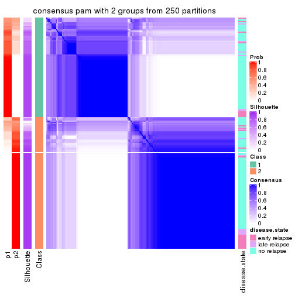</p>

</div>
<div id='tab-CV-pam-consensus-heatmap-2'>
<pre><code class="r">consensus_heatmap(res, k = 3)
</code></pre>

<p>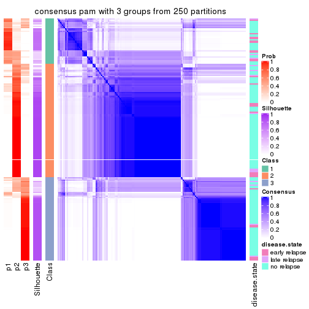</p>

</div>
<div id='tab-CV-pam-consensus-heatmap-3'>
<pre><code class="r">consensus_heatmap(res, k = 4)
</code></pre>

<p>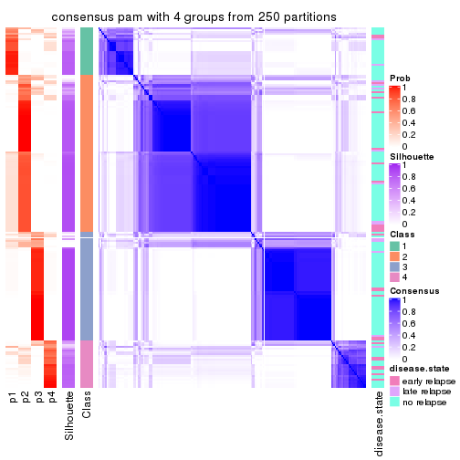</p>

</div>
<div id='tab-CV-pam-consensus-heatmap-4'>
<pre><code class="r">consensus_heatmap(res, k = 5)
</code></pre>

<p>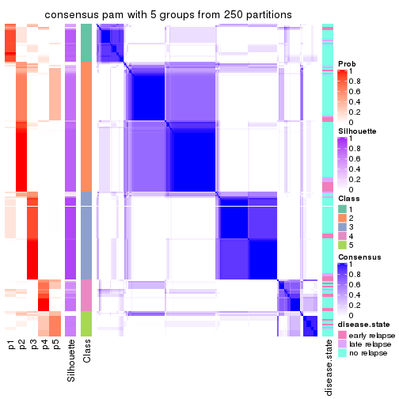</p>

</div>
<div id='tab-CV-pam-consensus-heatmap-5'>
<pre><code class="r">consensus_heatmap(res, k = 6)
</code></pre>

<p>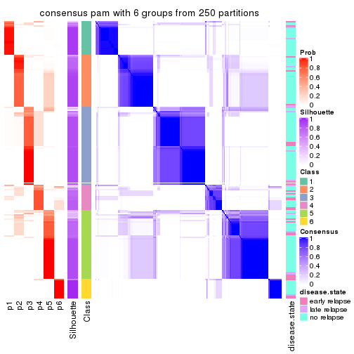</p>

</div>
</div>

Heatmaps for the membership of samples in all partitions to see how consistent they are:


<script>
$( function() {
	$( '#tabs-CV-pam-membership-heatmap' ).tabs();
} );
</script>
<div id='tabs-CV-pam-membership-heatmap'>
<ul>
<li><a href='#tab-CV-pam-membership-heatmap-1'>k = 2</a></li>
<li><a href='#tab-CV-pam-membership-heatmap-2'>k = 3</a></li>
<li><a href='#tab-CV-pam-membership-heatmap-3'>k = 4</a></li>
<li><a href='#tab-CV-pam-membership-heatmap-4'>k = 5</a></li>
<li><a href='#tab-CV-pam-membership-heatmap-5'>k = 6</a></li>
</ul>
<div id='tab-CV-pam-membership-heatmap-1'>
<pre><code class="r">membership_heatmap(res, k = 2)
</code></pre>

<p>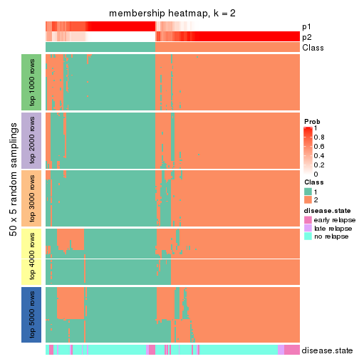</p>

</div>
<div id='tab-CV-pam-membership-heatmap-2'>
<pre><code class="r">membership_heatmap(res, k = 3)
</code></pre>

<p>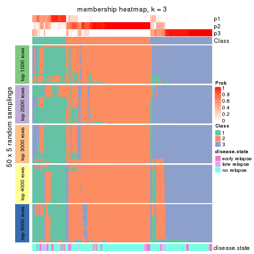</p>

</div>
<div id='tab-CV-pam-membership-heatmap-3'>
<pre><code class="r">membership_heatmap(res, k = 4)
</code></pre>

<p>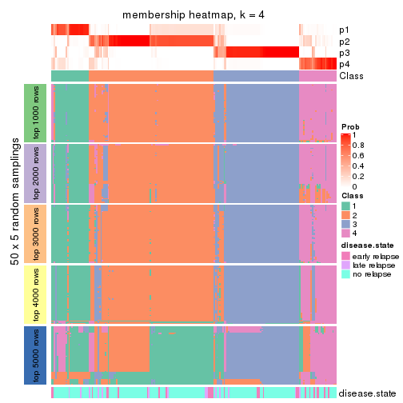</p>

</div>
<div id='tab-CV-pam-membership-heatmap-4'>
<pre><code class="r">membership_heatmap(res, k = 5)
</code></pre>

<p>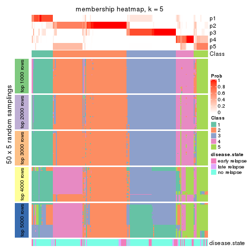</p>

</div>
<div id='tab-CV-pam-membership-heatmap-5'>
<pre><code class="r">membership_heatmap(res, k = 6)
</code></pre>

<p>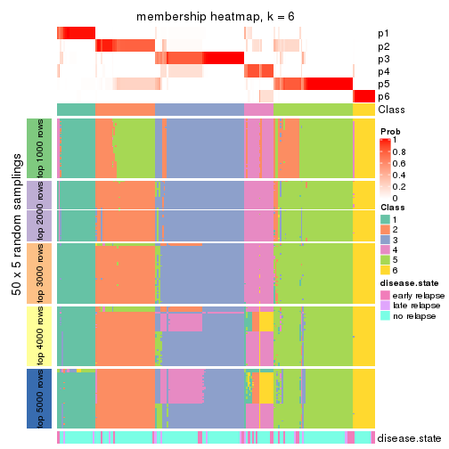</p>

</div>
</div>

As soon as we have had the classes for columns, we can look for signatures
which are significantly different between classes which can be candidate marks
for certain classes. Following are the heatmaps for signatures.


Signature heatmaps where rows are scaled:


<script>
$( function() {
	$( '#tabs-CV-pam-get-signatures' ).tabs();
} );
</script>
<div id='tabs-CV-pam-get-signatures'>
<ul>
<li><a href='#tab-CV-pam-get-signatures-1'>k = 2</a></li>
<li><a href='#tab-CV-pam-get-signatures-2'>k = 3</a></li>
<li><a href='#tab-CV-pam-get-signatures-3'>k = 4</a></li>
<li><a href='#tab-CV-pam-get-signatures-4'>k = 5</a></li>
<li><a href='#tab-CV-pam-get-signatures-5'>k = 6</a></li>
</ul>
<div id='tab-CV-pam-get-signatures-1'>
<pre><code class="r">get_signatures(res, k = 2)
</code></pre>

<p>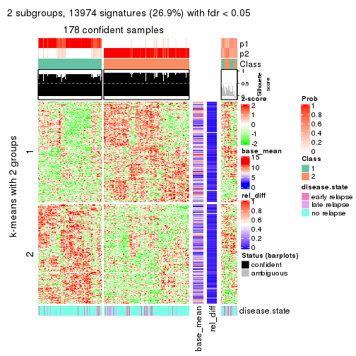</p>

</div>
<div id='tab-CV-pam-get-signatures-2'>
<pre><code class="r">get_signatures(res, k = 3)
</code></pre>

<p>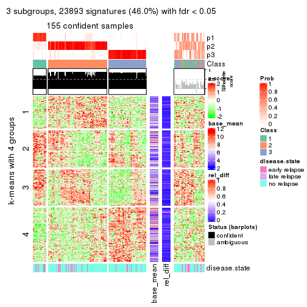</p>

</div>
<div id='tab-CV-pam-get-signatures-3'>
<pre><code class="r">get_signatures(res, k = 4)
</code></pre>

<p></p>

</div>
<div id='tab-CV-pam-get-signatures-4'>
<pre><code class="r">get_signatures(res, k = 5)
</code></pre>

<p>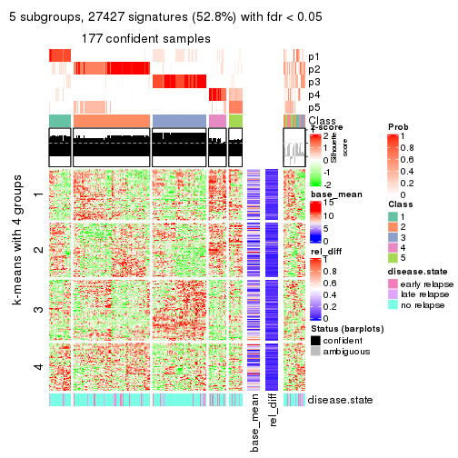</p>

</div>
<div id='tab-CV-pam-get-signatures-5'>
<pre><code class="r">get_signatures(res, k = 6)
</code></pre>

<p>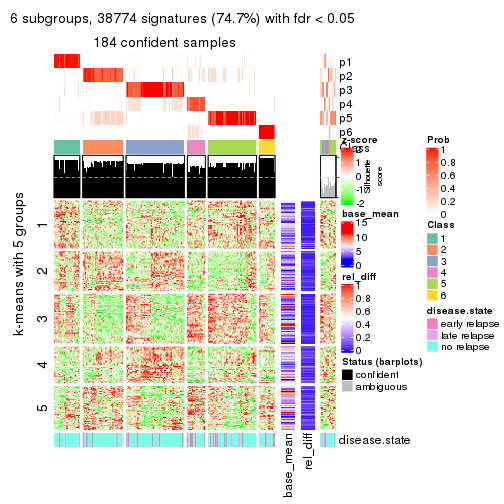</p>

</div>
</div>


Signature heatmaps where rows are not scaled:


<script>
$( function() {
	$( '#tabs-CV-pam-get-signatures-no-scale' ).tabs();
} );
</script>
<div id='tabs-CV-pam-get-signatures-no-scale'>
<ul>
<li><a href='#tab-CV-pam-get-signatures-no-scale-1'>k = 2</a></li>
<li><a href='#tab-CV-pam-get-signatures-no-scale-2'>k = 3</a></li>
<li><a href='#tab-CV-pam-get-signatures-no-scale-3'>k = 4</a></li>
<li><a href='#tab-CV-pam-get-signatures-no-scale-4'>k = 5</a></li>
<li><a href='#tab-CV-pam-get-signatures-no-scale-5'>k = 6</a></li>
</ul>
<div id='tab-CV-pam-get-signatures-no-scale-1'>
<pre><code class="r">get_signatures(res, k = 2, scale_rows = FALSE)
</code></pre>

<p>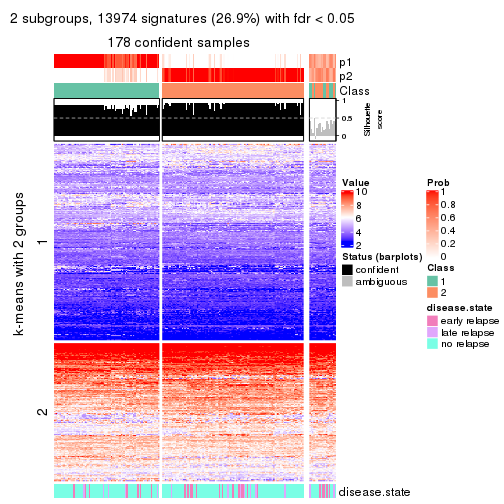</p>

</div>
<div id='tab-CV-pam-get-signatures-no-scale-2'>
<pre><code class="r">get_signatures(res, k = 3, scale_rows = FALSE)
</code></pre>

<p>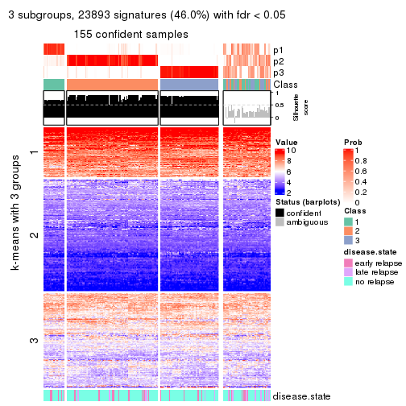</p>

</div>
<div id='tab-CV-pam-get-signatures-no-scale-3'>
<pre><code class="r">get_signatures(res, k = 4, scale_rows = FALSE)
</code></pre>

<p>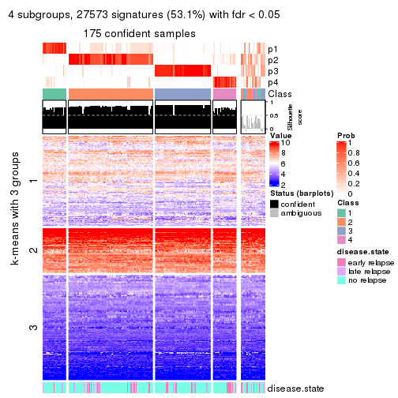</p>

</div>
<div id='tab-CV-pam-get-signatures-no-scale-4'>
<pre><code class="r">get_signatures(res, k = 5, scale_rows = FALSE)
</code></pre>

<p>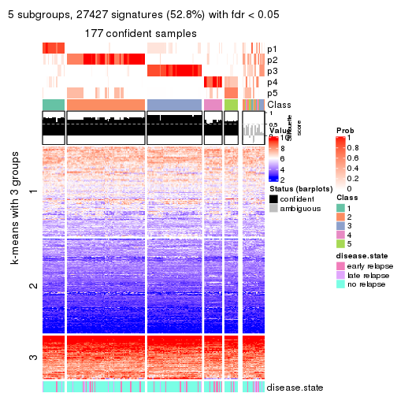</p>

</div>
<div id='tab-CV-pam-get-signatures-no-scale-5'>
<pre><code class="r">get_signatures(res, k = 6, scale_rows = FALSE)
</code></pre>

<p>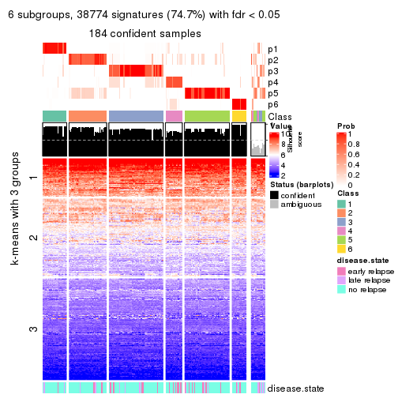</p>

</div>
</div>


Compare the overlap of signatures from different k:

```r
compare_signatures(res)
```

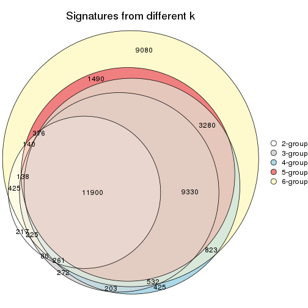

`get_signature()` returns a data frame invisibly. TO get the list of signatures, the function
call should be assigned to a variable explicitly. In following code, if `plot` argument is set
to `FALSE`, no heatmap is plotted while only the differential analysis is performed.

```r
# code only for demonstration
tb = get_signature(res, k = ..., plot = FALSE)
```

An example of the output of `tb` is:

```
#>   which_row         fdr    mean_1    mean_2 scaled_mean_1 scaled_mean_2 km
#> 1        38 0.042760348  8.373488  9.131774    -0.5533452     0.5164555  1
#> 2        40 0.018707592  7.106213  8.469186    -0.6173731     0.5762149  1
#> 3        55 0.019134737 10.221463 11.207825    -0.6159697     0.5749050  1
#> 4        59 0.006059896  5.921854  7.869574    -0.6899429     0.6439467  1
#> 5        60 0.018055526  8.928898 10.211722    -0.6204761     0.5791110  1
#> 6        98 0.009384629 15.714769 14.887706     0.6635654    -0.6193277  2
...
```

The columns in `tb` are:

1. `which_row`: row indices corresponding to the input matrix.
2. `fdr`: FDR for the differential test. 
3. `mean_x`: The mean value in group x.
4. `scaled_mean_x`: The mean value in group x after rows are scaled.
5. `km`: Row groups if k-means clustering is applied to rows.


UMAP plot which shows how samples are separated.


<script>
$( function() {
	$( '#tabs-CV-pam-dimension-reduction' ).tabs();
} );
</script>
<div id='tabs-CV-pam-dimension-reduction'>
<ul>
<li><a href='#tab-CV-pam-dimension-reduction-1'>k = 2</a></li>
<li><a href='#tab-CV-pam-dimension-reduction-2'>k = 3</a></li>
<li><a href='#tab-CV-pam-dimension-reduction-3'>k = 4</a></li>
<li><a href='#tab-CV-pam-dimension-reduction-4'>k = 5</a></li>
<li><a href='#tab-CV-pam-dimension-reduction-5'>k = 6</a></li>
</ul>
<div id='tab-CV-pam-dimension-reduction-1'>
<pre><code class="r">dimension_reduction(res, k = 2, method = &quot;UMAP&quot;)
</code></pre>

<p>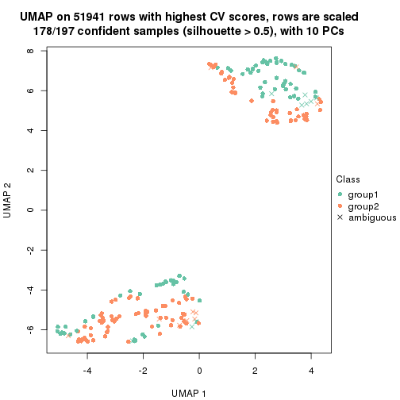</p>

</div>
<div id='tab-CV-pam-dimension-reduction-2'>
<pre><code class="r">dimension_reduction(res, k = 3, method = &quot;UMAP&quot;)
</code></pre>

<p>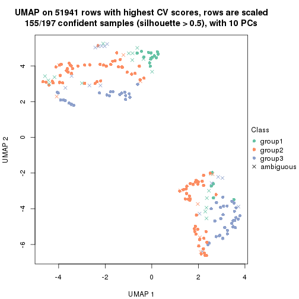</p>

</div>
<div id='tab-CV-pam-dimension-reduction-3'>
<pre><code class="r">dimension_reduction(res, k = 4, method = &quot;UMAP&quot;)
</code></pre>

<p>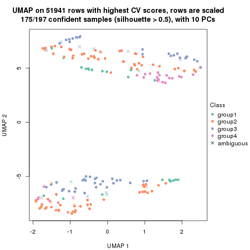</p>

</div>
<div id='tab-CV-pam-dimension-reduction-4'>
<pre><code class="r">dimension_reduction(res, k = 5, method = &quot;UMAP&quot;)
</code></pre>

<p>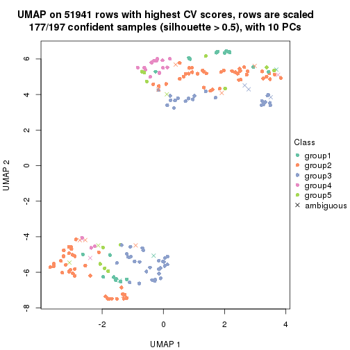</p>

</div>
<div id='tab-CV-pam-dimension-reduction-5'>
<pre><code class="r">dimension_reduction(res, k = 6, method = &quot;UMAP&quot;)
</code></pre>

<p>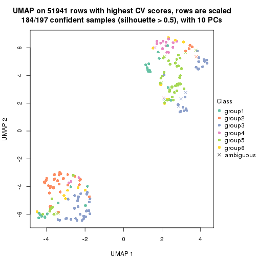</p>

</div>
</div>


Following heatmap shows how subgroups are split when increasing `k`:

```r
collect_classes(res)
```

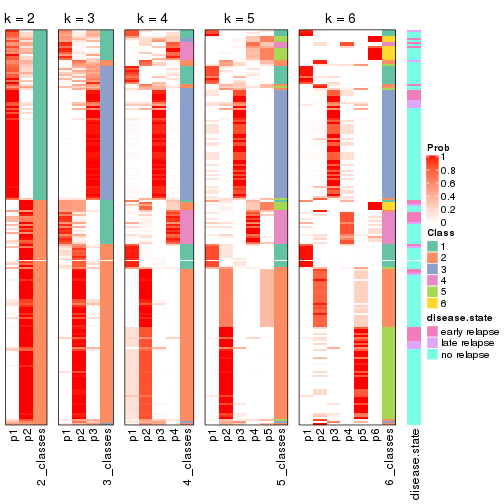


Test correlation between subgroups and known annotations. If the known
annotation is numeric, one-way ANOVA test is applied, and if the known
annotation is discrete, chi-squared contingency table test is applied.

```r
test_to_known_factors(res)
```

```
#>          n disease.state(p) k
#> CV:pam 178            0.644 2
#> CV:pam 155            0.270 3
#> CV:pam 175            0.289 4
#> CV:pam 177            0.203 5
#> CV:pam 184            0.225 6
```


If matrix rows can be associated to genes, consider to use `functional_enrichment(res,
...)` to perform function enrichment for the signature genes. See [this vignette](http://bioconductor.org/packages/devel/bioc/vignettes/cola/inst/doc/functional_enrichment.html) for more detailed explanations.


 

---------------------------------------------------


### CV:mclust


The object with results only for a single top-value method and a single partition method 
can be extracted as:

```r
res = res_list["CV", "mclust"]
# you can also extract it by
# res = res_list["CV:mclust"]
```

A summary of `res` and all the functions that can be applied to it:

```r
res
```

```
#> A 'ConsensusPartition' object with k = 2, 3, 4, 5, 6.
#>   On a matrix with 51941 rows and 197 columns.
#>   Top rows (1000, 2000, 3000, 4000, 5000) are extracted by 'CV' method.
#>   Subgroups are detected by 'mclust' method.
#>   Performed in total 1250 partitions by row resampling.
#>   Best k for subgroups seems to be 2.
#> 
#> Following methods can be applied to this 'ConsensusPartition' object:
#>  [1] "cola_report"             "collect_classes"         "collect_plots"          
#>  [4] "collect_stats"           "colnames"                "compare_signatures"     
#>  [7] "consensus_heatmap"       "dimension_reduction"     "functional_enrichment"  
#> [10] "get_anno_col"            "get_anno"                "get_classes"            
#> [13] "get_consensus"           "get_matrix"              "get_membership"         
#> [16] "get_param"               "get_signatures"          "get_stats"              
#> [19] "is_best_k"               "is_stable_k"             "membership_heatmap"     
#> [22] "ncol"                    "nrow"                    "plot_ecdf"              
#> [25] "rownames"                "select_partition_number" "show"                   
#> [28] "suggest_best_k"          "test_to_known_factors"
```

`collect_plots()` function collects all the plots made from `res` for all `k` (number of partitions)
into one single page to provide an easy and fast comparison between different `k`.

```r
collect_plots(res)
```

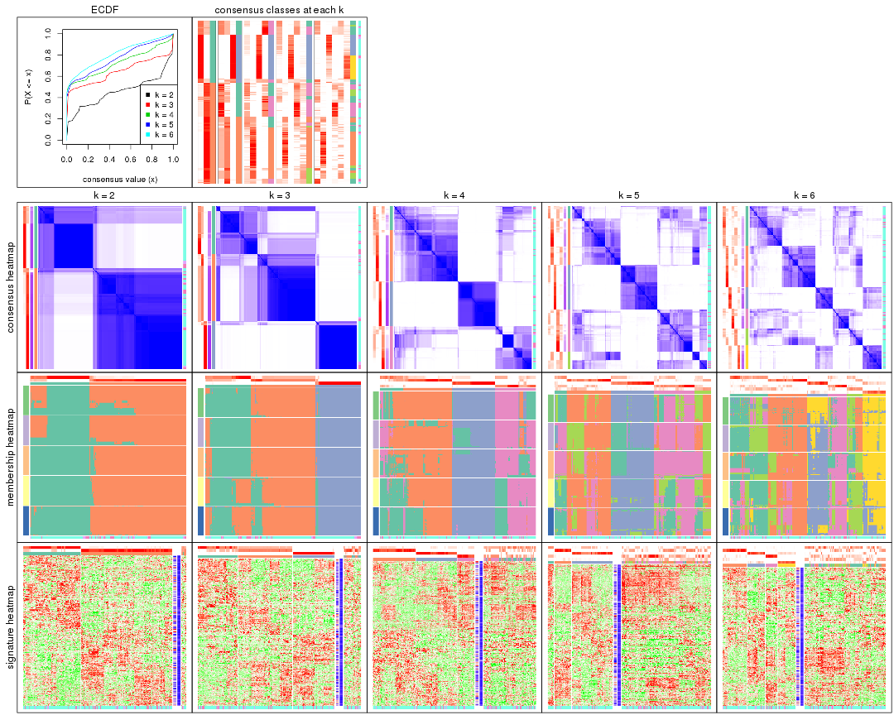

The plots are:

- The first row: a plot of the ECDF (empirical cumulative distribution
  function) curves of the consensus matrix for each `k` and the heatmap of
  predicted classes for each `k`.
- The second row: heatmaps of the consensus matrix for each `k`.
- The third row: heatmaps of the membership matrix for each `k`.
- The fouth row: heatmaps of the signatures for each `k`.

All the plots in panels can be made by individual functions and they are
plotted later in this section.

`select_partition_number()` produces several plots showing different
statistics for choosing "optimized" `k`. There are following statistics:

- ECDF curves of the consensus matrix for each `k`;
- 1-PAC. [The PAC
  score](https://en.wikipedia.org/wiki/Consensus_clustering#Over-interpretation_potential_of_consensus_clustering)
  measures the proportion of the ambiguous subgrouping.
- Mean silhouette score.
- Concordance. The mean probability of fiting the consensus class ids in all
  partitions.
- Area increased. Denote $A_k$ as the area under the ECDF curve for current
  `k`, the area increased is defined as $A_k - A_{k-1}$.
- Rand index. The percent of pairs of samples that are both in a same cluster
  or both are not in a same cluster in the partition of k and k-1.
- Jaccard index. The ratio of pairs of samples are both in a same cluster in
  the partition of k and k-1 and the pairs of samples are both in a same
  cluster in the partition k or k-1.

The detailed explanations of these statistics can be found in [the _cola_
vignette](http://bioconductor.org/packages/devel/bioc/vignettes/cola/inst/doc/cola.html#toc_13).

Generally speaking, lower PAC score, higher mean silhouette score or higher
concordance corresponds to better partition. Rand index and Jaccard index
measure how similar the current partition is compared to partition with `k-1`.
If they are too similar, we won't accept `k` is better than `k-1`.

```r
select_partition_number(res)
```

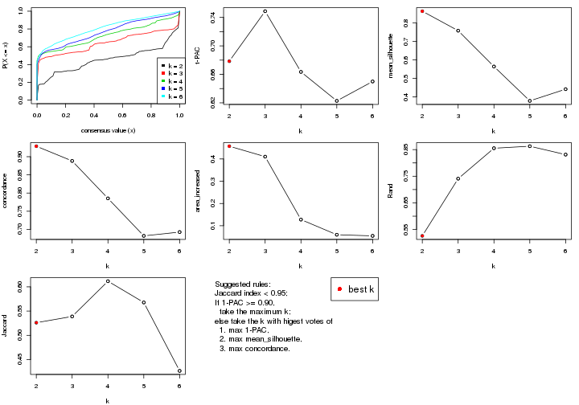

The numeric values for all these statistics can be obtained by `get_stats()`.

```r
get_stats(res)
```

```
#>   k 1-PAC mean_silhouette concordance area_increased  Rand Jaccard
#> 2 2 0.678           0.864       0.929         0.4572 0.526   0.526
#> 3 3 0.749           0.759       0.888         0.4103 0.741   0.539
#> 4 4 0.663           0.565       0.785         0.1275 0.855   0.612
#> 5 5 0.623           0.379       0.682         0.0596 0.863   0.568
#> 6 6 0.650           0.442       0.693         0.0545 0.831   0.427
```

`suggest_best_k()` suggests the best $k$ based on these statistics. The rules are as follows:

- All $k$ with Jaccard index larger than 0.95 are removed because increasing
  $k$ does not provide enough extra information. If all $k$ are removed, it is
  marked as no subgroup is detected.
- For all $k$ with 1-PAC score larger than 0.9, the maximal $k$ is taken as
  the best $k$, and other $k$ are marked as optional $k$.
- If it does not fit the second rule. The $k$ with the maximal vote of the
  highest 1-PAC score, highest mean silhouette, and highest concordance is
  taken as the best $k$.

```r
suggest_best_k(res)
```

```
#> [1] 2
```


Following shows the table of the partitions (You need to click the **show/hide
code output** link to see it). The membership matrix (columns with name `p*`)
is inferred by
[`clue::cl_consensus()`](https://www.rdocumentation.org/link/cl_consensus?package=clue)
function with the `SE` method. Basically the value in the membership matrix
represents the probability to belong to a certain group. The finall class
label for an item is determined with the group with highest probability it
belongs to.

In `get_classes()` function, the entropy is calculated from the membership
matrix and the silhouette score is calculated from the consensus matrix.


<script>
$( function() {
	$( '#tabs-CV-mclust-get-classes' ).tabs();
} );
</script>
<div id='tabs-CV-mclust-get-classes'>
<ul>
<li><a href='#tab-CV-mclust-get-classes-1'>k = 2</a></li>
<li><a href='#tab-CV-mclust-get-classes-2'>k = 3</a></li>
<li><a href='#tab-CV-mclust-get-classes-3'>k = 4</a></li>
<li><a href='#tab-CV-mclust-get-classes-4'>k = 5</a></li>
<li><a href='#tab-CV-mclust-get-classes-5'>k = 6</a></li>
</ul>

<div id='tab-CV-mclust-get-classes-1'>
<p><a id='tab-CV-mclust-get-classes-1-a' style='color:#0366d6' href='#'>show/hide code output</a></p>
<pre><code class="r">cbind(get_classes(res, k = 2), get_membership(res, k = 2))
</code></pre>

<pre><code>#&gt;           class entropy silhouette    p1    p2
#&gt; GSM342319     2  0.5059     0.8993 0.112 0.888
#&gt; GSM342323     2  0.4939     0.8994 0.108 0.892
#&gt; GSM342325     2  0.5059     0.8993 0.112 0.888
#&gt; GSM342326     2  0.5059     0.8988 0.112 0.888
#&gt; GSM342327     2  0.5059     0.8988 0.112 0.888
#&gt; GSM342329     2  0.4939     0.8994 0.108 0.892
#&gt; GSM342331     2  0.5059     0.8988 0.112 0.888
#&gt; GSM342334     2  0.2778     0.9282 0.048 0.952
#&gt; GSM342335     2  0.0000     0.9344 0.000 1.000
#&gt; GSM342354     1  0.0376     0.9019 0.996 0.004
#&gt; GSM342371     2  0.0000     0.9344 0.000 1.000
#&gt; GSM342380     2  0.3733     0.9175 0.072 0.928
#&gt; GSM342382     2  0.0000     0.9344 0.000 1.000
#&gt; GSM342399     2  0.4022     0.9172 0.080 0.920
#&gt; GSM342402     2  0.9996    -0.0584 0.488 0.512
#&gt; GSM342404     2  0.0376     0.9359 0.004 0.996
#&gt; GSM342408     1  0.0376     0.9019 0.996 0.004
#&gt; GSM342409     2  0.5059     0.8988 0.112 0.888
#&gt; GSM342426     2  0.5059     0.8988 0.112 0.888
#&gt; GSM342441     1  0.0376     0.9019 0.996 0.004
#&gt; GSM342444     1  0.0376     0.9019 0.996 0.004
#&gt; GSM342451     1  0.0376     0.9019 0.996 0.004
#&gt; GSM342462     2  0.0376     0.9359 0.004 0.996
#&gt; GSM342467     2  0.4690     0.9069 0.100 0.900
#&gt; GSM342484     1  0.9087     0.6060 0.676 0.324
#&gt; GSM342491     2  0.6623     0.8204 0.172 0.828
#&gt; GSM342322     2  0.4939     0.8994 0.108 0.892
#&gt; GSM342338     1  0.0376     0.9019 0.996 0.004
#&gt; GSM342347     1  0.0376     0.9019 0.996 0.004
#&gt; GSM342356     1  0.0376     0.9019 0.996 0.004
#&gt; GSM342357     1  0.9954     0.2470 0.540 0.460
#&gt; GSM342366     2  0.0000     0.9344 0.000 1.000
#&gt; GSM342385     2  0.3733     0.9175 0.072 0.928
#&gt; GSM342421     2  0.0376     0.9359 0.004 0.996
#&gt; GSM342437     2  0.4298     0.9127 0.088 0.912
#&gt; GSM342454     1  0.0376     0.9019 0.996 0.004
#&gt; GSM342471     2  0.3431     0.9214 0.064 0.936
#&gt; GSM342477     2  0.4161     0.9148 0.084 0.916
#&gt; GSM342495     2  0.0376     0.9359 0.004 0.996
#&gt; GSM342496     2  0.1843     0.9329 0.028 0.972
#&gt; GSM342320     2  0.5059     0.8988 0.112 0.888
#&gt; GSM342321     2  0.4939     0.8994 0.108 0.892
#&gt; GSM342324     2  0.4431     0.9113 0.092 0.908
#&gt; GSM342328     2  0.4939     0.8994 0.108 0.892
#&gt; GSM342330     2  0.5059     0.8988 0.112 0.888
#&gt; GSM342332     2  0.3584     0.9196 0.068 0.932
#&gt; GSM342333     2  0.4161     0.9146 0.084 0.916
#&gt; GSM342336     2  0.2603     0.9293 0.044 0.956
#&gt; GSM342337     1  0.0376     0.9019 0.996 0.004
#&gt; GSM342339     1  0.0376     0.9019 0.996 0.004
#&gt; GSM342340     1  0.0376     0.9019 0.996 0.004
#&gt; GSM342341     1  0.0376     0.9019 0.996 0.004
#&gt; GSM342342     1  0.0376     0.9019 0.996 0.004
#&gt; GSM342343     1  0.0376     0.9019 0.996 0.004
#&gt; GSM342344     1  0.0376     0.9019 0.996 0.004
#&gt; GSM342345     1  0.0376     0.9019 0.996 0.004
#&gt; GSM342346     2  0.9970     0.0441 0.468 0.532
#&gt; GSM342348     1  0.9393     0.5419 0.644 0.356
#&gt; GSM342349     1  0.0376     0.9019 0.996 0.004
#&gt; GSM342350     1  0.0376     0.9019 0.996 0.004
#&gt; GSM342351     1  0.0376     0.9019 0.996 0.004
#&gt; GSM342352     1  0.0376     0.9019 0.996 0.004
#&gt; GSM342353     1  0.0376     0.9019 0.996 0.004
#&gt; GSM342355     1  0.3431     0.8661 0.936 0.064
#&gt; GSM342358     1  0.9209     0.5820 0.664 0.336
#&gt; GSM342359     1  0.8909     0.6355 0.692 0.308
#&gt; GSM342360     1  0.8909     0.6355 0.692 0.308
#&gt; GSM342361     1  0.8909     0.6355 0.692 0.308
#&gt; GSM342362     2  0.7299     0.7611 0.204 0.796
#&gt; GSM342363     2  0.3879     0.9161 0.076 0.924
#&gt; GSM342364     2  0.0000     0.9344 0.000 1.000
#&gt; GSM342365     2  0.0376     0.9359 0.004 0.996
#&gt; GSM342367     2  0.0376     0.9322 0.004 0.996
#&gt; GSM342368     2  0.0000     0.9344 0.000 1.000
#&gt; GSM342369     2  0.0376     0.9359 0.004 0.996
#&gt; GSM342370     2  0.0376     0.9359 0.004 0.996
#&gt; GSM342372     2  0.0376     0.9359 0.004 0.996
#&gt; GSM342373     2  0.0376     0.9359 0.004 0.996
#&gt; GSM342374     2  0.0376     0.9359 0.004 0.996
#&gt; GSM342375     2  0.0376     0.9359 0.004 0.996
#&gt; GSM342376     2  0.1633     0.9333 0.024 0.976
#&gt; GSM342377     2  0.0376     0.9322 0.004 0.996
#&gt; GSM342378     2  0.4298     0.9136 0.088 0.912
#&gt; GSM342379     2  0.4431     0.9098 0.092 0.908
#&gt; GSM342381     2  0.0376     0.9322 0.004 0.996
#&gt; GSM342383     2  0.3114     0.9261 0.056 0.944
#&gt; GSM342384     2  0.0376     0.9322 0.004 0.996
#&gt; GSM342386     2  0.0376     0.9359 0.004 0.996
#&gt; GSM342387     2  0.4298     0.9127 0.088 0.912
#&gt; GSM342388     1  0.0376     0.9019 0.996 0.004
#&gt; GSM342389     2  0.0376     0.9322 0.004 0.996
#&gt; GSM342390     1  0.8763     0.6517 0.704 0.296
#&gt; GSM342391     2  0.6887     0.7966 0.184 0.816
#&gt; GSM342392     1  0.0376     0.9019 0.996 0.004
#&gt; GSM342393     2  0.0376     0.9359 0.004 0.996
#&gt; GSM342394     2  0.4298     0.9136 0.088 0.912
#&gt; GSM342395     2  0.0376     0.9359 0.004 0.996
#&gt; GSM342396     1  0.0376     0.9019 0.996 0.004
#&gt; GSM342397     1  0.0672     0.8996 0.992 0.008
#&gt; GSM342398     2  0.0376     0.9322 0.004 0.996
#&gt; GSM342400     2  0.0376     0.9322 0.004 0.996
#&gt; GSM342401     1  0.0376     0.9019 0.996 0.004
#&gt; GSM342403     2  0.3733     0.9175 0.072 0.928
#&gt; GSM342405     1  0.7219     0.7517 0.800 0.200
#&gt; GSM342406     1  0.8813     0.6504 0.700 0.300
#&gt; GSM342407     1  0.0376     0.9019 0.996 0.004
#&gt; GSM342410     2  0.9998    -0.0670 0.492 0.508
#&gt; GSM342411     2  0.4161     0.9131 0.084 0.916
#&gt; GSM342412     2  0.3274     0.9231 0.060 0.940
#&gt; GSM342413     1  0.8763     0.6517 0.704 0.296
#&gt; GSM342414     1  0.0376     0.9019 0.996 0.004
#&gt; GSM342415     2  0.0000     0.9344 0.000 1.000
#&gt; GSM342416     1  0.8763     0.6517 0.704 0.296
#&gt; GSM342417     2  0.4939     0.8994 0.108 0.892
#&gt; GSM342418     2  0.5059     0.8988 0.112 0.888
#&gt; GSM342419     2  0.3114     0.9261 0.056 0.944
#&gt; GSM342420     2  0.5059     0.8988 0.112 0.888
#&gt; GSM342422     2  0.0376     0.9322 0.004 0.996
#&gt; GSM342423     2  0.0000     0.9344 0.000 1.000
#&gt; GSM342424     2  0.5059     0.8988 0.112 0.888
#&gt; GSM342425     2  0.5059     0.8988 0.112 0.888
#&gt; GSM342427     2  0.0672     0.9358 0.008 0.992
#&gt; GSM342428     2  0.0672     0.9358 0.008 0.992
#&gt; GSM342429     2  0.0376     0.9359 0.004 0.996
#&gt; GSM342430     1  0.0376     0.9019 0.996 0.004
#&gt; GSM342431     1  0.0376     0.9019 0.996 0.004
#&gt; GSM342432     1  0.0376     0.9019 0.996 0.004
#&gt; GSM342433     1  0.0376     0.9019 0.996 0.004
#&gt; GSM342434     1  0.0376     0.9019 0.996 0.004
#&gt; GSM342435     1  0.0376     0.9019 0.996 0.004
#&gt; GSM342436     1  0.0376     0.9019 0.996 0.004
#&gt; GSM342438     1  0.0376     0.9019 0.996 0.004
#&gt; GSM342439     1  0.0376     0.9019 0.996 0.004
#&gt; GSM342440     1  0.0376     0.9019 0.996 0.004
#&gt; GSM342442     1  0.0376     0.9019 0.996 0.004
#&gt; GSM342443     2  0.0376     0.9359 0.004 0.996
#&gt; GSM342445     1  0.0376     0.9019 0.996 0.004
#&gt; GSM342446     1  0.0376     0.9019 0.996 0.004
#&gt; GSM342447     1  0.0376     0.9019 0.996 0.004
#&gt; GSM342448     1  0.0376     0.9019 0.996 0.004
#&gt; GSM342449     1  0.0376     0.9019 0.996 0.004
#&gt; GSM342450     1  0.0376     0.9019 0.996 0.004
#&gt; GSM342452     1  0.0376     0.9019 0.996 0.004
#&gt; GSM342453     1  0.0376     0.9019 0.996 0.004
#&gt; GSM342455     1  0.0376     0.9019 0.996 0.004
#&gt; GSM342456     1  0.8909     0.6355 0.692 0.308
#&gt; GSM342457     2  0.0000     0.9344 0.000 1.000
#&gt; GSM342458     2  0.0376     0.9359 0.004 0.996
#&gt; GSM342459     2  0.0376     0.9359 0.004 0.996
#&gt; GSM342460     2  0.0376     0.9359 0.004 0.996
#&gt; GSM342461     2  0.0376     0.9359 0.004 0.996
#&gt; GSM342463     2  0.0376     0.9359 0.004 0.996
#&gt; GSM342464     2  0.0376     0.9359 0.004 0.996
#&gt; GSM342465     2  0.0376     0.9359 0.004 0.996
#&gt; GSM342466     1  0.8386     0.6825 0.732 0.268
#&gt; GSM342468     2  0.0376     0.9359 0.004 0.996
#&gt; GSM342469     2  0.3584     0.9231 0.068 0.932
#&gt; GSM342470     1  0.8763     0.6517 0.704 0.296
#&gt; GSM342472     1  0.8443     0.6734 0.728 0.272
#&gt; GSM342473     2  0.0376     0.9359 0.004 0.996
#&gt; GSM342474     2  0.0376     0.9359 0.004 0.996
#&gt; GSM342475     1  0.0376     0.9019 0.996 0.004
#&gt; GSM342476     2  0.0376     0.9359 0.004 0.996
#&gt; GSM342478     2  0.0376     0.9359 0.004 0.996
#&gt; GSM342479     2  0.3114     0.9256 0.056 0.944
#&gt; GSM342480     2  0.0376     0.9359 0.004 0.996
#&gt; GSM342481     2  0.0376     0.9359 0.004 0.996
#&gt; GSM342482     2  0.0376     0.9359 0.004 0.996
#&gt; GSM342483     2  0.0376     0.9359 0.004 0.996
#&gt; GSM342485     2  0.0376     0.9359 0.004 0.996
#&gt; GSM342486     2  0.0376     0.9359 0.004 0.996
#&gt; GSM342487     1  0.0376     0.9019 0.996 0.004
#&gt; GSM342488     2  0.0376     0.9359 0.004 0.996
#&gt; GSM342489     2  0.0376     0.9359 0.004 0.996
#&gt; GSM342490     2  0.2948     0.9270 0.052 0.948
#&gt; GSM342492     1  0.0376     0.9019 0.996 0.004
#&gt; GSM342493     2  0.0376     0.9359 0.004 0.996
#&gt; GSM342494     2  0.0376     0.9359 0.004 0.996
#&gt; GSM342497     2  0.0376     0.9359 0.004 0.996
#&gt; GSM342498     2  0.4298     0.9127 0.088 0.912
#&gt; GSM342499     2  0.3584     0.9231 0.068 0.932
#&gt; GSM342500     2  0.0376     0.9359 0.004 0.996
#&gt; GSM342501     2  0.3114     0.9256 0.056 0.944
#&gt; GSM342502     2  0.0376     0.9359 0.004 0.996
#&gt; GSM342503     2  0.0376     0.9359 0.004 0.996
#&gt; GSM342504     2  0.0376     0.9359 0.004 0.996
#&gt; GSM342505     1  0.0376     0.9019 0.996 0.004
#&gt; GSM342506     2  0.9580     0.3768 0.380 0.620
#&gt; GSM342507     1  0.9358     0.5547 0.648 0.352
#&gt; GSM342508     2  0.9661     0.3294 0.392 0.608
#&gt; GSM342509     1  0.8909     0.6355 0.692 0.308
#&gt; GSM342510     1  0.8909     0.6355 0.692 0.308
#&gt; GSM342511     1  0.8144     0.6963 0.748 0.252
#&gt; GSM342512     2  0.0376     0.9359 0.004 0.996
#&gt; GSM342513     2  0.0376     0.9359 0.004 0.996
#&gt; GSM342514     1  0.8713     0.6572 0.708 0.292
#&gt; GSM342515     2  0.4298     0.9136 0.088 0.912
</code></pre>

<script>
$('#tab-CV-mclust-get-classes-1-a').parent().next().next().hide();
$('#tab-CV-mclust-get-classes-1-a').click(function(){
  $('#tab-CV-mclust-get-classes-1-a').parent().next().next().toggle();
  return(false);
});
</script>
</div>

<div id='tab-CV-mclust-get-classes-2'>
<p><a id='tab-CV-mclust-get-classes-2-a' style='color:#0366d6' href='#'>show/hide code output</a></p>
<pre><code class="r">cbind(get_classes(res, k = 3), get_membership(res, k = 3))
</code></pre>

<pre><code>#&gt;           class entropy silhouette    p1    p2    p3
#&gt; GSM342319     1  0.0237      0.601 0.996 0.004 0.000
#&gt; GSM342323     1  0.0000      0.601 1.000 0.000 0.000
#&gt; GSM342325     1  0.0237      0.601 0.996 0.004 0.000
#&gt; GSM342326     1  0.0000      0.601 1.000 0.000 0.000
#&gt; GSM342327     1  0.0000      0.601 1.000 0.000 0.000
#&gt; GSM342329     1  0.0000      0.601 1.000 0.000 0.000
#&gt; GSM342331     1  0.0000      0.601 1.000 0.000 0.000
#&gt; GSM342334     2  0.2165      0.377 0.064 0.936 0.000
#&gt; GSM342335     2  0.6330      0.878 0.396 0.600 0.004
#&gt; GSM342354     3  0.0000      0.963 0.000 0.000 1.000
#&gt; GSM342371     2  0.6189      0.900 0.364 0.632 0.004
#&gt; GSM342380     2  0.2711      0.268 0.088 0.912 0.000
#&gt; GSM342382     2  0.6189      0.900 0.364 0.632 0.004
#&gt; GSM342399     1  0.0747      0.610 0.984 0.016 0.000
#&gt; GSM342402     1  0.6189      0.723 0.632 0.364 0.004
#&gt; GSM342404     2  0.6095      0.883 0.392 0.608 0.000
#&gt; GSM342408     3  0.0000      0.963 0.000 0.000 1.000
#&gt; GSM342409     2  0.4892      0.172 0.048 0.840 0.112
#&gt; GSM342426     1  0.0000      0.601 1.000 0.000 0.000
#&gt; GSM342441     3  0.0000      0.963 0.000 0.000 1.000
#&gt; GSM342444     3  0.0000      0.963 0.000 0.000 1.000
#&gt; GSM342451     3  0.0000      0.963 0.000 0.000 1.000
#&gt; GSM342462     2  0.6189      0.900 0.364 0.632 0.004
#&gt; GSM342467     2  0.2200      0.372 0.056 0.940 0.004
#&gt; GSM342484     1  0.6359      0.722 0.628 0.364 0.008
#&gt; GSM342491     2  0.2590      0.309 0.072 0.924 0.004
#&gt; GSM342322     1  0.0237      0.601 0.996 0.004 0.000
#&gt; GSM342338     3  0.0000      0.963 0.000 0.000 1.000
#&gt; GSM342347     3  0.0000      0.963 0.000 0.000 1.000
#&gt; GSM342356     3  0.0000      0.963 0.000 0.000 1.000
#&gt; GSM342357     1  0.6189      0.723 0.632 0.364 0.004
#&gt; GSM342366     2  0.6189      0.900 0.364 0.632 0.004
#&gt; GSM342385     2  0.2356      0.307 0.072 0.928 0.000
#&gt; GSM342421     2  0.6062      0.889 0.384 0.616 0.000
#&gt; GSM342437     1  0.6442      0.521 0.564 0.432 0.004
#&gt; GSM342454     3  0.0000      0.963 0.000 0.000 1.000
#&gt; GSM342471     1  0.6451     -0.623 0.560 0.436 0.004
#&gt; GSM342477     2  0.3784      0.495 0.132 0.864 0.004
#&gt; GSM342495     2  0.6189      0.900 0.364 0.632 0.004
#&gt; GSM342496     2  0.4834      0.642 0.204 0.792 0.004
#&gt; GSM342320     1  0.1163      0.620 0.972 0.028 0.000
#&gt; GSM342321     1  0.0000      0.601 1.000 0.000 0.000
#&gt; GSM342324     1  0.5968      0.722 0.636 0.364 0.000
#&gt; GSM342328     1  0.0000      0.601 1.000 0.000 0.000
#&gt; GSM342330     1  0.0000      0.601 1.000 0.000 0.000
#&gt; GSM342332     1  0.5785     -0.266 0.696 0.300 0.004
#&gt; GSM342333     2  0.2384      0.367 0.056 0.936 0.008
#&gt; GSM342336     2  0.4750      0.614 0.216 0.784 0.000
#&gt; GSM342337     3  0.0237      0.959 0.004 0.000 0.996
#&gt; GSM342339     3  0.0000      0.963 0.000 0.000 1.000
#&gt; GSM342340     3  0.0000      0.963 0.000 0.000 1.000
#&gt; GSM342341     3  0.0000      0.963 0.000 0.000 1.000
#&gt; GSM342342     3  0.0000      0.963 0.000 0.000 1.000
#&gt; GSM342343     3  0.0000      0.963 0.000 0.000 1.000
#&gt; GSM342344     3  0.0000      0.963 0.000 0.000 1.000
#&gt; GSM342345     3  0.0000      0.963 0.000 0.000 1.000
#&gt; GSM342346     2  0.1989      0.358 0.048 0.948 0.004
#&gt; GSM342348     1  0.6189      0.723 0.632 0.364 0.004
#&gt; GSM342349     3  0.0000      0.963 0.000 0.000 1.000
#&gt; GSM342350     3  0.0000      0.963 0.000 0.000 1.000
#&gt; GSM342351     3  0.0000      0.963 0.000 0.000 1.000
#&gt; GSM342352     3  0.0000      0.963 0.000 0.000 1.000
#&gt; GSM342353     3  0.0000      0.963 0.000 0.000 1.000
#&gt; GSM342355     3  0.6437      0.652 0.048 0.220 0.732
#&gt; GSM342358     1  0.5968      0.722 0.636 0.364 0.000
#&gt; GSM342359     1  0.6359      0.720 0.628 0.364 0.008
#&gt; GSM342360     1  0.6510      0.720 0.624 0.364 0.012
#&gt; GSM342361     1  0.6359      0.720 0.628 0.364 0.008
#&gt; GSM342362     1  0.6189      0.723 0.632 0.364 0.004
#&gt; GSM342363     1  0.6189      0.723 0.632 0.364 0.004
#&gt; GSM342364     2  0.6189      0.900 0.364 0.632 0.004
#&gt; GSM342365     2  0.6062      0.889 0.384 0.616 0.000
#&gt; GSM342367     2  0.5968      0.897 0.364 0.636 0.000
#&gt; GSM342368     2  0.6189      0.900 0.364 0.632 0.004
#&gt; GSM342369     2  0.5988      0.897 0.368 0.632 0.000
#&gt; GSM342370     2  0.6079      0.886 0.388 0.612 0.000
#&gt; GSM342372     2  0.5988      0.897 0.368 0.632 0.000
#&gt; GSM342373     2  0.6189      0.900 0.364 0.632 0.004
#&gt; GSM342374     2  0.6079      0.886 0.388 0.612 0.000
#&gt; GSM342375     2  0.6126      0.877 0.400 0.600 0.000
#&gt; GSM342376     2  0.4178      0.554 0.172 0.828 0.000
#&gt; GSM342377     2  0.6062      0.887 0.384 0.616 0.000
#&gt; GSM342378     1  0.5882      0.723 0.652 0.348 0.000
#&gt; GSM342379     1  0.1647      0.545 0.960 0.036 0.004
#&gt; GSM342381     2  0.5968      0.897 0.364 0.636 0.000
#&gt; GSM342383     1  0.6244     -0.621 0.560 0.440 0.000
#&gt; GSM342384     2  0.5968      0.897 0.364 0.636 0.000
#&gt; GSM342386     2  0.6189      0.900 0.364 0.632 0.004
#&gt; GSM342387     1  0.4796      0.702 0.780 0.220 0.000
#&gt; GSM342388     3  0.0000      0.963 0.000 0.000 1.000
#&gt; GSM342389     2  0.5968      0.897 0.364 0.636 0.000
#&gt; GSM342390     1  0.7491      0.698 0.620 0.324 0.056
#&gt; GSM342391     1  0.5988      0.722 0.632 0.368 0.000
#&gt; GSM342392     3  0.0000      0.963 0.000 0.000 1.000
#&gt; GSM342393     2  0.5785      0.803 0.332 0.668 0.000
#&gt; GSM342394     1  0.4555      0.696 0.800 0.200 0.000
#&gt; GSM342395     2  0.6189      0.900 0.364 0.632 0.004
#&gt; GSM342396     3  0.0000      0.963 0.000 0.000 1.000
#&gt; GSM342397     3  0.0424      0.955 0.008 0.000 0.992
#&gt; GSM342398     2  0.5968      0.897 0.364 0.636 0.000
#&gt; GSM342400     2  0.5968      0.897 0.364 0.636 0.000
#&gt; GSM342401     3  0.0000      0.963 0.000 0.000 1.000
#&gt; GSM342403     2  0.1989      0.358 0.048 0.948 0.004
#&gt; GSM342405     3  0.7674      0.235 0.044 0.472 0.484
#&gt; GSM342406     1  0.6648      0.718 0.620 0.364 0.016
#&gt; GSM342407     3  0.0000      0.963 0.000 0.000 1.000
#&gt; GSM342410     1  0.6189      0.723 0.632 0.364 0.004
#&gt; GSM342411     1  0.4974      0.705 0.764 0.236 0.000
#&gt; GSM342412     2  0.4750      0.427 0.216 0.784 0.000
#&gt; GSM342413     1  0.6510      0.718 0.624 0.364 0.012
#&gt; GSM342414     3  0.0000      0.963 0.000 0.000 1.000
#&gt; GSM342415     2  0.6330      0.878 0.396 0.600 0.004
#&gt; GSM342416     1  0.6648      0.718 0.620 0.364 0.016
#&gt; GSM342417     1  0.1163      0.560 0.972 0.028 0.000
#&gt; GSM342418     1  0.3412      0.670 0.876 0.124 0.000
#&gt; GSM342419     1  0.6274     -0.644 0.544 0.456 0.000
#&gt; GSM342420     1  0.0000      0.601 1.000 0.000 0.000
#&gt; GSM342422     2  0.5968      0.897 0.364 0.636 0.000
#&gt; GSM342423     2  0.6189      0.900 0.364 0.632 0.004
#&gt; GSM342424     1  0.0000      0.601 1.000 0.000 0.000
#&gt; GSM342425     1  0.0000      0.601 1.000 0.000 0.000
#&gt; GSM342427     2  0.6330      0.877 0.396 0.600 0.004
#&gt; GSM342428     2  0.6095      0.883 0.392 0.608 0.000
#&gt; GSM342429     2  0.6228      0.895 0.372 0.624 0.004
#&gt; GSM342430     3  0.0000      0.963 0.000 0.000 1.000
#&gt; GSM342431     3  0.0000      0.963 0.000 0.000 1.000
#&gt; GSM342432     3  0.0237      0.959 0.004 0.000 0.996
#&gt; GSM342433     3  0.0000      0.963 0.000 0.000 1.000
#&gt; GSM342434     3  0.0000      0.963 0.000 0.000 1.000
#&gt; GSM342435     3  0.0000      0.963 0.000 0.000 1.000
#&gt; GSM342436     3  0.0000      0.963 0.000 0.000 1.000
#&gt; GSM342438     3  0.0000      0.963 0.000 0.000 1.000
#&gt; GSM342439     3  0.0000      0.963 0.000 0.000 1.000
#&gt; GSM342440     3  0.0000      0.963 0.000 0.000 1.000
#&gt; GSM342442     3  0.0000      0.963 0.000 0.000 1.000
#&gt; GSM342443     2  0.6189      0.900 0.364 0.632 0.004
#&gt; GSM342445     3  0.0000      0.963 0.000 0.000 1.000
#&gt; GSM342446     3  0.0000      0.963 0.000 0.000 1.000
#&gt; GSM342447     3  0.0000      0.963 0.000 0.000 1.000
#&gt; GSM342448     3  0.0000      0.963 0.000 0.000 1.000
#&gt; GSM342449     3  0.0000      0.963 0.000 0.000 1.000
#&gt; GSM342450     3  0.0000      0.963 0.000 0.000 1.000
#&gt; GSM342452     3  0.0000      0.963 0.000 0.000 1.000
#&gt; GSM342453     3  0.0000      0.963 0.000 0.000 1.000
#&gt; GSM342455     3  0.0000      0.963 0.000 0.000 1.000
#&gt; GSM342456     1  0.6359      0.720 0.628 0.364 0.008
#&gt; GSM342457     2  0.6189      0.900 0.364 0.632 0.004
#&gt; GSM342458     2  0.5988      0.897 0.368 0.632 0.000
#&gt; GSM342459     2  0.6189      0.900 0.364 0.632 0.004
#&gt; GSM342460     2  0.6189      0.900 0.364 0.632 0.004
#&gt; GSM342461     2  0.6189      0.900 0.364 0.632 0.004
#&gt; GSM342463     2  0.6189      0.900 0.364 0.632 0.004
#&gt; GSM342464     2  0.6189      0.900 0.364 0.632 0.004
#&gt; GSM342465     2  0.6189      0.900 0.364 0.632 0.004
#&gt; GSM342466     1  0.7824      0.685 0.564 0.376 0.060
#&gt; GSM342468     2  0.5988      0.897 0.368 0.632 0.000
#&gt; GSM342469     1  0.6267     -0.636 0.548 0.452 0.000
#&gt; GSM342470     1  0.6648      0.718 0.620 0.364 0.016
#&gt; GSM342472     3  0.7487      0.276 0.036 0.464 0.500
#&gt; GSM342473     2  0.6189      0.900 0.364 0.632 0.004
#&gt; GSM342474     2  0.6189      0.900 0.364 0.632 0.004
#&gt; GSM342475     3  0.0000      0.963 0.000 0.000 1.000
#&gt; GSM342476     2  0.6189      0.900 0.364 0.632 0.004
#&gt; GSM342478     2  0.6189      0.900 0.364 0.632 0.004
#&gt; GSM342479     2  0.6298      0.843 0.388 0.608 0.004
#&gt; GSM342480     2  0.6189      0.900 0.364 0.632 0.004
#&gt; GSM342481     2  0.6189      0.900 0.364 0.632 0.004
#&gt; GSM342482     2  0.6189      0.900 0.364 0.632 0.004
#&gt; GSM342483     2  0.6189      0.900 0.364 0.632 0.004
#&gt; GSM342485     2  0.6189      0.900 0.364 0.632 0.004
#&gt; GSM342486     2  0.6189      0.900 0.364 0.632 0.004
#&gt; GSM342487     3  0.0000      0.963 0.000 0.000 1.000
#&gt; GSM342488     2  0.6189      0.900 0.364 0.632 0.004
#&gt; GSM342489     2  0.6189      0.900 0.364 0.632 0.004
#&gt; GSM342490     2  0.6359      0.869 0.404 0.592 0.004
#&gt; GSM342492     3  0.0000      0.963 0.000 0.000 1.000
#&gt; GSM342493     2  0.6189      0.900 0.364 0.632 0.004
#&gt; GSM342494     2  0.6189      0.900 0.364 0.632 0.004
#&gt; GSM342497     2  0.6228      0.896 0.372 0.624 0.004
#&gt; GSM342498     1  0.6483      0.472 0.544 0.452 0.004
#&gt; GSM342499     1  0.6235     -0.613 0.564 0.436 0.000
#&gt; GSM342500     2  0.6189      0.900 0.364 0.632 0.004
#&gt; GSM342501     2  0.6282      0.862 0.384 0.612 0.004
#&gt; GSM342502     2  0.6189      0.900 0.364 0.632 0.004
#&gt; GSM342503     2  0.6189      0.900 0.364 0.632 0.004
#&gt; GSM342504     2  0.6189      0.900 0.364 0.632 0.004
#&gt; GSM342505     3  0.0000      0.963 0.000 0.000 1.000
#&gt; GSM342506     1  0.7286      0.660 0.508 0.464 0.028
#&gt; GSM342507     1  0.6359      0.722 0.628 0.364 0.008
#&gt; GSM342508     1  0.6189      0.723 0.632 0.364 0.004
#&gt; GSM342509     1  0.6648      0.718 0.620 0.364 0.016
#&gt; GSM342510     1  0.6758      0.716 0.620 0.360 0.020
#&gt; GSM342511     3  0.7311      0.415 0.036 0.384 0.580
#&gt; GSM342512     2  0.6189      0.900 0.364 0.632 0.004
#&gt; GSM342513     2  0.6189      0.900 0.364 0.632 0.004
#&gt; GSM342514     3  0.6079      0.359 0.388 0.000 0.612
#&gt; GSM342515     1  0.4121      0.686 0.832 0.168 0.000
</code></pre>

<script>
$('#tab-CV-mclust-get-classes-2-a').parent().next().next().hide();
$('#tab-CV-mclust-get-classes-2-a').click(function(){
  $('#tab-CV-mclust-get-classes-2-a').parent().next().next().toggle();
  return(false);
});
</script>
</div>

<div id='tab-CV-mclust-get-classes-3'>
<p><a id='tab-CV-mclust-get-classes-3-a' style='color:#0366d6' href='#'>show/hide code output</a></p>
<pre><code class="r">cbind(get_classes(res, k = 4), get_membership(res, k = 4))
</code></pre>

<pre><code>#&gt;           class entropy silhouette    p1    p2    p3    p4
#&gt; GSM342319     1  0.4981    -0.0379 0.536 0.000 0.000 0.464
#&gt; GSM342323     4  0.4898     0.1975 0.416 0.000 0.000 0.584
#&gt; GSM342325     1  0.4972    -0.0251 0.544 0.000 0.000 0.456
#&gt; GSM342326     4  0.4898     0.1975 0.416 0.000 0.000 0.584
#&gt; GSM342327     4  0.4898     0.1975 0.416 0.000 0.000 0.584
#&gt; GSM342329     4  0.4898     0.1975 0.416 0.000 0.000 0.584
#&gt; GSM342331     4  0.4898     0.1975 0.416 0.000 0.000 0.584
#&gt; GSM342334     1  0.7150     0.2632 0.480 0.384 0.000 0.136
#&gt; GSM342335     1  0.5155     0.2454 0.528 0.468 0.000 0.004
#&gt; GSM342354     3  0.0000     0.9345 0.000 0.000 1.000 0.000
#&gt; GSM342371     2  0.3668     0.6696 0.188 0.808 0.000 0.004
#&gt; GSM342380     4  0.7661    -0.0204 0.268 0.268 0.000 0.464
#&gt; GSM342382     2  0.2281     0.7504 0.096 0.904 0.000 0.000
#&gt; GSM342399     1  0.4713     0.0810 0.640 0.000 0.000 0.360
#&gt; GSM342402     4  0.0469     0.5503 0.012 0.000 0.000 0.988
#&gt; GSM342404     1  0.5168     0.1314 0.500 0.496 0.000 0.004
#&gt; GSM342408     3  0.0188     0.9342 0.004 0.000 0.996 0.000
#&gt; GSM342409     4  0.9580     0.0887 0.216 0.196 0.184 0.404
#&gt; GSM342426     4  0.4898     0.1975 0.416 0.000 0.000 0.584
#&gt; GSM342441     3  0.0188     0.9342 0.004 0.000 0.996 0.000
#&gt; GSM342444     3  0.3219     0.9024 0.164 0.000 0.836 0.000
#&gt; GSM342451     3  0.3219     0.9024 0.164 0.000 0.836 0.000
#&gt; GSM342462     2  0.1022     0.7815 0.032 0.968 0.000 0.000
#&gt; GSM342467     2  0.7841    -0.0943 0.264 0.380 0.000 0.356
#&gt; GSM342484     4  0.1022     0.5464 0.032 0.000 0.000 0.968
#&gt; GSM342491     4  0.7599    -0.0385 0.220 0.316 0.000 0.464
#&gt; GSM342322     4  0.4992     0.1025 0.476 0.000 0.000 0.524
#&gt; GSM342338     3  0.3219     0.9024 0.164 0.000 0.836 0.000
#&gt; GSM342347     3  0.0376     0.9325 0.004 0.000 0.992 0.004
#&gt; GSM342356     3  0.4378     0.8747 0.164 0.000 0.796 0.040
#&gt; GSM342357     4  0.0469     0.5503 0.012 0.000 0.000 0.988
#&gt; GSM342366     2  0.3908     0.6566 0.212 0.784 0.000 0.004
#&gt; GSM342385     4  0.7798    -0.0929 0.264 0.320 0.000 0.416
#&gt; GSM342421     1  0.5168     0.1654 0.500 0.496 0.000 0.004
#&gt; GSM342437     4  0.7069     0.2657 0.408 0.124 0.000 0.468
#&gt; GSM342454     3  0.2973     0.9084 0.144 0.000 0.856 0.000
#&gt; GSM342471     1  0.4322     0.4523 0.804 0.152 0.000 0.044
#&gt; GSM342477     2  0.7799    -0.1823 0.368 0.384 0.000 0.248
#&gt; GSM342495     2  0.1211     0.7805 0.040 0.960 0.000 0.000
#&gt; GSM342496     2  0.2921     0.7138 0.140 0.860 0.000 0.000
#&gt; GSM342320     4  0.4898     0.1975 0.416 0.000 0.000 0.584
#&gt; GSM342321     4  0.4898     0.1975 0.416 0.000 0.000 0.584
#&gt; GSM342324     4  0.0592     0.5466 0.016 0.000 0.000 0.984
#&gt; GSM342328     4  0.4898     0.1975 0.416 0.000 0.000 0.584
#&gt; GSM342330     4  0.4898     0.1975 0.416 0.000 0.000 0.584
#&gt; GSM342332     1  0.6719     0.4166 0.616 0.180 0.000 0.204
#&gt; GSM342333     2  0.7971    -0.1796 0.364 0.380 0.004 0.252
#&gt; GSM342336     1  0.4978     0.3480 0.612 0.384 0.000 0.004
#&gt; GSM342337     3  0.4701     0.8603 0.164 0.000 0.780 0.056
#&gt; GSM342339     3  0.2647     0.9148 0.120 0.000 0.880 0.000
#&gt; GSM342340     3  0.3219     0.9024 0.164 0.000 0.836 0.000
#&gt; GSM342341     3  0.3123     0.9051 0.156 0.000 0.844 0.000
#&gt; GSM342342     3  0.3172     0.9038 0.160 0.000 0.840 0.000
#&gt; GSM342343     3  0.3219     0.9024 0.164 0.000 0.836 0.000
#&gt; GSM342344     3  0.0000     0.9345 0.000 0.000 1.000 0.000
#&gt; GSM342345     3  0.3219     0.9024 0.164 0.000 0.836 0.000
#&gt; GSM342346     4  0.7605    -0.1227 0.200 0.384 0.000 0.416
#&gt; GSM342348     4  0.3688     0.5096 0.208 0.000 0.000 0.792
#&gt; GSM342349     3  0.0188     0.9342 0.004 0.000 0.996 0.000
#&gt; GSM342350     3  0.0188     0.9342 0.004 0.000 0.996 0.000
#&gt; GSM342351     3  0.0188     0.9342 0.004 0.000 0.996 0.000
#&gt; GSM342352     3  0.0000     0.9345 0.000 0.000 1.000 0.000
#&gt; GSM342353     3  0.1118     0.9307 0.036 0.000 0.964 0.000
#&gt; GSM342355     4  0.7370    -0.1517 0.160 0.000 0.412 0.428
#&gt; GSM342358     4  0.0000     0.5507 0.000 0.000 0.000 1.000
#&gt; GSM342359     4  0.0000     0.5507 0.000 0.000 0.000 1.000
#&gt; GSM342360     4  0.0000     0.5507 0.000 0.000 0.000 1.000
#&gt; GSM342361     4  0.0000     0.5507 0.000 0.000 0.000 1.000
#&gt; GSM342362     4  0.0000     0.5507 0.000 0.000 0.000 1.000
#&gt; GSM342363     4  0.2149     0.5185 0.088 0.000 0.000 0.912
#&gt; GSM342364     2  0.3668     0.6696 0.188 0.808 0.000 0.004
#&gt; GSM342365     2  0.5165    -0.1362 0.484 0.512 0.000 0.004
#&gt; GSM342367     2  0.3610     0.6675 0.200 0.800 0.000 0.000
#&gt; GSM342368     2  0.3668     0.6696 0.188 0.808 0.000 0.004
#&gt; GSM342369     2  0.4088     0.6503 0.232 0.764 0.000 0.004
#&gt; GSM342370     1  0.5161     0.2242 0.520 0.476 0.000 0.004
#&gt; GSM342372     2  0.4720     0.4519 0.324 0.672 0.000 0.004
#&gt; GSM342373     2  0.3668     0.6696 0.188 0.808 0.000 0.004
#&gt; GSM342374     1  0.5165     0.2038 0.512 0.484 0.000 0.004
#&gt; GSM342375     1  0.5151     0.2415 0.532 0.464 0.000 0.004
#&gt; GSM342376     1  0.5372     0.2354 0.544 0.444 0.000 0.012
#&gt; GSM342377     2  0.4916     0.0233 0.424 0.576 0.000 0.000
#&gt; GSM342378     1  0.4866    -0.0945 0.596 0.000 0.000 0.404
#&gt; GSM342379     1  0.5682     0.1375 0.612 0.036 0.000 0.352
#&gt; GSM342381     2  0.3764     0.6513 0.216 0.784 0.000 0.000
#&gt; GSM342383     1  0.5864     0.5072 0.664 0.264 0.000 0.072
#&gt; GSM342384     2  0.3649     0.6649 0.204 0.796 0.000 0.000
#&gt; GSM342386     2  0.1302     0.7737 0.044 0.956 0.000 0.000
#&gt; GSM342387     1  0.4804    -0.0358 0.616 0.000 0.000 0.384
#&gt; GSM342388     3  0.3219     0.9024 0.164 0.000 0.836 0.000
#&gt; GSM342389     2  0.3649     0.6649 0.204 0.796 0.000 0.000
#&gt; GSM342390     4  0.3649     0.5108 0.204 0.000 0.000 0.796
#&gt; GSM342391     4  0.3907     0.5011 0.232 0.000 0.000 0.768
#&gt; GSM342392     3  0.3219     0.9024 0.164 0.000 0.836 0.000
#&gt; GSM342393     1  0.5147     0.2442 0.536 0.460 0.000 0.004
#&gt; GSM342394     1  0.4356     0.1028 0.708 0.000 0.000 0.292
#&gt; GSM342395     2  0.3668     0.6696 0.188 0.808 0.000 0.004
#&gt; GSM342396     3  0.3219     0.9024 0.164 0.000 0.836 0.000
#&gt; GSM342397     3  0.0188     0.9342 0.004 0.000 0.996 0.000
#&gt; GSM342398     2  0.3688     0.6631 0.208 0.792 0.000 0.000
#&gt; GSM342400     2  0.3688     0.6597 0.208 0.792 0.000 0.000
#&gt; GSM342401     3  0.3219     0.9024 0.164 0.000 0.836 0.000
#&gt; GSM342403     4  0.7822    -0.1514 0.256 0.364 0.000 0.380
#&gt; GSM342405     4  0.8714     0.2111 0.168 0.064 0.352 0.416
#&gt; GSM342406     4  0.3649     0.5108 0.204 0.000 0.000 0.796
#&gt; GSM342407     3  0.0188     0.9342 0.004 0.000 0.996 0.000
#&gt; GSM342410     4  0.3837     0.5032 0.224 0.000 0.000 0.776
#&gt; GSM342411     1  0.4761    -0.0269 0.628 0.000 0.000 0.372
#&gt; GSM342412     1  0.5762     0.4004 0.608 0.352 0.000 0.040
#&gt; GSM342413     4  0.3610     0.5112 0.200 0.000 0.000 0.800
#&gt; GSM342414     3  0.0188     0.9342 0.004 0.000 0.996 0.000
#&gt; GSM342415     1  0.5137     0.2633 0.544 0.452 0.000 0.004
#&gt; GSM342416     4  0.3649     0.5108 0.204 0.000 0.000 0.796
#&gt; GSM342417     4  0.4898     0.1975 0.416 0.000 0.000 0.584
#&gt; GSM342418     4  0.4898     0.1975 0.416 0.000 0.000 0.584
#&gt; GSM342419     1  0.6733     0.2079 0.492 0.416 0.000 0.092
#&gt; GSM342420     4  0.4898     0.1975 0.416 0.000 0.000 0.584
#&gt; GSM342422     2  0.3688     0.6631 0.208 0.792 0.000 0.000
#&gt; GSM342423     2  0.3710     0.6642 0.192 0.804 0.000 0.004
#&gt; GSM342424     4  0.4898     0.1975 0.416 0.000 0.000 0.584
#&gt; GSM342425     4  0.4898     0.1975 0.416 0.000 0.000 0.584
#&gt; GSM342427     2  0.5143     0.0488 0.456 0.540 0.000 0.004
#&gt; GSM342428     1  0.5165     0.1922 0.512 0.484 0.000 0.004
#&gt; GSM342429     2  0.1716     0.7713 0.064 0.936 0.000 0.000
#&gt; GSM342430     3  0.3219     0.9024 0.164 0.000 0.836 0.000
#&gt; GSM342431     3  0.3219     0.9024 0.164 0.000 0.836 0.000
#&gt; GSM342432     3  0.0188     0.9332 0.004 0.000 0.996 0.000
#&gt; GSM342433     3  0.0188     0.9342 0.004 0.000 0.996 0.000
#&gt; GSM342434     3  0.0188     0.9342 0.004 0.000 0.996 0.000
#&gt; GSM342435     3  0.0188     0.9342 0.004 0.000 0.996 0.000
#&gt; GSM342436     3  0.0188     0.9342 0.004 0.000 0.996 0.000
#&gt; GSM342438     3  0.0000     0.9345 0.000 0.000 1.000 0.000
#&gt; GSM342439     3  0.0000     0.9345 0.000 0.000 1.000 0.000
#&gt; GSM342440     3  0.0188     0.9342 0.004 0.000 0.996 0.000
#&gt; GSM342442     3  0.0000     0.9345 0.000 0.000 1.000 0.000
#&gt; GSM342443     2  0.1211     0.7805 0.040 0.960 0.000 0.000
#&gt; GSM342445     3  0.0188     0.9342 0.004 0.000 0.996 0.000
#&gt; GSM342446     3  0.0000     0.9345 0.000 0.000 1.000 0.000
#&gt; GSM342447     3  0.3219     0.9024 0.164 0.000 0.836 0.000
#&gt; GSM342448     3  0.0188     0.9342 0.004 0.000 0.996 0.000
#&gt; GSM342449     3  0.0000     0.9345 0.000 0.000 1.000 0.000
#&gt; GSM342450     3  0.0188     0.9342 0.004 0.000 0.996 0.000
#&gt; GSM342452     3  0.2149     0.9218 0.088 0.000 0.912 0.000
#&gt; GSM342453     3  0.3219     0.9024 0.164 0.000 0.836 0.000
#&gt; GSM342455     3  0.0817     0.9322 0.024 0.000 0.976 0.000
#&gt; GSM342456     4  0.0000     0.5507 0.000 0.000 0.000 1.000
#&gt; GSM342457     2  0.3668     0.6696 0.188 0.808 0.000 0.004
#&gt; GSM342458     2  0.4018     0.6617 0.224 0.772 0.000 0.004
#&gt; GSM342459     2  0.1211     0.7805 0.040 0.960 0.000 0.000
#&gt; GSM342460     2  0.1211     0.7805 0.040 0.960 0.000 0.000
#&gt; GSM342461     2  0.0000     0.7794 0.000 1.000 0.000 0.000
#&gt; GSM342463     2  0.0336     0.7774 0.008 0.992 0.000 0.000
#&gt; GSM342464     2  0.0000     0.7794 0.000 1.000 0.000 0.000
#&gt; GSM342465     2  0.0707     0.7777 0.020 0.980 0.000 0.000
#&gt; GSM342466     4  0.5173     0.4378 0.320 0.000 0.020 0.660
#&gt; GSM342468     2  0.4122     0.6468 0.236 0.760 0.000 0.004
#&gt; GSM342469     1  0.4956     0.3832 0.776 0.116 0.000 0.108
#&gt; GSM342470     4  0.3610     0.5112 0.200 0.000 0.000 0.800
#&gt; GSM342472     4  0.8423     0.1851 0.156 0.048 0.376 0.420
#&gt; GSM342473     2  0.0000     0.7794 0.000 1.000 0.000 0.000
#&gt; GSM342474     2  0.0000     0.7794 0.000 1.000 0.000 0.000
#&gt; GSM342475     3  0.0000     0.9345 0.000 0.000 1.000 0.000
#&gt; GSM342476     2  0.1637     0.7732 0.060 0.940 0.000 0.000
#&gt; GSM342478     2  0.1389     0.7781 0.048 0.952 0.000 0.000
#&gt; GSM342479     2  0.4155     0.5602 0.240 0.756 0.000 0.004
#&gt; GSM342480     2  0.1474     0.7761 0.052 0.948 0.000 0.000
#&gt; GSM342481     2  0.1389     0.7781 0.048 0.952 0.000 0.000
#&gt; GSM342482     2  0.0000     0.7794 0.000 1.000 0.000 0.000
#&gt; GSM342483     2  0.1389     0.7781 0.048 0.952 0.000 0.000
#&gt; GSM342485     2  0.0469     0.7759 0.012 0.988 0.000 0.000
#&gt; GSM342486     2  0.0336     0.7774 0.008 0.992 0.000 0.000
#&gt; GSM342487     3  0.0336     0.9323 0.008 0.000 0.992 0.000
#&gt; GSM342488     2  0.1637     0.7734 0.060 0.940 0.000 0.000
#&gt; GSM342489     2  0.1211     0.7805 0.040 0.960 0.000 0.000
#&gt; GSM342490     2  0.3710     0.6315 0.192 0.804 0.000 0.004
#&gt; GSM342492     3  0.0188     0.9342 0.004 0.000 0.996 0.000
#&gt; GSM342493     2  0.0469     0.7759 0.012 0.988 0.000 0.000
#&gt; GSM342494     2  0.1389     0.7781 0.048 0.952 0.000 0.000
#&gt; GSM342497     2  0.3208     0.6900 0.148 0.848 0.000 0.004
#&gt; GSM342498     1  0.7293    -0.1894 0.476 0.156 0.000 0.368
#&gt; GSM342499     1  0.5990     0.4452 0.644 0.284 0.000 0.072
#&gt; GSM342500     2  0.0592     0.7813 0.016 0.984 0.000 0.000
#&gt; GSM342501     2  0.3074     0.7016 0.152 0.848 0.000 0.000
#&gt; GSM342502     2  0.0000     0.7794 0.000 1.000 0.000 0.000
#&gt; GSM342503     2  0.0000     0.7794 0.000 1.000 0.000 0.000
#&gt; GSM342504     2  0.1118     0.7811 0.036 0.964 0.000 0.000
#&gt; GSM342505     3  0.1940     0.9242 0.076 0.000 0.924 0.000
#&gt; GSM342506     4  0.5112     0.3921 0.384 0.008 0.000 0.608
#&gt; GSM342507     4  0.0188     0.5506 0.004 0.000 0.000 0.996
#&gt; GSM342508     4  0.4624     0.4333 0.340 0.000 0.000 0.660
#&gt; GSM342509     4  0.1022     0.5465 0.032 0.000 0.000 0.968
#&gt; GSM342510     4  0.0000     0.5507 0.000 0.000 0.000 1.000
#&gt; GSM342511     4  0.8163     0.1386 0.156 0.032 0.396 0.416
#&gt; GSM342512     2  0.0336     0.7800 0.008 0.992 0.000 0.000
#&gt; GSM342513     2  0.0592     0.7762 0.016 0.984 0.000 0.000
#&gt; GSM342514     3  0.6854     0.4076 0.204 0.000 0.600 0.196
#&gt; GSM342515     1  0.4040     0.1450 0.752 0.000 0.000 0.248
</code></pre>

<script>
$('#tab-CV-mclust-get-classes-3-a').parent().next().next().hide();
$('#tab-CV-mclust-get-classes-3-a').click(function(){
  $('#tab-CV-mclust-get-classes-3-a').parent().next().next().toggle();
  return(false);
});
</script>
</div>

<div id='tab-CV-mclust-get-classes-4'>
<p><a id='tab-CV-mclust-get-classes-4-a' style='color:#0366d6' href='#'>show/hide code output</a></p>
<pre><code class="r">cbind(get_classes(res, k = 5), get_membership(res, k = 5))
</code></pre>

<pre><code>#&gt;           class entropy silhouette    p1    p2    p3    p4    p5
#&gt; GSM342319     4  0.4573     0.3691 0.012 0.032 0.000 0.724 0.232
#&gt; GSM342323     4  0.0162     0.4612 0.000 0.000 0.000 0.996 0.004
#&gt; GSM342325     4  0.4982     0.3514 0.024 0.032 0.000 0.692 0.252
#&gt; GSM342326     4  0.0162     0.4612 0.000 0.000 0.000 0.996 0.004
#&gt; GSM342327     4  0.0162     0.4612 0.000 0.000 0.000 0.996 0.004
#&gt; GSM342329     4  0.0162     0.4612 0.000 0.000 0.000 0.996 0.004
#&gt; GSM342331     4  0.0162     0.4612 0.000 0.000 0.000 0.996 0.004
#&gt; GSM342334     5  0.8327    -0.1248 0.168 0.184 0.000 0.304 0.344
#&gt; GSM342335     4  0.5068     0.0830 0.000 0.388 0.000 0.572 0.040
#&gt; GSM342354     3  0.2104     0.8215 0.024 0.000 0.916 0.000 0.060
#&gt; GSM342371     2  0.4980     0.1871 0.000 0.488 0.000 0.028 0.484
#&gt; GSM342380     5  0.8090    -0.3530 0.212 0.108 0.000 0.324 0.356
#&gt; GSM342382     2  0.5473     0.2823 0.000 0.520 0.000 0.064 0.416
#&gt; GSM342399     4  0.6133     0.2095 0.076 0.028 0.000 0.560 0.336
#&gt; GSM342402     4  0.5762    -0.2465 0.352 0.000 0.000 0.548 0.100
#&gt; GSM342404     2  0.5158     0.3778 0.020 0.636 0.000 0.316 0.028
#&gt; GSM342408     3  0.2139     0.8184 0.032 0.000 0.916 0.000 0.052
#&gt; GSM342409     5  0.8336    -0.2045 0.244 0.164 0.000 0.220 0.372
#&gt; GSM342426     4  0.0290     0.4606 0.000 0.000 0.000 0.992 0.008
#&gt; GSM342441     3  0.0404     0.8299 0.012 0.000 0.988 0.000 0.000
#&gt; GSM342444     3  0.4470     0.7561 0.372 0.000 0.616 0.000 0.012
#&gt; GSM342451     3  0.4045     0.7593 0.356 0.000 0.644 0.000 0.000
#&gt; GSM342462     2  0.0000     0.5848 0.000 1.000 0.000 0.000 0.000
#&gt; GSM342467     5  0.8418    -0.1802 0.240 0.184 0.000 0.220 0.356
#&gt; GSM342484     4  0.5125    -0.2470 0.416 0.000 0.000 0.544 0.040
#&gt; GSM342491     5  0.8503    -0.1548 0.240 0.212 0.000 0.216 0.332
#&gt; GSM342322     4  0.3023     0.4155 0.012 0.028 0.000 0.872 0.088
#&gt; GSM342338     3  0.4734     0.7516 0.372 0.000 0.604 0.000 0.024
#&gt; GSM342347     3  0.3346     0.7822 0.064 0.000 0.844 0.000 0.092
#&gt; GSM342356     3  0.5223     0.6731 0.444 0.000 0.512 0.000 0.044
#&gt; GSM342357     4  0.5606    -0.2373 0.360 0.000 0.000 0.556 0.084
#&gt; GSM342366     2  0.4885     0.3085 0.000 0.572 0.000 0.028 0.400
#&gt; GSM342385     5  0.8179    -0.3200 0.240 0.120 0.000 0.264 0.376
#&gt; GSM342421     2  0.5028     0.2516 0.000 0.524 0.000 0.444 0.032
#&gt; GSM342437     4  0.7031    -0.4102 0.396 0.024 0.000 0.400 0.180
#&gt; GSM342454     3  0.4015     0.7627 0.348 0.000 0.652 0.000 0.000
#&gt; GSM342471     4  0.6826     0.2923 0.148 0.120 0.000 0.608 0.124
#&gt; GSM342477     5  0.8446    -0.1415 0.216 0.200 0.000 0.232 0.352
#&gt; GSM342495     2  0.0162     0.5843 0.000 0.996 0.000 0.000 0.004
#&gt; GSM342496     2  0.6519    -0.1324 0.000 0.448 0.000 0.200 0.352
#&gt; GSM342320     4  0.0162     0.4612 0.000 0.000 0.000 0.996 0.004
#&gt; GSM342321     4  0.1121     0.4546 0.000 0.000 0.000 0.956 0.044
#&gt; GSM342324     4  0.5626    -0.0769 0.232 0.000 0.004 0.640 0.124
#&gt; GSM342328     4  0.0162     0.4612 0.000 0.000 0.000 0.996 0.004
#&gt; GSM342330     4  0.0162     0.4612 0.000 0.000 0.000 0.996 0.004
#&gt; GSM342332     4  0.4033     0.3767 0.008 0.020 0.000 0.764 0.208
#&gt; GSM342333     5  0.8321    -0.1511 0.188 0.168 0.000 0.284 0.360
#&gt; GSM342336     4  0.6216     0.2148 0.000 0.180 0.000 0.536 0.284
#&gt; GSM342337     3  0.5230     0.6630 0.452 0.000 0.504 0.000 0.044
#&gt; GSM342339     3  0.4252     0.7697 0.340 0.000 0.652 0.000 0.008
#&gt; GSM342340     3  0.4812     0.7497 0.372 0.000 0.600 0.000 0.028
#&gt; GSM342341     3  0.4341     0.7617 0.364 0.000 0.628 0.000 0.008
#&gt; GSM342342     3  0.4251     0.7574 0.372 0.000 0.624 0.000 0.004
#&gt; GSM342343     3  0.4969     0.7431 0.376 0.000 0.588 0.000 0.036
#&gt; GSM342344     3  0.1018     0.8326 0.016 0.000 0.968 0.000 0.016
#&gt; GSM342345     3  0.4470     0.7561 0.372 0.000 0.616 0.000 0.012
#&gt; GSM342346     5  0.8680    -0.1957 0.256 0.188 0.008 0.212 0.336
#&gt; GSM342348     1  0.4675     0.5642 0.600 0.000 0.000 0.380 0.020
#&gt; GSM342349     3  0.2036     0.8221 0.024 0.000 0.920 0.000 0.056
#&gt; GSM342350     3  0.2036     0.8221 0.024 0.000 0.920 0.000 0.056
#&gt; GSM342351     3  0.2171     0.8181 0.024 0.000 0.912 0.000 0.064
#&gt; GSM342352     3  0.2036     0.8221 0.024 0.000 0.920 0.000 0.056
#&gt; GSM342353     3  0.2595     0.8319 0.080 0.000 0.888 0.000 0.032
#&gt; GSM342355     1  0.7145     0.1836 0.480 0.000 0.288 0.196 0.036
#&gt; GSM342358     4  0.5080    -0.2089 0.396 0.000 0.012 0.572 0.020
#&gt; GSM342359     4  0.5161    -0.2099 0.396 0.000 0.012 0.568 0.024
#&gt; GSM342360     4  0.4928    -0.2122 0.408 0.000 0.012 0.568 0.012
#&gt; GSM342361     4  0.5652    -0.2051 0.372 0.008 0.012 0.568 0.040
#&gt; GSM342362     4  0.5252    -0.1164 0.316 0.000 0.000 0.616 0.068
#&gt; GSM342363     4  0.5535    -0.0854 0.272 0.000 0.000 0.620 0.108
#&gt; GSM342364     5  0.4979    -0.2281 0.000 0.480 0.000 0.028 0.492
#&gt; GSM342365     2  0.4288     0.3523 0.000 0.612 0.000 0.384 0.004
#&gt; GSM342367     5  0.4978    -0.2226 0.000 0.476 0.000 0.028 0.496
#&gt; GSM342368     5  0.4980    -0.2335 0.000 0.484 0.000 0.028 0.488
#&gt; GSM342369     2  0.3333     0.4966 0.000 0.788 0.000 0.208 0.004
#&gt; GSM342370     2  0.4436     0.3362 0.000 0.596 0.000 0.396 0.008
#&gt; GSM342372     2  0.3928     0.4293 0.000 0.700 0.000 0.296 0.004
#&gt; GSM342373     2  0.4902     0.3103 0.000 0.564 0.000 0.028 0.408
#&gt; GSM342374     2  0.4182     0.3377 0.000 0.600 0.000 0.400 0.000
#&gt; GSM342375     2  0.4848     0.3003 0.000 0.556 0.000 0.420 0.024
#&gt; GSM342376     5  0.7847    -0.0876 0.064 0.288 0.000 0.300 0.348
#&gt; GSM342377     2  0.6749     0.1060 0.000 0.396 0.000 0.268 0.336
#&gt; GSM342378     4  0.6844    -0.1984 0.320 0.012 0.000 0.460 0.208
#&gt; GSM342379     4  0.4315     0.3725 0.016 0.012 0.000 0.728 0.244
#&gt; GSM342381     5  0.5435    -0.2015 0.000 0.428 0.000 0.060 0.512
#&gt; GSM342383     4  0.6347     0.1924 0.024 0.088 0.000 0.480 0.408
#&gt; GSM342384     5  0.4902    -0.2137 0.000 0.468 0.000 0.024 0.508
#&gt; GSM342386     2  0.4904     0.2197 0.000 0.504 0.000 0.024 0.472
#&gt; GSM342387     4  0.5090     0.2368 0.208 0.000 0.000 0.688 0.104
#&gt; GSM342388     3  0.4969     0.7431 0.376 0.000 0.588 0.000 0.036
#&gt; GSM342389     5  0.4904    -0.2174 0.000 0.472 0.000 0.024 0.504
#&gt; GSM342390     1  0.4969     0.5596 0.588 0.000 0.000 0.376 0.036
#&gt; GSM342391     1  0.6236     0.4472 0.456 0.000 0.000 0.400 0.144
#&gt; GSM342392     3  0.4470     0.7561 0.372 0.000 0.616 0.000 0.012
#&gt; GSM342393     2  0.7003     0.2565 0.092 0.560 0.000 0.240 0.108
#&gt; GSM342394     4  0.6877     0.0128 0.240 0.020 0.000 0.504 0.236
#&gt; GSM342395     2  0.4979     0.1947 0.000 0.492 0.000 0.028 0.480
#&gt; GSM342396     3  0.4470     0.7561 0.372 0.000 0.616 0.000 0.012
#&gt; GSM342397     3  0.3427     0.7815 0.032 0.000 0.844 0.012 0.112
#&gt; GSM342398     5  0.5028    -0.2061 0.000 0.444 0.000 0.032 0.524
#&gt; GSM342400     5  0.4974    -0.2104 0.000 0.464 0.000 0.028 0.508
#&gt; GSM342401     3  0.4470     0.7561 0.372 0.000 0.616 0.000 0.012
#&gt; GSM342403     5  0.8308    -0.1888 0.232 0.168 0.000 0.216 0.384
#&gt; GSM342405     1  0.8975     0.3059 0.352 0.036 0.148 0.204 0.260
#&gt; GSM342406     1  0.4494     0.5650 0.608 0.000 0.000 0.380 0.012
#&gt; GSM342407     3  0.1741     0.8241 0.024 0.000 0.936 0.000 0.040
#&gt; GSM342410     1  0.5820     0.5299 0.524 0.000 0.000 0.376 0.100
#&gt; GSM342411     4  0.5565     0.1500 0.240 0.000 0.000 0.632 0.128
#&gt; GSM342412     4  0.7049     0.1581 0.028 0.184 0.000 0.460 0.328
#&gt; GSM342413     1  0.5283     0.5434 0.572 0.000 0.012 0.384 0.032
#&gt; GSM342414     3  0.1830     0.8234 0.028 0.000 0.932 0.000 0.040
#&gt; GSM342415     4  0.6010     0.1108 0.008 0.364 0.000 0.532 0.096
#&gt; GSM342416     1  0.4494     0.5650 0.608 0.000 0.000 0.380 0.012
#&gt; GSM342417     4  0.2891     0.4032 0.000 0.000 0.000 0.824 0.176
#&gt; GSM342418     4  0.0290     0.4611 0.000 0.000 0.000 0.992 0.008
#&gt; GSM342419     4  0.8199     0.1111 0.168 0.224 0.000 0.412 0.196
#&gt; GSM342420     4  0.2516     0.4213 0.000 0.000 0.000 0.860 0.140
#&gt; GSM342422     5  0.4727    -0.2042 0.000 0.452 0.000 0.016 0.532
#&gt; GSM342423     2  0.5444     0.4566 0.000 0.656 0.000 0.140 0.204
#&gt; GSM342424     4  0.0162     0.4612 0.000 0.000 0.000 0.996 0.004
#&gt; GSM342425     4  0.0290     0.4606 0.000 0.000 0.000 0.992 0.008
#&gt; GSM342427     2  0.5884     0.1901 0.000 0.536 0.000 0.352 0.112
#&gt; GSM342428     2  0.5599     0.2059 0.000 0.484 0.000 0.444 0.072
#&gt; GSM342429     2  0.3012     0.4996 0.000 0.860 0.000 0.036 0.104
#&gt; GSM342430     3  0.4045     0.7593 0.356 0.000 0.644 0.000 0.000
#&gt; GSM342431     3  0.4045     0.7593 0.356 0.000 0.644 0.000 0.000
#&gt; GSM342432     3  0.0693     0.8331 0.012 0.000 0.980 0.000 0.008
#&gt; GSM342433     3  0.0880     0.8257 0.000 0.000 0.968 0.000 0.032
#&gt; GSM342434     3  0.1830     0.8208 0.028 0.000 0.932 0.000 0.040
#&gt; GSM342435     3  0.0992     0.8263 0.008 0.000 0.968 0.000 0.024
#&gt; GSM342436     3  0.0404     0.8299 0.012 0.000 0.988 0.000 0.000
#&gt; GSM342438     3  0.0510     0.8309 0.016 0.000 0.984 0.000 0.000
#&gt; GSM342439     3  0.0865     0.8318 0.024 0.000 0.972 0.000 0.004
#&gt; GSM342440     3  0.0000     0.8315 0.000 0.000 1.000 0.000 0.000
#&gt; GSM342442     3  0.0566     0.8293 0.012 0.000 0.984 0.000 0.004
#&gt; GSM342443     2  0.0000     0.5848 0.000 1.000 0.000 0.000 0.000
#&gt; GSM342445     3  0.0000     0.8315 0.000 0.000 1.000 0.000 0.000
#&gt; GSM342446     3  0.0290     0.8323 0.008 0.000 0.992 0.000 0.000
#&gt; GSM342447     3  0.4898     0.7452 0.376 0.000 0.592 0.000 0.032
#&gt; GSM342448     3  0.1485     0.8232 0.020 0.000 0.948 0.000 0.032
#&gt; GSM342449     3  0.0290     0.8323 0.008 0.000 0.992 0.000 0.000
#&gt; GSM342450     3  0.0880     0.8257 0.000 0.000 0.968 0.000 0.032
#&gt; GSM342452     3  0.2424     0.8199 0.132 0.000 0.868 0.000 0.000
#&gt; GSM342453     3  0.4030     0.7610 0.352 0.000 0.648 0.000 0.000
#&gt; GSM342455     3  0.1043     0.8331 0.040 0.000 0.960 0.000 0.000
#&gt; GSM342456     4  0.5652    -0.2051 0.372 0.008 0.012 0.568 0.040
#&gt; GSM342457     5  0.4979    -0.2281 0.000 0.480 0.000 0.028 0.492
#&gt; GSM342458     2  0.3266     0.5020 0.000 0.796 0.000 0.200 0.004
#&gt; GSM342459     2  0.0000     0.5848 0.000 1.000 0.000 0.000 0.000
#&gt; GSM342460     2  0.0000     0.5848 0.000 1.000 0.000 0.000 0.000
#&gt; GSM342461     2  0.2891     0.5234 0.000 0.824 0.000 0.000 0.176
#&gt; GSM342463     2  0.3999     0.4100 0.000 0.656 0.000 0.000 0.344
#&gt; GSM342464     2  0.3966     0.4146 0.000 0.664 0.000 0.000 0.336
#&gt; GSM342465     2  0.4030     0.4081 0.000 0.648 0.000 0.000 0.352
#&gt; GSM342466     1  0.6011     0.5489 0.556 0.000 0.052 0.356 0.036
#&gt; GSM342468     2  0.3333     0.4966 0.000 0.788 0.000 0.208 0.004
#&gt; GSM342469     4  0.8234     0.0968 0.188 0.188 0.000 0.408 0.216
#&gt; GSM342470     1  0.5273     0.5445 0.576 0.000 0.012 0.380 0.032
#&gt; GSM342472     1  0.8837     0.3123 0.368 0.028 0.156 0.188 0.260
#&gt; GSM342473     2  0.2891     0.5234 0.000 0.824 0.000 0.000 0.176
#&gt; GSM342474     2  0.3242     0.5021 0.000 0.784 0.000 0.000 0.216
#&gt; GSM342475     3  0.0162     0.8311 0.004 0.000 0.996 0.000 0.000
#&gt; GSM342476     2  0.1626     0.5715 0.000 0.940 0.000 0.044 0.016
#&gt; GSM342478     2  0.0510     0.5809 0.000 0.984 0.000 0.000 0.016
#&gt; GSM342479     2  0.6545    -0.1392 0.000 0.448 0.000 0.208 0.344
#&gt; GSM342480     2  0.0510     0.5809 0.000 0.984 0.000 0.000 0.016
#&gt; GSM342481     2  0.1197     0.5800 0.000 0.952 0.000 0.000 0.048
#&gt; GSM342482     2  0.2732     0.5293 0.000 0.840 0.000 0.000 0.160
#&gt; GSM342483     2  0.0510     0.5809 0.000 0.984 0.000 0.000 0.016
#&gt; GSM342485     2  0.3999     0.4100 0.000 0.656 0.000 0.000 0.344
#&gt; GSM342486     2  0.4015     0.4067 0.000 0.652 0.000 0.000 0.348
#&gt; GSM342487     3  0.2331     0.7833 0.016 0.000 0.908 0.008 0.068
#&gt; GSM342488     2  0.1579     0.5702 0.000 0.944 0.000 0.024 0.032
#&gt; GSM342489     2  0.0000     0.5848 0.000 1.000 0.000 0.000 0.000
#&gt; GSM342490     2  0.5562     0.2742 0.000 0.644 0.000 0.156 0.200
#&gt; GSM342492     3  0.0912     0.8274 0.012 0.000 0.972 0.000 0.016
#&gt; GSM342493     2  0.3999     0.4100 0.000 0.656 0.000 0.000 0.344
#&gt; GSM342494     2  0.1300     0.5751 0.000 0.956 0.000 0.028 0.016
#&gt; GSM342497     2  0.2228     0.5577 0.000 0.912 0.000 0.048 0.040
#&gt; GSM342498     4  0.7840    -0.3231 0.344 0.076 0.000 0.364 0.216
#&gt; GSM342499     4  0.8233     0.0859 0.188 0.176 0.000 0.404 0.232
#&gt; GSM342500     2  0.0404     0.5839 0.000 0.988 0.000 0.000 0.012
#&gt; GSM342501     2  0.6486    -0.1013 0.000 0.472 0.000 0.204 0.324
#&gt; GSM342502     2  0.3796     0.4442 0.000 0.700 0.000 0.000 0.300
#&gt; GSM342503     2  0.2852     0.5250 0.000 0.828 0.000 0.000 0.172
#&gt; GSM342504     2  0.0162     0.5843 0.000 0.996 0.000 0.000 0.004
#&gt; GSM342505     3  0.2377     0.8208 0.128 0.000 0.872 0.000 0.000
#&gt; GSM342506     1  0.6706     0.4447 0.452 0.008 0.000 0.352 0.188
#&gt; GSM342507     4  0.5019    -0.2164 0.396 0.000 0.000 0.568 0.036
#&gt; GSM342508     1  0.6232     0.4944 0.480 0.000 0.000 0.372 0.148
#&gt; GSM342509     4  0.4942    -0.2495 0.432 0.000 0.000 0.540 0.028
#&gt; GSM342510     4  0.5503    -0.2279 0.392 0.000 0.012 0.552 0.044
#&gt; GSM342511     1  0.8899     0.3167 0.372 0.032 0.160 0.192 0.244
#&gt; GSM342512     2  0.3949     0.4216 0.000 0.668 0.000 0.000 0.332
#&gt; GSM342513     2  0.4030     0.4125 0.000 0.648 0.000 0.000 0.352
#&gt; GSM342514     3  0.6959     0.2894 0.220 0.000 0.548 0.184 0.048
#&gt; GSM342515     4  0.7164     0.0104 0.220 0.032 0.000 0.472 0.276
</code></pre>

<script>
$('#tab-CV-mclust-get-classes-4-a').parent().next().next().hide();
$('#tab-CV-mclust-get-classes-4-a').click(function(){
  $('#tab-CV-mclust-get-classes-4-a').parent().next().next().toggle();
  return(false);
});
</script>
</div>

<div id='tab-CV-mclust-get-classes-5'>
<p><a id='tab-CV-mclust-get-classes-5-a' style='color:#0366d6' href='#'>show/hide code output</a></p>
<pre><code class="r">cbind(get_classes(res, k = 6), get_membership(res, k = 6))
</code></pre>

<pre><code>#&gt;           class entropy silhouette    p1    p2    p3    p4    p5    p6
#&gt; GSM342319     4  0.6068    0.23740 0.168 0.000 0.000 0.472 0.344 0.016
#&gt; GSM342323     4  0.0260    0.70774 0.008 0.000 0.000 0.992 0.000 0.000
#&gt; GSM342325     4  0.6400    0.22599 0.196 0.004 0.000 0.444 0.336 0.020
#&gt; GSM342326     4  0.1049    0.69612 0.008 0.032 0.000 0.960 0.000 0.000
#&gt; GSM342327     4  0.0260    0.70774 0.008 0.000 0.000 0.992 0.000 0.000
#&gt; GSM342329     4  0.0260    0.70774 0.008 0.000 0.000 0.992 0.000 0.000
#&gt; GSM342331     4  0.0260    0.70774 0.008 0.000 0.000 0.992 0.000 0.000
#&gt; GSM342334     1  0.2995    0.38307 0.844 0.008 0.000 0.128 0.012 0.008
#&gt; GSM342335     4  0.6568    0.11913 0.380 0.200 0.000 0.384 0.036 0.000
#&gt; GSM342354     6  0.3699    0.59412 0.000 0.000 0.336 0.004 0.000 0.660
#&gt; GSM342371     2  0.3298    0.59129 0.008 0.756 0.000 0.000 0.236 0.000
#&gt; GSM342380     1  0.2594    0.43762 0.888 0.000 0.000 0.056 0.036 0.020
#&gt; GSM342382     5  0.4844   -0.04903 0.012 0.456 0.000 0.032 0.500 0.000
#&gt; GSM342399     5  0.6690   -0.09202 0.272 0.008 0.000 0.300 0.400 0.020
#&gt; GSM342402     1  0.5957    0.45705 0.568 0.000 0.000 0.144 0.252 0.036
#&gt; GSM342404     2  0.5675    0.48657 0.080 0.596 0.000 0.284 0.032 0.008
#&gt; GSM342408     6  0.2632    0.76429 0.000 0.000 0.164 0.004 0.000 0.832
#&gt; GSM342409     1  0.3341    0.44716 0.864 0.020 0.012 0.044 0.016 0.044
#&gt; GSM342426     4  0.2007    0.68477 0.012 0.036 0.000 0.920 0.032 0.000
#&gt; GSM342441     6  0.2854    0.73705 0.000 0.000 0.208 0.000 0.000 0.792
#&gt; GSM342444     3  0.0260    0.76225 0.000 0.000 0.992 0.000 0.000 0.008
#&gt; GSM342451     3  0.2562    0.77327 0.000 0.000 0.828 0.000 0.000 0.172
#&gt; GSM342462     2  0.0508    0.69125 0.004 0.984 0.000 0.000 0.012 0.000
#&gt; GSM342467     1  0.4493    0.30894 0.728 0.036 0.000 0.192 0.000 0.044
#&gt; GSM342484     1  0.6144    0.44482 0.540 0.000 0.000 0.168 0.256 0.036
#&gt; GSM342491     1  0.3398    0.42794 0.848 0.040 0.000 0.076 0.016 0.020
#&gt; GSM342322     4  0.5271    0.33384 0.132 0.000 0.000 0.576 0.292 0.000
#&gt; GSM342338     3  0.2146    0.78829 0.000 0.000 0.880 0.004 0.000 0.116
#&gt; GSM342347     6  0.3441    0.74153 0.024 0.000 0.188 0.004 0.000 0.784
#&gt; GSM342356     3  0.1610    0.70747 0.084 0.000 0.916 0.000 0.000 0.000
#&gt; GSM342357     1  0.6127    0.44518 0.544 0.000 0.000 0.168 0.252 0.036
#&gt; GSM342366     2  0.3673    0.57499 0.016 0.736 0.000 0.000 0.244 0.004
#&gt; GSM342385     1  0.2328    0.44596 0.904 0.000 0.000 0.044 0.032 0.020
#&gt; GSM342421     2  0.6656    0.11704 0.208 0.404 0.000 0.352 0.032 0.004
#&gt; GSM342437     1  0.7183    0.24509 0.408 0.040 0.000 0.272 0.256 0.024
#&gt; GSM342454     3  0.2178    0.78162 0.000 0.000 0.868 0.000 0.000 0.132
#&gt; GSM342471     1  0.6450   -0.02549 0.456 0.024 0.000 0.316 0.200 0.004
#&gt; GSM342477     1  0.3916    0.27509 0.748 0.024 0.000 0.212 0.000 0.016
#&gt; GSM342495     2  0.0146    0.69040 0.004 0.996 0.000 0.000 0.000 0.000
#&gt; GSM342496     1  0.6445   -0.05682 0.512 0.108 0.000 0.040 0.320 0.020
#&gt; GSM342320     4  0.0260    0.70774 0.008 0.000 0.000 0.992 0.000 0.000
#&gt; GSM342321     4  0.1908    0.65627 0.096 0.000 0.000 0.900 0.000 0.004
#&gt; GSM342324     4  0.5451   -0.18244 0.424 0.000 0.000 0.468 0.104 0.004
#&gt; GSM342328     4  0.0713    0.70223 0.028 0.000 0.000 0.972 0.000 0.000
#&gt; GSM342330     4  0.0260    0.70774 0.008 0.000 0.000 0.992 0.000 0.000
#&gt; GSM342332     4  0.5573    0.24498 0.416 0.036 0.000 0.500 0.040 0.008
#&gt; GSM342333     1  0.3340    0.41577 0.840 0.024 0.000 0.100 0.004 0.032
#&gt; GSM342336     1  0.5012   -0.09362 0.548 0.012 0.000 0.400 0.032 0.008
#&gt; GSM342337     3  0.1610    0.70747 0.084 0.000 0.916 0.000 0.000 0.000
#&gt; GSM342339     3  0.2048    0.79299 0.000 0.000 0.880 0.000 0.000 0.120
#&gt; GSM342340     3  0.1075    0.78666 0.000 0.000 0.952 0.000 0.000 0.048
#&gt; GSM342341     3  0.3309    0.60959 0.000 0.000 0.720 0.000 0.000 0.280
#&gt; GSM342342     3  0.2562    0.76873 0.000 0.000 0.828 0.000 0.000 0.172
#&gt; GSM342343     3  0.0632    0.77506 0.000 0.000 0.976 0.000 0.000 0.024
#&gt; GSM342344     6  0.3979    0.39250 0.000 0.000 0.456 0.004 0.000 0.540
#&gt; GSM342345     3  0.1387    0.79193 0.000 0.000 0.932 0.000 0.000 0.068
#&gt; GSM342346     1  0.2206    0.43344 0.904 0.024 0.000 0.064 0.000 0.008
#&gt; GSM342348     1  0.4370    0.45823 0.536 0.000 0.000 0.016 0.444 0.004
#&gt; GSM342349     6  0.3023    0.75305 0.000 0.000 0.212 0.004 0.000 0.784
#&gt; GSM342350     6  0.2703    0.76530 0.000 0.000 0.172 0.004 0.000 0.824
#&gt; GSM342351     6  0.2871    0.75629 0.000 0.000 0.192 0.004 0.000 0.804
#&gt; GSM342352     6  0.3601    0.63410 0.000 0.000 0.312 0.004 0.000 0.684
#&gt; GSM342353     3  0.2933    0.73678 0.000 0.000 0.796 0.004 0.000 0.200
#&gt; GSM342355     3  0.4193    0.45952 0.228 0.000 0.724 0.008 0.036 0.004
#&gt; GSM342358     1  0.6298    0.43149 0.524 0.000 0.000 0.192 0.244 0.040
#&gt; GSM342359     1  0.6977    0.41401 0.460 0.000 0.000 0.192 0.248 0.100
#&gt; GSM342360     1  0.6315    0.43065 0.520 0.000 0.000 0.192 0.248 0.040
#&gt; GSM342361     1  0.7430    0.37535 0.380 0.000 0.000 0.224 0.248 0.148
#&gt; GSM342362     1  0.6550    0.37928 0.456 0.000 0.000 0.264 0.244 0.036
#&gt; GSM342363     1  0.6535    0.39343 0.460 0.000 0.000 0.240 0.264 0.036
#&gt; GSM342364     2  0.4222    0.17376 0.008 0.516 0.000 0.000 0.472 0.004
#&gt; GSM342365     2  0.4930    0.48866 0.032 0.616 0.000 0.320 0.032 0.000
#&gt; GSM342367     5  0.3971   -0.03724 0.000 0.448 0.000 0.000 0.548 0.004
#&gt; GSM342368     2  0.3938    0.49458 0.016 0.660 0.000 0.000 0.324 0.000
#&gt; GSM342369     2  0.3807    0.61249 0.008 0.772 0.000 0.184 0.032 0.004
#&gt; GSM342370     2  0.5296    0.46453 0.056 0.588 0.000 0.324 0.032 0.000
#&gt; GSM342372     2  0.4539    0.52050 0.016 0.656 0.000 0.296 0.032 0.000
#&gt; GSM342373     2  0.2920    0.63815 0.008 0.820 0.000 0.000 0.168 0.004
#&gt; GSM342374     2  0.4277    0.48112 0.028 0.616 0.000 0.356 0.000 0.000
#&gt; GSM342375     2  0.5303    0.42359 0.048 0.556 0.000 0.364 0.032 0.000
#&gt; GSM342376     1  0.6191   -0.03138 0.528 0.036 0.000 0.084 0.332 0.020
#&gt; GSM342377     5  0.6886    0.22823 0.180 0.268 0.000 0.076 0.472 0.004
#&gt; GSM342378     5  0.5035   -0.18344 0.296 0.000 0.000 0.104 0.600 0.000
#&gt; GSM342379     4  0.6789    0.16287 0.272 0.016 0.000 0.388 0.308 0.016
#&gt; GSM342381     5  0.5698    0.14285 0.104 0.332 0.000 0.016 0.544 0.004
#&gt; GSM342383     1  0.5841   -0.02853 0.520 0.016 0.000 0.092 0.360 0.012
#&gt; GSM342384     5  0.3838   -0.03040 0.000 0.448 0.000 0.000 0.552 0.000
#&gt; GSM342386     5  0.3851   -0.05762 0.000 0.460 0.000 0.000 0.540 0.000
#&gt; GSM342387     4  0.5495    0.24697 0.156 0.000 0.000 0.540 0.304 0.000
#&gt; GSM342388     3  0.0000    0.75613 0.000 0.000 1.000 0.000 0.000 0.000
#&gt; GSM342389     5  0.3966   -0.02630 0.000 0.444 0.000 0.000 0.552 0.004
#&gt; GSM342390     1  0.5203    0.45411 0.500 0.000 0.036 0.016 0.440 0.008
#&gt; GSM342391     1  0.4646    0.44851 0.500 0.000 0.000 0.040 0.460 0.000
#&gt; GSM342392     3  0.1444    0.79276 0.000 0.000 0.928 0.000 0.000 0.072
#&gt; GSM342393     2  0.6168    0.24247 0.252 0.448 0.000 0.292 0.000 0.008
#&gt; GSM342394     5  0.5134   -0.00619 0.228 0.000 0.000 0.152 0.620 0.000
#&gt; GSM342395     2  0.3560    0.56976 0.008 0.732 0.000 0.000 0.256 0.004
#&gt; GSM342396     3  0.1663    0.79336 0.000 0.000 0.912 0.000 0.000 0.088
#&gt; GSM342397     6  0.4418    0.64507 0.056 0.000 0.232 0.004 0.004 0.704
#&gt; GSM342398     5  0.5179    0.06978 0.044 0.396 0.000 0.024 0.536 0.000
#&gt; GSM342400     5  0.4279   -0.01983 0.012 0.436 0.000 0.000 0.548 0.004
#&gt; GSM342401     3  0.2092    0.78627 0.000 0.000 0.876 0.000 0.000 0.124
#&gt; GSM342403     1  0.1820    0.44834 0.928 0.000 0.000 0.044 0.016 0.012
#&gt; GSM342405     1  0.4829    0.41081 0.752 0.016 0.028 0.068 0.008 0.128
#&gt; GSM342406     1  0.4466    0.45873 0.536 0.000 0.000 0.016 0.440 0.008
#&gt; GSM342407     6  0.2668    0.76563 0.000 0.000 0.168 0.004 0.000 0.828
#&gt; GSM342410     1  0.4157    0.45860 0.544 0.000 0.000 0.012 0.444 0.000
#&gt; GSM342411     4  0.5927    0.04301 0.324 0.000 0.000 0.448 0.228 0.000
#&gt; GSM342412     1  0.4529   -0.05349 0.576 0.008 0.000 0.396 0.004 0.016
#&gt; GSM342413     5  0.6230   -0.45067 0.404 0.000 0.000 0.040 0.432 0.124
#&gt; GSM342414     6  0.2520    0.77078 0.000 0.000 0.152 0.004 0.000 0.844
#&gt; GSM342415     1  0.7437   -0.24714 0.376 0.188 0.000 0.132 0.300 0.004
#&gt; GSM342416     1  0.4466    0.45873 0.536 0.000 0.000 0.016 0.440 0.008
#&gt; GSM342417     4  0.2636    0.65058 0.120 0.004 0.000 0.860 0.000 0.016
#&gt; GSM342418     4  0.1007    0.70204 0.044 0.000 0.000 0.956 0.000 0.000
#&gt; GSM342419     5  0.6397    0.14079 0.372 0.076 0.000 0.072 0.472 0.008
#&gt; GSM342420     4  0.2060    0.67154 0.084 0.000 0.000 0.900 0.000 0.016
#&gt; GSM342422     5  0.4178    0.00188 0.008 0.428 0.000 0.000 0.560 0.004
#&gt; GSM342423     2  0.2788    0.66555 0.016 0.880 0.000 0.044 0.056 0.004
#&gt; GSM342424     4  0.1049    0.69612 0.008 0.032 0.000 0.960 0.000 0.000
#&gt; GSM342425     4  0.2078    0.68289 0.012 0.040 0.000 0.916 0.032 0.000
#&gt; GSM342427     1  0.6893   -0.14395 0.400 0.236 0.000 0.320 0.032 0.012
#&gt; GSM342428     1  0.7076   -0.18415 0.328 0.296 0.000 0.328 0.032 0.016
#&gt; GSM342429     2  0.4907    0.27196 0.304 0.636 0.000 0.032 0.012 0.016
#&gt; GSM342430     3  0.3151    0.70496 0.000 0.000 0.748 0.000 0.000 0.252
#&gt; GSM342431     3  0.2730    0.76046 0.000 0.000 0.808 0.000 0.000 0.192
#&gt; GSM342432     3  0.3756   -0.18015 0.000 0.000 0.600 0.000 0.000 0.400
#&gt; GSM342433     6  0.2527    0.77309 0.000 0.000 0.168 0.000 0.000 0.832
#&gt; GSM342434     6  0.2320    0.77250 0.000 0.000 0.132 0.004 0.000 0.864
#&gt; GSM342435     6  0.2178    0.77184 0.000 0.000 0.132 0.000 0.000 0.868
#&gt; GSM342436     6  0.2631    0.75666 0.000 0.000 0.180 0.000 0.000 0.820
#&gt; GSM342438     6  0.3823    0.32469 0.000 0.000 0.436 0.000 0.000 0.564
#&gt; GSM342439     6  0.3828    0.31065 0.000 0.000 0.440 0.000 0.000 0.560
#&gt; GSM342440     6  0.3101    0.69797 0.000 0.000 0.244 0.000 0.000 0.756
#&gt; GSM342442     6  0.3659    0.52912 0.000 0.000 0.364 0.000 0.000 0.636
#&gt; GSM342443     2  0.0291    0.69059 0.004 0.992 0.000 0.000 0.000 0.004
#&gt; GSM342445     6  0.2823    0.74223 0.000 0.000 0.204 0.000 0.000 0.796
#&gt; GSM342446     6  0.3823    0.27623 0.000 0.000 0.436 0.000 0.000 0.564
#&gt; GSM342447     3  0.0632    0.77506 0.000 0.000 0.976 0.000 0.000 0.024
#&gt; GSM342448     6  0.2048    0.77134 0.000 0.000 0.120 0.000 0.000 0.880
#&gt; GSM342449     6  0.3838    0.22793 0.000 0.000 0.448 0.000 0.000 0.552
#&gt; GSM342450     6  0.2135    0.77185 0.000 0.000 0.128 0.000 0.000 0.872
#&gt; GSM342452     3  0.3620    0.52553 0.000 0.000 0.648 0.000 0.000 0.352
#&gt; GSM342453     3  0.3371    0.64065 0.000 0.000 0.708 0.000 0.000 0.292
#&gt; GSM342455     3  0.3774    0.36866 0.000 0.000 0.592 0.000 0.000 0.408
#&gt; GSM342456     1  0.7453    0.37395 0.372 0.000 0.000 0.232 0.248 0.148
#&gt; GSM342457     2  0.4079    0.40557 0.008 0.608 0.000 0.000 0.380 0.004
#&gt; GSM342458     2  0.3534    0.62347 0.008 0.792 0.000 0.168 0.032 0.000
#&gt; GSM342459     2  0.0000    0.69086 0.000 1.000 0.000 0.000 0.000 0.000
#&gt; GSM342460     2  0.0000    0.69086 0.000 1.000 0.000 0.000 0.000 0.000
#&gt; GSM342461     2  0.1124    0.68344 0.008 0.956 0.000 0.000 0.036 0.000
#&gt; GSM342463     2  0.4076    0.21718 0.004 0.564 0.000 0.004 0.428 0.000
#&gt; GSM342464     2  0.3215    0.54302 0.000 0.756 0.000 0.004 0.240 0.000
#&gt; GSM342465     2  0.4456    0.14994 0.020 0.520 0.000 0.004 0.456 0.000
#&gt; GSM342466     1  0.4614    0.47074 0.568 0.000 0.020 0.008 0.400 0.004
#&gt; GSM342468     2  0.3827    0.60794 0.012 0.764 0.000 0.192 0.032 0.000
#&gt; GSM342469     5  0.5025    0.07997 0.392 0.016 0.000 0.044 0.548 0.000
#&gt; GSM342470     5  0.6256   -0.44934 0.400 0.000 0.000 0.040 0.432 0.128
#&gt; GSM342472     1  0.5690    0.36311 0.688 0.024 0.056 0.068 0.008 0.156
#&gt; GSM342473     2  0.1194    0.68447 0.008 0.956 0.000 0.000 0.032 0.004
#&gt; GSM342474     2  0.1268    0.68282 0.008 0.952 0.000 0.000 0.036 0.004
#&gt; GSM342475     6  0.3126    0.69907 0.000 0.000 0.248 0.000 0.000 0.752
#&gt; GSM342476     2  0.3182    0.64943 0.036 0.832 0.000 0.124 0.000 0.008
#&gt; GSM342478     2  0.0363    0.68848 0.012 0.988 0.000 0.000 0.000 0.000
#&gt; GSM342479     1  0.6608    0.05242 0.544 0.152 0.000 0.056 0.232 0.016
#&gt; GSM342480     2  0.0632    0.68533 0.024 0.976 0.000 0.000 0.000 0.000
#&gt; GSM342481     2  0.1682    0.68217 0.020 0.928 0.000 0.000 0.052 0.000
#&gt; GSM342482     2  0.0405    0.69064 0.004 0.988 0.000 0.000 0.008 0.000
#&gt; GSM342483     2  0.0603    0.68869 0.016 0.980 0.000 0.000 0.004 0.000
#&gt; GSM342485     2  0.3961    0.18929 0.000 0.556 0.000 0.004 0.440 0.000
#&gt; GSM342486     2  0.4211    0.14952 0.008 0.532 0.000 0.004 0.456 0.000
#&gt; GSM342487     6  0.2586    0.74251 0.032 0.000 0.100 0.000 0.000 0.868
#&gt; GSM342488     2  0.3148    0.64912 0.064 0.840 0.000 0.092 0.000 0.004
#&gt; GSM342489     2  0.0000    0.69086 0.000 1.000 0.000 0.000 0.000 0.000
#&gt; GSM342490     1  0.6473   -0.10728 0.432 0.260 0.000 0.284 0.000 0.024
#&gt; GSM342492     6  0.2178    0.77184 0.000 0.000 0.132 0.000 0.000 0.868
#&gt; GSM342493     2  0.4293    0.17464 0.012 0.536 0.000 0.004 0.448 0.000
#&gt; GSM342494     2  0.2019    0.67537 0.012 0.900 0.000 0.088 0.000 0.000
#&gt; GSM342497     2  0.4988    0.51989 0.116 0.660 0.000 0.216 0.000 0.008
#&gt; GSM342498     5  0.5290   -0.13462 0.336 0.036 0.000 0.048 0.580 0.000
#&gt; GSM342499     5  0.5028    0.07610 0.380 0.012 0.000 0.052 0.556 0.000
#&gt; GSM342500     2  0.0291    0.69085 0.000 0.992 0.000 0.000 0.004 0.004
#&gt; GSM342501     1  0.6086   -0.02684 0.540 0.080 0.000 0.044 0.324 0.012
#&gt; GSM342502     2  0.1268    0.68337 0.008 0.952 0.000 0.004 0.036 0.000
#&gt; GSM342503     2  0.1370    0.68623 0.012 0.948 0.000 0.000 0.036 0.004
#&gt; GSM342504     2  0.0909    0.68959 0.012 0.968 0.000 0.000 0.020 0.000
#&gt; GSM342505     3  0.3634    0.51606 0.000 0.000 0.644 0.000 0.000 0.356
#&gt; GSM342506     1  0.4543    0.45700 0.584 0.004 0.000 0.032 0.380 0.000
#&gt; GSM342507     1  0.6203    0.44396 0.536 0.000 0.000 0.168 0.256 0.040
#&gt; GSM342508     1  0.4093    0.44094 0.516 0.000 0.000 0.008 0.476 0.000
#&gt; GSM342509     1  0.6203    0.44396 0.536 0.000 0.000 0.168 0.256 0.040
#&gt; GSM342510     1  0.8291    0.34258 0.328 0.000 0.048 0.192 0.248 0.184
#&gt; GSM342511     1  0.4317    0.42087 0.784 0.000 0.076 0.040 0.008 0.092
#&gt; GSM342512     2  0.4300    0.14139 0.012 0.528 0.000 0.004 0.456 0.000
#&gt; GSM342513     2  0.4456    0.14994 0.020 0.520 0.000 0.004 0.456 0.000
#&gt; GSM342514     6  0.5960    0.28539 0.020 0.000 0.104 0.008 0.372 0.496
#&gt; GSM342515     5  0.4732    0.00516 0.220 0.000 0.000 0.112 0.668 0.000
</code></pre>

<script>
$('#tab-CV-mclust-get-classes-5-a').parent().next().next().hide();
$('#tab-CV-mclust-get-classes-5-a').click(function(){
  $('#tab-CV-mclust-get-classes-5-a').parent().next().next().toggle();
  return(false);
});
</script>
</div>
</div>

Heatmaps for the consensus matrix. It visualizes the probability of two
samples to be in a same group.


<script>
$( function() {
	$( '#tabs-CV-mclust-consensus-heatmap' ).tabs();
} );
</script>
<div id='tabs-CV-mclust-consensus-heatmap'>
<ul>
<li><a href='#tab-CV-mclust-consensus-heatmap-1'>k = 2</a></li>
<li><a href='#tab-CV-mclust-consensus-heatmap-2'>k = 3</a></li>
<li><a href='#tab-CV-mclust-consensus-heatmap-3'>k = 4</a></li>
<li><a href='#tab-CV-mclust-consensus-heatmap-4'>k = 5</a></li>
<li><a href='#tab-CV-mclust-consensus-heatmap-5'>k = 6</a></li>
</ul>
<div id='tab-CV-mclust-consensus-heatmap-1'>
<pre><code class="r">consensus_heatmap(res, k = 2)
</code></pre>

<p>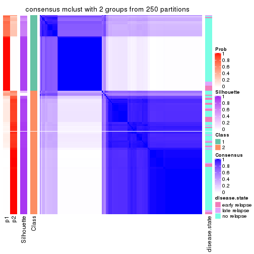</p>

</div>
<div id='tab-CV-mclust-consensus-heatmap-2'>
<pre><code class="r">consensus_heatmap(res, k = 3)
</code></pre>

<p>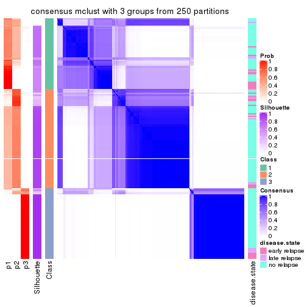</p>

</div>
<div id='tab-CV-mclust-consensus-heatmap-3'>
<pre><code class="r">consensus_heatmap(res, k = 4)
</code></pre>

<p>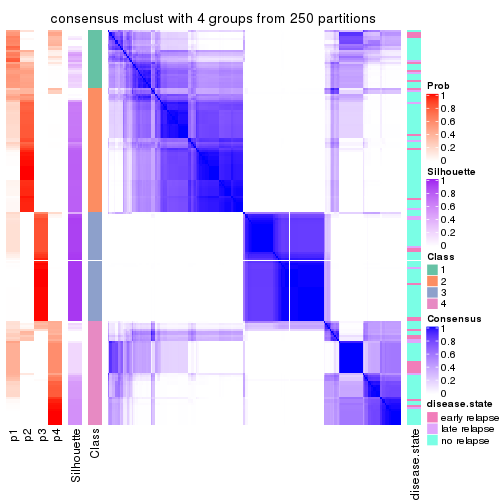</p>

</div>
<div id='tab-CV-mclust-consensus-heatmap-4'>
<pre><code class="r">consensus_heatmap(res, k = 5)
</code></pre>

<p>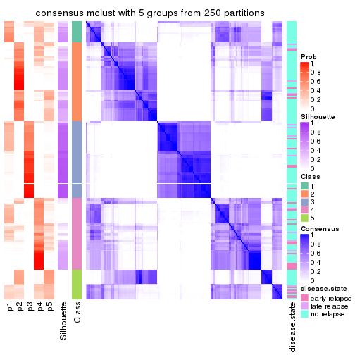</p>

</div>
<div id='tab-CV-mclust-consensus-heatmap-5'>
<pre><code class="r">consensus_heatmap(res, k = 6)
</code></pre>

<p>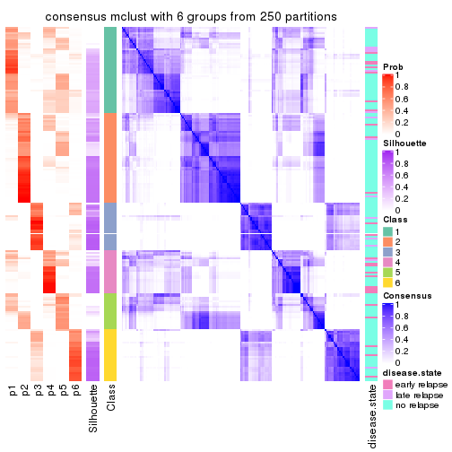</p>

</div>
</div>

Heatmaps for the membership of samples in all partitions to see how consistent they are:


<script>
$( function() {
	$( '#tabs-CV-mclust-membership-heatmap' ).tabs();
} );
</script>
<div id='tabs-CV-mclust-membership-heatmap'>
<ul>
<li><a href='#tab-CV-mclust-membership-heatmap-1'>k = 2</a></li>
<li><a href='#tab-CV-mclust-membership-heatmap-2'>k = 3</a></li>
<li><a href='#tab-CV-mclust-membership-heatmap-3'>k = 4</a></li>
<li><a href='#tab-CV-mclust-membership-heatmap-4'>k = 5</a></li>
<li><a href='#tab-CV-mclust-membership-heatmap-5'>k = 6</a></li>
</ul>
<div id='tab-CV-mclust-membership-heatmap-1'>
<pre><code class="r">membership_heatmap(res, k = 2)
</code></pre>

<p>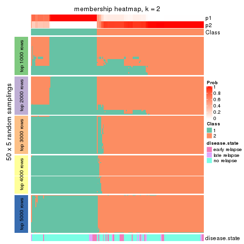</p>

</div>
<div id='tab-CV-mclust-membership-heatmap-2'>
<pre><code class="r">membership_heatmap(res, k = 3)
</code></pre>

<p>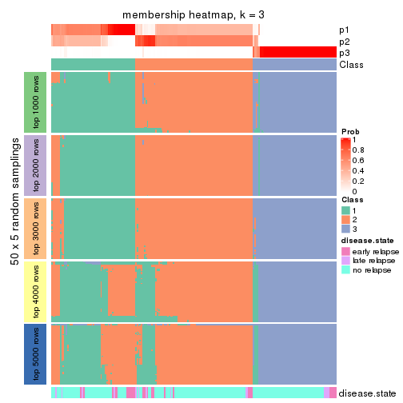</p>

</div>
<div id='tab-CV-mclust-membership-heatmap-3'>
<pre><code class="r">membership_heatmap(res, k = 4)
</code></pre>

<p>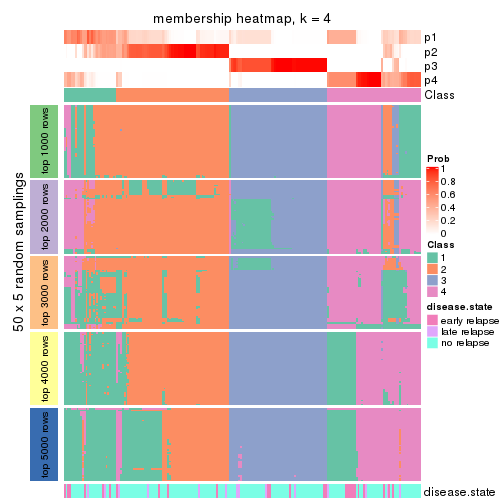</p>

</div>
<div id='tab-CV-mclust-membership-heatmap-4'>
<pre><code class="r">membership_heatmap(res, k = 5)
</code></pre>

<p>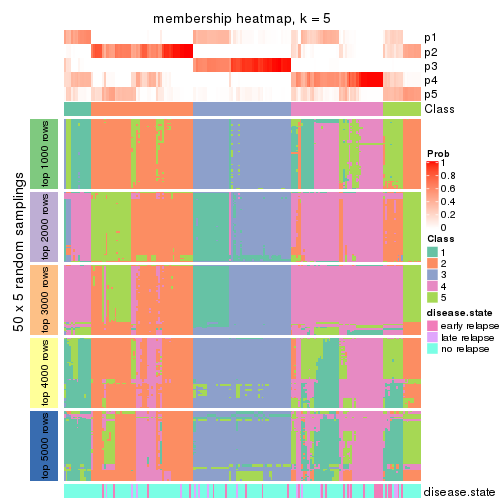</p>

</div>
<div id='tab-CV-mclust-membership-heatmap-5'>
<pre><code class="r">membership_heatmap(res, k = 6)
</code></pre>

<p>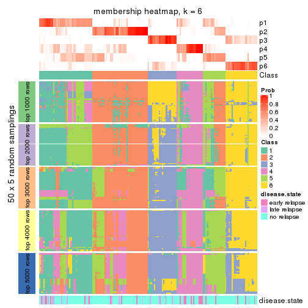</p>

</div>
</div>

As soon as we have had the classes for columns, we can look for signatures
which are significantly different between classes which can be candidate marks
for certain classes. Following are the heatmaps for signatures.


Signature heatmaps where rows are scaled:


<script>
$( function() {
	$( '#tabs-CV-mclust-get-signatures' ).tabs();
} );
</script>
<div id='tabs-CV-mclust-get-signatures'>
<ul>
<li><a href='#tab-CV-mclust-get-signatures-1'>k = 2</a></li>
<li><a href='#tab-CV-mclust-get-signatures-2'>k = 3</a></li>
<li><a href='#tab-CV-mclust-get-signatures-3'>k = 4</a></li>
<li><a href='#tab-CV-mclust-get-signatures-4'>k = 5</a></li>
<li><a href='#tab-CV-mclust-get-signatures-5'>k = 6</a></li>
</ul>
<div id='tab-CV-mclust-get-signatures-1'>
<pre><code class="r">get_signatures(res, k = 2)
</code></pre>

<p>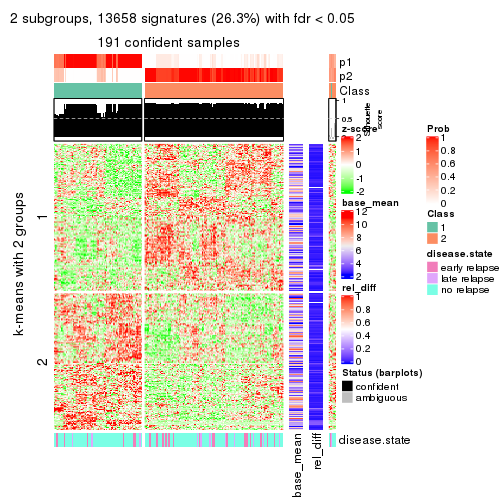</p>

</div>
<div id='tab-CV-mclust-get-signatures-2'>
<pre><code class="r">get_signatures(res, k = 3)
</code></pre>

<p>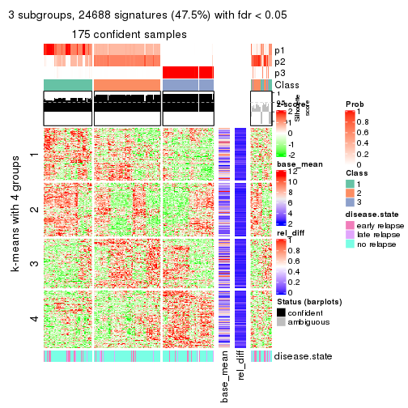</p>

</div>
<div id='tab-CV-mclust-get-signatures-3'>
<pre><code class="r">get_signatures(res, k = 4)
</code></pre>

<p>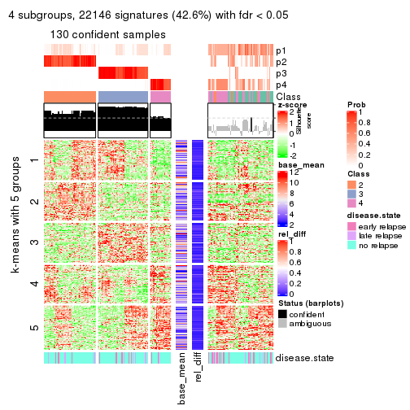</p>

</div>
<div id='tab-CV-mclust-get-signatures-4'>
<pre><code class="r">get_signatures(res, k = 5)
</code></pre>

<p>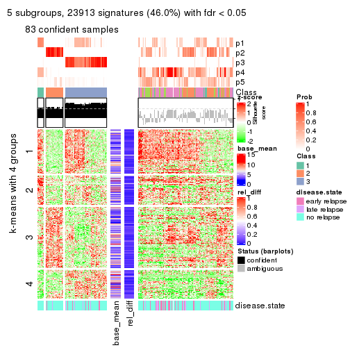</p>

</div>
<div id='tab-CV-mclust-get-signatures-5'>
<pre><code class="r">get_signatures(res, k = 6)
</code></pre>

<p>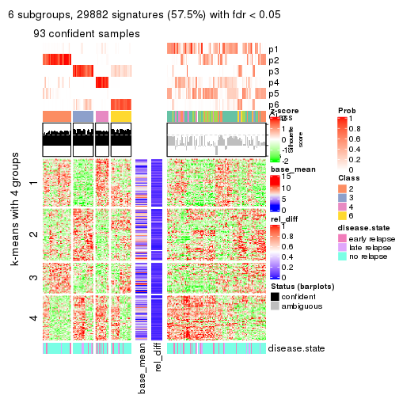</p>

</div>
</div>


Signature heatmaps where rows are not scaled:


<script>
$( function() {
	$( '#tabs-CV-mclust-get-signatures-no-scale' ).tabs();
} );
</script>
<div id='tabs-CV-mclust-get-signatures-no-scale'>
<ul>
<li><a href='#tab-CV-mclust-get-signatures-no-scale-1'>k = 2</a></li>
<li><a href='#tab-CV-mclust-get-signatures-no-scale-2'>k = 3</a></li>
<li><a href='#tab-CV-mclust-get-signatures-no-scale-3'>k = 4</a></li>
<li><a href='#tab-CV-mclust-get-signatures-no-scale-4'>k = 5</a></li>
<li><a href='#tab-CV-mclust-get-signatures-no-scale-5'>k = 6</a></li>
</ul>
<div id='tab-CV-mclust-get-signatures-no-scale-1'>
<pre><code class="r">get_signatures(res, k = 2, scale_rows = FALSE)
</code></pre>

<p>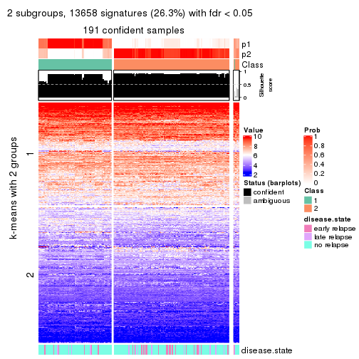</p>

</div>
<div id='tab-CV-mclust-get-signatures-no-scale-2'>
<pre><code class="r">get_signatures(res, k = 3, scale_rows = FALSE)
</code></pre>

<p>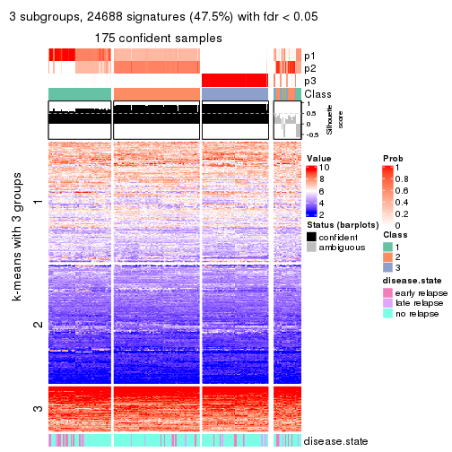</p>

</div>
<div id='tab-CV-mclust-get-signatures-no-scale-3'>
<pre><code class="r">get_signatures(res, k = 4, scale_rows = FALSE)
</code></pre>

<p>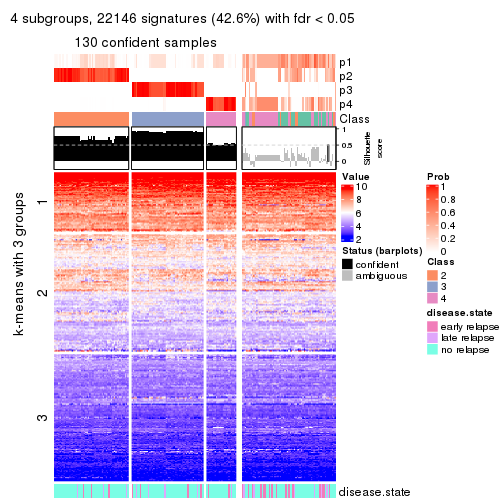</p>

</div>
<div id='tab-CV-mclust-get-signatures-no-scale-4'>
<pre><code class="r">get_signatures(res, k = 5, scale_rows = FALSE)
</code></pre>

<p>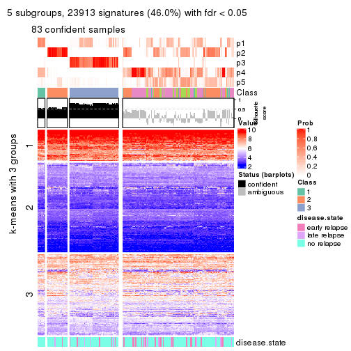</p>

</div>
<div id='tab-CV-mclust-get-signatures-no-scale-5'>
<pre><code class="r">get_signatures(res, k = 6, scale_rows = FALSE)
</code></pre>

<p>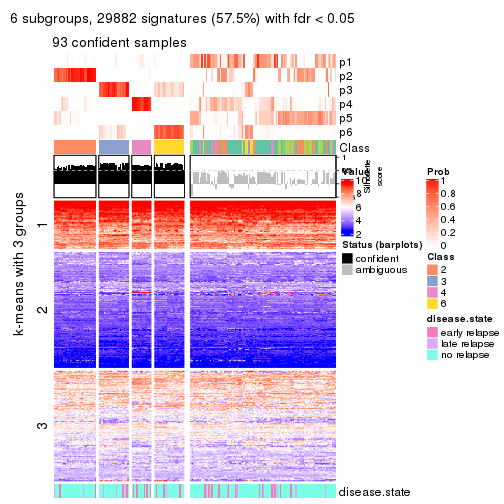</p>

</div>
</div>


Compare the overlap of signatures from different k:

```r
compare_signatures(res)
```

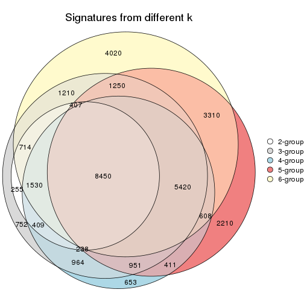

`get_signature()` returns a data frame invisibly. TO get the list of signatures, the function
call should be assigned to a variable explicitly. In following code, if `plot` argument is set
to `FALSE`, no heatmap is plotted while only the differential analysis is performed.

```r
# code only for demonstration
tb = get_signature(res, k = ..., plot = FALSE)
```

An example of the output of `tb` is:

```
#>   which_row         fdr    mean_1    mean_2 scaled_mean_1 scaled_mean_2 km
#> 1        38 0.042760348  8.373488  9.131774    -0.5533452     0.5164555  1
#> 2        40 0.018707592  7.106213  8.469186    -0.6173731     0.5762149  1
#> 3        55 0.019134737 10.221463 11.207825    -0.6159697     0.5749050  1
#> 4        59 0.006059896  5.921854  7.869574    -0.6899429     0.6439467  1
#> 5        60 0.018055526  8.928898 10.211722    -0.6204761     0.5791110  1
#> 6        98 0.009384629 15.714769 14.887706     0.6635654    -0.6193277  2
...
```

The columns in `tb` are:

1. `which_row`: row indices corresponding to the input matrix.
2. `fdr`: FDR for the differential test. 
3. `mean_x`: The mean value in group x.
4. `scaled_mean_x`: The mean value in group x after rows are scaled.
5. `km`: Row groups if k-means clustering is applied to rows.


UMAP plot which shows how samples are separated.


<script>
$( function() {
	$( '#tabs-CV-mclust-dimension-reduction' ).tabs();
} );
</script>
<div id='tabs-CV-mclust-dimension-reduction'>
<ul>
<li><a href='#tab-CV-mclust-dimension-reduction-1'>k = 2</a></li>
<li><a href='#tab-CV-mclust-dimension-reduction-2'>k = 3</a></li>
<li><a href='#tab-CV-mclust-dimension-reduction-3'>k = 4</a></li>
<li><a href='#tab-CV-mclust-dimension-reduction-4'>k = 5</a></li>
<li><a href='#tab-CV-mclust-dimension-reduction-5'>k = 6</a></li>
</ul>
<div id='tab-CV-mclust-dimension-reduction-1'>
<pre><code class="r">dimension_reduction(res, k = 2, method = &quot;UMAP&quot;)
</code></pre>

<p>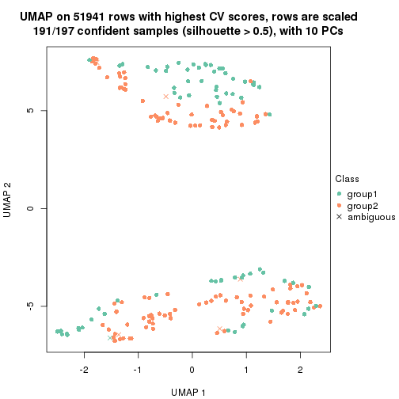</p>

</div>
<div id='tab-CV-mclust-dimension-reduction-2'>
<pre><code class="r">dimension_reduction(res, k = 3, method = &quot;UMAP&quot;)
</code></pre>

<p>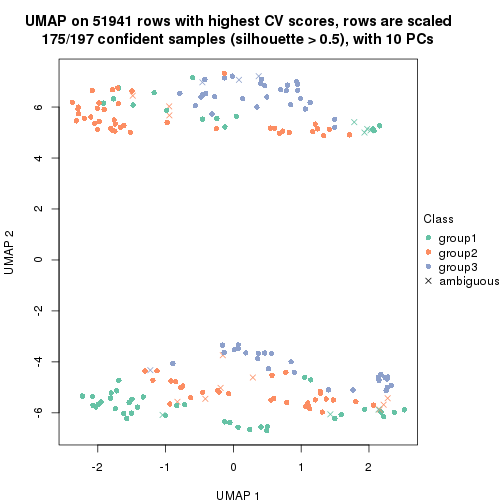</p>

</div>
<div id='tab-CV-mclust-dimension-reduction-3'>
<pre><code class="r">dimension_reduction(res, k = 4, method = &quot;UMAP&quot;)
</code></pre>

<p>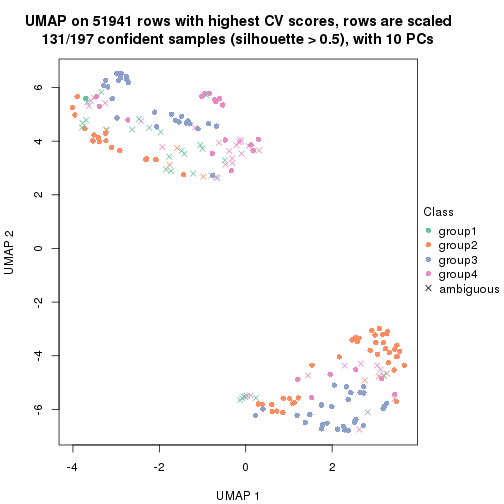</p>

</div>
<div id='tab-CV-mclust-dimension-reduction-4'>
<pre><code class="r">dimension_reduction(res, k = 5, method = &quot;UMAP&quot;)
</code></pre>

<p>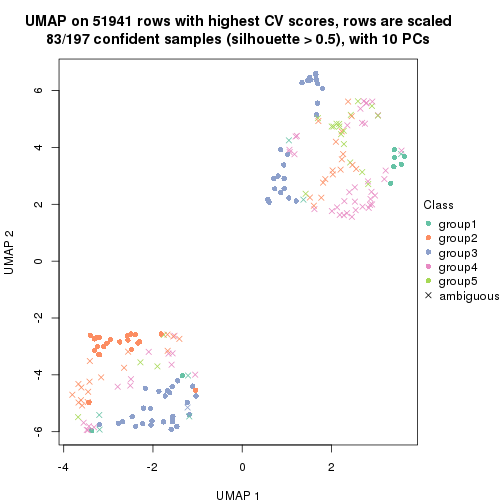</p>

</div>
<div id='tab-CV-mclust-dimension-reduction-5'>
<pre><code class="r">dimension_reduction(res, k = 6, method = &quot;UMAP&quot;)
</code></pre>

<p>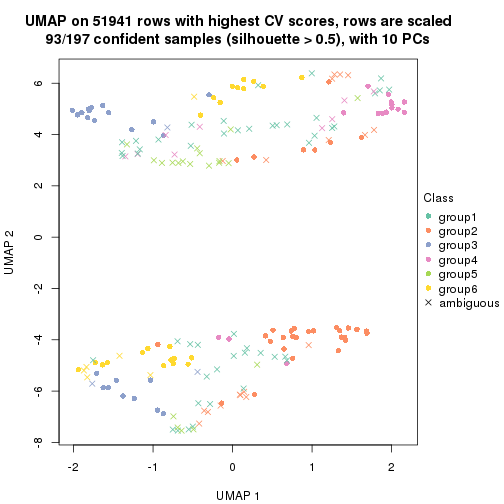</p>

</div>
</div>


Following heatmap shows how subgroups are split when increasing `k`:

```r
collect_classes(res)
```

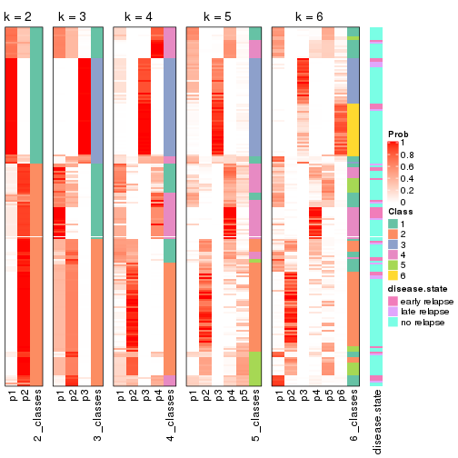


Test correlation between subgroups and known annotations. If the known
annotation is numeric, one-way ANOVA test is applied, and if the known
annotation is discrete, chi-squared contingency table test is applied.

```r
test_to_known_factors(res)
```

```
#>             n disease.state(p) k
#> CV:mclust 191           0.1967 2
#> CV:mclust 175           0.1612 3
#> CV:mclust 131           0.9764 4
#> CV:mclust  83           0.6971 5
#> CV:mclust  93           0.0465 6
```


If matrix rows can be associated to genes, consider to use `functional_enrichment(res,
...)` to perform function enrichment for the signature genes. See [this vignette](http://bioconductor.org/packages/devel/bioc/vignettes/cola/inst/doc/functional_enrichment.html) for more detailed explanations.


 

---------------------------------------------------


### CV:NMF


The object with results only for a single top-value method and a single partition method 
can be extracted as:

```r
res = res_list["CV", "NMF"]
# you can also extract it by
# res = res_list["CV:NMF"]
```

A summary of `res` and all the functions that can be applied to it:

```r
res
```

```
#> A 'ConsensusPartition' object with k = 2, 3, 4, 5, 6.
#>   On a matrix with 51941 rows and 197 columns.
#>   Top rows (1000, 2000, 3000, 4000, 5000) are extracted by 'CV' method.
#>   Subgroups are detected by 'NMF' method.
#>   Performed in total 1250 partitions by row resampling.
#>   Best k for subgroups seems to be 2.
#> 
#> Following methods can be applied to this 'ConsensusPartition' object:
#>  [1] "cola_report"             "collect_classes"         "collect_plots"          
#>  [4] "collect_stats"           "colnames"                "compare_signatures"     
#>  [7] "consensus_heatmap"       "dimension_reduction"     "functional_enrichment"  
#> [10] "get_anno_col"            "get_anno"                "get_classes"            
#> [13] "get_consensus"           "get_matrix"              "get_membership"         
#> [16] "get_param"               "get_signatures"          "get_stats"              
#> [19] "is_best_k"               "is_stable_k"             "membership_heatmap"     
#> [22] "ncol"                    "nrow"                    "plot_ecdf"              
#> [25] "rownames"                "select_partition_number" "show"                   
#> [28] "suggest_best_k"          "test_to_known_factors"
```

`collect_plots()` function collects all the plots made from `res` for all `k` (number of partitions)
into one single page to provide an easy and fast comparison between different `k`.

```r
collect_plots(res)
```

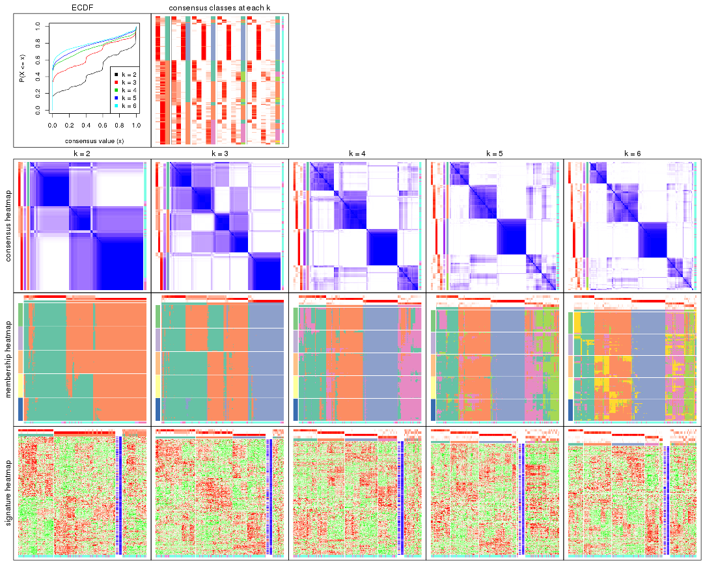

The plots are:

- The first row: a plot of the ECDF (empirical cumulative distribution
  function) curves of the consensus matrix for each `k` and the heatmap of
  predicted classes for each `k`.
- The second row: heatmaps of the consensus matrix for each `k`.
- The third row: heatmaps of the membership matrix for each `k`.
- The fouth row: heatmaps of the signatures for each `k`.

All the plots in panels can be made by individual functions and they are
plotted later in this section.

`select_partition_number()` produces several plots showing different
statistics for choosing "optimized" `k`. There are following statistics:

- ECDF curves of the consensus matrix for each `k`;
- 1-PAC. [The PAC
  score](https://en.wikipedia.org/wiki/Consensus_clustering#Over-interpretation_potential_of_consensus_clustering)
  measures the proportion of the ambiguous subgrouping.
- Mean silhouette score.
- Concordance. The mean probability of fiting the consensus class ids in all
  partitions.
- Area increased. Denote $A_k$ as the area under the ECDF curve for current
  `k`, the area increased is defined as $A_k - A_{k-1}$.
- Rand index. The percent of pairs of samples that are both in a same cluster
  or both are not in a same cluster in the partition of k and k-1.
- Jaccard index. The ratio of pairs of samples are both in a same cluster in
  the partition of k and k-1 and the pairs of samples are both in a same
  cluster in the partition k or k-1.

The detailed explanations of these statistics can be found in [the _cola_
vignette](http://bioconductor.org/packages/devel/bioc/vignettes/cola/inst/doc/cola.html#toc_13).

Generally speaking, lower PAC score, higher mean silhouette score or higher
concordance corresponds to better partition. Rand index and Jaccard index
measure how similar the current partition is compared to partition with `k-1`.
If they are too similar, we won't accept `k` is better than `k-1`.

```r
select_partition_number(res)
```

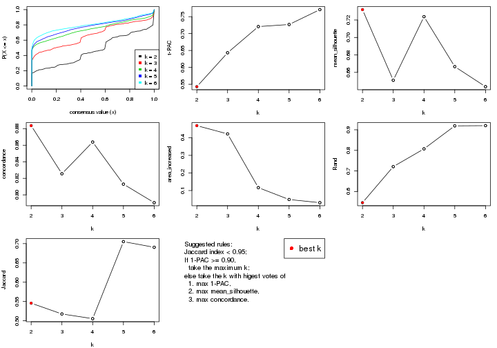

The numeric values for all these statistics can be obtained by `get_stats()`.

```r
get_stats(res)
```

```
#>   k 1-PAC mean_silhouette concordance area_increased  Rand Jaccard
#> 2 2 0.543           0.732       0.884         0.4685 0.546   0.546
#> 3 3 0.643           0.651       0.826         0.4215 0.721   0.518
#> 4 4 0.721           0.724       0.864         0.1165 0.807   0.506
#> 5 5 0.727           0.667       0.813         0.0490 0.919   0.705
#> 6 6 0.771           0.644       0.791         0.0311 0.920   0.690
```

`suggest_best_k()` suggests the best $k$ based on these statistics. The rules are as follows:

- All $k$ with Jaccard index larger than 0.95 are removed because increasing
  $k$ does not provide enough extra information. If all $k$ are removed, it is
  marked as no subgroup is detected.
- For all $k$ with 1-PAC score larger than 0.9, the maximal $k$ is taken as
  the best $k$, and other $k$ are marked as optional $k$.
- If it does not fit the second rule. The $k$ with the maximal vote of the
  highest 1-PAC score, highest mean silhouette, and highest concordance is
  taken as the best $k$.

```r
suggest_best_k(res)
```

```
#> [1] 2
```


Following shows the table of the partitions (You need to click the **show/hide
code output** link to see it). The membership matrix (columns with name `p*`)
is inferred by
[`clue::cl_consensus()`](https://www.rdocumentation.org/link/cl_consensus?package=clue)
function with the `SE` method. Basically the value in the membership matrix
represents the probability to belong to a certain group. The finall class
label for an item is determined with the group with highest probability it
belongs to.

In `get_classes()` function, the entropy is calculated from the membership
matrix and the silhouette score is calculated from the consensus matrix.


<script>
$( function() {
	$( '#tabs-CV-NMF-get-classes' ).tabs();
} );
</script>
<div id='tabs-CV-NMF-get-classes'>
<ul>
<li><a href='#tab-CV-NMF-get-classes-1'>k = 2</a></li>
<li><a href='#tab-CV-NMF-get-classes-2'>k = 3</a></li>
<li><a href='#tab-CV-NMF-get-classes-3'>k = 4</a></li>
<li><a href='#tab-CV-NMF-get-classes-4'>k = 5</a></li>
<li><a href='#tab-CV-NMF-get-classes-5'>k = 6</a></li>
</ul>

<div id='tab-CV-NMF-get-classes-1'>
<p><a id='tab-CV-NMF-get-classes-1-a' style='color:#0366d6' href='#'>show/hide code output</a></p>
<pre><code class="r">cbind(get_classes(res, k = 2), get_membership(res, k = 2))
</code></pre>

<pre><code>#&gt;           class entropy silhouette    p1    p2
#&gt; GSM342319     2  0.7219     0.7156 0.200 0.800
#&gt; GSM342323     2  0.0000     0.8343 0.000 1.000
#&gt; GSM342325     2  0.7674     0.6957 0.224 0.776
#&gt; GSM342326     2  0.0000     0.8343 0.000 1.000
#&gt; GSM342327     2  0.0000     0.8343 0.000 1.000
#&gt; GSM342329     2  0.0000     0.8343 0.000 1.000
#&gt; GSM342331     2  0.0000     0.8343 0.000 1.000
#&gt; GSM342334     2  0.0000     0.8343 0.000 1.000
#&gt; GSM342335     2  0.0000     0.8343 0.000 1.000
#&gt; GSM342354     1  0.0000     0.8960 1.000 0.000
#&gt; GSM342371     2  0.0000     0.8343 0.000 1.000
#&gt; GSM342380     2  0.9710     0.4897 0.400 0.600
#&gt; GSM342382     1  0.9998    -0.2167 0.508 0.492
#&gt; GSM342399     2  0.9686     0.4961 0.396 0.604
#&gt; GSM342402     2  0.9286     0.5704 0.344 0.656
#&gt; GSM342404     2  0.0000     0.8343 0.000 1.000
#&gt; GSM342408     1  0.9710     0.3447 0.600 0.400
#&gt; GSM342409     1  0.9460     0.3184 0.636 0.364
#&gt; GSM342426     2  0.0000     0.8343 0.000 1.000
#&gt; GSM342441     1  0.0000     0.8960 1.000 0.000
#&gt; GSM342444     1  0.0000     0.8960 1.000 0.000
#&gt; GSM342451     1  0.0000     0.8960 1.000 0.000
#&gt; GSM342462     2  0.0000     0.8343 0.000 1.000
#&gt; GSM342467     2  0.0000     0.8343 0.000 1.000
#&gt; GSM342484     2  0.9635     0.5085 0.388 0.612
#&gt; GSM342491     2  0.0000     0.8343 0.000 1.000
#&gt; GSM342322     2  0.2948     0.8115 0.052 0.948
#&gt; GSM342338     1  0.0000     0.8960 1.000 0.000
#&gt; GSM342347     1  0.0000     0.8960 1.000 0.000
#&gt; GSM342356     1  0.0000     0.8960 1.000 0.000
#&gt; GSM342357     2  0.9580     0.5205 0.380 0.620
#&gt; GSM342366     2  0.0000     0.8343 0.000 1.000
#&gt; GSM342385     2  0.9710     0.4897 0.400 0.600
#&gt; GSM342421     2  0.0000     0.8343 0.000 1.000
#&gt; GSM342437     2  0.0000     0.8343 0.000 1.000
#&gt; GSM342454     1  0.0000     0.8960 1.000 0.000
#&gt; GSM342471     2  0.0000     0.8343 0.000 1.000
#&gt; GSM342477     2  0.0000     0.8343 0.000 1.000
#&gt; GSM342495     2  0.0000     0.8343 0.000 1.000
#&gt; GSM342496     1  0.9686     0.1523 0.604 0.396
#&gt; GSM342320     2  0.0000     0.8343 0.000 1.000
#&gt; GSM342321     2  0.0000     0.8343 0.000 1.000
#&gt; GSM342324     2  0.0000     0.8343 0.000 1.000
#&gt; GSM342328     2  0.0000     0.8343 0.000 1.000
#&gt; GSM342330     2  0.0000     0.8343 0.000 1.000
#&gt; GSM342332     2  0.0000     0.8343 0.000 1.000
#&gt; GSM342333     2  0.0000     0.8343 0.000 1.000
#&gt; GSM342336     2  0.0000     0.8343 0.000 1.000
#&gt; GSM342337     1  0.0000     0.8960 1.000 0.000
#&gt; GSM342339     1  0.0000     0.8960 1.000 0.000
#&gt; GSM342340     1  0.0000     0.8960 1.000 0.000
#&gt; GSM342341     1  0.0000     0.8960 1.000 0.000
#&gt; GSM342342     1  0.0000     0.8960 1.000 0.000
#&gt; GSM342343     1  0.0000     0.8960 1.000 0.000
#&gt; GSM342344     1  0.0000     0.8960 1.000 0.000
#&gt; GSM342345     1  0.0000     0.8960 1.000 0.000
#&gt; GSM342346     2  0.0000     0.8343 0.000 1.000
#&gt; GSM342348     2  0.9286     0.5681 0.344 0.656
#&gt; GSM342349     1  0.0938     0.8881 0.988 0.012
#&gt; GSM342350     1  0.2603     0.8639 0.956 0.044
#&gt; GSM342351     1  0.9044     0.4991 0.680 0.320
#&gt; GSM342352     1  0.0000     0.8960 1.000 0.000
#&gt; GSM342353     1  0.0000     0.8960 1.000 0.000
#&gt; GSM342355     1  0.0000     0.8960 1.000 0.000
#&gt; GSM342358     2  0.0000     0.8343 0.000 1.000
#&gt; GSM342359     2  0.0000     0.8343 0.000 1.000
#&gt; GSM342360     2  0.0000     0.8343 0.000 1.000
#&gt; GSM342361     2  0.0000     0.8343 0.000 1.000
#&gt; GSM342362     2  0.0000     0.8343 0.000 1.000
#&gt; GSM342363     2  0.7299     0.7124 0.204 0.796
#&gt; GSM342364     2  0.6887     0.7280 0.184 0.816
#&gt; GSM342365     2  0.0000     0.8343 0.000 1.000
#&gt; GSM342367     2  0.9209     0.5802 0.336 0.664
#&gt; GSM342368     2  0.2043     0.8210 0.032 0.968
#&gt; GSM342369     2  0.0000     0.8343 0.000 1.000
#&gt; GSM342370     2  0.0000     0.8343 0.000 1.000
#&gt; GSM342372     2  0.0000     0.8343 0.000 1.000
#&gt; GSM342373     2  0.0000     0.8343 0.000 1.000
#&gt; GSM342374     2  0.0000     0.8343 0.000 1.000
#&gt; GSM342375     2  0.0000     0.8343 0.000 1.000
#&gt; GSM342376     2  0.9993     0.2775 0.484 0.516
#&gt; GSM342377     2  0.9710     0.4897 0.400 0.600
#&gt; GSM342378     2  0.9710     0.4897 0.400 0.600
#&gt; GSM342379     2  0.0938     0.8297 0.012 0.988
#&gt; GSM342381     2  0.9393     0.5545 0.356 0.644
#&gt; GSM342383     2  0.9710     0.4897 0.400 0.600
#&gt; GSM342384     2  0.9710     0.4897 0.400 0.600
#&gt; GSM342386     2  0.9710     0.4897 0.400 0.600
#&gt; GSM342387     2  0.0000     0.8343 0.000 1.000
#&gt; GSM342388     1  0.0000     0.8960 1.000 0.000
#&gt; GSM342389     2  0.9358     0.5599 0.352 0.648
#&gt; GSM342390     1  0.0000     0.8960 1.000 0.000
#&gt; GSM342391     2  0.9710     0.4897 0.400 0.600
#&gt; GSM342392     1  0.0000     0.8960 1.000 0.000
#&gt; GSM342393     2  0.0000     0.8343 0.000 1.000
#&gt; GSM342394     2  0.9491     0.5380 0.368 0.632
#&gt; GSM342395     2  0.0000     0.8343 0.000 1.000
#&gt; GSM342396     1  0.0000     0.8960 1.000 0.000
#&gt; GSM342397     1  0.1843     0.8768 0.972 0.028
#&gt; GSM342398     2  0.9710     0.4897 0.400 0.600
#&gt; GSM342400     2  0.8661     0.6348 0.288 0.712
#&gt; GSM342401     1  0.0000     0.8960 1.000 0.000
#&gt; GSM342403     2  0.9710     0.4897 0.400 0.600
#&gt; GSM342405     2  0.9686     0.2029 0.396 0.604
#&gt; GSM342406     1  0.6247     0.7251 0.844 0.156
#&gt; GSM342407     1  0.0000     0.8960 1.000 0.000
#&gt; GSM342410     2  0.9775     0.4664 0.412 0.588
#&gt; GSM342411     2  0.0000     0.8343 0.000 1.000
#&gt; GSM342412     2  0.0000     0.8343 0.000 1.000
#&gt; GSM342413     2  0.9552     0.2565 0.376 0.624
#&gt; GSM342414     1  0.2423     0.8673 0.960 0.040
#&gt; GSM342415     2  0.0000     0.8343 0.000 1.000
#&gt; GSM342416     1  0.4815     0.8051 0.896 0.104
#&gt; GSM342417     2  0.0000     0.8343 0.000 1.000
#&gt; GSM342418     2  0.0000     0.8343 0.000 1.000
#&gt; GSM342419     2  0.9710     0.4897 0.400 0.600
#&gt; GSM342420     2  0.0000     0.8343 0.000 1.000
#&gt; GSM342422     2  0.9710     0.4897 0.400 0.600
#&gt; GSM342423     2  0.0000     0.8343 0.000 1.000
#&gt; GSM342424     2  0.0000     0.8343 0.000 1.000
#&gt; GSM342425     2  0.0000     0.8343 0.000 1.000
#&gt; GSM342427     2  0.0000     0.8343 0.000 1.000
#&gt; GSM342428     2  0.0000     0.8343 0.000 1.000
#&gt; GSM342429     2  0.3274     0.8071 0.060 0.940
#&gt; GSM342430     1  0.0000     0.8960 1.000 0.000
#&gt; GSM342431     1  0.0000     0.8960 1.000 0.000
#&gt; GSM342432     1  0.0000     0.8960 1.000 0.000
#&gt; GSM342433     1  0.4298     0.8223 0.912 0.088
#&gt; GSM342434     1  0.9608     0.3772 0.616 0.384
#&gt; GSM342435     1  0.1843     0.8768 0.972 0.028
#&gt; GSM342436     1  0.0000     0.8960 1.000 0.000
#&gt; GSM342438     1  0.0000     0.8960 1.000 0.000
#&gt; GSM342439     1  0.0000     0.8960 1.000 0.000
#&gt; GSM342440     1  0.0000     0.8960 1.000 0.000
#&gt; GSM342442     1  0.0000     0.8960 1.000 0.000
#&gt; GSM342443     2  0.0000     0.8343 0.000 1.000
#&gt; GSM342445     1  0.0000     0.8960 1.000 0.000
#&gt; GSM342446     1  0.0000     0.8960 1.000 0.000
#&gt; GSM342447     1  0.0000     0.8960 1.000 0.000
#&gt; GSM342448     1  0.7219     0.6859 0.800 0.200
#&gt; GSM342449     1  0.0000     0.8960 1.000 0.000
#&gt; GSM342450     1  0.4562     0.8138 0.904 0.096
#&gt; GSM342452     1  0.0000     0.8960 1.000 0.000
#&gt; GSM342453     1  0.0000     0.8960 1.000 0.000
#&gt; GSM342455     1  0.0000     0.8960 1.000 0.000
#&gt; GSM342456     2  0.0000     0.8343 0.000 1.000
#&gt; GSM342457     2  0.1633     0.8246 0.024 0.976
#&gt; GSM342458     2  0.0000     0.8343 0.000 1.000
#&gt; GSM342459     2  0.0000     0.8343 0.000 1.000
#&gt; GSM342460     2  0.0000     0.8343 0.000 1.000
#&gt; GSM342461     2  0.3274     0.8072 0.060 0.940
#&gt; GSM342463     2  0.9795     0.4559 0.416 0.584
#&gt; GSM342464     2  0.9710     0.4897 0.400 0.600
#&gt; GSM342465     1  0.9710     0.1381 0.600 0.400
#&gt; GSM342466     1  0.0000     0.8960 1.000 0.000
#&gt; GSM342468     2  0.0000     0.8343 0.000 1.000
#&gt; GSM342469     2  0.8813     0.6222 0.300 0.700
#&gt; GSM342470     2  0.9323     0.3271 0.348 0.652
#&gt; GSM342472     2  0.9686     0.2029 0.396 0.604
#&gt; GSM342473     2  0.0000     0.8343 0.000 1.000
#&gt; GSM342474     2  0.0672     0.8313 0.008 0.992
#&gt; GSM342475     1  0.0000     0.8960 1.000 0.000
#&gt; GSM342476     2  0.0000     0.8343 0.000 1.000
#&gt; GSM342478     2  0.0376     0.8328 0.004 0.996
#&gt; GSM342479     2  0.4939     0.7791 0.108 0.892
#&gt; GSM342480     2  0.0000     0.8343 0.000 1.000
#&gt; GSM342481     2  0.8813     0.6222 0.300 0.700
#&gt; GSM342482     2  0.0000     0.8343 0.000 1.000
#&gt; GSM342483     2  0.0000     0.8343 0.000 1.000
#&gt; GSM342485     2  0.9963     0.3364 0.464 0.536
#&gt; GSM342486     2  0.9710     0.4897 0.400 0.600
#&gt; GSM342487     1  0.0000     0.8960 1.000 0.000
#&gt; GSM342488     2  0.0000     0.8343 0.000 1.000
#&gt; GSM342489     2  0.0000     0.8343 0.000 1.000
#&gt; GSM342490     2  0.0000     0.8343 0.000 1.000
#&gt; GSM342492     1  0.0000     0.8960 1.000 0.000
#&gt; GSM342493     2  1.0000     0.2396 0.496 0.504
#&gt; GSM342494     2  0.0000     0.8343 0.000 1.000
#&gt; GSM342497     2  0.0000     0.8343 0.000 1.000
#&gt; GSM342498     2  0.9710     0.4897 0.400 0.600
#&gt; GSM342499     2  0.9710     0.4897 0.400 0.600
#&gt; GSM342500     2  0.0000     0.8343 0.000 1.000
#&gt; GSM342501     2  0.9754     0.4733 0.408 0.592
#&gt; GSM342502     2  0.9427     0.5498 0.360 0.640
#&gt; GSM342503     2  0.7453     0.7061 0.212 0.788
#&gt; GSM342504     2  0.0000     0.8343 0.000 1.000
#&gt; GSM342505     1  0.0000     0.8960 1.000 0.000
#&gt; GSM342506     1  0.9933    -0.0699 0.548 0.452
#&gt; GSM342507     2  0.7056     0.7232 0.192 0.808
#&gt; GSM342508     1  0.7602     0.6111 0.780 0.220
#&gt; GSM342509     1  0.9815     0.0607 0.580 0.420
#&gt; GSM342510     2  0.2043     0.8116 0.032 0.968
#&gt; GSM342511     1  0.7453     0.6701 0.788 0.212
#&gt; GSM342512     2  0.9710     0.4897 0.400 0.600
#&gt; GSM342513     1  0.9754     0.1087 0.592 0.408
#&gt; GSM342514     1  0.5946     0.7588 0.856 0.144
#&gt; GSM342515     2  0.9710     0.4897 0.400 0.600
</code></pre>

<script>
$('#tab-CV-NMF-get-classes-1-a').parent().next().next().hide();
$('#tab-CV-NMF-get-classes-1-a').click(function(){
  $('#tab-CV-NMF-get-classes-1-a').parent().next().next().toggle();
  return(false);
});
</script>
</div>

<div id='tab-CV-NMF-get-classes-2'>
<p><a id='tab-CV-NMF-get-classes-2-a' style='color:#0366d6' href='#'>show/hide code output</a></p>
<pre><code class="r">cbind(get_classes(res, k = 3), get_membership(res, k = 3))
</code></pre>

<pre><code>#&gt;           class entropy silhouette    p1    p2    p3
#&gt; GSM342319     1  0.0000     0.6374 1.000 0.000 0.000
#&gt; GSM342323     1  0.6299    -0.4029 0.524 0.476 0.000
#&gt; GSM342325     1  0.0000     0.6374 1.000 0.000 0.000
#&gt; GSM342326     2  0.6111     0.5653 0.396 0.604 0.000
#&gt; GSM342327     2  0.6126     0.5628 0.400 0.600 0.000
#&gt; GSM342329     1  0.6235    -0.3220 0.564 0.436 0.000
#&gt; GSM342331     2  0.6111     0.5653 0.396 0.604 0.000
#&gt; GSM342334     2  0.1411     0.6408 0.036 0.964 0.000
#&gt; GSM342335     1  0.6168     0.6093 0.588 0.412 0.000
#&gt; GSM342354     3  0.0000     0.9455 0.000 0.000 1.000
#&gt; GSM342371     1  0.6126     0.6203 0.600 0.400 0.000
#&gt; GSM342380     1  0.0000     0.6374 1.000 0.000 0.000
#&gt; GSM342382     1  0.6111     0.6229 0.604 0.396 0.000
#&gt; GSM342399     1  0.0000     0.6374 1.000 0.000 0.000
#&gt; GSM342402     1  0.0000     0.6374 1.000 0.000 0.000
#&gt; GSM342404     2  0.0000     0.6620 0.000 1.000 0.000
#&gt; GSM342408     3  0.5968     0.4114 0.000 0.364 0.636
#&gt; GSM342409     1  0.9850     0.3585 0.392 0.356 0.252
#&gt; GSM342426     2  0.6111     0.5653 0.396 0.604 0.000
#&gt; GSM342441     3  0.0000     0.9455 0.000 0.000 1.000
#&gt; GSM342444     3  0.0000     0.9455 0.000 0.000 1.000
#&gt; GSM342451     3  0.0000     0.9455 0.000 0.000 1.000
#&gt; GSM342462     2  0.1964     0.6091 0.056 0.944 0.000
#&gt; GSM342467     2  0.0000     0.6620 0.000 1.000 0.000
#&gt; GSM342484     1  0.5470     0.4547 0.796 0.036 0.168
#&gt; GSM342491     2  0.6345     0.5607 0.400 0.596 0.004
#&gt; GSM342322     1  0.0000     0.6374 1.000 0.000 0.000
#&gt; GSM342338     3  0.0000     0.9455 0.000 0.000 1.000
#&gt; GSM342347     3  0.0000     0.9455 0.000 0.000 1.000
#&gt; GSM342356     3  0.4555     0.7268 0.200 0.000 0.800
#&gt; GSM342357     1  0.0000     0.6374 1.000 0.000 0.000
#&gt; GSM342366     1  0.6126     0.6203 0.600 0.400 0.000
#&gt; GSM342385     1  0.0000     0.6374 1.000 0.000 0.000
#&gt; GSM342421     2  0.2356     0.5975 0.072 0.928 0.000
#&gt; GSM342437     2  0.6126     0.5628 0.400 0.600 0.000
#&gt; GSM342454     3  0.0000     0.9455 0.000 0.000 1.000
#&gt; GSM342471     1  0.1753     0.6404 0.952 0.048 0.000
#&gt; GSM342477     2  0.4605     0.6172 0.204 0.796 0.000
#&gt; GSM342495     2  0.0000     0.6620 0.000 1.000 0.000
#&gt; GSM342496     2  0.9773    -0.1892 0.232 0.396 0.372
#&gt; GSM342320     2  0.6111     0.5653 0.396 0.604 0.000
#&gt; GSM342321     1  0.1163     0.6154 0.972 0.028 0.000
#&gt; GSM342324     2  0.6180     0.5483 0.416 0.584 0.000
#&gt; GSM342328     1  0.4291     0.3839 0.820 0.180 0.000
#&gt; GSM342330     2  0.6126     0.5628 0.400 0.600 0.000
#&gt; GSM342332     1  0.2878     0.6351 0.904 0.096 0.000
#&gt; GSM342333     2  0.6608    -0.3409 0.432 0.560 0.008
#&gt; GSM342336     2  0.5706     0.5688 0.320 0.680 0.000
#&gt; GSM342337     3  0.5785     0.4925 0.332 0.000 0.668
#&gt; GSM342339     3  0.0000     0.9455 0.000 0.000 1.000
#&gt; GSM342340     3  0.0747     0.9335 0.016 0.000 0.984
#&gt; GSM342341     3  0.0000     0.9455 0.000 0.000 1.000
#&gt; GSM342342     3  0.0000     0.9455 0.000 0.000 1.000
#&gt; GSM342343     3  0.1031     0.9271 0.024 0.000 0.976
#&gt; GSM342344     3  0.0000     0.9455 0.000 0.000 1.000
#&gt; GSM342345     3  0.0000     0.9455 0.000 0.000 1.000
#&gt; GSM342346     2  0.2448     0.6511 0.076 0.924 0.000
#&gt; GSM342348     1  0.0000     0.6374 1.000 0.000 0.000
#&gt; GSM342349     3  0.0000     0.9455 0.000 0.000 1.000
#&gt; GSM342350     3  0.0000     0.9455 0.000 0.000 1.000
#&gt; GSM342351     3  0.4235     0.7552 0.000 0.176 0.824
#&gt; GSM342352     3  0.0000     0.9455 0.000 0.000 1.000
#&gt; GSM342353     3  0.0000     0.9455 0.000 0.000 1.000
#&gt; GSM342355     3  0.5621     0.5495 0.308 0.000 0.692
#&gt; GSM342358     2  0.6126     0.5628 0.400 0.600 0.000
#&gt; GSM342359     2  0.6126     0.5628 0.400 0.600 0.000
#&gt; GSM342360     2  0.6168     0.5524 0.412 0.588 0.000
#&gt; GSM342361     2  0.6111     0.5653 0.396 0.604 0.000
#&gt; GSM342362     1  0.3482     0.4819 0.872 0.128 0.000
#&gt; GSM342363     1  0.0000     0.6374 1.000 0.000 0.000
#&gt; GSM342364     1  0.6126     0.6203 0.600 0.400 0.000
#&gt; GSM342365     2  0.0000     0.6620 0.000 1.000 0.000
#&gt; GSM342367     1  0.6111     0.6229 0.604 0.396 0.000
#&gt; GSM342368     1  0.6126     0.6203 0.600 0.400 0.000
#&gt; GSM342369     2  0.0000     0.6620 0.000 1.000 0.000
#&gt; GSM342370     2  0.0000     0.6620 0.000 1.000 0.000
#&gt; GSM342372     2  0.0747     0.6507 0.016 0.984 0.000
#&gt; GSM342373     1  0.6126     0.6203 0.600 0.400 0.000
#&gt; GSM342374     2  0.0000     0.6620 0.000 1.000 0.000
#&gt; GSM342375     2  0.0000     0.6620 0.000 1.000 0.000
#&gt; GSM342376     1  0.6111     0.6229 0.604 0.396 0.000
#&gt; GSM342377     1  0.6111     0.6229 0.604 0.396 0.000
#&gt; GSM342378     1  0.0000     0.6374 1.000 0.000 0.000
#&gt; GSM342379     1  0.0000     0.6374 1.000 0.000 0.000
#&gt; GSM342381     1  0.6095     0.6240 0.608 0.392 0.000
#&gt; GSM342383     1  0.1031     0.6424 0.976 0.024 0.000
#&gt; GSM342384     1  0.6111     0.6229 0.604 0.396 0.000
#&gt; GSM342386     1  0.6126     0.6203 0.600 0.400 0.000
#&gt; GSM342387     2  0.6267     0.5055 0.452 0.548 0.000
#&gt; GSM342388     3  0.1643     0.9095 0.044 0.000 0.956
#&gt; GSM342389     1  0.6111     0.6229 0.604 0.396 0.000
#&gt; GSM342390     1  0.4002     0.4841 0.840 0.000 0.160
#&gt; GSM342391     1  0.0000     0.6374 1.000 0.000 0.000
#&gt; GSM342392     3  0.0000     0.9455 0.000 0.000 1.000
#&gt; GSM342393     2  0.0000     0.6620 0.000 1.000 0.000
#&gt; GSM342394     1  0.0000     0.6374 1.000 0.000 0.000
#&gt; GSM342395     1  0.6126     0.6203 0.600 0.400 0.000
#&gt; GSM342396     3  0.0000     0.9455 0.000 0.000 1.000
#&gt; GSM342397     3  0.0000     0.9455 0.000 0.000 1.000
#&gt; GSM342398     1  0.6111     0.6229 0.604 0.396 0.000
#&gt; GSM342400     1  0.6111     0.6229 0.604 0.396 0.000
#&gt; GSM342401     3  0.0000     0.9455 0.000 0.000 1.000
#&gt; GSM342403     1  0.5905     0.6261 0.648 0.352 0.000
#&gt; GSM342405     2  0.5098     0.5345 0.000 0.752 0.248
#&gt; GSM342406     1  0.0592     0.6307 0.988 0.000 0.012
#&gt; GSM342407     3  0.0000     0.9455 0.000 0.000 1.000
#&gt; GSM342410     1  0.0000     0.6374 1.000 0.000 0.000
#&gt; GSM342411     1  0.0592     0.6294 0.988 0.012 0.000
#&gt; GSM342412     2  0.6204     0.5328 0.424 0.576 0.000
#&gt; GSM342413     2  0.6126     0.5628 0.400 0.600 0.000
#&gt; GSM342414     3  0.0000     0.9455 0.000 0.000 1.000
#&gt; GSM342415     1  0.6111     0.6229 0.604 0.396 0.000
#&gt; GSM342416     1  0.1289     0.6161 0.968 0.000 0.032
#&gt; GSM342417     2  0.6180     0.5484 0.416 0.584 0.000
#&gt; GSM342418     2  0.6111     0.5653 0.396 0.604 0.000
#&gt; GSM342419     1  0.3116     0.6428 0.892 0.108 0.000
#&gt; GSM342420     2  0.6126     0.5628 0.400 0.600 0.000
#&gt; GSM342422     1  0.6111     0.6229 0.604 0.396 0.000
#&gt; GSM342423     1  0.6140     0.6173 0.596 0.404 0.000
#&gt; GSM342424     2  0.6126     0.5628 0.400 0.600 0.000
#&gt; GSM342425     2  0.6111     0.5653 0.396 0.604 0.000
#&gt; GSM342427     2  0.0237     0.6621 0.004 0.996 0.000
#&gt; GSM342428     2  0.0892     0.6612 0.020 0.980 0.000
#&gt; GSM342429     2  0.8000    -0.0453 0.284 0.620 0.096
#&gt; GSM342430     3  0.0000     0.9455 0.000 0.000 1.000
#&gt; GSM342431     3  0.0000     0.9455 0.000 0.000 1.000
#&gt; GSM342432     3  0.0000     0.9455 0.000 0.000 1.000
#&gt; GSM342433     3  0.0000     0.9455 0.000 0.000 1.000
#&gt; GSM342434     3  0.4654     0.7095 0.000 0.208 0.792
#&gt; GSM342435     3  0.0000     0.9455 0.000 0.000 1.000
#&gt; GSM342436     3  0.0000     0.9455 0.000 0.000 1.000
#&gt; GSM342438     3  0.0000     0.9455 0.000 0.000 1.000
#&gt; GSM342439     3  0.0000     0.9455 0.000 0.000 1.000
#&gt; GSM342440     3  0.0000     0.9455 0.000 0.000 1.000
#&gt; GSM342442     3  0.0000     0.9455 0.000 0.000 1.000
#&gt; GSM342443     2  0.0000     0.6620 0.000 1.000 0.000
#&gt; GSM342445     3  0.0000     0.9455 0.000 0.000 1.000
#&gt; GSM342446     3  0.0000     0.9455 0.000 0.000 1.000
#&gt; GSM342447     3  0.0000     0.9455 0.000 0.000 1.000
#&gt; GSM342448     3  0.1163     0.9221 0.000 0.028 0.972
#&gt; GSM342449     3  0.0000     0.9455 0.000 0.000 1.000
#&gt; GSM342450     3  0.0237     0.9424 0.000 0.004 0.996
#&gt; GSM342452     3  0.0000     0.9455 0.000 0.000 1.000
#&gt; GSM342453     3  0.0000     0.9455 0.000 0.000 1.000
#&gt; GSM342455     3  0.0000     0.9455 0.000 0.000 1.000
#&gt; GSM342456     2  0.6111     0.5653 0.396 0.604 0.000
#&gt; GSM342457     1  0.6126     0.6203 0.600 0.400 0.000
#&gt; GSM342458     2  0.0000     0.6620 0.000 1.000 0.000
#&gt; GSM342459     2  0.0237     0.6590 0.004 0.996 0.000
#&gt; GSM342460     2  0.0000     0.6620 0.000 1.000 0.000
#&gt; GSM342461     1  0.6168     0.6097 0.588 0.412 0.000
#&gt; GSM342463     1  0.8755     0.5183 0.488 0.400 0.112
#&gt; GSM342464     1  0.8859     0.5087 0.480 0.400 0.120
#&gt; GSM342465     1  0.8403     0.5458 0.512 0.400 0.088
#&gt; GSM342466     3  0.6008     0.4158 0.372 0.000 0.628
#&gt; GSM342468     2  0.0000     0.6620 0.000 1.000 0.000
#&gt; GSM342469     1  0.1163     0.6425 0.972 0.028 0.000
#&gt; GSM342470     2  0.6126     0.5628 0.400 0.600 0.000
#&gt; GSM342472     2  0.5016     0.5403 0.000 0.760 0.240
#&gt; GSM342473     1  0.6140     0.6173 0.596 0.404 0.000
#&gt; GSM342474     1  0.6126     0.6203 0.600 0.400 0.000
#&gt; GSM342475     3  0.0000     0.9455 0.000 0.000 1.000
#&gt; GSM342476     2  0.0000     0.6620 0.000 1.000 0.000
#&gt; GSM342478     2  0.4172     0.5206 0.004 0.840 0.156
#&gt; GSM342479     1  0.7097     0.3856 0.668 0.280 0.052
#&gt; GSM342480     2  0.0000     0.6620 0.000 1.000 0.000
#&gt; GSM342481     2  0.9464    -0.4213 0.404 0.416 0.180
#&gt; GSM342482     2  0.5835    -0.0818 0.340 0.660 0.000
#&gt; GSM342483     2  0.1753     0.6182 0.048 0.952 0.000
#&gt; GSM342485     1  0.7043     0.6063 0.576 0.400 0.024
#&gt; GSM342486     1  0.6111     0.6229 0.604 0.396 0.000
#&gt; GSM342487     3  0.0000     0.9455 0.000 0.000 1.000
#&gt; GSM342488     2  0.0000     0.6620 0.000 1.000 0.000
#&gt; GSM342489     2  0.0000     0.6620 0.000 1.000 0.000
#&gt; GSM342490     2  0.0000     0.6620 0.000 1.000 0.000
#&gt; GSM342492     3  0.0000     0.9455 0.000 0.000 1.000
#&gt; GSM342493     1  0.7156     0.6032 0.572 0.400 0.028
#&gt; GSM342494     2  0.0000     0.6620 0.000 1.000 0.000
#&gt; GSM342497     2  0.0000     0.6620 0.000 1.000 0.000
#&gt; GSM342498     1  0.0592     0.6334 0.988 0.000 0.012
#&gt; GSM342499     1  0.0592     0.6403 0.988 0.012 0.000
#&gt; GSM342500     2  0.2066     0.6045 0.060 0.940 0.000
#&gt; GSM342501     1  0.6605     0.5961 0.752 0.152 0.096
#&gt; GSM342502     1  0.7043     0.6062 0.576 0.400 0.024
#&gt; GSM342503     2  0.9439    -0.3718 0.376 0.444 0.180
#&gt; GSM342504     2  0.2945     0.5637 0.088 0.908 0.004
#&gt; GSM342505     3  0.0000     0.9455 0.000 0.000 1.000
#&gt; GSM342506     1  0.1964     0.6060 0.944 0.000 0.056
#&gt; GSM342507     1  0.2165     0.5736 0.936 0.064 0.000
#&gt; GSM342508     1  0.0000     0.6374 1.000 0.000 0.000
#&gt; GSM342509     3  0.7021     0.3006 0.436 0.020 0.544
#&gt; GSM342510     2  0.6126     0.5628 0.400 0.600 0.000
#&gt; GSM342511     3  0.1031     0.9271 0.000 0.024 0.976
#&gt; GSM342512     1  0.7366     0.5967 0.564 0.400 0.036
#&gt; GSM342513     1  0.7890     0.5784 0.544 0.396 0.060
#&gt; GSM342514     3  0.5058     0.6711 0.244 0.000 0.756
#&gt; GSM342515     1  0.0000     0.6374 1.000 0.000 0.000
</code></pre>

<script>
$('#tab-CV-NMF-get-classes-2-a').parent().next().next().hide();
$('#tab-CV-NMF-get-classes-2-a').click(function(){
  $('#tab-CV-NMF-get-classes-2-a').parent().next().next().toggle();
  return(false);
});
</script>
</div>

<div id='tab-CV-NMF-get-classes-3'>
<p><a id='tab-CV-NMF-get-classes-3-a' style='color:#0366d6' href='#'>show/hide code output</a></p>
<pre><code class="r">cbind(get_classes(res, k = 4), get_membership(res, k = 4))
</code></pre>

<pre><code>#&gt;           class entropy silhouette    p1    p2    p3    p4
#&gt; GSM342319     1  0.3444     0.7448 0.816 0.000 0.000 0.184
#&gt; GSM342323     1  0.4843     0.5234 0.604 0.000 0.000 0.396
#&gt; GSM342325     1  0.3591     0.7486 0.824 0.008 0.000 0.168
#&gt; GSM342326     4  0.2011     0.6805 0.080 0.000 0.000 0.920
#&gt; GSM342327     4  0.2469     0.6642 0.108 0.000 0.000 0.892
#&gt; GSM342329     1  0.4713     0.5843 0.640 0.000 0.000 0.360
#&gt; GSM342331     4  0.1867     0.6836 0.072 0.000 0.000 0.928
#&gt; GSM342334     4  0.6027     0.5611 0.192 0.124 0.000 0.684
#&gt; GSM342335     2  0.4483     0.5640 0.284 0.712 0.000 0.004
#&gt; GSM342354     3  0.0000     0.9688 0.000 0.000 1.000 0.000
#&gt; GSM342371     2  0.0188     0.8421 0.004 0.996 0.000 0.000
#&gt; GSM342380     1  0.3768     0.7470 0.808 0.008 0.000 0.184
#&gt; GSM342382     2  0.1557     0.8222 0.056 0.944 0.000 0.000
#&gt; GSM342399     1  0.3591     0.7483 0.824 0.008 0.000 0.168
#&gt; GSM342402     1  0.2408     0.7685 0.896 0.000 0.000 0.104
#&gt; GSM342404     4  0.4776     0.3858 0.000 0.376 0.000 0.624
#&gt; GSM342408     3  0.4817     0.3273 0.000 0.000 0.612 0.388
#&gt; GSM342409     2  0.7763     0.3874 0.124 0.568 0.260 0.048
#&gt; GSM342426     4  0.1637     0.6864 0.060 0.000 0.000 0.940
#&gt; GSM342441     3  0.0000     0.9688 0.000 0.000 1.000 0.000
#&gt; GSM342444     3  0.0000     0.9688 0.000 0.000 1.000 0.000
#&gt; GSM342451     3  0.0000     0.9688 0.000 0.000 1.000 0.000
#&gt; GSM342462     2  0.0817     0.8340 0.000 0.976 0.000 0.024
#&gt; GSM342467     4  0.3942     0.6181 0.000 0.236 0.000 0.764
#&gt; GSM342484     1  0.4957     0.6977 0.776 0.000 0.112 0.112
#&gt; GSM342491     4  0.4406     0.5517 0.300 0.000 0.000 0.700
#&gt; GSM342322     1  0.3649     0.7388 0.796 0.000 0.000 0.204
#&gt; GSM342338     3  0.0000     0.9688 0.000 0.000 1.000 0.000
#&gt; GSM342347     3  0.0000     0.9688 0.000 0.000 1.000 0.000
#&gt; GSM342356     3  0.1716     0.9087 0.064 0.000 0.936 0.000
#&gt; GSM342357     1  0.2345     0.7694 0.900 0.000 0.000 0.100
#&gt; GSM342366     2  0.0000     0.8413 0.000 1.000 0.000 0.000
#&gt; GSM342385     1  0.3808     0.7482 0.812 0.012 0.000 0.176
#&gt; GSM342421     2  0.4713     0.3909 0.000 0.640 0.000 0.360
#&gt; GSM342437     4  0.4250     0.6196 0.276 0.000 0.000 0.724
#&gt; GSM342454     3  0.0000     0.9688 0.000 0.000 1.000 0.000
#&gt; GSM342471     1  0.1624     0.7602 0.952 0.020 0.000 0.028
#&gt; GSM342477     4  0.3377     0.6928 0.012 0.140 0.000 0.848
#&gt; GSM342495     2  0.2868     0.7525 0.000 0.864 0.000 0.136
#&gt; GSM342496     2  0.0707     0.8406 0.020 0.980 0.000 0.000
#&gt; GSM342320     4  0.1940     0.6823 0.076 0.000 0.000 0.924
#&gt; GSM342321     1  0.4134     0.7017 0.740 0.000 0.000 0.260
#&gt; GSM342324     1  0.4898     0.5048 0.584 0.000 0.000 0.416
#&gt; GSM342328     1  0.4304     0.6806 0.716 0.000 0.000 0.284
#&gt; GSM342330     4  0.2868     0.6408 0.136 0.000 0.000 0.864
#&gt; GSM342332     1  0.5085     0.6739 0.708 0.032 0.000 0.260
#&gt; GSM342333     1  0.6679     0.0471 0.488 0.440 0.008 0.064
#&gt; GSM342336     4  0.4748     0.5190 0.268 0.016 0.000 0.716
#&gt; GSM342337     3  0.3569     0.7438 0.196 0.000 0.804 0.000
#&gt; GSM342339     3  0.0000     0.9688 0.000 0.000 1.000 0.000
#&gt; GSM342340     3  0.0188     0.9659 0.004 0.000 0.996 0.000
#&gt; GSM342341     3  0.0000     0.9688 0.000 0.000 1.000 0.000
#&gt; GSM342342     3  0.0000     0.9688 0.000 0.000 1.000 0.000
#&gt; GSM342343     3  0.0336     0.9627 0.008 0.000 0.992 0.000
#&gt; GSM342344     3  0.0000     0.9688 0.000 0.000 1.000 0.000
#&gt; GSM342345     3  0.0000     0.9688 0.000 0.000 1.000 0.000
#&gt; GSM342346     4  0.1042     0.6916 0.008 0.020 0.000 0.972
#&gt; GSM342348     1  0.0707     0.7725 0.980 0.000 0.000 0.020
#&gt; GSM342349     3  0.0000     0.9688 0.000 0.000 1.000 0.000
#&gt; GSM342350     3  0.0000     0.9688 0.000 0.000 1.000 0.000
#&gt; GSM342351     3  0.0000     0.9688 0.000 0.000 1.000 0.000
#&gt; GSM342352     3  0.0000     0.9688 0.000 0.000 1.000 0.000
#&gt; GSM342353     3  0.0000     0.9688 0.000 0.000 1.000 0.000
#&gt; GSM342355     3  0.4730     0.3973 0.364 0.000 0.636 0.000
#&gt; GSM342358     1  0.4304     0.6038 0.716 0.000 0.000 0.284
#&gt; GSM342359     4  0.4941     0.1944 0.436 0.000 0.000 0.564
#&gt; GSM342360     1  0.4040     0.6551 0.752 0.000 0.000 0.248
#&gt; GSM342361     4  0.3356     0.6558 0.176 0.000 0.000 0.824
#&gt; GSM342362     1  0.2973     0.7517 0.856 0.000 0.000 0.144
#&gt; GSM342363     1  0.2345     0.7694 0.900 0.000 0.000 0.100
#&gt; GSM342364     2  0.0188     0.8421 0.004 0.996 0.000 0.000
#&gt; GSM342365     4  0.4382     0.5418 0.000 0.296 0.000 0.704
#&gt; GSM342367     2  0.0921     0.8380 0.028 0.972 0.000 0.000
#&gt; GSM342368     2  0.0336     0.8421 0.008 0.992 0.000 0.000
#&gt; GSM342369     2  0.4817     0.3221 0.000 0.612 0.000 0.388
#&gt; GSM342370     4  0.4522     0.5025 0.000 0.320 0.000 0.680
#&gt; GSM342372     2  0.4761     0.3551 0.000 0.628 0.000 0.372
#&gt; GSM342373     2  0.0188     0.8421 0.004 0.996 0.000 0.000
#&gt; GSM342374     4  0.4679     0.4392 0.000 0.352 0.000 0.648
#&gt; GSM342375     2  0.4981     0.0929 0.000 0.536 0.000 0.464
#&gt; GSM342376     2  0.4996     0.1183 0.484 0.516 0.000 0.000
#&gt; GSM342377     2  0.3975     0.6466 0.240 0.760 0.000 0.000
#&gt; GSM342378     1  0.0336     0.7699 0.992 0.008 0.000 0.000
#&gt; GSM342379     1  0.3672     0.7497 0.824 0.012 0.000 0.164
#&gt; GSM342381     2  0.4817     0.3525 0.388 0.612 0.000 0.000
#&gt; GSM342383     1  0.4804     0.7258 0.780 0.072 0.000 0.148
#&gt; GSM342384     2  0.0921     0.8380 0.028 0.972 0.000 0.000
#&gt; GSM342386     2  0.0592     0.8415 0.016 0.984 0.000 0.000
#&gt; GSM342387     1  0.2011     0.7567 0.920 0.000 0.000 0.080
#&gt; GSM342388     3  0.0336     0.9627 0.008 0.000 0.992 0.000
#&gt; GSM342389     2  0.0921     0.8380 0.028 0.972 0.000 0.000
#&gt; GSM342390     1  0.1118     0.7717 0.964 0.000 0.000 0.036
#&gt; GSM342391     1  0.0000     0.7712 1.000 0.000 0.000 0.000
#&gt; GSM342392     3  0.0000     0.9688 0.000 0.000 1.000 0.000
#&gt; GSM342393     4  0.4072     0.6004 0.000 0.252 0.000 0.748
#&gt; GSM342394     1  0.0000     0.7712 1.000 0.000 0.000 0.000
#&gt; GSM342395     2  0.0188     0.8406 0.000 0.996 0.000 0.004
#&gt; GSM342396     3  0.0000     0.9688 0.000 0.000 1.000 0.000
#&gt; GSM342397     3  0.0000     0.9688 0.000 0.000 1.000 0.000
#&gt; GSM342398     2  0.3172     0.7319 0.160 0.840 0.000 0.000
#&gt; GSM342400     2  0.1211     0.8319 0.040 0.960 0.000 0.000
#&gt; GSM342401     3  0.0000     0.9688 0.000 0.000 1.000 0.000
#&gt; GSM342403     1  0.6337     0.0158 0.472 0.468 0.000 0.060
#&gt; GSM342405     4  0.5078     0.5353 0.000 0.028 0.272 0.700
#&gt; GSM342406     1  0.0921     0.7720 0.972 0.000 0.000 0.028
#&gt; GSM342407     3  0.0000     0.9688 0.000 0.000 1.000 0.000
#&gt; GSM342410     1  0.0000     0.7712 1.000 0.000 0.000 0.000
#&gt; GSM342411     1  0.1022     0.7720 0.968 0.000 0.000 0.032
#&gt; GSM342412     4  0.4967    -0.1933 0.452 0.000 0.000 0.548
#&gt; GSM342413     4  0.4585     0.5615 0.332 0.000 0.000 0.668
#&gt; GSM342414     3  0.0000     0.9688 0.000 0.000 1.000 0.000
#&gt; GSM342415     2  0.4981     0.1838 0.464 0.536 0.000 0.000
#&gt; GSM342416     1  0.1118     0.7714 0.964 0.000 0.000 0.036
#&gt; GSM342417     4  0.4790     0.0768 0.380 0.000 0.000 0.620
#&gt; GSM342418     4  0.2081     0.6712 0.084 0.000 0.000 0.916
#&gt; GSM342419     1  0.5332     0.6493 0.736 0.184 0.000 0.080
#&gt; GSM342420     4  0.3123     0.6220 0.156 0.000 0.000 0.844
#&gt; GSM342422     2  0.2408     0.7847 0.104 0.896 0.000 0.000
#&gt; GSM342423     2  0.0188     0.8412 0.000 0.996 0.000 0.004
#&gt; GSM342424     4  0.2704     0.6527 0.124 0.000 0.000 0.876
#&gt; GSM342425     4  0.1792     0.6849 0.068 0.000 0.000 0.932
#&gt; GSM342427     4  0.4914     0.5158 0.012 0.312 0.000 0.676
#&gt; GSM342428     4  0.4253     0.6447 0.016 0.208 0.000 0.776
#&gt; GSM342429     2  0.1452     0.8316 0.036 0.956 0.000 0.008
#&gt; GSM342430     3  0.0000     0.9688 0.000 0.000 1.000 0.000
#&gt; GSM342431     3  0.0000     0.9688 0.000 0.000 1.000 0.000
#&gt; GSM342432     3  0.0336     0.9625 0.008 0.000 0.992 0.000
#&gt; GSM342433     3  0.0000     0.9688 0.000 0.000 1.000 0.000
#&gt; GSM342434     3  0.3837     0.6835 0.000 0.000 0.776 0.224
#&gt; GSM342435     3  0.0000     0.9688 0.000 0.000 1.000 0.000
#&gt; GSM342436     3  0.0000     0.9688 0.000 0.000 1.000 0.000
#&gt; GSM342438     3  0.0000     0.9688 0.000 0.000 1.000 0.000
#&gt; GSM342439     3  0.0000     0.9688 0.000 0.000 1.000 0.000
#&gt; GSM342440     3  0.0000     0.9688 0.000 0.000 1.000 0.000
#&gt; GSM342442     3  0.0000     0.9688 0.000 0.000 1.000 0.000
#&gt; GSM342443     2  0.3649     0.6731 0.000 0.796 0.000 0.204
#&gt; GSM342445     3  0.0000     0.9688 0.000 0.000 1.000 0.000
#&gt; GSM342446     3  0.0000     0.9688 0.000 0.000 1.000 0.000
#&gt; GSM342447     3  0.0000     0.9688 0.000 0.000 1.000 0.000
#&gt; GSM342448     3  0.0188     0.9658 0.000 0.000 0.996 0.004
#&gt; GSM342449     3  0.0000     0.9688 0.000 0.000 1.000 0.000
#&gt; GSM342450     3  0.0000     0.9688 0.000 0.000 1.000 0.000
#&gt; GSM342452     3  0.0000     0.9688 0.000 0.000 1.000 0.000
#&gt; GSM342453     3  0.0000     0.9688 0.000 0.000 1.000 0.000
#&gt; GSM342455     3  0.0000     0.9688 0.000 0.000 1.000 0.000
#&gt; GSM342456     4  0.3074     0.6654 0.152 0.000 0.000 0.848
#&gt; GSM342457     2  0.0592     0.8415 0.016 0.984 0.000 0.000
#&gt; GSM342458     4  0.4961     0.1862 0.000 0.448 0.000 0.552
#&gt; GSM342459     2  0.1389     0.8222 0.000 0.952 0.000 0.048
#&gt; GSM342460     2  0.1940     0.8037 0.000 0.924 0.000 0.076
#&gt; GSM342461     2  0.0000     0.8413 0.000 1.000 0.000 0.000
#&gt; GSM342463     2  0.0592     0.8415 0.016 0.984 0.000 0.000
#&gt; GSM342464     2  0.0469     0.8420 0.012 0.988 0.000 0.000
#&gt; GSM342465     2  0.0817     0.8395 0.024 0.976 0.000 0.000
#&gt; GSM342466     1  0.4679     0.4018 0.648 0.000 0.352 0.000
#&gt; GSM342468     2  0.4730     0.3918 0.000 0.636 0.000 0.364
#&gt; GSM342469     1  0.4431     0.5146 0.696 0.304 0.000 0.000
#&gt; GSM342470     4  0.4509     0.6023 0.288 0.000 0.004 0.708
#&gt; GSM342472     4  0.4452     0.6346 0.000 0.048 0.156 0.796
#&gt; GSM342473     2  0.0188     0.8421 0.004 0.996 0.000 0.000
#&gt; GSM342474     2  0.0469     0.8420 0.012 0.988 0.000 0.000
#&gt; GSM342475     3  0.0000     0.9688 0.000 0.000 1.000 0.000
#&gt; GSM342476     4  0.4985     0.1181 0.000 0.468 0.000 0.532
#&gt; GSM342478     2  0.1302     0.8245 0.000 0.956 0.000 0.044
#&gt; GSM342479     2  0.6761     0.3596 0.168 0.608 0.000 0.224
#&gt; GSM342480     2  0.4500     0.4953 0.000 0.684 0.000 0.316
#&gt; GSM342481     2  0.0188     0.8421 0.004 0.996 0.000 0.000
#&gt; GSM342482     2  0.0336     0.8395 0.000 0.992 0.000 0.008
#&gt; GSM342483     2  0.1022     0.8303 0.000 0.968 0.000 0.032
#&gt; GSM342485     2  0.0817     0.8395 0.024 0.976 0.000 0.000
#&gt; GSM342486     2  0.0921     0.8380 0.028 0.972 0.000 0.000
#&gt; GSM342487     3  0.0188     0.9658 0.000 0.000 0.996 0.004
#&gt; GSM342488     2  0.4817     0.3359 0.000 0.612 0.000 0.388
#&gt; GSM342489     2  0.2149     0.7947 0.000 0.912 0.000 0.088
#&gt; GSM342490     4  0.3569     0.6560 0.000 0.196 0.000 0.804
#&gt; GSM342492     3  0.0000     0.9688 0.000 0.000 1.000 0.000
#&gt; GSM342493     2  0.0817     0.8395 0.024 0.976 0.000 0.000
#&gt; GSM342494     2  0.4998     0.0116 0.000 0.512 0.000 0.488
#&gt; GSM342497     4  0.4193     0.5815 0.000 0.268 0.000 0.732
#&gt; GSM342498     1  0.4250     0.5388 0.724 0.276 0.000 0.000
#&gt; GSM342499     1  0.4761     0.3729 0.628 0.372 0.000 0.000
#&gt; GSM342500     2  0.0707     0.8355 0.000 0.980 0.000 0.020
#&gt; GSM342501     2  0.5366     0.4987 0.276 0.684 0.000 0.040
#&gt; GSM342502     2  0.0188     0.8406 0.000 0.996 0.000 0.004
#&gt; GSM342503     2  0.0336     0.8395 0.000 0.992 0.000 0.008
#&gt; GSM342504     2  0.0817     0.8340 0.000 0.976 0.000 0.024
#&gt; GSM342505     3  0.0000     0.9688 0.000 0.000 1.000 0.000
#&gt; GSM342506     1  0.4234     0.6641 0.816 0.132 0.052 0.000
#&gt; GSM342507     1  0.2589     0.7646 0.884 0.000 0.000 0.116
#&gt; GSM342508     1  0.1940     0.7424 0.924 0.076 0.000 0.000
#&gt; GSM342509     1  0.6652     0.4323 0.576 0.000 0.316 0.108
#&gt; GSM342510     4  0.3583     0.6522 0.180 0.000 0.004 0.816
#&gt; GSM342511     3  0.1557     0.9151 0.000 0.000 0.944 0.056
#&gt; GSM342512     2  0.0592     0.8415 0.016 0.984 0.000 0.000
#&gt; GSM342513     2  0.0921     0.8380 0.028 0.972 0.000 0.000
#&gt; GSM342514     3  0.4609     0.6710 0.224 0.000 0.752 0.024
#&gt; GSM342515     1  0.2011     0.7395 0.920 0.080 0.000 0.000
</code></pre>

<script>
$('#tab-CV-NMF-get-classes-3-a').parent().next().next().hide();
$('#tab-CV-NMF-get-classes-3-a').click(function(){
  $('#tab-CV-NMF-get-classes-3-a').parent().next().next().toggle();
  return(false);
});
</script>
</div>

<div id='tab-CV-NMF-get-classes-4'>
<p><a id='tab-CV-NMF-get-classes-4-a' style='color:#0366d6' href='#'>show/hide code output</a></p>
<pre><code class="r">cbind(get_classes(res, k = 5), get_membership(res, k = 5))
</code></pre>

<pre><code>#&gt;           class entropy silhouette    p1    p2    p3    p4    p5
#&gt; GSM342319     5  0.5450     0.0812 0.444 0.000 0.000 0.060 0.496
#&gt; GSM342323     5  0.6752     0.1554 0.316 0.000 0.000 0.280 0.404
#&gt; GSM342325     5  0.4849     0.2502 0.360 0.000 0.000 0.032 0.608
#&gt; GSM342326     4  0.5062     0.4220 0.068 0.000 0.000 0.656 0.276
#&gt; GSM342327     4  0.5965     0.3071 0.128 0.000 0.000 0.544 0.328
#&gt; GSM342329     5  0.5970     0.3486 0.228 0.000 0.000 0.184 0.588
#&gt; GSM342331     4  0.5107     0.4656 0.108 0.000 0.000 0.688 0.204
#&gt; GSM342334     5  0.5405     0.3447 0.004 0.124 0.000 0.200 0.672
#&gt; GSM342335     5  0.4291    -0.0275 0.000 0.464 0.000 0.000 0.536
#&gt; GSM342354     3  0.0000     0.9697 0.000 0.000 1.000 0.000 0.000
#&gt; GSM342371     2  0.3215     0.7963 0.000 0.852 0.000 0.056 0.092
#&gt; GSM342380     5  0.1914     0.5049 0.060 0.000 0.000 0.016 0.924
#&gt; GSM342382     2  0.2221     0.8020 0.052 0.912 0.000 0.000 0.036
#&gt; GSM342399     5  0.4009     0.3193 0.312 0.000 0.000 0.004 0.684
#&gt; GSM342402     1  0.4541     0.7277 0.744 0.000 0.000 0.172 0.084
#&gt; GSM342404     4  0.4387     0.3540 0.000 0.348 0.000 0.640 0.012
#&gt; GSM342408     3  0.3266     0.7365 0.000 0.000 0.796 0.200 0.004
#&gt; GSM342409     5  0.6908     0.2221 0.000 0.228 0.308 0.012 0.452
#&gt; GSM342426     4  0.5144     0.4669 0.132 0.000 0.000 0.692 0.176
#&gt; GSM342441     3  0.0000     0.9697 0.000 0.000 1.000 0.000 0.000
#&gt; GSM342444     3  0.2476     0.8900 0.064 0.020 0.904 0.000 0.012
#&gt; GSM342451     3  0.0833     0.9544 0.016 0.004 0.976 0.000 0.004
#&gt; GSM342462     2  0.1571     0.8223 0.000 0.936 0.000 0.060 0.004
#&gt; GSM342467     4  0.3675     0.5264 0.000 0.216 0.008 0.772 0.004
#&gt; GSM342484     1  0.4367     0.7301 0.748 0.000 0.000 0.192 0.060
#&gt; GSM342491     1  0.5503     0.6130 0.632 0.004 0.000 0.272 0.092
#&gt; GSM342322     5  0.5315     0.3133 0.332 0.000 0.000 0.068 0.600
#&gt; GSM342338     3  0.0000     0.9697 0.000 0.000 1.000 0.000 0.000
#&gt; GSM342347     3  0.2806     0.8189 0.000 0.000 0.844 0.004 0.152
#&gt; GSM342356     3  0.2439     0.8500 0.004 0.000 0.876 0.000 0.120
#&gt; GSM342357     1  0.4466     0.7296 0.748 0.000 0.000 0.176 0.076
#&gt; GSM342366     2  0.2520     0.8143 0.000 0.896 0.000 0.056 0.048
#&gt; GSM342385     5  0.1121     0.5049 0.044 0.000 0.000 0.000 0.956
#&gt; GSM342421     2  0.4589     0.6410 0.000 0.704 0.000 0.248 0.048
#&gt; GSM342437     1  0.3123     0.7343 0.828 0.000 0.000 0.160 0.012
#&gt; GSM342454     3  0.1836     0.9209 0.040 0.008 0.936 0.000 0.016
#&gt; GSM342471     1  0.2228     0.7643 0.912 0.000 0.000 0.048 0.040
#&gt; GSM342477     4  0.2144     0.5128 0.068 0.000 0.000 0.912 0.020
#&gt; GSM342495     2  0.3353     0.7447 0.000 0.796 0.000 0.196 0.008
#&gt; GSM342496     2  0.2079     0.8023 0.064 0.916 0.000 0.000 0.020
#&gt; GSM342320     4  0.4909     0.4817 0.120 0.000 0.000 0.716 0.164
#&gt; GSM342321     5  0.5973     0.3630 0.256 0.000 0.000 0.164 0.580
#&gt; GSM342324     5  0.6791     0.0907 0.312 0.000 0.000 0.304 0.384
#&gt; GSM342328     5  0.6144     0.3266 0.280 0.000 0.000 0.172 0.548
#&gt; GSM342330     4  0.6264     0.2368 0.160 0.000 0.000 0.496 0.344
#&gt; GSM342332     5  0.5334     0.3944 0.180 0.000 0.000 0.148 0.672
#&gt; GSM342333     5  0.5405     0.3600 0.012 0.292 0.016 0.032 0.648
#&gt; GSM342336     5  0.4214     0.4570 0.064 0.004 0.000 0.152 0.780
#&gt; GSM342337     3  0.3409     0.7803 0.024 0.000 0.816 0.000 0.160
#&gt; GSM342339     3  0.0000     0.9697 0.000 0.000 1.000 0.000 0.000
#&gt; GSM342340     3  0.0000     0.9697 0.000 0.000 1.000 0.000 0.000
#&gt; GSM342341     3  0.0000     0.9697 0.000 0.000 1.000 0.000 0.000
#&gt; GSM342342     3  0.0000     0.9697 0.000 0.000 1.000 0.000 0.000
#&gt; GSM342343     3  0.0000     0.9697 0.000 0.000 1.000 0.000 0.000
#&gt; GSM342344     3  0.0000     0.9697 0.000 0.000 1.000 0.000 0.000
#&gt; GSM342345     3  0.0000     0.9697 0.000 0.000 1.000 0.000 0.000
#&gt; GSM342346     4  0.4215     0.5008 0.000 0.024 0.008 0.748 0.220
#&gt; GSM342348     1  0.1701     0.7636 0.936 0.000 0.000 0.016 0.048
#&gt; GSM342349     3  0.0000     0.9697 0.000 0.000 1.000 0.000 0.000
#&gt; GSM342350     3  0.0000     0.9697 0.000 0.000 1.000 0.000 0.000
#&gt; GSM342351     3  0.0162     0.9674 0.000 0.000 0.996 0.004 0.000
#&gt; GSM342352     3  0.0000     0.9697 0.000 0.000 1.000 0.000 0.000
#&gt; GSM342353     3  0.0000     0.9697 0.000 0.000 1.000 0.000 0.000
#&gt; GSM342355     3  0.4650     0.1970 0.012 0.000 0.520 0.000 0.468
#&gt; GSM342358     1  0.4840     0.6911 0.676 0.000 0.000 0.268 0.056
#&gt; GSM342359     1  0.5322     0.5303 0.552 0.000 0.000 0.392 0.056
#&gt; GSM342360     1  0.4769     0.6985 0.688 0.000 0.000 0.256 0.056
#&gt; GSM342361     4  0.4735     0.2124 0.272 0.000 0.000 0.680 0.048
#&gt; GSM342362     1  0.4613     0.7237 0.728 0.000 0.000 0.200 0.072
#&gt; GSM342363     1  0.5895     0.5533 0.588 0.000 0.000 0.152 0.260
#&gt; GSM342364     2  0.2777     0.7905 0.000 0.864 0.000 0.016 0.120
#&gt; GSM342365     4  0.4183     0.4056 0.000 0.324 0.000 0.668 0.008
#&gt; GSM342367     2  0.1648     0.8154 0.020 0.940 0.000 0.000 0.040
#&gt; GSM342368     2  0.2438     0.8147 0.000 0.900 0.000 0.040 0.060
#&gt; GSM342369     2  0.4526     0.5717 0.000 0.672 0.000 0.300 0.028
#&gt; GSM342370     4  0.4418     0.3868 0.000 0.332 0.000 0.652 0.016
#&gt; GSM342372     2  0.5980     0.5020 0.000 0.584 0.000 0.176 0.240
#&gt; GSM342373     2  0.2520     0.8143 0.000 0.896 0.000 0.056 0.048
#&gt; GSM342374     4  0.4585     0.3452 0.000 0.352 0.000 0.628 0.020
#&gt; GSM342375     2  0.6362     0.3909 0.000 0.520 0.000 0.224 0.256
#&gt; GSM342376     5  0.4876     0.1516 0.028 0.396 0.000 0.000 0.576
#&gt; GSM342377     5  0.4557    -0.0983 0.008 0.476 0.000 0.000 0.516
#&gt; GSM342378     1  0.2690     0.6781 0.844 0.000 0.000 0.000 0.156
#&gt; GSM342379     5  0.1485     0.4999 0.032 0.000 0.000 0.020 0.948
#&gt; GSM342381     5  0.4697     0.3802 0.036 0.304 0.000 0.000 0.660
#&gt; GSM342383     5  0.4019     0.4637 0.200 0.028 0.000 0.004 0.768
#&gt; GSM342384     2  0.2011     0.8008 0.004 0.908 0.000 0.000 0.088
#&gt; GSM342386     2  0.1106     0.8208 0.024 0.964 0.000 0.000 0.012
#&gt; GSM342387     1  0.2462     0.7528 0.880 0.000 0.000 0.112 0.008
#&gt; GSM342388     3  0.0000     0.9697 0.000 0.000 1.000 0.000 0.000
#&gt; GSM342389     2  0.2583     0.7780 0.004 0.864 0.000 0.000 0.132
#&gt; GSM342390     1  0.1943     0.7661 0.924 0.000 0.000 0.020 0.056
#&gt; GSM342391     1  0.1671     0.7483 0.924 0.000 0.000 0.000 0.076
#&gt; GSM342392     3  0.0000     0.9697 0.000 0.000 1.000 0.000 0.000
#&gt; GSM342393     4  0.4025     0.4521 0.000 0.292 0.000 0.700 0.008
#&gt; GSM342394     1  0.1243     0.7654 0.960 0.004 0.000 0.008 0.028
#&gt; GSM342395     2  0.2036     0.8198 0.000 0.920 0.000 0.056 0.024
#&gt; GSM342396     3  0.0000     0.9697 0.000 0.000 1.000 0.000 0.000
#&gt; GSM342397     3  0.0000     0.9697 0.000 0.000 1.000 0.000 0.000
#&gt; GSM342398     2  0.4497     0.2774 0.008 0.568 0.000 0.000 0.424
#&gt; GSM342400     2  0.2971     0.7539 0.008 0.836 0.000 0.000 0.156
#&gt; GSM342401     3  0.0000     0.9697 0.000 0.000 1.000 0.000 0.000
#&gt; GSM342403     5  0.5651     0.2175 0.020 0.356 0.000 0.048 0.576
#&gt; GSM342405     4  0.5061     0.3418 0.000 0.040 0.288 0.660 0.012
#&gt; GSM342406     1  0.1661     0.7680 0.940 0.000 0.000 0.036 0.024
#&gt; GSM342407     3  0.0000     0.9697 0.000 0.000 1.000 0.000 0.000
#&gt; GSM342410     1  0.2329     0.7148 0.876 0.000 0.000 0.000 0.124
#&gt; GSM342411     1  0.1981     0.7678 0.924 0.000 0.000 0.048 0.028
#&gt; GSM342412     5  0.2644     0.4738 0.012 0.012 0.000 0.088 0.888
#&gt; GSM342413     1  0.4147     0.5245 0.676 0.000 0.000 0.316 0.008
#&gt; GSM342414     3  0.0000     0.9697 0.000 0.000 1.000 0.000 0.000
#&gt; GSM342415     5  0.4299     0.1866 0.004 0.388 0.000 0.000 0.608
#&gt; GSM342416     1  0.1800     0.7643 0.932 0.000 0.000 0.020 0.048
#&gt; GSM342417     4  0.6323     0.1907 0.164 0.000 0.000 0.476 0.360
#&gt; GSM342418     4  0.4781     0.4821 0.112 0.000 0.000 0.728 0.160
#&gt; GSM342419     5  0.6070     0.0607 0.436 0.120 0.000 0.000 0.444
#&gt; GSM342420     4  0.6545     0.1542 0.208 0.000 0.000 0.448 0.344
#&gt; GSM342422     2  0.3318     0.7140 0.008 0.800 0.000 0.000 0.192
#&gt; GSM342423     2  0.3401     0.7907 0.000 0.840 0.000 0.064 0.096
#&gt; GSM342424     4  0.6519     0.1644 0.204 0.000 0.000 0.456 0.340
#&gt; GSM342425     4  0.5720     0.4048 0.168 0.000 0.000 0.624 0.208
#&gt; GSM342427     4  0.4552     0.5318 0.024 0.176 0.000 0.760 0.040
#&gt; GSM342428     4  0.3682     0.5475 0.012 0.120 0.000 0.828 0.040
#&gt; GSM342429     2  0.5576     0.5547 0.132 0.716 0.000 0.084 0.068
#&gt; GSM342430     3  0.0162     0.9676 0.000 0.000 0.996 0.000 0.004
#&gt; GSM342431     3  0.0000     0.9697 0.000 0.000 1.000 0.000 0.000
#&gt; GSM342432     3  0.2451     0.8929 0.072 0.008 0.904 0.004 0.012
#&gt; GSM342433     3  0.0000     0.9697 0.000 0.000 1.000 0.000 0.000
#&gt; GSM342434     3  0.1043     0.9389 0.000 0.000 0.960 0.040 0.000
#&gt; GSM342435     3  0.0000     0.9697 0.000 0.000 1.000 0.000 0.000
#&gt; GSM342436     3  0.0000     0.9697 0.000 0.000 1.000 0.000 0.000
#&gt; GSM342438     3  0.0324     0.9652 0.000 0.004 0.992 0.000 0.004
#&gt; GSM342439     3  0.0486     0.9624 0.004 0.004 0.988 0.000 0.004
#&gt; GSM342440     3  0.0000     0.9697 0.000 0.000 1.000 0.000 0.000
#&gt; GSM342442     3  0.1200     0.9445 0.012 0.008 0.964 0.000 0.016
#&gt; GSM342443     2  0.3421     0.7363 0.000 0.788 0.000 0.204 0.008
#&gt; GSM342445     3  0.0000     0.9697 0.000 0.000 1.000 0.000 0.000
#&gt; GSM342446     3  0.0000     0.9697 0.000 0.000 1.000 0.000 0.000
#&gt; GSM342447     3  0.0162     0.9676 0.004 0.000 0.996 0.000 0.000
#&gt; GSM342448     3  0.0000     0.9697 0.000 0.000 1.000 0.000 0.000
#&gt; GSM342449     3  0.0000     0.9697 0.000 0.000 1.000 0.000 0.000
#&gt; GSM342450     3  0.0000     0.9697 0.000 0.000 1.000 0.000 0.000
#&gt; GSM342452     3  0.0000     0.9697 0.000 0.000 1.000 0.000 0.000
#&gt; GSM342453     3  0.0000     0.9697 0.000 0.000 1.000 0.000 0.000
#&gt; GSM342455     3  0.0000     0.9697 0.000 0.000 1.000 0.000 0.000
#&gt; GSM342456     4  0.4269     0.3116 0.232 0.000 0.000 0.732 0.036
#&gt; GSM342457     2  0.1117     0.8266 0.000 0.964 0.000 0.020 0.016
#&gt; GSM342458     4  0.4504     0.1276 0.000 0.428 0.000 0.564 0.008
#&gt; GSM342459     2  0.2660     0.7902 0.000 0.864 0.000 0.128 0.008
#&gt; GSM342460     2  0.3013     0.7689 0.000 0.832 0.000 0.160 0.008
#&gt; GSM342461     2  0.1386     0.8174 0.032 0.952 0.000 0.000 0.016
#&gt; GSM342463     2  0.1872     0.8086 0.052 0.928 0.000 0.000 0.020
#&gt; GSM342464     2  0.1774     0.8100 0.052 0.932 0.000 0.000 0.016
#&gt; GSM342465     2  0.2012     0.8046 0.060 0.920 0.000 0.000 0.020
#&gt; GSM342466     1  0.2513     0.7176 0.904 0.060 0.020 0.000 0.016
#&gt; GSM342468     2  0.4109     0.6107 0.000 0.700 0.000 0.288 0.012
#&gt; GSM342469     1  0.3849     0.6322 0.808 0.112 0.000 0.000 0.080
#&gt; GSM342470     1  0.3242     0.7054 0.784 0.000 0.000 0.216 0.000
#&gt; GSM342472     4  0.2390     0.5028 0.000 0.020 0.084 0.896 0.000
#&gt; GSM342473     2  0.1399     0.8178 0.028 0.952 0.000 0.000 0.020
#&gt; GSM342474     2  0.1725     0.8119 0.044 0.936 0.000 0.000 0.020
#&gt; GSM342475     3  0.0000     0.9697 0.000 0.000 1.000 0.000 0.000
#&gt; GSM342476     4  0.4517     0.0711 0.000 0.436 0.000 0.556 0.008
#&gt; GSM342478     2  0.2395     0.8222 0.008 0.904 0.000 0.072 0.016
#&gt; GSM342479     1  0.7873     0.1459 0.404 0.264 0.000 0.252 0.080
#&gt; GSM342480     2  0.4003     0.6339 0.000 0.704 0.000 0.288 0.008
#&gt; GSM342481     2  0.2036     0.8049 0.056 0.920 0.000 0.000 0.024
#&gt; GSM342482     2  0.1270     0.8249 0.000 0.948 0.000 0.052 0.000
#&gt; GSM342483     2  0.1949     0.8266 0.012 0.932 0.000 0.040 0.016
#&gt; GSM342485     2  0.2012     0.8046 0.060 0.920 0.000 0.000 0.020
#&gt; GSM342486     2  0.2359     0.7947 0.060 0.904 0.000 0.000 0.036
#&gt; GSM342487     3  0.0290     0.9651 0.000 0.000 0.992 0.008 0.000
#&gt; GSM342488     2  0.4299     0.4537 0.000 0.608 0.000 0.388 0.004
#&gt; GSM342489     2  0.3093     0.7658 0.000 0.824 0.000 0.168 0.008
#&gt; GSM342490     4  0.2894     0.5525 0.008 0.124 0.000 0.860 0.008
#&gt; GSM342492     3  0.0000     0.9697 0.000 0.000 1.000 0.000 0.000
#&gt; GSM342493     2  0.2012     0.8046 0.060 0.920 0.000 0.000 0.020
#&gt; GSM342494     2  0.4557     0.1805 0.000 0.516 0.000 0.476 0.008
#&gt; GSM342497     4  0.3586     0.4957 0.000 0.264 0.000 0.736 0.000
#&gt; GSM342498     1  0.1965     0.7313 0.924 0.052 0.000 0.000 0.024
#&gt; GSM342499     1  0.4818     0.4711 0.708 0.212 0.000 0.000 0.080
#&gt; GSM342500     2  0.1410     0.8232 0.000 0.940 0.000 0.060 0.000
#&gt; GSM342501     2  0.7494     0.0710 0.276 0.480 0.000 0.164 0.080
#&gt; GSM342502     2  0.1386     0.8174 0.032 0.952 0.000 0.000 0.016
#&gt; GSM342503     2  0.0794     0.8269 0.000 0.972 0.000 0.028 0.000
#&gt; GSM342504     2  0.2131     0.8253 0.008 0.920 0.000 0.056 0.016
#&gt; GSM342505     3  0.0162     0.9676 0.000 0.000 0.996 0.000 0.004
#&gt; GSM342506     1  0.1557     0.7375 0.940 0.052 0.000 0.000 0.008
#&gt; GSM342507     1  0.4370     0.7288 0.744 0.000 0.000 0.200 0.056
#&gt; GSM342508     1  0.1942     0.7222 0.920 0.068 0.000 0.000 0.012
#&gt; GSM342509     1  0.4272     0.7301 0.752 0.000 0.000 0.196 0.052
#&gt; GSM342510     1  0.5283     0.4371 0.508 0.000 0.000 0.444 0.048
#&gt; GSM342511     3  0.0794     0.9505 0.000 0.000 0.972 0.028 0.000
#&gt; GSM342512     2  0.1872     0.8086 0.052 0.928 0.000 0.000 0.020
#&gt; GSM342513     2  0.2012     0.8046 0.060 0.920 0.000 0.000 0.020
#&gt; GSM342514     1  0.3433     0.7514 0.832 0.004 0.032 0.132 0.000
#&gt; GSM342515     1  0.1877     0.7259 0.924 0.064 0.000 0.000 0.012
</code></pre>

<script>
$('#tab-CV-NMF-get-classes-4-a').parent().next().next().hide();
$('#tab-CV-NMF-get-classes-4-a').click(function(){
  $('#tab-CV-NMF-get-classes-4-a').parent().next().next().toggle();
  return(false);
});
</script>
</div>

<div id='tab-CV-NMF-get-classes-5'>
<p><a id='tab-CV-NMF-get-classes-5-a' style='color:#0366d6' href='#'>show/hide code output</a></p>
<pre><code class="r">cbind(get_classes(res, k = 6), get_membership(res, k = 6))
</code></pre>

<pre><code>#&gt;           class entropy silhouette    p1    p2    p3    p4    p5    p6
#&gt; GSM342319     4  0.4907     0.5353 0.004 0.000 0.000 0.644 0.256 0.096
#&gt; GSM342323     4  0.2902     0.6611 0.000 0.000 0.000 0.800 0.196 0.004
#&gt; GSM342325     4  0.6517     0.1922 0.072 0.000 0.000 0.444 0.368 0.116
#&gt; GSM342326     4  0.2412     0.6535 0.000 0.000 0.000 0.880 0.028 0.092
#&gt; GSM342327     4  0.2325     0.6696 0.000 0.000 0.000 0.892 0.048 0.060
#&gt; GSM342329     4  0.3401     0.6472 0.004 0.000 0.000 0.776 0.204 0.016
#&gt; GSM342331     4  0.1531     0.6447 0.000 0.000 0.000 0.928 0.004 0.068
#&gt; GSM342334     5  0.4233     0.5288 0.000 0.048 0.000 0.120 0.776 0.056
#&gt; GSM342335     2  0.3995     0.0824 0.000 0.516 0.000 0.000 0.480 0.004
#&gt; GSM342354     3  0.0146     0.9527 0.000 0.000 0.996 0.000 0.000 0.004
#&gt; GSM342371     2  0.2221     0.7110 0.000 0.896 0.000 0.000 0.072 0.032
#&gt; GSM342380     5  0.2630     0.5338 0.000 0.000 0.000 0.064 0.872 0.064
#&gt; GSM342382     2  0.3500     0.6442 0.000 0.768 0.000 0.000 0.028 0.204
#&gt; GSM342399     5  0.5260     0.3594 0.024 0.000 0.000 0.200 0.656 0.120
#&gt; GSM342402     1  0.6035     0.4763 0.572 0.000 0.000 0.084 0.080 0.264
#&gt; GSM342404     2  0.5446     0.4483 0.000 0.556 0.000 0.100 0.012 0.332
#&gt; GSM342408     3  0.3755     0.6569 0.000 0.012 0.744 0.008 0.004 0.232
#&gt; GSM342409     2  0.5578    -0.0480 0.000 0.452 0.088 0.000 0.444 0.016
#&gt; GSM342426     4  0.1007     0.6580 0.000 0.000 0.000 0.956 0.000 0.044
#&gt; GSM342441     3  0.0000     0.9544 0.000 0.000 1.000 0.000 0.000 0.000
#&gt; GSM342444     3  0.2982     0.7941 0.004 0.000 0.820 0.000 0.012 0.164
#&gt; GSM342451     3  0.0146     0.9529 0.000 0.000 0.996 0.000 0.000 0.004
#&gt; GSM342462     2  0.0713     0.7261 0.000 0.972 0.000 0.000 0.000 0.028
#&gt; GSM342467     4  0.6737    -0.1045 0.000 0.268 0.016 0.356 0.012 0.348
#&gt; GSM342484     1  0.5330     0.5216 0.612 0.000 0.000 0.104 0.016 0.268
#&gt; GSM342491     4  0.4246     0.5482 0.028 0.000 0.000 0.704 0.016 0.252
#&gt; GSM342322     4  0.4436     0.5175 0.000 0.000 0.000 0.640 0.312 0.048
#&gt; GSM342338     3  0.0000     0.9544 0.000 0.000 1.000 0.000 0.000 0.000
#&gt; GSM342347     3  0.2234     0.8436 0.000 0.000 0.872 0.000 0.124 0.004
#&gt; GSM342356     3  0.2494     0.8337 0.016 0.000 0.864 0.000 0.120 0.000
#&gt; GSM342357     1  0.5637     0.5159 0.604 0.000 0.000 0.084 0.048 0.264
#&gt; GSM342366     2  0.1700     0.7209 0.000 0.928 0.000 0.000 0.024 0.048
#&gt; GSM342385     5  0.4200     0.3848 0.000 0.000 0.000 0.208 0.720 0.072
#&gt; GSM342421     2  0.2982     0.6788 0.000 0.820 0.000 0.004 0.012 0.164
#&gt; GSM342437     1  0.2494     0.6751 0.864 0.000 0.000 0.120 0.000 0.016
#&gt; GSM342454     3  0.2170     0.8670 0.000 0.000 0.888 0.000 0.012 0.100
#&gt; GSM342471     1  0.3927     0.5186 0.776 0.000 0.000 0.100 0.004 0.120
#&gt; GSM342477     4  0.3650     0.4916 0.000 0.008 0.000 0.716 0.004 0.272
#&gt; GSM342495     2  0.2685     0.7004 0.000 0.852 0.000 0.008 0.008 0.132
#&gt; GSM342496     2  0.4183     0.5350 0.000 0.668 0.000 0.000 0.036 0.296
#&gt; GSM342320     4  0.1663     0.6283 0.000 0.000 0.000 0.912 0.000 0.088
#&gt; GSM342321     4  0.3852     0.6242 0.004 0.000 0.000 0.740 0.224 0.032
#&gt; GSM342324     4  0.2912     0.6744 0.000 0.000 0.000 0.816 0.172 0.012
#&gt; GSM342328     4  0.3825     0.6264 0.004 0.000 0.000 0.744 0.220 0.032
#&gt; GSM342330     4  0.2350     0.6837 0.000 0.000 0.000 0.888 0.076 0.036
#&gt; GSM342332     4  0.4768     0.5941 0.012 0.000 0.000 0.676 0.236 0.076
#&gt; GSM342333     5  0.4284     0.4930 0.012 0.284 0.004 0.004 0.684 0.012
#&gt; GSM342336     4  0.4189     0.6245 0.004 0.004 0.000 0.724 0.224 0.044
#&gt; GSM342337     3  0.4190     0.6951 0.056 0.000 0.756 0.000 0.168 0.020
#&gt; GSM342339     3  0.0000     0.9544 0.000 0.000 1.000 0.000 0.000 0.000
#&gt; GSM342340     3  0.0000     0.9544 0.000 0.000 1.000 0.000 0.000 0.000
#&gt; GSM342341     3  0.0000     0.9544 0.000 0.000 1.000 0.000 0.000 0.000
#&gt; GSM342342     3  0.0000     0.9544 0.000 0.000 1.000 0.000 0.000 0.000
#&gt; GSM342343     3  0.0000     0.9544 0.000 0.000 1.000 0.000 0.000 0.000
#&gt; GSM342344     3  0.0000     0.9544 0.000 0.000 1.000 0.000 0.000 0.000
#&gt; GSM342345     3  0.0000     0.9544 0.000 0.000 1.000 0.000 0.000 0.000
#&gt; GSM342346     4  0.6173     0.1664 0.000 0.012 0.012 0.508 0.160 0.308
#&gt; GSM342348     1  0.0291     0.7236 0.992 0.000 0.000 0.004 0.000 0.004
#&gt; GSM342349     3  0.0000     0.9544 0.000 0.000 1.000 0.000 0.000 0.000
#&gt; GSM342350     3  0.0260     0.9511 0.000 0.000 0.992 0.000 0.000 0.008
#&gt; GSM342351     3  0.0260     0.9510 0.000 0.000 0.992 0.000 0.000 0.008
#&gt; GSM342352     3  0.0000     0.9544 0.000 0.000 1.000 0.000 0.000 0.000
#&gt; GSM342353     3  0.0000     0.9544 0.000 0.000 1.000 0.000 0.000 0.000
#&gt; GSM342355     5  0.3915     0.1779 0.000 0.000 0.412 0.000 0.584 0.004
#&gt; GSM342358     1  0.5800     0.4537 0.564 0.000 0.000 0.152 0.020 0.264
#&gt; GSM342359     1  0.5889     0.4243 0.548 0.000 0.000 0.160 0.020 0.272
#&gt; GSM342360     1  0.5644     0.4852 0.584 0.000 0.000 0.132 0.020 0.264
#&gt; GSM342361     6  0.6395    -0.0052 0.344 0.000 0.000 0.224 0.020 0.412
#&gt; GSM342362     1  0.5464     0.5173 0.608 0.000 0.000 0.104 0.024 0.264
#&gt; GSM342363     1  0.5962     0.4589 0.564 0.000 0.000 0.036 0.140 0.260
#&gt; GSM342364     2  0.1958     0.7027 0.000 0.896 0.000 0.000 0.100 0.004
#&gt; GSM342365     2  0.5573     0.3957 0.000 0.524 0.000 0.136 0.004 0.336
#&gt; GSM342367     2  0.2398     0.7022 0.004 0.888 0.000 0.000 0.028 0.080
#&gt; GSM342368     2  0.1219     0.7206 0.000 0.948 0.000 0.000 0.048 0.004
#&gt; GSM342369     2  0.3519     0.6310 0.000 0.752 0.000 0.008 0.008 0.232
#&gt; GSM342370     2  0.5569     0.4127 0.000 0.536 0.000 0.124 0.008 0.332
#&gt; GSM342372     2  0.4530     0.5961 0.000 0.716 0.000 0.004 0.144 0.136
#&gt; GSM342373     2  0.1780     0.7202 0.000 0.924 0.000 0.000 0.028 0.048
#&gt; GSM342374     2  0.5168     0.4702 0.000 0.584 0.000 0.084 0.008 0.324
#&gt; GSM342375     2  0.4894     0.5630 0.000 0.680 0.000 0.008 0.132 0.180
#&gt; GSM342376     5  0.3791     0.4829 0.004 0.300 0.000 0.000 0.688 0.008
#&gt; GSM342377     5  0.3923     0.2265 0.004 0.416 0.000 0.000 0.580 0.000
#&gt; GSM342378     1  0.2344     0.6644 0.896 0.000 0.000 0.004 0.048 0.052
#&gt; GSM342379     5  0.2253     0.5307 0.012 0.004 0.000 0.084 0.896 0.004
#&gt; GSM342381     5  0.7147     0.4816 0.032 0.156 0.000 0.144 0.536 0.132
#&gt; GSM342383     5  0.4088     0.5132 0.004 0.020 0.000 0.096 0.788 0.092
#&gt; GSM342384     2  0.2680     0.6894 0.000 0.868 0.000 0.000 0.076 0.056
#&gt; GSM342386     2  0.1866     0.7113 0.000 0.908 0.000 0.000 0.008 0.084
#&gt; GSM342387     1  0.2203     0.6991 0.896 0.000 0.000 0.084 0.004 0.016
#&gt; GSM342388     3  0.1082     0.9286 0.000 0.000 0.956 0.000 0.004 0.040
#&gt; GSM342389     2  0.2714     0.6688 0.004 0.848 0.000 0.000 0.136 0.012
#&gt; GSM342390     1  0.1297     0.7239 0.948 0.000 0.000 0.012 0.000 0.040
#&gt; GSM342391     1  0.0653     0.7181 0.980 0.000 0.000 0.004 0.004 0.012
#&gt; GSM342392     3  0.0000     0.9544 0.000 0.000 1.000 0.000 0.000 0.000
#&gt; GSM342393     2  0.6284     0.1959 0.000 0.412 0.000 0.236 0.012 0.340
#&gt; GSM342394     1  0.0767     0.7199 0.976 0.000 0.000 0.008 0.004 0.012
#&gt; GSM342395     2  0.0914     0.7258 0.000 0.968 0.000 0.000 0.016 0.016
#&gt; GSM342396     3  0.0000     0.9544 0.000 0.000 1.000 0.000 0.000 0.000
#&gt; GSM342397     3  0.0000     0.9544 0.000 0.000 1.000 0.000 0.000 0.000
#&gt; GSM342398     5  0.6681     0.3445 0.008 0.336 0.000 0.040 0.444 0.172
#&gt; GSM342400     2  0.3209     0.6506 0.012 0.816 0.000 0.000 0.156 0.016
#&gt; GSM342401     3  0.0000     0.9544 0.000 0.000 1.000 0.000 0.000 0.000
#&gt; GSM342403     5  0.4812     0.5298 0.000 0.224 0.000 0.004 0.668 0.104
#&gt; GSM342405     3  0.7294    -0.1835 0.000 0.124 0.388 0.140 0.008 0.340
#&gt; GSM342406     1  0.1261     0.7242 0.952 0.000 0.000 0.024 0.000 0.024
#&gt; GSM342407     3  0.0000     0.9544 0.000 0.000 1.000 0.000 0.000 0.000
#&gt; GSM342410     1  0.0881     0.7194 0.972 0.000 0.000 0.008 0.012 0.008
#&gt; GSM342411     1  0.0551     0.7237 0.984 0.000 0.000 0.008 0.004 0.004
#&gt; GSM342412     5  0.2383     0.5137 0.000 0.000 0.000 0.096 0.880 0.024
#&gt; GSM342413     1  0.2837     0.6842 0.856 0.000 0.000 0.088 0.000 0.056
#&gt; GSM342414     3  0.0146     0.9529 0.000 0.000 0.996 0.000 0.000 0.004
#&gt; GSM342415     5  0.3850     0.4036 0.004 0.340 0.000 0.000 0.652 0.004
#&gt; GSM342416     1  0.0909     0.7246 0.968 0.000 0.000 0.012 0.000 0.020
#&gt; GSM342417     4  0.4328     0.6567 0.000 0.000 0.000 0.716 0.192 0.092
#&gt; GSM342418     4  0.3686     0.5147 0.000 0.000 0.000 0.748 0.032 0.220
#&gt; GSM342419     5  0.8311     0.2705 0.176 0.092 0.000 0.148 0.396 0.188
#&gt; GSM342420     4  0.1398     0.6828 0.000 0.000 0.000 0.940 0.052 0.008
#&gt; GSM342422     2  0.3726     0.5772 0.004 0.752 0.000 0.000 0.216 0.028
#&gt; GSM342423     2  0.2579     0.7067 0.000 0.872 0.000 0.000 0.040 0.088
#&gt; GSM342424     4  0.1922     0.6851 0.012 0.000 0.000 0.924 0.040 0.024
#&gt; GSM342425     4  0.0603     0.6716 0.000 0.000 0.000 0.980 0.004 0.016
#&gt; GSM342427     4  0.5348     0.5731 0.088 0.028 0.000 0.720 0.068 0.096
#&gt; GSM342428     4  0.3940     0.5573 0.000 0.056 0.000 0.788 0.024 0.132
#&gt; GSM342429     4  0.6646     0.3867 0.044 0.052 0.000 0.528 0.080 0.296
#&gt; GSM342430     3  0.0363     0.9491 0.000 0.000 0.988 0.000 0.000 0.012
#&gt; GSM342431     3  0.0146     0.9529 0.000 0.000 0.996 0.000 0.000 0.004
#&gt; GSM342432     3  0.2841     0.8310 0.008 0.004 0.852 0.000 0.012 0.124
#&gt; GSM342433     3  0.0000     0.9544 0.000 0.000 1.000 0.000 0.000 0.000
#&gt; GSM342434     3  0.2234     0.8380 0.000 0.000 0.872 0.004 0.000 0.124
#&gt; GSM342435     3  0.0146     0.9529 0.000 0.000 0.996 0.000 0.000 0.004
#&gt; GSM342436     3  0.0000     0.9544 0.000 0.000 1.000 0.000 0.000 0.000
#&gt; GSM342438     3  0.0363     0.9491 0.000 0.000 0.988 0.000 0.000 0.012
#&gt; GSM342439     3  0.0363     0.9491 0.000 0.000 0.988 0.000 0.000 0.012
#&gt; GSM342440     3  0.0000     0.9544 0.000 0.000 1.000 0.000 0.000 0.000
#&gt; GSM342442     3  0.2588     0.8392 0.000 0.004 0.860 0.000 0.012 0.124
#&gt; GSM342443     2  0.2431     0.7013 0.000 0.860 0.000 0.008 0.000 0.132
#&gt; GSM342445     3  0.0000     0.9544 0.000 0.000 1.000 0.000 0.000 0.000
#&gt; GSM342446     3  0.0000     0.9544 0.000 0.000 1.000 0.000 0.000 0.000
#&gt; GSM342447     3  0.0603     0.9433 0.016 0.000 0.980 0.000 0.000 0.004
#&gt; GSM342448     3  0.0146     0.9529 0.000 0.000 0.996 0.000 0.000 0.004
#&gt; GSM342449     3  0.0000     0.9544 0.000 0.000 1.000 0.000 0.000 0.000
#&gt; GSM342450     3  0.0000     0.9544 0.000 0.000 1.000 0.000 0.000 0.000
#&gt; GSM342452     3  0.0000     0.9544 0.000 0.000 1.000 0.000 0.000 0.000
#&gt; GSM342453     3  0.0000     0.9544 0.000 0.000 1.000 0.000 0.000 0.000
#&gt; GSM342455     3  0.0000     0.9544 0.000 0.000 1.000 0.000 0.000 0.000
#&gt; GSM342456     6  0.6039     0.0147 0.344 0.000 0.000 0.216 0.004 0.436
#&gt; GSM342457     2  0.1708     0.7195 0.024 0.932 0.000 0.000 0.004 0.040
#&gt; GSM342458     2  0.5007     0.4888 0.000 0.596 0.000 0.080 0.004 0.320
#&gt; GSM342459     2  0.1556     0.7191 0.000 0.920 0.000 0.000 0.000 0.080
#&gt; GSM342460     2  0.1910     0.7115 0.000 0.892 0.000 0.000 0.000 0.108
#&gt; GSM342461     2  0.1949     0.7063 0.004 0.904 0.000 0.000 0.004 0.088
#&gt; GSM342463     2  0.3421     0.6151 0.000 0.736 0.000 0.000 0.008 0.256
#&gt; GSM342464     2  0.3190     0.6442 0.000 0.772 0.000 0.000 0.008 0.220
#&gt; GSM342465     2  0.3541     0.6070 0.000 0.728 0.000 0.000 0.012 0.260
#&gt; GSM342466     1  0.2417     0.6587 0.888 0.000 0.008 0.004 0.012 0.088
#&gt; GSM342468     2  0.3183     0.6581 0.000 0.788 0.000 0.008 0.004 0.200
#&gt; GSM342469     1  0.7559     0.1079 0.480 0.064 0.000 0.140 0.088 0.228
#&gt; GSM342470     1  0.1788     0.7195 0.928 0.000 0.000 0.040 0.004 0.028
#&gt; GSM342472     6  0.7178    -0.0702 0.000 0.084 0.156 0.360 0.012 0.388
#&gt; GSM342473     2  0.3288     0.6570 0.008 0.800 0.000 0.000 0.016 0.176
#&gt; GSM342474     2  0.3406     0.6493 0.008 0.792 0.000 0.000 0.020 0.180
#&gt; GSM342475     3  0.0000     0.9544 0.000 0.000 1.000 0.000 0.000 0.000
#&gt; GSM342476     2  0.5633     0.4448 0.000 0.548 0.000 0.128 0.012 0.312
#&gt; GSM342478     2  0.1471     0.7266 0.000 0.932 0.000 0.000 0.004 0.064
#&gt; GSM342479     4  0.5866     0.4580 0.036 0.020 0.000 0.580 0.064 0.300
#&gt; GSM342480     2  0.3548     0.6762 0.000 0.796 0.000 0.048 0.004 0.152
#&gt; GSM342481     2  0.5168     0.3581 0.004 0.564 0.000 0.000 0.088 0.344
#&gt; GSM342482     2  0.0632     0.7258 0.000 0.976 0.000 0.000 0.000 0.024
#&gt; GSM342483     2  0.0790     0.7260 0.000 0.968 0.000 0.000 0.000 0.032
#&gt; GSM342485     2  0.3490     0.6032 0.000 0.724 0.000 0.000 0.008 0.268
#&gt; GSM342486     2  0.4694     0.5008 0.004 0.656 0.000 0.000 0.072 0.268
#&gt; GSM342487     3  0.0000     0.9544 0.000 0.000 1.000 0.000 0.000 0.000
#&gt; GSM342488     2  0.6283     0.0947 0.000 0.404 0.000 0.352 0.012 0.232
#&gt; GSM342489     2  0.1957     0.7100 0.000 0.888 0.000 0.000 0.000 0.112
#&gt; GSM342490     4  0.4831     0.2957 0.000 0.056 0.000 0.632 0.012 0.300
#&gt; GSM342492     3  0.0000     0.9544 0.000 0.000 1.000 0.000 0.000 0.000
#&gt; GSM342493     2  0.2595     0.6768 0.000 0.836 0.000 0.000 0.004 0.160
#&gt; GSM342494     2  0.5640     0.4008 0.000 0.520 0.000 0.148 0.004 0.328
#&gt; GSM342497     2  0.6405     0.0636 0.000 0.356 0.000 0.296 0.012 0.336
#&gt; GSM342498     1  0.0405     0.7227 0.988 0.000 0.000 0.004 0.000 0.008
#&gt; GSM342499     1  0.7538     0.1097 0.484 0.092 0.000 0.104 0.080 0.240
#&gt; GSM342500     2  0.0260     0.7265 0.000 0.992 0.000 0.000 0.000 0.008
#&gt; GSM342501     6  0.7493    -0.2238 0.032 0.236 0.000 0.180 0.096 0.456
#&gt; GSM342502     2  0.2048     0.6984 0.000 0.880 0.000 0.000 0.000 0.120
#&gt; GSM342503     2  0.0865     0.7229 0.000 0.964 0.000 0.000 0.000 0.036
#&gt; GSM342504     2  0.1007     0.7258 0.000 0.956 0.000 0.000 0.000 0.044
#&gt; GSM342505     3  0.0713     0.9394 0.000 0.000 0.972 0.000 0.000 0.028
#&gt; GSM342506     1  0.0000     0.7225 1.000 0.000 0.000 0.000 0.000 0.000
#&gt; GSM342507     1  0.5179     0.5385 0.632 0.000 0.000 0.084 0.020 0.264
#&gt; GSM342508     1  0.0363     0.7203 0.988 0.000 0.000 0.000 0.000 0.012
#&gt; GSM342509     1  0.5052     0.5404 0.632 0.000 0.000 0.096 0.008 0.264
#&gt; GSM342510     1  0.5943     0.4071 0.540 0.000 0.000 0.168 0.020 0.272
#&gt; GSM342511     3  0.2074     0.8967 0.000 0.004 0.920 0.012 0.028 0.036
#&gt; GSM342512     2  0.3161     0.6456 0.000 0.776 0.000 0.000 0.008 0.216
#&gt; GSM342513     2  0.3490     0.6032 0.000 0.724 0.000 0.000 0.008 0.268
#&gt; GSM342514     1  0.2812     0.6948 0.868 0.000 0.004 0.084 0.004 0.040
#&gt; GSM342515     1  0.1082     0.7056 0.956 0.000 0.000 0.004 0.000 0.040
</code></pre>

<script>
$('#tab-CV-NMF-get-classes-5-a').parent().next().next().hide();
$('#tab-CV-NMF-get-classes-5-a').click(function(){
  $('#tab-CV-NMF-get-classes-5-a').parent().next().next().toggle();
  return(false);
});
</script>
</div>
</div>

Heatmaps for the consensus matrix. It visualizes the probability of two
samples to be in a same group.


<script>
$( function() {
	$( '#tabs-CV-NMF-consensus-heatmap' ).tabs();
} );
</script>
<div id='tabs-CV-NMF-consensus-heatmap'>
<ul>
<li><a href='#tab-CV-NMF-consensus-heatmap-1'>k = 2</a></li>
<li><a href='#tab-CV-NMF-consensus-heatmap-2'>k = 3</a></li>
<li><a href='#tab-CV-NMF-consensus-heatmap-3'>k = 4</a></li>
<li><a href='#tab-CV-NMF-consensus-heatmap-4'>k = 5</a></li>
<li><a href='#tab-CV-NMF-consensus-heatmap-5'>k = 6</a></li>
</ul>
<div id='tab-CV-NMF-consensus-heatmap-1'>
<pre><code class="r">consensus_heatmap(res, k = 2)
</code></pre>

<p>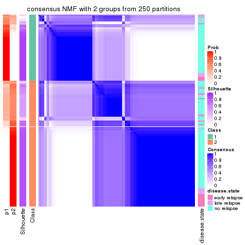</p>

</div>
<div id='tab-CV-NMF-consensus-heatmap-2'>
<pre><code class="r">consensus_heatmap(res, k = 3)
</code></pre>

<p>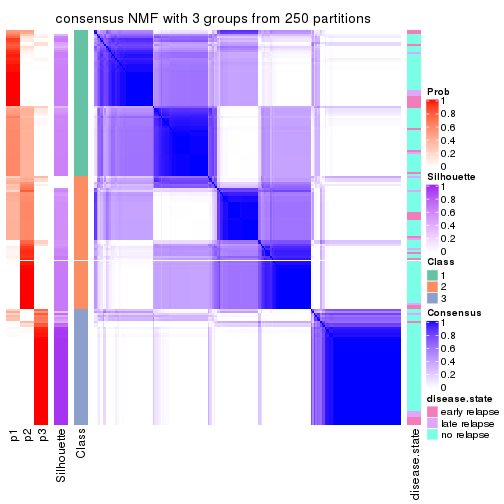</p>

</div>
<div id='tab-CV-NMF-consensus-heatmap-3'>
<pre><code class="r">consensus_heatmap(res, k = 4)
</code></pre>

<p>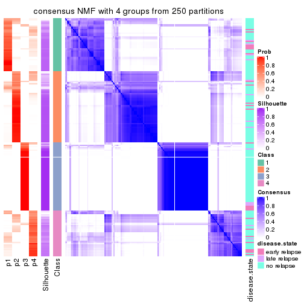</p>

</div>
<div id='tab-CV-NMF-consensus-heatmap-4'>
<pre><code class="r">consensus_heatmap(res, k = 5)
</code></pre>

<p>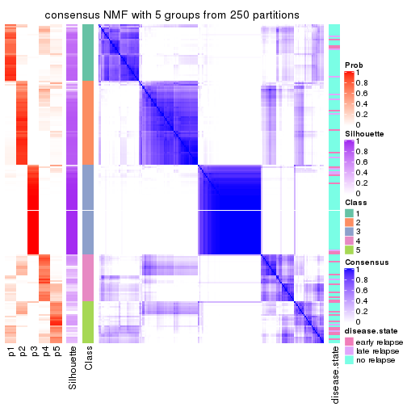</p>

</div>
<div id='tab-CV-NMF-consensus-heatmap-5'>
<pre><code class="r">consensus_heatmap(res, k = 6)
</code></pre>

<p>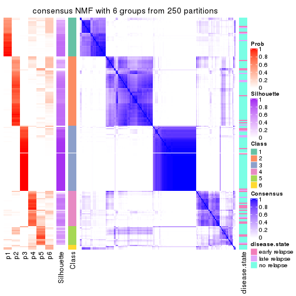</p>

</div>
</div>

Heatmaps for the membership of samples in all partitions to see how consistent they are:


<script>
$( function() {
	$( '#tabs-CV-NMF-membership-heatmap' ).tabs();
} );
</script>
<div id='tabs-CV-NMF-membership-heatmap'>
<ul>
<li><a href='#tab-CV-NMF-membership-heatmap-1'>k = 2</a></li>
<li><a href='#tab-CV-NMF-membership-heatmap-2'>k = 3</a></li>
<li><a href='#tab-CV-NMF-membership-heatmap-3'>k = 4</a></li>
<li><a href='#tab-CV-NMF-membership-heatmap-4'>k = 5</a></li>
<li><a href='#tab-CV-NMF-membership-heatmap-5'>k = 6</a></li>
</ul>
<div id='tab-CV-NMF-membership-heatmap-1'>
<pre><code class="r">membership_heatmap(res, k = 2)
</code></pre>

<p>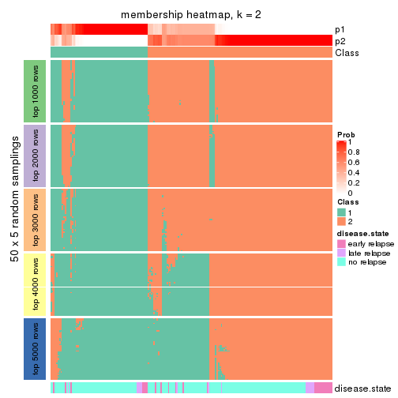</p>

</div>
<div id='tab-CV-NMF-membership-heatmap-2'>
<pre><code class="r">membership_heatmap(res, k = 3)
</code></pre>

<p>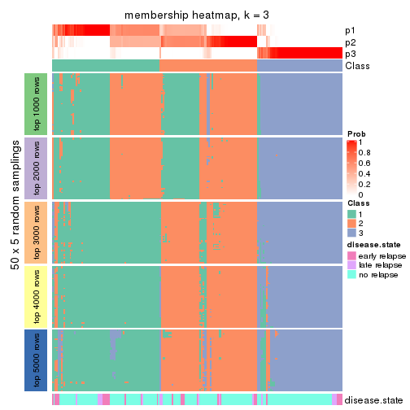</p>

</div>
<div id='tab-CV-NMF-membership-heatmap-3'>
<pre><code class="r">membership_heatmap(res, k = 4)
</code></pre>

<p>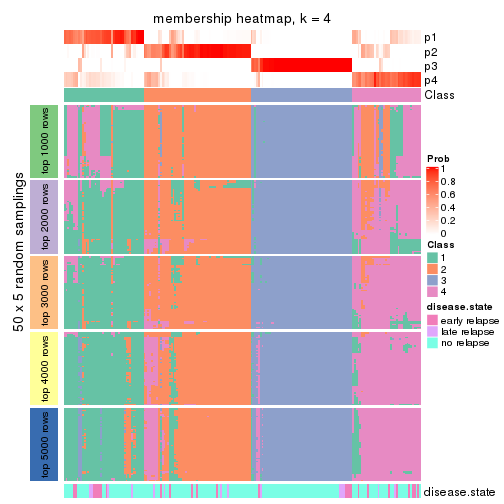</p>

</div>
<div id='tab-CV-NMF-membership-heatmap-4'>
<pre><code class="r">membership_heatmap(res, k = 5)
</code></pre>

<p>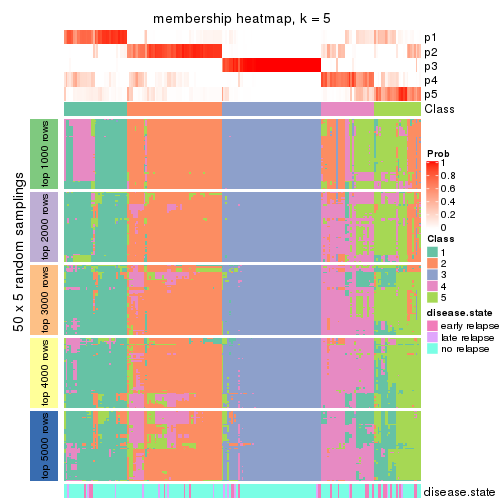</p>

</div>
<div id='tab-CV-NMF-membership-heatmap-5'>
<pre><code class="r">membership_heatmap(res, k = 6)
</code></pre>

<p>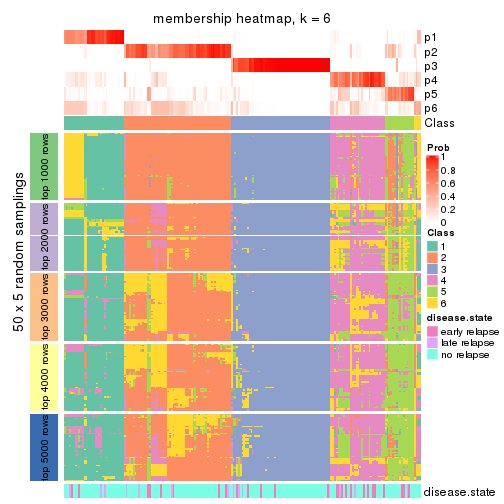</p>

</div>
</div>

As soon as we have had the classes for columns, we can look for signatures
which are significantly different between classes which can be candidate marks
for certain classes. Following are the heatmaps for signatures.


Signature heatmaps where rows are scaled:


<script>
$( function() {
	$( '#tabs-CV-NMF-get-signatures' ).tabs();
} );
</script>
<div id='tabs-CV-NMF-get-signatures'>
<ul>
<li><a href='#tab-CV-NMF-get-signatures-1'>k = 2</a></li>
<li><a href='#tab-CV-NMF-get-signatures-2'>k = 3</a></li>
<li><a href='#tab-CV-NMF-get-signatures-3'>k = 4</a></li>
<li><a href='#tab-CV-NMF-get-signatures-4'>k = 5</a></li>
<li><a href='#tab-CV-NMF-get-signatures-5'>k = 6</a></li>
</ul>
<div id='tab-CV-NMF-get-signatures-1'>
<pre><code class="r">get_signatures(res, k = 2)
</code></pre>

<p>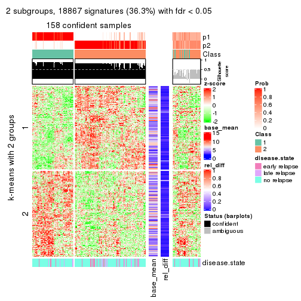</p>

</div>
<div id='tab-CV-NMF-get-signatures-2'>
<pre><code class="r">get_signatures(res, k = 3)
</code></pre>

<p>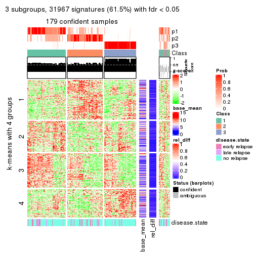</p>

</div>
<div id='tab-CV-NMF-get-signatures-3'>
<pre><code class="r">get_signatures(res, k = 4)
</code></pre>

<p>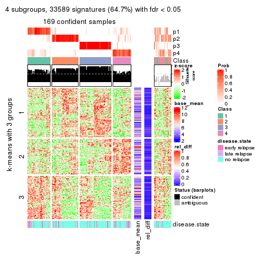</p>

</div>
<div id='tab-CV-NMF-get-signatures-4'>
<pre><code class="r">get_signatures(res, k = 5)
</code></pre>

<p>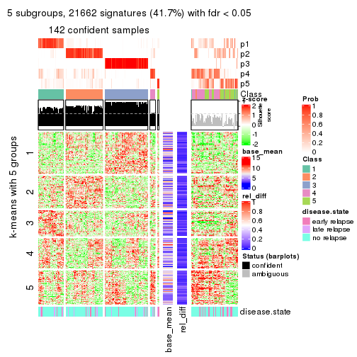</p>

</div>
<div id='tab-CV-NMF-get-signatures-5'>
<pre><code class="r">get_signatures(res, k = 6)
</code></pre>

<p>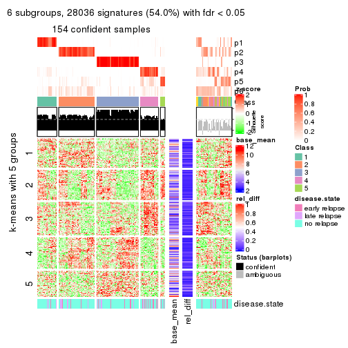</p>

</div>
</div>


Signature heatmaps where rows are not scaled:


<script>
$( function() {
	$( '#tabs-CV-NMF-get-signatures-no-scale' ).tabs();
} );
</script>
<div id='tabs-CV-NMF-get-signatures-no-scale'>
<ul>
<li><a href='#tab-CV-NMF-get-signatures-no-scale-1'>k = 2</a></li>
<li><a href='#tab-CV-NMF-get-signatures-no-scale-2'>k = 3</a></li>
<li><a href='#tab-CV-NMF-get-signatures-no-scale-3'>k = 4</a></li>
<li><a href='#tab-CV-NMF-get-signatures-no-scale-4'>k = 5</a></li>
<li><a href='#tab-CV-NMF-get-signatures-no-scale-5'>k = 6</a></li>
</ul>
<div id='tab-CV-NMF-get-signatures-no-scale-1'>
<pre><code class="r">get_signatures(res, k = 2, scale_rows = FALSE)
</code></pre>

<p>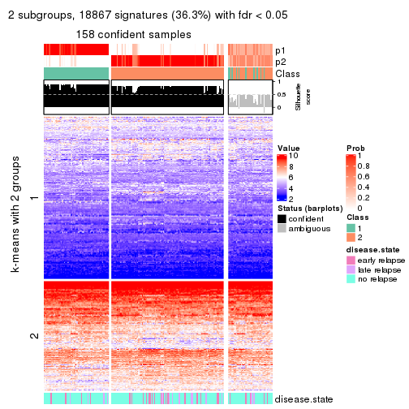</p>

</div>
<div id='tab-CV-NMF-get-signatures-no-scale-2'>
<pre><code class="r">get_signatures(res, k = 3, scale_rows = FALSE)
</code></pre>

<p>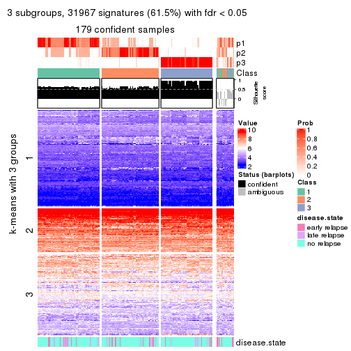</p>

</div>
<div id='tab-CV-NMF-get-signatures-no-scale-3'>
<pre><code class="r">get_signatures(res, k = 4, scale_rows = FALSE)
</code></pre>

<p>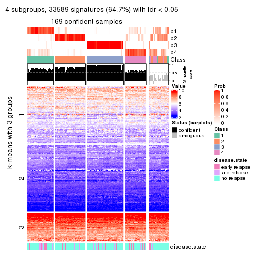</p>

</div>
<div id='tab-CV-NMF-get-signatures-no-scale-4'>
<pre><code class="r">get_signatures(res, k = 5, scale_rows = FALSE)
</code></pre>

<p>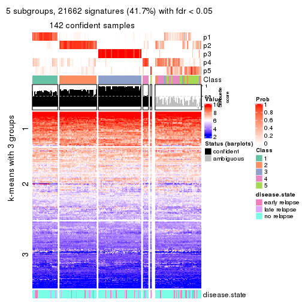</p>

</div>
<div id='tab-CV-NMF-get-signatures-no-scale-5'>
<pre><code class="r">get_signatures(res, k = 6, scale_rows = FALSE)
</code></pre>

<p>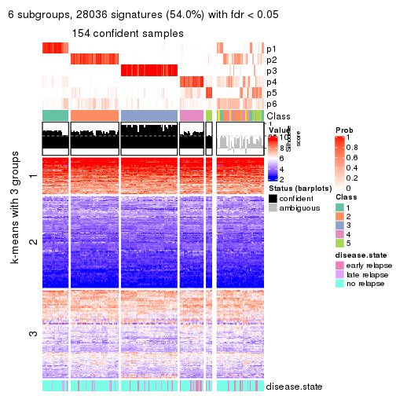</p>

</div>
</div>


Compare the overlap of signatures from different k:

```r
compare_signatures(res)
```

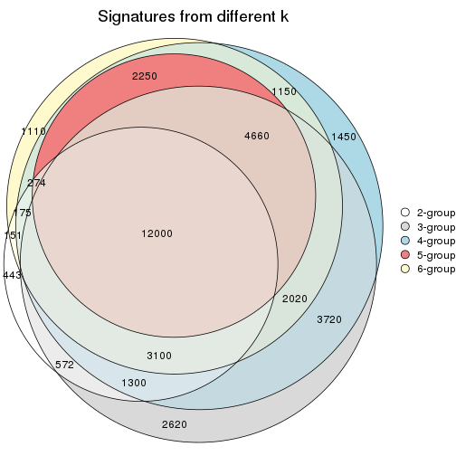

`get_signature()` returns a data frame invisibly. TO get the list of signatures, the function
call should be assigned to a variable explicitly. In following code, if `plot` argument is set
to `FALSE`, no heatmap is plotted while only the differential analysis is performed.

```r
# code only for demonstration
tb = get_signature(res, k = ..., plot = FALSE)
```

An example of the output of `tb` is:

```
#>   which_row         fdr    mean_1    mean_2 scaled_mean_1 scaled_mean_2 km
#> 1        38 0.042760348  8.373488  9.131774    -0.5533452     0.5164555  1
#> 2        40 0.018707592  7.106213  8.469186    -0.6173731     0.5762149  1
#> 3        55 0.019134737 10.221463 11.207825    -0.6159697     0.5749050  1
#> 4        59 0.006059896  5.921854  7.869574    -0.6899429     0.6439467  1
#> 5        60 0.018055526  8.928898 10.211722    -0.6204761     0.5791110  1
#> 6        98 0.009384629 15.714769 14.887706     0.6635654    -0.6193277  2
...
```

The columns in `tb` are:

1. `which_row`: row indices corresponding to the input matrix.
2. `fdr`: FDR for the differential test. 
3. `mean_x`: The mean value in group x.
4. `scaled_mean_x`: The mean value in group x after rows are scaled.
5. `km`: Row groups if k-means clustering is applied to rows.


UMAP plot which shows how samples are separated.


<script>
$( function() {
	$( '#tabs-CV-NMF-dimension-reduction' ).tabs();
} );
</script>
<div id='tabs-CV-NMF-dimension-reduction'>
<ul>
<li><a href='#tab-CV-NMF-dimension-reduction-1'>k = 2</a></li>
<li><a href='#tab-CV-NMF-dimension-reduction-2'>k = 3</a></li>
<li><a href='#tab-CV-NMF-dimension-reduction-3'>k = 4</a></li>
<li><a href='#tab-CV-NMF-dimension-reduction-4'>k = 5</a></li>
<li><a href='#tab-CV-NMF-dimension-reduction-5'>k = 6</a></li>
</ul>
<div id='tab-CV-NMF-dimension-reduction-1'>
<pre><code class="r">dimension_reduction(res, k = 2, method = &quot;UMAP&quot;)
</code></pre>

<p>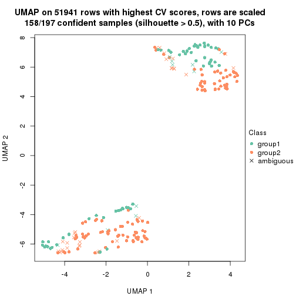</p>

</div>
<div id='tab-CV-NMF-dimension-reduction-2'>
<pre><code class="r">dimension_reduction(res, k = 3, method = &quot;UMAP&quot;)
</code></pre>

<p>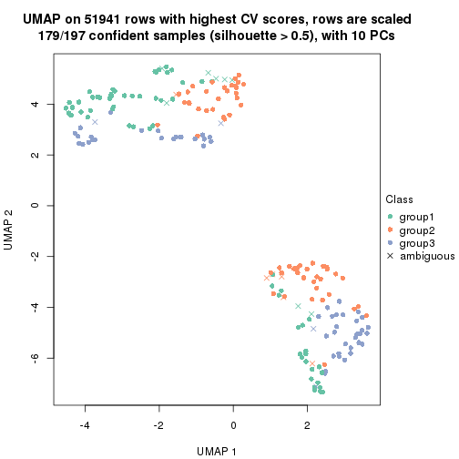</p>

</div>
<div id='tab-CV-NMF-dimension-reduction-3'>
<pre><code class="r">dimension_reduction(res, k = 4, method = &quot;UMAP&quot;)
</code></pre>

<p>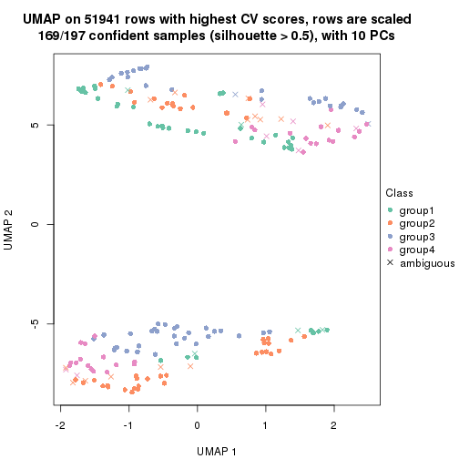</p>

</div>
<div id='tab-CV-NMF-dimension-reduction-4'>
<pre><code class="r">dimension_reduction(res, k = 5, method = &quot;UMAP&quot;)
</code></pre>

<p>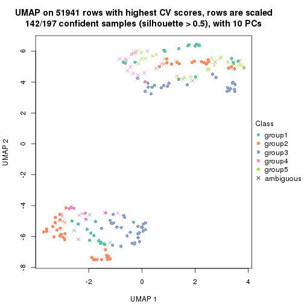</p>

</div>
<div id='tab-CV-NMF-dimension-reduction-5'>
<pre><code class="r">dimension_reduction(res, k = 6, method = &quot;UMAP&quot;)
</code></pre>

<p>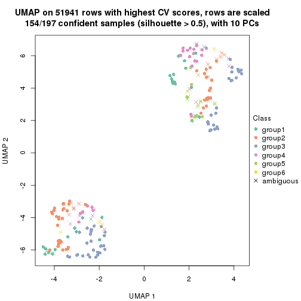</p>

</div>
</div>


Following heatmap shows how subgroups are split when increasing `k`:

```r
collect_classes(res)
```

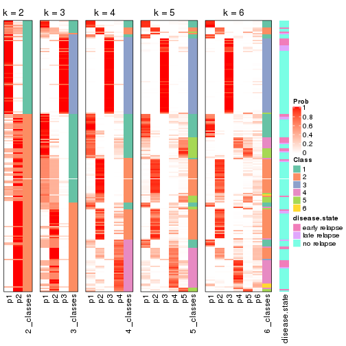


Test correlation between subgroups and known annotations. If the known
annotation is numeric, one-way ANOVA test is applied, and if the known
annotation is discrete, chi-squared contingency table test is applied.

```r
test_to_known_factors(res)
```

```
#>          n disease.state(p) k
#> CV:NMF 158           0.1772 2
#> CV:NMF 179           0.7997 3
#> CV:NMF 169           0.3134 4
#> CV:NMF 142           0.2580 5
#> CV:NMF 154           0.0252 6
```


If matrix rows can be associated to genes, consider to use `functional_enrichment(res,
...)` to perform function enrichment for the signature genes. See [this vignette](http://bioconductor.org/packages/devel/bioc/vignettes/cola/inst/doc/functional_enrichment.html) for more detailed explanations.


 

---------------------------------------------------


### MAD:hclust


The object with results only for a single top-value method and a single partition method 
can be extracted as:

```r
res = res_list["MAD", "hclust"]
# you can also extract it by
# res = res_list["MAD:hclust"]
```

A summary of `res` and all the functions that can be applied to it:

```r
res
```

```
#> A 'ConsensusPartition' object with k = 2, 3, 4, 5, 6.
#>   On a matrix with 51941 rows and 197 columns.
#>   Top rows (1000, 2000, 3000, 4000, 5000) are extracted by 'MAD' method.
#>   Subgroups are detected by 'hclust' method.
#>   Performed in total 1250 partitions by row resampling.
#>   Best k for subgroups seems to be 2.
#> 
#> Following methods can be applied to this 'ConsensusPartition' object:
#>  [1] "cola_report"             "collect_classes"         "collect_plots"          
#>  [4] "collect_stats"           "colnames"                "compare_signatures"     
#>  [7] "consensus_heatmap"       "dimension_reduction"     "functional_enrichment"  
#> [10] "get_anno_col"            "get_anno"                "get_classes"            
#> [13] "get_consensus"           "get_matrix"              "get_membership"         
#> [16] "get_param"               "get_signatures"          "get_stats"              
#> [19] "is_best_k"               "is_stable_k"             "membership_heatmap"     
#> [22] "ncol"                    "nrow"                    "plot_ecdf"              
#> [25] "rownames"                "select_partition_number" "show"                   
#> [28] "suggest_best_k"          "test_to_known_factors"
```

`collect_plots()` function collects all the plots made from `res` for all `k` (number of partitions)
into one single page to provide an easy and fast comparison between different `k`.

```r
collect_plots(res)
```

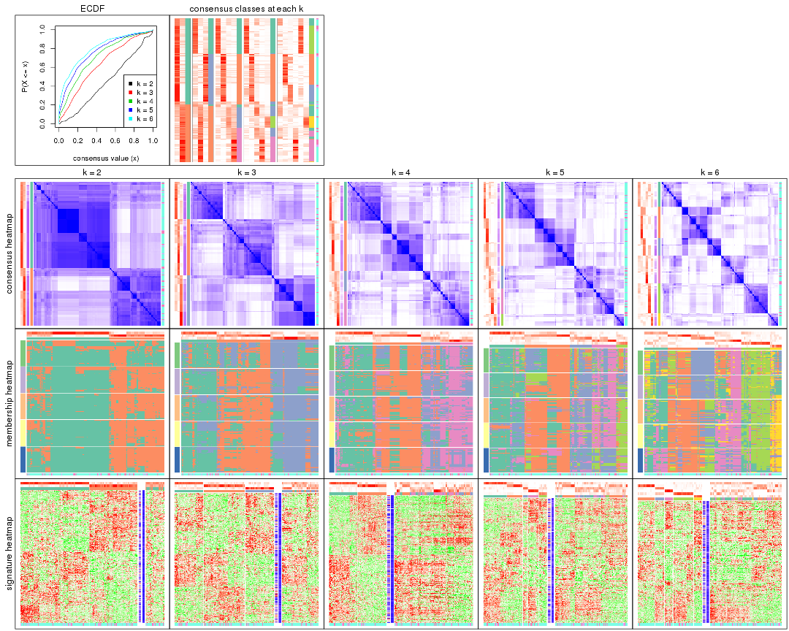

The plots are:

- The first row: a plot of the ECDF (empirical cumulative distribution
  function) curves of the consensus matrix for each `k` and the heatmap of
  predicted classes for each `k`.
- The second row: heatmaps of the consensus matrix for each `k`.
- The third row: heatmaps of the membership matrix for each `k`.
- The fouth row: heatmaps of the signatures for each `k`.

All the plots in panels can be made by individual functions and they are
plotted later in this section.

`select_partition_number()` produces several plots showing different
statistics for choosing "optimized" `k`. There are following statistics:

- ECDF curves of the consensus matrix for each `k`;
- 1-PAC. [The PAC
  score](https://en.wikipedia.org/wiki/Consensus_clustering#Over-interpretation_potential_of_consensus_clustering)
  measures the proportion of the ambiguous subgrouping.
- Mean silhouette score.
- Concordance. The mean probability of fiting the consensus class ids in all
  partitions.
- Area increased. Denote $A_k$ as the area under the ECDF curve for current
  `k`, the area increased is defined as $A_k - A_{k-1}$.
- Rand index. The percent of pairs of samples that are both in a same cluster
  or both are not in a same cluster in the partition of k and k-1.
- Jaccard index. The ratio of pairs of samples are both in a same cluster in
  the partition of k and k-1 and the pairs of samples are both in a same
  cluster in the partition k or k-1.

The detailed explanations of these statistics can be found in [the _cola_
vignette](http://bioconductor.org/packages/devel/bioc/vignettes/cola/inst/doc/cola.html#toc_13).

Generally speaking, lower PAC score, higher mean silhouette score or higher
concordance corresponds to better partition. Rand index and Jaccard index
measure how similar the current partition is compared to partition with `k-1`.
If they are too similar, we won't accept `k` is better than `k-1`.

```r
select_partition_number(res)
```

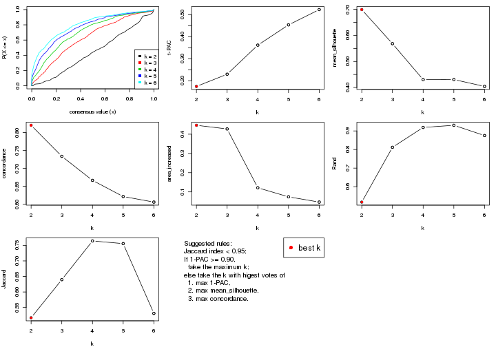

The numeric values for all these statistics can be obtained by `get_stats()`.

```r
get_stats(res)
```

```
#>   k 1-PAC mean_silhouette concordance area_increased  Rand Jaccard
#> 2 2 0.174           0.699       0.820         0.4463 0.517   0.517
#> 3 3 0.230           0.568       0.734         0.4272 0.812   0.640
#> 4 4 0.362           0.430       0.667         0.1213 0.919   0.764
#> 5 5 0.454           0.430       0.622         0.0742 0.930   0.756
#> 6 6 0.523           0.404       0.606         0.0470 0.875   0.531
```

`suggest_best_k()` suggests the best $k$ based on these statistics. The rules are as follows:

- All $k$ with Jaccard index larger than 0.95 are removed because increasing
  $k$ does not provide enough extra information. If all $k$ are removed, it is
  marked as no subgroup is detected.
- For all $k$ with 1-PAC score larger than 0.9, the maximal $k$ is taken as
  the best $k$, and other $k$ are marked as optional $k$.
- If it does not fit the second rule. The $k$ with the maximal vote of the
  highest 1-PAC score, highest mean silhouette, and highest concordance is
  taken as the best $k$.

```r
suggest_best_k(res)
```

```
#> [1] 2
```


Following shows the table of the partitions (You need to click the **show/hide
code output** link to see it). The membership matrix (columns with name `p*`)
is inferred by
[`clue::cl_consensus()`](https://www.rdocumentation.org/link/cl_consensus?package=clue)
function with the `SE` method. Basically the value in the membership matrix
represents the probability to belong to a certain group. The finall class
label for an item is determined with the group with highest probability it
belongs to.

In `get_classes()` function, the entropy is calculated from the membership
matrix and the silhouette score is calculated from the consensus matrix.


<script>
$( function() {
	$( '#tabs-MAD-hclust-get-classes' ).tabs();
} );
</script>
<div id='tabs-MAD-hclust-get-classes'>
<ul>
<li><a href='#tab-MAD-hclust-get-classes-1'>k = 2</a></li>
<li><a href='#tab-MAD-hclust-get-classes-2'>k = 3</a></li>
<li><a href='#tab-MAD-hclust-get-classes-3'>k = 4</a></li>
<li><a href='#tab-MAD-hclust-get-classes-4'>k = 5</a></li>
<li><a href='#tab-MAD-hclust-get-classes-5'>k = 6</a></li>
</ul>

<div id='tab-MAD-hclust-get-classes-1'>
<p><a id='tab-MAD-hclust-get-classes-1-a' style='color:#0366d6' href='#'>show/hide code output</a></p>
<pre><code class="r">cbind(get_classes(res, k = 2), get_membership(res, k = 2))
</code></pre>

<pre><code>#&gt;           class entropy silhouette    p1    p2
#&gt; GSM342319     1  0.7674     0.7512 0.776 0.224
#&gt; GSM342323     2  0.3274     0.7471 0.060 0.940
#&gt; GSM342325     1  0.4161     0.8249 0.916 0.084
#&gt; GSM342326     2  0.0672     0.7393 0.008 0.992
#&gt; GSM342327     2  0.0672     0.7393 0.008 0.992
#&gt; GSM342329     2  0.3114     0.7483 0.056 0.944
#&gt; GSM342331     2  0.0672     0.7393 0.008 0.992
#&gt; GSM342334     2  0.8608     0.7189 0.284 0.716
#&gt; GSM342335     2  0.8608     0.7189 0.284 0.716
#&gt; GSM342354     1  0.9833    -0.0852 0.576 0.424
#&gt; GSM342371     2  0.9754     0.4938 0.408 0.592
#&gt; GSM342380     1  0.4939     0.8226 0.892 0.108
#&gt; GSM342382     1  0.4022     0.8253 0.920 0.080
#&gt; GSM342399     1  0.4161     0.8249 0.916 0.084
#&gt; GSM342402     1  0.9954     0.2209 0.540 0.460
#&gt; GSM342404     2  0.7376     0.7815 0.208 0.792
#&gt; GSM342408     2  0.8813     0.7328 0.300 0.700
#&gt; GSM342409     1  0.9552     0.2452 0.624 0.376
#&gt; GSM342426     2  0.1184     0.7417 0.016 0.984
#&gt; GSM342441     1  0.1633     0.8127 0.976 0.024
#&gt; GSM342444     1  0.1633     0.8127 0.976 0.024
#&gt; GSM342451     1  0.1633     0.8127 0.976 0.024
#&gt; GSM342462     1  0.6438     0.7856 0.836 0.164
#&gt; GSM342467     2  0.6973     0.7848 0.188 0.812
#&gt; GSM342484     2  0.9896     0.2105 0.440 0.560
#&gt; GSM342491     2  0.9427     0.5873 0.360 0.640
#&gt; GSM342322     1  0.7674     0.7512 0.776 0.224
#&gt; GSM342338     1  0.9087     0.3391 0.676 0.324
#&gt; GSM342347     2  0.9635     0.6215 0.388 0.612
#&gt; GSM342356     1  0.1414     0.8122 0.980 0.020
#&gt; GSM342357     1  0.9460     0.5050 0.636 0.364
#&gt; GSM342366     2  0.9896     0.3980 0.440 0.560
#&gt; GSM342385     1  0.4939     0.8226 0.892 0.108
#&gt; GSM342421     2  0.7950     0.7368 0.240 0.760
#&gt; GSM342437     2  0.6623     0.7876 0.172 0.828
#&gt; GSM342454     1  0.1633     0.8127 0.976 0.024
#&gt; GSM342471     1  0.4431     0.8256 0.908 0.092
#&gt; GSM342477     2  0.6531     0.7861 0.168 0.832
#&gt; GSM342495     1  0.9491     0.4245 0.632 0.368
#&gt; GSM342496     1  0.3879     0.8263 0.924 0.076
#&gt; GSM342320     2  0.0938     0.7382 0.012 0.988
#&gt; GSM342321     2  0.1184     0.7438 0.016 0.984
#&gt; GSM342324     2  0.7528     0.6983 0.216 0.784
#&gt; GSM342328     2  0.3584     0.7501 0.068 0.932
#&gt; GSM342330     2  0.0672     0.7393 0.008 0.992
#&gt; GSM342332     2  0.5519     0.7812 0.128 0.872
#&gt; GSM342333     2  0.8608     0.7189 0.284 0.716
#&gt; GSM342336     2  0.5519     0.7812 0.128 0.872
#&gt; GSM342337     1  0.1414     0.8122 0.980 0.020
#&gt; GSM342339     1  0.1414     0.8122 0.980 0.020
#&gt; GSM342340     1  0.1414     0.8122 0.980 0.020
#&gt; GSM342341     1  0.1414     0.8122 0.980 0.020
#&gt; GSM342342     1  0.1414     0.8122 0.980 0.020
#&gt; GSM342343     1  0.1414     0.8122 0.980 0.020
#&gt; GSM342344     1  0.9815    -0.0654 0.580 0.420
#&gt; GSM342345     1  0.1414     0.8122 0.980 0.020
#&gt; GSM342346     2  0.8386     0.7295 0.268 0.732
#&gt; GSM342348     1  0.9087     0.4789 0.676 0.324
#&gt; GSM342349     2  0.9248     0.6951 0.340 0.660
#&gt; GSM342350     2  0.9661     0.6146 0.392 0.608
#&gt; GSM342351     2  0.9635     0.6215 0.388 0.612
#&gt; GSM342352     2  0.9635     0.6215 0.388 0.612
#&gt; GSM342353     1  0.9087     0.3391 0.676 0.324
#&gt; GSM342355     1  0.5946     0.7340 0.856 0.144
#&gt; GSM342358     2  0.7950     0.6898 0.240 0.760
#&gt; GSM342359     2  0.7883     0.6902 0.236 0.764
#&gt; GSM342360     2  0.7883     0.6902 0.236 0.764
#&gt; GSM342361     2  0.3584     0.7201 0.068 0.932
#&gt; GSM342362     1  0.9460     0.5050 0.636 0.364
#&gt; GSM342363     1  0.9460     0.5050 0.636 0.364
#&gt; GSM342364     1  0.4690     0.8229 0.900 0.100
#&gt; GSM342365     2  0.6343     0.7855 0.160 0.840
#&gt; GSM342367     1  0.5178     0.8185 0.884 0.116
#&gt; GSM342368     2  0.9963     0.3136 0.464 0.536
#&gt; GSM342369     2  0.6531     0.7858 0.168 0.832
#&gt; GSM342370     2  0.6343     0.7855 0.160 0.840
#&gt; GSM342372     2  0.6531     0.7858 0.168 0.832
#&gt; GSM342373     2  0.9754     0.4938 0.408 0.592
#&gt; GSM342374     2  0.6343     0.7855 0.160 0.840
#&gt; GSM342375     2  0.7376     0.7753 0.208 0.792
#&gt; GSM342376     1  0.7453     0.7267 0.788 0.212
#&gt; GSM342377     1  0.7453     0.7267 0.788 0.212
#&gt; GSM342378     1  0.6973     0.7506 0.812 0.188
#&gt; GSM342379     1  0.9087     0.5716 0.676 0.324
#&gt; GSM342381     1  0.4161     0.8249 0.916 0.084
#&gt; GSM342383     1  0.4939     0.8226 0.892 0.108
#&gt; GSM342384     1  0.4161     0.8249 0.916 0.084
#&gt; GSM342386     1  0.4562     0.8242 0.904 0.096
#&gt; GSM342387     2  0.9833     0.5104 0.424 0.576
#&gt; GSM342388     1  0.1414     0.8122 0.980 0.020
#&gt; GSM342389     1  0.4562     0.8242 0.904 0.096
#&gt; GSM342390     1  0.9209     0.4628 0.664 0.336
#&gt; GSM342391     1  0.7299     0.7359 0.796 0.204
#&gt; GSM342392     1  0.1414     0.8122 0.980 0.020
#&gt; GSM342393     2  0.7376     0.7815 0.208 0.792
#&gt; GSM342394     1  0.6973     0.7506 0.812 0.188
#&gt; GSM342395     1  0.9635     0.3485 0.612 0.388
#&gt; GSM342396     1  0.1414     0.8122 0.980 0.020
#&gt; GSM342397     2  0.9170     0.6996 0.332 0.668
#&gt; GSM342398     1  0.4161     0.8249 0.916 0.084
#&gt; GSM342400     1  0.4939     0.8210 0.892 0.108
#&gt; GSM342401     1  0.1414     0.8122 0.980 0.020
#&gt; GSM342403     1  0.9209     0.5442 0.664 0.336
#&gt; GSM342405     2  0.7528     0.7790 0.216 0.784
#&gt; GSM342406     1  0.9209     0.4628 0.664 0.336
#&gt; GSM342407     2  0.9661     0.6146 0.392 0.608
#&gt; GSM342410     1  0.7299     0.7353 0.796 0.204
#&gt; GSM342411     2  0.9833     0.5104 0.424 0.576
#&gt; GSM342412     2  0.8608     0.7189 0.284 0.716
#&gt; GSM342413     2  0.8327     0.7550 0.264 0.736
#&gt; GSM342414     2  0.9661     0.6146 0.392 0.608
#&gt; GSM342415     1  0.9491     0.4017 0.632 0.368
#&gt; GSM342416     1  0.9209     0.4628 0.664 0.336
#&gt; GSM342417     2  0.1184     0.7402 0.016 0.984
#&gt; GSM342418     2  0.0938     0.7396 0.012 0.988
#&gt; GSM342419     1  0.4161     0.8249 0.916 0.084
#&gt; GSM342420     2  0.1184     0.7402 0.016 0.984
#&gt; GSM342422     1  0.4161     0.8249 0.916 0.084
#&gt; GSM342423     2  0.9754     0.4938 0.408 0.592
#&gt; GSM342424     2  0.1184     0.7417 0.016 0.984
#&gt; GSM342425     2  0.1184     0.7417 0.016 0.984
#&gt; GSM342427     2  0.6438     0.7840 0.164 0.836
#&gt; GSM342428     2  0.5408     0.7803 0.124 0.876
#&gt; GSM342429     2  0.9988     0.1314 0.480 0.520
#&gt; GSM342430     1  0.1633     0.8127 0.976 0.024
#&gt; GSM342431     1  0.1414     0.8122 0.980 0.020
#&gt; GSM342432     1  0.1633     0.8127 0.976 0.024
#&gt; GSM342433     2  0.9710     0.5879 0.400 0.600
#&gt; GSM342434     2  0.7883     0.7640 0.236 0.764
#&gt; GSM342435     2  0.9710     0.5879 0.400 0.600
#&gt; GSM342436     1  0.1633     0.8127 0.976 0.024
#&gt; GSM342438     1  0.1633     0.8127 0.976 0.024
#&gt; GSM342439     1  0.1633     0.8127 0.976 0.024
#&gt; GSM342440     1  0.1633     0.8127 0.976 0.024
#&gt; GSM342442     1  0.1633     0.8127 0.976 0.024
#&gt; GSM342443     1  0.8909     0.5708 0.692 0.308
#&gt; GSM342445     1  0.1633     0.8127 0.976 0.024
#&gt; GSM342446     1  0.1843     0.8117 0.972 0.028
#&gt; GSM342447     1  0.1414     0.8122 0.980 0.020
#&gt; GSM342448     2  0.7883     0.7640 0.236 0.764
#&gt; GSM342449     1  0.1633     0.8127 0.976 0.024
#&gt; GSM342450     2  0.8386     0.7520 0.268 0.732
#&gt; GSM342452     1  0.1633     0.8127 0.976 0.024
#&gt; GSM342453     1  0.1633     0.8127 0.976 0.024
#&gt; GSM342455     1  0.1633     0.8127 0.976 0.024
#&gt; GSM342456     2  0.3584     0.7201 0.068 0.932
#&gt; GSM342457     1  0.7950     0.7104 0.760 0.240
#&gt; GSM342458     2  0.6343     0.7855 0.160 0.840
#&gt; GSM342459     1  0.6438     0.7848 0.836 0.164
#&gt; GSM342460     1  0.9491     0.4245 0.632 0.368
#&gt; GSM342461     1  0.6343     0.7876 0.840 0.160
#&gt; GSM342463     1  0.3733     0.8255 0.928 0.072
#&gt; GSM342464     1  0.3733     0.8255 0.928 0.072
#&gt; GSM342465     1  0.3733     0.8255 0.928 0.072
#&gt; GSM342466     1  0.4161     0.8249 0.916 0.084
#&gt; GSM342468     2  0.7299     0.7781 0.204 0.796
#&gt; GSM342469     1  0.4161     0.8249 0.916 0.084
#&gt; GSM342470     2  0.8327     0.7550 0.264 0.736
#&gt; GSM342472     2  0.5629     0.7714 0.132 0.868
#&gt; GSM342473     1  0.6438     0.7858 0.836 0.164
#&gt; GSM342474     1  0.6438     0.7858 0.836 0.164
#&gt; GSM342475     1  0.1633     0.8127 0.976 0.024
#&gt; GSM342476     1  0.9491     0.4245 0.632 0.368
#&gt; GSM342478     1  0.6247     0.7909 0.844 0.156
#&gt; GSM342479     1  0.4431     0.8250 0.908 0.092
#&gt; GSM342480     1  0.8955     0.5707 0.688 0.312
#&gt; GSM342481     1  0.4431     0.8234 0.908 0.092
#&gt; GSM342482     1  0.6438     0.7848 0.836 0.164
#&gt; GSM342483     1  0.6247     0.7909 0.844 0.156
#&gt; GSM342485     1  0.3733     0.8255 0.928 0.072
#&gt; GSM342486     1  0.4161     0.8249 0.916 0.084
#&gt; GSM342487     1  0.8016     0.6051 0.756 0.244
#&gt; GSM342488     1  0.9491     0.4245 0.632 0.368
#&gt; GSM342489     1  0.9491     0.4245 0.632 0.368
#&gt; GSM342490     2  0.5294     0.7805 0.120 0.880
#&gt; GSM342492     2  0.8386     0.7520 0.268 0.732
#&gt; GSM342493     1  0.3733     0.8255 0.928 0.072
#&gt; GSM342494     2  0.6623     0.7855 0.172 0.828
#&gt; GSM342497     2  0.6712     0.7867 0.176 0.824
#&gt; GSM342498     1  0.4298     0.8262 0.912 0.088
#&gt; GSM342499     1  0.4161     0.8249 0.916 0.084
#&gt; GSM342500     1  0.6438     0.7858 0.836 0.164
#&gt; GSM342501     1  0.4431     0.8250 0.908 0.092
#&gt; GSM342502     1  0.6247     0.7908 0.844 0.156
#&gt; GSM342503     1  0.6247     0.7907 0.844 0.156
#&gt; GSM342504     1  0.6247     0.7909 0.844 0.156
#&gt; GSM342505     1  0.1633     0.8127 0.976 0.024
#&gt; GSM342506     1  0.3879     0.8266 0.924 0.076
#&gt; GSM342507     1  0.9460     0.5050 0.636 0.364
#&gt; GSM342508     1  0.3879     0.8266 0.924 0.076
#&gt; GSM342509     2  0.9896     0.2105 0.440 0.560
#&gt; GSM342510     2  0.3114     0.7279 0.056 0.944
#&gt; GSM342511     1  0.9993    -0.0465 0.516 0.484
#&gt; GSM342512     1  0.3879     0.8256 0.924 0.076
#&gt; GSM342513     1  0.3733     0.8255 0.928 0.072
#&gt; GSM342514     2  0.9996     0.2851 0.488 0.512
#&gt; GSM342515     1  0.3879     0.8266 0.924 0.076
</code></pre>

<script>
$('#tab-MAD-hclust-get-classes-1-a').parent().next().next().hide();
$('#tab-MAD-hclust-get-classes-1-a').click(function(){
  $('#tab-MAD-hclust-get-classes-1-a').parent().next().next().toggle();
  return(false);
});
</script>
</div>

<div id='tab-MAD-hclust-get-classes-2'>
<p><a id='tab-MAD-hclust-get-classes-2-a' style='color:#0366d6' href='#'>show/hide code output</a></p>
<pre><code class="r">cbind(get_classes(res, k = 3), get_membership(res, k = 3))
</code></pre>

<pre><code>#&gt;           class entropy silhouette    p1    p2    p3
#&gt; GSM342319     1  0.7039     0.7032 0.728 0.144 0.128
#&gt; GSM342323     2  0.2772     0.7114 0.080 0.916 0.004
#&gt; GSM342325     1  0.4121     0.7136 0.832 0.000 0.168
#&gt; GSM342326     2  0.1031     0.7183 0.024 0.976 0.000
#&gt; GSM342327     2  0.1031     0.7183 0.024 0.976 0.000
#&gt; GSM342329     2  0.2537     0.7121 0.080 0.920 0.000
#&gt; GSM342331     2  0.1031     0.7183 0.024 0.976 0.000
#&gt; GSM342334     2  0.7713     0.6270 0.284 0.636 0.080
#&gt; GSM342335     2  0.7713     0.6270 0.284 0.636 0.080
#&gt; GSM342354     3  0.9944    -0.2096 0.344 0.284 0.372
#&gt; GSM342371     2  0.8135     0.3025 0.448 0.484 0.068
#&gt; GSM342380     1  0.5147     0.7167 0.800 0.020 0.180
#&gt; GSM342382     1  0.4605     0.6967 0.796 0.000 0.204
#&gt; GSM342399     1  0.4121     0.7136 0.832 0.000 0.168
#&gt; GSM342402     1  0.7301     0.4260 0.640 0.308 0.052
#&gt; GSM342404     2  0.6721     0.7271 0.116 0.748 0.136
#&gt; GSM342408     2  0.8803     0.6217 0.180 0.580 0.240
#&gt; GSM342409     1  0.9731     0.1323 0.444 0.308 0.248
#&gt; GSM342426     2  0.1267     0.7169 0.024 0.972 0.004
#&gt; GSM342441     3  0.0592     0.6556 0.012 0.000 0.988
#&gt; GSM342444     3  0.0592     0.6545 0.012 0.000 0.988
#&gt; GSM342451     3  0.0424     0.6543 0.008 0.000 0.992
#&gt; GSM342462     3  0.7155     0.5993 0.152 0.128 0.720
#&gt; GSM342467     2  0.6184     0.7312 0.112 0.780 0.108
#&gt; GSM342484     2  0.9646     0.2079 0.272 0.468 0.260
#&gt; GSM342491     2  0.8703     0.5262 0.160 0.584 0.256
#&gt; GSM342322     1  0.7039     0.7032 0.728 0.144 0.128
#&gt; GSM342338     3  0.9514    -0.0588 0.364 0.192 0.444
#&gt; GSM342347     2  0.9594     0.5017 0.280 0.476 0.244
#&gt; GSM342356     3  0.5560     0.3697 0.300 0.000 0.700
#&gt; GSM342357     1  0.6208     0.5744 0.752 0.200 0.048
#&gt; GSM342366     1  0.7890    -0.1382 0.512 0.432 0.056
#&gt; GSM342385     1  0.5147     0.7167 0.800 0.020 0.180
#&gt; GSM342421     2  0.7057     0.6298 0.264 0.680 0.056
#&gt; GSM342437     2  0.6112     0.7344 0.108 0.784 0.108
#&gt; GSM342454     3  0.0424     0.6543 0.008 0.000 0.992
#&gt; GSM342471     1  0.5012     0.6956 0.788 0.008 0.204
#&gt; GSM342477     2  0.5883     0.7306 0.112 0.796 0.092
#&gt; GSM342495     3  0.9090     0.3761 0.156 0.332 0.512
#&gt; GSM342496     3  0.5465     0.5444 0.288 0.000 0.712
#&gt; GSM342320     2  0.1267     0.7183 0.024 0.972 0.004
#&gt; GSM342321     2  0.1289     0.7199 0.032 0.968 0.000
#&gt; GSM342324     2  0.6715     0.5292 0.312 0.660 0.028
#&gt; GSM342328     2  0.3030     0.7119 0.092 0.904 0.004
#&gt; GSM342330     2  0.1031     0.7183 0.024 0.976 0.000
#&gt; GSM342332     2  0.4390     0.7158 0.148 0.840 0.012
#&gt; GSM342333     2  0.7713     0.6270 0.284 0.636 0.080
#&gt; GSM342336     2  0.4390     0.7158 0.148 0.840 0.012
#&gt; GSM342337     3  0.5560     0.3697 0.300 0.000 0.700
#&gt; GSM342339     3  0.5178     0.4504 0.256 0.000 0.744
#&gt; GSM342340     3  0.5650     0.3513 0.312 0.000 0.688
#&gt; GSM342341     3  0.5178     0.4504 0.256 0.000 0.744
#&gt; GSM342342     3  0.5178     0.4504 0.256 0.000 0.744
#&gt; GSM342343     3  0.5560     0.3697 0.300 0.000 0.700
#&gt; GSM342344     3  0.9934    -0.1980 0.344 0.280 0.376
#&gt; GSM342345     3  0.5138     0.4570 0.252 0.000 0.748
#&gt; GSM342346     2  0.8350     0.6230 0.280 0.600 0.120
#&gt; GSM342348     1  0.7759     0.5009 0.676 0.180 0.144
#&gt; GSM342349     2  0.9208     0.5835 0.244 0.536 0.220
#&gt; GSM342350     2  0.9617     0.4973 0.280 0.472 0.248
#&gt; GSM342351     2  0.9594     0.5017 0.280 0.476 0.244
#&gt; GSM342352     2  0.9594     0.5017 0.280 0.476 0.244
#&gt; GSM342353     3  0.9521    -0.0645 0.368 0.192 0.440
#&gt; GSM342355     1  0.7013     0.3909 0.608 0.028 0.364
#&gt; GSM342358     2  0.7065     0.4925 0.352 0.616 0.032
#&gt; GSM342359     2  0.7044     0.4946 0.348 0.620 0.032
#&gt; GSM342360     2  0.7044     0.4946 0.348 0.620 0.032
#&gt; GSM342361     2  0.4179     0.7163 0.052 0.876 0.072
#&gt; GSM342362     1  0.6208     0.5744 0.752 0.200 0.048
#&gt; GSM342363     1  0.6208     0.5744 0.752 0.200 0.048
#&gt; GSM342364     1  0.5115     0.6756 0.768 0.004 0.228
#&gt; GSM342365     2  0.5558     0.7196 0.152 0.800 0.048
#&gt; GSM342367     1  0.5681     0.6636 0.748 0.016 0.236
#&gt; GSM342368     1  0.8000    -0.0559 0.528 0.408 0.064
#&gt; GSM342369     2  0.5719     0.7181 0.156 0.792 0.052
#&gt; GSM342370     2  0.5558     0.7196 0.152 0.800 0.048
#&gt; GSM342372     2  0.5719     0.7181 0.156 0.792 0.052
#&gt; GSM342373     2  0.8135     0.3025 0.448 0.484 0.068
#&gt; GSM342374     2  0.5558     0.7196 0.152 0.800 0.048
#&gt; GSM342375     2  0.6354     0.7038 0.204 0.744 0.052
#&gt; GSM342376     1  0.3028     0.7042 0.920 0.032 0.048
#&gt; GSM342377     1  0.3028     0.7042 0.920 0.032 0.048
#&gt; GSM342378     1  0.4676     0.7096 0.848 0.040 0.112
#&gt; GSM342379     1  0.4810     0.6548 0.832 0.140 0.028
#&gt; GSM342381     1  0.4931     0.6854 0.784 0.004 0.212
#&gt; GSM342383     1  0.5147     0.7167 0.800 0.020 0.180
#&gt; GSM342384     1  0.4654     0.6934 0.792 0.000 0.208
#&gt; GSM342386     1  0.5502     0.6474 0.744 0.008 0.248
#&gt; GSM342387     2  0.8740     0.3246 0.432 0.460 0.108
#&gt; GSM342388     3  0.5650     0.3513 0.312 0.000 0.688
#&gt; GSM342389     1  0.5502     0.6474 0.744 0.008 0.248
#&gt; GSM342390     1  0.7999     0.4764 0.656 0.196 0.148
#&gt; GSM342391     1  0.5730     0.6863 0.796 0.060 0.144
#&gt; GSM342392     3  0.5138     0.4570 0.252 0.000 0.748
#&gt; GSM342393     2  0.6721     0.7271 0.116 0.748 0.136
#&gt; GSM342394     1  0.4602     0.7110 0.852 0.040 0.108
#&gt; GSM342395     1  0.7782     0.4706 0.648 0.256 0.096
#&gt; GSM342396     3  0.5138     0.4570 0.252 0.000 0.748
#&gt; GSM342397     2  0.9110     0.5932 0.260 0.544 0.196
#&gt; GSM342398     1  0.4235     0.7122 0.824 0.000 0.176
#&gt; GSM342400     1  0.5020     0.7113 0.796 0.012 0.192
#&gt; GSM342401     3  0.5138     0.4570 0.252 0.000 0.748
#&gt; GSM342403     1  0.8284     0.5665 0.628 0.224 0.148
#&gt; GSM342405     2  0.6843     0.7247 0.116 0.740 0.144
#&gt; GSM342406     1  0.7999     0.4764 0.656 0.196 0.148
#&gt; GSM342407     2  0.9617     0.4973 0.280 0.472 0.248
#&gt; GSM342410     1  0.6027     0.6690 0.776 0.060 0.164
#&gt; GSM342411     2  0.8740     0.3246 0.432 0.460 0.108
#&gt; GSM342412     2  0.7758     0.6284 0.280 0.636 0.084
#&gt; GSM342413     2  0.7923     0.6702 0.156 0.664 0.180
#&gt; GSM342414     2  0.9617     0.4973 0.280 0.472 0.248
#&gt; GSM342415     1  0.4172     0.5760 0.840 0.156 0.004
#&gt; GSM342416     1  0.7999     0.4764 0.656 0.196 0.148
#&gt; GSM342417     2  0.1399     0.7188 0.028 0.968 0.004
#&gt; GSM342418     2  0.1585     0.7196 0.028 0.964 0.008
#&gt; GSM342419     1  0.4121     0.7136 0.832 0.000 0.168
#&gt; GSM342420     2  0.1399     0.7188 0.028 0.968 0.004
#&gt; GSM342422     1  0.4291     0.7106 0.820 0.000 0.180
#&gt; GSM342423     2  0.8135     0.3025 0.448 0.484 0.068
#&gt; GSM342424     2  0.1267     0.7178 0.024 0.972 0.004
#&gt; GSM342425     2  0.1267     0.7169 0.024 0.972 0.004
#&gt; GSM342427     2  0.5810     0.7263 0.132 0.796 0.072
#&gt; GSM342428     2  0.4539     0.7204 0.148 0.836 0.016
#&gt; GSM342429     2  0.9193     0.1315 0.156 0.480 0.364
#&gt; GSM342430     3  0.0424     0.6543 0.008 0.000 0.992
#&gt; GSM342431     3  0.5058     0.4686 0.244 0.000 0.756
#&gt; GSM342432     3  0.0592     0.6545 0.012 0.000 0.988
#&gt; GSM342433     2  0.7319     0.4701 0.032 0.548 0.420
#&gt; GSM342434     2  0.6379     0.6687 0.032 0.712 0.256
#&gt; GSM342435     2  0.7319     0.4701 0.032 0.548 0.420
#&gt; GSM342436     3  0.0592     0.6556 0.012 0.000 0.988
#&gt; GSM342438     3  0.0592     0.6556 0.012 0.000 0.988
#&gt; GSM342439     3  0.0592     0.6556 0.012 0.000 0.988
#&gt; GSM342440     3  0.0592     0.6556 0.012 0.000 0.988
#&gt; GSM342442     3  0.0592     0.6556 0.012 0.000 0.988
#&gt; GSM342443     3  0.8722     0.4700 0.152 0.272 0.576
#&gt; GSM342445     3  0.0592     0.6556 0.012 0.000 0.988
#&gt; GSM342446     3  0.1015     0.6551 0.012 0.008 0.980
#&gt; GSM342447     3  0.5216     0.4449 0.260 0.000 0.740
#&gt; GSM342448     2  0.6379     0.6687 0.032 0.712 0.256
#&gt; GSM342449     3  0.0592     0.6556 0.012 0.000 0.988
#&gt; GSM342450     2  0.6653     0.6451 0.032 0.680 0.288
#&gt; GSM342452     3  0.0747     0.6560 0.016 0.000 0.984
#&gt; GSM342453     3  0.0747     0.6560 0.016 0.000 0.984
#&gt; GSM342455     3  0.0424     0.6543 0.008 0.000 0.992
#&gt; GSM342456     2  0.4179     0.7163 0.052 0.876 0.072
#&gt; GSM342457     1  0.7319     0.6563 0.708 0.128 0.164
#&gt; GSM342458     2  0.5558     0.7196 0.152 0.800 0.048
#&gt; GSM342459     3  0.7495     0.5864 0.188 0.120 0.692
#&gt; GSM342460     3  0.9090     0.3761 0.156 0.332 0.512
#&gt; GSM342461     3  0.7431     0.5881 0.188 0.116 0.696
#&gt; GSM342463     3  0.5497     0.5410 0.292 0.000 0.708
#&gt; GSM342464     3  0.5497     0.5410 0.292 0.000 0.708
#&gt; GSM342465     3  0.5497     0.5410 0.292 0.000 0.708
#&gt; GSM342466     1  0.4654     0.6891 0.792 0.000 0.208
#&gt; GSM342468     2  0.6354     0.7042 0.204 0.744 0.052
#&gt; GSM342469     1  0.4654     0.6891 0.792 0.000 0.208
#&gt; GSM342470     2  0.7923     0.6702 0.156 0.664 0.180
#&gt; GSM342472     2  0.4960     0.7225 0.040 0.832 0.128
#&gt; GSM342473     3  0.7495     0.5858 0.188 0.120 0.692
#&gt; GSM342474     3  0.7495     0.5858 0.188 0.120 0.692
#&gt; GSM342475     3  0.0592     0.6556 0.012 0.000 0.988
#&gt; GSM342476     3  0.9090     0.3761 0.156 0.332 0.512
#&gt; GSM342478     3  0.7016     0.6029 0.156 0.116 0.728
#&gt; GSM342479     3  0.6301     0.5601 0.260 0.028 0.712
#&gt; GSM342480     3  0.8700     0.4717 0.148 0.276 0.576
#&gt; GSM342481     3  0.6187     0.5726 0.248 0.028 0.724
#&gt; GSM342482     3  0.7495     0.5864 0.188 0.120 0.692
#&gt; GSM342483     3  0.7016     0.6029 0.156 0.116 0.728
#&gt; GSM342485     3  0.5497     0.5410 0.292 0.000 0.708
#&gt; GSM342486     1  0.5902     0.5150 0.680 0.004 0.316
#&gt; GSM342487     3  0.5849     0.4873 0.028 0.216 0.756
#&gt; GSM342488     3  0.9090     0.3761 0.156 0.332 0.512
#&gt; GSM342489     3  0.9090     0.3761 0.156 0.332 0.512
#&gt; GSM342490     2  0.4689     0.7379 0.052 0.852 0.096
#&gt; GSM342492     2  0.6653     0.6451 0.032 0.680 0.288
#&gt; GSM342493     3  0.5497     0.5410 0.292 0.000 0.708
#&gt; GSM342494     2  0.6317     0.7219 0.124 0.772 0.104
#&gt; GSM342497     2  0.6462     0.7244 0.116 0.764 0.120
#&gt; GSM342498     1  0.6301     0.6637 0.712 0.028 0.260
#&gt; GSM342499     1  0.4654     0.6891 0.792 0.000 0.208
#&gt; GSM342500     3  0.7447     0.5878 0.184 0.120 0.696
#&gt; GSM342501     3  0.6301     0.5601 0.260 0.028 0.712
#&gt; GSM342502     3  0.7365     0.5886 0.188 0.112 0.700
#&gt; GSM342503     3  0.7391     0.5872 0.196 0.108 0.696
#&gt; GSM342504     3  0.7016     0.6029 0.156 0.116 0.728
#&gt; GSM342505     3  0.0424     0.6543 0.008 0.000 0.992
#&gt; GSM342506     1  0.5578     0.6807 0.748 0.012 0.240
#&gt; GSM342507     1  0.6208     0.5744 0.752 0.200 0.048
#&gt; GSM342508     1  0.5578     0.6807 0.748 0.012 0.240
#&gt; GSM342509     2  0.9646     0.2079 0.272 0.468 0.260
#&gt; GSM342510     2  0.4097     0.7120 0.060 0.880 0.060
#&gt; GSM342511     3  0.8637    -0.0784 0.100 0.444 0.456
#&gt; GSM342512     3  0.5690     0.5430 0.288 0.004 0.708
#&gt; GSM342513     3  0.5497     0.5410 0.292 0.000 0.708
#&gt; GSM342514     2  0.7493     0.2722 0.036 0.488 0.476
#&gt; GSM342515     1  0.5578     0.6807 0.748 0.012 0.240
</code></pre>

<script>
$('#tab-MAD-hclust-get-classes-2-a').parent().next().next().hide();
$('#tab-MAD-hclust-get-classes-2-a').click(function(){
  $('#tab-MAD-hclust-get-classes-2-a').parent().next().next().toggle();
  return(false);
});
</script>
</div>

<div id='tab-MAD-hclust-get-classes-3'>
<p><a id='tab-MAD-hclust-get-classes-3-a' style='color:#0366d6' href='#'>show/hide code output</a></p>
<pre><code class="r">cbind(get_classes(res, k = 4), get_membership(res, k = 4))
</code></pre>

<pre><code>#&gt;           class entropy silhouette    p1    p2    p3    p4
#&gt; GSM342319     1  0.4901     0.6884 0.780 0.052 0.008 0.160
#&gt; GSM342323     4  0.1807     0.4810 0.052 0.000 0.008 0.940
#&gt; GSM342325     1  0.2450     0.7160 0.912 0.072 0.016 0.000
#&gt; GSM342326     4  0.0000     0.4950 0.000 0.000 0.000 1.000
#&gt; GSM342327     4  0.0000     0.4950 0.000 0.000 0.000 1.000
#&gt; GSM342329     4  0.1661     0.4828 0.052 0.000 0.004 0.944
#&gt; GSM342331     4  0.0000     0.4950 0.000 0.000 0.000 1.000
#&gt; GSM342334     4  0.8362     0.2241 0.184 0.036 0.340 0.440
#&gt; GSM342335     4  0.8362     0.2241 0.184 0.036 0.340 0.440
#&gt; GSM342354     2  0.9674    -0.3286 0.232 0.328 0.300 0.140
#&gt; GSM342371     4  0.8663     0.2026 0.352 0.044 0.212 0.392
#&gt; GSM342380     1  0.3301     0.7174 0.880 0.088 0.012 0.020
#&gt; GSM342382     1  0.2859     0.7007 0.880 0.112 0.008 0.000
#&gt; GSM342399     1  0.2450     0.7160 0.912 0.072 0.016 0.000
#&gt; GSM342402     1  0.7114     0.3904 0.564 0.000 0.232 0.204
#&gt; GSM342404     4  0.7312     0.1655 0.040 0.060 0.416 0.484
#&gt; GSM342408     3  0.8556     0.2752 0.064 0.156 0.464 0.316
#&gt; GSM342409     1  0.9208     0.0731 0.420 0.116 0.292 0.172
#&gt; GSM342426     4  0.2921     0.3886 0.000 0.000 0.140 0.860
#&gt; GSM342441     2  0.0672     0.6216 0.008 0.984 0.008 0.000
#&gt; GSM342444     2  0.1284     0.6152 0.012 0.964 0.024 0.000
#&gt; GSM342451     2  0.1151     0.6143 0.008 0.968 0.024 0.000
#&gt; GSM342462     2  0.7046     0.5832 0.112 0.680 0.116 0.092
#&gt; GSM342467     4  0.7417     0.2579 0.056 0.060 0.340 0.544
#&gt; GSM342484     3  0.9862     0.1854 0.228 0.228 0.336 0.208
#&gt; GSM342491     3  0.9361     0.1135 0.104 0.224 0.380 0.292
#&gt; GSM342322     1  0.4901     0.6884 0.780 0.052 0.008 0.160
#&gt; GSM342338     2  0.9034    -0.1068 0.260 0.424 0.240 0.076
#&gt; GSM342347     3  0.9277     0.3265 0.156 0.160 0.444 0.240
#&gt; GSM342356     2  0.5482     0.2705 0.368 0.608 0.024 0.000
#&gt; GSM342357     1  0.6187     0.5185 0.672 0.000 0.184 0.144
#&gt; GSM342366     1  0.8495    -0.1054 0.420 0.048 0.168 0.364
#&gt; GSM342385     1  0.3301     0.7174 0.880 0.088 0.012 0.020
#&gt; GSM342421     4  0.8026     0.3004 0.184 0.036 0.248 0.532
#&gt; GSM342437     4  0.7816     0.2141 0.076 0.072 0.316 0.536
#&gt; GSM342454     2  0.1004     0.6145 0.004 0.972 0.024 0.000
#&gt; GSM342471     1  0.2922     0.7023 0.884 0.104 0.008 0.004
#&gt; GSM342477     4  0.7344     0.2608 0.064 0.048 0.340 0.548
#&gt; GSM342495     2  0.9051     0.3579 0.116 0.472 0.196 0.216
#&gt; GSM342496     2  0.5195     0.5602 0.276 0.692 0.032 0.000
#&gt; GSM342320     4  0.0188     0.4940 0.000 0.000 0.004 0.996
#&gt; GSM342321     4  0.0336     0.4981 0.008 0.000 0.000 0.992
#&gt; GSM342324     4  0.7093     0.1529 0.220 0.000 0.212 0.568
#&gt; GSM342328     4  0.2048     0.4818 0.064 0.000 0.008 0.928
#&gt; GSM342330     4  0.0000     0.4950 0.000 0.000 0.000 1.000
#&gt; GSM342332     4  0.4762     0.4806 0.080 0.004 0.120 0.796
#&gt; GSM342333     4  0.8362     0.2241 0.184 0.036 0.340 0.440
#&gt; GSM342336     4  0.4762     0.4806 0.080 0.004 0.120 0.796
#&gt; GSM342337     2  0.5482     0.2705 0.368 0.608 0.024 0.000
#&gt; GSM342339     2  0.5250     0.3706 0.316 0.660 0.024 0.000
#&gt; GSM342340     2  0.5339     0.2555 0.384 0.600 0.016 0.000
#&gt; GSM342341     2  0.5250     0.3706 0.316 0.660 0.024 0.000
#&gt; GSM342342     2  0.5250     0.3706 0.316 0.660 0.024 0.000
#&gt; GSM342343     2  0.5482     0.2705 0.368 0.608 0.024 0.000
#&gt; GSM342344     2  0.9667    -0.3146 0.232 0.336 0.292 0.140
#&gt; GSM342345     2  0.5228     0.3778 0.312 0.664 0.024 0.000
#&gt; GSM342346     3  0.8326     0.1414 0.136 0.060 0.488 0.316
#&gt; GSM342348     1  0.7636     0.4347 0.588 0.084 0.256 0.072
#&gt; GSM342349     3  0.8908     0.2942 0.112 0.144 0.468 0.276
#&gt; GSM342350     3  0.9288     0.3291 0.156 0.164 0.444 0.236
#&gt; GSM342351     3  0.9277     0.3265 0.156 0.160 0.444 0.240
#&gt; GSM342352     3  0.9277     0.3265 0.156 0.160 0.444 0.240
#&gt; GSM342353     2  0.9050    -0.1080 0.260 0.420 0.244 0.076
#&gt; GSM342355     1  0.6896     0.3867 0.568 0.336 0.080 0.016
#&gt; GSM342358     4  0.7594     0.0821 0.260 0.000 0.260 0.480
#&gt; GSM342359     4  0.7576     0.0846 0.256 0.000 0.260 0.484
#&gt; GSM342360     4  0.7576     0.0846 0.256 0.000 0.260 0.484
#&gt; GSM342361     3  0.5165     0.1994 0.008 0.004 0.636 0.352
#&gt; GSM342362     1  0.6187     0.5185 0.672 0.000 0.184 0.144
#&gt; GSM342363     1  0.6187     0.5185 0.672 0.000 0.184 0.144
#&gt; GSM342364     1  0.4336     0.6760 0.816 0.132 0.048 0.004
#&gt; GSM342365     4  0.6616     0.4243 0.084 0.016 0.268 0.632
#&gt; GSM342367     1  0.4792     0.6622 0.796 0.144 0.044 0.016
#&gt; GSM342368     1  0.8480    -0.0374 0.440 0.052 0.160 0.348
#&gt; GSM342369     4  0.6729     0.4233 0.092 0.016 0.268 0.624
#&gt; GSM342370     4  0.6616     0.4243 0.084 0.016 0.268 0.632
#&gt; GSM342372     4  0.6729     0.4233 0.092 0.016 0.268 0.624
#&gt; GSM342373     4  0.8663     0.2026 0.352 0.044 0.212 0.392
#&gt; GSM342374     4  0.6616     0.4243 0.084 0.016 0.268 0.632
#&gt; GSM342375     4  0.7098     0.4019 0.112 0.016 0.288 0.584
#&gt; GSM342376     1  0.3166     0.6917 0.888 0.012 0.080 0.020
#&gt; GSM342377     1  0.3234     0.6921 0.884 0.012 0.084 0.020
#&gt; GSM342378     1  0.4895     0.7053 0.808 0.064 0.100 0.028
#&gt; GSM342379     1  0.5492     0.6073 0.752 0.008 0.112 0.128
#&gt; GSM342381     1  0.3568     0.6937 0.856 0.116 0.024 0.004
#&gt; GSM342383     1  0.3301     0.7174 0.880 0.088 0.012 0.020
#&gt; GSM342384     1  0.3384     0.6956 0.860 0.116 0.024 0.000
#&gt; GSM342386     1  0.4473     0.6519 0.804 0.152 0.036 0.008
#&gt; GSM342387     1  0.8968    -0.1545 0.388 0.068 0.208 0.336
#&gt; GSM342388     2  0.5339     0.2555 0.384 0.600 0.016 0.000
#&gt; GSM342389     1  0.4473     0.6519 0.804 0.152 0.036 0.008
#&gt; GSM342390     1  0.7854     0.4097 0.568 0.088 0.264 0.080
#&gt; GSM342391     1  0.5790     0.6798 0.756 0.084 0.120 0.040
#&gt; GSM342392     2  0.5228     0.3778 0.312 0.664 0.024 0.000
#&gt; GSM342393     4  0.7312     0.1655 0.040 0.060 0.416 0.484
#&gt; GSM342394     1  0.4821     0.7070 0.812 0.060 0.100 0.028
#&gt; GSM342395     1  0.7878     0.4216 0.580 0.064 0.128 0.228
#&gt; GSM342396     2  0.5228     0.3778 0.312 0.664 0.024 0.000
#&gt; GSM342397     3  0.8758     0.2601 0.116 0.120 0.480 0.284
#&gt; GSM342398     1  0.2593     0.7147 0.904 0.080 0.016 0.000
#&gt; GSM342400     1  0.3919     0.7100 0.852 0.096 0.040 0.012
#&gt; GSM342401     2  0.5228     0.3778 0.312 0.664 0.024 0.000
#&gt; GSM342403     1  0.7709     0.5326 0.612 0.072 0.184 0.132
#&gt; GSM342405     4  0.7419     0.1516 0.040 0.068 0.408 0.484
#&gt; GSM342406     1  0.7854     0.4097 0.568 0.088 0.264 0.080
#&gt; GSM342407     3  0.9288     0.3291 0.156 0.164 0.444 0.236
#&gt; GSM342410     1  0.6089     0.6670 0.736 0.104 0.120 0.040
#&gt; GSM342411     1  0.8968    -0.1545 0.388 0.068 0.208 0.336
#&gt; GSM342412     4  0.8344     0.2241 0.180 0.036 0.344 0.440
#&gt; GSM342413     3  0.8604     0.1704 0.092 0.108 0.408 0.392
#&gt; GSM342414     3  0.9288     0.3291 0.156 0.164 0.444 0.236
#&gt; GSM342415     1  0.5894     0.5222 0.692 0.000 0.200 0.108
#&gt; GSM342416     1  0.7854     0.4097 0.568 0.088 0.264 0.080
#&gt; GSM342417     4  0.0895     0.4931 0.004 0.000 0.020 0.976
#&gt; GSM342418     4  0.1004     0.4908 0.004 0.000 0.024 0.972
#&gt; GSM342419     1  0.2450     0.7160 0.912 0.072 0.016 0.000
#&gt; GSM342420     4  0.0895     0.4931 0.004 0.000 0.020 0.976
#&gt; GSM342422     1  0.2662     0.7132 0.900 0.084 0.016 0.000
#&gt; GSM342423     4  0.8663     0.2026 0.352 0.044 0.212 0.392
#&gt; GSM342424     4  0.2469     0.4183 0.000 0.000 0.108 0.892
#&gt; GSM342425     4  0.2921     0.3886 0.000 0.000 0.140 0.860
#&gt; GSM342427     4  0.7259     0.2885 0.072 0.040 0.324 0.564
#&gt; GSM342428     4  0.5781     0.4080 0.072 0.000 0.252 0.676
#&gt; GSM342429     4  0.8782     0.0440 0.084 0.344 0.144 0.428
#&gt; GSM342430     2  0.1151     0.6143 0.008 0.968 0.024 0.000
#&gt; GSM342431     2  0.5137     0.4006 0.296 0.680 0.024 0.000
#&gt; GSM342432     2  0.1256     0.6156 0.008 0.964 0.028 0.000
#&gt; GSM342433     3  0.7332     0.3661 0.000 0.356 0.480 0.164
#&gt; GSM342434     3  0.7122     0.3660 0.000 0.192 0.560 0.248
#&gt; GSM342435     3  0.7332     0.3661 0.000 0.356 0.480 0.164
#&gt; GSM342436     2  0.0672     0.6216 0.008 0.984 0.008 0.000
#&gt; GSM342438     2  0.0804     0.6210 0.008 0.980 0.012 0.000
#&gt; GSM342439     2  0.0804     0.6210 0.008 0.980 0.012 0.000
#&gt; GSM342440     2  0.0672     0.6216 0.008 0.984 0.008 0.000
#&gt; GSM342442     2  0.0804     0.6210 0.008 0.980 0.012 0.000
#&gt; GSM342443     2  0.8590     0.4504 0.112 0.536 0.180 0.172
#&gt; GSM342445     2  0.0672     0.6216 0.008 0.984 0.008 0.000
#&gt; GSM342446     2  0.0927     0.6199 0.008 0.976 0.016 0.000
#&gt; GSM342447     2  0.5271     0.3645 0.320 0.656 0.024 0.000
#&gt; GSM342448     3  0.7122     0.3660 0.000 0.192 0.560 0.248
#&gt; GSM342449     2  0.0672     0.6216 0.008 0.984 0.008 0.000
#&gt; GSM342450     3  0.7252     0.3745 0.000 0.224 0.544 0.232
#&gt; GSM342452     2  0.0804     0.6226 0.008 0.980 0.012 0.000
#&gt; GSM342453     2  0.0804     0.6226 0.008 0.980 0.012 0.000
#&gt; GSM342455     2  0.1004     0.6145 0.004 0.972 0.024 0.000
#&gt; GSM342456     3  0.5165     0.1994 0.008 0.004 0.636 0.352
#&gt; GSM342457     1  0.6879     0.6407 0.692 0.092 0.120 0.096
#&gt; GSM342458     4  0.6616     0.4243 0.084 0.016 0.268 0.632
#&gt; GSM342459     2  0.7209     0.5911 0.144 0.664 0.108 0.084
#&gt; GSM342460     2  0.9051     0.3579 0.116 0.472 0.196 0.216
#&gt; GSM342461     2  0.7200     0.5938 0.148 0.664 0.104 0.084
#&gt; GSM342463     2  0.5282     0.5584 0.276 0.688 0.036 0.000
#&gt; GSM342464     2  0.5282     0.5584 0.276 0.688 0.036 0.000
#&gt; GSM342465     2  0.5222     0.5570 0.280 0.688 0.032 0.000
#&gt; GSM342466     1  0.2799     0.6974 0.884 0.108 0.008 0.000
#&gt; GSM342468     4  0.7124     0.4050 0.116 0.016 0.284 0.584
#&gt; GSM342469     1  0.2799     0.6974 0.884 0.108 0.008 0.000
#&gt; GSM342470     3  0.8604     0.1704 0.092 0.108 0.408 0.392
#&gt; GSM342472     3  0.5614     0.2294 0.000 0.036 0.628 0.336
#&gt; GSM342473     2  0.7259     0.5926 0.148 0.660 0.104 0.088
#&gt; GSM342474     2  0.7259     0.5926 0.148 0.660 0.104 0.088
#&gt; GSM342475     2  0.0672     0.6216 0.008 0.984 0.008 0.000
#&gt; GSM342476     2  0.9051     0.3579 0.116 0.472 0.196 0.216
#&gt; GSM342478     2  0.6979     0.5911 0.120 0.684 0.112 0.084
#&gt; GSM342479     2  0.5984     0.5711 0.248 0.684 0.048 0.020
#&gt; GSM342480     2  0.8576     0.4483 0.108 0.536 0.184 0.172
#&gt; GSM342481     2  0.6016     0.5843 0.228 0.692 0.064 0.016
#&gt; GSM342482     2  0.7209     0.5911 0.144 0.664 0.108 0.084
#&gt; GSM342483     2  0.6979     0.5911 0.120 0.684 0.112 0.084
#&gt; GSM342485     2  0.5282     0.5584 0.276 0.688 0.036 0.000
#&gt; GSM342486     1  0.4987     0.5311 0.732 0.236 0.028 0.004
#&gt; GSM342487     2  0.6220     0.3315 0.020 0.680 0.232 0.068
#&gt; GSM342488     2  0.9051     0.3579 0.116 0.472 0.196 0.216
#&gt; GSM342489     2  0.9051     0.3579 0.116 0.472 0.196 0.216
#&gt; GSM342490     4  0.6260     0.2276 0.016 0.036 0.364 0.584
#&gt; GSM342492     3  0.7392     0.3719 0.000 0.248 0.520 0.232
#&gt; GSM342493     2  0.5282     0.5584 0.276 0.688 0.036 0.000
#&gt; GSM342494     3  0.6861     0.1553 0.052 0.044 0.612 0.292
#&gt; GSM342497     3  0.6692     0.1797 0.044 0.044 0.624 0.288
#&gt; GSM342498     1  0.4540     0.6876 0.808 0.140 0.040 0.012
#&gt; GSM342499     1  0.2799     0.6974 0.884 0.108 0.008 0.000
#&gt; GSM342500     2  0.7170     0.5900 0.140 0.668 0.104 0.088
#&gt; GSM342501     2  0.5984     0.5711 0.248 0.684 0.048 0.020
#&gt; GSM342502     2  0.7102     0.5928 0.144 0.672 0.100 0.084
#&gt; GSM342503     2  0.7176     0.5944 0.156 0.664 0.096 0.084
#&gt; GSM342504     2  0.6979     0.5911 0.120 0.684 0.112 0.084
#&gt; GSM342505     2  0.1109     0.6144 0.004 0.968 0.028 0.000
#&gt; GSM342506     1  0.3781     0.6963 0.844 0.124 0.028 0.004
#&gt; GSM342507     1  0.6187     0.5185 0.672 0.000 0.184 0.144
#&gt; GSM342508     1  0.3781     0.6963 0.844 0.124 0.028 0.004
#&gt; GSM342509     3  0.9862     0.1854 0.228 0.228 0.336 0.208
#&gt; GSM342510     3  0.5244     0.1789 0.008 0.004 0.616 0.372
#&gt; GSM342511     2  0.8607    -0.0304 0.052 0.408 0.176 0.364
#&gt; GSM342512     2  0.5222     0.5575 0.280 0.688 0.032 0.000
#&gt; GSM342513     2  0.5282     0.5584 0.276 0.688 0.036 0.000
#&gt; GSM342514     3  0.7565     0.2993 0.008 0.404 0.440 0.148
#&gt; GSM342515     1  0.3781     0.6963 0.844 0.124 0.028 0.004
</code></pre>

<script>
$('#tab-MAD-hclust-get-classes-3-a').parent().next().next().hide();
$('#tab-MAD-hclust-get-classes-3-a').click(function(){
  $('#tab-MAD-hclust-get-classes-3-a').parent().next().next().toggle();
  return(false);
});
</script>
</div>

<div id='tab-MAD-hclust-get-classes-4'>
<p><a id='tab-MAD-hclust-get-classes-4-a' style='color:#0366d6' href='#'>show/hide code output</a></p>
<pre><code class="r">cbind(get_classes(res, k = 5), get_membership(res, k = 5))
</code></pre>

<pre><code>#&gt;           class entropy silhouette    p1    p2    p3    p4    p5
#&gt; GSM342319     1   0.422    0.66973 0.792 0.008 0.028 0.156 0.016
#&gt; GSM342323     4   0.258    0.55762 0.036 0.000 0.056 0.900 0.008
#&gt; GSM342325     1   0.180    0.72436 0.940 0.012 0.024 0.000 0.024
#&gt; GSM342326     4   0.104    0.57955 0.000 0.000 0.040 0.960 0.000
#&gt; GSM342327     4   0.104    0.57955 0.000 0.000 0.040 0.960 0.000
#&gt; GSM342329     4   0.245    0.55872 0.036 0.000 0.056 0.904 0.004
#&gt; GSM342331     4   0.104    0.57955 0.000 0.000 0.040 0.960 0.000
#&gt; GSM342334     3   0.637    0.30860 0.104 0.012 0.568 0.304 0.012
#&gt; GSM342335     3   0.637    0.30860 0.104 0.012 0.568 0.304 0.012
#&gt; GSM342354     3   0.693    0.30740 0.108 0.308 0.532 0.044 0.008
#&gt; GSM342371     3   0.797    0.21876 0.276 0.028 0.376 0.292 0.028
#&gt; GSM342380     1   0.203    0.72558 0.936 0.016 0.016 0.016 0.016
#&gt; GSM342382     1   0.218    0.71889 0.924 0.032 0.024 0.000 0.020
#&gt; GSM342399     1   0.180    0.72436 0.940 0.012 0.024 0.000 0.024
#&gt; GSM342402     1   0.759    0.28934 0.448 0.000 0.316 0.144 0.092
#&gt; GSM342404     3   0.677    0.18282 0.004 0.020 0.496 0.340 0.140
#&gt; GSM342408     3   0.654    0.47337 0.012 0.112 0.648 0.164 0.064
#&gt; GSM342409     3   0.693    0.20992 0.392 0.036 0.480 0.064 0.028
#&gt; GSM342426     4   0.254    0.50815 0.000 0.000 0.004 0.868 0.128
#&gt; GSM342441     2   0.157    0.52928 0.032 0.948 0.012 0.000 0.008
#&gt; GSM342444     2   0.252    0.47973 0.016 0.896 0.080 0.000 0.008
#&gt; GSM342451     2   0.241    0.47861 0.012 0.900 0.080 0.000 0.008
#&gt; GSM342462     2   0.782    0.47436 0.080 0.552 0.208 0.068 0.092
#&gt; GSM342467     4   0.763    0.31154 0.028 0.028 0.228 0.484 0.232
#&gt; GSM342484     5   0.942    0.35741 0.216 0.224 0.092 0.128 0.340
#&gt; GSM342491     5   0.946    0.31117 0.088 0.208 0.152 0.212 0.340
#&gt; GSM342322     1   0.422    0.66973 0.792 0.008 0.028 0.156 0.016
#&gt; GSM342338     3   0.670    0.16770 0.156 0.388 0.444 0.004 0.008
#&gt; GSM342347     3   0.591    0.50424 0.048 0.112 0.720 0.088 0.032
#&gt; GSM342356     2   0.603    0.17409 0.368 0.532 0.088 0.000 0.012
#&gt; GSM342357     1   0.738    0.45003 0.516 0.000 0.252 0.112 0.120
#&gt; GSM342366     1   0.809   -0.18941 0.368 0.036 0.280 0.288 0.028
#&gt; GSM342385     1   0.203    0.72558 0.936 0.016 0.016 0.016 0.016
#&gt; GSM342421     4   0.742   -0.16928 0.120 0.024 0.400 0.420 0.036
#&gt; GSM342437     4   0.801    0.24995 0.064 0.036 0.144 0.468 0.288
#&gt; GSM342454     2   0.230    0.47975 0.008 0.904 0.080 0.000 0.008
#&gt; GSM342471     1   0.274    0.71901 0.900 0.040 0.040 0.004 0.016
#&gt; GSM342477     4   0.768    0.31084 0.040 0.028 0.188 0.496 0.248
#&gt; GSM342495     2   0.936    0.27657 0.076 0.352 0.212 0.204 0.156
#&gt; GSM342496     2   0.660    0.50606 0.272 0.576 0.068 0.000 0.084
#&gt; GSM342320     4   0.120    0.57910 0.000 0.000 0.040 0.956 0.004
#&gt; GSM342321     4   0.133    0.57922 0.008 0.000 0.040 0.952 0.000
#&gt; GSM342324     4   0.718    0.03497 0.116 0.000 0.328 0.484 0.072
#&gt; GSM342328     4   0.280    0.55260 0.048 0.000 0.056 0.888 0.008
#&gt; GSM342330     4   0.104    0.57955 0.000 0.000 0.040 0.960 0.000
#&gt; GSM342332     4   0.535    0.48955 0.040 0.000 0.144 0.724 0.092
#&gt; GSM342333     3   0.637    0.30860 0.104 0.012 0.568 0.304 0.012
#&gt; GSM342336     4   0.535    0.48955 0.040 0.000 0.144 0.724 0.092
#&gt; GSM342337     2   0.603    0.17409 0.368 0.532 0.088 0.000 0.012
#&gt; GSM342339     2   0.581    0.27485 0.324 0.584 0.080 0.000 0.012
#&gt; GSM342340     2   0.559    0.17391 0.396 0.540 0.056 0.000 0.008
#&gt; GSM342341     2   0.581    0.27485 0.324 0.584 0.080 0.000 0.012
#&gt; GSM342342     2   0.581    0.27485 0.324 0.584 0.080 0.000 0.012
#&gt; GSM342343     2   0.603    0.17409 0.368 0.532 0.088 0.000 0.012
#&gt; GSM342344     3   0.695    0.29945 0.108 0.316 0.524 0.044 0.008
#&gt; GSM342345     2   0.579    0.28229 0.320 0.588 0.080 0.000 0.012
#&gt; GSM342346     3   0.542    0.46991 0.036 0.016 0.732 0.156 0.060
#&gt; GSM342348     1   0.743    0.30476 0.444 0.052 0.388 0.028 0.088
#&gt; GSM342349     3   0.615    0.49680 0.028 0.096 0.700 0.120 0.056
#&gt; GSM342350     3   0.596    0.50248 0.048 0.116 0.716 0.088 0.032
#&gt; GSM342351     3   0.591    0.50424 0.048 0.112 0.720 0.088 0.032
#&gt; GSM342352     3   0.591    0.50424 0.048 0.112 0.720 0.088 0.032
#&gt; GSM342353     3   0.678    0.17364 0.156 0.376 0.452 0.004 0.012
#&gt; GSM342355     1   0.695    0.29828 0.444 0.332 0.208 0.000 0.016
#&gt; GSM342358     4   0.786   -0.05866 0.156 0.000 0.348 0.388 0.108
#&gt; GSM342359     4   0.784   -0.05459 0.152 0.000 0.348 0.392 0.108
#&gt; GSM342360     4   0.784   -0.05459 0.152 0.000 0.348 0.392 0.108
#&gt; GSM342361     5   0.528    0.56244 0.004 0.000 0.160 0.144 0.692
#&gt; GSM342362     1   0.738    0.45003 0.516 0.000 0.252 0.112 0.120
#&gt; GSM342363     1   0.738    0.45003 0.516 0.000 0.252 0.112 0.120
#&gt; GSM342364     1   0.379    0.69546 0.844 0.064 0.060 0.004 0.028
#&gt; GSM342365     4   0.592    0.13055 0.020 0.000 0.440 0.484 0.056
#&gt; GSM342367     1   0.414    0.68233 0.824 0.076 0.068 0.008 0.024
#&gt; GSM342368     1   0.816   -0.12318 0.388 0.040 0.256 0.284 0.032
#&gt; GSM342369     4   0.606    0.12394 0.028 0.000 0.436 0.480 0.056
#&gt; GSM342370     4   0.592    0.13055 0.020 0.000 0.440 0.484 0.056
#&gt; GSM342372     4   0.606    0.12394 0.028 0.000 0.436 0.480 0.056
#&gt; GSM342373     3   0.797    0.21876 0.276 0.028 0.376 0.292 0.028
#&gt; GSM342374     4   0.592    0.13055 0.020 0.000 0.440 0.484 0.056
#&gt; GSM342375     3   0.626   -0.06241 0.044 0.000 0.476 0.428 0.052
#&gt; GSM342376     1   0.397    0.64742 0.752 0.004 0.228 0.000 0.016
#&gt; GSM342377     1   0.410    0.64765 0.744 0.004 0.232 0.000 0.020
#&gt; GSM342378     1   0.510    0.66356 0.744 0.032 0.168 0.012 0.044
#&gt; GSM342379     1   0.582    0.50768 0.612 0.000 0.296 0.064 0.028
#&gt; GSM342381     1   0.285    0.71427 0.892 0.044 0.036 0.000 0.028
#&gt; GSM342383     1   0.203    0.72558 0.936 0.016 0.016 0.016 0.016
#&gt; GSM342384     1   0.277    0.71640 0.896 0.044 0.028 0.000 0.032
#&gt; GSM342386     1   0.382    0.67930 0.844 0.076 0.044 0.008 0.028
#&gt; GSM342387     3   0.877    0.23029 0.304 0.040 0.316 0.256 0.084
#&gt; GSM342388     2   0.559    0.17391 0.396 0.540 0.056 0.000 0.008
#&gt; GSM342389     1   0.382    0.67930 0.844 0.076 0.044 0.008 0.028
#&gt; GSM342390     1   0.763    0.27614 0.424 0.056 0.388 0.028 0.104
#&gt; GSM342391     1   0.580    0.63172 0.692 0.036 0.192 0.016 0.064
#&gt; GSM342392     2   0.579    0.28229 0.320 0.588 0.080 0.000 0.012
#&gt; GSM342393     3   0.677    0.18282 0.004 0.020 0.496 0.340 0.140
#&gt; GSM342394     1   0.502    0.66536 0.748 0.028 0.168 0.012 0.044
#&gt; GSM342395     1   0.748    0.33606 0.544 0.040 0.200 0.184 0.032
#&gt; GSM342396     2   0.579    0.28229 0.320 0.588 0.080 0.000 0.012
#&gt; GSM342397     3   0.599    0.50447 0.032 0.076 0.712 0.128 0.052
#&gt; GSM342398     1   0.200    0.72357 0.932 0.016 0.028 0.000 0.024
#&gt; GSM342400     1   0.311    0.71329 0.880 0.028 0.064 0.004 0.024
#&gt; GSM342401     2   0.579    0.28229 0.320 0.588 0.080 0.000 0.012
#&gt; GSM342403     1   0.617    0.40441 0.596 0.012 0.304 0.060 0.028
#&gt; GSM342405     3   0.689    0.19192 0.004 0.028 0.492 0.340 0.136
#&gt; GSM342406     1   0.763    0.27614 0.424 0.056 0.388 0.028 0.104
#&gt; GSM342407     3   0.596    0.50248 0.048 0.116 0.716 0.088 0.032
#&gt; GSM342410     1   0.609    0.61848 0.672 0.044 0.196 0.016 0.072
#&gt; GSM342411     3   0.877    0.23029 0.304 0.040 0.316 0.256 0.084
#&gt; GSM342412     3   0.632    0.30753 0.100 0.012 0.572 0.304 0.012
#&gt; GSM342413     3   0.781    0.31987 0.016 0.064 0.476 0.260 0.184
#&gt; GSM342414     3   0.596    0.50248 0.048 0.116 0.716 0.088 0.032
#&gt; GSM342415     1   0.610    0.33684 0.508 0.000 0.404 0.032 0.056
#&gt; GSM342416     1   0.763    0.27614 0.424 0.056 0.388 0.028 0.104
#&gt; GSM342417     4   0.190    0.57561 0.004 0.000 0.040 0.932 0.024
#&gt; GSM342418     4   0.198    0.57540 0.004 0.000 0.044 0.928 0.024
#&gt; GSM342419     1   0.180    0.72436 0.940 0.012 0.024 0.000 0.024
#&gt; GSM342420     4   0.190    0.57561 0.004 0.000 0.040 0.932 0.024
#&gt; GSM342422     1   0.218    0.72245 0.924 0.020 0.032 0.000 0.024
#&gt; GSM342423     3   0.797    0.21876 0.276 0.028 0.376 0.292 0.028
#&gt; GSM342424     4   0.225    0.54147 0.000 0.000 0.012 0.900 0.088
#&gt; GSM342425     4   0.254    0.50815 0.000 0.000 0.004 0.868 0.128
#&gt; GSM342427     4   0.754    0.34564 0.044 0.020 0.192 0.512 0.232
#&gt; GSM342428     4   0.618    0.46890 0.036 0.000 0.160 0.640 0.164
#&gt; GSM342429     4   0.887    0.05357 0.072 0.296 0.140 0.388 0.104
#&gt; GSM342430     2   0.241    0.47861 0.012 0.900 0.080 0.000 0.008
#&gt; GSM342431     2   0.573    0.30464 0.304 0.604 0.080 0.000 0.012
#&gt; GSM342432     2   0.253    0.48077 0.012 0.896 0.080 0.000 0.012
#&gt; GSM342433     5   0.681    0.56167 0.000 0.324 0.184 0.016 0.476
#&gt; GSM342434     5   0.592    0.60707 0.000 0.160 0.208 0.008 0.624
#&gt; GSM342435     5   0.681    0.56167 0.000 0.324 0.184 0.016 0.476
#&gt; GSM342436     2   0.157    0.52928 0.032 0.948 0.012 0.000 0.008
#&gt; GSM342438     2   0.188    0.52670 0.032 0.936 0.020 0.000 0.012
#&gt; GSM342439     2   0.168    0.52836 0.032 0.944 0.012 0.000 0.012
#&gt; GSM342440     2   0.157    0.52928 0.032 0.948 0.012 0.000 0.008
#&gt; GSM342442     2   0.168    0.52836 0.032 0.944 0.012 0.000 0.012
#&gt; GSM342443     2   0.911    0.35225 0.080 0.408 0.208 0.160 0.144
#&gt; GSM342445     2   0.157    0.52928 0.032 0.948 0.012 0.000 0.008
#&gt; GSM342446     2   0.185    0.52473 0.028 0.940 0.020 0.004 0.008
#&gt; GSM342447     2   0.589    0.27040 0.320 0.580 0.088 0.000 0.012
#&gt; GSM342448     5   0.592    0.60707 0.000 0.160 0.208 0.008 0.624
#&gt; GSM342449     2   0.157    0.52928 0.032 0.948 0.012 0.000 0.008
#&gt; GSM342450     5   0.611    0.61059 0.000 0.192 0.200 0.008 0.600
#&gt; GSM342452     2   0.168    0.52972 0.032 0.944 0.012 0.000 0.012
#&gt; GSM342453     2   0.188    0.52836 0.032 0.936 0.020 0.000 0.012
#&gt; GSM342455     2   0.230    0.47975 0.008 0.904 0.080 0.000 0.008
#&gt; GSM342456     5   0.528    0.56244 0.004 0.000 0.160 0.144 0.692
#&gt; GSM342457     1   0.603    0.58211 0.660 0.032 0.232 0.032 0.044
#&gt; GSM342458     4   0.592    0.13055 0.020 0.000 0.440 0.484 0.056
#&gt; GSM342459     2   0.802    0.49364 0.116 0.548 0.160 0.060 0.116
#&gt; GSM342460     2   0.936    0.27657 0.076 0.352 0.212 0.204 0.156
#&gt; GSM342461     2   0.799    0.49607 0.120 0.552 0.156 0.060 0.112
#&gt; GSM342463     2   0.666    0.50513 0.272 0.572 0.072 0.000 0.084
#&gt; GSM342464     2   0.666    0.50513 0.272 0.572 0.072 0.000 0.084
#&gt; GSM342465     2   0.662    0.50411 0.276 0.572 0.068 0.000 0.084
#&gt; GSM342466     1   0.250    0.71743 0.908 0.040 0.036 0.000 0.016
#&gt; GSM342468     3   0.638   -0.06752 0.052 0.000 0.464 0.432 0.052
#&gt; GSM342469     1   0.250    0.71743 0.908 0.040 0.036 0.000 0.016
#&gt; GSM342470     3   0.781    0.31987 0.016 0.064 0.476 0.260 0.184
#&gt; GSM342472     5   0.527    0.57748 0.000 0.004 0.248 0.084 0.664
#&gt; GSM342473     2   0.801    0.49649 0.120 0.552 0.152 0.064 0.112
#&gt; GSM342474     2   0.801    0.49649 0.120 0.552 0.152 0.064 0.112
#&gt; GSM342475     2   0.157    0.52928 0.032 0.948 0.012 0.000 0.008
#&gt; GSM342476     2   0.936    0.27657 0.076 0.352 0.212 0.204 0.156
#&gt; GSM342478     2   0.774    0.48064 0.084 0.560 0.204 0.060 0.092
#&gt; GSM342479     2   0.683    0.50724 0.252 0.584 0.052 0.012 0.100
#&gt; GSM342480     2   0.909    0.34978 0.076 0.408 0.212 0.160 0.144
#&gt; GSM342481     2   0.699    0.51291 0.216 0.588 0.080 0.008 0.108
#&gt; GSM342482     2   0.802    0.49364 0.116 0.548 0.160 0.060 0.116
#&gt; GSM342483     2   0.774    0.48064 0.084 0.560 0.204 0.060 0.092
#&gt; GSM342485     2   0.666    0.50513 0.272 0.572 0.072 0.000 0.084
#&gt; GSM342486     1   0.452    0.57349 0.764 0.172 0.036 0.000 0.028
#&gt; GSM342487     2   0.690    0.16577 0.036 0.596 0.200 0.020 0.148
#&gt; GSM342488     2   0.936    0.27657 0.076 0.352 0.212 0.204 0.156
#&gt; GSM342489     2   0.936    0.27657 0.076 0.352 0.212 0.204 0.156
#&gt; GSM342490     4   0.672    0.27109 0.008 0.008 0.168 0.512 0.304
#&gt; GSM342492     5   0.626    0.59745 0.000 0.232 0.184 0.008 0.576
#&gt; GSM342493     2   0.666    0.50513 0.272 0.572 0.072 0.000 0.084
#&gt; GSM342494     5   0.560    0.51869 0.008 0.008 0.328 0.052 0.604
#&gt; GSM342497     5   0.549    0.53662 0.008 0.008 0.316 0.048 0.620
#&gt; GSM342498     1   0.412    0.70397 0.828 0.060 0.052 0.004 0.056
#&gt; GSM342499     1   0.250    0.71743 0.908 0.040 0.036 0.000 0.016
#&gt; GSM342500     2   0.800    0.49401 0.112 0.552 0.160 0.064 0.112
#&gt; GSM342501     2   0.683    0.50724 0.252 0.584 0.052 0.012 0.100
#&gt; GSM342502     2   0.795    0.49804 0.116 0.556 0.156 0.060 0.112
#&gt; GSM342503     2   0.800    0.49735 0.128 0.552 0.148 0.060 0.112
#&gt; GSM342504     2   0.774    0.48064 0.084 0.560 0.204 0.060 0.092
#&gt; GSM342505     2   0.241    0.47924 0.008 0.900 0.080 0.000 0.012
#&gt; GSM342506     1   0.347    0.71206 0.864 0.056 0.040 0.004 0.036
#&gt; GSM342507     1   0.738    0.45003 0.516 0.000 0.252 0.112 0.120
#&gt; GSM342508     1   0.347    0.71206 0.864 0.056 0.040 0.004 0.036
#&gt; GSM342509     5   0.942    0.35741 0.216 0.224 0.092 0.128 0.340
#&gt; GSM342510     5   0.531    0.54309 0.004 0.000 0.144 0.164 0.688
#&gt; GSM342511     2   0.884   -0.00897 0.044 0.336 0.204 0.316 0.100
#&gt; GSM342512     2   0.659    0.50300 0.280 0.572 0.068 0.000 0.080
#&gt; GSM342513     2   0.666    0.50513 0.272 0.572 0.072 0.000 0.084
#&gt; GSM342514     5   0.757    0.44371 0.004 0.352 0.204 0.044 0.396
#&gt; GSM342515     1   0.347    0.71206 0.864 0.056 0.040 0.004 0.036
</code></pre>

<script>
$('#tab-MAD-hclust-get-classes-4-a').parent().next().next().hide();
$('#tab-MAD-hclust-get-classes-4-a').click(function(){
  $('#tab-MAD-hclust-get-classes-4-a').parent().next().next().toggle();
  return(false);
});
</script>
</div>

<div id='tab-MAD-hclust-get-classes-5'>
<p><a id='tab-MAD-hclust-get-classes-5-a' style='color:#0366d6' href='#'>show/hide code output</a></p>
<pre><code class="r">cbind(get_classes(res, k = 6), get_membership(res, k = 6))
</code></pre>

<pre><code>#&gt;           class entropy silhouette    p1    p2    p3    p4    p5    p6
#&gt; GSM342319     5  0.4197   0.635179 0.064 0.004 0.012 0.144 0.772 0.004
#&gt; GSM342323     4  0.1624   0.511661 0.020 0.004 0.000 0.936 0.040 0.000
#&gt; GSM342325     5  0.2312   0.714760 0.036 0.016 0.016 0.000 0.912 0.020
#&gt; GSM342326     4  0.0146   0.535277 0.000 0.004 0.000 0.996 0.000 0.000
#&gt; GSM342327     4  0.0146   0.535277 0.000 0.004 0.000 0.996 0.000 0.000
#&gt; GSM342329     4  0.1536   0.512778 0.016 0.004 0.000 0.940 0.040 0.000
#&gt; GSM342331     4  0.0146   0.535277 0.000 0.004 0.000 0.996 0.000 0.000
#&gt; GSM342334     1  0.8470  -0.044779 0.336 0.120 0.028 0.308 0.044 0.164
#&gt; GSM342335     1  0.8470  -0.044779 0.336 0.120 0.028 0.308 0.044 0.164
#&gt; GSM342354     1  0.6976   0.261247 0.480 0.020 0.348 0.044 0.048 0.060
#&gt; GSM342371     4  0.8679   0.017984 0.264 0.160 0.020 0.304 0.204 0.048
#&gt; GSM342380     5  0.3123   0.715212 0.048 0.036 0.048 0.000 0.864 0.004
#&gt; GSM342382     5  0.2501   0.714088 0.016 0.028 0.056 0.000 0.896 0.004
#&gt; GSM342399     5  0.2312   0.714760 0.036 0.016 0.016 0.000 0.912 0.020
#&gt; GSM342402     1  0.6446   0.026922 0.472 0.004 0.016 0.096 0.376 0.036
#&gt; GSM342404     4  0.7684   0.187038 0.184 0.092 0.024 0.360 0.004 0.336
#&gt; GSM342408     1  0.8036   0.308697 0.400 0.040 0.136 0.180 0.004 0.240
#&gt; GSM342409     5  0.8943  -0.259365 0.284 0.096 0.060 0.072 0.324 0.164
#&gt; GSM342426     4  0.4863   0.374322 0.012 0.036 0.108 0.740 0.000 0.104
#&gt; GSM342441     2  0.3997   0.018430 0.000 0.508 0.488 0.000 0.000 0.004
#&gt; GSM342444     3  0.3534   0.479438 0.000 0.276 0.716 0.000 0.008 0.000
#&gt; GSM342451     3  0.3426   0.477402 0.000 0.276 0.720 0.000 0.004 0.000
#&gt; GSM342462     2  0.1223   0.630895 0.016 0.960 0.000 0.004 0.008 0.012
#&gt; GSM342467     4  0.8661   0.122038 0.100 0.196 0.112 0.304 0.008 0.280
#&gt; GSM342484     6  0.9430   0.316328 0.156 0.124 0.128 0.076 0.192 0.324
#&gt; GSM342491     6  0.8934   0.375163 0.072 0.220 0.148 0.124 0.060 0.376
#&gt; GSM342322     5  0.4197   0.635179 0.064 0.004 0.012 0.144 0.772 0.004
#&gt; GSM342338     3  0.6042   0.040496 0.436 0.024 0.436 0.004 0.096 0.004
#&gt; GSM342347     1  0.7497   0.401411 0.500 0.044 0.140 0.104 0.004 0.208
#&gt; GSM342356     3  0.4273   0.641768 0.012 0.016 0.648 0.000 0.324 0.000
#&gt; GSM342357     1  0.6642  -0.107521 0.444 0.004 0.048 0.064 0.404 0.036
#&gt; GSM342366     5  0.8273  -0.165543 0.248 0.096 0.020 0.300 0.304 0.032
#&gt; GSM342385     5  0.3123   0.715212 0.048 0.036 0.048 0.000 0.864 0.004
#&gt; GSM342421     4  0.7995   0.136915 0.308 0.076 0.020 0.412 0.064 0.120
#&gt; GSM342437     4  0.9267   0.036025 0.164 0.120 0.120 0.280 0.048 0.268
#&gt; GSM342454     3  0.3309   0.469877 0.000 0.280 0.720 0.000 0.000 0.000
#&gt; GSM342471     5  0.2730   0.706829 0.052 0.036 0.016 0.004 0.888 0.004
#&gt; GSM342477     4  0.8845   0.104944 0.100 0.184 0.104 0.316 0.024 0.272
#&gt; GSM342495     2  0.5115   0.472000 0.032 0.748 0.044 0.100 0.008 0.068
#&gt; GSM342496     2  0.5115   0.545004 0.012 0.668 0.116 0.000 0.200 0.004
#&gt; GSM342320     4  0.0291   0.534567 0.004 0.004 0.000 0.992 0.000 0.000
#&gt; GSM342321     4  0.0405   0.534676 0.000 0.004 0.000 0.988 0.008 0.000
#&gt; GSM342324     4  0.5709  -0.100832 0.432 0.000 0.012 0.476 0.052 0.028
#&gt; GSM342328     4  0.1826   0.507102 0.020 0.004 0.000 0.924 0.052 0.000
#&gt; GSM342330     4  0.0146   0.535277 0.000 0.004 0.000 0.996 0.000 0.000
#&gt; GSM342332     4  0.7115   0.448792 0.088 0.164 0.124 0.568 0.008 0.048
#&gt; GSM342333     1  0.8470  -0.044779 0.336 0.120 0.028 0.308 0.044 0.164
#&gt; GSM342336     4  0.7115   0.448792 0.088 0.164 0.124 0.568 0.008 0.048
#&gt; GSM342337     3  0.4273   0.641768 0.012 0.016 0.648 0.000 0.324 0.000
#&gt; GSM342339     3  0.4352   0.712531 0.000 0.052 0.668 0.000 0.280 0.000
#&gt; GSM342340     3  0.4518   0.630212 0.000 0.044 0.604 0.000 0.352 0.000
#&gt; GSM342341     3  0.4352   0.712531 0.000 0.052 0.668 0.000 0.280 0.000
#&gt; GSM342342     3  0.4352   0.712531 0.000 0.052 0.668 0.000 0.280 0.000
#&gt; GSM342343     3  0.4273   0.641768 0.012 0.016 0.648 0.000 0.324 0.000
#&gt; GSM342344     1  0.6894   0.242995 0.480 0.020 0.356 0.044 0.048 0.052
#&gt; GSM342345     3  0.4388   0.715212 0.000 0.056 0.668 0.000 0.276 0.000
#&gt; GSM342346     1  0.7708   0.279740 0.464 0.100 0.040 0.152 0.008 0.236
#&gt; GSM342348     1  0.6025   0.075057 0.540 0.004 0.048 0.016 0.344 0.048
#&gt; GSM342349     1  0.7935   0.355549 0.452 0.056 0.120 0.136 0.008 0.228
#&gt; GSM342350     1  0.7551   0.400338 0.496 0.048 0.140 0.104 0.004 0.208
#&gt; GSM342351     1  0.7497   0.401411 0.500 0.044 0.140 0.104 0.004 0.208
#&gt; GSM342352     1  0.7497   0.401411 0.500 0.044 0.140 0.104 0.004 0.208
#&gt; GSM342353     1  0.6163  -0.081744 0.440 0.032 0.424 0.004 0.096 0.004
#&gt; GSM342355     5  0.6034  -0.002759 0.248 0.000 0.368 0.000 0.384 0.000
#&gt; GSM342358     1  0.6554   0.175171 0.472 0.004 0.012 0.368 0.084 0.060
#&gt; GSM342359     1  0.6520   0.171292 0.472 0.004 0.012 0.372 0.080 0.060
#&gt; GSM342360     1  0.6520   0.171292 0.472 0.004 0.012 0.372 0.080 0.060
#&gt; GSM342361     6  0.4179   0.569753 0.116 0.004 0.016 0.088 0.000 0.776
#&gt; GSM342362     1  0.6642  -0.107521 0.444 0.004 0.048 0.064 0.404 0.036
#&gt; GSM342363     1  0.6642  -0.107521 0.444 0.004 0.048 0.064 0.404 0.036
#&gt; GSM342364     5  0.4106   0.691824 0.036 0.108 0.060 0.000 0.792 0.004
#&gt; GSM342365     4  0.7263   0.401860 0.136 0.180 0.012 0.500 0.004 0.168
#&gt; GSM342367     5  0.4269   0.674260 0.044 0.124 0.060 0.000 0.772 0.000
#&gt; GSM342368     5  0.8305  -0.125082 0.232 0.104 0.024 0.292 0.320 0.028
#&gt; GSM342369     4  0.7425   0.398910 0.136 0.180 0.012 0.496 0.012 0.164
#&gt; GSM342370     4  0.7263   0.401860 0.136 0.180 0.012 0.500 0.004 0.168
#&gt; GSM342372     4  0.7425   0.398910 0.136 0.180 0.012 0.496 0.012 0.164
#&gt; GSM342373     4  0.8679   0.017984 0.264 0.160 0.020 0.304 0.204 0.048
#&gt; GSM342374     4  0.7263   0.401860 0.136 0.180 0.012 0.500 0.004 0.168
#&gt; GSM342375     4  0.7876   0.343243 0.200 0.180 0.016 0.436 0.016 0.152
#&gt; GSM342376     5  0.4766   0.532978 0.256 0.024 0.040 0.000 0.676 0.004
#&gt; GSM342377     5  0.4787   0.536690 0.260 0.024 0.040 0.000 0.672 0.004
#&gt; GSM342378     5  0.4527   0.497825 0.320 0.008 0.028 0.004 0.640 0.000
#&gt; GSM342379     5  0.6038   0.272205 0.364 0.012 0.044 0.056 0.520 0.004
#&gt; GSM342381     5  0.3375   0.710785 0.028 0.056 0.052 0.000 0.852 0.012
#&gt; GSM342383     5  0.3123   0.715212 0.048 0.036 0.048 0.000 0.864 0.004
#&gt; GSM342384     5  0.3103   0.713690 0.028 0.052 0.052 0.000 0.864 0.004
#&gt; GSM342386     5  0.3859   0.680819 0.024 0.124 0.056 0.000 0.796 0.000
#&gt; GSM342387     1  0.7503   0.235314 0.376 0.004 0.016 0.276 0.260 0.068
#&gt; GSM342388     3  0.4518   0.630212 0.000 0.044 0.604 0.000 0.352 0.000
#&gt; GSM342389     5  0.3859   0.680819 0.024 0.124 0.056 0.000 0.796 0.000
#&gt; GSM342390     1  0.6140   0.102848 0.544 0.004 0.052 0.016 0.328 0.056
#&gt; GSM342391     5  0.5056   0.437377 0.356 0.008 0.032 0.008 0.588 0.008
#&gt; GSM342392     3  0.4388   0.715212 0.000 0.056 0.668 0.000 0.276 0.000
#&gt; GSM342393     4  0.7684   0.187038 0.184 0.092 0.024 0.360 0.004 0.336
#&gt; GSM342394     5  0.4455   0.499937 0.320 0.008 0.024 0.004 0.644 0.000
#&gt; GSM342395     5  0.7847   0.270172 0.160 0.100 0.040 0.188 0.488 0.024
#&gt; GSM342396     3  0.4388   0.715212 0.000 0.056 0.668 0.000 0.276 0.000
#&gt; GSM342397     1  0.7909   0.340183 0.456 0.064 0.100 0.140 0.008 0.232
#&gt; GSM342398     5  0.2302   0.717667 0.036 0.024 0.016 0.000 0.912 0.012
#&gt; GSM342400     5  0.3742   0.707095 0.052 0.072 0.048 0.000 0.824 0.004
#&gt; GSM342401     3  0.4388   0.715212 0.000 0.056 0.668 0.000 0.276 0.000
#&gt; GSM342403     5  0.7549   0.260268 0.240 0.064 0.040 0.064 0.520 0.072
#&gt; GSM342405     4  0.7766   0.177254 0.184 0.088 0.032 0.360 0.004 0.332
#&gt; GSM342406     1  0.6140   0.102848 0.544 0.004 0.052 0.016 0.328 0.056
#&gt; GSM342407     1  0.7551   0.400338 0.496 0.048 0.140 0.104 0.004 0.208
#&gt; GSM342410     5  0.5107   0.411061 0.376 0.008 0.032 0.008 0.568 0.008
#&gt; GSM342411     1  0.7503   0.235314 0.376 0.004 0.016 0.276 0.260 0.068
#&gt; GSM342412     1  0.8446  -0.048287 0.336 0.124 0.028 0.308 0.040 0.164
#&gt; GSM342413     1  0.6682   0.165809 0.408 0.000 0.036 0.276 0.000 0.280
#&gt; GSM342414     1  0.7551   0.400338 0.496 0.048 0.140 0.104 0.004 0.208
#&gt; GSM342415     1  0.6875  -0.087918 0.440 0.060 0.044 0.036 0.400 0.020
#&gt; GSM342416     1  0.6140   0.102848 0.544 0.004 0.052 0.016 0.328 0.056
#&gt; GSM342417     4  0.1457   0.528025 0.028 0.004 0.000 0.948 0.004 0.016
#&gt; GSM342418     4  0.1706   0.526173 0.032 0.004 0.004 0.936 0.000 0.024
#&gt; GSM342419     5  0.2312   0.714760 0.036 0.016 0.016 0.000 0.912 0.020
#&gt; GSM342420     4  0.1457   0.528025 0.028 0.004 0.000 0.948 0.004 0.016
#&gt; GSM342422     5  0.2306   0.718198 0.036 0.020 0.020 0.000 0.912 0.012
#&gt; GSM342423     4  0.8679   0.017984 0.264 0.160 0.020 0.304 0.204 0.048
#&gt; GSM342424     4  0.3841   0.431076 0.012 0.028 0.068 0.820 0.000 0.072
#&gt; GSM342425     4  0.4863   0.374322 0.012 0.036 0.108 0.740 0.000 0.104
#&gt; GSM342427     4  0.8684   0.156864 0.096 0.184 0.104 0.336 0.016 0.264
#&gt; GSM342428     4  0.8286   0.302849 0.088 0.184 0.144 0.432 0.008 0.144
#&gt; GSM342429     2  0.7743   0.137947 0.092 0.484 0.192 0.168 0.008 0.056
#&gt; GSM342430     3  0.3426   0.477402 0.000 0.276 0.720 0.000 0.004 0.000
#&gt; GSM342431     3  0.4414   0.716305 0.000 0.064 0.676 0.000 0.260 0.000
#&gt; GSM342432     3  0.3606   0.464566 0.000 0.284 0.708 0.000 0.004 0.004
#&gt; GSM342433     6  0.5164   0.576006 0.012 0.156 0.176 0.000 0.000 0.656
#&gt; GSM342434     6  0.3073   0.611345 0.008 0.016 0.152 0.000 0.000 0.824
#&gt; GSM342435     6  0.5164   0.576006 0.012 0.156 0.176 0.000 0.000 0.656
#&gt; GSM342436     2  0.3997   0.018430 0.000 0.508 0.488 0.000 0.000 0.004
#&gt; GSM342438     2  0.4098  -0.012610 0.000 0.496 0.496 0.000 0.000 0.008
#&gt; GSM342439     2  0.4096   0.021886 0.000 0.508 0.484 0.000 0.000 0.008
#&gt; GSM342440     2  0.3997   0.018430 0.000 0.508 0.488 0.000 0.000 0.004
#&gt; GSM342442     2  0.4096   0.021886 0.000 0.508 0.484 0.000 0.000 0.008
#&gt; GSM342443     2  0.4143   0.536084 0.024 0.816 0.036 0.068 0.008 0.048
#&gt; GSM342445     2  0.3997   0.018430 0.000 0.508 0.488 0.000 0.000 0.004
#&gt; GSM342446     3  0.4127  -0.000274 0.004 0.484 0.508 0.000 0.000 0.004
#&gt; GSM342447     3  0.4668   0.706038 0.012 0.052 0.660 0.000 0.276 0.000
#&gt; GSM342448     6  0.3073   0.611345 0.008 0.016 0.152 0.000 0.000 0.824
#&gt; GSM342449     2  0.3997   0.018430 0.000 0.508 0.488 0.000 0.000 0.004
#&gt; GSM342450     6  0.3460   0.614714 0.004 0.036 0.164 0.000 0.000 0.796
#&gt; GSM342452     2  0.4128   0.012704 0.004 0.504 0.488 0.000 0.000 0.004
#&gt; GSM342453     3  0.4128  -0.041628 0.004 0.492 0.500 0.000 0.000 0.004
#&gt; GSM342455     3  0.3309   0.469877 0.000 0.280 0.720 0.000 0.000 0.000
#&gt; GSM342456     6  0.4179   0.569753 0.116 0.004 0.016 0.088 0.000 0.776
#&gt; GSM342457     5  0.6265   0.533970 0.192 0.136 0.024 0.016 0.612 0.020
#&gt; GSM342458     4  0.7263   0.401860 0.136 0.180 0.012 0.500 0.004 0.168
#&gt; GSM342459     2  0.1003   0.646020 0.004 0.964 0.004 0.000 0.028 0.000
#&gt; GSM342460     2  0.5115   0.472000 0.032 0.748 0.044 0.100 0.008 0.068
#&gt; GSM342461     2  0.0935   0.646904 0.004 0.964 0.000 0.000 0.032 0.000
#&gt; GSM342463     2  0.5048   0.549454 0.012 0.676 0.112 0.000 0.196 0.004
#&gt; GSM342464     2  0.5048   0.549454 0.012 0.676 0.112 0.000 0.196 0.004
#&gt; GSM342465     2  0.5075   0.546940 0.012 0.672 0.112 0.000 0.200 0.004
#&gt; GSM342466     5  0.2523   0.706689 0.048 0.036 0.016 0.000 0.896 0.004
#&gt; GSM342468     4  0.7939   0.346345 0.180 0.188 0.016 0.436 0.020 0.160
#&gt; GSM342469     5  0.2523   0.706689 0.048 0.036 0.016 0.000 0.896 0.004
#&gt; GSM342470     1  0.6682   0.165809 0.408 0.000 0.036 0.276 0.000 0.280
#&gt; GSM342472     6  0.2358   0.593769 0.016 0.028 0.000 0.056 0.000 0.900
#&gt; GSM342473     2  0.1080   0.647023 0.004 0.960 0.000 0.004 0.032 0.000
#&gt; GSM342474     2  0.1080   0.647023 0.004 0.960 0.000 0.004 0.032 0.000
#&gt; GSM342475     2  0.3997   0.018430 0.000 0.508 0.488 0.000 0.000 0.004
#&gt; GSM342476     2  0.5115   0.472000 0.032 0.748 0.044 0.100 0.008 0.068
#&gt; GSM342478     2  0.1672   0.636079 0.020 0.944 0.008 0.004 0.012 0.012
#&gt; GSM342479     2  0.4221   0.588856 0.016 0.756 0.052 0.000 0.172 0.004
#&gt; GSM342480     2  0.4220   0.534196 0.028 0.812 0.036 0.068 0.008 0.048
#&gt; GSM342481     2  0.3447   0.617666 0.008 0.816 0.036 0.000 0.136 0.004
#&gt; GSM342482     2  0.1003   0.646020 0.004 0.964 0.004 0.000 0.028 0.000
#&gt; GSM342483     2  0.1672   0.636079 0.020 0.944 0.008 0.004 0.012 0.012
#&gt; GSM342485     2  0.5048   0.549454 0.012 0.676 0.112 0.000 0.196 0.004
#&gt; GSM342486     5  0.4698   0.603598 0.016 0.200 0.056 0.000 0.716 0.012
#&gt; GSM342487     2  0.6110   0.189206 0.016 0.504 0.220 0.000 0.000 0.260
#&gt; GSM342488     2  0.5115   0.472000 0.032 0.748 0.044 0.100 0.008 0.068
#&gt; GSM342489     2  0.5115   0.472000 0.032 0.748 0.044 0.100 0.008 0.068
#&gt; GSM342490     6  0.8075  -0.109536 0.080 0.128 0.116 0.316 0.000 0.360
#&gt; GSM342492     6  0.3640   0.600669 0.004 0.028 0.204 0.000 0.000 0.764
#&gt; GSM342493     2  0.5048   0.549454 0.012 0.676 0.112 0.000 0.196 0.004
#&gt; GSM342494     6  0.3691   0.534090 0.020 0.172 0.000 0.024 0.000 0.784
#&gt; GSM342497     6  0.3390   0.553441 0.016 0.140 0.000 0.028 0.000 0.816
#&gt; GSM342498     5  0.3709   0.677437 0.124 0.036 0.020 0.000 0.812 0.008
#&gt; GSM342499     5  0.2523   0.706689 0.048 0.036 0.016 0.000 0.896 0.004
#&gt; GSM342500     2  0.0777   0.646062 0.004 0.972 0.000 0.000 0.024 0.000
#&gt; GSM342501     2  0.4221   0.588856 0.016 0.756 0.052 0.000 0.172 0.004
#&gt; GSM342502     2  0.1116   0.648419 0.008 0.960 0.004 0.000 0.028 0.000
#&gt; GSM342503     2  0.1082   0.647117 0.004 0.956 0.000 0.000 0.040 0.000
#&gt; GSM342504     2  0.1672   0.636079 0.020 0.944 0.008 0.004 0.012 0.012
#&gt; GSM342505     3  0.3448   0.467313 0.000 0.280 0.716 0.000 0.000 0.004
#&gt; GSM342506     5  0.3103   0.692899 0.100 0.036 0.016 0.000 0.848 0.000
#&gt; GSM342507     1  0.6642  -0.107521 0.444 0.004 0.048 0.064 0.404 0.036
#&gt; GSM342508     5  0.3103   0.692899 0.100 0.036 0.016 0.000 0.848 0.000
#&gt; GSM342509     6  0.9430   0.316328 0.156 0.124 0.128 0.076 0.192 0.324
#&gt; GSM342510     6  0.4531   0.557029 0.128 0.004 0.016 0.108 0.000 0.744
#&gt; GSM342511     2  0.7512   0.146748 0.096 0.500 0.216 0.104 0.000 0.084
#&gt; GSM342512     2  0.5102   0.543892 0.012 0.668 0.112 0.000 0.204 0.004
#&gt; GSM342513     2  0.5048   0.549454 0.012 0.676 0.112 0.000 0.196 0.004
#&gt; GSM342514     6  0.7031   0.430535 0.156 0.252 0.092 0.012 0.000 0.488
#&gt; GSM342515     5  0.3103   0.692899 0.100 0.036 0.016 0.000 0.848 0.000
</code></pre>

<script>
$('#tab-MAD-hclust-get-classes-5-a').parent().next().next().hide();
$('#tab-MAD-hclust-get-classes-5-a').click(function(){
  $('#tab-MAD-hclust-get-classes-5-a').parent().next().next().toggle();
  return(false);
});
</script>
</div>
</div>

Heatmaps for the consensus matrix. It visualizes the probability of two
samples to be in a same group.


<script>
$( function() {
	$( '#tabs-MAD-hclust-consensus-heatmap' ).tabs();
} );
</script>
<div id='tabs-MAD-hclust-consensus-heatmap'>
<ul>
<li><a href='#tab-MAD-hclust-consensus-heatmap-1'>k = 2</a></li>
<li><a href='#tab-MAD-hclust-consensus-heatmap-2'>k = 3</a></li>
<li><a href='#tab-MAD-hclust-consensus-heatmap-3'>k = 4</a></li>
<li><a href='#tab-MAD-hclust-consensus-heatmap-4'>k = 5</a></li>
<li><a href='#tab-MAD-hclust-consensus-heatmap-5'>k = 6</a></li>
</ul>
<div id='tab-MAD-hclust-consensus-heatmap-1'>
<pre><code class="r">consensus_heatmap(res, k = 2)
</code></pre>

<p>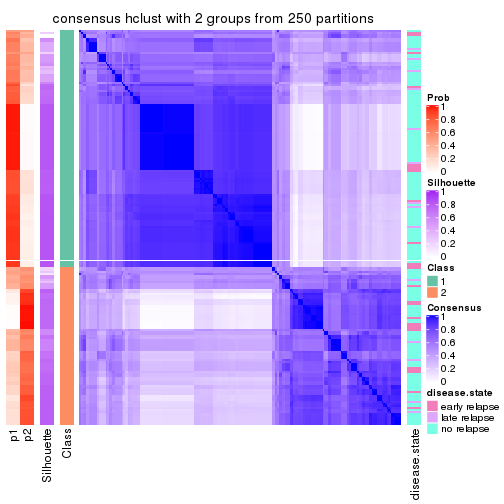</p>

</div>
<div id='tab-MAD-hclust-consensus-heatmap-2'>
<pre><code class="r">consensus_heatmap(res, k = 3)
</code></pre>

<p>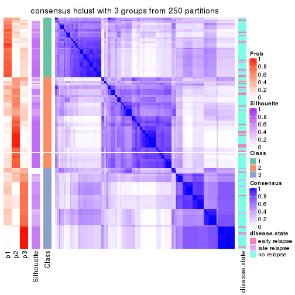</p>

</div>
<div id='tab-MAD-hclust-consensus-heatmap-3'>
<pre><code class="r">consensus_heatmap(res, k = 4)
</code></pre>

<p></p>

</div>
<div id='tab-MAD-hclust-consensus-heatmap-4'>
<pre><code class="r">consensus_heatmap(res, k = 5)
</code></pre>

<p>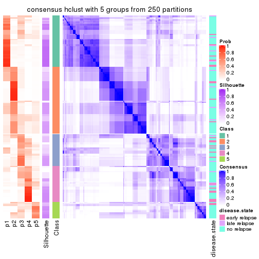</p>

</div>
<div id='tab-MAD-hclust-consensus-heatmap-5'>
<pre><code class="r">consensus_heatmap(res, k = 6)
</code></pre>

<p>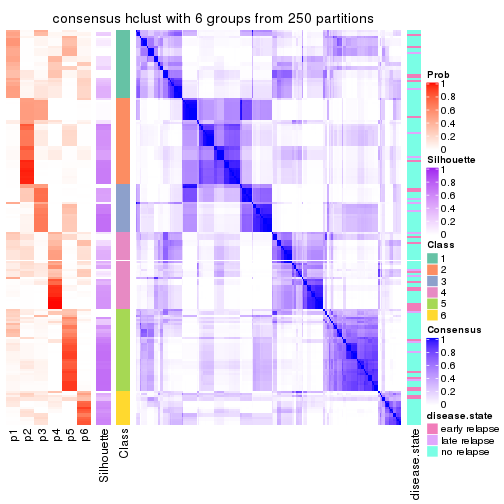</p>

</div>
</div>

Heatmaps for the membership of samples in all partitions to see how consistent they are:


<script>
$( function() {
	$( '#tabs-MAD-hclust-membership-heatmap' ).tabs();
} );
</script>
<div id='tabs-MAD-hclust-membership-heatmap'>
<ul>
<li><a href='#tab-MAD-hclust-membership-heatmap-1'>k = 2</a></li>
<li><a href='#tab-MAD-hclust-membership-heatmap-2'>k = 3</a></li>
<li><a href='#tab-MAD-hclust-membership-heatmap-3'>k = 4</a></li>
<li><a href='#tab-MAD-hclust-membership-heatmap-4'>k = 5</a></li>
<li><a href='#tab-MAD-hclust-membership-heatmap-5'>k = 6</a></li>
</ul>
<div id='tab-MAD-hclust-membership-heatmap-1'>
<pre><code class="r">membership_heatmap(res, k = 2)
</code></pre>

<p>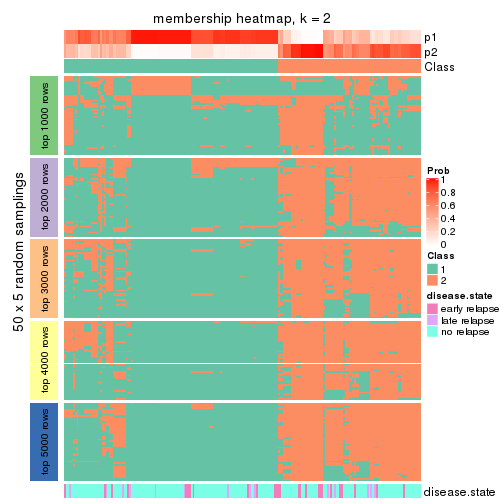</p>

</div>
<div id='tab-MAD-hclust-membership-heatmap-2'>
<pre><code class="r">membership_heatmap(res, k = 3)
</code></pre>

<p>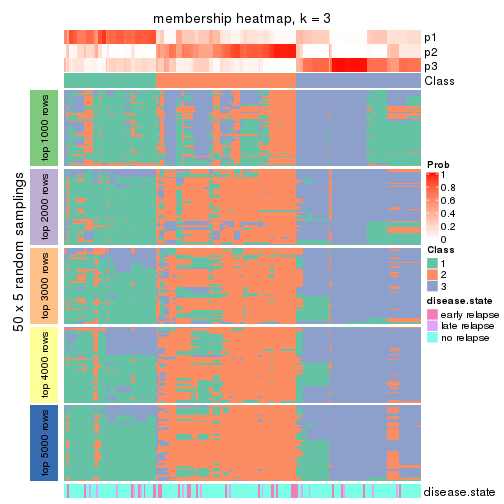</p>

</div>
<div id='tab-MAD-hclust-membership-heatmap-3'>
<pre><code class="r">membership_heatmap(res, k = 4)
</code></pre>

<p>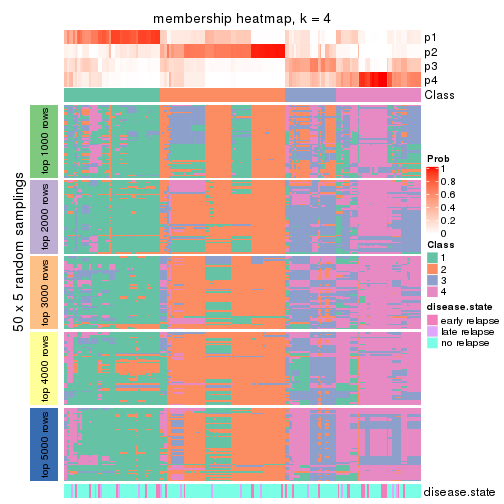</p>

</div>
<div id='tab-MAD-hclust-membership-heatmap-4'>
<pre><code class="r">membership_heatmap(res, k = 5)
</code></pre>

<p>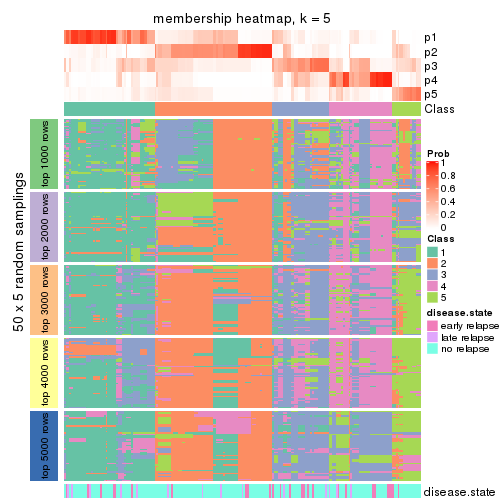</p>

</div>
<div id='tab-MAD-hclust-membership-heatmap-5'>
<pre><code class="r">membership_heatmap(res, k = 6)
</code></pre>

<p>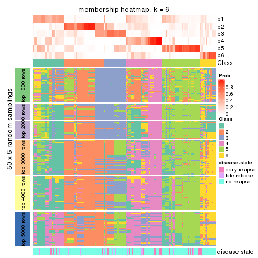</p>

</div>
</div>

As soon as we have had the classes for columns, we can look for signatures
which are significantly different between classes which can be candidate marks
for certain classes. Following are the heatmaps for signatures.


Signature heatmaps where rows are scaled:


<script>
$( function() {
	$( '#tabs-MAD-hclust-get-signatures' ).tabs();
} );
</script>
<div id='tabs-MAD-hclust-get-signatures'>
<ul>
<li><a href='#tab-MAD-hclust-get-signatures-1'>k = 2</a></li>
<li><a href='#tab-MAD-hclust-get-signatures-2'>k = 3</a></li>
<li><a href='#tab-MAD-hclust-get-signatures-3'>k = 4</a></li>
<li><a href='#tab-MAD-hclust-get-signatures-4'>k = 5</a></li>
<li><a href='#tab-MAD-hclust-get-signatures-5'>k = 6</a></li>
</ul>
<div id='tab-MAD-hclust-get-signatures-1'>
<pre><code class="r">get_signatures(res, k = 2)
</code></pre>

<p>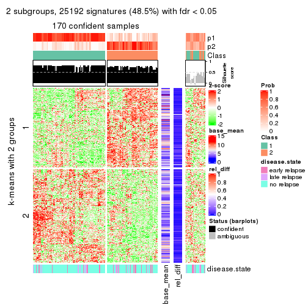</p>

</div>
<div id='tab-MAD-hclust-get-signatures-2'>
<pre><code class="r">get_signatures(res, k = 3)
</code></pre>

<p>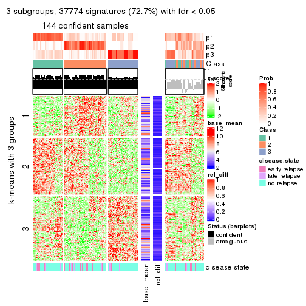</p>

</div>
<div id='tab-MAD-hclust-get-signatures-3'>
<pre><code class="r">get_signatures(res, k = 4)
</code></pre>

<p>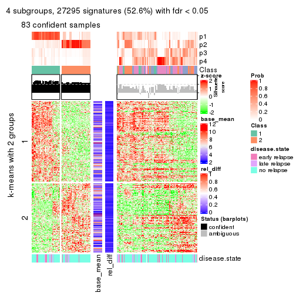</p>

</div>
<div id='tab-MAD-hclust-get-signatures-4'>
<pre><code class="r">get_signatures(res, k = 5)
</code></pre>

<p>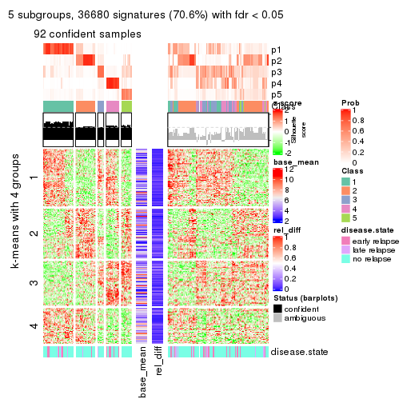</p>

</div>
<div id='tab-MAD-hclust-get-signatures-5'>
<pre><code class="r">get_signatures(res, k = 6)
</code></pre>

<p>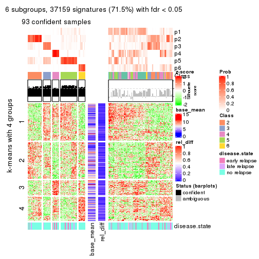</p>

</div>
</div>


Signature heatmaps where rows are not scaled:


<script>
$( function() {
	$( '#tabs-MAD-hclust-get-signatures-no-scale' ).tabs();
} );
</script>
<div id='tabs-MAD-hclust-get-signatures-no-scale'>
<ul>
<li><a href='#tab-MAD-hclust-get-signatures-no-scale-1'>k = 2</a></li>
<li><a href='#tab-MAD-hclust-get-signatures-no-scale-2'>k = 3</a></li>
<li><a href='#tab-MAD-hclust-get-signatures-no-scale-3'>k = 4</a></li>
<li><a href='#tab-MAD-hclust-get-signatures-no-scale-4'>k = 5</a></li>
<li><a href='#tab-MAD-hclust-get-signatures-no-scale-5'>k = 6</a></li>
</ul>
<div id='tab-MAD-hclust-get-signatures-no-scale-1'>
<pre><code class="r">get_signatures(res, k = 2, scale_rows = FALSE)
</code></pre>

<p>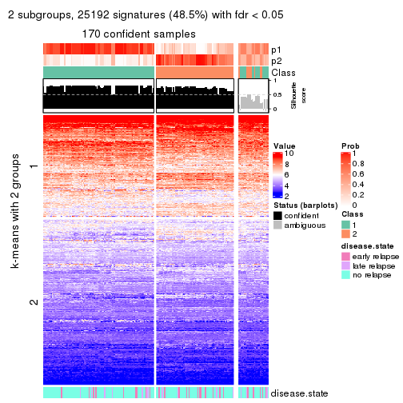</p>

</div>
<div id='tab-MAD-hclust-get-signatures-no-scale-2'>
<pre><code class="r">get_signatures(res, k = 3, scale_rows = FALSE)
</code></pre>

<p>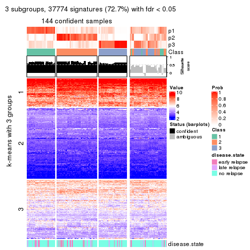</p>

</div>
<div id='tab-MAD-hclust-get-signatures-no-scale-3'>
<pre><code class="r">get_signatures(res, k = 4, scale_rows = FALSE)
</code></pre>

<p>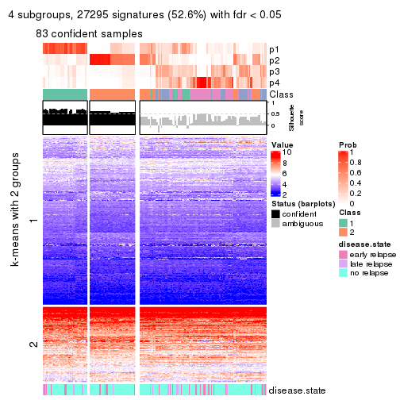</p>

</div>
<div id='tab-MAD-hclust-get-signatures-no-scale-4'>
<pre><code class="r">get_signatures(res, k = 5, scale_rows = FALSE)
</code></pre>

<p>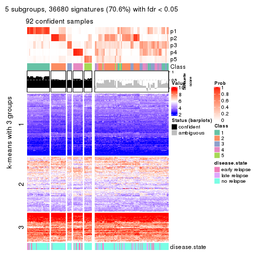</p>

</div>
<div id='tab-MAD-hclust-get-signatures-no-scale-5'>
<pre><code class="r">get_signatures(res, k = 6, scale_rows = FALSE)
</code></pre>

<p>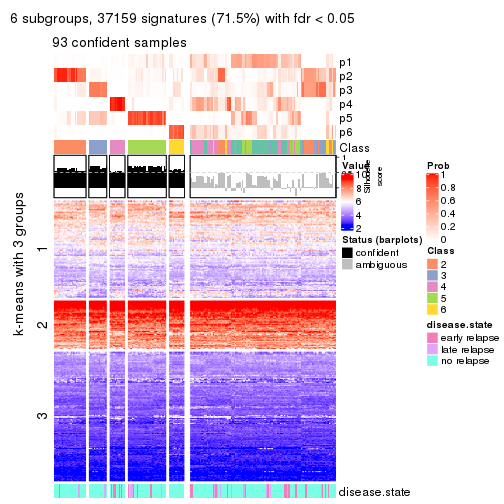</p>

</div>
</div>


Compare the overlap of signatures from different k:

```r
compare_signatures(res)
```

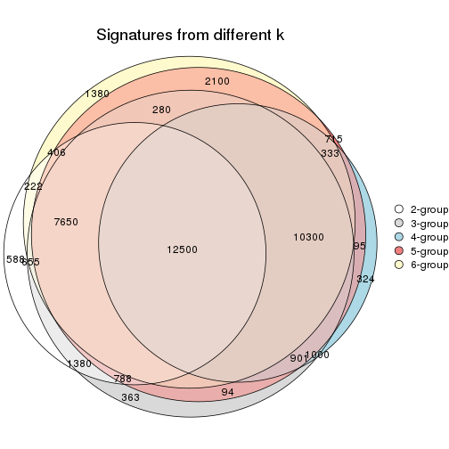

`get_signature()` returns a data frame invisibly. TO get the list of signatures, the function
call should be assigned to a variable explicitly. In following code, if `plot` argument is set
to `FALSE`, no heatmap is plotted while only the differential analysis is performed.

```r
# code only for demonstration
tb = get_signature(res, k = ..., plot = FALSE)
```

An example of the output of `tb` is:

```
#>   which_row         fdr    mean_1    mean_2 scaled_mean_1 scaled_mean_2 km
#> 1        38 0.042760348  8.373488  9.131774    -0.5533452     0.5164555  1
#> 2        40 0.018707592  7.106213  8.469186    -0.6173731     0.5762149  1
#> 3        55 0.019134737 10.221463 11.207825    -0.6159697     0.5749050  1
#> 4        59 0.006059896  5.921854  7.869574    -0.6899429     0.6439467  1
#> 5        60 0.018055526  8.928898 10.211722    -0.6204761     0.5791110  1
#> 6        98 0.009384629 15.714769 14.887706     0.6635654    -0.6193277  2
...
```

The columns in `tb` are:

1. `which_row`: row indices corresponding to the input matrix.
2. `fdr`: FDR for the differential test. 
3. `mean_x`: The mean value in group x.
4. `scaled_mean_x`: The mean value in group x after rows are scaled.
5. `km`: Row groups if k-means clustering is applied to rows.


UMAP plot which shows how samples are separated.


<script>
$( function() {
	$( '#tabs-MAD-hclust-dimension-reduction' ).tabs();
} );
</script>
<div id='tabs-MAD-hclust-dimension-reduction'>
<ul>
<li><a href='#tab-MAD-hclust-dimension-reduction-1'>k = 2</a></li>
<li><a href='#tab-MAD-hclust-dimension-reduction-2'>k = 3</a></li>
<li><a href='#tab-MAD-hclust-dimension-reduction-3'>k = 4</a></li>
<li><a href='#tab-MAD-hclust-dimension-reduction-4'>k = 5</a></li>
<li><a href='#tab-MAD-hclust-dimension-reduction-5'>k = 6</a></li>
</ul>
<div id='tab-MAD-hclust-dimension-reduction-1'>
<pre><code class="r">dimension_reduction(res, k = 2, method = &quot;UMAP&quot;)
</code></pre>

<p>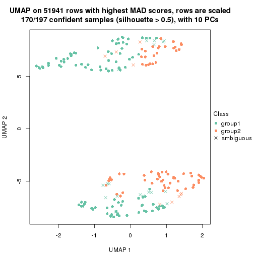</p>

</div>
<div id='tab-MAD-hclust-dimension-reduction-2'>
<pre><code class="r">dimension_reduction(res, k = 3, method = &quot;UMAP&quot;)
</code></pre>

<p>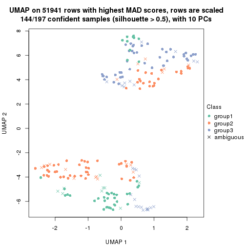</p>

</div>
<div id='tab-MAD-hclust-dimension-reduction-3'>
<pre><code class="r">dimension_reduction(res, k = 4, method = &quot;UMAP&quot;)
</code></pre>

<p>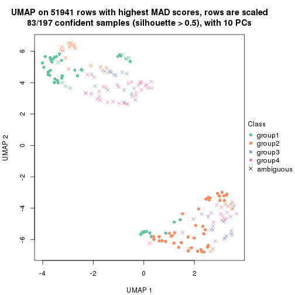</p>

</div>
<div id='tab-MAD-hclust-dimension-reduction-4'>
<pre><code class="r">dimension_reduction(res, k = 5, method = &quot;UMAP&quot;)
</code></pre>

<p>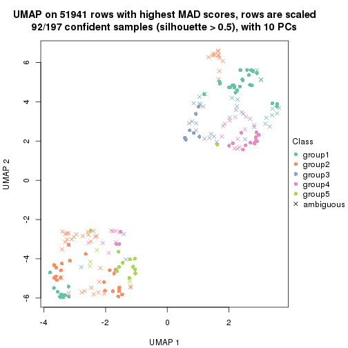</p>

</div>
<div id='tab-MAD-hclust-dimension-reduction-5'>
<pre><code class="r">dimension_reduction(res, k = 6, method = &quot;UMAP&quot;)
</code></pre>

<p>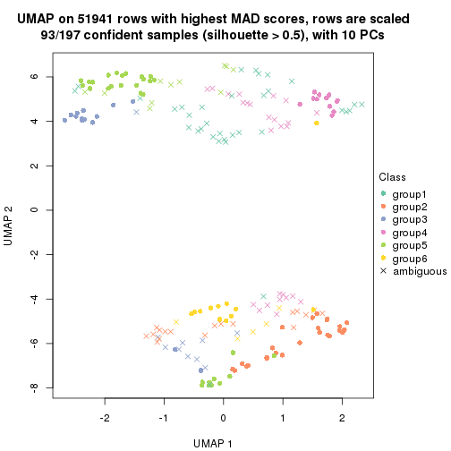</p>

</div>
</div>


Following heatmap shows how subgroups are split when increasing `k`:

```r
collect_classes(res)
```

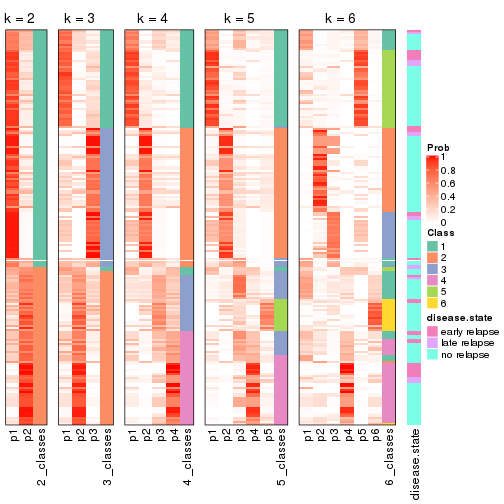


Test correlation between subgroups and known annotations. If the known
annotation is numeric, one-way ANOVA test is applied, and if the known
annotation is discrete, chi-squared contingency table test is applied.

```r
test_to_known_factors(res)
```

```
#>              n disease.state(p) k
#> MAD:hclust 170           0.2789 2
#> MAD:hclust 144           0.5041 3
#> MAD:hclust  83           0.6062 4
#> MAD:hclust  92           0.0292 5
#> MAD:hclust  93           0.0166 6
```


If matrix rows can be associated to genes, consider to use `functional_enrichment(res,
...)` to perform function enrichment for the signature genes. See [this vignette](http://bioconductor.org/packages/devel/bioc/vignettes/cola/inst/doc/functional_enrichment.html) for more detailed explanations.


 

---------------------------------------------------


### MAD:kmeans


The object with results only for a single top-value method and a single partition method 
can be extracted as:

```r
res = res_list["MAD", "kmeans"]
# you can also extract it by
# res = res_list["MAD:kmeans"]
```

A summary of `res` and all the functions that can be applied to it:

```r
res
```

```
#> A 'ConsensusPartition' object with k = 2, 3, 4, 5, 6.
#>   On a matrix with 51941 rows and 197 columns.
#>   Top rows (1000, 2000, 3000, 4000, 5000) are extracted by 'MAD' method.
#>   Subgroups are detected by 'kmeans' method.
#>   Performed in total 1250 partitions by row resampling.
#>   Best k for subgroups seems to be 2.
#> 
#> Following methods can be applied to this 'ConsensusPartition' object:
#>  [1] "cola_report"             "collect_classes"         "collect_plots"          
#>  [4] "collect_stats"           "colnames"                "compare_signatures"     
#>  [7] "consensus_heatmap"       "dimension_reduction"     "functional_enrichment"  
#> [10] "get_anno_col"            "get_anno"                "get_classes"            
#> [13] "get_consensus"           "get_matrix"              "get_membership"         
#> [16] "get_param"               "get_signatures"          "get_stats"              
#> [19] "is_best_k"               "is_stable_k"             "membership_heatmap"     
#> [22] "ncol"                    "nrow"                    "plot_ecdf"              
#> [25] "rownames"                "select_partition_number" "show"                   
#> [28] "suggest_best_k"          "test_to_known_factors"
```

`collect_plots()` function collects all the plots made from `res` for all `k` (number of partitions)
into one single page to provide an easy and fast comparison between different `k`.

```r
collect_plots(res)
```

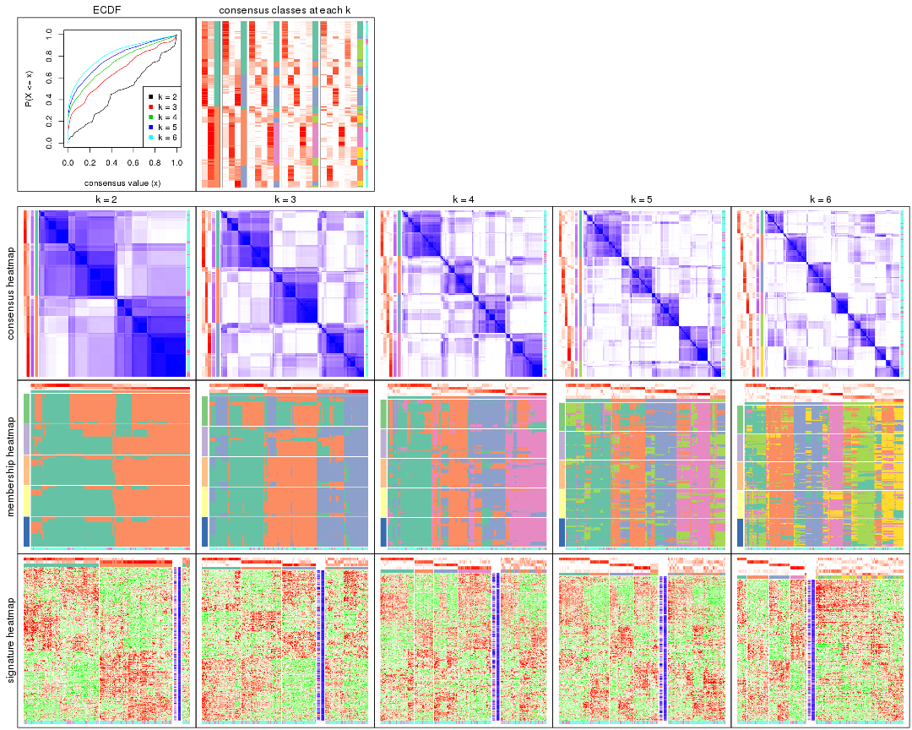

The plots are:

- The first row: a plot of the ECDF (empirical cumulative distribution
  function) curves of the consensus matrix for each `k` and the heatmap of
  predicted classes for each `k`.
- The second row: heatmaps of the consensus matrix for each `k`.
- The third row: heatmaps of the membership matrix for each `k`.
- The fouth row: heatmaps of the signatures for each `k`.

All the plots in panels can be made by individual functions and they are
plotted later in this section.

`select_partition_number()` produces several plots showing different
statistics for choosing "optimized" `k`. There are following statistics:

- ECDF curves of the consensus matrix for each `k`;
- 1-PAC. [The PAC
  score](https://en.wikipedia.org/wiki/Consensus_clustering#Over-interpretation_potential_of_consensus_clustering)
  measures the proportion of the ambiguous subgrouping.
- Mean silhouette score.
- Concordance. The mean probability of fiting the consensus class ids in all
  partitions.
- Area increased. Denote $A_k$ as the area under the ECDF curve for current
  `k`, the area increased is defined as $A_k - A_{k-1}$.
- Rand index. The percent of pairs of samples that are both in a same cluster
  or both are not in a same cluster in the partition of k and k-1.
- Jaccard index. The ratio of pairs of samples are both in a same cluster in
  the partition of k and k-1 and the pairs of samples are both in a same
  cluster in the partition k or k-1.

The detailed explanations of these statistics can be found in [the _cola_
vignette](http://bioconductor.org/packages/devel/bioc/vignettes/cola/inst/doc/cola.html#toc_13).

Generally speaking, lower PAC score, higher mean silhouette score or higher
concordance corresponds to better partition. Rand index and Jaccard index
measure how similar the current partition is compared to partition with `k-1`.
If they are too similar, we won't accept `k` is better than `k-1`.

```r
select_partition_number(res)
```

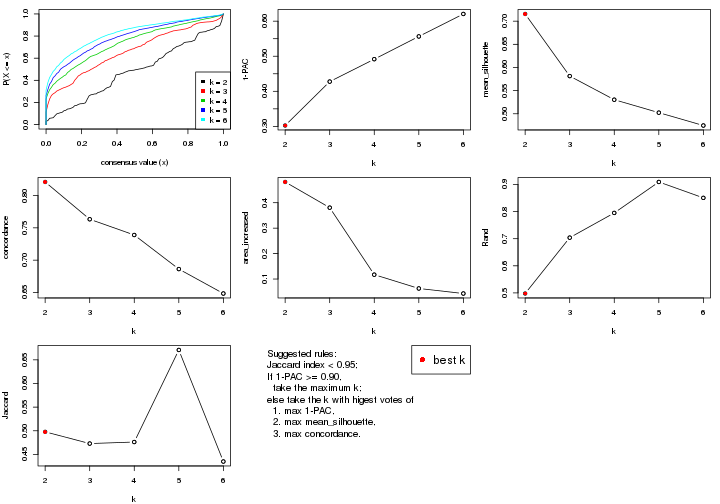

The numeric values for all these statistics can be obtained by `get_stats()`.

```r
get_stats(res)
```

```
#>   k 1-PAC mean_silhouette concordance area_increased  Rand Jaccard
#> 2 2 0.302           0.716       0.821         0.4815 0.498   0.498
#> 3 3 0.428           0.581       0.763         0.3805 0.704   0.473
#> 4 4 0.492           0.530       0.739         0.1172 0.795   0.476
#> 5 5 0.556           0.502       0.686         0.0629 0.909   0.671
#> 6 6 0.621           0.475       0.648         0.0431 0.850   0.435
```

`suggest_best_k()` suggests the best $k$ based on these statistics. The rules are as follows:

- All $k$ with Jaccard index larger than 0.95 are removed because increasing
  $k$ does not provide enough extra information. If all $k$ are removed, it is
  marked as no subgroup is detected.
- For all $k$ with 1-PAC score larger than 0.9, the maximal $k$ is taken as
  the best $k$, and other $k$ are marked as optional $k$.
- If it does not fit the second rule. The $k$ with the maximal vote of the
  highest 1-PAC score, highest mean silhouette, and highest concordance is
  taken as the best $k$.

```r
suggest_best_k(res)
```

```
#> [1] 2
```


Following shows the table of the partitions (You need to click the **show/hide
code output** link to see it). The membership matrix (columns with name `p*`)
is inferred by
[`clue::cl_consensus()`](https://www.rdocumentation.org/link/cl_consensus?package=clue)
function with the `SE` method. Basically the value in the membership matrix
represents the probability to belong to a certain group. The finall class
label for an item is determined with the group with highest probability it
belongs to.

In `get_classes()` function, the entropy is calculated from the membership
matrix and the silhouette score is calculated from the consensus matrix.


<script>
$( function() {
	$( '#tabs-MAD-kmeans-get-classes' ).tabs();
} );
</script>
<div id='tabs-MAD-kmeans-get-classes'>
<ul>
<li><a href='#tab-MAD-kmeans-get-classes-1'>k = 2</a></li>
<li><a href='#tab-MAD-kmeans-get-classes-2'>k = 3</a></li>
<li><a href='#tab-MAD-kmeans-get-classes-3'>k = 4</a></li>
<li><a href='#tab-MAD-kmeans-get-classes-4'>k = 5</a></li>
<li><a href='#tab-MAD-kmeans-get-classes-5'>k = 6</a></li>
</ul>

<div id='tab-MAD-kmeans-get-classes-1'>
<p><a id='tab-MAD-kmeans-get-classes-1-a' style='color:#0366d6' href='#'>show/hide code output</a></p>
<pre><code class="r">cbind(get_classes(res, k = 2), get_membership(res, k = 2))
</code></pre>

<pre><code>#&gt;           class entropy silhouette    p1    p2
#&gt; GSM342319     1  0.9608     0.7222 0.616 0.384
#&gt; GSM342323     2  0.0000     0.8345 0.000 1.000
#&gt; GSM342325     1  0.9608     0.7222 0.616 0.384
#&gt; GSM342326     2  0.0000     0.8345 0.000 1.000
#&gt; GSM342327     2  0.0000     0.8345 0.000 1.000
#&gt; GSM342329     2  0.0000     0.8345 0.000 1.000
#&gt; GSM342331     2  0.0000     0.8345 0.000 1.000
#&gt; GSM342334     2  0.0376     0.8350 0.004 0.996
#&gt; GSM342335     2  0.0938     0.8349 0.012 0.988
#&gt; GSM342354     2  0.8608     0.6380 0.284 0.716
#&gt; GSM342371     2  0.0938     0.8349 0.012 0.988
#&gt; GSM342380     1  0.9608     0.7222 0.616 0.384
#&gt; GSM342382     1  0.9087     0.7410 0.676 0.324
#&gt; GSM342399     1  0.9608     0.7222 0.616 0.384
#&gt; GSM342402     1  0.9608     0.7222 0.616 0.384
#&gt; GSM342404     2  0.0938     0.8349 0.012 0.988
#&gt; GSM342408     2  0.8608     0.6380 0.284 0.716
#&gt; GSM342409     2  0.0938     0.8349 0.012 0.988
#&gt; GSM342426     2  0.2603     0.8228 0.044 0.956
#&gt; GSM342441     1  0.6712     0.5423 0.824 0.176
#&gt; GSM342444     1  0.0000     0.7024 1.000 0.000
#&gt; GSM342451     1  0.0000     0.7024 1.000 0.000
#&gt; GSM342462     2  0.6247     0.7746 0.156 0.844
#&gt; GSM342467     2  0.3879     0.8173 0.076 0.924
#&gt; GSM342484     1  0.7950     0.7425 0.760 0.240
#&gt; GSM342491     2  0.5946     0.7770 0.144 0.856
#&gt; GSM342322     1  0.9608     0.7222 0.616 0.384
#&gt; GSM342338     1  0.4431     0.7049 0.908 0.092
#&gt; GSM342347     2  0.8207     0.6502 0.256 0.744
#&gt; GSM342356     1  0.4562     0.7042 0.904 0.096
#&gt; GSM342357     1  0.9608     0.7222 0.616 0.384
#&gt; GSM342366     2  0.8861     0.1845 0.304 0.696
#&gt; GSM342385     1  0.9608     0.7222 0.616 0.384
#&gt; GSM342421     2  0.0000     0.8345 0.000 1.000
#&gt; GSM342437     2  0.5737     0.7823 0.136 0.864
#&gt; GSM342454     1  0.0000     0.7024 1.000 0.000
#&gt; GSM342471     2  0.0000     0.8345 0.000 1.000
#&gt; GSM342477     2  0.5629     0.7851 0.132 0.868
#&gt; GSM342495     2  0.6247     0.7746 0.156 0.844
#&gt; GSM342496     1  0.7528     0.7450 0.784 0.216
#&gt; GSM342320     2  0.0000     0.8345 0.000 1.000
#&gt; GSM342321     2  0.0000     0.8345 0.000 1.000
#&gt; GSM342324     2  0.0000     0.8345 0.000 1.000
#&gt; GSM342328     2  0.0000     0.8345 0.000 1.000
#&gt; GSM342330     2  0.0000     0.8345 0.000 1.000
#&gt; GSM342332     2  0.0000     0.8345 0.000 1.000
#&gt; GSM342333     2  0.0938     0.8349 0.012 0.988
#&gt; GSM342336     2  0.0000     0.8345 0.000 1.000
#&gt; GSM342337     1  0.4298     0.7058 0.912 0.088
#&gt; GSM342339     1  0.2603     0.7112 0.956 0.044
#&gt; GSM342340     1  0.2603     0.7112 0.956 0.044
#&gt; GSM342341     1  0.2603     0.7112 0.956 0.044
#&gt; GSM342342     1  0.2603     0.7112 0.956 0.044
#&gt; GSM342343     1  0.2603     0.7112 0.956 0.044
#&gt; GSM342344     1  0.8144     0.5501 0.748 0.252
#&gt; GSM342345     1  0.2603     0.7112 0.956 0.044
#&gt; GSM342346     2  0.0672     0.8352 0.008 0.992
#&gt; GSM342348     1  0.9795     0.6871 0.584 0.416
#&gt; GSM342349     2  0.8608     0.6380 0.284 0.716
#&gt; GSM342350     2  0.8608     0.6380 0.284 0.716
#&gt; GSM342351     2  0.8608     0.6380 0.284 0.716
#&gt; GSM342352     2  0.8661     0.6352 0.288 0.712
#&gt; GSM342353     1  0.6623     0.6565 0.828 0.172
#&gt; GSM342355     1  0.5946     0.6960 0.856 0.144
#&gt; GSM342358     2  0.0000     0.8345 0.000 1.000
#&gt; GSM342359     2  0.0000     0.8345 0.000 1.000
#&gt; GSM342360     2  0.0000     0.8345 0.000 1.000
#&gt; GSM342361     2  0.0000     0.8345 0.000 1.000
#&gt; GSM342362     2  0.3431     0.7671 0.064 0.936
#&gt; GSM342363     1  0.9608     0.7222 0.616 0.384
#&gt; GSM342364     1  0.9522     0.7265 0.628 0.372
#&gt; GSM342365     2  0.0672     0.8352 0.008 0.992
#&gt; GSM342367     1  0.9522     0.7265 0.628 0.372
#&gt; GSM342368     1  0.9522     0.7265 0.628 0.372
#&gt; GSM342369     2  0.0938     0.8349 0.012 0.988
#&gt; GSM342370     2  0.0672     0.8352 0.008 0.992
#&gt; GSM342372     2  0.0938     0.8349 0.012 0.988
#&gt; GSM342373     2  0.0938     0.8349 0.012 0.988
#&gt; GSM342374     2  0.0672     0.8352 0.008 0.992
#&gt; GSM342375     2  0.0938     0.8349 0.012 0.988
#&gt; GSM342376     1  0.9522     0.7265 0.628 0.372
#&gt; GSM342377     1  0.9522     0.7265 0.628 0.372
#&gt; GSM342378     1  0.9608     0.7222 0.616 0.384
#&gt; GSM342379     1  0.9608     0.7222 0.616 0.384
#&gt; GSM342381     1  0.9522     0.7265 0.628 0.372
#&gt; GSM342383     1  0.9608     0.7222 0.616 0.384
#&gt; GSM342384     1  0.9522     0.7265 0.628 0.372
#&gt; GSM342386     1  0.9522     0.7265 0.628 0.372
#&gt; GSM342387     2  0.0000     0.8345 0.000 1.000
#&gt; GSM342388     1  0.2603     0.7112 0.956 0.044
#&gt; GSM342389     1  0.9522     0.7265 0.628 0.372
#&gt; GSM342390     1  0.7602     0.7175 0.780 0.220
#&gt; GSM342391     1  0.9608     0.7222 0.616 0.384
#&gt; GSM342392     1  0.1414     0.7072 0.980 0.020
#&gt; GSM342393     2  0.0938     0.8349 0.012 0.988
#&gt; GSM342394     1  0.9608     0.7222 0.616 0.384
#&gt; GSM342395     2  0.9044     0.1063 0.320 0.680
#&gt; GSM342396     1  0.2603     0.7112 0.956 0.044
#&gt; GSM342397     2  0.8608     0.6380 0.284 0.716
#&gt; GSM342398     1  0.9522     0.7265 0.628 0.372
#&gt; GSM342400     1  0.9522     0.7265 0.628 0.372
#&gt; GSM342401     1  0.2603     0.7112 0.956 0.044
#&gt; GSM342403     1  0.9522     0.7265 0.628 0.372
#&gt; GSM342405     2  0.1633     0.8328 0.024 0.976
#&gt; GSM342406     1  0.9552     0.7255 0.624 0.376
#&gt; GSM342407     2  0.8713     0.6326 0.292 0.708
#&gt; GSM342410     1  0.9608     0.7222 0.616 0.384
#&gt; GSM342411     2  0.0000     0.8345 0.000 1.000
#&gt; GSM342412     2  0.0000     0.8345 0.000 1.000
#&gt; GSM342413     2  0.0938     0.8326 0.012 0.988
#&gt; GSM342414     2  0.8861     0.6288 0.304 0.696
#&gt; GSM342415     2  0.0672     0.8352 0.008 0.992
#&gt; GSM342416     2  0.8861     0.1978 0.304 0.696
#&gt; GSM342417     2  0.0000     0.8345 0.000 1.000
#&gt; GSM342418     2  0.0000     0.8345 0.000 1.000
#&gt; GSM342419     1  0.9608     0.7222 0.616 0.384
#&gt; GSM342420     2  0.0000     0.8345 0.000 1.000
#&gt; GSM342422     1  0.9522     0.7265 0.628 0.372
#&gt; GSM342423     2  0.0938     0.8349 0.012 0.988
#&gt; GSM342424     2  0.0000     0.8345 0.000 1.000
#&gt; GSM342425     2  0.4298     0.8031 0.088 0.912
#&gt; GSM342427     2  0.3114     0.8227 0.056 0.944
#&gt; GSM342428     2  0.2603     0.8228 0.044 0.956
#&gt; GSM342429     1  0.9963     0.3465 0.536 0.464
#&gt; GSM342430     1  0.0000     0.7024 1.000 0.000
#&gt; GSM342431     1  0.0000     0.7024 1.000 0.000
#&gt; GSM342432     1  0.0000     0.7024 1.000 0.000
#&gt; GSM342433     2  0.9608     0.5767 0.384 0.616
#&gt; GSM342434     2  0.9608     0.5767 0.384 0.616
#&gt; GSM342435     2  0.9608     0.5767 0.384 0.616
#&gt; GSM342436     1  0.6712     0.5423 0.824 0.176
#&gt; GSM342438     1  0.0000     0.7024 1.000 0.000
#&gt; GSM342439     1  0.0000     0.7024 1.000 0.000
#&gt; GSM342440     1  0.6712     0.5423 0.824 0.176
#&gt; GSM342442     1  0.0000     0.7024 1.000 0.000
#&gt; GSM342443     2  0.6247     0.7746 0.156 0.844
#&gt; GSM342445     1  0.6712     0.5423 0.824 0.176
#&gt; GSM342446     1  0.0000     0.7024 1.000 0.000
#&gt; GSM342447     1  0.0000     0.7024 1.000 0.000
#&gt; GSM342448     2  0.9608     0.5767 0.384 0.616
#&gt; GSM342449     1  0.0000     0.7024 1.000 0.000
#&gt; GSM342450     2  0.9608     0.5767 0.384 0.616
#&gt; GSM342452     1  0.0000     0.7024 1.000 0.000
#&gt; GSM342453     1  0.0000     0.7024 1.000 0.000
#&gt; GSM342455     1  0.0000     0.7024 1.000 0.000
#&gt; GSM342456     2  0.0000     0.8345 0.000 1.000
#&gt; GSM342457     1  0.9323     0.7337 0.652 0.348
#&gt; GSM342458     2  0.1184     0.8351 0.016 0.984
#&gt; GSM342459     2  0.6247     0.7746 0.156 0.844
#&gt; GSM342460     2  0.6247     0.7746 0.156 0.844
#&gt; GSM342461     1  0.9427     0.5967 0.640 0.360
#&gt; GSM342463     1  0.7745     0.7433 0.772 0.228
#&gt; GSM342464     1  0.7745     0.7433 0.772 0.228
#&gt; GSM342465     1  0.7745     0.7433 0.772 0.228
#&gt; GSM342466     1  0.3733     0.7193 0.928 0.072
#&gt; GSM342468     2  0.0938     0.8349 0.012 0.988
#&gt; GSM342469     1  0.9522     0.7282 0.628 0.372
#&gt; GSM342470     2  0.2603     0.8302 0.044 0.956
#&gt; GSM342472     2  0.8081     0.7124 0.248 0.752
#&gt; GSM342473     1  0.9833     0.4620 0.576 0.424
#&gt; GSM342474     1  0.9833     0.4620 0.576 0.424
#&gt; GSM342475     1  0.6623     0.5484 0.828 0.172
#&gt; GSM342476     2  0.6247     0.7746 0.156 0.844
#&gt; GSM342478     1  1.0000     0.2320 0.504 0.496
#&gt; GSM342479     1  0.9850     0.4699 0.572 0.428
#&gt; GSM342480     2  0.6247     0.7746 0.156 0.844
#&gt; GSM342481     1  0.9427     0.5967 0.640 0.360
#&gt; GSM342482     2  0.6438     0.7684 0.164 0.836
#&gt; GSM342483     1  0.9944     0.3718 0.544 0.456
#&gt; GSM342485     1  0.7745     0.7433 0.772 0.228
#&gt; GSM342486     1  0.7745     0.7433 0.772 0.228
#&gt; GSM342487     2  0.9608     0.5767 0.384 0.616
#&gt; GSM342488     2  0.6247     0.7746 0.156 0.844
#&gt; GSM342489     2  0.6247     0.7746 0.156 0.844
#&gt; GSM342490     2  0.5946     0.7795 0.144 0.856
#&gt; GSM342492     2  0.9608     0.5767 0.384 0.616
#&gt; GSM342493     1  0.7745     0.7433 0.772 0.228
#&gt; GSM342494     2  0.6247     0.7746 0.156 0.844
#&gt; GSM342497     2  0.6247     0.7746 0.156 0.844
#&gt; GSM342498     1  0.7950     0.7425 0.760 0.240
#&gt; GSM342499     1  0.8909     0.7394 0.692 0.308
#&gt; GSM342500     2  0.6247     0.7746 0.156 0.844
#&gt; GSM342501     1  0.7745     0.7433 0.772 0.228
#&gt; GSM342502     1  0.7745     0.7433 0.772 0.228
#&gt; GSM342503     1  0.9710     0.5179 0.600 0.400
#&gt; GSM342504     2  0.9896     0.0427 0.440 0.560
#&gt; GSM342505     1  0.0000     0.7024 1.000 0.000
#&gt; GSM342506     1  0.7950     0.7425 0.760 0.240
#&gt; GSM342507     1  0.9608     0.7222 0.616 0.384
#&gt; GSM342508     1  0.8144     0.7452 0.748 0.252
#&gt; GSM342509     1  0.7950     0.7425 0.760 0.240
#&gt; GSM342510     2  0.5842     0.7800 0.140 0.860
#&gt; GSM342511     2  0.9608     0.5767 0.384 0.616
#&gt; GSM342512     1  0.7745     0.7433 0.772 0.228
#&gt; GSM342513     1  0.7745     0.7433 0.772 0.228
#&gt; GSM342514     2  0.9522     0.5814 0.372 0.628
#&gt; GSM342515     1  0.9248     0.7365 0.660 0.340
</code></pre>

<script>
$('#tab-MAD-kmeans-get-classes-1-a').parent().next().next().hide();
$('#tab-MAD-kmeans-get-classes-1-a').click(function(){
  $('#tab-MAD-kmeans-get-classes-1-a').parent().next().next().toggle();
  return(false);
});
</script>
</div>

<div id='tab-MAD-kmeans-get-classes-2'>
<p><a id='tab-MAD-kmeans-get-classes-2-a' style='color:#0366d6' href='#'>show/hide code output</a></p>
<pre><code class="r">cbind(get_classes(res, k = 3), get_membership(res, k = 3))
</code></pre>

<pre><code>#&gt;           class entropy silhouette    p1    p2    p3
#&gt; GSM342319     1  0.1289    0.73436 0.968 0.032 0.000
#&gt; GSM342323     2  0.4121    0.78226 0.168 0.832 0.000
#&gt; GSM342325     1  0.1163    0.73559 0.972 0.028 0.000
#&gt; GSM342326     2  0.4062    0.78371 0.164 0.836 0.000
#&gt; GSM342327     2  0.4062    0.78371 0.164 0.836 0.000
#&gt; GSM342329     2  0.4062    0.78371 0.164 0.836 0.000
#&gt; GSM342331     2  0.4002    0.78351 0.160 0.840 0.000
#&gt; GSM342334     2  0.4047    0.78318 0.148 0.848 0.004
#&gt; GSM342335     2  0.1919    0.73213 0.024 0.956 0.020
#&gt; GSM342354     2  0.6527    0.46138 0.008 0.588 0.404
#&gt; GSM342371     2  0.7029    0.00137 0.440 0.540 0.020
#&gt; GSM342380     1  0.0592    0.73958 0.988 0.012 0.000
#&gt; GSM342382     1  0.4453    0.70493 0.836 0.152 0.012
#&gt; GSM342399     1  0.0592    0.73958 0.988 0.012 0.000
#&gt; GSM342402     1  0.1411    0.73053 0.964 0.036 0.000
#&gt; GSM342404     2  0.1636    0.73026 0.016 0.964 0.020
#&gt; GSM342408     2  0.5763    0.60664 0.008 0.716 0.276
#&gt; GSM342409     2  0.6803    0.43386 0.280 0.680 0.040
#&gt; GSM342426     2  0.4874    0.76437 0.144 0.828 0.028
#&gt; GSM342441     3  0.0000    0.64852 0.000 0.000 1.000
#&gt; GSM342444     3  0.5733    0.14936 0.324 0.000 0.676
#&gt; GSM342451     3  0.5733    0.14936 0.324 0.000 0.676
#&gt; GSM342462     3  0.6647    0.54810 0.012 0.396 0.592
#&gt; GSM342467     2  0.2356    0.68732 0.000 0.928 0.072
#&gt; GSM342484     3  0.7610    0.38140 0.388 0.048 0.564
#&gt; GSM342491     3  0.8427    0.49343 0.148 0.240 0.612
#&gt; GSM342322     1  0.1529    0.73123 0.960 0.040 0.000
#&gt; GSM342338     1  0.6111    0.47638 0.604 0.000 0.396
#&gt; GSM342347     2  0.6548    0.49890 0.012 0.616 0.372
#&gt; GSM342356     1  0.5497    0.58741 0.708 0.000 0.292
#&gt; GSM342357     1  0.1411    0.73053 0.964 0.036 0.000
#&gt; GSM342366     1  0.6062    0.61455 0.708 0.276 0.016
#&gt; GSM342385     1  0.0592    0.73958 0.988 0.012 0.000
#&gt; GSM342421     2  0.1620    0.73465 0.024 0.964 0.012
#&gt; GSM342437     3  0.8957    0.38347 0.152 0.312 0.536
#&gt; GSM342454     3  0.1964    0.61435 0.056 0.000 0.944
#&gt; GSM342471     2  0.6295    0.37521 0.472 0.528 0.000
#&gt; GSM342477     3  0.9082    0.19446 0.140 0.392 0.468
#&gt; GSM342495     3  0.6451    0.50334 0.004 0.436 0.560
#&gt; GSM342496     3  0.8914    0.43153 0.280 0.164 0.556
#&gt; GSM342320     2  0.4002    0.78351 0.160 0.840 0.000
#&gt; GSM342321     2  0.4121    0.78274 0.168 0.832 0.000
#&gt; GSM342324     2  0.4121    0.78226 0.168 0.832 0.000
#&gt; GSM342328     2  0.4062    0.78371 0.164 0.836 0.000
#&gt; GSM342330     2  0.4002    0.78351 0.160 0.840 0.000
#&gt; GSM342332     2  0.4062    0.78371 0.164 0.836 0.000
#&gt; GSM342333     2  0.2187    0.72897 0.028 0.948 0.024
#&gt; GSM342336     2  0.4172    0.78416 0.156 0.840 0.004
#&gt; GSM342337     1  0.5497    0.58741 0.708 0.000 0.292
#&gt; GSM342339     1  0.6244    0.42771 0.560 0.000 0.440
#&gt; GSM342340     1  0.5706    0.56132 0.680 0.000 0.320
#&gt; GSM342341     1  0.6244    0.42771 0.560 0.000 0.440
#&gt; GSM342342     1  0.6244    0.42771 0.560 0.000 0.440
#&gt; GSM342343     1  0.5650    0.56959 0.688 0.000 0.312
#&gt; GSM342344     3  0.9559   -0.03652 0.264 0.252 0.484
#&gt; GSM342345     1  0.6244    0.42771 0.560 0.000 0.440
#&gt; GSM342346     2  0.4741    0.78012 0.152 0.828 0.020
#&gt; GSM342348     1  0.3686    0.62777 0.860 0.140 0.000
#&gt; GSM342349     2  0.6298    0.47939 0.004 0.608 0.388
#&gt; GSM342350     2  0.6345    0.46277 0.004 0.596 0.400
#&gt; GSM342351     2  0.6275    0.52925 0.008 0.644 0.348
#&gt; GSM342352     2  0.6345    0.46277 0.004 0.596 0.400
#&gt; GSM342353     3  0.9598   -0.09328 0.304 0.228 0.468
#&gt; GSM342355     1  0.5431    0.59286 0.716 0.000 0.284
#&gt; GSM342358     2  0.4178    0.78102 0.172 0.828 0.000
#&gt; GSM342359     2  0.4178    0.78102 0.172 0.828 0.000
#&gt; GSM342360     2  0.4291    0.77724 0.180 0.820 0.000
#&gt; GSM342361     2  0.4002    0.78202 0.160 0.840 0.000
#&gt; GSM342362     1  0.6291   -0.23005 0.532 0.468 0.000
#&gt; GSM342363     1  0.1411    0.73053 0.964 0.036 0.000
#&gt; GSM342364     1  0.5147    0.68377 0.800 0.180 0.020
#&gt; GSM342365     2  0.1482    0.73230 0.012 0.968 0.020
#&gt; GSM342367     1  0.4110    0.70729 0.844 0.152 0.004
#&gt; GSM342368     1  0.5200    0.68697 0.796 0.184 0.020
#&gt; GSM342369     2  0.1636    0.73026 0.016 0.964 0.020
#&gt; GSM342370     2  0.1482    0.73230 0.012 0.968 0.020
#&gt; GSM342372     2  0.1781    0.73136 0.020 0.960 0.020
#&gt; GSM342373     2  0.7063   -0.08456 0.464 0.516 0.020
#&gt; GSM342374     2  0.1482    0.73230 0.012 0.968 0.020
#&gt; GSM342375     2  0.1781    0.73136 0.020 0.960 0.020
#&gt; GSM342376     1  0.4047    0.70922 0.848 0.148 0.004
#&gt; GSM342377     1  0.4110    0.70729 0.844 0.152 0.004
#&gt; GSM342378     1  0.0237    0.73899 0.996 0.004 0.000
#&gt; GSM342379     1  0.1529    0.73141 0.960 0.040 0.000
#&gt; GSM342381     1  0.4110    0.70729 0.844 0.152 0.004
#&gt; GSM342383     1  0.0592    0.73958 0.988 0.012 0.000
#&gt; GSM342384     1  0.4110    0.70729 0.844 0.152 0.004
#&gt; GSM342386     1  0.4110    0.70729 0.844 0.152 0.004
#&gt; GSM342387     2  0.4346    0.77651 0.184 0.816 0.000
#&gt; GSM342388     1  0.5591    0.57763 0.696 0.000 0.304
#&gt; GSM342389     1  0.4110    0.70729 0.844 0.152 0.004
#&gt; GSM342390     1  0.1170    0.73461 0.976 0.016 0.008
#&gt; GSM342391     1  0.0237    0.73899 0.996 0.004 0.000
#&gt; GSM342392     1  0.6244    0.42771 0.560 0.000 0.440
#&gt; GSM342393     2  0.1315    0.73024 0.008 0.972 0.020
#&gt; GSM342394     1  0.0747    0.73653 0.984 0.016 0.000
#&gt; GSM342395     1  0.6387    0.58521 0.680 0.300 0.020
#&gt; GSM342396     1  0.6235    0.43266 0.564 0.000 0.436
#&gt; GSM342397     2  0.6434    0.48926 0.008 0.612 0.380
#&gt; GSM342398     1  0.4110    0.70729 0.844 0.152 0.004
#&gt; GSM342400     1  0.4110    0.70729 0.844 0.152 0.004
#&gt; GSM342401     1  0.6244    0.42771 0.560 0.000 0.440
#&gt; GSM342403     1  0.1267    0.73981 0.972 0.024 0.004
#&gt; GSM342405     2  0.2116    0.72283 0.012 0.948 0.040
#&gt; GSM342406     1  0.2066    0.71605 0.940 0.060 0.000
#&gt; GSM342407     2  0.6421    0.42414 0.004 0.572 0.424
#&gt; GSM342410     1  0.0747    0.73653 0.984 0.016 0.000
#&gt; GSM342411     2  0.4605    0.76453 0.204 0.796 0.000
#&gt; GSM342412     2  0.4002    0.78408 0.160 0.840 0.000
#&gt; GSM342413     2  0.4346    0.77651 0.184 0.816 0.000
#&gt; GSM342414     2  0.6359    0.45689 0.004 0.592 0.404
#&gt; GSM342415     2  0.6735    0.07249 0.424 0.564 0.012
#&gt; GSM342416     1  0.4555    0.53463 0.800 0.200 0.000
#&gt; GSM342417     2  0.4062    0.78371 0.164 0.836 0.000
#&gt; GSM342418     2  0.4062    0.78371 0.164 0.836 0.000
#&gt; GSM342419     1  0.3551    0.71617 0.868 0.132 0.000
#&gt; GSM342420     2  0.4062    0.78371 0.164 0.836 0.000
#&gt; GSM342422     1  0.4110    0.70729 0.844 0.152 0.004
#&gt; GSM342423     2  0.3995    0.67409 0.116 0.868 0.016
#&gt; GSM342424     2  0.4062    0.78371 0.164 0.836 0.000
#&gt; GSM342425     2  0.7807    0.57335 0.144 0.672 0.184
#&gt; GSM342427     2  0.4233    0.56544 0.004 0.836 0.160
#&gt; GSM342428     2  0.3039    0.73473 0.036 0.920 0.044
#&gt; GSM342429     3  0.7234    0.60675 0.048 0.312 0.640
#&gt; GSM342430     3  0.5733    0.14936 0.324 0.000 0.676
#&gt; GSM342431     3  0.5733    0.14936 0.324 0.000 0.676
#&gt; GSM342432     3  0.0892    0.64097 0.020 0.000 0.980
#&gt; GSM342433     3  0.0424    0.65008 0.000 0.008 0.992
#&gt; GSM342434     2  0.6309    0.29622 0.000 0.504 0.496
#&gt; GSM342435     3  0.0424    0.65008 0.000 0.008 0.992
#&gt; GSM342436     3  0.0000    0.64852 0.000 0.000 1.000
#&gt; GSM342438     3  0.0892    0.64097 0.020 0.000 0.980
#&gt; GSM342439     3  0.0892    0.64097 0.020 0.000 0.980
#&gt; GSM342440     3  0.0000    0.64852 0.000 0.000 1.000
#&gt; GSM342442     3  0.0892    0.64097 0.020 0.000 0.980
#&gt; GSM342443     3  0.6451    0.50334 0.004 0.436 0.560
#&gt; GSM342445     3  0.0000    0.64852 0.000 0.000 1.000
#&gt; GSM342446     3  0.0747    0.64242 0.016 0.000 0.984
#&gt; GSM342447     1  0.6244    0.42771 0.560 0.000 0.440
#&gt; GSM342448     3  0.0424    0.65008 0.000 0.008 0.992
#&gt; GSM342449     3  0.0747    0.64242 0.016 0.000 0.984
#&gt; GSM342450     3  0.0424    0.65008 0.000 0.008 0.992
#&gt; GSM342452     3  0.0892    0.64097 0.020 0.000 0.980
#&gt; GSM342453     3  0.1964    0.61435 0.056 0.000 0.944
#&gt; GSM342455     3  0.0747    0.64242 0.016 0.000 0.984
#&gt; GSM342456     2  0.4002    0.78202 0.160 0.840 0.000
#&gt; GSM342457     1  0.4782    0.69597 0.820 0.164 0.016
#&gt; GSM342458     2  0.1129    0.72300 0.004 0.976 0.020
#&gt; GSM342459     3  0.6608    0.50676 0.008 0.432 0.560
#&gt; GSM342460     3  0.6608    0.50676 0.008 0.432 0.560
#&gt; GSM342461     3  0.8355    0.58684 0.140 0.244 0.616
#&gt; GSM342463     3  0.8962    0.42025 0.288 0.164 0.548
#&gt; GSM342464     3  0.8590    0.49822 0.236 0.164 0.600
#&gt; GSM342465     1  0.9174    0.18758 0.504 0.164 0.332
#&gt; GSM342466     1  0.1163    0.73322 0.972 0.000 0.028
#&gt; GSM342468     2  0.1482    0.72810 0.012 0.968 0.020
#&gt; GSM342469     1  0.0424    0.73886 0.992 0.008 0.000
#&gt; GSM342470     2  0.5036    0.77196 0.172 0.808 0.020
#&gt; GSM342472     2  0.5315    0.66621 0.012 0.772 0.216
#&gt; GSM342473     3  0.8334    0.58951 0.136 0.248 0.616
#&gt; GSM342474     3  0.8334    0.58951 0.136 0.248 0.616
#&gt; GSM342475     3  0.0000    0.64852 0.000 0.000 1.000
#&gt; GSM342476     3  0.6520    0.41248 0.004 0.488 0.508
#&gt; GSM342478     3  0.7728    0.61674 0.084 0.276 0.640
#&gt; GSM342479     3  0.8388    0.55683 0.248 0.140 0.612
#&gt; GSM342480     3  0.6451    0.50334 0.004 0.436 0.560
#&gt; GSM342481     3  0.8355    0.58684 0.140 0.244 0.616
#&gt; GSM342482     3  0.8038    0.60696 0.100 0.280 0.620
#&gt; GSM342483     3  0.8278    0.59152 0.132 0.248 0.620
#&gt; GSM342485     1  0.9174    0.18758 0.504 0.164 0.332
#&gt; GSM342486     1  0.8985    0.29266 0.544 0.164 0.292
#&gt; GSM342487     3  0.0424    0.65008 0.000 0.008 0.992
#&gt; GSM342488     3  0.6460    0.49853 0.004 0.440 0.556
#&gt; GSM342489     3  0.6460    0.49853 0.004 0.440 0.556
#&gt; GSM342490     3  0.8765    0.31394 0.116 0.380 0.504
#&gt; GSM342492     3  0.0424    0.65008 0.000 0.008 0.992
#&gt; GSM342493     1  0.9174    0.18758 0.504 0.164 0.332
#&gt; GSM342494     3  0.6516    0.42858 0.004 0.480 0.516
#&gt; GSM342497     3  0.6309    0.40255 0.000 0.496 0.504
#&gt; GSM342498     1  0.6905   -0.09438 0.544 0.016 0.440
#&gt; GSM342499     1  0.0661    0.73856 0.988 0.008 0.004
#&gt; GSM342500     3  0.6758    0.57991 0.020 0.360 0.620
#&gt; GSM342501     3  0.7831    0.35690 0.404 0.056 0.540
#&gt; GSM342502     3  0.8357    0.57993 0.148 0.232 0.620
#&gt; GSM342503     3  0.8355    0.58684 0.140 0.244 0.616
#&gt; GSM342504     3  0.7971    0.60926 0.096 0.280 0.624
#&gt; GSM342505     3  0.1964    0.61435 0.056 0.000 0.944
#&gt; GSM342506     1  0.5848    0.42969 0.720 0.012 0.268
#&gt; GSM342507     1  0.1411    0.73053 0.964 0.036 0.000
#&gt; GSM342508     1  0.0848    0.73811 0.984 0.008 0.008
#&gt; GSM342509     3  0.7394    0.23263 0.472 0.032 0.496
#&gt; GSM342510     2  0.9207    0.00312 0.152 0.456 0.392
#&gt; GSM342511     3  0.0592    0.65090 0.000 0.012 0.988
#&gt; GSM342512     1  0.9290    0.05611 0.464 0.164 0.372
#&gt; GSM342513     1  0.9050    0.26374 0.532 0.164 0.304
#&gt; GSM342514     3  0.3377    0.63641 0.092 0.012 0.896
#&gt; GSM342515     1  0.0424    0.73886 0.992 0.008 0.000
</code></pre>

<script>
$('#tab-MAD-kmeans-get-classes-2-a').parent().next().next().hide();
$('#tab-MAD-kmeans-get-classes-2-a').click(function(){
  $('#tab-MAD-kmeans-get-classes-2-a').parent().next().next().toggle();
  return(false);
});
</script>
</div>

<div id='tab-MAD-kmeans-get-classes-3'>
<p><a id='tab-MAD-kmeans-get-classes-3-a' style='color:#0366d6' href='#'>show/hide code output</a></p>
<pre><code class="r">cbind(get_classes(res, k = 4), get_membership(res, k = 4))
</code></pre>

<pre><code>#&gt;           class entropy silhouette    p1    p2    p3    p4
#&gt; GSM342319     1  0.2796     0.7715 0.892 0.016 0.000 0.092
#&gt; GSM342323     4  0.0921     0.7256 0.028 0.000 0.000 0.972
#&gt; GSM342325     1  0.2376     0.7740 0.916 0.016 0.000 0.068
#&gt; GSM342326     4  0.1109     0.7255 0.028 0.004 0.000 0.968
#&gt; GSM342327     4  0.1109     0.7255 0.028 0.004 0.000 0.968
#&gt; GSM342329     4  0.0921     0.7256 0.028 0.000 0.000 0.972
#&gt; GSM342331     4  0.1109     0.7255 0.028 0.004 0.000 0.968
#&gt; GSM342334     4  0.4136     0.6944 0.016 0.196 0.000 0.788
#&gt; GSM342335     4  0.4761     0.5837 0.000 0.372 0.000 0.628
#&gt; GSM342354     3  0.7495    -0.0515 0.000 0.180 0.428 0.392
#&gt; GSM342371     2  0.7060    -0.1031 0.400 0.476 0.000 0.124
#&gt; GSM342380     1  0.2328     0.7748 0.924 0.016 0.004 0.056
#&gt; GSM342382     1  0.3266     0.7101 0.832 0.168 0.000 0.000
#&gt; GSM342399     1  0.2142     0.7745 0.928 0.016 0.000 0.056
#&gt; GSM342402     1  0.3105     0.7425 0.856 0.000 0.004 0.140
#&gt; GSM342404     4  0.4830     0.5731 0.000 0.392 0.000 0.608
#&gt; GSM342408     4  0.7080     0.4743 0.000 0.196 0.236 0.568
#&gt; GSM342409     2  0.6945    -0.3434 0.068 0.484 0.016 0.432
#&gt; GSM342426     4  0.4934     0.4430 0.028 0.252 0.000 0.720
#&gt; GSM342441     3  0.2198     0.6313 0.000 0.072 0.920 0.008
#&gt; GSM342444     3  0.3105     0.6333 0.140 0.004 0.856 0.000
#&gt; GSM342451     3  0.3105     0.6333 0.140 0.004 0.856 0.000
#&gt; GSM342462     2  0.3607     0.6594 0.008 0.852 0.124 0.016
#&gt; GSM342467     2  0.5057    -0.0117 0.000 0.648 0.012 0.340
#&gt; GSM342484     3  0.9272    -0.0762 0.344 0.140 0.376 0.140
#&gt; GSM342491     2  0.8105     0.4998 0.108 0.588 0.168 0.136
#&gt; GSM342322     1  0.4137     0.7182 0.780 0.012 0.000 0.208
#&gt; GSM342338     3  0.4746     0.3793 0.368 0.000 0.632 0.000
#&gt; GSM342347     4  0.7526     0.1756 0.000 0.188 0.372 0.440
#&gt; GSM342356     1  0.4134     0.5481 0.740 0.000 0.260 0.000
#&gt; GSM342357     1  0.3105     0.7425 0.856 0.000 0.004 0.140
#&gt; GSM342366     1  0.5483     0.3437 0.536 0.448 0.000 0.016
#&gt; GSM342385     1  0.2328     0.7748 0.924 0.016 0.004 0.056
#&gt; GSM342421     4  0.4776     0.5807 0.000 0.376 0.000 0.624
#&gt; GSM342437     2  0.8948     0.2893 0.136 0.452 0.116 0.296
#&gt; GSM342454     3  0.1706     0.6511 0.036 0.016 0.948 0.000
#&gt; GSM342471     1  0.5180     0.6159 0.740 0.064 0.000 0.196
#&gt; GSM342477     2  0.7114     0.3552 0.016 0.568 0.104 0.312
#&gt; GSM342495     2  0.4072     0.6510 0.000 0.828 0.120 0.052
#&gt; GSM342496     2  0.7500     0.3422 0.180 0.412 0.408 0.000
#&gt; GSM342320     4  0.1109     0.7255 0.028 0.004 0.000 0.968
#&gt; GSM342321     4  0.0921     0.7256 0.028 0.000 0.000 0.972
#&gt; GSM342324     4  0.0921     0.7256 0.028 0.000 0.000 0.972
#&gt; GSM342328     4  0.0921     0.7256 0.028 0.000 0.000 0.972
#&gt; GSM342330     4  0.1109     0.7255 0.028 0.004 0.000 0.968
#&gt; GSM342332     4  0.1398     0.7247 0.040 0.004 0.000 0.956
#&gt; GSM342333     4  0.5040     0.5878 0.008 0.364 0.000 0.628
#&gt; GSM342336     4  0.4378     0.7030 0.040 0.164 0.000 0.796
#&gt; GSM342337     1  0.4134     0.5481 0.740 0.000 0.260 0.000
#&gt; GSM342339     3  0.4164     0.5451 0.264 0.000 0.736 0.000
#&gt; GSM342340     1  0.4989     0.1084 0.528 0.000 0.472 0.000
#&gt; GSM342341     3  0.4164     0.5451 0.264 0.000 0.736 0.000
#&gt; GSM342342     3  0.4164     0.5451 0.264 0.000 0.736 0.000
#&gt; GSM342343     1  0.4961     0.1839 0.552 0.000 0.448 0.000
#&gt; GSM342344     3  0.6691     0.5108 0.028 0.168 0.676 0.128
#&gt; GSM342345     3  0.4164     0.5451 0.264 0.000 0.736 0.000
#&gt; GSM342346     4  0.4544     0.6849 0.004 0.220 0.016 0.760
#&gt; GSM342348     1  0.3429     0.7427 0.868 0.028 0.004 0.100
#&gt; GSM342349     4  0.7546     0.0942 0.000 0.188 0.400 0.412
#&gt; GSM342350     3  0.7543    -0.0646 0.000 0.188 0.420 0.392
#&gt; GSM342351     4  0.7527     0.2179 0.000 0.192 0.356 0.452
#&gt; GSM342352     3  0.7541    -0.0515 0.000 0.188 0.424 0.388
#&gt; GSM342353     3  0.6887     0.5273 0.048 0.156 0.676 0.120
#&gt; GSM342355     1  0.4072     0.5587 0.748 0.000 0.252 0.000
#&gt; GSM342358     4  0.2521     0.7196 0.060 0.020 0.004 0.916
#&gt; GSM342359     4  0.2629     0.7189 0.060 0.024 0.004 0.912
#&gt; GSM342360     4  0.2706     0.7171 0.064 0.024 0.004 0.908
#&gt; GSM342361     4  0.2275     0.7229 0.020 0.048 0.004 0.928
#&gt; GSM342362     4  0.5602    -0.1147 0.472 0.020 0.000 0.508
#&gt; GSM342363     1  0.3208     0.7391 0.848 0.004 0.000 0.148
#&gt; GSM342364     1  0.5126     0.3645 0.552 0.444 0.000 0.004
#&gt; GSM342365     4  0.4761     0.5897 0.000 0.372 0.000 0.628
#&gt; GSM342367     1  0.4072     0.6262 0.748 0.252 0.000 0.000
#&gt; GSM342368     1  0.5132     0.3636 0.548 0.448 0.000 0.004
#&gt; GSM342369     4  0.4804     0.5774 0.000 0.384 0.000 0.616
#&gt; GSM342370     4  0.4761     0.5897 0.000 0.372 0.000 0.628
#&gt; GSM342372     4  0.4790     0.5775 0.000 0.380 0.000 0.620
#&gt; GSM342373     2  0.7261    -0.0367 0.368 0.480 0.000 0.152
#&gt; GSM342374     4  0.4790     0.5818 0.000 0.380 0.000 0.620
#&gt; GSM342375     4  0.4804     0.5774 0.000 0.384 0.000 0.616
#&gt; GSM342376     1  0.2868     0.7304 0.864 0.136 0.000 0.000
#&gt; GSM342377     1  0.3024     0.7237 0.852 0.148 0.000 0.000
#&gt; GSM342378     1  0.1732     0.7702 0.948 0.008 0.004 0.040
#&gt; GSM342379     1  0.2124     0.7742 0.924 0.008 0.000 0.068
#&gt; GSM342381     1  0.3074     0.7212 0.848 0.152 0.000 0.000
#&gt; GSM342383     1  0.1975     0.7743 0.936 0.016 0.000 0.048
#&gt; GSM342384     1  0.3356     0.7031 0.824 0.176 0.000 0.000
#&gt; GSM342386     1  0.4304     0.5835 0.716 0.284 0.000 0.000
#&gt; GSM342387     4  0.3529     0.6868 0.152 0.012 0.000 0.836
#&gt; GSM342388     1  0.4961     0.1839 0.552 0.000 0.448 0.000
#&gt; GSM342389     1  0.3764     0.6671 0.784 0.216 0.000 0.000
#&gt; GSM342390     1  0.2528     0.7595 0.908 0.008 0.004 0.080
#&gt; GSM342391     1  0.1732     0.7702 0.948 0.008 0.004 0.040
#&gt; GSM342392     3  0.4103     0.5527 0.256 0.000 0.744 0.000
#&gt; GSM342393     4  0.5016     0.5688 0.000 0.396 0.004 0.600
#&gt; GSM342394     1  0.1545     0.7708 0.952 0.008 0.000 0.040
#&gt; GSM342395     1  0.6213     0.2424 0.484 0.464 0.000 0.052
#&gt; GSM342396     3  0.4164     0.5451 0.264 0.000 0.736 0.000
#&gt; GSM342397     4  0.7543     0.1200 0.000 0.188 0.392 0.420
#&gt; GSM342398     1  0.3074     0.7212 0.848 0.152 0.000 0.000
#&gt; GSM342400     1  0.3266     0.7097 0.832 0.168 0.000 0.000
#&gt; GSM342401     3  0.4164     0.5451 0.264 0.000 0.736 0.000
#&gt; GSM342403     1  0.2275     0.7710 0.928 0.048 0.004 0.020
#&gt; GSM342405     4  0.5805     0.5686 0.000 0.388 0.036 0.576
#&gt; GSM342406     1  0.3043     0.7461 0.876 0.008 0.004 0.112
#&gt; GSM342407     3  0.7398     0.1474 0.000 0.184 0.492 0.324
#&gt; GSM342410     1  0.1822     0.7701 0.944 0.008 0.004 0.044
#&gt; GSM342411     4  0.4423     0.6743 0.168 0.040 0.000 0.792
#&gt; GSM342412     4  0.4121     0.6997 0.020 0.184 0.000 0.796
#&gt; GSM342413     4  0.4726     0.6923 0.108 0.072 0.012 0.808
#&gt; GSM342414     3  0.7521     0.0125 0.000 0.188 0.444 0.368
#&gt; GSM342415     1  0.7290     0.3199 0.504 0.328 0.000 0.168
#&gt; GSM342416     1  0.4271     0.7072 0.816 0.040 0.004 0.140
#&gt; GSM342417     4  0.0921     0.7256 0.028 0.000 0.000 0.972
#&gt; GSM342418     4  0.1109     0.7255 0.028 0.004 0.000 0.968
#&gt; GSM342419     1  0.2266     0.7555 0.912 0.084 0.000 0.004
#&gt; GSM342420     4  0.1109     0.7255 0.028 0.004 0.000 0.968
#&gt; GSM342422     1  0.3074     0.7212 0.848 0.152 0.000 0.000
#&gt; GSM342423     2  0.6332    -0.3032 0.060 0.488 0.000 0.452
#&gt; GSM342424     4  0.1109     0.7255 0.028 0.004 0.000 0.968
#&gt; GSM342425     4  0.5635     0.2497 0.028 0.340 0.004 0.628
#&gt; GSM342427     2  0.6242     0.4737 0.020 0.692 0.084 0.204
#&gt; GSM342428     4  0.5695     0.2054 0.024 0.476 0.000 0.500
#&gt; GSM342429     2  0.5322     0.6478 0.032 0.740 0.208 0.020
#&gt; GSM342430     3  0.3105     0.6333 0.140 0.004 0.856 0.000
#&gt; GSM342431     3  0.3105     0.6333 0.140 0.004 0.856 0.000
#&gt; GSM342432     3  0.1820     0.6454 0.020 0.036 0.944 0.000
#&gt; GSM342433     3  0.5436     0.4081 0.000 0.356 0.620 0.024
#&gt; GSM342434     3  0.7340     0.2694 0.000 0.408 0.436 0.156
#&gt; GSM342435     3  0.5403     0.4124 0.000 0.348 0.628 0.024
#&gt; GSM342436     3  0.2737     0.6142 0.000 0.104 0.888 0.008
#&gt; GSM342438     3  0.1510     0.6491 0.016 0.028 0.956 0.000
#&gt; GSM342439     3  0.1284     0.6496 0.012 0.024 0.964 0.000
#&gt; GSM342440     3  0.1807     0.6396 0.000 0.052 0.940 0.008
#&gt; GSM342442     3  0.1545     0.6442 0.008 0.040 0.952 0.000
#&gt; GSM342443     2  0.4072     0.6510 0.000 0.828 0.120 0.052
#&gt; GSM342445     3  0.2593     0.6154 0.000 0.104 0.892 0.004
#&gt; GSM342446     3  0.0817     0.6511 0.000 0.024 0.976 0.000
#&gt; GSM342447     3  0.3610     0.6031 0.200 0.000 0.800 0.000
#&gt; GSM342448     3  0.5467     0.4019 0.000 0.364 0.612 0.024
#&gt; GSM342449     3  0.1004     0.6507 0.000 0.024 0.972 0.004
#&gt; GSM342450     3  0.5420     0.4102 0.000 0.352 0.624 0.024
#&gt; GSM342452     3  0.1297     0.6508 0.020 0.016 0.964 0.000
#&gt; GSM342453     3  0.1798     0.6513 0.040 0.016 0.944 0.000
#&gt; GSM342455     3  0.1297     0.6508 0.020 0.016 0.964 0.000
#&gt; GSM342456     4  0.2891     0.7125 0.020 0.080 0.004 0.896
#&gt; GSM342457     1  0.5004     0.4353 0.604 0.392 0.004 0.000
#&gt; GSM342458     4  0.4907     0.5416 0.000 0.420 0.000 0.580
#&gt; GSM342459     2  0.3791     0.6602 0.012 0.848 0.120 0.020
#&gt; GSM342460     2  0.3731     0.6562 0.000 0.844 0.120 0.036
#&gt; GSM342461     2  0.4887     0.6520 0.036 0.756 0.204 0.004
#&gt; GSM342463     2  0.7416     0.3693 0.168 0.440 0.392 0.000
#&gt; GSM342464     2  0.6726     0.4736 0.100 0.536 0.364 0.000
#&gt; GSM342465     2  0.7827     0.2415 0.300 0.412 0.288 0.000
#&gt; GSM342466     1  0.1739     0.7662 0.952 0.008 0.024 0.016
#&gt; GSM342468     4  0.4804     0.5753 0.000 0.384 0.000 0.616
#&gt; GSM342469     1  0.1816     0.7732 0.948 0.024 0.004 0.024
#&gt; GSM342470     4  0.6129     0.6343 0.116 0.168 0.012 0.704
#&gt; GSM342472     2  0.6842    -0.2272 0.000 0.464 0.100 0.436
#&gt; GSM342473     2  0.4887     0.6520 0.036 0.756 0.204 0.004
#&gt; GSM342474     2  0.4887     0.6520 0.036 0.756 0.204 0.004
#&gt; GSM342475     3  0.3688     0.5241 0.000 0.208 0.792 0.000
#&gt; GSM342476     2  0.4055     0.6422 0.000 0.832 0.108 0.060
#&gt; GSM342478     2  0.4153     0.6545 0.004 0.784 0.204 0.008
#&gt; GSM342479     2  0.7555     0.5629 0.124 0.612 0.208 0.056
#&gt; GSM342480     2  0.4072     0.6510 0.000 0.828 0.120 0.052
#&gt; GSM342481     2  0.4644     0.6530 0.024 0.764 0.208 0.004
#&gt; GSM342482     2  0.4315     0.6593 0.020 0.800 0.172 0.008
#&gt; GSM342483     2  0.4607     0.6542 0.024 0.768 0.204 0.004
#&gt; GSM342485     2  0.7827     0.2415 0.300 0.412 0.288 0.000
#&gt; GSM342486     2  0.7834     0.2026 0.320 0.404 0.276 0.000
#&gt; GSM342487     3  0.5311     0.4144 0.000 0.328 0.648 0.024
#&gt; GSM342488     2  0.4072     0.6510 0.000 0.828 0.120 0.052
#&gt; GSM342489     2  0.3907     0.6542 0.000 0.836 0.120 0.044
#&gt; GSM342490     2  0.6701     0.3965 0.008 0.608 0.100 0.284
#&gt; GSM342492     3  0.5420     0.4102 0.000 0.352 0.624 0.024
#&gt; GSM342493     2  0.7827     0.2415 0.300 0.412 0.288 0.000
#&gt; GSM342494     2  0.3935     0.6422 0.000 0.840 0.100 0.060
#&gt; GSM342497     2  0.5594     0.5247 0.000 0.720 0.100 0.180
#&gt; GSM342498     1  0.7904     0.2329 0.532 0.148 0.284 0.036
#&gt; GSM342499     1  0.1920     0.7726 0.944 0.028 0.004 0.024
#&gt; GSM342500     2  0.4068     0.6593 0.016 0.816 0.160 0.008
#&gt; GSM342501     3  0.8372    -0.2907 0.304 0.320 0.360 0.016
#&gt; GSM342502     2  0.5334     0.6286 0.044 0.716 0.236 0.004
#&gt; GSM342503     2  0.4798     0.6528 0.032 0.760 0.204 0.004
#&gt; GSM342504     2  0.4420     0.6551 0.012 0.776 0.204 0.008
#&gt; GSM342505     3  0.1610     0.6519 0.032 0.016 0.952 0.000
#&gt; GSM342506     1  0.5624     0.5478 0.704 0.020 0.244 0.032
#&gt; GSM342507     1  0.3823     0.7288 0.824 0.008 0.008 0.160
#&gt; GSM342508     1  0.1821     0.7707 0.948 0.008 0.012 0.032
#&gt; GSM342509     1  0.9161     0.0553 0.376 0.128 0.360 0.136
#&gt; GSM342510     4  0.7364     0.2613 0.040 0.308 0.084 0.568
#&gt; GSM342511     3  0.5671     0.3505 0.000 0.400 0.572 0.028
#&gt; GSM342512     2  0.7820     0.2919 0.276 0.412 0.312 0.000
#&gt; GSM342513     2  0.7844     0.2220 0.308 0.404 0.288 0.000
#&gt; GSM342514     3  0.7687     0.2727 0.096 0.332 0.528 0.044
#&gt; GSM342515     1  0.1639     0.7711 0.952 0.008 0.004 0.036
</code></pre>

<script>
$('#tab-MAD-kmeans-get-classes-3-a').parent().next().next().hide();
$('#tab-MAD-kmeans-get-classes-3-a').click(function(){
  $('#tab-MAD-kmeans-get-classes-3-a').parent().next().next().toggle();
  return(false);
});
</script>
</div>

<div id='tab-MAD-kmeans-get-classes-4'>
<p><a id='tab-MAD-kmeans-get-classes-4-a' style='color:#0366d6' href='#'>show/hide code output</a></p>
<pre><code class="r">cbind(get_classes(res, k = 5), get_membership(res, k = 5))
</code></pre>

<pre><code>#&gt;           class entropy silhouette    p1    p2    p3    p4    p5
#&gt; GSM342319     1  0.3320     0.6878 0.820 0.012 0.004 0.164 0.000
#&gt; GSM342323     4  0.0324     0.6409 0.004 0.000 0.000 0.992 0.004
#&gt; GSM342325     1  0.2270     0.7077 0.908 0.016 0.004 0.072 0.000
#&gt; GSM342326     4  0.0000     0.6431 0.000 0.000 0.000 1.000 0.000
#&gt; GSM342327     4  0.0000     0.6431 0.000 0.000 0.000 1.000 0.000
#&gt; GSM342329     4  0.0162     0.6423 0.000 0.000 0.000 0.996 0.004
#&gt; GSM342331     4  0.0000     0.6431 0.000 0.000 0.000 1.000 0.000
#&gt; GSM342334     4  0.6328     0.4787 0.016 0.128 0.004 0.584 0.268
#&gt; GSM342335     4  0.6808     0.4398 0.020 0.200 0.000 0.512 0.268
#&gt; GSM342354     5  0.6577     0.6147 0.000 0.012 0.260 0.196 0.532
#&gt; GSM342371     1  0.7663     0.1908 0.388 0.344 0.004 0.048 0.216
#&gt; GSM342380     1  0.2171     0.7084 0.928 0.020 0.012 0.032 0.008
#&gt; GSM342382     1  0.4112     0.6544 0.804 0.124 0.016 0.000 0.056
#&gt; GSM342399     1  0.2015     0.7084 0.932 0.020 0.004 0.036 0.008
#&gt; GSM342402     1  0.4854     0.6554 0.740 0.000 0.016 0.072 0.172
#&gt; GSM342404     4  0.6737     0.3584 0.008 0.204 0.000 0.464 0.324
#&gt; GSM342408     5  0.6672     0.5268 0.000 0.020 0.176 0.272 0.532
#&gt; GSM342409     5  0.8161     0.1637 0.108 0.204 0.028 0.168 0.492
#&gt; GSM342426     4  0.3608     0.4643 0.000 0.148 0.000 0.812 0.040
#&gt; GSM342441     3  0.5195     0.5347 0.000 0.144 0.688 0.000 0.168
#&gt; GSM342444     3  0.1804     0.6918 0.024 0.024 0.940 0.000 0.012
#&gt; GSM342451     3  0.1804     0.6918 0.024 0.024 0.940 0.000 0.012
#&gt; GSM342462     2  0.1357     0.6524 0.000 0.948 0.000 0.004 0.048
#&gt; GSM342467     2  0.6211     0.1027 0.004 0.512 0.000 0.132 0.352
#&gt; GSM342484     1  0.9400     0.2043 0.320 0.152 0.248 0.072 0.208
#&gt; GSM342491     2  0.6350     0.5207 0.064 0.692 0.040 0.084 0.120
#&gt; GSM342322     1  0.3398     0.6639 0.780 0.004 0.000 0.216 0.000
#&gt; GSM342338     3  0.4571     0.5801 0.188 0.000 0.736 0.000 0.076
#&gt; GSM342347     5  0.6435     0.6228 0.000 0.008 0.236 0.208 0.548
#&gt; GSM342356     1  0.5211     0.1106 0.524 0.000 0.432 0.000 0.044
#&gt; GSM342357     1  0.4854     0.6554 0.740 0.000 0.016 0.072 0.172
#&gt; GSM342366     1  0.6673     0.3039 0.472 0.340 0.004 0.004 0.180
#&gt; GSM342385     1  0.2470     0.7080 0.916 0.020 0.016 0.036 0.012
#&gt; GSM342421     4  0.6834     0.4491 0.024 0.216 0.000 0.524 0.236
#&gt; GSM342437     2  0.7462     0.3129 0.092 0.540 0.008 0.144 0.216
#&gt; GSM342454     3  0.2086     0.6929 0.008 0.048 0.924 0.000 0.020
#&gt; GSM342471     1  0.5952     0.6308 0.684 0.056 0.008 0.072 0.180
#&gt; GSM342477     2  0.5856     0.4306 0.020 0.656 0.000 0.144 0.180
#&gt; GSM342495     2  0.2519     0.6296 0.000 0.884 0.000 0.016 0.100
#&gt; GSM342496     2  0.7319     0.3549 0.140 0.484 0.304 0.000 0.072
#&gt; GSM342320     4  0.0000     0.6431 0.000 0.000 0.000 1.000 0.000
#&gt; GSM342321     4  0.0290     0.6416 0.000 0.000 0.000 0.992 0.008
#&gt; GSM342324     4  0.0798     0.6355 0.008 0.000 0.000 0.976 0.016
#&gt; GSM342328     4  0.0324     0.6409 0.004 0.000 0.000 0.992 0.004
#&gt; GSM342330     4  0.0000     0.6431 0.000 0.000 0.000 1.000 0.000
#&gt; GSM342332     4  0.0404     0.6404 0.000 0.000 0.000 0.988 0.012
#&gt; GSM342333     4  0.7092     0.3890 0.032 0.188 0.000 0.472 0.308
#&gt; GSM342336     4  0.5340     0.5403 0.008 0.108 0.004 0.700 0.180
#&gt; GSM342337     1  0.5230     0.0502 0.504 0.000 0.452 0.000 0.044
#&gt; GSM342339     3  0.3780     0.6445 0.132 0.000 0.808 0.000 0.060
#&gt; GSM342340     3  0.4573     0.5464 0.256 0.000 0.700 0.000 0.044
#&gt; GSM342341     3  0.3780     0.6445 0.132 0.000 0.808 0.000 0.060
#&gt; GSM342342     3  0.3780     0.6445 0.132 0.000 0.808 0.000 0.060
#&gt; GSM342343     3  0.4597     0.5419 0.260 0.000 0.696 0.000 0.044
#&gt; GSM342344     3  0.5707     0.0456 0.008 0.012 0.500 0.036 0.444
#&gt; GSM342345     3  0.3780     0.6445 0.132 0.000 0.808 0.000 0.060
#&gt; GSM342346     5  0.6513    -0.1122 0.016 0.076 0.016 0.436 0.456
#&gt; GSM342348     1  0.4846     0.6454 0.720 0.000 0.032 0.028 0.220
#&gt; GSM342349     5  0.6546     0.6248 0.000 0.012 0.248 0.200 0.540
#&gt; GSM342350     5  0.6540     0.6218 0.000 0.012 0.252 0.196 0.540
#&gt; GSM342351     5  0.6653     0.6059 0.000 0.016 0.224 0.224 0.536
#&gt; GSM342352     5  0.6526     0.6108 0.000 0.012 0.260 0.188 0.540
#&gt; GSM342353     3  0.5512     0.2656 0.008 0.012 0.596 0.036 0.348
#&gt; GSM342355     1  0.4902     0.4085 0.648 0.000 0.304 0.000 0.048
#&gt; GSM342358     4  0.4841     0.5219 0.064 0.000 0.016 0.736 0.184
#&gt; GSM342359     4  0.4875     0.5232 0.064 0.000 0.016 0.732 0.188
#&gt; GSM342360     4  0.4942     0.5187 0.064 0.000 0.016 0.724 0.196
#&gt; GSM342361     4  0.4715     0.4832 0.024 0.000 0.012 0.684 0.280
#&gt; GSM342362     1  0.6763     0.2684 0.468 0.000 0.016 0.348 0.168
#&gt; GSM342363     1  0.4721     0.6591 0.752 0.000 0.016 0.068 0.164
#&gt; GSM342364     1  0.6734     0.2924 0.460 0.332 0.008 0.000 0.200
#&gt; GSM342365     4  0.6529     0.4450 0.008 0.196 0.000 0.524 0.272
#&gt; GSM342367     1  0.5003     0.5687 0.708 0.220 0.016 0.000 0.056
#&gt; GSM342368     1  0.6686     0.3099 0.476 0.320 0.008 0.000 0.196
#&gt; GSM342369     4  0.6703     0.4186 0.008 0.228 0.000 0.492 0.272
#&gt; GSM342370     4  0.6529     0.4450 0.008 0.196 0.000 0.524 0.272
#&gt; GSM342372     4  0.6560     0.4446 0.008 0.204 0.000 0.520 0.268
#&gt; GSM342373     1  0.7791     0.1552 0.368 0.348 0.004 0.056 0.224
#&gt; GSM342374     4  0.6529     0.4450 0.008 0.196 0.000 0.524 0.272
#&gt; GSM342375     4  0.6621     0.4352 0.008 0.212 0.000 0.508 0.272
#&gt; GSM342376     1  0.3204     0.6796 0.860 0.100 0.016 0.000 0.024
#&gt; GSM342377     1  0.3204     0.6796 0.860 0.100 0.016 0.000 0.024
#&gt; GSM342378     1  0.3265     0.6970 0.848 0.000 0.012 0.020 0.120
#&gt; GSM342379     1  0.2358     0.7103 0.916 0.012 0.004 0.048 0.020
#&gt; GSM342381     1  0.4017     0.6593 0.812 0.116 0.016 0.000 0.056
#&gt; GSM342383     1  0.2141     0.7082 0.928 0.020 0.008 0.036 0.008
#&gt; GSM342384     1  0.4112     0.6544 0.804 0.124 0.016 0.000 0.056
#&gt; GSM342386     1  0.5278     0.5259 0.672 0.252 0.016 0.000 0.060
#&gt; GSM342387     4  0.4375     0.5458 0.116 0.000 0.004 0.776 0.104
#&gt; GSM342388     3  0.4547     0.5499 0.252 0.000 0.704 0.000 0.044
#&gt; GSM342389     1  0.4848     0.5968 0.732 0.192 0.016 0.000 0.060
#&gt; GSM342390     1  0.4677     0.6436 0.716 0.000 0.036 0.012 0.236
#&gt; GSM342391     1  0.3407     0.6930 0.836 0.000 0.012 0.020 0.132
#&gt; GSM342392     3  0.3593     0.6509 0.116 0.000 0.824 0.000 0.060
#&gt; GSM342393     4  0.6789     0.2633 0.008 0.200 0.000 0.420 0.372
#&gt; GSM342394     1  0.3407     0.6930 0.836 0.000 0.012 0.020 0.132
#&gt; GSM342395     1  0.7262     0.2396 0.424 0.340 0.004 0.024 0.208
#&gt; GSM342396     3  0.3780     0.6445 0.132 0.000 0.808 0.000 0.060
#&gt; GSM342397     5  0.6546     0.6248 0.000 0.012 0.248 0.200 0.540
#&gt; GSM342398     1  0.4017     0.6595 0.812 0.116 0.016 0.000 0.056
#&gt; GSM342400     1  0.4177     0.6541 0.800 0.124 0.016 0.000 0.060
#&gt; GSM342401     3  0.3780     0.6445 0.132 0.000 0.808 0.000 0.060
#&gt; GSM342403     1  0.2618     0.7074 0.908 0.040 0.016 0.008 0.028
#&gt; GSM342405     5  0.6183     0.1214 0.004 0.144 0.000 0.308 0.544
#&gt; GSM342406     1  0.4956     0.6303 0.696 0.000 0.032 0.024 0.248
#&gt; GSM342407     5  0.6499     0.6104 0.000 0.012 0.260 0.184 0.544
#&gt; GSM342410     1  0.3685     0.6888 0.816 0.000 0.016 0.020 0.148
#&gt; GSM342411     4  0.5715     0.4592 0.164 0.000 0.008 0.652 0.176
#&gt; GSM342412     4  0.6041     0.4880 0.020 0.104 0.000 0.604 0.272
#&gt; GSM342413     4  0.6367     0.2865 0.100 0.000 0.020 0.492 0.388
#&gt; GSM342414     5  0.6472     0.6093 0.000 0.012 0.260 0.180 0.548
#&gt; GSM342415     1  0.7732     0.3717 0.512 0.152 0.004 0.144 0.188
#&gt; GSM342416     1  0.5141     0.6218 0.684 0.000 0.032 0.032 0.252
#&gt; GSM342417     4  0.0162     0.6423 0.000 0.000 0.000 0.996 0.004
#&gt; GSM342418     4  0.0000     0.6431 0.000 0.000 0.000 1.000 0.000
#&gt; GSM342419     1  0.2636     0.6895 0.888 0.092 0.004 0.008 0.008
#&gt; GSM342420     4  0.0162     0.6423 0.000 0.000 0.000 0.996 0.004
#&gt; GSM342422     1  0.4065     0.6570 0.808 0.120 0.016 0.000 0.056
#&gt; GSM342423     2  0.8307    -0.1988 0.148 0.336 0.000 0.312 0.204
#&gt; GSM342424     4  0.0000     0.6431 0.000 0.000 0.000 1.000 0.000
#&gt; GSM342425     4  0.4297     0.3536 0.000 0.236 0.000 0.728 0.036
#&gt; GSM342427     2  0.5025     0.4915 0.008 0.724 0.000 0.116 0.152
#&gt; GSM342428     2  0.6209    -0.1023 0.004 0.452 0.000 0.424 0.120
#&gt; GSM342429     2  0.2550     0.6608 0.012 0.912 0.032 0.012 0.032
#&gt; GSM342430     3  0.1690     0.6927 0.024 0.024 0.944 0.000 0.008
#&gt; GSM342431     3  0.1690     0.6927 0.024 0.024 0.944 0.000 0.008
#&gt; GSM342432     3  0.2824     0.6741 0.000 0.096 0.872 0.000 0.032
#&gt; GSM342433     3  0.6821    -0.0400 0.000 0.320 0.352 0.000 0.328
#&gt; GSM342434     5  0.7228     0.3260 0.000 0.232 0.260 0.036 0.472
#&gt; GSM342435     3  0.6821    -0.0400 0.000 0.320 0.352 0.000 0.328
#&gt; GSM342436     3  0.5195     0.5347 0.000 0.144 0.688 0.000 0.168
#&gt; GSM342438     3  0.2270     0.6852 0.000 0.076 0.904 0.000 0.020
#&gt; GSM342439     3  0.2438     0.6856 0.000 0.060 0.900 0.000 0.040
#&gt; GSM342440     3  0.4797     0.5694 0.000 0.104 0.724 0.000 0.172
#&gt; GSM342442     3  0.3184     0.6633 0.000 0.100 0.852 0.000 0.048
#&gt; GSM342443     2  0.2416     0.6316 0.000 0.888 0.000 0.012 0.100
#&gt; GSM342445     3  0.5229     0.5301 0.000 0.144 0.684 0.000 0.172
#&gt; GSM342446     3  0.3339     0.6530 0.000 0.048 0.840 0.000 0.112
#&gt; GSM342447     3  0.2673     0.6739 0.060 0.004 0.892 0.000 0.044
#&gt; GSM342448     5  0.6794     0.0793 0.000 0.300 0.320 0.000 0.380
#&gt; GSM342449     3  0.3130     0.6632 0.000 0.048 0.856 0.000 0.096
#&gt; GSM342450     3  0.6819    -0.0575 0.000 0.312 0.348 0.000 0.340
#&gt; GSM342452     3  0.1626     0.6924 0.000 0.044 0.940 0.000 0.016
#&gt; GSM342453     3  0.1651     0.6951 0.012 0.036 0.944 0.000 0.008
#&gt; GSM342455     3  0.1701     0.6919 0.000 0.048 0.936 0.000 0.016
#&gt; GSM342456     4  0.5126     0.4504 0.024 0.008 0.012 0.648 0.308
#&gt; GSM342457     1  0.6508     0.2815 0.468 0.392 0.016 0.000 0.124
#&gt; GSM342458     4  0.6768     0.3556 0.004 0.268 0.000 0.452 0.276
#&gt; GSM342459     2  0.1357     0.6525 0.000 0.948 0.000 0.004 0.048
#&gt; GSM342460     2  0.2416     0.6316 0.000 0.888 0.000 0.012 0.100
#&gt; GSM342461     2  0.2217     0.6555 0.044 0.920 0.024 0.000 0.012
#&gt; GSM342463     2  0.7394     0.3744 0.156 0.500 0.264 0.000 0.080
#&gt; GSM342464     2  0.6499     0.4946 0.100 0.624 0.196 0.000 0.080
#&gt; GSM342465     2  0.7691     0.2917 0.208 0.452 0.260 0.000 0.080
#&gt; GSM342466     1  0.4160     0.6834 0.780 0.004 0.040 0.004 0.172
#&gt; GSM342468     4  0.6633     0.4125 0.004 0.240 0.000 0.488 0.268
#&gt; GSM342469     1  0.3759     0.6993 0.832 0.012 0.016 0.020 0.120
#&gt; GSM342470     5  0.7723     0.0820 0.100 0.096 0.024 0.272 0.508
#&gt; GSM342472     5  0.6638     0.2953 0.000 0.320 0.020 0.148 0.512
#&gt; GSM342473     2  0.2053     0.6569 0.048 0.924 0.024 0.000 0.004
#&gt; GSM342474     2  0.2053     0.6569 0.048 0.924 0.024 0.000 0.004
#&gt; GSM342475     3  0.6012     0.3776 0.000 0.264 0.572 0.000 0.164
#&gt; GSM342476     2  0.3910     0.5332 0.000 0.772 0.000 0.032 0.196
#&gt; GSM342478     2  0.1753     0.6614 0.000 0.936 0.032 0.000 0.032
#&gt; GSM342479     2  0.4337     0.6364 0.072 0.824 0.032 0.032 0.040
#&gt; GSM342480     2  0.2624     0.6224 0.000 0.872 0.000 0.012 0.116
#&gt; GSM342481     2  0.2269     0.6641 0.028 0.920 0.032 0.000 0.020
#&gt; GSM342482     2  0.1179     0.6638 0.016 0.964 0.016 0.000 0.004
#&gt; GSM342483     2  0.1461     0.6629 0.016 0.952 0.028 0.000 0.004
#&gt; GSM342485     2  0.7691     0.2917 0.208 0.452 0.260 0.000 0.080
#&gt; GSM342486     2  0.7771     0.2117 0.268 0.432 0.220 0.000 0.080
#&gt; GSM342487     3  0.6821    -0.0356 0.000 0.324 0.352 0.000 0.324
#&gt; GSM342488     2  0.2773     0.6200 0.000 0.868 0.000 0.020 0.112
#&gt; GSM342489     2  0.2416     0.6316 0.000 0.888 0.000 0.012 0.100
#&gt; GSM342490     2  0.4869     0.4793 0.000 0.712 0.000 0.096 0.192
#&gt; GSM342492     3  0.6821    -0.0400 0.000 0.320 0.352 0.000 0.328
#&gt; GSM342493     2  0.7671     0.2990 0.204 0.456 0.260 0.000 0.080
#&gt; GSM342494     2  0.3829     0.5387 0.000 0.776 0.000 0.028 0.196
#&gt; GSM342497     2  0.4527     0.4879 0.000 0.732 0.000 0.064 0.204
#&gt; GSM342498     1  0.8162     0.3868 0.488 0.140 0.192 0.020 0.160
#&gt; GSM342499     1  0.3854     0.6988 0.828 0.012 0.020 0.020 0.120
#&gt; GSM342500     2  0.1200     0.6642 0.012 0.964 0.016 0.000 0.008
#&gt; GSM342501     2  0.8043     0.2493 0.272 0.400 0.248 0.008 0.072
#&gt; GSM342502     2  0.4484     0.6039 0.056 0.796 0.096 0.000 0.052
#&gt; GSM342503     2  0.2777     0.6469 0.040 0.896 0.028 0.000 0.036
#&gt; GSM342504     2  0.1461     0.6647 0.004 0.952 0.028 0.000 0.016
#&gt; GSM342505     3  0.1913     0.6938 0.008 0.044 0.932 0.000 0.016
#&gt; GSM342506     1  0.7175     0.5085 0.572 0.060 0.192 0.012 0.164
#&gt; GSM342507     1  0.5634     0.6313 0.668 0.000 0.028 0.080 0.224
#&gt; GSM342508     1  0.4417     0.6787 0.776 0.004 0.048 0.012 0.160
#&gt; GSM342509     1  0.9267     0.2392 0.340 0.132 0.248 0.068 0.212
#&gt; GSM342510     5  0.8133     0.0589 0.060 0.192 0.024 0.336 0.388
#&gt; GSM342511     2  0.6726    -0.1930 0.000 0.400 0.208 0.004 0.388
#&gt; GSM342512     2  0.7611     0.3160 0.204 0.472 0.244 0.000 0.080
#&gt; GSM342513     2  0.7728     0.2760 0.216 0.444 0.260 0.000 0.080
#&gt; GSM342514     5  0.7876     0.0954 0.096 0.308 0.188 0.000 0.408
#&gt; GSM342515     1  0.4020     0.6871 0.800 0.004 0.020 0.020 0.156
</code></pre>

<script>
$('#tab-MAD-kmeans-get-classes-4-a').parent().next().next().hide();
$('#tab-MAD-kmeans-get-classes-4-a').click(function(){
  $('#tab-MAD-kmeans-get-classes-4-a').parent().next().next().toggle();
  return(false);
});
</script>
</div>

<div id='tab-MAD-kmeans-get-classes-5'>
<p><a id='tab-MAD-kmeans-get-classes-5-a' style='color:#0366d6' href='#'>show/hide code output</a></p>
<pre><code class="r">cbind(get_classes(res, k = 6), get_membership(res, k = 6))
</code></pre>

<pre><code>#&gt;           class entropy silhouette    p1    p2    p3    p4    p5    p6
#&gt; GSM342319     5  0.5977    0.12260 0.356 0.000 0.004 0.172 0.464 0.004
#&gt; GSM342323     4  0.0547    0.79052 0.020 0.000 0.000 0.980 0.000 0.000
#&gt; GSM342325     5  0.4795    0.19564 0.408 0.000 0.004 0.036 0.548 0.004
#&gt; GSM342326     4  0.0260    0.78845 0.000 0.000 0.000 0.992 0.000 0.008
#&gt; GSM342327     4  0.0260    0.78845 0.000 0.000 0.000 0.992 0.000 0.008
#&gt; GSM342329     4  0.0547    0.79052 0.020 0.000 0.000 0.980 0.000 0.000
#&gt; GSM342331     4  0.0260    0.78845 0.000 0.000 0.000 0.992 0.000 0.008
#&gt; GSM342334     6  0.7383    0.27208 0.016 0.160 0.000 0.332 0.100 0.392
#&gt; GSM342335     6  0.7688    0.32876 0.016 0.220 0.000 0.264 0.124 0.376
#&gt; GSM342354     6  0.3593    0.47740 0.004 0.000 0.132 0.064 0.000 0.800
#&gt; GSM342371     5  0.7030    0.26434 0.056 0.220 0.000 0.024 0.492 0.208
#&gt; GSM342380     5  0.4218    0.23555 0.400 0.000 0.004 0.000 0.584 0.012
#&gt; GSM342382     5  0.3878    0.45903 0.228 0.032 0.004 0.000 0.736 0.000
#&gt; GSM342399     5  0.4277    0.21640 0.408 0.000 0.004 0.008 0.576 0.004
#&gt; GSM342402     1  0.5139    0.49922 0.692 0.004 0.000 0.052 0.188 0.064
#&gt; GSM342404     6  0.7153    0.34280 0.000 0.236 0.000 0.292 0.088 0.384
#&gt; GSM342408     6  0.4141    0.48334 0.000 0.016 0.060 0.128 0.012 0.784
#&gt; GSM342409     6  0.6544    0.41592 0.012 0.200 0.000 0.052 0.188 0.548
#&gt; GSM342426     4  0.2612    0.68673 0.008 0.108 0.000 0.868 0.000 0.016
#&gt; GSM342441     3  0.6255    0.46637 0.012 0.080 0.572 0.000 0.076 0.260
#&gt; GSM342444     3  0.0964    0.72613 0.016 0.004 0.968 0.000 0.012 0.000
#&gt; GSM342451     3  0.0951    0.72617 0.020 0.004 0.968 0.000 0.008 0.000
#&gt; GSM342462     2  0.1610    0.75563 0.000 0.916 0.000 0.000 0.084 0.000
#&gt; GSM342467     2  0.5766    0.17721 0.008 0.572 0.000 0.068 0.040 0.312
#&gt; GSM342484     1  0.7089    0.42903 0.600 0.048 0.160 0.048 0.072 0.072
#&gt; GSM342491     2  0.5115    0.64980 0.096 0.744 0.016 0.016 0.092 0.036
#&gt; GSM342322     5  0.6263    0.05193 0.336 0.000 0.004 0.248 0.408 0.004
#&gt; GSM342338     3  0.4552    0.67213 0.044 0.000 0.752 0.000 0.116 0.088
#&gt; GSM342347     6  0.3552    0.50218 0.004 0.008 0.100 0.068 0.000 0.820
#&gt; GSM342356     3  0.6162    0.37161 0.188 0.000 0.552 0.000 0.220 0.040
#&gt; GSM342357     1  0.5167    0.49716 0.688 0.004 0.000 0.052 0.192 0.064
#&gt; GSM342366     5  0.6258    0.41932 0.092 0.180 0.000 0.008 0.604 0.116
#&gt; GSM342385     5  0.4200    0.23666 0.392 0.000 0.004 0.000 0.592 0.012
#&gt; GSM342421     6  0.7767    0.28901 0.020 0.284 0.000 0.288 0.104 0.304
#&gt; GSM342437     2  0.5505    0.47537 0.264 0.636 0.004 0.048 0.024 0.024
#&gt; GSM342454     3  0.2800    0.71144 0.012 0.008 0.880 0.000 0.060 0.040
#&gt; GSM342471     1  0.4029    0.57028 0.788 0.032 0.000 0.032 0.140 0.008
#&gt; GSM342477     2  0.3656    0.68015 0.012 0.840 0.004 0.040 0.040 0.064
#&gt; GSM342495     2  0.0935    0.73716 0.000 0.964 0.000 0.004 0.000 0.032
#&gt; GSM342496     5  0.7299   -0.00441 0.048 0.324 0.264 0.000 0.344 0.020
#&gt; GSM342320     4  0.0260    0.78845 0.000 0.000 0.000 0.992 0.000 0.008
#&gt; GSM342321     4  0.0777    0.78772 0.024 0.000 0.000 0.972 0.000 0.004
#&gt; GSM342324     4  0.0806    0.78577 0.020 0.000 0.000 0.972 0.000 0.008
#&gt; GSM342328     4  0.0547    0.79052 0.020 0.000 0.000 0.980 0.000 0.000
#&gt; GSM342330     4  0.0260    0.78845 0.000 0.000 0.000 0.992 0.000 0.008
#&gt; GSM342332     4  0.1608    0.77469 0.036 0.004 0.000 0.940 0.004 0.016
#&gt; GSM342333     6  0.7590    0.35025 0.020 0.180 0.000 0.240 0.132 0.428
#&gt; GSM342336     4  0.7092   -0.01808 0.028 0.136 0.000 0.480 0.072 0.284
#&gt; GSM342337     3  0.6162    0.37161 0.188 0.000 0.552 0.000 0.220 0.040
#&gt; GSM342339     3  0.3719    0.70485 0.024 0.000 0.812 0.000 0.096 0.068
#&gt; GSM342340     3  0.4801    0.62317 0.072 0.000 0.716 0.000 0.172 0.040
#&gt; GSM342341     3  0.3719    0.70485 0.024 0.000 0.812 0.000 0.096 0.068
#&gt; GSM342342     3  0.3719    0.70485 0.024 0.000 0.812 0.000 0.096 0.068
#&gt; GSM342343     3  0.4832    0.61836 0.072 0.000 0.712 0.000 0.176 0.040
#&gt; GSM342344     6  0.4090    0.09728 0.004 0.000 0.328 0.000 0.016 0.652
#&gt; GSM342345     3  0.3719    0.70485 0.024 0.000 0.812 0.000 0.096 0.068
#&gt; GSM342346     6  0.5264    0.42512 0.004 0.112 0.000 0.164 0.036 0.684
#&gt; GSM342348     1  0.2418    0.61563 0.884 0.000 0.000 0.008 0.092 0.016
#&gt; GSM342349     6  0.3588    0.49762 0.004 0.008 0.108 0.064 0.000 0.816
#&gt; GSM342350     6  0.3610    0.48566 0.004 0.004 0.120 0.064 0.000 0.808
#&gt; GSM342351     6  0.3773    0.49788 0.000 0.012 0.092 0.096 0.000 0.800
#&gt; GSM342352     6  0.3636    0.47420 0.000 0.004 0.128 0.060 0.004 0.804
#&gt; GSM342353     3  0.4442    0.32424 0.004 0.000 0.536 0.000 0.020 0.440
#&gt; GSM342355     3  0.6713    0.09050 0.228 0.000 0.416 0.000 0.312 0.044
#&gt; GSM342358     4  0.6101    0.47815 0.276 0.008 0.004 0.532 0.008 0.172
#&gt; GSM342359     4  0.6248    0.46909 0.272 0.008 0.004 0.508 0.008 0.200
#&gt; GSM342360     4  0.6240    0.46528 0.276 0.008 0.004 0.508 0.008 0.196
#&gt; GSM342361     4  0.6810    0.45555 0.184 0.032 0.004 0.512 0.024 0.244
#&gt; GSM342362     1  0.5967    0.45779 0.620 0.004 0.004 0.216 0.072 0.084
#&gt; GSM342363     1  0.5139    0.49738 0.692 0.004 0.000 0.052 0.188 0.064
#&gt; GSM342364     5  0.5723    0.42077 0.056 0.156 0.000 0.000 0.636 0.152
#&gt; GSM342365     6  0.7225    0.31434 0.000 0.260 0.000 0.316 0.088 0.336
#&gt; GSM342367     5  0.4697    0.47129 0.212 0.088 0.004 0.000 0.692 0.004
#&gt; GSM342368     5  0.5666    0.42699 0.064 0.144 0.000 0.000 0.648 0.144
#&gt; GSM342369     6  0.7231    0.32089 0.000 0.268 0.000 0.304 0.088 0.340
#&gt; GSM342370     6  0.7225    0.31434 0.000 0.260 0.000 0.316 0.088 0.336
#&gt; GSM342372     6  0.7161    0.31886 0.000 0.260 0.000 0.312 0.080 0.348
#&gt; GSM342373     5  0.6870    0.31125 0.056 0.196 0.000 0.024 0.524 0.200
#&gt; GSM342374     6  0.7221    0.31173 0.000 0.256 0.000 0.320 0.088 0.336
#&gt; GSM342375     6  0.7224    0.31712 0.000 0.260 0.000 0.312 0.088 0.340
#&gt; GSM342376     5  0.4141    0.40142 0.296 0.020 0.008 0.000 0.676 0.000
#&gt; GSM342377     5  0.4111    0.40610 0.296 0.024 0.004 0.000 0.676 0.000
#&gt; GSM342378     1  0.3468    0.47917 0.728 0.000 0.008 0.000 0.264 0.000
#&gt; GSM342379     5  0.4316    0.17729 0.432 0.000 0.004 0.008 0.552 0.004
#&gt; GSM342381     5  0.3721    0.44377 0.252 0.016 0.004 0.000 0.728 0.000
#&gt; GSM342383     5  0.4127    0.23940 0.400 0.000 0.004 0.000 0.588 0.008
#&gt; GSM342384     5  0.3883    0.45537 0.240 0.028 0.004 0.000 0.728 0.000
#&gt; GSM342386     5  0.4736    0.47308 0.192 0.104 0.004 0.000 0.696 0.004
#&gt; GSM342387     4  0.4565    0.56681 0.260 0.004 0.000 0.684 0.016 0.036
#&gt; GSM342388     3  0.4780    0.62323 0.068 0.000 0.716 0.000 0.176 0.040
#&gt; GSM342389     5  0.4749    0.46982 0.220 0.088 0.004 0.000 0.684 0.004
#&gt; GSM342390     1  0.2213    0.61648 0.908 0.000 0.000 0.012 0.048 0.032
#&gt; GSM342391     1  0.3103    0.55117 0.784 0.000 0.008 0.000 0.208 0.000
#&gt; GSM342392     3  0.3497    0.70748 0.016 0.000 0.824 0.000 0.096 0.064
#&gt; GSM342393     6  0.6758    0.37852 0.000 0.228 0.000 0.240 0.064 0.468
#&gt; GSM342394     1  0.3073    0.55433 0.788 0.000 0.008 0.000 0.204 0.000
#&gt; GSM342395     5  0.6394    0.38849 0.056 0.192 0.000 0.012 0.576 0.164
#&gt; GSM342396     3  0.3719    0.70485 0.024 0.000 0.812 0.000 0.096 0.068
#&gt; GSM342397     6  0.3599    0.50055 0.004 0.008 0.104 0.068 0.000 0.816
#&gt; GSM342398     5  0.3673    0.44790 0.244 0.016 0.004 0.000 0.736 0.000
#&gt; GSM342400     5  0.3972    0.45273 0.244 0.024 0.004 0.000 0.724 0.004
#&gt; GSM342401     3  0.3719    0.70485 0.024 0.000 0.812 0.000 0.096 0.068
#&gt; GSM342403     5  0.4734    0.25171 0.380 0.012 0.004 0.000 0.580 0.024
#&gt; GSM342405     6  0.4977    0.46134 0.000 0.128 0.000 0.136 0.032 0.704
#&gt; GSM342406     1  0.2358    0.61609 0.900 0.000 0.000 0.012 0.048 0.040
#&gt; GSM342407     6  0.3455    0.46409 0.000 0.004 0.128 0.048 0.004 0.816
#&gt; GSM342410     1  0.3012    0.55946 0.796 0.000 0.008 0.000 0.196 0.000
#&gt; GSM342411     1  0.6105   -0.12464 0.440 0.000 0.000 0.416 0.044 0.100
#&gt; GSM342412     6  0.7505    0.25906 0.020 0.144 0.000 0.328 0.120 0.388
#&gt; GSM342413     1  0.6366   -0.06455 0.468 0.004 0.000 0.244 0.016 0.268
#&gt; GSM342414     6  0.3455    0.46409 0.000 0.004 0.128 0.048 0.004 0.816
#&gt; GSM342415     5  0.7383    0.19284 0.092 0.076 0.000 0.088 0.496 0.248
#&gt; GSM342416     1  0.2358    0.61609 0.900 0.000 0.000 0.012 0.048 0.040
#&gt; GSM342417     4  0.0508    0.79042 0.012 0.000 0.000 0.984 0.000 0.004
#&gt; GSM342418     4  0.0405    0.78902 0.004 0.000 0.000 0.988 0.000 0.008
#&gt; GSM342419     5  0.4022    0.32759 0.360 0.008 0.004 0.000 0.628 0.000
#&gt; GSM342420     4  0.0458    0.79044 0.016 0.000 0.000 0.984 0.000 0.000
#&gt; GSM342422     5  0.3755    0.44944 0.244 0.020 0.004 0.000 0.732 0.000
#&gt; GSM342423     5  0.7923   -0.16828 0.016 0.236 0.000 0.168 0.328 0.252
#&gt; GSM342424     4  0.0725    0.78316 0.012 0.012 0.000 0.976 0.000 0.000
#&gt; GSM342425     4  0.3288    0.61299 0.008 0.176 0.000 0.800 0.000 0.016
#&gt; GSM342427     2  0.3983    0.65311 0.016 0.816 0.000 0.044 0.056 0.068
#&gt; GSM342428     2  0.5785    0.28372 0.012 0.568 0.000 0.320 0.040 0.060
#&gt; GSM342429     2  0.3811    0.73893 0.016 0.812 0.020 0.012 0.128 0.012
#&gt; GSM342430     3  0.0405    0.72802 0.000 0.004 0.988 0.000 0.008 0.000
#&gt; GSM342431     3  0.0405    0.72802 0.000 0.004 0.988 0.000 0.008 0.000
#&gt; GSM342432     3  0.4133    0.68130 0.020 0.048 0.808 0.000 0.068 0.056
#&gt; GSM342433     6  0.7514    0.10205 0.012 0.288 0.228 0.004 0.084 0.384
#&gt; GSM342434     6  0.6255    0.34867 0.004 0.192 0.132 0.016 0.048 0.608
#&gt; GSM342435     6  0.7514    0.10205 0.012 0.288 0.228 0.004 0.084 0.384
#&gt; GSM342436     3  0.6255    0.46637 0.012 0.080 0.572 0.000 0.076 0.260
#&gt; GSM342438     3  0.3784    0.69138 0.012 0.028 0.824 0.000 0.072 0.064
#&gt; GSM342439     3  0.3652    0.69376 0.012 0.016 0.828 0.000 0.072 0.072
#&gt; GSM342440     3  0.5913    0.49792 0.012 0.052 0.600 0.000 0.076 0.260
#&gt; GSM342442     3  0.4507    0.66256 0.012 0.052 0.776 0.000 0.076 0.084
#&gt; GSM342443     2  0.0748    0.74569 0.000 0.976 0.000 0.004 0.004 0.016
#&gt; GSM342445     3  0.6255    0.46637 0.012 0.080 0.572 0.000 0.076 0.260
#&gt; GSM342446     3  0.4888    0.58709 0.012 0.008 0.688 0.000 0.076 0.216
#&gt; GSM342447     3  0.1861    0.72419 0.020 0.000 0.928 0.000 0.036 0.016
#&gt; GSM342448     6  0.7464    0.12903 0.012 0.248 0.220 0.004 0.092 0.424
#&gt; GSM342449     3  0.4780    0.60262 0.012 0.008 0.704 0.000 0.076 0.200
#&gt; GSM342450     6  0.7507    0.10263 0.012 0.284 0.228 0.004 0.084 0.388
#&gt; GSM342452     3  0.2811    0.71223 0.012 0.008 0.880 0.000 0.048 0.052
#&gt; GSM342453     3  0.0551    0.72606 0.000 0.008 0.984 0.000 0.004 0.004
#&gt; GSM342455     3  0.3057    0.70690 0.012 0.008 0.864 0.000 0.064 0.052
#&gt; GSM342456     4  0.7165    0.44117 0.184 0.048 0.004 0.488 0.032 0.244
#&gt; GSM342457     5  0.5802    0.39630 0.196 0.256 0.000 0.000 0.540 0.008
#&gt; GSM342458     2  0.7146   -0.31371 0.000 0.368 0.000 0.268 0.080 0.284
#&gt; GSM342459     2  0.1714    0.75347 0.000 0.908 0.000 0.000 0.092 0.000
#&gt; GSM342460     2  0.0870    0.74878 0.000 0.972 0.000 0.004 0.012 0.012
#&gt; GSM342461     2  0.3449    0.68602 0.004 0.784 0.016 0.000 0.192 0.004
#&gt; GSM342463     5  0.6769    0.14464 0.044 0.324 0.204 0.000 0.424 0.004
#&gt; GSM342464     2  0.6362    0.20135 0.032 0.480 0.156 0.000 0.328 0.004
#&gt; GSM342465     5  0.6886    0.18996 0.056 0.308 0.204 0.000 0.428 0.004
#&gt; GSM342466     1  0.3053    0.57986 0.828 0.000 0.024 0.000 0.144 0.004
#&gt; GSM342468     2  0.7188   -0.36962 0.000 0.328 0.000 0.284 0.080 0.308
#&gt; GSM342469     1  0.3626    0.40125 0.704 0.000 0.004 0.000 0.288 0.004
#&gt; GSM342470     1  0.7283    0.17115 0.500 0.116 0.000 0.128 0.032 0.224
#&gt; GSM342472     6  0.5897    0.35705 0.004 0.280 0.028 0.056 0.032 0.600
#&gt; GSM342473     2  0.3311    0.69295 0.004 0.780 0.012 0.000 0.204 0.000
#&gt; GSM342474     2  0.3311    0.69295 0.004 0.780 0.012 0.000 0.204 0.000
#&gt; GSM342475     3  0.6862    0.37435 0.012 0.152 0.504 0.000 0.076 0.256
#&gt; GSM342476     2  0.2127    0.71024 0.004 0.912 0.000 0.012 0.012 0.060
#&gt; GSM342478     2  0.2636    0.74304 0.000 0.860 0.016 0.000 0.120 0.004
#&gt; GSM342479     2  0.4293    0.69570 0.032 0.756 0.020 0.004 0.180 0.008
#&gt; GSM342480     2  0.1036    0.74183 0.000 0.964 0.000 0.004 0.008 0.024
#&gt; GSM342481     2  0.3635    0.71344 0.008 0.788 0.016 0.000 0.176 0.012
#&gt; GSM342482     2  0.2402    0.73608 0.000 0.856 0.000 0.000 0.140 0.004
#&gt; GSM342483     2  0.3066    0.72412 0.004 0.828 0.016 0.000 0.148 0.004
#&gt; GSM342485     5  0.6886    0.18996 0.056 0.308 0.204 0.000 0.428 0.004
#&gt; GSM342486     5  0.6638    0.29737 0.064 0.248 0.172 0.000 0.512 0.004
#&gt; GSM342487     6  0.7491    0.09930 0.012 0.304 0.224 0.004 0.080 0.376
#&gt; GSM342488     2  0.1484    0.73600 0.004 0.944 0.000 0.004 0.008 0.040
#&gt; GSM342489     2  0.0748    0.74569 0.000 0.976 0.000 0.004 0.004 0.016
#&gt; GSM342490     2  0.3046    0.69545 0.008 0.872 0.004 0.028 0.024 0.064
#&gt; GSM342492     6  0.7514    0.10205 0.012 0.288 0.228 0.004 0.084 0.384
#&gt; GSM342493     5  0.6886    0.18996 0.056 0.308 0.204 0.000 0.428 0.004
#&gt; GSM342494     2  0.2127    0.71024 0.004 0.912 0.000 0.012 0.012 0.060
#&gt; GSM342497     2  0.2646    0.70480 0.008 0.892 0.004 0.012 0.024 0.060
#&gt; GSM342498     1  0.5892    0.42999 0.644 0.072 0.120 0.000 0.156 0.008
#&gt; GSM342499     1  0.3646    0.39431 0.700 0.000 0.004 0.000 0.292 0.004
#&gt; GSM342500     2  0.2003    0.74478 0.000 0.884 0.000 0.000 0.116 0.000
#&gt; GSM342501     5  0.7661    0.10360 0.124 0.296 0.196 0.000 0.368 0.016
#&gt; GSM342502     2  0.4843    0.53329 0.004 0.660 0.080 0.000 0.252 0.004
#&gt; GSM342503     2  0.3541    0.67405 0.004 0.772 0.016 0.000 0.204 0.004
#&gt; GSM342504     2  0.2833    0.72862 0.000 0.836 0.012 0.000 0.148 0.004
#&gt; GSM342505     3  0.2768    0.71115 0.008 0.008 0.880 0.000 0.060 0.044
#&gt; GSM342506     1  0.5001    0.49793 0.696 0.012 0.124 0.000 0.160 0.008
#&gt; GSM342507     1  0.3515    0.58708 0.840 0.004 0.004 0.052 0.024 0.076
#&gt; GSM342508     1  0.3280    0.57109 0.812 0.000 0.032 0.000 0.152 0.004
#&gt; GSM342509     1  0.6696    0.44943 0.624 0.024 0.160 0.044 0.076 0.072
#&gt; GSM342510     4  0.8544    0.14842 0.256 0.180 0.008 0.264 0.044 0.248
#&gt; GSM342511     6  0.7109    0.16009 0.016 0.352 0.136 0.004 0.068 0.424
#&gt; GSM342512     5  0.6855    0.17035 0.056 0.320 0.192 0.000 0.428 0.004
#&gt; GSM342513     5  0.6787    0.25870 0.056 0.268 0.204 0.000 0.468 0.004
#&gt; GSM342514     1  0.8502   -0.03685 0.316 0.268 0.112 0.004 0.084 0.216
#&gt; GSM342515     1  0.2920    0.56749 0.820 0.000 0.008 0.000 0.168 0.004
</code></pre>

<script>
$('#tab-MAD-kmeans-get-classes-5-a').parent().next().next().hide();
$('#tab-MAD-kmeans-get-classes-5-a').click(function(){
  $('#tab-MAD-kmeans-get-classes-5-a').parent().next().next().toggle();
  return(false);
});
</script>
</div>
</div>

Heatmaps for the consensus matrix. It visualizes the probability of two
samples to be in a same group.


<script>
$( function() {
	$( '#tabs-MAD-kmeans-consensus-heatmap' ).tabs();
} );
</script>
<div id='tabs-MAD-kmeans-consensus-heatmap'>
<ul>
<li><a href='#tab-MAD-kmeans-consensus-heatmap-1'>k = 2</a></li>
<li><a href='#tab-MAD-kmeans-consensus-heatmap-2'>k = 3</a></li>
<li><a href='#tab-MAD-kmeans-consensus-heatmap-3'>k = 4</a></li>
<li><a href='#tab-MAD-kmeans-consensus-heatmap-4'>k = 5</a></li>
<li><a href='#tab-MAD-kmeans-consensus-heatmap-5'>k = 6</a></li>
</ul>
<div id='tab-MAD-kmeans-consensus-heatmap-1'>
<pre><code class="r">consensus_heatmap(res, k = 2)
</code></pre>

<p>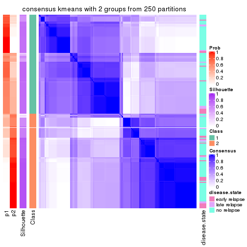</p>

</div>
<div id='tab-MAD-kmeans-consensus-heatmap-2'>
<pre><code class="r">consensus_heatmap(res, k = 3)
</code></pre>

<p>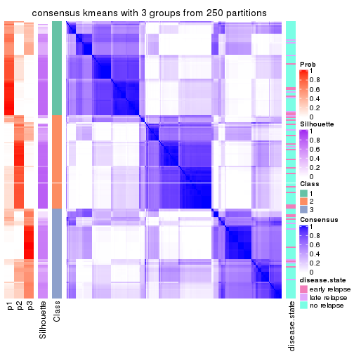</p>

</div>
<div id='tab-MAD-kmeans-consensus-heatmap-3'>
<pre><code class="r">consensus_heatmap(res, k = 4)
</code></pre>

<p>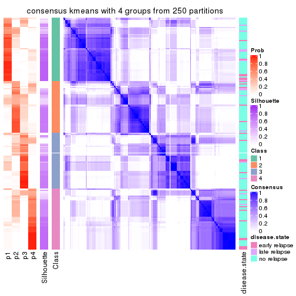</p>

</div>
<div id='tab-MAD-kmeans-consensus-heatmap-4'>
<pre><code class="r">consensus_heatmap(res, k = 5)
</code></pre>

<p>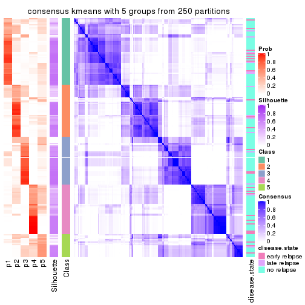</p>

</div>
<div id='tab-MAD-kmeans-consensus-heatmap-5'>
<pre><code class="r">consensus_heatmap(res, k = 6)
</code></pre>

<p>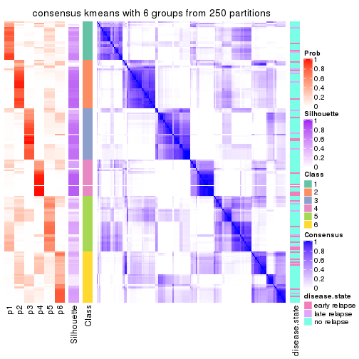</p>

</div>
</div>

Heatmaps for the membership of samples in all partitions to see how consistent they are:


<script>
$( function() {
	$( '#tabs-MAD-kmeans-membership-heatmap' ).tabs();
} );
</script>
<div id='tabs-MAD-kmeans-membership-heatmap'>
<ul>
<li><a href='#tab-MAD-kmeans-membership-heatmap-1'>k = 2</a></li>
<li><a href='#tab-MAD-kmeans-membership-heatmap-2'>k = 3</a></li>
<li><a href='#tab-MAD-kmeans-membership-heatmap-3'>k = 4</a></li>
<li><a href='#tab-MAD-kmeans-membership-heatmap-4'>k = 5</a></li>
<li><a href='#tab-MAD-kmeans-membership-heatmap-5'>k = 6</a></li>
</ul>
<div id='tab-MAD-kmeans-membership-heatmap-1'>
<pre><code class="r">membership_heatmap(res, k = 2)
</code></pre>

<p>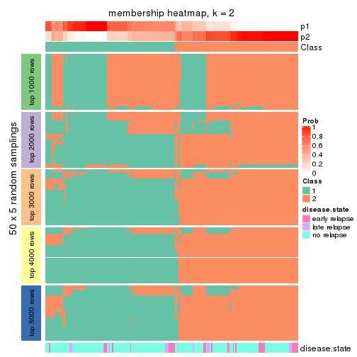</p>

</div>
<div id='tab-MAD-kmeans-membership-heatmap-2'>
<pre><code class="r">membership_heatmap(res, k = 3)
</code></pre>

<p>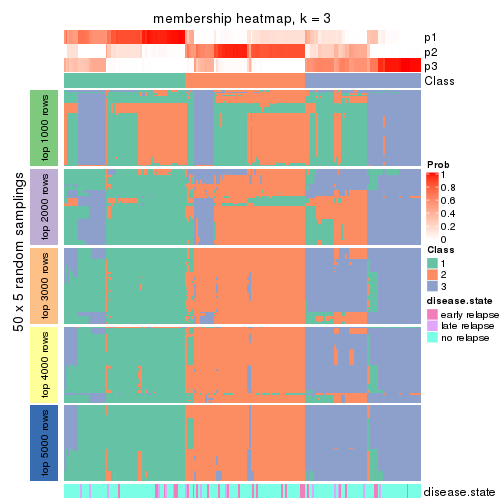</p>

</div>
<div id='tab-MAD-kmeans-membership-heatmap-3'>
<pre><code class="r">membership_heatmap(res, k = 4)
</code></pre>

<p>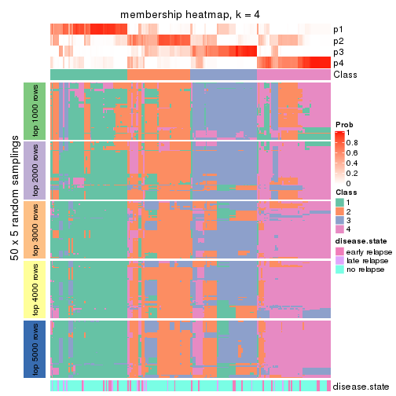</p>

</div>
<div id='tab-MAD-kmeans-membership-heatmap-4'>
<pre><code class="r">membership_heatmap(res, k = 5)
</code></pre>

<p>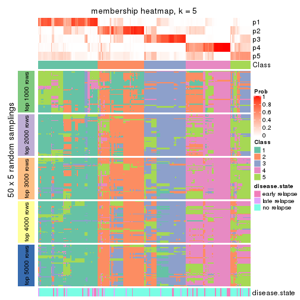</p>

</div>
<div id='tab-MAD-kmeans-membership-heatmap-5'>
<pre><code class="r">membership_heatmap(res, k = 6)
</code></pre>

<p>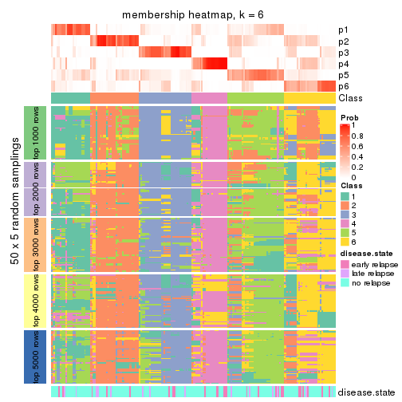</p>

</div>
</div>

As soon as we have had the classes for columns, we can look for signatures
which are significantly different between classes which can be candidate marks
for certain classes. Following are the heatmaps for signatures.


Signature heatmaps where rows are scaled:


<script>
$( function() {
	$( '#tabs-MAD-kmeans-get-signatures' ).tabs();
} );
</script>
<div id='tabs-MAD-kmeans-get-signatures'>
<ul>
<li><a href='#tab-MAD-kmeans-get-signatures-1'>k = 2</a></li>
<li><a href='#tab-MAD-kmeans-get-signatures-2'>k = 3</a></li>
<li><a href='#tab-MAD-kmeans-get-signatures-3'>k = 4</a></li>
<li><a href='#tab-MAD-kmeans-get-signatures-4'>k = 5</a></li>
<li><a href='#tab-MAD-kmeans-get-signatures-5'>k = 6</a></li>
</ul>
<div id='tab-MAD-kmeans-get-signatures-1'>
<pre><code class="r">get_signatures(res, k = 2)
</code></pre>

<p>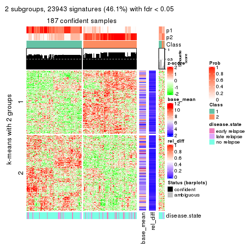</p>

</div>
<div id='tab-MAD-kmeans-get-signatures-2'>
<pre><code class="r">get_signatures(res, k = 3)
</code></pre>

<p>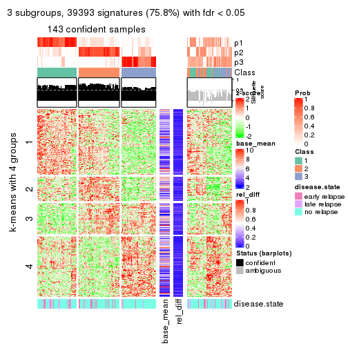</p>

</div>
<div id='tab-MAD-kmeans-get-signatures-3'>
<pre><code class="r">get_signatures(res, k = 4)
</code></pre>

<p>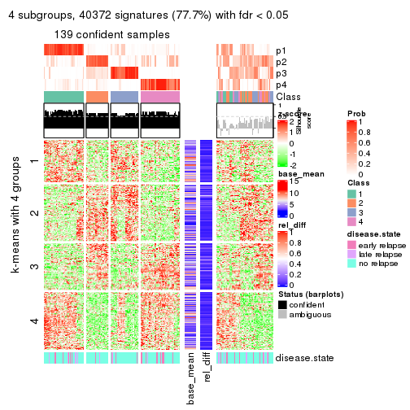</p>

</div>
<div id='tab-MAD-kmeans-get-signatures-4'>
<pre><code class="r">get_signatures(res, k = 5)
</code></pre>

<p>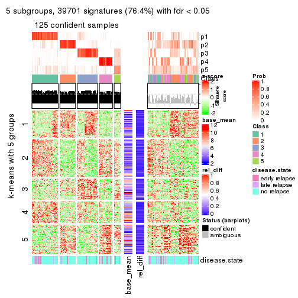</p>

</div>
<div id='tab-MAD-kmeans-get-signatures-5'>
<pre><code class="r">get_signatures(res, k = 6)
</code></pre>

<p>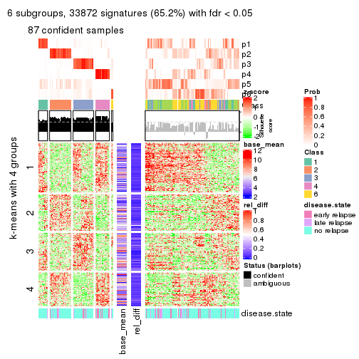</p>

</div>
</div>


Signature heatmaps where rows are not scaled:


<script>
$( function() {
	$( '#tabs-MAD-kmeans-get-signatures-no-scale' ).tabs();
} );
</script>
<div id='tabs-MAD-kmeans-get-signatures-no-scale'>
<ul>
<li><a href='#tab-MAD-kmeans-get-signatures-no-scale-1'>k = 2</a></li>
<li><a href='#tab-MAD-kmeans-get-signatures-no-scale-2'>k = 3</a></li>
<li><a href='#tab-MAD-kmeans-get-signatures-no-scale-3'>k = 4</a></li>
<li><a href='#tab-MAD-kmeans-get-signatures-no-scale-4'>k = 5</a></li>
<li><a href='#tab-MAD-kmeans-get-signatures-no-scale-5'>k = 6</a></li>
</ul>
<div id='tab-MAD-kmeans-get-signatures-no-scale-1'>
<pre><code class="r">get_signatures(res, k = 2, scale_rows = FALSE)
</code></pre>

<p>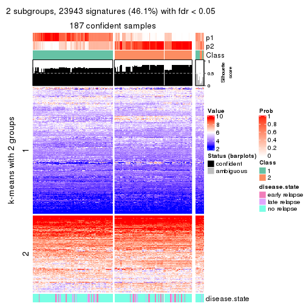</p>

</div>
<div id='tab-MAD-kmeans-get-signatures-no-scale-2'>
<pre><code class="r">get_signatures(res, k = 3, scale_rows = FALSE)
</code></pre>

<p>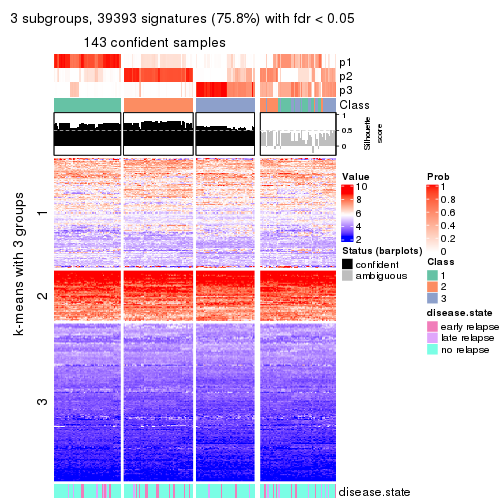</p>

</div>
<div id='tab-MAD-kmeans-get-signatures-no-scale-3'>
<pre><code class="r">get_signatures(res, k = 4, scale_rows = FALSE)
</code></pre>

<p>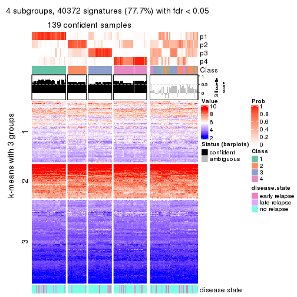</p>

</div>
<div id='tab-MAD-kmeans-get-signatures-no-scale-4'>
<pre><code class="r">get_signatures(res, k = 5, scale_rows = FALSE)
</code></pre>

<p>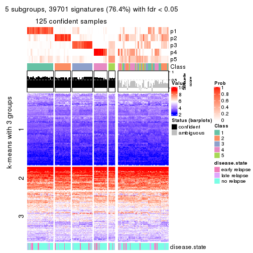</p>

</div>
<div id='tab-MAD-kmeans-get-signatures-no-scale-5'>
<pre><code class="r">get_signatures(res, k = 6, scale_rows = FALSE)
</code></pre>

<p>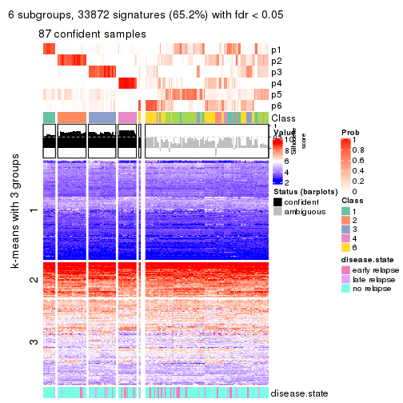</p>

</div>
</div>


Compare the overlap of signatures from different k:

```r
compare_signatures(res)
```

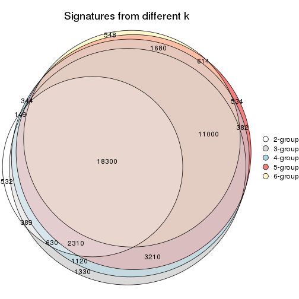

`get_signature()` returns a data frame invisibly. TO get the list of signatures, the function
call should be assigned to a variable explicitly. In following code, if `plot` argument is set
to `FALSE`, no heatmap is plotted while only the differential analysis is performed.

```r
# code only for demonstration
tb = get_signature(res, k = ..., plot = FALSE)
```

An example of the output of `tb` is:

```
#>   which_row         fdr    mean_1    mean_2 scaled_mean_1 scaled_mean_2 km
#> 1        38 0.042760348  8.373488  9.131774    -0.5533452     0.5164555  1
#> 2        40 0.018707592  7.106213  8.469186    -0.6173731     0.5762149  1
#> 3        55 0.019134737 10.221463 11.207825    -0.6159697     0.5749050  1
#> 4        59 0.006059896  5.921854  7.869574    -0.6899429     0.6439467  1
#> 5        60 0.018055526  8.928898 10.211722    -0.6204761     0.5791110  1
#> 6        98 0.009384629 15.714769 14.887706     0.6635654    -0.6193277  2
...
```

The columns in `tb` are:

1. `which_row`: row indices corresponding to the input matrix.
2. `fdr`: FDR for the differential test. 
3. `mean_x`: The mean value in group x.
4. `scaled_mean_x`: The mean value in group x after rows are scaled.
5. `km`: Row groups if k-means clustering is applied to rows.


UMAP plot which shows how samples are separated.


<script>
$( function() {
	$( '#tabs-MAD-kmeans-dimension-reduction' ).tabs();
} );
</script>
<div id='tabs-MAD-kmeans-dimension-reduction'>
<ul>
<li><a href='#tab-MAD-kmeans-dimension-reduction-1'>k = 2</a></li>
<li><a href='#tab-MAD-kmeans-dimension-reduction-2'>k = 3</a></li>
<li><a href='#tab-MAD-kmeans-dimension-reduction-3'>k = 4</a></li>
<li><a href='#tab-MAD-kmeans-dimension-reduction-4'>k = 5</a></li>
<li><a href='#tab-MAD-kmeans-dimension-reduction-5'>k = 6</a></li>
</ul>
<div id='tab-MAD-kmeans-dimension-reduction-1'>
<pre><code class="r">dimension_reduction(res, k = 2, method = &quot;UMAP&quot;)
</code></pre>

<p>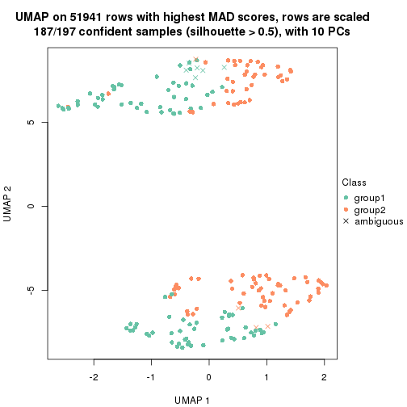</p>

</div>
<div id='tab-MAD-kmeans-dimension-reduction-2'>
<pre><code class="r">dimension_reduction(res, k = 3, method = &quot;UMAP&quot;)
</code></pre>

<p>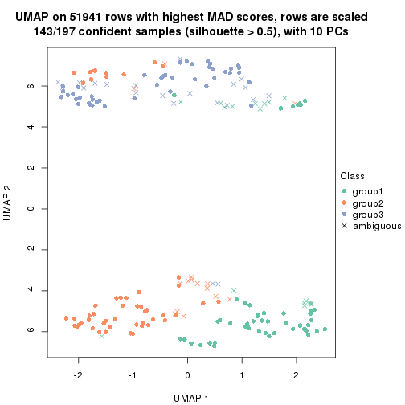</p>

</div>
<div id='tab-MAD-kmeans-dimension-reduction-3'>
<pre><code class="r">dimension_reduction(res, k = 4, method = &quot;UMAP&quot;)
</code></pre>

<p>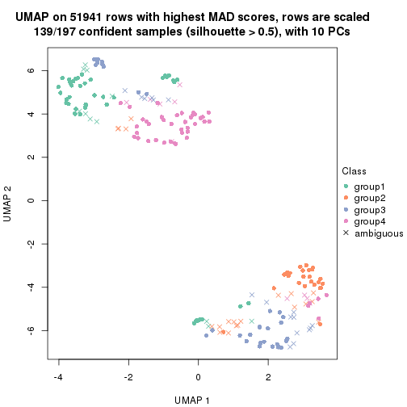</p>

</div>
<div id='tab-MAD-kmeans-dimension-reduction-4'>
<pre><code class="r">dimension_reduction(res, k = 5, method = &quot;UMAP&quot;)
</code></pre>

<p>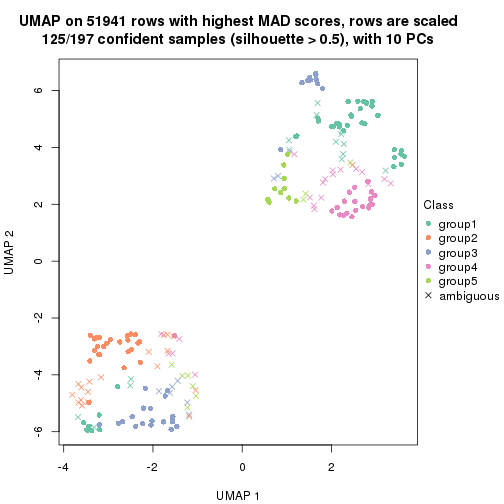</p>

</div>
<div id='tab-MAD-kmeans-dimension-reduction-5'>
<pre><code class="r">dimension_reduction(res, k = 6, method = &quot;UMAP&quot;)
</code></pre>

<p>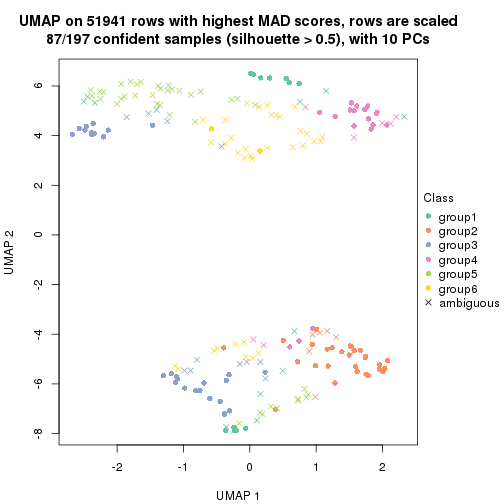</p>

</div>
</div>


Following heatmap shows how subgroups are split when increasing `k`:

```r
collect_classes(res)
```

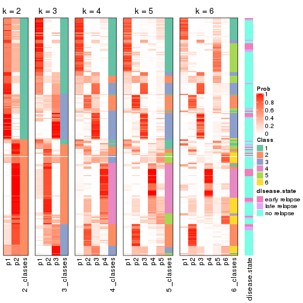


Test correlation between subgroups and known annotations. If the known
annotation is numeric, one-way ANOVA test is applied, and if the known
annotation is discrete, chi-squared contingency table test is applied.

```r
test_to_known_factors(res)
```

```
#>              n disease.state(p) k
#> MAD:kmeans 187           0.3973 2
#> MAD:kmeans 143           0.0632 3
#> MAD:kmeans 139           0.2853 4
#> MAD:kmeans 125           0.6589 5
#> MAD:kmeans  87           0.0245 6
```


If matrix rows can be associated to genes, consider to use `functional_enrichment(res,
...)` to perform function enrichment for the signature genes. See [this vignette](http://bioconductor.org/packages/devel/bioc/vignettes/cola/inst/doc/functional_enrichment.html) for more detailed explanations.


 

---------------------------------------------------


### MAD:skmeans


The object with results only for a single top-value method and a single partition method 
can be extracted as:

```r
res = res_list["MAD", "skmeans"]
# you can also extract it by
# res = res_list["MAD:skmeans"]
```

A summary of `res` and all the functions that can be applied to it:

```r
res
```

```
#> A 'ConsensusPartition' object with k = 2, 3, 4, 5, 6.
#>   On a matrix with 51941 rows and 197 columns.
#>   Top rows (1000, 2000, 3000, 4000, 5000) are extracted by 'MAD' method.
#>   Subgroups are detected by 'skmeans' method.
#>   Performed in total 1250 partitions by row resampling.
#>   Best k for subgroups seems to be 2.
#> 
#> Following methods can be applied to this 'ConsensusPartition' object:
#>  [1] "cola_report"             "collect_classes"         "collect_plots"          
#>  [4] "collect_stats"           "colnames"                "compare_signatures"     
#>  [7] "consensus_heatmap"       "dimension_reduction"     "functional_enrichment"  
#> [10] "get_anno_col"            "get_anno"                "get_classes"            
#> [13] "get_consensus"           "get_matrix"              "get_membership"         
#> [16] "get_param"               "get_signatures"          "get_stats"              
#> [19] "is_best_k"               "is_stable_k"             "membership_heatmap"     
#> [22] "ncol"                    "nrow"                    "plot_ecdf"              
#> [25] "rownames"                "select_partition_number" "show"                   
#> [28] "suggest_best_k"          "test_to_known_factors"
```

`collect_plots()` function collects all the plots made from `res` for all `k` (number of partitions)
into one single page to provide an easy and fast comparison between different `k`.

```r
collect_plots(res)
```

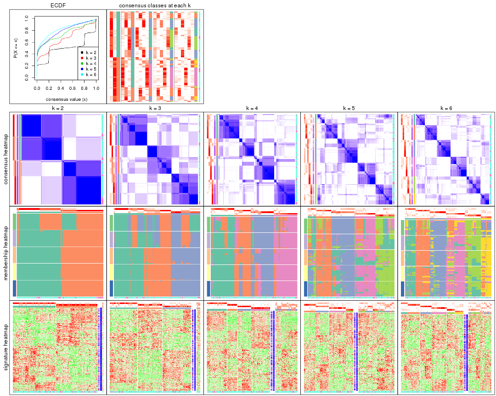

The plots are:

- The first row: a plot of the ECDF (empirical cumulative distribution
  function) curves of the consensus matrix for each `k` and the heatmap of
  predicted classes for each `k`.
- The second row: heatmaps of the consensus matrix for each `k`.
- The third row: heatmaps of the membership matrix for each `k`.
- The fouth row: heatmaps of the signatures for each `k`.

All the plots in panels can be made by individual functions and they are
plotted later in this section.

`select_partition_number()` produces several plots showing different
statistics for choosing "optimized" `k`. There are following statistics:

- ECDF curves of the consensus matrix for each `k`;
- 1-PAC. [The PAC
  score](https://en.wikipedia.org/wiki/Consensus_clustering#Over-interpretation_potential_of_consensus_clustering)
  measures the proportion of the ambiguous subgrouping.
- Mean silhouette score.
- Concordance. The mean probability of fiting the consensus class ids in all
  partitions.
- Area increased. Denote $A_k$ as the area under the ECDF curve for current
  `k`, the area increased is defined as $A_k - A_{k-1}$.
- Rand index. The percent of pairs of samples that are both in a same cluster
  or both are not in a same cluster in the partition of k and k-1.
- Jaccard index. The ratio of pairs of samples are both in a same cluster in
  the partition of k and k-1 and the pairs of samples are both in a same
  cluster in the partition k or k-1.

The detailed explanations of these statistics can be found in [the _cola_
vignette](http://bioconductor.org/packages/devel/bioc/vignettes/cola/inst/doc/cola.html#toc_13).

Generally speaking, lower PAC score, higher mean silhouette score or higher
concordance corresponds to better partition. Rand index and Jaccard index
measure how similar the current partition is compared to partition with `k-1`.
If they are too similar, we won't accept `k` is better than `k-1`.

```r
select_partition_number(res)
```

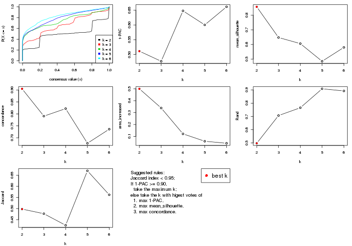

The numeric values for all these statistics can be obtained by `get_stats()`.

```r
get_stats(res)
```

```
#>   k 1-PAC mean_silhouette concordance area_increased  Rand Jaccard
#> 2 2 0.511           0.857       0.905         0.4998 0.498   0.498
#> 3 3 0.477           0.647       0.791         0.3387 0.707   0.477
#> 4 4 0.648           0.606       0.822         0.1214 0.765   0.425
#> 5 5 0.600           0.485       0.677         0.0594 0.908   0.670
#> 6 6 0.662           0.580       0.736         0.0424 0.892   0.562
```

`suggest_best_k()` suggests the best $k$ based on these statistics. The rules are as follows:

- All $k$ with Jaccard index larger than 0.95 are removed because increasing
  $k$ does not provide enough extra information. If all $k$ are removed, it is
  marked as no subgroup is detected.
- For all $k$ with 1-PAC score larger than 0.9, the maximal $k$ is taken as
  the best $k$, and other $k$ are marked as optional $k$.
- If it does not fit the second rule. The $k$ with the maximal vote of the
  highest 1-PAC score, highest mean silhouette, and highest concordance is
  taken as the best $k$.

```r
suggest_best_k(res)
```

```
#> [1] 2
```


Following shows the table of the partitions (You need to click the **show/hide
code output** link to see it). The membership matrix (columns with name `p*`)
is inferred by
[`clue::cl_consensus()`](https://www.rdocumentation.org/link/cl_consensus?package=clue)
function with the `SE` method. Basically the value in the membership matrix
represents the probability to belong to a certain group. The finall class
label for an item is determined with the group with highest probability it
belongs to.

In `get_classes()` function, the entropy is calculated from the membership
matrix and the silhouette score is calculated from the consensus matrix.


<script>
$( function() {
	$( '#tabs-MAD-skmeans-get-classes' ).tabs();
} );
</script>
<div id='tabs-MAD-skmeans-get-classes'>
<ul>
<li><a href='#tab-MAD-skmeans-get-classes-1'>k = 2</a></li>
<li><a href='#tab-MAD-skmeans-get-classes-2'>k = 3</a></li>
<li><a href='#tab-MAD-skmeans-get-classes-3'>k = 4</a></li>
<li><a href='#tab-MAD-skmeans-get-classes-4'>k = 5</a></li>
<li><a href='#tab-MAD-skmeans-get-classes-5'>k = 6</a></li>
</ul>

<div id='tab-MAD-skmeans-get-classes-1'>
<p><a id='tab-MAD-skmeans-get-classes-1-a' style='color:#0366d6' href='#'>show/hide code output</a></p>
<pre><code class="r">cbind(get_classes(res, k = 2), get_membership(res, k = 2))
</code></pre>

<pre><code>#&gt;           class entropy silhouette    p1    p2
#&gt; GSM342319     1  0.7219      0.864 0.800 0.200
#&gt; GSM342323     2  0.0000      0.906 0.000 1.000
#&gt; GSM342325     1  0.7219      0.864 0.800 0.200
#&gt; GSM342326     2  0.0000      0.906 0.000 1.000
#&gt; GSM342327     2  0.0000      0.906 0.000 1.000
#&gt; GSM342329     2  0.0000      0.906 0.000 1.000
#&gt; GSM342331     2  0.0000      0.906 0.000 1.000
#&gt; GSM342334     2  0.0000      0.906 0.000 1.000
#&gt; GSM342335     2  0.0000      0.906 0.000 1.000
#&gt; GSM342354     2  0.7219      0.819 0.200 0.800
#&gt; GSM342371     2  0.0000      0.906 0.000 1.000
#&gt; GSM342380     1  0.7219      0.864 0.800 0.200
#&gt; GSM342382     1  0.7219      0.864 0.800 0.200
#&gt; GSM342399     1  0.7219      0.864 0.800 0.200
#&gt; GSM342402     1  0.6531      0.865 0.832 0.168
#&gt; GSM342404     2  0.0000      0.906 0.000 1.000
#&gt; GSM342408     2  0.7219      0.819 0.200 0.800
#&gt; GSM342409     2  0.7139      0.821 0.196 0.804
#&gt; GSM342426     2  0.0000      0.906 0.000 1.000
#&gt; GSM342441     1  0.0000      0.865 1.000 0.000
#&gt; GSM342444     1  0.0000      0.865 1.000 0.000
#&gt; GSM342451     1  0.0000      0.865 1.000 0.000
#&gt; GSM342462     2  0.0000      0.906 0.000 1.000
#&gt; GSM342467     2  0.0000      0.906 0.000 1.000
#&gt; GSM342484     1  0.0000      0.865 1.000 0.000
#&gt; GSM342491     2  0.7376      0.813 0.208 0.792
#&gt; GSM342322     1  0.7219      0.864 0.800 0.200
#&gt; GSM342338     1  0.0000      0.865 1.000 0.000
#&gt; GSM342347     2  0.7219      0.819 0.200 0.800
#&gt; GSM342356     1  0.0000      0.865 1.000 0.000
#&gt; GSM342357     1  0.6887      0.865 0.816 0.184
#&gt; GSM342366     2  0.6048      0.736 0.148 0.852
#&gt; GSM342385     1  0.7219      0.864 0.800 0.200
#&gt; GSM342421     2  0.0000      0.906 0.000 1.000
#&gt; GSM342437     2  0.0000      0.906 0.000 1.000
#&gt; GSM342454     1  0.0000      0.865 1.000 0.000
#&gt; GSM342471     2  0.0000      0.906 0.000 1.000
#&gt; GSM342477     2  0.0000      0.906 0.000 1.000
#&gt; GSM342495     2  0.0000      0.906 0.000 1.000
#&gt; GSM342496     1  0.0000      0.865 1.000 0.000
#&gt; GSM342320     2  0.0000      0.906 0.000 1.000
#&gt; GSM342321     2  0.0000      0.906 0.000 1.000
#&gt; GSM342324     2  0.0000      0.906 0.000 1.000
#&gt; GSM342328     2  0.0000      0.906 0.000 1.000
#&gt; GSM342330     2  0.0000      0.906 0.000 1.000
#&gt; GSM342332     2  0.0000      0.906 0.000 1.000
#&gt; GSM342333     2  0.0672      0.903 0.008 0.992
#&gt; GSM342336     2  0.0000      0.906 0.000 1.000
#&gt; GSM342337     1  0.0000      0.865 1.000 0.000
#&gt; GSM342339     1  0.0000      0.865 1.000 0.000
#&gt; GSM342340     1  0.0000      0.865 1.000 0.000
#&gt; GSM342341     1  0.0000      0.865 1.000 0.000
#&gt; GSM342342     1  0.0000      0.865 1.000 0.000
#&gt; GSM342343     1  0.0000      0.865 1.000 0.000
#&gt; GSM342344     2  0.9896      0.455 0.440 0.560
#&gt; GSM342345     1  0.0000      0.865 1.000 0.000
#&gt; GSM342346     2  0.3114      0.884 0.056 0.944
#&gt; GSM342348     1  0.7219      0.632 0.800 0.200
#&gt; GSM342349     2  0.7219      0.819 0.200 0.800
#&gt; GSM342350     2  0.7219      0.819 0.200 0.800
#&gt; GSM342351     2  0.7219      0.819 0.200 0.800
#&gt; GSM342352     2  0.7219      0.819 0.200 0.800
#&gt; GSM342353     1  0.8386      0.491 0.732 0.268
#&gt; GSM342355     1  0.0000      0.865 1.000 0.000
#&gt; GSM342358     2  0.1414      0.899 0.020 0.980
#&gt; GSM342359     2  0.7219      0.819 0.200 0.800
#&gt; GSM342360     2  0.7219      0.819 0.200 0.800
#&gt; GSM342361     2  0.7219      0.819 0.200 0.800
#&gt; GSM342362     2  0.1184      0.894 0.016 0.984
#&gt; GSM342363     1  0.7219      0.864 0.800 0.200
#&gt; GSM342364     1  0.7376      0.858 0.792 0.208
#&gt; GSM342365     2  0.0000      0.906 0.000 1.000
#&gt; GSM342367     1  0.7219      0.864 0.800 0.200
#&gt; GSM342368     1  0.7219      0.864 0.800 0.200
#&gt; GSM342369     2  0.0000      0.906 0.000 1.000
#&gt; GSM342370     2  0.0000      0.906 0.000 1.000
#&gt; GSM342372     2  0.0000      0.906 0.000 1.000
#&gt; GSM342373     2  0.0000      0.906 0.000 1.000
#&gt; GSM342374     2  0.0000      0.906 0.000 1.000
#&gt; GSM342375     2  0.0000      0.906 0.000 1.000
#&gt; GSM342376     1  0.7219      0.864 0.800 0.200
#&gt; GSM342377     1  0.7219      0.864 0.800 0.200
#&gt; GSM342378     1  0.7219      0.864 0.800 0.200
#&gt; GSM342379     1  0.7219      0.864 0.800 0.200
#&gt; GSM342381     1  0.7219      0.864 0.800 0.200
#&gt; GSM342383     1  0.7219      0.864 0.800 0.200
#&gt; GSM342384     1  0.7219      0.864 0.800 0.200
#&gt; GSM342386     1  0.7219      0.864 0.800 0.200
#&gt; GSM342387     2  0.0000      0.906 0.000 1.000
#&gt; GSM342388     1  0.0000      0.865 1.000 0.000
#&gt; GSM342389     1  0.7219      0.864 0.800 0.200
#&gt; GSM342390     1  0.0000      0.865 1.000 0.000
#&gt; GSM342391     1  0.3431      0.866 0.936 0.064
#&gt; GSM342392     1  0.0000      0.865 1.000 0.000
#&gt; GSM342393     2  0.0000      0.906 0.000 1.000
#&gt; GSM342394     1  0.7219      0.864 0.800 0.200
#&gt; GSM342395     2  0.5946      0.742 0.144 0.856
#&gt; GSM342396     1  0.0000      0.865 1.000 0.000
#&gt; GSM342397     2  0.7219      0.819 0.200 0.800
#&gt; GSM342398     1  0.7219      0.864 0.800 0.200
#&gt; GSM342400     1  0.7219      0.864 0.800 0.200
#&gt; GSM342401     1  0.0000      0.865 1.000 0.000
#&gt; GSM342403     1  0.0000      0.865 1.000 0.000
#&gt; GSM342405     2  0.7219      0.819 0.200 0.800
#&gt; GSM342406     1  0.0000      0.865 1.000 0.000
#&gt; GSM342407     2  0.7219      0.819 0.200 0.800
#&gt; GSM342410     1  0.0000      0.865 1.000 0.000
#&gt; GSM342411     2  0.0000      0.906 0.000 1.000
#&gt; GSM342412     2  0.0000      0.906 0.000 1.000
#&gt; GSM342413     2  0.7219      0.819 0.200 0.800
#&gt; GSM342414     2  0.7219      0.819 0.200 0.800
#&gt; GSM342415     2  0.0000      0.906 0.000 1.000
#&gt; GSM342416     2  0.9710      0.544 0.400 0.600
#&gt; GSM342417     2  0.0000      0.906 0.000 1.000
#&gt; GSM342418     2  0.0000      0.906 0.000 1.000
#&gt; GSM342419     1  0.7219      0.864 0.800 0.200
#&gt; GSM342420     2  0.0000      0.906 0.000 1.000
#&gt; GSM342422     1  0.7219      0.864 0.800 0.200
#&gt; GSM342423     2  0.0000      0.906 0.000 1.000
#&gt; GSM342424     2  0.0000      0.906 0.000 1.000
#&gt; GSM342425     2  0.0000      0.906 0.000 1.000
#&gt; GSM342427     2  0.0000      0.906 0.000 1.000
#&gt; GSM342428     2  0.0000      0.906 0.000 1.000
#&gt; GSM342429     1  0.8661      0.771 0.712 0.288
#&gt; GSM342430     1  0.0000      0.865 1.000 0.000
#&gt; GSM342431     1  0.0000      0.865 1.000 0.000
#&gt; GSM342432     1  0.0000      0.865 1.000 0.000
#&gt; GSM342433     2  0.7219      0.819 0.200 0.800
#&gt; GSM342434     2  0.7219      0.819 0.200 0.800
#&gt; GSM342435     2  0.7219      0.819 0.200 0.800
#&gt; GSM342436     1  0.0000      0.865 1.000 0.000
#&gt; GSM342438     1  0.0000      0.865 1.000 0.000
#&gt; GSM342439     1  0.0000      0.865 1.000 0.000
#&gt; GSM342440     1  0.0000      0.865 1.000 0.000
#&gt; GSM342442     1  0.0000      0.865 1.000 0.000
#&gt; GSM342443     2  0.0000      0.906 0.000 1.000
#&gt; GSM342445     1  0.0000      0.865 1.000 0.000
#&gt; GSM342446     1  0.0000      0.865 1.000 0.000
#&gt; GSM342447     1  0.0000      0.865 1.000 0.000
#&gt; GSM342448     2  0.7219      0.819 0.200 0.800
#&gt; GSM342449     1  0.0000      0.865 1.000 0.000
#&gt; GSM342450     2  0.7219      0.819 0.200 0.800
#&gt; GSM342452     1  0.0000      0.865 1.000 0.000
#&gt; GSM342453     1  0.0000      0.865 1.000 0.000
#&gt; GSM342455     1  0.0000      0.865 1.000 0.000
#&gt; GSM342456     2  0.7219      0.819 0.200 0.800
#&gt; GSM342457     1  0.7219      0.864 0.800 0.200
#&gt; GSM342458     2  0.0000      0.906 0.000 1.000
#&gt; GSM342459     2  0.0000      0.906 0.000 1.000
#&gt; GSM342460     2  0.0000      0.906 0.000 1.000
#&gt; GSM342461     1  0.7376      0.858 0.792 0.208
#&gt; GSM342463     1  0.7219      0.864 0.800 0.200
#&gt; GSM342464     1  0.7219      0.864 0.800 0.200
#&gt; GSM342465     1  0.7219      0.864 0.800 0.200
#&gt; GSM342466     1  0.0000      0.865 1.000 0.000
#&gt; GSM342468     2  0.0000      0.906 0.000 1.000
#&gt; GSM342469     1  0.7219      0.864 0.800 0.200
#&gt; GSM342470     2  0.7219      0.819 0.200 0.800
#&gt; GSM342472     2  0.7219      0.819 0.200 0.800
#&gt; GSM342473     1  0.7674      0.844 0.776 0.224
#&gt; GSM342474     1  0.7674      0.844 0.776 0.224
#&gt; GSM342475     1  0.0000      0.865 1.000 0.000
#&gt; GSM342476     2  0.0000      0.906 0.000 1.000
#&gt; GSM342478     1  0.9710      0.578 0.600 0.400
#&gt; GSM342479     1  0.7376      0.858 0.792 0.208
#&gt; GSM342480     2  0.0000      0.906 0.000 1.000
#&gt; GSM342481     1  0.7219      0.864 0.800 0.200
#&gt; GSM342482     2  0.0000      0.906 0.000 1.000
#&gt; GSM342483     1  0.9427      0.657 0.640 0.360
#&gt; GSM342485     1  0.7219      0.864 0.800 0.200
#&gt; GSM342486     1  0.7219      0.864 0.800 0.200
#&gt; GSM342487     2  0.7219      0.819 0.200 0.800
#&gt; GSM342488     2  0.0000      0.906 0.000 1.000
#&gt; GSM342489     2  0.0000      0.906 0.000 1.000
#&gt; GSM342490     2  0.0000      0.906 0.000 1.000
#&gt; GSM342492     2  0.7219      0.819 0.200 0.800
#&gt; GSM342493     1  0.7219      0.864 0.800 0.200
#&gt; GSM342494     2  0.0000      0.906 0.000 1.000
#&gt; GSM342497     2  0.0000      0.906 0.000 1.000
#&gt; GSM342498     1  0.7219      0.864 0.800 0.200
#&gt; GSM342499     1  0.7219      0.864 0.800 0.200
#&gt; GSM342500     2  0.0000      0.906 0.000 1.000
#&gt; GSM342501     1  0.7219      0.864 0.800 0.200
#&gt; GSM342502     1  0.7219      0.864 0.800 0.200
#&gt; GSM342503     1  0.7602      0.848 0.780 0.220
#&gt; GSM342504     2  0.8207      0.526 0.256 0.744
#&gt; GSM342505     1  0.0000      0.865 1.000 0.000
#&gt; GSM342506     1  0.0000      0.865 1.000 0.000
#&gt; GSM342507     1  0.0000      0.865 1.000 0.000
#&gt; GSM342508     1  0.0000      0.865 1.000 0.000
#&gt; GSM342509     1  0.0000      0.865 1.000 0.000
#&gt; GSM342510     2  0.7219      0.819 0.200 0.800
#&gt; GSM342511     2  0.7219      0.819 0.200 0.800
#&gt; GSM342512     1  0.7219      0.864 0.800 0.200
#&gt; GSM342513     1  0.7219      0.864 0.800 0.200
#&gt; GSM342514     2  0.7219      0.819 0.200 0.800
#&gt; GSM342515     1  0.7219      0.864 0.800 0.200
</code></pre>

<script>
$('#tab-MAD-skmeans-get-classes-1-a').parent().next().next().hide();
$('#tab-MAD-skmeans-get-classes-1-a').click(function(){
  $('#tab-MAD-skmeans-get-classes-1-a').parent().next().next().toggle();
  return(false);
});
</script>
</div>

<div id='tab-MAD-skmeans-get-classes-2'>
<p><a id='tab-MAD-skmeans-get-classes-2-a' style='color:#0366d6' href='#'>show/hide code output</a></p>
<pre><code class="r">cbind(get_classes(res, k = 3), get_membership(res, k = 3))
</code></pre>

<pre><code>#&gt;           class entropy silhouette    p1    p2    p3
#&gt; GSM342319     3  0.4702      0.738 0.212 0.000 0.788
#&gt; GSM342323     1  0.0000      0.775 1.000 0.000 0.000
#&gt; GSM342325     3  0.4702      0.738 0.212 0.000 0.788
#&gt; GSM342326     1  0.0000      0.775 1.000 0.000 0.000
#&gt; GSM342327     1  0.0000      0.775 1.000 0.000 0.000
#&gt; GSM342329     1  0.0000      0.775 1.000 0.000 0.000
#&gt; GSM342331     1  0.0000      0.775 1.000 0.000 0.000
#&gt; GSM342334     1  0.0000      0.775 1.000 0.000 0.000
#&gt; GSM342335     1  0.4702      0.694 0.788 0.000 0.212
#&gt; GSM342354     1  0.6126      0.507 0.600 0.400 0.000
#&gt; GSM342371     1  0.6168      0.547 0.588 0.000 0.412
#&gt; GSM342380     3  0.4702      0.738 0.212 0.000 0.788
#&gt; GSM342382     3  0.0000      0.711 0.000 0.000 1.000
#&gt; GSM342399     3  0.4702      0.738 0.212 0.000 0.788
#&gt; GSM342402     3  0.4702      0.738 0.212 0.000 0.788
#&gt; GSM342404     1  0.4702      0.694 0.788 0.000 0.212
#&gt; GSM342408     1  0.5138      0.639 0.748 0.252 0.000
#&gt; GSM342409     1  0.7975      0.637 0.660 0.160 0.180
#&gt; GSM342426     1  0.0747      0.765 0.984 0.016 0.000
#&gt; GSM342441     2  0.0000      0.676 0.000 1.000 0.000
#&gt; GSM342444     3  0.6260      0.540 0.000 0.448 0.552
#&gt; GSM342451     3  0.6260      0.540 0.000 0.448 0.552
#&gt; GSM342462     2  0.8638      0.631 0.184 0.600 0.216
#&gt; GSM342467     1  0.5268      0.685 0.776 0.012 0.212
#&gt; GSM342484     2  0.8466      0.537 0.212 0.616 0.172
#&gt; GSM342491     2  0.6126      0.523 0.400 0.600 0.000
#&gt; GSM342322     3  0.4702      0.738 0.212 0.000 0.788
#&gt; GSM342338     3  0.6126      0.589 0.000 0.400 0.600
#&gt; GSM342347     1  0.6126      0.507 0.600 0.400 0.000
#&gt; GSM342356     3  0.6008      0.612 0.000 0.372 0.628
#&gt; GSM342357     3  0.4702      0.738 0.212 0.000 0.788
#&gt; GSM342366     3  0.1411      0.694 0.036 0.000 0.964
#&gt; GSM342385     3  0.4702      0.738 0.212 0.000 0.788
#&gt; GSM342421     1  0.4702      0.694 0.788 0.000 0.212
#&gt; GSM342437     2  0.6154      0.514 0.408 0.592 0.000
#&gt; GSM342454     2  0.0592      0.666 0.000 0.988 0.012
#&gt; GSM342471     1  0.4796      0.571 0.780 0.000 0.220
#&gt; GSM342477     2  0.6204      0.492 0.424 0.576 0.000
#&gt; GSM342495     2  0.8726      0.623 0.196 0.592 0.212
#&gt; GSM342496     2  0.4605      0.619 0.000 0.796 0.204
#&gt; GSM342320     1  0.0000      0.775 1.000 0.000 0.000
#&gt; GSM342321     1  0.0000      0.775 1.000 0.000 0.000
#&gt; GSM342324     1  0.0000      0.775 1.000 0.000 0.000
#&gt; GSM342328     1  0.0000      0.775 1.000 0.000 0.000
#&gt; GSM342330     1  0.0000      0.775 1.000 0.000 0.000
#&gt; GSM342332     1  0.0000      0.775 1.000 0.000 0.000
#&gt; GSM342333     1  0.4702      0.694 0.788 0.000 0.212
#&gt; GSM342336     1  0.0000      0.775 1.000 0.000 0.000
#&gt; GSM342337     3  0.6008      0.612 0.000 0.372 0.628
#&gt; GSM342339     3  0.6154      0.584 0.000 0.408 0.592
#&gt; GSM342340     3  0.6095      0.596 0.000 0.392 0.608
#&gt; GSM342341     3  0.6154      0.584 0.000 0.408 0.592
#&gt; GSM342342     3  0.6154      0.584 0.000 0.408 0.592
#&gt; GSM342343     3  0.6008      0.612 0.000 0.372 0.628
#&gt; GSM342344     1  0.6688      0.487 0.580 0.408 0.012
#&gt; GSM342345     3  0.6154      0.584 0.000 0.408 0.592
#&gt; GSM342346     1  0.0000      0.775 1.000 0.000 0.000
#&gt; GSM342348     1  0.6309     -0.221 0.500 0.000 0.500
#&gt; GSM342349     1  0.6126      0.507 0.600 0.400 0.000
#&gt; GSM342350     1  0.6126      0.507 0.600 0.400 0.000
#&gt; GSM342351     1  0.6126      0.507 0.600 0.400 0.000
#&gt; GSM342352     1  0.6126      0.507 0.600 0.400 0.000
#&gt; GSM342353     1  0.6950      0.479 0.572 0.408 0.020
#&gt; GSM342355     3  0.6008      0.612 0.000 0.372 0.628
#&gt; GSM342358     1  0.0000      0.775 1.000 0.000 0.000
#&gt; GSM342359     1  0.0000      0.775 1.000 0.000 0.000
#&gt; GSM342360     1  0.0000      0.775 1.000 0.000 0.000
#&gt; GSM342361     1  0.0000      0.775 1.000 0.000 0.000
#&gt; GSM342362     1  0.2165      0.738 0.936 0.000 0.064
#&gt; GSM342363     3  0.4702      0.738 0.212 0.000 0.788
#&gt; GSM342364     3  0.0000      0.711 0.000 0.000 1.000
#&gt; GSM342365     1  0.4702      0.694 0.788 0.000 0.212
#&gt; GSM342367     3  0.0000      0.711 0.000 0.000 1.000
#&gt; GSM342368     3  0.0592      0.707 0.012 0.000 0.988
#&gt; GSM342369     1  0.4702      0.694 0.788 0.000 0.212
#&gt; GSM342370     1  0.4702      0.694 0.788 0.000 0.212
#&gt; GSM342372     1  0.4702      0.694 0.788 0.000 0.212
#&gt; GSM342373     1  0.6168      0.547 0.588 0.000 0.412
#&gt; GSM342374     1  0.4702      0.694 0.788 0.000 0.212
#&gt; GSM342375     1  0.4702      0.694 0.788 0.000 0.212
#&gt; GSM342376     3  0.0424      0.714 0.008 0.000 0.992
#&gt; GSM342377     3  0.0000      0.711 0.000 0.000 1.000
#&gt; GSM342378     3  0.4702      0.738 0.212 0.000 0.788
#&gt; GSM342379     3  0.4702      0.738 0.212 0.000 0.788
#&gt; GSM342381     3  0.0000      0.711 0.000 0.000 1.000
#&gt; GSM342383     3  0.4702      0.738 0.212 0.000 0.788
#&gt; GSM342384     3  0.0000      0.711 0.000 0.000 1.000
#&gt; GSM342386     3  0.0000      0.711 0.000 0.000 1.000
#&gt; GSM342387     1  0.0000      0.775 1.000 0.000 0.000
#&gt; GSM342388     3  0.6008      0.612 0.000 0.372 0.628
#&gt; GSM342389     3  0.0000      0.711 0.000 0.000 1.000
#&gt; GSM342390     3  0.8001      0.684 0.212 0.136 0.652
#&gt; GSM342391     3  0.4702      0.738 0.212 0.000 0.788
#&gt; GSM342392     3  0.6154      0.584 0.000 0.408 0.592
#&gt; GSM342393     1  0.4702      0.694 0.788 0.000 0.212
#&gt; GSM342394     3  0.4702      0.738 0.212 0.000 0.788
#&gt; GSM342395     3  0.2537      0.659 0.080 0.000 0.920
#&gt; GSM342396     3  0.6154      0.584 0.000 0.408 0.592
#&gt; GSM342397     1  0.6126      0.507 0.600 0.400 0.000
#&gt; GSM342398     3  0.0000      0.711 0.000 0.000 1.000
#&gt; GSM342400     3  0.0000      0.711 0.000 0.000 1.000
#&gt; GSM342401     3  0.6154      0.584 0.000 0.408 0.592
#&gt; GSM342403     3  0.4883      0.739 0.208 0.004 0.788
#&gt; GSM342405     1  0.5305      0.678 0.788 0.192 0.020
#&gt; GSM342406     3  0.8043      0.681 0.228 0.128 0.644
#&gt; GSM342407     1  0.6126      0.507 0.600 0.400 0.000
#&gt; GSM342410     3  0.4702      0.738 0.212 0.000 0.788
#&gt; GSM342411     1  0.0000      0.775 1.000 0.000 0.000
#&gt; GSM342412     1  0.0000      0.775 1.000 0.000 0.000
#&gt; GSM342413     1  0.0000      0.775 1.000 0.000 0.000
#&gt; GSM342414     1  0.6126      0.507 0.600 0.400 0.000
#&gt; GSM342415     1  0.6215      0.529 0.572 0.000 0.428
#&gt; GSM342416     1  0.7319      0.524 0.708 0.128 0.164
#&gt; GSM342417     1  0.0000      0.775 1.000 0.000 0.000
#&gt; GSM342418     1  0.0000      0.775 1.000 0.000 0.000
#&gt; GSM342419     3  0.1964      0.727 0.056 0.000 0.944
#&gt; GSM342420     1  0.0000      0.775 1.000 0.000 0.000
#&gt; GSM342422     3  0.0000      0.711 0.000 0.000 1.000
#&gt; GSM342423     1  0.5905      0.597 0.648 0.000 0.352
#&gt; GSM342424     1  0.0000      0.775 1.000 0.000 0.000
#&gt; GSM342425     2  0.6252      0.461 0.444 0.556 0.000
#&gt; GSM342427     1  0.9669     -0.214 0.408 0.380 0.212
#&gt; GSM342428     1  0.3771      0.738 0.876 0.012 0.112
#&gt; GSM342429     2  0.8638      0.640 0.184 0.600 0.216
#&gt; GSM342430     3  0.6260      0.540 0.000 0.448 0.552
#&gt; GSM342431     3  0.6260      0.540 0.000 0.448 0.552
#&gt; GSM342432     2  0.0000      0.676 0.000 1.000 0.000
#&gt; GSM342433     2  0.0000      0.676 0.000 1.000 0.000
#&gt; GSM342434     2  0.6260     -0.242 0.448 0.552 0.000
#&gt; GSM342435     2  0.0000      0.676 0.000 1.000 0.000
#&gt; GSM342436     2  0.0000      0.676 0.000 1.000 0.000
#&gt; GSM342438     2  0.0000      0.676 0.000 1.000 0.000
#&gt; GSM342439     2  0.0000      0.676 0.000 1.000 0.000
#&gt; GSM342440     2  0.0000      0.676 0.000 1.000 0.000
#&gt; GSM342442     2  0.0000      0.676 0.000 1.000 0.000
#&gt; GSM342443     2  0.8726      0.623 0.196 0.592 0.212
#&gt; GSM342445     2  0.0000      0.676 0.000 1.000 0.000
#&gt; GSM342446     2  0.0000      0.676 0.000 1.000 0.000
#&gt; GSM342447     3  0.6154      0.584 0.000 0.408 0.592
#&gt; GSM342448     2  0.0000      0.676 0.000 1.000 0.000
#&gt; GSM342449     2  0.0000      0.676 0.000 1.000 0.000
#&gt; GSM342450     2  0.0000      0.676 0.000 1.000 0.000
#&gt; GSM342452     2  0.0000      0.676 0.000 1.000 0.000
#&gt; GSM342453     2  0.0592      0.666 0.000 0.988 0.012
#&gt; GSM342455     2  0.0000      0.676 0.000 1.000 0.000
#&gt; GSM342456     1  0.0000      0.775 1.000 0.000 0.000
#&gt; GSM342457     3  0.0000      0.711 0.000 0.000 1.000
#&gt; GSM342458     1  0.4702      0.694 0.788 0.000 0.212
#&gt; GSM342459     2  0.8722      0.625 0.192 0.592 0.216
#&gt; GSM342460     2  0.8726      0.623 0.196 0.592 0.212
#&gt; GSM342461     2  0.7050      0.618 0.028 0.600 0.372
#&gt; GSM342463     2  0.6168      0.581 0.000 0.588 0.412
#&gt; GSM342464     2  0.6126      0.593 0.000 0.600 0.400
#&gt; GSM342465     3  0.2066      0.670 0.000 0.060 0.940
#&gt; GSM342466     3  0.7898      0.672 0.116 0.232 0.652
#&gt; GSM342468     1  0.4702      0.694 0.788 0.000 0.212
#&gt; GSM342469     3  0.4702      0.738 0.212 0.000 0.788
#&gt; GSM342470     1  0.0000      0.775 1.000 0.000 0.000
#&gt; GSM342472     1  0.4887      0.658 0.772 0.228 0.000
#&gt; GSM342473     2  0.7141      0.622 0.032 0.600 0.368
#&gt; GSM342474     2  0.7141      0.622 0.032 0.600 0.368
#&gt; GSM342475     2  0.0000      0.676 0.000 1.000 0.000
#&gt; GSM342476     2  0.8726      0.623 0.196 0.592 0.212
#&gt; GSM342478     2  0.7600      0.635 0.056 0.600 0.344
#&gt; GSM342479     2  0.8250      0.572 0.292 0.600 0.108
#&gt; GSM342480     2  0.8726      0.623 0.196 0.592 0.212
#&gt; GSM342481     2  0.7141      0.622 0.032 0.600 0.368
#&gt; GSM342482     2  0.7600      0.635 0.056 0.600 0.344
#&gt; GSM342483     2  0.7141      0.622 0.032 0.600 0.368
#&gt; GSM342485     3  0.2066      0.670 0.000 0.060 0.940
#&gt; GSM342486     3  0.1643      0.684 0.000 0.044 0.956
#&gt; GSM342487     2  0.0000      0.676 0.000 1.000 0.000
#&gt; GSM342488     2  0.8726      0.623 0.196 0.592 0.212
#&gt; GSM342489     2  0.8726      0.623 0.196 0.592 0.212
#&gt; GSM342490     2  0.6647      0.524 0.396 0.592 0.012
#&gt; GSM342492     2  0.0000      0.676 0.000 1.000 0.000
#&gt; GSM342493     3  0.2066      0.670 0.000 0.060 0.940
#&gt; GSM342494     2  0.8726      0.623 0.196 0.592 0.212
#&gt; GSM342497     2  0.8726      0.623 0.196 0.592 0.212
#&gt; GSM342498     2  0.9585      0.240 0.212 0.456 0.332
#&gt; GSM342499     3  0.4702      0.738 0.212 0.000 0.788
#&gt; GSM342500     2  0.8623      0.634 0.176 0.600 0.224
#&gt; GSM342501     2  0.8804      0.505 0.212 0.584 0.204
#&gt; GSM342502     2  0.7050      0.618 0.028 0.600 0.372
#&gt; GSM342503     2  0.7141      0.622 0.032 0.600 0.368
#&gt; GSM342504     2  0.7600      0.635 0.056 0.600 0.344
#&gt; GSM342505     2  0.0592      0.666 0.000 0.988 0.012
#&gt; GSM342506     3  0.5803      0.726 0.212 0.028 0.760
#&gt; GSM342507     3  0.4750      0.736 0.216 0.000 0.784
#&gt; GSM342508     3  0.4702      0.738 0.212 0.000 0.788
#&gt; GSM342509     2  0.7213      0.568 0.212 0.700 0.088
#&gt; GSM342510     2  0.6260      0.455 0.448 0.552 0.000
#&gt; GSM342511     2  0.0000      0.676 0.000 1.000 0.000
#&gt; GSM342512     3  0.3192      0.604 0.000 0.112 0.888
#&gt; GSM342513     3  0.1643      0.684 0.000 0.044 0.956
#&gt; GSM342514     2  0.0000      0.676 0.000 1.000 0.000
#&gt; GSM342515     3  0.4702      0.738 0.212 0.000 0.788
</code></pre>

<script>
$('#tab-MAD-skmeans-get-classes-2-a').parent().next().next().hide();
$('#tab-MAD-skmeans-get-classes-2-a').click(function(){
  $('#tab-MAD-skmeans-get-classes-2-a').parent().next().next().toggle();
  return(false);
});
</script>
</div>

<div id='tab-MAD-skmeans-get-classes-3'>
<p><a id='tab-MAD-skmeans-get-classes-3-a' style='color:#0366d6' href='#'>show/hide code output</a></p>
<pre><code class="r">cbind(get_classes(res, k = 4), get_membership(res, k = 4))
</code></pre>

<pre><code>#&gt;           class entropy silhouette    p1    p2    p3    p4
#&gt; GSM342319     1  0.1557    0.81077 0.944 0.000 0.000 0.056
#&gt; GSM342323     4  0.0188    0.81703 0.004 0.000 0.000 0.996
#&gt; GSM342325     1  0.1557    0.81077 0.944 0.000 0.000 0.056
#&gt; GSM342326     4  0.0188    0.81703 0.004 0.000 0.000 0.996
#&gt; GSM342327     4  0.0188    0.81703 0.004 0.000 0.000 0.996
#&gt; GSM342329     4  0.0188    0.81703 0.004 0.000 0.000 0.996
#&gt; GSM342331     4  0.0188    0.81703 0.004 0.000 0.000 0.996
#&gt; GSM342334     4  0.0188    0.81578 0.000 0.004 0.000 0.996
#&gt; GSM342335     4  0.2704    0.77071 0.000 0.124 0.000 0.876
#&gt; GSM342354     3  0.4989    0.09360 0.000 0.000 0.528 0.472
#&gt; GSM342371     1  0.6292    0.43936 0.524 0.416 0.000 0.060
#&gt; GSM342380     1  0.1474    0.81144 0.948 0.000 0.000 0.052
#&gt; GSM342382     1  0.3400    0.75796 0.820 0.180 0.000 0.000
#&gt; GSM342399     1  0.1557    0.81077 0.944 0.000 0.000 0.056
#&gt; GSM342402     1  0.1940    0.80274 0.924 0.000 0.000 0.076
#&gt; GSM342404     4  0.2408    0.78236 0.000 0.104 0.000 0.896
#&gt; GSM342408     4  0.3726    0.64252 0.000 0.000 0.212 0.788
#&gt; GSM342409     4  0.6357    0.58521 0.000 0.184 0.160 0.656
#&gt; GSM342426     4  0.5119    0.09676 0.004 0.440 0.000 0.556
#&gt; GSM342441     3  0.0817    0.73207 0.000 0.024 0.976 0.000
#&gt; GSM342444     3  0.0000    0.73861 0.000 0.000 1.000 0.000
#&gt; GSM342451     3  0.0000    0.73861 0.000 0.000 1.000 0.000
#&gt; GSM342462     2  0.0000    0.74852 0.000 1.000 0.000 0.000
#&gt; GSM342467     4  0.5000   -0.00799 0.000 0.500 0.000 0.500
#&gt; GSM342484     3  0.8562    0.10914 0.344 0.124 0.452 0.080
#&gt; GSM342491     2  0.6313    0.46283 0.044 0.648 0.028 0.280
#&gt; GSM342322     1  0.3024    0.76868 0.852 0.000 0.000 0.148
#&gt; GSM342338     3  0.1716    0.71202 0.064 0.000 0.936 0.000
#&gt; GSM342347     4  0.4907    0.21425 0.000 0.000 0.420 0.580
#&gt; GSM342356     1  0.3837    0.65195 0.776 0.000 0.224 0.000
#&gt; GSM342357     1  0.1867    0.80459 0.928 0.000 0.000 0.072
#&gt; GSM342366     1  0.4898    0.50491 0.584 0.416 0.000 0.000
#&gt; GSM342385     1  0.1557    0.81077 0.944 0.000 0.000 0.056
#&gt; GSM342421     4  0.3208    0.75513 0.004 0.148 0.000 0.848
#&gt; GSM342437     2  0.6868    0.36860 0.152 0.584 0.000 0.264
#&gt; GSM342454     3  0.0000    0.73861 0.000 0.000 1.000 0.000
#&gt; GSM342471     1  0.1284    0.80682 0.964 0.012 0.000 0.024
#&gt; GSM342477     2  0.4948    0.21737 0.000 0.560 0.000 0.440
#&gt; GSM342495     2  0.0592    0.74457 0.000 0.984 0.000 0.016
#&gt; GSM342496     3  0.5912   -0.07820 0.036 0.440 0.524 0.000
#&gt; GSM342320     4  0.0188    0.81703 0.004 0.000 0.000 0.996
#&gt; GSM342321     4  0.0188    0.81703 0.004 0.000 0.000 0.996
#&gt; GSM342324     4  0.0188    0.81703 0.004 0.000 0.000 0.996
#&gt; GSM342328     4  0.0188    0.81703 0.004 0.000 0.000 0.996
#&gt; GSM342330     4  0.0188    0.81703 0.004 0.000 0.000 0.996
#&gt; GSM342332     4  0.0188    0.81703 0.004 0.000 0.000 0.996
#&gt; GSM342333     4  0.2796    0.78573 0.004 0.096 0.008 0.892
#&gt; GSM342336     4  0.0657    0.81617 0.012 0.004 0.000 0.984
#&gt; GSM342337     1  0.3837    0.65195 0.776 0.000 0.224 0.000
#&gt; GSM342339     3  0.0592    0.73710 0.016 0.000 0.984 0.000
#&gt; GSM342340     3  0.3975    0.53706 0.240 0.000 0.760 0.000
#&gt; GSM342341     3  0.0592    0.73710 0.016 0.000 0.984 0.000
#&gt; GSM342342     3  0.0592    0.73710 0.016 0.000 0.984 0.000
#&gt; GSM342343     3  0.4730    0.30015 0.364 0.000 0.636 0.000
#&gt; GSM342344     3  0.2675    0.68718 0.008 0.000 0.892 0.100
#&gt; GSM342345     3  0.0592    0.73710 0.016 0.000 0.984 0.000
#&gt; GSM342346     4  0.0188    0.81578 0.000 0.004 0.000 0.996
#&gt; GSM342348     1  0.1022    0.80667 0.968 0.000 0.000 0.032
#&gt; GSM342349     3  0.4999    0.03279 0.000 0.000 0.508 0.492
#&gt; GSM342350     3  0.4989    0.09360 0.000 0.000 0.528 0.472
#&gt; GSM342351     4  0.4843    0.27748 0.000 0.000 0.396 0.604
#&gt; GSM342352     3  0.4985    0.10511 0.000 0.000 0.532 0.468
#&gt; GSM342353     3  0.2198    0.70539 0.008 0.000 0.920 0.072
#&gt; GSM342355     1  0.3764    0.65980 0.784 0.000 0.216 0.000
#&gt; GSM342358     4  0.1302    0.80294 0.044 0.000 0.000 0.956
#&gt; GSM342359     4  0.1302    0.80294 0.044 0.000 0.000 0.956
#&gt; GSM342360     4  0.1557    0.79733 0.056 0.000 0.000 0.944
#&gt; GSM342361     4  0.0188    0.81652 0.004 0.000 0.000 0.996
#&gt; GSM342362     1  0.4164    0.61970 0.736 0.000 0.000 0.264
#&gt; GSM342363     1  0.1792    0.80605 0.932 0.000 0.000 0.068
#&gt; GSM342364     1  0.4898    0.50491 0.584 0.416 0.000 0.000
#&gt; GSM342365     4  0.2081    0.79132 0.000 0.084 0.000 0.916
#&gt; GSM342367     1  0.4746    0.56610 0.632 0.368 0.000 0.000
#&gt; GSM342368     1  0.4898    0.50491 0.584 0.416 0.000 0.000
#&gt; GSM342369     4  0.3726    0.69505 0.000 0.212 0.000 0.788
#&gt; GSM342370     4  0.2081    0.79132 0.000 0.084 0.000 0.916
#&gt; GSM342372     4  0.3172    0.74348 0.000 0.160 0.000 0.840
#&gt; GSM342373     1  0.7186    0.31075 0.444 0.420 0.000 0.136
#&gt; GSM342374     4  0.2345    0.78446 0.000 0.100 0.000 0.900
#&gt; GSM342375     4  0.3569    0.71052 0.000 0.196 0.000 0.804
#&gt; GSM342376     1  0.2647    0.78725 0.880 0.120 0.000 0.000
#&gt; GSM342377     1  0.3356    0.76048 0.824 0.176 0.000 0.000
#&gt; GSM342378     1  0.0188    0.80955 0.996 0.000 0.000 0.004
#&gt; GSM342379     1  0.1557    0.81077 0.944 0.000 0.000 0.056
#&gt; GSM342381     1  0.3539    0.75985 0.820 0.176 0.000 0.004
#&gt; GSM342383     1  0.1474    0.81144 0.948 0.000 0.000 0.052
#&gt; GSM342384     1  0.3444    0.75525 0.816 0.184 0.000 0.000
#&gt; GSM342386     1  0.4830    0.53056 0.608 0.392 0.000 0.000
#&gt; GSM342387     4  0.3486    0.73097 0.188 0.000 0.000 0.812
#&gt; GSM342388     3  0.4697    0.31734 0.356 0.000 0.644 0.000
#&gt; GSM342389     1  0.4543    0.62329 0.676 0.324 0.000 0.000
#&gt; GSM342390     1  0.0707    0.80879 0.980 0.000 0.000 0.020
#&gt; GSM342391     1  0.0188    0.80955 0.996 0.000 0.000 0.004
#&gt; GSM342392     3  0.0592    0.73710 0.016 0.000 0.984 0.000
#&gt; GSM342393     4  0.2081    0.79132 0.000 0.084 0.000 0.916
#&gt; GSM342394     1  0.0188    0.80955 0.996 0.000 0.000 0.004
#&gt; GSM342395     1  0.5329    0.48677 0.568 0.420 0.000 0.012
#&gt; GSM342396     3  0.0592    0.73710 0.016 0.000 0.984 0.000
#&gt; GSM342397     4  0.4989    0.05437 0.000 0.000 0.472 0.528
#&gt; GSM342398     1  0.3539    0.75985 0.820 0.176 0.000 0.004
#&gt; GSM342400     1  0.3400    0.75796 0.820 0.180 0.000 0.000
#&gt; GSM342401     3  0.0592    0.73710 0.016 0.000 0.984 0.000
#&gt; GSM342403     1  0.1389    0.81176 0.952 0.000 0.000 0.048
#&gt; GSM342405     4  0.3598    0.74363 0.000 0.028 0.124 0.848
#&gt; GSM342406     1  0.1022    0.80667 0.968 0.000 0.000 0.032
#&gt; GSM342407     3  0.4967    0.14655 0.000 0.000 0.548 0.452
#&gt; GSM342410     1  0.0188    0.80955 0.996 0.000 0.000 0.004
#&gt; GSM342411     4  0.3486    0.73097 0.188 0.000 0.000 0.812
#&gt; GSM342412     4  0.0188    0.81578 0.000 0.004 0.000 0.996
#&gt; GSM342413     4  0.3400    0.73535 0.180 0.000 0.000 0.820
#&gt; GSM342414     3  0.4985    0.10511 0.000 0.000 0.532 0.468
#&gt; GSM342415     1  0.5410    0.71386 0.728 0.192 0.000 0.080
#&gt; GSM342416     1  0.1211    0.80411 0.960 0.000 0.000 0.040
#&gt; GSM342417     4  0.0188    0.81703 0.004 0.000 0.000 0.996
#&gt; GSM342418     4  0.0188    0.81703 0.004 0.000 0.000 0.996
#&gt; GSM342419     1  0.2401    0.79691 0.904 0.092 0.000 0.004
#&gt; GSM342420     4  0.0188    0.81703 0.004 0.000 0.000 0.996
#&gt; GSM342422     1  0.3400    0.75796 0.820 0.180 0.000 0.000
#&gt; GSM342423     4  0.5203    0.34590 0.008 0.416 0.000 0.576
#&gt; GSM342424     4  0.0376    0.81606 0.004 0.004 0.000 0.992
#&gt; GSM342425     4  0.5163   -0.02874 0.004 0.480 0.000 0.516
#&gt; GSM342427     2  0.5097    0.18101 0.004 0.568 0.000 0.428
#&gt; GSM342428     4  0.5296   -0.00757 0.008 0.496 0.000 0.496
#&gt; GSM342429     2  0.3128    0.69581 0.008 0.876 0.008 0.108
#&gt; GSM342430     3  0.0000    0.73861 0.000 0.000 1.000 0.000
#&gt; GSM342431     3  0.0000    0.73861 0.000 0.000 1.000 0.000
#&gt; GSM342432     3  0.0336    0.73623 0.000 0.008 0.992 0.000
#&gt; GSM342433     3  0.4972    0.23604 0.000 0.456 0.544 0.000
#&gt; GSM342434     3  0.6130    0.20646 0.000 0.440 0.512 0.048
#&gt; GSM342435     3  0.4972    0.23604 0.000 0.456 0.544 0.000
#&gt; GSM342436     3  0.1022    0.72840 0.000 0.032 0.968 0.000
#&gt; GSM342438     3  0.0336    0.73623 0.000 0.008 0.992 0.000
#&gt; GSM342439     3  0.0188    0.73742 0.000 0.004 0.996 0.000
#&gt; GSM342440     3  0.0469    0.73666 0.000 0.012 0.988 0.000
#&gt; GSM342442     3  0.0469    0.73524 0.000 0.012 0.988 0.000
#&gt; GSM342443     2  0.0188    0.74765 0.000 0.996 0.000 0.004
#&gt; GSM342445     3  0.0921    0.73043 0.000 0.028 0.972 0.000
#&gt; GSM342446     3  0.0000    0.73861 0.000 0.000 1.000 0.000
#&gt; GSM342447     3  0.0000    0.73861 0.000 0.000 1.000 0.000
#&gt; GSM342448     3  0.5143    0.23161 0.000 0.456 0.540 0.004
#&gt; GSM342449     3  0.0000    0.73861 0.000 0.000 1.000 0.000
#&gt; GSM342450     3  0.5143    0.23161 0.000 0.456 0.540 0.004
#&gt; GSM342452     3  0.0000    0.73861 0.000 0.000 1.000 0.000
#&gt; GSM342453     3  0.0000    0.73861 0.000 0.000 1.000 0.000
#&gt; GSM342455     3  0.0000    0.73861 0.000 0.000 1.000 0.000
#&gt; GSM342456     4  0.0376    0.81613 0.004 0.004 0.000 0.992
#&gt; GSM342457     1  0.5229    0.47940 0.564 0.428 0.008 0.000
#&gt; GSM342458     4  0.3569    0.72349 0.000 0.196 0.000 0.804
#&gt; GSM342459     2  0.0000    0.74852 0.000 1.000 0.000 0.000
#&gt; GSM342460     2  0.0000    0.74852 0.000 1.000 0.000 0.000
#&gt; GSM342461     2  0.0188    0.74791 0.004 0.996 0.000 0.000
#&gt; GSM342463     2  0.5912    0.25258 0.036 0.524 0.440 0.000
#&gt; GSM342464     2  0.5543    0.28615 0.020 0.556 0.424 0.000
#&gt; GSM342465     2  0.6125    0.25345 0.048 0.516 0.436 0.000
#&gt; GSM342466     1  0.1022    0.80495 0.968 0.000 0.032 0.000
#&gt; GSM342468     4  0.3610    0.71011 0.000 0.200 0.000 0.800
#&gt; GSM342469     1  0.0524    0.81033 0.988 0.000 0.008 0.004
#&gt; GSM342470     4  0.5050    0.69948 0.176 0.068 0.000 0.756
#&gt; GSM342472     4  0.5668    0.07526 0.000 0.444 0.024 0.532
#&gt; GSM342473     2  0.0188    0.74791 0.004 0.996 0.000 0.000
#&gt; GSM342474     2  0.0188    0.74791 0.004 0.996 0.000 0.000
#&gt; GSM342475     3  0.3688    0.57790 0.000 0.208 0.792 0.000
#&gt; GSM342476     2  0.2921    0.66659 0.000 0.860 0.000 0.140
#&gt; GSM342478     2  0.0188    0.74808 0.000 0.996 0.004 0.000
#&gt; GSM342479     2  0.3973    0.61934 0.004 0.792 0.004 0.200
#&gt; GSM342480     2  0.0188    0.74765 0.000 0.996 0.000 0.004
#&gt; GSM342481     2  0.0524    0.74586 0.004 0.988 0.008 0.000
#&gt; GSM342482     2  0.0188    0.74791 0.004 0.996 0.000 0.000
#&gt; GSM342483     2  0.0188    0.74791 0.004 0.996 0.000 0.000
#&gt; GSM342485     2  0.6125    0.25345 0.048 0.516 0.436 0.000
#&gt; GSM342486     2  0.6125    0.25345 0.048 0.516 0.436 0.000
#&gt; GSM342487     3  0.5137    0.23581 0.000 0.452 0.544 0.004
#&gt; GSM342488     2  0.2814    0.67552 0.000 0.868 0.000 0.132
#&gt; GSM342489     2  0.0000    0.74852 0.000 1.000 0.000 0.000
#&gt; GSM342490     2  0.4877    0.28982 0.000 0.592 0.000 0.408
#&gt; GSM342492     3  0.4972    0.23604 0.000 0.456 0.544 0.000
#&gt; GSM342493     2  0.6125    0.25345 0.048 0.516 0.436 0.000
#&gt; GSM342494     2  0.1211    0.73600 0.000 0.960 0.000 0.040
#&gt; GSM342497     2  0.4585    0.38792 0.000 0.668 0.000 0.332
#&gt; GSM342498     1  0.7281   -0.03684 0.448 0.128 0.420 0.004
#&gt; GSM342499     1  0.0524    0.80950 0.988 0.004 0.008 0.000
#&gt; GSM342500     2  0.0000    0.74852 0.000 1.000 0.000 0.000
#&gt; GSM342501     3  0.8612   -0.06876 0.184 0.332 0.432 0.052
#&gt; GSM342502     2  0.1824    0.71634 0.004 0.936 0.060 0.000
#&gt; GSM342503     2  0.0524    0.74586 0.004 0.988 0.008 0.000
#&gt; GSM342504     2  0.0188    0.74808 0.000 0.996 0.004 0.000
#&gt; GSM342505     3  0.0000    0.73861 0.000 0.000 1.000 0.000
#&gt; GSM342506     1  0.5143    0.09418 0.540 0.000 0.456 0.004
#&gt; GSM342507     1  0.2124    0.80385 0.924 0.000 0.008 0.068
#&gt; GSM342508     1  0.0895    0.80750 0.976 0.000 0.020 0.004
#&gt; GSM342509     3  0.7835    0.15698 0.360 0.076 0.500 0.064
#&gt; GSM342510     4  0.5996    0.03783 0.040 0.448 0.000 0.512
#&gt; GSM342511     3  0.5143    0.23161 0.000 0.456 0.540 0.004
#&gt; GSM342512     2  0.6125    0.25345 0.048 0.516 0.436 0.000
#&gt; GSM342513     2  0.6125    0.25345 0.048 0.516 0.436 0.000
#&gt; GSM342514     2  0.7462   -0.02818 0.152 0.452 0.392 0.004
#&gt; GSM342515     1  0.0524    0.80903 0.988 0.000 0.008 0.004
</code></pre>

<script>
$('#tab-MAD-skmeans-get-classes-3-a').parent().next().next().hide();
$('#tab-MAD-skmeans-get-classes-3-a').click(function(){
  $('#tab-MAD-skmeans-get-classes-3-a').parent().next().next().toggle();
  return(false);
});
</script>
</div>

<div id='tab-MAD-skmeans-get-classes-4'>
<p><a id='tab-MAD-skmeans-get-classes-4-a' style='color:#0366d6' href='#'>show/hide code output</a></p>
<pre><code class="r">cbind(get_classes(res, k = 5), get_membership(res, k = 5))
</code></pre>

<pre><code>#&gt;           class entropy silhouette    p1    p2    p3    p4    p5
#&gt; GSM342319     5  0.5121     0.5101 0.136 0.000 0.004 0.152 0.708
#&gt; GSM342323     4  0.0000     0.7309 0.000 0.000 0.000 1.000 0.000
#&gt; GSM342325     5  0.5084     0.5140 0.144 0.000 0.004 0.140 0.712
#&gt; GSM342326     4  0.0000     0.7309 0.000 0.000 0.000 1.000 0.000
#&gt; GSM342327     4  0.0000     0.7309 0.000 0.000 0.000 1.000 0.000
#&gt; GSM342329     4  0.0000     0.7309 0.000 0.000 0.000 1.000 0.000
#&gt; GSM342331     4  0.0000     0.7309 0.000 0.000 0.000 1.000 0.000
#&gt; GSM342334     4  0.5811     0.6717 0.068 0.140 0.084 0.704 0.004
#&gt; GSM342335     4  0.7255     0.6233 0.072 0.204 0.084 0.596 0.044
#&gt; GSM342354     3  0.3771     0.4171 0.040 0.000 0.796 0.164 0.000
#&gt; GSM342371     5  0.7220     0.2348 0.068 0.100 0.072 0.132 0.628
#&gt; GSM342380     5  0.5084     0.5140 0.144 0.000 0.004 0.140 0.712
#&gt; GSM342382     5  0.0671     0.5120 0.004 0.016 0.000 0.000 0.980
#&gt; GSM342399     5  0.5084     0.5140 0.144 0.000 0.004 0.140 0.712
#&gt; GSM342402     5  0.6401     0.3750 0.268 0.000 0.004 0.196 0.532
#&gt; GSM342404     4  0.6789     0.6276 0.072 0.208 0.104 0.608 0.008
#&gt; GSM342408     3  0.5858    -0.1238 0.064 0.020 0.568 0.348 0.000
#&gt; GSM342409     3  0.9377    -0.3279 0.072 0.200 0.348 0.200 0.180
#&gt; GSM342426     4  0.3684     0.3933 0.000 0.280 0.000 0.720 0.000
#&gt; GSM342441     3  0.4442     0.6485 0.284 0.028 0.688 0.000 0.000
#&gt; GSM342444     3  0.4161     0.6449 0.392 0.000 0.608 0.000 0.000
#&gt; GSM342451     3  0.4161     0.6449 0.392 0.000 0.608 0.000 0.000
#&gt; GSM342462     2  0.1836     0.7565 0.032 0.932 0.000 0.000 0.036
#&gt; GSM342467     2  0.5612     0.4837 0.056 0.700 0.072 0.172 0.000
#&gt; GSM342484     1  0.5717     0.2881 0.664 0.008 0.048 0.244 0.036
#&gt; GSM342491     2  0.4442     0.5913 0.016 0.716 0.004 0.256 0.008
#&gt; GSM342322     5  0.5466     0.4841 0.136 0.000 0.004 0.192 0.668
#&gt; GSM342338     3  0.5158     0.5913 0.224 0.000 0.676 0.000 0.100
#&gt; GSM342347     3  0.4433     0.3266 0.060 0.000 0.740 0.200 0.000
#&gt; GSM342356     5  0.6352     0.1883 0.188 0.000 0.308 0.000 0.504
#&gt; GSM342357     5  0.6330     0.3819 0.276 0.000 0.004 0.180 0.540
#&gt; GSM342366     5  0.4912     0.3878 0.044 0.104 0.024 0.044 0.784
#&gt; GSM342385     5  0.5083     0.5125 0.136 0.000 0.004 0.148 0.712
#&gt; GSM342421     4  0.7137     0.6239 0.064 0.208 0.076 0.604 0.048
#&gt; GSM342437     2  0.5887     0.4818 0.264 0.600 0.004 0.132 0.000
#&gt; GSM342454     3  0.4171     0.6435 0.396 0.000 0.604 0.000 0.000
#&gt; GSM342471     1  0.6677    -0.0346 0.456 0.004 0.000 0.328 0.212
#&gt; GSM342477     2  0.4375     0.4572 0.000 0.628 0.004 0.364 0.004
#&gt; GSM342495     2  0.0000     0.7577 0.000 1.000 0.000 0.000 0.000
#&gt; GSM342496     1  0.7987     0.2716 0.432 0.204 0.120 0.000 0.244
#&gt; GSM342320     4  0.0000     0.7309 0.000 0.000 0.000 1.000 0.000
#&gt; GSM342321     4  0.0000     0.7309 0.000 0.000 0.000 1.000 0.000
#&gt; GSM342324     4  0.0324     0.7276 0.004 0.000 0.000 0.992 0.004
#&gt; GSM342328     4  0.0000     0.7309 0.000 0.000 0.000 1.000 0.000
#&gt; GSM342330     4  0.0000     0.7309 0.000 0.000 0.000 1.000 0.000
#&gt; GSM342332     4  0.0162     0.7302 0.000 0.000 0.000 0.996 0.004
#&gt; GSM342333     4  0.7566     0.6103 0.072 0.204 0.112 0.568 0.044
#&gt; GSM342336     4  0.5220     0.6839 0.056 0.140 0.056 0.744 0.004
#&gt; GSM342337     5  0.6430     0.1341 0.192 0.000 0.328 0.000 0.480
#&gt; GSM342339     3  0.4555     0.6473 0.344 0.000 0.636 0.000 0.020
#&gt; GSM342340     3  0.6279     0.4612 0.268 0.000 0.532 0.000 0.200
#&gt; GSM342341     3  0.4555     0.6473 0.344 0.000 0.636 0.000 0.020
#&gt; GSM342342     3  0.4555     0.6473 0.344 0.000 0.636 0.000 0.020
#&gt; GSM342343     3  0.6312     0.4478 0.276 0.000 0.524 0.000 0.200
#&gt; GSM342344     3  0.0898     0.5693 0.020 0.000 0.972 0.000 0.008
#&gt; GSM342345     3  0.4555     0.6473 0.344 0.000 0.636 0.000 0.020
#&gt; GSM342346     4  0.5976     0.5689 0.052 0.040 0.324 0.584 0.000
#&gt; GSM342348     1  0.5605    -0.2800 0.472 0.000 0.008 0.052 0.468
#&gt; GSM342349     3  0.4136     0.3668 0.048 0.000 0.764 0.188 0.000
#&gt; GSM342350     3  0.3958     0.3931 0.044 0.000 0.780 0.176 0.000
#&gt; GSM342351     3  0.4820     0.2724 0.052 0.008 0.708 0.232 0.000
#&gt; GSM342352     3  0.3495     0.4351 0.028 0.000 0.812 0.160 0.000
#&gt; GSM342353     3  0.1408     0.5796 0.044 0.000 0.948 0.000 0.008
#&gt; GSM342355     5  0.5990     0.2541 0.144 0.000 0.296 0.000 0.560
#&gt; GSM342358     4  0.2792     0.6867 0.072 0.000 0.040 0.884 0.004
#&gt; GSM342359     4  0.2792     0.6867 0.072 0.000 0.040 0.884 0.004
#&gt; GSM342360     4  0.2853     0.6839 0.076 0.000 0.040 0.880 0.004
#&gt; GSM342361     4  0.3063     0.6832 0.036 0.000 0.096 0.864 0.004
#&gt; GSM342362     4  0.6466     0.0610 0.252 0.000 0.008 0.540 0.200
#&gt; GSM342363     5  0.6319     0.3822 0.280 0.000 0.004 0.176 0.540
#&gt; GSM342364     5  0.4383     0.3996 0.048 0.104 0.048 0.000 0.800
#&gt; GSM342365     4  0.6554     0.6342 0.072 0.208 0.084 0.628 0.008
#&gt; GSM342367     5  0.1740     0.4809 0.012 0.056 0.000 0.000 0.932
#&gt; GSM342368     5  0.4284     0.4049 0.048 0.080 0.052 0.004 0.816
#&gt; GSM342369     4  0.7247     0.6141 0.072 0.224 0.084 0.584 0.036
#&gt; GSM342370     4  0.6554     0.6342 0.072 0.208 0.084 0.628 0.008
#&gt; GSM342372     4  0.7198     0.6186 0.072 0.216 0.084 0.592 0.036
#&gt; GSM342373     5  0.7265     0.2225 0.056 0.108 0.076 0.140 0.620
#&gt; GSM342374     4  0.6582     0.6319 0.072 0.212 0.084 0.624 0.008
#&gt; GSM342375     4  0.7223     0.6163 0.072 0.220 0.084 0.588 0.036
#&gt; GSM342376     5  0.2011     0.5354 0.088 0.004 0.000 0.000 0.908
#&gt; GSM342377     5  0.1952     0.5353 0.084 0.004 0.000 0.000 0.912
#&gt; GSM342378     5  0.4410     0.3326 0.440 0.000 0.004 0.000 0.556
#&gt; GSM342379     5  0.4970     0.5132 0.140 0.000 0.000 0.148 0.712
#&gt; GSM342381     5  0.0671     0.5247 0.016 0.004 0.000 0.000 0.980
#&gt; GSM342383     5  0.4683     0.5248 0.144 0.000 0.004 0.104 0.748
#&gt; GSM342384     5  0.0566     0.5144 0.004 0.012 0.000 0.000 0.984
#&gt; GSM342386     5  0.1942     0.4698 0.012 0.068 0.000 0.000 0.920
#&gt; GSM342387     4  0.3333     0.6373 0.208 0.000 0.000 0.788 0.004
#&gt; GSM342388     3  0.6333     0.4447 0.288 0.000 0.516 0.000 0.196
#&gt; GSM342389     5  0.1628     0.4843 0.008 0.056 0.000 0.000 0.936
#&gt; GSM342390     1  0.5486    -0.2936 0.476 0.000 0.016 0.032 0.476
#&gt; GSM342391     5  0.4420     0.3229 0.448 0.000 0.004 0.000 0.548
#&gt; GSM342392     3  0.4555     0.6473 0.344 0.000 0.636 0.000 0.020
#&gt; GSM342393     4  0.7553     0.5772 0.072 0.204 0.200 0.516 0.008
#&gt; GSM342394     5  0.4420     0.3229 0.448 0.000 0.004 0.000 0.548
#&gt; GSM342395     5  0.6469     0.2922 0.052 0.108 0.064 0.088 0.688
#&gt; GSM342396     3  0.4555     0.6473 0.344 0.000 0.636 0.000 0.020
#&gt; GSM342397     3  0.4204     0.3523 0.048 0.000 0.756 0.196 0.000
#&gt; GSM342398     5  0.0324     0.5210 0.004 0.004 0.000 0.000 0.992
#&gt; GSM342400     5  0.0566     0.5159 0.004 0.012 0.000 0.000 0.984
#&gt; GSM342401     3  0.4555     0.6473 0.344 0.000 0.636 0.000 0.020
#&gt; GSM342403     5  0.5080     0.5192 0.164 0.004 0.004 0.108 0.720
#&gt; GSM342405     4  0.7835     0.4607 0.072 0.192 0.332 0.400 0.004
#&gt; GSM342406     1  0.6076    -0.2434 0.476 0.000 0.016 0.076 0.432
#&gt; GSM342407     3  0.3327     0.4567 0.028 0.000 0.828 0.144 0.000
#&gt; GSM342410     5  0.4572     0.3141 0.452 0.000 0.004 0.004 0.540
#&gt; GSM342411     4  0.4173     0.5390 0.300 0.000 0.000 0.688 0.012
#&gt; GSM342412     4  0.4600     0.7019 0.068 0.048 0.084 0.796 0.004
#&gt; GSM342413     4  0.5724     0.4910 0.304 0.000 0.112 0.584 0.000
#&gt; GSM342414     3  0.3454     0.4406 0.028 0.000 0.816 0.156 0.000
#&gt; GSM342415     5  0.7444     0.2076 0.072 0.052 0.072 0.240 0.564
#&gt; GSM342416     1  0.6021    -0.2391 0.476 0.000 0.008 0.088 0.428
#&gt; GSM342417     4  0.0000     0.7309 0.000 0.000 0.000 1.000 0.000
#&gt; GSM342418     4  0.0000     0.7309 0.000 0.000 0.000 1.000 0.000
#&gt; GSM342419     5  0.2629     0.5296 0.136 0.004 0.000 0.000 0.860
#&gt; GSM342420     4  0.0000     0.7309 0.000 0.000 0.000 1.000 0.000
#&gt; GSM342422     5  0.0162     0.5194 0.000 0.004 0.000 0.000 0.996
#&gt; GSM342423     4  0.8374     0.2630 0.060 0.104 0.084 0.384 0.368
#&gt; GSM342424     4  0.0000     0.7309 0.000 0.000 0.000 1.000 0.000
#&gt; GSM342425     4  0.4262    -0.0407 0.000 0.440 0.000 0.560 0.000
#&gt; GSM342427     2  0.3106     0.6751 0.020 0.856 0.000 0.116 0.008
#&gt; GSM342428     2  0.4659     0.2972 0.020 0.644 0.000 0.332 0.004
#&gt; GSM342429     2  0.3046     0.7524 0.048 0.880 0.000 0.020 0.052
#&gt; GSM342430     3  0.4161     0.6449 0.392 0.000 0.608 0.000 0.000
#&gt; GSM342431     3  0.4161     0.6449 0.392 0.000 0.608 0.000 0.000
#&gt; GSM342432     3  0.4171     0.6435 0.396 0.000 0.604 0.000 0.000
#&gt; GSM342433     3  0.4327     0.3212 0.008 0.360 0.632 0.000 0.000
#&gt; GSM342434     3  0.5048     0.3642 0.040 0.268 0.676 0.016 0.000
#&gt; GSM342435     3  0.4327     0.3212 0.008 0.360 0.632 0.000 0.000
#&gt; GSM342436     3  0.4498     0.6475 0.280 0.032 0.688 0.000 0.000
#&gt; GSM342438     3  0.4161     0.6454 0.392 0.000 0.608 0.000 0.000
#&gt; GSM342439     3  0.4161     0.6454 0.392 0.000 0.608 0.000 0.000
#&gt; GSM342440     3  0.3969     0.6519 0.304 0.004 0.692 0.000 0.000
#&gt; GSM342442     3  0.4161     0.6454 0.392 0.000 0.608 0.000 0.000
#&gt; GSM342443     2  0.0000     0.7577 0.000 1.000 0.000 0.000 0.000
#&gt; GSM342445     3  0.4498     0.6475 0.280 0.032 0.688 0.000 0.000
#&gt; GSM342446     3  0.3895     0.6540 0.320 0.000 0.680 0.000 0.000
#&gt; GSM342447     3  0.4161     0.6449 0.392 0.000 0.608 0.000 0.000
#&gt; GSM342448     3  0.4252     0.3412 0.008 0.340 0.652 0.000 0.000
#&gt; GSM342449     3  0.3966     0.6532 0.336 0.000 0.664 0.000 0.000
#&gt; GSM342450     3  0.4313     0.3253 0.008 0.356 0.636 0.000 0.000
#&gt; GSM342452     3  0.4138     0.6478 0.384 0.000 0.616 0.000 0.000
#&gt; GSM342453     3  0.4161     0.6449 0.392 0.000 0.608 0.000 0.000
#&gt; GSM342455     3  0.4150     0.6462 0.388 0.000 0.612 0.000 0.000
#&gt; GSM342456     4  0.3993     0.6658 0.036 0.036 0.096 0.828 0.004
#&gt; GSM342457     5  0.4237     0.3336 0.076 0.152 0.000 0.000 0.772
#&gt; GSM342458     4  0.6933     0.5613 0.068 0.300 0.080 0.544 0.008
#&gt; GSM342459     2  0.1818     0.7564 0.024 0.932 0.000 0.000 0.044
#&gt; GSM342460     2  0.0162     0.7581 0.000 0.996 0.000 0.000 0.004
#&gt; GSM342461     2  0.4162     0.6780 0.056 0.768 0.000 0.000 0.176
#&gt; GSM342463     1  0.7267     0.3289 0.396 0.224 0.028 0.000 0.352
#&gt; GSM342464     2  0.7348    -0.0187 0.284 0.400 0.028 0.000 0.288
#&gt; GSM342465     1  0.7153     0.3615 0.400 0.192 0.028 0.000 0.380
#&gt; GSM342466     1  0.4686    -0.1092 0.596 0.000 0.020 0.000 0.384
#&gt; GSM342468     4  0.7167     0.6058 0.068 0.240 0.080 0.580 0.032
#&gt; GSM342469     5  0.4242     0.3502 0.428 0.000 0.000 0.000 0.572
#&gt; GSM342470     4  0.7745     0.2836 0.336 0.096 0.156 0.412 0.000
#&gt; GSM342472     2  0.7337     0.1515 0.044 0.468 0.252 0.236 0.000
#&gt; GSM342473     2  0.4125     0.6856 0.056 0.772 0.000 0.000 0.172
#&gt; GSM342474     2  0.4125     0.6856 0.056 0.772 0.000 0.000 0.172
#&gt; GSM342475     3  0.5137     0.6211 0.228 0.096 0.676 0.000 0.000
#&gt; GSM342476     2  0.1419     0.7433 0.016 0.956 0.016 0.012 0.000
#&gt; GSM342478     2  0.2370     0.7485 0.056 0.904 0.000 0.000 0.040
#&gt; GSM342479     2  0.5111     0.6319 0.048 0.724 0.000 0.188 0.040
#&gt; GSM342480     2  0.0000     0.7577 0.000 1.000 0.000 0.000 0.000
#&gt; GSM342481     2  0.3930     0.7028 0.056 0.792 0.000 0.000 0.152
#&gt; GSM342482     2  0.3930     0.6989 0.056 0.792 0.000 0.000 0.152
#&gt; GSM342483     2  0.3970     0.6958 0.056 0.788 0.000 0.000 0.156
#&gt; GSM342485     1  0.7204     0.3525 0.388 0.204 0.028 0.000 0.380
#&gt; GSM342486     5  0.7136    -0.4010 0.388 0.188 0.028 0.000 0.396
#&gt; GSM342487     3  0.4327     0.3212 0.008 0.360 0.632 0.000 0.000
#&gt; GSM342488     2  0.0510     0.7542 0.000 0.984 0.000 0.016 0.000
#&gt; GSM342489     2  0.0000     0.7577 0.000 1.000 0.000 0.000 0.000
#&gt; GSM342490     2  0.2966     0.6817 0.000 0.848 0.016 0.136 0.000
#&gt; GSM342492     3  0.4327     0.3212 0.008 0.360 0.632 0.000 0.000
#&gt; GSM342493     1  0.7204     0.3525 0.388 0.204 0.028 0.000 0.380
#&gt; GSM342494     2  0.1306     0.7446 0.016 0.960 0.016 0.008 0.000
#&gt; GSM342497     2  0.2416     0.7192 0.016 0.908 0.016 0.060 0.000
#&gt; GSM342498     1  0.3779     0.2814 0.812 0.048 0.004 0.000 0.136
#&gt; GSM342499     5  0.4249     0.3465 0.432 0.000 0.000 0.000 0.568
#&gt; GSM342500     2  0.3242     0.7274 0.040 0.844 0.000 0.000 0.116
#&gt; GSM342501     1  0.8640     0.3175 0.424 0.228 0.064 0.068 0.216
#&gt; GSM342502     2  0.5484     0.5430 0.096 0.656 0.008 0.000 0.240
#&gt; GSM342503     2  0.4465     0.6396 0.056 0.732 0.000 0.000 0.212
#&gt; GSM342504     2  0.3375     0.7273 0.056 0.840 0.000 0.000 0.104
#&gt; GSM342505     3  0.4161     0.6449 0.392 0.000 0.608 0.000 0.000
#&gt; GSM342506     1  0.3366     0.2730 0.828 0.000 0.032 0.000 0.140
#&gt; GSM342507     5  0.7045     0.1879 0.316 0.000 0.008 0.312 0.364
#&gt; GSM342508     1  0.4242    -0.1702 0.572 0.000 0.000 0.000 0.428
#&gt; GSM342509     1  0.5755     0.2947 0.684 0.004 0.060 0.200 0.052
#&gt; GSM342510     4  0.7688     0.2058 0.080 0.220 0.212 0.484 0.004
#&gt; GSM342511     3  0.4565     0.2158 0.012 0.408 0.580 0.000 0.000
#&gt; GSM342512     1  0.7233     0.3451 0.388 0.212 0.028 0.000 0.372
#&gt; GSM342513     1  0.7036     0.3546 0.408 0.168 0.028 0.000 0.396
#&gt; GSM342514     2  0.6801     0.1457 0.292 0.360 0.348 0.000 0.000
#&gt; GSM342515     5  0.4437     0.3050 0.464 0.000 0.004 0.000 0.532
</code></pre>

<script>
$('#tab-MAD-skmeans-get-classes-4-a').parent().next().next().hide();
$('#tab-MAD-skmeans-get-classes-4-a').click(function(){
  $('#tab-MAD-skmeans-get-classes-4-a').parent().next().next().toggle();
  return(false);
});
</script>
</div>

<div id='tab-MAD-skmeans-get-classes-5'>
<p><a id='tab-MAD-skmeans-get-classes-5-a' style='color:#0366d6' href='#'>show/hide code output</a></p>
<pre><code class="r">cbind(get_classes(res, k = 6), get_membership(res, k = 6))
</code></pre>

<pre><code>#&gt;           class entropy silhouette    p1    p2    p3    p4    p5    p6
#&gt; GSM342319     5  0.5243     0.2325 0.208 0.000 0.000 0.164 0.624 0.004
#&gt; GSM342323     4  0.0000     0.7001 0.000 0.000 0.000 1.000 0.000 0.000
#&gt; GSM342325     5  0.5322     0.2346 0.220 0.000 0.000 0.140 0.628 0.012
#&gt; GSM342326     4  0.0000     0.7001 0.000 0.000 0.000 1.000 0.000 0.000
#&gt; GSM342327     4  0.0000     0.7001 0.000 0.000 0.000 1.000 0.000 0.000
#&gt; GSM342329     4  0.0000     0.7001 0.000 0.000 0.000 1.000 0.000 0.000
#&gt; GSM342331     4  0.0000     0.7001 0.000 0.000 0.000 1.000 0.000 0.000
#&gt; GSM342334     4  0.5849     0.6002 0.124 0.064 0.000 0.620 0.000 0.192
#&gt; GSM342335     4  0.7525     0.5428 0.140 0.148 0.000 0.488 0.040 0.184
#&gt; GSM342354     6  0.3381     0.7459 0.000 0.000 0.156 0.044 0.000 0.800
#&gt; GSM342371     5  0.5196     0.5339 0.140 0.052 0.000 0.024 0.720 0.064
#&gt; GSM342380     5  0.5457     0.2503 0.220 0.000 0.000 0.040 0.640 0.100
#&gt; GSM342382     5  0.0603     0.6010 0.016 0.004 0.000 0.000 0.980 0.000
#&gt; GSM342399     5  0.5435     0.2468 0.220 0.000 0.000 0.104 0.640 0.036
#&gt; GSM342402     1  0.6767     0.4652 0.472 0.000 0.000 0.168 0.280 0.080
#&gt; GSM342404     4  0.7172     0.5150 0.140 0.184 0.000 0.472 0.004 0.200
#&gt; GSM342408     6  0.3743     0.7296 0.004 0.000 0.136 0.072 0.000 0.788
#&gt; GSM342409     6  0.6900     0.3047 0.128 0.116 0.004 0.016 0.180 0.556
#&gt; GSM342426     4  0.3009     0.6111 0.004 0.112 0.000 0.844 0.000 0.040
#&gt; GSM342441     3  0.3426     0.4685 0.004 0.000 0.720 0.000 0.000 0.276
#&gt; GSM342444     3  0.0458     0.7796 0.016 0.000 0.984 0.000 0.000 0.000
#&gt; GSM342451     3  0.0458     0.7796 0.016 0.000 0.984 0.000 0.000 0.000
#&gt; GSM342462     2  0.1168     0.8086 0.028 0.956 0.000 0.000 0.016 0.000
#&gt; GSM342467     2  0.4998     0.4997 0.012 0.648 0.000 0.088 0.000 0.252
#&gt; GSM342484     1  0.6907     0.3980 0.464 0.004 0.284 0.168 0.000 0.080
#&gt; GSM342491     2  0.4527     0.6873 0.016 0.732 0.000 0.152 0.000 0.100
#&gt; GSM342322     5  0.5617     0.1286 0.204 0.000 0.000 0.228 0.564 0.004
#&gt; GSM342338     3  0.4205     0.6514 0.032 0.000 0.768 0.000 0.056 0.144
#&gt; GSM342347     6  0.3447     0.7429 0.004 0.000 0.148 0.044 0.000 0.804
#&gt; GSM342356     3  0.6142     0.1686 0.188 0.000 0.496 0.000 0.296 0.020
#&gt; GSM342357     1  0.6755     0.4647 0.472 0.000 0.000 0.164 0.284 0.080
#&gt; GSM342366     5  0.4115     0.5685 0.140 0.040 0.000 0.012 0.784 0.024
#&gt; GSM342385     5  0.5659     0.2240 0.232 0.000 0.000 0.052 0.620 0.096
#&gt; GSM342421     4  0.6897     0.5886 0.140 0.168 0.000 0.568 0.044 0.080
#&gt; GSM342437     2  0.5671     0.4251 0.320 0.564 0.000 0.068 0.000 0.048
#&gt; GSM342454     3  0.0291     0.7806 0.004 0.000 0.992 0.000 0.000 0.004
#&gt; GSM342471     1  0.4407     0.5961 0.692 0.000 0.000 0.232 0.076 0.000
#&gt; GSM342477     2  0.5095     0.5683 0.008 0.632 0.000 0.256 0.000 0.104
#&gt; GSM342495     2  0.1204     0.7987 0.000 0.944 0.000 0.000 0.000 0.056
#&gt; GSM342496     3  0.6316     0.3792 0.056 0.172 0.616 0.000 0.124 0.032
#&gt; GSM342320     4  0.0000     0.7001 0.000 0.000 0.000 1.000 0.000 0.000
#&gt; GSM342321     4  0.0000     0.7001 0.000 0.000 0.000 1.000 0.000 0.000
#&gt; GSM342324     4  0.0000     0.7001 0.000 0.000 0.000 1.000 0.000 0.000
#&gt; GSM342328     4  0.0000     0.7001 0.000 0.000 0.000 1.000 0.000 0.000
#&gt; GSM342330     4  0.0000     0.7001 0.000 0.000 0.000 1.000 0.000 0.000
#&gt; GSM342332     4  0.0865     0.6940 0.000 0.000 0.000 0.964 0.000 0.036
#&gt; GSM342333     4  0.7710     0.4367 0.140 0.136 0.000 0.404 0.032 0.288
#&gt; GSM342336     4  0.4288     0.6626 0.068 0.036 0.000 0.768 0.000 0.128
#&gt; GSM342337     3  0.5986     0.2431 0.168 0.000 0.528 0.000 0.284 0.020
#&gt; GSM342339     3  0.2307     0.7654 0.032 0.000 0.904 0.000 0.016 0.048
#&gt; GSM342340     3  0.3396     0.7060 0.040 0.000 0.828 0.000 0.112 0.020
#&gt; GSM342341     3  0.2307     0.7654 0.032 0.000 0.904 0.000 0.016 0.048
#&gt; GSM342342     3  0.2307     0.7654 0.032 0.000 0.904 0.000 0.016 0.048
#&gt; GSM342343     3  0.3396     0.7060 0.040 0.000 0.828 0.000 0.112 0.020
#&gt; GSM342344     6  0.3468     0.6103 0.004 0.000 0.284 0.000 0.000 0.712
#&gt; GSM342345     3  0.2307     0.7654 0.032 0.000 0.904 0.000 0.016 0.048
#&gt; GSM342346     6  0.3684     0.1821 0.000 0.004 0.000 0.332 0.000 0.664
#&gt; GSM342348     1  0.3618     0.6872 0.776 0.000 0.000 0.048 0.176 0.000
#&gt; GSM342349     6  0.3381     0.7459 0.000 0.000 0.156 0.044 0.000 0.800
#&gt; GSM342350     6  0.3381     0.7459 0.000 0.000 0.156 0.044 0.000 0.800
#&gt; GSM342351     6  0.3530     0.7422 0.000 0.000 0.152 0.056 0.000 0.792
#&gt; GSM342352     6  0.3381     0.7459 0.000 0.000 0.156 0.044 0.000 0.800
#&gt; GSM342353     6  0.3862     0.4242 0.004 0.000 0.388 0.000 0.000 0.608
#&gt; GSM342355     3  0.6268    -0.0444 0.184 0.000 0.400 0.000 0.396 0.020
#&gt; GSM342358     4  0.3650     0.5926 0.116 0.000 0.000 0.792 0.000 0.092
#&gt; GSM342359     4  0.3607     0.5967 0.112 0.000 0.000 0.796 0.000 0.092
#&gt; GSM342360     4  0.3740     0.5865 0.120 0.000 0.000 0.784 0.000 0.096
#&gt; GSM342361     4  0.3501     0.6140 0.080 0.000 0.000 0.804 0.000 0.116
#&gt; GSM342362     4  0.5527    -0.0591 0.388 0.000 0.000 0.512 0.020 0.080
#&gt; GSM342363     1  0.6754     0.4652 0.468 0.000 0.000 0.160 0.292 0.080
#&gt; GSM342364     5  0.3850     0.5712 0.140 0.036 0.000 0.000 0.792 0.032
#&gt; GSM342365     4  0.7060     0.5502 0.140 0.196 0.000 0.504 0.008 0.152
#&gt; GSM342367     5  0.0547     0.6055 0.000 0.020 0.000 0.000 0.980 0.000
#&gt; GSM342368     5  0.3847     0.5724 0.140 0.028 0.000 0.004 0.796 0.032
#&gt; GSM342369     4  0.7391     0.5391 0.140 0.200 0.000 0.484 0.024 0.152
#&gt; GSM342370     4  0.7060     0.5502 0.140 0.196 0.000 0.504 0.008 0.152
#&gt; GSM342372     4  0.7301     0.5439 0.140 0.196 0.000 0.492 0.020 0.152
#&gt; GSM342373     5  0.5011     0.5401 0.140 0.040 0.000 0.024 0.732 0.064
#&gt; GSM342374     4  0.7060     0.5502 0.140 0.196 0.000 0.504 0.008 0.152
#&gt; GSM342375     4  0.7322     0.5419 0.140 0.200 0.000 0.488 0.020 0.152
#&gt; GSM342376     5  0.1556     0.5582 0.080 0.000 0.000 0.000 0.920 0.000
#&gt; GSM342377     5  0.1387     0.5669 0.068 0.000 0.000 0.000 0.932 0.000
#&gt; GSM342378     1  0.3409     0.6412 0.700 0.000 0.000 0.000 0.300 0.000
#&gt; GSM342379     5  0.5393     0.2391 0.212 0.000 0.000 0.144 0.628 0.016
#&gt; GSM342381     5  0.0520     0.6008 0.008 0.000 0.000 0.000 0.984 0.008
#&gt; GSM342383     5  0.5264     0.2734 0.220 0.000 0.000 0.036 0.656 0.088
#&gt; GSM342384     5  0.0508     0.6019 0.012 0.004 0.000 0.000 0.984 0.000
#&gt; GSM342386     5  0.0632     0.6054 0.000 0.024 0.000 0.000 0.976 0.000
#&gt; GSM342387     4  0.3240     0.5448 0.244 0.000 0.000 0.752 0.004 0.000
#&gt; GSM342388     3  0.3396     0.7060 0.040 0.000 0.828 0.000 0.112 0.020
#&gt; GSM342389     5  0.0547     0.6055 0.000 0.020 0.000 0.000 0.980 0.000
#&gt; GSM342390     1  0.3812     0.6843 0.780 0.000 0.000 0.028 0.168 0.024
#&gt; GSM342391     1  0.3351     0.6511 0.712 0.000 0.000 0.000 0.288 0.000
#&gt; GSM342392     3  0.2100     0.7691 0.032 0.000 0.916 0.000 0.016 0.036
#&gt; GSM342393     4  0.7188     0.4126 0.116 0.184 0.000 0.404 0.000 0.296
#&gt; GSM342394     1  0.3351     0.6511 0.712 0.000 0.000 0.000 0.288 0.000
#&gt; GSM342395     5  0.4555     0.5568 0.140 0.040 0.000 0.016 0.760 0.044
#&gt; GSM342396     3  0.2307     0.7654 0.032 0.000 0.904 0.000 0.016 0.048
#&gt; GSM342397     6  0.3381     0.7459 0.000 0.000 0.156 0.044 0.000 0.800
#&gt; GSM342398     5  0.0622     0.5993 0.012 0.000 0.000 0.000 0.980 0.008
#&gt; GSM342400     5  0.0000     0.6038 0.000 0.000 0.000 0.000 1.000 0.000
#&gt; GSM342401     3  0.2307     0.7654 0.032 0.000 0.904 0.000 0.016 0.048
#&gt; GSM342403     5  0.5606     0.2268 0.228 0.000 0.032 0.000 0.616 0.124
#&gt; GSM342405     6  0.5382     0.4392 0.076 0.124 0.000 0.116 0.000 0.684
#&gt; GSM342406     1  0.4038     0.6822 0.780 0.000 0.000 0.060 0.136 0.024
#&gt; GSM342407     6  0.3319     0.7406 0.000 0.000 0.164 0.036 0.000 0.800
#&gt; GSM342410     1  0.3330     0.6527 0.716 0.000 0.000 0.000 0.284 0.000
#&gt; GSM342411     4  0.3945     0.3187 0.380 0.000 0.000 0.612 0.008 0.000
#&gt; GSM342412     4  0.5137     0.6108 0.136 0.012 0.000 0.656 0.000 0.196
#&gt; GSM342413     4  0.5025     0.1638 0.436 0.000 0.000 0.492 0.000 0.072
#&gt; GSM342414     6  0.3381     0.7459 0.000 0.000 0.156 0.044 0.000 0.800
#&gt; GSM342415     5  0.5753     0.4835 0.140 0.012 0.000 0.096 0.668 0.084
#&gt; GSM342416     1  0.4136     0.6782 0.772 0.000 0.000 0.076 0.132 0.020
#&gt; GSM342417     4  0.0000     0.7001 0.000 0.000 0.000 1.000 0.000 0.000
#&gt; GSM342418     4  0.0000     0.7001 0.000 0.000 0.000 1.000 0.000 0.000
#&gt; GSM342419     5  0.2848     0.4572 0.176 0.000 0.000 0.000 0.816 0.008
#&gt; GSM342420     4  0.0000     0.7001 0.000 0.000 0.000 1.000 0.000 0.000
#&gt; GSM342422     5  0.0260     0.6019 0.008 0.000 0.000 0.000 0.992 0.000
#&gt; GSM342423     5  0.7015     0.3469 0.140 0.056 0.000 0.168 0.560 0.076
#&gt; GSM342424     4  0.0000     0.7001 0.000 0.000 0.000 1.000 0.000 0.000
#&gt; GSM342425     4  0.4308     0.3496 0.004 0.280 0.000 0.676 0.000 0.040
#&gt; GSM342427     2  0.3753     0.7215 0.004 0.792 0.000 0.100 0.000 0.104
#&gt; GSM342428     2  0.5336     0.2008 0.004 0.516 0.000 0.384 0.000 0.096
#&gt; GSM342429     2  0.3663     0.7806 0.036 0.832 0.004 0.080 0.004 0.044
#&gt; GSM342430     3  0.0260     0.7811 0.008 0.000 0.992 0.000 0.000 0.000
#&gt; GSM342431     3  0.0260     0.7811 0.008 0.000 0.992 0.000 0.000 0.000
#&gt; GSM342432     3  0.0291     0.7806 0.004 0.000 0.992 0.000 0.000 0.004
#&gt; GSM342433     6  0.5842     0.6257 0.008 0.236 0.220 0.000 0.000 0.536
#&gt; GSM342434     6  0.4388     0.7179 0.008 0.092 0.168 0.000 0.000 0.732
#&gt; GSM342435     6  0.5842     0.6257 0.008 0.236 0.220 0.000 0.000 0.536
#&gt; GSM342436     3  0.3521     0.4784 0.004 0.004 0.724 0.000 0.000 0.268
#&gt; GSM342438     3  0.0291     0.7798 0.004 0.000 0.992 0.000 0.000 0.004
#&gt; GSM342439     3  0.0405     0.7786 0.004 0.000 0.988 0.000 0.000 0.008
#&gt; GSM342440     3  0.3468     0.4518 0.004 0.000 0.712 0.000 0.000 0.284
#&gt; GSM342442     3  0.0508     0.7770 0.004 0.000 0.984 0.000 0.000 0.012
#&gt; GSM342443     2  0.1152     0.8018 0.004 0.952 0.000 0.000 0.000 0.044
#&gt; GSM342445     3  0.3606     0.4450 0.004 0.004 0.708 0.000 0.000 0.284
#&gt; GSM342446     3  0.2994     0.5862 0.004 0.000 0.788 0.000 0.000 0.208
#&gt; GSM342447     3  0.0547     0.7795 0.020 0.000 0.980 0.000 0.000 0.000
#&gt; GSM342448     6  0.5564     0.6577 0.008 0.196 0.208 0.000 0.000 0.588
#&gt; GSM342449     3  0.2933     0.5976 0.004 0.000 0.796 0.000 0.000 0.200
#&gt; GSM342450     6  0.5744     0.6392 0.008 0.220 0.216 0.000 0.000 0.556
#&gt; GSM342452     3  0.0291     0.7798 0.004 0.000 0.992 0.000 0.000 0.004
#&gt; GSM342453     3  0.0000     0.7810 0.000 0.000 1.000 0.000 0.000 0.000
#&gt; GSM342455     3  0.0291     0.7798 0.004 0.000 0.992 0.000 0.000 0.004
#&gt; GSM342456     4  0.4024     0.6023 0.084 0.012 0.000 0.776 0.000 0.128
#&gt; GSM342457     5  0.4222     0.5393 0.132 0.116 0.000 0.000 0.748 0.004
#&gt; GSM342458     4  0.7332     0.4221 0.140 0.308 0.000 0.408 0.008 0.136
#&gt; GSM342459     2  0.0777     0.8073 0.024 0.972 0.000 0.000 0.004 0.000
#&gt; GSM342460     2  0.0937     0.8037 0.000 0.960 0.000 0.000 0.000 0.040
#&gt; GSM342461     2  0.3202     0.7476 0.040 0.816 0.000 0.000 0.144 0.000
#&gt; GSM342463     5  0.6791     0.2898 0.056 0.216 0.300 0.000 0.428 0.000
#&gt; GSM342464     2  0.6561     0.2282 0.056 0.476 0.168 0.000 0.300 0.000
#&gt; GSM342465     5  0.6684     0.2851 0.056 0.180 0.328 0.000 0.436 0.000
#&gt; GSM342466     1  0.3841     0.6748 0.764 0.000 0.068 0.000 0.168 0.000
#&gt; GSM342468     4  0.7357     0.5120 0.140 0.252 0.000 0.456 0.016 0.136
#&gt; GSM342469     1  0.3844     0.6118 0.676 0.000 0.004 0.000 0.312 0.008
#&gt; GSM342470     1  0.6343     0.1929 0.500 0.040 0.000 0.288 0.000 0.172
#&gt; GSM342472     6  0.4268     0.5687 0.008 0.240 0.004 0.036 0.000 0.712
#&gt; GSM342473     2  0.3264     0.7535 0.040 0.820 0.000 0.000 0.136 0.004
#&gt; GSM342474     2  0.3264     0.7535 0.040 0.820 0.000 0.000 0.136 0.004
#&gt; GSM342475     3  0.4632     0.3742 0.004 0.072 0.668 0.000 0.000 0.256
#&gt; GSM342476     2  0.1644     0.7873 0.004 0.920 0.000 0.000 0.000 0.076
#&gt; GSM342478     2  0.1196     0.8052 0.040 0.952 0.000 0.000 0.008 0.000
#&gt; GSM342479     2  0.4725     0.7357 0.036 0.764 0.004 0.096 0.016 0.084
#&gt; GSM342480     2  0.1152     0.8018 0.004 0.952 0.000 0.000 0.000 0.044
#&gt; GSM342481     2  0.3455     0.7840 0.040 0.840 0.004 0.000 0.080 0.036
#&gt; GSM342482     2  0.2579     0.7890 0.040 0.872 0.000 0.000 0.088 0.000
#&gt; GSM342483     2  0.2629     0.7868 0.040 0.868 0.000 0.000 0.092 0.000
#&gt; GSM342485     5  0.6734     0.3089 0.056 0.200 0.304 0.000 0.440 0.000
#&gt; GSM342486     5  0.6515     0.3689 0.056 0.172 0.276 0.000 0.496 0.000
#&gt; GSM342487     6  0.5822     0.6289 0.008 0.236 0.216 0.000 0.000 0.540
#&gt; GSM342488     2  0.1493     0.7959 0.004 0.936 0.000 0.004 0.000 0.056
#&gt; GSM342489     2  0.1007     0.8028 0.000 0.956 0.000 0.000 0.000 0.044
#&gt; GSM342490     2  0.2591     0.7731 0.004 0.880 0.000 0.052 0.000 0.064
#&gt; GSM342492     6  0.5842     0.6257 0.008 0.236 0.220 0.000 0.000 0.536
#&gt; GSM342493     5  0.6760     0.3047 0.056 0.208 0.300 0.000 0.436 0.000
#&gt; GSM342494     2  0.1531     0.7912 0.004 0.928 0.000 0.000 0.000 0.068
#&gt; GSM342497     2  0.2095     0.7777 0.004 0.904 0.000 0.016 0.000 0.076
#&gt; GSM342498     1  0.4913     0.5381 0.704 0.040 0.180 0.000 0.076 0.000
#&gt; GSM342499     1  0.3897     0.6226 0.684 0.000 0.008 0.000 0.300 0.008
#&gt; GSM342500     2  0.2404     0.7946 0.036 0.884 0.000 0.000 0.080 0.000
#&gt; GSM342501     3  0.8675    -0.0245 0.124 0.288 0.348 0.024 0.116 0.100
#&gt; GSM342502     2  0.4882     0.6101 0.044 0.692 0.052 0.000 0.212 0.000
#&gt; GSM342503     2  0.3527     0.7238 0.040 0.792 0.004 0.000 0.164 0.000
#&gt; GSM342504     2  0.1564     0.8049 0.040 0.936 0.000 0.000 0.024 0.000
#&gt; GSM342505     3  0.0146     0.7804 0.000 0.000 0.996 0.000 0.000 0.004
#&gt; GSM342506     1  0.4376     0.5660 0.704 0.000 0.212 0.000 0.084 0.000
#&gt; GSM342507     1  0.5549     0.4924 0.588 0.000 0.000 0.296 0.036 0.080
#&gt; GSM342508     1  0.3952     0.6654 0.736 0.000 0.052 0.000 0.212 0.000
#&gt; GSM342509     1  0.6628     0.4203 0.492 0.000 0.284 0.144 0.000 0.080
#&gt; GSM342510     4  0.7187     0.2399 0.120 0.120 0.016 0.464 0.000 0.280
#&gt; GSM342511     6  0.5147     0.6448 0.008 0.212 0.136 0.000 0.000 0.644
#&gt; GSM342512     5  0.6760     0.3047 0.056 0.208 0.300 0.000 0.436 0.000
#&gt; GSM342513     5  0.6525     0.2865 0.056 0.148 0.340 0.000 0.456 0.000
#&gt; GSM342514     1  0.6952    -0.1300 0.384 0.212 0.068 0.000 0.000 0.336
#&gt; GSM342515     1  0.3360     0.6589 0.732 0.000 0.004 0.000 0.264 0.000
</code></pre>

<script>
$('#tab-MAD-skmeans-get-classes-5-a').parent().next().next().hide();
$('#tab-MAD-skmeans-get-classes-5-a').click(function(){
  $('#tab-MAD-skmeans-get-classes-5-a').parent().next().next().toggle();
  return(false);
});
</script>
</div>
</div>

Heatmaps for the consensus matrix. It visualizes the probability of two
samples to be in a same group.


<script>
$( function() {
	$( '#tabs-MAD-skmeans-consensus-heatmap' ).tabs();
} );
</script>
<div id='tabs-MAD-skmeans-consensus-heatmap'>
<ul>
<li><a href='#tab-MAD-skmeans-consensus-heatmap-1'>k = 2</a></li>
<li><a href='#tab-MAD-skmeans-consensus-heatmap-2'>k = 3</a></li>
<li><a href='#tab-MAD-skmeans-consensus-heatmap-3'>k = 4</a></li>
<li><a href='#tab-MAD-skmeans-consensus-heatmap-4'>k = 5</a></li>
<li><a href='#tab-MAD-skmeans-consensus-heatmap-5'>k = 6</a></li>
</ul>
<div id='tab-MAD-skmeans-consensus-heatmap-1'>
<pre><code class="r">consensus_heatmap(res, k = 2)
</code></pre>

<p>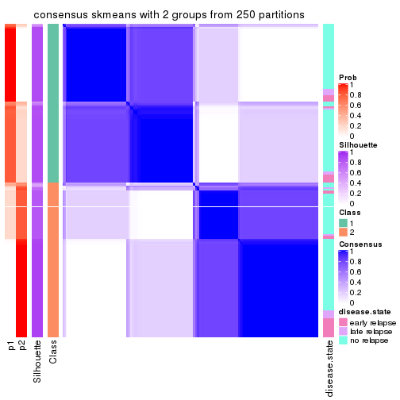</p>

</div>
<div id='tab-MAD-skmeans-consensus-heatmap-2'>
<pre><code class="r">consensus_heatmap(res, k = 3)
</code></pre>

<p>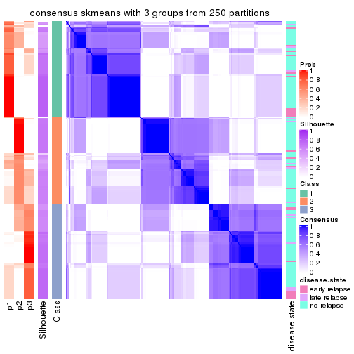</p>

</div>
<div id='tab-MAD-skmeans-consensus-heatmap-3'>
<pre><code class="r">consensus_heatmap(res, k = 4)
</code></pre>

<p>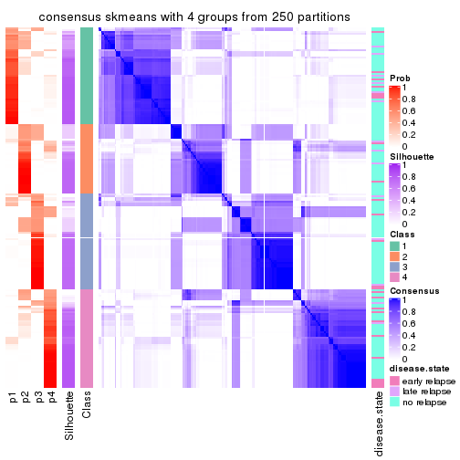</p>

</div>
<div id='tab-MAD-skmeans-consensus-heatmap-4'>
<pre><code class="r">consensus_heatmap(res, k = 5)
</code></pre>

<p>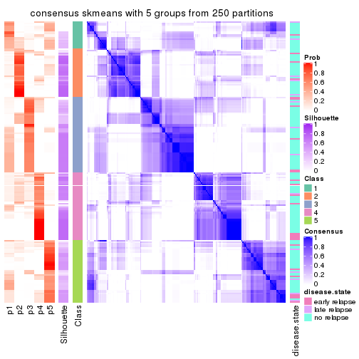</p>

</div>
<div id='tab-MAD-skmeans-consensus-heatmap-5'>
<pre><code class="r">consensus_heatmap(res, k = 6)
</code></pre>

<p>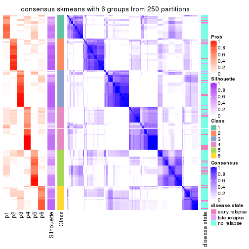</p>

</div>
</div>

Heatmaps for the membership of samples in all partitions to see how consistent they are:


<script>
$( function() {
	$( '#tabs-MAD-skmeans-membership-heatmap' ).tabs();
} );
</script>
<div id='tabs-MAD-skmeans-membership-heatmap'>
<ul>
<li><a href='#tab-MAD-skmeans-membership-heatmap-1'>k = 2</a></li>
<li><a href='#tab-MAD-skmeans-membership-heatmap-2'>k = 3</a></li>
<li><a href='#tab-MAD-skmeans-membership-heatmap-3'>k = 4</a></li>
<li><a href='#tab-MAD-skmeans-membership-heatmap-4'>k = 5</a></li>
<li><a href='#tab-MAD-skmeans-membership-heatmap-5'>k = 6</a></li>
</ul>
<div id='tab-MAD-skmeans-membership-heatmap-1'>
<pre><code class="r">membership_heatmap(res, k = 2)
</code></pre>

<p>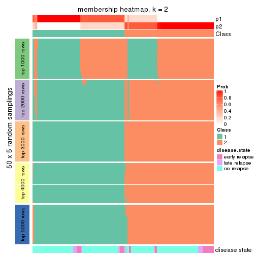</p>

</div>
<div id='tab-MAD-skmeans-membership-heatmap-2'>
<pre><code class="r">membership_heatmap(res, k = 3)
</code></pre>

<p>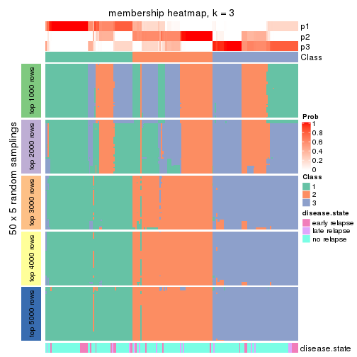</p>

</div>
<div id='tab-MAD-skmeans-membership-heatmap-3'>
<pre><code class="r">membership_heatmap(res, k = 4)
</code></pre>

<p>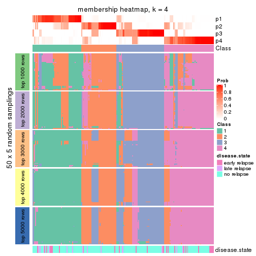</p>

</div>
<div id='tab-MAD-skmeans-membership-heatmap-4'>
<pre><code class="r">membership_heatmap(res, k = 5)
</code></pre>

<p>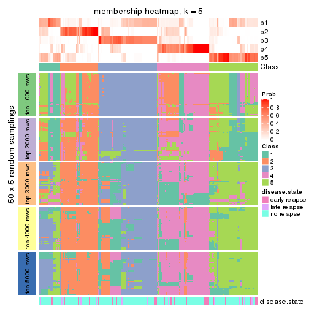</p>

</div>
<div id='tab-MAD-skmeans-membership-heatmap-5'>
<pre><code class="r">membership_heatmap(res, k = 6)
</code></pre>

<p>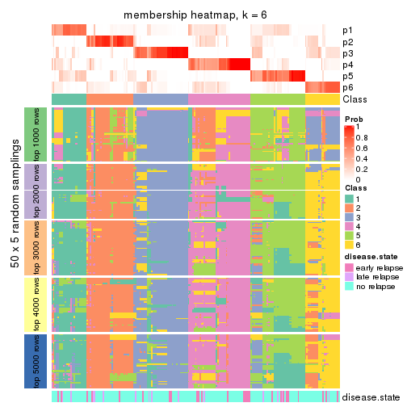</p>

</div>
</div>

As soon as we have had the classes for columns, we can look for signatures
which are significantly different between classes which can be candidate marks
for certain classes. Following are the heatmaps for signatures.


Signature heatmaps where rows are scaled:


<script>
$( function() {
	$( '#tabs-MAD-skmeans-get-signatures' ).tabs();
} );
</script>
<div id='tabs-MAD-skmeans-get-signatures'>
<ul>
<li><a href='#tab-MAD-skmeans-get-signatures-1'>k = 2</a></li>
<li><a href='#tab-MAD-skmeans-get-signatures-2'>k = 3</a></li>
<li><a href='#tab-MAD-skmeans-get-signatures-3'>k = 4</a></li>
<li><a href='#tab-MAD-skmeans-get-signatures-4'>k = 5</a></li>
<li><a href='#tab-MAD-skmeans-get-signatures-5'>k = 6</a></li>
</ul>
<div id='tab-MAD-skmeans-get-signatures-1'>
<pre><code class="r">get_signatures(res, k = 2)
</code></pre>

<p>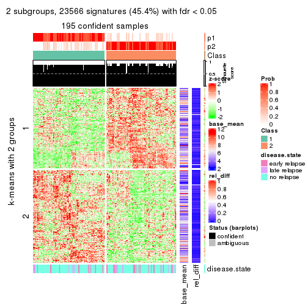</p>

</div>
<div id='tab-MAD-skmeans-get-signatures-2'>
<pre><code class="r">get_signatures(res, k = 3)
</code></pre>

<p>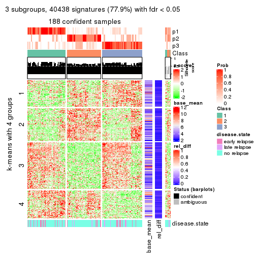</p>

</div>
<div id='tab-MAD-skmeans-get-signatures-3'>
<pre><code class="r">get_signatures(res, k = 4)
</code></pre>

<p>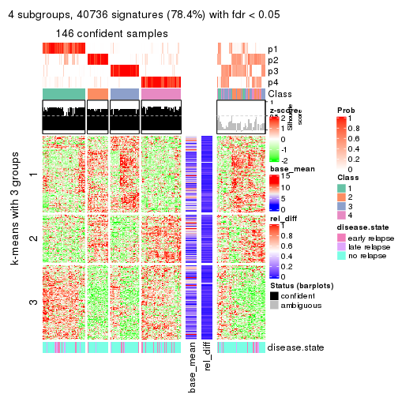</p>

</div>
<div id='tab-MAD-skmeans-get-signatures-4'>
<pre><code class="r">get_signatures(res, k = 5)
</code></pre>

<p>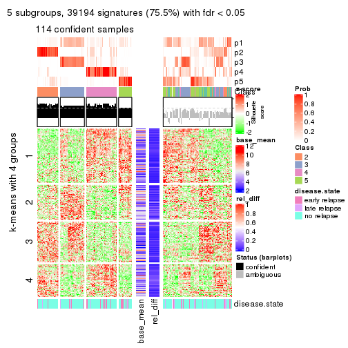</p>

</div>
<div id='tab-MAD-skmeans-get-signatures-5'>
<pre><code class="r">get_signatures(res, k = 6)
</code></pre>

<p>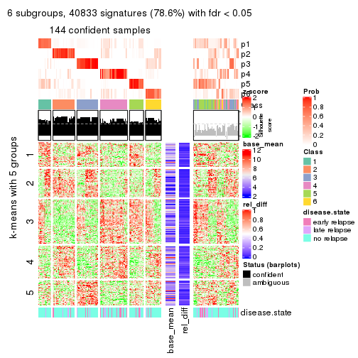</p>

</div>
</div>


Signature heatmaps where rows are not scaled:


<script>
$( function() {
	$( '#tabs-MAD-skmeans-get-signatures-no-scale' ).tabs();
} );
</script>
<div id='tabs-MAD-skmeans-get-signatures-no-scale'>
<ul>
<li><a href='#tab-MAD-skmeans-get-signatures-no-scale-1'>k = 2</a></li>
<li><a href='#tab-MAD-skmeans-get-signatures-no-scale-2'>k = 3</a></li>
<li><a href='#tab-MAD-skmeans-get-signatures-no-scale-3'>k = 4</a></li>
<li><a href='#tab-MAD-skmeans-get-signatures-no-scale-4'>k = 5</a></li>
<li><a href='#tab-MAD-skmeans-get-signatures-no-scale-5'>k = 6</a></li>
</ul>
<div id='tab-MAD-skmeans-get-signatures-no-scale-1'>
<pre><code class="r">get_signatures(res, k = 2, scale_rows = FALSE)
</code></pre>

<p>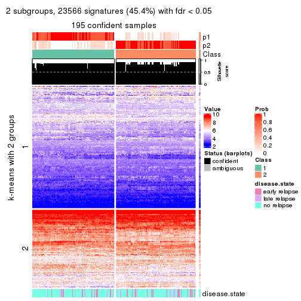</p>

</div>
<div id='tab-MAD-skmeans-get-signatures-no-scale-2'>
<pre><code class="r">get_signatures(res, k = 3, scale_rows = FALSE)
</code></pre>

<p>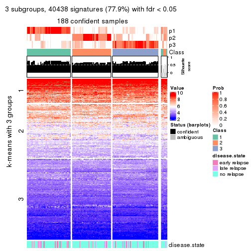</p>

</div>
<div id='tab-MAD-skmeans-get-signatures-no-scale-3'>
<pre><code class="r">get_signatures(res, k = 4, scale_rows = FALSE)
</code></pre>

<p>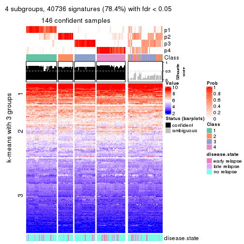</p>

</div>
<div id='tab-MAD-skmeans-get-signatures-no-scale-4'>
<pre><code class="r">get_signatures(res, k = 5, scale_rows = FALSE)
</code></pre>

<p>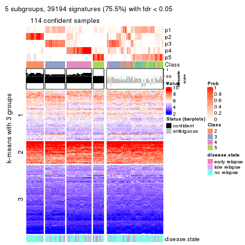</p>

</div>
<div id='tab-MAD-skmeans-get-signatures-no-scale-5'>
<pre><code class="r">get_signatures(res, k = 6, scale_rows = FALSE)
</code></pre>

<p>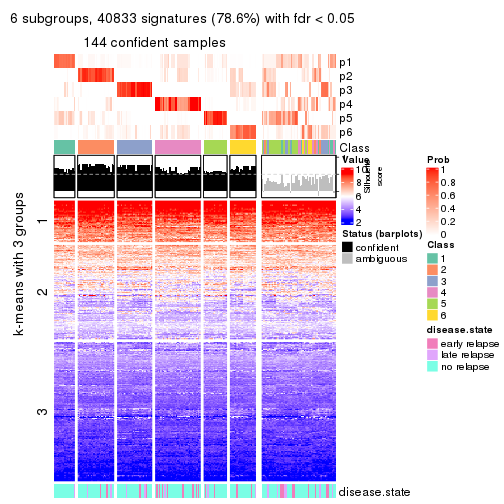</p>

</div>
</div>


Compare the overlap of signatures from different k:

```r
compare_signatures(res)
```

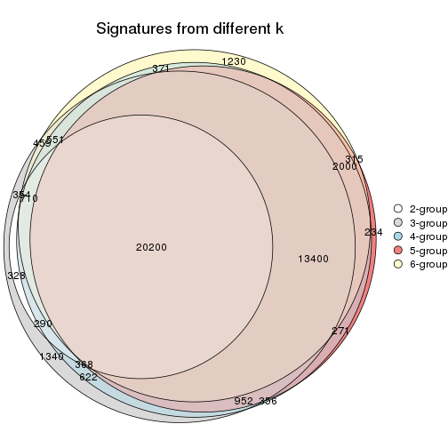

`get_signature()` returns a data frame invisibly. TO get the list of signatures, the function
call should be assigned to a variable explicitly. In following code, if `plot` argument is set
to `FALSE`, no heatmap is plotted while only the differential analysis is performed.

```r
# code only for demonstration
tb = get_signature(res, k = ..., plot = FALSE)
```

An example of the output of `tb` is:

```
#>   which_row         fdr    mean_1    mean_2 scaled_mean_1 scaled_mean_2 km
#> 1        38 0.042760348  8.373488  9.131774    -0.5533452     0.5164555  1
#> 2        40 0.018707592  7.106213  8.469186    -0.6173731     0.5762149  1
#> 3        55 0.019134737 10.221463 11.207825    -0.6159697     0.5749050  1
#> 4        59 0.006059896  5.921854  7.869574    -0.6899429     0.6439467  1
#> 5        60 0.018055526  8.928898 10.211722    -0.6204761     0.5791110  1
#> 6        98 0.009384629 15.714769 14.887706     0.6635654    -0.6193277  2
...
```

The columns in `tb` are:

1. `which_row`: row indices corresponding to the input matrix.
2. `fdr`: FDR for the differential test. 
3. `mean_x`: The mean value in group x.
4. `scaled_mean_x`: The mean value in group x after rows are scaled.
5. `km`: Row groups if k-means clustering is applied to rows.


UMAP plot which shows how samples are separated.


<script>
$( function() {
	$( '#tabs-MAD-skmeans-dimension-reduction' ).tabs();
} );
</script>
<div id='tabs-MAD-skmeans-dimension-reduction'>
<ul>
<li><a href='#tab-MAD-skmeans-dimension-reduction-1'>k = 2</a></li>
<li><a href='#tab-MAD-skmeans-dimension-reduction-2'>k = 3</a></li>
<li><a href='#tab-MAD-skmeans-dimension-reduction-3'>k = 4</a></li>
<li><a href='#tab-MAD-skmeans-dimension-reduction-4'>k = 5</a></li>
<li><a href='#tab-MAD-skmeans-dimension-reduction-5'>k = 6</a></li>
</ul>
<div id='tab-MAD-skmeans-dimension-reduction-1'>
<pre><code class="r">dimension_reduction(res, k = 2, method = &quot;UMAP&quot;)
</code></pre>

<p>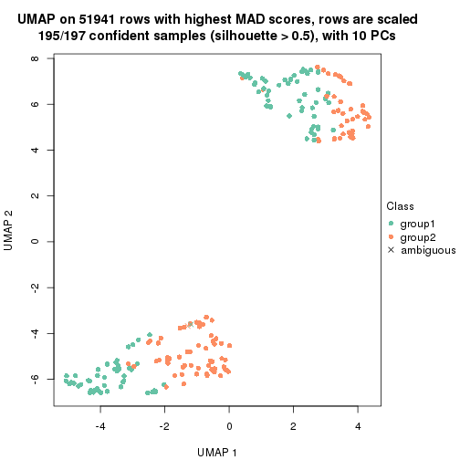</p>

</div>
<div id='tab-MAD-skmeans-dimension-reduction-2'>
<pre><code class="r">dimension_reduction(res, k = 3, method = &quot;UMAP&quot;)
</code></pre>

<p>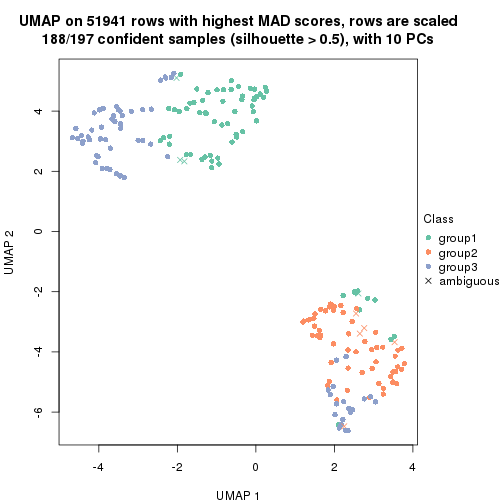</p>

</div>
<div id='tab-MAD-skmeans-dimension-reduction-3'>
<pre><code class="r">dimension_reduction(res, k = 4, method = &quot;UMAP&quot;)
</code></pre>

<p>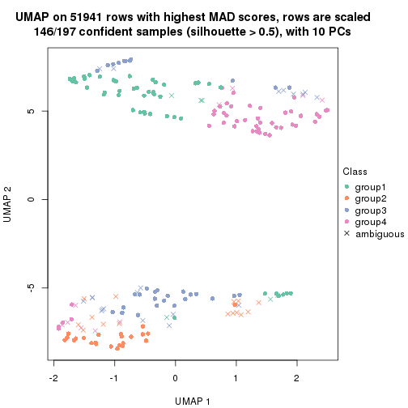</p>

</div>
<div id='tab-MAD-skmeans-dimension-reduction-4'>
<pre><code class="r">dimension_reduction(res, k = 5, method = &quot;UMAP&quot;)
</code></pre>

<p>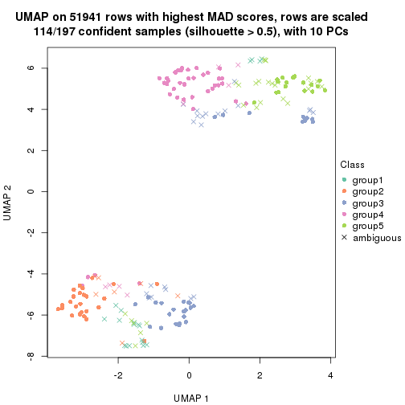</p>

</div>
<div id='tab-MAD-skmeans-dimension-reduction-5'>
<pre><code class="r">dimension_reduction(res, k = 6, method = &quot;UMAP&quot;)
</code></pre>

<p>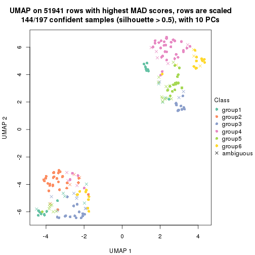</p>

</div>
</div>


Following heatmap shows how subgroups are split when increasing `k`:

```r
collect_classes(res)
```

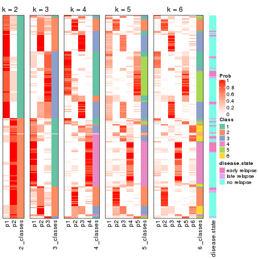


Test correlation between subgroups and known annotations. If the known
annotation is numeric, one-way ANOVA test is applied, and if the known
annotation is discrete, chi-squared contingency table test is applied.

```r
test_to_known_factors(res)
```

```
#>               n disease.state(p) k
#> MAD:skmeans 195            0.394 2
#> MAD:skmeans 188            0.162 3
#> MAD:skmeans 146            0.158 4
#> MAD:skmeans 114            0.416 5
#> MAD:skmeans 144            0.418 6
```


If matrix rows can be associated to genes, consider to use `functional_enrichment(res,
...)` to perform function enrichment for the signature genes. See [this vignette](http://bioconductor.org/packages/devel/bioc/vignettes/cola/inst/doc/functional_enrichment.html) for more detailed explanations.


 

---------------------------------------------------


### MAD:pam


The object with results only for a single top-value method and a single partition method 
can be extracted as:

```r
res = res_list["MAD", "pam"]
# you can also extract it by
# res = res_list["MAD:pam"]
```

A summary of `res` and all the functions that can be applied to it:

```r
res
```

```
#> A 'ConsensusPartition' object with k = 2, 3, 4, 5, 6.
#>   On a matrix with 51941 rows and 197 columns.
#>   Top rows (1000, 2000, 3000, 4000, 5000) are extracted by 'MAD' method.
#>   Subgroups are detected by 'pam' method.
#>   Performed in total 1250 partitions by row resampling.
#>   Best k for subgroups seems to be 2.
#> 
#> Following methods can be applied to this 'ConsensusPartition' object:
#>  [1] "cola_report"             "collect_classes"         "collect_plots"          
#>  [4] "collect_stats"           "colnames"                "compare_signatures"     
#>  [7] "consensus_heatmap"       "dimension_reduction"     "functional_enrichment"  
#> [10] "get_anno_col"            "get_anno"                "get_classes"            
#> [13] "get_consensus"           "get_matrix"              "get_membership"         
#> [16] "get_param"               "get_signatures"          "get_stats"              
#> [19] "is_best_k"               "is_stable_k"             "membership_heatmap"     
#> [22] "ncol"                    "nrow"                    "plot_ecdf"              
#> [25] "rownames"                "select_partition_number" "show"                   
#> [28] "suggest_best_k"          "test_to_known_factors"
```

`collect_plots()` function collects all the plots made from `res` for all `k` (number of partitions)
into one single page to provide an easy and fast comparison between different `k`.

```r
collect_plots(res)
```

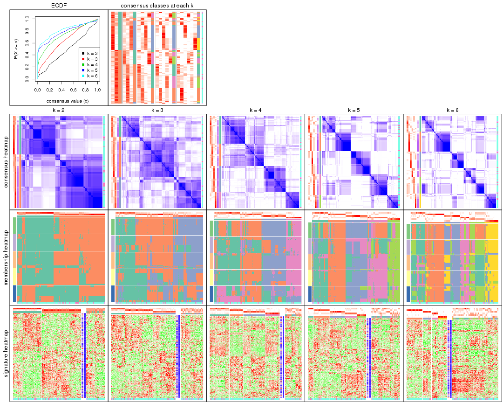

The plots are:

- The first row: a plot of the ECDF (empirical cumulative distribution
  function) curves of the consensus matrix for each `k` and the heatmap of
  predicted classes for each `k`.
- The second row: heatmaps of the consensus matrix for each `k`.
- The third row: heatmaps of the membership matrix for each `k`.
- The fouth row: heatmaps of the signatures for each `k`.

All the plots in panels can be made by individual functions and they are
plotted later in this section.

`select_partition_number()` produces several plots showing different
statistics for choosing "optimized" `k`. There are following statistics:

- ECDF curves of the consensus matrix for each `k`;
- 1-PAC. [The PAC
  score](https://en.wikipedia.org/wiki/Consensus_clustering#Over-interpretation_potential_of_consensus_clustering)
  measures the proportion of the ambiguous subgrouping.
- Mean silhouette score.
- Concordance. The mean probability of fiting the consensus class ids in all
  partitions.
- Area increased. Denote $A_k$ as the area under the ECDF curve for current
  `k`, the area increased is defined as $A_k - A_{k-1}$.
- Rand index. The percent of pairs of samples that are both in a same cluster
  or both are not in a same cluster in the partition of k and k-1.
- Jaccard index. The ratio of pairs of samples are both in a same cluster in
  the partition of k and k-1 and the pairs of samples are both in a same
  cluster in the partition k or k-1.

The detailed explanations of these statistics can be found in [the _cola_
vignette](http://bioconductor.org/packages/devel/bioc/vignettes/cola/inst/doc/cola.html#toc_13).

Generally speaking, lower PAC score, higher mean silhouette score or higher
concordance corresponds to better partition. Rand index and Jaccard index
measure how similar the current partition is compared to partition with `k-1`.
If they are too similar, we won't accept `k` is better than `k-1`.

```r
select_partition_number(res)
```

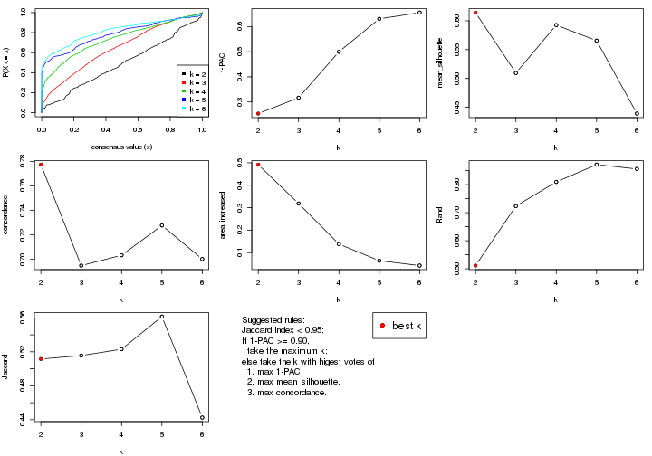

The numeric values for all these statistics can be obtained by `get_stats()`.

```r
get_stats(res)
```

```
#>   k 1-PAC mean_silhouette concordance area_increased  Rand Jaccard
#> 2 2 0.254           0.614       0.777         0.4920 0.512   0.512
#> 3 3 0.317           0.510       0.695         0.3188 0.724   0.516
#> 4 4 0.500           0.593       0.703         0.1380 0.810   0.523
#> 5 5 0.631           0.566       0.728         0.0642 0.871   0.561
#> 6 6 0.656           0.439       0.700         0.0424 0.856   0.442
```

`suggest_best_k()` suggests the best $k$ based on these statistics. The rules are as follows:

- All $k$ with Jaccard index larger than 0.95 are removed because increasing
  $k$ does not provide enough extra information. If all $k$ are removed, it is
  marked as no subgroup is detected.
- For all $k$ with 1-PAC score larger than 0.9, the maximal $k$ is taken as
  the best $k$, and other $k$ are marked as optional $k$.
- If it does not fit the second rule. The $k$ with the maximal vote of the
  highest 1-PAC score, highest mean silhouette, and highest concordance is
  taken as the best $k$.

```r
suggest_best_k(res)
```

```
#> [1] 2
```


Following shows the table of the partitions (You need to click the **show/hide
code output** link to see it). The membership matrix (columns with name `p*`)
is inferred by
[`clue::cl_consensus()`](https://www.rdocumentation.org/link/cl_consensus?package=clue)
function with the `SE` method. Basically the value in the membership matrix
represents the probability to belong to a certain group. The finall class
label for an item is determined with the group with highest probability it
belongs to.

In `get_classes()` function, the entropy is calculated from the membership
matrix and the silhouette score is calculated from the consensus matrix.


<script>
$( function() {
	$( '#tabs-MAD-pam-get-classes' ).tabs();
} );
</script>
<div id='tabs-MAD-pam-get-classes'>
<ul>
<li><a href='#tab-MAD-pam-get-classes-1'>k = 2</a></li>
<li><a href='#tab-MAD-pam-get-classes-2'>k = 3</a></li>
<li><a href='#tab-MAD-pam-get-classes-3'>k = 4</a></li>
<li><a href='#tab-MAD-pam-get-classes-4'>k = 5</a></li>
<li><a href='#tab-MAD-pam-get-classes-5'>k = 6</a></li>
</ul>

<div id='tab-MAD-pam-get-classes-1'>
<p><a id='tab-MAD-pam-get-classes-1-a' style='color:#0366d6' href='#'>show/hide code output</a></p>
<pre><code class="r">cbind(get_classes(res, k = 2), get_membership(res, k = 2))
</code></pre>

<pre><code>#&gt;           class entropy silhouette    p1    p2
#&gt; GSM342319     2  0.4690    0.75755 0.100 0.900
#&gt; GSM342323     2  0.6048    0.74801 0.148 0.852
#&gt; GSM342325     2  0.6048    0.74801 0.148 0.852
#&gt; GSM342326     2  0.6048    0.74801 0.148 0.852
#&gt; GSM342327     2  0.7745    0.69331 0.228 0.772
#&gt; GSM342329     2  0.7674    0.69690 0.224 0.776
#&gt; GSM342331     2  0.9044    0.61427 0.320 0.680
#&gt; GSM342334     2  0.6048    0.74801 0.148 0.852
#&gt; GSM342335     2  0.6048    0.74801 0.148 0.852
#&gt; GSM342354     1  0.4022    0.74369 0.920 0.080
#&gt; GSM342371     2  0.0000    0.75458 0.000 1.000
#&gt; GSM342380     2  0.6247    0.74508 0.156 0.844
#&gt; GSM342382     2  0.1633    0.75182 0.024 0.976
#&gt; GSM342399     2  0.6048    0.74801 0.148 0.852
#&gt; GSM342402     2  0.6048    0.74801 0.148 0.852
#&gt; GSM342404     2  0.7815    0.69071 0.232 0.768
#&gt; GSM342408     1  0.1633    0.76901 0.976 0.024
#&gt; GSM342409     2  0.6048    0.74801 0.148 0.852
#&gt; GSM342426     1  0.9754    0.09229 0.592 0.408
#&gt; GSM342441     1  0.6048    0.72665 0.852 0.148
#&gt; GSM342444     1  0.5842    0.73064 0.860 0.140
#&gt; GSM342451     1  0.6048    0.72665 0.852 0.148
#&gt; GSM342462     2  0.5294    0.68664 0.120 0.880
#&gt; GSM342467     1  0.8081    0.50513 0.752 0.248
#&gt; GSM342484     1  0.6048    0.72665 0.852 0.148
#&gt; GSM342491     1  0.6048    0.72665 0.852 0.148
#&gt; GSM342322     2  0.0000    0.75458 0.000 1.000
#&gt; GSM342338     1  0.6973    0.63869 0.812 0.188
#&gt; GSM342347     1  0.9933   -0.00102 0.548 0.452
#&gt; GSM342356     2  1.0000    0.16205 0.496 0.504
#&gt; GSM342357     2  0.6048    0.74801 0.148 0.852
#&gt; GSM342366     2  0.1633    0.75182 0.024 0.976
#&gt; GSM342385     2  0.1633    0.75863 0.024 0.976
#&gt; GSM342421     2  0.5842    0.75019 0.140 0.860
#&gt; GSM342437     1  0.2948    0.76464 0.948 0.052
#&gt; GSM342454     1  0.6048    0.72665 0.852 0.148
#&gt; GSM342471     2  0.9580    0.46157 0.380 0.620
#&gt; GSM342477     1  0.6048    0.72665 0.852 0.148
#&gt; GSM342495     2  0.6048    0.65802 0.148 0.852
#&gt; GSM342496     2  0.9988   -0.09521 0.480 0.520
#&gt; GSM342320     2  0.7674    0.69690 0.224 0.776
#&gt; GSM342321     2  0.6247    0.74495 0.156 0.844
#&gt; GSM342324     2  0.8327    0.65494 0.264 0.736
#&gt; GSM342328     2  0.6438    0.74125 0.164 0.836
#&gt; GSM342330     2  0.9580    0.47008 0.380 0.620
#&gt; GSM342332     2  0.6048    0.74801 0.148 0.852
#&gt; GSM342333     2  0.9954    0.26494 0.460 0.540
#&gt; GSM342336     2  0.9522    0.47781 0.372 0.628
#&gt; GSM342337     1  0.9988   -0.09985 0.520 0.480
#&gt; GSM342339     1  0.2043    0.76806 0.968 0.032
#&gt; GSM342340     1  0.7453    0.60898 0.788 0.212
#&gt; GSM342341     1  0.5629    0.69163 0.868 0.132
#&gt; GSM342342     1  0.3431    0.75055 0.936 0.064
#&gt; GSM342343     1  0.6438    0.65513 0.836 0.164
#&gt; GSM342344     1  0.2778    0.76191 0.952 0.048
#&gt; GSM342345     1  0.5178    0.70853 0.884 0.116
#&gt; GSM342346     1  0.7056    0.62966 0.808 0.192
#&gt; GSM342348     2  1.0000    0.16205 0.496 0.504
#&gt; GSM342349     1  0.1633    0.76901 0.976 0.024
#&gt; GSM342350     1  0.1633    0.76901 0.976 0.024
#&gt; GSM342351     1  0.1633    0.76901 0.976 0.024
#&gt; GSM342352     1  0.1633    0.76901 0.976 0.024
#&gt; GSM342353     1  0.1633    0.76901 0.976 0.024
#&gt; GSM342355     1  0.9983   -0.08614 0.524 0.476
#&gt; GSM342358     1  0.9896    0.00244 0.560 0.440
#&gt; GSM342359     2  1.0000    0.16205 0.496 0.504
#&gt; GSM342360     2  1.0000    0.16205 0.496 0.504
#&gt; GSM342361     1  0.4690    0.72045 0.900 0.100
#&gt; GSM342362     2  0.7674    0.69480 0.224 0.776
#&gt; GSM342363     2  0.6343    0.74346 0.160 0.840
#&gt; GSM342364     2  0.1633    0.75182 0.024 0.976
#&gt; GSM342365     2  0.6048    0.74801 0.148 0.852
#&gt; GSM342367     2  0.1633    0.75182 0.024 0.976
#&gt; GSM342368     2  0.1633    0.75182 0.024 0.976
#&gt; GSM342369     2  0.5294    0.75435 0.120 0.880
#&gt; GSM342370     2  0.6048    0.74801 0.148 0.852
#&gt; GSM342372     2  0.6048    0.74801 0.148 0.852
#&gt; GSM342373     2  0.1633    0.75182 0.024 0.976
#&gt; GSM342374     2  0.6048    0.74801 0.148 0.852
#&gt; GSM342375     2  0.8608    0.61998 0.284 0.716
#&gt; GSM342376     2  0.6048    0.74801 0.148 0.852
#&gt; GSM342377     2  0.0000    0.75458 0.000 1.000
#&gt; GSM342378     2  0.6048    0.74801 0.148 0.852
#&gt; GSM342379     2  0.6048    0.74801 0.148 0.852
#&gt; GSM342381     2  0.0000    0.75458 0.000 1.000
#&gt; GSM342383     2  0.0000    0.75458 0.000 1.000
#&gt; GSM342384     2  0.1633    0.75182 0.024 0.976
#&gt; GSM342386     2  0.1633    0.75182 0.024 0.976
#&gt; GSM342387     2  0.6712    0.73541 0.176 0.824
#&gt; GSM342388     1  0.9909    0.37109 0.556 0.444
#&gt; GSM342389     2  0.1633    0.75182 0.024 0.976
#&gt; GSM342390     2  1.0000    0.16205 0.496 0.504
#&gt; GSM342391     2  1.0000    0.16205 0.496 0.504
#&gt; GSM342392     1  0.4431    0.73075 0.908 0.092
#&gt; GSM342393     2  0.9170    0.59782 0.332 0.668
#&gt; GSM342394     2  0.6048    0.74801 0.148 0.852
#&gt; GSM342395     2  0.1633    0.75182 0.024 0.976
#&gt; GSM342396     1  0.5294    0.70408 0.880 0.120
#&gt; GSM342397     1  0.2778    0.76191 0.952 0.048
#&gt; GSM342398     2  0.1633    0.75182 0.024 0.976
#&gt; GSM342400     2  0.1633    0.75182 0.024 0.976
#&gt; GSM342401     1  0.5629    0.69163 0.868 0.132
#&gt; GSM342403     2  0.1843    0.75851 0.028 0.972
#&gt; GSM342405     1  0.9491    0.21440 0.632 0.368
#&gt; GSM342406     2  1.0000    0.16205 0.496 0.504
#&gt; GSM342407     1  0.1633    0.76901 0.976 0.024
#&gt; GSM342410     2  0.9993    0.19708 0.484 0.516
#&gt; GSM342411     2  0.6712    0.73435 0.176 0.824
#&gt; GSM342412     2  0.8813    0.60414 0.300 0.700
#&gt; GSM342413     1  0.9998   -0.14341 0.508 0.492
#&gt; GSM342414     1  0.1633    0.76901 0.976 0.024
#&gt; GSM342415     2  0.6048    0.74801 0.148 0.852
#&gt; GSM342416     2  1.0000    0.16205 0.496 0.504
#&gt; GSM342417     2  0.6048    0.74801 0.148 0.852
#&gt; GSM342418     2  0.7745    0.69319 0.228 0.772
#&gt; GSM342419     2  0.4161    0.75862 0.084 0.916
#&gt; GSM342420     2  0.7674    0.69690 0.224 0.776
#&gt; GSM342422     2  0.1633    0.75182 0.024 0.976
#&gt; GSM342423     2  0.5294    0.75435 0.120 0.880
#&gt; GSM342424     2  0.7528    0.70419 0.216 0.784
#&gt; GSM342425     2  0.9983   -0.04210 0.476 0.524
#&gt; GSM342427     1  0.9358    0.26145 0.648 0.352
#&gt; GSM342428     1  0.9815    0.04654 0.580 0.420
#&gt; GSM342429     1  0.9815    0.31932 0.580 0.420
#&gt; GSM342430     1  0.6048    0.72665 0.852 0.148
#&gt; GSM342431     1  0.6048    0.72665 0.852 0.148
#&gt; GSM342432     1  0.6048    0.72665 0.852 0.148
#&gt; GSM342433     1  0.0000    0.77515 1.000 0.000
#&gt; GSM342434     1  0.1414    0.77039 0.980 0.020
#&gt; GSM342435     1  0.0000    0.77515 1.000 0.000
#&gt; GSM342436     1  0.6048    0.72665 0.852 0.148
#&gt; GSM342438     1  0.6048    0.72665 0.852 0.148
#&gt; GSM342439     1  0.6048    0.72665 0.852 0.148
#&gt; GSM342440     1  0.5294    0.73924 0.880 0.120
#&gt; GSM342442     1  0.6048    0.72665 0.852 0.148
#&gt; GSM342443     2  0.9209    0.34125 0.336 0.664
#&gt; GSM342445     1  0.0000    0.77515 1.000 0.000
#&gt; GSM342446     1  0.0000    0.77515 1.000 0.000
#&gt; GSM342447     1  0.0000    0.77515 1.000 0.000
#&gt; GSM342448     1  0.0000    0.77515 1.000 0.000
#&gt; GSM342449     1  0.0000    0.77515 1.000 0.000
#&gt; GSM342450     1  0.0000    0.77515 1.000 0.000
#&gt; GSM342452     1  0.0000    0.77515 1.000 0.000
#&gt; GSM342453     1  0.5946    0.72870 0.856 0.144
#&gt; GSM342455     1  0.6048    0.72665 0.852 0.148
#&gt; GSM342456     1  0.1843    0.76900 0.972 0.028
#&gt; GSM342457     2  0.1633    0.75182 0.024 0.976
#&gt; GSM342458     2  0.1414    0.75254 0.020 0.980
#&gt; GSM342459     2  0.4690    0.70486 0.100 0.900
#&gt; GSM342460     2  0.5629    0.67481 0.132 0.868
#&gt; GSM342461     2  0.2948    0.73982 0.052 0.948
#&gt; GSM342463     2  0.8608    0.41592 0.284 0.716
#&gt; GSM342464     2  0.6887    0.59708 0.184 0.816
#&gt; GSM342465     2  0.1633    0.75182 0.024 0.976
#&gt; GSM342466     1  0.7376    0.59300 0.792 0.208
#&gt; GSM342468     2  0.0000    0.75458 0.000 1.000
#&gt; GSM342469     2  0.1633    0.75182 0.024 0.976
#&gt; GSM342470     1  0.1633    0.76901 0.976 0.024
#&gt; GSM342472     1  0.1633    0.76901 0.976 0.024
#&gt; GSM342473     2  0.2778    0.74182 0.048 0.952
#&gt; GSM342474     2  0.2778    0.74182 0.048 0.952
#&gt; GSM342475     1  0.0000    0.77515 1.000 0.000
#&gt; GSM342476     2  0.9833    0.12007 0.424 0.576
#&gt; GSM342478     2  0.9963   -0.03085 0.464 0.536
#&gt; GSM342479     1  0.9933    0.25435 0.548 0.452
#&gt; GSM342480     1  1.0000    0.13405 0.504 0.496
#&gt; GSM342481     2  0.9209    0.32582 0.336 0.664
#&gt; GSM342482     2  0.1633    0.75182 0.024 0.976
#&gt; GSM342483     2  0.9491    0.26125 0.368 0.632
#&gt; GSM342485     2  0.6148    0.64139 0.152 0.848
#&gt; GSM342486     2  0.1633    0.75182 0.024 0.976
#&gt; GSM342487     1  0.6048    0.72665 0.852 0.148
#&gt; GSM342488     2  0.9866    0.09079 0.432 0.568
#&gt; GSM342489     2  0.5629    0.67481 0.132 0.868
#&gt; GSM342490     1  0.9286    0.48012 0.656 0.344
#&gt; GSM342492     1  0.0000    0.77515 1.000 0.000
#&gt; GSM342493     2  0.1633    0.75182 0.024 0.976
#&gt; GSM342494     1  0.9963    0.21211 0.536 0.464
#&gt; GSM342497     1  0.9815    0.31932 0.580 0.420
#&gt; GSM342498     2  0.8499    0.46494 0.276 0.724
#&gt; GSM342499     2  0.4022    0.73494 0.080 0.920
#&gt; GSM342500     2  0.9248    0.33216 0.340 0.660
#&gt; GSM342501     2  0.9460    0.21534 0.364 0.636
#&gt; GSM342502     2  0.1633    0.75182 0.024 0.976
#&gt; GSM342503     2  0.1633    0.75182 0.024 0.976
#&gt; GSM342504     2  0.5294    0.68866 0.120 0.880
#&gt; GSM342505     1  0.6048    0.72665 0.852 0.148
#&gt; GSM342506     1  0.8861    0.59870 0.696 0.304
#&gt; GSM342507     1  0.9998   -0.14447 0.508 0.492
#&gt; GSM342508     2  0.5629    0.69563 0.132 0.868
#&gt; GSM342509     1  0.6048    0.72665 0.852 0.148
#&gt; GSM342510     1  0.0000    0.77515 1.000 0.000
#&gt; GSM342511     1  0.0000    0.77515 1.000 0.000
#&gt; GSM342512     2  0.1633    0.75182 0.024 0.976
#&gt; GSM342513     2  0.6712    0.60900 0.176 0.824
#&gt; GSM342514     1  0.0376    0.77489 0.996 0.004
#&gt; GSM342515     2  0.1633    0.75182 0.024 0.976
</code></pre>

<script>
$('#tab-MAD-pam-get-classes-1-a').parent().next().next().hide();
$('#tab-MAD-pam-get-classes-1-a').click(function(){
  $('#tab-MAD-pam-get-classes-1-a').parent().next().next().toggle();
  return(false);
});
</script>
</div>

<div id='tab-MAD-pam-get-classes-2'>
<p><a id='tab-MAD-pam-get-classes-2-a' style='color:#0366d6' href='#'>show/hide code output</a></p>
<pre><code class="r">cbind(get_classes(res, k = 3), get_membership(res, k = 3))
</code></pre>

<pre><code>#&gt;           class entropy silhouette    p1    p2    p3
#&gt; GSM342319     2  0.8637    0.52143 0.260 0.588 0.152
#&gt; GSM342323     1  0.5588    0.67902 0.720 0.276 0.004
#&gt; GSM342325     2  0.8207    0.56959 0.216 0.636 0.148
#&gt; GSM342326     1  0.6521    0.22912 0.504 0.492 0.004
#&gt; GSM342327     1  0.5024    0.70372 0.776 0.220 0.004
#&gt; GSM342329     1  0.5285    0.69962 0.752 0.244 0.004
#&gt; GSM342331     1  0.4978    0.70509 0.780 0.216 0.004
#&gt; GSM342334     2  0.4733    0.53525 0.196 0.800 0.004
#&gt; GSM342335     2  0.4733    0.53525 0.196 0.800 0.004
#&gt; GSM342354     3  0.7034    0.51886 0.284 0.048 0.668
#&gt; GSM342371     2  0.3752    0.57589 0.144 0.856 0.000
#&gt; GSM342380     2  0.8884    0.29616 0.420 0.460 0.120
#&gt; GSM342382     2  0.8122    0.57101 0.168 0.648 0.184
#&gt; GSM342399     1  0.9226   -0.20825 0.436 0.412 0.152
#&gt; GSM342402     1  0.5625    0.55132 0.808 0.116 0.076
#&gt; GSM342404     2  0.5517    0.49059 0.268 0.728 0.004
#&gt; GSM342408     3  0.9100    0.26773 0.324 0.160 0.516
#&gt; GSM342409     2  0.4733    0.53525 0.196 0.800 0.004
#&gt; GSM342426     1  0.6915    0.61691 0.736 0.124 0.140
#&gt; GSM342441     3  0.4228    0.67272 0.008 0.148 0.844
#&gt; GSM342444     3  0.4744    0.61995 0.136 0.028 0.836
#&gt; GSM342451     3  0.4744    0.61995 0.136 0.028 0.836
#&gt; GSM342462     2  0.4683    0.59190 0.024 0.836 0.140
#&gt; GSM342467     2  0.9895    0.00422 0.312 0.404 0.284
#&gt; GSM342484     1  0.9040    0.25813 0.524 0.156 0.320
#&gt; GSM342491     3  0.9425    0.41637 0.312 0.200 0.488
#&gt; GSM342322     1  0.8884   -0.20216 0.460 0.420 0.120
#&gt; GSM342338     3  0.5363    0.58181 0.276 0.000 0.724
#&gt; GSM342347     2  0.9864   -0.06299 0.288 0.416 0.296
#&gt; GSM342356     3  0.9277   -0.08188 0.176 0.328 0.496
#&gt; GSM342357     1  0.6960    0.47074 0.732 0.116 0.152
#&gt; GSM342366     2  0.0237    0.63220 0.004 0.996 0.000
#&gt; GSM342385     1  0.7741   -0.04622 0.568 0.376 0.056
#&gt; GSM342421     2  0.4575    0.54535 0.184 0.812 0.004
#&gt; GSM342437     3  0.8981    0.51254 0.264 0.180 0.556
#&gt; GSM342454     3  0.4744    0.61995 0.136 0.028 0.836
#&gt; GSM342471     2  0.6443    0.46406 0.240 0.720 0.040
#&gt; GSM342477     1  0.9268    0.06852 0.512 0.188 0.300
#&gt; GSM342495     2  0.6773    0.19050 0.024 0.636 0.340
#&gt; GSM342496     3  0.8349    0.57046 0.128 0.264 0.608
#&gt; GSM342320     1  0.5024    0.70372 0.776 0.220 0.004
#&gt; GSM342321     1  0.6008    0.63030 0.664 0.332 0.004
#&gt; GSM342324     1  0.5115    0.70557 0.768 0.228 0.004
#&gt; GSM342328     1  0.5404    0.69338 0.740 0.256 0.004
#&gt; GSM342330     1  0.4233    0.70405 0.836 0.160 0.004
#&gt; GSM342332     2  0.4629    0.54178 0.188 0.808 0.004
#&gt; GSM342333     2  0.6936    0.40629 0.284 0.672 0.044
#&gt; GSM342336     2  0.6475    0.43239 0.280 0.692 0.028
#&gt; GSM342337     3  0.9292   -0.09378 0.176 0.332 0.492
#&gt; GSM342339     3  0.3752    0.60550 0.144 0.000 0.856
#&gt; GSM342340     3  0.7381    0.43607 0.164 0.132 0.704
#&gt; GSM342341     3  0.4033    0.60307 0.136 0.008 0.856
#&gt; GSM342342     3  0.3752    0.60550 0.144 0.000 0.856
#&gt; GSM342343     3  0.8345    0.28953 0.172 0.200 0.628
#&gt; GSM342344     3  0.5058    0.59828 0.244 0.000 0.756
#&gt; GSM342345     3  0.4121    0.61363 0.168 0.000 0.832
#&gt; GSM342346     1  0.6405    0.67877 0.756 0.172 0.072
#&gt; GSM342348     1  0.7479    0.59983 0.660 0.264 0.076
#&gt; GSM342349     3  0.5431    0.56304 0.284 0.000 0.716
#&gt; GSM342350     3  0.6388    0.54448 0.284 0.024 0.692
#&gt; GSM342351     3  0.6570    0.51944 0.308 0.024 0.668
#&gt; GSM342352     3  0.6512    0.52613 0.300 0.024 0.676
#&gt; GSM342353     3  0.4796    0.61540 0.220 0.000 0.780
#&gt; GSM342355     3  0.9970   -0.19778 0.296 0.348 0.356
#&gt; GSM342358     1  0.4233    0.70405 0.836 0.160 0.004
#&gt; GSM342359     1  0.4233    0.70405 0.836 0.160 0.004
#&gt; GSM342360     1  0.4575    0.70271 0.812 0.184 0.004
#&gt; GSM342361     1  0.4233    0.70405 0.836 0.160 0.004
#&gt; GSM342362     1  0.5070    0.70313 0.772 0.224 0.004
#&gt; GSM342363     1  0.4749    0.58351 0.844 0.116 0.040
#&gt; GSM342364     2  0.0892    0.63095 0.020 0.980 0.000
#&gt; GSM342365     2  0.4978    0.53598 0.216 0.780 0.004
#&gt; GSM342367     2  0.6174    0.61762 0.168 0.768 0.064
#&gt; GSM342368     2  0.0424    0.63215 0.008 0.992 0.000
#&gt; GSM342369     2  0.4346    0.54821 0.184 0.816 0.000
#&gt; GSM342370     2  0.5024    0.53242 0.220 0.776 0.004
#&gt; GSM342372     2  0.4733    0.53525 0.196 0.800 0.004
#&gt; GSM342373     2  0.0237    0.63220 0.004 0.996 0.000
#&gt; GSM342374     2  0.5070    0.53016 0.224 0.772 0.004
#&gt; GSM342375     2  0.5977    0.47802 0.252 0.728 0.020
#&gt; GSM342376     2  0.8179    0.57120 0.208 0.640 0.152
#&gt; GSM342377     2  0.8179    0.57120 0.208 0.640 0.152
#&gt; GSM342378     2  0.8212    0.56661 0.168 0.640 0.192
#&gt; GSM342379     2  0.5741    0.55753 0.188 0.776 0.036
#&gt; GSM342381     2  0.5852    0.59179 0.060 0.788 0.152
#&gt; GSM342383     2  0.8179    0.57120 0.208 0.640 0.152
#&gt; GSM342384     2  0.8095    0.57448 0.200 0.648 0.152
#&gt; GSM342386     2  0.4062    0.62761 0.164 0.836 0.000
#&gt; GSM342387     1  0.5988    0.57779 0.632 0.368 0.000
#&gt; GSM342388     3  0.8938    0.07448 0.164 0.284 0.552
#&gt; GSM342389     2  0.3752    0.64385 0.096 0.884 0.020
#&gt; GSM342390     1  0.4683    0.52284 0.836 0.024 0.140
#&gt; GSM342391     2  0.9563    0.43122 0.284 0.480 0.236
#&gt; GSM342392     3  0.4121    0.61363 0.168 0.000 0.832
#&gt; GSM342393     2  0.5902    0.39584 0.316 0.680 0.004
#&gt; GSM342394     2  0.7821    0.58124 0.176 0.672 0.152
#&gt; GSM342395     2  0.0237    0.63220 0.004 0.996 0.000
#&gt; GSM342396     3  0.4121    0.61363 0.168 0.000 0.832
#&gt; GSM342397     3  0.7931    0.45870 0.284 0.092 0.624
#&gt; GSM342398     2  0.8122    0.57101 0.168 0.648 0.184
#&gt; GSM342400     2  0.1337    0.63383 0.012 0.972 0.016
#&gt; GSM342401     3  0.4121    0.61363 0.168 0.000 0.832
#&gt; GSM342403     2  0.8298    0.56473 0.220 0.628 0.152
#&gt; GSM342405     2  0.7698    0.34949 0.304 0.624 0.072
#&gt; GSM342406     1  0.4121    0.68637 0.868 0.108 0.024
#&gt; GSM342407     3  0.6388    0.54448 0.284 0.024 0.692
#&gt; GSM342410     1  0.4056    0.58863 0.876 0.032 0.092
#&gt; GSM342411     2  0.4654    0.53154 0.208 0.792 0.000
#&gt; GSM342412     1  0.6126    0.54808 0.644 0.352 0.004
#&gt; GSM342413     1  0.4233    0.70405 0.836 0.160 0.004
#&gt; GSM342414     3  0.5621    0.54809 0.308 0.000 0.692
#&gt; GSM342415     2  0.4733    0.53525 0.196 0.800 0.004
#&gt; GSM342416     1  0.6407    0.68232 0.760 0.160 0.080
#&gt; GSM342417     1  0.5815    0.65913 0.692 0.304 0.004
#&gt; GSM342418     1  0.4978    0.70507 0.780 0.216 0.004
#&gt; GSM342419     2  0.8179    0.57120 0.208 0.640 0.152
#&gt; GSM342420     1  0.5365    0.68630 0.744 0.252 0.004
#&gt; GSM342422     2  0.7772    0.58200 0.172 0.676 0.152
#&gt; GSM342423     2  0.3879    0.56952 0.152 0.848 0.000
#&gt; GSM342424     1  0.6345    0.48584 0.596 0.400 0.004
#&gt; GSM342425     1  0.9083    0.32949 0.548 0.256 0.196
#&gt; GSM342427     2  0.7694    0.36244 0.292 0.632 0.076
#&gt; GSM342428     2  0.6770    0.44653 0.264 0.692 0.044
#&gt; GSM342429     3  0.7043    0.37578 0.024 0.400 0.576
#&gt; GSM342430     3  0.4744    0.61995 0.136 0.028 0.836
#&gt; GSM342431     3  0.4744    0.61995 0.136 0.028 0.836
#&gt; GSM342432     3  0.4228    0.67272 0.008 0.148 0.844
#&gt; GSM342433     3  0.7508    0.64296 0.156 0.148 0.696
#&gt; GSM342434     3  0.5958    0.55717 0.300 0.008 0.692
#&gt; GSM342435     3  0.7564    0.64094 0.156 0.152 0.692
#&gt; GSM342436     3  0.4228    0.67272 0.008 0.148 0.844
#&gt; GSM342438     3  0.3879    0.67136 0.000 0.152 0.848
#&gt; GSM342439     3  0.3816    0.67223 0.000 0.148 0.852
#&gt; GSM342440     3  0.4411    0.67508 0.016 0.140 0.844
#&gt; GSM342442     3  0.3941    0.67013 0.000 0.156 0.844
#&gt; GSM342443     2  0.5486    0.53976 0.024 0.780 0.196
#&gt; GSM342445     3  0.6590    0.66375 0.132 0.112 0.756
#&gt; GSM342446     3  0.4892    0.67772 0.048 0.112 0.840
#&gt; GSM342447     3  0.3816    0.60732 0.148 0.000 0.852
#&gt; GSM342448     3  0.6949    0.65606 0.156 0.112 0.732
#&gt; GSM342449     3  0.4892    0.67772 0.048 0.112 0.840
#&gt; GSM342450     3  0.7016    0.65533 0.156 0.116 0.728
#&gt; GSM342452     3  0.4586    0.67953 0.048 0.096 0.856
#&gt; GSM342453     3  0.4744    0.61995 0.136 0.028 0.836
#&gt; GSM342455     3  0.3619    0.67462 0.000 0.136 0.864
#&gt; GSM342456     1  0.4865    0.61547 0.832 0.032 0.136
#&gt; GSM342457     2  0.0000    0.63202 0.000 1.000 0.000
#&gt; GSM342458     2  0.1411    0.62617 0.036 0.964 0.000
#&gt; GSM342459     2  0.4683    0.59190 0.024 0.836 0.140
#&gt; GSM342460     2  0.1453    0.62453 0.024 0.968 0.008
#&gt; GSM342461     2  0.5111    0.57445 0.024 0.808 0.168
#&gt; GSM342463     2  0.8674    0.16636 0.136 0.568 0.296
#&gt; GSM342464     2  0.4654    0.55384 0.000 0.792 0.208
#&gt; GSM342465     2  0.6372    0.60447 0.152 0.764 0.084
#&gt; GSM342466     1  0.6045    0.25303 0.620 0.000 0.380
#&gt; GSM342468     2  0.3941    0.56676 0.156 0.844 0.000
#&gt; GSM342469     2  0.7558    0.58664 0.164 0.692 0.144
#&gt; GSM342470     1  0.6434    0.21177 0.612 0.008 0.380
#&gt; GSM342472     3  0.5621    0.54809 0.308 0.000 0.692
#&gt; GSM342473     2  0.1289    0.63207 0.000 0.968 0.032
#&gt; GSM342474     2  0.1753    0.63058 0.000 0.952 0.048
#&gt; GSM342475     3  0.6590    0.66375 0.132 0.112 0.756
#&gt; GSM342476     3  0.7584    0.23695 0.040 0.472 0.488
#&gt; GSM342478     2  0.7187   -0.20361 0.024 0.496 0.480
#&gt; GSM342479     3  0.8392    0.53388 0.148 0.236 0.616
#&gt; GSM342480     3  0.7102    0.38066 0.024 0.420 0.556
#&gt; GSM342481     2  0.5860    0.52126 0.024 0.748 0.228
#&gt; GSM342482     2  0.4196    0.60426 0.024 0.864 0.112
#&gt; GSM342483     2  0.5223    0.56584 0.024 0.800 0.176
#&gt; GSM342485     2  0.5777    0.61579 0.160 0.788 0.052
#&gt; GSM342486     2  0.6271    0.60400 0.140 0.772 0.088
#&gt; GSM342487     3  0.7016    0.65473 0.116 0.156 0.728
#&gt; GSM342488     2  0.7286   -0.16312 0.028 0.508 0.464
#&gt; GSM342489     2  0.1453    0.62453 0.024 0.968 0.008
#&gt; GSM342490     3  0.8275    0.55634 0.108 0.296 0.596
#&gt; GSM342492     3  0.7082    0.65434 0.156 0.120 0.724
#&gt; GSM342493     2  0.4865    0.62595 0.136 0.832 0.032
#&gt; GSM342494     2  0.7752   -0.20674 0.048 0.496 0.456
#&gt; GSM342497     3  0.7835    0.27134 0.052 0.456 0.492
#&gt; GSM342498     3  0.7292    0.07942 0.028 0.472 0.500
#&gt; GSM342499     2  0.9108    0.48176 0.164 0.520 0.316
#&gt; GSM342500     2  0.6651    0.30131 0.024 0.656 0.320
#&gt; GSM342501     2  0.8066    0.03881 0.068 0.528 0.404
#&gt; GSM342502     2  0.5111    0.57445 0.024 0.808 0.168
#&gt; GSM342503     2  0.4121    0.58870 0.000 0.832 0.168
#&gt; GSM342504     2  0.7145   -0.08002 0.024 0.536 0.440
#&gt; GSM342505     3  0.4744    0.61995 0.136 0.028 0.836
#&gt; GSM342506     3  0.8408    0.48574 0.124 0.280 0.596
#&gt; GSM342507     1  0.3966    0.56291 0.876 0.024 0.100
#&gt; GSM342508     2  0.9514    0.43066 0.204 0.468 0.328
#&gt; GSM342509     1  0.8392    0.33922 0.616 0.148 0.236
#&gt; GSM342510     1  0.7245    0.44416 0.712 0.120 0.168
#&gt; GSM342511     3  0.7082    0.65434 0.156 0.120 0.724
#&gt; GSM342512     2  0.6653    0.59985 0.136 0.752 0.112
#&gt; GSM342513     2  0.7396    0.55752 0.144 0.704 0.152
#&gt; GSM342514     3  0.6892    0.65707 0.152 0.112 0.736
#&gt; GSM342515     2  0.8657    0.53116 0.164 0.592 0.244
</code></pre>

<script>
$('#tab-MAD-pam-get-classes-2-a').parent().next().next().hide();
$('#tab-MAD-pam-get-classes-2-a').click(function(){
  $('#tab-MAD-pam-get-classes-2-a').parent().next().next().toggle();
  return(false);
});
</script>
</div>

<div id='tab-MAD-pam-get-classes-3'>
<p><a id='tab-MAD-pam-get-classes-3-a' style='color:#0366d6' href='#'>show/hide code output</a></p>
<pre><code class="r">cbind(get_classes(res, k = 4), get_membership(res, k = 4))
</code></pre>

<pre><code>#&gt;           class entropy silhouette    p1    p2    p3    p4
#&gt; GSM342319     1  0.0376     0.5627 0.992 0.000 0.004 0.004
#&gt; GSM342323     4  0.2011     0.8423 0.080 0.000 0.000 0.920
#&gt; GSM342325     1  0.0188     0.5644 0.996 0.000 0.000 0.004
#&gt; GSM342326     4  0.5820     0.4308 0.100 0.204 0.000 0.696
#&gt; GSM342327     4  0.0000     0.8557 0.000 0.000 0.000 1.000
#&gt; GSM342329     4  0.0336     0.8547 0.008 0.000 0.000 0.992
#&gt; GSM342331     4  0.0000     0.8557 0.000 0.000 0.000 1.000
#&gt; GSM342334     1  0.7312     0.6198 0.608 0.200 0.024 0.168
#&gt; GSM342335     1  0.6976     0.6278 0.636 0.200 0.020 0.144
#&gt; GSM342354     3  0.7582     0.6254 0.024 0.200 0.576 0.200
#&gt; GSM342371     1  0.6479     0.6219 0.636 0.224 0.000 0.140
#&gt; GSM342380     1  0.5954     0.5241 0.724 0.028 0.068 0.180
#&gt; GSM342382     1  0.3893     0.6303 0.796 0.196 0.008 0.000
#&gt; GSM342399     1  0.4534     0.5001 0.800 0.000 0.068 0.132
#&gt; GSM342402     4  0.3074     0.7944 0.152 0.000 0.000 0.848
#&gt; GSM342404     1  0.7873     0.4784 0.500 0.328 0.028 0.144
#&gt; GSM342408     3  0.7572     0.4874 0.000 0.224 0.476 0.300
#&gt; GSM342409     1  0.7142     0.6288 0.636 0.192 0.032 0.140
#&gt; GSM342426     2  0.6407     0.2481 0.000 0.544 0.072 0.384
#&gt; GSM342441     3  0.3801     0.7473 0.000 0.220 0.780 0.000
#&gt; GSM342444     3  0.2281     0.7321 0.096 0.000 0.904 0.000
#&gt; GSM342451     3  0.2281     0.7321 0.096 0.000 0.904 0.000
#&gt; GSM342462     2  0.3649     0.6146 0.204 0.796 0.000 0.000
#&gt; GSM342467     2  0.5453     0.5099 0.052 0.764 0.032 0.152
#&gt; GSM342484     4  0.4483     0.7469 0.000 0.088 0.104 0.808
#&gt; GSM342491     2  0.7244     0.2586 0.000 0.544 0.212 0.244
#&gt; GSM342322     1  0.3494     0.5203 0.824 0.004 0.000 0.172
#&gt; GSM342338     3  0.5007     0.7035 0.156 0.060 0.776 0.008
#&gt; GSM342347     1  0.9221     0.2187 0.440 0.144 0.264 0.152
#&gt; GSM342356     1  0.4955     0.1982 0.648 0.000 0.344 0.008
#&gt; GSM342357     4  0.3486     0.7591 0.188 0.000 0.000 0.812
#&gt; GSM342366     1  0.6036     0.5883 0.636 0.292 0.000 0.072
#&gt; GSM342385     1  0.6888     0.3673 0.564 0.004 0.112 0.320
#&gt; GSM342421     1  0.6915     0.6278 0.636 0.200 0.016 0.148
#&gt; GSM342437     2  0.6877     0.4520 0.200 0.664 0.088 0.048
#&gt; GSM342454     3  0.2281     0.7321 0.096 0.000 0.904 0.000
#&gt; GSM342471     1  0.7174    -0.1445 0.532 0.356 0.016 0.096
#&gt; GSM342477     2  0.5156     0.4462 0.000 0.720 0.044 0.236
#&gt; GSM342495     2  0.3311     0.6365 0.172 0.828 0.000 0.000
#&gt; GSM342496     3  0.2760     0.6830 0.000 0.128 0.872 0.000
#&gt; GSM342320     4  0.0000     0.8557 0.000 0.000 0.000 1.000
#&gt; GSM342321     4  0.4122     0.7447 0.236 0.004 0.000 0.760
#&gt; GSM342324     4  0.0000     0.8557 0.000 0.000 0.000 1.000
#&gt; GSM342328     4  0.0592     0.8542 0.016 0.000 0.000 0.984
#&gt; GSM342330     4  0.0000     0.8557 0.000 0.000 0.000 1.000
#&gt; GSM342332     1  0.5798     0.6135 0.704 0.112 0.000 0.184
#&gt; GSM342333     1  0.7302     0.6181 0.612 0.212 0.028 0.148
#&gt; GSM342336     1  0.7458     0.6028 0.592 0.228 0.028 0.152
#&gt; GSM342337     3  0.5497     0.0854 0.460 0.016 0.524 0.000
#&gt; GSM342339     3  0.2281     0.7321 0.096 0.000 0.904 0.000
#&gt; GSM342340     3  0.4500     0.4730 0.316 0.000 0.684 0.000
#&gt; GSM342341     3  0.2281     0.7321 0.096 0.000 0.904 0.000
#&gt; GSM342342     3  0.2281     0.7321 0.096 0.000 0.904 0.000
#&gt; GSM342343     3  0.4898     0.2475 0.416 0.000 0.584 0.000
#&gt; GSM342344     3  0.4706     0.7429 0.000 0.224 0.748 0.028
#&gt; GSM342345     3  0.2281     0.7321 0.096 0.000 0.904 0.000
#&gt; GSM342346     4  0.2319     0.8402 0.000 0.040 0.036 0.924
#&gt; GSM342348     1  0.6133    -0.2043 0.552 0.020 0.020 0.408
#&gt; GSM342349     3  0.6798     0.6630 0.000 0.224 0.604 0.172
#&gt; GSM342350     3  0.7945     0.6572 0.076 0.224 0.580 0.120
#&gt; GSM342351     3  0.7209     0.6274 0.008 0.224 0.584 0.184
#&gt; GSM342352     3  0.7076     0.6303 0.004 0.224 0.588 0.184
#&gt; GSM342353     3  0.4284     0.7409 0.000 0.224 0.764 0.012
#&gt; GSM342355     1  0.6194     0.2993 0.632 0.060 0.300 0.008
#&gt; GSM342358     4  0.0469     0.8557 0.000 0.000 0.012 0.988
#&gt; GSM342359     4  0.0707     0.8542 0.000 0.000 0.020 0.980
#&gt; GSM342360     4  0.0927     0.8533 0.000 0.008 0.016 0.976
#&gt; GSM342361     4  0.0657     0.8553 0.000 0.012 0.004 0.984
#&gt; GSM342362     4  0.1510     0.8490 0.028 0.000 0.016 0.956
#&gt; GSM342363     4  0.2647     0.8166 0.120 0.000 0.000 0.880
#&gt; GSM342364     1  0.6036     0.5889 0.636 0.292 0.000 0.072
#&gt; GSM342365     1  0.7407     0.5156 0.524 0.296 0.004 0.176
#&gt; GSM342367     1  0.4164     0.6068 0.736 0.264 0.000 0.000
#&gt; GSM342368     1  0.6036     0.5889 0.636 0.292 0.000 0.072
#&gt; GSM342369     1  0.6605     0.6076 0.616 0.248 0.000 0.136
#&gt; GSM342370     1  0.7597     0.4814 0.504 0.312 0.008 0.176
#&gt; GSM342372     1  0.6998     0.6250 0.632 0.208 0.020 0.140
#&gt; GSM342373     1  0.6037     0.5779 0.628 0.304 0.000 0.068
#&gt; GSM342374     1  0.7153     0.6114 0.608 0.220 0.016 0.156
#&gt; GSM342375     1  0.7095     0.6232 0.628 0.208 0.024 0.140
#&gt; GSM342376     1  0.3528     0.6323 0.808 0.192 0.000 0.000
#&gt; GSM342377     1  0.3528     0.6323 0.808 0.192 0.000 0.000
#&gt; GSM342378     1  0.1792     0.5237 0.932 0.000 0.068 0.000
#&gt; GSM342379     1  0.5371     0.6463 0.732 0.188 0.000 0.080
#&gt; GSM342381     1  0.4387     0.6370 0.776 0.200 0.000 0.024
#&gt; GSM342383     1  0.0804     0.5679 0.980 0.012 0.008 0.000
#&gt; GSM342384     1  0.3610     0.6300 0.800 0.200 0.000 0.000
#&gt; GSM342386     1  0.4382     0.5836 0.704 0.296 0.000 0.000
#&gt; GSM342387     4  0.3907     0.7549 0.232 0.000 0.000 0.768
#&gt; GSM342388     3  0.4916     0.2281 0.424 0.000 0.576 0.000
#&gt; GSM342389     1  0.4509     0.5912 0.708 0.288 0.000 0.004
#&gt; GSM342390     4  0.5828     0.6736 0.344 0.016 0.020 0.620
#&gt; GSM342391     1  0.3238     0.5090 0.880 0.020 0.092 0.008
#&gt; GSM342392     3  0.2281     0.7321 0.096 0.000 0.904 0.000
#&gt; GSM342393     2  0.8169    -0.0437 0.220 0.492 0.028 0.260
#&gt; GSM342394     1  0.0188     0.5644 0.996 0.000 0.000 0.004
#&gt; GSM342395     1  0.5994     0.5851 0.636 0.296 0.000 0.068
#&gt; GSM342396     3  0.2345     0.7296 0.100 0.000 0.900 0.000
#&gt; GSM342397     3  0.6946     0.5845 0.000 0.168 0.580 0.252
#&gt; GSM342398     1  0.3933     0.6293 0.792 0.200 0.008 0.000
#&gt; GSM342400     1  0.5949     0.5928 0.644 0.288 0.000 0.068
#&gt; GSM342401     3  0.2281     0.7321 0.096 0.000 0.904 0.000
#&gt; GSM342403     1  0.4077     0.6334 0.800 0.184 0.004 0.012
#&gt; GSM342405     2  0.8132    -0.3775 0.392 0.424 0.032 0.152
#&gt; GSM342406     4  0.5434     0.7361 0.272 0.016 0.020 0.692
#&gt; GSM342407     3  0.6863     0.6925 0.032 0.224 0.648 0.096
#&gt; GSM342410     4  0.5585     0.7159 0.296 0.016 0.020 0.668
#&gt; GSM342411     1  0.4050     0.5568 0.824 0.012 0.016 0.148
#&gt; GSM342412     4  0.5527     0.6255 0.084 0.136 0.020 0.760
#&gt; GSM342413     4  0.5838     0.7406 0.200 0.056 0.024 0.720
#&gt; GSM342414     3  0.6296     0.6822 0.000 0.224 0.652 0.124
#&gt; GSM342415     1  0.7039     0.6286 0.636 0.196 0.024 0.144
#&gt; GSM342416     4  0.5539     0.7340 0.272 0.020 0.020 0.688
#&gt; GSM342417     4  0.0657     0.8523 0.012 0.004 0.000 0.984
#&gt; GSM342418     4  0.0000     0.8557 0.000 0.000 0.000 1.000
#&gt; GSM342419     1  0.3105     0.6250 0.856 0.140 0.004 0.000
#&gt; GSM342420     4  0.2466     0.8325 0.096 0.004 0.000 0.900
#&gt; GSM342422     1  0.3528     0.6323 0.808 0.192 0.000 0.000
#&gt; GSM342423     1  0.6449     0.6205 0.636 0.232 0.000 0.132
#&gt; GSM342424     2  0.7771     0.2466 0.256 0.424 0.000 0.320
#&gt; GSM342425     2  0.6539     0.3135 0.008 0.576 0.068 0.348
#&gt; GSM342427     2  0.4808     0.5766 0.044 0.812 0.036 0.108
#&gt; GSM342428     2  0.5297     0.5829 0.048 0.792 0.076 0.084
#&gt; GSM342429     2  0.2125     0.6397 0.004 0.920 0.076 0.000
#&gt; GSM342430     3  0.2281     0.7321 0.096 0.000 0.904 0.000
#&gt; GSM342431     3  0.2281     0.7321 0.096 0.000 0.904 0.000
#&gt; GSM342432     3  0.2469     0.7498 0.000 0.108 0.892 0.000
#&gt; GSM342433     3  0.5038     0.6673 0.000 0.336 0.652 0.012
#&gt; GSM342434     3  0.5291     0.6732 0.000 0.324 0.652 0.024
#&gt; GSM342435     3  0.4955     0.6610 0.000 0.344 0.648 0.008
#&gt; GSM342436     3  0.3444     0.7486 0.000 0.184 0.816 0.000
#&gt; GSM342438     3  0.3356     0.7444 0.000 0.176 0.824 0.000
#&gt; GSM342439     3  0.2216     0.7507 0.000 0.092 0.908 0.000
#&gt; GSM342440     3  0.3649     0.7495 0.000 0.204 0.796 0.000
#&gt; GSM342442     3  0.2216     0.7507 0.000 0.092 0.908 0.000
#&gt; GSM342443     2  0.1637     0.6527 0.060 0.940 0.000 0.000
#&gt; GSM342445     3  0.3444     0.7524 0.000 0.184 0.816 0.000
#&gt; GSM342446     3  0.3610     0.7504 0.000 0.200 0.800 0.000
#&gt; GSM342447     3  0.2281     0.7321 0.096 0.000 0.904 0.000
#&gt; GSM342448     3  0.4516     0.7295 0.000 0.252 0.736 0.012
#&gt; GSM342449     3  0.3219     0.7535 0.000 0.164 0.836 0.000
#&gt; GSM342450     3  0.4978     0.6785 0.000 0.324 0.664 0.012
#&gt; GSM342452     3  0.1792     0.7568 0.000 0.068 0.932 0.000
#&gt; GSM342453     3  0.2281     0.7321 0.096 0.000 0.904 0.000
#&gt; GSM342455     3  0.2489     0.7554 0.020 0.068 0.912 0.000
#&gt; GSM342456     4  0.0707     0.8511 0.000 0.000 0.020 0.980
#&gt; GSM342457     2  0.4916     0.1412 0.424 0.576 0.000 0.000
#&gt; GSM342458     2  0.5566     0.5180 0.224 0.704 0.000 0.072
#&gt; GSM342459     2  0.3400     0.6321 0.180 0.820 0.000 0.000
#&gt; GSM342460     2  0.2921     0.6461 0.140 0.860 0.000 0.000
#&gt; GSM342461     2  0.3837     0.5920 0.224 0.776 0.000 0.000
#&gt; GSM342463     2  0.4931     0.6153 0.132 0.776 0.092 0.000
#&gt; GSM342464     2  0.4500     0.6107 0.192 0.776 0.032 0.000
#&gt; GSM342465     2  0.6138     0.4886 0.092 0.648 0.260 0.000
#&gt; GSM342466     1  0.7872    -0.2392 0.376 0.000 0.344 0.280
#&gt; GSM342468     1  0.6605     0.6076 0.616 0.248 0.000 0.136
#&gt; GSM342469     1  0.3837     0.2224 0.776 0.224 0.000 0.000
#&gt; GSM342470     4  0.9513     0.3329 0.200 0.224 0.164 0.412
#&gt; GSM342472     3  0.5384     0.6710 0.000 0.324 0.648 0.028
#&gt; GSM342473     2  0.3801     0.5973 0.220 0.780 0.000 0.000
#&gt; GSM342474     2  0.3726     0.6065 0.212 0.788 0.000 0.000
#&gt; GSM342475     3  0.3486     0.7520 0.000 0.188 0.812 0.000
#&gt; GSM342476     2  0.2965     0.6234 0.036 0.892 0.072 0.000
#&gt; GSM342478     2  0.1637     0.6527 0.060 0.940 0.000 0.000
#&gt; GSM342479     2  0.5121     0.5145 0.000 0.764 0.120 0.116
#&gt; GSM342480     2  0.4907     0.5530 0.060 0.764 0.176 0.000
#&gt; GSM342481     2  0.3494     0.6359 0.172 0.824 0.004 0.000
#&gt; GSM342482     2  0.3837     0.5920 0.224 0.776 0.000 0.000
#&gt; GSM342483     2  0.3219     0.6399 0.164 0.836 0.000 0.000
#&gt; GSM342485     2  0.6360     0.5014 0.180 0.656 0.164 0.000
#&gt; GSM342486     2  0.5925     0.4361 0.284 0.648 0.068 0.000
#&gt; GSM342487     3  0.4643     0.6754 0.000 0.344 0.656 0.000
#&gt; GSM342488     2  0.1474     0.6513 0.052 0.948 0.000 0.000
#&gt; GSM342489     2  0.3486     0.6274 0.188 0.812 0.000 0.000
#&gt; GSM342490     2  0.4621     0.4123 0.012 0.764 0.212 0.012
#&gt; GSM342492     3  0.4999     0.6750 0.000 0.328 0.660 0.012
#&gt; GSM342493     2  0.6004     0.4464 0.276 0.648 0.076 0.000
#&gt; GSM342494     2  0.2797     0.6231 0.032 0.900 0.068 0.000
#&gt; GSM342497     2  0.2871     0.6214 0.032 0.896 0.072 0.000
#&gt; GSM342498     2  0.7539     0.3484 0.256 0.492 0.252 0.000
#&gt; GSM342499     1  0.7824    -0.1406 0.392 0.260 0.348 0.000
#&gt; GSM342500     2  0.1637     0.6527 0.060 0.940 0.000 0.000
#&gt; GSM342501     2  0.7644     0.3722 0.272 0.468 0.260 0.000
#&gt; GSM342502     2  0.3982     0.5956 0.220 0.776 0.004 0.000
#&gt; GSM342503     2  0.3837     0.5920 0.224 0.776 0.000 0.000
#&gt; GSM342504     2  0.3688     0.6109 0.208 0.792 0.000 0.000
#&gt; GSM342505     3  0.2281     0.7321 0.096 0.000 0.904 0.000
#&gt; GSM342506     2  0.7890     0.2081 0.288 0.360 0.352 0.000
#&gt; GSM342507     4  0.4016     0.7934 0.136 0.016 0.016 0.832
#&gt; GSM342508     1  0.7785    -0.1226 0.404 0.248 0.348 0.000
#&gt; GSM342509     4  0.4483     0.7538 0.000 0.104 0.088 0.808
#&gt; GSM342510     4  0.3695     0.7558 0.000 0.016 0.156 0.828
#&gt; GSM342511     3  0.4978     0.6785 0.000 0.324 0.664 0.012
#&gt; GSM342512     2  0.6488     0.4917 0.128 0.628 0.244 0.000
#&gt; GSM342513     1  0.7749     0.2416 0.408 0.356 0.236 0.000
#&gt; GSM342514     3  0.6646     0.6543 0.156 0.224 0.620 0.000
#&gt; GSM342515     1  0.5213     0.3415 0.724 0.052 0.224 0.000
</code></pre>

<script>
$('#tab-MAD-pam-get-classes-3-a').parent().next().next().hide();
$('#tab-MAD-pam-get-classes-3-a').click(function(){
  $('#tab-MAD-pam-get-classes-3-a').parent().next().next().toggle();
  return(false);
});
</script>
</div>

<div id='tab-MAD-pam-get-classes-4'>
<p><a id='tab-MAD-pam-get-classes-4-a' style='color:#0366d6' href='#'>show/hide code output</a></p>
<pre><code class="r">cbind(get_classes(res, k = 5), get_membership(res, k = 5))
</code></pre>

<pre><code>#&gt;           class entropy silhouette    p1    p2    p3    p4    p5
#&gt; GSM342319     1  0.0703    0.58636 0.976 0.000 0.000 0.024 0.000
#&gt; GSM342323     5  0.4515    0.72350 0.004 0.184 0.000 0.064 0.748
#&gt; GSM342325     1  0.0963    0.58194 0.964 0.000 0.000 0.036 0.000
#&gt; GSM342326     4  0.6581    0.29975 0.012 0.216 0.000 0.536 0.236
#&gt; GSM342327     4  0.6362    0.14169 0.000 0.184 0.000 0.496 0.320
#&gt; GSM342329     4  0.6418    0.07735 0.000 0.184 0.000 0.472 0.344
#&gt; GSM342331     4  0.6362    0.14169 0.000 0.184 0.000 0.496 0.320
#&gt; GSM342334     4  0.3616    0.64545 0.224 0.000 0.004 0.768 0.004
#&gt; GSM342335     4  0.3878    0.64924 0.236 0.016 0.000 0.748 0.000
#&gt; GSM342354     3  0.4898    0.68617 0.000 0.000 0.684 0.248 0.068
#&gt; GSM342371     4  0.3970    0.64948 0.236 0.020 0.000 0.744 0.000
#&gt; GSM342380     1  0.4199    0.54152 0.764 0.000 0.000 0.056 0.180
#&gt; GSM342382     1  0.3582    0.50138 0.768 0.008 0.000 0.224 0.000
#&gt; GSM342399     1  0.2074    0.56217 0.896 0.000 0.000 0.000 0.104
#&gt; GSM342402     5  0.1697    0.76668 0.060 0.000 0.000 0.008 0.932
#&gt; GSM342404     4  0.4077    0.58917 0.044 0.172 0.004 0.780 0.000
#&gt; GSM342408     4  0.4901    0.06643 0.000 0.000 0.268 0.672 0.060
#&gt; GSM342409     4  0.5010    0.60875 0.228 0.004 0.008 0.704 0.056
#&gt; GSM342426     2  0.1885    0.66848 0.000 0.936 0.020 0.012 0.032
#&gt; GSM342441     3  0.2813    0.70967 0.000 0.000 0.832 0.168 0.000
#&gt; GSM342444     3  0.3857    0.47761 0.312 0.000 0.688 0.000 0.000
#&gt; GSM342451     3  0.3857    0.47761 0.312 0.000 0.688 0.000 0.000
#&gt; GSM342462     2  0.2966    0.87030 0.000 0.816 0.000 0.184 0.000
#&gt; GSM342467     4  0.4204    0.53290 0.012 0.216 0.020 0.752 0.000
#&gt; GSM342484     5  0.1544    0.75755 0.000 0.000 0.068 0.000 0.932
#&gt; GSM342491     2  0.5584    0.43926 0.000 0.592 0.096 0.000 0.312
#&gt; GSM342322     1  0.7146   -0.10912 0.472 0.160 0.000 0.044 0.324
#&gt; GSM342338     1  0.7606   -0.24734 0.424 0.000 0.280 0.240 0.056
#&gt; GSM342347     4  0.4496    0.19564 0.000 0.000 0.216 0.728 0.056
#&gt; GSM342356     1  0.3480    0.42397 0.752 0.000 0.248 0.000 0.000
#&gt; GSM342357     5  0.1638    0.76702 0.064 0.000 0.000 0.004 0.932
#&gt; GSM342366     4  0.4058    0.64796 0.236 0.024 0.000 0.740 0.000
#&gt; GSM342385     1  0.4095    0.50607 0.752 0.000 0.004 0.024 0.220
#&gt; GSM342421     4  0.3970    0.64948 0.236 0.020 0.000 0.744 0.000
#&gt; GSM342437     2  0.4096    0.62169 0.232 0.744 0.020 0.000 0.004
#&gt; GSM342454     3  0.1197    0.69141 0.048 0.000 0.952 0.000 0.000
#&gt; GSM342471     1  0.6767   -0.09382 0.380 0.348 0.000 0.272 0.000
#&gt; GSM342477     2  0.1483    0.69739 0.000 0.952 0.012 0.008 0.028
#&gt; GSM342495     2  0.2966    0.87030 0.000 0.816 0.000 0.184 0.000
#&gt; GSM342496     3  0.1809    0.67992 0.000 0.060 0.928 0.012 0.000
#&gt; GSM342320     5  0.6362    0.33372 0.000 0.184 0.000 0.320 0.496
#&gt; GSM342321     4  0.7158    0.19478 0.044 0.184 0.000 0.496 0.276
#&gt; GSM342324     5  0.4325    0.72517 0.000 0.180 0.000 0.064 0.756
#&gt; GSM342328     5  0.4635    0.72219 0.008 0.184 0.000 0.064 0.744
#&gt; GSM342330     5  0.4360    0.72317 0.000 0.184 0.000 0.064 0.752
#&gt; GSM342332     4  0.6517    0.50210 0.264 0.184 0.000 0.540 0.012
#&gt; GSM342333     4  0.3706    0.64591 0.236 0.004 0.004 0.756 0.000
#&gt; GSM342336     4  0.4117    0.64059 0.240 0.004 0.004 0.740 0.012
#&gt; GSM342337     1  0.5243    0.16522 0.540 0.000 0.412 0.048 0.000
#&gt; GSM342339     3  0.3857    0.47761 0.312 0.000 0.688 0.000 0.000
#&gt; GSM342340     3  0.4291    0.12595 0.464 0.000 0.536 0.000 0.000
#&gt; GSM342341     3  0.3857    0.47761 0.312 0.000 0.688 0.000 0.000
#&gt; GSM342342     3  0.3857    0.47761 0.312 0.000 0.688 0.000 0.000
#&gt; GSM342343     3  0.4302    0.08110 0.480 0.000 0.520 0.000 0.000
#&gt; GSM342344     3  0.4780    0.68916 0.000 0.000 0.692 0.248 0.060
#&gt; GSM342345     3  0.3857    0.47761 0.312 0.000 0.688 0.000 0.000
#&gt; GSM342346     5  0.2621    0.70977 0.000 0.008 0.004 0.112 0.876
#&gt; GSM342348     5  0.4443    0.43300 0.472 0.000 0.000 0.004 0.524
#&gt; GSM342349     3  0.4719    0.69045 0.000 0.000 0.696 0.248 0.056
#&gt; GSM342350     3  0.4719    0.69045 0.000 0.000 0.696 0.248 0.056
#&gt; GSM342351     4  0.4969    0.00836 0.000 0.000 0.292 0.652 0.056
#&gt; GSM342352     4  0.5385   -0.35198 0.000 0.000 0.432 0.512 0.056
#&gt; GSM342353     3  0.4719    0.69045 0.000 0.000 0.696 0.248 0.056
#&gt; GSM342355     1  0.6229    0.10287 0.540 0.000 0.192 0.268 0.000
#&gt; GSM342358     5  0.1341    0.77364 0.000 0.000 0.000 0.056 0.944
#&gt; GSM342359     5  0.0609    0.77711 0.000 0.000 0.000 0.020 0.980
#&gt; GSM342360     5  0.1341    0.77364 0.000 0.000 0.000 0.056 0.944
#&gt; GSM342361     5  0.0000    0.77242 0.000 0.000 0.000 0.000 1.000
#&gt; GSM342362     5  0.1697    0.77367 0.008 0.000 0.000 0.060 0.932
#&gt; GSM342363     5  0.1697    0.76668 0.060 0.000 0.000 0.008 0.932
#&gt; GSM342364     4  0.3970    0.64948 0.236 0.020 0.000 0.744 0.000
#&gt; GSM342365     4  0.4962    0.60274 0.108 0.168 0.000 0.720 0.004
#&gt; GSM342367     1  0.6651    0.08132 0.444 0.300 0.000 0.256 0.000
#&gt; GSM342368     4  0.3970    0.64948 0.236 0.020 0.000 0.744 0.000
#&gt; GSM342369     4  0.4612    0.63946 0.180 0.084 0.000 0.736 0.000
#&gt; GSM342370     4  0.5020    0.60296 0.104 0.180 0.000 0.712 0.004
#&gt; GSM342372     4  0.4029    0.65068 0.232 0.024 0.000 0.744 0.000
#&gt; GSM342373     4  0.4029    0.65068 0.232 0.024 0.000 0.744 0.000
#&gt; GSM342374     4  0.4000    0.65182 0.228 0.024 0.000 0.748 0.000
#&gt; GSM342375     4  0.3942    0.65116 0.232 0.020 0.000 0.748 0.000
#&gt; GSM342376     1  0.3741    0.47088 0.732 0.004 0.000 0.264 0.000
#&gt; GSM342377     1  0.3689    0.48001 0.740 0.004 0.000 0.256 0.000
#&gt; GSM342378     1  0.0000    0.58432 1.000 0.000 0.000 0.000 0.000
#&gt; GSM342379     4  0.4443    0.22954 0.472 0.004 0.000 0.524 0.000
#&gt; GSM342381     4  0.4418    0.52231 0.332 0.016 0.000 0.652 0.000
#&gt; GSM342383     1  0.1043    0.59140 0.960 0.000 0.000 0.040 0.000
#&gt; GSM342384     1  0.4014    0.46765 0.728 0.016 0.000 0.256 0.000
#&gt; GSM342386     1  0.6596    0.14816 0.464 0.280 0.000 0.256 0.000
#&gt; GSM342387     4  0.6500    0.12513 0.236 0.000 0.000 0.488 0.276
#&gt; GSM342388     1  0.4902    0.01767 0.508 0.000 0.468 0.024 0.000
#&gt; GSM342389     1  0.5171   -0.07501 0.504 0.040 0.000 0.456 0.000
#&gt; GSM342390     5  0.4249    0.50262 0.432 0.000 0.000 0.000 0.568
#&gt; GSM342391     1  0.0579    0.58496 0.984 0.000 0.008 0.008 0.000
#&gt; GSM342392     3  0.3857    0.47761 0.312 0.000 0.688 0.000 0.000
#&gt; GSM342393     4  0.1892    0.56216 0.000 0.080 0.004 0.916 0.000
#&gt; GSM342394     1  0.0963    0.58194 0.964 0.000 0.000 0.036 0.000
#&gt; GSM342395     4  0.3970    0.64948 0.236 0.020 0.000 0.744 0.000
#&gt; GSM342396     3  0.3876    0.47062 0.316 0.000 0.684 0.000 0.000
#&gt; GSM342397     3  0.4955    0.68461 0.000 0.000 0.680 0.248 0.072
#&gt; GSM342398     1  0.3845    0.49789 0.760 0.012 0.004 0.224 0.000
#&gt; GSM342400     4  0.4058    0.64796 0.236 0.024 0.000 0.740 0.000
#&gt; GSM342401     3  0.3857    0.47761 0.312 0.000 0.688 0.000 0.000
#&gt; GSM342403     1  0.4270    0.48295 0.728 0.004 0.004 0.248 0.016
#&gt; GSM342405     4  0.1628    0.49459 0.000 0.000 0.008 0.936 0.056
#&gt; GSM342406     5  0.3752    0.66266 0.292 0.000 0.000 0.000 0.708
#&gt; GSM342407     3  0.4719    0.69045 0.000 0.000 0.696 0.248 0.056
#&gt; GSM342410     5  0.4287    0.45837 0.460 0.000 0.000 0.000 0.540
#&gt; GSM342411     1  0.4306   -0.35883 0.508 0.000 0.000 0.492 0.000
#&gt; GSM342412     4  0.4135    0.40923 0.004 0.000 0.000 0.656 0.340
#&gt; GSM342413     5  0.6289    0.47666 0.232 0.000 0.000 0.232 0.536
#&gt; GSM342414     3  0.4719    0.69045 0.000 0.000 0.696 0.248 0.056
#&gt; GSM342415     4  0.3962    0.64647 0.240 0.012 0.004 0.744 0.000
#&gt; GSM342416     5  0.3837    0.64975 0.308 0.000 0.000 0.000 0.692
#&gt; GSM342417     5  0.6445    0.23128 0.000 0.184 0.000 0.360 0.456
#&gt; GSM342418     4  0.6469   -0.03982 0.000 0.184 0.000 0.436 0.380
#&gt; GSM342419     1  0.3048    0.53342 0.820 0.004 0.000 0.176 0.000
#&gt; GSM342420     5  0.6258    0.41305 0.000 0.184 0.000 0.288 0.528
#&gt; GSM342422     1  0.3689    0.48001 0.740 0.004 0.000 0.256 0.000
#&gt; GSM342423     4  0.3970    0.64948 0.236 0.020 0.000 0.744 0.000
#&gt; GSM342424     4  0.4803    0.38834 0.004 0.488 0.000 0.496 0.012
#&gt; GSM342425     2  0.1405    0.68388 0.000 0.956 0.020 0.008 0.016
#&gt; GSM342427     4  0.4166    0.32569 0.000 0.348 0.004 0.648 0.000
#&gt; GSM342428     4  0.4135    0.38315 0.000 0.340 0.000 0.656 0.004
#&gt; GSM342429     2  0.3328    0.86532 0.008 0.812 0.004 0.176 0.000
#&gt; GSM342430     3  0.3857    0.47761 0.312 0.000 0.688 0.000 0.000
#&gt; GSM342431     3  0.3857    0.47761 0.312 0.000 0.688 0.000 0.000
#&gt; GSM342432     3  0.0000    0.71130 0.000 0.000 1.000 0.000 0.000
#&gt; GSM342433     3  0.4719    0.69045 0.000 0.000 0.696 0.248 0.056
#&gt; GSM342434     3  0.4719    0.69045 0.000 0.000 0.696 0.248 0.056
#&gt; GSM342435     3  0.4719    0.69045 0.000 0.000 0.696 0.248 0.056
#&gt; GSM342436     3  0.0290    0.71209 0.000 0.000 0.992 0.008 0.000
#&gt; GSM342438     3  0.0000    0.71130 0.000 0.000 1.000 0.000 0.000
#&gt; GSM342439     3  0.0000    0.71130 0.000 0.000 1.000 0.000 0.000
#&gt; GSM342440     3  0.2929    0.70788 0.000 0.000 0.820 0.180 0.000
#&gt; GSM342442     3  0.0000    0.71130 0.000 0.000 1.000 0.000 0.000
#&gt; GSM342443     2  0.2966    0.87030 0.000 0.816 0.000 0.184 0.000
#&gt; GSM342445     3  0.0000    0.71130 0.000 0.000 1.000 0.000 0.000
#&gt; GSM342446     3  0.2813    0.70969 0.000 0.000 0.832 0.168 0.000
#&gt; GSM342447     3  0.3857    0.47761 0.312 0.000 0.688 0.000 0.000
#&gt; GSM342448     3  0.4719    0.69045 0.000 0.000 0.696 0.248 0.056
#&gt; GSM342449     3  0.0000    0.71130 0.000 0.000 1.000 0.000 0.000
#&gt; GSM342450     3  0.4719    0.69045 0.000 0.000 0.696 0.248 0.056
#&gt; GSM342452     3  0.0000    0.71130 0.000 0.000 1.000 0.000 0.000
#&gt; GSM342453     3  0.0703    0.70267 0.024 0.000 0.976 0.000 0.000
#&gt; GSM342455     3  0.0000    0.71130 0.000 0.000 1.000 0.000 0.000
#&gt; GSM342456     5  0.0000    0.77242 0.000 0.000 0.000 0.000 1.000
#&gt; GSM342457     2  0.5565    0.67943 0.144 0.640 0.000 0.216 0.000
#&gt; GSM342458     4  0.3932    0.37182 0.000 0.328 0.000 0.672 0.000
#&gt; GSM342459     2  0.2966    0.87030 0.000 0.816 0.000 0.184 0.000
#&gt; GSM342460     2  0.2966    0.87030 0.000 0.816 0.000 0.184 0.000
#&gt; GSM342461     2  0.2966    0.87030 0.000 0.816 0.000 0.184 0.000
#&gt; GSM342463     2  0.2966    0.87030 0.000 0.816 0.000 0.184 0.000
#&gt; GSM342464     2  0.2966    0.87030 0.000 0.816 0.000 0.184 0.000
#&gt; GSM342465     2  0.5779    0.68668 0.000 0.616 0.172 0.212 0.000
#&gt; GSM342466     1  0.3480    0.42397 0.752 0.000 0.248 0.000 0.000
#&gt; GSM342468     4  0.4083    0.65086 0.228 0.028 0.000 0.744 0.000
#&gt; GSM342469     1  0.4310    0.10204 0.604 0.392 0.000 0.004 0.000
#&gt; GSM342470     5  0.6878    0.45807 0.232 0.000 0.024 0.228 0.516
#&gt; GSM342472     3  0.4719    0.69045 0.000 0.000 0.696 0.248 0.056
#&gt; GSM342473     2  0.2966    0.87030 0.000 0.816 0.000 0.184 0.000
#&gt; GSM342474     2  0.2966    0.87030 0.000 0.816 0.000 0.184 0.000
#&gt; GSM342475     3  0.0000    0.71130 0.000 0.000 1.000 0.000 0.000
#&gt; GSM342476     2  0.3639    0.85820 0.000 0.792 0.024 0.184 0.000
#&gt; GSM342478     2  0.2966    0.87030 0.000 0.816 0.000 0.184 0.000
#&gt; GSM342479     2  0.4071    0.72138 0.000 0.808 0.072 0.012 0.108
#&gt; GSM342480     2  0.3980    0.75782 0.000 0.796 0.128 0.076 0.000
#&gt; GSM342481     2  0.2966    0.87030 0.000 0.816 0.000 0.184 0.000
#&gt; GSM342482     2  0.2966    0.87030 0.000 0.816 0.000 0.184 0.000
#&gt; GSM342483     2  0.2966    0.87030 0.000 0.816 0.000 0.184 0.000
#&gt; GSM342485     2  0.5493    0.71238 0.124 0.660 0.004 0.212 0.000
#&gt; GSM342486     2  0.5534    0.70742 0.128 0.656 0.004 0.212 0.000
#&gt; GSM342487     3  0.4719    0.69045 0.000 0.000 0.696 0.248 0.056
#&gt; GSM342488     2  0.2966    0.87030 0.000 0.816 0.000 0.184 0.000
#&gt; GSM342489     2  0.2966    0.87030 0.000 0.816 0.000 0.184 0.000
#&gt; GSM342490     2  0.3649    0.71641 0.000 0.808 0.152 0.040 0.000
#&gt; GSM342492     3  0.4719    0.69045 0.000 0.000 0.696 0.248 0.056
#&gt; GSM342493     2  0.5422    0.70368 0.132 0.656 0.000 0.212 0.000
#&gt; GSM342494     2  0.3550    0.86011 0.000 0.796 0.020 0.184 0.000
#&gt; GSM342497     2  0.3639    0.85820 0.000 0.792 0.024 0.184 0.000
#&gt; GSM342498     2  0.6056    0.25551 0.348 0.520 0.132 0.000 0.000
#&gt; GSM342499     1  0.3336    0.44247 0.772 0.000 0.228 0.000 0.000
#&gt; GSM342500     2  0.2966    0.87030 0.000 0.816 0.000 0.184 0.000
#&gt; GSM342501     2  0.6604    0.47627 0.164 0.600 0.188 0.048 0.000
#&gt; GSM342502     2  0.2966    0.87030 0.000 0.816 0.000 0.184 0.000
#&gt; GSM342503     2  0.2966    0.87030 0.000 0.816 0.000 0.184 0.000
#&gt; GSM342504     2  0.2966    0.87030 0.000 0.816 0.000 0.184 0.000
#&gt; GSM342505     3  0.0703    0.70267 0.024 0.000 0.976 0.000 0.000
#&gt; GSM342506     1  0.6581    0.18627 0.452 0.324 0.224 0.000 0.000
#&gt; GSM342507     5  0.1544    0.76688 0.068 0.000 0.000 0.000 0.932
#&gt; GSM342508     1  0.3395    0.43313 0.764 0.000 0.236 0.000 0.000
#&gt; GSM342509     5  0.1544    0.75755 0.000 0.000 0.068 0.000 0.932
#&gt; GSM342510     5  0.0451    0.76846 0.000 0.000 0.008 0.004 0.988
#&gt; GSM342511     3  0.4719    0.69045 0.000 0.000 0.696 0.248 0.056
#&gt; GSM342512     2  0.5521    0.75354 0.008 0.672 0.136 0.184 0.000
#&gt; GSM342513     1  0.8063    0.31439 0.436 0.188 0.152 0.224 0.000
#&gt; GSM342514     3  0.5560    0.59202 0.156 0.000 0.660 0.180 0.004
#&gt; GSM342515     1  0.2930    0.51024 0.832 0.004 0.164 0.000 0.000
</code></pre>

<script>
$('#tab-MAD-pam-get-classes-4-a').parent().next().next().hide();
$('#tab-MAD-pam-get-classes-4-a').click(function(){
  $('#tab-MAD-pam-get-classes-4-a').parent().next().next().toggle();
  return(false);
});
</script>
</div>

<div id='tab-MAD-pam-get-classes-5'>
<p><a id='tab-MAD-pam-get-classes-5-a' style='color:#0366d6' href='#'>show/hide code output</a></p>
<pre><code class="r">cbind(get_classes(res, k = 6), get_membership(res, k = 6))
</code></pre>

<pre><code>#&gt;           class entropy silhouette    p1    p2    p3    p4    p5    p6
#&gt; GSM342319     1  0.1141    0.45455 0.948 0.000 0.052 0.000 0.000 0.000
#&gt; GSM342323     4  0.4222    0.46299 0.004 0.000 0.008 0.516 0.472 0.000
#&gt; GSM342325     1  0.0000    0.43188 1.000 0.000 0.000 0.000 0.000 0.000
#&gt; GSM342326     5  0.4663   -0.22909 0.016 0.020 0.008 0.320 0.636 0.000
#&gt; GSM342327     5  0.3945   -0.29754 0.000 0.000 0.008 0.380 0.612 0.000
#&gt; GSM342329     5  0.4079   -0.29847 0.004 0.000 0.008 0.380 0.608 0.000
#&gt; GSM342331     5  0.3945   -0.29754 0.000 0.000 0.008 0.380 0.612 0.000
#&gt; GSM342334     5  0.7260    0.34390 0.304 0.096 0.028 0.004 0.464 0.104
#&gt; GSM342335     5  0.6349    0.45192 0.308 0.196 0.028 0.000 0.468 0.000
#&gt; GSM342354     6  0.0935    0.76851 0.004 0.000 0.000 0.032 0.000 0.964
#&gt; GSM342371     5  0.6349    0.45192 0.308 0.196 0.028 0.000 0.468 0.000
#&gt; GSM342380     3  0.7589   -0.07863 0.152 0.016 0.424 0.172 0.236 0.000
#&gt; GSM342382     3  0.7647   -0.30417 0.248 0.184 0.308 0.000 0.260 0.000
#&gt; GSM342399     1  0.4974    0.28888 0.588 0.000 0.324 0.088 0.000 0.000
#&gt; GSM342402     4  0.2480    0.68960 0.104 0.000 0.000 0.872 0.024 0.000
#&gt; GSM342404     2  0.7439   -0.23595 0.256 0.384 0.000 0.000 0.192 0.168
#&gt; GSM342408     6  0.2060    0.72495 0.000 0.000 0.000 0.016 0.084 0.900
#&gt; GSM342409     5  0.7381    0.38748 0.308 0.184 0.028 0.000 0.412 0.068
#&gt; GSM342426     5  0.6352   -0.12325 0.000 0.356 0.008 0.132 0.472 0.032
#&gt; GSM342441     6  0.4147    0.47661 0.000 0.000 0.224 0.000 0.060 0.716
#&gt; GSM342444     3  0.0865    0.69481 0.000 0.000 0.964 0.000 0.000 0.036
#&gt; GSM342451     3  0.0865    0.69481 0.000 0.000 0.964 0.000 0.000 0.036
#&gt; GSM342462     2  0.0000    0.82366 0.000 1.000 0.000 0.000 0.000 0.000
#&gt; GSM342467     2  0.6667    0.16166 0.080 0.484 0.000 0.000 0.148 0.288
#&gt; GSM342484     4  0.2135    0.67729 0.000 0.000 0.128 0.872 0.000 0.000
#&gt; GSM342491     2  0.6300    0.20283 0.000 0.484 0.036 0.320 0.000 0.160
#&gt; GSM342322     1  0.2989    0.34042 0.812 0.000 0.004 0.008 0.176 0.000
#&gt; GSM342338     6  0.3774    0.27473 0.000 0.000 0.408 0.000 0.000 0.592
#&gt; GSM342347     6  0.4608    0.45816 0.220 0.000 0.000 0.000 0.100 0.680
#&gt; GSM342356     3  0.2805    0.53160 0.184 0.000 0.812 0.000 0.000 0.004
#&gt; GSM342357     4  0.2135    0.68110 0.128 0.000 0.000 0.872 0.000 0.000
#&gt; GSM342366     5  0.6349    0.45192 0.308 0.196 0.028 0.000 0.468 0.000
#&gt; GSM342385     3  0.7238   -0.04621 0.184 0.000 0.440 0.160 0.216 0.000
#&gt; GSM342421     5  0.6349    0.45192 0.308 0.196 0.028 0.000 0.468 0.000
#&gt; GSM342437     2  0.4453    0.25449 0.400 0.568 0.000 0.000 0.000 0.032
#&gt; GSM342454     3  0.4173    0.56690 0.000 0.000 0.712 0.000 0.060 0.228
#&gt; GSM342471     1  0.4310    0.12607 0.580 0.396 0.000 0.000 0.024 0.000
#&gt; GSM342477     2  0.4193    0.62030 0.000 0.756 0.004 0.016 0.176 0.048
#&gt; GSM342495     2  0.0000    0.82366 0.000 1.000 0.000 0.000 0.000 0.000
#&gt; GSM342496     3  0.6582    0.38751 0.000 0.172 0.496 0.000 0.064 0.268
#&gt; GSM342320     5  0.4002   -0.33476 0.000 0.000 0.008 0.404 0.588 0.000
#&gt; GSM342321     5  0.5361   -0.22515 0.140 0.000 0.008 0.244 0.608 0.000
#&gt; GSM342324     4  0.4076    0.48193 0.000 0.000 0.008 0.540 0.452 0.000
#&gt; GSM342328     4  0.4091    0.46458 0.000 0.000 0.008 0.520 0.472 0.000
#&gt; GSM342330     4  0.4091    0.46458 0.000 0.000 0.008 0.520 0.472 0.000
#&gt; GSM342332     5  0.5280   -0.09958 0.248 0.000 0.008 0.128 0.616 0.000
#&gt; GSM342333     5  0.6610    0.44067 0.312 0.184 0.028 0.000 0.464 0.012
#&gt; GSM342336     5  0.7634    0.14845 0.344 0.180 0.004 0.116 0.344 0.012
#&gt; GSM342337     3  0.2234    0.57444 0.124 0.000 0.872 0.000 0.000 0.004
#&gt; GSM342339     3  0.0865    0.69481 0.000 0.000 0.964 0.000 0.000 0.036
#&gt; GSM342340     3  0.0935    0.69309 0.004 0.000 0.964 0.000 0.000 0.032
#&gt; GSM342341     3  0.1007    0.69223 0.000 0.000 0.956 0.000 0.000 0.044
#&gt; GSM342342     3  0.0865    0.69481 0.000 0.000 0.964 0.000 0.000 0.036
#&gt; GSM342343     3  0.0935    0.69309 0.004 0.000 0.964 0.000 0.000 0.032
#&gt; GSM342344     6  0.0508    0.77664 0.000 0.000 0.004 0.012 0.000 0.984
#&gt; GSM342345     3  0.0865    0.69481 0.000 0.000 0.964 0.000 0.000 0.036
#&gt; GSM342346     4  0.3950    0.44561 0.000 0.008 0.000 0.672 0.008 0.312
#&gt; GSM342348     1  0.4038    0.33382 0.728 0.000 0.000 0.216 0.056 0.000
#&gt; GSM342349     6  0.0000    0.78055 0.000 0.000 0.000 0.000 0.000 1.000
#&gt; GSM342350     6  0.0000    0.78055 0.000 0.000 0.000 0.000 0.000 1.000
#&gt; GSM342351     6  0.1141    0.75607 0.000 0.000 0.000 0.000 0.052 0.948
#&gt; GSM342352     6  0.1141    0.75607 0.000 0.000 0.000 0.000 0.052 0.948
#&gt; GSM342353     6  0.0146    0.77965 0.000 0.000 0.004 0.000 0.000 0.996
#&gt; GSM342355     6  0.5479    0.10064 0.124 0.000 0.428 0.000 0.000 0.448
#&gt; GSM342358     4  0.0000    0.74701 0.000 0.000 0.000 1.000 0.000 0.000
#&gt; GSM342359     4  0.0000    0.74701 0.000 0.000 0.000 1.000 0.000 0.000
#&gt; GSM342360     4  0.0000    0.74701 0.000 0.000 0.000 1.000 0.000 0.000
#&gt; GSM342361     4  0.0146    0.74714 0.000 0.000 0.000 0.996 0.000 0.004
#&gt; GSM342362     4  0.2135    0.66956 0.000 0.000 0.000 0.872 0.128 0.000
#&gt; GSM342363     4  0.2629    0.68953 0.068 0.000 0.000 0.872 0.060 0.000
#&gt; GSM342364     5  0.6349    0.45192 0.308 0.196 0.028 0.000 0.468 0.000
#&gt; GSM342365     2  0.7258   -0.26035 0.180 0.376 0.004 0.104 0.336 0.000
#&gt; GSM342367     1  0.6837   -0.30686 0.376 0.248 0.048 0.000 0.328 0.000
#&gt; GSM342368     5  0.6349    0.45192 0.308 0.196 0.028 0.000 0.468 0.000
#&gt; GSM342369     5  0.6455    0.40867 0.308 0.260 0.020 0.000 0.412 0.000
#&gt; GSM342370     5  0.6988    0.24130 0.188 0.364 0.000 0.080 0.368 0.000
#&gt; GSM342372     5  0.6349    0.45192 0.308 0.196 0.028 0.000 0.468 0.000
#&gt; GSM342373     5  0.6349    0.45192 0.308 0.196 0.028 0.000 0.468 0.000
#&gt; GSM342374     5  0.6296    0.44668 0.288 0.196 0.028 0.000 0.488 0.000
#&gt; GSM342375     5  0.6368    0.44973 0.308 0.200 0.028 0.000 0.464 0.000
#&gt; GSM342376     1  0.7227   -0.28023 0.372 0.184 0.116 0.000 0.328 0.000
#&gt; GSM342377     1  0.7197   -0.27544 0.380 0.184 0.112 0.000 0.324 0.000
#&gt; GSM342378     1  0.3309    0.36174 0.720 0.000 0.280 0.000 0.000 0.000
#&gt; GSM342379     1  0.6234   -0.23481 0.496 0.180 0.028 0.000 0.296 0.000
#&gt; GSM342381     5  0.6483    0.33386 0.388 0.192 0.032 0.000 0.388 0.000
#&gt; GSM342383     1  0.5290    0.27076 0.612 0.004 0.152 0.000 0.232 0.000
#&gt; GSM342384     1  0.7245   -0.29221 0.364 0.196 0.112 0.000 0.328 0.000
#&gt; GSM342386     1  0.6933   -0.30867 0.364 0.252 0.056 0.000 0.328 0.000
#&gt; GSM342387     1  0.5659    0.02295 0.488 0.000 0.000 0.348 0.164 0.000
#&gt; GSM342388     3  0.1644    0.62364 0.076 0.000 0.920 0.000 0.000 0.004
#&gt; GSM342389     1  0.6848   -0.29557 0.396 0.220 0.056 0.000 0.328 0.000
#&gt; GSM342390     1  0.3464    0.20669 0.688 0.000 0.000 0.312 0.000 0.000
#&gt; GSM342391     1  0.2854    0.42324 0.792 0.000 0.208 0.000 0.000 0.000
#&gt; GSM342392     3  0.0865    0.69481 0.000 0.000 0.964 0.000 0.000 0.036
#&gt; GSM342393     6  0.7479   -0.12193 0.140 0.292 0.000 0.008 0.168 0.392
#&gt; GSM342394     1  0.0000    0.43188 1.000 0.000 0.000 0.000 0.000 0.000
#&gt; GSM342395     5  0.6349    0.45192 0.308 0.196 0.028 0.000 0.468 0.000
#&gt; GSM342396     3  0.0865    0.69481 0.000 0.000 0.964 0.000 0.000 0.036
#&gt; GSM342397     6  0.1387    0.74728 0.000 0.000 0.000 0.068 0.000 0.932
#&gt; GSM342398     5  0.7601    0.13035 0.296 0.184 0.208 0.000 0.312 0.000
#&gt; GSM342400     5  0.6414    0.40780 0.344 0.196 0.028 0.000 0.432 0.000
#&gt; GSM342401     3  0.0865    0.69481 0.000 0.000 0.964 0.000 0.000 0.036
#&gt; GSM342403     1  0.7631   -0.26370 0.356 0.164 0.136 0.016 0.328 0.000
#&gt; GSM342405     6  0.5267    0.48307 0.156 0.016 0.028 0.000 0.104 0.696
#&gt; GSM342406     1  0.3864   -0.10232 0.520 0.000 0.000 0.480 0.000 0.000
#&gt; GSM342407     6  0.0000    0.78055 0.000 0.000 0.000 0.000 0.000 1.000
#&gt; GSM342410     1  0.3565    0.21532 0.692 0.000 0.004 0.304 0.000 0.000
#&gt; GSM342411     1  0.1910    0.36102 0.892 0.000 0.000 0.000 0.108 0.000
#&gt; GSM342412     4  0.6724    0.02749 0.116 0.112 0.000 0.484 0.288 0.000
#&gt; GSM342413     1  0.6109   -0.06227 0.376 0.000 0.000 0.308 0.000 0.316
#&gt; GSM342414     6  0.0000    0.78055 0.000 0.000 0.000 0.000 0.000 1.000
#&gt; GSM342415     5  0.6349    0.45192 0.308 0.196 0.028 0.000 0.468 0.000
#&gt; GSM342416     1  0.3659    0.12720 0.636 0.000 0.000 0.364 0.000 0.000
#&gt; GSM342417     4  0.3782    0.52446 0.000 0.000 0.004 0.636 0.360 0.000
#&gt; GSM342418     5  0.3945   -0.29754 0.000 0.000 0.008 0.380 0.612 0.000
#&gt; GSM342419     1  0.2442    0.29672 0.852 0.144 0.004 0.000 0.000 0.000
#&gt; GSM342420     5  0.4039   -0.36747 0.000 0.000 0.008 0.424 0.568 0.000
#&gt; GSM342422     1  0.6331   -0.26128 0.460 0.184 0.028 0.000 0.328 0.000
#&gt; GSM342423     5  0.6349    0.45192 0.308 0.196 0.028 0.000 0.468 0.000
#&gt; GSM342424     5  0.5414   -0.06567 0.004 0.248 0.008 0.128 0.612 0.000
#&gt; GSM342425     5  0.6329   -0.11992 0.000 0.360 0.008 0.128 0.472 0.032
#&gt; GSM342427     2  0.2178    0.71453 0.000 0.868 0.000 0.000 0.132 0.000
#&gt; GSM342428     2  0.2527    0.68595 0.000 0.832 0.000 0.000 0.168 0.000
#&gt; GSM342429     2  0.2482    0.68830 0.004 0.848 0.148 0.000 0.000 0.000
#&gt; GSM342430     3  0.0865    0.69481 0.000 0.000 0.964 0.000 0.000 0.036
#&gt; GSM342431     3  0.0865    0.69481 0.000 0.000 0.964 0.000 0.000 0.036
#&gt; GSM342432     3  0.4921    0.42395 0.000 0.004 0.564 0.000 0.060 0.372
#&gt; GSM342433     6  0.0935    0.77092 0.000 0.000 0.004 0.000 0.032 0.964
#&gt; GSM342434     6  0.0000    0.78055 0.000 0.000 0.000 0.000 0.000 1.000
#&gt; GSM342435     6  0.1267    0.76016 0.000 0.000 0.000 0.000 0.060 0.940
#&gt; GSM342436     6  0.4823    0.02933 0.000 0.000 0.388 0.000 0.060 0.552
#&gt; GSM342438     3  0.5234    0.43150 0.000 0.020 0.564 0.000 0.060 0.356
#&gt; GSM342439     3  0.4798    0.42131 0.000 0.000 0.564 0.000 0.060 0.376
#&gt; GSM342440     6  0.4039    0.50560 0.000 0.000 0.208 0.000 0.060 0.732
#&gt; GSM342442     3  0.4798    0.42131 0.000 0.000 0.564 0.000 0.060 0.376
#&gt; GSM342443     2  0.0000    0.82366 0.000 1.000 0.000 0.000 0.000 0.000
#&gt; GSM342445     3  0.4806    0.41430 0.000 0.000 0.560 0.000 0.060 0.380
#&gt; GSM342446     6  0.4121    0.48440 0.000 0.000 0.220 0.000 0.060 0.720
#&gt; GSM342447     3  0.0865    0.69481 0.000 0.000 0.964 0.000 0.000 0.036
#&gt; GSM342448     6  0.0000    0.78055 0.000 0.000 0.000 0.000 0.000 1.000
#&gt; GSM342449     3  0.4798    0.42131 0.000 0.000 0.564 0.000 0.060 0.376
#&gt; GSM342450     6  0.1267    0.76016 0.000 0.000 0.000 0.000 0.060 0.940
#&gt; GSM342452     3  0.4798    0.42131 0.000 0.000 0.564 0.000 0.060 0.376
#&gt; GSM342453     3  0.4360    0.54177 0.000 0.000 0.680 0.000 0.060 0.260
#&gt; GSM342455     3  0.4798    0.42131 0.000 0.000 0.564 0.000 0.060 0.376
#&gt; GSM342456     4  0.0146    0.74714 0.000 0.000 0.000 0.996 0.000 0.004
#&gt; GSM342457     2  0.4064    0.57764 0.036 0.764 0.028 0.000 0.172 0.000
#&gt; GSM342458     2  0.2260    0.70502 0.000 0.860 0.000 0.000 0.140 0.000
#&gt; GSM342459     2  0.0000    0.82366 0.000 1.000 0.000 0.000 0.000 0.000
#&gt; GSM342460     2  0.0000    0.82366 0.000 1.000 0.000 0.000 0.000 0.000
#&gt; GSM342461     2  0.0000    0.82366 0.000 1.000 0.000 0.000 0.000 0.000
#&gt; GSM342463     2  0.0000    0.82366 0.000 1.000 0.000 0.000 0.000 0.000
#&gt; GSM342464     2  0.0000    0.82366 0.000 1.000 0.000 0.000 0.000 0.000
#&gt; GSM342465     2  0.3290    0.65490 0.000 0.776 0.208 0.000 0.016 0.000
#&gt; GSM342466     3  0.3684    0.35442 0.332 0.000 0.664 0.000 0.000 0.004
#&gt; GSM342468     5  0.6349    0.45192 0.308 0.196 0.028 0.000 0.468 0.000
#&gt; GSM342469     1  0.3244    0.36004 0.732 0.268 0.000 0.000 0.000 0.000
#&gt; GSM342470     6  0.5917    0.00568 0.392 0.000 0.000 0.208 0.000 0.400
#&gt; GSM342472     6  0.0000    0.78055 0.000 0.000 0.000 0.000 0.000 1.000
#&gt; GSM342473     2  0.0000    0.82366 0.000 1.000 0.000 0.000 0.000 0.000
#&gt; GSM342474     2  0.0000    0.82366 0.000 1.000 0.000 0.000 0.000 0.000
#&gt; GSM342475     3  0.5032    0.41372 0.000 0.008 0.556 0.000 0.060 0.376
#&gt; GSM342476     2  0.2006    0.76086 0.000 0.892 0.000 0.000 0.004 0.104
#&gt; GSM342478     2  0.0000    0.82366 0.000 1.000 0.000 0.000 0.000 0.000
#&gt; GSM342479     2  0.3163    0.64254 0.000 0.808 0.172 0.008 0.000 0.012
#&gt; GSM342480     2  0.1007    0.80528 0.000 0.956 0.000 0.000 0.000 0.044
#&gt; GSM342481     2  0.0146    0.82189 0.000 0.996 0.004 0.000 0.000 0.000
#&gt; GSM342482     2  0.0000    0.82366 0.000 1.000 0.000 0.000 0.000 0.000
#&gt; GSM342483     2  0.0000    0.82366 0.000 1.000 0.000 0.000 0.000 0.000
#&gt; GSM342485     2  0.3176    0.65087 0.000 0.812 0.032 0.000 0.156 0.000
#&gt; GSM342486     2  0.3315    0.65226 0.000 0.804 0.040 0.000 0.156 0.000
#&gt; GSM342487     6  0.1267    0.76016 0.000 0.000 0.000 0.000 0.060 0.940
#&gt; GSM342488     2  0.0000    0.82366 0.000 1.000 0.000 0.000 0.000 0.000
#&gt; GSM342489     2  0.0000    0.82366 0.000 1.000 0.000 0.000 0.000 0.000
#&gt; GSM342490     2  0.2003    0.77977 0.000 0.912 0.000 0.000 0.044 0.044
#&gt; GSM342492     6  0.1267    0.76016 0.000 0.000 0.000 0.000 0.060 0.940
#&gt; GSM342493     2  0.3139    0.64782 0.000 0.812 0.028 0.000 0.160 0.000
#&gt; GSM342494     2  0.0865    0.80850 0.000 0.964 0.000 0.000 0.000 0.036
#&gt; GSM342497     2  0.1863    0.76224 0.000 0.896 0.000 0.000 0.000 0.104
#&gt; GSM342498     1  0.3737    0.15294 0.608 0.392 0.000 0.000 0.000 0.000
#&gt; GSM342499     1  0.3565    0.32958 0.692 0.004 0.304 0.000 0.000 0.000
#&gt; GSM342500     2  0.0000    0.82366 0.000 1.000 0.000 0.000 0.000 0.000
#&gt; GSM342501     2  0.4454    0.29675 0.008 0.576 0.400 0.000 0.012 0.004
#&gt; GSM342502     2  0.0000    0.82366 0.000 1.000 0.000 0.000 0.000 0.000
#&gt; GSM342503     2  0.0000    0.82366 0.000 1.000 0.000 0.000 0.000 0.000
#&gt; GSM342504     2  0.0146    0.82180 0.000 0.996 0.000 0.000 0.004 0.000
#&gt; GSM342505     3  0.4462    0.52461 0.000 0.000 0.660 0.000 0.060 0.280
#&gt; GSM342506     1  0.3917    0.32957 0.692 0.284 0.024 0.000 0.000 0.000
#&gt; GSM342507     4  0.2135    0.68110 0.128 0.000 0.000 0.872 0.000 0.000
#&gt; GSM342508     1  0.3446    0.32631 0.692 0.000 0.308 0.000 0.000 0.000
#&gt; GSM342509     4  0.2135    0.67729 0.000 0.000 0.128 0.872 0.000 0.000
#&gt; GSM342510     4  0.1267    0.72820 0.000 0.000 0.000 0.940 0.000 0.060
#&gt; GSM342511     6  0.0000    0.78055 0.000 0.000 0.000 0.000 0.000 1.000
#&gt; GSM342512     2  0.3081    0.63673 0.000 0.776 0.220 0.000 0.004 0.000
#&gt; GSM342513     3  0.7032   -0.08067 0.140 0.228 0.472 0.000 0.160 0.000
#&gt; GSM342514     6  0.6429    0.30276 0.220 0.000 0.188 0.000 0.060 0.532
#&gt; GSM342515     1  0.3371    0.34745 0.708 0.000 0.292 0.000 0.000 0.000
</code></pre>

<script>
$('#tab-MAD-pam-get-classes-5-a').parent().next().next().hide();
$('#tab-MAD-pam-get-classes-5-a').click(function(){
  $('#tab-MAD-pam-get-classes-5-a').parent().next().next().toggle();
  return(false);
});
</script>
</div>
</div>

Heatmaps for the consensus matrix. It visualizes the probability of two
samples to be in a same group.


<script>
$( function() {
	$( '#tabs-MAD-pam-consensus-heatmap' ).tabs();
} );
</script>
<div id='tabs-MAD-pam-consensus-heatmap'>
<ul>
<li><a href='#tab-MAD-pam-consensus-heatmap-1'>k = 2</a></li>
<li><a href='#tab-MAD-pam-consensus-heatmap-2'>k = 3</a></li>
<li><a href='#tab-MAD-pam-consensus-heatmap-3'>k = 4</a></li>
<li><a href='#tab-MAD-pam-consensus-heatmap-4'>k = 5</a></li>
<li><a href='#tab-MAD-pam-consensus-heatmap-5'>k = 6</a></li>
</ul>
<div id='tab-MAD-pam-consensus-heatmap-1'>
<pre><code class="r">consensus_heatmap(res, k = 2)
</code></pre>

<p>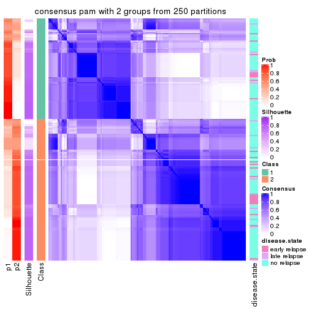</p>

</div>
<div id='tab-MAD-pam-consensus-heatmap-2'>
<pre><code class="r">consensus_heatmap(res, k = 3)
</code></pre>

<p>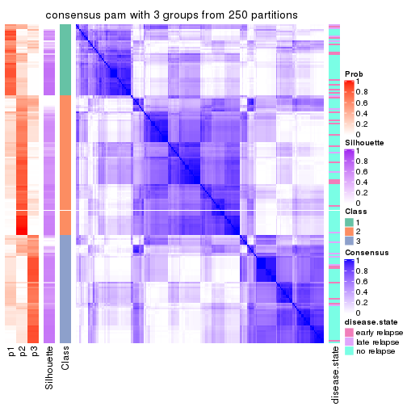</p>

</div>
<div id='tab-MAD-pam-consensus-heatmap-3'>
<pre><code class="r">consensus_heatmap(res, k = 4)
</code></pre>

<p>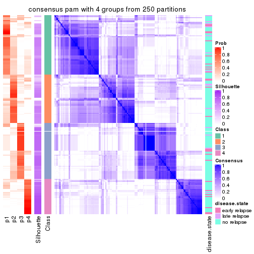</p>

</div>
<div id='tab-MAD-pam-consensus-heatmap-4'>
<pre><code class="r">consensus_heatmap(res, k = 5)
</code></pre>

<p>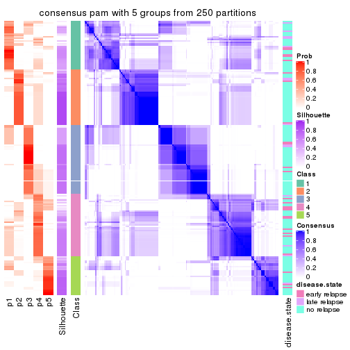</p>

</div>
<div id='tab-MAD-pam-consensus-heatmap-5'>
<pre><code class="r">consensus_heatmap(res, k = 6)
</code></pre>

<p>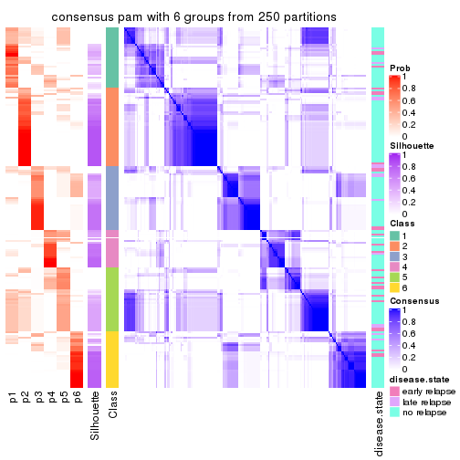</p>

</div>
</div>

Heatmaps for the membership of samples in all partitions to see how consistent they are:


<script>
$( function() {
	$( '#tabs-MAD-pam-membership-heatmap' ).tabs();
} );
</script>
<div id='tabs-MAD-pam-membership-heatmap'>
<ul>
<li><a href='#tab-MAD-pam-membership-heatmap-1'>k = 2</a></li>
<li><a href='#tab-MAD-pam-membership-heatmap-2'>k = 3</a></li>
<li><a href='#tab-MAD-pam-membership-heatmap-3'>k = 4</a></li>
<li><a href='#tab-MAD-pam-membership-heatmap-4'>k = 5</a></li>
<li><a href='#tab-MAD-pam-membership-heatmap-5'>k = 6</a></li>
</ul>
<div id='tab-MAD-pam-membership-heatmap-1'>
<pre><code class="r">membership_heatmap(res, k = 2)
</code></pre>

<p>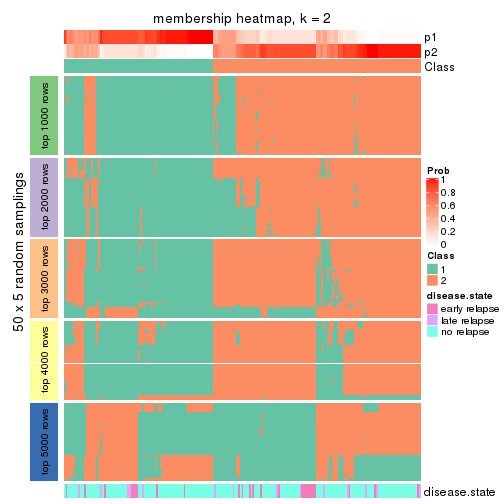</p>

</div>
<div id='tab-MAD-pam-membership-heatmap-2'>
<pre><code class="r">membership_heatmap(res, k = 3)
</code></pre>

<p>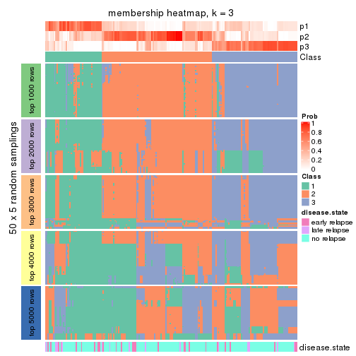</p>

</div>
<div id='tab-MAD-pam-membership-heatmap-3'>
<pre><code class="r">membership_heatmap(res, k = 4)
</code></pre>

<p>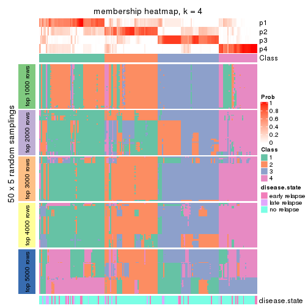</p>

</div>
<div id='tab-MAD-pam-membership-heatmap-4'>
<pre><code class="r">membership_heatmap(res, k = 5)
</code></pre>

<p>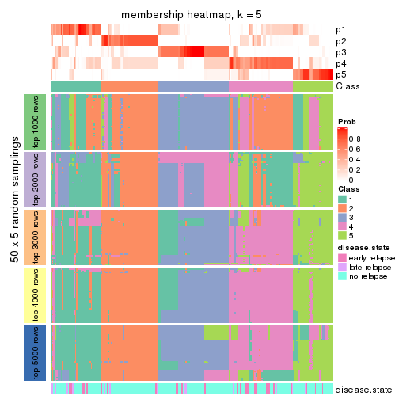</p>

</div>
<div id='tab-MAD-pam-membership-heatmap-5'>
<pre><code class="r">membership_heatmap(res, k = 6)
</code></pre>

<p>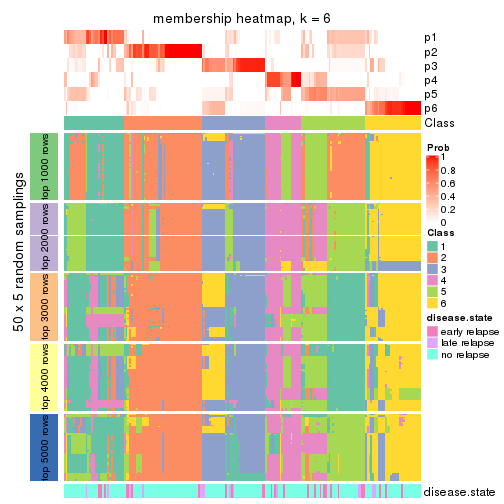</p>

</div>
</div>

As soon as we have had the classes for columns, we can look for signatures
which are significantly different between classes which can be candidate marks
for certain classes. Following are the heatmaps for signatures.


Signature heatmaps where rows are scaled:


<script>
$( function() {
	$( '#tabs-MAD-pam-get-signatures' ).tabs();
} );
</script>
<div id='tabs-MAD-pam-get-signatures'>
<ul>
<li><a href='#tab-MAD-pam-get-signatures-1'>k = 2</a></li>
<li><a href='#tab-MAD-pam-get-signatures-2'>k = 3</a></li>
<li><a href='#tab-MAD-pam-get-signatures-3'>k = 4</a></li>
<li><a href='#tab-MAD-pam-get-signatures-4'>k = 5</a></li>
<li><a href='#tab-MAD-pam-get-signatures-5'>k = 6</a></li>
</ul>
<div id='tab-MAD-pam-get-signatures-1'>
<pre><code class="r">get_signatures(res, k = 2)
</code></pre>

<p>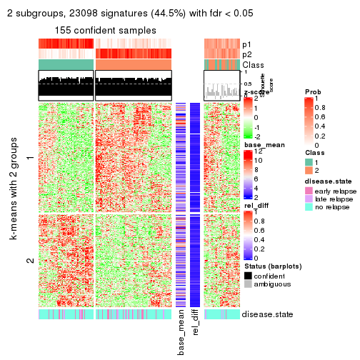</p>

</div>
<div id='tab-MAD-pam-get-signatures-2'>
<pre><code class="r">get_signatures(res, k = 3)
</code></pre>

<p>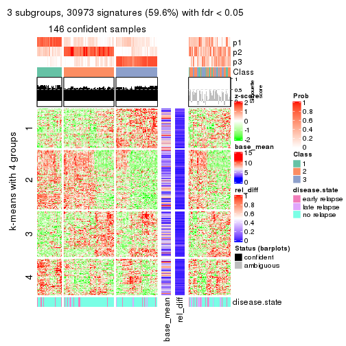</p>

</div>
<div id='tab-MAD-pam-get-signatures-3'>
<pre><code class="r">get_signatures(res, k = 4)
</code></pre>

<p>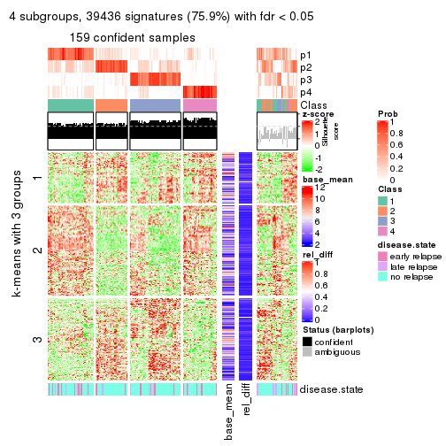</p>

</div>
<div id='tab-MAD-pam-get-signatures-4'>
<pre><code class="r">get_signatures(res, k = 5)
</code></pre>

<p>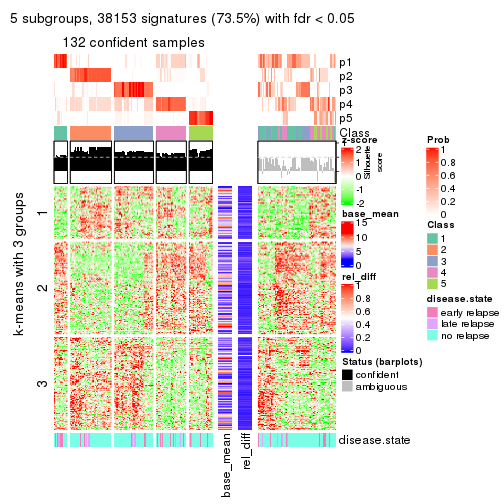</p>

</div>
<div id='tab-MAD-pam-get-signatures-5'>
<pre><code class="r">get_signatures(res, k = 6)
</code></pre>

<p>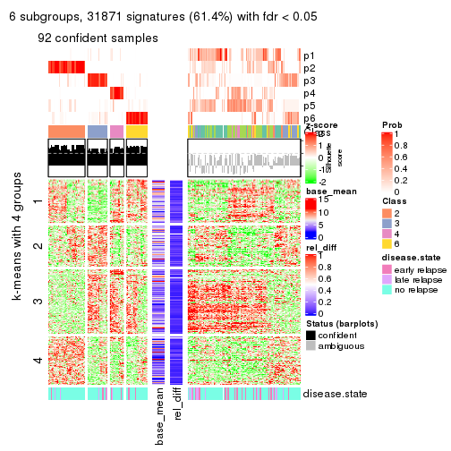</p>

</div>
</div>


Signature heatmaps where rows are not scaled:


<script>
$( function() {
	$( '#tabs-MAD-pam-get-signatures-no-scale' ).tabs();
} );
</script>
<div id='tabs-MAD-pam-get-signatures-no-scale'>
<ul>
<li><a href='#tab-MAD-pam-get-signatures-no-scale-1'>k = 2</a></li>
<li><a href='#tab-MAD-pam-get-signatures-no-scale-2'>k = 3</a></li>
<li><a href='#tab-MAD-pam-get-signatures-no-scale-3'>k = 4</a></li>
<li><a href='#tab-MAD-pam-get-signatures-no-scale-4'>k = 5</a></li>
<li><a href='#tab-MAD-pam-get-signatures-no-scale-5'>k = 6</a></li>
</ul>
<div id='tab-MAD-pam-get-signatures-no-scale-1'>
<pre><code class="r">get_signatures(res, k = 2, scale_rows = FALSE)
</code></pre>

<p>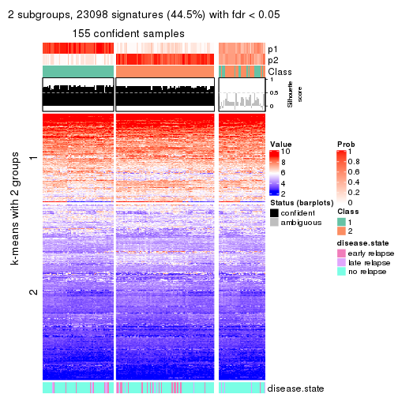</p>

</div>
<div id='tab-MAD-pam-get-signatures-no-scale-2'>
<pre><code class="r">get_signatures(res, k = 3, scale_rows = FALSE)
</code></pre>

<p>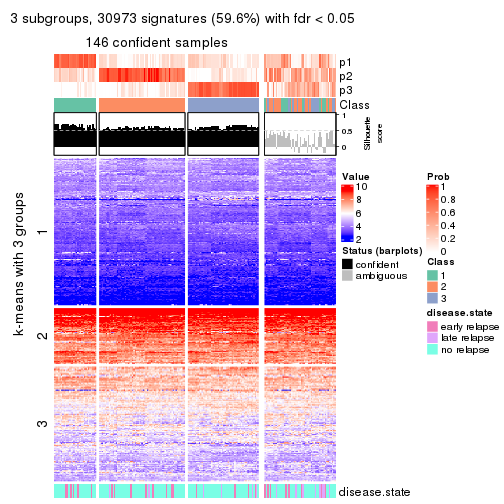</p>

</div>
<div id='tab-MAD-pam-get-signatures-no-scale-3'>
<pre><code class="r">get_signatures(res, k = 4, scale_rows = FALSE)
</code></pre>

<p>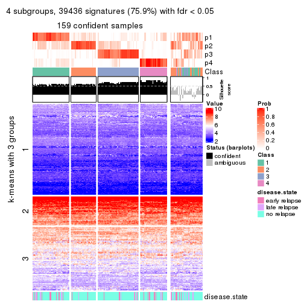</p>

</div>
<div id='tab-MAD-pam-get-signatures-no-scale-4'>
<pre><code class="r">get_signatures(res, k = 5, scale_rows = FALSE)
</code></pre>

<p>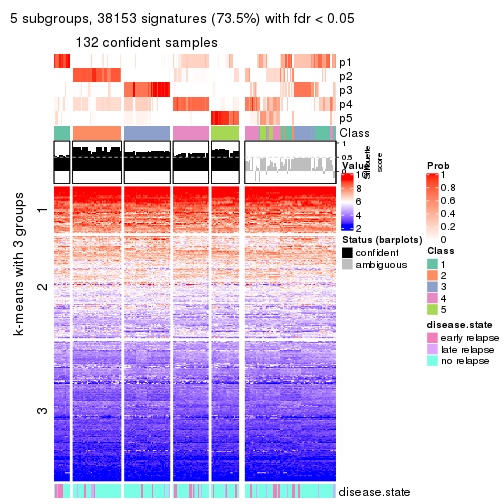</p>

</div>
<div id='tab-MAD-pam-get-signatures-no-scale-5'>
<pre><code class="r">get_signatures(res, k = 6, scale_rows = FALSE)
</code></pre>

<p>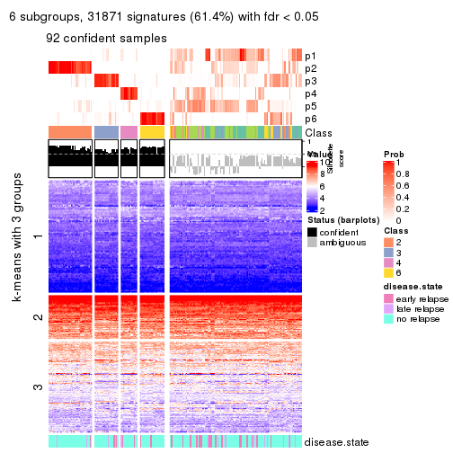</p>

</div>
</div>


Compare the overlap of signatures from different k:

```r
compare_signatures(res)
```

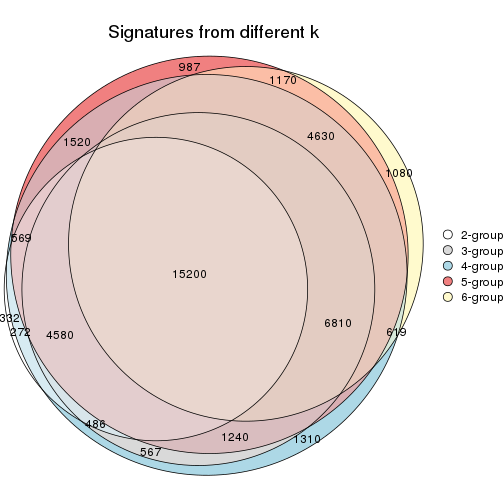

`get_signature()` returns a data frame invisibly. TO get the list of signatures, the function
call should be assigned to a variable explicitly. In following code, if `plot` argument is set
to `FALSE`, no heatmap is plotted while only the differential analysis is performed.

```r
# code only for demonstration
tb = get_signature(res, k = ..., plot = FALSE)
```

An example of the output of `tb` is:

```
#>   which_row         fdr    mean_1    mean_2 scaled_mean_1 scaled_mean_2 km
#> 1        38 0.042760348  8.373488  9.131774    -0.5533452     0.5164555  1
#> 2        40 0.018707592  7.106213  8.469186    -0.6173731     0.5762149  1
#> 3        55 0.019134737 10.221463 11.207825    -0.6159697     0.5749050  1
#> 4        59 0.006059896  5.921854  7.869574    -0.6899429     0.6439467  1
#> 5        60 0.018055526  8.928898 10.211722    -0.6204761     0.5791110  1
#> 6        98 0.009384629 15.714769 14.887706     0.6635654    -0.6193277  2
...
```

The columns in `tb` are:

1. `which_row`: row indices corresponding to the input matrix.
2. `fdr`: FDR for the differential test. 
3. `mean_x`: The mean value in group x.
4. `scaled_mean_x`: The mean value in group x after rows are scaled.
5. `km`: Row groups if k-means clustering is applied to rows.


UMAP plot which shows how samples are separated.


<script>
$( function() {
	$( '#tabs-MAD-pam-dimension-reduction' ).tabs();
} );
</script>
<div id='tabs-MAD-pam-dimension-reduction'>
<ul>
<li><a href='#tab-MAD-pam-dimension-reduction-1'>k = 2</a></li>
<li><a href='#tab-MAD-pam-dimension-reduction-2'>k = 3</a></li>
<li><a href='#tab-MAD-pam-dimension-reduction-3'>k = 4</a></li>
<li><a href='#tab-MAD-pam-dimension-reduction-4'>k = 5</a></li>
<li><a href='#tab-MAD-pam-dimension-reduction-5'>k = 6</a></li>
</ul>
<div id='tab-MAD-pam-dimension-reduction-1'>
<pre><code class="r">dimension_reduction(res, k = 2, method = &quot;UMAP&quot;)
</code></pre>

<p>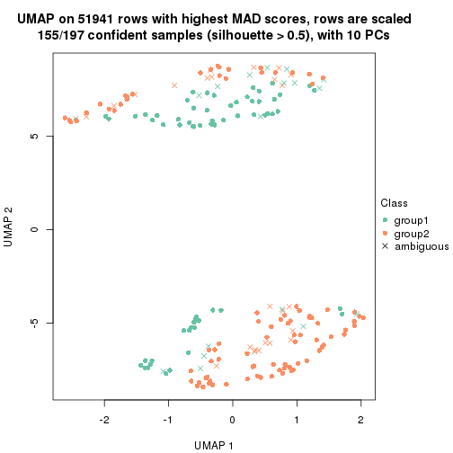</p>

</div>
<div id='tab-MAD-pam-dimension-reduction-2'>
<pre><code class="r">dimension_reduction(res, k = 3, method = &quot;UMAP&quot;)
</code></pre>

<p>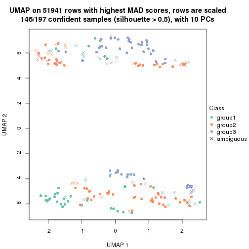</p>

</div>
<div id='tab-MAD-pam-dimension-reduction-3'>
<pre><code class="r">dimension_reduction(res, k = 4, method = &quot;UMAP&quot;)
</code></pre>

<p>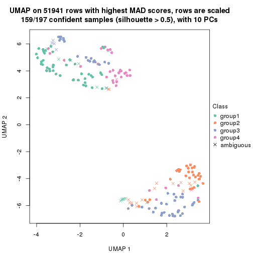</p>

</div>
<div id='tab-MAD-pam-dimension-reduction-4'>
<pre><code class="r">dimension_reduction(res, k = 5, method = &quot;UMAP&quot;)
</code></pre>

<p>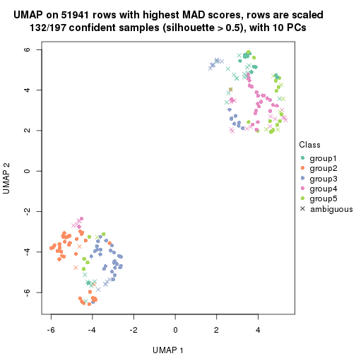</p>

</div>
<div id='tab-MAD-pam-dimension-reduction-5'>
<pre><code class="r">dimension_reduction(res, k = 6, method = &quot;UMAP&quot;)
</code></pre>

<p>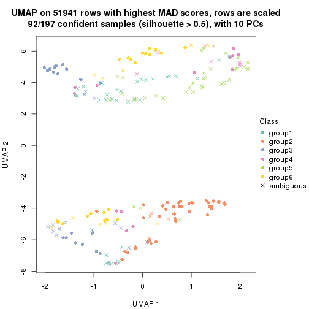</p>

</div>
</div>


Following heatmap shows how subgroups are split when increasing `k`:

```r
collect_classes(res)
```

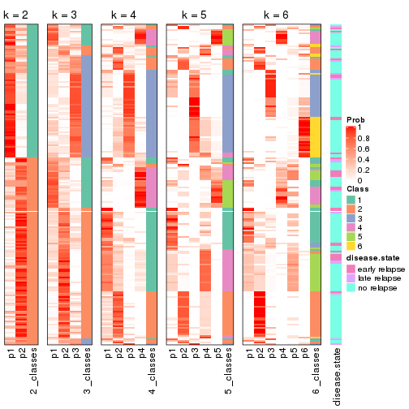


Test correlation between subgroups and known annotations. If the known
annotation is numeric, one-way ANOVA test is applied, and if the known
annotation is discrete, chi-squared contingency table test is applied.

```r
test_to_known_factors(res)
```

```
#>           n disease.state(p) k
#> MAD:pam 155           0.5288 2
#> MAD:pam 146           0.2647 3
#> MAD:pam 159           0.4347 4
#> MAD:pam 132           0.0729 5
#> MAD:pam  92           0.5982 6
```


If matrix rows can be associated to genes, consider to use `functional_enrichment(res,
...)` to perform function enrichment for the signature genes. See [this vignette](http://bioconductor.org/packages/devel/bioc/vignettes/cola/inst/doc/functional_enrichment.html) for more detailed explanations.


 

---------------------------------------------------


### MAD:mclust


The object with results only for a single top-value method and a single partition method 
can be extracted as:

```r
res = res_list["MAD", "mclust"]
# you can also extract it by
# res = res_list["MAD:mclust"]
```

A summary of `res` and all the functions that can be applied to it:

```r
res
```

```
#> A 'ConsensusPartition' object with k = 2, 3, 4, 5, 6.
#>   On a matrix with 51941 rows and 197 columns.
#>   Top rows (1000, 2000, 3000, 4000, 5000) are extracted by 'MAD' method.
#>   Subgroups are detected by 'mclust' method.
#>   Performed in total 1250 partitions by row resampling.
#>   Best k for subgroups seems to be 2.
#> 
#> Following methods can be applied to this 'ConsensusPartition' object:
#>  [1] "cola_report"             "collect_classes"         "collect_plots"          
#>  [4] "collect_stats"           "colnames"                "compare_signatures"     
#>  [7] "consensus_heatmap"       "dimension_reduction"     "functional_enrichment"  
#> [10] "get_anno_col"            "get_anno"                "get_classes"            
#> [13] "get_consensus"           "get_matrix"              "get_membership"         
#> [16] "get_param"               "get_signatures"          "get_stats"              
#> [19] "is_best_k"               "is_stable_k"             "membership_heatmap"     
#> [22] "ncol"                    "nrow"                    "plot_ecdf"              
#> [25] "rownames"                "select_partition_number" "show"                   
#> [28] "suggest_best_k"          "test_to_known_factors"
```

`collect_plots()` function collects all the plots made from `res` for all `k` (number of partitions)
into one single page to provide an easy and fast comparison between different `k`.

```r
collect_plots(res)
```

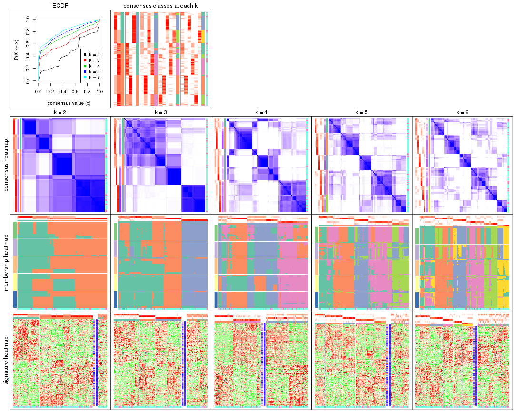

The plots are:

- The first row: a plot of the ECDF (empirical cumulative distribution
  function) curves of the consensus matrix for each `k` and the heatmap of
  predicted classes for each `k`.
- The second row: heatmaps of the consensus matrix for each `k`.
- The third row: heatmaps of the membership matrix for each `k`.
- The fouth row: heatmaps of the signatures for each `k`.

All the plots in panels can be made by individual functions and they are
plotted later in this section.

`select_partition_number()` produces several plots showing different
statistics for choosing "optimized" `k`. There are following statistics:

- ECDF curves of the consensus matrix for each `k`;
- 1-PAC. [The PAC
  score](https://en.wikipedia.org/wiki/Consensus_clustering#Over-interpretation_potential_of_consensus_clustering)
  measures the proportion of the ambiguous subgrouping.
- Mean silhouette score.
- Concordance. The mean probability of fiting the consensus class ids in all
  partitions.
- Area increased. Denote $A_k$ as the area under the ECDF curve for current
  `k`, the area increased is defined as $A_k - A_{k-1}$.
- Rand index. The percent of pairs of samples that are both in a same cluster
  or both are not in a same cluster in the partition of k and k-1.
- Jaccard index. The ratio of pairs of samples are both in a same cluster in
  the partition of k and k-1 and the pairs of samples are both in a same
  cluster in the partition k or k-1.

The detailed explanations of these statistics can be found in [the _cola_
vignette](http://bioconductor.org/packages/devel/bioc/vignettes/cola/inst/doc/cola.html#toc_13).

Generally speaking, lower PAC score, higher mean silhouette score or higher
concordance corresponds to better partition. Rand index and Jaccard index
measure how similar the current partition is compared to partition with `k-1`.
If they are too similar, we won't accept `k` is better than `k-1`.

```r
select_partition_number(res)
```

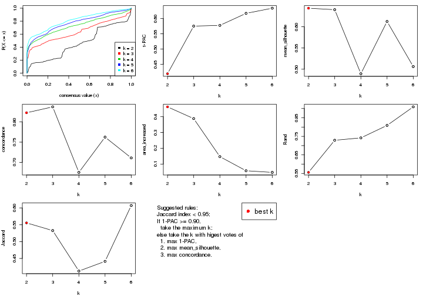

The numeric values for all these statistics can be obtained by `get_stats()`.

```r
get_stats(res)
```

```
#>   k 1-PAC mean_silhouette concordance area_increased  Rand Jaccard
#> 2 2 0.419           0.644       0.823         0.4622 0.556   0.556
#> 3 3 0.575           0.640       0.837         0.3880 0.729   0.533
#> 4 4 0.578           0.489       0.675         0.1471 0.742   0.413
#> 5 5 0.617           0.613       0.762         0.0578 0.809   0.441
#> 6 6 0.634           0.506       0.711         0.0474 0.909   0.607
```

`suggest_best_k()` suggests the best $k$ based on these statistics. The rules are as follows:

- All $k$ with Jaccard index larger than 0.95 are removed because increasing
  $k$ does not provide enough extra information. If all $k$ are removed, it is
  marked as no subgroup is detected.
- For all $k$ with 1-PAC score larger than 0.9, the maximal $k$ is taken as
  the best $k$, and other $k$ are marked as optional $k$.
- If it does not fit the second rule. The $k$ with the maximal vote of the
  highest 1-PAC score, highest mean silhouette, and highest concordance is
  taken as the best $k$.

```r
suggest_best_k(res)
```

```
#> [1] 2
```


Following shows the table of the partitions (You need to click the **show/hide
code output** link to see it). The membership matrix (columns with name `p*`)
is inferred by
[`clue::cl_consensus()`](https://www.rdocumentation.org/link/cl_consensus?package=clue)
function with the `SE` method. Basically the value in the membership matrix
represents the probability to belong to a certain group. The finall class
label for an item is determined with the group with highest probability it
belongs to.

In `get_classes()` function, the entropy is calculated from the membership
matrix and the silhouette score is calculated from the consensus matrix.


<script>
$( function() {
	$( '#tabs-MAD-mclust-get-classes' ).tabs();
} );
</script>
<div id='tabs-MAD-mclust-get-classes'>
<ul>
<li><a href='#tab-MAD-mclust-get-classes-1'>k = 2</a></li>
<li><a href='#tab-MAD-mclust-get-classes-2'>k = 3</a></li>
<li><a href='#tab-MAD-mclust-get-classes-3'>k = 4</a></li>
<li><a href='#tab-MAD-mclust-get-classes-4'>k = 5</a></li>
<li><a href='#tab-MAD-mclust-get-classes-5'>k = 6</a></li>
</ul>

<div id='tab-MAD-mclust-get-classes-1'>
<p><a id='tab-MAD-mclust-get-classes-1-a' style='color:#0366d6' href='#'>show/hide code output</a></p>
<pre><code class="r">cbind(get_classes(res, k = 2), get_membership(res, k = 2))
</code></pre>

<pre><code>#&gt;           class entropy silhouette    p1    p2
#&gt; GSM342319     2  0.2043      0.749 0.032 0.968
#&gt; GSM342323     2  0.1843      0.750 0.028 0.972
#&gt; GSM342325     2  0.2043      0.749 0.032 0.968
#&gt; GSM342326     2  0.1843      0.750 0.028 0.972
#&gt; GSM342327     2  0.1843      0.750 0.028 0.972
#&gt; GSM342329     2  0.1843      0.750 0.028 0.972
#&gt; GSM342331     2  0.1843      0.750 0.028 0.972
#&gt; GSM342334     2  0.1633      0.749 0.024 0.976
#&gt; GSM342335     2  0.0000      0.754 0.000 1.000
#&gt; GSM342354     1  0.9209      0.690 0.664 0.336
#&gt; GSM342371     2  0.0000      0.754 0.000 1.000
#&gt; GSM342380     2  0.1633      0.749 0.024 0.976
#&gt; GSM342382     2  0.0376      0.753 0.004 0.996
#&gt; GSM342399     2  0.2043      0.749 0.032 0.968
#&gt; GSM342402     2  0.7815      0.441 0.232 0.768
#&gt; GSM342404     2  0.0000      0.754 0.000 1.000
#&gt; GSM342408     1  0.9209      0.690 0.664 0.336
#&gt; GSM342409     2  0.5408      0.640 0.124 0.876
#&gt; GSM342426     2  0.9358      0.623 0.352 0.648
#&gt; GSM342441     1  0.0938      0.726 0.988 0.012
#&gt; GSM342444     1  0.0938      0.726 0.988 0.012
#&gt; GSM342451     1  0.0938      0.726 0.988 0.012
#&gt; GSM342462     2  0.9087      0.632 0.324 0.676
#&gt; GSM342467     2  0.9248      0.628 0.340 0.660
#&gt; GSM342484     1  0.9881     -0.231 0.564 0.436
#&gt; GSM342491     2  0.9552      0.596 0.376 0.624
#&gt; GSM342322     2  0.1633      0.749 0.024 0.976
#&gt; GSM342338     1  0.9209      0.690 0.664 0.336
#&gt; GSM342347     1  0.9209      0.690 0.664 0.336
#&gt; GSM342356     1  0.9209      0.690 0.664 0.336
#&gt; GSM342357     2  0.7139      0.518 0.196 0.804
#&gt; GSM342366     2  0.0000      0.754 0.000 1.000
#&gt; GSM342385     2  0.2043      0.744 0.032 0.968
#&gt; GSM342421     2  0.0000      0.754 0.000 1.000
#&gt; GSM342437     2  0.9358      0.620 0.352 0.648
#&gt; GSM342454     1  0.0938      0.726 0.988 0.012
#&gt; GSM342471     2  0.0672      0.754 0.008 0.992
#&gt; GSM342477     2  0.9323      0.623 0.348 0.652
#&gt; GSM342495     2  0.9087      0.632 0.324 0.676
#&gt; GSM342496     2  0.9393      0.616 0.356 0.644
#&gt; GSM342320     2  0.1843      0.750 0.028 0.972
#&gt; GSM342321     2  0.1633      0.749 0.024 0.976
#&gt; GSM342324     2  0.1843      0.750 0.028 0.972
#&gt; GSM342328     2  0.1843      0.750 0.028 0.972
#&gt; GSM342330     2  0.1843      0.750 0.028 0.972
#&gt; GSM342332     2  0.1633      0.749 0.024 0.976
#&gt; GSM342333     2  0.1414      0.751 0.020 0.980
#&gt; GSM342336     2  0.1633      0.749 0.024 0.976
#&gt; GSM342337     1  0.9209      0.690 0.664 0.336
#&gt; GSM342339     1  0.9209      0.690 0.664 0.336
#&gt; GSM342340     1  0.9209      0.690 0.664 0.336
#&gt; GSM342341     1  0.9209      0.690 0.664 0.336
#&gt; GSM342342     1  0.9209      0.690 0.664 0.336
#&gt; GSM342343     1  0.9209      0.690 0.664 0.336
#&gt; GSM342344     1  0.9209      0.690 0.664 0.336
#&gt; GSM342345     1  0.9209      0.690 0.664 0.336
#&gt; GSM342346     1  0.9993      0.464 0.516 0.484
#&gt; GSM342348     2  0.7815      0.441 0.232 0.768
#&gt; GSM342349     1  0.9209      0.690 0.664 0.336
#&gt; GSM342350     1  0.9209      0.690 0.664 0.336
#&gt; GSM342351     1  0.9209      0.690 0.664 0.336
#&gt; GSM342352     1  0.9209      0.690 0.664 0.336
#&gt; GSM342353     1  0.9209      0.690 0.664 0.336
#&gt; GSM342355     1  0.9661      0.625 0.608 0.392
#&gt; GSM342358     2  0.8016      0.412 0.244 0.756
#&gt; GSM342359     2  0.9996     -0.406 0.488 0.512
#&gt; GSM342360     2  0.9661     -0.098 0.392 0.608
#&gt; GSM342361     1  0.9993      0.464 0.516 0.484
#&gt; GSM342362     2  0.3274      0.719 0.060 0.940
#&gt; GSM342363     2  0.2423      0.738 0.040 0.960
#&gt; GSM342364     2  0.0000      0.754 0.000 1.000
#&gt; GSM342365     2  0.0376      0.754 0.004 0.996
#&gt; GSM342367     2  0.0376      0.753 0.004 0.996
#&gt; GSM342368     2  0.0000      0.754 0.000 1.000
#&gt; GSM342369     2  0.0000      0.754 0.000 1.000
#&gt; GSM342370     2  0.0376      0.754 0.004 0.996
#&gt; GSM342372     2  0.0376      0.754 0.004 0.996
#&gt; GSM342373     2  0.0000      0.754 0.000 1.000
#&gt; GSM342374     2  0.0376      0.754 0.004 0.996
#&gt; GSM342375     2  0.0376      0.754 0.004 0.996
#&gt; GSM342376     2  0.1414      0.752 0.020 0.980
#&gt; GSM342377     2  0.0672      0.752 0.008 0.992
#&gt; GSM342378     2  0.2236      0.747 0.036 0.964
#&gt; GSM342379     2  0.1633      0.749 0.024 0.976
#&gt; GSM342381     2  0.0672      0.752 0.008 0.992
#&gt; GSM342383     2  0.0938      0.753 0.012 0.988
#&gt; GSM342384     2  0.0672      0.752 0.008 0.992
#&gt; GSM342386     2  0.0376      0.753 0.004 0.996
#&gt; GSM342387     2  0.1843      0.750 0.028 0.972
#&gt; GSM342388     1  0.9209      0.690 0.664 0.336
#&gt; GSM342389     2  0.0672      0.752 0.008 0.992
#&gt; GSM342390     1  0.9993      0.464 0.516 0.484
#&gt; GSM342391     2  0.3114      0.727 0.056 0.944
#&gt; GSM342392     1  0.9209      0.690 0.664 0.336
#&gt; GSM342393     2  0.0000      0.754 0.000 1.000
#&gt; GSM342394     2  0.2043      0.749 0.032 0.968
#&gt; GSM342395     2  0.0000      0.754 0.000 1.000
#&gt; GSM342396     1  0.9209      0.690 0.664 0.336
#&gt; GSM342397     1  0.9775      0.596 0.588 0.412
#&gt; GSM342398     2  0.0672      0.752 0.008 0.992
#&gt; GSM342400     2  0.0672      0.752 0.008 0.992
#&gt; GSM342401     1  0.9209      0.690 0.664 0.336
#&gt; GSM342403     2  0.7602      0.468 0.220 0.780
#&gt; GSM342405     2  0.9993     -0.395 0.484 0.516
#&gt; GSM342406     1  0.9993      0.464 0.516 0.484
#&gt; GSM342407     1  0.9209      0.690 0.664 0.336
#&gt; GSM342410     2  0.7139      0.518 0.196 0.804
#&gt; GSM342411     2  0.1633      0.749 0.024 0.976
#&gt; GSM342412     2  0.1843      0.750 0.028 0.972
#&gt; GSM342413     1  0.9993      0.464 0.516 0.484
#&gt; GSM342414     1  0.9209      0.690 0.664 0.336
#&gt; GSM342415     2  0.0000      0.754 0.000 1.000
#&gt; GSM342416     2  0.9866     -0.242 0.432 0.568
#&gt; GSM342417     2  0.1843      0.750 0.028 0.972
#&gt; GSM342418     2  0.1843      0.750 0.028 0.972
#&gt; GSM342419     2  0.0672      0.752 0.008 0.992
#&gt; GSM342420     2  0.1843      0.750 0.028 0.972
#&gt; GSM342422     2  0.0672      0.752 0.008 0.992
#&gt; GSM342423     2  0.0000      0.754 0.000 1.000
#&gt; GSM342424     2  0.1843      0.750 0.028 0.972
#&gt; GSM342425     2  0.9358      0.623 0.352 0.648
#&gt; GSM342427     2  0.9087      0.632 0.324 0.676
#&gt; GSM342428     2  0.9087      0.632 0.324 0.676
#&gt; GSM342429     2  0.9087      0.632 0.324 0.676
#&gt; GSM342430     1  0.0938      0.726 0.988 0.012
#&gt; GSM342431     1  0.0938      0.726 0.988 0.012
#&gt; GSM342432     1  0.1414      0.721 0.980 0.020
#&gt; GSM342433     1  0.0938      0.726 0.988 0.012
#&gt; GSM342434     1  0.0938      0.726 0.988 0.012
#&gt; GSM342435     1  0.0938      0.726 0.988 0.012
#&gt; GSM342436     1  0.0938      0.726 0.988 0.012
#&gt; GSM342438     1  0.0938      0.726 0.988 0.012
#&gt; GSM342439     1  0.0938      0.726 0.988 0.012
#&gt; GSM342440     1  0.0938      0.726 0.988 0.012
#&gt; GSM342442     1  0.0938      0.726 0.988 0.012
#&gt; GSM342443     2  0.9087      0.632 0.324 0.676
#&gt; GSM342445     1  0.0938      0.726 0.988 0.012
#&gt; GSM342446     1  0.0938      0.726 0.988 0.012
#&gt; GSM342447     1  0.7674      0.706 0.776 0.224
#&gt; GSM342448     1  0.0938      0.726 0.988 0.012
#&gt; GSM342449     1  0.0938      0.726 0.988 0.012
#&gt; GSM342450     1  0.0938      0.726 0.988 0.012
#&gt; GSM342452     1  0.0938      0.726 0.988 0.012
#&gt; GSM342453     1  0.0938      0.726 0.988 0.012
#&gt; GSM342455     1  0.0938      0.726 0.988 0.012
#&gt; GSM342456     2  0.9998     -0.416 0.492 0.508
#&gt; GSM342457     2  0.8499      0.653 0.276 0.724
#&gt; GSM342458     2  0.9087      0.632 0.324 0.676
#&gt; GSM342459     2  0.9087      0.632 0.324 0.676
#&gt; GSM342460     2  0.9087      0.632 0.324 0.676
#&gt; GSM342461     2  0.9087      0.632 0.324 0.676
#&gt; GSM342463     2  0.9087      0.632 0.324 0.676
#&gt; GSM342464     2  0.9087      0.632 0.324 0.676
#&gt; GSM342465     2  0.9087      0.632 0.324 0.676
#&gt; GSM342466     2  0.9686     -0.113 0.396 0.604
#&gt; GSM342468     2  0.0000      0.754 0.000 1.000
#&gt; GSM342469     2  0.0938      0.753 0.012 0.988
#&gt; GSM342470     2  0.9996     -0.406 0.488 0.512
#&gt; GSM342472     1  0.6343      0.570 0.840 0.160
#&gt; GSM342473     2  0.9087      0.632 0.324 0.676
#&gt; GSM342474     2  0.9087      0.632 0.324 0.676
#&gt; GSM342475     1  0.0938      0.726 0.988 0.012
#&gt; GSM342476     2  0.9087      0.632 0.324 0.676
#&gt; GSM342478     2  0.9087      0.632 0.324 0.676
#&gt; GSM342479     2  0.9087      0.632 0.324 0.676
#&gt; GSM342480     2  0.9087      0.632 0.324 0.676
#&gt; GSM342481     2  0.9087      0.632 0.324 0.676
#&gt; GSM342482     2  0.9087      0.632 0.324 0.676
#&gt; GSM342483     2  0.9087      0.632 0.324 0.676
#&gt; GSM342485     2  0.9087      0.632 0.324 0.676
#&gt; GSM342486     2  0.9087      0.632 0.324 0.676
#&gt; GSM342487     1  0.0938      0.726 0.988 0.012
#&gt; GSM342488     2  0.9087      0.632 0.324 0.676
#&gt; GSM342489     2  0.9087      0.632 0.324 0.676
#&gt; GSM342490     2  0.9087      0.632 0.324 0.676
#&gt; GSM342492     1  0.0938      0.726 0.988 0.012
#&gt; GSM342493     2  0.9087      0.632 0.324 0.676
#&gt; GSM342494     2  0.9087      0.632 0.324 0.676
#&gt; GSM342497     2  0.9087      0.632 0.324 0.676
#&gt; GSM342498     2  0.9323      0.623 0.348 0.652
#&gt; GSM342499     2  0.4431      0.732 0.092 0.908
#&gt; GSM342500     2  0.9087      0.632 0.324 0.676
#&gt; GSM342501     2  0.9286      0.625 0.344 0.656
#&gt; GSM342502     2  0.9087      0.632 0.324 0.676
#&gt; GSM342503     2  0.9087      0.632 0.324 0.676
#&gt; GSM342504     2  0.9087      0.632 0.324 0.676
#&gt; GSM342505     1  0.0938      0.726 0.988 0.012
#&gt; GSM342506     2  0.9988      0.424 0.480 0.520
#&gt; GSM342507     2  0.7950      0.422 0.240 0.760
#&gt; GSM342508     2  0.7883      0.659 0.236 0.764
#&gt; GSM342509     1  0.7815      0.494 0.768 0.232
#&gt; GSM342510     1  0.6343      0.570 0.840 0.160
#&gt; GSM342511     1  0.2948      0.698 0.948 0.052
#&gt; GSM342512     2  0.9087      0.632 0.324 0.676
#&gt; GSM342513     2  0.9087      0.632 0.324 0.676
#&gt; GSM342514     1  0.2778      0.701 0.952 0.048
#&gt; GSM342515     2  0.2043      0.749 0.032 0.968
</code></pre>

<script>
$('#tab-MAD-mclust-get-classes-1-a').parent().next().next().hide();
$('#tab-MAD-mclust-get-classes-1-a').click(function(){
  $('#tab-MAD-mclust-get-classes-1-a').parent().next().next().toggle();
  return(false);
});
</script>
</div>

<div id='tab-MAD-mclust-get-classes-2'>
<p><a id='tab-MAD-mclust-get-classes-2-a' style='color:#0366d6' href='#'>show/hide code output</a></p>
<pre><code class="r">cbind(get_classes(res, k = 3), get_membership(res, k = 3))
</code></pre>

<pre><code>#&gt;           class entropy silhouette    p1    p2    p3
#&gt; GSM342319     1  0.5253    0.66498 0.792 0.188 0.020
#&gt; GSM342323     1  0.3551    0.70370 0.868 0.132 0.000
#&gt; GSM342325     1  0.6195    0.55471 0.704 0.276 0.020
#&gt; GSM342326     1  0.4291    0.67536 0.820 0.180 0.000
#&gt; GSM342327     1  0.3551    0.70370 0.868 0.132 0.000
#&gt; GSM342329     1  0.3619    0.70187 0.864 0.136 0.000
#&gt; GSM342331     1  0.3551    0.70370 0.868 0.132 0.000
#&gt; GSM342334     1  0.4555    0.59695 0.800 0.200 0.000
#&gt; GSM342335     1  0.5810    0.46041 0.664 0.336 0.000
#&gt; GSM342354     3  0.1643    0.96040 0.044 0.000 0.956
#&gt; GSM342371     2  0.6513    0.07643 0.476 0.520 0.004
#&gt; GSM342380     1  0.2636    0.70167 0.932 0.048 0.020
#&gt; GSM342382     2  0.7059    0.09053 0.460 0.520 0.020
#&gt; GSM342399     1  0.4802    0.68751 0.824 0.156 0.020
#&gt; GSM342402     1  0.0892    0.69632 0.980 0.000 0.020
#&gt; GSM342404     1  0.5621    0.50274 0.692 0.308 0.000
#&gt; GSM342408     3  0.1643    0.96040 0.044 0.000 0.956
#&gt; GSM342409     1  0.5292    0.61573 0.800 0.172 0.028
#&gt; GSM342426     1  0.6299    0.12514 0.524 0.476 0.000
#&gt; GSM342441     3  0.0892    0.96789 0.000 0.020 0.980
#&gt; GSM342444     3  0.0237    0.96446 0.000 0.004 0.996
#&gt; GSM342451     3  0.0892    0.96789 0.000 0.020 0.980
#&gt; GSM342462     2  0.0000    0.69601 0.000 1.000 0.000
#&gt; GSM342467     1  0.6357    0.36998 0.652 0.336 0.012
#&gt; GSM342484     1  0.6151    0.55744 0.772 0.160 0.068
#&gt; GSM342491     2  0.5588    0.43425 0.276 0.720 0.004
#&gt; GSM342322     1  0.4921    0.68291 0.816 0.164 0.020
#&gt; GSM342338     3  0.1031    0.96246 0.024 0.000 0.976
#&gt; GSM342347     3  0.1753    0.95819 0.048 0.000 0.952
#&gt; GSM342356     3  0.2878    0.88886 0.096 0.000 0.904
#&gt; GSM342357     1  0.0892    0.69632 0.980 0.000 0.020
#&gt; GSM342366     2  0.6941    0.08730 0.464 0.520 0.016
#&gt; GSM342385     1  0.1636    0.70072 0.964 0.016 0.020
#&gt; GSM342421     2  0.6305    0.05888 0.484 0.516 0.000
#&gt; GSM342437     2  0.6244    0.14458 0.440 0.560 0.000
#&gt; GSM342454     3  0.0892    0.96789 0.000 0.020 0.980
#&gt; GSM342471     1  0.6308    0.00455 0.508 0.492 0.000
#&gt; GSM342477     1  0.6307    0.01660 0.512 0.488 0.000
#&gt; GSM342495     2  0.0000    0.69601 0.000 1.000 0.000
#&gt; GSM342496     2  0.5743    0.49217 0.172 0.784 0.044
#&gt; GSM342320     1  0.3482    0.70494 0.872 0.128 0.000
#&gt; GSM342321     1  0.3551    0.70370 0.868 0.132 0.000
#&gt; GSM342324     1  0.0000    0.69539 1.000 0.000 0.000
#&gt; GSM342328     1  0.3551    0.70370 0.868 0.132 0.000
#&gt; GSM342330     1  0.3551    0.70370 0.868 0.132 0.000
#&gt; GSM342332     1  0.4887    0.63249 0.772 0.228 0.000
#&gt; GSM342333     1  0.4555    0.59695 0.800 0.200 0.000
#&gt; GSM342336     1  0.5706    0.48578 0.680 0.320 0.000
#&gt; GSM342337     3  0.2796    0.89409 0.092 0.000 0.908
#&gt; GSM342339     3  0.1031    0.96246 0.024 0.000 0.976
#&gt; GSM342340     3  0.1031    0.96246 0.024 0.000 0.976
#&gt; GSM342341     3  0.1031    0.96246 0.024 0.000 0.976
#&gt; GSM342342     3  0.1031    0.96246 0.024 0.000 0.976
#&gt; GSM342343     3  0.1031    0.96246 0.024 0.000 0.976
#&gt; GSM342344     3  0.1643    0.96040 0.044 0.000 0.956
#&gt; GSM342345     3  0.1031    0.96246 0.024 0.000 0.976
#&gt; GSM342346     1  0.9318    0.28451 0.476 0.172 0.352
#&gt; GSM342348     1  0.0747    0.69651 0.984 0.000 0.016
#&gt; GSM342349     3  0.1643    0.96040 0.044 0.000 0.956
#&gt; GSM342350     3  0.1643    0.96040 0.044 0.000 0.956
#&gt; GSM342351     3  0.1643    0.96040 0.044 0.000 0.956
#&gt; GSM342352     3  0.1643    0.96040 0.044 0.000 0.956
#&gt; GSM342353     3  0.1643    0.96040 0.044 0.000 0.956
#&gt; GSM342355     3  0.3267    0.87395 0.116 0.000 0.884
#&gt; GSM342358     1  0.0000    0.69539 1.000 0.000 0.000
#&gt; GSM342359     1  0.3412    0.65619 0.876 0.000 0.124
#&gt; GSM342360     1  0.3116    0.66549 0.892 0.000 0.108
#&gt; GSM342361     1  0.4235    0.61260 0.824 0.000 0.176
#&gt; GSM342362     1  0.0000    0.69539 1.000 0.000 0.000
#&gt; GSM342363     1  0.2050    0.69768 0.952 0.028 0.020
#&gt; GSM342364     2  0.7059    0.09053 0.460 0.520 0.020
#&gt; GSM342365     1  0.6111    0.32959 0.604 0.396 0.000
#&gt; GSM342367     2  0.7059    0.09053 0.460 0.520 0.020
#&gt; GSM342368     2  0.7059    0.09053 0.460 0.520 0.020
#&gt; GSM342369     2  0.6305    0.05888 0.484 0.516 0.000
#&gt; GSM342370     1  0.5968    0.40518 0.636 0.364 0.000
#&gt; GSM342372     1  0.6274    0.15349 0.544 0.456 0.000
#&gt; GSM342373     2  0.6813    0.08385 0.468 0.520 0.012
#&gt; GSM342374     1  0.6267    0.16660 0.548 0.452 0.000
#&gt; GSM342375     1  0.5810    0.46041 0.664 0.336 0.000
#&gt; GSM342376     1  0.5551    0.58851 0.768 0.212 0.020
#&gt; GSM342377     1  0.7074    0.05291 0.500 0.480 0.020
#&gt; GSM342378     1  0.2527    0.70905 0.936 0.044 0.020
#&gt; GSM342379     1  0.4921    0.68312 0.816 0.164 0.020
#&gt; GSM342381     2  0.7059    0.09053 0.460 0.520 0.020
#&gt; GSM342383     1  0.6053    0.59562 0.720 0.260 0.020
#&gt; GSM342384     2  0.7059    0.09053 0.460 0.520 0.020
#&gt; GSM342386     2  0.7059    0.09053 0.460 0.520 0.020
#&gt; GSM342387     1  0.2165    0.71079 0.936 0.064 0.000
#&gt; GSM342388     3  0.1031    0.96246 0.024 0.000 0.976
#&gt; GSM342389     2  0.7063    0.07653 0.464 0.516 0.020
#&gt; GSM342390     1  0.6126    0.31383 0.600 0.000 0.400
#&gt; GSM342391     1  0.1129    0.69822 0.976 0.004 0.020
#&gt; GSM342392     3  0.1031    0.96246 0.024 0.000 0.976
#&gt; GSM342393     1  0.5318    0.59045 0.780 0.204 0.016
#&gt; GSM342394     1  0.4741    0.69070 0.828 0.152 0.020
#&gt; GSM342395     2  0.6941    0.08730 0.464 0.520 0.016
#&gt; GSM342396     3  0.1031    0.96246 0.024 0.000 0.976
#&gt; GSM342397     3  0.2448    0.94196 0.076 0.000 0.924
#&gt; GSM342398     2  0.7059    0.09053 0.460 0.520 0.020
#&gt; GSM342400     2  0.7063    0.07653 0.464 0.516 0.020
#&gt; GSM342401     3  0.1031    0.96246 0.024 0.000 0.976
#&gt; GSM342403     1  0.5915    0.63734 0.792 0.128 0.080
#&gt; GSM342405     1  0.5803    0.58417 0.760 0.028 0.212
#&gt; GSM342406     1  0.4062    0.62941 0.836 0.000 0.164
#&gt; GSM342407     3  0.1643    0.96040 0.044 0.000 0.956
#&gt; GSM342410     1  0.0892    0.69632 0.980 0.000 0.020
#&gt; GSM342411     1  0.2537    0.71142 0.920 0.080 0.000
#&gt; GSM342412     1  0.4291    0.62158 0.820 0.180 0.000
#&gt; GSM342413     1  0.4842    0.57194 0.776 0.000 0.224
#&gt; GSM342414     3  0.1643    0.96040 0.044 0.000 0.956
#&gt; GSM342415     1  0.5859    0.44627 0.656 0.344 0.000
#&gt; GSM342416     1  0.3482    0.65317 0.872 0.000 0.128
#&gt; GSM342417     1  0.3551    0.70370 0.868 0.132 0.000
#&gt; GSM342418     1  0.3116    0.70929 0.892 0.108 0.000
#&gt; GSM342419     1  0.7075    0.03560 0.496 0.484 0.020
#&gt; GSM342420     1  0.3551    0.70370 0.868 0.132 0.000
#&gt; GSM342422     2  0.7059    0.09053 0.460 0.520 0.020
#&gt; GSM342423     2  0.6305    0.05888 0.484 0.516 0.000
#&gt; GSM342424     1  0.5397    0.55384 0.720 0.280 0.000
#&gt; GSM342425     2  0.5678    0.35931 0.316 0.684 0.000
#&gt; GSM342427     2  0.5621    0.40143 0.308 0.692 0.000
#&gt; GSM342428     2  0.5650    0.39540 0.312 0.688 0.000
#&gt; GSM342429     2  0.0000    0.69601 0.000 1.000 0.000
#&gt; GSM342430     3  0.0892    0.96789 0.000 0.020 0.980
#&gt; GSM342431     3  0.0892    0.96789 0.000 0.020 0.980
#&gt; GSM342432     3  0.2810    0.94060 0.036 0.036 0.928
#&gt; GSM342433     3  0.0892    0.96789 0.000 0.020 0.980
#&gt; GSM342434     3  0.0983    0.96759 0.004 0.016 0.980
#&gt; GSM342435     3  0.0892    0.96789 0.000 0.020 0.980
#&gt; GSM342436     3  0.0892    0.96789 0.000 0.020 0.980
#&gt; GSM342438     3  0.0892    0.96789 0.000 0.020 0.980
#&gt; GSM342439     3  0.0892    0.96789 0.000 0.020 0.980
#&gt; GSM342440     3  0.0892    0.96789 0.000 0.020 0.980
#&gt; GSM342442     3  0.0892    0.96789 0.000 0.020 0.980
#&gt; GSM342443     2  0.0000    0.69601 0.000 1.000 0.000
#&gt; GSM342445     3  0.0892    0.96789 0.000 0.020 0.980
#&gt; GSM342446     3  0.0892    0.96789 0.000 0.020 0.980
#&gt; GSM342447     3  0.0000    0.96318 0.000 0.000 1.000
#&gt; GSM342448     3  0.0892    0.96789 0.000 0.020 0.980
#&gt; GSM342449     3  0.0892    0.96789 0.000 0.020 0.980
#&gt; GSM342450     3  0.0892    0.96789 0.000 0.020 0.980
#&gt; GSM342452     3  0.0892    0.96789 0.000 0.020 0.980
#&gt; GSM342453     3  0.0892    0.96789 0.000 0.020 0.980
#&gt; GSM342455     3  0.0892    0.96789 0.000 0.020 0.980
#&gt; GSM342456     1  0.3879    0.63358 0.848 0.000 0.152
#&gt; GSM342457     2  0.6865    0.24818 0.384 0.596 0.020
#&gt; GSM342458     2  0.6140    0.24053 0.404 0.596 0.000
#&gt; GSM342459     2  0.0000    0.69601 0.000 1.000 0.000
#&gt; GSM342460     2  0.0000    0.69601 0.000 1.000 0.000
#&gt; GSM342461     2  0.0000    0.69601 0.000 1.000 0.000
#&gt; GSM342463     2  0.0000    0.69601 0.000 1.000 0.000
#&gt; GSM342464     2  0.0000    0.69601 0.000 1.000 0.000
#&gt; GSM342465     2  0.0000    0.69601 0.000 1.000 0.000
#&gt; GSM342466     1  0.4842    0.61132 0.776 0.000 0.224
#&gt; GSM342468     2  0.6302    0.07246 0.480 0.520 0.000
#&gt; GSM342469     2  0.7063    0.07715 0.464 0.516 0.020
#&gt; GSM342470     1  0.5216    0.55183 0.740 0.000 0.260
#&gt; GSM342472     3  0.1765    0.95745 0.040 0.004 0.956
#&gt; GSM342473     2  0.0000    0.69601 0.000 1.000 0.000
#&gt; GSM342474     2  0.0000    0.69601 0.000 1.000 0.000
#&gt; GSM342475     3  0.0892    0.96789 0.000 0.020 0.980
#&gt; GSM342476     2  0.0000    0.69601 0.000 1.000 0.000
#&gt; GSM342478     2  0.0000    0.69601 0.000 1.000 0.000
#&gt; GSM342479     2  0.0000    0.69601 0.000 1.000 0.000
#&gt; GSM342480     2  0.0000    0.69601 0.000 1.000 0.000
#&gt; GSM342481     2  0.0000    0.69601 0.000 1.000 0.000
#&gt; GSM342482     2  0.0000    0.69601 0.000 1.000 0.000
#&gt; GSM342483     2  0.0000    0.69601 0.000 1.000 0.000
#&gt; GSM342485     2  0.0000    0.69601 0.000 1.000 0.000
#&gt; GSM342486     2  0.0000    0.69601 0.000 1.000 0.000
#&gt; GSM342487     3  0.0892    0.96789 0.000 0.020 0.980
#&gt; GSM342488     2  0.0000    0.69601 0.000 1.000 0.000
#&gt; GSM342489     2  0.0000    0.69601 0.000 1.000 0.000
#&gt; GSM342490     2  0.1753    0.65873 0.048 0.952 0.000
#&gt; GSM342492     3  0.0892    0.96789 0.000 0.020 0.980
#&gt; GSM342493     2  0.0000    0.69601 0.000 1.000 0.000
#&gt; GSM342494     2  0.0000    0.69601 0.000 1.000 0.000
#&gt; GSM342497     2  0.0237    0.69338 0.004 0.996 0.000
#&gt; GSM342498     2  0.4277    0.60310 0.132 0.852 0.016
#&gt; GSM342499     2  0.6881    0.24077 0.388 0.592 0.020
#&gt; GSM342500     2  0.0000    0.69601 0.000 1.000 0.000
#&gt; GSM342501     2  0.0237    0.69338 0.004 0.996 0.000
#&gt; GSM342502     2  0.0000    0.69601 0.000 1.000 0.000
#&gt; GSM342503     2  0.0000    0.69601 0.000 1.000 0.000
#&gt; GSM342504     2  0.0000    0.69601 0.000 1.000 0.000
#&gt; GSM342505     3  0.0892    0.96789 0.000 0.020 0.980
#&gt; GSM342506     1  0.8728    0.38022 0.592 0.208 0.200
#&gt; GSM342507     1  0.1163    0.69631 0.972 0.000 0.028
#&gt; GSM342508     1  0.4741    0.61318 0.828 0.152 0.020
#&gt; GSM342509     1  0.8501    0.08551 0.488 0.092 0.420
#&gt; GSM342510     3  0.5623    0.66267 0.280 0.004 0.716
#&gt; GSM342511     3  0.2947    0.93344 0.060 0.020 0.920
#&gt; GSM342512     2  0.0000    0.69601 0.000 1.000 0.000
#&gt; GSM342513     2  0.0000    0.69601 0.000 1.000 0.000
#&gt; GSM342514     3  0.1129    0.96693 0.004 0.020 0.976
#&gt; GSM342515     1  0.5305    0.65985 0.788 0.192 0.020
</code></pre>

<script>
$('#tab-MAD-mclust-get-classes-2-a').parent().next().next().hide();
$('#tab-MAD-mclust-get-classes-2-a').click(function(){
  $('#tab-MAD-mclust-get-classes-2-a').parent().next().next().toggle();
  return(false);
});
</script>
</div>

<div id='tab-MAD-mclust-get-classes-3'>
<p><a id='tab-MAD-mclust-get-classes-3-a' style='color:#0366d6' href='#'>show/hide code output</a></p>
<pre><code class="r">cbind(get_classes(res, k = 4), get_membership(res, k = 4))
</code></pre>

<pre><code>#&gt;           class entropy silhouette    p1    p2    p3    p4
#&gt; GSM342319     4  0.1211     0.7317 0.040 0.000 0.000 0.960
#&gt; GSM342323     4  0.0657     0.7294 0.012 0.000 0.004 0.984
#&gt; GSM342325     4  0.1489     0.7335 0.044 0.004 0.000 0.952
#&gt; GSM342326     4  0.1938     0.7032 0.012 0.000 0.052 0.936
#&gt; GSM342327     4  0.1059     0.7249 0.012 0.000 0.016 0.972
#&gt; GSM342329     4  0.0657     0.7294 0.012 0.000 0.004 0.984
#&gt; GSM342331     4  0.1584     0.7143 0.012 0.000 0.036 0.952
#&gt; GSM342334     1  0.8576     0.4066 0.392 0.056 0.392 0.160
#&gt; GSM342335     4  0.4513     0.7405 0.040 0.160 0.004 0.796
#&gt; GSM342354     3  0.0000     0.4002 0.000 0.000 1.000 0.000
#&gt; GSM342371     4  0.5110     0.6421 0.004 0.372 0.004 0.620
#&gt; GSM342380     1  0.7771     0.4191 0.404 0.004 0.392 0.200
#&gt; GSM342382     4  0.5839     0.6286 0.044 0.352 0.000 0.604
#&gt; GSM342399     4  0.1824     0.7346 0.060 0.004 0.000 0.936
#&gt; GSM342402     1  0.7666     0.4114 0.396 0.000 0.392 0.212
#&gt; GSM342404     4  0.7066     0.6946 0.100 0.152 0.076 0.672
#&gt; GSM342408     3  0.0000     0.4002 0.000 0.000 1.000 0.000
#&gt; GSM342409     3  0.7953    -0.3669 0.412 0.100 0.440 0.048
#&gt; GSM342426     4  0.4284     0.5371 0.012 0.224 0.000 0.764
#&gt; GSM342441     3  0.4941     0.4330 0.436 0.000 0.564 0.000
#&gt; GSM342444     1  0.5000    -0.4378 0.500 0.000 0.500 0.000
#&gt; GSM342451     1  0.4999    -0.4351 0.508 0.000 0.492 0.000
#&gt; GSM342462     2  0.0000     0.8674 0.000 1.000 0.000 0.000
#&gt; GSM342467     2  0.5587     0.5812 0.312 0.652 0.004 0.032
#&gt; GSM342484     2  0.7886     0.1116 0.396 0.424 0.016 0.164
#&gt; GSM342491     2  0.6301     0.5180 0.260 0.636 0.000 0.104
#&gt; GSM342322     4  0.0707     0.7301 0.020 0.000 0.000 0.980
#&gt; GSM342338     3  0.2081     0.3853 0.084 0.000 0.916 0.000
#&gt; GSM342347     3  0.0707     0.3821 0.020 0.000 0.980 0.000
#&gt; GSM342356     3  0.3764     0.2207 0.216 0.000 0.784 0.000
#&gt; GSM342357     1  0.7648     0.4139 0.400 0.000 0.392 0.208
#&gt; GSM342366     4  0.5668     0.6660 0.032 0.328 0.004 0.636
#&gt; GSM342385     1  0.7608     0.4194 0.408 0.000 0.392 0.200
#&gt; GSM342421     4  0.4282     0.7469 0.036 0.148 0.004 0.812
#&gt; GSM342437     2  0.6286     0.5515 0.200 0.660 0.000 0.140
#&gt; GSM342454     1  0.4999    -0.4351 0.508 0.000 0.492 0.000
#&gt; GSM342471     4  0.3771     0.7575 0.052 0.088 0.004 0.856
#&gt; GSM342477     2  0.5710     0.6229 0.192 0.708 0.000 0.100
#&gt; GSM342495     2  0.0188     0.8670 0.004 0.996 0.000 0.000
#&gt; GSM342496     2  0.3910     0.8075 0.120 0.844 0.016 0.020
#&gt; GSM342320     4  0.2329     0.6861 0.012 0.000 0.072 0.916
#&gt; GSM342321     4  0.0657     0.7294 0.012 0.000 0.004 0.984
#&gt; GSM342324     4  0.7701    -0.3694 0.220 0.000 0.388 0.392
#&gt; GSM342328     4  0.0657     0.7294 0.012 0.000 0.004 0.984
#&gt; GSM342330     4  0.1488     0.7166 0.012 0.000 0.032 0.956
#&gt; GSM342332     4  0.1707     0.7364 0.024 0.020 0.004 0.952
#&gt; GSM342333     1  0.8678     0.3646 0.400 0.092 0.392 0.116
#&gt; GSM342336     4  0.5245     0.7203 0.052 0.076 0.076 0.796
#&gt; GSM342337     3  0.3610     0.2448 0.200 0.000 0.800 0.000
#&gt; GSM342339     3  0.3942     0.4483 0.236 0.000 0.764 0.000
#&gt; GSM342340     3  0.3688     0.4411 0.208 0.000 0.792 0.000
#&gt; GSM342341     3  0.3942     0.4483 0.236 0.000 0.764 0.000
#&gt; GSM342342     3  0.3873     0.4467 0.228 0.000 0.772 0.000
#&gt; GSM342343     3  0.3942     0.4483 0.236 0.000 0.764 0.000
#&gt; GSM342344     3  0.0000     0.4002 0.000 0.000 1.000 0.000
#&gt; GSM342345     3  0.3942     0.4483 0.236 0.000 0.764 0.000
#&gt; GSM342346     3  0.7928    -0.4128 0.408 0.044 0.444 0.104
#&gt; GSM342348     1  0.7648     0.4139 0.400 0.000 0.392 0.208
#&gt; GSM342349     3  0.0000     0.4002 0.000 0.000 1.000 0.000
#&gt; GSM342350     3  0.0000     0.4002 0.000 0.000 1.000 0.000
#&gt; GSM342351     3  0.0000     0.4002 0.000 0.000 1.000 0.000
#&gt; GSM342352     3  0.0000     0.4002 0.000 0.000 1.000 0.000
#&gt; GSM342353     3  0.0469     0.3976 0.012 0.000 0.988 0.000
#&gt; GSM342355     3  0.5376     0.0235 0.176 0.000 0.736 0.088
#&gt; GSM342358     3  0.7758    -0.4378 0.368 0.000 0.396 0.236
#&gt; GSM342359     3  0.7530    -0.4090 0.376 0.000 0.436 0.188
#&gt; GSM342360     3  0.7673    -0.4264 0.368 0.000 0.416 0.216
#&gt; GSM342361     3  0.7485    -0.4048 0.380 0.000 0.440 0.180
#&gt; GSM342362     4  0.7684    -0.2840 0.220 0.000 0.360 0.420
#&gt; GSM342363     4  0.3975     0.6100 0.240 0.000 0.000 0.760
#&gt; GSM342364     4  0.5311     0.6186 0.008 0.392 0.004 0.596
#&gt; GSM342365     4  0.4513     0.7405 0.040 0.160 0.004 0.796
#&gt; GSM342367     4  0.5713     0.6259 0.036 0.360 0.000 0.604
#&gt; GSM342368     4  0.5588     0.6272 0.020 0.376 0.004 0.600
#&gt; GSM342369     4  0.4741     0.6814 0.000 0.328 0.004 0.668
#&gt; GSM342370     4  0.4513     0.7405 0.040 0.160 0.004 0.796
#&gt; GSM342372     4  0.4376     0.7402 0.028 0.172 0.004 0.796
#&gt; GSM342373     4  0.5404     0.6222 0.012 0.384 0.004 0.600
#&gt; GSM342374     4  0.4655     0.7409 0.040 0.160 0.008 0.792
#&gt; GSM342375     4  0.4693     0.7409 0.044 0.156 0.008 0.792
#&gt; GSM342376     4  0.7729     0.4204 0.280 0.032 0.140 0.548
#&gt; GSM342377     4  0.5142     0.7325 0.064 0.192 0.000 0.744
#&gt; GSM342378     4  0.4919     0.5931 0.200 0.000 0.048 0.752
#&gt; GSM342379     4  0.1022     0.7307 0.032 0.000 0.000 0.968
#&gt; GSM342381     4  0.5929     0.6711 0.064 0.296 0.000 0.640
#&gt; GSM342383     4  0.2699     0.7424 0.068 0.028 0.000 0.904
#&gt; GSM342384     4  0.5920     0.6418 0.052 0.336 0.000 0.612
#&gt; GSM342386     4  0.5756     0.6177 0.036 0.372 0.000 0.592
#&gt; GSM342387     4  0.2483     0.7016 0.032 0.000 0.052 0.916
#&gt; GSM342388     3  0.3907     0.4431 0.232 0.000 0.768 0.000
#&gt; GSM342389     4  0.5666     0.6397 0.036 0.348 0.000 0.616
#&gt; GSM342390     3  0.7044    -0.2896 0.276 0.000 0.560 0.164
#&gt; GSM342391     4  0.6715     0.3515 0.252 0.000 0.144 0.604
#&gt; GSM342392     3  0.3942     0.4483 0.236 0.000 0.764 0.000
#&gt; GSM342393     2  0.8995     0.1320 0.336 0.416 0.140 0.108
#&gt; GSM342394     4  0.1637     0.7330 0.060 0.000 0.000 0.940
#&gt; GSM342395     4  0.5165     0.6280 0.004 0.388 0.004 0.604
#&gt; GSM342396     3  0.3942     0.4483 0.236 0.000 0.764 0.000
#&gt; GSM342397     3  0.2342     0.3009 0.080 0.000 0.912 0.008
#&gt; GSM342398     4  0.6033     0.6541 0.064 0.316 0.000 0.620
#&gt; GSM342400     4  0.5947     0.6602 0.060 0.312 0.000 0.628
#&gt; GSM342401     3  0.3942     0.4483 0.236 0.000 0.764 0.000
#&gt; GSM342403     1  0.8071     0.4121 0.432 0.032 0.392 0.144
#&gt; GSM342405     3  0.7511    -0.3596 0.412 0.060 0.476 0.052
#&gt; GSM342406     3  0.7416    -0.4134 0.392 0.000 0.440 0.168
#&gt; GSM342407     3  0.0000     0.4002 0.000 0.000 1.000 0.000
#&gt; GSM342410     1  0.7629     0.4176 0.404 0.000 0.392 0.204
#&gt; GSM342411     4  0.2936     0.7001 0.040 0.004 0.056 0.900
#&gt; GSM342412     4  0.7871     0.1952 0.116 0.048 0.300 0.536
#&gt; GSM342413     3  0.7485    -0.4048 0.380 0.000 0.440 0.180
#&gt; GSM342414     3  0.0000     0.4002 0.000 0.000 1.000 0.000
#&gt; GSM342415     4  0.4388     0.7492 0.048 0.136 0.004 0.812
#&gt; GSM342416     3  0.7566    -0.4360 0.392 0.000 0.416 0.192
#&gt; GSM342417     4  0.0937     0.7266 0.012 0.000 0.012 0.976
#&gt; GSM342418     4  0.1854     0.7063 0.012 0.000 0.048 0.940
#&gt; GSM342419     4  0.5021     0.7375 0.064 0.180 0.000 0.756
#&gt; GSM342420     4  0.0657     0.7294 0.012 0.000 0.004 0.984
#&gt; GSM342422     4  0.5917     0.6553 0.056 0.320 0.000 0.624
#&gt; GSM342423     4  0.4872     0.6607 0.000 0.356 0.004 0.640
#&gt; GSM342424     4  0.0657     0.7294 0.012 0.000 0.004 0.984
#&gt; GSM342425     2  0.5408     0.2436 0.012 0.500 0.000 0.488
#&gt; GSM342427     2  0.4181     0.7098 0.052 0.820 0.000 0.128
#&gt; GSM342428     4  0.5957     0.4872 0.040 0.420 0.000 0.540
#&gt; GSM342429     2  0.1474     0.8541 0.052 0.948 0.000 0.000
#&gt; GSM342430     1  0.4999    -0.4351 0.508 0.000 0.492 0.000
#&gt; GSM342431     1  0.4999    -0.4351 0.508 0.000 0.492 0.000
#&gt; GSM342432     3  0.4925     0.4326 0.428 0.000 0.572 0.000
#&gt; GSM342433     3  0.4941     0.4330 0.436 0.000 0.564 0.000
#&gt; GSM342434     3  0.4916     0.4322 0.424 0.000 0.576 0.000
#&gt; GSM342435     3  0.4941     0.4330 0.436 0.000 0.564 0.000
#&gt; GSM342436     3  0.4941     0.4330 0.436 0.000 0.564 0.000
#&gt; GSM342438     3  0.4941     0.4330 0.436 0.000 0.564 0.000
#&gt; GSM342439     3  0.4941     0.4330 0.436 0.000 0.564 0.000
#&gt; GSM342440     3  0.4941     0.4330 0.436 0.000 0.564 0.000
#&gt; GSM342442     3  0.4941     0.4330 0.436 0.000 0.564 0.000
#&gt; GSM342443     2  0.0000     0.8674 0.000 1.000 0.000 0.000
#&gt; GSM342445     3  0.4941     0.4330 0.436 0.000 0.564 0.000
#&gt; GSM342446     3  0.4941     0.4330 0.436 0.000 0.564 0.000
#&gt; GSM342447     3  0.4981     0.4093 0.464 0.000 0.536 0.000
#&gt; GSM342448     3  0.4933     0.4325 0.432 0.000 0.568 0.000
#&gt; GSM342449     3  0.4941     0.4330 0.436 0.000 0.564 0.000
#&gt; GSM342450     3  0.4941     0.4330 0.436 0.000 0.564 0.000
#&gt; GSM342452     3  0.4967     0.4258 0.452 0.000 0.548 0.000
#&gt; GSM342453     3  0.5000     0.3980 0.500 0.000 0.500 0.000
#&gt; GSM342455     3  0.4941     0.4330 0.436 0.000 0.564 0.000
#&gt; GSM342456     3  0.7773    -0.4095 0.380 0.008 0.432 0.180
#&gt; GSM342457     4  0.5465     0.6045 0.020 0.392 0.000 0.588
#&gt; GSM342458     4  0.5243     0.5810 0.004 0.416 0.004 0.576
#&gt; GSM342459     2  0.0000     0.8674 0.000 1.000 0.000 0.000
#&gt; GSM342460     2  0.0000     0.8674 0.000 1.000 0.000 0.000
#&gt; GSM342461     2  0.0469     0.8659 0.012 0.988 0.000 0.000
#&gt; GSM342463     2  0.0592     0.8645 0.016 0.984 0.000 0.000
#&gt; GSM342464     2  0.0592     0.8645 0.016 0.984 0.000 0.000
#&gt; GSM342465     2  0.1004     0.8621 0.024 0.972 0.000 0.004
#&gt; GSM342466     1  0.8920     0.3841 0.400 0.092 0.360 0.148
#&gt; GSM342468     4  0.5560     0.6712 0.028 0.324 0.004 0.644
#&gt; GSM342469     4  0.5598     0.7104 0.076 0.220 0.000 0.704
#&gt; GSM342470     1  0.9590     0.3449 0.392 0.208 0.240 0.160
#&gt; GSM342472     3  0.8944     0.1764 0.360 0.180 0.384 0.076
#&gt; GSM342473     2  0.0188     0.8669 0.004 0.996 0.000 0.000
#&gt; GSM342474     2  0.0336     0.8665 0.008 0.992 0.000 0.000
#&gt; GSM342475     3  0.4941     0.4330 0.436 0.000 0.564 0.000
#&gt; GSM342476     2  0.1661     0.8528 0.052 0.944 0.000 0.004
#&gt; GSM342478     2  0.0188     0.8675 0.004 0.996 0.000 0.000
#&gt; GSM342479     2  0.2483     0.8410 0.052 0.916 0.000 0.032
#&gt; GSM342480     2  0.1022     0.8619 0.032 0.968 0.000 0.000
#&gt; GSM342481     2  0.0469     0.8659 0.012 0.988 0.000 0.000
#&gt; GSM342482     2  0.0000     0.8674 0.000 1.000 0.000 0.000
#&gt; GSM342483     2  0.0000     0.8674 0.000 1.000 0.000 0.000
#&gt; GSM342485     2  0.1174     0.8575 0.020 0.968 0.000 0.012
#&gt; GSM342486     2  0.1174     0.8575 0.020 0.968 0.000 0.012
#&gt; GSM342487     3  0.4941     0.4330 0.436 0.000 0.564 0.000
#&gt; GSM342488     2  0.1474     0.8541 0.052 0.948 0.000 0.000
#&gt; GSM342489     2  0.0000     0.8674 0.000 1.000 0.000 0.000
#&gt; GSM342490     2  0.2759     0.8335 0.052 0.904 0.000 0.044
#&gt; GSM342492     3  0.4941     0.4330 0.436 0.000 0.564 0.000
#&gt; GSM342493     2  0.0895     0.8615 0.020 0.976 0.000 0.004
#&gt; GSM342494     2  0.0336     0.8668 0.008 0.992 0.000 0.000
#&gt; GSM342497     2  0.1661     0.8528 0.052 0.944 0.000 0.004
#&gt; GSM342498     2  0.4424     0.7564 0.088 0.812 0.000 0.100
#&gt; GSM342499     4  0.5845     0.6877 0.076 0.252 0.000 0.672
#&gt; GSM342500     2  0.0000     0.8674 0.000 1.000 0.000 0.000
#&gt; GSM342501     2  0.3533     0.8162 0.080 0.864 0.000 0.056
#&gt; GSM342502     2  0.0469     0.8659 0.012 0.988 0.000 0.000
#&gt; GSM342503     2  0.0000     0.8674 0.000 1.000 0.000 0.000
#&gt; GSM342504     2  0.0000     0.8674 0.000 1.000 0.000 0.000
#&gt; GSM342505     3  0.4992     0.4126 0.476 0.000 0.524 0.000
#&gt; GSM342506     2  0.7484     0.2416 0.388 0.464 0.008 0.140
#&gt; GSM342507     3  0.7648    -0.4459 0.392 0.000 0.400 0.208
#&gt; GSM342508     2  0.7290     0.3166 0.328 0.504 0.000 0.168
#&gt; GSM342509     1  0.7652     0.1385 0.548 0.276 0.024 0.152
#&gt; GSM342510     1  0.9424    -0.0555 0.412 0.156 0.264 0.168
#&gt; GSM342511     3  0.7125     0.2981 0.392 0.132 0.476 0.000
#&gt; GSM342512     2  0.0921     0.8640 0.028 0.972 0.000 0.000
#&gt; GSM342513     2  0.1488     0.8575 0.032 0.956 0.000 0.012
#&gt; GSM342514     3  0.6197     0.4023 0.440 0.000 0.508 0.052
#&gt; GSM342515     4  0.4332     0.7392 0.072 0.112 0.000 0.816
</code></pre>

<script>
$('#tab-MAD-mclust-get-classes-3-a').parent().next().next().hide();
$('#tab-MAD-mclust-get-classes-3-a').click(function(){
  $('#tab-MAD-mclust-get-classes-3-a').parent().next().next().toggle();
  return(false);
});
</script>
</div>

<div id='tab-MAD-mclust-get-classes-4'>
<p><a id='tab-MAD-mclust-get-classes-4-a' style='color:#0366d6' href='#'>show/hide code output</a></p>
<pre><code class="r">cbind(get_classes(res, k = 5), get_membership(res, k = 5))
</code></pre>

<pre><code>#&gt;           class entropy silhouette    p1    p2    p3    p4    p5
#&gt; GSM342319     1  0.4597     0.2007 0.564 0.012 0.000 0.424 0.000
#&gt; GSM342323     4  0.2286     0.7204 0.108 0.004 0.000 0.888 0.000
#&gt; GSM342325     1  0.5208     0.2025 0.544 0.012 0.000 0.420 0.024
#&gt; GSM342326     4  0.1644     0.7390 0.048 0.004 0.000 0.940 0.008
#&gt; GSM342327     4  0.2052     0.7339 0.080 0.004 0.000 0.912 0.004
#&gt; GSM342329     4  0.2286     0.7204 0.108 0.004 0.000 0.888 0.000
#&gt; GSM342331     4  0.2054     0.7362 0.072 0.004 0.000 0.916 0.008
#&gt; GSM342334     4  0.3072     0.7210 0.016 0.004 0.012 0.868 0.100
#&gt; GSM342335     4  0.3719     0.6744 0.116 0.068 0.000 0.816 0.000
#&gt; GSM342354     5  0.5405     0.5746 0.000 0.000 0.380 0.064 0.556
#&gt; GSM342371     1  0.3039     0.6726 0.836 0.152 0.000 0.012 0.000
#&gt; GSM342380     4  0.4474     0.7039 0.052 0.004 0.020 0.784 0.140
#&gt; GSM342382     1  0.1753     0.6992 0.936 0.032 0.000 0.000 0.032
#&gt; GSM342399     4  0.4270     0.5353 0.320 0.012 0.000 0.668 0.000
#&gt; GSM342402     4  0.4467     0.7036 0.044 0.004 0.024 0.784 0.144
#&gt; GSM342404     4  0.5623     0.4605 0.092 0.212 0.000 0.672 0.024
#&gt; GSM342408     5  0.5375     0.5788 0.000 0.000 0.368 0.064 0.568
#&gt; GSM342409     4  0.5687     0.3683 0.032 0.012 0.024 0.616 0.316
#&gt; GSM342426     2  0.6982     0.2844 0.116 0.440 0.000 0.396 0.048
#&gt; GSM342441     3  0.0000     0.8388 0.000 0.000 1.000 0.000 0.000
#&gt; GSM342444     3  0.3876     0.5991 0.000 0.000 0.684 0.000 0.316
#&gt; GSM342451     3  0.3452     0.6810 0.000 0.000 0.756 0.000 0.244
#&gt; GSM342462     2  0.0798     0.7527 0.008 0.976 0.000 0.000 0.016
#&gt; GSM342467     2  0.7782     0.4167 0.100 0.524 0.016 0.180 0.180
#&gt; GSM342484     2  0.9167     0.1975 0.100 0.360 0.080 0.244 0.216
#&gt; GSM342491     2  0.6456     0.5232 0.016 0.600 0.016 0.248 0.120
#&gt; GSM342322     4  0.4415     0.1811 0.444 0.004 0.000 0.552 0.000
#&gt; GSM342338     5  0.3885     0.6289 0.000 0.000 0.176 0.040 0.784
#&gt; GSM342347     5  0.5480     0.5806 0.000 0.000 0.368 0.072 0.560
#&gt; GSM342356     5  0.4082     0.6238 0.008 0.000 0.160 0.044 0.788
#&gt; GSM342357     4  0.4467     0.7036 0.044 0.004 0.024 0.784 0.144
#&gt; GSM342366     1  0.3264     0.6828 0.820 0.164 0.000 0.016 0.000
#&gt; GSM342385     4  0.4412     0.7033 0.060 0.004 0.012 0.784 0.140
#&gt; GSM342421     4  0.4430     0.0144 0.456 0.004 0.000 0.540 0.000
#&gt; GSM342437     2  0.5797     0.5525 0.012 0.624 0.000 0.260 0.104
#&gt; GSM342454     3  0.3395     0.6884 0.000 0.000 0.764 0.000 0.236
#&gt; GSM342471     1  0.4138     0.5259 0.708 0.016 0.000 0.276 0.000
#&gt; GSM342477     2  0.7152     0.4586 0.088 0.532 0.000 0.264 0.116
#&gt; GSM342495     2  0.0671     0.7521 0.004 0.980 0.000 0.000 0.016
#&gt; GSM342496     2  0.5293     0.6167 0.052 0.700 0.000 0.212 0.036
#&gt; GSM342320     4  0.1644     0.7392 0.048 0.004 0.000 0.940 0.008
#&gt; GSM342321     4  0.2338     0.7175 0.112 0.004 0.000 0.884 0.000
#&gt; GSM342324     4  0.2727     0.7289 0.016 0.004 0.004 0.884 0.092
#&gt; GSM342328     4  0.2286     0.7204 0.108 0.004 0.000 0.888 0.000
#&gt; GSM342330     4  0.1857     0.7385 0.060 0.004 0.000 0.928 0.008
#&gt; GSM342332     4  0.3949     0.4703 0.300 0.004 0.000 0.696 0.000
#&gt; GSM342333     4  0.3058     0.7234 0.020 0.004 0.008 0.868 0.100
#&gt; GSM342336     4  0.1644     0.7403 0.048 0.004 0.000 0.940 0.008
#&gt; GSM342337     5  0.4122     0.6222 0.008 0.000 0.164 0.044 0.784
#&gt; GSM342339     5  0.3621     0.6157 0.000 0.000 0.192 0.020 0.788
#&gt; GSM342340     5  0.3844     0.6202 0.004 0.000 0.180 0.028 0.788
#&gt; GSM342341     5  0.3621     0.6157 0.000 0.000 0.192 0.020 0.788
#&gt; GSM342342     5  0.3621     0.6157 0.000 0.000 0.192 0.020 0.788
#&gt; GSM342343     5  0.3742     0.6169 0.004 0.000 0.188 0.020 0.788
#&gt; GSM342344     5  0.5432     0.5703 0.000 0.000 0.392 0.064 0.544
#&gt; GSM342345     5  0.3621     0.6157 0.000 0.000 0.192 0.020 0.788
#&gt; GSM342346     5  0.5624     0.4805 0.012 0.004 0.060 0.308 0.616
#&gt; GSM342348     4  0.4077     0.7071 0.040 0.004 0.024 0.816 0.116
#&gt; GSM342349     5  0.5364     0.5797 0.000 0.000 0.364 0.064 0.572
#&gt; GSM342350     5  0.5405     0.5746 0.000 0.000 0.380 0.064 0.556
#&gt; GSM342351     5  0.5328     0.5817 0.000 0.000 0.352 0.064 0.584
#&gt; GSM342352     5  0.5405     0.5746 0.000 0.000 0.380 0.064 0.556
#&gt; GSM342353     5  0.5415     0.5701 0.000 0.000 0.384 0.064 0.552
#&gt; GSM342355     5  0.5969     0.5859 0.008 0.000 0.140 0.244 0.608
#&gt; GSM342358     4  0.3552     0.7093 0.012 0.004 0.028 0.840 0.116
#&gt; GSM342359     4  0.5313     0.1689 0.000 0.000 0.056 0.556 0.388
#&gt; GSM342360     4  0.4126     0.6838 0.008 0.004 0.040 0.792 0.156
#&gt; GSM342361     5  0.5139     0.4687 0.000 0.000 0.060 0.316 0.624
#&gt; GSM342362     4  0.3952     0.7155 0.036 0.004 0.024 0.824 0.112
#&gt; GSM342363     4  0.5180     0.7051 0.124 0.004 0.024 0.740 0.108
#&gt; GSM342364     1  0.2674     0.6480 0.856 0.140 0.000 0.004 0.000
#&gt; GSM342365     4  0.5689     0.4580 0.160 0.192 0.000 0.644 0.004
#&gt; GSM342367     1  0.1197     0.7073 0.952 0.048 0.000 0.000 0.000
#&gt; GSM342368     1  0.1704     0.7004 0.928 0.068 0.000 0.004 0.000
#&gt; GSM342369     1  0.6613     0.2911 0.440 0.228 0.000 0.332 0.000
#&gt; GSM342370     4  0.5756     0.4448 0.168 0.192 0.000 0.636 0.004
#&gt; GSM342372     4  0.6171     0.2993 0.240 0.204 0.000 0.556 0.000
#&gt; GSM342373     1  0.3203     0.6278 0.820 0.168 0.000 0.012 0.000
#&gt; GSM342374     4  0.5166     0.5052 0.100 0.204 0.000 0.692 0.004
#&gt; GSM342375     4  0.5167     0.5019 0.116 0.200 0.000 0.684 0.000
#&gt; GSM342376     4  0.4557     0.6670 0.204 0.004 0.000 0.736 0.056
#&gt; GSM342377     1  0.5099     0.3474 0.596 0.020 0.000 0.368 0.016
#&gt; GSM342378     4  0.4578     0.6192 0.244 0.004 0.000 0.712 0.040
#&gt; GSM342379     4  0.2891     0.6947 0.176 0.000 0.000 0.824 0.000
#&gt; GSM342381     1  0.0771     0.7157 0.976 0.020 0.000 0.004 0.000
#&gt; GSM342383     1  0.5340     0.0996 0.508 0.020 0.000 0.452 0.020
#&gt; GSM342384     1  0.0703     0.7142 0.976 0.024 0.000 0.000 0.000
#&gt; GSM342386     1  0.2329     0.6562 0.876 0.124 0.000 0.000 0.000
#&gt; GSM342387     4  0.1443     0.7425 0.044 0.004 0.000 0.948 0.004
#&gt; GSM342388     5  0.3795     0.6189 0.004 0.000 0.184 0.024 0.788
#&gt; GSM342389     1  0.0703     0.7142 0.976 0.024 0.000 0.000 0.000
#&gt; GSM342390     5  0.5595     0.5303 0.016 0.000 0.076 0.268 0.640
#&gt; GSM342391     4  0.4359     0.7043 0.092 0.004 0.000 0.776 0.128
#&gt; GSM342392     5  0.3621     0.6157 0.000 0.000 0.192 0.020 0.788
#&gt; GSM342393     4  0.7618     0.3687 0.068 0.204 0.016 0.524 0.188
#&gt; GSM342394     1  0.4607     0.3546 0.620 0.008 0.000 0.364 0.008
#&gt; GSM342395     1  0.3942     0.6154 0.728 0.260 0.000 0.012 0.000
#&gt; GSM342396     5  0.3621     0.6157 0.000 0.000 0.192 0.020 0.788
#&gt; GSM342397     5  0.5538     0.5962 0.000 0.000 0.212 0.144 0.644
#&gt; GSM342398     1  0.1173     0.7133 0.964 0.020 0.000 0.004 0.012
#&gt; GSM342400     1  0.0703     0.7142 0.976 0.024 0.000 0.000 0.000
#&gt; GSM342401     5  0.3621     0.6157 0.000 0.000 0.192 0.020 0.788
#&gt; GSM342403     4  0.4812     0.6837 0.048 0.004 0.024 0.752 0.172
#&gt; GSM342405     5  0.6288     0.3340 0.016 0.020 0.056 0.384 0.524
#&gt; GSM342406     5  0.5778     0.2830 0.020 0.004 0.040 0.400 0.536
#&gt; GSM342407     5  0.5415     0.5710 0.000 0.000 0.384 0.064 0.552
#&gt; GSM342410     4  0.4467     0.7036 0.044 0.004 0.024 0.784 0.144
#&gt; GSM342411     4  0.1644     0.7426 0.048 0.004 0.000 0.940 0.008
#&gt; GSM342412     4  0.1990     0.7424 0.028 0.004 0.000 0.928 0.040
#&gt; GSM342413     5  0.5188     0.4639 0.000 0.000 0.060 0.328 0.612
#&gt; GSM342414     5  0.5432     0.5627 0.000 0.000 0.392 0.064 0.544
#&gt; GSM342415     4  0.2763     0.7097 0.148 0.004 0.000 0.848 0.000
#&gt; GSM342416     4  0.4761     0.5784 0.004 0.004 0.048 0.716 0.228
#&gt; GSM342417     4  0.2179     0.7241 0.100 0.004 0.000 0.896 0.000
#&gt; GSM342418     4  0.1831     0.7346 0.076 0.004 0.000 0.920 0.000
#&gt; GSM342419     1  0.4724     0.5217 0.696 0.020 0.000 0.264 0.020
#&gt; GSM342420     4  0.2389     0.7151 0.116 0.004 0.000 0.880 0.000
#&gt; GSM342422     1  0.0703     0.7142 0.976 0.024 0.000 0.000 0.000
#&gt; GSM342423     1  0.5394     0.5839 0.628 0.280 0.000 0.092 0.000
#&gt; GSM342424     4  0.4557     0.0298 0.440 0.004 0.000 0.552 0.004
#&gt; GSM342425     2  0.6103     0.4635 0.044 0.544 0.000 0.364 0.048
#&gt; GSM342427     2  0.3980     0.6940 0.076 0.828 0.000 0.060 0.036
#&gt; GSM342428     2  0.6547     0.4427 0.116 0.588 0.000 0.248 0.048
#&gt; GSM342429     2  0.3122     0.7493 0.120 0.852 0.000 0.024 0.004
#&gt; GSM342430     3  0.3424     0.6851 0.000 0.000 0.760 0.000 0.240
#&gt; GSM342431     3  0.3424     0.6851 0.000 0.000 0.760 0.000 0.240
#&gt; GSM342432     3  0.2075     0.8102 0.000 0.004 0.924 0.032 0.040
#&gt; GSM342433     3  0.0404     0.8327 0.000 0.000 0.988 0.000 0.012
#&gt; GSM342434     3  0.2773     0.6440 0.000 0.000 0.836 0.000 0.164
#&gt; GSM342435     3  0.0290     0.8353 0.000 0.000 0.992 0.000 0.008
#&gt; GSM342436     3  0.0000     0.8388 0.000 0.000 1.000 0.000 0.000
#&gt; GSM342438     3  0.0609     0.8384 0.000 0.000 0.980 0.000 0.020
#&gt; GSM342439     3  0.0609     0.8384 0.000 0.000 0.980 0.000 0.020
#&gt; GSM342440     3  0.0000     0.8388 0.000 0.000 1.000 0.000 0.000
#&gt; GSM342442     3  0.0609     0.8384 0.000 0.000 0.980 0.000 0.020
#&gt; GSM342443     2  0.0798     0.7527 0.008 0.976 0.000 0.000 0.016
#&gt; GSM342445     3  0.0000     0.8388 0.000 0.000 1.000 0.000 0.000
#&gt; GSM342446     3  0.0404     0.8391 0.000 0.000 0.988 0.000 0.012
#&gt; GSM342447     5  0.3999     0.3648 0.000 0.000 0.344 0.000 0.656
#&gt; GSM342448     3  0.0609     0.8268 0.000 0.000 0.980 0.000 0.020
#&gt; GSM342449     3  0.0510     0.8390 0.000 0.000 0.984 0.000 0.016
#&gt; GSM342450     3  0.0510     0.8298 0.000 0.000 0.984 0.000 0.016
#&gt; GSM342452     3  0.1544     0.8190 0.000 0.000 0.932 0.000 0.068
#&gt; GSM342453     3  0.3424     0.6851 0.000 0.000 0.760 0.000 0.240
#&gt; GSM342455     3  0.0963     0.8330 0.000 0.000 0.964 0.000 0.036
#&gt; GSM342456     5  0.5458     0.3507 0.000 0.000 0.068 0.380 0.552
#&gt; GSM342457     1  0.3424     0.5170 0.760 0.240 0.000 0.000 0.000
#&gt; GSM342458     2  0.6244     0.4297 0.144 0.640 0.000 0.172 0.044
#&gt; GSM342459     2  0.0693     0.7532 0.008 0.980 0.000 0.000 0.012
#&gt; GSM342460     2  0.0898     0.7522 0.008 0.972 0.000 0.000 0.020
#&gt; GSM342461     2  0.3388     0.7191 0.200 0.792 0.000 0.000 0.008
#&gt; GSM342463     2  0.3671     0.7096 0.236 0.756 0.000 0.000 0.008
#&gt; GSM342464     2  0.3582     0.7127 0.224 0.768 0.000 0.000 0.008
#&gt; GSM342465     2  0.3807     0.7069 0.240 0.748 0.000 0.000 0.012
#&gt; GSM342466     5  0.6155     0.0589 0.032 0.008 0.040 0.436 0.484
#&gt; GSM342468     1  0.6745     0.3388 0.452 0.240 0.000 0.304 0.004
#&gt; GSM342469     1  0.3745     0.5990 0.780 0.024 0.000 0.196 0.000
#&gt; GSM342470     5  0.5837     0.3791 0.000 0.016 0.068 0.352 0.564
#&gt; GSM342472     3  0.6768     0.1366 0.000 0.020 0.520 0.196 0.264
#&gt; GSM342473     2  0.3353     0.7208 0.196 0.796 0.000 0.000 0.008
#&gt; GSM342474     2  0.3388     0.7191 0.200 0.792 0.000 0.000 0.008
#&gt; GSM342475     3  0.0162     0.8394 0.000 0.000 0.996 0.000 0.004
#&gt; GSM342476     2  0.2054     0.7370 0.000 0.920 0.000 0.052 0.028
#&gt; GSM342478     2  0.0693     0.7539 0.008 0.980 0.000 0.000 0.012
#&gt; GSM342479     2  0.4537     0.6460 0.036 0.744 0.000 0.204 0.016
#&gt; GSM342480     2  0.1216     0.7489 0.000 0.960 0.000 0.020 0.020
#&gt; GSM342481     2  0.3421     0.7171 0.204 0.788 0.000 0.000 0.008
#&gt; GSM342482     2  0.0579     0.7537 0.008 0.984 0.000 0.000 0.008
#&gt; GSM342483     2  0.0693     0.7540 0.012 0.980 0.000 0.000 0.008
#&gt; GSM342485     2  0.3700     0.7072 0.240 0.752 0.000 0.000 0.008
#&gt; GSM342486     2  0.3700     0.7072 0.240 0.752 0.000 0.000 0.008
#&gt; GSM342487     3  0.0162     0.8371 0.000 0.000 0.996 0.000 0.004
#&gt; GSM342488     2  0.1216     0.7489 0.000 0.960 0.000 0.020 0.020
#&gt; GSM342489     2  0.0693     0.7532 0.008 0.980 0.000 0.000 0.012
#&gt; GSM342490     2  0.4288     0.6611 0.004 0.740 0.000 0.224 0.032
#&gt; GSM342492     3  0.0290     0.8353 0.000 0.000 0.992 0.000 0.008
#&gt; GSM342493     2  0.3700     0.7072 0.240 0.752 0.000 0.000 0.008
#&gt; GSM342494     2  0.1907     0.7389 0.000 0.928 0.000 0.044 0.028
#&gt; GSM342497     2  0.2369     0.7325 0.004 0.908 0.000 0.056 0.032
#&gt; GSM342498     2  0.5249     0.6130 0.084 0.692 0.000 0.212 0.012
#&gt; GSM342499     1  0.3829     0.5991 0.776 0.028 0.000 0.196 0.000
#&gt; GSM342500     2  0.0579     0.7533 0.008 0.984 0.000 0.000 0.008
#&gt; GSM342501     2  0.4687     0.6405 0.052 0.736 0.000 0.200 0.012
#&gt; GSM342502     2  0.3388     0.7191 0.200 0.792 0.000 0.000 0.008
#&gt; GSM342503     2  0.2513     0.7445 0.116 0.876 0.000 0.000 0.008
#&gt; GSM342504     2  0.0579     0.7537 0.008 0.984 0.000 0.000 0.008
#&gt; GSM342505     3  0.2280     0.7846 0.000 0.000 0.880 0.000 0.120
#&gt; GSM342506     2  0.8498     0.3328 0.112 0.448 0.040 0.244 0.156
#&gt; GSM342507     4  0.4488     0.6852 0.032 0.004 0.028 0.776 0.160
#&gt; GSM342508     1  0.8396     0.1621 0.340 0.228 0.000 0.272 0.160
#&gt; GSM342509     5  0.8444     0.1635 0.016 0.096 0.312 0.228 0.348
#&gt; GSM342510     3  0.6922    -0.1692 0.000 0.012 0.396 0.208 0.384
#&gt; GSM342511     3  0.3962     0.6291 0.012 0.016 0.788 0.004 0.180
#&gt; GSM342512     2  0.3671     0.7096 0.236 0.756 0.000 0.000 0.008
#&gt; GSM342513     2  0.3807     0.7069 0.240 0.748 0.000 0.000 0.012
#&gt; GSM342514     3  0.3099     0.6743 0.000 0.000 0.848 0.124 0.028
#&gt; GSM342515     1  0.3815     0.5758 0.764 0.012 0.000 0.220 0.004
</code></pre>

<script>
$('#tab-MAD-mclust-get-classes-4-a').parent().next().next().hide();
$('#tab-MAD-mclust-get-classes-4-a').click(function(){
  $('#tab-MAD-mclust-get-classes-4-a').parent().next().next().toggle();
  return(false);
});
</script>
</div>

<div id='tab-MAD-mclust-get-classes-5'>
<p><a id='tab-MAD-mclust-get-classes-5-a' style='color:#0366d6' href='#'>show/hide code output</a></p>
<pre><code class="r">cbind(get_classes(res, k = 6), get_membership(res, k = 6))
</code></pre>

<pre><code>#&gt;           class entropy silhouette    p1    p2    p3    p4    p5    p6
#&gt; GSM342319     5  0.6075     0.1590 0.208 0.004 0.000 0.312 0.472 0.004
#&gt; GSM342323     4  0.0458     0.6228 0.000 0.000 0.000 0.984 0.016 0.000
#&gt; GSM342325     5  0.6374     0.1071 0.208 0.004 0.000 0.332 0.440 0.016
#&gt; GSM342326     4  0.0260     0.6192 0.000 0.008 0.000 0.992 0.000 0.000
#&gt; GSM342327     4  0.0363     0.6232 0.000 0.000 0.000 0.988 0.012 0.000
#&gt; GSM342329     4  0.0146     0.6198 0.000 0.000 0.000 0.996 0.004 0.000
#&gt; GSM342331     4  0.0363     0.6232 0.000 0.000 0.000 0.988 0.012 0.000
#&gt; GSM342334     4  0.4594     0.0507 0.476 0.000 0.000 0.488 0.036 0.000
#&gt; GSM342335     4  0.4054     0.5935 0.024 0.180 0.000 0.760 0.036 0.000
#&gt; GSM342354     6  0.5561     0.5937 0.104 0.000 0.364 0.012 0.000 0.520
#&gt; GSM342371     5  0.3314     0.5404 0.004 0.256 0.000 0.000 0.740 0.000
#&gt; GSM342380     1  0.5031    -0.0447 0.504 0.000 0.000 0.440 0.040 0.016
#&gt; GSM342382     5  0.1406     0.6839 0.008 0.004 0.000 0.020 0.952 0.016
#&gt; GSM342399     4  0.6134     0.2164 0.208 0.004 0.000 0.440 0.344 0.004
#&gt; GSM342402     1  0.4727     0.1792 0.580 0.000 0.000 0.376 0.032 0.012
#&gt; GSM342404     4  0.6490     0.3348 0.236 0.204 0.000 0.508 0.052 0.000
#&gt; GSM342408     6  0.5789     0.5866 0.132 0.000 0.364 0.012 0.000 0.492
#&gt; GSM342409     1  0.4777     0.4484 0.676 0.000 0.000 0.212 0.004 0.108
#&gt; GSM342426     4  0.7161    -0.2559 0.260 0.272 0.000 0.392 0.072 0.004
#&gt; GSM342441     3  0.0363     0.7713 0.000 0.000 0.988 0.000 0.000 0.012
#&gt; GSM342444     3  0.3810     0.5535 0.000 0.000 0.572 0.000 0.000 0.428
#&gt; GSM342451     3  0.3684     0.6195 0.000 0.000 0.628 0.000 0.000 0.372
#&gt; GSM342462     2  0.0603     0.7268 0.004 0.980 0.000 0.000 0.016 0.000
#&gt; GSM342467     1  0.5853    -0.1734 0.492 0.360 0.000 0.136 0.008 0.004
#&gt; GSM342484     1  0.3340     0.3313 0.784 0.196 0.000 0.004 0.000 0.016
#&gt; GSM342491     1  0.4323    -0.1316 0.600 0.376 0.000 0.020 0.000 0.004
#&gt; GSM342322     5  0.5917    -0.0719 0.208 0.000 0.000 0.392 0.400 0.000
#&gt; GSM342338     6  0.1480     0.6668 0.040 0.000 0.020 0.000 0.000 0.940
#&gt; GSM342347     6  0.6042     0.5695 0.172 0.000 0.364 0.012 0.000 0.452
#&gt; GSM342356     6  0.3494     0.5279 0.252 0.000 0.012 0.000 0.000 0.736
#&gt; GSM342357     1  0.4825     0.1270 0.560 0.000 0.000 0.392 0.036 0.012
#&gt; GSM342366     5  0.3565     0.5162 0.004 0.304 0.000 0.000 0.692 0.000
#&gt; GSM342385     1  0.4941     0.2012 0.584 0.000 0.000 0.356 0.044 0.016
#&gt; GSM342421     4  0.6586     0.3418 0.084 0.136 0.000 0.504 0.276 0.000
#&gt; GSM342437     1  0.5661    -0.2407 0.476 0.384 0.000 0.136 0.000 0.004
#&gt; GSM342454     3  0.3659     0.6275 0.000 0.000 0.636 0.000 0.000 0.364
#&gt; GSM342471     5  0.4499     0.5590 0.216 0.008 0.000 0.072 0.704 0.000
#&gt; GSM342477     1  0.5796    -0.2120 0.484 0.368 0.000 0.140 0.004 0.004
#&gt; GSM342495     2  0.0363     0.7220 0.012 0.988 0.000 0.000 0.000 0.000
#&gt; GSM342496     2  0.4951     0.4694 0.276 0.620 0.000 0.000 0.104 0.000
#&gt; GSM342320     4  0.0000     0.6187 0.000 0.000 0.000 1.000 0.000 0.000
#&gt; GSM342321     4  0.3017     0.5785 0.164 0.000 0.000 0.816 0.020 0.000
#&gt; GSM342324     4  0.4264     0.3948 0.332 0.000 0.000 0.636 0.032 0.000
#&gt; GSM342328     4  0.0260     0.6216 0.000 0.000 0.000 0.992 0.008 0.000
#&gt; GSM342330     4  0.0363     0.6232 0.000 0.000 0.000 0.988 0.012 0.000
#&gt; GSM342332     4  0.4863     0.5267 0.200 0.000 0.000 0.660 0.140 0.000
#&gt; GSM342333     1  0.4651    -0.0958 0.480 0.000 0.000 0.480 0.040 0.000
#&gt; GSM342336     4  0.4095     0.5346 0.208 0.000 0.000 0.728 0.064 0.000
#&gt; GSM342337     6  0.3230     0.5770 0.212 0.000 0.012 0.000 0.000 0.776
#&gt; GSM342339     6  0.0547     0.6605 0.000 0.000 0.020 0.000 0.000 0.980
#&gt; GSM342340     6  0.1657     0.6665 0.056 0.000 0.016 0.000 0.000 0.928
#&gt; GSM342341     6  0.0547     0.6605 0.000 0.000 0.020 0.000 0.000 0.980
#&gt; GSM342342     6  0.0547     0.6605 0.000 0.000 0.020 0.000 0.000 0.980
#&gt; GSM342343     6  0.2538     0.6472 0.124 0.000 0.016 0.000 0.000 0.860
#&gt; GSM342344     6  0.5507     0.5964 0.100 0.000 0.356 0.012 0.000 0.532
#&gt; GSM342345     6  0.0547     0.6605 0.000 0.000 0.020 0.000 0.000 0.980
#&gt; GSM342346     1  0.5238     0.2162 0.612 0.000 0.072 0.016 0.004 0.296
#&gt; GSM342348     1  0.4400     0.2134 0.592 0.000 0.000 0.376 0.032 0.000
#&gt; GSM342349     6  0.5827     0.5896 0.120 0.000 0.364 0.012 0.004 0.500
#&gt; GSM342350     6  0.5576     0.5882 0.104 0.000 0.372 0.012 0.000 0.512
#&gt; GSM342351     6  0.6364     0.5420 0.216 0.000 0.364 0.012 0.004 0.404
#&gt; GSM342352     6  0.5576     0.5882 0.104 0.000 0.372 0.012 0.000 0.512
#&gt; GSM342353     6  0.5084     0.6088 0.096 0.000 0.252 0.012 0.000 0.640
#&gt; GSM342355     1  0.4721     0.1276 0.512 0.000 0.004 0.028 0.004 0.452
#&gt; GSM342358     1  0.4206     0.2699 0.620 0.000 0.000 0.356 0.024 0.000
#&gt; GSM342359     1  0.7008     0.4526 0.524 0.000 0.144 0.176 0.012 0.144
#&gt; GSM342360     1  0.4546     0.3466 0.644 0.000 0.000 0.312 0.024 0.020
#&gt; GSM342361     1  0.6177     0.2326 0.568 0.000 0.152 0.036 0.008 0.236
#&gt; GSM342362     4  0.4400     0.3184 0.376 0.000 0.000 0.592 0.032 0.000
#&gt; GSM342363     4  0.4818     0.3398 0.372 0.000 0.000 0.572 0.052 0.004
#&gt; GSM342364     5  0.0363     0.6780 0.000 0.012 0.000 0.000 0.988 0.000
#&gt; GSM342365     4  0.4373     0.5723 0.012 0.212 0.000 0.724 0.048 0.004
#&gt; GSM342367     5  0.0291     0.6855 0.004 0.004 0.000 0.000 0.992 0.000
#&gt; GSM342368     5  0.0405     0.6835 0.004 0.008 0.000 0.000 0.988 0.000
#&gt; GSM342369     4  0.6164     0.3104 0.012 0.224 0.000 0.504 0.256 0.004
#&gt; GSM342370     4  0.4706     0.5652 0.012 0.212 0.000 0.700 0.072 0.004
#&gt; GSM342372     4  0.4601     0.5686 0.012 0.212 0.000 0.708 0.064 0.004
#&gt; GSM342373     5  0.2340     0.5793 0.000 0.148 0.000 0.000 0.852 0.000
#&gt; GSM342374     4  0.3967     0.5715 0.012 0.212 0.000 0.748 0.024 0.004
#&gt; GSM342375     4  0.3816     0.5809 0.012 0.200 0.000 0.760 0.028 0.000
#&gt; GSM342376     4  0.5947     0.3512 0.280 0.000 0.000 0.528 0.176 0.016
#&gt; GSM342377     5  0.5988     0.2493 0.164 0.004 0.000 0.300 0.520 0.012
#&gt; GSM342378     4  0.6198     0.3286 0.248 0.000 0.000 0.484 0.252 0.016
#&gt; GSM342379     4  0.5302     0.4287 0.208 0.000 0.000 0.600 0.192 0.000
#&gt; GSM342381     5  0.0405     0.6872 0.008 0.004 0.000 0.000 0.988 0.000
#&gt; GSM342383     5  0.6319     0.1614 0.208 0.004 0.000 0.304 0.468 0.016
#&gt; GSM342384     5  0.0405     0.6872 0.008 0.004 0.000 0.000 0.988 0.000
#&gt; GSM342386     5  0.0363     0.6780 0.000 0.012 0.000 0.000 0.988 0.000
#&gt; GSM342387     4  0.3394     0.5434 0.200 0.000 0.000 0.776 0.024 0.000
#&gt; GSM342388     6  0.2768     0.6301 0.156 0.000 0.012 0.000 0.000 0.832
#&gt; GSM342389     5  0.0405     0.6872 0.008 0.004 0.000 0.000 0.988 0.000
#&gt; GSM342390     1  0.5203     0.1907 0.528 0.000 0.012 0.052 0.004 0.404
#&gt; GSM342391     4  0.5428     0.2524 0.400 0.000 0.000 0.508 0.076 0.016
#&gt; GSM342392     6  0.0547     0.6605 0.000 0.000 0.020 0.000 0.000 0.980
#&gt; GSM342393     4  0.7400    -0.0430 0.344 0.204 0.000 0.352 0.012 0.088
#&gt; GSM342394     5  0.5620     0.3534 0.220 0.000 0.000 0.212 0.564 0.004
#&gt; GSM342395     5  0.3547     0.4805 0.000 0.332 0.000 0.000 0.668 0.000
#&gt; GSM342396     6  0.0547     0.6605 0.000 0.000 0.020 0.000 0.000 0.980
#&gt; GSM342397     6  0.6299     0.2946 0.360 0.000 0.200 0.012 0.004 0.424
#&gt; GSM342398     5  0.0767     0.6869 0.012 0.004 0.000 0.000 0.976 0.008
#&gt; GSM342400     5  0.0405     0.6872 0.008 0.004 0.000 0.000 0.988 0.000
#&gt; GSM342401     6  0.0547     0.6605 0.000 0.000 0.020 0.000 0.000 0.980
#&gt; GSM342403     1  0.4589     0.3288 0.648 0.000 0.000 0.304 0.024 0.024
#&gt; GSM342405     1  0.6729     0.3958 0.584 0.028 0.124 0.116 0.000 0.148
#&gt; GSM342406     1  0.5159     0.4831 0.660 0.000 0.004 0.140 0.008 0.188
#&gt; GSM342407     6  0.5576     0.5882 0.104 0.000 0.372 0.012 0.000 0.512
#&gt; GSM342410     1  0.4893    -0.0279 0.512 0.000 0.000 0.440 0.036 0.012
#&gt; GSM342411     4  0.3630     0.5339 0.212 0.000 0.000 0.756 0.032 0.000
#&gt; GSM342412     4  0.3686     0.5265 0.220 0.000 0.000 0.748 0.032 0.000
#&gt; GSM342413     1  0.6177     0.2374 0.568 0.000 0.152 0.036 0.008 0.236
#&gt; GSM342414     6  0.5576     0.5882 0.104 0.000 0.372 0.012 0.000 0.512
#&gt; GSM342415     4  0.5108     0.4657 0.208 0.000 0.000 0.628 0.164 0.000
#&gt; GSM342416     1  0.5178     0.3671 0.628 0.000 0.008 0.292 0.028 0.044
#&gt; GSM342417     4  0.0146     0.6210 0.000 0.000 0.000 0.996 0.004 0.000
#&gt; GSM342418     4  0.0146     0.6210 0.000 0.000 0.000 0.996 0.004 0.000
#&gt; GSM342419     5  0.5770     0.4277 0.208 0.004 0.000 0.180 0.592 0.016
#&gt; GSM342420     4  0.0547     0.6245 0.000 0.000 0.000 0.980 0.020 0.000
#&gt; GSM342422     5  0.0405     0.6872 0.008 0.004 0.000 0.000 0.988 0.000
#&gt; GSM342423     5  0.4993     0.4552 0.004 0.344 0.000 0.072 0.580 0.000
#&gt; GSM342424     4  0.3919     0.3294 0.016 0.008 0.000 0.708 0.268 0.000
#&gt; GSM342425     2  0.6817     0.4046 0.208 0.384 0.000 0.360 0.044 0.004
#&gt; GSM342427     2  0.5574     0.5285 0.248 0.604 0.000 0.124 0.024 0.000
#&gt; GSM342428     2  0.6918     0.3791 0.260 0.476 0.000 0.176 0.084 0.004
#&gt; GSM342429     2  0.2768     0.7152 0.012 0.832 0.000 0.000 0.156 0.000
#&gt; GSM342430     3  0.3672     0.6238 0.000 0.000 0.632 0.000 0.000 0.368
#&gt; GSM342431     3  0.3684     0.6195 0.000 0.000 0.628 0.000 0.000 0.372
#&gt; GSM342432     3  0.3315     0.7581 0.040 0.000 0.804 0.000 0.000 0.156
#&gt; GSM342433     3  0.0000     0.7614 0.000 0.000 1.000 0.000 0.000 0.000
#&gt; GSM342434     3  0.3522     0.4337 0.044 0.000 0.784 0.000 0.000 0.172
#&gt; GSM342435     3  0.0363     0.7713 0.000 0.000 0.988 0.000 0.000 0.012
#&gt; GSM342436     3  0.0547     0.7742 0.000 0.000 0.980 0.000 0.000 0.020
#&gt; GSM342438     3  0.2260     0.7808 0.000 0.000 0.860 0.000 0.000 0.140
#&gt; GSM342439     3  0.2260     0.7808 0.000 0.000 0.860 0.000 0.000 0.140
#&gt; GSM342440     3  0.0458     0.7729 0.000 0.000 0.984 0.000 0.000 0.016
#&gt; GSM342442     3  0.2260     0.7808 0.000 0.000 0.860 0.000 0.000 0.140
#&gt; GSM342443     2  0.0146     0.7243 0.000 0.996 0.000 0.000 0.004 0.000
#&gt; GSM342445     3  0.0363     0.7713 0.000 0.000 0.988 0.000 0.000 0.012
#&gt; GSM342446     3  0.2178     0.7823 0.000 0.000 0.868 0.000 0.000 0.132
#&gt; GSM342447     6  0.4026     0.4844 0.088 0.000 0.160 0.000 0.000 0.752
#&gt; GSM342448     3  0.0260     0.7545 0.000 0.000 0.992 0.000 0.000 0.008
#&gt; GSM342449     3  0.2219     0.7816 0.000 0.000 0.864 0.000 0.000 0.136
#&gt; GSM342450     3  0.0260     0.7545 0.000 0.000 0.992 0.000 0.000 0.008
#&gt; GSM342452     3  0.3409     0.6846 0.000 0.000 0.700 0.000 0.000 0.300
#&gt; GSM342453     3  0.3672     0.6238 0.000 0.000 0.632 0.000 0.000 0.368
#&gt; GSM342455     3  0.2491     0.7696 0.000 0.000 0.836 0.000 0.000 0.164
#&gt; GSM342456     1  0.6575     0.3819 0.572 0.000 0.152 0.108 0.008 0.160
#&gt; GSM342457     5  0.3372     0.5592 0.100 0.084 0.000 0.000 0.816 0.000
#&gt; GSM342458     2  0.7341     0.2470 0.248 0.420 0.000 0.204 0.124 0.004
#&gt; GSM342459     2  0.0547     0.7262 0.000 0.980 0.000 0.000 0.020 0.000
#&gt; GSM342460     2  0.0363     0.7262 0.000 0.988 0.000 0.000 0.012 0.000
#&gt; GSM342461     2  0.2941     0.6938 0.000 0.780 0.000 0.000 0.220 0.000
#&gt; GSM342463     2  0.3647     0.6235 0.000 0.640 0.000 0.000 0.360 0.000
#&gt; GSM342464     2  0.3531     0.6440 0.000 0.672 0.000 0.000 0.328 0.000
#&gt; GSM342465     2  0.3647     0.6235 0.000 0.640 0.000 0.000 0.360 0.000
#&gt; GSM342466     1  0.5385     0.4729 0.660 0.000 0.000 0.136 0.036 0.168
#&gt; GSM342468     5  0.6453     0.1118 0.012 0.260 0.000 0.320 0.404 0.004
#&gt; GSM342469     5  0.2994     0.5917 0.208 0.004 0.000 0.000 0.788 0.000
#&gt; GSM342470     1  0.6765     0.2861 0.520 0.000 0.156 0.096 0.004 0.224
#&gt; GSM342472     1  0.6094    -0.0179 0.396 0.000 0.376 0.000 0.004 0.224
#&gt; GSM342473     2  0.2854     0.6996 0.000 0.792 0.000 0.000 0.208 0.000
#&gt; GSM342474     2  0.2941     0.6938 0.000 0.780 0.000 0.000 0.220 0.000
#&gt; GSM342475     3  0.1501     0.7834 0.000 0.000 0.924 0.000 0.000 0.076
#&gt; GSM342476     2  0.5054     0.5584 0.232 0.640 0.000 0.124 0.000 0.004
#&gt; GSM342478     2  0.0458     0.7266 0.000 0.984 0.000 0.000 0.016 0.000
#&gt; GSM342479     2  0.5462     0.4002 0.404 0.492 0.000 0.008 0.096 0.000
#&gt; GSM342480     2  0.2542     0.6938 0.044 0.876 0.000 0.080 0.000 0.000
#&gt; GSM342481     2  0.2969     0.6898 0.000 0.776 0.000 0.000 0.224 0.000
#&gt; GSM342482     2  0.0632     0.7268 0.000 0.976 0.000 0.000 0.024 0.000
#&gt; GSM342483     2  0.1610     0.7260 0.000 0.916 0.000 0.000 0.084 0.000
#&gt; GSM342485     2  0.3647     0.6235 0.000 0.640 0.000 0.000 0.360 0.000
#&gt; GSM342486     2  0.3647     0.6235 0.000 0.640 0.000 0.000 0.360 0.000
#&gt; GSM342487     3  0.0363     0.7713 0.000 0.000 0.988 0.000 0.000 0.012
#&gt; GSM342488     2  0.3449     0.6693 0.116 0.808 0.000 0.076 0.000 0.000
#&gt; GSM342489     2  0.0458     0.7258 0.000 0.984 0.000 0.000 0.016 0.000
#&gt; GSM342490     2  0.5076     0.5574 0.236 0.636 0.000 0.124 0.000 0.004
#&gt; GSM342492     3  0.0363     0.7713 0.000 0.000 0.988 0.000 0.000 0.012
#&gt; GSM342493     2  0.3647     0.6235 0.000 0.640 0.000 0.000 0.360 0.000
#&gt; GSM342494     2  0.2979     0.6758 0.044 0.840 0.000 0.116 0.000 0.000
#&gt; GSM342497     2  0.4451     0.6174 0.148 0.724 0.000 0.124 0.000 0.004
#&gt; GSM342498     2  0.5696     0.3872 0.372 0.464 0.000 0.000 0.164 0.000
#&gt; GSM342499     5  0.3411     0.5804 0.232 0.008 0.000 0.000 0.756 0.004
#&gt; GSM342500     2  0.0632     0.7277 0.000 0.976 0.000 0.000 0.024 0.000
#&gt; GSM342501     2  0.5590     0.4323 0.328 0.512 0.000 0.000 0.160 0.000
#&gt; GSM342502     2  0.2883     0.6966 0.000 0.788 0.000 0.000 0.212 0.000
#&gt; GSM342503     2  0.2762     0.7033 0.000 0.804 0.000 0.000 0.196 0.000
#&gt; GSM342504     2  0.0547     0.7273 0.000 0.980 0.000 0.000 0.020 0.000
#&gt; GSM342505     3  0.3531     0.6618 0.000 0.000 0.672 0.000 0.000 0.328
#&gt; GSM342506     1  0.3622     0.2523 0.744 0.236 0.000 0.000 0.004 0.016
#&gt; GSM342507     1  0.4546     0.3287 0.644 0.000 0.000 0.312 0.024 0.020
#&gt; GSM342508     1  0.3991     0.3074 0.748 0.200 0.000 0.000 0.044 0.008
#&gt; GSM342509     1  0.5308     0.3774 0.700 0.084 0.084 0.000 0.004 0.128
#&gt; GSM342510     1  0.6103    -0.0101 0.400 0.000 0.368 0.000 0.004 0.228
#&gt; GSM342511     3  0.3514     0.5715 0.108 0.000 0.804 0.000 0.000 0.088
#&gt; GSM342512     2  0.4653     0.6095 0.052 0.588 0.000 0.000 0.360 0.000
#&gt; GSM342513     2  0.3647     0.6235 0.000 0.640 0.000 0.000 0.360 0.000
#&gt; GSM342514     3  0.2744     0.6039 0.144 0.000 0.840 0.000 0.000 0.016
#&gt; GSM342515     5  0.3481     0.5841 0.208 0.004 0.000 0.012 0.772 0.004
</code></pre>

<script>
$('#tab-MAD-mclust-get-classes-5-a').parent().next().next().hide();
$('#tab-MAD-mclust-get-classes-5-a').click(function(){
  $('#tab-MAD-mclust-get-classes-5-a').parent().next().next().toggle();
  return(false);
});
</script>
</div>
</div>

Heatmaps for the consensus matrix. It visualizes the probability of two
samples to be in a same group.


<script>
$( function() {
	$( '#tabs-MAD-mclust-consensus-heatmap' ).tabs();
} );
</script>
<div id='tabs-MAD-mclust-consensus-heatmap'>
<ul>
<li><a href='#tab-MAD-mclust-consensus-heatmap-1'>k = 2</a></li>
<li><a href='#tab-MAD-mclust-consensus-heatmap-2'>k = 3</a></li>
<li><a href='#tab-MAD-mclust-consensus-heatmap-3'>k = 4</a></li>
<li><a href='#tab-MAD-mclust-consensus-heatmap-4'>k = 5</a></li>
<li><a href='#tab-MAD-mclust-consensus-heatmap-5'>k = 6</a></li>
</ul>
<div id='tab-MAD-mclust-consensus-heatmap-1'>
<pre><code class="r">consensus_heatmap(res, k = 2)
</code></pre>

<p>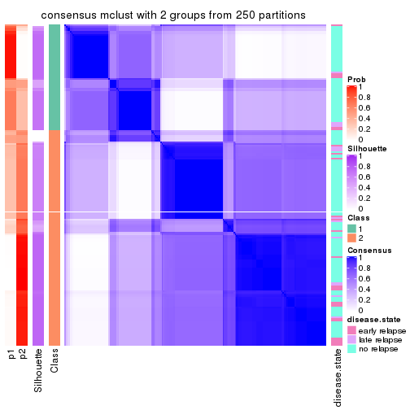</p>

</div>
<div id='tab-MAD-mclust-consensus-heatmap-2'>
<pre><code class="r">consensus_heatmap(res, k = 3)
</code></pre>

<p>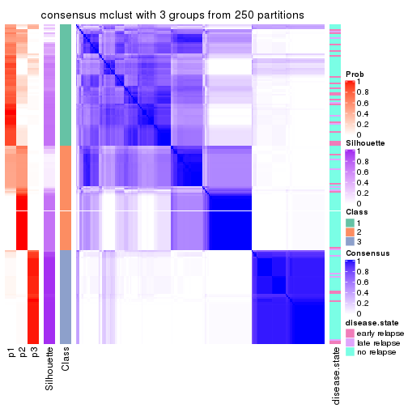</p>

</div>
<div id='tab-MAD-mclust-consensus-heatmap-3'>
<pre><code class="r">consensus_heatmap(res, k = 4)
</code></pre>

<p>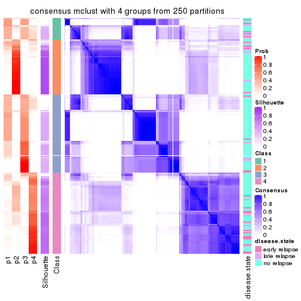</p>

</div>
<div id='tab-MAD-mclust-consensus-heatmap-4'>
<pre><code class="r">consensus_heatmap(res, k = 5)
</code></pre>

<p>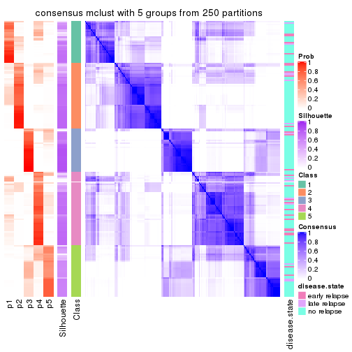</p>

</div>
<div id='tab-MAD-mclust-consensus-heatmap-5'>
<pre><code class="r">consensus_heatmap(res, k = 6)
</code></pre>

<p>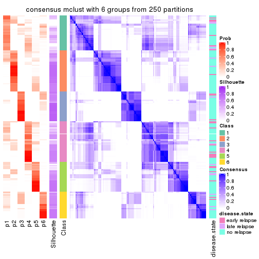</p>

</div>
</div>

Heatmaps for the membership of samples in all partitions to see how consistent they are:


<script>
$( function() {
	$( '#tabs-MAD-mclust-membership-heatmap' ).tabs();
} );
</script>
<div id='tabs-MAD-mclust-membership-heatmap'>
<ul>
<li><a href='#tab-MAD-mclust-membership-heatmap-1'>k = 2</a></li>
<li><a href='#tab-MAD-mclust-membership-heatmap-2'>k = 3</a></li>
<li><a href='#tab-MAD-mclust-membership-heatmap-3'>k = 4</a></li>
<li><a href='#tab-MAD-mclust-membership-heatmap-4'>k = 5</a></li>
<li><a href='#tab-MAD-mclust-membership-heatmap-5'>k = 6</a></li>
</ul>
<div id='tab-MAD-mclust-membership-heatmap-1'>
<pre><code class="r">membership_heatmap(res, k = 2)
</code></pre>

<p>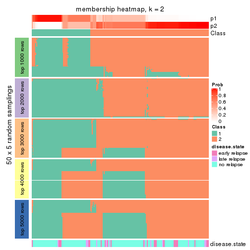</p>

</div>
<div id='tab-MAD-mclust-membership-heatmap-2'>
<pre><code class="r">membership_heatmap(res, k = 3)
</code></pre>

<p>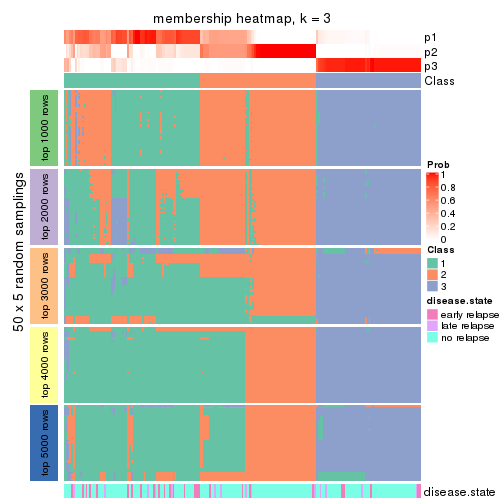</p>

</div>
<div id='tab-MAD-mclust-membership-heatmap-3'>
<pre><code class="r">membership_heatmap(res, k = 4)
</code></pre>

<p>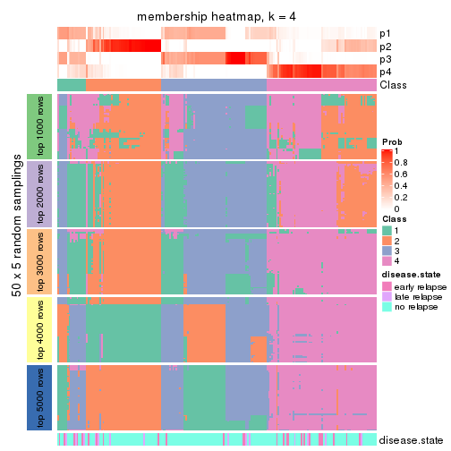</p>

</div>
<div id='tab-MAD-mclust-membership-heatmap-4'>
<pre><code class="r">membership_heatmap(res, k = 5)
</code></pre>

<p>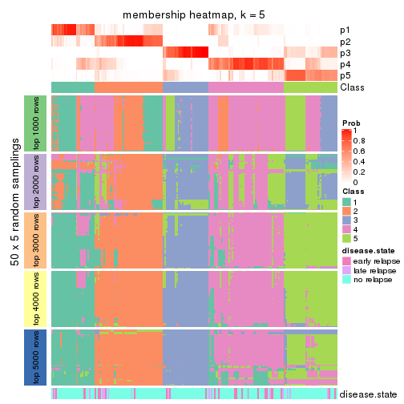</p>

</div>
<div id='tab-MAD-mclust-membership-heatmap-5'>
<pre><code class="r">membership_heatmap(res, k = 6)
</code></pre>

<p>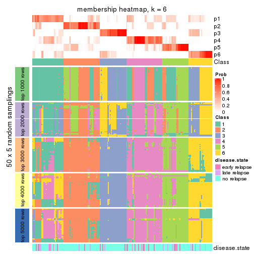</p>

</div>
</div>

As soon as we have had the classes for columns, we can look for signatures
which are significantly different between classes which can be candidate marks
for certain classes. Following are the heatmaps for signatures.


Signature heatmaps where rows are scaled:


<script>
$( function() {
	$( '#tabs-MAD-mclust-get-signatures' ).tabs();
} );
</script>
<div id='tabs-MAD-mclust-get-signatures'>
<ul>
<li><a href='#tab-MAD-mclust-get-signatures-1'>k = 2</a></li>
<li><a href='#tab-MAD-mclust-get-signatures-2'>k = 3</a></li>
<li><a href='#tab-MAD-mclust-get-signatures-3'>k = 4</a></li>
<li><a href='#tab-MAD-mclust-get-signatures-4'>k = 5</a></li>
<li><a href='#tab-MAD-mclust-get-signatures-5'>k = 6</a></li>
</ul>
<div id='tab-MAD-mclust-get-signatures-1'>
<pre><code class="r">get_signatures(res, k = 2)
</code></pre>

<p>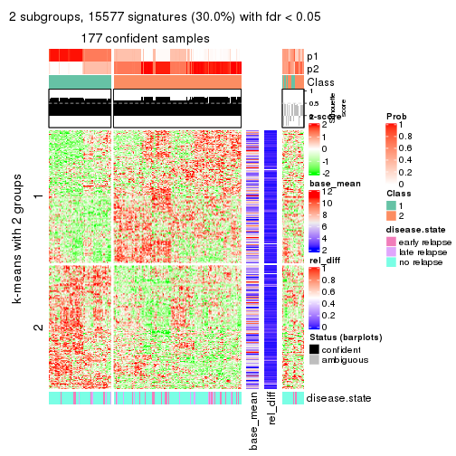</p>

</div>
<div id='tab-MAD-mclust-get-signatures-2'>
<pre><code class="r">get_signatures(res, k = 3)
</code></pre>

<p>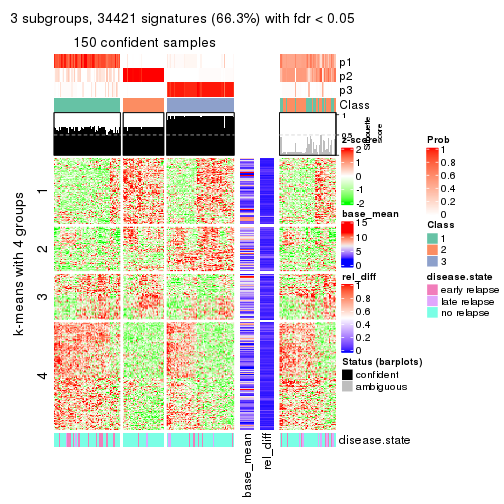</p>

</div>
<div id='tab-MAD-mclust-get-signatures-3'>
<pre><code class="r">get_signatures(res, k = 4)
</code></pre>

<p>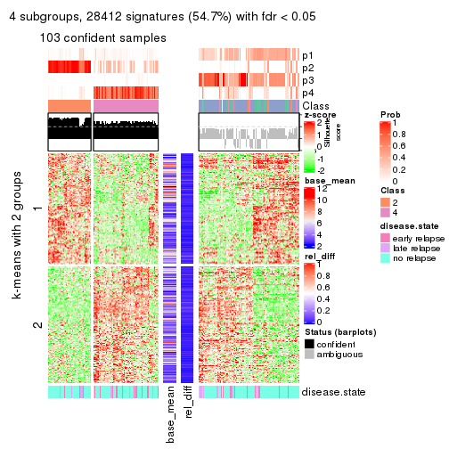</p>

</div>
<div id='tab-MAD-mclust-get-signatures-4'>
<pre><code class="r">get_signatures(res, k = 5)
</code></pre>

<p>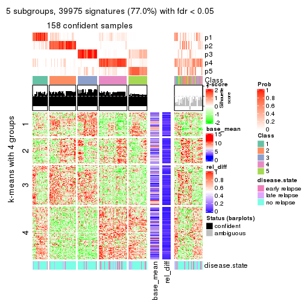</p>

</div>
<div id='tab-MAD-mclust-get-signatures-5'>
<pre><code class="r">get_signatures(res, k = 6)
</code></pre>

<p>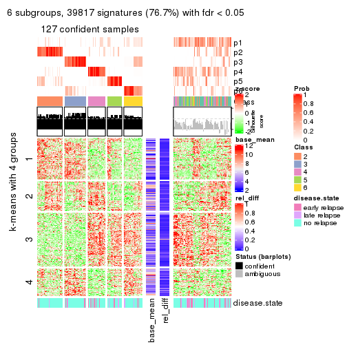</p>

</div>
</div>


Signature heatmaps where rows are not scaled:


<script>
$( function() {
	$( '#tabs-MAD-mclust-get-signatures-no-scale' ).tabs();
} );
</script>
<div id='tabs-MAD-mclust-get-signatures-no-scale'>
<ul>
<li><a href='#tab-MAD-mclust-get-signatures-no-scale-1'>k = 2</a></li>
<li><a href='#tab-MAD-mclust-get-signatures-no-scale-2'>k = 3</a></li>
<li><a href='#tab-MAD-mclust-get-signatures-no-scale-3'>k = 4</a></li>
<li><a href='#tab-MAD-mclust-get-signatures-no-scale-4'>k = 5</a></li>
<li><a href='#tab-MAD-mclust-get-signatures-no-scale-5'>k = 6</a></li>
</ul>
<div id='tab-MAD-mclust-get-signatures-no-scale-1'>
<pre><code class="r">get_signatures(res, k = 2, scale_rows = FALSE)
</code></pre>

<p>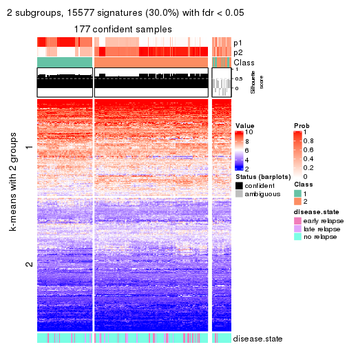</p>

</div>
<div id='tab-MAD-mclust-get-signatures-no-scale-2'>
<pre><code class="r">get_signatures(res, k = 3, scale_rows = FALSE)
</code></pre>

<p>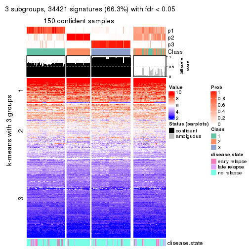</p>

</div>
<div id='tab-MAD-mclust-get-signatures-no-scale-3'>
<pre><code class="r">get_signatures(res, k = 4, scale_rows = FALSE)
</code></pre>

<p>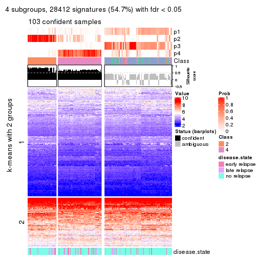</p>

</div>
<div id='tab-MAD-mclust-get-signatures-no-scale-4'>
<pre><code class="r">get_signatures(res, k = 5, scale_rows = FALSE)
</code></pre>

<p>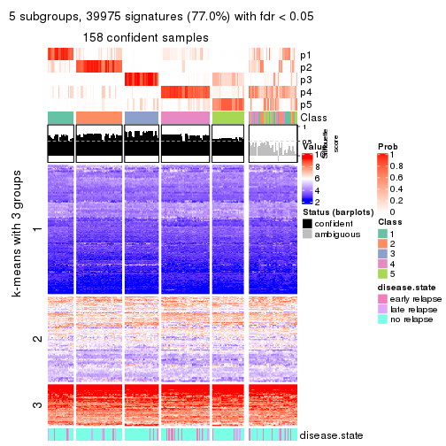</p>

</div>
<div id='tab-MAD-mclust-get-signatures-no-scale-5'>
<pre><code class="r">get_signatures(res, k = 6, scale_rows = FALSE)
</code></pre>

<p>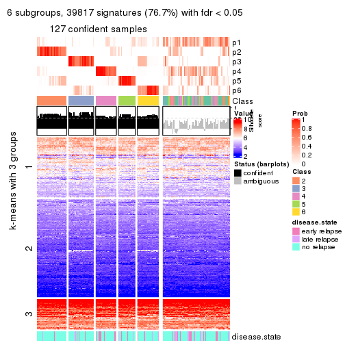</p>

</div>
</div>


Compare the overlap of signatures from different k:

```r
compare_signatures(res)
```

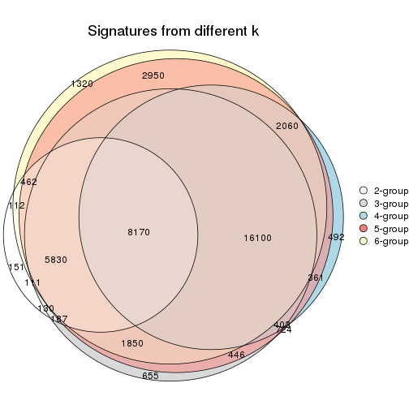

`get_signature()` returns a data frame invisibly. TO get the list of signatures, the function
call should be assigned to a variable explicitly. In following code, if `plot` argument is set
to `FALSE`, no heatmap is plotted while only the differential analysis is performed.

```r
# code only for demonstration
tb = get_signature(res, k = ..., plot = FALSE)
```

An example of the output of `tb` is:

```
#>   which_row         fdr    mean_1    mean_2 scaled_mean_1 scaled_mean_2 km
#> 1        38 0.042760348  8.373488  9.131774    -0.5533452     0.5164555  1
#> 2        40 0.018707592  7.106213  8.469186    -0.6173731     0.5762149  1
#> 3        55 0.019134737 10.221463 11.207825    -0.6159697     0.5749050  1
#> 4        59 0.006059896  5.921854  7.869574    -0.6899429     0.6439467  1
#> 5        60 0.018055526  8.928898 10.211722    -0.6204761     0.5791110  1
#> 6        98 0.009384629 15.714769 14.887706     0.6635654    -0.6193277  2
...
```

The columns in `tb` are:

1. `which_row`: row indices corresponding to the input matrix.
2. `fdr`: FDR for the differential test. 
3. `mean_x`: The mean value in group x.
4. `scaled_mean_x`: The mean value in group x after rows are scaled.
5. `km`: Row groups if k-means clustering is applied to rows.


UMAP plot which shows how samples are separated.


<script>
$( function() {
	$( '#tabs-MAD-mclust-dimension-reduction' ).tabs();
} );
</script>
<div id='tabs-MAD-mclust-dimension-reduction'>
<ul>
<li><a href='#tab-MAD-mclust-dimension-reduction-1'>k = 2</a></li>
<li><a href='#tab-MAD-mclust-dimension-reduction-2'>k = 3</a></li>
<li><a href='#tab-MAD-mclust-dimension-reduction-3'>k = 4</a></li>
<li><a href='#tab-MAD-mclust-dimension-reduction-4'>k = 5</a></li>
<li><a href='#tab-MAD-mclust-dimension-reduction-5'>k = 6</a></li>
</ul>
<div id='tab-MAD-mclust-dimension-reduction-1'>
<pre><code class="r">dimension_reduction(res, k = 2, method = &quot;UMAP&quot;)
</code></pre>

<p>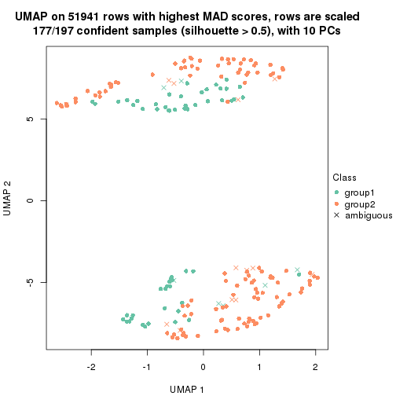</p>

</div>
<div id='tab-MAD-mclust-dimension-reduction-2'>
<pre><code class="r">dimension_reduction(res, k = 3, method = &quot;UMAP&quot;)
</code></pre>

<p>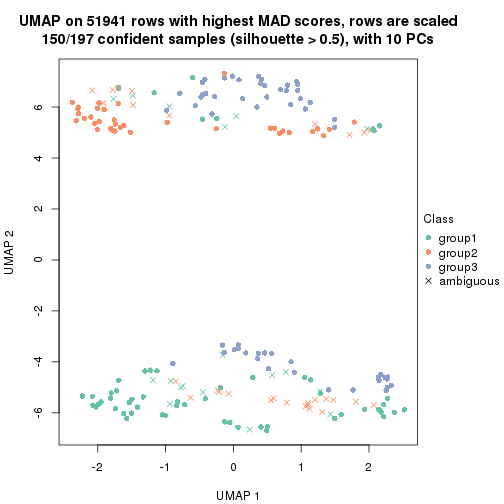</p>

</div>
<div id='tab-MAD-mclust-dimension-reduction-3'>
<pre><code class="r">dimension_reduction(res, k = 4, method = &quot;UMAP&quot;)
</code></pre>

<p>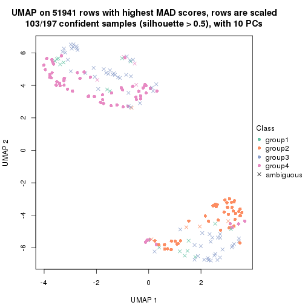</p>

</div>
<div id='tab-MAD-mclust-dimension-reduction-4'>
<pre><code class="r">dimension_reduction(res, k = 5, method = &quot;UMAP&quot;)
</code></pre>

<p>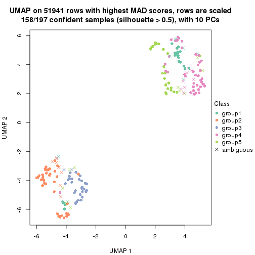</p>

</div>
<div id='tab-MAD-mclust-dimension-reduction-5'>
<pre><code class="r">dimension_reduction(res, k = 6, method = &quot;UMAP&quot;)
</code></pre>

<p>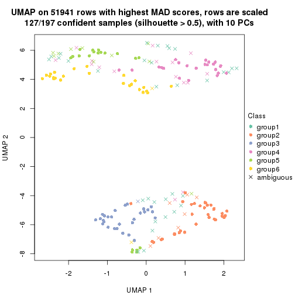</p>

</div>
</div>


Following heatmap shows how subgroups are split when increasing `k`:

```r
collect_classes(res)
```

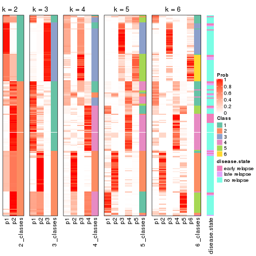


Test correlation between subgroups and known annotations. If the known
annotation is numeric, one-way ANOVA test is applied, and if the known
annotation is discrete, chi-squared contingency table test is applied.

```r
test_to_known_factors(res)
```

```
#>              n disease.state(p) k
#> MAD:mclust 177           0.3583 2
#> MAD:mclust 150           0.0208 3
#> MAD:mclust 103           0.1611 4
#> MAD:mclust 158           0.2730 5
#> MAD:mclust 127           0.1329 6
```


If matrix rows can be associated to genes, consider to use `functional_enrichment(res,
...)` to perform function enrichment for the signature genes. See [this vignette](http://bioconductor.org/packages/devel/bioc/vignettes/cola/inst/doc/functional_enrichment.html) for more detailed explanations.


 

---------------------------------------------------


### MAD:NMF


The object with results only for a single top-value method and a single partition method 
can be extracted as:

```r
res = res_list["MAD", "NMF"]
# you can also extract it by
# res = res_list["MAD:NMF"]
```

A summary of `res` and all the functions that can be applied to it:

```r
res
```

```
#> A 'ConsensusPartition' object with k = 2, 3, 4, 5, 6.
#>   On a matrix with 51941 rows and 197 columns.
#>   Top rows (1000, 2000, 3000, 4000, 5000) are extracted by 'MAD' method.
#>   Subgroups are detected by 'NMF' method.
#>   Performed in total 1250 partitions by row resampling.
#>   Best k for subgroups seems to be 4.
#> 
#> Following methods can be applied to this 'ConsensusPartition' object:
#>  [1] "cola_report"             "collect_classes"         "collect_plots"          
#>  [4] "collect_stats"           "colnames"                "compare_signatures"     
#>  [7] "consensus_heatmap"       "dimension_reduction"     "functional_enrichment"  
#> [10] "get_anno_col"            "get_anno"                "get_classes"            
#> [13] "get_consensus"           "get_matrix"              "get_membership"         
#> [16] "get_param"               "get_signatures"          "get_stats"              
#> [19] "is_best_k"               "is_stable_k"             "membership_heatmap"     
#> [22] "ncol"                    "nrow"                    "plot_ecdf"              
#> [25] "rownames"                "select_partition_number" "show"                   
#> [28] "suggest_best_k"          "test_to_known_factors"
```

`collect_plots()` function collects all the plots made from `res` for all `k` (number of partitions)
into one single page to provide an easy and fast comparison between different `k`.

```r
collect_plots(res)
```

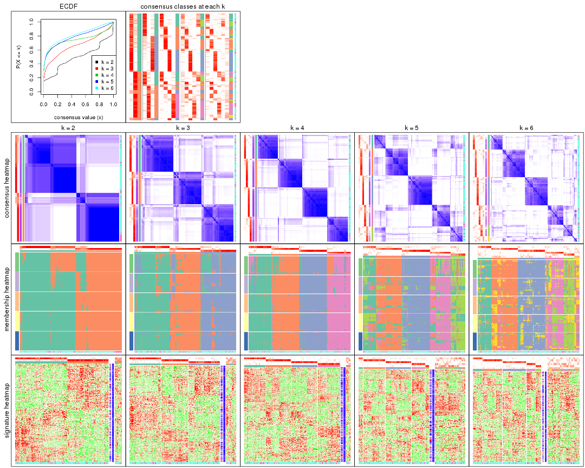

The plots are:

- The first row: a plot of the ECDF (empirical cumulative distribution
  function) curves of the consensus matrix for each `k` and the heatmap of
  predicted classes for each `k`.
- The second row: heatmaps of the consensus matrix for each `k`.
- The third row: heatmaps of the membership matrix for each `k`.
- The fouth row: heatmaps of the signatures for each `k`.

All the plots in panels can be made by individual functions and they are
plotted later in this section.

`select_partition_number()` produces several plots showing different
statistics for choosing "optimized" `k`. There are following statistics:

- ECDF curves of the consensus matrix for each `k`;
- 1-PAC. [The PAC
  score](https://en.wikipedia.org/wiki/Consensus_clustering#Over-interpretation_potential_of_consensus_clustering)
  measures the proportion of the ambiguous subgrouping.
- Mean silhouette score.
- Concordance. The mean probability of fiting the consensus class ids in all
  partitions.
- Area increased. Denote $A_k$ as the area under the ECDF curve for current
  `k`, the area increased is defined as $A_k - A_{k-1}$.
- Rand index. The percent of pairs of samples that are both in a same cluster
  or both are not in a same cluster in the partition of k and k-1.
- Jaccard index. The ratio of pairs of samples are both in a same cluster in
  the partition of k and k-1 and the pairs of samples are both in a same
  cluster in the partition k or k-1.

The detailed explanations of these statistics can be found in [the _cola_
vignette](http://bioconductor.org/packages/devel/bioc/vignettes/cola/inst/doc/cola.html#toc_13).

Generally speaking, lower PAC score, higher mean silhouette score or higher
concordance corresponds to better partition. Rand index and Jaccard index
measure how similar the current partition is compared to partition with `k-1`.
If they are too similar, we won't accept `k` is better than `k-1`.

```r
select_partition_number(res)
```

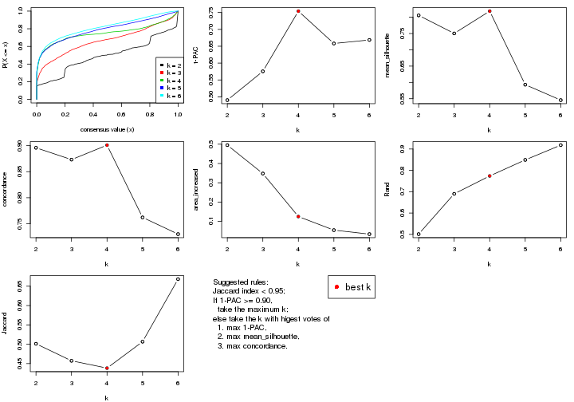

The numeric values for all these statistics can be obtained by `get_stats()`.

```r
get_stats(res)
```

```
#>   k 1-PAC mean_silhouette concordance area_increased  Rand Jaccard
#> 2 2 0.490           0.806       0.896         0.4951 0.501   0.501
#> 3 3 0.576           0.750       0.873         0.3478 0.690   0.457
#> 4 4 0.754           0.819       0.901         0.1248 0.774   0.438
#> 5 5 0.658           0.593       0.762         0.0543 0.849   0.507
#> 6 6 0.669           0.546       0.730         0.0337 0.918   0.668
```

`suggest_best_k()` suggests the best $k$ based on these statistics. The rules are as follows:

- All $k$ with Jaccard index larger than 0.95 are removed because increasing
  $k$ does not provide enough extra information. If all $k$ are removed, it is
  marked as no subgroup is detected.
- For all $k$ with 1-PAC score larger than 0.9, the maximal $k$ is taken as
  the best $k$, and other $k$ are marked as optional $k$.
- If it does not fit the second rule. The $k$ with the maximal vote of the
  highest 1-PAC score, highest mean silhouette, and highest concordance is
  taken as the best $k$.

```r
suggest_best_k(res)
```

```
#> [1] 4
```


Following shows the table of the partitions (You need to click the **show/hide
code output** link to see it). The membership matrix (columns with name `p*`)
is inferred by
[`clue::cl_consensus()`](https://www.rdocumentation.org/link/cl_consensus?package=clue)
function with the `SE` method. Basically the value in the membership matrix
represents the probability to belong to a certain group. The finall class
label for an item is determined with the group with highest probability it
belongs to.

In `get_classes()` function, the entropy is calculated from the membership
matrix and the silhouette score is calculated from the consensus matrix.


<script>
$( function() {
	$( '#tabs-MAD-NMF-get-classes' ).tabs();
} );
</script>
<div id='tabs-MAD-NMF-get-classes'>
<ul>
<li><a href='#tab-MAD-NMF-get-classes-1'>k = 2</a></li>
<li><a href='#tab-MAD-NMF-get-classes-2'>k = 3</a></li>
<li><a href='#tab-MAD-NMF-get-classes-3'>k = 4</a></li>
<li><a href='#tab-MAD-NMF-get-classes-4'>k = 5</a></li>
<li><a href='#tab-MAD-NMF-get-classes-5'>k = 6</a></li>
</ul>

<div id='tab-MAD-NMF-get-classes-1'>
<p><a id='tab-MAD-NMF-get-classes-1-a' style='color:#0366d6' href='#'>show/hide code output</a></p>
<pre><code class="r">cbind(get_classes(res, k = 2), get_membership(res, k = 2))
</code></pre>

<pre><code>#&gt;           class entropy silhouette    p1    p2
#&gt; GSM342319     1  0.9358      0.630 0.648 0.352
#&gt; GSM342323     2  0.0000      0.909 0.000 1.000
#&gt; GSM342325     1  0.9087      0.675 0.676 0.324
#&gt; GSM342326     2  0.0000      0.909 0.000 1.000
#&gt; GSM342327     2  0.0000      0.909 0.000 1.000
#&gt; GSM342329     2  0.0000      0.909 0.000 1.000
#&gt; GSM342331     2  0.0000      0.909 0.000 1.000
#&gt; GSM342334     2  0.0000      0.909 0.000 1.000
#&gt; GSM342335     2  0.0000      0.909 0.000 1.000
#&gt; GSM342354     2  0.9922      0.376 0.448 0.552
#&gt; GSM342371     2  0.0000      0.909 0.000 1.000
#&gt; GSM342380     1  0.7219      0.818 0.800 0.200
#&gt; GSM342382     1  0.3733      0.847 0.928 0.072
#&gt; GSM342399     1  0.7219      0.818 0.800 0.200
#&gt; GSM342402     1  0.7745      0.795 0.772 0.228
#&gt; GSM342404     2  0.0000      0.909 0.000 1.000
#&gt; GSM342408     2  0.7219      0.744 0.200 0.800
#&gt; GSM342409     1  0.9286      0.341 0.656 0.344
#&gt; GSM342426     2  0.0000      0.909 0.000 1.000
#&gt; GSM342441     1  0.0000      0.850 1.000 0.000
#&gt; GSM342444     1  0.0000      0.850 1.000 0.000
#&gt; GSM342451     1  0.0000      0.850 1.000 0.000
#&gt; GSM342462     2  0.0000      0.909 0.000 1.000
#&gt; GSM342467     2  0.0000      0.909 0.000 1.000
#&gt; GSM342484     1  0.6887      0.825 0.816 0.184
#&gt; GSM342491     2  0.7219      0.705 0.200 0.800
#&gt; GSM342322     1  0.9775      0.514 0.588 0.412
#&gt; GSM342338     1  0.0000      0.850 1.000 0.000
#&gt; GSM342347     2  0.9491      0.540 0.368 0.632
#&gt; GSM342356     1  0.0000      0.850 1.000 0.000
#&gt; GSM342357     1  0.7219      0.818 0.800 0.200
#&gt; GSM342366     2  0.2236      0.878 0.036 0.964
#&gt; GSM342385     1  0.7219      0.818 0.800 0.200
#&gt; GSM342421     2  0.0000      0.909 0.000 1.000
#&gt; GSM342437     2  0.0000      0.909 0.000 1.000
#&gt; GSM342454     1  0.0000      0.850 1.000 0.000
#&gt; GSM342471     2  0.0000      0.909 0.000 1.000
#&gt; GSM342477     2  0.0000      0.909 0.000 1.000
#&gt; GSM342495     2  0.0000      0.909 0.000 1.000
#&gt; GSM342496     1  0.0000      0.850 1.000 0.000
#&gt; GSM342320     2  0.0000      0.909 0.000 1.000
#&gt; GSM342321     2  0.0000      0.909 0.000 1.000
#&gt; GSM342324     2  0.0000      0.909 0.000 1.000
#&gt; GSM342328     2  0.0000      0.909 0.000 1.000
#&gt; GSM342330     2  0.0000      0.909 0.000 1.000
#&gt; GSM342332     2  0.0000      0.909 0.000 1.000
#&gt; GSM342333     2  0.4161      0.848 0.084 0.916
#&gt; GSM342336     2  0.0000      0.909 0.000 1.000
#&gt; GSM342337     1  0.0000      0.850 1.000 0.000
#&gt; GSM342339     1  0.0000      0.850 1.000 0.000
#&gt; GSM342340     1  0.0000      0.850 1.000 0.000
#&gt; GSM342341     1  0.0000      0.850 1.000 0.000
#&gt; GSM342342     1  0.0000      0.850 1.000 0.000
#&gt; GSM342343     1  0.0000      0.850 1.000 0.000
#&gt; GSM342344     1  0.0000      0.850 1.000 0.000
#&gt; GSM342345     1  0.0000      0.850 1.000 0.000
#&gt; GSM342346     2  0.0000      0.909 0.000 1.000
#&gt; GSM342348     1  0.9686      0.520 0.604 0.396
#&gt; GSM342349     2  0.8661      0.657 0.288 0.712
#&gt; GSM342350     2  0.9710      0.483 0.400 0.600
#&gt; GSM342351     2  0.7219      0.744 0.200 0.800
#&gt; GSM342352     2  0.9710      0.483 0.400 0.600
#&gt; GSM342353     1  0.0000      0.850 1.000 0.000
#&gt; GSM342355     1  0.0000      0.850 1.000 0.000
#&gt; GSM342358     2  0.0000      0.909 0.000 1.000
#&gt; GSM342359     2  0.0000      0.909 0.000 1.000
#&gt; GSM342360     2  0.0000      0.909 0.000 1.000
#&gt; GSM342361     2  0.0000      0.909 0.000 1.000
#&gt; GSM342362     2  0.0000      0.909 0.000 1.000
#&gt; GSM342363     1  0.9580      0.581 0.620 0.380
#&gt; GSM342364     1  0.9129      0.669 0.672 0.328
#&gt; GSM342365     2  0.0000      0.909 0.000 1.000
#&gt; GSM342367     1  0.7219      0.818 0.800 0.200
#&gt; GSM342368     1  0.9427      0.617 0.640 0.360
#&gt; GSM342369     2  0.0000      0.909 0.000 1.000
#&gt; GSM342370     2  0.0000      0.909 0.000 1.000
#&gt; GSM342372     2  0.0000      0.909 0.000 1.000
#&gt; GSM342373     2  0.1414      0.893 0.020 0.980
#&gt; GSM342374     2  0.0000      0.909 0.000 1.000
#&gt; GSM342375     2  0.0000      0.909 0.000 1.000
#&gt; GSM342376     1  0.4431      0.845 0.908 0.092
#&gt; GSM342377     1  0.7219      0.818 0.800 0.200
#&gt; GSM342378     1  0.7219      0.818 0.800 0.200
#&gt; GSM342379     2  0.4431      0.818 0.092 0.908
#&gt; GSM342381     1  0.7219      0.818 0.800 0.200
#&gt; GSM342383     1  0.7219      0.818 0.800 0.200
#&gt; GSM342384     1  0.7219      0.818 0.800 0.200
#&gt; GSM342386     1  0.7219      0.818 0.800 0.200
#&gt; GSM342387     2  0.0000      0.909 0.000 1.000
#&gt; GSM342388     1  0.0000      0.850 1.000 0.000
#&gt; GSM342389     1  0.7219      0.818 0.800 0.200
#&gt; GSM342390     1  0.0000      0.850 1.000 0.000
#&gt; GSM342391     1  0.6623      0.828 0.828 0.172
#&gt; GSM342392     1  0.0000      0.850 1.000 0.000
#&gt; GSM342393     2  0.0000      0.909 0.000 1.000
#&gt; GSM342394     1  0.7219      0.818 0.800 0.200
#&gt; GSM342395     2  0.7950      0.571 0.240 0.760
#&gt; GSM342396     1  0.0000      0.850 1.000 0.000
#&gt; GSM342397     2  0.9323      0.573 0.348 0.652
#&gt; GSM342398     1  0.7219      0.818 0.800 0.200
#&gt; GSM342400     1  0.7299      0.816 0.796 0.204
#&gt; GSM342401     1  0.0000      0.850 1.000 0.000
#&gt; GSM342403     1  0.0000      0.850 1.000 0.000
#&gt; GSM342405     2  0.7219      0.744 0.200 0.800
#&gt; GSM342406     1  0.0000      0.850 1.000 0.000
#&gt; GSM342407     2  0.9795      0.450 0.416 0.584
#&gt; GSM342410     1  0.6343      0.832 0.840 0.160
#&gt; GSM342411     2  0.0000      0.909 0.000 1.000
#&gt; GSM342412     2  0.0000      0.909 0.000 1.000
#&gt; GSM342413     2  0.7139      0.748 0.196 0.804
#&gt; GSM342414     2  0.9710      0.483 0.400 0.600
#&gt; GSM342415     2  0.0000      0.909 0.000 1.000
#&gt; GSM342416     1  1.0000     -0.240 0.500 0.500
#&gt; GSM342417     2  0.0000      0.909 0.000 1.000
#&gt; GSM342418     2  0.0000      0.909 0.000 1.000
#&gt; GSM342419     1  0.7219      0.818 0.800 0.200
#&gt; GSM342420     2  0.0000      0.909 0.000 1.000
#&gt; GSM342422     1  0.7219      0.818 0.800 0.200
#&gt; GSM342423     2  0.0000      0.909 0.000 1.000
#&gt; GSM342424     2  0.0000      0.909 0.000 1.000
#&gt; GSM342425     2  0.0000      0.909 0.000 1.000
#&gt; GSM342427     2  0.0000      0.909 0.000 1.000
#&gt; GSM342428     2  0.0000      0.909 0.000 1.000
#&gt; GSM342429     1  0.7453      0.810 0.788 0.212
#&gt; GSM342430     1  0.0000      0.850 1.000 0.000
#&gt; GSM342431     1  0.0000      0.850 1.000 0.000
#&gt; GSM342432     1  0.0000      0.850 1.000 0.000
#&gt; GSM342433     2  0.9963      0.334 0.464 0.536
#&gt; GSM342434     2  0.7528      0.731 0.216 0.784
#&gt; GSM342435     1  0.9087      0.382 0.676 0.324
#&gt; GSM342436     1  0.0000      0.850 1.000 0.000
#&gt; GSM342438     1  0.0000      0.850 1.000 0.000
#&gt; GSM342439     1  0.0000      0.850 1.000 0.000
#&gt; GSM342440     1  0.0000      0.850 1.000 0.000
#&gt; GSM342442     1  0.0000      0.850 1.000 0.000
#&gt; GSM342443     2  0.0000      0.909 0.000 1.000
#&gt; GSM342445     1  0.0000      0.850 1.000 0.000
#&gt; GSM342446     1  0.0000      0.850 1.000 0.000
#&gt; GSM342447     1  0.0000      0.850 1.000 0.000
#&gt; GSM342448     2  0.9686      0.490 0.396 0.604
#&gt; GSM342449     1  0.0000      0.850 1.000 0.000
#&gt; GSM342450     2  0.9795      0.450 0.416 0.584
#&gt; GSM342452     1  0.0000      0.850 1.000 0.000
#&gt; GSM342453     1  0.0000      0.850 1.000 0.000
#&gt; GSM342455     1  0.0000      0.850 1.000 0.000
#&gt; GSM342456     2  0.0000      0.909 0.000 1.000
#&gt; GSM342457     1  0.8443      0.746 0.728 0.272
#&gt; GSM342458     2  0.0000      0.909 0.000 1.000
#&gt; GSM342459     2  0.0000      0.909 0.000 1.000
#&gt; GSM342460     2  0.0000      0.909 0.000 1.000
#&gt; GSM342461     1  0.7453      0.809 0.788 0.212
#&gt; GSM342463     1  0.6048      0.834 0.852 0.148
#&gt; GSM342464     1  0.6712      0.827 0.824 0.176
#&gt; GSM342465     1  0.0376      0.850 0.996 0.004
#&gt; GSM342466     1  0.0000      0.850 1.000 0.000
#&gt; GSM342468     2  0.0000      0.909 0.000 1.000
#&gt; GSM342469     1  0.7219      0.818 0.800 0.200
#&gt; GSM342470     2  0.7219      0.744 0.200 0.800
#&gt; GSM342472     2  0.7219      0.744 0.200 0.800
#&gt; GSM342473     1  0.9635      0.566 0.612 0.388
#&gt; GSM342474     1  0.9209      0.657 0.664 0.336
#&gt; GSM342475     1  0.0000      0.850 1.000 0.000
#&gt; GSM342476     2  0.0000      0.909 0.000 1.000
#&gt; GSM342478     1  0.7602      0.803 0.780 0.220
#&gt; GSM342479     1  0.7674      0.799 0.776 0.224
#&gt; GSM342480     2  0.0000      0.909 0.000 1.000
#&gt; GSM342481     1  0.7139      0.820 0.804 0.196
#&gt; GSM342482     2  0.5178      0.789 0.116 0.884
#&gt; GSM342483     1  0.7376      0.813 0.792 0.208
#&gt; GSM342485     1  0.4298      0.845 0.912 0.088
#&gt; GSM342486     1  0.3584      0.848 0.932 0.068
#&gt; GSM342487     1  0.2043      0.833 0.968 0.032
#&gt; GSM342488     2  0.0000      0.909 0.000 1.000
#&gt; GSM342489     2  0.0000      0.909 0.000 1.000
#&gt; GSM342490     2  0.0000      0.909 0.000 1.000
#&gt; GSM342492     1  0.9522      0.238 0.628 0.372
#&gt; GSM342493     1  0.3114      0.849 0.944 0.056
#&gt; GSM342494     2  0.0000      0.909 0.000 1.000
#&gt; GSM342497     2  0.0000      0.909 0.000 1.000
#&gt; GSM342498     1  0.7219      0.818 0.800 0.200
#&gt; GSM342499     1  0.7219      0.818 0.800 0.200
#&gt; GSM342500     2  0.0938      0.900 0.012 0.988
#&gt; GSM342501     1  0.2778      0.849 0.952 0.048
#&gt; GSM342502     1  0.7219      0.818 0.800 0.200
#&gt; GSM342503     1  0.6531      0.830 0.832 0.168
#&gt; GSM342504     1  0.8327      0.758 0.736 0.264
#&gt; GSM342505     1  0.0000      0.850 1.000 0.000
#&gt; GSM342506     1  0.0000      0.850 1.000 0.000
#&gt; GSM342507     1  0.7299      0.816 0.796 0.204
#&gt; GSM342508     1  0.0000      0.850 1.000 0.000
#&gt; GSM342509     1  0.0000      0.850 1.000 0.000
#&gt; GSM342510     2  0.4022      0.852 0.080 0.920
#&gt; GSM342511     2  0.9933      0.365 0.452 0.548
#&gt; GSM342512     1  0.7219      0.818 0.800 0.200
#&gt; GSM342513     1  0.0376      0.850 0.996 0.004
#&gt; GSM342514     1  0.8861      0.433 0.696 0.304
#&gt; GSM342515     1  0.7219      0.818 0.800 0.200
</code></pre>

<script>
$('#tab-MAD-NMF-get-classes-1-a').parent().next().next().hide();
$('#tab-MAD-NMF-get-classes-1-a').click(function(){
  $('#tab-MAD-NMF-get-classes-1-a').parent().next().next().toggle();
  return(false);
});
</script>
</div>

<div id='tab-MAD-NMF-get-classes-2'>
<p><a id='tab-MAD-NMF-get-classes-2-a' style='color:#0366d6' href='#'>show/hide code output</a></p>
<pre><code class="r">cbind(get_classes(res, k = 3), get_membership(res, k = 3))
</code></pre>

<pre><code>#&gt;           class entropy silhouette    p1    p2    p3
#&gt; GSM342319     1  0.0237     0.8731 0.996 0.000 0.004
#&gt; GSM342323     1  0.3686     0.7959 0.860 0.140 0.000
#&gt; GSM342325     1  0.0424     0.8732 0.992 0.000 0.008
#&gt; GSM342326     2  0.3551     0.8019 0.132 0.868 0.000
#&gt; GSM342327     2  0.3192     0.8204 0.112 0.888 0.000
#&gt; GSM342329     1  0.3879     0.7846 0.848 0.152 0.000
#&gt; GSM342331     2  0.1860     0.8595 0.052 0.948 0.000
#&gt; GSM342334     1  0.6192     0.3467 0.580 0.420 0.000
#&gt; GSM342335     1  0.3879     0.7878 0.848 0.152 0.000
#&gt; GSM342354     3  0.8800     0.0786 0.396 0.116 0.488
#&gt; GSM342371     1  0.0892     0.8708 0.980 0.020 0.000
#&gt; GSM342380     1  0.0892     0.8722 0.980 0.000 0.020
#&gt; GSM342382     1  0.3551     0.7905 0.868 0.000 0.132
#&gt; GSM342399     1  0.0592     0.8732 0.988 0.000 0.012
#&gt; GSM342402     1  0.0747     0.8732 0.984 0.000 0.016
#&gt; GSM342404     2  0.0424     0.8697 0.008 0.992 0.000
#&gt; GSM342408     2  0.1964     0.8495 0.000 0.944 0.056
#&gt; GSM342409     1  0.7246     0.5197 0.648 0.052 0.300
#&gt; GSM342426     2  0.1289     0.8659 0.032 0.968 0.000
#&gt; GSM342441     3  0.1411     0.8214 0.000 0.036 0.964
#&gt; GSM342444     3  0.0237     0.8327 0.004 0.000 0.996
#&gt; GSM342451     3  0.0000     0.8322 0.000 0.000 1.000
#&gt; GSM342462     2  0.2584     0.8414 0.008 0.928 0.064
#&gt; GSM342467     2  0.0000     0.8698 0.000 1.000 0.000
#&gt; GSM342484     3  0.4555     0.7528 0.200 0.000 0.800
#&gt; GSM342491     2  0.8140     0.0707 0.068 0.476 0.456
#&gt; GSM342322     1  0.0000     0.8725 1.000 0.000 0.000
#&gt; GSM342338     3  0.5706     0.4612 0.320 0.000 0.680
#&gt; GSM342347     1  0.9989     0.0138 0.356 0.316 0.328
#&gt; GSM342356     1  0.6111     0.3906 0.604 0.000 0.396
#&gt; GSM342357     1  0.0892     0.8722 0.980 0.000 0.020
#&gt; GSM342366     1  0.0747     0.8712 0.984 0.016 0.000
#&gt; GSM342385     1  0.1289     0.8680 0.968 0.000 0.032
#&gt; GSM342421     1  0.4178     0.7671 0.828 0.172 0.000
#&gt; GSM342437     2  0.1905     0.8684 0.028 0.956 0.016
#&gt; GSM342454     3  0.0000     0.8322 0.000 0.000 1.000
#&gt; GSM342471     1  0.5621     0.5052 0.692 0.308 0.000
#&gt; GSM342477     2  0.0848     0.8713 0.008 0.984 0.008
#&gt; GSM342495     2  0.0747     0.8685 0.000 0.984 0.016
#&gt; GSM342496     3  0.0592     0.8342 0.012 0.000 0.988
#&gt; GSM342320     2  0.1860     0.8589 0.052 0.948 0.000
#&gt; GSM342321     1  0.0892     0.8696 0.980 0.020 0.000
#&gt; GSM342324     1  0.4452     0.7428 0.808 0.192 0.000
#&gt; GSM342328     1  0.1964     0.8552 0.944 0.056 0.000
#&gt; GSM342330     2  0.3192     0.8207 0.112 0.888 0.000
#&gt; GSM342332     1  0.1529     0.8626 0.960 0.040 0.000
#&gt; GSM342333     1  0.5408     0.7689 0.812 0.052 0.136
#&gt; GSM342336     1  0.4931     0.6908 0.768 0.232 0.000
#&gt; GSM342337     1  0.6295     0.1656 0.528 0.000 0.472
#&gt; GSM342339     3  0.0747     0.8329 0.016 0.000 0.984
#&gt; GSM342340     3  0.3941     0.7619 0.156 0.000 0.844
#&gt; GSM342341     3  0.0892     0.8326 0.020 0.000 0.980
#&gt; GSM342342     3  0.0747     0.8329 0.016 0.000 0.984
#&gt; GSM342343     3  0.3192     0.7999 0.112 0.000 0.888
#&gt; GSM342344     3  0.4033     0.7588 0.136 0.008 0.856
#&gt; GSM342345     3  0.0892     0.8326 0.020 0.000 0.980
#&gt; GSM342346     2  0.0237     0.8700 0.004 0.996 0.000
#&gt; GSM342348     1  0.0747     0.8729 0.984 0.000 0.016
#&gt; GSM342349     2  0.5431     0.6262 0.000 0.716 0.284
#&gt; GSM342350     2  0.6104     0.5152 0.004 0.648 0.348
#&gt; GSM342351     2  0.4291     0.7484 0.000 0.820 0.180
#&gt; GSM342352     2  0.6204     0.3672 0.000 0.576 0.424
#&gt; GSM342353     3  0.1585     0.8301 0.028 0.008 0.964
#&gt; GSM342355     1  0.5098     0.6691 0.752 0.000 0.248
#&gt; GSM342358     2  0.5497     0.5784 0.292 0.708 0.000
#&gt; GSM342359     2  0.2356     0.8479 0.072 0.928 0.000
#&gt; GSM342360     1  0.4235     0.7616 0.824 0.176 0.000
#&gt; GSM342361     2  0.0237     0.8700 0.004 0.996 0.000
#&gt; GSM342362     1  0.0747     0.8707 0.984 0.016 0.000
#&gt; GSM342363     1  0.0424     0.8735 0.992 0.000 0.008
#&gt; GSM342364     1  0.1129     0.8719 0.976 0.020 0.004
#&gt; GSM342365     2  0.0747     0.8689 0.016 0.984 0.000
#&gt; GSM342367     1  0.0892     0.8718 0.980 0.000 0.020
#&gt; GSM342368     1  0.0237     0.8726 0.996 0.004 0.000
#&gt; GSM342369     2  0.0892     0.8687 0.020 0.980 0.000
#&gt; GSM342370     2  0.0747     0.8689 0.016 0.984 0.000
#&gt; GSM342372     2  0.6235     0.1658 0.436 0.564 0.000
#&gt; GSM342373     1  0.0747     0.8712 0.984 0.016 0.000
#&gt; GSM342374     2  0.0892     0.8682 0.020 0.980 0.000
#&gt; GSM342375     2  0.3941     0.7579 0.156 0.844 0.000
#&gt; GSM342376     1  0.1643     0.8612 0.956 0.000 0.044
#&gt; GSM342377     1  0.0747     0.8728 0.984 0.000 0.016
#&gt; GSM342378     1  0.0892     0.8721 0.980 0.000 0.020
#&gt; GSM342379     1  0.0000     0.8725 1.000 0.000 0.000
#&gt; GSM342381     1  0.0592     0.8732 0.988 0.000 0.012
#&gt; GSM342383     1  0.0747     0.8727 0.984 0.000 0.016
#&gt; GSM342384     1  0.0892     0.8719 0.980 0.000 0.020
#&gt; GSM342386     1  0.1031     0.8704 0.976 0.000 0.024
#&gt; GSM342387     1  0.4062     0.7701 0.836 0.164 0.000
#&gt; GSM342388     3  0.3941     0.7659 0.156 0.000 0.844
#&gt; GSM342389     1  0.0592     0.8732 0.988 0.000 0.012
#&gt; GSM342390     1  0.5016     0.6787 0.760 0.000 0.240
#&gt; GSM342391     1  0.1031     0.8710 0.976 0.000 0.024
#&gt; GSM342392     3  0.0592     0.8330 0.012 0.000 0.988
#&gt; GSM342393     2  0.0000     0.8698 0.000 1.000 0.000
#&gt; GSM342394     1  0.0592     0.8732 0.988 0.000 0.012
#&gt; GSM342395     1  0.1289     0.8675 0.968 0.032 0.000
#&gt; GSM342396     3  0.1163     0.8316 0.028 0.000 0.972
#&gt; GSM342397     2  0.6381     0.5390 0.012 0.648 0.340
#&gt; GSM342398     1  0.1411     0.8659 0.964 0.000 0.036
#&gt; GSM342400     1  0.0592     0.8732 0.988 0.000 0.012
#&gt; GSM342401     3  0.1289     0.8312 0.032 0.000 0.968
#&gt; GSM342403     1  0.4291     0.7531 0.820 0.000 0.180
#&gt; GSM342405     2  0.0892     0.8672 0.000 0.980 0.020
#&gt; GSM342406     1  0.2796     0.8266 0.908 0.000 0.092
#&gt; GSM342407     2  0.6286     0.2331 0.000 0.536 0.464
#&gt; GSM342410     1  0.0892     0.8720 0.980 0.000 0.020
#&gt; GSM342411     1  0.0892     0.8696 0.980 0.020 0.000
#&gt; GSM342412     1  0.5497     0.6017 0.708 0.292 0.000
#&gt; GSM342413     2  0.1877     0.8649 0.012 0.956 0.032
#&gt; GSM342414     2  0.6026     0.4609 0.000 0.624 0.376
#&gt; GSM342415     1  0.0592     0.8717 0.988 0.012 0.000
#&gt; GSM342416     1  0.4121     0.7535 0.832 0.000 0.168
#&gt; GSM342417     1  0.5926     0.4769 0.644 0.356 0.000
#&gt; GSM342418     2  0.3038     0.8242 0.104 0.896 0.000
#&gt; GSM342419     1  0.0592     0.8732 0.988 0.000 0.012
#&gt; GSM342420     2  0.5058     0.6683 0.244 0.756 0.000
#&gt; GSM342422     1  0.1163     0.8691 0.972 0.000 0.028
#&gt; GSM342423     1  0.1643     0.8625 0.956 0.044 0.000
#&gt; GSM342424     2  0.4750     0.7083 0.216 0.784 0.000
#&gt; GSM342425     2  0.2165     0.8531 0.064 0.936 0.000
#&gt; GSM342427     2  0.2959     0.8293 0.100 0.900 0.000
#&gt; GSM342428     2  0.1289     0.8664 0.032 0.968 0.000
#&gt; GSM342429     3  0.5798     0.7563 0.184 0.040 0.776
#&gt; GSM342430     3  0.0000     0.8322 0.000 0.000 1.000
#&gt; GSM342431     3  0.0000     0.8322 0.000 0.000 1.000
#&gt; GSM342432     3  0.0000     0.8322 0.000 0.000 1.000
#&gt; GSM342433     3  0.5650     0.4667 0.000 0.312 0.688
#&gt; GSM342434     2  0.4504     0.7340 0.000 0.804 0.196
#&gt; GSM342435     3  0.4974     0.6200 0.000 0.236 0.764
#&gt; GSM342436     3  0.1289     0.8224 0.000 0.032 0.968
#&gt; GSM342438     3  0.0747     0.8280 0.000 0.016 0.984
#&gt; GSM342439     3  0.0424     0.8302 0.000 0.008 0.992
#&gt; GSM342440     3  0.1289     0.8229 0.000 0.032 0.968
#&gt; GSM342442     3  0.0592     0.8290 0.000 0.012 0.988
#&gt; GSM342443     2  0.0892     0.8675 0.000 0.980 0.020
#&gt; GSM342445     3  0.1031     0.8252 0.000 0.024 0.976
#&gt; GSM342446     3  0.0747     0.8280 0.000 0.016 0.984
#&gt; GSM342447     3  0.0592     0.8330 0.012 0.000 0.988
#&gt; GSM342448     2  0.6095     0.4190 0.000 0.608 0.392
#&gt; GSM342449     3  0.0747     0.8280 0.000 0.016 0.984
#&gt; GSM342450     3  0.6308    -0.0842 0.000 0.492 0.508
#&gt; GSM342452     3  0.0000     0.8322 0.000 0.000 1.000
#&gt; GSM342453     3  0.0000     0.8322 0.000 0.000 1.000
#&gt; GSM342455     3  0.0424     0.8302 0.000 0.008 0.992
#&gt; GSM342456     2  0.0000     0.8698 0.000 1.000 0.000
#&gt; GSM342457     1  0.5098     0.5950 0.752 0.000 0.248
#&gt; GSM342458     2  0.0424     0.8700 0.008 0.992 0.000
#&gt; GSM342459     2  0.1170     0.8702 0.008 0.976 0.016
#&gt; GSM342460     2  0.0747     0.8685 0.000 0.984 0.016
#&gt; GSM342461     3  0.6319     0.7155 0.228 0.040 0.732
#&gt; GSM342463     3  0.4796     0.7403 0.220 0.000 0.780
#&gt; GSM342464     3  0.4654     0.7483 0.208 0.000 0.792
#&gt; GSM342465     3  0.4346     0.7671 0.184 0.000 0.816
#&gt; GSM342466     3  0.3267     0.8037 0.116 0.000 0.884
#&gt; GSM342468     2  0.1031     0.8681 0.024 0.976 0.000
#&gt; GSM342469     1  0.2165     0.8441 0.936 0.000 0.064
#&gt; GSM342470     2  0.2066     0.8497 0.000 0.940 0.060
#&gt; GSM342472     2  0.0747     0.8690 0.000 0.984 0.016
#&gt; GSM342473     3  0.8155     0.5217 0.332 0.088 0.580
#&gt; GSM342474     3  0.7693     0.4946 0.364 0.056 0.580
#&gt; GSM342475     3  0.0892     0.8266 0.000 0.020 0.980
#&gt; GSM342476     2  0.0592     0.8693 0.000 0.988 0.012
#&gt; GSM342478     3  0.5733     0.5492 0.000 0.324 0.676
#&gt; GSM342479     3  0.5728     0.7514 0.196 0.032 0.772
#&gt; GSM342480     2  0.1529     0.8593 0.000 0.960 0.040
#&gt; GSM342481     3  0.5167     0.7571 0.192 0.016 0.792
#&gt; GSM342482     2  0.8548     0.3344 0.120 0.568 0.312
#&gt; GSM342483     3  0.6108     0.6676 0.028 0.240 0.732
#&gt; GSM342485     3  0.5216     0.6951 0.260 0.000 0.740
#&gt; GSM342486     3  0.5560     0.6356 0.300 0.000 0.700
#&gt; GSM342487     3  0.3686     0.7495 0.000 0.140 0.860
#&gt; GSM342488     2  0.1163     0.8648 0.000 0.972 0.028
#&gt; GSM342489     2  0.0661     0.8709 0.008 0.988 0.004
#&gt; GSM342490     2  0.0592     0.8693 0.000 0.988 0.012
#&gt; GSM342492     3  0.4974     0.6173 0.000 0.236 0.764
#&gt; GSM342493     3  0.4887     0.7292 0.228 0.000 0.772
#&gt; GSM342494     2  0.0592     0.8693 0.000 0.988 0.012
#&gt; GSM342497     2  0.0592     0.8693 0.000 0.988 0.012
#&gt; GSM342498     3  0.5621     0.6340 0.308 0.000 0.692
#&gt; GSM342499     1  0.6140     0.1921 0.596 0.000 0.404
#&gt; GSM342500     2  0.6056     0.6358 0.032 0.744 0.224
#&gt; GSM342501     3  0.4702     0.7440 0.212 0.000 0.788
#&gt; GSM342502     3  0.5731     0.7198 0.228 0.020 0.752
#&gt; GSM342503     3  0.5331     0.7872 0.076 0.100 0.824
#&gt; GSM342504     3  0.6318     0.4813 0.008 0.356 0.636
#&gt; GSM342505     3  0.0237     0.8312 0.000 0.004 0.996
#&gt; GSM342506     3  0.3340     0.8052 0.120 0.000 0.880
#&gt; GSM342507     1  0.1031     0.8710 0.976 0.000 0.024
#&gt; GSM342508     3  0.5733     0.5919 0.324 0.000 0.676
#&gt; GSM342509     3  0.1878     0.8323 0.044 0.004 0.952
#&gt; GSM342510     2  0.1289     0.8637 0.000 0.968 0.032
#&gt; GSM342511     3  0.6079     0.2750 0.000 0.388 0.612
#&gt; GSM342512     3  0.5443     0.6974 0.260 0.004 0.736
#&gt; GSM342513     3  0.4931     0.7251 0.232 0.000 0.768
#&gt; GSM342514     3  0.4178     0.7074 0.000 0.172 0.828
#&gt; GSM342515     1  0.5098     0.5977 0.752 0.000 0.248
</code></pre>

<script>
$('#tab-MAD-NMF-get-classes-2-a').parent().next().next().hide();
$('#tab-MAD-NMF-get-classes-2-a').click(function(){
  $('#tab-MAD-NMF-get-classes-2-a').parent().next().next().toggle();
  return(false);
});
</script>
</div>

<div id='tab-MAD-NMF-get-classes-3'>
<p><a id='tab-MAD-NMF-get-classes-3-a' style='color:#0366d6' href='#'>show/hide code output</a></p>
<pre><code class="r">cbind(get_classes(res, k = 4), get_membership(res, k = 4))
</code></pre>

<pre><code>#&gt;           class entropy silhouette    p1    p2    p3    p4
#&gt; GSM342319     1  0.2589     0.8236 0.884 0.116 0.000 0.000
#&gt; GSM342323     1  0.3142     0.8366 0.860 0.008 0.000 0.132
#&gt; GSM342325     1  0.2408     0.8371 0.896 0.104 0.000 0.000
#&gt; GSM342326     4  0.1398     0.8563 0.040 0.004 0.000 0.956
#&gt; GSM342327     4  0.2125     0.8371 0.076 0.004 0.000 0.920
#&gt; GSM342329     1  0.2799     0.8530 0.884 0.008 0.000 0.108
#&gt; GSM342331     4  0.1004     0.8610 0.024 0.004 0.000 0.972
#&gt; GSM342334     1  0.4072     0.7207 0.748 0.000 0.000 0.252
#&gt; GSM342335     1  0.4919     0.7068 0.752 0.200 0.000 0.048
#&gt; GSM342354     3  0.4049     0.7279 0.212 0.000 0.780 0.008
#&gt; GSM342371     2  0.2408     0.8315 0.104 0.896 0.000 0.000
#&gt; GSM342380     1  0.0524     0.8921 0.988 0.008 0.004 0.000
#&gt; GSM342382     2  0.1452     0.8815 0.036 0.956 0.008 0.000
#&gt; GSM342399     1  0.1389     0.8792 0.952 0.048 0.000 0.000
#&gt; GSM342402     1  0.0188     0.8924 0.996 0.000 0.004 0.000
#&gt; GSM342404     4  0.0336     0.8647 0.000 0.008 0.000 0.992
#&gt; GSM342408     4  0.4252     0.6688 0.004 0.000 0.252 0.744
#&gt; GSM342409     1  0.6440     0.5653 0.648 0.040 0.272 0.040
#&gt; GSM342426     4  0.0779     0.8624 0.016 0.004 0.000 0.980
#&gt; GSM342441     3  0.0188     0.9364 0.000 0.000 0.996 0.004
#&gt; GSM342444     3  0.1209     0.9247 0.004 0.032 0.964 0.000
#&gt; GSM342451     3  0.0779     0.9334 0.004 0.016 0.980 0.000
#&gt; GSM342462     2  0.2773     0.7944 0.000 0.880 0.004 0.116
#&gt; GSM342467     4  0.0000     0.8638 0.000 0.000 0.000 1.000
#&gt; GSM342484     3  0.6602     0.5365 0.208 0.164 0.628 0.000
#&gt; GSM342491     4  0.4969     0.7902 0.028 0.040 0.140 0.792
#&gt; GSM342322     1  0.1824     0.8744 0.936 0.060 0.000 0.004
#&gt; GSM342338     3  0.2149     0.8895 0.088 0.000 0.912 0.000
#&gt; GSM342347     3  0.5606     0.0106 0.480 0.000 0.500 0.020
#&gt; GSM342356     1  0.4955     0.1831 0.556 0.000 0.444 0.000
#&gt; GSM342357     1  0.0188     0.8924 0.996 0.000 0.004 0.000
#&gt; GSM342366     2  0.0817     0.8814 0.024 0.976 0.000 0.000
#&gt; GSM342385     1  0.0672     0.8922 0.984 0.008 0.008 0.000
#&gt; GSM342421     4  0.7531     0.3895 0.208 0.316 0.000 0.476
#&gt; GSM342437     4  0.0592     0.8623 0.016 0.000 0.000 0.984
#&gt; GSM342454     3  0.0336     0.9364 0.000 0.008 0.992 0.000
#&gt; GSM342471     2  0.5142     0.7373 0.192 0.744 0.000 0.064
#&gt; GSM342477     4  0.0469     0.8627 0.012 0.000 0.000 0.988
#&gt; GSM342495     4  0.4905     0.5205 0.000 0.364 0.004 0.632
#&gt; GSM342496     2  0.2401     0.8353 0.000 0.904 0.092 0.004
#&gt; GSM342320     4  0.0921     0.8597 0.028 0.000 0.000 0.972
#&gt; GSM342321     1  0.0927     0.8921 0.976 0.008 0.000 0.016
#&gt; GSM342324     1  0.2408     0.8537 0.896 0.000 0.000 0.104
#&gt; GSM342328     1  0.1109     0.8890 0.968 0.004 0.000 0.028
#&gt; GSM342330     4  0.2466     0.8228 0.096 0.004 0.000 0.900
#&gt; GSM342332     1  0.2319     0.8837 0.924 0.036 0.000 0.040
#&gt; GSM342333     1  0.3634     0.8333 0.860 0.008 0.104 0.028
#&gt; GSM342336     1  0.3356     0.7995 0.824 0.000 0.000 0.176
#&gt; GSM342337     3  0.4996     0.0854 0.484 0.000 0.516 0.000
#&gt; GSM342339     3  0.0336     0.9367 0.008 0.000 0.992 0.000
#&gt; GSM342340     3  0.1940     0.8981 0.076 0.000 0.924 0.000
#&gt; GSM342341     3  0.0336     0.9367 0.008 0.000 0.992 0.000
#&gt; GSM342342     3  0.0336     0.9367 0.008 0.000 0.992 0.000
#&gt; GSM342343     3  0.1833     0.9145 0.024 0.032 0.944 0.000
#&gt; GSM342344     3  0.1004     0.9307 0.024 0.000 0.972 0.004
#&gt; GSM342345     3  0.0336     0.9365 0.008 0.000 0.992 0.000
#&gt; GSM342346     4  0.3497     0.8036 0.036 0.000 0.104 0.860
#&gt; GSM342348     1  0.0188     0.8924 0.996 0.000 0.004 0.000
#&gt; GSM342349     3  0.2466     0.8971 0.028 0.000 0.916 0.056
#&gt; GSM342350     3  0.3149     0.8696 0.088 0.000 0.880 0.032
#&gt; GSM342351     4  0.4888     0.3511 0.000 0.000 0.412 0.588
#&gt; GSM342352     3  0.1488     0.9242 0.012 0.000 0.956 0.032
#&gt; GSM342353     3  0.1109     0.9289 0.028 0.000 0.968 0.004
#&gt; GSM342355     1  0.3649     0.7274 0.796 0.000 0.204 0.000
#&gt; GSM342358     1  0.2921     0.8316 0.860 0.000 0.000 0.140
#&gt; GSM342359     1  0.4741     0.5759 0.668 0.000 0.004 0.328
#&gt; GSM342360     1  0.2149     0.8639 0.912 0.000 0.000 0.088
#&gt; GSM342361     4  0.0657     0.8628 0.012 0.000 0.004 0.984
#&gt; GSM342362     1  0.0336     0.8919 0.992 0.000 0.000 0.008
#&gt; GSM342363     1  0.0188     0.8923 0.996 0.004 0.000 0.000
#&gt; GSM342364     2  0.1389     0.8731 0.048 0.952 0.000 0.000
#&gt; GSM342365     4  0.0376     0.8644 0.004 0.004 0.000 0.992
#&gt; GSM342367     2  0.0188     0.8835 0.004 0.996 0.000 0.000
#&gt; GSM342368     2  0.1867     0.8588 0.072 0.928 0.000 0.000
#&gt; GSM342369     4  0.3569     0.7764 0.000 0.196 0.000 0.804
#&gt; GSM342370     4  0.0469     0.8627 0.012 0.000 0.000 0.988
#&gt; GSM342372     4  0.4692     0.7571 0.032 0.212 0.000 0.756
#&gt; GSM342373     2  0.1151     0.8790 0.024 0.968 0.000 0.008
#&gt; GSM342374     4  0.1389     0.8606 0.000 0.048 0.000 0.952
#&gt; GSM342375     4  0.3937     0.7813 0.012 0.188 0.000 0.800
#&gt; GSM342376     1  0.1867     0.8663 0.928 0.072 0.000 0.000
#&gt; GSM342377     2  0.4761     0.4266 0.372 0.628 0.000 0.000
#&gt; GSM342378     1  0.1305     0.8843 0.960 0.036 0.004 0.000
#&gt; GSM342379     1  0.0592     0.8914 0.984 0.016 0.000 0.000
#&gt; GSM342381     2  0.4999     0.1541 0.492 0.508 0.000 0.000
#&gt; GSM342383     1  0.2408     0.8380 0.896 0.104 0.000 0.000
#&gt; GSM342384     2  0.0707     0.8838 0.020 0.980 0.000 0.000
#&gt; GSM342386     2  0.0336     0.8839 0.008 0.992 0.000 0.000
#&gt; GSM342387     1  0.0921     0.8895 0.972 0.000 0.000 0.028
#&gt; GSM342388     3  0.2266     0.8891 0.084 0.004 0.912 0.000
#&gt; GSM342389     2  0.0817     0.8821 0.024 0.976 0.000 0.000
#&gt; GSM342390     1  0.2216     0.8498 0.908 0.000 0.092 0.000
#&gt; GSM342391     1  0.0804     0.8918 0.980 0.008 0.012 0.000
#&gt; GSM342392     3  0.0376     0.9367 0.004 0.004 0.992 0.000
#&gt; GSM342393     4  0.0376     0.8645 0.000 0.004 0.004 0.992
#&gt; GSM342394     1  0.3219     0.7624 0.836 0.164 0.000 0.000
#&gt; GSM342395     2  0.0188     0.8835 0.004 0.996 0.000 0.000
#&gt; GSM342396     3  0.0336     0.9367 0.008 0.000 0.992 0.000
#&gt; GSM342397     3  0.2882     0.8803 0.084 0.000 0.892 0.024
#&gt; GSM342398     2  0.3356     0.7860 0.176 0.824 0.000 0.000
#&gt; GSM342400     2  0.1389     0.8777 0.048 0.952 0.000 0.000
#&gt; GSM342401     3  0.0469     0.9357 0.012 0.000 0.988 0.000
#&gt; GSM342403     1  0.1833     0.8837 0.944 0.024 0.032 0.000
#&gt; GSM342405     4  0.1557     0.8509 0.000 0.000 0.056 0.944
#&gt; GSM342406     1  0.0336     0.8920 0.992 0.000 0.008 0.000
#&gt; GSM342407     3  0.1209     0.9267 0.004 0.000 0.964 0.032
#&gt; GSM342410     1  0.0469     0.8912 0.988 0.000 0.012 0.000
#&gt; GSM342411     1  0.0188     0.8921 0.996 0.000 0.000 0.004
#&gt; GSM342412     1  0.3444     0.7904 0.816 0.000 0.000 0.184
#&gt; GSM342413     4  0.3307     0.8107 0.104 0.000 0.028 0.868
#&gt; GSM342414     3  0.1576     0.9160 0.004 0.000 0.948 0.048
#&gt; GSM342415     1  0.2704     0.8268 0.876 0.124 0.000 0.000
#&gt; GSM342416     1  0.0469     0.8912 0.988 0.000 0.012 0.000
#&gt; GSM342417     1  0.4193     0.6964 0.732 0.000 0.000 0.268
#&gt; GSM342418     4  0.3266     0.7465 0.168 0.000 0.000 0.832
#&gt; GSM342419     2  0.4331     0.6495 0.288 0.712 0.000 0.000
#&gt; GSM342420     4  0.3105     0.7946 0.140 0.004 0.000 0.856
#&gt; GSM342422     2  0.1637     0.8723 0.060 0.940 0.000 0.000
#&gt; GSM342423     2  0.4364     0.7612 0.136 0.808 0.000 0.056
#&gt; GSM342424     4  0.2443     0.8491 0.060 0.024 0.000 0.916
#&gt; GSM342425     4  0.1174     0.8630 0.020 0.012 0.000 0.968
#&gt; GSM342427     4  0.2611     0.8468 0.008 0.096 0.000 0.896
#&gt; GSM342428     4  0.1059     0.8651 0.012 0.016 0.000 0.972
#&gt; GSM342429     2  0.1209     0.8777 0.000 0.964 0.032 0.004
#&gt; GSM342430     3  0.0376     0.9367 0.004 0.004 0.992 0.000
#&gt; GSM342431     3  0.0376     0.9367 0.004 0.004 0.992 0.000
#&gt; GSM342432     3  0.0921     0.9273 0.000 0.028 0.972 0.000
#&gt; GSM342433     3  0.0707     0.9319 0.000 0.000 0.980 0.020
#&gt; GSM342434     4  0.4522     0.5600 0.000 0.000 0.320 0.680
#&gt; GSM342435     3  0.1022     0.9274 0.000 0.000 0.968 0.032
#&gt; GSM342436     3  0.0376     0.9366 0.000 0.004 0.992 0.004
#&gt; GSM342438     3  0.0188     0.9370 0.000 0.004 0.996 0.000
#&gt; GSM342439     3  0.0336     0.9364 0.000 0.008 0.992 0.000
#&gt; GSM342440     3  0.0336     0.9355 0.000 0.000 0.992 0.008
#&gt; GSM342442     3  0.0336     0.9364 0.000 0.008 0.992 0.000
#&gt; GSM342443     4  0.4720     0.6013 0.000 0.324 0.004 0.672
#&gt; GSM342445     3  0.0188     0.9361 0.000 0.000 0.996 0.004
#&gt; GSM342446     3  0.0188     0.9370 0.000 0.004 0.996 0.000
#&gt; GSM342447     3  0.0657     0.9349 0.004 0.012 0.984 0.000
#&gt; GSM342448     3  0.2081     0.8890 0.000 0.000 0.916 0.084
#&gt; GSM342449     3  0.0188     0.9370 0.000 0.004 0.996 0.000
#&gt; GSM342450     3  0.1389     0.9188 0.000 0.000 0.952 0.048
#&gt; GSM342452     3  0.0188     0.9370 0.000 0.004 0.996 0.000
#&gt; GSM342453     3  0.0188     0.9370 0.000 0.004 0.996 0.000
#&gt; GSM342455     3  0.0188     0.9370 0.000 0.004 0.996 0.000
#&gt; GSM342456     4  0.0657     0.8628 0.012 0.000 0.004 0.984
#&gt; GSM342457     2  0.0000     0.8835 0.000 1.000 0.000 0.000
#&gt; GSM342458     4  0.3311     0.7944 0.000 0.172 0.000 0.828
#&gt; GSM342459     2  0.3105     0.7689 0.000 0.856 0.004 0.140
#&gt; GSM342460     2  0.5151    -0.0391 0.000 0.532 0.004 0.464
#&gt; GSM342461     2  0.0000     0.8835 0.000 1.000 0.000 0.000
#&gt; GSM342463     2  0.0592     0.8836 0.000 0.984 0.016 0.000
#&gt; GSM342464     2  0.0592     0.8836 0.000 0.984 0.016 0.000
#&gt; GSM342465     2  0.0592     0.8836 0.000 0.984 0.016 0.000
#&gt; GSM342466     3  0.4756     0.7528 0.144 0.072 0.784 0.000
#&gt; GSM342468     4  0.4040     0.7243 0.000 0.248 0.000 0.752
#&gt; GSM342469     2  0.3486     0.7672 0.188 0.812 0.000 0.000
#&gt; GSM342470     4  0.3764     0.7735 0.012 0.000 0.172 0.816
#&gt; GSM342472     4  0.1004     0.8622 0.004 0.000 0.024 0.972
#&gt; GSM342473     2  0.0000     0.8835 0.000 1.000 0.000 0.000
#&gt; GSM342474     2  0.0000     0.8835 0.000 1.000 0.000 0.000
#&gt; GSM342475     3  0.0188     0.9370 0.000 0.004 0.996 0.000
#&gt; GSM342476     4  0.3208     0.8079 0.000 0.148 0.004 0.848
#&gt; GSM342478     2  0.1388     0.8759 0.000 0.960 0.028 0.012
#&gt; GSM342479     2  0.3574     0.8422 0.044 0.876 0.016 0.064
#&gt; GSM342480     4  0.3982     0.7483 0.000 0.220 0.004 0.776
#&gt; GSM342481     2  0.0592     0.8836 0.000 0.984 0.016 0.000
#&gt; GSM342482     2  0.0000     0.8835 0.000 1.000 0.000 0.000
#&gt; GSM342483     2  0.1059     0.8801 0.000 0.972 0.016 0.012
#&gt; GSM342485     2  0.0592     0.8836 0.000 0.984 0.016 0.000
#&gt; GSM342486     2  0.0336     0.8840 0.000 0.992 0.008 0.000
#&gt; GSM342487     3  0.0921     0.9294 0.000 0.000 0.972 0.028
#&gt; GSM342488     4  0.3982     0.7508 0.000 0.220 0.004 0.776
#&gt; GSM342489     2  0.5163    -0.1048 0.000 0.516 0.004 0.480
#&gt; GSM342490     4  0.0376     0.8642 0.004 0.000 0.004 0.992
#&gt; GSM342492     3  0.0817     0.9310 0.000 0.000 0.976 0.024
#&gt; GSM342493     2  0.0592     0.8836 0.000 0.984 0.016 0.000
#&gt; GSM342494     4  0.3539     0.7880 0.000 0.176 0.004 0.820
#&gt; GSM342497     4  0.1004     0.8640 0.000 0.024 0.004 0.972
#&gt; GSM342498     2  0.3852     0.7734 0.180 0.808 0.012 0.000
#&gt; GSM342499     2  0.3626     0.7688 0.184 0.812 0.004 0.000
#&gt; GSM342500     2  0.1305     0.8676 0.000 0.960 0.004 0.036
#&gt; GSM342501     2  0.3392     0.8209 0.124 0.856 0.020 0.000
#&gt; GSM342502     2  0.0188     0.8838 0.000 0.996 0.004 0.000
#&gt; GSM342503     2  0.0895     0.8817 0.000 0.976 0.020 0.004
#&gt; GSM342504     2  0.1174     0.8792 0.000 0.968 0.020 0.012
#&gt; GSM342505     3  0.0188     0.9370 0.000 0.004 0.996 0.000
#&gt; GSM342506     2  0.6921     0.5182 0.160 0.580 0.260 0.000
#&gt; GSM342507     1  0.0779     0.8920 0.980 0.016 0.004 0.000
#&gt; GSM342508     2  0.4998     0.7226 0.200 0.748 0.052 0.000
#&gt; GSM342509     3  0.4735     0.7516 0.148 0.068 0.784 0.000
#&gt; GSM342510     4  0.2662     0.8308 0.016 0.000 0.084 0.900
#&gt; GSM342511     3  0.1716     0.9063 0.000 0.000 0.936 0.064
#&gt; GSM342512     2  0.0592     0.8836 0.000 0.984 0.016 0.000
#&gt; GSM342513     2  0.0592     0.8836 0.000 0.984 0.016 0.000
#&gt; GSM342514     3  0.0469     0.9345 0.000 0.000 0.988 0.012
#&gt; GSM342515     2  0.3870     0.7460 0.208 0.788 0.004 0.000
</code></pre>

<script>
$('#tab-MAD-NMF-get-classes-3-a').parent().next().next().hide();
$('#tab-MAD-NMF-get-classes-3-a').click(function(){
  $('#tab-MAD-NMF-get-classes-3-a').parent().next().next().toggle();
  return(false);
});
</script>
</div>

<div id='tab-MAD-NMF-get-classes-4'>
<p><a id='tab-MAD-NMF-get-classes-4-a' style='color:#0366d6' href='#'>show/hide code output</a></p>
<pre><code class="r">cbind(get_classes(res, k = 5), get_membership(res, k = 5))
</code></pre>

<pre><code>#&gt;           class entropy silhouette    p1    p2    p3    p4    p5
#&gt; GSM342319     1  0.6417    0.29205 0.520 0.096 0.000 0.028 0.356
#&gt; GSM342323     4  0.5476    0.49218 0.184 0.000 0.000 0.656 0.160
#&gt; GSM342325     1  0.6268    0.18608 0.480 0.080 0.000 0.024 0.416
#&gt; GSM342326     4  0.2011    0.70612 0.020 0.008 0.000 0.928 0.044
#&gt; GSM342327     4  0.2304    0.70305 0.044 0.000 0.000 0.908 0.048
#&gt; GSM342329     4  0.6200    0.29313 0.180 0.000 0.000 0.540 0.280
#&gt; GSM342331     4  0.1300    0.70737 0.028 0.000 0.000 0.956 0.016
#&gt; GSM342334     5  0.2823    0.52150 0.020 0.004 0.004 0.092 0.880
#&gt; GSM342335     5  0.5148    0.36254 0.060 0.264 0.000 0.008 0.668
#&gt; GSM342354     3  0.5107    0.55955 0.064 0.000 0.640 0.000 0.296
#&gt; GSM342371     2  0.2894    0.77019 0.084 0.876 0.000 0.004 0.036
#&gt; GSM342380     5  0.2462    0.49898 0.112 0.008 0.000 0.000 0.880
#&gt; GSM342382     2  0.3381    0.72498 0.176 0.808 0.000 0.000 0.016
#&gt; GSM342399     5  0.4787    0.01341 0.432 0.020 0.000 0.000 0.548
#&gt; GSM342402     5  0.5048    0.00523 0.412 0.004 0.004 0.020 0.560
#&gt; GSM342404     4  0.7211    0.31026 0.168 0.304 0.008 0.488 0.032
#&gt; GSM342408     3  0.8109    0.10006 0.172 0.048 0.424 0.316 0.040
#&gt; GSM342409     5  0.7507    0.34237 0.128 0.136 0.152 0.016 0.568
#&gt; GSM342426     4  0.1571    0.70397 0.060 0.000 0.000 0.936 0.004
#&gt; GSM342441     3  0.0162    0.87448 0.004 0.000 0.996 0.000 0.000
#&gt; GSM342444     3  0.3661    0.62016 0.276 0.000 0.724 0.000 0.000
#&gt; GSM342451     3  0.2179    0.82455 0.112 0.000 0.888 0.000 0.000
#&gt; GSM342462     2  0.2982    0.75716 0.116 0.860 0.004 0.020 0.000
#&gt; GSM342467     4  0.4573    0.58754 0.164 0.072 0.000 0.756 0.008
#&gt; GSM342484     1  0.4231    0.48837 0.740 0.000 0.016 0.232 0.012
#&gt; GSM342491     4  0.5383    0.17688 0.420 0.000 0.024 0.536 0.020
#&gt; GSM342322     5  0.5559    0.07901 0.392 0.024 0.000 0.032 0.552
#&gt; GSM342338     3  0.2424    0.81419 0.000 0.000 0.868 0.000 0.132
#&gt; GSM342347     5  0.6011   -0.02197 0.100 0.004 0.404 0.000 0.492
#&gt; GSM342356     5  0.4820    0.31036 0.036 0.000 0.332 0.000 0.632
#&gt; GSM342357     1  0.4892    0.11490 0.496 0.000 0.004 0.016 0.484
#&gt; GSM342366     2  0.0451    0.80002 0.008 0.988 0.000 0.000 0.004
#&gt; GSM342385     5  0.3855    0.39582 0.240 0.000 0.008 0.004 0.748
#&gt; GSM342421     2  0.5546    0.64695 0.124 0.712 0.000 0.044 0.120
#&gt; GSM342437     4  0.3612    0.56912 0.268 0.000 0.000 0.732 0.000
#&gt; GSM342454     3  0.2329    0.81207 0.124 0.000 0.876 0.000 0.000
#&gt; GSM342471     1  0.4656    0.47424 0.692 0.036 0.000 0.268 0.004
#&gt; GSM342477     4  0.1430    0.70537 0.052 0.000 0.000 0.944 0.004
#&gt; GSM342495     2  0.4137    0.70933 0.128 0.792 0.000 0.076 0.004
#&gt; GSM342496     2  0.5629    0.41587 0.312 0.588 0.100 0.000 0.000
#&gt; GSM342320     4  0.1251    0.70725 0.036 0.000 0.000 0.956 0.008
#&gt; GSM342321     5  0.6362    0.21782 0.256 0.000 0.000 0.224 0.520
#&gt; GSM342324     4  0.5756    0.46854 0.176 0.000 0.000 0.620 0.204
#&gt; GSM342328     5  0.6642    0.14588 0.248 0.000 0.000 0.308 0.444
#&gt; GSM342330     4  0.2859    0.69490 0.068 0.000 0.000 0.876 0.056
#&gt; GSM342332     5  0.6684    0.12100 0.240 0.000 0.000 0.352 0.408
#&gt; GSM342333     5  0.3694    0.50518 0.052 0.024 0.072 0.004 0.848
#&gt; GSM342336     5  0.4575    0.42968 0.052 0.000 0.000 0.236 0.712
#&gt; GSM342337     3  0.5867    0.10882 0.100 0.000 0.496 0.000 0.404
#&gt; GSM342339     3  0.0566    0.87369 0.012 0.000 0.984 0.000 0.004
#&gt; GSM342340     3  0.1943    0.85578 0.020 0.000 0.924 0.000 0.056
#&gt; GSM342341     3  0.0566    0.87409 0.004 0.000 0.984 0.000 0.012
#&gt; GSM342342     3  0.0566    0.87448 0.004 0.000 0.984 0.000 0.012
#&gt; GSM342343     3  0.2439    0.81327 0.120 0.000 0.876 0.000 0.004
#&gt; GSM342344     3  0.1701    0.86010 0.016 0.000 0.936 0.000 0.048
#&gt; GSM342345     3  0.0579    0.87473 0.008 0.000 0.984 0.000 0.008
#&gt; GSM342346     3  0.7688    0.06395 0.096 0.000 0.408 0.352 0.144
#&gt; GSM342348     1  0.4824    0.09075 0.512 0.000 0.000 0.020 0.468
#&gt; GSM342349     3  0.4183    0.75238 0.136 0.000 0.780 0.000 0.084
#&gt; GSM342350     3  0.5618    0.60528 0.152 0.004 0.652 0.000 0.192
#&gt; GSM342351     3  0.6299    0.59562 0.164 0.012 0.652 0.140 0.032
#&gt; GSM342352     3  0.2300    0.84307 0.072 0.000 0.904 0.000 0.024
#&gt; GSM342353     3  0.0865    0.87114 0.004 0.000 0.972 0.000 0.024
#&gt; GSM342355     5  0.2462    0.49293 0.008 0.000 0.112 0.000 0.880
#&gt; GSM342358     4  0.4998    0.55539 0.196 0.000 0.000 0.700 0.104
#&gt; GSM342359     4  0.4219    0.65084 0.104 0.000 0.000 0.780 0.116
#&gt; GSM342360     4  0.6319    0.28108 0.196 0.000 0.000 0.520 0.284
#&gt; GSM342361     4  0.2077    0.70046 0.040 0.000 0.000 0.920 0.040
#&gt; GSM342362     5  0.6152    0.12039 0.324 0.000 0.000 0.152 0.524
#&gt; GSM342363     5  0.2583    0.48853 0.132 0.000 0.000 0.004 0.864
#&gt; GSM342364     2  0.1568    0.79390 0.020 0.944 0.000 0.000 0.036
#&gt; GSM342365     4  0.6496    0.40503 0.168 0.264 0.000 0.552 0.016
#&gt; GSM342367     2  0.1608    0.79362 0.072 0.928 0.000 0.000 0.000
#&gt; GSM342368     2  0.1106    0.79789 0.012 0.964 0.000 0.000 0.024
#&gt; GSM342369     2  0.6550    0.52208 0.172 0.620 0.000 0.144 0.064
#&gt; GSM342370     4  0.6477    0.41222 0.168 0.260 0.000 0.556 0.016
#&gt; GSM342372     2  0.6949    0.44594 0.156 0.560 0.000 0.060 0.224
#&gt; GSM342373     2  0.1830    0.79084 0.052 0.932 0.000 0.004 0.012
#&gt; GSM342374     4  0.6951    0.24332 0.164 0.340 0.000 0.468 0.028
#&gt; GSM342375     2  0.7640    0.26332 0.164 0.452 0.000 0.088 0.296
#&gt; GSM342376     5  0.2777    0.50083 0.016 0.120 0.000 0.000 0.864
#&gt; GSM342377     5  0.4793    0.15411 0.020 0.436 0.000 0.000 0.544
#&gt; GSM342378     1  0.4863    0.46854 0.672 0.056 0.000 0.000 0.272
#&gt; GSM342379     5  0.1502    0.52631 0.056 0.004 0.000 0.000 0.940
#&gt; GSM342381     5  0.5813    0.21026 0.112 0.328 0.000 0.000 0.560
#&gt; GSM342383     5  0.5759   -0.03176 0.388 0.092 0.000 0.000 0.520
#&gt; GSM342384     2  0.2110    0.78958 0.072 0.912 0.000 0.000 0.016
#&gt; GSM342386     2  0.1608    0.79362 0.072 0.928 0.000 0.000 0.000
#&gt; GSM342387     4  0.5811    0.40134 0.264 0.000 0.000 0.596 0.140
#&gt; GSM342388     3  0.2540    0.83026 0.088 0.000 0.888 0.000 0.024
#&gt; GSM342389     2  0.2074    0.79088 0.044 0.920 0.000 0.000 0.036
#&gt; GSM342390     1  0.5942    0.10269 0.472 0.000 0.080 0.008 0.440
#&gt; GSM342391     1  0.4762    0.42963 0.684 0.004 0.008 0.024 0.280
#&gt; GSM342392     3  0.0510    0.87347 0.016 0.000 0.984 0.000 0.000
#&gt; GSM342393     4  0.5649    0.54748 0.168 0.116 0.008 0.692 0.016
#&gt; GSM342394     1  0.4596    0.57868 0.784 0.096 0.000 0.032 0.088
#&gt; GSM342395     2  0.0290    0.79953 0.008 0.992 0.000 0.000 0.000
#&gt; GSM342396     3  0.0566    0.87369 0.012 0.000 0.984 0.000 0.004
#&gt; GSM342397     3  0.4665    0.71698 0.112 0.000 0.740 0.000 0.148
#&gt; GSM342398     2  0.5831    0.39404 0.160 0.604 0.000 0.000 0.236
#&gt; GSM342400     2  0.2376    0.78741 0.052 0.904 0.000 0.000 0.044
#&gt; GSM342401     3  0.0579    0.87432 0.008 0.000 0.984 0.000 0.008
#&gt; GSM342403     5  0.1989    0.52760 0.020 0.016 0.032 0.000 0.932
#&gt; GSM342405     4  0.8402    0.33802 0.168 0.104 0.220 0.468 0.040
#&gt; GSM342406     1  0.5636    0.17557 0.524 0.000 0.016 0.044 0.416
#&gt; GSM342407     3  0.3291    0.79910 0.120 0.000 0.840 0.000 0.040
#&gt; GSM342410     1  0.4650    0.11859 0.520 0.000 0.000 0.012 0.468
#&gt; GSM342411     5  0.6119    0.23343 0.296 0.000 0.000 0.160 0.544
#&gt; GSM342412     5  0.1106    0.53264 0.012 0.000 0.000 0.024 0.964
#&gt; GSM342413     4  0.3805    0.68615 0.108 0.000 0.020 0.828 0.044
#&gt; GSM342414     3  0.3484    0.78299 0.144 0.000 0.824 0.004 0.028
#&gt; GSM342415     5  0.2077    0.52086 0.008 0.084 0.000 0.000 0.908
#&gt; GSM342416     5  0.4769    0.04576 0.440 0.000 0.004 0.012 0.544
#&gt; GSM342417     4  0.4467    0.60333 0.084 0.000 0.000 0.752 0.164
#&gt; GSM342418     4  0.2570    0.70103 0.028 0.000 0.000 0.888 0.084
#&gt; GSM342419     1  0.6193    0.41141 0.548 0.260 0.000 0.000 0.192
#&gt; GSM342420     4  0.4017    0.63661 0.148 0.000 0.000 0.788 0.064
#&gt; GSM342422     2  0.3641    0.73068 0.120 0.820 0.000 0.000 0.060
#&gt; GSM342423     2  0.3529    0.75025 0.112 0.840 0.000 0.016 0.032
#&gt; GSM342424     4  0.3888    0.64556 0.136 0.000 0.000 0.800 0.064
#&gt; GSM342425     4  0.2305    0.69395 0.092 0.000 0.000 0.896 0.012
#&gt; GSM342427     4  0.3501    0.69824 0.068 0.044 0.000 0.856 0.032
#&gt; GSM342428     4  0.1828    0.70102 0.032 0.028 0.000 0.936 0.004
#&gt; GSM342429     1  0.7095    0.26962 0.488 0.328 0.040 0.140 0.004
#&gt; GSM342430     3  0.0703    0.87177 0.024 0.000 0.976 0.000 0.000
#&gt; GSM342431     3  0.0963    0.86791 0.036 0.000 0.964 0.000 0.000
#&gt; GSM342432     3  0.3837    0.57308 0.308 0.000 0.692 0.000 0.000
#&gt; GSM342433     3  0.0833    0.87442 0.016 0.000 0.976 0.004 0.004
#&gt; GSM342434     3  0.6130    0.51992 0.164 0.004 0.612 0.212 0.008
#&gt; GSM342435     3  0.1518    0.86586 0.048 0.000 0.944 0.004 0.004
#&gt; GSM342436     3  0.0162    0.87448 0.004 0.000 0.996 0.000 0.000
#&gt; GSM342438     3  0.0290    0.87489 0.008 0.000 0.992 0.000 0.000
#&gt; GSM342439     3  0.0703    0.87262 0.024 0.000 0.976 0.000 0.000
#&gt; GSM342440     3  0.0290    0.87414 0.008 0.000 0.992 0.000 0.000
#&gt; GSM342442     3  0.1410    0.85762 0.060 0.000 0.940 0.000 0.000
#&gt; GSM342443     2  0.4579    0.68588 0.144 0.764 0.004 0.084 0.004
#&gt; GSM342445     3  0.0290    0.87487 0.008 0.000 0.992 0.000 0.000
#&gt; GSM342446     3  0.0000    0.87469 0.000 0.000 1.000 0.000 0.000
#&gt; GSM342447     3  0.1732    0.84596 0.080 0.000 0.920 0.000 0.000
#&gt; GSM342448     3  0.2445    0.82770 0.108 0.000 0.884 0.004 0.004
#&gt; GSM342449     3  0.0000    0.87469 0.000 0.000 1.000 0.000 0.000
#&gt; GSM342450     3  0.1831    0.84859 0.076 0.000 0.920 0.000 0.004
#&gt; GSM342452     3  0.0290    0.87420 0.008 0.000 0.992 0.000 0.000
#&gt; GSM342453     3  0.0510    0.87347 0.016 0.000 0.984 0.000 0.000
#&gt; GSM342455     3  0.0290    0.87420 0.008 0.000 0.992 0.000 0.000
#&gt; GSM342456     4  0.1485    0.70406 0.032 0.000 0.000 0.948 0.020
#&gt; GSM342457     2  0.1410    0.79624 0.060 0.940 0.000 0.000 0.000
#&gt; GSM342458     2  0.6507    0.19497 0.164 0.500 0.000 0.328 0.008
#&gt; GSM342459     2  0.2795    0.76229 0.100 0.872 0.000 0.028 0.000
#&gt; GSM342460     2  0.3496    0.74057 0.124 0.832 0.000 0.040 0.004
#&gt; GSM342461     2  0.1732    0.79202 0.080 0.920 0.000 0.000 0.000
#&gt; GSM342463     2  0.3053    0.74544 0.164 0.828 0.008 0.000 0.000
#&gt; GSM342464     2  0.2929    0.75422 0.152 0.840 0.008 0.000 0.000
#&gt; GSM342465     2  0.3282    0.72409 0.188 0.804 0.008 0.000 0.000
#&gt; GSM342466     1  0.3305    0.47004 0.776 0.000 0.224 0.000 0.000
#&gt; GSM342468     2  0.4994    0.63401 0.152 0.720 0.000 0.124 0.004
#&gt; GSM342469     1  0.3912    0.55210 0.768 0.208 0.000 0.004 0.020
#&gt; GSM342470     4  0.3689    0.66066 0.144 0.000 0.032 0.816 0.008
#&gt; GSM342472     4  0.4788    0.58881 0.164 0.044 0.024 0.760 0.008
#&gt; GSM342473     2  0.2011    0.79082 0.088 0.908 0.000 0.004 0.000
#&gt; GSM342474     2  0.1908    0.78773 0.092 0.908 0.000 0.000 0.000
#&gt; GSM342475     3  0.0404    0.87524 0.012 0.000 0.988 0.000 0.000
#&gt; GSM342476     4  0.6759    0.04183 0.164 0.408 0.004 0.416 0.008
#&gt; GSM342478     2  0.1924    0.79170 0.064 0.924 0.008 0.000 0.004
#&gt; GSM342479     1  0.5530    0.50870 0.696 0.048 0.012 0.212 0.032
#&gt; GSM342480     2  0.5355    0.60898 0.144 0.696 0.004 0.152 0.004
#&gt; GSM342481     2  0.3353    0.71659 0.196 0.796 0.008 0.000 0.000
#&gt; GSM342482     2  0.0955    0.80069 0.028 0.968 0.000 0.004 0.000
#&gt; GSM342483     2  0.1864    0.79894 0.068 0.924 0.000 0.004 0.004
#&gt; GSM342485     2  0.3461    0.68464 0.224 0.772 0.004 0.000 0.000
#&gt; GSM342486     2  0.3336    0.68186 0.228 0.772 0.000 0.000 0.000
#&gt; GSM342487     3  0.1502    0.85922 0.056 0.000 0.940 0.000 0.004
#&gt; GSM342488     2  0.6136    0.24847 0.104 0.520 0.004 0.368 0.004
#&gt; GSM342489     2  0.3374    0.74884 0.108 0.844 0.000 0.044 0.004
#&gt; GSM342490     4  0.1087    0.69586 0.016 0.008 0.000 0.968 0.008
#&gt; GSM342492     3  0.0865    0.87106 0.024 0.000 0.972 0.000 0.004
#&gt; GSM342493     2  0.2690    0.75199 0.156 0.844 0.000 0.000 0.000
#&gt; GSM342494     4  0.6622    0.10401 0.160 0.392 0.004 0.440 0.004
#&gt; GSM342497     4  0.4480    0.59976 0.128 0.092 0.000 0.772 0.008
#&gt; GSM342498     1  0.4205    0.58306 0.808 0.108 0.016 0.064 0.004
#&gt; GSM342499     1  0.3863    0.52257 0.740 0.248 0.000 0.000 0.012
#&gt; GSM342500     2  0.1597    0.79018 0.048 0.940 0.000 0.012 0.000
#&gt; GSM342501     1  0.4698    0.51518 0.708 0.244 0.040 0.008 0.000
#&gt; GSM342502     2  0.1831    0.79364 0.076 0.920 0.004 0.000 0.000
#&gt; GSM342503     2  0.0671    0.80104 0.016 0.980 0.004 0.000 0.000
#&gt; GSM342504     2  0.0833    0.79887 0.016 0.976 0.000 0.004 0.004
#&gt; GSM342505     3  0.0703    0.87254 0.024 0.000 0.976 0.000 0.000
#&gt; GSM342506     1  0.4159    0.52227 0.780 0.036 0.172 0.000 0.012
#&gt; GSM342507     1  0.5292    0.44081 0.660 0.000 0.004 0.252 0.084
#&gt; GSM342508     1  0.4356    0.57190 0.784 0.140 0.060 0.000 0.016
#&gt; GSM342509     1  0.5557    0.47057 0.692 0.000 0.196 0.068 0.044
#&gt; GSM342510     4  0.2990    0.69215 0.080 0.000 0.012 0.876 0.032
#&gt; GSM342511     3  0.1043    0.86709 0.040 0.000 0.960 0.000 0.000
#&gt; GSM342512     2  0.2843    0.75948 0.144 0.848 0.008 0.000 0.000
#&gt; GSM342513     2  0.3635    0.65426 0.248 0.748 0.004 0.000 0.000
#&gt; GSM342514     3  0.4834    0.66709 0.152 0.000 0.740 0.100 0.008
#&gt; GSM342515     1  0.3684    0.56291 0.788 0.192 0.004 0.000 0.016
</code></pre>

<script>
$('#tab-MAD-NMF-get-classes-4-a').parent().next().next().hide();
$('#tab-MAD-NMF-get-classes-4-a').click(function(){
  $('#tab-MAD-NMF-get-classes-4-a').parent().next().next().toggle();
  return(false);
});
</script>
</div>

<div id='tab-MAD-NMF-get-classes-5'>
<p><a id='tab-MAD-NMF-get-classes-5-a' style='color:#0366d6' href='#'>show/hide code output</a></p>
<pre><code class="r">cbind(get_classes(res, k = 6), get_membership(res, k = 6))
</code></pre>

<pre><code>#&gt;           class entropy silhouette    p1    p2    p3    p4    p5    p6
#&gt; GSM342319     5  0.6078     0.4815 0.108 0.020 0.000 0.228 0.604 0.040
#&gt; GSM342323     4  0.3309     0.5565 0.016 0.000 0.000 0.788 0.192 0.004
#&gt; GSM342325     1  0.7199     0.0337 0.432 0.032 0.000 0.180 0.308 0.048
#&gt; GSM342326     4  0.1168     0.6298 0.000 0.000 0.000 0.956 0.016 0.028
#&gt; GSM342327     4  0.1237     0.6326 0.004 0.000 0.000 0.956 0.020 0.020
#&gt; GSM342329     4  0.3915     0.4305 0.008 0.000 0.000 0.696 0.284 0.012
#&gt; GSM342331     4  0.1049     0.6275 0.000 0.000 0.000 0.960 0.008 0.032
#&gt; GSM342334     5  0.2685     0.6556 0.000 0.000 0.004 0.044 0.872 0.080
#&gt; GSM342335     5  0.4659     0.4870 0.000 0.252 0.000 0.004 0.668 0.076
#&gt; GSM342354     3  0.4313     0.7008 0.000 0.004 0.728 0.000 0.184 0.084
#&gt; GSM342371     2  0.1819     0.7549 0.008 0.932 0.000 0.004 0.024 0.032
#&gt; GSM342380     5  0.1562     0.6515 0.024 0.000 0.000 0.032 0.940 0.004
#&gt; GSM342382     2  0.5850     0.4919 0.048 0.600 0.000 0.000 0.124 0.228
#&gt; GSM342399     5  0.5844     0.3331 0.300 0.004 0.000 0.088 0.568 0.040
#&gt; GSM342402     5  0.5820     0.1607 0.356 0.000 0.000 0.068 0.524 0.052
#&gt; GSM342404     6  0.6379     0.2315 0.000 0.384 0.016 0.176 0.008 0.416
#&gt; GSM342408     6  0.5360    -0.1942 0.000 0.032 0.460 0.028 0.008 0.472
#&gt; GSM342409     5  0.5656     0.5089 0.000 0.120 0.100 0.000 0.660 0.120
#&gt; GSM342426     4  0.1003     0.6280 0.004 0.000 0.000 0.964 0.004 0.028
#&gt; GSM342441     3  0.1138     0.8028 0.024 0.004 0.960 0.000 0.000 0.012
#&gt; GSM342444     3  0.5102     0.5537 0.140 0.000 0.620 0.000 0.000 0.240
#&gt; GSM342451     3  0.3200     0.7256 0.196 0.000 0.788 0.000 0.000 0.016
#&gt; GSM342462     2  0.1584     0.7402 0.000 0.928 0.000 0.008 0.000 0.064
#&gt; GSM342467     4  0.5719    -0.0614 0.000 0.076 0.032 0.472 0.000 0.420
#&gt; GSM342484     1  0.4623     0.6209 0.736 0.000 0.008 0.156 0.016 0.084
#&gt; GSM342491     4  0.3701     0.6019 0.056 0.000 0.004 0.816 0.020 0.104
#&gt; GSM342322     5  0.4668     0.4411 0.028 0.004 0.000 0.292 0.656 0.020
#&gt; GSM342338     3  0.3203     0.7647 0.004 0.000 0.812 0.000 0.160 0.024
#&gt; GSM342347     3  0.5598     0.4706 0.000 0.008 0.552 0.000 0.300 0.140
#&gt; GSM342356     1  0.6004    -0.0293 0.416 0.000 0.400 0.000 0.176 0.008
#&gt; GSM342357     1  0.5920     0.1629 0.492 0.004 0.000 0.060 0.392 0.052
#&gt; GSM342366     2  0.1452     0.7596 0.020 0.948 0.000 0.000 0.012 0.020
#&gt; GSM342385     5  0.2663     0.6431 0.012 0.000 0.000 0.084 0.876 0.028
#&gt; GSM342421     2  0.2922     0.7308 0.000 0.864 0.000 0.012 0.068 0.056
#&gt; GSM342437     4  0.4377     0.5308 0.244 0.000 0.000 0.688 0.000 0.068
#&gt; GSM342454     3  0.3555     0.7136 0.040 0.000 0.776 0.000 0.000 0.184
#&gt; GSM342471     1  0.2954     0.6883 0.876 0.040 0.000 0.048 0.008 0.028
#&gt; GSM342477     4  0.2405     0.5973 0.016 0.004 0.000 0.880 0.000 0.100
#&gt; GSM342495     2  0.2480     0.7078 0.000 0.872 0.000 0.024 0.000 0.104
#&gt; GSM342496     6  0.6785    -0.1962 0.080 0.380 0.144 0.000 0.000 0.396
#&gt; GSM342320     4  0.1888     0.6198 0.004 0.000 0.000 0.916 0.012 0.068
#&gt; GSM342321     4  0.5021     0.1168 0.024 0.000 0.000 0.536 0.408 0.032
#&gt; GSM342324     4  0.3990     0.4126 0.016 0.000 0.000 0.676 0.304 0.004
#&gt; GSM342328     4  0.4570     0.2536 0.024 0.000 0.000 0.596 0.368 0.012
#&gt; GSM342330     4  0.1116     0.6340 0.008 0.000 0.000 0.960 0.028 0.004
#&gt; GSM342332     4  0.4663     0.3152 0.008 0.000 0.000 0.624 0.324 0.044
#&gt; GSM342333     5  0.3489     0.6403 0.000 0.036 0.028 0.004 0.832 0.100
#&gt; GSM342336     4  0.4835     0.0944 0.004 0.000 0.000 0.540 0.408 0.048
#&gt; GSM342337     3  0.5203     0.1130 0.456 0.000 0.464 0.000 0.076 0.004
#&gt; GSM342339     3  0.1546     0.8062 0.020 0.000 0.944 0.000 0.020 0.016
#&gt; GSM342340     3  0.3316     0.7672 0.052 0.000 0.812 0.000 0.136 0.000
#&gt; GSM342341     3  0.1390     0.8068 0.004 0.000 0.948 0.000 0.032 0.016
#&gt; GSM342342     3  0.1605     0.8060 0.004 0.000 0.936 0.000 0.044 0.016
#&gt; GSM342343     3  0.3746     0.6348 0.272 0.000 0.712 0.000 0.012 0.004
#&gt; GSM342344     3  0.2852     0.7846 0.000 0.000 0.856 0.000 0.080 0.064
#&gt; GSM342345     3  0.1511     0.8069 0.012 0.000 0.940 0.000 0.044 0.004
#&gt; GSM342346     5  0.6560     0.2090 0.000 0.000 0.156 0.332 0.456 0.056
#&gt; GSM342348     1  0.2928     0.7012 0.880 0.000 0.016 0.028 0.048 0.028
#&gt; GSM342349     3  0.3943     0.7361 0.000 0.016 0.776 0.000 0.052 0.156
#&gt; GSM342350     3  0.4981     0.6329 0.000 0.016 0.672 0.000 0.100 0.212
#&gt; GSM342351     3  0.4737     0.4805 0.000 0.024 0.612 0.008 0.012 0.344
#&gt; GSM342352     3  0.3333     0.7306 0.000 0.000 0.784 0.000 0.024 0.192
#&gt; GSM342353     3  0.2263     0.7979 0.004 0.000 0.900 0.000 0.060 0.036
#&gt; GSM342355     5  0.3236     0.5792 0.004 0.000 0.140 0.000 0.820 0.036
#&gt; GSM342358     4  0.6228     0.4378 0.220 0.000 0.000 0.556 0.052 0.172
#&gt; GSM342359     4  0.6061     0.4195 0.124 0.000 0.000 0.544 0.044 0.288
#&gt; GSM342360     4  0.7534     0.1488 0.276 0.000 0.000 0.344 0.216 0.164
#&gt; GSM342361     4  0.4989     0.3113 0.060 0.000 0.000 0.528 0.004 0.408
#&gt; GSM342362     1  0.6744     0.2821 0.476 0.000 0.000 0.164 0.280 0.080
#&gt; GSM342363     1  0.5125     0.1875 0.488 0.000 0.000 0.024 0.452 0.036
#&gt; GSM342364     2  0.1579     0.7585 0.008 0.944 0.004 0.000 0.020 0.024
#&gt; GSM342365     6  0.6251     0.2861 0.000 0.300 0.000 0.276 0.008 0.416
#&gt; GSM342367     2  0.1616     0.7516 0.048 0.932 0.000 0.000 0.000 0.020
#&gt; GSM342368     2  0.1630     0.7590 0.016 0.940 0.000 0.000 0.024 0.020
#&gt; GSM342369     2  0.3887     0.5325 0.000 0.724 0.000 0.020 0.008 0.248
#&gt; GSM342370     6  0.6041     0.2412 0.000 0.384 0.000 0.208 0.004 0.404
#&gt; GSM342372     2  0.4605     0.5808 0.000 0.728 0.000 0.024 0.084 0.164
#&gt; GSM342373     2  0.1317     0.7589 0.008 0.956 0.000 0.004 0.016 0.016
#&gt; GSM342374     2  0.5037     0.1054 0.000 0.540 0.000 0.080 0.000 0.380
#&gt; GSM342375     2  0.4648     0.3698 0.000 0.628 0.000 0.008 0.044 0.320
#&gt; GSM342376     5  0.3961     0.6102 0.036 0.160 0.000 0.000 0.776 0.028
#&gt; GSM342377     2  0.5581     0.3904 0.188 0.584 0.000 0.000 0.220 0.008
#&gt; GSM342378     1  0.2658     0.6878 0.884 0.024 0.000 0.004 0.072 0.016
#&gt; GSM342379     5  0.1675     0.6578 0.032 0.000 0.000 0.024 0.936 0.008
#&gt; GSM342381     5  0.6887     0.4737 0.104 0.244 0.000 0.064 0.540 0.048
#&gt; GSM342383     5  0.4191     0.5775 0.140 0.020 0.000 0.044 0.780 0.016
#&gt; GSM342384     2  0.2426     0.7425 0.048 0.896 0.000 0.000 0.044 0.012
#&gt; GSM342386     2  0.1718     0.7563 0.024 0.936 0.000 0.000 0.020 0.020
#&gt; GSM342387     4  0.5730     0.4640 0.268 0.000 0.000 0.596 0.072 0.064
#&gt; GSM342388     3  0.5022     0.5892 0.048 0.000 0.656 0.000 0.256 0.040
#&gt; GSM342389     2  0.2007     0.7513 0.036 0.916 0.000 0.000 0.044 0.004
#&gt; GSM342390     1  0.3791     0.6765 0.820 0.000 0.076 0.012 0.020 0.072
#&gt; GSM342391     1  0.2461     0.7011 0.908 0.008 0.008 0.020 0.036 0.020
#&gt; GSM342392     3  0.1464     0.8037 0.016 0.000 0.944 0.000 0.004 0.036
#&gt; GSM342393     6  0.5759     0.0338 0.000 0.120 0.012 0.424 0.000 0.444
#&gt; GSM342394     1  0.2662     0.6953 0.896 0.028 0.000 0.028 0.028 0.020
#&gt; GSM342395     2  0.1180     0.7592 0.004 0.960 0.000 0.004 0.008 0.024
#&gt; GSM342396     3  0.1549     0.8042 0.044 0.000 0.936 0.000 0.020 0.000
#&gt; GSM342397     3  0.4360     0.6499 0.000 0.000 0.680 0.000 0.260 0.060
#&gt; GSM342398     5  0.6568     0.3139 0.068 0.356 0.000 0.020 0.480 0.076
#&gt; GSM342400     2  0.2240     0.7485 0.056 0.904 0.000 0.000 0.032 0.008
#&gt; GSM342401     3  0.1524     0.8043 0.008 0.000 0.932 0.000 0.060 0.000
#&gt; GSM342403     5  0.2888     0.6520 0.020 0.040 0.004 0.004 0.880 0.052
#&gt; GSM342405     6  0.6959     0.2451 0.000 0.092 0.312 0.132 0.008 0.456
#&gt; GSM342406     1  0.4635     0.6603 0.776 0.000 0.028 0.056 0.072 0.068
#&gt; GSM342407     3  0.3206     0.7584 0.000 0.004 0.816 0.000 0.028 0.152
#&gt; GSM342410     1  0.4118     0.5757 0.732 0.000 0.000 0.032 0.220 0.016
#&gt; GSM342411     5  0.6209     0.1185 0.348 0.000 0.000 0.236 0.408 0.008
#&gt; GSM342412     5  0.1908     0.6570 0.000 0.000 0.000 0.028 0.916 0.056
#&gt; GSM342413     4  0.6804     0.2085 0.232 0.000 0.048 0.380 0.000 0.340
#&gt; GSM342414     3  0.3457     0.7236 0.000 0.012 0.780 0.000 0.012 0.196
#&gt; GSM342415     5  0.5020     0.4156 0.020 0.300 0.000 0.004 0.628 0.048
#&gt; GSM342416     1  0.3411     0.6893 0.848 0.000 0.044 0.016 0.020 0.072
#&gt; GSM342417     4  0.3509     0.5873 0.016 0.000 0.000 0.788 0.180 0.016
#&gt; GSM342418     4  0.3972     0.6078 0.012 0.000 0.000 0.776 0.144 0.068
#&gt; GSM342419     1  0.7116     0.2979 0.540 0.196 0.000 0.068 0.136 0.060
#&gt; GSM342420     4  0.1718     0.6303 0.008 0.000 0.000 0.932 0.044 0.016
#&gt; GSM342422     2  0.4208     0.6394 0.096 0.760 0.000 0.000 0.132 0.012
#&gt; GSM342423     2  0.1760     0.7503 0.000 0.928 0.000 0.004 0.020 0.048
#&gt; GSM342424     4  0.1518     0.6314 0.008 0.000 0.000 0.944 0.024 0.024
#&gt; GSM342425     4  0.1149     0.6324 0.008 0.000 0.000 0.960 0.008 0.024
#&gt; GSM342427     4  0.4837     0.5275 0.080 0.036 0.000 0.744 0.016 0.124
#&gt; GSM342428     4  0.2432     0.5819 0.000 0.024 0.000 0.876 0.000 0.100
#&gt; GSM342429     6  0.7122    -0.1664 0.068 0.036 0.052 0.392 0.024 0.428
#&gt; GSM342430     3  0.2538     0.7667 0.016 0.000 0.860 0.000 0.000 0.124
#&gt; GSM342431     3  0.2214     0.7827 0.016 0.000 0.888 0.000 0.000 0.096
#&gt; GSM342432     3  0.4829     0.4909 0.308 0.000 0.612 0.000 0.000 0.080
#&gt; GSM342433     3  0.3172     0.7500 0.016 0.000 0.820 0.012 0.000 0.152
#&gt; GSM342434     3  0.5309     0.2878 0.004 0.016 0.536 0.056 0.000 0.388
#&gt; GSM342435     3  0.3783     0.6485 0.008 0.004 0.728 0.008 0.000 0.252
#&gt; GSM342436     3  0.0870     0.8057 0.012 0.004 0.972 0.000 0.000 0.012
#&gt; GSM342438     3  0.3758     0.6733 0.024 0.004 0.740 0.000 0.000 0.232
#&gt; GSM342439     3  0.3807     0.6757 0.028 0.004 0.740 0.000 0.000 0.228
#&gt; GSM342440     3  0.0922     0.8043 0.024 0.004 0.968 0.000 0.000 0.004
#&gt; GSM342442     3  0.4360     0.5379 0.028 0.004 0.628 0.000 0.000 0.340
#&gt; GSM342443     2  0.2450     0.7022 0.000 0.868 0.000 0.016 0.000 0.116
#&gt; GSM342445     3  0.0909     0.8049 0.012 0.000 0.968 0.000 0.000 0.020
#&gt; GSM342446     3  0.0405     0.8053 0.004 0.000 0.988 0.000 0.000 0.008
#&gt; GSM342447     3  0.3409     0.6057 0.300 0.000 0.700 0.000 0.000 0.000
#&gt; GSM342448     3  0.3384     0.6890 0.000 0.004 0.760 0.008 0.000 0.228
#&gt; GSM342449     3  0.1485     0.8014 0.028 0.004 0.944 0.000 0.000 0.024
#&gt; GSM342450     3  0.3192     0.7548 0.000 0.020 0.828 0.016 0.000 0.136
#&gt; GSM342452     3  0.0692     0.8048 0.020 0.000 0.976 0.000 0.000 0.004
#&gt; GSM342453     3  0.0891     0.8046 0.024 0.000 0.968 0.000 0.000 0.008
#&gt; GSM342455     3  0.0622     0.8050 0.008 0.000 0.980 0.000 0.000 0.012
#&gt; GSM342456     4  0.4857     0.3059 0.060 0.000 0.000 0.532 0.000 0.408
#&gt; GSM342457     2  0.1701     0.7510 0.072 0.920 0.000 0.000 0.000 0.008
#&gt; GSM342458     2  0.4626     0.3939 0.000 0.652 0.000 0.076 0.000 0.272
#&gt; GSM342459     2  0.1563     0.7421 0.000 0.932 0.000 0.012 0.000 0.056
#&gt; GSM342460     2  0.2006     0.7275 0.000 0.904 0.000 0.016 0.000 0.080
#&gt; GSM342461     2  0.1124     0.7562 0.036 0.956 0.000 0.000 0.000 0.008
#&gt; GSM342463     2  0.5552     0.3873 0.044 0.532 0.052 0.000 0.000 0.372
#&gt; GSM342464     2  0.4047     0.6096 0.036 0.716 0.004 0.000 0.000 0.244
#&gt; GSM342465     2  0.5250     0.4486 0.048 0.576 0.032 0.000 0.000 0.344
#&gt; GSM342466     1  0.1781     0.6985 0.924 0.000 0.060 0.000 0.008 0.008
#&gt; GSM342468     2  0.2821     0.6728 0.000 0.832 0.000 0.016 0.000 0.152
#&gt; GSM342469     1  0.4682     0.6039 0.772 0.076 0.000 0.052 0.028 0.072
#&gt; GSM342470     1  0.6744    -0.1506 0.376 0.004 0.032 0.352 0.000 0.236
#&gt; GSM342472     6  0.5730    -0.0421 0.004 0.036 0.060 0.416 0.000 0.484
#&gt; GSM342473     2  0.2540     0.7447 0.044 0.892 0.000 0.020 0.000 0.044
#&gt; GSM342474     2  0.2699     0.7413 0.048 0.884 0.000 0.028 0.000 0.040
#&gt; GSM342475     3  0.1261     0.8037 0.024 0.000 0.952 0.000 0.000 0.024
#&gt; GSM342476     2  0.6109    -0.3065 0.000 0.376 0.000 0.312 0.000 0.312
#&gt; GSM342478     2  0.3630     0.6957 0.024 0.796 0.024 0.000 0.000 0.156
#&gt; GSM342479     4  0.6336     0.2766 0.056 0.020 0.028 0.524 0.024 0.348
#&gt; GSM342480     2  0.4087     0.5953 0.000 0.760 0.004 0.100 0.000 0.136
#&gt; GSM342481     2  0.6215     0.4055 0.040 0.544 0.028 0.072 0.000 0.316
#&gt; GSM342482     2  0.0291     0.7593 0.004 0.992 0.000 0.004 0.000 0.000
#&gt; GSM342483     2  0.1152     0.7612 0.004 0.952 0.000 0.000 0.000 0.044
#&gt; GSM342485     2  0.4909     0.4636 0.056 0.588 0.008 0.000 0.000 0.348
#&gt; GSM342486     2  0.4006     0.6713 0.084 0.772 0.008 0.000 0.000 0.136
#&gt; GSM342487     3  0.2136     0.7973 0.016 0.012 0.908 0.000 0.000 0.064
#&gt; GSM342488     4  0.5261     0.1419 0.008 0.280 0.004 0.612 0.000 0.096
#&gt; GSM342489     2  0.2006     0.7277 0.000 0.904 0.000 0.016 0.000 0.080
#&gt; GSM342490     4  0.2902     0.5357 0.000 0.004 0.000 0.800 0.000 0.196
#&gt; GSM342492     3  0.1958     0.7865 0.000 0.000 0.896 0.004 0.000 0.100
#&gt; GSM342493     2  0.3140     0.7170 0.056 0.844 0.008 0.000 0.000 0.092
#&gt; GSM342494     2  0.6131    -0.3682 0.000 0.340 0.000 0.328 0.000 0.332
#&gt; GSM342497     4  0.5462    -0.0522 0.000 0.124 0.000 0.476 0.000 0.400
#&gt; GSM342498     1  0.2076     0.7064 0.920 0.016 0.008 0.044 0.000 0.012
#&gt; GSM342499     1  0.3981     0.6220 0.804 0.088 0.000 0.008 0.024 0.076
#&gt; GSM342500     2  0.1741     0.7540 0.012 0.936 0.008 0.008 0.000 0.036
#&gt; GSM342501     6  0.8458    -0.0355 0.176 0.112 0.112 0.144 0.020 0.436
#&gt; GSM342502     2  0.2643     0.7265 0.008 0.856 0.008 0.000 0.000 0.128
#&gt; GSM342503     2  0.0363     0.7598 0.000 0.988 0.000 0.000 0.000 0.012
#&gt; GSM342504     2  0.3230     0.7216 0.024 0.836 0.024 0.000 0.000 0.116
#&gt; GSM342505     3  0.3695     0.6578 0.024 0.000 0.732 0.000 0.000 0.244
#&gt; GSM342506     1  0.1462     0.7000 0.936 0.000 0.056 0.000 0.000 0.008
#&gt; GSM342507     1  0.3869     0.6685 0.808 0.000 0.016 0.084 0.008 0.084
#&gt; GSM342508     1  0.1565     0.7024 0.944 0.008 0.032 0.000 0.008 0.008
#&gt; GSM342509     1  0.3968     0.6751 0.804 0.000 0.072 0.032 0.004 0.088
#&gt; GSM342510     4  0.5891     0.3769 0.140 0.000 0.004 0.520 0.012 0.324
#&gt; GSM342511     3  0.2967     0.7849 0.012 0.016 0.872 0.032 0.000 0.068
#&gt; GSM342512     2  0.3759     0.6436 0.024 0.752 0.008 0.000 0.000 0.216
#&gt; GSM342513     2  0.5604     0.3981 0.080 0.536 0.028 0.000 0.000 0.356
#&gt; GSM342514     1  0.7662     0.0372 0.348 0.004 0.200 0.268 0.000 0.180
#&gt; GSM342515     1  0.2017     0.6896 0.920 0.048 0.000 0.004 0.008 0.020
</code></pre>

<script>
$('#tab-MAD-NMF-get-classes-5-a').parent().next().next().hide();
$('#tab-MAD-NMF-get-classes-5-a').click(function(){
  $('#tab-MAD-NMF-get-classes-5-a').parent().next().next().toggle();
  return(false);
});
</script>
</div>
</div>

Heatmaps for the consensus matrix. It visualizes the probability of two
samples to be in a same group.


<script>
$( function() {
	$( '#tabs-MAD-NMF-consensus-heatmap' ).tabs();
} );
</script>
<div id='tabs-MAD-NMF-consensus-heatmap'>
<ul>
<li><a href='#tab-MAD-NMF-consensus-heatmap-1'>k = 2</a></li>
<li><a href='#tab-MAD-NMF-consensus-heatmap-2'>k = 3</a></li>
<li><a href='#tab-MAD-NMF-consensus-heatmap-3'>k = 4</a></li>
<li><a href='#tab-MAD-NMF-consensus-heatmap-4'>k = 5</a></li>
<li><a href='#tab-MAD-NMF-consensus-heatmap-5'>k = 6</a></li>
</ul>
<div id='tab-MAD-NMF-consensus-heatmap-1'>
<pre><code class="r">consensus_heatmap(res, k = 2)
</code></pre>

<p>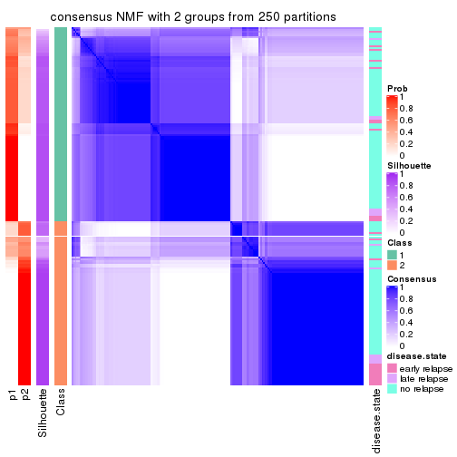</p>

</div>
<div id='tab-MAD-NMF-consensus-heatmap-2'>
<pre><code class="r">consensus_heatmap(res, k = 3)
</code></pre>

<p>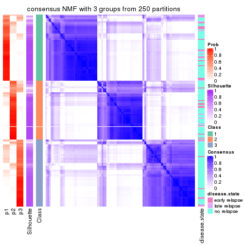</p>

</div>
<div id='tab-MAD-NMF-consensus-heatmap-3'>
<pre><code class="r">consensus_heatmap(res, k = 4)
</code></pre>

<p>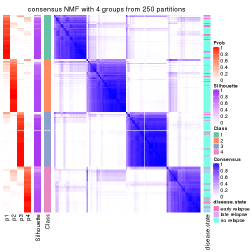</p>

</div>
<div id='tab-MAD-NMF-consensus-heatmap-4'>
<pre><code class="r">consensus_heatmap(res, k = 5)
</code></pre>

<p>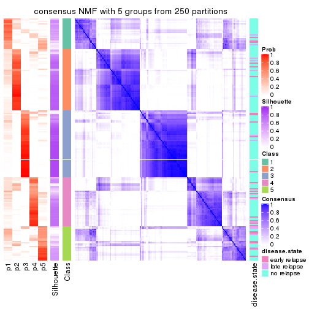</p>

</div>
<div id='tab-MAD-NMF-consensus-heatmap-5'>
<pre><code class="r">consensus_heatmap(res, k = 6)
</code></pre>

<p>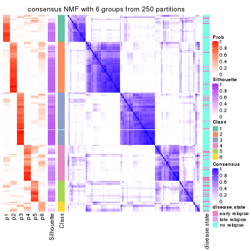</p>

</div>
</div>

Heatmaps for the membership of samples in all partitions to see how consistent they are:


<script>
$( function() {
	$( '#tabs-MAD-NMF-membership-heatmap' ).tabs();
} );
</script>
<div id='tabs-MAD-NMF-membership-heatmap'>
<ul>
<li><a href='#tab-MAD-NMF-membership-heatmap-1'>k = 2</a></li>
<li><a href='#tab-MAD-NMF-membership-heatmap-2'>k = 3</a></li>
<li><a href='#tab-MAD-NMF-membership-heatmap-3'>k = 4</a></li>
<li><a href='#tab-MAD-NMF-membership-heatmap-4'>k = 5</a></li>
<li><a href='#tab-MAD-NMF-membership-heatmap-5'>k = 6</a></li>
</ul>
<div id='tab-MAD-NMF-membership-heatmap-1'>
<pre><code class="r">membership_heatmap(res, k = 2)
</code></pre>

<p>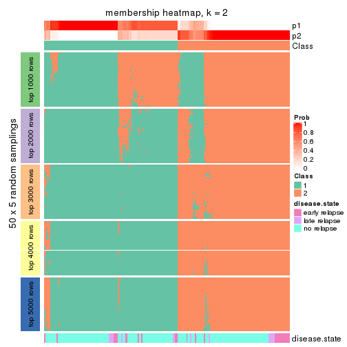</p>

</div>
<div id='tab-MAD-NMF-membership-heatmap-2'>
<pre><code class="r">membership_heatmap(res, k = 3)
</code></pre>

<p>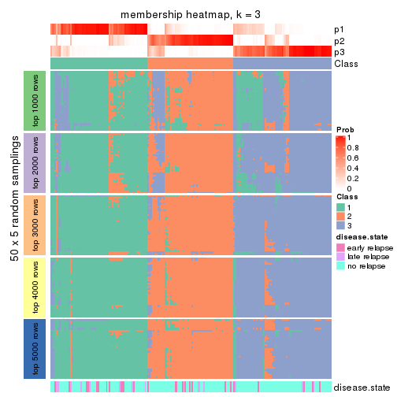</p>

</div>
<div id='tab-MAD-NMF-membership-heatmap-3'>
<pre><code class="r">membership_heatmap(res, k = 4)
</code></pre>

<p>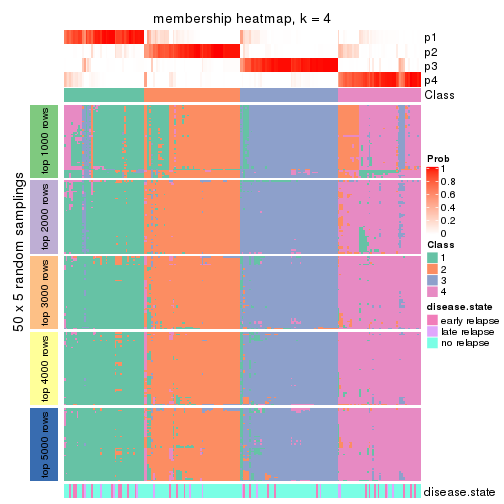</p>

</div>
<div id='tab-MAD-NMF-membership-heatmap-4'>
<pre><code class="r">membership_heatmap(res, k = 5)
</code></pre>

<p>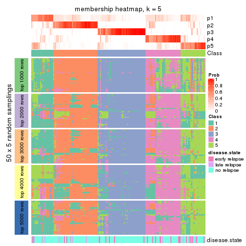</p>

</div>
<div id='tab-MAD-NMF-membership-heatmap-5'>
<pre><code class="r">membership_heatmap(res, k = 6)
</code></pre>

<p>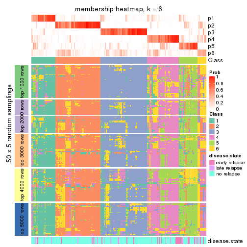</p>

</div>
</div>

As soon as we have had the classes for columns, we can look for signatures
which are significantly different between classes which can be candidate marks
for certain classes. Following are the heatmaps for signatures.


Signature heatmaps where rows are scaled:


<script>
$( function() {
	$( '#tabs-MAD-NMF-get-signatures' ).tabs();
} );
</script>
<div id='tabs-MAD-NMF-get-signatures'>
<ul>
<li><a href='#tab-MAD-NMF-get-signatures-1'>k = 2</a></li>
<li><a href='#tab-MAD-NMF-get-signatures-2'>k = 3</a></li>
<li><a href='#tab-MAD-NMF-get-signatures-3'>k = 4</a></li>
<li><a href='#tab-MAD-NMF-get-signatures-4'>k = 5</a></li>
<li><a href='#tab-MAD-NMF-get-signatures-5'>k = 6</a></li>
</ul>
<div id='tab-MAD-NMF-get-signatures-1'>
<pre><code class="r">get_signatures(res, k = 2)
</code></pre>

<p>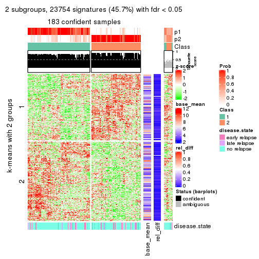</p>

</div>
<div id='tab-MAD-NMF-get-signatures-2'>
<pre><code class="r">get_signatures(res, k = 3)
</code></pre>

<p>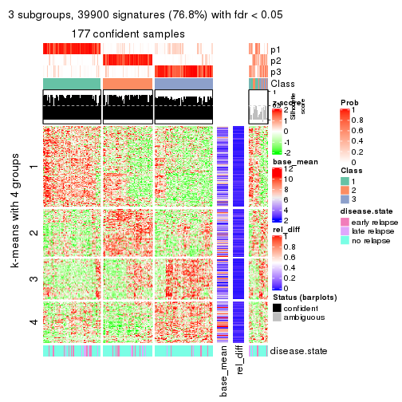</p>

</div>
<div id='tab-MAD-NMF-get-signatures-3'>
<pre><code class="r">get_signatures(res, k = 4)
</code></pre>

<p>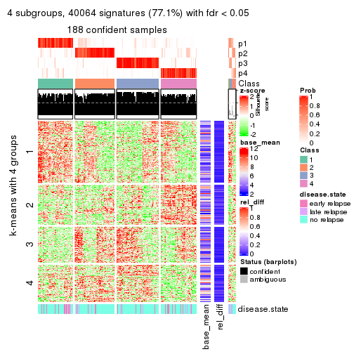</p>

</div>
<div id='tab-MAD-NMF-get-signatures-4'>
<pre><code class="r">get_signatures(res, k = 5)
</code></pre>

<p>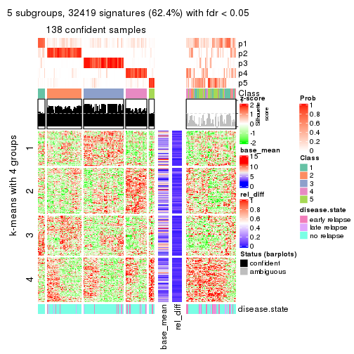</p>

</div>
<div id='tab-MAD-NMF-get-signatures-5'>
<pre><code class="r">get_signatures(res, k = 6)
</code></pre>

<p>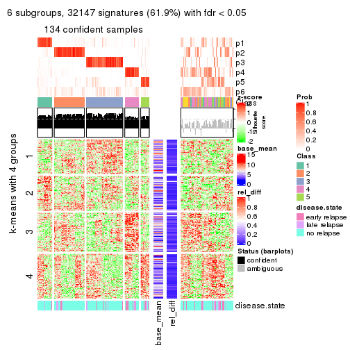</p>

</div>
</div>


Signature heatmaps where rows are not scaled:


<script>
$( function() {
	$( '#tabs-MAD-NMF-get-signatures-no-scale' ).tabs();
} );
</script>
<div id='tabs-MAD-NMF-get-signatures-no-scale'>
<ul>
<li><a href='#tab-MAD-NMF-get-signatures-no-scale-1'>k = 2</a></li>
<li><a href='#tab-MAD-NMF-get-signatures-no-scale-2'>k = 3</a></li>
<li><a href='#tab-MAD-NMF-get-signatures-no-scale-3'>k = 4</a></li>
<li><a href='#tab-MAD-NMF-get-signatures-no-scale-4'>k = 5</a></li>
<li><a href='#tab-MAD-NMF-get-signatures-no-scale-5'>k = 6</a></li>
</ul>
<div id='tab-MAD-NMF-get-signatures-no-scale-1'>
<pre><code class="r">get_signatures(res, k = 2, scale_rows = FALSE)
</code></pre>

<p>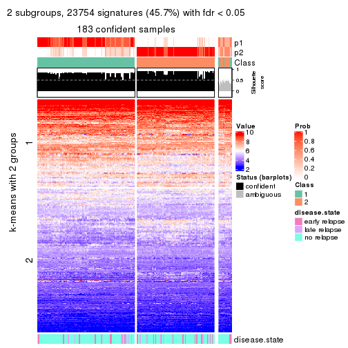</p>

</div>
<div id='tab-MAD-NMF-get-signatures-no-scale-2'>
<pre><code class="r">get_signatures(res, k = 3, scale_rows = FALSE)
</code></pre>

<p>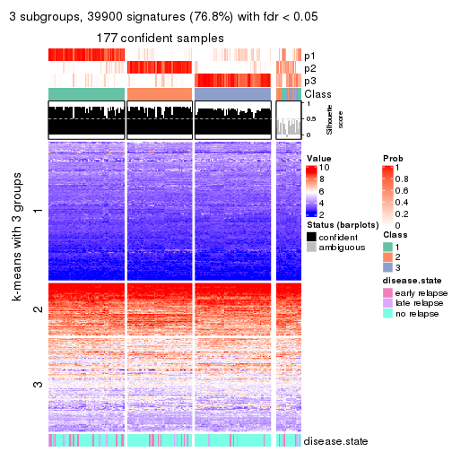</p>

</div>
<div id='tab-MAD-NMF-get-signatures-no-scale-3'>
<pre><code class="r">get_signatures(res, k = 4, scale_rows = FALSE)
</code></pre>

<p>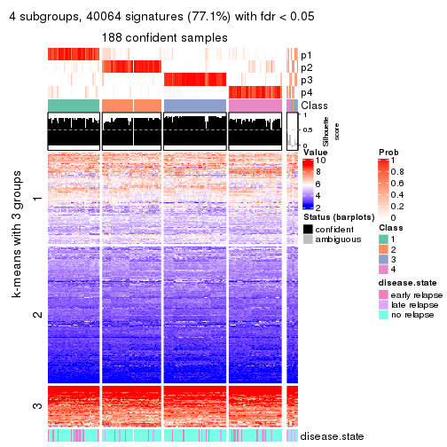</p>

</div>
<div id='tab-MAD-NMF-get-signatures-no-scale-4'>
<pre><code class="r">get_signatures(res, k = 5, scale_rows = FALSE)
</code></pre>

<p>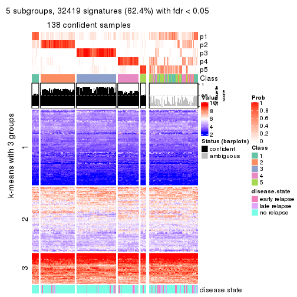</p>

</div>
<div id='tab-MAD-NMF-get-signatures-no-scale-5'>
<pre><code class="r">get_signatures(res, k = 6, scale_rows = FALSE)
</code></pre>

<p>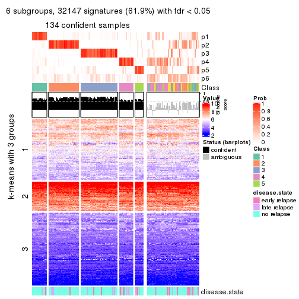</p>

</div>
</div>


Compare the overlap of signatures from different k:

```r
compare_signatures(res)
```

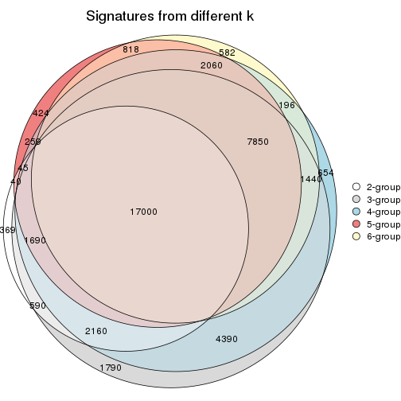

`get_signature()` returns a data frame invisibly. TO get the list of signatures, the function
call should be assigned to a variable explicitly. In following code, if `plot` argument is set
to `FALSE`, no heatmap is plotted while only the differential analysis is performed.

```r
# code only for demonstration
tb = get_signature(res, k = ..., plot = FALSE)
```

An example of the output of `tb` is:

```
#>   which_row         fdr    mean_1    mean_2 scaled_mean_1 scaled_mean_2 km
#> 1        38 0.042760348  8.373488  9.131774    -0.5533452     0.5164555  1
#> 2        40 0.018707592  7.106213  8.469186    -0.6173731     0.5762149  1
#> 3        55 0.019134737 10.221463 11.207825    -0.6159697     0.5749050  1
#> 4        59 0.006059896  5.921854  7.869574    -0.6899429     0.6439467  1
#> 5        60 0.018055526  8.928898 10.211722    -0.6204761     0.5791110  1
#> 6        98 0.009384629 15.714769 14.887706     0.6635654    -0.6193277  2
...
```

The columns in `tb` are:

1. `which_row`: row indices corresponding to the input matrix.
2. `fdr`: FDR for the differential test. 
3. `mean_x`: The mean value in group x.
4. `scaled_mean_x`: The mean value in group x after rows are scaled.
5. `km`: Row groups if k-means clustering is applied to rows.


UMAP plot which shows how samples are separated.


<script>
$( function() {
	$( '#tabs-MAD-NMF-dimension-reduction' ).tabs();
} );
</script>
<div id='tabs-MAD-NMF-dimension-reduction'>
<ul>
<li><a href='#tab-MAD-NMF-dimension-reduction-1'>k = 2</a></li>
<li><a href='#tab-MAD-NMF-dimension-reduction-2'>k = 3</a></li>
<li><a href='#tab-MAD-NMF-dimension-reduction-3'>k = 4</a></li>
<li><a href='#tab-MAD-NMF-dimension-reduction-4'>k = 5</a></li>
<li><a href='#tab-MAD-NMF-dimension-reduction-5'>k = 6</a></li>
</ul>
<div id='tab-MAD-NMF-dimension-reduction-1'>
<pre><code class="r">dimension_reduction(res, k = 2, method = &quot;UMAP&quot;)
</code></pre>

<p>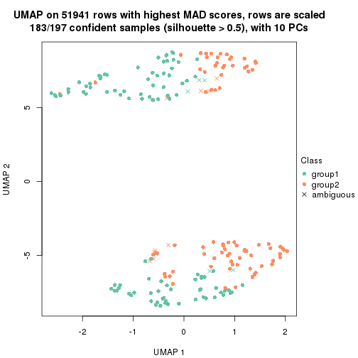</p>

</div>
<div id='tab-MAD-NMF-dimension-reduction-2'>
<pre><code class="r">dimension_reduction(res, k = 3, method = &quot;UMAP&quot;)
</code></pre>

<p>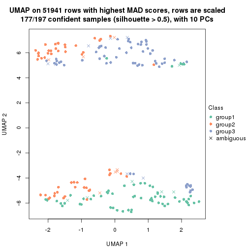</p>

</div>
<div id='tab-MAD-NMF-dimension-reduction-3'>
<pre><code class="r">dimension_reduction(res, k = 4, method = &quot;UMAP&quot;)
</code></pre>

<p>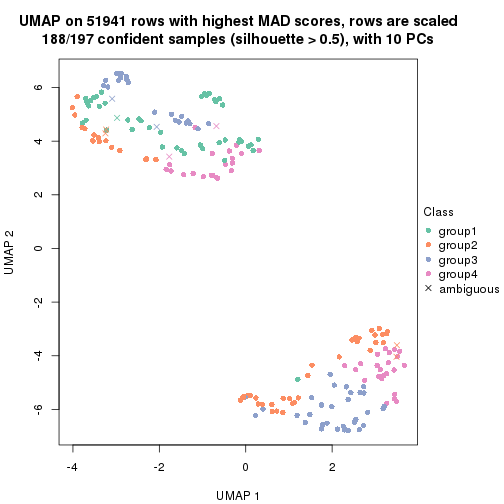</p>

</div>
<div id='tab-MAD-NMF-dimension-reduction-4'>
<pre><code class="r">dimension_reduction(res, k = 5, method = &quot;UMAP&quot;)
</code></pre>

<p>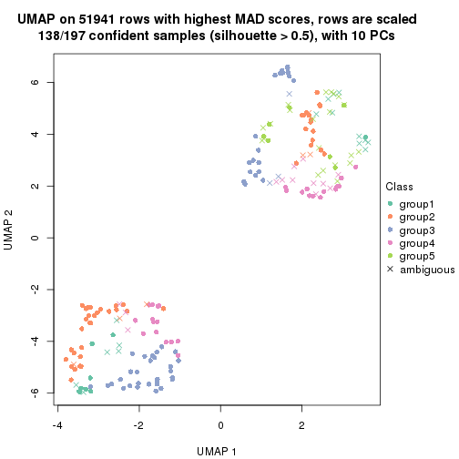</p>

</div>
<div id='tab-MAD-NMF-dimension-reduction-5'>
<pre><code class="r">dimension_reduction(res, k = 6, method = &quot;UMAP&quot;)
</code></pre>

<p>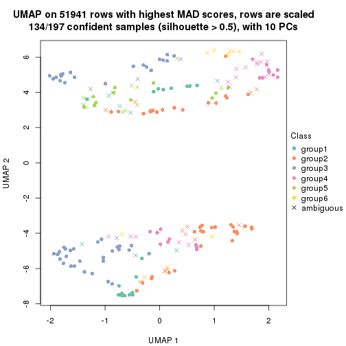</p>

</div>
</div>


Following heatmap shows how subgroups are split when increasing `k`:

```r
collect_classes(res)
```

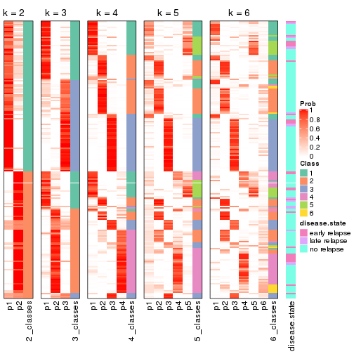


Test correlation between subgroups and known annotations. If the known
annotation is numeric, one-way ANOVA test is applied, and if the known
annotation is discrete, chi-squared contingency table test is applied.

```r
test_to_known_factors(res)
```

```
#>           n disease.state(p) k
#> MAD:NMF 183           0.2723 2
#> MAD:NMF 177           0.1561 3
#> MAD:NMF 188           0.2379 4
#> MAD:NMF 138           0.6440 5
#> MAD:NMF 134           0.0533 6
```


If matrix rows can be associated to genes, consider to use `functional_enrichment(res,
...)` to perform function enrichment for the signature genes. See [this vignette](http://bioconductor.org/packages/devel/bioc/vignettes/cola/inst/doc/functional_enrichment.html) for more detailed explanations.


 

---------------------------------------------------


### ATC:hclust**


The object with results only for a single top-value method and a single partition method 
can be extracted as:

```r
res = res_list["ATC", "hclust"]
# you can also extract it by
# res = res_list["ATC:hclust"]
```

A summary of `res` and all the functions that can be applied to it:

```r
res
```

```
#> A 'ConsensusPartition' object with k = 2, 3, 4, 5, 6.
#>   On a matrix with 51941 rows and 197 columns.
#>   Top rows (1000, 2000, 3000, 4000, 5000) are extracted by 'ATC' method.
#>   Subgroups are detected by 'hclust' method.
#>   Performed in total 1250 partitions by row resampling.
#>   Best k for subgroups seems to be 2.
#> 
#> Following methods can be applied to this 'ConsensusPartition' object:
#>  [1] "cola_report"             "collect_classes"         "collect_plots"          
#>  [4] "collect_stats"           "colnames"                "compare_signatures"     
#>  [7] "consensus_heatmap"       "dimension_reduction"     "functional_enrichment"  
#> [10] "get_anno_col"            "get_anno"                "get_classes"            
#> [13] "get_consensus"           "get_matrix"              "get_membership"         
#> [16] "get_param"               "get_signatures"          "get_stats"              
#> [19] "is_best_k"               "is_stable_k"             "membership_heatmap"     
#> [22] "ncol"                    "nrow"                    "plot_ecdf"              
#> [25] "rownames"                "select_partition_number" "show"                   
#> [28] "suggest_best_k"          "test_to_known_factors"
```

`collect_plots()` function collects all the plots made from `res` for all `k` (number of partitions)
into one single page to provide an easy and fast comparison between different `k`.

```r
collect_plots(res)
```

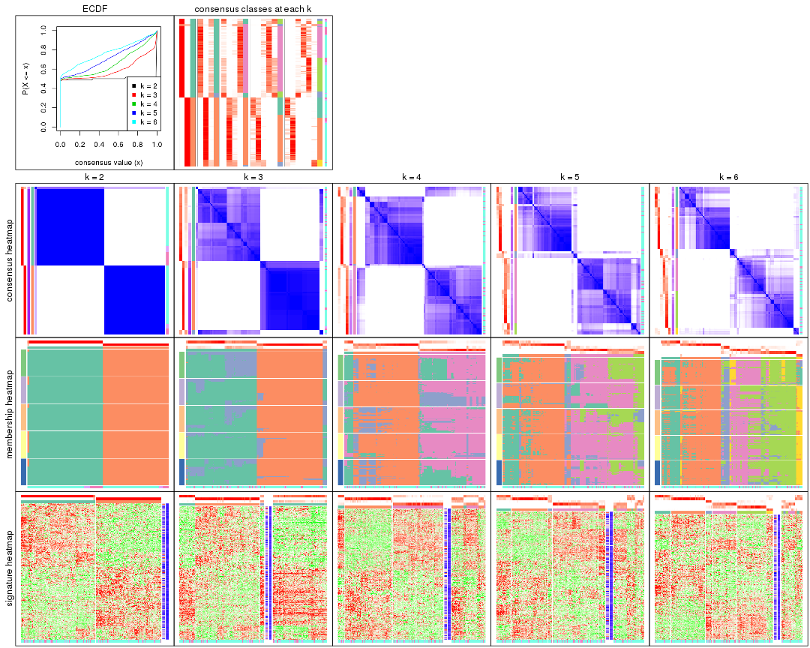

The plots are:

- The first row: a plot of the ECDF (empirical cumulative distribution
  function) curves of the consensus matrix for each `k` and the heatmap of
  predicted classes for each `k`.
- The second row: heatmaps of the consensus matrix for each `k`.
- The third row: heatmaps of the membership matrix for each `k`.
- The fouth row: heatmaps of the signatures for each `k`.

All the plots in panels can be made by individual functions and they are
plotted later in this section.

`select_partition_number()` produces several plots showing different
statistics for choosing "optimized" `k`. There are following statistics:

- ECDF curves of the consensus matrix for each `k`;
- 1-PAC. [The PAC
  score](https://en.wikipedia.org/wiki/Consensus_clustering#Over-interpretation_potential_of_consensus_clustering)
  measures the proportion of the ambiguous subgrouping.
- Mean silhouette score.
- Concordance. The mean probability of fiting the consensus class ids in all
  partitions.
- Area increased. Denote $A_k$ as the area under the ECDF curve for current
  `k`, the area increased is defined as $A_k - A_{k-1}$.
- Rand index. The percent of pairs of samples that are both in a same cluster
  or both are not in a same cluster in the partition of k and k-1.
- Jaccard index. The ratio of pairs of samples are both in a same cluster in
  the partition of k and k-1 and the pairs of samples are both in a same
  cluster in the partition k or k-1.

The detailed explanations of these statistics can be found in [the _cola_
vignette](http://bioconductor.org/packages/devel/bioc/vignettes/cola/inst/doc/cola.html#toc_13).

Generally speaking, lower PAC score, higher mean silhouette score or higher
concordance corresponds to better partition. Rand index and Jaccard index
measure how similar the current partition is compared to partition with `k-1`.
If they are too similar, we won't accept `k` is better than `k-1`.

```r
select_partition_number(res)
```

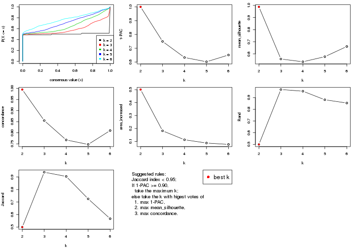

The numeric values for all these statistics can be obtained by `get_stats()`.

```r
get_stats(res)
```

```
#>   k 1-PAC mean_silhouette concordance area_increased  Rand Jaccard
#> 2 2 1.000           0.988       0.995         0.5014 0.500   0.500
#> 3 3 0.749           0.558       0.855         0.1816 0.969   0.938
#> 4 4 0.633           0.535       0.768         0.1126 0.955   0.905
#> 5 5 0.602           0.577       0.747         0.0874 0.882   0.725
#> 6 6 0.651           0.661       0.810         0.0765 0.854   0.567
```

`suggest_best_k()` suggests the best $k$ based on these statistics. The rules are as follows:

- All $k$ with Jaccard index larger than 0.95 are removed because increasing
  $k$ does not provide enough extra information. If all $k$ are removed, it is
  marked as no subgroup is detected.
- For all $k$ with 1-PAC score larger than 0.9, the maximal $k$ is taken as
  the best $k$, and other $k$ are marked as optional $k$.
- If it does not fit the second rule. The $k$ with the maximal vote of the
  highest 1-PAC score, highest mean silhouette, and highest concordance is
  taken as the best $k$.

```r
suggest_best_k(res)
```

```
#> [1] 2
```


Following shows the table of the partitions (You need to click the **show/hide
code output** link to see it). The membership matrix (columns with name `p*`)
is inferred by
[`clue::cl_consensus()`](https://www.rdocumentation.org/link/cl_consensus?package=clue)
function with the `SE` method. Basically the value in the membership matrix
represents the probability to belong to a certain group. The finall class
label for an item is determined with the group with highest probability it
belongs to.

In `get_classes()` function, the entropy is calculated from the membership
matrix and the silhouette score is calculated from the consensus matrix.


<script>
$( function() {
	$( '#tabs-ATC-hclust-get-classes' ).tabs();
} );
</script>
<div id='tabs-ATC-hclust-get-classes'>
<ul>
<li><a href='#tab-ATC-hclust-get-classes-1'>k = 2</a></li>
<li><a href='#tab-ATC-hclust-get-classes-2'>k = 3</a></li>
<li><a href='#tab-ATC-hclust-get-classes-3'>k = 4</a></li>
<li><a href='#tab-ATC-hclust-get-classes-4'>k = 5</a></li>
<li><a href='#tab-ATC-hclust-get-classes-5'>k = 6</a></li>
</ul>

<div id='tab-ATC-hclust-get-classes-1'>
<p><a id='tab-ATC-hclust-get-classes-1-a' style='color:#0366d6' href='#'>show/hide code output</a></p>
<pre><code class="r">cbind(get_classes(res, k = 2), get_membership(res, k = 2))
</code></pre>

<pre><code>#&gt;           class entropy silhouette    p1    p2
#&gt; GSM342319     1  0.0000      0.991 1.000 0.000
#&gt; GSM342323     1  0.0000      0.991 1.000 0.000
#&gt; GSM342325     1  0.0000      0.991 1.000 0.000
#&gt; GSM342326     1  0.0000      0.991 1.000 0.000
#&gt; GSM342327     1  0.0000      0.991 1.000 0.000
#&gt; GSM342329     1  0.0000      0.991 1.000 0.000
#&gt; GSM342331     1  0.0000      0.991 1.000 0.000
#&gt; GSM342334     1  0.0000      0.991 1.000 0.000
#&gt; GSM342335     1  0.0000      0.991 1.000 0.000
#&gt; GSM342354     1  0.0000      0.991 1.000 0.000
#&gt; GSM342371     1  0.0000      0.991 1.000 0.000
#&gt; GSM342380     1  0.0000      0.991 1.000 0.000
#&gt; GSM342382     1  0.0000      0.991 1.000 0.000
#&gt; GSM342399     1  0.0000      0.991 1.000 0.000
#&gt; GSM342402     1  0.0000      0.991 1.000 0.000
#&gt; GSM342404     1  0.0000      0.991 1.000 0.000
#&gt; GSM342408     1  0.0000      0.991 1.000 0.000
#&gt; GSM342409     1  0.0000      0.991 1.000 0.000
#&gt; GSM342426     2  0.0000      1.000 0.000 1.000
#&gt; GSM342441     2  0.0000      1.000 0.000 1.000
#&gt; GSM342444     2  0.0000      1.000 0.000 1.000
#&gt; GSM342451     2  0.0000      1.000 0.000 1.000
#&gt; GSM342462     2  0.0000      1.000 0.000 1.000
#&gt; GSM342467     2  0.0000      1.000 0.000 1.000
#&gt; GSM342484     2  0.0000      1.000 0.000 1.000
#&gt; GSM342491     2  0.0000      1.000 0.000 1.000
#&gt; GSM342322     1  0.0000      0.991 1.000 0.000
#&gt; GSM342338     1  0.0000      0.991 1.000 0.000
#&gt; GSM342347     1  0.0000      0.991 1.000 0.000
#&gt; GSM342356     1  0.0000      0.991 1.000 0.000
#&gt; GSM342357     1  0.0000      0.991 1.000 0.000
#&gt; GSM342366     1  0.0000      0.991 1.000 0.000
#&gt; GSM342385     1  0.0000      0.991 1.000 0.000
#&gt; GSM342421     1  0.0000      0.991 1.000 0.000
#&gt; GSM342437     2  0.0000      1.000 0.000 1.000
#&gt; GSM342454     2  0.0000      1.000 0.000 1.000
#&gt; GSM342471     2  0.0000      1.000 0.000 1.000
#&gt; GSM342477     2  0.0000      1.000 0.000 1.000
#&gt; GSM342495     2  0.0000      1.000 0.000 1.000
#&gt; GSM342496     2  0.0000      1.000 0.000 1.000
#&gt; GSM342320     1  0.0000      0.991 1.000 0.000
#&gt; GSM342321     1  0.0000      0.991 1.000 0.000
#&gt; GSM342324     1  0.0000      0.991 1.000 0.000
#&gt; GSM342328     1  0.0000      0.991 1.000 0.000
#&gt; GSM342330     1  0.0000      0.991 1.000 0.000
#&gt; GSM342332     1  0.0000      0.991 1.000 0.000
#&gt; GSM342333     1  0.0000      0.991 1.000 0.000
#&gt; GSM342336     1  0.0000      0.991 1.000 0.000
#&gt; GSM342337     1  0.0000      0.991 1.000 0.000
#&gt; GSM342339     1  0.0000      0.991 1.000 0.000
#&gt; GSM342340     1  0.0000      0.991 1.000 0.000
#&gt; GSM342341     1  0.0000      0.991 1.000 0.000
#&gt; GSM342342     1  0.0000      0.991 1.000 0.000
#&gt; GSM342343     1  0.0000      0.991 1.000 0.000
#&gt; GSM342344     1  0.0000      0.991 1.000 0.000
#&gt; GSM342345     1  0.0000      0.991 1.000 0.000
#&gt; GSM342346     1  0.0000      0.991 1.000 0.000
#&gt; GSM342348     1  0.0000      0.991 1.000 0.000
#&gt; GSM342349     1  0.0000      0.991 1.000 0.000
#&gt; GSM342350     1  0.0000      0.991 1.000 0.000
#&gt; GSM342351     1  0.9087      0.530 0.676 0.324
#&gt; GSM342352     1  0.9087      0.530 0.676 0.324
#&gt; GSM342353     1  0.0000      0.991 1.000 0.000
#&gt; GSM342355     1  0.0000      0.991 1.000 0.000
#&gt; GSM342358     1  0.0000      0.991 1.000 0.000
#&gt; GSM342359     1  0.0000      0.991 1.000 0.000
#&gt; GSM342360     1  0.0000      0.991 1.000 0.000
#&gt; GSM342361     1  0.0000      0.991 1.000 0.000
#&gt; GSM342362     1  0.0000      0.991 1.000 0.000
#&gt; GSM342363     1  0.0000      0.991 1.000 0.000
#&gt; GSM342364     1  0.0000      0.991 1.000 0.000
#&gt; GSM342365     1  0.0000      0.991 1.000 0.000
#&gt; GSM342367     1  0.0000      0.991 1.000 0.000
#&gt; GSM342368     1  0.0000      0.991 1.000 0.000
#&gt; GSM342369     1  0.0000      0.991 1.000 0.000
#&gt; GSM342370     1  0.0000      0.991 1.000 0.000
#&gt; GSM342372     1  0.0000      0.991 1.000 0.000
#&gt; GSM342373     1  0.0000      0.991 1.000 0.000
#&gt; GSM342374     1  0.0000      0.991 1.000 0.000
#&gt; GSM342375     1  0.0000      0.991 1.000 0.000
#&gt; GSM342376     1  0.0000      0.991 1.000 0.000
#&gt; GSM342377     1  0.0000      0.991 1.000 0.000
#&gt; GSM342378     1  0.0000      0.991 1.000 0.000
#&gt; GSM342379     1  0.0000      0.991 1.000 0.000
#&gt; GSM342381     1  0.0000      0.991 1.000 0.000
#&gt; GSM342383     1  0.0000      0.991 1.000 0.000
#&gt; GSM342384     1  0.0000      0.991 1.000 0.000
#&gt; GSM342386     1  0.0000      0.991 1.000 0.000
#&gt; GSM342387     1  0.0000      0.991 1.000 0.000
#&gt; GSM342388     1  0.0000      0.991 1.000 0.000
#&gt; GSM342389     1  0.0000      0.991 1.000 0.000
#&gt; GSM342390     1  0.0000      0.991 1.000 0.000
#&gt; GSM342391     1  0.0000      0.991 1.000 0.000
#&gt; GSM342392     1  0.0000      0.991 1.000 0.000
#&gt; GSM342393     1  0.0000      0.991 1.000 0.000
#&gt; GSM342394     1  0.0000      0.991 1.000 0.000
#&gt; GSM342395     1  0.0000      0.991 1.000 0.000
#&gt; GSM342396     1  0.0000      0.991 1.000 0.000
#&gt; GSM342397     1  0.0000      0.991 1.000 0.000
#&gt; GSM342398     1  0.0000      0.991 1.000 0.000
#&gt; GSM342400     1  0.0000      0.991 1.000 0.000
#&gt; GSM342401     1  0.0000      0.991 1.000 0.000
#&gt; GSM342403     1  0.0000      0.991 1.000 0.000
#&gt; GSM342405     1  0.0000      0.991 1.000 0.000
#&gt; GSM342406     1  0.0000      0.991 1.000 0.000
#&gt; GSM342407     1  0.0000      0.991 1.000 0.000
#&gt; GSM342410     1  0.0000      0.991 1.000 0.000
#&gt; GSM342411     1  0.0000      0.991 1.000 0.000
#&gt; GSM342412     1  0.0000      0.991 1.000 0.000
#&gt; GSM342413     1  0.0000      0.991 1.000 0.000
#&gt; GSM342414     1  0.0000      0.991 1.000 0.000
#&gt; GSM342415     1  0.0000      0.991 1.000 0.000
#&gt; GSM342416     1  0.0000      0.991 1.000 0.000
#&gt; GSM342417     1  0.0000      0.991 1.000 0.000
#&gt; GSM342418     1  0.0000      0.991 1.000 0.000
#&gt; GSM342419     1  0.0000      0.991 1.000 0.000
#&gt; GSM342420     1  0.9087      0.530 0.676 0.324
#&gt; GSM342422     1  0.0000      0.991 1.000 0.000
#&gt; GSM342423     1  0.0000      0.991 1.000 0.000
#&gt; GSM342424     2  0.0376      0.996 0.004 0.996
#&gt; GSM342425     2  0.0000      1.000 0.000 1.000
#&gt; GSM342427     2  0.0000      1.000 0.000 1.000
#&gt; GSM342428     2  0.0000      1.000 0.000 1.000
#&gt; GSM342429     2  0.0000      1.000 0.000 1.000
#&gt; GSM342430     2  0.0000      1.000 0.000 1.000
#&gt; GSM342431     2  0.0000      1.000 0.000 1.000
#&gt; GSM342432     2  0.0000      1.000 0.000 1.000
#&gt; GSM342433     2  0.0000      1.000 0.000 1.000
#&gt; GSM342434     2  0.0000      1.000 0.000 1.000
#&gt; GSM342435     2  0.0000      1.000 0.000 1.000
#&gt; GSM342436     2  0.0000      1.000 0.000 1.000
#&gt; GSM342438     2  0.0000      1.000 0.000 1.000
#&gt; GSM342439     2  0.0000      1.000 0.000 1.000
#&gt; GSM342440     2  0.0000      1.000 0.000 1.000
#&gt; GSM342442     2  0.0000      1.000 0.000 1.000
#&gt; GSM342443     2  0.0000      1.000 0.000 1.000
#&gt; GSM342445     2  0.0000      1.000 0.000 1.000
#&gt; GSM342446     2  0.0000      1.000 0.000 1.000
#&gt; GSM342447     2  0.0000      1.000 0.000 1.000
#&gt; GSM342448     2  0.0000      1.000 0.000 1.000
#&gt; GSM342449     2  0.0000      1.000 0.000 1.000
#&gt; GSM342450     2  0.0000      1.000 0.000 1.000
#&gt; GSM342452     2  0.0000      1.000 0.000 1.000
#&gt; GSM342453     2  0.0000      1.000 0.000 1.000
#&gt; GSM342455     2  0.0000      1.000 0.000 1.000
#&gt; GSM342456     2  0.0000      1.000 0.000 1.000
#&gt; GSM342457     2  0.0000      1.000 0.000 1.000
#&gt; GSM342458     2  0.0000      1.000 0.000 1.000
#&gt; GSM342459     2  0.0000      1.000 0.000 1.000
#&gt; GSM342460     2  0.0000      1.000 0.000 1.000
#&gt; GSM342461     2  0.0000      1.000 0.000 1.000
#&gt; GSM342463     2  0.0000      1.000 0.000 1.000
#&gt; GSM342464     2  0.0000      1.000 0.000 1.000
#&gt; GSM342465     2  0.0000      1.000 0.000 1.000
#&gt; GSM342466     2  0.0000      1.000 0.000 1.000
#&gt; GSM342468     2  0.0376      0.996 0.004 0.996
#&gt; GSM342469     2  0.0000      1.000 0.000 1.000
#&gt; GSM342470     2  0.0000      1.000 0.000 1.000
#&gt; GSM342472     2  0.0000      1.000 0.000 1.000
#&gt; GSM342473     2  0.0000      1.000 0.000 1.000
#&gt; GSM342474     2  0.0000      1.000 0.000 1.000
#&gt; GSM342475     2  0.0000      1.000 0.000 1.000
#&gt; GSM342476     2  0.0000      1.000 0.000 1.000
#&gt; GSM342478     2  0.0000      1.000 0.000 1.000
#&gt; GSM342479     2  0.0000      1.000 0.000 1.000
#&gt; GSM342480     2  0.0000      1.000 0.000 1.000
#&gt; GSM342481     2  0.0000      1.000 0.000 1.000
#&gt; GSM342482     2  0.0000      1.000 0.000 1.000
#&gt; GSM342483     2  0.0000      1.000 0.000 1.000
#&gt; GSM342485     2  0.0000      1.000 0.000 1.000
#&gt; GSM342486     2  0.0000      1.000 0.000 1.000
#&gt; GSM342487     2  0.0000      1.000 0.000 1.000
#&gt; GSM342488     2  0.0000      1.000 0.000 1.000
#&gt; GSM342489     2  0.0000      1.000 0.000 1.000
#&gt; GSM342490     2  0.0000      1.000 0.000 1.000
#&gt; GSM342492     2  0.0000      1.000 0.000 1.000
#&gt; GSM342493     2  0.0000      1.000 0.000 1.000
#&gt; GSM342494     2  0.0000      1.000 0.000 1.000
#&gt; GSM342497     2  0.0000      1.000 0.000 1.000
#&gt; GSM342498     2  0.0000      1.000 0.000 1.000
#&gt; GSM342499     2  0.0000      1.000 0.000 1.000
#&gt; GSM342500     2  0.0000      1.000 0.000 1.000
#&gt; GSM342501     2  0.0000      1.000 0.000 1.000
#&gt; GSM342502     2  0.0000      1.000 0.000 1.000
#&gt; GSM342503     2  0.0000      1.000 0.000 1.000
#&gt; GSM342504     2  0.0000      1.000 0.000 1.000
#&gt; GSM342505     2  0.0000      1.000 0.000 1.000
#&gt; GSM342506     2  0.0000      1.000 0.000 1.000
#&gt; GSM342507     2  0.0000      1.000 0.000 1.000
#&gt; GSM342508     2  0.0000      1.000 0.000 1.000
#&gt; GSM342509     2  0.0000      1.000 0.000 1.000
#&gt; GSM342510     2  0.0000      1.000 0.000 1.000
#&gt; GSM342511     2  0.0000      1.000 0.000 1.000
#&gt; GSM342512     2  0.0000      1.000 0.000 1.000
#&gt; GSM342513     2  0.0000      1.000 0.000 1.000
#&gt; GSM342514     2  0.0000      1.000 0.000 1.000
#&gt; GSM342515     2  0.0000      1.000 0.000 1.000
</code></pre>

<script>
$('#tab-ATC-hclust-get-classes-1-a').parent().next().next().hide();
$('#tab-ATC-hclust-get-classes-1-a').click(function(){
  $('#tab-ATC-hclust-get-classes-1-a').parent().next().next().toggle();
  return(false);
});
</script>
</div>

<div id='tab-ATC-hclust-get-classes-2'>
<p><a id='tab-ATC-hclust-get-classes-2-a' style='color:#0366d6' href='#'>show/hide code output</a></p>
<pre><code class="r">cbind(get_classes(res, k = 3), get_membership(res, k = 3))
</code></pre>

<pre><code>#&gt;           class entropy silhouette    p1    p2    p3
#&gt; GSM342319     1  0.5397    0.09144 0.720 0.000 0.280
#&gt; GSM342323     1  0.1411    0.51146 0.964 0.000 0.036
#&gt; GSM342325     1  0.5968   -0.32169 0.636 0.000 0.364
#&gt; GSM342326     1  0.3038    0.49767 0.896 0.000 0.104
#&gt; GSM342327     1  0.3116    0.49499 0.892 0.000 0.108
#&gt; GSM342329     1  0.6307   -0.89394 0.512 0.000 0.488
#&gt; GSM342331     1  0.2625    0.50688 0.916 0.000 0.084
#&gt; GSM342334     1  0.0892    0.52515 0.980 0.000 0.020
#&gt; GSM342335     1  0.6309   -0.93482 0.500 0.000 0.500
#&gt; GSM342354     1  0.0237    0.52465 0.996 0.000 0.004
#&gt; GSM342371     1  0.0237    0.52352 0.996 0.000 0.004
#&gt; GSM342380     1  0.5397    0.09078 0.720 0.000 0.280
#&gt; GSM342382     1  0.5363    0.10601 0.724 0.000 0.276
#&gt; GSM342399     1  0.5968   -0.32169 0.636 0.000 0.364
#&gt; GSM342402     1  0.5431    0.07498 0.716 0.000 0.284
#&gt; GSM342404     1  0.4178    0.44811 0.828 0.000 0.172
#&gt; GSM342408     1  0.4178    0.44811 0.828 0.000 0.172
#&gt; GSM342409     1  0.0000    0.52416 1.000 0.000 0.000
#&gt; GSM342426     2  0.1643    0.95498 0.000 0.956 0.044
#&gt; GSM342441     2  0.0000    0.97477 0.000 1.000 0.000
#&gt; GSM342444     2  0.0592    0.97257 0.000 0.988 0.012
#&gt; GSM342451     2  0.0592    0.97257 0.000 0.988 0.012
#&gt; GSM342462     2  0.0000    0.97477 0.000 1.000 0.000
#&gt; GSM342467     2  0.4974    0.80425 0.000 0.764 0.236
#&gt; GSM342484     2  0.0000    0.97477 0.000 1.000 0.000
#&gt; GSM342491     2  0.0424    0.97412 0.000 0.992 0.008
#&gt; GSM342322     1  0.5397    0.09144 0.720 0.000 0.280
#&gt; GSM342338     3  0.6299    0.98498 0.476 0.000 0.524
#&gt; GSM342347     1  0.6309   -0.93482 0.500 0.000 0.500
#&gt; GSM342356     1  0.6299   -0.83988 0.524 0.000 0.476
#&gt; GSM342357     1  0.5363    0.10601 0.724 0.000 0.276
#&gt; GSM342366     1  0.5560   -0.00679 0.700 0.000 0.300
#&gt; GSM342385     1  0.5431    0.07688 0.716 0.000 0.284
#&gt; GSM342421     1  0.0237    0.52352 0.996 0.000 0.004
#&gt; GSM342437     2  0.0424    0.97412 0.000 0.992 0.008
#&gt; GSM342454     2  0.0592    0.97257 0.000 0.988 0.012
#&gt; GSM342471     2  0.0592    0.97257 0.000 0.988 0.012
#&gt; GSM342477     2  0.4346    0.84926 0.000 0.816 0.184
#&gt; GSM342495     2  0.0424    0.97412 0.000 0.992 0.008
#&gt; GSM342496     2  0.0592    0.97257 0.000 0.988 0.012
#&gt; GSM342320     1  0.4121    0.45141 0.832 0.000 0.168
#&gt; GSM342321     1  0.5138    0.15412 0.748 0.000 0.252
#&gt; GSM342324     1  0.1289    0.51369 0.968 0.000 0.032
#&gt; GSM342328     1  0.0747    0.52527 0.984 0.000 0.016
#&gt; GSM342330     1  0.2625    0.50688 0.916 0.000 0.084
#&gt; GSM342332     1  0.2356    0.48987 0.928 0.000 0.072
#&gt; GSM342333     1  0.1289    0.51338 0.968 0.000 0.032
#&gt; GSM342336     1  0.0892    0.52515 0.980 0.000 0.020
#&gt; GSM342337     1  0.6008   -0.36660 0.628 0.000 0.372
#&gt; GSM342339     1  0.3192    0.45089 0.888 0.000 0.112
#&gt; GSM342340     1  0.5497    0.04119 0.708 0.000 0.292
#&gt; GSM342341     1  0.3192    0.45089 0.888 0.000 0.112
#&gt; GSM342342     1  0.5431    0.07688 0.716 0.000 0.284
#&gt; GSM342343     1  0.6008   -0.36660 0.628 0.000 0.372
#&gt; GSM342344     1  0.2711    0.48317 0.912 0.000 0.088
#&gt; GSM342345     1  0.3192    0.45089 0.888 0.000 0.112
#&gt; GSM342346     1  0.3038    0.45575 0.896 0.000 0.104
#&gt; GSM342348     1  0.0000    0.52416 1.000 0.000 0.000
#&gt; GSM342349     1  0.3412    0.47913 0.876 0.000 0.124
#&gt; GSM342350     1  0.5591   -0.12271 0.696 0.000 0.304
#&gt; GSM342351     1  0.8068    0.12478 0.480 0.064 0.456
#&gt; GSM342352     1  0.8068    0.12478 0.480 0.064 0.456
#&gt; GSM342353     1  0.3686    0.46629 0.860 0.000 0.140
#&gt; GSM342355     3  0.6299    0.98498 0.476 0.000 0.524
#&gt; GSM342358     1  0.4555    0.42176 0.800 0.000 0.200
#&gt; GSM342359     1  0.2959    0.49972 0.900 0.000 0.100
#&gt; GSM342360     1  0.2959    0.49972 0.900 0.000 0.100
#&gt; GSM342361     1  0.4605    0.41817 0.796 0.000 0.204
#&gt; GSM342362     1  0.0000    0.52416 1.000 0.000 0.000
#&gt; GSM342363     3  0.6299    0.98498 0.476 0.000 0.524
#&gt; GSM342364     1  0.6008   -0.36660 0.628 0.000 0.372
#&gt; GSM342365     1  0.3038    0.49736 0.896 0.000 0.104
#&gt; GSM342367     1  0.5591   -0.04243 0.696 0.000 0.304
#&gt; GSM342368     1  0.5465    0.05987 0.712 0.000 0.288
#&gt; GSM342369     1  0.2537    0.51792 0.920 0.000 0.080
#&gt; GSM342370     1  0.2537    0.51792 0.920 0.000 0.080
#&gt; GSM342372     1  0.1163    0.52547 0.972 0.000 0.028
#&gt; GSM342373     1  0.0237    0.52352 0.996 0.000 0.004
#&gt; GSM342374     1  0.5785   -0.31488 0.668 0.000 0.332
#&gt; GSM342375     1  0.5785   -0.31488 0.668 0.000 0.332
#&gt; GSM342376     1  0.6299   -0.83988 0.524 0.000 0.476
#&gt; GSM342377     1  0.6299   -0.83988 0.524 0.000 0.476
#&gt; GSM342378     1  0.5988   -0.34805 0.632 0.000 0.368
#&gt; GSM342379     3  0.6299    0.98498 0.476 0.000 0.524
#&gt; GSM342381     1  0.5948   -0.30670 0.640 0.000 0.360
#&gt; GSM342383     1  0.5363    0.10601 0.724 0.000 0.276
#&gt; GSM342384     1  0.5363    0.10601 0.724 0.000 0.276
#&gt; GSM342386     1  0.5363    0.10601 0.724 0.000 0.276
#&gt; GSM342387     1  0.3482    0.49941 0.872 0.000 0.128
#&gt; GSM342388     1  0.5397    0.09144 0.720 0.000 0.280
#&gt; GSM342389     1  0.6008   -0.36660 0.628 0.000 0.372
#&gt; GSM342390     1  0.5497    0.01892 0.708 0.000 0.292
#&gt; GSM342391     1  0.5465    0.03519 0.712 0.000 0.288
#&gt; GSM342392     1  0.3267    0.44637 0.884 0.000 0.116
#&gt; GSM342393     1  0.4605    0.41817 0.796 0.000 0.204
#&gt; GSM342394     1  0.5465    0.03519 0.712 0.000 0.288
#&gt; GSM342395     1  0.5058    0.20143 0.756 0.000 0.244
#&gt; GSM342396     1  0.3192    0.45089 0.888 0.000 0.112
#&gt; GSM342397     1  0.3038    0.45575 0.896 0.000 0.104
#&gt; GSM342398     1  0.6062   -0.42307 0.616 0.000 0.384
#&gt; GSM342400     1  0.5650   -0.06650 0.688 0.000 0.312
#&gt; GSM342401     1  0.6062   -0.42307 0.616 0.000 0.384
#&gt; GSM342403     1  0.5431    0.07498 0.716 0.000 0.284
#&gt; GSM342405     1  0.4178    0.44811 0.828 0.000 0.172
#&gt; GSM342406     1  0.5835   -0.24952 0.660 0.000 0.340
#&gt; GSM342407     1  0.4002    0.46930 0.840 0.000 0.160
#&gt; GSM342410     1  0.5835   -0.24952 0.660 0.000 0.340
#&gt; GSM342411     1  0.0892    0.52515 0.980 0.000 0.020
#&gt; GSM342412     3  0.6309    0.92099 0.500 0.000 0.500
#&gt; GSM342413     1  0.4555    0.42176 0.800 0.000 0.200
#&gt; GSM342414     1  0.4346    0.43389 0.816 0.000 0.184
#&gt; GSM342415     3  0.6299    0.98498 0.476 0.000 0.524
#&gt; GSM342416     1  0.0000    0.52416 1.000 0.000 0.000
#&gt; GSM342417     1  0.1031    0.52462 0.976 0.000 0.024
#&gt; GSM342418     1  0.3038    0.49767 0.896 0.000 0.104
#&gt; GSM342419     1  0.4062    0.41704 0.836 0.000 0.164
#&gt; GSM342420     1  0.8068    0.12478 0.480 0.064 0.456
#&gt; GSM342422     1  0.6204   -0.61822 0.576 0.000 0.424
#&gt; GSM342423     1  0.0237    0.52352 0.996 0.000 0.004
#&gt; GSM342424     2  0.5443    0.77748 0.004 0.736 0.260
#&gt; GSM342425     2  0.0237    0.97458 0.000 0.996 0.004
#&gt; GSM342427     2  0.4974    0.80425 0.000 0.764 0.236
#&gt; GSM342428     2  0.4750    0.82207 0.000 0.784 0.216
#&gt; GSM342429     2  0.0424    0.97412 0.000 0.992 0.008
#&gt; GSM342430     2  0.0592    0.97257 0.000 0.988 0.012
#&gt; GSM342431     2  0.0592    0.97257 0.000 0.988 0.012
#&gt; GSM342432     2  0.0000    0.97477 0.000 1.000 0.000
#&gt; GSM342433     2  0.0424    0.97412 0.000 0.992 0.008
#&gt; GSM342434     2  0.1753    0.95240 0.000 0.952 0.048
#&gt; GSM342435     2  0.0747    0.97120 0.000 0.984 0.016
#&gt; GSM342436     2  0.0000    0.97477 0.000 1.000 0.000
#&gt; GSM342438     2  0.0000    0.97477 0.000 1.000 0.000
#&gt; GSM342439     2  0.0000    0.97477 0.000 1.000 0.000
#&gt; GSM342440     2  0.0000    0.97477 0.000 1.000 0.000
#&gt; GSM342442     2  0.0000    0.97477 0.000 1.000 0.000
#&gt; GSM342443     2  0.0592    0.97286 0.000 0.988 0.012
#&gt; GSM342445     2  0.0000    0.97477 0.000 1.000 0.000
#&gt; GSM342446     2  0.0237    0.97435 0.000 0.996 0.004
#&gt; GSM342447     2  0.0592    0.97257 0.000 0.988 0.012
#&gt; GSM342448     2  0.0000    0.97477 0.000 1.000 0.000
#&gt; GSM342449     2  0.0000    0.97477 0.000 1.000 0.000
#&gt; GSM342450     2  0.0237    0.97458 0.000 0.996 0.004
#&gt; GSM342452     2  0.0424    0.97360 0.000 0.992 0.008
#&gt; GSM342453     2  0.0424    0.97360 0.000 0.992 0.008
#&gt; GSM342455     2  0.0592    0.97257 0.000 0.988 0.012
#&gt; GSM342456     2  0.5016    0.80074 0.000 0.760 0.240
#&gt; GSM342457     2  0.0592    0.97257 0.000 0.988 0.012
#&gt; GSM342458     2  0.5016    0.80074 0.000 0.760 0.240
#&gt; GSM342459     2  0.0424    0.97412 0.000 0.992 0.008
#&gt; GSM342460     2  0.0424    0.97412 0.000 0.992 0.008
#&gt; GSM342461     2  0.0424    0.97412 0.000 0.992 0.008
#&gt; GSM342463     2  0.0237    0.97434 0.000 0.996 0.004
#&gt; GSM342464     2  0.0424    0.97360 0.000 0.992 0.008
#&gt; GSM342465     2  0.0592    0.97257 0.000 0.988 0.012
#&gt; GSM342466     2  0.0592    0.97257 0.000 0.988 0.012
#&gt; GSM342468     2  0.5443    0.77748 0.004 0.736 0.260
#&gt; GSM342469     2  0.0592    0.97257 0.000 0.988 0.012
#&gt; GSM342470     2  0.4974    0.80459 0.000 0.764 0.236
#&gt; GSM342472     2  0.1964    0.94717 0.000 0.944 0.056
#&gt; GSM342473     2  0.0424    0.97412 0.000 0.992 0.008
#&gt; GSM342474     2  0.0424    0.97412 0.000 0.992 0.008
#&gt; GSM342475     2  0.0000    0.97477 0.000 1.000 0.000
#&gt; GSM342476     2  0.0424    0.97412 0.000 0.992 0.008
#&gt; GSM342478     2  0.0424    0.97412 0.000 0.992 0.008
#&gt; GSM342479     2  0.0424    0.97412 0.000 0.992 0.008
#&gt; GSM342480     2  0.0424    0.97412 0.000 0.992 0.008
#&gt; GSM342481     2  0.0424    0.97412 0.000 0.992 0.008
#&gt; GSM342482     2  0.0424    0.97412 0.000 0.992 0.008
#&gt; GSM342483     2  0.0424    0.97412 0.000 0.992 0.008
#&gt; GSM342485     2  0.0592    0.97257 0.000 0.988 0.012
#&gt; GSM342486     2  0.0424    0.97369 0.000 0.992 0.008
#&gt; GSM342487     2  0.0000    0.97477 0.000 1.000 0.000
#&gt; GSM342488     2  0.0424    0.97412 0.000 0.992 0.008
#&gt; GSM342489     2  0.0424    0.97412 0.000 0.992 0.008
#&gt; GSM342490     2  0.0237    0.97458 0.000 0.996 0.004
#&gt; GSM342492     2  0.0592    0.97286 0.000 0.988 0.012
#&gt; GSM342493     2  0.0592    0.97257 0.000 0.988 0.012
#&gt; GSM342494     2  0.0747    0.97120 0.000 0.984 0.016
#&gt; GSM342497     2  0.0000    0.97477 0.000 1.000 0.000
#&gt; GSM342498     2  0.0424    0.97360 0.000 0.992 0.008
#&gt; GSM342499     2  0.0592    0.97257 0.000 0.988 0.012
#&gt; GSM342500     2  0.0424    0.97412 0.000 0.992 0.008
#&gt; GSM342501     2  0.0000    0.97477 0.000 1.000 0.000
#&gt; GSM342502     2  0.0000    0.97477 0.000 1.000 0.000
#&gt; GSM342503     2  0.0424    0.97412 0.000 0.992 0.008
#&gt; GSM342504     2  0.0424    0.97412 0.000 0.992 0.008
#&gt; GSM342505     2  0.0000    0.97477 0.000 1.000 0.000
#&gt; GSM342506     2  0.0424    0.97360 0.000 0.992 0.008
#&gt; GSM342507     2  0.1163    0.96611 0.000 0.972 0.028
#&gt; GSM342508     2  0.0592    0.97257 0.000 0.988 0.012
#&gt; GSM342509     2  0.0424    0.97360 0.000 0.992 0.008
#&gt; GSM342510     2  0.0424    0.97412 0.000 0.992 0.008
#&gt; GSM342511     2  0.0000    0.97477 0.000 1.000 0.000
#&gt; GSM342512     2  0.0592    0.97257 0.000 0.988 0.012
#&gt; GSM342513     2  0.0592    0.97257 0.000 0.988 0.012
#&gt; GSM342514     2  0.0424    0.97412 0.000 0.992 0.008
#&gt; GSM342515     2  0.0592    0.97257 0.000 0.988 0.012
</code></pre>

<script>
$('#tab-ATC-hclust-get-classes-2-a').parent().next().next().hide();
$('#tab-ATC-hclust-get-classes-2-a').click(function(){
  $('#tab-ATC-hclust-get-classes-2-a').parent().next().next().toggle();
  return(false);
});
</script>
</div>

<div id='tab-ATC-hclust-get-classes-3'>
<p><a id='tab-ATC-hclust-get-classes-3-a' style='color:#0366d6' href='#'>show/hide code output</a></p>
<pre><code class="r">cbind(get_classes(res, k = 4), get_membership(res, k = 4))
</code></pre>

<pre><code>#&gt;           class entropy silhouette    p1    p2    p3    p4
#&gt; GSM342319     4  0.4382     0.5453 0.296 0.000 0.000 0.704
#&gt; GSM342323     4  0.1743     0.6732 0.056 0.000 0.004 0.940
#&gt; GSM342325     4  0.4855     0.3614 0.400 0.000 0.000 0.600
#&gt; GSM342326     4  0.2730     0.6440 0.088 0.000 0.016 0.896
#&gt; GSM342327     4  0.2796     0.6411 0.092 0.000 0.016 0.892
#&gt; GSM342329     1  0.5143     0.6828 0.708 0.000 0.036 0.256
#&gt; GSM342331     4  0.2081     0.6546 0.084 0.000 0.000 0.916
#&gt; GSM342334     4  0.0895     0.6794 0.020 0.000 0.004 0.976
#&gt; GSM342335     1  0.3895     0.7913 0.832 0.000 0.036 0.132
#&gt; GSM342354     4  0.0376     0.6818 0.004 0.000 0.004 0.992
#&gt; GSM342371     4  0.0592     0.6827 0.016 0.000 0.000 0.984
#&gt; GSM342380     4  0.4382     0.5451 0.296 0.000 0.000 0.704
#&gt; GSM342382     4  0.4356     0.5497 0.292 0.000 0.000 0.708
#&gt; GSM342399     4  0.4855     0.3614 0.400 0.000 0.000 0.600
#&gt; GSM342402     4  0.4431     0.5401 0.304 0.000 0.000 0.696
#&gt; GSM342404     4  0.4235     0.5911 0.092 0.000 0.084 0.824
#&gt; GSM342408     4  0.4235     0.5911 0.092 0.000 0.084 0.824
#&gt; GSM342409     4  0.0592     0.6821 0.016 0.000 0.000 0.984
#&gt; GSM342426     2  0.1211     0.6488 0.000 0.960 0.040 0.000
#&gt; GSM342441     2  0.0707     0.7064 0.000 0.980 0.020 0.000
#&gt; GSM342444     2  0.4713     0.4780 0.000 0.640 0.360 0.000
#&gt; GSM342451     2  0.4250     0.5628 0.000 0.724 0.276 0.000
#&gt; GSM342462     2  0.1637     0.7066 0.000 0.940 0.060 0.000
#&gt; GSM342467     2  0.4948    -0.8424 0.000 0.560 0.440 0.000
#&gt; GSM342484     2  0.2704     0.6765 0.000 0.876 0.124 0.000
#&gt; GSM342491     2  0.0188     0.6959 0.000 0.996 0.004 0.000
#&gt; GSM342322     4  0.4382     0.5453 0.296 0.000 0.000 0.704
#&gt; GSM342338     1  0.3372     0.7895 0.868 0.000 0.036 0.096
#&gt; GSM342347     1  0.3895     0.7913 0.832 0.000 0.036 0.132
#&gt; GSM342356     1  0.4950     0.4475 0.620 0.000 0.004 0.376
#&gt; GSM342357     4  0.4356     0.5497 0.292 0.000 0.000 0.708
#&gt; GSM342366     4  0.4564     0.5035 0.328 0.000 0.000 0.672
#&gt; GSM342385     4  0.4406     0.5418 0.300 0.000 0.000 0.700
#&gt; GSM342421     4  0.0592     0.6827 0.016 0.000 0.000 0.984
#&gt; GSM342437     2  0.0188     0.6959 0.000 0.996 0.004 0.000
#&gt; GSM342454     2  0.4543     0.5132 0.000 0.676 0.324 0.000
#&gt; GSM342471     2  0.4985     0.3022 0.000 0.532 0.468 0.000
#&gt; GSM342477     2  0.4500    -0.3969 0.000 0.684 0.316 0.000
#&gt; GSM342495     2  0.0188     0.6959 0.000 0.996 0.004 0.000
#&gt; GSM342496     2  0.3569     0.6365 0.000 0.804 0.196 0.000
#&gt; GSM342320     4  0.4168     0.5946 0.092 0.000 0.080 0.828
#&gt; GSM342321     4  0.4673     0.5319 0.292 0.000 0.008 0.700
#&gt; GSM342324     4  0.1661     0.6771 0.052 0.000 0.004 0.944
#&gt; GSM342328     4  0.0469     0.6807 0.012 0.000 0.000 0.988
#&gt; GSM342330     4  0.2081     0.6546 0.084 0.000 0.000 0.916
#&gt; GSM342332     4  0.2466     0.6709 0.096 0.000 0.004 0.900
#&gt; GSM342333     4  0.1792     0.6708 0.068 0.000 0.000 0.932
#&gt; GSM342336     4  0.0895     0.6794 0.020 0.000 0.004 0.976
#&gt; GSM342337     4  0.4888     0.3293 0.412 0.000 0.000 0.588
#&gt; GSM342339     4  0.3280     0.6596 0.124 0.000 0.016 0.860
#&gt; GSM342340     4  0.4454     0.5316 0.308 0.000 0.000 0.692
#&gt; GSM342341     4  0.3280     0.6596 0.124 0.000 0.016 0.860
#&gt; GSM342342     4  0.4406     0.5418 0.300 0.000 0.000 0.700
#&gt; GSM342343     4  0.4888     0.3293 0.412 0.000 0.000 0.588
#&gt; GSM342344     4  0.2149     0.6758 0.088 0.000 0.000 0.912
#&gt; GSM342345     4  0.3280     0.6596 0.124 0.000 0.016 0.860
#&gt; GSM342346     4  0.2831     0.6629 0.120 0.000 0.004 0.876
#&gt; GSM342348     4  0.0592     0.6821 0.016 0.000 0.000 0.984
#&gt; GSM342349     4  0.3439     0.6267 0.048 0.000 0.084 0.868
#&gt; GSM342350     4  0.5493    -0.0859 0.456 0.000 0.016 0.528
#&gt; GSM342351     4  0.7548     0.0998 0.088 0.032 0.432 0.448
#&gt; GSM342352     4  0.7548     0.0998 0.088 0.032 0.432 0.448
#&gt; GSM342353     4  0.3877     0.6090 0.048 0.000 0.112 0.840
#&gt; GSM342355     1  0.3372     0.7895 0.868 0.000 0.036 0.096
#&gt; GSM342358     4  0.4879     0.5577 0.092 0.000 0.128 0.780
#&gt; GSM342359     4  0.2480     0.6474 0.088 0.000 0.008 0.904
#&gt; GSM342360     4  0.2480     0.6474 0.088 0.000 0.008 0.904
#&gt; GSM342361     4  0.4940     0.5537 0.096 0.000 0.128 0.776
#&gt; GSM342362     4  0.0592     0.6821 0.016 0.000 0.000 0.984
#&gt; GSM342363     1  0.3372     0.7895 0.868 0.000 0.036 0.096
#&gt; GSM342364     4  0.4866     0.3511 0.404 0.000 0.000 0.596
#&gt; GSM342365     4  0.2546     0.6449 0.092 0.000 0.008 0.900
#&gt; GSM342367     4  0.4585     0.4950 0.332 0.000 0.000 0.668
#&gt; GSM342368     4  0.4477     0.5308 0.312 0.000 0.000 0.688
#&gt; GSM342369     4  0.2266     0.6762 0.084 0.000 0.004 0.912
#&gt; GSM342370     4  0.2266     0.6762 0.084 0.000 0.004 0.912
#&gt; GSM342372     4  0.1118     0.6816 0.036 0.000 0.000 0.964
#&gt; GSM342373     4  0.0592     0.6827 0.016 0.000 0.000 0.984
#&gt; GSM342374     4  0.5781    -0.2794 0.484 0.000 0.028 0.488
#&gt; GSM342375     4  0.5781    -0.2794 0.484 0.000 0.028 0.488
#&gt; GSM342376     1  0.4950     0.4475 0.620 0.000 0.004 0.376
#&gt; GSM342377     1  0.4950     0.4475 0.620 0.000 0.004 0.376
#&gt; GSM342378     4  0.4877     0.3391 0.408 0.000 0.000 0.592
#&gt; GSM342379     1  0.3372     0.7895 0.868 0.000 0.036 0.096
#&gt; GSM342381     4  0.4830     0.3802 0.392 0.000 0.000 0.608
#&gt; GSM342383     4  0.4356     0.5497 0.292 0.000 0.000 0.708
#&gt; GSM342384     4  0.4356     0.5497 0.292 0.000 0.000 0.708
#&gt; GSM342386     4  0.4356     0.5497 0.292 0.000 0.000 0.708
#&gt; GSM342387     4  0.2918     0.6532 0.116 0.000 0.008 0.876
#&gt; GSM342388     4  0.4382     0.5453 0.296 0.000 0.000 0.704
#&gt; GSM342389     4  0.4866     0.3511 0.404 0.000 0.000 0.596
#&gt; GSM342390     4  0.4543     0.5114 0.324 0.000 0.000 0.676
#&gt; GSM342391     4  0.4522     0.5170 0.320 0.000 0.000 0.680
#&gt; GSM342392     4  0.3335     0.6579 0.128 0.000 0.016 0.856
#&gt; GSM342393     4  0.4940     0.5537 0.096 0.000 0.128 0.776
#&gt; GSM342394     4  0.4522     0.5170 0.320 0.000 0.000 0.680
#&gt; GSM342395     4  0.4193     0.5784 0.268 0.000 0.000 0.732
#&gt; GSM342396     4  0.3280     0.6596 0.124 0.000 0.016 0.860
#&gt; GSM342397     4  0.2831     0.6629 0.120 0.000 0.004 0.876
#&gt; GSM342398     4  0.4907     0.3063 0.420 0.000 0.000 0.580
#&gt; GSM342400     4  0.4624     0.4810 0.340 0.000 0.000 0.660
#&gt; GSM342401     4  0.4907     0.3063 0.420 0.000 0.000 0.580
#&gt; GSM342403     4  0.4431     0.5376 0.304 0.000 0.000 0.696
#&gt; GSM342405     4  0.4235     0.5911 0.092 0.000 0.084 0.824
#&gt; GSM342406     4  0.5536     0.3034 0.384 0.000 0.024 0.592
#&gt; GSM342407     4  0.3970     0.6199 0.084 0.000 0.076 0.840
#&gt; GSM342410     4  0.5536     0.3034 0.384 0.000 0.024 0.592
#&gt; GSM342411     4  0.0895     0.6794 0.020 0.000 0.004 0.976
#&gt; GSM342412     1  0.3895     0.7913 0.832 0.000 0.036 0.132
#&gt; GSM342413     4  0.4827     0.5593 0.092 0.000 0.124 0.784
#&gt; GSM342414     4  0.4635     0.5715 0.080 0.000 0.124 0.796
#&gt; GSM342415     1  0.3372     0.7895 0.868 0.000 0.036 0.096
#&gt; GSM342416     4  0.0592     0.6821 0.016 0.000 0.000 0.984
#&gt; GSM342417     4  0.0707     0.6789 0.020 0.000 0.000 0.980
#&gt; GSM342418     4  0.2730     0.6440 0.088 0.000 0.016 0.896
#&gt; GSM342419     4  0.4590     0.6218 0.192 0.000 0.036 0.772
#&gt; GSM342420     4  0.7548     0.0998 0.088 0.032 0.432 0.448
#&gt; GSM342422     1  0.5161     0.0436 0.520 0.000 0.004 0.476
#&gt; GSM342423     4  0.0592     0.6827 0.016 0.000 0.000 0.984
#&gt; GSM342424     3  0.5000     1.0000 0.000 0.496 0.504 0.000
#&gt; GSM342425     2  0.0336     0.6990 0.000 0.992 0.008 0.000
#&gt; GSM342427     2  0.4843    -0.7176 0.000 0.604 0.396 0.000
#&gt; GSM342428     2  0.4746    -0.6191 0.000 0.632 0.368 0.000
#&gt; GSM342429     2  0.0707     0.7043 0.000 0.980 0.020 0.000
#&gt; GSM342430     2  0.4843     0.4267 0.000 0.604 0.396 0.000
#&gt; GSM342431     2  0.4790     0.4519 0.000 0.620 0.380 0.000
#&gt; GSM342432     2  0.1211     0.7086 0.000 0.960 0.040 0.000
#&gt; GSM342433     2  0.0336     0.6952 0.000 0.992 0.008 0.000
#&gt; GSM342434     2  0.1940     0.5858 0.000 0.924 0.076 0.000
#&gt; GSM342435     2  0.0469     0.6883 0.000 0.988 0.012 0.000
#&gt; GSM342436     2  0.0707     0.7064 0.000 0.980 0.020 0.000
#&gt; GSM342438     2  0.1557     0.7084 0.000 0.944 0.056 0.000
#&gt; GSM342439     2  0.2081     0.7014 0.000 0.916 0.084 0.000
#&gt; GSM342440     2  0.2081     0.7014 0.000 0.916 0.084 0.000
#&gt; GSM342442     2  0.1940     0.7036 0.000 0.924 0.076 0.000
#&gt; GSM342443     2  0.0336     0.6925 0.000 0.992 0.008 0.000
#&gt; GSM342445     2  0.1474     0.7072 0.000 0.948 0.052 0.000
#&gt; GSM342446     2  0.2704     0.6835 0.000 0.876 0.124 0.000
#&gt; GSM342447     2  0.4730     0.4731 0.000 0.636 0.364 0.000
#&gt; GSM342448     2  0.1389     0.7079 0.000 0.952 0.048 0.000
#&gt; GSM342449     2  0.1474     0.7072 0.000 0.948 0.052 0.000
#&gt; GSM342450     2  0.0817     0.7051 0.000 0.976 0.024 0.000
#&gt; GSM342452     2  0.4072     0.5831 0.000 0.748 0.252 0.000
#&gt; GSM342453     2  0.4072     0.5831 0.000 0.748 0.252 0.000
#&gt; GSM342455     2  0.4543     0.5132 0.000 0.676 0.324 0.000
#&gt; GSM342456     2  0.4985    -0.9112 0.000 0.532 0.468 0.000
#&gt; GSM342457     2  0.4972     0.3266 0.000 0.544 0.456 0.000
#&gt; GSM342458     2  0.4989    -0.9178 0.000 0.528 0.472 0.000
#&gt; GSM342459     2  0.0188     0.6959 0.000 0.996 0.004 0.000
#&gt; GSM342460     2  0.0000     0.6986 0.000 1.000 0.000 0.000
#&gt; GSM342461     2  0.0188     0.7009 0.000 0.996 0.004 0.000
#&gt; GSM342463     2  0.2647     0.6851 0.000 0.880 0.120 0.000
#&gt; GSM342464     2  0.3528     0.6391 0.000 0.808 0.192 0.000
#&gt; GSM342465     2  0.4713     0.4780 0.000 0.640 0.360 0.000
#&gt; GSM342466     2  0.4985     0.3022 0.000 0.532 0.468 0.000
#&gt; GSM342468     3  0.5000     1.0000 0.000 0.496 0.504 0.000
#&gt; GSM342469     2  0.4981     0.3110 0.000 0.536 0.464 0.000
#&gt; GSM342470     2  0.4972    -0.8715 0.000 0.544 0.456 0.000
#&gt; GSM342472     2  0.2216     0.5572 0.000 0.908 0.092 0.000
#&gt; GSM342473     2  0.0188     0.7009 0.000 0.996 0.004 0.000
#&gt; GSM342474     2  0.0188     0.7009 0.000 0.996 0.004 0.000
#&gt; GSM342475     2  0.0707     0.7062 0.000 0.980 0.020 0.000
#&gt; GSM342476     2  0.0188     0.6959 0.000 0.996 0.004 0.000
#&gt; GSM342478     2  0.0336     0.7026 0.000 0.992 0.008 0.000
#&gt; GSM342479     2  0.0188     0.6959 0.000 0.996 0.004 0.000
#&gt; GSM342480     2  0.0188     0.6959 0.000 0.996 0.004 0.000
#&gt; GSM342481     2  0.0336     0.7026 0.000 0.992 0.008 0.000
#&gt; GSM342482     2  0.0188     0.7009 0.000 0.996 0.004 0.000
#&gt; GSM342483     2  0.0188     0.7009 0.000 0.996 0.004 0.000
#&gt; GSM342485     2  0.4522     0.5215 0.000 0.680 0.320 0.000
#&gt; GSM342486     2  0.3688     0.6271 0.000 0.792 0.208 0.000
#&gt; GSM342487     2  0.1474     0.7072 0.000 0.948 0.052 0.000
#&gt; GSM342488     2  0.0188     0.6959 0.000 0.996 0.004 0.000
#&gt; GSM342489     2  0.0188     0.6959 0.000 0.996 0.004 0.000
#&gt; GSM342490     2  0.0336     0.6990 0.000 0.992 0.008 0.000
#&gt; GSM342492     2  0.0336     0.6925 0.000 0.992 0.008 0.000
#&gt; GSM342493     2  0.4679     0.4869 0.000 0.648 0.352 0.000
#&gt; GSM342494     2  0.0469     0.6883 0.000 0.988 0.012 0.000
#&gt; GSM342497     2  0.1389     0.7079 0.000 0.952 0.048 0.000
#&gt; GSM342498     2  0.3610     0.6328 0.000 0.800 0.200 0.000
#&gt; GSM342499     2  0.4730     0.4731 0.000 0.636 0.364 0.000
#&gt; GSM342500     2  0.0188     0.6959 0.000 0.996 0.004 0.000
#&gt; GSM342501     2  0.2868     0.6734 0.000 0.864 0.136 0.000
#&gt; GSM342502     2  0.2530     0.6841 0.000 0.888 0.112 0.000
#&gt; GSM342503     2  0.0188     0.7009 0.000 0.996 0.004 0.000
#&gt; GSM342504     2  0.1389     0.6980 0.000 0.952 0.048 0.000
#&gt; GSM342505     2  0.2408     0.6927 0.000 0.896 0.104 0.000
#&gt; GSM342506     2  0.4477     0.4756 0.000 0.688 0.312 0.000
#&gt; GSM342507     2  0.4998     0.2526 0.000 0.512 0.488 0.000
#&gt; GSM342508     2  0.4981     0.3110 0.000 0.536 0.464 0.000
#&gt; GSM342509     2  0.3311     0.6529 0.000 0.828 0.172 0.000
#&gt; GSM342510     2  0.0921     0.6828 0.000 0.972 0.028 0.000
#&gt; GSM342511     2  0.1716     0.7065 0.000 0.936 0.064 0.000
#&gt; GSM342512     2  0.4713     0.4780 0.000 0.640 0.360 0.000
#&gt; GSM342513     2  0.4843     0.4267 0.000 0.604 0.396 0.000
#&gt; GSM342514     2  0.0469     0.7016 0.000 0.988 0.012 0.000
#&gt; GSM342515     2  0.4985     0.3022 0.000 0.532 0.468 0.000
</code></pre>

<script>
$('#tab-ATC-hclust-get-classes-3-a').parent().next().next().hide();
$('#tab-ATC-hclust-get-classes-3-a').click(function(){
  $('#tab-ATC-hclust-get-classes-3-a').parent().next().next().toggle();
  return(false);
});
</script>
</div>

<div id='tab-ATC-hclust-get-classes-4'>
<p><a id='tab-ATC-hclust-get-classes-4-a' style='color:#0366d6' href='#'>show/hide code output</a></p>
<pre><code class="r">cbind(get_classes(res, k = 5), get_membership(res, k = 5))
</code></pre>

<pre><code>#&gt;           class entropy silhouette    p1    p2    p3    p4    p5
#&gt; GSM342319     4  0.4402     0.5271 0.000 0.000 0.012 0.636 0.352
#&gt; GSM342323     4  0.2054     0.6210 0.000 0.000 0.028 0.920 0.052
#&gt; GSM342325     4  0.4542     0.3787 0.000 0.000 0.008 0.536 0.456
#&gt; GSM342326     4  0.3093     0.5690 0.000 0.000 0.168 0.824 0.008
#&gt; GSM342327     4  0.3171     0.5622 0.000 0.000 0.176 0.816 0.008
#&gt; GSM342329     5  0.5693     0.6089 0.000 0.000 0.144 0.236 0.620
#&gt; GSM342331     4  0.2920     0.5833 0.000 0.000 0.132 0.852 0.016
#&gt; GSM342334     4  0.1502     0.6225 0.000 0.000 0.056 0.940 0.004
#&gt; GSM342335     5  0.4376     0.6683 0.000 0.000 0.144 0.092 0.764
#&gt; GSM342354     4  0.0566     0.6339 0.000 0.000 0.012 0.984 0.004
#&gt; GSM342371     4  0.0451     0.6351 0.000 0.000 0.004 0.988 0.008
#&gt; GSM342380     4  0.4387     0.5300 0.000 0.000 0.012 0.640 0.348
#&gt; GSM342382     4  0.4387     0.5297 0.000 0.000 0.012 0.640 0.348
#&gt; GSM342399     4  0.4542     0.3787 0.000 0.000 0.008 0.536 0.456
#&gt; GSM342402     4  0.4416     0.5259 0.000 0.000 0.012 0.632 0.356
#&gt; GSM342404     4  0.3728     0.5004 0.000 0.000 0.244 0.748 0.008
#&gt; GSM342408     4  0.3728     0.5004 0.000 0.000 0.244 0.748 0.008
#&gt; GSM342409     4  0.0290     0.6341 0.000 0.000 0.000 0.992 0.008
#&gt; GSM342426     2  0.1907     0.7568 0.044 0.928 0.028 0.000 0.000
#&gt; GSM342441     2  0.0794     0.8115 0.028 0.972 0.000 0.000 0.000
#&gt; GSM342444     1  0.3796     0.8102 0.700 0.300 0.000 0.000 0.000
#&gt; GSM342451     1  0.4249     0.6173 0.568 0.432 0.000 0.000 0.000
#&gt; GSM342462     2  0.2966     0.6723 0.184 0.816 0.000 0.000 0.000
#&gt; GSM342467     3  0.6779     0.5671 0.276 0.360 0.364 0.000 0.000
#&gt; GSM342484     2  0.3366     0.6137 0.232 0.768 0.000 0.000 0.000
#&gt; GSM342491     2  0.0000     0.8143 0.000 1.000 0.000 0.000 0.000
#&gt; GSM342322     4  0.4402     0.5271 0.000 0.000 0.012 0.636 0.352
#&gt; GSM342338     5  0.3327     0.6324 0.000 0.000 0.144 0.028 0.828
#&gt; GSM342347     5  0.4376     0.6683 0.000 0.000 0.144 0.092 0.764
#&gt; GSM342356     5  0.4779     0.2842 0.000 0.000 0.032 0.340 0.628
#&gt; GSM342357     4  0.4387     0.5297 0.000 0.000 0.012 0.640 0.348
#&gt; GSM342366     4  0.4367     0.5035 0.000 0.000 0.008 0.620 0.372
#&gt; GSM342385     4  0.4416     0.5232 0.000 0.000 0.012 0.632 0.356
#&gt; GSM342421     4  0.0451     0.6351 0.000 0.000 0.004 0.988 0.008
#&gt; GSM342437     2  0.0000     0.8143 0.000 1.000 0.000 0.000 0.000
#&gt; GSM342454     1  0.4060     0.7497 0.640 0.360 0.000 0.000 0.000
#&gt; GSM342471     1  0.2561     0.7498 0.856 0.144 0.000 0.000 0.000
#&gt; GSM342477     2  0.6056    -0.0521 0.152 0.552 0.296 0.000 0.000
#&gt; GSM342495     2  0.0000     0.8143 0.000 1.000 0.000 0.000 0.000
#&gt; GSM342496     2  0.4262    -0.1982 0.440 0.560 0.000 0.000 0.000
#&gt; GSM342320     4  0.3728     0.5006 0.000 0.000 0.244 0.748 0.008
#&gt; GSM342321     4  0.4485     0.5094 0.000 0.000 0.028 0.680 0.292
#&gt; GSM342324     4  0.2054     0.6248 0.000 0.000 0.028 0.920 0.052
#&gt; GSM342328     4  0.0794     0.6308 0.000 0.000 0.028 0.972 0.000
#&gt; GSM342330     4  0.2920     0.5833 0.000 0.000 0.132 0.852 0.016
#&gt; GSM342332     4  0.2464     0.6220 0.000 0.000 0.016 0.888 0.096
#&gt; GSM342333     4  0.1774     0.6146 0.000 0.000 0.016 0.932 0.052
#&gt; GSM342336     4  0.1502     0.6225 0.000 0.000 0.056 0.940 0.004
#&gt; GSM342337     4  0.4440     0.3594 0.000 0.000 0.004 0.528 0.468
#&gt; GSM342339     4  0.5093     0.5735 0.000 0.000 0.124 0.696 0.180
#&gt; GSM342340     4  0.4444     0.5154 0.000 0.000 0.012 0.624 0.364
#&gt; GSM342341     4  0.5093     0.5735 0.000 0.000 0.124 0.696 0.180
#&gt; GSM342342     4  0.4416     0.5232 0.000 0.000 0.012 0.632 0.356
#&gt; GSM342343     4  0.4440     0.3594 0.000 0.000 0.004 0.528 0.468
#&gt; GSM342344     4  0.2540     0.6307 0.000 0.000 0.024 0.888 0.088
#&gt; GSM342345     4  0.5093     0.5735 0.000 0.000 0.124 0.696 0.180
#&gt; GSM342346     4  0.2825     0.6153 0.000 0.000 0.016 0.860 0.124
#&gt; GSM342348     4  0.0579     0.6346 0.000 0.000 0.008 0.984 0.008
#&gt; GSM342349     4  0.2813     0.5707 0.000 0.000 0.168 0.832 0.000
#&gt; GSM342350     4  0.5944    -0.2114 0.000 0.000 0.108 0.488 0.404
#&gt; GSM342351     3  0.4170     0.3381 0.012 0.004 0.712 0.272 0.000
#&gt; GSM342352     3  0.4170     0.3381 0.012 0.004 0.712 0.272 0.000
#&gt; GSM342353     4  0.3730     0.5072 0.000 0.000 0.288 0.712 0.000
#&gt; GSM342355     5  0.3327     0.6324 0.000 0.000 0.144 0.028 0.828
#&gt; GSM342358     4  0.4415     0.4136 0.000 0.000 0.388 0.604 0.008
#&gt; GSM342359     4  0.3013     0.5721 0.000 0.000 0.160 0.832 0.008
#&gt; GSM342360     4  0.3013     0.5721 0.000 0.000 0.160 0.832 0.008
#&gt; GSM342361     4  0.4425     0.4092 0.000 0.000 0.392 0.600 0.008
#&gt; GSM342362     4  0.0290     0.6341 0.000 0.000 0.000 0.992 0.008
#&gt; GSM342363     5  0.3327     0.6324 0.000 0.000 0.144 0.028 0.828
#&gt; GSM342364     4  0.4430     0.3828 0.000 0.000 0.004 0.540 0.456
#&gt; GSM342365     4  0.3053     0.5703 0.000 0.000 0.164 0.828 0.008
#&gt; GSM342367     4  0.4768     0.4788 0.000 0.000 0.024 0.592 0.384
#&gt; GSM342368     4  0.4387     0.5256 0.000 0.000 0.012 0.640 0.348
#&gt; GSM342369     4  0.2561     0.6215 0.000 0.000 0.096 0.884 0.020
#&gt; GSM342370     4  0.2561     0.6215 0.000 0.000 0.096 0.884 0.020
#&gt; GSM342372     4  0.0955     0.6364 0.000 0.000 0.028 0.968 0.004
#&gt; GSM342373     4  0.0451     0.6351 0.000 0.000 0.004 0.988 0.008
#&gt; GSM342374     5  0.5650     0.2844 0.000 0.000 0.076 0.456 0.468
#&gt; GSM342375     5  0.5650     0.2844 0.000 0.000 0.076 0.456 0.468
#&gt; GSM342376     5  0.4779     0.2842 0.000 0.000 0.032 0.340 0.628
#&gt; GSM342377     5  0.4779     0.2842 0.000 0.000 0.032 0.340 0.628
#&gt; GSM342378     4  0.4437     0.3677 0.000 0.000 0.004 0.532 0.464
#&gt; GSM342379     5  0.3327     0.6324 0.000 0.000 0.144 0.028 0.828
#&gt; GSM342381     4  0.4415     0.4071 0.000 0.000 0.004 0.552 0.444
#&gt; GSM342383     4  0.4387     0.5297 0.000 0.000 0.012 0.640 0.348
#&gt; GSM342384     4  0.4387     0.5297 0.000 0.000 0.012 0.640 0.348
#&gt; GSM342386     4  0.4387     0.5297 0.000 0.000 0.012 0.640 0.348
#&gt; GSM342387     4  0.3577     0.5809 0.000 0.000 0.160 0.808 0.032
#&gt; GSM342388     4  0.4402     0.5271 0.000 0.000 0.012 0.636 0.352
#&gt; GSM342389     4  0.4430     0.3828 0.000 0.000 0.004 0.540 0.456
#&gt; GSM342390     4  0.4283     0.5052 0.000 0.000 0.008 0.644 0.348
#&gt; GSM342391     4  0.4268     0.5090 0.000 0.000 0.008 0.648 0.344
#&gt; GSM342392     4  0.5169     0.5700 0.000 0.000 0.128 0.688 0.184
#&gt; GSM342393     4  0.4425     0.4092 0.000 0.000 0.392 0.600 0.008
#&gt; GSM342394     4  0.4268     0.5090 0.000 0.000 0.008 0.648 0.344
#&gt; GSM342395     4  0.4661     0.5471 0.000 0.000 0.032 0.656 0.312
#&gt; GSM342396     4  0.5093     0.5735 0.000 0.000 0.124 0.696 0.180
#&gt; GSM342397     4  0.2825     0.6153 0.000 0.000 0.016 0.860 0.124
#&gt; GSM342398     4  0.4302     0.3419 0.000 0.000 0.000 0.520 0.480
#&gt; GSM342400     4  0.4425     0.4802 0.000 0.000 0.008 0.600 0.392
#&gt; GSM342401     4  0.4302     0.3419 0.000 0.000 0.000 0.520 0.480
#&gt; GSM342403     4  0.4416     0.5237 0.000 0.000 0.012 0.632 0.356
#&gt; GSM342405     4  0.3728     0.5004 0.000 0.000 0.244 0.748 0.008
#&gt; GSM342406     4  0.5185     0.3160 0.000 0.000 0.048 0.568 0.384
#&gt; GSM342407     4  0.3724     0.5396 0.000 0.000 0.204 0.776 0.020
#&gt; GSM342410     4  0.5185     0.3160 0.000 0.000 0.048 0.568 0.384
#&gt; GSM342411     4  0.1430     0.6243 0.000 0.000 0.052 0.944 0.004
#&gt; GSM342412     5  0.4376     0.6683 0.000 0.000 0.144 0.092 0.764
#&gt; GSM342413     4  0.4392     0.4180 0.000 0.000 0.380 0.612 0.008
#&gt; GSM342414     4  0.4283     0.4466 0.000 0.000 0.348 0.644 0.008
#&gt; GSM342415     5  0.3327     0.6324 0.000 0.000 0.144 0.028 0.828
#&gt; GSM342416     4  0.0290     0.6341 0.000 0.000 0.000 0.992 0.008
#&gt; GSM342417     4  0.1197     0.6267 0.000 0.000 0.048 0.952 0.000
#&gt; GSM342418     4  0.3093     0.5690 0.000 0.000 0.168 0.824 0.008
#&gt; GSM342419     4  0.5957     0.4943 0.000 0.000 0.176 0.588 0.236
#&gt; GSM342420     3  0.4170     0.3381 0.012 0.004 0.712 0.272 0.000
#&gt; GSM342422     5  0.4696    -0.0902 0.000 0.000 0.016 0.428 0.556
#&gt; GSM342423     4  0.0451     0.6351 0.000 0.000 0.004 0.988 0.008
#&gt; GSM342424     3  0.6701     0.6370 0.300 0.272 0.428 0.000 0.000
#&gt; GSM342425     2  0.0162     0.8153 0.004 0.996 0.000 0.000 0.000
#&gt; GSM342427     2  0.6646    -0.4942 0.228 0.416 0.356 0.000 0.000
#&gt; GSM342428     2  0.6561    -0.4074 0.216 0.452 0.332 0.000 0.000
#&gt; GSM342429     2  0.0880     0.8112 0.032 0.968 0.000 0.000 0.000
#&gt; GSM342430     1  0.3586     0.8118 0.736 0.264 0.000 0.000 0.000
#&gt; GSM342431     1  0.3707     0.8133 0.716 0.284 0.000 0.000 0.000
#&gt; GSM342432     2  0.2074     0.7658 0.104 0.896 0.000 0.000 0.000
#&gt; GSM342433     2  0.0451     0.8118 0.008 0.988 0.004 0.000 0.000
#&gt; GSM342434     2  0.3234     0.6717 0.064 0.852 0.084 0.000 0.000
#&gt; GSM342435     2  0.0290     0.8099 0.008 0.992 0.000 0.000 0.000
#&gt; GSM342436     2  0.0794     0.8115 0.028 0.972 0.000 0.000 0.000
#&gt; GSM342438     2  0.2074     0.7668 0.104 0.896 0.000 0.000 0.000
#&gt; GSM342439     2  0.2966     0.6734 0.184 0.816 0.000 0.000 0.000
#&gt; GSM342440     2  0.2929     0.6796 0.180 0.820 0.000 0.000 0.000
#&gt; GSM342442     2  0.2690     0.7108 0.156 0.844 0.000 0.000 0.000
#&gt; GSM342443     2  0.0162     0.8124 0.004 0.996 0.000 0.000 0.000
#&gt; GSM342445     2  0.2280     0.7479 0.120 0.880 0.000 0.000 0.000
#&gt; GSM342446     2  0.3774     0.4312 0.296 0.704 0.000 0.000 0.000
#&gt; GSM342447     1  0.3752     0.8136 0.708 0.292 0.000 0.000 0.000
#&gt; GSM342448     2  0.1792     0.7778 0.084 0.916 0.000 0.000 0.000
#&gt; GSM342449     2  0.2280     0.7479 0.120 0.880 0.000 0.000 0.000
#&gt; GSM342450     2  0.0880     0.8090 0.032 0.968 0.000 0.000 0.000
#&gt; GSM342452     1  0.4294     0.4674 0.532 0.468 0.000 0.000 0.000
#&gt; GSM342453     1  0.4294     0.4674 0.532 0.468 0.000 0.000 0.000
#&gt; GSM342455     1  0.4060     0.7497 0.640 0.360 0.000 0.000 0.000
#&gt; GSM342456     3  0.6796     0.6287 0.308 0.312 0.380 0.000 0.000
#&gt; GSM342457     1  0.2732     0.7654 0.840 0.160 0.000 0.000 0.000
#&gt; GSM342458     3  0.6779     0.6341 0.308 0.300 0.392 0.000 0.000
#&gt; GSM342459     2  0.0000     0.8143 0.000 1.000 0.000 0.000 0.000
#&gt; GSM342460     2  0.0162     0.8151 0.004 0.996 0.000 0.000 0.000
#&gt; GSM342461     2  0.0290     0.8155 0.008 0.992 0.000 0.000 0.000
#&gt; GSM342463     2  0.3707     0.4551 0.284 0.716 0.000 0.000 0.000
#&gt; GSM342464     2  0.4192    -0.0397 0.404 0.596 0.000 0.000 0.000
#&gt; GSM342465     1  0.3774     0.8119 0.704 0.296 0.000 0.000 0.000
#&gt; GSM342466     1  0.2561     0.7498 0.856 0.144 0.000 0.000 0.000
#&gt; GSM342468     3  0.6701     0.6370 0.300 0.272 0.428 0.000 0.000
#&gt; GSM342469     1  0.2605     0.7548 0.852 0.148 0.000 0.000 0.000
#&gt; GSM342470     3  0.6805     0.6122 0.308 0.320 0.372 0.000 0.000
#&gt; GSM342472     2  0.3532     0.6475 0.076 0.832 0.092 0.000 0.000
#&gt; GSM342473     2  0.0290     0.8155 0.008 0.992 0.000 0.000 0.000
#&gt; GSM342474     2  0.0290     0.8155 0.008 0.992 0.000 0.000 0.000
#&gt; GSM342475     2  0.0794     0.8113 0.028 0.972 0.000 0.000 0.000
#&gt; GSM342476     2  0.0000     0.8143 0.000 1.000 0.000 0.000 0.000
#&gt; GSM342478     2  0.0510     0.8145 0.016 0.984 0.000 0.000 0.000
#&gt; GSM342479     2  0.0000     0.8143 0.000 1.000 0.000 0.000 0.000
#&gt; GSM342480     2  0.0000     0.8143 0.000 1.000 0.000 0.000 0.000
#&gt; GSM342481     2  0.0510     0.8145 0.016 0.984 0.000 0.000 0.000
#&gt; GSM342482     2  0.0290     0.8155 0.008 0.992 0.000 0.000 0.000
#&gt; GSM342483     2  0.0290     0.8155 0.008 0.992 0.000 0.000 0.000
#&gt; GSM342485     1  0.4227     0.6507 0.580 0.420 0.000 0.000 0.000
#&gt; GSM342486     2  0.4273    -0.2303 0.448 0.552 0.000 0.000 0.000
#&gt; GSM342487     2  0.2280     0.7479 0.120 0.880 0.000 0.000 0.000
#&gt; GSM342488     2  0.0000     0.8143 0.000 1.000 0.000 0.000 0.000
#&gt; GSM342489     2  0.0000     0.8143 0.000 1.000 0.000 0.000 0.000
#&gt; GSM342490     2  0.0162     0.8153 0.004 0.996 0.000 0.000 0.000
#&gt; GSM342492     2  0.0162     0.8124 0.004 0.996 0.000 0.000 0.000
#&gt; GSM342493     1  0.3949     0.7855 0.668 0.332 0.000 0.000 0.000
#&gt; GSM342494     2  0.0290     0.8099 0.008 0.992 0.000 0.000 0.000
#&gt; GSM342497     2  0.1792     0.7778 0.084 0.916 0.000 0.000 0.000
#&gt; GSM342498     2  0.4278    -0.2523 0.452 0.548 0.000 0.000 0.000
#&gt; GSM342499     1  0.3730     0.8147 0.712 0.288 0.000 0.000 0.000
#&gt; GSM342500     2  0.0000     0.8143 0.000 1.000 0.000 0.000 0.000
#&gt; GSM342501     2  0.3684     0.5110 0.280 0.720 0.000 0.000 0.000
#&gt; GSM342502     2  0.3452     0.5906 0.244 0.756 0.000 0.000 0.000
#&gt; GSM342503     2  0.0290     0.8155 0.008 0.992 0.000 0.000 0.000
#&gt; GSM342504     2  0.2127     0.7714 0.108 0.892 0.000 0.000 0.000
#&gt; GSM342505     2  0.3612     0.4974 0.268 0.732 0.000 0.000 0.000
#&gt; GSM342506     1  0.4299     0.5429 0.608 0.388 0.004 0.000 0.000
#&gt; GSM342507     1  0.3061     0.7274 0.844 0.136 0.020 0.000 0.000
#&gt; GSM342508     1  0.2605     0.7548 0.852 0.148 0.000 0.000 0.000
#&gt; GSM342509     2  0.4227    -0.0971 0.420 0.580 0.000 0.000 0.000
#&gt; GSM342510     2  0.1124     0.7948 0.036 0.960 0.004 0.000 0.000
#&gt; GSM342511     2  0.3074     0.6650 0.196 0.804 0.000 0.000 0.000
#&gt; GSM342512     1  0.3774     0.8119 0.704 0.296 0.000 0.000 0.000
#&gt; GSM342513     1  0.3586     0.8118 0.736 0.264 0.000 0.000 0.000
#&gt; GSM342514     2  0.1410     0.7941 0.060 0.940 0.000 0.000 0.000
#&gt; GSM342515     1  0.2561     0.7498 0.856 0.144 0.000 0.000 0.000
</code></pre>

<script>
$('#tab-ATC-hclust-get-classes-4-a').parent().next().next().hide();
$('#tab-ATC-hclust-get-classes-4-a').click(function(){
  $('#tab-ATC-hclust-get-classes-4-a').parent().next().next().toggle();
  return(false);
});
</script>
</div>

<div id='tab-ATC-hclust-get-classes-5'>
<p><a id='tab-ATC-hclust-get-classes-5-a' style='color:#0366d6' href='#'>show/hide code output</a></p>
<pre><code class="r">cbind(get_classes(res, k = 6), get_membership(res, k = 6))
</code></pre>

<pre><code>#&gt;           class entropy silhouette    p1    p2    p3    p4    p5    p6
#&gt; GSM342319     5  0.0405     0.8061 0.000 0.000 0.008 0.004 0.988 0.000
#&gt; GSM342323     4  0.5034     0.3967 0.000 0.000 0.072 0.468 0.460 0.000
#&gt; GSM342325     5  0.1814     0.7728 0.000 0.000 0.100 0.000 0.900 0.000
#&gt; GSM342326     4  0.2003     0.6624 0.000 0.000 0.000 0.884 0.116 0.000
#&gt; GSM342327     4  0.1765     0.6509 0.000 0.000 0.000 0.904 0.096 0.000
#&gt; GSM342329     3  0.3861     0.5006 0.000 0.000 0.640 0.008 0.352 0.000
#&gt; GSM342331     4  0.2768     0.6653 0.000 0.000 0.012 0.832 0.156 0.000
#&gt; GSM342334     4  0.4193     0.6178 0.000 0.000 0.024 0.624 0.352 0.000
#&gt; GSM342335     3  0.2219     0.7391 0.000 0.000 0.864 0.000 0.136 0.000
#&gt; GSM342354     4  0.4361     0.5446 0.000 0.000 0.024 0.552 0.424 0.000
#&gt; GSM342371     4  0.4372     0.5348 0.000 0.000 0.024 0.544 0.432 0.000
#&gt; GSM342380     5  0.0692     0.8042 0.000 0.000 0.004 0.020 0.976 0.000
#&gt; GSM342382     5  0.0291     0.8056 0.000 0.000 0.004 0.004 0.992 0.000
#&gt; GSM342399     5  0.1814     0.7728 0.000 0.000 0.100 0.000 0.900 0.000
#&gt; GSM342402     5  0.0909     0.8049 0.000 0.000 0.012 0.020 0.968 0.000
#&gt; GSM342404     4  0.1010     0.6062 0.000 0.000 0.000 0.960 0.036 0.004
#&gt; GSM342408     4  0.1010     0.6062 0.000 0.000 0.000 0.960 0.036 0.004
#&gt; GSM342409     4  0.4439     0.5309 0.000 0.000 0.028 0.540 0.432 0.000
#&gt; GSM342426     2  0.1610     0.8105 0.000 0.916 0.000 0.000 0.000 0.084
#&gt; GSM342441     2  0.0713     0.8604 0.028 0.972 0.000 0.000 0.000 0.000
#&gt; GSM342444     1  0.2527     0.7712 0.832 0.168 0.000 0.000 0.000 0.000
#&gt; GSM342451     1  0.3652     0.6599 0.672 0.324 0.000 0.000 0.000 0.004
#&gt; GSM342462     2  0.3240     0.6471 0.244 0.752 0.000 0.000 0.000 0.004
#&gt; GSM342467     6  0.4003     0.8414 0.124 0.116 0.000 0.000 0.000 0.760
#&gt; GSM342484     2  0.3337     0.6289 0.260 0.736 0.000 0.000 0.000 0.004
#&gt; GSM342491     2  0.0146     0.8624 0.000 0.996 0.000 0.000 0.000 0.004
#&gt; GSM342322     5  0.0405     0.8061 0.000 0.000 0.008 0.004 0.988 0.000
#&gt; GSM342338     3  0.1387     0.7187 0.000 0.000 0.932 0.000 0.068 0.000
#&gt; GSM342347     3  0.2219     0.7391 0.000 0.000 0.864 0.000 0.136 0.000
#&gt; GSM342356     5  0.3620     0.3813 0.000 0.000 0.352 0.000 0.648 0.000
#&gt; GSM342357     5  0.0291     0.8056 0.000 0.000 0.004 0.004 0.992 0.000
#&gt; GSM342366     5  0.1700     0.8020 0.000 0.000 0.048 0.024 0.928 0.000
#&gt; GSM342385     5  0.0291     0.8065 0.000 0.000 0.004 0.004 0.992 0.000
#&gt; GSM342421     4  0.4372     0.5348 0.000 0.000 0.024 0.544 0.432 0.000
#&gt; GSM342437     2  0.0146     0.8624 0.000 0.996 0.000 0.000 0.000 0.004
#&gt; GSM342454     1  0.3189     0.7535 0.760 0.236 0.000 0.000 0.000 0.004
#&gt; GSM342471     1  0.0291     0.6485 0.992 0.004 0.000 0.000 0.000 0.004
#&gt; GSM342477     6  0.4986     0.6318 0.096 0.304 0.000 0.000 0.000 0.600
#&gt; GSM342495     2  0.0000     0.8623 0.000 1.000 0.000 0.000 0.000 0.000
#&gt; GSM342496     1  0.3961     0.4202 0.556 0.440 0.000 0.000 0.000 0.004
#&gt; GSM342320     4  0.0935     0.6035 0.000 0.000 0.000 0.964 0.032 0.004
#&gt; GSM342321     5  0.3997     0.6119 0.000 0.000 0.108 0.132 0.760 0.000
#&gt; GSM342324     4  0.4902     0.4048 0.000 0.000 0.060 0.480 0.460 0.000
#&gt; GSM342328     4  0.4209     0.5941 0.000 0.000 0.020 0.596 0.384 0.000
#&gt; GSM342330     4  0.2768     0.6653 0.000 0.000 0.012 0.832 0.156 0.000
#&gt; GSM342332     5  0.4905    -0.2335 0.000 0.000 0.064 0.408 0.528 0.000
#&gt; GSM342333     4  0.5191     0.5276 0.000 0.000 0.092 0.508 0.400 0.000
#&gt; GSM342336     4  0.4193     0.6178 0.000 0.000 0.024 0.624 0.352 0.000
#&gt; GSM342337     5  0.1957     0.7635 0.000 0.000 0.112 0.000 0.888 0.000
#&gt; GSM342339     5  0.3699     0.6930 0.000 0.000 0.068 0.028 0.816 0.088
#&gt; GSM342340     5  0.0508     0.8065 0.000 0.000 0.012 0.004 0.984 0.000
#&gt; GSM342341     5  0.3699     0.6930 0.000 0.000 0.068 0.028 0.816 0.088
#&gt; GSM342342     5  0.0291     0.8065 0.000 0.000 0.004 0.004 0.992 0.000
#&gt; GSM342343     5  0.1957     0.7635 0.000 0.000 0.112 0.000 0.888 0.000
#&gt; GSM342344     5  0.4449    -0.2948 0.000 0.000 0.028 0.440 0.532 0.000
#&gt; GSM342345     5  0.3699     0.6930 0.000 0.000 0.068 0.028 0.816 0.088
#&gt; GSM342346     5  0.4747    -0.1114 0.000 0.000 0.056 0.376 0.568 0.000
#&gt; GSM342348     4  0.4499     0.5348 0.000 0.000 0.032 0.540 0.428 0.000
#&gt; GSM342349     4  0.3536     0.6555 0.000 0.000 0.004 0.736 0.252 0.008
#&gt; GSM342350     3  0.5934     0.2805 0.000 0.000 0.448 0.232 0.320 0.000
#&gt; GSM342351     4  0.4979    -0.0539 0.004 0.000 0.056 0.492 0.000 0.448
#&gt; GSM342352     4  0.4979    -0.0539 0.004 0.000 0.056 0.492 0.000 0.448
#&gt; GSM342353     4  0.5803     0.5512 0.000 0.000 0.052 0.600 0.244 0.104
#&gt; GSM342355     3  0.1387     0.7187 0.000 0.000 0.932 0.000 0.068 0.000
#&gt; GSM342358     4  0.3322     0.4925 0.000 0.000 0.052 0.832 0.012 0.104
#&gt; GSM342359     4  0.2092     0.6615 0.000 0.000 0.000 0.876 0.124 0.000
#&gt; GSM342360     4  0.2092     0.6615 0.000 0.000 0.000 0.876 0.124 0.000
#&gt; GSM342361     4  0.3112     0.4862 0.000 0.000 0.052 0.840 0.004 0.104
#&gt; GSM342362     4  0.4439     0.5309 0.000 0.000 0.028 0.540 0.432 0.000
#&gt; GSM342363     3  0.1387     0.7187 0.000 0.000 0.932 0.000 0.068 0.000
#&gt; GSM342364     5  0.1910     0.7710 0.000 0.000 0.108 0.000 0.892 0.000
#&gt; GSM342365     4  0.1910     0.6566 0.000 0.000 0.000 0.892 0.108 0.000
#&gt; GSM342367     5  0.1838     0.7960 0.000 0.000 0.068 0.000 0.916 0.016
#&gt; GSM342368     5  0.1341     0.8032 0.000 0.000 0.028 0.024 0.948 0.000
#&gt; GSM342369     4  0.3448     0.6623 0.000 0.000 0.004 0.716 0.280 0.000
#&gt; GSM342370     4  0.3448     0.6623 0.000 0.000 0.004 0.716 0.280 0.000
#&gt; GSM342372     4  0.3789     0.5678 0.000 0.000 0.000 0.584 0.416 0.000
#&gt; GSM342373     4  0.4372     0.5348 0.000 0.000 0.024 0.544 0.432 0.000
#&gt; GSM342374     3  0.5955     0.3107 0.000 0.000 0.436 0.232 0.332 0.000
#&gt; GSM342375     3  0.5955     0.3107 0.000 0.000 0.436 0.232 0.332 0.000
#&gt; GSM342376     5  0.3620     0.3813 0.000 0.000 0.352 0.000 0.648 0.000
#&gt; GSM342377     5  0.3620     0.3813 0.000 0.000 0.352 0.000 0.648 0.000
#&gt; GSM342378     5  0.1910     0.7651 0.000 0.000 0.108 0.000 0.892 0.000
#&gt; GSM342379     3  0.1387     0.7187 0.000 0.000 0.932 0.000 0.068 0.000
#&gt; GSM342381     5  0.1765     0.7795 0.000 0.000 0.096 0.000 0.904 0.000
#&gt; GSM342383     5  0.0291     0.8056 0.000 0.000 0.004 0.004 0.992 0.000
#&gt; GSM342384     5  0.0291     0.8056 0.000 0.000 0.004 0.004 0.992 0.000
#&gt; GSM342386     5  0.0291     0.8056 0.000 0.000 0.004 0.004 0.992 0.000
#&gt; GSM342387     4  0.2219     0.6565 0.000 0.000 0.000 0.864 0.136 0.000
#&gt; GSM342388     5  0.0405     0.8061 0.000 0.000 0.008 0.004 0.988 0.000
#&gt; GSM342389     5  0.1910     0.7710 0.000 0.000 0.108 0.000 0.892 0.000
#&gt; GSM342390     5  0.2625     0.7667 0.000 0.000 0.072 0.056 0.872 0.000
#&gt; GSM342391     5  0.2680     0.7666 0.000 0.000 0.076 0.056 0.868 0.000
#&gt; GSM342392     5  0.3590     0.6955 0.000 0.000 0.068 0.020 0.820 0.092
#&gt; GSM342393     4  0.3112     0.4862 0.000 0.000 0.052 0.840 0.004 0.104
#&gt; GSM342394     5  0.2680     0.7666 0.000 0.000 0.076 0.056 0.868 0.000
#&gt; GSM342395     5  0.3077     0.7726 0.000 0.000 0.052 0.084 0.852 0.012
#&gt; GSM342396     5  0.3699     0.6930 0.000 0.000 0.068 0.028 0.816 0.088
#&gt; GSM342397     5  0.4747    -0.1114 0.000 0.000 0.056 0.376 0.568 0.000
#&gt; GSM342398     5  0.2092     0.7540 0.000 0.000 0.124 0.000 0.876 0.000
#&gt; GSM342400     5  0.1616     0.8014 0.000 0.000 0.048 0.020 0.932 0.000
#&gt; GSM342401     5  0.2092     0.7540 0.000 0.000 0.124 0.000 0.876 0.000
#&gt; GSM342403     5  0.0909     0.8066 0.000 0.000 0.012 0.020 0.968 0.000
#&gt; GSM342405     4  0.1010     0.6062 0.000 0.000 0.000 0.960 0.036 0.004
#&gt; GSM342406     5  0.3896     0.6561 0.000 0.000 0.196 0.056 0.748 0.000
#&gt; GSM342407     4  0.2584     0.6565 0.000 0.000 0.004 0.848 0.144 0.004
#&gt; GSM342410     5  0.3896     0.6561 0.000 0.000 0.196 0.056 0.748 0.000
#&gt; GSM342411     4  0.4206     0.6145 0.000 0.000 0.024 0.620 0.356 0.000
#&gt; GSM342412     3  0.2219     0.7391 0.000 0.000 0.864 0.000 0.136 0.000
#&gt; GSM342413     4  0.3212     0.4987 0.000 0.000 0.048 0.840 0.012 0.100
#&gt; GSM342414     4  0.4975     0.5400 0.000 0.000 0.052 0.716 0.128 0.104
#&gt; GSM342415     3  0.1387     0.7187 0.000 0.000 0.932 0.000 0.068 0.000
#&gt; GSM342416     4  0.4439     0.5309 0.000 0.000 0.028 0.540 0.432 0.000
#&gt; GSM342417     4  0.4076     0.6143 0.000 0.000 0.016 0.620 0.364 0.000
#&gt; GSM342418     4  0.2003     0.6624 0.000 0.000 0.000 0.884 0.116 0.000
#&gt; GSM342419     5  0.5656     0.5530 0.000 0.000 0.120 0.120 0.660 0.100
#&gt; GSM342420     4  0.4979    -0.0539 0.004 0.000 0.056 0.492 0.000 0.448
#&gt; GSM342422     5  0.3023     0.6233 0.000 0.000 0.232 0.000 0.768 0.000
#&gt; GSM342423     4  0.4372     0.5348 0.000 0.000 0.024 0.544 0.432 0.000
#&gt; GSM342424     6  0.2389     0.8126 0.128 0.008 0.000 0.000 0.000 0.864
#&gt; GSM342425     2  0.0146     0.8634 0.004 0.996 0.000 0.000 0.000 0.000
#&gt; GSM342427     6  0.4030     0.8063 0.080 0.172 0.000 0.000 0.000 0.748
#&gt; GSM342428     6  0.4354     0.7679 0.080 0.216 0.000 0.000 0.000 0.704
#&gt; GSM342429     2  0.1075     0.8542 0.048 0.952 0.000 0.000 0.000 0.000
#&gt; GSM342430     1  0.2234     0.7485 0.872 0.124 0.000 0.000 0.000 0.004
#&gt; GSM342431     1  0.2340     0.7646 0.852 0.148 0.000 0.000 0.000 0.000
#&gt; GSM342432     2  0.2178     0.7963 0.132 0.868 0.000 0.000 0.000 0.000
#&gt; GSM342433     2  0.0405     0.8611 0.004 0.988 0.000 0.000 0.000 0.008
#&gt; GSM342434     2  0.3428     0.4586 0.000 0.696 0.000 0.000 0.000 0.304
#&gt; GSM342435     2  0.0260     0.8593 0.000 0.992 0.000 0.000 0.000 0.008
#&gt; GSM342436     2  0.0713     0.8604 0.028 0.972 0.000 0.000 0.000 0.000
#&gt; GSM342438     2  0.2006     0.8183 0.104 0.892 0.000 0.000 0.000 0.004
#&gt; GSM342439     2  0.3136     0.6742 0.228 0.768 0.000 0.000 0.000 0.004
#&gt; GSM342440     2  0.3109     0.6811 0.224 0.772 0.000 0.000 0.000 0.004
#&gt; GSM342442     2  0.2772     0.7421 0.180 0.816 0.000 0.000 0.000 0.004
#&gt; GSM342443     2  0.0146     0.8607 0.000 0.996 0.000 0.000 0.000 0.004
#&gt; GSM342445     2  0.2402     0.7849 0.140 0.856 0.000 0.000 0.000 0.004
#&gt; GSM342446     2  0.3756     0.3902 0.352 0.644 0.000 0.000 0.000 0.004
#&gt; GSM342447     1  0.2416     0.7690 0.844 0.156 0.000 0.000 0.000 0.000
#&gt; GSM342448     2  0.2053     0.8142 0.108 0.888 0.000 0.000 0.000 0.004
#&gt; GSM342449     2  0.2402     0.7849 0.140 0.856 0.000 0.000 0.000 0.004
#&gt; GSM342450     2  0.0858     0.8580 0.028 0.968 0.000 0.000 0.000 0.004
#&gt; GSM342452     1  0.3923     0.5572 0.620 0.372 0.000 0.000 0.000 0.008
#&gt; GSM342453     1  0.3923     0.5572 0.620 0.372 0.000 0.000 0.000 0.008
#&gt; GSM342455     1  0.3189     0.7535 0.760 0.236 0.000 0.000 0.000 0.004
#&gt; GSM342456     6  0.3293     0.8455 0.140 0.048 0.000 0.000 0.000 0.812
#&gt; GSM342457     1  0.0692     0.6672 0.976 0.020 0.000 0.000 0.000 0.004
#&gt; GSM342458     6  0.3023     0.8358 0.140 0.032 0.000 0.000 0.000 0.828
#&gt; GSM342459     2  0.0000     0.8623 0.000 1.000 0.000 0.000 0.000 0.000
#&gt; GSM342460     2  0.0146     0.8633 0.004 0.996 0.000 0.000 0.000 0.000
#&gt; GSM342461     2  0.0260     0.8638 0.008 0.992 0.000 0.000 0.000 0.000
#&gt; GSM342463     2  0.3769     0.3582 0.356 0.640 0.000 0.000 0.000 0.004
#&gt; GSM342464     2  0.3991    -0.1495 0.472 0.524 0.000 0.000 0.000 0.004
#&gt; GSM342465     1  0.2527     0.7712 0.832 0.168 0.000 0.000 0.000 0.000
#&gt; GSM342466     1  0.0291     0.6485 0.992 0.004 0.000 0.000 0.000 0.004
#&gt; GSM342468     6  0.2389     0.8126 0.128 0.008 0.000 0.000 0.000 0.864
#&gt; GSM342469     1  0.0405     0.6545 0.988 0.008 0.000 0.000 0.000 0.004
#&gt; GSM342470     6  0.3645     0.8488 0.152 0.064 0.000 0.000 0.000 0.784
#&gt; GSM342472     2  0.3636     0.4101 0.004 0.676 0.000 0.000 0.000 0.320
#&gt; GSM342473     2  0.0260     0.8638 0.008 0.992 0.000 0.000 0.000 0.000
#&gt; GSM342474     2  0.0260     0.8638 0.008 0.992 0.000 0.000 0.000 0.000
#&gt; GSM342475     2  0.0713     0.8602 0.028 0.972 0.000 0.000 0.000 0.000
#&gt; GSM342476     2  0.0000     0.8623 0.000 1.000 0.000 0.000 0.000 0.000
#&gt; GSM342478     2  0.0458     0.8629 0.016 0.984 0.000 0.000 0.000 0.000
#&gt; GSM342479     2  0.0146     0.8624 0.000 0.996 0.000 0.000 0.000 0.004
#&gt; GSM342480     2  0.0000     0.8623 0.000 1.000 0.000 0.000 0.000 0.000
#&gt; GSM342481     2  0.0547     0.8625 0.020 0.980 0.000 0.000 0.000 0.000
#&gt; GSM342482     2  0.0260     0.8638 0.008 0.992 0.000 0.000 0.000 0.000
#&gt; GSM342483     2  0.0260     0.8638 0.008 0.992 0.000 0.000 0.000 0.000
#&gt; GSM342485     1  0.3714     0.6363 0.656 0.340 0.000 0.000 0.000 0.004
#&gt; GSM342486     1  0.3923     0.4725 0.580 0.416 0.000 0.000 0.000 0.004
#&gt; GSM342487     2  0.2320     0.7925 0.132 0.864 0.000 0.000 0.000 0.004
#&gt; GSM342488     2  0.0000     0.8623 0.000 1.000 0.000 0.000 0.000 0.000
#&gt; GSM342489     2  0.0000     0.8623 0.000 1.000 0.000 0.000 0.000 0.000
#&gt; GSM342490     2  0.0146     0.8634 0.004 0.996 0.000 0.000 0.000 0.000
#&gt; GSM342492     2  0.0146     0.8607 0.000 0.996 0.000 0.000 0.000 0.004
#&gt; GSM342493     1  0.2823     0.7643 0.796 0.204 0.000 0.000 0.000 0.000
#&gt; GSM342494     2  0.0260     0.8593 0.000 0.992 0.000 0.000 0.000 0.008
#&gt; GSM342497     2  0.2053     0.8142 0.108 0.888 0.000 0.000 0.000 0.004
#&gt; GSM342498     1  0.3950     0.4424 0.564 0.432 0.000 0.000 0.000 0.004
#&gt; GSM342499     1  0.2378     0.7679 0.848 0.152 0.000 0.000 0.000 0.000
#&gt; GSM342500     2  0.0000     0.8623 0.000 1.000 0.000 0.000 0.000 0.000
#&gt; GSM342501     2  0.3782     0.4016 0.360 0.636 0.000 0.000 0.000 0.004
#&gt; GSM342502     2  0.3584     0.5360 0.308 0.688 0.000 0.000 0.000 0.004
#&gt; GSM342503     2  0.0260     0.8638 0.008 0.992 0.000 0.000 0.000 0.000
#&gt; GSM342504     2  0.2416     0.7793 0.156 0.844 0.000 0.000 0.000 0.000
#&gt; GSM342505     2  0.3728     0.3953 0.344 0.652 0.000 0.000 0.000 0.004
#&gt; GSM342506     1  0.3674     0.6117 0.716 0.268 0.000 0.000 0.000 0.016
#&gt; GSM342507     1  0.0935     0.6313 0.964 0.004 0.000 0.000 0.000 0.032
#&gt; GSM342508     1  0.0405     0.6545 0.988 0.008 0.000 0.000 0.000 0.004
#&gt; GSM342509     1  0.3991     0.3125 0.524 0.472 0.000 0.000 0.000 0.004
#&gt; GSM342510     2  0.1124     0.8410 0.036 0.956 0.000 0.000 0.000 0.008
#&gt; GSM342511     2  0.3398     0.6336 0.252 0.740 0.000 0.000 0.000 0.008
#&gt; GSM342512     1  0.2527     0.7712 0.832 0.168 0.000 0.000 0.000 0.000
#&gt; GSM342513     1  0.2234     0.7485 0.872 0.124 0.000 0.000 0.000 0.004
#&gt; GSM342514     2  0.1814     0.8155 0.100 0.900 0.000 0.000 0.000 0.000
#&gt; GSM342515     1  0.0291     0.6485 0.992 0.004 0.000 0.000 0.000 0.004
</code></pre>

<script>
$('#tab-ATC-hclust-get-classes-5-a').parent().next().next().hide();
$('#tab-ATC-hclust-get-classes-5-a').click(function(){
  $('#tab-ATC-hclust-get-classes-5-a').parent().next().next().toggle();
  return(false);
});
</script>
</div>
</div>

Heatmaps for the consensus matrix. It visualizes the probability of two
samples to be in a same group.


<script>
$( function() {
	$( '#tabs-ATC-hclust-consensus-heatmap' ).tabs();
} );
</script>
<div id='tabs-ATC-hclust-consensus-heatmap'>
<ul>
<li><a href='#tab-ATC-hclust-consensus-heatmap-1'>k = 2</a></li>
<li><a href='#tab-ATC-hclust-consensus-heatmap-2'>k = 3</a></li>
<li><a href='#tab-ATC-hclust-consensus-heatmap-3'>k = 4</a></li>
<li><a href='#tab-ATC-hclust-consensus-heatmap-4'>k = 5</a></li>
<li><a href='#tab-ATC-hclust-consensus-heatmap-5'>k = 6</a></li>
</ul>
<div id='tab-ATC-hclust-consensus-heatmap-1'>
<pre><code class="r">consensus_heatmap(res, k = 2)
</code></pre>

<p>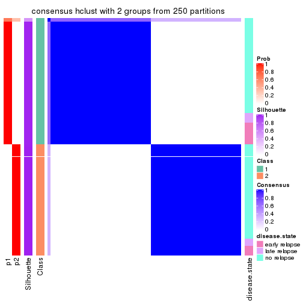</p>

</div>
<div id='tab-ATC-hclust-consensus-heatmap-2'>
<pre><code class="r">consensus_heatmap(res, k = 3)
</code></pre>

<p>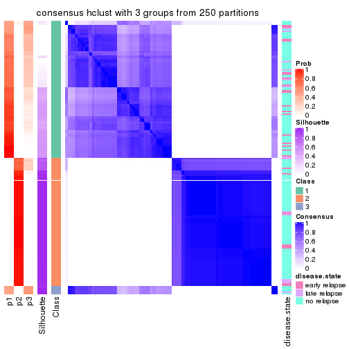</p>

</div>
<div id='tab-ATC-hclust-consensus-heatmap-3'>
<pre><code class="r">consensus_heatmap(res, k = 4)
</code></pre>

<p>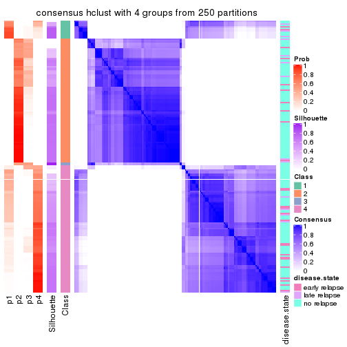</p>

</div>
<div id='tab-ATC-hclust-consensus-heatmap-4'>
<pre><code class="r">consensus_heatmap(res, k = 5)
</code></pre>

<p>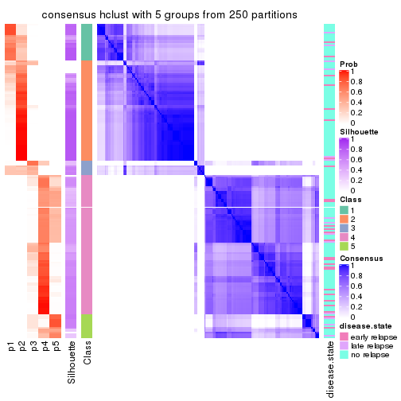</p>

</div>
<div id='tab-ATC-hclust-consensus-heatmap-5'>
<pre><code class="r">consensus_heatmap(res, k = 6)
</code></pre>

<p>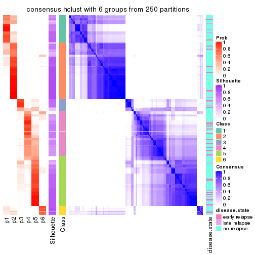</p>

</div>
</div>

Heatmaps for the membership of samples in all partitions to see how consistent they are:


<script>
$( function() {
	$( '#tabs-ATC-hclust-membership-heatmap' ).tabs();
} );
</script>
<div id='tabs-ATC-hclust-membership-heatmap'>
<ul>
<li><a href='#tab-ATC-hclust-membership-heatmap-1'>k = 2</a></li>
<li><a href='#tab-ATC-hclust-membership-heatmap-2'>k = 3</a></li>
<li><a href='#tab-ATC-hclust-membership-heatmap-3'>k = 4</a></li>
<li><a href='#tab-ATC-hclust-membership-heatmap-4'>k = 5</a></li>
<li><a href='#tab-ATC-hclust-membership-heatmap-5'>k = 6</a></li>
</ul>
<div id='tab-ATC-hclust-membership-heatmap-1'>
<pre><code class="r">membership_heatmap(res, k = 2)
</code></pre>

<p>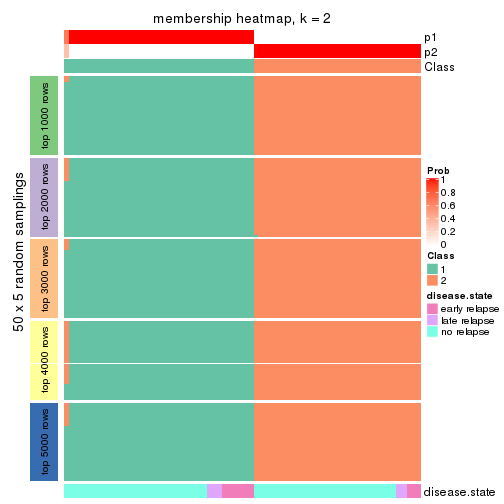</p>

</div>
<div id='tab-ATC-hclust-membership-heatmap-2'>
<pre><code class="r">membership_heatmap(res, k = 3)
</code></pre>

<p>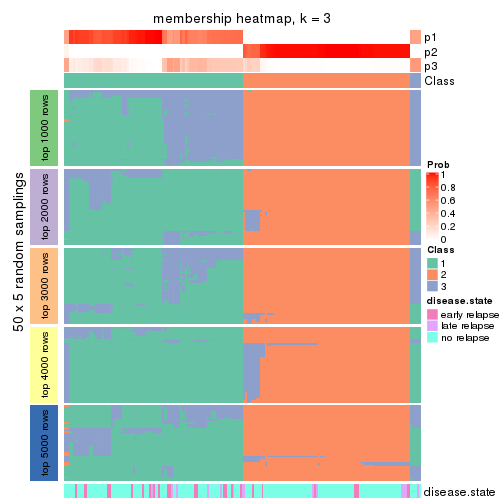</p>

</div>
<div id='tab-ATC-hclust-membership-heatmap-3'>
<pre><code class="r">membership_heatmap(res, k = 4)
</code></pre>

<p>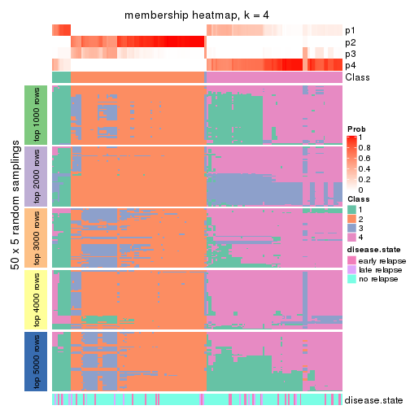</p>

</div>
<div id='tab-ATC-hclust-membership-heatmap-4'>
<pre><code class="r">membership_heatmap(res, k = 5)
</code></pre>

<p>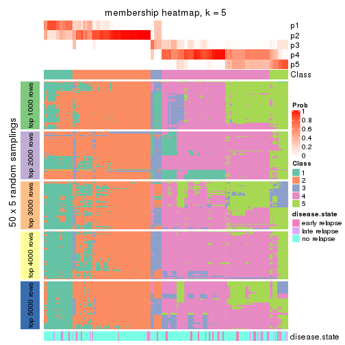</p>

</div>
<div id='tab-ATC-hclust-membership-heatmap-5'>
<pre><code class="r">membership_heatmap(res, k = 6)
</code></pre>

<p>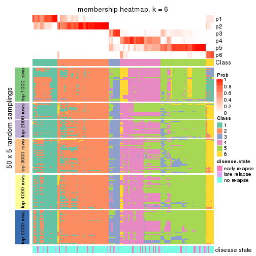</p>

</div>
</div>

As soon as we have had the classes for columns, we can look for signatures
which are significantly different between classes which can be candidate marks
for certain classes. Following are the heatmaps for signatures.


Signature heatmaps where rows are scaled:


<script>
$( function() {
	$( '#tabs-ATC-hclust-get-signatures' ).tabs();
} );
</script>
<div id='tabs-ATC-hclust-get-signatures'>
<ul>
<li><a href='#tab-ATC-hclust-get-signatures-1'>k = 2</a></li>
<li><a href='#tab-ATC-hclust-get-signatures-2'>k = 3</a></li>
<li><a href='#tab-ATC-hclust-get-signatures-3'>k = 4</a></li>
<li><a href='#tab-ATC-hclust-get-signatures-4'>k = 5</a></li>
<li><a href='#tab-ATC-hclust-get-signatures-5'>k = 6</a></li>
</ul>
<div id='tab-ATC-hclust-get-signatures-1'>
<pre><code class="r">get_signatures(res, k = 2)
</code></pre>

<p>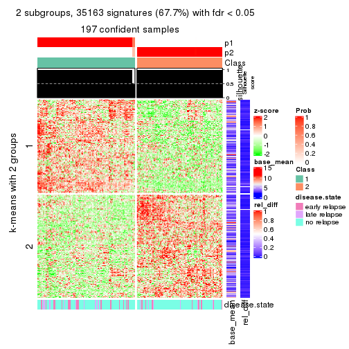</p>

</div>
<div id='tab-ATC-hclust-get-signatures-2'>
<pre><code class="r">get_signatures(res, k = 3)
</code></pre>

<p>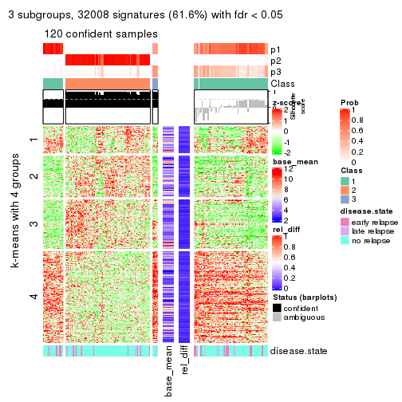</p>

</div>
<div id='tab-ATC-hclust-get-signatures-3'>
<pre><code class="r">get_signatures(res, k = 4)
</code></pre>

<p>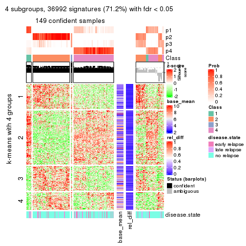</p>

</div>
<div id='tab-ATC-hclust-get-signatures-4'>
<pre><code class="r">get_signatures(res, k = 5)
</code></pre>

<p>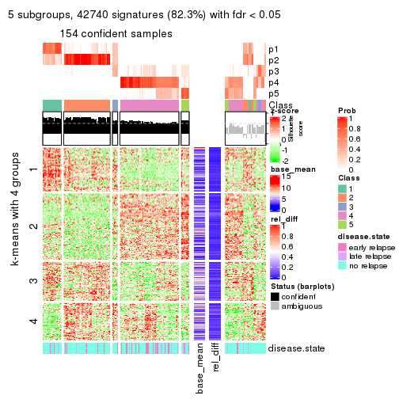</p>

</div>
<div id='tab-ATC-hclust-get-signatures-5'>
<pre><code class="r">get_signatures(res, k = 6)
</code></pre>

<p>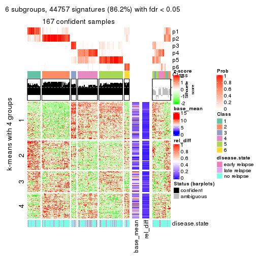</p>

</div>
</div>


Signature heatmaps where rows are not scaled:


<script>
$( function() {
	$( '#tabs-ATC-hclust-get-signatures-no-scale' ).tabs();
} );
</script>
<div id='tabs-ATC-hclust-get-signatures-no-scale'>
<ul>
<li><a href='#tab-ATC-hclust-get-signatures-no-scale-1'>k = 2</a></li>
<li><a href='#tab-ATC-hclust-get-signatures-no-scale-2'>k = 3</a></li>
<li><a href='#tab-ATC-hclust-get-signatures-no-scale-3'>k = 4</a></li>
<li><a href='#tab-ATC-hclust-get-signatures-no-scale-4'>k = 5</a></li>
<li><a href='#tab-ATC-hclust-get-signatures-no-scale-5'>k = 6</a></li>
</ul>
<div id='tab-ATC-hclust-get-signatures-no-scale-1'>
<pre><code class="r">get_signatures(res, k = 2, scale_rows = FALSE)
</code></pre>

<p>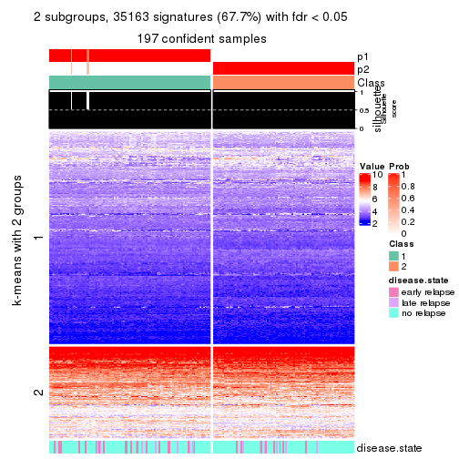</p>

</div>
<div id='tab-ATC-hclust-get-signatures-no-scale-2'>
<pre><code class="r">get_signatures(res, k = 3, scale_rows = FALSE)
</code></pre>

<p>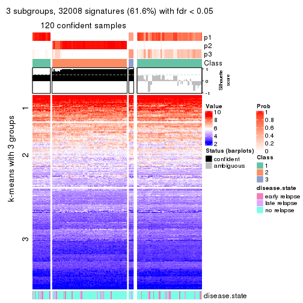</p>

</div>
<div id='tab-ATC-hclust-get-signatures-no-scale-3'>
<pre><code class="r">get_signatures(res, k = 4, scale_rows = FALSE)
</code></pre>

<p>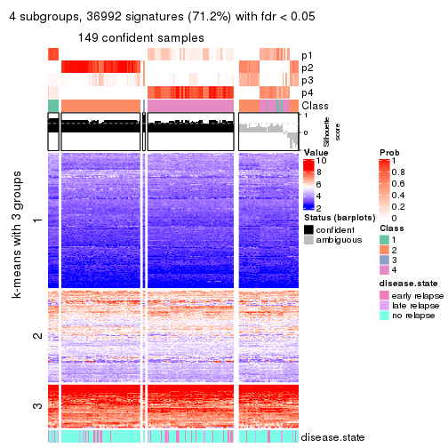</p>

</div>
<div id='tab-ATC-hclust-get-signatures-no-scale-4'>
<pre><code class="r">get_signatures(res, k = 5, scale_rows = FALSE)
</code></pre>

<p>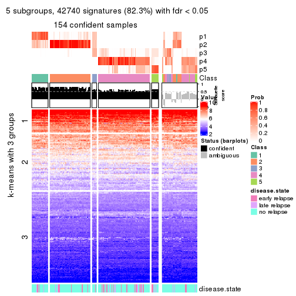</p>

</div>
<div id='tab-ATC-hclust-get-signatures-no-scale-5'>
<pre><code class="r">get_signatures(res, k = 6, scale_rows = FALSE)
</code></pre>

<p>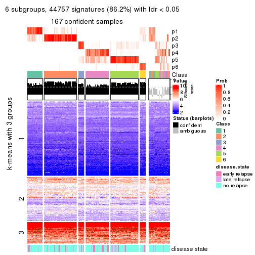</p>

</div>
</div>


Compare the overlap of signatures from different k:

```r
compare_signatures(res)
```

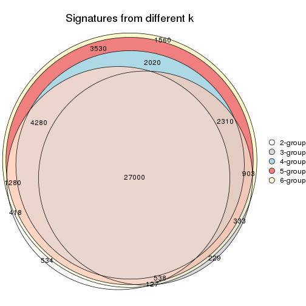

`get_signature()` returns a data frame invisibly. TO get the list of signatures, the function
call should be assigned to a variable explicitly. In following code, if `plot` argument is set
to `FALSE`, no heatmap is plotted while only the differential analysis is performed.

```r
# code only for demonstration
tb = get_signature(res, k = ..., plot = FALSE)
```

An example of the output of `tb` is:

```
#>   which_row         fdr    mean_1    mean_2 scaled_mean_1 scaled_mean_2 km
#> 1        38 0.042760348  8.373488  9.131774    -0.5533452     0.5164555  1
#> 2        40 0.018707592  7.106213  8.469186    -0.6173731     0.5762149  1
#> 3        55 0.019134737 10.221463 11.207825    -0.6159697     0.5749050  1
#> 4        59 0.006059896  5.921854  7.869574    -0.6899429     0.6439467  1
#> 5        60 0.018055526  8.928898 10.211722    -0.6204761     0.5791110  1
#> 6        98 0.009384629 15.714769 14.887706     0.6635654    -0.6193277  2
...
```

The columns in `tb` are:

1. `which_row`: row indices corresponding to the input matrix.
2. `fdr`: FDR for the differential test. 
3. `mean_x`: The mean value in group x.
4. `scaled_mean_x`: The mean value in group x after rows are scaled.
5. `km`: Row groups if k-means clustering is applied to rows.


UMAP plot which shows how samples are separated.


<script>
$( function() {
	$( '#tabs-ATC-hclust-dimension-reduction' ).tabs();
} );
</script>
<div id='tabs-ATC-hclust-dimension-reduction'>
<ul>
<li><a href='#tab-ATC-hclust-dimension-reduction-1'>k = 2</a></li>
<li><a href='#tab-ATC-hclust-dimension-reduction-2'>k = 3</a></li>
<li><a href='#tab-ATC-hclust-dimension-reduction-3'>k = 4</a></li>
<li><a href='#tab-ATC-hclust-dimension-reduction-4'>k = 5</a></li>
<li><a href='#tab-ATC-hclust-dimension-reduction-5'>k = 6</a></li>
</ul>
<div id='tab-ATC-hclust-dimension-reduction-1'>
<pre><code class="r">dimension_reduction(res, k = 2, method = &quot;UMAP&quot;)
</code></pre>

<p>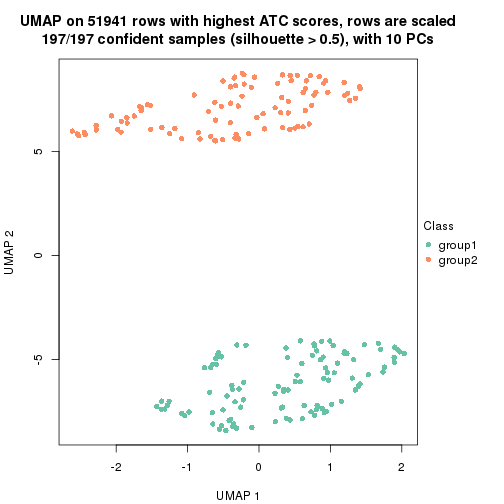</p>

</div>
<div id='tab-ATC-hclust-dimension-reduction-2'>
<pre><code class="r">dimension_reduction(res, k = 3, method = &quot;UMAP&quot;)
</code></pre>

<p>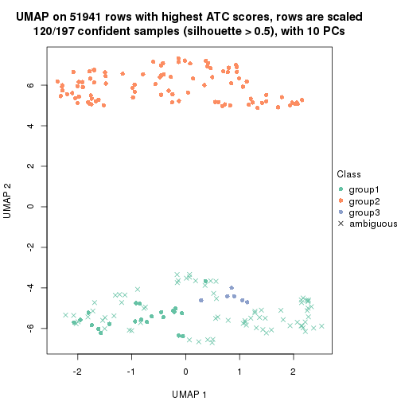</p>

</div>
<div id='tab-ATC-hclust-dimension-reduction-3'>
<pre><code class="r">dimension_reduction(res, k = 4, method = &quot;UMAP&quot;)
</code></pre>

<p>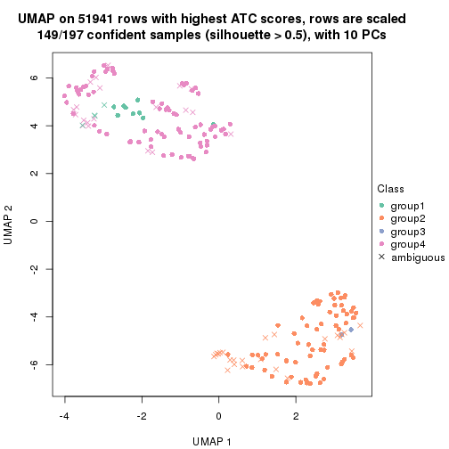</p>

</div>
<div id='tab-ATC-hclust-dimension-reduction-4'>
<pre><code class="r">dimension_reduction(res, k = 5, method = &quot;UMAP&quot;)
</code></pre>

<p>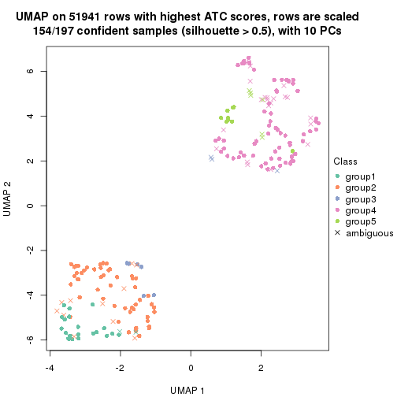</p>

</div>
<div id='tab-ATC-hclust-dimension-reduction-5'>
<pre><code class="r">dimension_reduction(res, k = 6, method = &quot;UMAP&quot;)
</code></pre>

<p>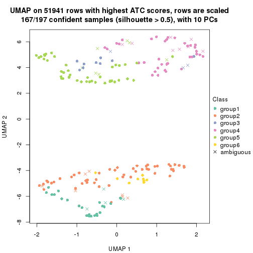</p>

</div>
</div>


Following heatmap shows how subgroups are split when increasing `k`:

```r
collect_classes(res)
```

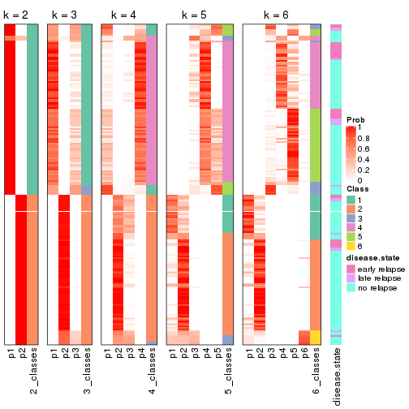


Test correlation between subgroups and known annotations. If the known
annotation is numeric, one-way ANOVA test is applied, and if the known
annotation is discrete, chi-squared contingency table test is applied.

```r
test_to_known_factors(res)
```

```
#>              n disease.state(p) k
#> ATC:hclust 197            0.193 2
#> ATC:hclust 120            0.106 3
#> ATC:hclust 149            0.283 4
#> ATC:hclust 154            0.337 5
#> ATC:hclust 167            0.383 6
```


If matrix rows can be associated to genes, consider to use `functional_enrichment(res,
...)` to perform function enrichment for the signature genes. See [this vignette](http://bioconductor.org/packages/devel/bioc/vignettes/cola/inst/doc/functional_enrichment.html) for more detailed explanations.


 

---------------------------------------------------


### ATC:kmeans**


The object with results only for a single top-value method and a single partition method 
can be extracted as:

```r
res = res_list["ATC", "kmeans"]
# you can also extract it by
# res = res_list["ATC:kmeans"]
```

A summary of `res` and all the functions that can be applied to it:

```r
res
```

```
#> A 'ConsensusPartition' object with k = 2, 3, 4, 5, 6.
#>   On a matrix with 51941 rows and 197 columns.
#>   Top rows (1000, 2000, 3000, 4000, 5000) are extracted by 'ATC' method.
#>   Subgroups are detected by 'kmeans' method.
#>   Performed in total 1250 partitions by row resampling.
#>   Best k for subgroups seems to be 2.
#> 
#> Following methods can be applied to this 'ConsensusPartition' object:
#>  [1] "cola_report"             "collect_classes"         "collect_plots"          
#>  [4] "collect_stats"           "colnames"                "compare_signatures"     
#>  [7] "consensus_heatmap"       "dimension_reduction"     "functional_enrichment"  
#> [10] "get_anno_col"            "get_anno"                "get_classes"            
#> [13] "get_consensus"           "get_matrix"              "get_membership"         
#> [16] "get_param"               "get_signatures"          "get_stats"              
#> [19] "is_best_k"               "is_stable_k"             "membership_heatmap"     
#> [22] "ncol"                    "nrow"                    "plot_ecdf"              
#> [25] "rownames"                "select_partition_number" "show"                   
#> [28] "suggest_best_k"          "test_to_known_factors"
```

`collect_plots()` function collects all the plots made from `res` for all `k` (number of partitions)
into one single page to provide an easy and fast comparison between different `k`.

```r
collect_plots(res)
```

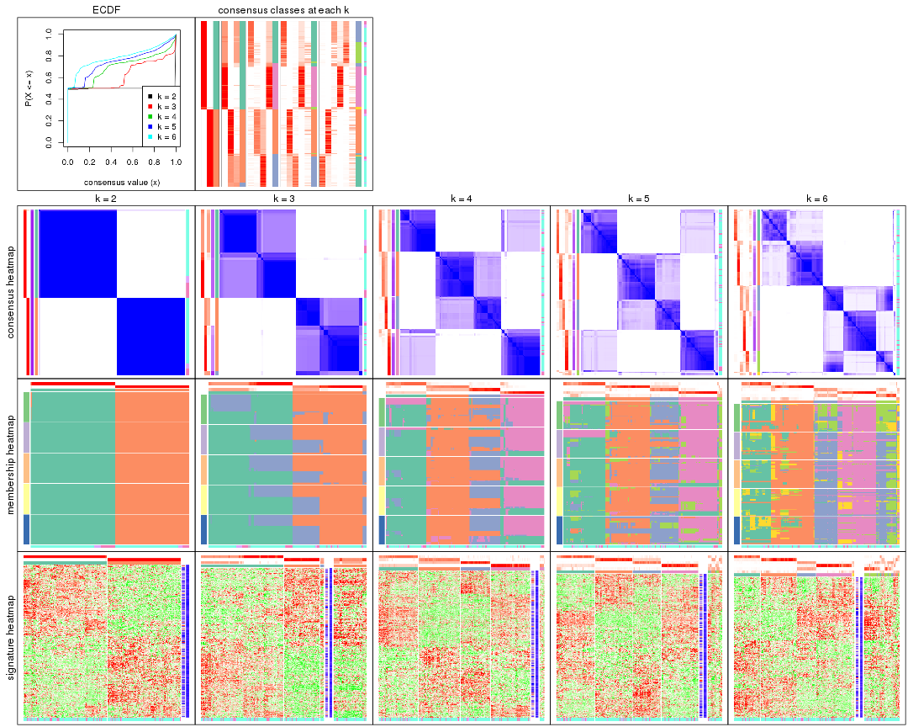

The plots are:

- The first row: a plot of the ECDF (empirical cumulative distribution
  function) curves of the consensus matrix for each `k` and the heatmap of
  predicted classes for each `k`.
- The second row: heatmaps of the consensus matrix for each `k`.
- The third row: heatmaps of the membership matrix for each `k`.
- The fouth row: heatmaps of the signatures for each `k`.

All the plots in panels can be made by individual functions and they are
plotted later in this section.

`select_partition_number()` produces several plots showing different
statistics for choosing "optimized" `k`. There are following statistics:

- ECDF curves of the consensus matrix for each `k`;
- 1-PAC. [The PAC
  score](https://en.wikipedia.org/wiki/Consensus_clustering#Over-interpretation_potential_of_consensus_clustering)
  measures the proportion of the ambiguous subgrouping.
- Mean silhouette score.
- Concordance. The mean probability of fiting the consensus class ids in all
  partitions.
- Area increased. Denote $A_k$ as the area under the ECDF curve for current
  `k`, the area increased is defined as $A_k - A_{k-1}$.
- Rand index. The percent of pairs of samples that are both in a same cluster
  or both are not in a same cluster in the partition of k and k-1.
- Jaccard index. The ratio of pairs of samples are both in a same cluster in
  the partition of k and k-1 and the pairs of samples are both in a same
  cluster in the partition k or k-1.

The detailed explanations of these statistics can be found in [the _cola_
vignette](http://bioconductor.org/packages/devel/bioc/vignettes/cola/inst/doc/cola.html#toc_13).

Generally speaking, lower PAC score, higher mean silhouette score or higher
concordance corresponds to better partition. Rand index and Jaccard index
measure how similar the current partition is compared to partition with `k-1`.
If they are too similar, we won't accept `k` is better than `k-1`.

```r
select_partition_number(res)
```

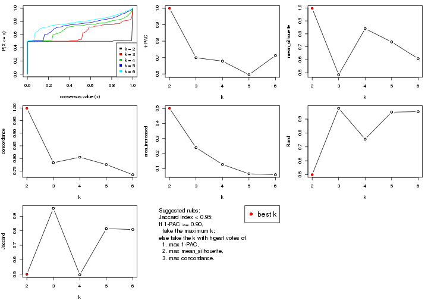

The numeric values for all these statistics can be obtained by `get_stats()`.

```r
get_stats(res)
```

```
#>   k 1-PAC mean_silhouette concordance area_increased  Rand Jaccard
#> 2 2 1.000           0.997       0.999         0.5010 0.500   0.500
#> 3 3 0.699           0.485       0.783         0.2392 0.977   0.955
#> 4 4 0.678           0.840       0.805         0.1275 0.755   0.497
#> 5 5 0.595           0.738       0.776         0.0655 0.950   0.814
#> 6 6 0.712           0.609       0.735         0.0594 0.953   0.809
```

`suggest_best_k()` suggests the best $k$ based on these statistics. The rules are as follows:

- All $k$ with Jaccard index larger than 0.95 are removed because increasing
  $k$ does not provide enough extra information. If all $k$ are removed, it is
  marked as no subgroup is detected.
- For all $k$ with 1-PAC score larger than 0.9, the maximal $k$ is taken as
  the best $k$, and other $k$ are marked as optional $k$.
- If it does not fit the second rule. The $k$ with the maximal vote of the
  highest 1-PAC score, highest mean silhouette, and highest concordance is
  taken as the best $k$.

```r
suggest_best_k(res)
```

```
#> [1] 2
```


Following shows the table of the partitions (You need to click the **show/hide
code output** link to see it). The membership matrix (columns with name `p*`)
is inferred by
[`clue::cl_consensus()`](https://www.rdocumentation.org/link/cl_consensus?package=clue)
function with the `SE` method. Basically the value in the membership matrix
represents the probability to belong to a certain group. The finall class
label for an item is determined with the group with highest probability it
belongs to.

In `get_classes()` function, the entropy is calculated from the membership
matrix and the silhouette score is calculated from the consensus matrix.


<script>
$( function() {
	$( '#tabs-ATC-kmeans-get-classes' ).tabs();
} );
</script>
<div id='tabs-ATC-kmeans-get-classes'>
<ul>
<li><a href='#tab-ATC-kmeans-get-classes-1'>k = 2</a></li>
<li><a href='#tab-ATC-kmeans-get-classes-2'>k = 3</a></li>
<li><a href='#tab-ATC-kmeans-get-classes-3'>k = 4</a></li>
<li><a href='#tab-ATC-kmeans-get-classes-4'>k = 5</a></li>
<li><a href='#tab-ATC-kmeans-get-classes-5'>k = 6</a></li>
</ul>

<div id='tab-ATC-kmeans-get-classes-1'>
<p><a id='tab-ATC-kmeans-get-classes-1-a' style='color:#0366d6' href='#'>show/hide code output</a></p>
<pre><code class="r">cbind(get_classes(res, k = 2), get_membership(res, k = 2))
</code></pre>

<pre><code>#&gt;           class entropy silhouette    p1    p2
#&gt; GSM342319     1   0.000      0.997 1.000 0.000
#&gt; GSM342323     1   0.000      0.997 1.000 0.000
#&gt; GSM342325     1   0.000      0.997 1.000 0.000
#&gt; GSM342326     1   0.000      0.997 1.000 0.000
#&gt; GSM342327     1   0.000      0.997 1.000 0.000
#&gt; GSM342329     1   0.000      0.997 1.000 0.000
#&gt; GSM342331     1   0.000      0.997 1.000 0.000
#&gt; GSM342334     1   0.000      0.997 1.000 0.000
#&gt; GSM342335     1   0.000      0.997 1.000 0.000
#&gt; GSM342354     1   0.000      0.997 1.000 0.000
#&gt; GSM342371     1   0.000      0.997 1.000 0.000
#&gt; GSM342380     1   0.000      0.997 1.000 0.000
#&gt; GSM342382     1   0.000      0.997 1.000 0.000
#&gt; GSM342399     1   0.000      0.997 1.000 0.000
#&gt; GSM342402     1   0.000      0.997 1.000 0.000
#&gt; GSM342404     1   0.000      0.997 1.000 0.000
#&gt; GSM342408     1   0.000      0.997 1.000 0.000
#&gt; GSM342409     1   0.000      0.997 1.000 0.000
#&gt; GSM342426     2   0.000      1.000 0.000 1.000
#&gt; GSM342441     2   0.000      1.000 0.000 1.000
#&gt; GSM342444     2   0.000      1.000 0.000 1.000
#&gt; GSM342451     2   0.000      1.000 0.000 1.000
#&gt; GSM342462     2   0.000      1.000 0.000 1.000
#&gt; GSM342467     2   0.000      1.000 0.000 1.000
#&gt; GSM342484     2   0.000      1.000 0.000 1.000
#&gt; GSM342491     2   0.000      1.000 0.000 1.000
#&gt; GSM342322     1   0.000      0.997 1.000 0.000
#&gt; GSM342338     1   0.000      0.997 1.000 0.000
#&gt; GSM342347     1   0.000      0.997 1.000 0.000
#&gt; GSM342356     1   0.000      0.997 1.000 0.000
#&gt; GSM342357     1   0.000      0.997 1.000 0.000
#&gt; GSM342366     1   0.000      0.997 1.000 0.000
#&gt; GSM342385     1   0.000      0.997 1.000 0.000
#&gt; GSM342421     1   0.000      0.997 1.000 0.000
#&gt; GSM342437     2   0.000      1.000 0.000 1.000
#&gt; GSM342454     2   0.000      1.000 0.000 1.000
#&gt; GSM342471     2   0.000      1.000 0.000 1.000
#&gt; GSM342477     2   0.000      1.000 0.000 1.000
#&gt; GSM342495     2   0.000      1.000 0.000 1.000
#&gt; GSM342496     2   0.000      1.000 0.000 1.000
#&gt; GSM342320     1   0.000      0.997 1.000 0.000
#&gt; GSM342321     1   0.000      0.997 1.000 0.000
#&gt; GSM342324     1   0.000      0.997 1.000 0.000
#&gt; GSM342328     1   0.000      0.997 1.000 0.000
#&gt; GSM342330     1   0.000      0.997 1.000 0.000
#&gt; GSM342332     1   0.000      0.997 1.000 0.000
#&gt; GSM342333     1   0.000      0.997 1.000 0.000
#&gt; GSM342336     1   0.000      0.997 1.000 0.000
#&gt; GSM342337     1   0.000      0.997 1.000 0.000
#&gt; GSM342339     1   0.000      0.997 1.000 0.000
#&gt; GSM342340     1   0.000      0.997 1.000 0.000
#&gt; GSM342341     1   0.000      0.997 1.000 0.000
#&gt; GSM342342     1   0.000      0.997 1.000 0.000
#&gt; GSM342343     1   0.000      0.997 1.000 0.000
#&gt; GSM342344     1   0.000      0.997 1.000 0.000
#&gt; GSM342345     1   0.000      0.997 1.000 0.000
#&gt; GSM342346     1   0.000      0.997 1.000 0.000
#&gt; GSM342348     1   0.000      0.997 1.000 0.000
#&gt; GSM342349     1   0.000      0.997 1.000 0.000
#&gt; GSM342350     1   0.000      0.997 1.000 0.000
#&gt; GSM342351     1   0.469      0.889 0.900 0.100
#&gt; GSM342352     1   0.689      0.776 0.816 0.184
#&gt; GSM342353     1   0.000      0.997 1.000 0.000
#&gt; GSM342355     1   0.000      0.997 1.000 0.000
#&gt; GSM342358     1   0.000      0.997 1.000 0.000
#&gt; GSM342359     1   0.000      0.997 1.000 0.000
#&gt; GSM342360     1   0.000      0.997 1.000 0.000
#&gt; GSM342361     1   0.000      0.997 1.000 0.000
#&gt; GSM342362     1   0.000      0.997 1.000 0.000
#&gt; GSM342363     1   0.000      0.997 1.000 0.000
#&gt; GSM342364     1   0.000      0.997 1.000 0.000
#&gt; GSM342365     1   0.000      0.997 1.000 0.000
#&gt; GSM342367     1   0.000      0.997 1.000 0.000
#&gt; GSM342368     1   0.000      0.997 1.000 0.000
#&gt; GSM342369     1   0.000      0.997 1.000 0.000
#&gt; GSM342370     1   0.000      0.997 1.000 0.000
#&gt; GSM342372     1   0.000      0.997 1.000 0.000
#&gt; GSM342373     1   0.000      0.997 1.000 0.000
#&gt; GSM342374     1   0.000      0.997 1.000 0.000
#&gt; GSM342375     1   0.000      0.997 1.000 0.000
#&gt; GSM342376     1   0.000      0.997 1.000 0.000
#&gt; GSM342377     1   0.000      0.997 1.000 0.000
#&gt; GSM342378     1   0.000      0.997 1.000 0.000
#&gt; GSM342379     1   0.000      0.997 1.000 0.000
#&gt; GSM342381     1   0.000      0.997 1.000 0.000
#&gt; GSM342383     1   0.000      0.997 1.000 0.000
#&gt; GSM342384     1   0.000      0.997 1.000 0.000
#&gt; GSM342386     1   0.000      0.997 1.000 0.000
#&gt; GSM342387     1   0.000      0.997 1.000 0.000
#&gt; GSM342388     1   0.000      0.997 1.000 0.000
#&gt; GSM342389     1   0.000      0.997 1.000 0.000
#&gt; GSM342390     1   0.000      0.997 1.000 0.000
#&gt; GSM342391     1   0.000      0.997 1.000 0.000
#&gt; GSM342392     1   0.000      0.997 1.000 0.000
#&gt; GSM342393     1   0.000      0.997 1.000 0.000
#&gt; GSM342394     1   0.000      0.997 1.000 0.000
#&gt; GSM342395     1   0.000      0.997 1.000 0.000
#&gt; GSM342396     1   0.000      0.997 1.000 0.000
#&gt; GSM342397     1   0.000      0.997 1.000 0.000
#&gt; GSM342398     1   0.000      0.997 1.000 0.000
#&gt; GSM342400     1   0.000      0.997 1.000 0.000
#&gt; GSM342401     1   0.000      0.997 1.000 0.000
#&gt; GSM342403     1   0.000      0.997 1.000 0.000
#&gt; GSM342405     1   0.000      0.997 1.000 0.000
#&gt; GSM342406     1   0.000      0.997 1.000 0.000
#&gt; GSM342407     1   0.000      0.997 1.000 0.000
#&gt; GSM342410     1   0.000      0.997 1.000 0.000
#&gt; GSM342411     1   0.000      0.997 1.000 0.000
#&gt; GSM342412     1   0.000      0.997 1.000 0.000
#&gt; GSM342413     1   0.000      0.997 1.000 0.000
#&gt; GSM342414     1   0.000      0.997 1.000 0.000
#&gt; GSM342415     1   0.000      0.997 1.000 0.000
#&gt; GSM342416     1   0.000      0.997 1.000 0.000
#&gt; GSM342417     1   0.000      0.997 1.000 0.000
#&gt; GSM342418     1   0.000      0.997 1.000 0.000
#&gt; GSM342419     1   0.000      0.997 1.000 0.000
#&gt; GSM342420     1   0.000      0.997 1.000 0.000
#&gt; GSM342422     1   0.000      0.997 1.000 0.000
#&gt; GSM342423     1   0.000      0.997 1.000 0.000
#&gt; GSM342424     2   0.000      1.000 0.000 1.000
#&gt; GSM342425     2   0.000      1.000 0.000 1.000
#&gt; GSM342427     2   0.000      1.000 0.000 1.000
#&gt; GSM342428     2   0.000      1.000 0.000 1.000
#&gt; GSM342429     2   0.000      1.000 0.000 1.000
#&gt; GSM342430     2   0.000      1.000 0.000 1.000
#&gt; GSM342431     2   0.000      1.000 0.000 1.000
#&gt; GSM342432     2   0.000      1.000 0.000 1.000
#&gt; GSM342433     2   0.000      1.000 0.000 1.000
#&gt; GSM342434     2   0.000      1.000 0.000 1.000
#&gt; GSM342435     2   0.000      1.000 0.000 1.000
#&gt; GSM342436     2   0.000      1.000 0.000 1.000
#&gt; GSM342438     2   0.000      1.000 0.000 1.000
#&gt; GSM342439     2   0.000      1.000 0.000 1.000
#&gt; GSM342440     2   0.000      1.000 0.000 1.000
#&gt; GSM342442     2   0.000      1.000 0.000 1.000
#&gt; GSM342443     2   0.000      1.000 0.000 1.000
#&gt; GSM342445     2   0.000      1.000 0.000 1.000
#&gt; GSM342446     2   0.000      1.000 0.000 1.000
#&gt; GSM342447     2   0.000      1.000 0.000 1.000
#&gt; GSM342448     2   0.000      1.000 0.000 1.000
#&gt; GSM342449     2   0.000      1.000 0.000 1.000
#&gt; GSM342450     2   0.000      1.000 0.000 1.000
#&gt; GSM342452     2   0.000      1.000 0.000 1.000
#&gt; GSM342453     2   0.000      1.000 0.000 1.000
#&gt; GSM342455     2   0.000      1.000 0.000 1.000
#&gt; GSM342456     2   0.000      1.000 0.000 1.000
#&gt; GSM342457     2   0.000      1.000 0.000 1.000
#&gt; GSM342458     2   0.000      1.000 0.000 1.000
#&gt; GSM342459     2   0.000      1.000 0.000 1.000
#&gt; GSM342460     2   0.000      1.000 0.000 1.000
#&gt; GSM342461     2   0.000      1.000 0.000 1.000
#&gt; GSM342463     2   0.000      1.000 0.000 1.000
#&gt; GSM342464     2   0.000      1.000 0.000 1.000
#&gt; GSM342465     2   0.000      1.000 0.000 1.000
#&gt; GSM342466     2   0.000      1.000 0.000 1.000
#&gt; GSM342468     2   0.000      1.000 0.000 1.000
#&gt; GSM342469     2   0.000      1.000 0.000 1.000
#&gt; GSM342470     2   0.000      1.000 0.000 1.000
#&gt; GSM342472     2   0.000      1.000 0.000 1.000
#&gt; GSM342473     2   0.000      1.000 0.000 1.000
#&gt; GSM342474     2   0.000      1.000 0.000 1.000
#&gt; GSM342475     2   0.000      1.000 0.000 1.000
#&gt; GSM342476     2   0.000      1.000 0.000 1.000
#&gt; GSM342478     2   0.000      1.000 0.000 1.000
#&gt; GSM342479     2   0.000      1.000 0.000 1.000
#&gt; GSM342480     2   0.000      1.000 0.000 1.000
#&gt; GSM342481     2   0.000      1.000 0.000 1.000
#&gt; GSM342482     2   0.000      1.000 0.000 1.000
#&gt; GSM342483     2   0.000      1.000 0.000 1.000
#&gt; GSM342485     2   0.000      1.000 0.000 1.000
#&gt; GSM342486     2   0.000      1.000 0.000 1.000
#&gt; GSM342487     2   0.000      1.000 0.000 1.000
#&gt; GSM342488     2   0.000      1.000 0.000 1.000
#&gt; GSM342489     2   0.000      1.000 0.000 1.000
#&gt; GSM342490     2   0.000      1.000 0.000 1.000
#&gt; GSM342492     2   0.000      1.000 0.000 1.000
#&gt; GSM342493     2   0.000      1.000 0.000 1.000
#&gt; GSM342494     2   0.000      1.000 0.000 1.000
#&gt; GSM342497     2   0.000      1.000 0.000 1.000
#&gt; GSM342498     2   0.000      1.000 0.000 1.000
#&gt; GSM342499     2   0.000      1.000 0.000 1.000
#&gt; GSM342500     2   0.000      1.000 0.000 1.000
#&gt; GSM342501     2   0.000      1.000 0.000 1.000
#&gt; GSM342502     2   0.000      1.000 0.000 1.000
#&gt; GSM342503     2   0.000      1.000 0.000 1.000
#&gt; GSM342504     2   0.000      1.000 0.000 1.000
#&gt; GSM342505     2   0.000      1.000 0.000 1.000
#&gt; GSM342506     2   0.000      1.000 0.000 1.000
#&gt; GSM342507     2   0.000      1.000 0.000 1.000
#&gt; GSM342508     2   0.000      1.000 0.000 1.000
#&gt; GSM342509     2   0.000      1.000 0.000 1.000
#&gt; GSM342510     2   0.000      1.000 0.000 1.000
#&gt; GSM342511     2   0.000      1.000 0.000 1.000
#&gt; GSM342512     2   0.000      1.000 0.000 1.000
#&gt; GSM342513     2   0.000      1.000 0.000 1.000
#&gt; GSM342514     2   0.000      1.000 0.000 1.000
#&gt; GSM342515     2   0.000      1.000 0.000 1.000
</code></pre>

<script>
$('#tab-ATC-kmeans-get-classes-1-a').parent().next().next().hide();
$('#tab-ATC-kmeans-get-classes-1-a').click(function(){
  $('#tab-ATC-kmeans-get-classes-1-a').parent().next().next().toggle();
  return(false);
});
</script>
</div>

<div id='tab-ATC-kmeans-get-classes-2'>
<p><a id='tab-ATC-kmeans-get-classes-2-a' style='color:#0366d6' href='#'>show/hide code output</a></p>
<pre><code class="r">cbind(get_classes(res, k = 3), get_membership(res, k = 3))
</code></pre>

<pre><code>#&gt;           class entropy silhouette    p1    p2    p3
#&gt; GSM342319     1  0.6299      0.774 0.524 0.000 0.476
#&gt; GSM342323     1  0.4504      0.778 0.804 0.000 0.196
#&gt; GSM342325     1  0.6299      0.774 0.524 0.000 0.476
#&gt; GSM342326     1  0.0000      0.776 1.000 0.000 0.000
#&gt; GSM342327     1  0.0000      0.776 1.000 0.000 0.000
#&gt; GSM342329     1  0.6299      0.774 0.524 0.000 0.476
#&gt; GSM342331     1  0.0000      0.776 1.000 0.000 0.000
#&gt; GSM342334     1  0.0000      0.776 1.000 0.000 0.000
#&gt; GSM342335     1  0.6299      0.774 0.524 0.000 0.476
#&gt; GSM342354     1  0.0000      0.776 1.000 0.000 0.000
#&gt; GSM342371     1  0.0000      0.776 1.000 0.000 0.000
#&gt; GSM342380     1  0.6299      0.774 0.524 0.000 0.476
#&gt; GSM342382     1  0.6299      0.774 0.524 0.000 0.476
#&gt; GSM342399     1  0.6299      0.774 0.524 0.000 0.476
#&gt; GSM342402     1  0.6299      0.774 0.524 0.000 0.476
#&gt; GSM342404     1  0.0000      0.776 1.000 0.000 0.000
#&gt; GSM342408     1  0.0000      0.776 1.000 0.000 0.000
#&gt; GSM342409     1  0.0000      0.776 1.000 0.000 0.000
#&gt; GSM342426     2  0.0424      0.600 0.000 0.992 0.008
#&gt; GSM342441     2  0.0000      0.605 0.000 1.000 0.000
#&gt; GSM342444     2  0.6192     -0.635 0.000 0.580 0.420
#&gt; GSM342451     2  0.6192     -0.635 0.000 0.580 0.420
#&gt; GSM342462     2  0.6192     -0.635 0.000 0.580 0.420
#&gt; GSM342467     2  0.3038      0.488 0.000 0.896 0.104
#&gt; GSM342484     2  0.0424      0.599 0.000 0.992 0.008
#&gt; GSM342491     2  0.0000      0.605 0.000 1.000 0.000
#&gt; GSM342322     1  0.6299      0.774 0.524 0.000 0.476
#&gt; GSM342338     1  0.6299      0.774 0.524 0.000 0.476
#&gt; GSM342347     1  0.6299      0.774 0.524 0.000 0.476
#&gt; GSM342356     1  0.6299      0.774 0.524 0.000 0.476
#&gt; GSM342357     1  0.6299      0.774 0.524 0.000 0.476
#&gt; GSM342366     1  0.6299      0.774 0.524 0.000 0.476
#&gt; GSM342385     1  0.6299      0.774 0.524 0.000 0.476
#&gt; GSM342421     1  0.0000      0.776 1.000 0.000 0.000
#&gt; GSM342437     2  0.0237      0.603 0.000 0.996 0.004
#&gt; GSM342454     2  0.6192     -0.635 0.000 0.580 0.420
#&gt; GSM342471     3  0.6299      0.980 0.000 0.476 0.524
#&gt; GSM342477     2  0.0747      0.595 0.000 0.984 0.016
#&gt; GSM342495     2  0.0424      0.600 0.000 0.992 0.008
#&gt; GSM342496     2  0.6192     -0.635 0.000 0.580 0.420
#&gt; GSM342320     1  0.0000      0.776 1.000 0.000 0.000
#&gt; GSM342321     1  0.6299      0.774 0.524 0.000 0.476
#&gt; GSM342324     1  0.0000      0.776 1.000 0.000 0.000
#&gt; GSM342328     1  0.0000      0.776 1.000 0.000 0.000
#&gt; GSM342330     1  0.0000      0.776 1.000 0.000 0.000
#&gt; GSM342332     1  0.0000      0.776 1.000 0.000 0.000
#&gt; GSM342333     1  0.0000      0.776 1.000 0.000 0.000
#&gt; GSM342336     1  0.0000      0.776 1.000 0.000 0.000
#&gt; GSM342337     1  0.6299      0.774 0.524 0.000 0.476
#&gt; GSM342339     1  0.4235      0.781 0.824 0.000 0.176
#&gt; GSM342340     1  0.6299      0.774 0.524 0.000 0.476
#&gt; GSM342341     1  0.4235      0.781 0.824 0.000 0.176
#&gt; GSM342342     1  0.6299      0.774 0.524 0.000 0.476
#&gt; GSM342343     1  0.6299      0.774 0.524 0.000 0.476
#&gt; GSM342344     1  0.0000      0.776 1.000 0.000 0.000
#&gt; GSM342345     1  0.4235      0.781 0.824 0.000 0.176
#&gt; GSM342346     1  0.0000      0.776 1.000 0.000 0.000
#&gt; GSM342348     1  0.0000      0.776 1.000 0.000 0.000
#&gt; GSM342349     1  0.0000      0.776 1.000 0.000 0.000
#&gt; GSM342350     1  0.5591      0.776 0.696 0.000 0.304
#&gt; GSM342351     1  0.3910      0.680 0.876 0.020 0.104
#&gt; GSM342352     1  0.3846      0.680 0.876 0.016 0.108
#&gt; GSM342353     1  0.0000      0.776 1.000 0.000 0.000
#&gt; GSM342355     1  0.6299      0.774 0.524 0.000 0.476
#&gt; GSM342358     1  0.0000      0.776 1.000 0.000 0.000
#&gt; GSM342359     1  0.0000      0.776 1.000 0.000 0.000
#&gt; GSM342360     1  0.0000      0.776 1.000 0.000 0.000
#&gt; GSM342361     1  0.0000      0.776 1.000 0.000 0.000
#&gt; GSM342362     1  0.0892      0.778 0.980 0.000 0.020
#&gt; GSM342363     1  0.6299      0.774 0.524 0.000 0.476
#&gt; GSM342364     1  0.6299      0.774 0.524 0.000 0.476
#&gt; GSM342365     1  0.0000      0.776 1.000 0.000 0.000
#&gt; GSM342367     1  0.6299      0.774 0.524 0.000 0.476
#&gt; GSM342368     1  0.6299      0.774 0.524 0.000 0.476
#&gt; GSM342369     1  0.0592      0.777 0.988 0.000 0.012
#&gt; GSM342370     1  0.0000      0.776 1.000 0.000 0.000
#&gt; GSM342372     1  0.0000      0.776 1.000 0.000 0.000
#&gt; GSM342373     1  0.0000      0.776 1.000 0.000 0.000
#&gt; GSM342374     1  0.0000      0.776 1.000 0.000 0.000
#&gt; GSM342375     1  0.0000      0.776 1.000 0.000 0.000
#&gt; GSM342376     1  0.6299      0.774 0.524 0.000 0.476
#&gt; GSM342377     1  0.6299      0.774 0.524 0.000 0.476
#&gt; GSM342378     1  0.6299      0.774 0.524 0.000 0.476
#&gt; GSM342379     1  0.6299      0.774 0.524 0.000 0.476
#&gt; GSM342381     1  0.6299      0.774 0.524 0.000 0.476
#&gt; GSM342383     1  0.6299      0.774 0.524 0.000 0.476
#&gt; GSM342384     1  0.6299      0.774 0.524 0.000 0.476
#&gt; GSM342386     1  0.6299      0.774 0.524 0.000 0.476
#&gt; GSM342387     1  0.0000      0.776 1.000 0.000 0.000
#&gt; GSM342388     1  0.6299      0.774 0.524 0.000 0.476
#&gt; GSM342389     1  0.6299      0.774 0.524 0.000 0.476
#&gt; GSM342390     1  0.6299      0.774 0.524 0.000 0.476
#&gt; GSM342391     1  0.5968      0.779 0.636 0.000 0.364
#&gt; GSM342392     1  0.5968      0.779 0.636 0.000 0.364
#&gt; GSM342393     1  0.0000      0.776 1.000 0.000 0.000
#&gt; GSM342394     1  0.6267      0.775 0.548 0.000 0.452
#&gt; GSM342395     1  0.4235      0.781 0.824 0.000 0.176
#&gt; GSM342396     1  0.6267      0.775 0.548 0.000 0.452
#&gt; GSM342397     1  0.3192      0.777 0.888 0.000 0.112
#&gt; GSM342398     1  0.6299      0.774 0.524 0.000 0.476
#&gt; GSM342400     1  0.6299      0.774 0.524 0.000 0.476
#&gt; GSM342401     1  0.6299      0.774 0.524 0.000 0.476
#&gt; GSM342403     1  0.6299      0.774 0.524 0.000 0.476
#&gt; GSM342405     1  0.0000      0.776 1.000 0.000 0.000
#&gt; GSM342406     1  0.6299      0.774 0.524 0.000 0.476
#&gt; GSM342407     1  0.0000      0.776 1.000 0.000 0.000
#&gt; GSM342410     1  0.6299      0.774 0.524 0.000 0.476
#&gt; GSM342411     1  0.0000      0.776 1.000 0.000 0.000
#&gt; GSM342412     1  0.6180      0.776 0.584 0.000 0.416
#&gt; GSM342413     1  0.0000      0.776 1.000 0.000 0.000
#&gt; GSM342414     1  0.0000      0.776 1.000 0.000 0.000
#&gt; GSM342415     1  0.6299      0.774 0.524 0.000 0.476
#&gt; GSM342416     1  0.0000      0.776 1.000 0.000 0.000
#&gt; GSM342417     1  0.0000      0.776 1.000 0.000 0.000
#&gt; GSM342418     1  0.0000      0.776 1.000 0.000 0.000
#&gt; GSM342419     1  0.5968      0.779 0.636 0.000 0.364
#&gt; GSM342420     1  0.2796      0.710 0.908 0.000 0.092
#&gt; GSM342422     1  0.6299      0.774 0.524 0.000 0.476
#&gt; GSM342423     1  0.0000      0.776 1.000 0.000 0.000
#&gt; GSM342424     2  0.3038      0.488 0.000 0.896 0.104
#&gt; GSM342425     2  0.0000      0.605 0.000 1.000 0.000
#&gt; GSM342427     2  0.1529      0.571 0.000 0.960 0.040
#&gt; GSM342428     2  0.1031      0.585 0.000 0.976 0.024
#&gt; GSM342429     2  0.0000      0.605 0.000 1.000 0.000
#&gt; GSM342430     2  0.6267     -0.751 0.000 0.548 0.452
#&gt; GSM342431     2  0.6225     -0.672 0.000 0.568 0.432
#&gt; GSM342432     2  0.0000      0.605 0.000 1.000 0.000
#&gt; GSM342433     2  0.0000      0.605 0.000 1.000 0.000
#&gt; GSM342434     2  0.0424      0.600 0.000 0.992 0.008
#&gt; GSM342435     2  0.0000      0.605 0.000 1.000 0.000
#&gt; GSM342436     2  0.0000      0.605 0.000 1.000 0.000
#&gt; GSM342438     2  0.0000      0.605 0.000 1.000 0.000
#&gt; GSM342439     2  0.6192     -0.635 0.000 0.580 0.420
#&gt; GSM342440     2  0.2165      0.532 0.000 0.936 0.064
#&gt; GSM342442     2  0.6180     -0.630 0.000 0.584 0.416
#&gt; GSM342443     2  0.0000      0.605 0.000 1.000 0.000
#&gt; GSM342445     2  0.1753      0.554 0.000 0.952 0.048
#&gt; GSM342446     2  0.6192     -0.635 0.000 0.580 0.420
#&gt; GSM342447     2  0.6225     -0.672 0.000 0.568 0.432
#&gt; GSM342448     2  0.3116      0.458 0.000 0.892 0.108
#&gt; GSM342449     2  0.6180     -0.630 0.000 0.584 0.416
#&gt; GSM342450     2  0.0000      0.605 0.000 1.000 0.000
#&gt; GSM342452     2  0.6225     -0.672 0.000 0.568 0.432
#&gt; GSM342453     2  0.6225     -0.672 0.000 0.568 0.432
#&gt; GSM342455     2  0.6192     -0.635 0.000 0.580 0.420
#&gt; GSM342456     2  0.3038      0.488 0.000 0.896 0.104
#&gt; GSM342457     2  0.6267     -0.751 0.000 0.548 0.452
#&gt; GSM342458     2  0.3038      0.488 0.000 0.896 0.104
#&gt; GSM342459     2  0.0000      0.605 0.000 1.000 0.000
#&gt; GSM342460     2  0.0000      0.605 0.000 1.000 0.000
#&gt; GSM342461     2  0.0000      0.605 0.000 1.000 0.000
#&gt; GSM342463     2  0.6192     -0.635 0.000 0.580 0.420
#&gt; GSM342464     2  0.6192     -0.635 0.000 0.580 0.420
#&gt; GSM342465     2  0.6225     -0.672 0.000 0.568 0.432
#&gt; GSM342466     3  0.6305      0.986 0.000 0.484 0.516
#&gt; GSM342468     2  0.3038      0.488 0.000 0.896 0.104
#&gt; GSM342469     3  0.6305      0.986 0.000 0.484 0.516
#&gt; GSM342470     2  0.3038      0.488 0.000 0.896 0.104
#&gt; GSM342472     2  0.1031      0.585 0.000 0.976 0.024
#&gt; GSM342473     2  0.0000      0.605 0.000 1.000 0.000
#&gt; GSM342474     2  0.0000      0.605 0.000 1.000 0.000
#&gt; GSM342475     2  0.0000      0.605 0.000 1.000 0.000
#&gt; GSM342476     2  0.0424      0.600 0.000 0.992 0.008
#&gt; GSM342478     2  0.0000      0.605 0.000 1.000 0.000
#&gt; GSM342479     2  0.0000      0.605 0.000 1.000 0.000
#&gt; GSM342480     2  0.0000      0.605 0.000 1.000 0.000
#&gt; GSM342481     2  0.0000      0.605 0.000 1.000 0.000
#&gt; GSM342482     2  0.0000      0.605 0.000 1.000 0.000
#&gt; GSM342483     2  0.0000      0.605 0.000 1.000 0.000
#&gt; GSM342485     2  0.6192     -0.635 0.000 0.580 0.420
#&gt; GSM342486     2  0.6192     -0.635 0.000 0.580 0.420
#&gt; GSM342487     2  0.0000      0.605 0.000 1.000 0.000
#&gt; GSM342488     2  0.0000      0.605 0.000 1.000 0.000
#&gt; GSM342489     2  0.0424      0.600 0.000 0.992 0.008
#&gt; GSM342490     2  0.0000      0.605 0.000 1.000 0.000
#&gt; GSM342492     2  0.0000      0.605 0.000 1.000 0.000
#&gt; GSM342493     2  0.6192     -0.635 0.000 0.580 0.420
#&gt; GSM342494     2  0.0000      0.605 0.000 1.000 0.000
#&gt; GSM342497     2  0.3038      0.466 0.000 0.896 0.104
#&gt; GSM342498     2  0.6192     -0.635 0.000 0.580 0.420
#&gt; GSM342499     2  0.6235     -0.686 0.000 0.564 0.436
#&gt; GSM342500     2  0.0000      0.605 0.000 1.000 0.000
#&gt; GSM342501     2  0.6225     -0.672 0.000 0.568 0.432
#&gt; GSM342502     2  0.6225     -0.672 0.000 0.568 0.432
#&gt; GSM342503     2  0.0000      0.605 0.000 1.000 0.000
#&gt; GSM342504     2  0.0592      0.596 0.000 0.988 0.012
#&gt; GSM342505     2  0.6192     -0.635 0.000 0.580 0.420
#&gt; GSM342506     2  0.6267     -0.751 0.000 0.548 0.452
#&gt; GSM342507     3  0.6299      0.980 0.000 0.476 0.524
#&gt; GSM342508     2  0.6235     -0.686 0.000 0.564 0.436
#&gt; GSM342509     2  0.6192     -0.635 0.000 0.580 0.420
#&gt; GSM342510     2  0.0424      0.600 0.000 0.992 0.008
#&gt; GSM342511     2  0.6235     -0.686 0.000 0.564 0.436
#&gt; GSM342512     2  0.6235     -0.686 0.000 0.564 0.436
#&gt; GSM342513     2  0.6235     -0.686 0.000 0.564 0.436
#&gt; GSM342514     2  0.3267      0.442 0.000 0.884 0.116
#&gt; GSM342515     3  0.6305      0.986 0.000 0.484 0.516
</code></pre>

<script>
$('#tab-ATC-kmeans-get-classes-2-a').parent().next().next().hide();
$('#tab-ATC-kmeans-get-classes-2-a').click(function(){
  $('#tab-ATC-kmeans-get-classes-2-a').parent().next().next().toggle();
  return(false);
});
</script>
</div>

<div id='tab-ATC-kmeans-get-classes-3'>
<p><a id='tab-ATC-kmeans-get-classes-3-a' style='color:#0366d6' href='#'>show/hide code output</a></p>
<pre><code class="r">cbind(get_classes(res, k = 4), get_membership(res, k = 4))
</code></pre>

<pre><code>#&gt;           class entropy silhouette    p1    p2    p3    p4
#&gt; GSM342319     1  0.3975     0.9199 0.760 0.000 0.000 0.240
#&gt; GSM342323     4  0.3668     0.6121 0.188 0.004 0.000 0.808
#&gt; GSM342325     1  0.4155     0.9193 0.756 0.004 0.000 0.240
#&gt; GSM342326     4  0.0707     0.8964 0.000 0.020 0.000 0.980
#&gt; GSM342327     4  0.0707     0.8964 0.000 0.020 0.000 0.980
#&gt; GSM342329     1  0.7407     0.7744 0.508 0.204 0.000 0.288
#&gt; GSM342331     4  0.0707     0.8964 0.000 0.020 0.000 0.980
#&gt; GSM342334     4  0.0000     0.8994 0.000 0.000 0.000 1.000
#&gt; GSM342335     1  0.7256     0.8086 0.540 0.204 0.000 0.256
#&gt; GSM342354     4  0.0000     0.8994 0.000 0.000 0.000 1.000
#&gt; GSM342371     4  0.0000     0.8994 0.000 0.000 0.000 1.000
#&gt; GSM342380     1  0.3975     0.9199 0.760 0.000 0.000 0.240
#&gt; GSM342382     1  0.3975     0.9199 0.760 0.000 0.000 0.240
#&gt; GSM342399     1  0.4155     0.9193 0.756 0.004 0.000 0.240
#&gt; GSM342402     1  0.3975     0.9199 0.760 0.000 0.000 0.240
#&gt; GSM342404     4  0.0817     0.8953 0.000 0.024 0.000 0.976
#&gt; GSM342408     4  0.1211     0.8892 0.000 0.040 0.000 0.960
#&gt; GSM342409     4  0.0000     0.8994 0.000 0.000 0.000 1.000
#&gt; GSM342426     2  0.4564     0.9159 0.000 0.672 0.328 0.000
#&gt; GSM342441     2  0.5596     0.9102 0.036 0.632 0.332 0.000
#&gt; GSM342444     3  0.0817     0.9090 0.000 0.024 0.976 0.000
#&gt; GSM342451     3  0.0817     0.9090 0.000 0.024 0.976 0.000
#&gt; GSM342462     3  0.2623     0.8882 0.064 0.028 0.908 0.000
#&gt; GSM342467     2  0.7321     0.6348 0.172 0.500 0.328 0.000
#&gt; GSM342484     2  0.5403     0.9077 0.024 0.628 0.348 0.000
#&gt; GSM342491     2  0.4564     0.9159 0.000 0.672 0.328 0.000
#&gt; GSM342322     1  0.3975     0.9199 0.760 0.000 0.000 0.240
#&gt; GSM342338     1  0.7164     0.8213 0.556 0.204 0.000 0.240
#&gt; GSM342347     1  0.7277     0.8049 0.536 0.204 0.000 0.260
#&gt; GSM342356     1  0.7135     0.8242 0.560 0.200 0.000 0.240
#&gt; GSM342357     1  0.4008     0.9176 0.756 0.000 0.000 0.244
#&gt; GSM342366     1  0.3975     0.9199 0.760 0.000 0.000 0.240
#&gt; GSM342385     1  0.4155     0.9193 0.756 0.004 0.000 0.240
#&gt; GSM342421     4  0.0000     0.8994 0.000 0.000 0.000 1.000
#&gt; GSM342437     2  0.4564     0.9159 0.000 0.672 0.328 0.000
#&gt; GSM342454     3  0.1936     0.9039 0.032 0.028 0.940 0.000
#&gt; GSM342471     3  0.4370     0.7269 0.156 0.044 0.800 0.000
#&gt; GSM342477     2  0.4605     0.9125 0.000 0.664 0.336 0.000
#&gt; GSM342495     2  0.4564     0.9159 0.000 0.672 0.328 0.000
#&gt; GSM342496     3  0.2131     0.8997 0.036 0.032 0.932 0.000
#&gt; GSM342320     4  0.1211     0.8892 0.000 0.040 0.000 0.960
#&gt; GSM342321     1  0.4663     0.9012 0.716 0.012 0.000 0.272
#&gt; GSM342324     4  0.0000     0.8994 0.000 0.000 0.000 1.000
#&gt; GSM342328     4  0.0000     0.8994 0.000 0.000 0.000 1.000
#&gt; GSM342330     4  0.0707     0.8964 0.000 0.020 0.000 0.980
#&gt; GSM342332     4  0.0000     0.8994 0.000 0.000 0.000 1.000
#&gt; GSM342333     4  0.0000     0.8994 0.000 0.000 0.000 1.000
#&gt; GSM342336     4  0.0000     0.8994 0.000 0.000 0.000 1.000
#&gt; GSM342337     1  0.3975     0.9199 0.760 0.000 0.000 0.240
#&gt; GSM342339     4  0.6214    -0.1787 0.408 0.056 0.000 0.536
#&gt; GSM342340     1  0.3975     0.9199 0.760 0.000 0.000 0.240
#&gt; GSM342341     4  0.6214    -0.1787 0.408 0.056 0.000 0.536
#&gt; GSM342342     1  0.3975     0.9199 0.760 0.000 0.000 0.240
#&gt; GSM342343     1  0.3975     0.9199 0.760 0.000 0.000 0.240
#&gt; GSM342344     4  0.0000     0.8994 0.000 0.000 0.000 1.000
#&gt; GSM342345     4  0.6214    -0.1787 0.408 0.056 0.000 0.536
#&gt; GSM342346     4  0.0000     0.8994 0.000 0.000 0.000 1.000
#&gt; GSM342348     4  0.0000     0.8994 0.000 0.000 0.000 1.000
#&gt; GSM342349     4  0.0000     0.8994 0.000 0.000 0.000 1.000
#&gt; GSM342350     4  0.6887    -0.1110 0.308 0.132 0.000 0.560
#&gt; GSM342351     4  0.6420     0.5998 0.172 0.160 0.004 0.664
#&gt; GSM342352     4  0.6826     0.5846 0.176 0.160 0.016 0.648
#&gt; GSM342353     4  0.1792     0.8696 0.000 0.068 0.000 0.932
#&gt; GSM342355     1  0.7164     0.8213 0.556 0.204 0.000 0.240
#&gt; GSM342358     4  0.2081     0.8643 0.000 0.084 0.000 0.916
#&gt; GSM342359     4  0.1211     0.8892 0.000 0.040 0.000 0.960
#&gt; GSM342360     4  0.0000     0.8994 0.000 0.000 0.000 1.000
#&gt; GSM342361     4  0.2662     0.8529 0.016 0.084 0.000 0.900
#&gt; GSM342362     4  0.0336     0.8945 0.008 0.000 0.000 0.992
#&gt; GSM342363     1  0.7164     0.8213 0.556 0.204 0.000 0.240
#&gt; GSM342364     1  0.5267     0.9051 0.712 0.048 0.000 0.240
#&gt; GSM342365     4  0.0707     0.8964 0.000 0.020 0.000 0.980
#&gt; GSM342367     1  0.3975     0.9199 0.760 0.000 0.000 0.240
#&gt; GSM342368     1  0.4222     0.9018 0.728 0.000 0.000 0.272
#&gt; GSM342369     4  0.0804     0.8933 0.012 0.008 0.000 0.980
#&gt; GSM342370     4  0.0592     0.8973 0.000 0.016 0.000 0.984
#&gt; GSM342372     4  0.0469     0.8980 0.000 0.012 0.000 0.988
#&gt; GSM342373     4  0.0000     0.8994 0.000 0.000 0.000 1.000
#&gt; GSM342374     4  0.0000     0.8994 0.000 0.000 0.000 1.000
#&gt; GSM342375     4  0.0000     0.8994 0.000 0.000 0.000 1.000
#&gt; GSM342376     1  0.5940     0.8870 0.672 0.088 0.000 0.240
#&gt; GSM342377     1  0.7135     0.8242 0.560 0.200 0.000 0.240
#&gt; GSM342378     1  0.3975     0.9199 0.760 0.000 0.000 0.240
#&gt; GSM342379     1  0.7164     0.8213 0.556 0.204 0.000 0.240
#&gt; GSM342381     1  0.3975     0.9199 0.760 0.000 0.000 0.240
#&gt; GSM342383     1  0.3975     0.9199 0.760 0.000 0.000 0.240
#&gt; GSM342384     1  0.3975     0.9199 0.760 0.000 0.000 0.240
#&gt; GSM342386     1  0.3975     0.9199 0.760 0.000 0.000 0.240
#&gt; GSM342387     4  0.0336     0.8986 0.000 0.008 0.000 0.992
#&gt; GSM342388     1  0.3975     0.9199 0.760 0.000 0.000 0.240
#&gt; GSM342389     1  0.4155     0.9193 0.756 0.004 0.000 0.240
#&gt; GSM342390     1  0.3975     0.9199 0.760 0.000 0.000 0.240
#&gt; GSM342391     1  0.4746     0.7655 0.632 0.000 0.000 0.368
#&gt; GSM342392     1  0.5460     0.7796 0.632 0.028 0.000 0.340
#&gt; GSM342393     4  0.2662     0.8529 0.016 0.084 0.000 0.900
#&gt; GSM342394     1  0.4431     0.8627 0.696 0.000 0.000 0.304
#&gt; GSM342395     4  0.4817    -0.0466 0.388 0.000 0.000 0.612
#&gt; GSM342396     1  0.4222     0.8950 0.728 0.000 0.000 0.272
#&gt; GSM342397     4  0.2469     0.7721 0.108 0.000 0.000 0.892
#&gt; GSM342398     1  0.4155     0.9193 0.756 0.004 0.000 0.240
#&gt; GSM342400     1  0.3975     0.9199 0.760 0.000 0.000 0.240
#&gt; GSM342401     1  0.3975     0.9199 0.760 0.000 0.000 0.240
#&gt; GSM342403     1  0.3975     0.9199 0.760 0.000 0.000 0.240
#&gt; GSM342405     4  0.1211     0.8892 0.000 0.040 0.000 0.960
#&gt; GSM342406     1  0.6719     0.8527 0.608 0.152 0.000 0.240
#&gt; GSM342407     4  0.1211     0.8892 0.000 0.040 0.000 0.960
#&gt; GSM342410     1  0.7010     0.8331 0.576 0.184 0.000 0.240
#&gt; GSM342411     4  0.0000     0.8994 0.000 0.000 0.000 1.000
#&gt; GSM342412     1  0.7617     0.6197 0.424 0.204 0.000 0.372
#&gt; GSM342413     4  0.2266     0.8619 0.004 0.084 0.000 0.912
#&gt; GSM342414     4  0.2081     0.8643 0.000 0.084 0.000 0.916
#&gt; GSM342415     1  0.7164     0.8213 0.556 0.204 0.000 0.240
#&gt; GSM342416     4  0.0000     0.8994 0.000 0.000 0.000 1.000
#&gt; GSM342417     4  0.0000     0.8994 0.000 0.000 0.000 1.000
#&gt; GSM342418     4  0.0336     0.8986 0.000 0.008 0.000 0.992
#&gt; GSM342419     1  0.5558     0.7426 0.608 0.028 0.000 0.364
#&gt; GSM342420     4  0.5569     0.6615 0.172 0.104 0.000 0.724
#&gt; GSM342422     1  0.5267     0.9051 0.712 0.048 0.000 0.240
#&gt; GSM342423     4  0.0000     0.8994 0.000 0.000 0.000 1.000
#&gt; GSM342424     2  0.7345     0.6208 0.172 0.492 0.336 0.000
#&gt; GSM342425     2  0.5233     0.9141 0.020 0.648 0.332 0.000
#&gt; GSM342427     2  0.5884     0.8287 0.052 0.620 0.328 0.000
#&gt; GSM342428     2  0.5003     0.8912 0.016 0.676 0.308 0.000
#&gt; GSM342429     2  0.6123     0.8880 0.064 0.600 0.336 0.000
#&gt; GSM342430     3  0.0524     0.9015 0.004 0.008 0.988 0.000
#&gt; GSM342431     3  0.0188     0.9069 0.004 0.000 0.996 0.000
#&gt; GSM342432     2  0.5596     0.9102 0.036 0.632 0.332 0.000
#&gt; GSM342433     2  0.4585     0.9159 0.000 0.668 0.332 0.000
#&gt; GSM342434     2  0.4564     0.9159 0.000 0.672 0.328 0.000
#&gt; GSM342435     2  0.4564     0.9159 0.000 0.672 0.328 0.000
#&gt; GSM342436     2  0.5596     0.9102 0.036 0.632 0.332 0.000
#&gt; GSM342438     2  0.6123     0.8880 0.064 0.600 0.336 0.000
#&gt; GSM342439     3  0.2830     0.8783 0.060 0.040 0.900 0.000
#&gt; GSM342440     2  0.6253     0.8405 0.064 0.564 0.372 0.000
#&gt; GSM342442     3  0.4245     0.7524 0.064 0.116 0.820 0.000
#&gt; GSM342443     2  0.4585     0.9159 0.000 0.668 0.332 0.000
#&gt; GSM342445     2  0.6200     0.8641 0.064 0.580 0.356 0.000
#&gt; GSM342446     3  0.2623     0.8882 0.064 0.028 0.908 0.000
#&gt; GSM342447     3  0.0376     0.9080 0.004 0.004 0.992 0.000
#&gt; GSM342448     2  0.6371     0.7331 0.064 0.508 0.428 0.000
#&gt; GSM342449     3  0.4245     0.7524 0.064 0.116 0.820 0.000
#&gt; GSM342450     2  0.6123     0.8880 0.064 0.600 0.336 0.000
#&gt; GSM342452     3  0.1474     0.9055 0.052 0.000 0.948 0.000
#&gt; GSM342453     3  0.0188     0.9069 0.004 0.000 0.996 0.000
#&gt; GSM342455     3  0.1629     0.9079 0.024 0.024 0.952 0.000
#&gt; GSM342456     2  0.7309     0.6408 0.172 0.504 0.324 0.000
#&gt; GSM342457     3  0.1109     0.8860 0.004 0.028 0.968 0.000
#&gt; GSM342458     2  0.7309     0.6408 0.172 0.504 0.324 0.000
#&gt; GSM342459     2  0.4564     0.9159 0.000 0.672 0.328 0.000
#&gt; GSM342460     2  0.4564     0.9159 0.000 0.672 0.328 0.000
#&gt; GSM342461     2  0.5596     0.9102 0.036 0.632 0.332 0.000
#&gt; GSM342463     3  0.2644     0.8868 0.060 0.032 0.908 0.000
#&gt; GSM342464     3  0.2644     0.8868 0.060 0.032 0.908 0.000
#&gt; GSM342465     3  0.0376     0.9080 0.004 0.004 0.992 0.000
#&gt; GSM342466     3  0.1677     0.8703 0.012 0.040 0.948 0.000
#&gt; GSM342468     2  0.7113     0.5394 0.172 0.552 0.276 0.000
#&gt; GSM342469     3  0.1677     0.8703 0.012 0.040 0.948 0.000
#&gt; GSM342470     2  0.7321     0.6348 0.172 0.500 0.328 0.000
#&gt; GSM342472     2  0.4454     0.9009 0.000 0.692 0.308 0.000
#&gt; GSM342473     2  0.5311     0.9144 0.024 0.648 0.328 0.000
#&gt; GSM342474     2  0.5331     0.9137 0.024 0.644 0.332 0.000
#&gt; GSM342475     2  0.5311     0.9144 0.024 0.648 0.328 0.000
#&gt; GSM342476     2  0.4564     0.9159 0.000 0.672 0.328 0.000
#&gt; GSM342478     2  0.6058     0.8907 0.060 0.604 0.336 0.000
#&gt; GSM342479     2  0.5311     0.9144 0.024 0.648 0.328 0.000
#&gt; GSM342480     2  0.4564     0.9159 0.000 0.672 0.328 0.000
#&gt; GSM342481     2  0.5596     0.9102 0.036 0.632 0.332 0.000
#&gt; GSM342482     2  0.5596     0.9102 0.036 0.632 0.332 0.000
#&gt; GSM342483     2  0.5596     0.9102 0.036 0.632 0.332 0.000
#&gt; GSM342485     3  0.1488     0.9056 0.012 0.032 0.956 0.000
#&gt; GSM342486     3  0.1488     0.9056 0.012 0.032 0.956 0.000
#&gt; GSM342487     2  0.6123     0.8880 0.064 0.600 0.336 0.000
#&gt; GSM342488     2  0.4564     0.9159 0.000 0.672 0.328 0.000
#&gt; GSM342489     2  0.4564     0.9159 0.000 0.672 0.328 0.000
#&gt; GSM342490     2  0.5130     0.9149 0.016 0.652 0.332 0.000
#&gt; GSM342492     2  0.4564     0.9159 0.000 0.672 0.328 0.000
#&gt; GSM342493     3  0.1677     0.9009 0.012 0.040 0.948 0.000
#&gt; GSM342494     2  0.4585     0.9159 0.000 0.668 0.332 0.000
#&gt; GSM342497     2  0.6360     0.7501 0.064 0.516 0.420 0.000
#&gt; GSM342498     3  0.1510     0.9070 0.016 0.028 0.956 0.000
#&gt; GSM342499     3  0.0188     0.9069 0.004 0.000 0.996 0.000
#&gt; GSM342500     2  0.5596     0.9102 0.036 0.632 0.332 0.000
#&gt; GSM342501     3  0.1256     0.9083 0.028 0.008 0.964 0.000
#&gt; GSM342502     3  0.1584     0.9081 0.036 0.012 0.952 0.000
#&gt; GSM342503     2  0.5596     0.9102 0.036 0.632 0.332 0.000
#&gt; GSM342504     2  0.5452     0.8979 0.024 0.616 0.360 0.000
#&gt; GSM342505     3  0.2546     0.8900 0.060 0.028 0.912 0.000
#&gt; GSM342506     3  0.1284     0.9049 0.024 0.012 0.964 0.000
#&gt; GSM342507     3  0.4224     0.7418 0.144 0.044 0.812 0.000
#&gt; GSM342508     3  0.0188     0.9069 0.004 0.000 0.996 0.000
#&gt; GSM342509     3  0.2466     0.8928 0.056 0.028 0.916 0.000
#&gt; GSM342510     2  0.4605     0.9129 0.000 0.664 0.336 0.000
#&gt; GSM342511     3  0.1557     0.9044 0.056 0.000 0.944 0.000
#&gt; GSM342512     3  0.0188     0.9069 0.004 0.000 0.996 0.000
#&gt; GSM342513     3  0.0188     0.9069 0.004 0.000 0.996 0.000
#&gt; GSM342514     3  0.6366    -0.5356 0.064 0.424 0.512 0.000
#&gt; GSM342515     3  0.1677     0.8703 0.012 0.040 0.948 0.000
</code></pre>

<script>
$('#tab-ATC-kmeans-get-classes-3-a').parent().next().next().hide();
$('#tab-ATC-kmeans-get-classes-3-a').click(function(){
  $('#tab-ATC-kmeans-get-classes-3-a').parent().next().next().toggle();
  return(false);
});
</script>
</div>

<div id='tab-ATC-kmeans-get-classes-4'>
<p><a id='tab-ATC-kmeans-get-classes-4-a' style='color:#0366d6' href='#'>show/hide code output</a></p>
<pre><code class="r">cbind(get_classes(res, k = 5), get_membership(res, k = 5))
</code></pre>

<pre><code>#&gt;           class entropy silhouette    p1    p2    p3    p4    p5
#&gt; GSM342319     1  0.2806      0.831 0.844 0.000 0.004 0.152 0.000
#&gt; GSM342323     4  0.2358      0.742 0.104 0.000 0.000 0.888 0.008
#&gt; GSM342325     1  0.4072      0.820 0.792 0.000 0.008 0.152 0.048
#&gt; GSM342326     4  0.2632      0.848 0.000 0.000 0.072 0.888 0.040
#&gt; GSM342327     4  0.2754      0.843 0.000 0.000 0.080 0.880 0.040
#&gt; GSM342329     5  0.6764     -0.440 0.364 0.000 0.000 0.268 0.368
#&gt; GSM342331     4  0.2871      0.839 0.000 0.000 0.088 0.872 0.040
#&gt; GSM342334     4  0.0290      0.878 0.000 0.000 0.000 0.992 0.008
#&gt; GSM342335     1  0.6507      0.486 0.432 0.000 0.000 0.192 0.376
#&gt; GSM342354     4  0.0290      0.878 0.000 0.000 0.000 0.992 0.008
#&gt; GSM342371     4  0.0290      0.878 0.000 0.000 0.000 0.992 0.008
#&gt; GSM342380     1  0.2806      0.831 0.844 0.000 0.004 0.152 0.000
#&gt; GSM342382     1  0.3039      0.830 0.836 0.000 0.012 0.152 0.000
#&gt; GSM342399     1  0.4072      0.820 0.792 0.000 0.008 0.152 0.048
#&gt; GSM342402     1  0.2648      0.831 0.848 0.000 0.000 0.152 0.000
#&gt; GSM342404     4  0.3164      0.826 0.000 0.000 0.104 0.852 0.044
#&gt; GSM342408     4  0.3442      0.815 0.000 0.000 0.104 0.836 0.060
#&gt; GSM342409     4  0.0290      0.878 0.000 0.000 0.000 0.992 0.008
#&gt; GSM342426     2  0.1830      0.819 0.000 0.924 0.008 0.000 0.068
#&gt; GSM342441     2  0.1618      0.812 0.008 0.944 0.008 0.000 0.040
#&gt; GSM342444     3  0.4768      0.875 0.048 0.252 0.696 0.000 0.004
#&gt; GSM342451     3  0.5181      0.872 0.060 0.252 0.676 0.000 0.012
#&gt; GSM342462     3  0.7139      0.786 0.132 0.284 0.516 0.000 0.068
#&gt; GSM342467     2  0.5476      0.437 0.000 0.544 0.068 0.000 0.388
#&gt; GSM342484     2  0.1564      0.819 0.004 0.948 0.024 0.000 0.024
#&gt; GSM342491     2  0.0963      0.828 0.000 0.964 0.000 0.000 0.036
#&gt; GSM342322     1  0.2806      0.831 0.844 0.000 0.004 0.152 0.000
#&gt; GSM342338     1  0.6260      0.554 0.476 0.000 0.000 0.152 0.372
#&gt; GSM342347     1  0.6507      0.486 0.432 0.000 0.000 0.192 0.376
#&gt; GSM342356     1  0.6486      0.564 0.484 0.000 0.008 0.152 0.356
#&gt; GSM342357     1  0.3039      0.830 0.836 0.000 0.012 0.152 0.000
#&gt; GSM342366     1  0.2648      0.831 0.848 0.000 0.000 0.152 0.000
#&gt; GSM342385     1  0.4072      0.822 0.792 0.000 0.008 0.152 0.048
#&gt; GSM342421     4  0.0290      0.878 0.000 0.000 0.000 0.992 0.008
#&gt; GSM342437     2  0.1270      0.827 0.000 0.948 0.000 0.000 0.052
#&gt; GSM342454     3  0.5647      0.866 0.080 0.252 0.648 0.000 0.020
#&gt; GSM342471     3  0.6512      0.591 0.008 0.196 0.528 0.000 0.268
#&gt; GSM342477     2  0.2325      0.808 0.000 0.904 0.028 0.000 0.068
#&gt; GSM342495     2  0.1430      0.826 0.000 0.944 0.004 0.000 0.052
#&gt; GSM342496     3  0.5819      0.861 0.092 0.256 0.632 0.000 0.020
#&gt; GSM342320     4  0.3442      0.815 0.000 0.000 0.104 0.836 0.060
#&gt; GSM342321     1  0.4974      0.715 0.660 0.000 0.004 0.288 0.048
#&gt; GSM342324     4  0.0854      0.878 0.008 0.000 0.004 0.976 0.012
#&gt; GSM342328     4  0.0290      0.878 0.000 0.000 0.000 0.992 0.008
#&gt; GSM342330     4  0.2871      0.839 0.000 0.000 0.088 0.872 0.040
#&gt; GSM342332     4  0.0451      0.875 0.008 0.000 0.000 0.988 0.004
#&gt; GSM342333     4  0.0579      0.874 0.008 0.000 0.000 0.984 0.008
#&gt; GSM342336     4  0.0290      0.878 0.000 0.000 0.000 0.992 0.008
#&gt; GSM342337     1  0.3210      0.830 0.832 0.000 0.008 0.152 0.008
#&gt; GSM342339     1  0.6152      0.528 0.572 0.000 0.032 0.320 0.076
#&gt; GSM342340     1  0.3320      0.831 0.828 0.000 0.008 0.152 0.012
#&gt; GSM342341     1  0.6166      0.520 0.568 0.000 0.032 0.324 0.076
#&gt; GSM342342     1  0.2929      0.831 0.840 0.000 0.008 0.152 0.000
#&gt; GSM342343     1  0.3141      0.831 0.832 0.000 0.016 0.152 0.000
#&gt; GSM342344     4  0.0579      0.874 0.008 0.000 0.000 0.984 0.008
#&gt; GSM342345     1  0.6180      0.514 0.564 0.000 0.032 0.328 0.076
#&gt; GSM342346     4  0.0854      0.878 0.008 0.000 0.004 0.976 0.012
#&gt; GSM342348     4  0.0290      0.878 0.000 0.000 0.000 0.992 0.008
#&gt; GSM342349     4  0.0794      0.878 0.000 0.000 0.000 0.972 0.028
#&gt; GSM342350     4  0.5791      0.174 0.196 0.000 0.000 0.616 0.188
#&gt; GSM342351     5  0.6470      0.249 0.000 0.000 0.192 0.348 0.460
#&gt; GSM342352     5  0.6463      0.253 0.000 0.000 0.192 0.344 0.464
#&gt; GSM342353     4  0.3800      0.741 0.000 0.000 0.080 0.812 0.108
#&gt; GSM342355     1  0.6260      0.554 0.476 0.000 0.000 0.152 0.372
#&gt; GSM342358     4  0.5032      0.661 0.000 0.000 0.168 0.704 0.128
#&gt; GSM342359     4  0.3442      0.815 0.000 0.000 0.104 0.836 0.060
#&gt; GSM342360     4  0.0854      0.878 0.008 0.000 0.004 0.976 0.012
#&gt; GSM342361     4  0.5155      0.633 0.000 0.000 0.168 0.692 0.140
#&gt; GSM342362     4  0.0693      0.873 0.012 0.000 0.000 0.980 0.008
#&gt; GSM342363     1  0.6260      0.554 0.476 0.000 0.000 0.152 0.372
#&gt; GSM342364     1  0.4883      0.793 0.736 0.000 0.008 0.152 0.104
#&gt; GSM342365     4  0.2871      0.839 0.000 0.000 0.088 0.872 0.040
#&gt; GSM342367     1  0.3081      0.830 0.832 0.000 0.012 0.156 0.000
#&gt; GSM342368     1  0.3143      0.808 0.796 0.000 0.000 0.204 0.000
#&gt; GSM342369     4  0.1498      0.875 0.008 0.000 0.024 0.952 0.016
#&gt; GSM342370     4  0.2788      0.853 0.008 0.000 0.064 0.888 0.040
#&gt; GSM342372     4  0.1741      0.870 0.000 0.000 0.024 0.936 0.040
#&gt; GSM342373     4  0.0290      0.878 0.000 0.000 0.000 0.992 0.008
#&gt; GSM342374     4  0.0740      0.878 0.008 0.000 0.008 0.980 0.004
#&gt; GSM342375     4  0.0451      0.875 0.008 0.000 0.000 0.988 0.004
#&gt; GSM342376     1  0.5608      0.743 0.664 0.000 0.008 0.152 0.176
#&gt; GSM342377     1  0.6486      0.564 0.484 0.000 0.008 0.152 0.356
#&gt; GSM342378     1  0.3210      0.830 0.832 0.000 0.008 0.152 0.008
#&gt; GSM342379     1  0.6260      0.554 0.476 0.000 0.000 0.152 0.372
#&gt; GSM342381     1  0.2648      0.831 0.848 0.000 0.000 0.152 0.000
#&gt; GSM342383     1  0.2929      0.831 0.840 0.000 0.008 0.152 0.000
#&gt; GSM342384     1  0.3039      0.830 0.836 0.000 0.012 0.152 0.000
#&gt; GSM342386     1  0.2929      0.831 0.840 0.000 0.008 0.152 0.000
#&gt; GSM342387     4  0.1954      0.870 0.008 0.000 0.032 0.932 0.028
#&gt; GSM342388     1  0.3039      0.830 0.836 0.000 0.012 0.152 0.000
#&gt; GSM342389     1  0.4072      0.820 0.792 0.000 0.008 0.152 0.048
#&gt; GSM342390     1  0.2648      0.831 0.848 0.000 0.000 0.152 0.000
#&gt; GSM342391     1  0.3766      0.728 0.728 0.000 0.004 0.268 0.000
#&gt; GSM342392     1  0.4862      0.732 0.712 0.000 0.016 0.228 0.044
#&gt; GSM342393     4  0.5155      0.633 0.000 0.000 0.168 0.692 0.140
#&gt; GSM342394     1  0.3508      0.749 0.748 0.000 0.000 0.252 0.000
#&gt; GSM342395     1  0.4586      0.407 0.524 0.000 0.004 0.468 0.004
#&gt; GSM342396     1  0.3563      0.790 0.780 0.000 0.012 0.208 0.000
#&gt; GSM342397     4  0.1991      0.796 0.076 0.000 0.004 0.916 0.004
#&gt; GSM342398     1  0.4072      0.820 0.792 0.000 0.008 0.152 0.048
#&gt; GSM342400     1  0.2929      0.831 0.840 0.000 0.008 0.152 0.000
#&gt; GSM342401     1  0.2648      0.831 0.848 0.000 0.000 0.152 0.000
#&gt; GSM342403     1  0.2648      0.831 0.848 0.000 0.000 0.152 0.000
#&gt; GSM342405     4  0.3442      0.815 0.000 0.000 0.104 0.836 0.060
#&gt; GSM342406     1  0.6301      0.598 0.516 0.000 0.000 0.184 0.300
#&gt; GSM342407     4  0.3442      0.815 0.000 0.000 0.104 0.836 0.060
#&gt; GSM342410     1  0.6232      0.568 0.492 0.000 0.000 0.152 0.356
#&gt; GSM342411     4  0.0290      0.878 0.000 0.000 0.000 0.992 0.008
#&gt; GSM342412     5  0.6808     -0.303 0.308 0.000 0.000 0.324 0.368
#&gt; GSM342413     4  0.5032      0.661 0.000 0.000 0.168 0.704 0.128
#&gt; GSM342414     4  0.5032      0.661 0.000 0.000 0.168 0.704 0.128
#&gt; GSM342415     1  0.6347      0.532 0.460 0.000 0.000 0.164 0.376
#&gt; GSM342416     4  0.0579      0.874 0.008 0.000 0.000 0.984 0.008
#&gt; GSM342417     4  0.0324      0.877 0.004 0.000 0.000 0.992 0.004
#&gt; GSM342418     4  0.1403      0.872 0.000 0.000 0.024 0.952 0.024
#&gt; GSM342419     1  0.4981      0.728 0.704 0.000 0.020 0.232 0.044
#&gt; GSM342420     5  0.6443      0.188 0.000 0.000 0.180 0.376 0.444
#&gt; GSM342422     1  0.5240      0.773 0.704 0.000 0.008 0.152 0.136
#&gt; GSM342423     4  0.0290      0.878 0.000 0.000 0.000 0.992 0.008
#&gt; GSM342424     2  0.5836      0.365 0.000 0.492 0.096 0.000 0.412
#&gt; GSM342425     2  0.3272      0.803 0.060 0.860 0.008 0.000 0.072
#&gt; GSM342427     2  0.3527      0.752 0.000 0.828 0.056 0.000 0.116
#&gt; GSM342428     2  0.2654      0.794 0.000 0.884 0.032 0.000 0.084
#&gt; GSM342429     2  0.2879      0.774 0.032 0.880 0.008 0.000 0.080
#&gt; GSM342430     3  0.3612      0.870 0.000 0.228 0.764 0.000 0.008
#&gt; GSM342431     3  0.3612      0.869 0.000 0.228 0.764 0.000 0.008
#&gt; GSM342432     2  0.1682      0.810 0.004 0.940 0.012 0.000 0.044
#&gt; GSM342433     2  0.1270      0.827 0.000 0.948 0.000 0.000 0.052
#&gt; GSM342434     2  0.1704      0.821 0.000 0.928 0.004 0.000 0.068
#&gt; GSM342435     2  0.1270      0.827 0.000 0.948 0.000 0.000 0.052
#&gt; GSM342436     2  0.1492      0.813 0.004 0.948 0.008 0.000 0.040
#&gt; GSM342438     2  0.4026      0.720 0.088 0.816 0.016 0.000 0.080
#&gt; GSM342439     3  0.7343      0.756 0.136 0.292 0.492 0.000 0.080
#&gt; GSM342440     2  0.5290      0.617 0.140 0.732 0.048 0.000 0.080
#&gt; GSM342442     2  0.7553     -0.545 0.144 0.396 0.380 0.000 0.080
#&gt; GSM342443     2  0.1197      0.828 0.000 0.952 0.000 0.000 0.048
#&gt; GSM342445     2  0.5066      0.643 0.132 0.748 0.040 0.000 0.080
#&gt; GSM342446     3  0.7083      0.793 0.120 0.284 0.524 0.000 0.072
#&gt; GSM342447     3  0.4318      0.875 0.032 0.228 0.736 0.000 0.004
#&gt; GSM342448     2  0.5826      0.541 0.140 0.696 0.084 0.000 0.080
#&gt; GSM342449     2  0.7553     -0.545 0.144 0.396 0.380 0.000 0.080
#&gt; GSM342450     2  0.4188      0.712 0.108 0.800 0.012 0.000 0.080
#&gt; GSM342452     3  0.5296      0.856 0.020 0.272 0.660 0.000 0.048
#&gt; GSM342453     3  0.4267      0.873 0.004 0.232 0.736 0.000 0.028
#&gt; GSM342455     3  0.5647      0.866 0.080 0.252 0.648 0.000 0.020
#&gt; GSM342456     2  0.5423      0.444 0.000 0.548 0.064 0.000 0.388
#&gt; GSM342457     3  0.4089      0.847 0.008 0.204 0.764 0.000 0.024
#&gt; GSM342458     2  0.5423      0.444 0.000 0.548 0.064 0.000 0.388
#&gt; GSM342459     2  0.1270      0.827 0.000 0.948 0.000 0.000 0.052
#&gt; GSM342460     2  0.1121      0.829 0.000 0.956 0.000 0.000 0.044
#&gt; GSM342461     2  0.1695      0.810 0.008 0.940 0.008 0.000 0.044
#&gt; GSM342463     3  0.6821      0.804 0.084 0.300 0.540 0.000 0.076
#&gt; GSM342464     3  0.6673      0.813 0.080 0.300 0.552 0.000 0.068
#&gt; GSM342465     3  0.4318      0.875 0.032 0.228 0.736 0.000 0.004
#&gt; GSM342466     3  0.4443      0.821 0.008 0.200 0.748 0.000 0.044
#&gt; GSM342468     5  0.6346     -0.308 0.000 0.404 0.160 0.000 0.436
#&gt; GSM342469     3  0.4443      0.821 0.008 0.200 0.748 0.000 0.044
#&gt; GSM342470     2  0.5605      0.398 0.000 0.520 0.076 0.000 0.404
#&gt; GSM342472     2  0.2554      0.798 0.000 0.892 0.036 0.000 0.072
#&gt; GSM342473     2  0.0324      0.827 0.004 0.992 0.000 0.000 0.004
#&gt; GSM342474     2  0.0162      0.827 0.004 0.996 0.000 0.000 0.000
#&gt; GSM342475     2  0.0324      0.827 0.004 0.992 0.000 0.000 0.004
#&gt; GSM342476     2  0.1430      0.826 0.000 0.944 0.004 0.000 0.052
#&gt; GSM342478     2  0.2302      0.789 0.008 0.904 0.008 0.000 0.080
#&gt; GSM342479     2  0.0324      0.827 0.004 0.992 0.000 0.000 0.004
#&gt; GSM342480     2  0.1270      0.827 0.000 0.948 0.000 0.000 0.052
#&gt; GSM342481     2  0.1695      0.810 0.008 0.940 0.008 0.000 0.044
#&gt; GSM342482     2  0.0898      0.822 0.000 0.972 0.008 0.000 0.020
#&gt; GSM342483     2  0.1492      0.813 0.004 0.948 0.008 0.000 0.040
#&gt; GSM342485     3  0.5361      0.871 0.064 0.256 0.664 0.000 0.016
#&gt; GSM342486     3  0.5265      0.870 0.064 0.256 0.668 0.000 0.012
#&gt; GSM342487     2  0.4188      0.712 0.108 0.800 0.012 0.000 0.080
#&gt; GSM342488     2  0.1197      0.828 0.000 0.952 0.000 0.000 0.048
#&gt; GSM342489     2  0.1430      0.826 0.000 0.944 0.004 0.000 0.052
#&gt; GSM342490     2  0.2409      0.825 0.028 0.908 0.008 0.000 0.056
#&gt; GSM342492     2  0.1270      0.827 0.000 0.948 0.000 0.000 0.052
#&gt; GSM342493     3  0.5497      0.867 0.072 0.260 0.652 0.000 0.016
#&gt; GSM342494     2  0.1197      0.828 0.000 0.952 0.000 0.000 0.048
#&gt; GSM342497     2  0.5772      0.550 0.140 0.700 0.080 0.000 0.080
#&gt; GSM342498     3  0.5250      0.871 0.072 0.252 0.668 0.000 0.008
#&gt; GSM342499     3  0.3996      0.867 0.008 0.228 0.752 0.000 0.012
#&gt; GSM342500     2  0.0898      0.822 0.000 0.972 0.008 0.000 0.020
#&gt; GSM342501     3  0.4672      0.861 0.004 0.284 0.680 0.000 0.032
#&gt; GSM342502     3  0.5155      0.852 0.008 0.288 0.652 0.000 0.052
#&gt; GSM342503     2  0.1682      0.810 0.004 0.940 0.012 0.000 0.044
#&gt; GSM342504     2  0.1564      0.818 0.004 0.948 0.024 0.000 0.024
#&gt; GSM342505     3  0.6759      0.810 0.080 0.296 0.548 0.000 0.076
#&gt; GSM342506     3  0.4782      0.862 0.012 0.264 0.692 0.000 0.032
#&gt; GSM342507     3  0.6421      0.623 0.008 0.196 0.548 0.000 0.248
#&gt; GSM342508     3  0.3996      0.867 0.008 0.228 0.752 0.000 0.012
#&gt; GSM342509     3  0.6259      0.843 0.080 0.284 0.592 0.000 0.044
#&gt; GSM342510     2  0.1430      0.827 0.000 0.944 0.004 0.000 0.052
#&gt; GSM342511     3  0.6502      0.823 0.088 0.264 0.588 0.000 0.060
#&gt; GSM342512     3  0.3612      0.869 0.000 0.228 0.764 0.000 0.008
#&gt; GSM342513     3  0.3612      0.870 0.000 0.228 0.764 0.000 0.008
#&gt; GSM342514     2  0.6887      0.229 0.136 0.588 0.192 0.000 0.084
#&gt; GSM342515     3  0.4443      0.821 0.008 0.200 0.748 0.000 0.044
</code></pre>

<script>
$('#tab-ATC-kmeans-get-classes-4-a').parent().next().next().hide();
$('#tab-ATC-kmeans-get-classes-4-a').click(function(){
  $('#tab-ATC-kmeans-get-classes-4-a').parent().next().next().toggle();
  return(false);
});
</script>
</div>

<div id='tab-ATC-kmeans-get-classes-5'>
<p><a id='tab-ATC-kmeans-get-classes-5-a' style='color:#0366d6' href='#'>show/hide code output</a></p>
<pre><code class="r">cbind(get_classes(res, k = 6), get_membership(res, k = 6))
</code></pre>

<pre><code>#&gt;           class entropy silhouette    p1    p2    p3    p4    p5    p6
#&gt; GSM342319     3  0.5207     0.6036 0.008 0.000 0.492 0.068 0.432 0.000
#&gt; GSM342323     4  0.1904     0.8191 0.004 0.000 0.020 0.924 0.048 0.004
#&gt; GSM342325     5  0.4921    -0.4712 0.000 0.000 0.420 0.064 0.516 0.000
#&gt; GSM342326     4  0.2658     0.8294 0.000 0.000 0.036 0.864 0.000 0.100
#&gt; GSM342327     4  0.2633     0.8264 0.000 0.000 0.032 0.864 0.000 0.104
#&gt; GSM342329     5  0.4655     0.4007 0.052 0.000 0.004 0.188 0.724 0.032
#&gt; GSM342331     4  0.3054     0.8202 0.004 0.000 0.040 0.840 0.000 0.116
#&gt; GSM342334     4  0.0146     0.8684 0.000 0.000 0.004 0.996 0.000 0.000
#&gt; GSM342335     5  0.3790     0.4760 0.044 0.000 0.004 0.108 0.812 0.032
#&gt; GSM342354     4  0.0146     0.8689 0.000 0.000 0.004 0.996 0.000 0.000
#&gt; GSM342371     4  0.0291     0.8681 0.000 0.000 0.004 0.992 0.004 0.000
#&gt; GSM342380     3  0.4947     0.5741 0.000 0.000 0.480 0.064 0.456 0.000
#&gt; GSM342382     3  0.5125     0.6092 0.008 0.000 0.528 0.064 0.400 0.000
#&gt; GSM342399     5  0.4921    -0.4712 0.000 0.000 0.420 0.064 0.516 0.000
#&gt; GSM342402     3  0.4948     0.5688 0.000 0.000 0.476 0.064 0.460 0.000
#&gt; GSM342404     4  0.3381     0.7954 0.004 0.000 0.040 0.808 0.000 0.148
#&gt; GSM342408     4  0.3777     0.7690 0.004 0.000 0.056 0.776 0.000 0.164
#&gt; GSM342409     4  0.0291     0.8681 0.000 0.000 0.004 0.992 0.004 0.000
#&gt; GSM342426     2  0.1480     0.7951 0.000 0.940 0.040 0.000 0.000 0.020
#&gt; GSM342441     2  0.2537     0.8056 0.000 0.880 0.024 0.000 0.008 0.088
#&gt; GSM342444     1  0.3336     0.8070 0.832 0.100 0.000 0.000 0.012 0.056
#&gt; GSM342451     1  0.3500     0.8060 0.820 0.104 0.000 0.000 0.012 0.064
#&gt; GSM342462     1  0.5442     0.6637 0.548 0.108 0.000 0.000 0.008 0.336
#&gt; GSM342467     2  0.6596     0.1777 0.044 0.448 0.308 0.000 0.000 0.200
#&gt; GSM342484     2  0.3428     0.7959 0.024 0.844 0.024 0.000 0.020 0.088
#&gt; GSM342491     2  0.0891     0.8167 0.000 0.968 0.024 0.000 0.000 0.008
#&gt; GSM342322     3  0.5155     0.6031 0.008 0.000 0.504 0.064 0.424 0.000
#&gt; GSM342338     5  0.3088     0.4976 0.044 0.000 0.000 0.064 0.860 0.032
#&gt; GSM342347     5  0.3835     0.4730 0.044 0.000 0.004 0.112 0.808 0.032
#&gt; GSM342356     5  0.2086     0.4884 0.008 0.000 0.004 0.064 0.912 0.012
#&gt; GSM342357     3  0.5204     0.6109 0.008 0.000 0.528 0.072 0.392 0.000
#&gt; GSM342366     3  0.4948     0.5643 0.000 0.000 0.472 0.064 0.464 0.000
#&gt; GSM342385     3  0.5076     0.5065 0.004 0.000 0.472 0.064 0.460 0.000
#&gt; GSM342421     4  0.0146     0.8689 0.000 0.000 0.004 0.996 0.000 0.000
#&gt; GSM342437     2  0.0000     0.8163 0.000 1.000 0.000 0.000 0.000 0.000
#&gt; GSM342454     1  0.4374     0.7960 0.744 0.104 0.000 0.000 0.012 0.140
#&gt; GSM342471     1  0.7183     0.3290 0.500 0.068 0.172 0.000 0.036 0.224
#&gt; GSM342477     2  0.1874     0.7869 0.028 0.928 0.028 0.000 0.000 0.016
#&gt; GSM342495     2  0.0000     0.8163 0.000 1.000 0.000 0.000 0.000 0.000
#&gt; GSM342496     1  0.4560     0.7897 0.724 0.108 0.000 0.000 0.012 0.156
#&gt; GSM342320     4  0.3742     0.7693 0.004 0.000 0.056 0.780 0.000 0.160
#&gt; GSM342321     5  0.6278    -0.1397 0.008 0.000 0.316 0.232 0.440 0.004
#&gt; GSM342324     4  0.0862     0.8686 0.004 0.000 0.016 0.972 0.000 0.008
#&gt; GSM342328     4  0.0146     0.8684 0.000 0.000 0.004 0.996 0.000 0.000
#&gt; GSM342330     4  0.3009     0.8224 0.004 0.000 0.040 0.844 0.000 0.112
#&gt; GSM342332     4  0.0653     0.8677 0.004 0.000 0.012 0.980 0.000 0.004
#&gt; GSM342333     4  0.0405     0.8672 0.000 0.000 0.008 0.988 0.004 0.000
#&gt; GSM342336     4  0.0146     0.8689 0.000 0.000 0.004 0.996 0.000 0.000
#&gt; GSM342337     5  0.5077    -0.5796 0.000 0.000 0.464 0.064 0.468 0.004
#&gt; GSM342339     3  0.6703     0.2937 0.012 0.000 0.524 0.216 0.192 0.056
#&gt; GSM342340     3  0.5052     0.5958 0.004 0.000 0.512 0.064 0.420 0.000
#&gt; GSM342341     3  0.6703     0.2937 0.012 0.000 0.524 0.216 0.192 0.056
#&gt; GSM342342     3  0.5137     0.6077 0.008 0.000 0.520 0.064 0.408 0.000
#&gt; GSM342343     3  0.5198     0.5832 0.004 0.000 0.488 0.064 0.440 0.004
#&gt; GSM342344     4  0.0798     0.8682 0.004 0.000 0.012 0.976 0.004 0.004
#&gt; GSM342345     3  0.6689     0.2811 0.008 0.000 0.512 0.232 0.192 0.056
#&gt; GSM342346     4  0.0862     0.8695 0.004 0.000 0.016 0.972 0.000 0.008
#&gt; GSM342348     4  0.0291     0.8681 0.000 0.000 0.004 0.992 0.004 0.000
#&gt; GSM342349     4  0.0820     0.8693 0.000 0.000 0.016 0.972 0.000 0.012
#&gt; GSM342350     4  0.4444     0.3871 0.000 0.000 0.032 0.644 0.316 0.008
#&gt; GSM342351     6  0.5951     0.5966 0.004 0.000 0.332 0.200 0.000 0.464
#&gt; GSM342352     6  0.6084     0.5996 0.012 0.000 0.336 0.188 0.000 0.464
#&gt; GSM342353     4  0.4228     0.6152 0.000 0.000 0.072 0.716 0.000 0.212
#&gt; GSM342355     5  0.3088     0.4976 0.044 0.000 0.000 0.064 0.860 0.032
#&gt; GSM342358     4  0.4989     0.5012 0.000 0.000 0.092 0.592 0.000 0.316
#&gt; GSM342359     4  0.3707     0.7730 0.004 0.000 0.056 0.784 0.000 0.156
#&gt; GSM342360     4  0.0665     0.8695 0.004 0.000 0.008 0.980 0.000 0.008
#&gt; GSM342361     4  0.5109     0.4647 0.000 0.000 0.104 0.580 0.000 0.316
#&gt; GSM342362     4  0.0717     0.8615 0.000 0.000 0.008 0.976 0.016 0.000
#&gt; GSM342363     5  0.3088     0.4976 0.044 0.000 0.000 0.064 0.860 0.032
#&gt; GSM342364     5  0.4725    -0.2015 0.000 0.000 0.332 0.064 0.604 0.000
#&gt; GSM342365     4  0.2985     0.8195 0.004 0.000 0.036 0.844 0.000 0.116
#&gt; GSM342367     3  0.5159     0.5829 0.004 0.000 0.480 0.072 0.444 0.000
#&gt; GSM342368     3  0.5627     0.5017 0.000 0.000 0.460 0.128 0.408 0.004
#&gt; GSM342369     4  0.1810     0.8634 0.004 0.000 0.020 0.932 0.008 0.036
#&gt; GSM342370     4  0.2474     0.8436 0.004 0.000 0.032 0.884 0.000 0.080
#&gt; GSM342372     4  0.1408     0.8617 0.000 0.000 0.020 0.944 0.000 0.036
#&gt; GSM342373     4  0.0260     0.8688 0.000 0.000 0.008 0.992 0.000 0.000
#&gt; GSM342374     4  0.0665     0.8692 0.008 0.000 0.008 0.980 0.000 0.004
#&gt; GSM342375     4  0.0665     0.8692 0.008 0.000 0.008 0.980 0.000 0.004
#&gt; GSM342376     5  0.4415     0.1424 0.000 0.000 0.236 0.064 0.696 0.004
#&gt; GSM342377     5  0.1973     0.4871 0.004 0.000 0.004 0.064 0.916 0.012
#&gt; GSM342378     5  0.4948    -0.5791 0.000 0.000 0.464 0.064 0.472 0.000
#&gt; GSM342379     5  0.3088     0.4976 0.044 0.000 0.000 0.064 0.860 0.032
#&gt; GSM342381     5  0.4948    -0.5816 0.000 0.000 0.464 0.064 0.472 0.000
#&gt; GSM342383     3  0.5131     0.6093 0.008 0.000 0.524 0.064 0.404 0.000
#&gt; GSM342384     3  0.5165     0.6112 0.008 0.000 0.528 0.068 0.396 0.000
#&gt; GSM342386     3  0.5131     0.6093 0.008 0.000 0.524 0.064 0.404 0.000
#&gt; GSM342387     4  0.1636     0.8625 0.004 0.000 0.024 0.936 0.000 0.036
#&gt; GSM342388     3  0.5214     0.6086 0.012 0.000 0.524 0.064 0.400 0.000
#&gt; GSM342389     5  0.4921    -0.4712 0.000 0.000 0.420 0.064 0.516 0.000
#&gt; GSM342390     3  0.4948     0.5643 0.000 0.000 0.472 0.064 0.464 0.000
#&gt; GSM342391     3  0.5667     0.5317 0.004 0.000 0.488 0.140 0.368 0.000
#&gt; GSM342392     3  0.5971     0.5188 0.008 0.000 0.532 0.108 0.328 0.024
#&gt; GSM342393     4  0.5109     0.4647 0.000 0.000 0.104 0.580 0.000 0.316
#&gt; GSM342394     3  0.5651     0.5400 0.004 0.000 0.484 0.136 0.376 0.000
#&gt; GSM342395     3  0.5907     0.1653 0.004 0.000 0.424 0.396 0.176 0.000
#&gt; GSM342396     3  0.5552     0.5712 0.012 0.000 0.536 0.108 0.344 0.000
#&gt; GSM342397     4  0.1659     0.8415 0.004 0.000 0.020 0.940 0.028 0.008
#&gt; GSM342398     5  0.4925    -0.4777 0.000 0.000 0.424 0.064 0.512 0.000
#&gt; GSM342400     5  0.4948    -0.5816 0.000 0.000 0.464 0.064 0.472 0.000
#&gt; GSM342401     3  0.5077     0.5653 0.004 0.000 0.468 0.064 0.464 0.000
#&gt; GSM342403     3  0.4948     0.5688 0.000 0.000 0.476 0.064 0.460 0.000
#&gt; GSM342405     4  0.3835     0.7667 0.004 0.000 0.060 0.772 0.000 0.164
#&gt; GSM342406     5  0.3735     0.3752 0.000 0.000 0.124 0.092 0.784 0.000
#&gt; GSM342407     4  0.3777     0.7707 0.004 0.000 0.056 0.776 0.000 0.164
#&gt; GSM342410     5  0.2434     0.4659 0.008 0.000 0.036 0.064 0.892 0.000
#&gt; GSM342411     4  0.0146     0.8689 0.000 0.000 0.004 0.996 0.000 0.000
#&gt; GSM342412     5  0.4650     0.3826 0.044 0.000 0.004 0.204 0.716 0.032
#&gt; GSM342413     4  0.4947     0.5063 0.000 0.000 0.088 0.596 0.000 0.316
#&gt; GSM342414     4  0.4989     0.5012 0.000 0.000 0.092 0.592 0.000 0.316
#&gt; GSM342415     5  0.3255     0.4943 0.044 0.000 0.000 0.076 0.848 0.032
#&gt; GSM342416     4  0.0405     0.8672 0.000 0.000 0.008 0.988 0.004 0.000
#&gt; GSM342417     4  0.0146     0.8684 0.000 0.000 0.004 0.996 0.000 0.000
#&gt; GSM342418     4  0.1334     0.8640 0.000 0.000 0.020 0.948 0.000 0.032
#&gt; GSM342419     3  0.6158     0.4986 0.004 0.000 0.476 0.116 0.372 0.032
#&gt; GSM342420     6  0.5867     0.5851 0.000 0.000 0.336 0.208 0.000 0.456
#&gt; GSM342422     5  0.4705    -0.0505 0.000 0.000 0.292 0.064 0.640 0.004
#&gt; GSM342423     4  0.0146     0.8689 0.000 0.000 0.004 0.996 0.000 0.000
#&gt; GSM342424     2  0.6881     0.1031 0.064 0.408 0.320 0.000 0.000 0.208
#&gt; GSM342425     2  0.2912     0.7389 0.000 0.784 0.000 0.000 0.000 0.216
#&gt; GSM342427     2  0.3620     0.7086 0.036 0.824 0.084 0.000 0.000 0.056
#&gt; GSM342428     2  0.2687     0.7541 0.008 0.876 0.072 0.000 0.000 0.044
#&gt; GSM342429     2  0.4125     0.7181 0.000 0.716 0.024 0.000 0.016 0.244
#&gt; GSM342430     1  0.1932     0.7934 0.912 0.076 0.004 0.000 0.004 0.004
#&gt; GSM342431     1  0.1501     0.7945 0.924 0.076 0.000 0.000 0.000 0.000
#&gt; GSM342432     2  0.3149     0.7901 0.000 0.836 0.024 0.000 0.016 0.124
#&gt; GSM342433     2  0.0000     0.8163 0.000 1.000 0.000 0.000 0.000 0.000
#&gt; GSM342434     2  0.1480     0.7951 0.000 0.940 0.040 0.000 0.000 0.020
#&gt; GSM342435     2  0.0000     0.8163 0.000 1.000 0.000 0.000 0.000 0.000
#&gt; GSM342436     2  0.2537     0.8056 0.000 0.880 0.024 0.000 0.008 0.088
#&gt; GSM342438     2  0.4678     0.6376 0.004 0.624 0.024 0.000 0.016 0.332
#&gt; GSM342439     1  0.5587     0.6441 0.532 0.112 0.000 0.000 0.012 0.344
#&gt; GSM342440     2  0.4379     0.5653 0.028 0.576 0.000 0.000 0.000 0.396
#&gt; GSM342442     6  0.5917    -0.5702 0.392 0.208 0.000 0.000 0.000 0.400
#&gt; GSM342443     2  0.0260     0.8169 0.000 0.992 0.000 0.000 0.000 0.008
#&gt; GSM342445     2  0.4283     0.5742 0.024 0.592 0.000 0.000 0.000 0.384
#&gt; GSM342446     1  0.5445     0.6886 0.572 0.108 0.000 0.000 0.012 0.308
#&gt; GSM342447     1  0.2961     0.8045 0.860 0.080 0.000 0.000 0.012 0.048
#&gt; GSM342448     2  0.4941     0.4940 0.072 0.552 0.000 0.000 0.000 0.376
#&gt; GSM342449     1  0.5917     0.4164 0.396 0.208 0.000 0.000 0.000 0.396
#&gt; GSM342450     2  0.3620     0.6344 0.000 0.648 0.000 0.000 0.000 0.352
#&gt; GSM342452     1  0.4492     0.7871 0.768 0.076 0.020 0.000 0.020 0.116
#&gt; GSM342453     1  0.2917     0.8027 0.868 0.076 0.004 0.000 0.012 0.040
#&gt; GSM342455     1  0.4298     0.7991 0.752 0.104 0.000 0.000 0.012 0.132
#&gt; GSM342456     2  0.6543     0.1855 0.040 0.452 0.308 0.000 0.000 0.200
#&gt; GSM342457     1  0.3474     0.7588 0.848 0.068 0.024 0.000 0.032 0.028
#&gt; GSM342458     2  0.6543     0.1855 0.040 0.452 0.308 0.000 0.000 0.200
#&gt; GSM342459     2  0.0000     0.8163 0.000 1.000 0.000 0.000 0.000 0.000
#&gt; GSM342460     2  0.0000     0.8163 0.000 1.000 0.000 0.000 0.000 0.000
#&gt; GSM342461     2  0.2833     0.7995 0.000 0.860 0.024 0.000 0.012 0.104
#&gt; GSM342463     1  0.5890     0.7371 0.624 0.108 0.024 0.000 0.028 0.216
#&gt; GSM342464     1  0.5736     0.7445 0.632 0.108 0.016 0.000 0.028 0.216
#&gt; GSM342465     1  0.2896     0.8046 0.864 0.080 0.000 0.000 0.012 0.044
#&gt; GSM342466     1  0.4476     0.7133 0.784 0.068 0.032 0.000 0.032 0.084
#&gt; GSM342468     3  0.7061    -0.4846 0.064 0.292 0.324 0.000 0.000 0.320
#&gt; GSM342469     1  0.4425     0.7168 0.788 0.068 0.032 0.000 0.032 0.080
#&gt; GSM342470     2  0.6844     0.1265 0.064 0.420 0.316 0.000 0.000 0.200
#&gt; GSM342472     2  0.2386     0.7701 0.024 0.900 0.052 0.000 0.000 0.024
#&gt; GSM342473     2  0.1675     0.8153 0.000 0.936 0.024 0.000 0.008 0.032
#&gt; GSM342474     2  0.1890     0.8143 0.000 0.924 0.024 0.000 0.008 0.044
#&gt; GSM342475     2  0.1675     0.8153 0.000 0.936 0.024 0.000 0.008 0.032
#&gt; GSM342476     2  0.0000     0.8163 0.000 1.000 0.000 0.000 0.000 0.000
#&gt; GSM342478     2  0.3391     0.7770 0.000 0.812 0.024 0.000 0.016 0.148
#&gt; GSM342479     2  0.1675     0.8153 0.000 0.936 0.024 0.000 0.008 0.032
#&gt; GSM342480     2  0.0000     0.8163 0.000 1.000 0.000 0.000 0.000 0.000
#&gt; GSM342481     2  0.3018     0.7951 0.000 0.848 0.024 0.000 0.016 0.112
#&gt; GSM342482     2  0.2322     0.8101 0.000 0.896 0.024 0.000 0.008 0.072
#&gt; GSM342483     2  0.2637     0.8046 0.000 0.876 0.024 0.000 0.012 0.088
#&gt; GSM342485     1  0.4048     0.8042 0.780 0.108 0.000 0.000 0.016 0.096
#&gt; GSM342486     1  0.4094     0.8053 0.776 0.108 0.000 0.000 0.016 0.100
#&gt; GSM342487     2  0.3647     0.6293 0.000 0.640 0.000 0.000 0.000 0.360
#&gt; GSM342488     2  0.0000     0.8163 0.000 1.000 0.000 0.000 0.000 0.000
#&gt; GSM342489     2  0.0000     0.8163 0.000 1.000 0.000 0.000 0.000 0.000
#&gt; GSM342490     2  0.2135     0.7901 0.000 0.872 0.000 0.000 0.000 0.128
#&gt; GSM342492     2  0.0000     0.8163 0.000 1.000 0.000 0.000 0.000 0.000
#&gt; GSM342493     1  0.4288     0.7936 0.748 0.112 0.000 0.000 0.008 0.132
#&gt; GSM342494     2  0.0260     0.8169 0.000 0.992 0.000 0.000 0.000 0.008
#&gt; GSM342497     2  0.4838     0.5172 0.064 0.564 0.000 0.000 0.000 0.372
#&gt; GSM342498     1  0.4263     0.7994 0.756 0.108 0.000 0.000 0.012 0.124
#&gt; GSM342499     1  0.3324     0.7715 0.852 0.076 0.012 0.000 0.032 0.028
#&gt; GSM342500     2  0.2094     0.8127 0.000 0.908 0.024 0.000 0.004 0.064
#&gt; GSM342501     1  0.4382     0.7860 0.784 0.080 0.028 0.000 0.020 0.088
#&gt; GSM342502     1  0.5019     0.7708 0.728 0.104 0.028 0.000 0.020 0.120
#&gt; GSM342503     2  0.3106     0.7918 0.000 0.840 0.024 0.000 0.016 0.120
#&gt; GSM342504     2  0.3249     0.8003 0.032 0.860 0.028 0.000 0.016 0.064
#&gt; GSM342505     1  0.5890     0.7381 0.624 0.108 0.024 0.000 0.028 0.216
#&gt; GSM342506     1  0.4964     0.7706 0.752 0.076 0.036 0.000 0.048 0.088
#&gt; GSM342507     1  0.6802     0.4396 0.564 0.068 0.144 0.000 0.036 0.188
#&gt; GSM342508     1  0.3324     0.7715 0.852 0.076 0.012 0.000 0.032 0.028
#&gt; GSM342509     1  0.5423     0.7645 0.664 0.108 0.012 0.000 0.024 0.192
#&gt; GSM342510     2  0.0000     0.8163 0.000 1.000 0.000 0.000 0.000 0.000
#&gt; GSM342511     1  0.4878     0.7173 0.648 0.076 0.004 0.000 0.004 0.268
#&gt; GSM342512     1  0.1788     0.7940 0.916 0.076 0.004 0.000 0.000 0.004
#&gt; GSM342513     1  0.1788     0.7940 0.916 0.076 0.004 0.000 0.000 0.004
#&gt; GSM342514     2  0.6013     0.1634 0.204 0.428 0.000 0.000 0.004 0.364
#&gt; GSM342515     1  0.4476     0.7133 0.784 0.068 0.032 0.000 0.032 0.084
</code></pre>

<script>
$('#tab-ATC-kmeans-get-classes-5-a').parent().next().next().hide();
$('#tab-ATC-kmeans-get-classes-5-a').click(function(){
  $('#tab-ATC-kmeans-get-classes-5-a').parent().next().next().toggle();
  return(false);
});
</script>
</div>
</div>

Heatmaps for the consensus matrix. It visualizes the probability of two
samples to be in a same group.


<script>
$( function() {
	$( '#tabs-ATC-kmeans-consensus-heatmap' ).tabs();
} );
</script>
<div id='tabs-ATC-kmeans-consensus-heatmap'>
<ul>
<li><a href='#tab-ATC-kmeans-consensus-heatmap-1'>k = 2</a></li>
<li><a href='#tab-ATC-kmeans-consensus-heatmap-2'>k = 3</a></li>
<li><a href='#tab-ATC-kmeans-consensus-heatmap-3'>k = 4</a></li>
<li><a href='#tab-ATC-kmeans-consensus-heatmap-4'>k = 5</a></li>
<li><a href='#tab-ATC-kmeans-consensus-heatmap-5'>k = 6</a></li>
</ul>
<div id='tab-ATC-kmeans-consensus-heatmap-1'>
<pre><code class="r">consensus_heatmap(res, k = 2)
</code></pre>

<p>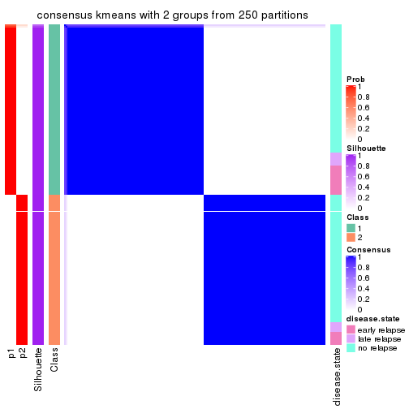</p>

</div>
<div id='tab-ATC-kmeans-consensus-heatmap-2'>
<pre><code class="r">consensus_heatmap(res, k = 3)
</code></pre>

<p>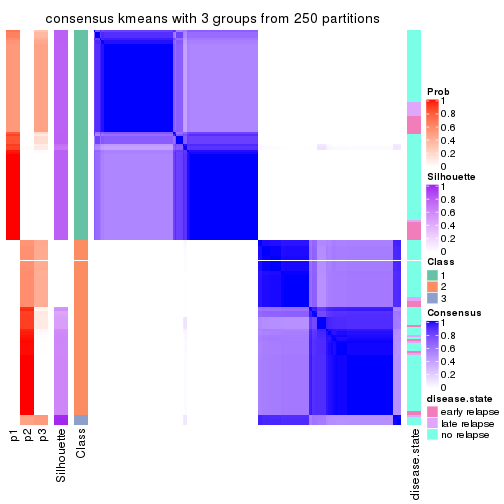</p>

</div>
<div id='tab-ATC-kmeans-consensus-heatmap-3'>
<pre><code class="r">consensus_heatmap(res, k = 4)
</code></pre>

<p>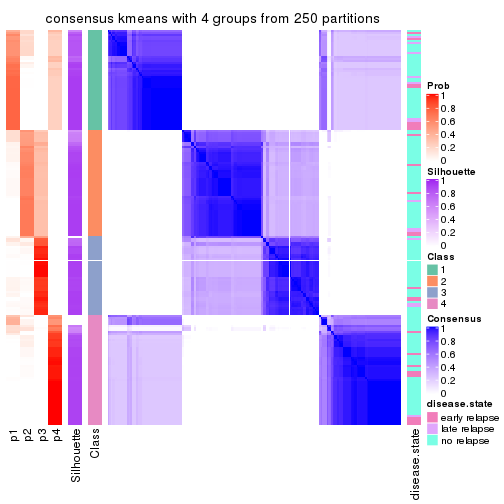</p>

</div>
<div id='tab-ATC-kmeans-consensus-heatmap-4'>
<pre><code class="r">consensus_heatmap(res, k = 5)
</code></pre>

<p>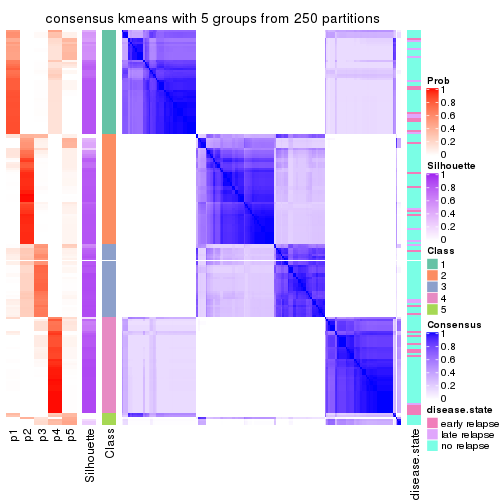</p>

</div>
<div id='tab-ATC-kmeans-consensus-heatmap-5'>
<pre><code class="r">consensus_heatmap(res, k = 6)
</code></pre>

<p>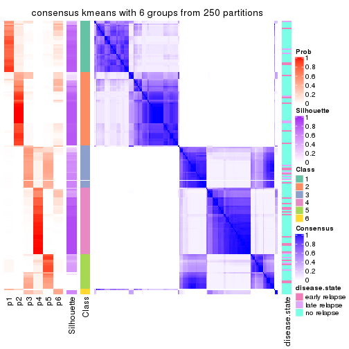</p>

</div>
</div>

Heatmaps for the membership of samples in all partitions to see how consistent they are:


<script>
$( function() {
	$( '#tabs-ATC-kmeans-membership-heatmap' ).tabs();
} );
</script>
<div id='tabs-ATC-kmeans-membership-heatmap'>
<ul>
<li><a href='#tab-ATC-kmeans-membership-heatmap-1'>k = 2</a></li>
<li><a href='#tab-ATC-kmeans-membership-heatmap-2'>k = 3</a></li>
<li><a href='#tab-ATC-kmeans-membership-heatmap-3'>k = 4</a></li>
<li><a href='#tab-ATC-kmeans-membership-heatmap-4'>k = 5</a></li>
<li><a href='#tab-ATC-kmeans-membership-heatmap-5'>k = 6</a></li>
</ul>
<div id='tab-ATC-kmeans-membership-heatmap-1'>
<pre><code class="r">membership_heatmap(res, k = 2)
</code></pre>

<p>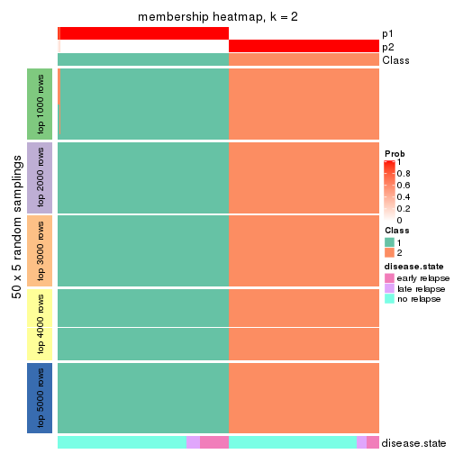</p>

</div>
<div id='tab-ATC-kmeans-membership-heatmap-2'>
<pre><code class="r">membership_heatmap(res, k = 3)
</code></pre>

<p>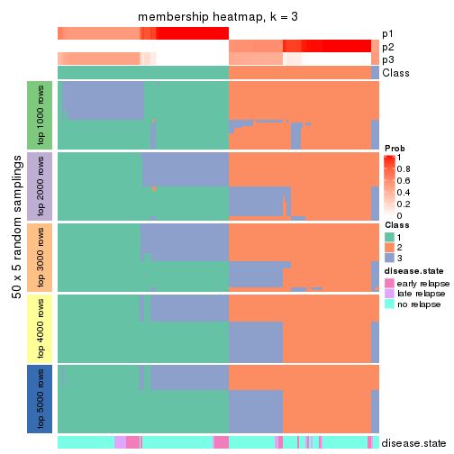</p>

</div>
<div id='tab-ATC-kmeans-membership-heatmap-3'>
<pre><code class="r">membership_heatmap(res, k = 4)
</code></pre>

<p>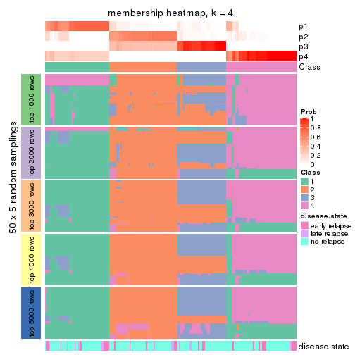</p>

</div>
<div id='tab-ATC-kmeans-membership-heatmap-4'>
<pre><code class="r">membership_heatmap(res, k = 5)
</code></pre>

<p>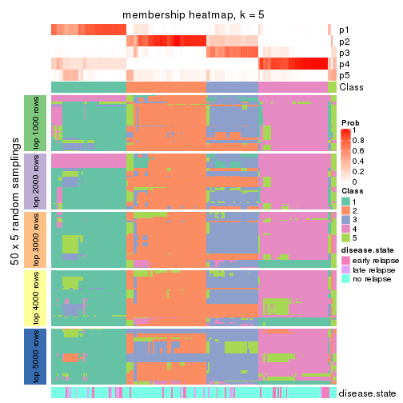</p>

</div>
<div id='tab-ATC-kmeans-membership-heatmap-5'>
<pre><code class="r">membership_heatmap(res, k = 6)
</code></pre>

<p>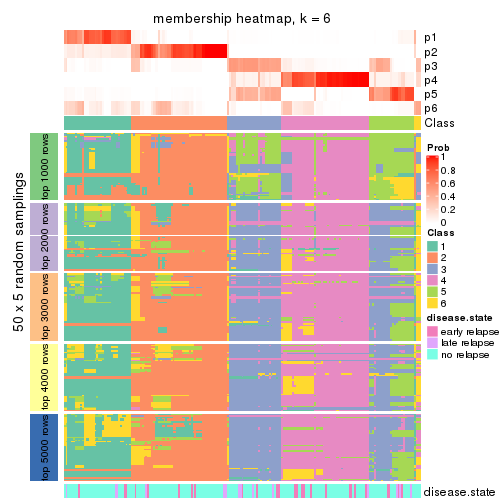</p>

</div>
</div>

As soon as we have had the classes for columns, we can look for signatures
which are significantly different between classes which can be candidate marks
for certain classes. Following are the heatmaps for signatures.


Signature heatmaps where rows are scaled:


<script>
$( function() {
	$( '#tabs-ATC-kmeans-get-signatures' ).tabs();
} );
</script>
<div id='tabs-ATC-kmeans-get-signatures'>
<ul>
<li><a href='#tab-ATC-kmeans-get-signatures-1'>k = 2</a></li>
<li><a href='#tab-ATC-kmeans-get-signatures-2'>k = 3</a></li>
<li><a href='#tab-ATC-kmeans-get-signatures-3'>k = 4</a></li>
<li><a href='#tab-ATC-kmeans-get-signatures-4'>k = 5</a></li>
<li><a href='#tab-ATC-kmeans-get-signatures-5'>k = 6</a></li>
</ul>
<div id='tab-ATC-kmeans-get-signatures-1'>
<pre><code class="r">get_signatures(res, k = 2)
</code></pre>

<p>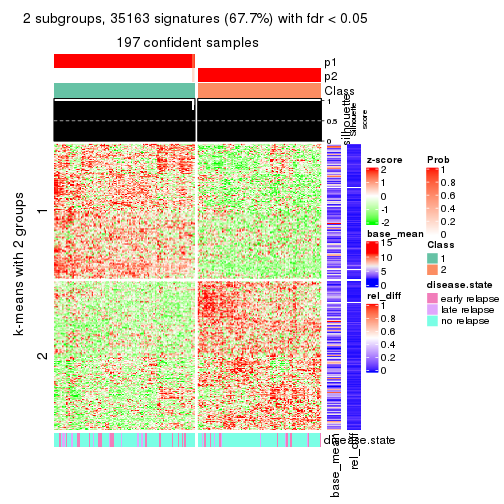</p>

</div>
<div id='tab-ATC-kmeans-get-signatures-2'>
<pre><code class="r">get_signatures(res, k = 3)
</code></pre>

<p>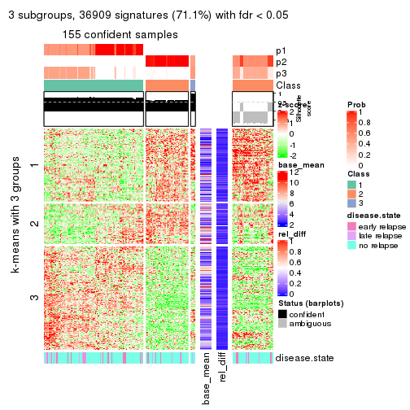</p>

</div>
<div id='tab-ATC-kmeans-get-signatures-3'>
<pre><code class="r">get_signatures(res, k = 4)
</code></pre>

<p>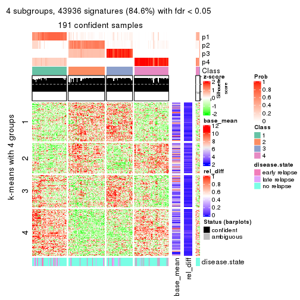</p>

</div>
<div id='tab-ATC-kmeans-get-signatures-4'>
<pre><code class="r">get_signatures(res, k = 5)
</code></pre>

<p>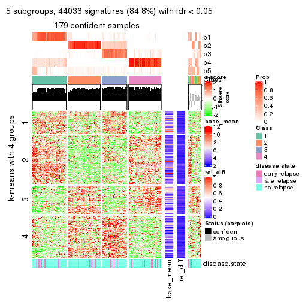</p>

</div>
<div id='tab-ATC-kmeans-get-signatures-5'>
<pre><code class="r">get_signatures(res, k = 6)
</code></pre>

<p>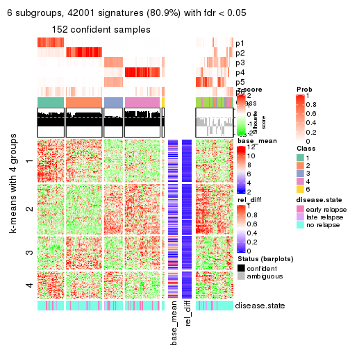</p>

</div>
</div>


Signature heatmaps where rows are not scaled:


<script>
$( function() {
	$( '#tabs-ATC-kmeans-get-signatures-no-scale' ).tabs();
} );
</script>
<div id='tabs-ATC-kmeans-get-signatures-no-scale'>
<ul>
<li><a href='#tab-ATC-kmeans-get-signatures-no-scale-1'>k = 2</a></li>
<li><a href='#tab-ATC-kmeans-get-signatures-no-scale-2'>k = 3</a></li>
<li><a href='#tab-ATC-kmeans-get-signatures-no-scale-3'>k = 4</a></li>
<li><a href='#tab-ATC-kmeans-get-signatures-no-scale-4'>k = 5</a></li>
<li><a href='#tab-ATC-kmeans-get-signatures-no-scale-5'>k = 6</a></li>
</ul>
<div id='tab-ATC-kmeans-get-signatures-no-scale-1'>
<pre><code class="r">get_signatures(res, k = 2, scale_rows = FALSE)
</code></pre>

<p>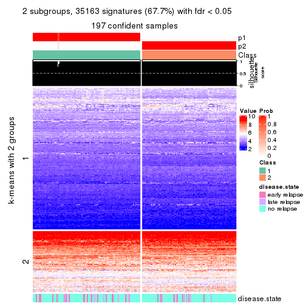</p>

</div>
<div id='tab-ATC-kmeans-get-signatures-no-scale-2'>
<pre><code class="r">get_signatures(res, k = 3, scale_rows = FALSE)
</code></pre>

<p>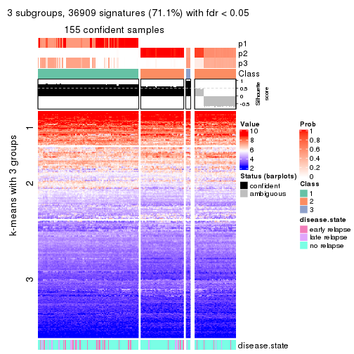</p>

</div>
<div id='tab-ATC-kmeans-get-signatures-no-scale-3'>
<pre><code class="r">get_signatures(res, k = 4, scale_rows = FALSE)
</code></pre>

<p>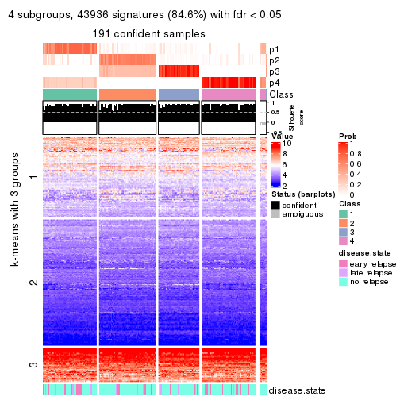</p>

</div>
<div id='tab-ATC-kmeans-get-signatures-no-scale-4'>
<pre><code class="r">get_signatures(res, k = 5, scale_rows = FALSE)
</code></pre>

<p>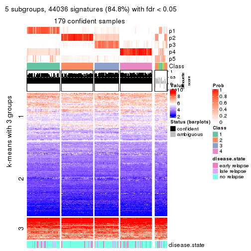</p>

</div>
<div id='tab-ATC-kmeans-get-signatures-no-scale-5'>
<pre><code class="r">get_signatures(res, k = 6, scale_rows = FALSE)
</code></pre>

<p>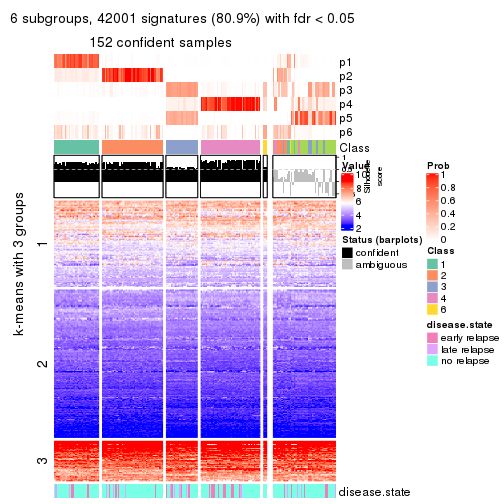</p>

</div>
</div>


Compare the overlap of signatures from different k:

```r
compare_signatures(res)
```

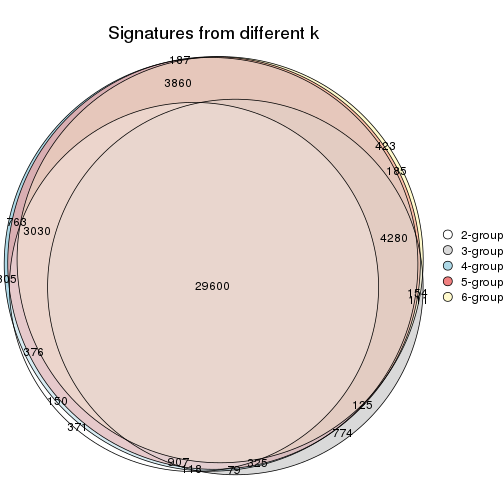

`get_signature()` returns a data frame invisibly. TO get the list of signatures, the function
call should be assigned to a variable explicitly. In following code, if `plot` argument is set
to `FALSE`, no heatmap is plotted while only the differential analysis is performed.

```r
# code only for demonstration
tb = get_signature(res, k = ..., plot = FALSE)
```

An example of the output of `tb` is:

```
#>   which_row         fdr    mean_1    mean_2 scaled_mean_1 scaled_mean_2 km
#> 1        38 0.042760348  8.373488  9.131774    -0.5533452     0.5164555  1
#> 2        40 0.018707592  7.106213  8.469186    -0.6173731     0.5762149  1
#> 3        55 0.019134737 10.221463 11.207825    -0.6159697     0.5749050  1
#> 4        59 0.006059896  5.921854  7.869574    -0.6899429     0.6439467  1
#> 5        60 0.018055526  8.928898 10.211722    -0.6204761     0.5791110  1
#> 6        98 0.009384629 15.714769 14.887706     0.6635654    -0.6193277  2
...
```

The columns in `tb` are:

1. `which_row`: row indices corresponding to the input matrix.
2. `fdr`: FDR for the differential test. 
3. `mean_x`: The mean value in group x.
4. `scaled_mean_x`: The mean value in group x after rows are scaled.
5. `km`: Row groups if k-means clustering is applied to rows.


UMAP plot which shows how samples are separated.


<script>
$( function() {
	$( '#tabs-ATC-kmeans-dimension-reduction' ).tabs();
} );
</script>
<div id='tabs-ATC-kmeans-dimension-reduction'>
<ul>
<li><a href='#tab-ATC-kmeans-dimension-reduction-1'>k = 2</a></li>
<li><a href='#tab-ATC-kmeans-dimension-reduction-2'>k = 3</a></li>
<li><a href='#tab-ATC-kmeans-dimension-reduction-3'>k = 4</a></li>
<li><a href='#tab-ATC-kmeans-dimension-reduction-4'>k = 5</a></li>
<li><a href='#tab-ATC-kmeans-dimension-reduction-5'>k = 6</a></li>
</ul>
<div id='tab-ATC-kmeans-dimension-reduction-1'>
<pre><code class="r">dimension_reduction(res, k = 2, method = &quot;UMAP&quot;)
</code></pre>

<p>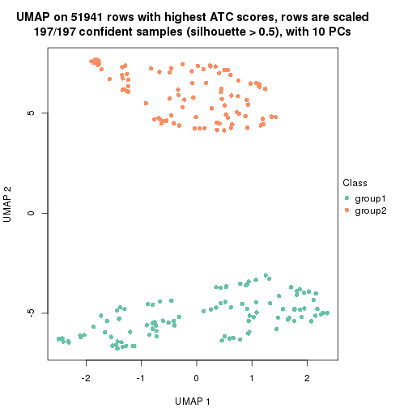</p>

</div>
<div id='tab-ATC-kmeans-dimension-reduction-2'>
<pre><code class="r">dimension_reduction(res, k = 3, method = &quot;UMAP&quot;)
</code></pre>

<p>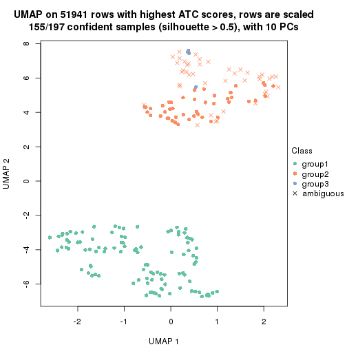</p>

</div>
<div id='tab-ATC-kmeans-dimension-reduction-3'>
<pre><code class="r">dimension_reduction(res, k = 4, method = &quot;UMAP&quot;)
</code></pre>

<p>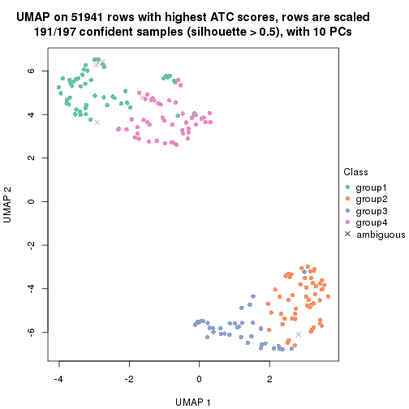</p>

</div>
<div id='tab-ATC-kmeans-dimension-reduction-4'>
<pre><code class="r">dimension_reduction(res, k = 5, method = &quot;UMAP&quot;)
</code></pre>

<p>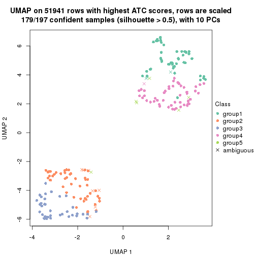</p>

</div>
<div id='tab-ATC-kmeans-dimension-reduction-5'>
<pre><code class="r">dimension_reduction(res, k = 6, method = &quot;UMAP&quot;)
</code></pre>

<p>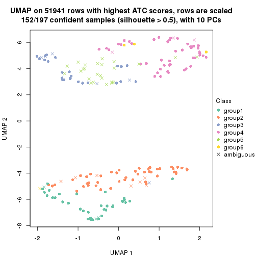</p>

</div>
</div>


Following heatmap shows how subgroups are split when increasing `k`:

```r
collect_classes(res)
```

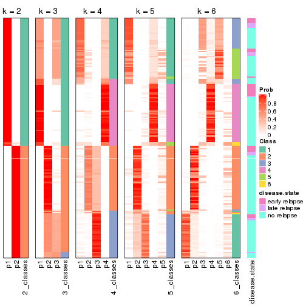


Test correlation between subgroups and known annotations. If the known
annotation is numeric, one-way ANOVA test is applied, and if the known
annotation is discrete, chi-squared contingency table test is applied.

```r
test_to_known_factors(res)
```

```
#>              n disease.state(p) k
#> ATC:kmeans 197            0.193 2
#> ATC:kmeans 155            0.458 3
#> ATC:kmeans 191            0.154 4
#> ATC:kmeans 179            0.257 5
#> ATC:kmeans 152            0.224 6
```


If matrix rows can be associated to genes, consider to use `functional_enrichment(res,
...)` to perform function enrichment for the signature genes. See [this vignette](http://bioconductor.org/packages/devel/bioc/vignettes/cola/inst/doc/functional_enrichment.html) for more detailed explanations.


 

---------------------------------------------------


### ATC:skmeans*


The object with results only for a single top-value method and a single partition method 
can be extracted as:

```r
res = res_list["ATC", "skmeans"]
# you can also extract it by
# res = res_list["ATC:skmeans"]
```

A summary of `res` and all the functions that can be applied to it:

```r
res
```

```
#> A 'ConsensusPartition' object with k = 2, 3, 4, 5, 6.
#>   On a matrix with 51941 rows and 197 columns.
#>   Top rows (1000, 2000, 3000, 4000, 5000) are extracted by 'ATC' method.
#>   Subgroups are detected by 'skmeans' method.
#>   Performed in total 1250 partitions by row resampling.
#>   Best k for subgroups seems to be 5.
#> 
#> Following methods can be applied to this 'ConsensusPartition' object:
#>  [1] "cola_report"             "collect_classes"         "collect_plots"          
#>  [4] "collect_stats"           "colnames"                "compare_signatures"     
#>  [7] "consensus_heatmap"       "dimension_reduction"     "functional_enrichment"  
#> [10] "get_anno_col"            "get_anno"                "get_classes"            
#> [13] "get_consensus"           "get_matrix"              "get_membership"         
#> [16] "get_param"               "get_signatures"          "get_stats"              
#> [19] "is_best_k"               "is_stable_k"             "membership_heatmap"     
#> [22] "ncol"                    "nrow"                    "plot_ecdf"              
#> [25] "rownames"                "select_partition_number" "show"                   
#> [28] "suggest_best_k"          "test_to_known_factors"
```

`collect_plots()` function collects all the plots made from `res` for all `k` (number of partitions)
into one single page to provide an easy and fast comparison between different `k`.

```r
collect_plots(res)
```

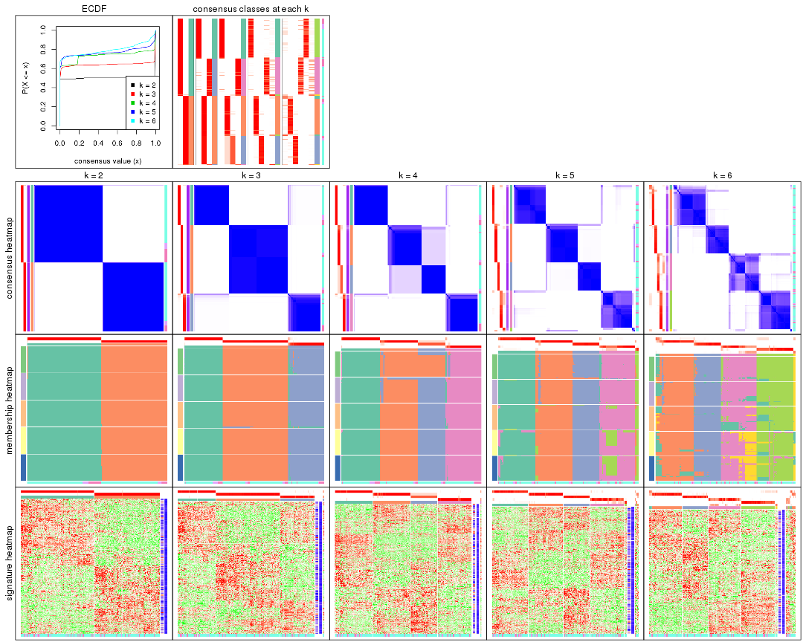

The plots are:

- The first row: a plot of the ECDF (empirical cumulative distribution
  function) curves of the consensus matrix for each `k` and the heatmap of
  predicted classes for each `k`.
- The second row: heatmaps of the consensus matrix for each `k`.
- The third row: heatmaps of the membership matrix for each `k`.
- The fouth row: heatmaps of the signatures for each `k`.

All the plots in panels can be made by individual functions and they are
plotted later in this section.

`select_partition_number()` produces several plots showing different
statistics for choosing "optimized" `k`. There are following statistics:

- ECDF curves of the consensus matrix for each `k`;
- 1-PAC. [The PAC
  score](https://en.wikipedia.org/wiki/Consensus_clustering#Over-interpretation_potential_of_consensus_clustering)
  measures the proportion of the ambiguous subgrouping.
- Mean silhouette score.
- Concordance. The mean probability of fiting the consensus class ids in all
  partitions.
- Area increased. Denote $A_k$ as the area under the ECDF curve for current
  `k`, the area increased is defined as $A_k - A_{k-1}$.
- Rand index. The percent of pairs of samples that are both in a same cluster
  or both are not in a same cluster in the partition of k and k-1.
- Jaccard index. The ratio of pairs of samples are both in a same cluster in
  the partition of k and k-1 and the pairs of samples are both in a same
  cluster in the partition k or k-1.

The detailed explanations of these statistics can be found in [the _cola_
vignette](http://bioconductor.org/packages/devel/bioc/vignettes/cola/inst/doc/cola.html#toc_13).

Generally speaking, lower PAC score, higher mean silhouette score or higher
concordance corresponds to better partition. Rand index and Jaccard index
measure how similar the current partition is compared to partition with `k-1`.
If they are too similar, we won't accept `k` is better than `k-1`.

```r
select_partition_number(res)
```

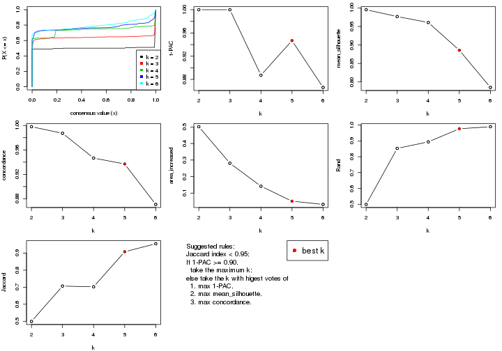

The numeric values for all these statistics can be obtained by `get_stats()`.

```r
get_stats(res)
```

```
#>   k 1-PAC mean_silhouette concordance area_increased  Rand Jaccard
#> 2 2 1.000           0.995       0.998         0.5015 0.499   0.499
#> 3 3 1.000           0.977       0.987         0.2808 0.853   0.707
#> 4 4 0.887           0.961       0.947         0.1416 0.894   0.702
#> 5 5 0.947           0.886       0.937         0.0511 0.976   0.908
#> 6 6 0.866           0.785       0.871         0.0316 0.989   0.955
```

`suggest_best_k()` suggests the best $k$ based on these statistics. The rules are as follows:

- All $k$ with Jaccard index larger than 0.95 are removed because increasing
  $k$ does not provide enough extra information. If all $k$ are removed, it is
  marked as no subgroup is detected.
- For all $k$ with 1-PAC score larger than 0.9, the maximal $k$ is taken as
  the best $k$, and other $k$ are marked as optional $k$.
- If it does not fit the second rule. The $k$ with the maximal vote of the
  highest 1-PAC score, highest mean silhouette, and highest concordance is
  taken as the best $k$.

```r
suggest_best_k(res)
```

```
#> [1] 5
#> attr(,"optional")
#> [1] 2 3
```

There is also optional best $k$ = 2 3 that is worth to check.

Following shows the table of the partitions (You need to click the **show/hide
code output** link to see it). The membership matrix (columns with name `p*`)
is inferred by
[`clue::cl_consensus()`](https://www.rdocumentation.org/link/cl_consensus?package=clue)
function with the `SE` method. Basically the value in the membership matrix
represents the probability to belong to a certain group. The finall class
label for an item is determined with the group with highest probability it
belongs to.

In `get_classes()` function, the entropy is calculated from the membership
matrix and the silhouette score is calculated from the consensus matrix.


<script>
$( function() {
	$( '#tabs-ATC-skmeans-get-classes' ).tabs();
} );
</script>
<div id='tabs-ATC-skmeans-get-classes'>
<ul>
<li><a href='#tab-ATC-skmeans-get-classes-1'>k = 2</a></li>
<li><a href='#tab-ATC-skmeans-get-classes-2'>k = 3</a></li>
<li><a href='#tab-ATC-skmeans-get-classes-3'>k = 4</a></li>
<li><a href='#tab-ATC-skmeans-get-classes-4'>k = 5</a></li>
<li><a href='#tab-ATC-skmeans-get-classes-5'>k = 6</a></li>
</ul>

<div id='tab-ATC-skmeans-get-classes-1'>
<p><a id='tab-ATC-skmeans-get-classes-1-a' style='color:#0366d6' href='#'>show/hide code output</a></p>
<pre><code class="r">cbind(get_classes(res, k = 2), get_membership(res, k = 2))
</code></pre>

<pre><code>#&gt;           class entropy silhouette    p1    p2
#&gt; GSM342319     1   0.000      0.998 1.000 0.000
#&gt; GSM342323     1   0.000      0.998 1.000 0.000
#&gt; GSM342325     1   0.000      0.998 1.000 0.000
#&gt; GSM342326     1   0.000      0.998 1.000 0.000
#&gt; GSM342327     1   0.000      0.998 1.000 0.000
#&gt; GSM342329     1   0.000      0.998 1.000 0.000
#&gt; GSM342331     1   0.000      0.998 1.000 0.000
#&gt; GSM342334     1   0.000      0.998 1.000 0.000
#&gt; GSM342335     1   0.000      0.998 1.000 0.000
#&gt; GSM342354     1   0.000      0.998 1.000 0.000
#&gt; GSM342371     1   0.000      0.998 1.000 0.000
#&gt; GSM342380     1   0.000      0.998 1.000 0.000
#&gt; GSM342382     1   0.000      0.998 1.000 0.000
#&gt; GSM342399     1   0.000      0.998 1.000 0.000
#&gt; GSM342402     1   0.000      0.998 1.000 0.000
#&gt; GSM342404     1   0.000      0.998 1.000 0.000
#&gt; GSM342408     1   0.000      0.998 1.000 0.000
#&gt; GSM342409     1   0.000      0.998 1.000 0.000
#&gt; GSM342426     2   0.000      0.998 0.000 1.000
#&gt; GSM342441     2   0.000      0.998 0.000 1.000
#&gt; GSM342444     2   0.000      0.998 0.000 1.000
#&gt; GSM342451     2   0.000      0.998 0.000 1.000
#&gt; GSM342462     2   0.000      0.998 0.000 1.000
#&gt; GSM342467     2   0.000      0.998 0.000 1.000
#&gt; GSM342484     2   0.000      0.998 0.000 1.000
#&gt; GSM342491     2   0.000      0.998 0.000 1.000
#&gt; GSM342322     1   0.000      0.998 1.000 0.000
#&gt; GSM342338     1   0.000      0.998 1.000 0.000
#&gt; GSM342347     1   0.000      0.998 1.000 0.000
#&gt; GSM342356     1   0.000      0.998 1.000 0.000
#&gt; GSM342357     1   0.000      0.998 1.000 0.000
#&gt; GSM342366     1   0.000      0.998 1.000 0.000
#&gt; GSM342385     1   0.000      0.998 1.000 0.000
#&gt; GSM342421     1   0.000      0.998 1.000 0.000
#&gt; GSM342437     2   0.000      0.998 0.000 1.000
#&gt; GSM342454     2   0.000      0.998 0.000 1.000
#&gt; GSM342471     2   0.000      0.998 0.000 1.000
#&gt; GSM342477     2   0.000      0.998 0.000 1.000
#&gt; GSM342495     2   0.000      0.998 0.000 1.000
#&gt; GSM342496     2   0.000      0.998 0.000 1.000
#&gt; GSM342320     1   0.000      0.998 1.000 0.000
#&gt; GSM342321     1   0.000      0.998 1.000 0.000
#&gt; GSM342324     1   0.000      0.998 1.000 0.000
#&gt; GSM342328     1   0.000      0.998 1.000 0.000
#&gt; GSM342330     1   0.000      0.998 1.000 0.000
#&gt; GSM342332     1   0.000      0.998 1.000 0.000
#&gt; GSM342333     1   0.000      0.998 1.000 0.000
#&gt; GSM342336     1   0.000      0.998 1.000 0.000
#&gt; GSM342337     1   0.000      0.998 1.000 0.000
#&gt; GSM342339     1   0.000      0.998 1.000 0.000
#&gt; GSM342340     1   0.000      0.998 1.000 0.000
#&gt; GSM342341     1   0.000      0.998 1.000 0.000
#&gt; GSM342342     1   0.000      0.998 1.000 0.000
#&gt; GSM342343     1   0.000      0.998 1.000 0.000
#&gt; GSM342344     1   0.000      0.998 1.000 0.000
#&gt; GSM342345     1   0.000      0.998 1.000 0.000
#&gt; GSM342346     1   0.000      0.998 1.000 0.000
#&gt; GSM342348     1   0.000      0.998 1.000 0.000
#&gt; GSM342349     1   0.000      0.998 1.000 0.000
#&gt; GSM342350     1   0.000      0.998 1.000 0.000
#&gt; GSM342351     1   0.802      0.676 0.756 0.244
#&gt; GSM342352     2   0.644      0.803 0.164 0.836
#&gt; GSM342353     1   0.000      0.998 1.000 0.000
#&gt; GSM342355     1   0.000      0.998 1.000 0.000
#&gt; GSM342358     1   0.000      0.998 1.000 0.000
#&gt; GSM342359     1   0.000      0.998 1.000 0.000
#&gt; GSM342360     1   0.000      0.998 1.000 0.000
#&gt; GSM342361     1   0.000      0.998 1.000 0.000
#&gt; GSM342362     1   0.000      0.998 1.000 0.000
#&gt; GSM342363     1   0.000      0.998 1.000 0.000
#&gt; GSM342364     1   0.000      0.998 1.000 0.000
#&gt; GSM342365     1   0.000      0.998 1.000 0.000
#&gt; GSM342367     1   0.000      0.998 1.000 0.000
#&gt; GSM342368     1   0.000      0.998 1.000 0.000
#&gt; GSM342369     1   0.000      0.998 1.000 0.000
#&gt; GSM342370     1   0.000      0.998 1.000 0.000
#&gt; GSM342372     1   0.000      0.998 1.000 0.000
#&gt; GSM342373     1   0.000      0.998 1.000 0.000
#&gt; GSM342374     1   0.000      0.998 1.000 0.000
#&gt; GSM342375     1   0.000      0.998 1.000 0.000
#&gt; GSM342376     1   0.000      0.998 1.000 0.000
#&gt; GSM342377     1   0.000      0.998 1.000 0.000
#&gt; GSM342378     1   0.000      0.998 1.000 0.000
#&gt; GSM342379     1   0.000      0.998 1.000 0.000
#&gt; GSM342381     1   0.000      0.998 1.000 0.000
#&gt; GSM342383     1   0.000      0.998 1.000 0.000
#&gt; GSM342384     1   0.000      0.998 1.000 0.000
#&gt; GSM342386     1   0.000      0.998 1.000 0.000
#&gt; GSM342387     1   0.000      0.998 1.000 0.000
#&gt; GSM342388     1   0.000      0.998 1.000 0.000
#&gt; GSM342389     1   0.000      0.998 1.000 0.000
#&gt; GSM342390     1   0.000      0.998 1.000 0.000
#&gt; GSM342391     1   0.000      0.998 1.000 0.000
#&gt; GSM342392     1   0.000      0.998 1.000 0.000
#&gt; GSM342393     1   0.000      0.998 1.000 0.000
#&gt; GSM342394     1   0.000      0.998 1.000 0.000
#&gt; GSM342395     1   0.000      0.998 1.000 0.000
#&gt; GSM342396     1   0.000      0.998 1.000 0.000
#&gt; GSM342397     1   0.000      0.998 1.000 0.000
#&gt; GSM342398     1   0.000      0.998 1.000 0.000
#&gt; GSM342400     1   0.000      0.998 1.000 0.000
#&gt; GSM342401     1   0.000      0.998 1.000 0.000
#&gt; GSM342403     1   0.000      0.998 1.000 0.000
#&gt; GSM342405     1   0.000      0.998 1.000 0.000
#&gt; GSM342406     1   0.000      0.998 1.000 0.000
#&gt; GSM342407     1   0.000      0.998 1.000 0.000
#&gt; GSM342410     1   0.000      0.998 1.000 0.000
#&gt; GSM342411     1   0.000      0.998 1.000 0.000
#&gt; GSM342412     1   0.000      0.998 1.000 0.000
#&gt; GSM342413     1   0.000      0.998 1.000 0.000
#&gt; GSM342414     1   0.000      0.998 1.000 0.000
#&gt; GSM342415     1   0.000      0.998 1.000 0.000
#&gt; GSM342416     1   0.000      0.998 1.000 0.000
#&gt; GSM342417     1   0.000      0.998 1.000 0.000
#&gt; GSM342418     1   0.000      0.998 1.000 0.000
#&gt; GSM342419     1   0.000      0.998 1.000 0.000
#&gt; GSM342420     1   0.000      0.998 1.000 0.000
#&gt; GSM342422     1   0.000      0.998 1.000 0.000
#&gt; GSM342423     1   0.000      0.998 1.000 0.000
#&gt; GSM342424     2   0.000      0.998 0.000 1.000
#&gt; GSM342425     2   0.000      0.998 0.000 1.000
#&gt; GSM342427     2   0.000      0.998 0.000 1.000
#&gt; GSM342428     2   0.000      0.998 0.000 1.000
#&gt; GSM342429     2   0.000      0.998 0.000 1.000
#&gt; GSM342430     2   0.000      0.998 0.000 1.000
#&gt; GSM342431     2   0.000      0.998 0.000 1.000
#&gt; GSM342432     2   0.000      0.998 0.000 1.000
#&gt; GSM342433     2   0.000      0.998 0.000 1.000
#&gt; GSM342434     2   0.000      0.998 0.000 1.000
#&gt; GSM342435     2   0.000      0.998 0.000 1.000
#&gt; GSM342436     2   0.000      0.998 0.000 1.000
#&gt; GSM342438     2   0.000      0.998 0.000 1.000
#&gt; GSM342439     2   0.000      0.998 0.000 1.000
#&gt; GSM342440     2   0.000      0.998 0.000 1.000
#&gt; GSM342442     2   0.000      0.998 0.000 1.000
#&gt; GSM342443     2   0.000      0.998 0.000 1.000
#&gt; GSM342445     2   0.000      0.998 0.000 1.000
#&gt; GSM342446     2   0.000      0.998 0.000 1.000
#&gt; GSM342447     2   0.000      0.998 0.000 1.000
#&gt; GSM342448     2   0.000      0.998 0.000 1.000
#&gt; GSM342449     2   0.000      0.998 0.000 1.000
#&gt; GSM342450     2   0.000      0.998 0.000 1.000
#&gt; GSM342452     2   0.000      0.998 0.000 1.000
#&gt; GSM342453     2   0.000      0.998 0.000 1.000
#&gt; GSM342455     2   0.000      0.998 0.000 1.000
#&gt; GSM342456     2   0.000      0.998 0.000 1.000
#&gt; GSM342457     2   0.000      0.998 0.000 1.000
#&gt; GSM342458     2   0.000      0.998 0.000 1.000
#&gt; GSM342459     2   0.000      0.998 0.000 1.000
#&gt; GSM342460     2   0.000      0.998 0.000 1.000
#&gt; GSM342461     2   0.000      0.998 0.000 1.000
#&gt; GSM342463     2   0.000      0.998 0.000 1.000
#&gt; GSM342464     2   0.000      0.998 0.000 1.000
#&gt; GSM342465     2   0.000      0.998 0.000 1.000
#&gt; GSM342466     2   0.000      0.998 0.000 1.000
#&gt; GSM342468     2   0.000      0.998 0.000 1.000
#&gt; GSM342469     2   0.000      0.998 0.000 1.000
#&gt; GSM342470     2   0.000      0.998 0.000 1.000
#&gt; GSM342472     2   0.000      0.998 0.000 1.000
#&gt; GSM342473     2   0.000      0.998 0.000 1.000
#&gt; GSM342474     2   0.000      0.998 0.000 1.000
#&gt; GSM342475     2   0.000      0.998 0.000 1.000
#&gt; GSM342476     2   0.000      0.998 0.000 1.000
#&gt; GSM342478     2   0.000      0.998 0.000 1.000
#&gt; GSM342479     2   0.000      0.998 0.000 1.000
#&gt; GSM342480     2   0.000      0.998 0.000 1.000
#&gt; GSM342481     2   0.000      0.998 0.000 1.000
#&gt; GSM342482     2   0.000      0.998 0.000 1.000
#&gt; GSM342483     2   0.000      0.998 0.000 1.000
#&gt; GSM342485     2   0.000      0.998 0.000 1.000
#&gt; GSM342486     2   0.000      0.998 0.000 1.000
#&gt; GSM342487     2   0.000      0.998 0.000 1.000
#&gt; GSM342488     2   0.000      0.998 0.000 1.000
#&gt; GSM342489     2   0.000      0.998 0.000 1.000
#&gt; GSM342490     2   0.000      0.998 0.000 1.000
#&gt; GSM342492     2   0.000      0.998 0.000 1.000
#&gt; GSM342493     2   0.000      0.998 0.000 1.000
#&gt; GSM342494     2   0.000      0.998 0.000 1.000
#&gt; GSM342497     2   0.000      0.998 0.000 1.000
#&gt; GSM342498     2   0.000      0.998 0.000 1.000
#&gt; GSM342499     2   0.000      0.998 0.000 1.000
#&gt; GSM342500     2   0.000      0.998 0.000 1.000
#&gt; GSM342501     2   0.000      0.998 0.000 1.000
#&gt; GSM342502     2   0.000      0.998 0.000 1.000
#&gt; GSM342503     2   0.000      0.998 0.000 1.000
#&gt; GSM342504     2   0.000      0.998 0.000 1.000
#&gt; GSM342505     2   0.000      0.998 0.000 1.000
#&gt; GSM342506     2   0.000      0.998 0.000 1.000
#&gt; GSM342507     2   0.000      0.998 0.000 1.000
#&gt; GSM342508     2   0.000      0.998 0.000 1.000
#&gt; GSM342509     2   0.000      0.998 0.000 1.000
#&gt; GSM342510     2   0.000      0.998 0.000 1.000
#&gt; GSM342511     2   0.000      0.998 0.000 1.000
#&gt; GSM342512     2   0.000      0.998 0.000 1.000
#&gt; GSM342513     2   0.000      0.998 0.000 1.000
#&gt; GSM342514     2   0.000      0.998 0.000 1.000
#&gt; GSM342515     2   0.000      0.998 0.000 1.000
</code></pre>

<script>
$('#tab-ATC-skmeans-get-classes-1-a').parent().next().next().hide();
$('#tab-ATC-skmeans-get-classes-1-a').click(function(){
  $('#tab-ATC-skmeans-get-classes-1-a').parent().next().next().toggle();
  return(false);
});
</script>
</div>

<div id='tab-ATC-skmeans-get-classes-2'>
<p><a id='tab-ATC-skmeans-get-classes-2-a' style='color:#0366d6' href='#'>show/hide code output</a></p>
<pre><code class="r">cbind(get_classes(res, k = 3), get_membership(res, k = 3))
</code></pre>

<pre><code>#&gt;           class entropy silhouette    p1    p2    p3
#&gt; GSM342319     1  0.0000     0.9969 1.000 0.000 0.000
#&gt; GSM342323     3  0.2261     0.9201 0.068 0.000 0.932
#&gt; GSM342325     1  0.0000     0.9969 1.000 0.000 0.000
#&gt; GSM342326     3  0.0424     0.9662 0.008 0.000 0.992
#&gt; GSM342327     3  0.0424     0.9662 0.008 0.000 0.992
#&gt; GSM342329     1  0.0892     0.9763 0.980 0.000 0.020
#&gt; GSM342331     3  0.0424     0.9662 0.008 0.000 0.992
#&gt; GSM342334     3  0.0424     0.9662 0.008 0.000 0.992
#&gt; GSM342335     1  0.0000     0.9969 1.000 0.000 0.000
#&gt; GSM342354     3  0.0424     0.9662 0.008 0.000 0.992
#&gt; GSM342371     3  0.0424     0.9662 0.008 0.000 0.992
#&gt; GSM342380     1  0.0000     0.9969 1.000 0.000 0.000
#&gt; GSM342382     1  0.0000     0.9969 1.000 0.000 0.000
#&gt; GSM342399     1  0.0000     0.9969 1.000 0.000 0.000
#&gt; GSM342402     1  0.0000     0.9969 1.000 0.000 0.000
#&gt; GSM342404     3  0.0424     0.9662 0.008 0.000 0.992
#&gt; GSM342408     3  0.0424     0.9662 0.008 0.000 0.992
#&gt; GSM342409     3  0.0592     0.9640 0.012 0.000 0.988
#&gt; GSM342426     2  0.0000     0.9971 0.000 1.000 0.000
#&gt; GSM342441     2  0.0000     0.9971 0.000 1.000 0.000
#&gt; GSM342444     2  0.0424     0.9963 0.000 0.992 0.008
#&gt; GSM342451     2  0.0424     0.9963 0.000 0.992 0.008
#&gt; GSM342462     2  0.0424     0.9963 0.000 0.992 0.008
#&gt; GSM342467     2  0.0000     0.9971 0.000 1.000 0.000
#&gt; GSM342484     2  0.0000     0.9971 0.000 1.000 0.000
#&gt; GSM342491     2  0.0000     0.9971 0.000 1.000 0.000
#&gt; GSM342322     1  0.0000     0.9969 1.000 0.000 0.000
#&gt; GSM342338     1  0.0000     0.9969 1.000 0.000 0.000
#&gt; GSM342347     1  0.0000     0.9969 1.000 0.000 0.000
#&gt; GSM342356     1  0.0000     0.9969 1.000 0.000 0.000
#&gt; GSM342357     1  0.0000     0.9969 1.000 0.000 0.000
#&gt; GSM342366     1  0.0000     0.9969 1.000 0.000 0.000
#&gt; GSM342385     1  0.0000     0.9969 1.000 0.000 0.000
#&gt; GSM342421     3  0.0424     0.9662 0.008 0.000 0.992
#&gt; GSM342437     2  0.0000     0.9971 0.000 1.000 0.000
#&gt; GSM342454     2  0.0424     0.9963 0.000 0.992 0.008
#&gt; GSM342471     2  0.0424     0.9963 0.000 0.992 0.008
#&gt; GSM342477     2  0.0000     0.9971 0.000 1.000 0.000
#&gt; GSM342495     2  0.0000     0.9971 0.000 1.000 0.000
#&gt; GSM342496     2  0.0424     0.9963 0.000 0.992 0.008
#&gt; GSM342320     3  0.0424     0.9662 0.008 0.000 0.992
#&gt; GSM342321     1  0.0000     0.9969 1.000 0.000 0.000
#&gt; GSM342324     3  0.0424     0.9662 0.008 0.000 0.992
#&gt; GSM342328     3  0.0424     0.9662 0.008 0.000 0.992
#&gt; GSM342330     3  0.0424     0.9662 0.008 0.000 0.992
#&gt; GSM342332     3  0.0892     0.9591 0.020 0.000 0.980
#&gt; GSM342333     3  0.1031     0.9565 0.024 0.000 0.976
#&gt; GSM342336     3  0.0424     0.9662 0.008 0.000 0.992
#&gt; GSM342337     1  0.0000     0.9969 1.000 0.000 0.000
#&gt; GSM342339     1  0.0000     0.9969 1.000 0.000 0.000
#&gt; GSM342340     1  0.0000     0.9969 1.000 0.000 0.000
#&gt; GSM342341     1  0.0000     0.9969 1.000 0.000 0.000
#&gt; GSM342342     1  0.0000     0.9969 1.000 0.000 0.000
#&gt; GSM342343     1  0.0000     0.9969 1.000 0.000 0.000
#&gt; GSM342344     3  0.5098     0.6964 0.248 0.000 0.752
#&gt; GSM342345     1  0.0000     0.9969 1.000 0.000 0.000
#&gt; GSM342346     3  0.0592     0.9640 0.012 0.000 0.988
#&gt; GSM342348     3  0.0424     0.9662 0.008 0.000 0.992
#&gt; GSM342349     3  0.0424     0.9662 0.008 0.000 0.992
#&gt; GSM342350     3  0.6168     0.3510 0.412 0.000 0.588
#&gt; GSM342351     3  0.0592     0.9556 0.000 0.012 0.988
#&gt; GSM342352     3  0.3340     0.8397 0.000 0.120 0.880
#&gt; GSM342353     3  0.0424     0.9662 0.008 0.000 0.992
#&gt; GSM342355     1  0.0000     0.9969 1.000 0.000 0.000
#&gt; GSM342358     3  0.0424     0.9662 0.008 0.000 0.992
#&gt; GSM342359     3  0.0424     0.9662 0.008 0.000 0.992
#&gt; GSM342360     3  0.0424     0.9662 0.008 0.000 0.992
#&gt; GSM342361     3  0.0424     0.9662 0.008 0.000 0.992
#&gt; GSM342362     1  0.3619     0.8357 0.864 0.000 0.136
#&gt; GSM342363     1  0.0000     0.9969 1.000 0.000 0.000
#&gt; GSM342364     1  0.0000     0.9969 1.000 0.000 0.000
#&gt; GSM342365     3  0.0424     0.9662 0.008 0.000 0.992
#&gt; GSM342367     1  0.0000     0.9969 1.000 0.000 0.000
#&gt; GSM342368     1  0.0000     0.9969 1.000 0.000 0.000
#&gt; GSM342369     3  0.1753     0.9377 0.048 0.000 0.952
#&gt; GSM342370     3  0.0424     0.9662 0.008 0.000 0.992
#&gt; GSM342372     3  0.0424     0.9662 0.008 0.000 0.992
#&gt; GSM342373     3  0.0424     0.9662 0.008 0.000 0.992
#&gt; GSM342374     3  0.1031     0.9565 0.024 0.000 0.976
#&gt; GSM342375     3  0.1031     0.9565 0.024 0.000 0.976
#&gt; GSM342376     1  0.0000     0.9969 1.000 0.000 0.000
#&gt; GSM342377     1  0.0000     0.9969 1.000 0.000 0.000
#&gt; GSM342378     1  0.0000     0.9969 1.000 0.000 0.000
#&gt; GSM342379     1  0.0000     0.9969 1.000 0.000 0.000
#&gt; GSM342381     1  0.0000     0.9969 1.000 0.000 0.000
#&gt; GSM342383     1  0.0000     0.9969 1.000 0.000 0.000
#&gt; GSM342384     1  0.0000     0.9969 1.000 0.000 0.000
#&gt; GSM342386     1  0.0000     0.9969 1.000 0.000 0.000
#&gt; GSM342387     3  0.0424     0.9662 0.008 0.000 0.992
#&gt; GSM342388     1  0.0000     0.9969 1.000 0.000 0.000
#&gt; GSM342389     1  0.0000     0.9969 1.000 0.000 0.000
#&gt; GSM342390     1  0.0000     0.9969 1.000 0.000 0.000
#&gt; GSM342391     1  0.0000     0.9969 1.000 0.000 0.000
#&gt; GSM342392     1  0.0000     0.9969 1.000 0.000 0.000
#&gt; GSM342393     3  0.0424     0.9662 0.008 0.000 0.992
#&gt; GSM342394     1  0.0000     0.9969 1.000 0.000 0.000
#&gt; GSM342395     1  0.0000     0.9969 1.000 0.000 0.000
#&gt; GSM342396     1  0.0000     0.9969 1.000 0.000 0.000
#&gt; GSM342397     3  0.2878     0.8934 0.096 0.000 0.904
#&gt; GSM342398     1  0.0000     0.9969 1.000 0.000 0.000
#&gt; GSM342400     1  0.0000     0.9969 1.000 0.000 0.000
#&gt; GSM342401     1  0.0000     0.9969 1.000 0.000 0.000
#&gt; GSM342403     1  0.0000     0.9969 1.000 0.000 0.000
#&gt; GSM342405     3  0.0424     0.9662 0.008 0.000 0.992
#&gt; GSM342406     1  0.0000     0.9969 1.000 0.000 0.000
#&gt; GSM342407     3  0.0424     0.9662 0.008 0.000 0.992
#&gt; GSM342410     1  0.0000     0.9969 1.000 0.000 0.000
#&gt; GSM342411     3  0.0424     0.9662 0.008 0.000 0.992
#&gt; GSM342412     3  0.6308     0.0979 0.492 0.000 0.508
#&gt; GSM342413     3  0.0424     0.9662 0.008 0.000 0.992
#&gt; GSM342414     3  0.0424     0.9662 0.008 0.000 0.992
#&gt; GSM342415     1  0.0000     0.9969 1.000 0.000 0.000
#&gt; GSM342416     3  0.3816     0.8358 0.148 0.000 0.852
#&gt; GSM342417     3  0.0424     0.9662 0.008 0.000 0.992
#&gt; GSM342418     3  0.0424     0.9662 0.008 0.000 0.992
#&gt; GSM342419     1  0.0000     0.9969 1.000 0.000 0.000
#&gt; GSM342420     3  0.0424     0.9662 0.008 0.000 0.992
#&gt; GSM342422     1  0.0000     0.9969 1.000 0.000 0.000
#&gt; GSM342423     3  0.0424     0.9662 0.008 0.000 0.992
#&gt; GSM342424     2  0.0000     0.9971 0.000 1.000 0.000
#&gt; GSM342425     2  0.0000     0.9971 0.000 1.000 0.000
#&gt; GSM342427     2  0.0000     0.9971 0.000 1.000 0.000
#&gt; GSM342428     2  0.0000     0.9971 0.000 1.000 0.000
#&gt; GSM342429     2  0.0000     0.9971 0.000 1.000 0.000
#&gt; GSM342430     2  0.0424     0.9963 0.000 0.992 0.008
#&gt; GSM342431     2  0.0424     0.9963 0.000 0.992 0.008
#&gt; GSM342432     2  0.0000     0.9971 0.000 1.000 0.000
#&gt; GSM342433     2  0.0000     0.9971 0.000 1.000 0.000
#&gt; GSM342434     2  0.0000     0.9971 0.000 1.000 0.000
#&gt; GSM342435     2  0.0000     0.9971 0.000 1.000 0.000
#&gt; GSM342436     2  0.0000     0.9971 0.000 1.000 0.000
#&gt; GSM342438     2  0.0000     0.9971 0.000 1.000 0.000
#&gt; GSM342439     2  0.0424     0.9963 0.000 0.992 0.008
#&gt; GSM342440     2  0.0237     0.9968 0.000 0.996 0.004
#&gt; GSM342442     2  0.0424     0.9963 0.000 0.992 0.008
#&gt; GSM342443     2  0.0000     0.9971 0.000 1.000 0.000
#&gt; GSM342445     2  0.0237     0.9968 0.000 0.996 0.004
#&gt; GSM342446     2  0.0424     0.9963 0.000 0.992 0.008
#&gt; GSM342447     2  0.0424     0.9963 0.000 0.992 0.008
#&gt; GSM342448     2  0.0237     0.9968 0.000 0.996 0.004
#&gt; GSM342449     2  0.0424     0.9963 0.000 0.992 0.008
#&gt; GSM342450     2  0.0000     0.9971 0.000 1.000 0.000
#&gt; GSM342452     2  0.0424     0.9963 0.000 0.992 0.008
#&gt; GSM342453     2  0.0424     0.9963 0.000 0.992 0.008
#&gt; GSM342455     2  0.0424     0.9963 0.000 0.992 0.008
#&gt; GSM342456     2  0.0000     0.9971 0.000 1.000 0.000
#&gt; GSM342457     2  0.0424     0.9963 0.000 0.992 0.008
#&gt; GSM342458     2  0.0000     0.9971 0.000 1.000 0.000
#&gt; GSM342459     2  0.0000     0.9971 0.000 1.000 0.000
#&gt; GSM342460     2  0.0000     0.9971 0.000 1.000 0.000
#&gt; GSM342461     2  0.0000     0.9971 0.000 1.000 0.000
#&gt; GSM342463     2  0.0424     0.9963 0.000 0.992 0.008
#&gt; GSM342464     2  0.0424     0.9963 0.000 0.992 0.008
#&gt; GSM342465     2  0.0424     0.9963 0.000 0.992 0.008
#&gt; GSM342466     2  0.0424     0.9963 0.000 0.992 0.008
#&gt; GSM342468     2  0.0000     0.9971 0.000 1.000 0.000
#&gt; GSM342469     2  0.0424     0.9963 0.000 0.992 0.008
#&gt; GSM342470     2  0.0000     0.9971 0.000 1.000 0.000
#&gt; GSM342472     2  0.0000     0.9971 0.000 1.000 0.000
#&gt; GSM342473     2  0.0000     0.9971 0.000 1.000 0.000
#&gt; GSM342474     2  0.0000     0.9971 0.000 1.000 0.000
#&gt; GSM342475     2  0.0000     0.9971 0.000 1.000 0.000
#&gt; GSM342476     2  0.0000     0.9971 0.000 1.000 0.000
#&gt; GSM342478     2  0.0000     0.9971 0.000 1.000 0.000
#&gt; GSM342479     2  0.0000     0.9971 0.000 1.000 0.000
#&gt; GSM342480     2  0.0000     0.9971 0.000 1.000 0.000
#&gt; GSM342481     2  0.0000     0.9971 0.000 1.000 0.000
#&gt; GSM342482     2  0.0000     0.9971 0.000 1.000 0.000
#&gt; GSM342483     2  0.0000     0.9971 0.000 1.000 0.000
#&gt; GSM342485     2  0.0424     0.9963 0.000 0.992 0.008
#&gt; GSM342486     2  0.0424     0.9963 0.000 0.992 0.008
#&gt; GSM342487     2  0.0000     0.9971 0.000 1.000 0.000
#&gt; GSM342488     2  0.0000     0.9971 0.000 1.000 0.000
#&gt; GSM342489     2  0.0000     0.9971 0.000 1.000 0.000
#&gt; GSM342490     2  0.0000     0.9971 0.000 1.000 0.000
#&gt; GSM342492     2  0.0000     0.9971 0.000 1.000 0.000
#&gt; GSM342493     2  0.0424     0.9963 0.000 0.992 0.008
#&gt; GSM342494     2  0.0000     0.9971 0.000 1.000 0.000
#&gt; GSM342497     2  0.0237     0.9968 0.000 0.996 0.004
#&gt; GSM342498     2  0.0424     0.9963 0.000 0.992 0.008
#&gt; GSM342499     2  0.0424     0.9963 0.000 0.992 0.008
#&gt; GSM342500     2  0.0000     0.9971 0.000 1.000 0.000
#&gt; GSM342501     2  0.0424     0.9963 0.000 0.992 0.008
#&gt; GSM342502     2  0.0424     0.9963 0.000 0.992 0.008
#&gt; GSM342503     2  0.0000     0.9971 0.000 1.000 0.000
#&gt; GSM342504     2  0.0000     0.9971 0.000 1.000 0.000
#&gt; GSM342505     2  0.0424     0.9963 0.000 0.992 0.008
#&gt; GSM342506     2  0.0424     0.9963 0.000 0.992 0.008
#&gt; GSM342507     2  0.0424     0.9963 0.000 0.992 0.008
#&gt; GSM342508     2  0.0424     0.9963 0.000 0.992 0.008
#&gt; GSM342509     2  0.0424     0.9963 0.000 0.992 0.008
#&gt; GSM342510     2  0.0000     0.9971 0.000 1.000 0.000
#&gt; GSM342511     2  0.0424     0.9963 0.000 0.992 0.008
#&gt; GSM342512     2  0.0424     0.9963 0.000 0.992 0.008
#&gt; GSM342513     2  0.0424     0.9963 0.000 0.992 0.008
#&gt; GSM342514     2  0.0237     0.9968 0.000 0.996 0.004
#&gt; GSM342515     2  0.0424     0.9963 0.000 0.992 0.008
</code></pre>

<script>
$('#tab-ATC-skmeans-get-classes-2-a').parent().next().next().hide();
$('#tab-ATC-skmeans-get-classes-2-a').click(function(){
  $('#tab-ATC-skmeans-get-classes-2-a').parent().next().next().toggle();
  return(false);
});
</script>
</div>

<div id='tab-ATC-skmeans-get-classes-3'>
<p><a id='tab-ATC-skmeans-get-classes-3-a' style='color:#0366d6' href='#'>show/hide code output</a></p>
<pre><code class="r">cbind(get_classes(res, k = 4), get_membership(res, k = 4))
</code></pre>

<pre><code>#&gt;           class entropy silhouette    p1    p2    p3    p4
#&gt; GSM342319     1  0.0000      0.994 1.000 0.000 0.000 0.000
#&gt; GSM342323     4  0.0000      0.967 0.000 0.000 0.000 1.000
#&gt; GSM342325     1  0.0000      0.994 1.000 0.000 0.000 0.000
#&gt; GSM342326     4  0.0000      0.967 0.000 0.000 0.000 1.000
#&gt; GSM342327     4  0.0000      0.967 0.000 0.000 0.000 1.000
#&gt; GSM342329     1  0.1118      0.957 0.964 0.000 0.000 0.036
#&gt; GSM342331     4  0.0000      0.967 0.000 0.000 0.000 1.000
#&gt; GSM342334     4  0.0000      0.967 0.000 0.000 0.000 1.000
#&gt; GSM342335     1  0.0000      0.994 1.000 0.000 0.000 0.000
#&gt; GSM342354     4  0.0000      0.967 0.000 0.000 0.000 1.000
#&gt; GSM342371     4  0.0000      0.967 0.000 0.000 0.000 1.000
#&gt; GSM342380     1  0.0000      0.994 1.000 0.000 0.000 0.000
#&gt; GSM342382     1  0.0000      0.994 1.000 0.000 0.000 0.000
#&gt; GSM342399     1  0.0000      0.994 1.000 0.000 0.000 0.000
#&gt; GSM342402     1  0.0000      0.994 1.000 0.000 0.000 0.000
#&gt; GSM342404     4  0.0000      0.967 0.000 0.000 0.000 1.000
#&gt; GSM342408     4  0.0000      0.967 0.000 0.000 0.000 1.000
#&gt; GSM342409     4  0.0000      0.967 0.000 0.000 0.000 1.000
#&gt; GSM342426     2  0.0000      0.970 0.000 1.000 0.000 0.000
#&gt; GSM342441     2  0.0000      0.970 0.000 1.000 0.000 0.000
#&gt; GSM342444     3  0.3486      1.000 0.000 0.188 0.812 0.000
#&gt; GSM342451     3  0.3486      1.000 0.000 0.188 0.812 0.000
#&gt; GSM342462     3  0.3486      1.000 0.000 0.188 0.812 0.000
#&gt; GSM342467     2  0.0592      0.955 0.000 0.984 0.016 0.000
#&gt; GSM342484     2  0.0000      0.970 0.000 1.000 0.000 0.000
#&gt; GSM342491     2  0.0000      0.970 0.000 1.000 0.000 0.000
#&gt; GSM342322     1  0.0000      0.994 1.000 0.000 0.000 0.000
#&gt; GSM342338     1  0.0000      0.994 1.000 0.000 0.000 0.000
#&gt; GSM342347     1  0.0000      0.994 1.000 0.000 0.000 0.000
#&gt; GSM342356     1  0.0000      0.994 1.000 0.000 0.000 0.000
#&gt; GSM342357     1  0.0000      0.994 1.000 0.000 0.000 0.000
#&gt; GSM342366     1  0.0000      0.994 1.000 0.000 0.000 0.000
#&gt; GSM342385     1  0.0000      0.994 1.000 0.000 0.000 0.000
#&gt; GSM342421     4  0.0000      0.967 0.000 0.000 0.000 1.000
#&gt; GSM342437     2  0.0000      0.970 0.000 1.000 0.000 0.000
#&gt; GSM342454     3  0.3486      1.000 0.000 0.188 0.812 0.000
#&gt; GSM342471     3  0.3486      1.000 0.000 0.188 0.812 0.000
#&gt; GSM342477     2  0.0000      0.970 0.000 1.000 0.000 0.000
#&gt; GSM342495     2  0.0000      0.970 0.000 1.000 0.000 0.000
#&gt; GSM342496     3  0.3486      1.000 0.000 0.188 0.812 0.000
#&gt; GSM342320     4  0.0000      0.967 0.000 0.000 0.000 1.000
#&gt; GSM342321     1  0.0000      0.994 1.000 0.000 0.000 0.000
#&gt; GSM342324     4  0.0000      0.967 0.000 0.000 0.000 1.000
#&gt; GSM342328     4  0.0000      0.967 0.000 0.000 0.000 1.000
#&gt; GSM342330     4  0.0000      0.967 0.000 0.000 0.000 1.000
#&gt; GSM342332     4  0.0000      0.967 0.000 0.000 0.000 1.000
#&gt; GSM342333     4  0.0000      0.967 0.000 0.000 0.000 1.000
#&gt; GSM342336     4  0.0000      0.967 0.000 0.000 0.000 1.000
#&gt; GSM342337     1  0.0000      0.994 1.000 0.000 0.000 0.000
#&gt; GSM342339     1  0.0000      0.994 1.000 0.000 0.000 0.000
#&gt; GSM342340     1  0.0000      0.994 1.000 0.000 0.000 0.000
#&gt; GSM342341     1  0.0000      0.994 1.000 0.000 0.000 0.000
#&gt; GSM342342     1  0.0000      0.994 1.000 0.000 0.000 0.000
#&gt; GSM342343     1  0.0000      0.994 1.000 0.000 0.000 0.000
#&gt; GSM342344     4  0.3123      0.810 0.156 0.000 0.000 0.844
#&gt; GSM342345     1  0.0000      0.994 1.000 0.000 0.000 0.000
#&gt; GSM342346     4  0.0000      0.967 0.000 0.000 0.000 1.000
#&gt; GSM342348     4  0.0000      0.967 0.000 0.000 0.000 1.000
#&gt; GSM342349     4  0.0000      0.967 0.000 0.000 0.000 1.000
#&gt; GSM342350     4  0.4817      0.390 0.388 0.000 0.000 0.612
#&gt; GSM342351     4  0.4365      0.813 0.000 0.028 0.188 0.784
#&gt; GSM342352     4  0.4365      0.813 0.000 0.028 0.188 0.784
#&gt; GSM342353     4  0.0000      0.967 0.000 0.000 0.000 1.000
#&gt; GSM342355     1  0.0000      0.994 1.000 0.000 0.000 0.000
#&gt; GSM342358     4  0.0000      0.967 0.000 0.000 0.000 1.000
#&gt; GSM342359     4  0.0000      0.967 0.000 0.000 0.000 1.000
#&gt; GSM342360     4  0.0000      0.967 0.000 0.000 0.000 1.000
#&gt; GSM342361     4  0.0000      0.967 0.000 0.000 0.000 1.000
#&gt; GSM342362     1  0.4134      0.641 0.740 0.000 0.000 0.260
#&gt; GSM342363     1  0.0000      0.994 1.000 0.000 0.000 0.000
#&gt; GSM342364     1  0.0000      0.994 1.000 0.000 0.000 0.000
#&gt; GSM342365     4  0.0000      0.967 0.000 0.000 0.000 1.000
#&gt; GSM342367     1  0.0000      0.994 1.000 0.000 0.000 0.000
#&gt; GSM342368     1  0.0000      0.994 1.000 0.000 0.000 0.000
#&gt; GSM342369     4  0.0000      0.967 0.000 0.000 0.000 1.000
#&gt; GSM342370     4  0.0000      0.967 0.000 0.000 0.000 1.000
#&gt; GSM342372     4  0.0000      0.967 0.000 0.000 0.000 1.000
#&gt; GSM342373     4  0.0000      0.967 0.000 0.000 0.000 1.000
#&gt; GSM342374     4  0.0000      0.967 0.000 0.000 0.000 1.000
#&gt; GSM342375     4  0.0000      0.967 0.000 0.000 0.000 1.000
#&gt; GSM342376     1  0.0000      0.994 1.000 0.000 0.000 0.000
#&gt; GSM342377     1  0.0000      0.994 1.000 0.000 0.000 0.000
#&gt; GSM342378     1  0.0000      0.994 1.000 0.000 0.000 0.000
#&gt; GSM342379     1  0.0000      0.994 1.000 0.000 0.000 0.000
#&gt; GSM342381     1  0.0000      0.994 1.000 0.000 0.000 0.000
#&gt; GSM342383     1  0.0000      0.994 1.000 0.000 0.000 0.000
#&gt; GSM342384     1  0.0000      0.994 1.000 0.000 0.000 0.000
#&gt; GSM342386     1  0.0000      0.994 1.000 0.000 0.000 0.000
#&gt; GSM342387     4  0.0000      0.967 0.000 0.000 0.000 1.000
#&gt; GSM342388     1  0.0000      0.994 1.000 0.000 0.000 0.000
#&gt; GSM342389     1  0.0000      0.994 1.000 0.000 0.000 0.000
#&gt; GSM342390     1  0.0000      0.994 1.000 0.000 0.000 0.000
#&gt; GSM342391     1  0.0000      0.994 1.000 0.000 0.000 0.000
#&gt; GSM342392     1  0.0000      0.994 1.000 0.000 0.000 0.000
#&gt; GSM342393     4  0.0000      0.967 0.000 0.000 0.000 1.000
#&gt; GSM342394     1  0.0000      0.994 1.000 0.000 0.000 0.000
#&gt; GSM342395     1  0.0000      0.994 1.000 0.000 0.000 0.000
#&gt; GSM342396     1  0.0000      0.994 1.000 0.000 0.000 0.000
#&gt; GSM342397     4  0.0336      0.960 0.008 0.000 0.000 0.992
#&gt; GSM342398     1  0.0000      0.994 1.000 0.000 0.000 0.000
#&gt; GSM342400     1  0.0000      0.994 1.000 0.000 0.000 0.000
#&gt; GSM342401     1  0.0000      0.994 1.000 0.000 0.000 0.000
#&gt; GSM342403     1  0.0000      0.994 1.000 0.000 0.000 0.000
#&gt; GSM342405     4  0.0000      0.967 0.000 0.000 0.000 1.000
#&gt; GSM342406     1  0.0000      0.994 1.000 0.000 0.000 0.000
#&gt; GSM342407     4  0.0000      0.967 0.000 0.000 0.000 1.000
#&gt; GSM342410     1  0.0000      0.994 1.000 0.000 0.000 0.000
#&gt; GSM342411     4  0.0000      0.967 0.000 0.000 0.000 1.000
#&gt; GSM342412     4  0.4985      0.154 0.468 0.000 0.000 0.532
#&gt; GSM342413     4  0.0000      0.967 0.000 0.000 0.000 1.000
#&gt; GSM342414     4  0.0000      0.967 0.000 0.000 0.000 1.000
#&gt; GSM342415     1  0.0000      0.994 1.000 0.000 0.000 0.000
#&gt; GSM342416     4  0.2081      0.892 0.084 0.000 0.000 0.916
#&gt; GSM342417     4  0.0000      0.967 0.000 0.000 0.000 1.000
#&gt; GSM342418     4  0.0000      0.967 0.000 0.000 0.000 1.000
#&gt; GSM342419     1  0.0000      0.994 1.000 0.000 0.000 0.000
#&gt; GSM342420     4  0.3486      0.837 0.000 0.000 0.188 0.812
#&gt; GSM342422     1  0.0000      0.994 1.000 0.000 0.000 0.000
#&gt; GSM342423     4  0.0000      0.967 0.000 0.000 0.000 1.000
#&gt; GSM342424     2  0.3311      0.781 0.000 0.828 0.172 0.000
#&gt; GSM342425     2  0.0000      0.970 0.000 1.000 0.000 0.000
#&gt; GSM342427     2  0.0000      0.970 0.000 1.000 0.000 0.000
#&gt; GSM342428     2  0.0000      0.970 0.000 1.000 0.000 0.000
#&gt; GSM342429     2  0.0000      0.970 0.000 1.000 0.000 0.000
#&gt; GSM342430     3  0.3486      1.000 0.000 0.188 0.812 0.000
#&gt; GSM342431     3  0.3486      1.000 0.000 0.188 0.812 0.000
#&gt; GSM342432     2  0.0000      0.970 0.000 1.000 0.000 0.000
#&gt; GSM342433     2  0.0000      0.970 0.000 1.000 0.000 0.000
#&gt; GSM342434     2  0.0000      0.970 0.000 1.000 0.000 0.000
#&gt; GSM342435     2  0.0000      0.970 0.000 1.000 0.000 0.000
#&gt; GSM342436     2  0.0000      0.970 0.000 1.000 0.000 0.000
#&gt; GSM342438     2  0.0000      0.970 0.000 1.000 0.000 0.000
#&gt; GSM342439     3  0.3486      1.000 0.000 0.188 0.812 0.000
#&gt; GSM342440     2  0.2760      0.813 0.000 0.872 0.128 0.000
#&gt; GSM342442     3  0.3486      1.000 0.000 0.188 0.812 0.000
#&gt; GSM342443     2  0.0000      0.970 0.000 1.000 0.000 0.000
#&gt; GSM342445     2  0.1940      0.885 0.000 0.924 0.076 0.000
#&gt; GSM342446     3  0.3486      1.000 0.000 0.188 0.812 0.000
#&gt; GSM342447     3  0.3486      1.000 0.000 0.188 0.812 0.000
#&gt; GSM342448     2  0.3726      0.666 0.000 0.788 0.212 0.000
#&gt; GSM342449     3  0.3486      1.000 0.000 0.188 0.812 0.000
#&gt; GSM342450     2  0.0000      0.970 0.000 1.000 0.000 0.000
#&gt; GSM342452     3  0.3486      1.000 0.000 0.188 0.812 0.000
#&gt; GSM342453     3  0.3486      1.000 0.000 0.188 0.812 0.000
#&gt; GSM342455     3  0.3486      1.000 0.000 0.188 0.812 0.000
#&gt; GSM342456     2  0.0592      0.955 0.000 0.984 0.016 0.000
#&gt; GSM342457     3  0.3486      1.000 0.000 0.188 0.812 0.000
#&gt; GSM342458     2  0.1211      0.930 0.000 0.960 0.040 0.000
#&gt; GSM342459     2  0.0000      0.970 0.000 1.000 0.000 0.000
#&gt; GSM342460     2  0.0000      0.970 0.000 1.000 0.000 0.000
#&gt; GSM342461     2  0.0000      0.970 0.000 1.000 0.000 0.000
#&gt; GSM342463     3  0.3486      1.000 0.000 0.188 0.812 0.000
#&gt; GSM342464     3  0.3486      1.000 0.000 0.188 0.812 0.000
#&gt; GSM342465     3  0.3486      1.000 0.000 0.188 0.812 0.000
#&gt; GSM342466     3  0.3486      1.000 0.000 0.188 0.812 0.000
#&gt; GSM342468     2  0.3486      0.763 0.000 0.812 0.188 0.000
#&gt; GSM342469     3  0.3486      1.000 0.000 0.188 0.812 0.000
#&gt; GSM342470     2  0.0592      0.955 0.000 0.984 0.016 0.000
#&gt; GSM342472     2  0.0000      0.970 0.000 1.000 0.000 0.000
#&gt; GSM342473     2  0.0000      0.970 0.000 1.000 0.000 0.000
#&gt; GSM342474     2  0.0000      0.970 0.000 1.000 0.000 0.000
#&gt; GSM342475     2  0.0000      0.970 0.000 1.000 0.000 0.000
#&gt; GSM342476     2  0.0000      0.970 0.000 1.000 0.000 0.000
#&gt; GSM342478     2  0.0000      0.970 0.000 1.000 0.000 0.000
#&gt; GSM342479     2  0.0000      0.970 0.000 1.000 0.000 0.000
#&gt; GSM342480     2  0.0000      0.970 0.000 1.000 0.000 0.000
#&gt; GSM342481     2  0.0000      0.970 0.000 1.000 0.000 0.000
#&gt; GSM342482     2  0.0000      0.970 0.000 1.000 0.000 0.000
#&gt; GSM342483     2  0.0000      0.970 0.000 1.000 0.000 0.000
#&gt; GSM342485     3  0.3486      1.000 0.000 0.188 0.812 0.000
#&gt; GSM342486     3  0.3486      1.000 0.000 0.188 0.812 0.000
#&gt; GSM342487     2  0.0000      0.970 0.000 1.000 0.000 0.000
#&gt; GSM342488     2  0.0000      0.970 0.000 1.000 0.000 0.000
#&gt; GSM342489     2  0.0000      0.970 0.000 1.000 0.000 0.000
#&gt; GSM342490     2  0.0000      0.970 0.000 1.000 0.000 0.000
#&gt; GSM342492     2  0.0000      0.970 0.000 1.000 0.000 0.000
#&gt; GSM342493     3  0.3486      1.000 0.000 0.188 0.812 0.000
#&gt; GSM342494     2  0.0000      0.970 0.000 1.000 0.000 0.000
#&gt; GSM342497     2  0.3726      0.666 0.000 0.788 0.212 0.000
#&gt; GSM342498     3  0.3486      1.000 0.000 0.188 0.812 0.000
#&gt; GSM342499     3  0.3486      1.000 0.000 0.188 0.812 0.000
#&gt; GSM342500     2  0.0000      0.970 0.000 1.000 0.000 0.000
#&gt; GSM342501     3  0.3486      1.000 0.000 0.188 0.812 0.000
#&gt; GSM342502     3  0.3486      1.000 0.000 0.188 0.812 0.000
#&gt; GSM342503     2  0.0000      0.970 0.000 1.000 0.000 0.000
#&gt; GSM342504     2  0.0000      0.970 0.000 1.000 0.000 0.000
#&gt; GSM342505     3  0.3486      1.000 0.000 0.188 0.812 0.000
#&gt; GSM342506     3  0.3486      1.000 0.000 0.188 0.812 0.000
#&gt; GSM342507     3  0.3486      1.000 0.000 0.188 0.812 0.000
#&gt; GSM342508     3  0.3486      1.000 0.000 0.188 0.812 0.000
#&gt; GSM342509     3  0.3486      1.000 0.000 0.188 0.812 0.000
#&gt; GSM342510     2  0.0000      0.970 0.000 1.000 0.000 0.000
#&gt; GSM342511     3  0.3486      1.000 0.000 0.188 0.812 0.000
#&gt; GSM342512     3  0.3486      1.000 0.000 0.188 0.812 0.000
#&gt; GSM342513     3  0.3486      1.000 0.000 0.188 0.812 0.000
#&gt; GSM342514     2  0.3726      0.666 0.000 0.788 0.212 0.000
#&gt; GSM342515     3  0.3486      1.000 0.000 0.188 0.812 0.000
</code></pre>

<script>
$('#tab-ATC-skmeans-get-classes-3-a').parent().next().next().hide();
$('#tab-ATC-skmeans-get-classes-3-a').click(function(){
  $('#tab-ATC-skmeans-get-classes-3-a').parent().next().next().toggle();
  return(false);
});
</script>
</div>

<div id='tab-ATC-skmeans-get-classes-4'>
<p><a id='tab-ATC-skmeans-get-classes-4-a' style='color:#0366d6' href='#'>show/hide code output</a></p>
<pre><code class="r">cbind(get_classes(res, k = 5), get_membership(res, k = 5))
</code></pre>

<pre><code>#&gt;           class entropy silhouette    p1    p2    p3    p4    p5
#&gt; GSM342319     1  0.1282      0.951 0.952 0.000 0.004 0.000 0.044
#&gt; GSM342323     4  0.1041      0.832 0.032 0.000 0.004 0.964 0.000
#&gt; GSM342325     1  0.0000      0.956 1.000 0.000 0.000 0.000 0.000
#&gt; GSM342326     4  0.3612      0.742 0.000 0.000 0.000 0.732 0.268
#&gt; GSM342327     4  0.3684      0.735 0.000 0.000 0.000 0.720 0.280
#&gt; GSM342329     4  0.4268      0.145 0.444 0.000 0.000 0.556 0.000
#&gt; GSM342331     4  0.3861      0.731 0.000 0.000 0.004 0.712 0.284
#&gt; GSM342334     4  0.0000      0.846 0.000 0.000 0.000 1.000 0.000
#&gt; GSM342335     1  0.3707      0.600 0.716 0.000 0.000 0.284 0.000
#&gt; GSM342354     4  0.0000      0.846 0.000 0.000 0.000 1.000 0.000
#&gt; GSM342371     4  0.0794      0.834 0.028 0.000 0.000 0.972 0.000
#&gt; GSM342380     1  0.0963      0.953 0.964 0.000 0.000 0.000 0.036
#&gt; GSM342382     1  0.1282      0.951 0.952 0.000 0.004 0.000 0.044
#&gt; GSM342399     1  0.0000      0.956 1.000 0.000 0.000 0.000 0.000
#&gt; GSM342402     1  0.0703      0.955 0.976 0.000 0.000 0.000 0.024
#&gt; GSM342404     4  0.3861      0.731 0.000 0.000 0.004 0.712 0.284
#&gt; GSM342408     4  0.3861      0.731 0.000 0.000 0.004 0.712 0.284
#&gt; GSM342409     4  0.0963      0.829 0.036 0.000 0.000 0.964 0.000
#&gt; GSM342426     2  0.0000      0.951 0.000 1.000 0.000 0.000 0.000
#&gt; GSM342441     2  0.0162      0.951 0.000 0.996 0.000 0.000 0.004
#&gt; GSM342444     3  0.0510      0.993 0.000 0.016 0.984 0.000 0.000
#&gt; GSM342451     3  0.0510      0.993 0.000 0.016 0.984 0.000 0.000
#&gt; GSM342462     3  0.0671      0.992 0.000 0.016 0.980 0.000 0.004
#&gt; GSM342467     2  0.2798      0.777 0.000 0.852 0.008 0.000 0.140
#&gt; GSM342484     2  0.0162      0.951 0.000 0.996 0.000 0.000 0.004
#&gt; GSM342491     2  0.0000      0.951 0.000 1.000 0.000 0.000 0.000
#&gt; GSM342322     1  0.1282      0.951 0.952 0.000 0.004 0.000 0.044
#&gt; GSM342338     1  0.0000      0.956 1.000 0.000 0.000 0.000 0.000
#&gt; GSM342347     1  0.3876      0.545 0.684 0.000 0.000 0.316 0.000
#&gt; GSM342356     1  0.0000      0.956 1.000 0.000 0.000 0.000 0.000
#&gt; GSM342357     1  0.1282      0.951 0.952 0.000 0.004 0.000 0.044
#&gt; GSM342366     1  0.0000      0.956 1.000 0.000 0.000 0.000 0.000
#&gt; GSM342385     1  0.1282      0.951 0.952 0.000 0.004 0.000 0.044
#&gt; GSM342421     4  0.0000      0.846 0.000 0.000 0.000 1.000 0.000
#&gt; GSM342437     2  0.0000      0.951 0.000 1.000 0.000 0.000 0.000
#&gt; GSM342454     3  0.0510      0.993 0.000 0.016 0.984 0.000 0.000
#&gt; GSM342471     3  0.0290      0.986 0.000 0.008 0.992 0.000 0.000
#&gt; GSM342477     2  0.0000      0.951 0.000 1.000 0.000 0.000 0.000
#&gt; GSM342495     2  0.0000      0.951 0.000 1.000 0.000 0.000 0.000
#&gt; GSM342496     3  0.0510      0.993 0.000 0.016 0.984 0.000 0.000
#&gt; GSM342320     4  0.3861      0.731 0.000 0.000 0.004 0.712 0.284
#&gt; GSM342321     1  0.3796      0.573 0.700 0.000 0.000 0.300 0.000
#&gt; GSM342324     4  0.0324      0.846 0.000 0.000 0.004 0.992 0.004
#&gt; GSM342328     4  0.0000      0.846 0.000 0.000 0.000 1.000 0.000
#&gt; GSM342330     4  0.3790      0.739 0.000 0.000 0.004 0.724 0.272
#&gt; GSM342332     4  0.0162      0.846 0.000 0.000 0.004 0.996 0.000
#&gt; GSM342333     4  0.0963      0.829 0.036 0.000 0.000 0.964 0.000
#&gt; GSM342336     4  0.0000      0.846 0.000 0.000 0.000 1.000 0.000
#&gt; GSM342337     1  0.0703      0.955 0.976 0.000 0.000 0.000 0.024
#&gt; GSM342339     1  0.1282      0.951 0.952 0.000 0.004 0.000 0.044
#&gt; GSM342340     1  0.1282      0.951 0.952 0.000 0.004 0.000 0.044
#&gt; GSM342341     1  0.1282      0.951 0.952 0.000 0.004 0.000 0.044
#&gt; GSM342342     1  0.1282      0.951 0.952 0.000 0.004 0.000 0.044
#&gt; GSM342343     1  0.1121      0.951 0.956 0.000 0.000 0.000 0.044
#&gt; GSM342344     4  0.1197      0.821 0.048 0.000 0.000 0.952 0.000
#&gt; GSM342345     1  0.1282      0.951 0.952 0.000 0.004 0.000 0.044
#&gt; GSM342346     4  0.0162      0.846 0.000 0.000 0.004 0.996 0.000
#&gt; GSM342348     4  0.0703      0.836 0.024 0.000 0.000 0.976 0.000
#&gt; GSM342349     4  0.0000      0.846 0.000 0.000 0.000 1.000 0.000
#&gt; GSM342350     4  0.3480      0.552 0.248 0.000 0.000 0.752 0.000
#&gt; GSM342351     5  0.1197      0.683 0.000 0.000 0.000 0.048 0.952
#&gt; GSM342352     5  0.1197      0.683 0.000 0.000 0.000 0.048 0.952
#&gt; GSM342353     4  0.0000      0.846 0.000 0.000 0.000 1.000 0.000
#&gt; GSM342355     1  0.0000      0.956 1.000 0.000 0.000 0.000 0.000
#&gt; GSM342358     4  0.3861      0.731 0.000 0.000 0.004 0.712 0.284
#&gt; GSM342359     4  0.3861      0.731 0.000 0.000 0.004 0.712 0.284
#&gt; GSM342360     4  0.0162      0.846 0.000 0.000 0.004 0.996 0.000
#&gt; GSM342361     4  0.3928      0.720 0.000 0.000 0.004 0.700 0.296
#&gt; GSM342362     4  0.1908      0.776 0.092 0.000 0.000 0.908 0.000
#&gt; GSM342363     1  0.0000      0.956 1.000 0.000 0.000 0.000 0.000
#&gt; GSM342364     1  0.0000      0.956 1.000 0.000 0.000 0.000 0.000
#&gt; GSM342365     4  0.3861      0.731 0.000 0.000 0.004 0.712 0.284
#&gt; GSM342367     1  0.0609      0.956 0.980 0.000 0.000 0.000 0.020
#&gt; GSM342368     1  0.0963      0.930 0.964 0.000 0.000 0.036 0.000
#&gt; GSM342369     4  0.1571      0.836 0.000 0.000 0.004 0.936 0.060
#&gt; GSM342370     4  0.2674      0.806 0.000 0.000 0.004 0.856 0.140
#&gt; GSM342372     4  0.1478      0.835 0.000 0.000 0.000 0.936 0.064
#&gt; GSM342373     4  0.0000      0.846 0.000 0.000 0.000 1.000 0.000
#&gt; GSM342374     4  0.0000      0.846 0.000 0.000 0.000 1.000 0.000
#&gt; GSM342375     4  0.0290      0.844 0.008 0.000 0.000 0.992 0.000
#&gt; GSM342376     1  0.0000      0.956 1.000 0.000 0.000 0.000 0.000
#&gt; GSM342377     1  0.0000      0.956 1.000 0.000 0.000 0.000 0.000
#&gt; GSM342378     1  0.0703      0.955 0.976 0.000 0.000 0.000 0.024
#&gt; GSM342379     1  0.0000      0.956 1.000 0.000 0.000 0.000 0.000
#&gt; GSM342381     1  0.0000      0.956 1.000 0.000 0.000 0.000 0.000
#&gt; GSM342383     1  0.1282      0.951 0.952 0.000 0.004 0.000 0.044
#&gt; GSM342384     1  0.1282      0.951 0.952 0.000 0.004 0.000 0.044
#&gt; GSM342386     1  0.1282      0.951 0.952 0.000 0.004 0.000 0.044
#&gt; GSM342387     4  0.1571      0.836 0.000 0.000 0.004 0.936 0.060
#&gt; GSM342388     1  0.1282      0.951 0.952 0.000 0.004 0.000 0.044
#&gt; GSM342389     1  0.0000      0.956 1.000 0.000 0.000 0.000 0.000
#&gt; GSM342390     1  0.0000      0.956 1.000 0.000 0.000 0.000 0.000
#&gt; GSM342391     1  0.0000      0.956 1.000 0.000 0.000 0.000 0.000
#&gt; GSM342392     1  0.1121      0.951 0.956 0.000 0.000 0.000 0.044
#&gt; GSM342393     4  0.3928      0.720 0.000 0.000 0.004 0.700 0.296
#&gt; GSM342394     1  0.0000      0.956 1.000 0.000 0.000 0.000 0.000
#&gt; GSM342395     1  0.0609      0.943 0.980 0.000 0.000 0.020 0.000
#&gt; GSM342396     1  0.1282      0.951 0.952 0.000 0.004 0.000 0.044
#&gt; GSM342397     4  0.0324      0.846 0.004 0.000 0.004 0.992 0.000
#&gt; GSM342398     1  0.0609      0.956 0.980 0.000 0.000 0.000 0.020
#&gt; GSM342400     1  0.0000      0.956 1.000 0.000 0.000 0.000 0.000
#&gt; GSM342401     1  0.0794      0.955 0.972 0.000 0.000 0.000 0.028
#&gt; GSM342403     1  0.0703      0.955 0.976 0.000 0.000 0.000 0.024
#&gt; GSM342405     4  0.3861      0.731 0.000 0.000 0.004 0.712 0.284
#&gt; GSM342406     1  0.1270      0.915 0.948 0.000 0.000 0.052 0.000
#&gt; GSM342407     4  0.3861      0.731 0.000 0.000 0.004 0.712 0.284
#&gt; GSM342410     1  0.0000      0.956 1.000 0.000 0.000 0.000 0.000
#&gt; GSM342411     4  0.0000      0.846 0.000 0.000 0.000 1.000 0.000
#&gt; GSM342412     4  0.3534      0.539 0.256 0.000 0.000 0.744 0.000
#&gt; GSM342413     4  0.3707      0.732 0.000 0.000 0.000 0.716 0.284
#&gt; GSM342414     4  0.3861      0.731 0.000 0.000 0.004 0.712 0.284
#&gt; GSM342415     1  0.1478      0.903 0.936 0.000 0.000 0.064 0.000
#&gt; GSM342416     4  0.1121      0.822 0.044 0.000 0.000 0.956 0.000
#&gt; GSM342417     4  0.0000      0.846 0.000 0.000 0.000 1.000 0.000
#&gt; GSM342418     4  0.1478      0.835 0.000 0.000 0.000 0.936 0.064
#&gt; GSM342419     1  0.0000      0.956 1.000 0.000 0.000 0.000 0.000
#&gt; GSM342420     5  0.1197      0.683 0.000 0.000 0.000 0.048 0.952
#&gt; GSM342422     1  0.0000      0.956 1.000 0.000 0.000 0.000 0.000
#&gt; GSM342423     4  0.0000      0.846 0.000 0.000 0.000 1.000 0.000
#&gt; GSM342424     5  0.4546      0.228 0.000 0.460 0.008 0.000 0.532
#&gt; GSM342425     2  0.0000      0.951 0.000 1.000 0.000 0.000 0.000
#&gt; GSM342427     2  0.0162      0.948 0.000 0.996 0.004 0.000 0.000
#&gt; GSM342428     2  0.0162      0.948 0.000 0.996 0.004 0.000 0.000
#&gt; GSM342429     2  0.0162      0.951 0.000 0.996 0.000 0.000 0.004
#&gt; GSM342430     3  0.0510      0.993 0.000 0.016 0.984 0.000 0.000
#&gt; GSM342431     3  0.0510      0.993 0.000 0.016 0.984 0.000 0.000
#&gt; GSM342432     2  0.0162      0.951 0.000 0.996 0.000 0.000 0.004
#&gt; GSM342433     2  0.0000      0.951 0.000 1.000 0.000 0.000 0.000
#&gt; GSM342434     2  0.0000      0.951 0.000 1.000 0.000 0.000 0.000
#&gt; GSM342435     2  0.0000      0.951 0.000 1.000 0.000 0.000 0.000
#&gt; GSM342436     2  0.0162      0.951 0.000 0.996 0.000 0.000 0.004
#&gt; GSM342438     2  0.0162      0.951 0.000 0.996 0.000 0.000 0.004
#&gt; GSM342439     3  0.0671      0.992 0.000 0.016 0.980 0.000 0.004
#&gt; GSM342440     2  0.1357      0.893 0.000 0.948 0.048 0.000 0.004
#&gt; GSM342442     3  0.0771      0.989 0.000 0.020 0.976 0.000 0.004
#&gt; GSM342443     2  0.0000      0.951 0.000 1.000 0.000 0.000 0.000
#&gt; GSM342445     2  0.0865      0.924 0.000 0.972 0.024 0.000 0.004
#&gt; GSM342446     3  0.0671      0.992 0.000 0.016 0.980 0.000 0.004
#&gt; GSM342447     3  0.0510      0.993 0.000 0.016 0.984 0.000 0.000
#&gt; GSM342448     2  0.4182      0.328 0.000 0.644 0.352 0.000 0.004
#&gt; GSM342449     3  0.0865      0.984 0.000 0.024 0.972 0.000 0.004
#&gt; GSM342450     2  0.0162      0.951 0.000 0.996 0.000 0.000 0.004
#&gt; GSM342452     3  0.0671      0.992 0.000 0.016 0.980 0.000 0.004
#&gt; GSM342453     3  0.0671      0.992 0.000 0.016 0.980 0.000 0.004
#&gt; GSM342455     3  0.0510      0.993 0.000 0.016 0.984 0.000 0.000
#&gt; GSM342456     2  0.2753      0.783 0.000 0.856 0.008 0.000 0.136
#&gt; GSM342457     3  0.0510      0.993 0.000 0.016 0.984 0.000 0.000
#&gt; GSM342458     2  0.2798      0.777 0.000 0.852 0.008 0.000 0.140
#&gt; GSM342459     2  0.0000      0.951 0.000 1.000 0.000 0.000 0.000
#&gt; GSM342460     2  0.0000      0.951 0.000 1.000 0.000 0.000 0.000
#&gt; GSM342461     2  0.0162      0.951 0.000 0.996 0.000 0.000 0.004
#&gt; GSM342463     3  0.0671      0.992 0.000 0.016 0.980 0.000 0.004
#&gt; GSM342464     3  0.0671      0.992 0.000 0.016 0.980 0.000 0.004
#&gt; GSM342465     3  0.0510      0.993 0.000 0.016 0.984 0.000 0.000
#&gt; GSM342466     3  0.0290      0.986 0.000 0.008 0.992 0.000 0.000
#&gt; GSM342468     5  0.4403      0.409 0.000 0.384 0.008 0.000 0.608
#&gt; GSM342469     3  0.0290      0.986 0.000 0.008 0.992 0.000 0.000
#&gt; GSM342470     2  0.2707      0.788 0.000 0.860 0.008 0.000 0.132
#&gt; GSM342472     2  0.0162      0.948 0.000 0.996 0.004 0.000 0.000
#&gt; GSM342473     2  0.0162      0.951 0.000 0.996 0.000 0.000 0.004
#&gt; GSM342474     2  0.0162      0.951 0.000 0.996 0.000 0.000 0.004
#&gt; GSM342475     2  0.0162      0.951 0.000 0.996 0.000 0.000 0.004
#&gt; GSM342476     2  0.0000      0.951 0.000 1.000 0.000 0.000 0.000
#&gt; GSM342478     2  0.0162      0.951 0.000 0.996 0.000 0.000 0.004
#&gt; GSM342479     2  0.0162      0.951 0.000 0.996 0.000 0.000 0.004
#&gt; GSM342480     2  0.0000      0.951 0.000 1.000 0.000 0.000 0.000
#&gt; GSM342481     2  0.0162      0.951 0.000 0.996 0.000 0.000 0.004
#&gt; GSM342482     2  0.0162      0.951 0.000 0.996 0.000 0.000 0.004
#&gt; GSM342483     2  0.0162      0.951 0.000 0.996 0.000 0.000 0.004
#&gt; GSM342485     3  0.0671      0.992 0.000 0.016 0.980 0.000 0.004
#&gt; GSM342486     3  0.0671      0.992 0.000 0.016 0.980 0.000 0.004
#&gt; GSM342487     2  0.0162      0.951 0.000 0.996 0.000 0.000 0.004
#&gt; GSM342488     2  0.0000      0.951 0.000 1.000 0.000 0.000 0.000
#&gt; GSM342489     2  0.0000      0.951 0.000 1.000 0.000 0.000 0.000
#&gt; GSM342490     2  0.0000      0.951 0.000 1.000 0.000 0.000 0.000
#&gt; GSM342492     2  0.0000      0.951 0.000 1.000 0.000 0.000 0.000
#&gt; GSM342493     3  0.0510      0.993 0.000 0.016 0.984 0.000 0.000
#&gt; GSM342494     2  0.0000      0.951 0.000 1.000 0.000 0.000 0.000
#&gt; GSM342497     2  0.3607      0.549 0.000 0.752 0.244 0.000 0.004
#&gt; GSM342498     3  0.0510      0.993 0.000 0.016 0.984 0.000 0.000
#&gt; GSM342499     3  0.0510      0.993 0.000 0.016 0.984 0.000 0.000
#&gt; GSM342500     2  0.0162      0.951 0.000 0.996 0.000 0.000 0.004
#&gt; GSM342501     3  0.1041      0.974 0.000 0.032 0.964 0.000 0.004
#&gt; GSM342502     3  0.2011      0.893 0.000 0.088 0.908 0.000 0.004
#&gt; GSM342503     2  0.0162      0.951 0.000 0.996 0.000 0.000 0.004
#&gt; GSM342504     2  0.0162      0.951 0.000 0.996 0.000 0.000 0.004
#&gt; GSM342505     3  0.0671      0.992 0.000 0.016 0.980 0.000 0.004
#&gt; GSM342506     3  0.0671      0.992 0.000 0.016 0.980 0.000 0.004
#&gt; GSM342507     3  0.0290      0.986 0.000 0.008 0.992 0.000 0.000
#&gt; GSM342508     3  0.0510      0.993 0.000 0.016 0.984 0.000 0.000
#&gt; GSM342509     3  0.0671      0.992 0.000 0.016 0.980 0.000 0.004
#&gt; GSM342510     2  0.0000      0.951 0.000 1.000 0.000 0.000 0.000
#&gt; GSM342511     3  0.0671      0.992 0.000 0.016 0.980 0.000 0.004
#&gt; GSM342512     3  0.0510      0.993 0.000 0.016 0.984 0.000 0.000
#&gt; GSM342513     3  0.0510      0.993 0.000 0.016 0.984 0.000 0.000
#&gt; GSM342514     2  0.4251      0.287 0.000 0.624 0.372 0.000 0.004
#&gt; GSM342515     3  0.0290      0.986 0.000 0.008 0.992 0.000 0.000
</code></pre>

<script>
$('#tab-ATC-skmeans-get-classes-4-a').parent().next().next().hide();
$('#tab-ATC-skmeans-get-classes-4-a').click(function(){
  $('#tab-ATC-skmeans-get-classes-4-a').parent().next().next().toggle();
  return(false);
});
</script>
</div>

<div id='tab-ATC-skmeans-get-classes-5'>
<p><a id='tab-ATC-skmeans-get-classes-5-a' style='color:#0366d6' href='#'>show/hide code output</a></p>
<pre><code class="r">cbind(get_classes(res, k = 6), get_membership(res, k = 6))
</code></pre>

<pre><code>#&gt;           class entropy silhouette    p1    p2    p3    p4    p5    p6
#&gt; GSM342319     5  0.2747     0.8542 0.096 0.000 0.000 0.000 0.860 0.044
#&gt; GSM342323     4  0.1320     0.7080 0.000 0.000 0.000 0.948 0.036 0.016
#&gt; GSM342325     5  0.0260     0.8884 0.000 0.000 0.000 0.000 0.992 0.008
#&gt; GSM342326     4  0.3737     0.5916 0.000 0.000 0.000 0.608 0.000 0.392
#&gt; GSM342327     4  0.3789     0.5767 0.000 0.000 0.000 0.584 0.000 0.416
#&gt; GSM342329     4  0.4067     0.0632 0.000 0.000 0.000 0.548 0.444 0.008
#&gt; GSM342331     4  0.3862     0.5385 0.000 0.000 0.000 0.524 0.000 0.476
#&gt; GSM342334     4  0.0000     0.7282 0.000 0.000 0.000 1.000 0.000 0.000
#&gt; GSM342335     5  0.3899     0.4009 0.000 0.000 0.000 0.364 0.628 0.008
#&gt; GSM342354     4  0.0000     0.7282 0.000 0.000 0.000 1.000 0.000 0.000
#&gt; GSM342371     4  0.1010     0.7078 0.000 0.000 0.000 0.960 0.036 0.004
#&gt; GSM342380     5  0.1564     0.8793 0.024 0.000 0.000 0.000 0.936 0.040
#&gt; GSM342382     5  0.3612     0.8198 0.168 0.000 0.000 0.000 0.780 0.052
#&gt; GSM342399     5  0.0146     0.8884 0.000 0.000 0.000 0.000 0.996 0.004
#&gt; GSM342402     5  0.1124     0.8837 0.008 0.000 0.000 0.000 0.956 0.036
#&gt; GSM342404     4  0.3862     0.5385 0.000 0.000 0.000 0.524 0.000 0.476
#&gt; GSM342408     4  0.3862     0.5385 0.000 0.000 0.000 0.524 0.000 0.476
#&gt; GSM342409     4  0.1333     0.6963 0.000 0.000 0.000 0.944 0.048 0.008
#&gt; GSM342426     2  0.1663     0.8563 0.088 0.912 0.000 0.000 0.000 0.000
#&gt; GSM342441     2  0.0146     0.8944 0.004 0.996 0.000 0.000 0.000 0.000
#&gt; GSM342444     3  0.0146     0.9374 0.000 0.000 0.996 0.000 0.000 0.004
#&gt; GSM342451     3  0.0146     0.9374 0.000 0.000 0.996 0.000 0.000 0.004
#&gt; GSM342462     3  0.1265     0.9226 0.008 0.044 0.948 0.000 0.000 0.000
#&gt; GSM342467     1  0.3659     0.7583 0.636 0.364 0.000 0.000 0.000 0.000
#&gt; GSM342484     2  0.0260     0.8928 0.008 0.992 0.000 0.000 0.000 0.000
#&gt; GSM342491     2  0.1141     0.8901 0.052 0.948 0.000 0.000 0.000 0.000
#&gt; GSM342322     5  0.2999     0.8461 0.112 0.000 0.000 0.000 0.840 0.048
#&gt; GSM342338     5  0.0260     0.8859 0.000 0.000 0.000 0.000 0.992 0.008
#&gt; GSM342347     5  0.4086     0.2088 0.000 0.000 0.000 0.464 0.528 0.008
#&gt; GSM342356     5  0.0000     0.8882 0.000 0.000 0.000 0.000 1.000 0.000
#&gt; GSM342357     5  0.3612     0.8198 0.168 0.000 0.000 0.000 0.780 0.052
#&gt; GSM342366     5  0.0146     0.8873 0.000 0.000 0.000 0.000 0.996 0.004
#&gt; GSM342385     5  0.3612     0.8198 0.168 0.000 0.000 0.000 0.780 0.052
#&gt; GSM342421     4  0.0146     0.7288 0.000 0.000 0.000 0.996 0.000 0.004
#&gt; GSM342437     2  0.1141     0.8901 0.052 0.948 0.000 0.000 0.000 0.000
#&gt; GSM342454     3  0.0000     0.9375 0.000 0.000 1.000 0.000 0.000 0.000
#&gt; GSM342471     3  0.4123     0.3412 0.420 0.000 0.568 0.000 0.000 0.012
#&gt; GSM342477     2  0.1141     0.8901 0.052 0.948 0.000 0.000 0.000 0.000
#&gt; GSM342495     2  0.1141     0.8901 0.052 0.948 0.000 0.000 0.000 0.000
#&gt; GSM342496     3  0.0146     0.9372 0.004 0.000 0.996 0.000 0.000 0.000
#&gt; GSM342320     4  0.3864     0.5345 0.000 0.000 0.000 0.520 0.000 0.480
#&gt; GSM342321     5  0.3874     0.4417 0.000 0.000 0.000 0.356 0.636 0.008
#&gt; GSM342324     4  0.2631     0.7117 0.000 0.000 0.000 0.820 0.000 0.180
#&gt; GSM342328     4  0.0000     0.7282 0.000 0.000 0.000 1.000 0.000 0.000
#&gt; GSM342330     4  0.3843     0.5590 0.000 0.000 0.000 0.548 0.000 0.452
#&gt; GSM342332     4  0.0260     0.7277 0.000 0.000 0.000 0.992 0.000 0.008
#&gt; GSM342333     4  0.0972     0.7107 0.000 0.000 0.000 0.964 0.028 0.008
#&gt; GSM342336     4  0.0146     0.7288 0.000 0.000 0.000 0.996 0.000 0.004
#&gt; GSM342337     5  0.0632     0.8873 0.000 0.000 0.000 0.000 0.976 0.024
#&gt; GSM342339     5  0.3612     0.8198 0.168 0.000 0.000 0.000 0.780 0.052
#&gt; GSM342340     5  0.3612     0.8198 0.168 0.000 0.000 0.000 0.780 0.052
#&gt; GSM342341     5  0.3612     0.8198 0.168 0.000 0.000 0.000 0.780 0.052
#&gt; GSM342342     5  0.3612     0.8198 0.168 0.000 0.000 0.000 0.780 0.052
#&gt; GSM342343     5  0.3394     0.8317 0.144 0.000 0.000 0.000 0.804 0.052
#&gt; GSM342344     4  0.2020     0.6552 0.000 0.000 0.000 0.896 0.096 0.008
#&gt; GSM342345     5  0.3612     0.8198 0.168 0.000 0.000 0.000 0.780 0.052
#&gt; GSM342346     4  0.2491     0.7177 0.000 0.000 0.000 0.836 0.000 0.164
#&gt; GSM342348     4  0.0508     0.7215 0.000 0.000 0.000 0.984 0.012 0.004
#&gt; GSM342349     4  0.0937     0.7314 0.000 0.000 0.000 0.960 0.000 0.040
#&gt; GSM342350     4  0.3653     0.3622 0.000 0.000 0.000 0.692 0.300 0.008
#&gt; GSM342351     6  0.3446     0.9767 0.308 0.000 0.000 0.000 0.000 0.692
#&gt; GSM342352     6  0.3499     0.9666 0.320 0.000 0.000 0.000 0.000 0.680
#&gt; GSM342353     4  0.0458     0.7297 0.000 0.000 0.000 0.984 0.000 0.016
#&gt; GSM342355     5  0.0260     0.8859 0.000 0.000 0.000 0.000 0.992 0.008
#&gt; GSM342358     4  0.3864     0.5345 0.000 0.000 0.000 0.520 0.000 0.480
#&gt; GSM342359     4  0.3862     0.5385 0.000 0.000 0.000 0.524 0.000 0.476
#&gt; GSM342360     4  0.2340     0.7200 0.000 0.000 0.000 0.852 0.000 0.148
#&gt; GSM342361     4  0.3868     0.5183 0.000 0.000 0.000 0.508 0.000 0.492
#&gt; GSM342362     4  0.2814     0.5597 0.000 0.000 0.000 0.820 0.172 0.008
#&gt; GSM342363     5  0.0146     0.8873 0.000 0.000 0.000 0.000 0.996 0.004
#&gt; GSM342364     5  0.0146     0.8873 0.000 0.000 0.000 0.000 0.996 0.004
#&gt; GSM342365     4  0.3860     0.5425 0.000 0.000 0.000 0.528 0.000 0.472
#&gt; GSM342367     5  0.0547     0.8878 0.000 0.000 0.000 0.000 0.980 0.020
#&gt; GSM342368     5  0.0972     0.8703 0.000 0.000 0.000 0.028 0.964 0.008
#&gt; GSM342369     4  0.2902     0.7066 0.000 0.000 0.000 0.800 0.004 0.196
#&gt; GSM342370     4  0.3499     0.6475 0.000 0.000 0.000 0.680 0.000 0.320
#&gt; GSM342372     4  0.2378     0.7170 0.000 0.000 0.000 0.848 0.000 0.152
#&gt; GSM342373     4  0.0000     0.7282 0.000 0.000 0.000 1.000 0.000 0.000
#&gt; GSM342374     4  0.0790     0.7310 0.000 0.000 0.000 0.968 0.000 0.032
#&gt; GSM342375     4  0.0405     0.7274 0.000 0.000 0.000 0.988 0.004 0.008
#&gt; GSM342376     5  0.0000     0.8882 0.000 0.000 0.000 0.000 1.000 0.000
#&gt; GSM342377     5  0.0000     0.8882 0.000 0.000 0.000 0.000 1.000 0.000
#&gt; GSM342378     5  0.0858     0.8860 0.004 0.000 0.000 0.000 0.968 0.028
#&gt; GSM342379     5  0.0405     0.8843 0.000 0.000 0.000 0.004 0.988 0.008
#&gt; GSM342381     5  0.0000     0.8882 0.000 0.000 0.000 0.000 1.000 0.000
#&gt; GSM342383     5  0.3612     0.8198 0.168 0.000 0.000 0.000 0.780 0.052
#&gt; GSM342384     5  0.3612     0.8198 0.168 0.000 0.000 0.000 0.780 0.052
#&gt; GSM342386     5  0.3612     0.8198 0.168 0.000 0.000 0.000 0.780 0.052
#&gt; GSM342387     4  0.3151     0.6836 0.000 0.000 0.000 0.748 0.000 0.252
#&gt; GSM342388     5  0.3612     0.8198 0.168 0.000 0.000 0.000 0.780 0.052
#&gt; GSM342389     5  0.0146     0.8873 0.000 0.000 0.000 0.000 0.996 0.004
#&gt; GSM342390     5  0.0405     0.8843 0.000 0.000 0.000 0.004 0.988 0.008
#&gt; GSM342391     5  0.0000     0.8882 0.000 0.000 0.000 0.000 1.000 0.000
#&gt; GSM342392     5  0.3394     0.8317 0.144 0.000 0.000 0.000 0.804 0.052
#&gt; GSM342393     4  0.3868     0.5183 0.000 0.000 0.000 0.508 0.000 0.492
#&gt; GSM342394     5  0.0000     0.8882 0.000 0.000 0.000 0.000 1.000 0.000
#&gt; GSM342395     5  0.0972     0.8704 0.000 0.000 0.000 0.028 0.964 0.008
#&gt; GSM342396     5  0.3612     0.8198 0.168 0.000 0.000 0.000 0.780 0.052
#&gt; GSM342397     4  0.1866     0.7278 0.000 0.000 0.000 0.908 0.008 0.084
#&gt; GSM342398     5  0.0603     0.8880 0.004 0.000 0.000 0.000 0.980 0.016
#&gt; GSM342400     5  0.0000     0.8882 0.000 0.000 0.000 0.000 1.000 0.000
#&gt; GSM342401     5  0.1408     0.8815 0.020 0.000 0.000 0.000 0.944 0.036
#&gt; GSM342403     5  0.0632     0.8873 0.000 0.000 0.000 0.000 0.976 0.024
#&gt; GSM342405     4  0.3862     0.5385 0.000 0.000 0.000 0.524 0.000 0.476
#&gt; GSM342406     5  0.1196     0.8610 0.000 0.000 0.000 0.040 0.952 0.008
#&gt; GSM342407     4  0.3854     0.5501 0.000 0.000 0.000 0.536 0.000 0.464
#&gt; GSM342410     5  0.0405     0.8843 0.000 0.000 0.000 0.004 0.988 0.008
#&gt; GSM342411     4  0.0000     0.7282 0.000 0.000 0.000 1.000 0.000 0.000
#&gt; GSM342412     4  0.3833     0.2959 0.000 0.000 0.000 0.648 0.344 0.008
#&gt; GSM342413     4  0.3860     0.5378 0.000 0.000 0.000 0.528 0.000 0.472
#&gt; GSM342414     4  0.3866     0.5293 0.000 0.000 0.000 0.516 0.000 0.484
#&gt; GSM342415     5  0.2070     0.8033 0.000 0.000 0.000 0.100 0.892 0.008
#&gt; GSM342416     4  0.2473     0.6060 0.000 0.000 0.000 0.856 0.136 0.008
#&gt; GSM342417     4  0.0000     0.7282 0.000 0.000 0.000 1.000 0.000 0.000
#&gt; GSM342418     4  0.2631     0.7093 0.000 0.000 0.000 0.820 0.000 0.180
#&gt; GSM342419     5  0.0000     0.8882 0.000 0.000 0.000 0.000 1.000 0.000
#&gt; GSM342420     6  0.3371     0.9648 0.292 0.000 0.000 0.000 0.000 0.708
#&gt; GSM342422     5  0.0146     0.8873 0.000 0.000 0.000 0.000 0.996 0.004
#&gt; GSM342423     4  0.0000     0.7282 0.000 0.000 0.000 1.000 0.000 0.000
#&gt; GSM342424     1  0.3607     0.3171 0.796 0.092 0.000 0.000 0.000 0.112
#&gt; GSM342425     2  0.1141     0.8901 0.052 0.948 0.000 0.000 0.000 0.000
#&gt; GSM342427     2  0.3515     0.3270 0.324 0.676 0.000 0.000 0.000 0.000
#&gt; GSM342428     2  0.3428     0.3961 0.304 0.696 0.000 0.000 0.000 0.000
#&gt; GSM342429     2  0.0405     0.8904 0.008 0.988 0.004 0.000 0.000 0.000
#&gt; GSM342430     3  0.0291     0.9368 0.004 0.000 0.992 0.000 0.000 0.004
#&gt; GSM342431     3  0.0291     0.9368 0.004 0.000 0.992 0.000 0.000 0.004
#&gt; GSM342432     2  0.0405     0.8904 0.008 0.988 0.004 0.000 0.000 0.000
#&gt; GSM342433     2  0.1141     0.8901 0.052 0.948 0.000 0.000 0.000 0.000
#&gt; GSM342434     2  0.1765     0.8468 0.096 0.904 0.000 0.000 0.000 0.000
#&gt; GSM342435     2  0.1141     0.8901 0.052 0.948 0.000 0.000 0.000 0.000
#&gt; GSM342436     2  0.0260     0.8928 0.008 0.992 0.000 0.000 0.000 0.000
#&gt; GSM342438     2  0.0520     0.8873 0.008 0.984 0.008 0.000 0.000 0.000
#&gt; GSM342439     3  0.1333     0.9206 0.008 0.048 0.944 0.000 0.000 0.000
#&gt; GSM342440     2  0.1398     0.8314 0.008 0.940 0.052 0.000 0.000 0.000
#&gt; GSM342442     3  0.2257     0.8510 0.008 0.116 0.876 0.000 0.000 0.000
#&gt; GSM342443     2  0.1141     0.8901 0.052 0.948 0.000 0.000 0.000 0.000
#&gt; GSM342445     2  0.0717     0.8791 0.008 0.976 0.016 0.000 0.000 0.000
#&gt; GSM342446     3  0.1333     0.9206 0.008 0.048 0.944 0.000 0.000 0.000
#&gt; GSM342447     3  0.0405     0.9358 0.004 0.000 0.988 0.000 0.000 0.008
#&gt; GSM342448     2  0.3653     0.3351 0.008 0.692 0.300 0.000 0.000 0.000
#&gt; GSM342449     3  0.1866     0.8886 0.008 0.084 0.908 0.000 0.000 0.000
#&gt; GSM342450     2  0.0146     0.8944 0.004 0.996 0.000 0.000 0.000 0.000
#&gt; GSM342452     3  0.1398     0.9181 0.008 0.052 0.940 0.000 0.000 0.000
#&gt; GSM342453     3  0.0717     0.9333 0.008 0.016 0.976 0.000 0.000 0.000
#&gt; GSM342455     3  0.0000     0.9375 0.000 0.000 1.000 0.000 0.000 0.000
#&gt; GSM342456     1  0.3728     0.7665 0.652 0.344 0.000 0.000 0.000 0.004
#&gt; GSM342457     3  0.0622     0.9331 0.008 0.000 0.980 0.000 0.000 0.012
#&gt; GSM342458     1  0.3804     0.7634 0.656 0.336 0.000 0.000 0.000 0.008
#&gt; GSM342459     2  0.1141     0.8901 0.052 0.948 0.000 0.000 0.000 0.000
#&gt; GSM342460     2  0.1141     0.8901 0.052 0.948 0.000 0.000 0.000 0.000
#&gt; GSM342461     2  0.0260     0.8928 0.008 0.992 0.000 0.000 0.000 0.000
#&gt; GSM342463     3  0.1398     0.9181 0.008 0.052 0.940 0.000 0.000 0.000
#&gt; GSM342464     3  0.1398     0.9181 0.008 0.052 0.940 0.000 0.000 0.000
#&gt; GSM342465     3  0.0291     0.9368 0.004 0.000 0.992 0.000 0.000 0.004
#&gt; GSM342466     3  0.1074     0.9236 0.028 0.000 0.960 0.000 0.000 0.012
#&gt; GSM342468     1  0.3458     0.2713 0.808 0.080 0.000 0.000 0.000 0.112
#&gt; GSM342469     3  0.1074     0.9236 0.028 0.000 0.960 0.000 0.000 0.012
#&gt; GSM342470     1  0.3695     0.7442 0.624 0.376 0.000 0.000 0.000 0.000
#&gt; GSM342472     2  0.3620     0.2178 0.352 0.648 0.000 0.000 0.000 0.000
#&gt; GSM342473     2  0.0000     0.8952 0.000 1.000 0.000 0.000 0.000 0.000
#&gt; GSM342474     2  0.0000     0.8952 0.000 1.000 0.000 0.000 0.000 0.000
#&gt; GSM342475     2  0.0146     0.8944 0.004 0.996 0.000 0.000 0.000 0.000
#&gt; GSM342476     2  0.1141     0.8901 0.052 0.948 0.000 0.000 0.000 0.000
#&gt; GSM342478     2  0.0405     0.8904 0.008 0.988 0.004 0.000 0.000 0.000
#&gt; GSM342479     2  0.0000     0.8952 0.000 1.000 0.000 0.000 0.000 0.000
#&gt; GSM342480     2  0.1141     0.8901 0.052 0.948 0.000 0.000 0.000 0.000
#&gt; GSM342481     2  0.0260     0.8928 0.008 0.992 0.000 0.000 0.000 0.000
#&gt; GSM342482     2  0.0000     0.8952 0.000 1.000 0.000 0.000 0.000 0.000
#&gt; GSM342483     2  0.0146     0.8944 0.004 0.996 0.000 0.000 0.000 0.000
#&gt; GSM342485     3  0.0146     0.9374 0.000 0.000 0.996 0.000 0.000 0.004
#&gt; GSM342486     3  0.0436     0.9377 0.004 0.004 0.988 0.000 0.000 0.004
#&gt; GSM342487     2  0.0405     0.8904 0.008 0.988 0.004 0.000 0.000 0.000
#&gt; GSM342488     2  0.1141     0.8901 0.052 0.948 0.000 0.000 0.000 0.000
#&gt; GSM342489     2  0.1141     0.8901 0.052 0.948 0.000 0.000 0.000 0.000
#&gt; GSM342490     2  0.1141     0.8901 0.052 0.948 0.000 0.000 0.000 0.000
#&gt; GSM342492     2  0.1141     0.8901 0.052 0.948 0.000 0.000 0.000 0.000
#&gt; GSM342493     3  0.0146     0.9374 0.000 0.000 0.996 0.000 0.000 0.004
#&gt; GSM342494     2  0.1141     0.8901 0.052 0.948 0.000 0.000 0.000 0.000
#&gt; GSM342497     2  0.2669     0.6470 0.008 0.836 0.156 0.000 0.000 0.000
#&gt; GSM342498     3  0.0000     0.9375 0.000 0.000 1.000 0.000 0.000 0.000
#&gt; GSM342499     3  0.0622     0.9331 0.008 0.000 0.980 0.000 0.000 0.012
#&gt; GSM342500     2  0.0000     0.8952 0.000 1.000 0.000 0.000 0.000 0.000
#&gt; GSM342501     3  0.3012     0.7382 0.008 0.196 0.796 0.000 0.000 0.000
#&gt; GSM342502     3  0.3653     0.5421 0.008 0.300 0.692 0.000 0.000 0.000
#&gt; GSM342503     2  0.0405     0.8904 0.008 0.988 0.004 0.000 0.000 0.000
#&gt; GSM342504     2  0.0260     0.8928 0.008 0.992 0.000 0.000 0.000 0.000
#&gt; GSM342505     3  0.1524     0.9127 0.008 0.060 0.932 0.000 0.000 0.000
#&gt; GSM342506     3  0.0806     0.9321 0.008 0.020 0.972 0.000 0.000 0.000
#&gt; GSM342507     3  0.1151     0.9212 0.032 0.000 0.956 0.000 0.000 0.012
#&gt; GSM342508     3  0.0622     0.9331 0.008 0.000 0.980 0.000 0.000 0.012
#&gt; GSM342509     3  0.1196     0.9245 0.008 0.040 0.952 0.000 0.000 0.000
#&gt; GSM342510     2  0.1141     0.8901 0.052 0.948 0.000 0.000 0.000 0.000
#&gt; GSM342511     3  0.1333     0.9206 0.008 0.048 0.944 0.000 0.000 0.000
#&gt; GSM342512     3  0.0291     0.9368 0.004 0.000 0.992 0.000 0.000 0.004
#&gt; GSM342513     3  0.0291     0.9368 0.004 0.000 0.992 0.000 0.000 0.004
#&gt; GSM342514     2  0.3774     0.2681 0.008 0.664 0.328 0.000 0.000 0.000
#&gt; GSM342515     3  0.1074     0.9236 0.028 0.000 0.960 0.000 0.000 0.012
</code></pre>

<script>
$('#tab-ATC-skmeans-get-classes-5-a').parent().next().next().hide();
$('#tab-ATC-skmeans-get-classes-5-a').click(function(){
  $('#tab-ATC-skmeans-get-classes-5-a').parent().next().next().toggle();
  return(false);
});
</script>
</div>
</div>

Heatmaps for the consensus matrix. It visualizes the probability of two
samples to be in a same group.


<script>
$( function() {
	$( '#tabs-ATC-skmeans-consensus-heatmap' ).tabs();
} );
</script>
<div id='tabs-ATC-skmeans-consensus-heatmap'>
<ul>
<li><a href='#tab-ATC-skmeans-consensus-heatmap-1'>k = 2</a></li>
<li><a href='#tab-ATC-skmeans-consensus-heatmap-2'>k = 3</a></li>
<li><a href='#tab-ATC-skmeans-consensus-heatmap-3'>k = 4</a></li>
<li><a href='#tab-ATC-skmeans-consensus-heatmap-4'>k = 5</a></li>
<li><a href='#tab-ATC-skmeans-consensus-heatmap-5'>k = 6</a></li>
</ul>
<div id='tab-ATC-skmeans-consensus-heatmap-1'>
<pre><code class="r">consensus_heatmap(res, k = 2)
</code></pre>

<p>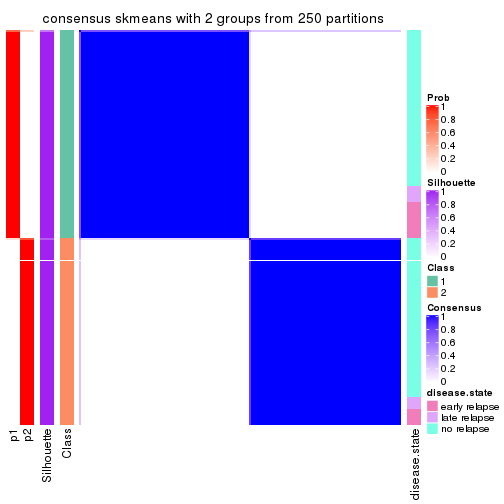</p>

</div>
<div id='tab-ATC-skmeans-consensus-heatmap-2'>
<pre><code class="r">consensus_heatmap(res, k = 3)
</code></pre>

<p>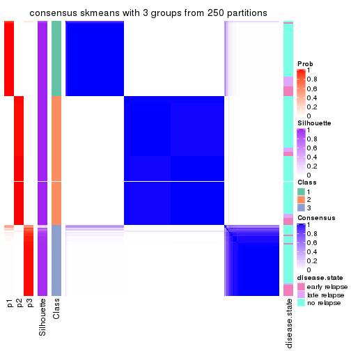</p>

</div>
<div id='tab-ATC-skmeans-consensus-heatmap-3'>
<pre><code class="r">consensus_heatmap(res, k = 4)
</code></pre>

<p>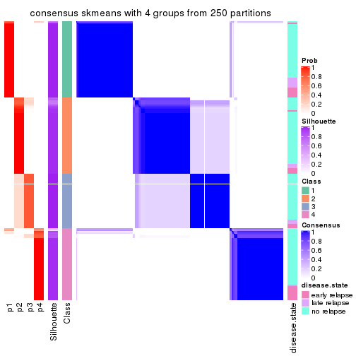</p>

</div>
<div id='tab-ATC-skmeans-consensus-heatmap-4'>
<pre><code class="r">consensus_heatmap(res, k = 5)
</code></pre>

<p>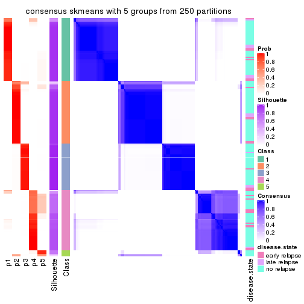</p>

</div>
<div id='tab-ATC-skmeans-consensus-heatmap-5'>
<pre><code class="r">consensus_heatmap(res, k = 6)
</code></pre>

<p>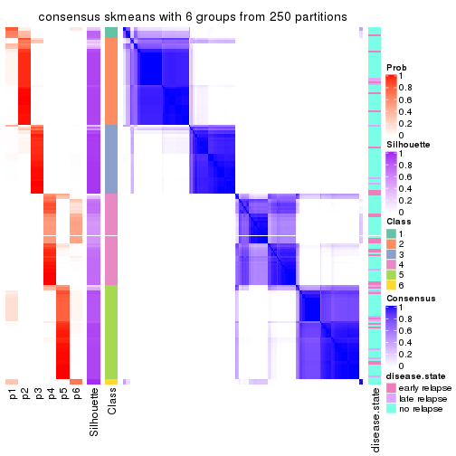</p>

</div>
</div>

Heatmaps for the membership of samples in all partitions to see how consistent they are:


<script>
$( function() {
	$( '#tabs-ATC-skmeans-membership-heatmap' ).tabs();
} );
</script>
<div id='tabs-ATC-skmeans-membership-heatmap'>
<ul>
<li><a href='#tab-ATC-skmeans-membership-heatmap-1'>k = 2</a></li>
<li><a href='#tab-ATC-skmeans-membership-heatmap-2'>k = 3</a></li>
<li><a href='#tab-ATC-skmeans-membership-heatmap-3'>k = 4</a></li>
<li><a href='#tab-ATC-skmeans-membership-heatmap-4'>k = 5</a></li>
<li><a href='#tab-ATC-skmeans-membership-heatmap-5'>k = 6</a></li>
</ul>
<div id='tab-ATC-skmeans-membership-heatmap-1'>
<pre><code class="r">membership_heatmap(res, k = 2)
</code></pre>

<p>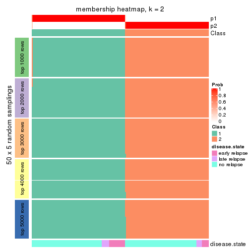</p>

</div>
<div id='tab-ATC-skmeans-membership-heatmap-2'>
<pre><code class="r">membership_heatmap(res, k = 3)
</code></pre>

<p>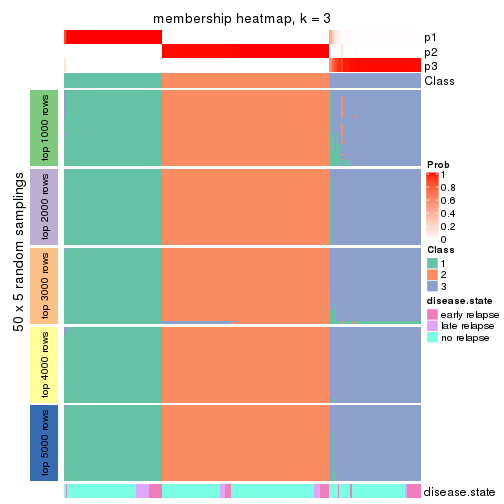</p>

</div>
<div id='tab-ATC-skmeans-membership-heatmap-3'>
<pre><code class="r">membership_heatmap(res, k = 4)
</code></pre>

<p>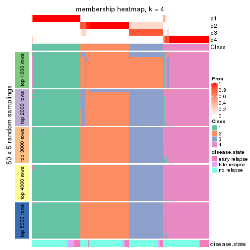</p>

</div>
<div id='tab-ATC-skmeans-membership-heatmap-4'>
<pre><code class="r">membership_heatmap(res, k = 5)
</code></pre>

<p>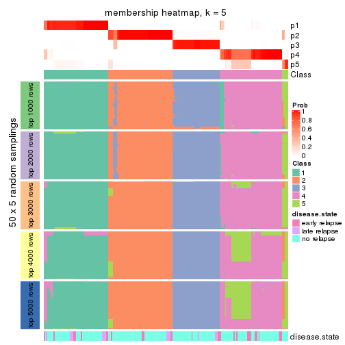</p>

</div>
<div id='tab-ATC-skmeans-membership-heatmap-5'>
<pre><code class="r">membership_heatmap(res, k = 6)
</code></pre>

<p>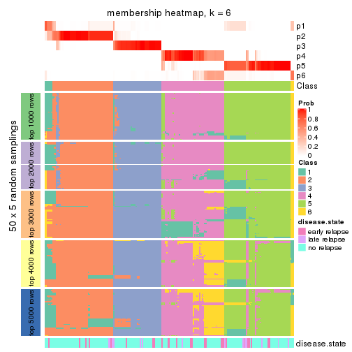</p>

</div>
</div>

As soon as we have had the classes for columns, we can look for signatures
which are significantly different between classes which can be candidate marks
for certain classes. Following are the heatmaps for signatures.


Signature heatmaps where rows are scaled:


<script>
$( function() {
	$( '#tabs-ATC-skmeans-get-signatures' ).tabs();
} );
</script>
<div id='tabs-ATC-skmeans-get-signatures'>
<ul>
<li><a href='#tab-ATC-skmeans-get-signatures-1'>k = 2</a></li>
<li><a href='#tab-ATC-skmeans-get-signatures-2'>k = 3</a></li>
<li><a href='#tab-ATC-skmeans-get-signatures-3'>k = 4</a></li>
<li><a href='#tab-ATC-skmeans-get-signatures-4'>k = 5</a></li>
<li><a href='#tab-ATC-skmeans-get-signatures-5'>k = 6</a></li>
</ul>
<div id='tab-ATC-skmeans-get-signatures-1'>
<pre><code class="r">get_signatures(res, k = 2)
</code></pre>

<p>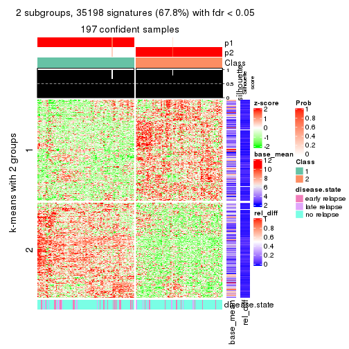</p>

</div>
<div id='tab-ATC-skmeans-get-signatures-2'>
<pre><code class="r">get_signatures(res, k = 3)
</code></pre>

<p>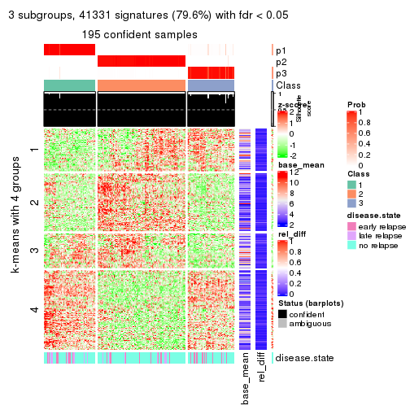</p>

</div>
<div id='tab-ATC-skmeans-get-signatures-3'>
<pre><code class="r">get_signatures(res, k = 4)
</code></pre>

<p>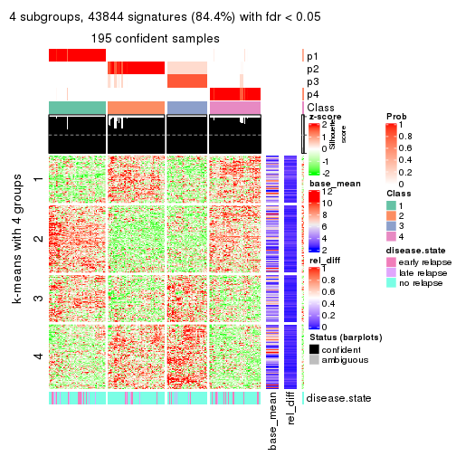</p>

</div>
<div id='tab-ATC-skmeans-get-signatures-4'>
<pre><code class="r">get_signatures(res, k = 5)
</code></pre>

<p>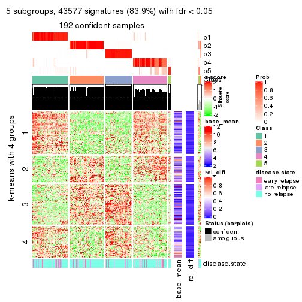</p>

</div>
<div id='tab-ATC-skmeans-get-signatures-5'>
<pre><code class="r">get_signatures(res, k = 6)
</code></pre>

<p>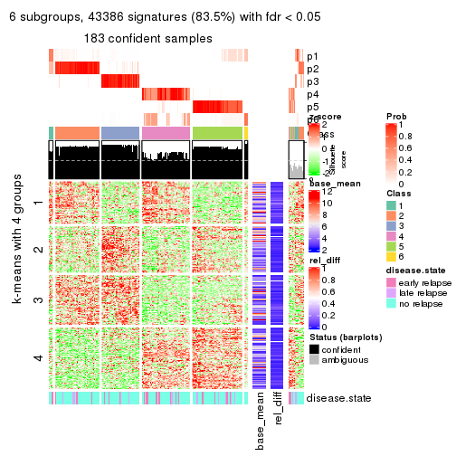</p>

</div>
</div>


Signature heatmaps where rows are not scaled:


<script>
$( function() {
	$( '#tabs-ATC-skmeans-get-signatures-no-scale' ).tabs();
} );
</script>
<div id='tabs-ATC-skmeans-get-signatures-no-scale'>
<ul>
<li><a href='#tab-ATC-skmeans-get-signatures-no-scale-1'>k = 2</a></li>
<li><a href='#tab-ATC-skmeans-get-signatures-no-scale-2'>k = 3</a></li>
<li><a href='#tab-ATC-skmeans-get-signatures-no-scale-3'>k = 4</a></li>
<li><a href='#tab-ATC-skmeans-get-signatures-no-scale-4'>k = 5</a></li>
<li><a href='#tab-ATC-skmeans-get-signatures-no-scale-5'>k = 6</a></li>
</ul>
<div id='tab-ATC-skmeans-get-signatures-no-scale-1'>
<pre><code class="r">get_signatures(res, k = 2, scale_rows = FALSE)
</code></pre>

<p>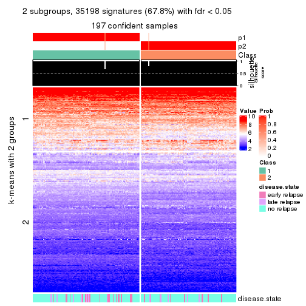</p>

</div>
<div id='tab-ATC-skmeans-get-signatures-no-scale-2'>
<pre><code class="r">get_signatures(res, k = 3, scale_rows = FALSE)
</code></pre>

<p>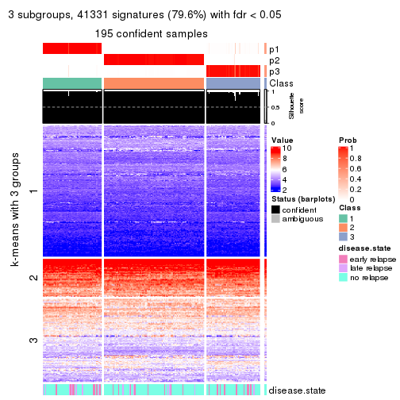</p>

</div>
<div id='tab-ATC-skmeans-get-signatures-no-scale-3'>
<pre><code class="r">get_signatures(res, k = 4, scale_rows = FALSE)
</code></pre>

<p>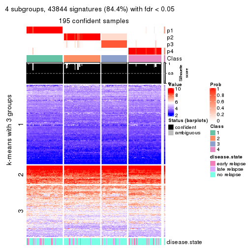</p>

</div>
<div id='tab-ATC-skmeans-get-signatures-no-scale-4'>
<pre><code class="r">get_signatures(res, k = 5, scale_rows = FALSE)
</code></pre>

<p>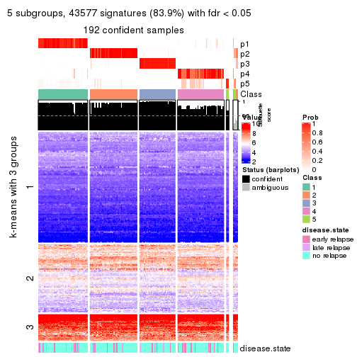</p>

</div>
<div id='tab-ATC-skmeans-get-signatures-no-scale-5'>
<pre><code class="r">get_signatures(res, k = 6, scale_rows = FALSE)
</code></pre>

<p>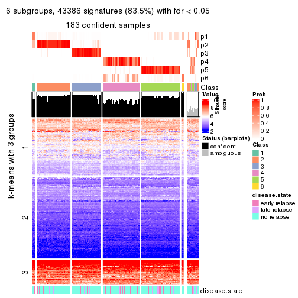</p>

</div>
</div>


Compare the overlap of signatures from different k:

```r
compare_signatures(res)
```

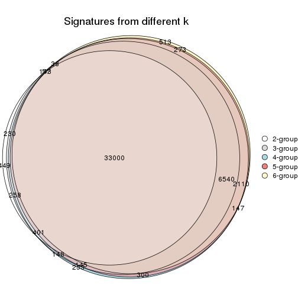

`get_signature()` returns a data frame invisibly. TO get the list of signatures, the function
call should be assigned to a variable explicitly. In following code, if `plot` argument is set
to `FALSE`, no heatmap is plotted while only the differential analysis is performed.

```r
# code only for demonstration
tb = get_signature(res, k = ..., plot = FALSE)
```

An example of the output of `tb` is:

```
#>   which_row         fdr    mean_1    mean_2 scaled_mean_1 scaled_mean_2 km
#> 1        38 0.042760348  8.373488  9.131774    -0.5533452     0.5164555  1
#> 2        40 0.018707592  7.106213  8.469186    -0.6173731     0.5762149  1
#> 3        55 0.019134737 10.221463 11.207825    -0.6159697     0.5749050  1
#> 4        59 0.006059896  5.921854  7.869574    -0.6899429     0.6439467  1
#> 5        60 0.018055526  8.928898 10.211722    -0.6204761     0.5791110  1
#> 6        98 0.009384629 15.714769 14.887706     0.6635654    -0.6193277  2
...
```

The columns in `tb` are:

1. `which_row`: row indices corresponding to the input matrix.
2. `fdr`: FDR for the differential test. 
3. `mean_x`: The mean value in group x.
4. `scaled_mean_x`: The mean value in group x after rows are scaled.
5. `km`: Row groups if k-means clustering is applied to rows.


UMAP plot which shows how samples are separated.


<script>
$( function() {
	$( '#tabs-ATC-skmeans-dimension-reduction' ).tabs();
} );
</script>
<div id='tabs-ATC-skmeans-dimension-reduction'>
<ul>
<li><a href='#tab-ATC-skmeans-dimension-reduction-1'>k = 2</a></li>
<li><a href='#tab-ATC-skmeans-dimension-reduction-2'>k = 3</a></li>
<li><a href='#tab-ATC-skmeans-dimension-reduction-3'>k = 4</a></li>
<li><a href='#tab-ATC-skmeans-dimension-reduction-4'>k = 5</a></li>
<li><a href='#tab-ATC-skmeans-dimension-reduction-5'>k = 6</a></li>
</ul>
<div id='tab-ATC-skmeans-dimension-reduction-1'>
<pre><code class="r">dimension_reduction(res, k = 2, method = &quot;UMAP&quot;)
</code></pre>

<p>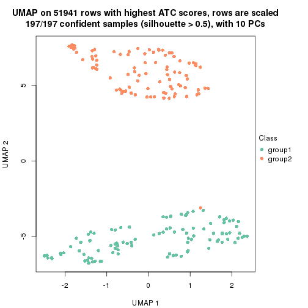</p>

</div>
<div id='tab-ATC-skmeans-dimension-reduction-2'>
<pre><code class="r">dimension_reduction(res, k = 3, method = &quot;UMAP&quot;)
</code></pre>

<p>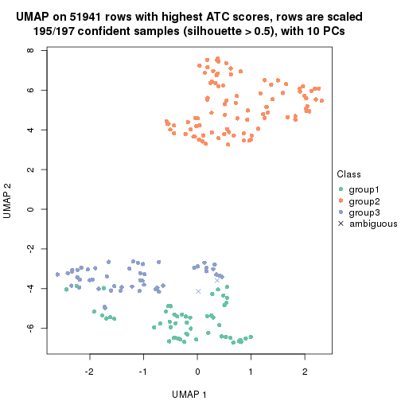</p>

</div>
<div id='tab-ATC-skmeans-dimension-reduction-3'>
<pre><code class="r">dimension_reduction(res, k = 4, method = &quot;UMAP&quot;)
</code></pre>

<p>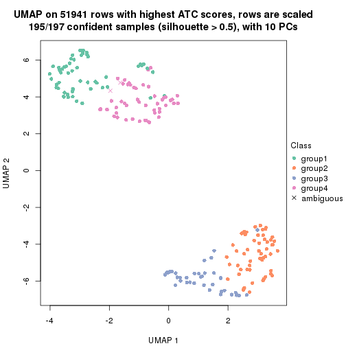</p>

</div>
<div id='tab-ATC-skmeans-dimension-reduction-4'>
<pre><code class="r">dimension_reduction(res, k = 5, method = &quot;UMAP&quot;)
</code></pre>

<p>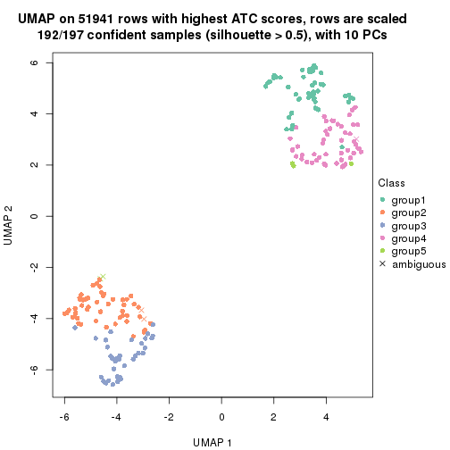</p>

</div>
<div id='tab-ATC-skmeans-dimension-reduction-5'>
<pre><code class="r">dimension_reduction(res, k = 6, method = &quot;UMAP&quot;)
</code></pre>

<p>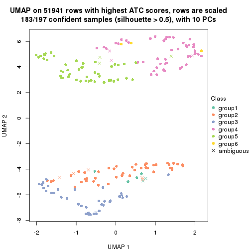</p>

</div>
</div>


Following heatmap shows how subgroups are split when increasing `k`:

```r
collect_classes(res)
```

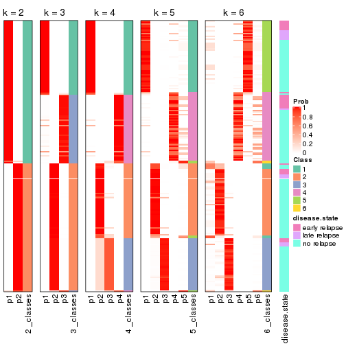


Test correlation between subgroups and known annotations. If the known
annotation is numeric, one-way ANOVA test is applied, and if the known
annotation is discrete, chi-squared contingency table test is applied.

```r
test_to_known_factors(res)
```

```
#>               n disease.state(p) k
#> ATC:skmeans 197           0.1708 2
#> ATC:skmeans 195           0.0751 3
#> ATC:skmeans 195           0.1914 4
#> ATC:skmeans 192           0.3280 5
#> ATC:skmeans 183           0.4936 6
```


If matrix rows can be associated to genes, consider to use `functional_enrichment(res,
...)` to perform function enrichment for the signature genes. See [this vignette](http://bioconductor.org/packages/devel/bioc/vignettes/cola/inst/doc/functional_enrichment.html) for more detailed explanations.


 

---------------------------------------------------


### ATC:pam**


The object with results only for a single top-value method and a single partition method 
can be extracted as:

```r
res = res_list["ATC", "pam"]
# you can also extract it by
# res = res_list["ATC:pam"]
```

A summary of `res` and all the functions that can be applied to it:

```r
res
```

```
#> A 'ConsensusPartition' object with k = 2, 3, 4, 5, 6.
#>   On a matrix with 51941 rows and 197 columns.
#>   Top rows (1000, 2000, 3000, 4000, 5000) are extracted by 'ATC' method.
#>   Subgroups are detected by 'pam' method.
#>   Performed in total 1250 partitions by row resampling.
#>   Best k for subgroups seems to be 3.
#> 
#> Following methods can be applied to this 'ConsensusPartition' object:
#>  [1] "cola_report"             "collect_classes"         "collect_plots"          
#>  [4] "collect_stats"           "colnames"                "compare_signatures"     
#>  [7] "consensus_heatmap"       "dimension_reduction"     "functional_enrichment"  
#> [10] "get_anno_col"            "get_anno"                "get_classes"            
#> [13] "get_consensus"           "get_matrix"              "get_membership"         
#> [16] "get_param"               "get_signatures"          "get_stats"              
#> [19] "is_best_k"               "is_stable_k"             "membership_heatmap"     
#> [22] "ncol"                    "nrow"                    "plot_ecdf"              
#> [25] "rownames"                "select_partition_number" "show"                   
#> [28] "suggest_best_k"          "test_to_known_factors"
```

`collect_plots()` function collects all the plots made from `res` for all `k` (number of partitions)
into one single page to provide an easy and fast comparison between different `k`.

```r
collect_plots(res)
```

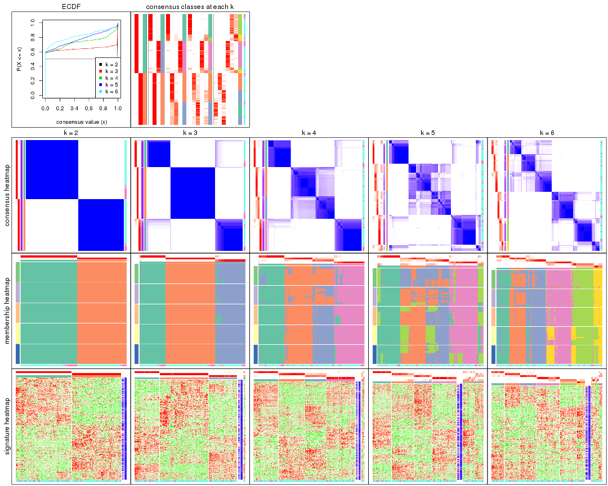

The plots are:

- The first row: a plot of the ECDF (empirical cumulative distribution
  function) curves of the consensus matrix for each `k` and the heatmap of
  predicted classes for each `k`.
- The second row: heatmaps of the consensus matrix for each `k`.
- The third row: heatmaps of the membership matrix for each `k`.
- The fouth row: heatmaps of the signatures for each `k`.

All the plots in panels can be made by individual functions and they are
plotted later in this section.

`select_partition_number()` produces several plots showing different
statistics for choosing "optimized" `k`. There are following statistics:

- ECDF curves of the consensus matrix for each `k`;
- 1-PAC. [The PAC
  score](https://en.wikipedia.org/wiki/Consensus_clustering#Over-interpretation_potential_of_consensus_clustering)
  measures the proportion of the ambiguous subgrouping.
- Mean silhouette score.
- Concordance. The mean probability of fiting the consensus class ids in all
  partitions.
- Area increased. Denote $A_k$ as the area under the ECDF curve for current
  `k`, the area increased is defined as $A_k - A_{k-1}$.
- Rand index. The percent of pairs of samples that are both in a same cluster
  or both are not in a same cluster in the partition of k and k-1.
- Jaccard index. The ratio of pairs of samples are both in a same cluster in
  the partition of k and k-1 and the pairs of samples are both in a same
  cluster in the partition k or k-1.

The detailed explanations of these statistics can be found in [the _cola_
vignette](http://bioconductor.org/packages/devel/bioc/vignettes/cola/inst/doc/cola.html#toc_13).

Generally speaking, lower PAC score, higher mean silhouette score or higher
concordance corresponds to better partition. Rand index and Jaccard index
measure how similar the current partition is compared to partition with `k-1`.
If they are too similar, we won't accept `k` is better than `k-1`.

```r
select_partition_number(res)
```

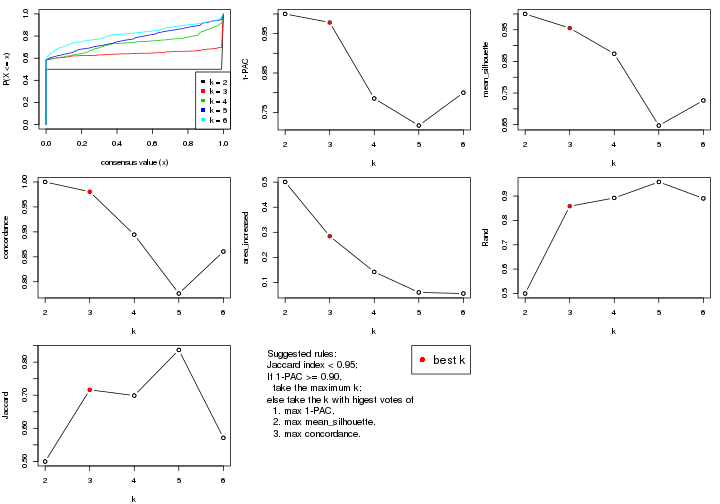

The numeric values for all these statistics can be obtained by `get_stats()`.

```r
get_stats(res)
```

```
#>   k 1-PAC mean_silhouette concordance area_increased  Rand Jaccard
#> 2 2 1.000           1.000       1.000         0.5009 0.500   0.500
#> 3 3 0.978           0.955       0.980         0.2845 0.858   0.716
#> 4 4 0.785           0.874       0.894         0.1421 0.892   0.699
#> 5 5 0.717           0.647       0.776         0.0602 0.958   0.837
#> 6 6 0.800           0.727       0.861         0.0558 0.890   0.571
```

`suggest_best_k()` suggests the best $k$ based on these statistics. The rules are as follows:

- All $k$ with Jaccard index larger than 0.95 are removed because increasing
  $k$ does not provide enough extra information. If all $k$ are removed, it is
  marked as no subgroup is detected.
- For all $k$ with 1-PAC score larger than 0.9, the maximal $k$ is taken as
  the best $k$, and other $k$ are marked as optional $k$.
- If it does not fit the second rule. The $k$ with the maximal vote of the
  highest 1-PAC score, highest mean silhouette, and highest concordance is
  taken as the best $k$.

```r
suggest_best_k(res)
```

```
#> [1] 3
#> attr(,"optional")
#> [1] 2
```

There is also optional best $k$ = 2 that is worth to check.

Following shows the table of the partitions (You need to click the **show/hide
code output** link to see it). The membership matrix (columns with name `p*`)
is inferred by
[`clue::cl_consensus()`](https://www.rdocumentation.org/link/cl_consensus?package=clue)
function with the `SE` method. Basically the value in the membership matrix
represents the probability to belong to a certain group. The finall class
label for an item is determined with the group with highest probability it
belongs to.

In `get_classes()` function, the entropy is calculated from the membership
matrix and the silhouette score is calculated from the consensus matrix.


<script>
$( function() {
	$( '#tabs-ATC-pam-get-classes' ).tabs();
} );
</script>
<div id='tabs-ATC-pam-get-classes'>
<ul>
<li><a href='#tab-ATC-pam-get-classes-1'>k = 2</a></li>
<li><a href='#tab-ATC-pam-get-classes-2'>k = 3</a></li>
<li><a href='#tab-ATC-pam-get-classes-3'>k = 4</a></li>
<li><a href='#tab-ATC-pam-get-classes-4'>k = 5</a></li>
<li><a href='#tab-ATC-pam-get-classes-5'>k = 6</a></li>
</ul>

<div id='tab-ATC-pam-get-classes-1'>
<p><a id='tab-ATC-pam-get-classes-1-a' style='color:#0366d6' href='#'>show/hide code output</a></p>
<pre><code class="r">cbind(get_classes(res, k = 2), get_membership(res, k = 2))
</code></pre>

<pre><code>#&gt;           class entropy silhouette p1 p2
#&gt; GSM342319     1       0          1  1  0
#&gt; GSM342323     1       0          1  1  0
#&gt; GSM342325     1       0          1  1  0
#&gt; GSM342326     1       0          1  1  0
#&gt; GSM342327     1       0          1  1  0
#&gt; GSM342329     1       0          1  1  0
#&gt; GSM342331     1       0          1  1  0
#&gt; GSM342334     1       0          1  1  0
#&gt; GSM342335     1       0          1  1  0
#&gt; GSM342354     1       0          1  1  0
#&gt; GSM342371     1       0          1  1  0
#&gt; GSM342380     1       0          1  1  0
#&gt; GSM342382     1       0          1  1  0
#&gt; GSM342399     1       0          1  1  0
#&gt; GSM342402     1       0          1  1  0
#&gt; GSM342404     1       0          1  1  0
#&gt; GSM342408     1       0          1  1  0
#&gt; GSM342409     1       0          1  1  0
#&gt; GSM342426     2       0          1  0  1
#&gt; GSM342441     2       0          1  0  1
#&gt; GSM342444     2       0          1  0  1
#&gt; GSM342451     2       0          1  0  1
#&gt; GSM342462     2       0          1  0  1
#&gt; GSM342467     2       0          1  0  1
#&gt; GSM342484     2       0          1  0  1
#&gt; GSM342491     2       0          1  0  1
#&gt; GSM342322     1       0          1  1  0
#&gt; GSM342338     1       0          1  1  0
#&gt; GSM342347     1       0          1  1  0
#&gt; GSM342356     1       0          1  1  0
#&gt; GSM342357     1       0          1  1  0
#&gt; GSM342366     1       0          1  1  0
#&gt; GSM342385     1       0          1  1  0
#&gt; GSM342421     1       0          1  1  0
#&gt; GSM342437     2       0          1  0  1
#&gt; GSM342454     2       0          1  0  1
#&gt; GSM342471     2       0          1  0  1
#&gt; GSM342477     2       0          1  0  1
#&gt; GSM342495     2       0          1  0  1
#&gt; GSM342496     2       0          1  0  1
#&gt; GSM342320     1       0          1  1  0
#&gt; GSM342321     1       0          1  1  0
#&gt; GSM342324     1       0          1  1  0
#&gt; GSM342328     1       0          1  1  0
#&gt; GSM342330     1       0          1  1  0
#&gt; GSM342332     1       0          1  1  0
#&gt; GSM342333     1       0          1  1  0
#&gt; GSM342336     1       0          1  1  0
#&gt; GSM342337     1       0          1  1  0
#&gt; GSM342339     1       0          1  1  0
#&gt; GSM342340     1       0          1  1  0
#&gt; GSM342341     1       0          1  1  0
#&gt; GSM342342     1       0          1  1  0
#&gt; GSM342343     1       0          1  1  0
#&gt; GSM342344     1       0          1  1  0
#&gt; GSM342345     1       0          1  1  0
#&gt; GSM342346     1       0          1  1  0
#&gt; GSM342348     1       0          1  1  0
#&gt; GSM342349     1       0          1  1  0
#&gt; GSM342350     1       0          1  1  0
#&gt; GSM342351     1       0          1  1  0
#&gt; GSM342352     1       0          1  1  0
#&gt; GSM342353     1       0          1  1  0
#&gt; GSM342355     1       0          1  1  0
#&gt; GSM342358     1       0          1  1  0
#&gt; GSM342359     1       0          1  1  0
#&gt; GSM342360     1       0          1  1  0
#&gt; GSM342361     1       0          1  1  0
#&gt; GSM342362     1       0          1  1  0
#&gt; GSM342363     1       0          1  1  0
#&gt; GSM342364     1       0          1  1  0
#&gt; GSM342365     1       0          1  1  0
#&gt; GSM342367     1       0          1  1  0
#&gt; GSM342368     1       0          1  1  0
#&gt; GSM342369     1       0          1  1  0
#&gt; GSM342370     1       0          1  1  0
#&gt; GSM342372     1       0          1  1  0
#&gt; GSM342373     1       0          1  1  0
#&gt; GSM342374     1       0          1  1  0
#&gt; GSM342375     1       0          1  1  0
#&gt; GSM342376     1       0          1  1  0
#&gt; GSM342377     1       0          1  1  0
#&gt; GSM342378     1       0          1  1  0
#&gt; GSM342379     1       0          1  1  0
#&gt; GSM342381     1       0          1  1  0
#&gt; GSM342383     1       0          1  1  0
#&gt; GSM342384     1       0          1  1  0
#&gt; GSM342386     1       0          1  1  0
#&gt; GSM342387     1       0          1  1  0
#&gt; GSM342388     1       0          1  1  0
#&gt; GSM342389     1       0          1  1  0
#&gt; GSM342390     1       0          1  1  0
#&gt; GSM342391     1       0          1  1  0
#&gt; GSM342392     1       0          1  1  0
#&gt; GSM342393     1       0          1  1  0
#&gt; GSM342394     1       0          1  1  0
#&gt; GSM342395     1       0          1  1  0
#&gt; GSM342396     1       0          1  1  0
#&gt; GSM342397     1       0          1  1  0
#&gt; GSM342398     1       0          1  1  0
#&gt; GSM342400     1       0          1  1  0
#&gt; GSM342401     1       0          1  1  0
#&gt; GSM342403     1       0          1  1  0
#&gt; GSM342405     1       0          1  1  0
#&gt; GSM342406     1       0          1  1  0
#&gt; GSM342407     1       0          1  1  0
#&gt; GSM342410     1       0          1  1  0
#&gt; GSM342411     1       0          1  1  0
#&gt; GSM342412     1       0          1  1  0
#&gt; GSM342413     1       0          1  1  0
#&gt; GSM342414     1       0          1  1  0
#&gt; GSM342415     1       0          1  1  0
#&gt; GSM342416     1       0          1  1  0
#&gt; GSM342417     1       0          1  1  0
#&gt; GSM342418     1       0          1  1  0
#&gt; GSM342419     1       0          1  1  0
#&gt; GSM342420     1       0          1  1  0
#&gt; GSM342422     1       0          1  1  0
#&gt; GSM342423     1       0          1  1  0
#&gt; GSM342424     2       0          1  0  1
#&gt; GSM342425     2       0          1  0  1
#&gt; GSM342427     2       0          1  0  1
#&gt; GSM342428     2       0          1  0  1
#&gt; GSM342429     2       0          1  0  1
#&gt; GSM342430     2       0          1  0  1
#&gt; GSM342431     2       0          1  0  1
#&gt; GSM342432     2       0          1  0  1
#&gt; GSM342433     2       0          1  0  1
#&gt; GSM342434     2       0          1  0  1
#&gt; GSM342435     2       0          1  0  1
#&gt; GSM342436     2       0          1  0  1
#&gt; GSM342438     2       0          1  0  1
#&gt; GSM342439     2       0          1  0  1
#&gt; GSM342440     2       0          1  0  1
#&gt; GSM342442     2       0          1  0  1
#&gt; GSM342443     2       0          1  0  1
#&gt; GSM342445     2       0          1  0  1
#&gt; GSM342446     2       0          1  0  1
#&gt; GSM342447     2       0          1  0  1
#&gt; GSM342448     2       0          1  0  1
#&gt; GSM342449     2       0          1  0  1
#&gt; GSM342450     2       0          1  0  1
#&gt; GSM342452     2       0          1  0  1
#&gt; GSM342453     2       0          1  0  1
#&gt; GSM342455     2       0          1  0  1
#&gt; GSM342456     2       0          1  0  1
#&gt; GSM342457     2       0          1  0  1
#&gt; GSM342458     2       0          1  0  1
#&gt; GSM342459     2       0          1  0  1
#&gt; GSM342460     2       0          1  0  1
#&gt; GSM342461     2       0          1  0  1
#&gt; GSM342463     2       0          1  0  1
#&gt; GSM342464     2       0          1  0  1
#&gt; GSM342465     2       0          1  0  1
#&gt; GSM342466     2       0          1  0  1
#&gt; GSM342468     2       0          1  0  1
#&gt; GSM342469     2       0          1  0  1
#&gt; GSM342470     2       0          1  0  1
#&gt; GSM342472     2       0          1  0  1
#&gt; GSM342473     2       0          1  0  1
#&gt; GSM342474     2       0          1  0  1
#&gt; GSM342475     2       0          1  0  1
#&gt; GSM342476     2       0          1  0  1
#&gt; GSM342478     2       0          1  0  1
#&gt; GSM342479     2       0          1  0  1
#&gt; GSM342480     2       0          1  0  1
#&gt; GSM342481     2       0          1  0  1
#&gt; GSM342482     2       0          1  0  1
#&gt; GSM342483     2       0          1  0  1
#&gt; GSM342485     2       0          1  0  1
#&gt; GSM342486     2       0          1  0  1
#&gt; GSM342487     2       0          1  0  1
#&gt; GSM342488     2       0          1  0  1
#&gt; GSM342489     2       0          1  0  1
#&gt; GSM342490     2       0          1  0  1
#&gt; GSM342492     2       0          1  0  1
#&gt; GSM342493     2       0          1  0  1
#&gt; GSM342494     2       0          1  0  1
#&gt; GSM342497     2       0          1  0  1
#&gt; GSM342498     2       0          1  0  1
#&gt; GSM342499     2       0          1  0  1
#&gt; GSM342500     2       0          1  0  1
#&gt; GSM342501     2       0          1  0  1
#&gt; GSM342502     2       0          1  0  1
#&gt; GSM342503     2       0          1  0  1
#&gt; GSM342504     2       0          1  0  1
#&gt; GSM342505     2       0          1  0  1
#&gt; GSM342506     2       0          1  0  1
#&gt; GSM342507     2       0          1  0  1
#&gt; GSM342508     2       0          1  0  1
#&gt; GSM342509     2       0          1  0  1
#&gt; GSM342510     2       0          1  0  1
#&gt; GSM342511     2       0          1  0  1
#&gt; GSM342512     2       0          1  0  1
#&gt; GSM342513     2       0          1  0  1
#&gt; GSM342514     2       0          1  0  1
#&gt; GSM342515     2       0          1  0  1
</code></pre>

<script>
$('#tab-ATC-pam-get-classes-1-a').parent().next().next().hide();
$('#tab-ATC-pam-get-classes-1-a').click(function(){
  $('#tab-ATC-pam-get-classes-1-a').parent().next().next().toggle();
  return(false);
});
</script>
</div>

<div id='tab-ATC-pam-get-classes-2'>
<p><a id='tab-ATC-pam-get-classes-2-a' style='color:#0366d6' href='#'>show/hide code output</a></p>
<pre><code class="r">cbind(get_classes(res, k = 3), get_membership(res, k = 3))
</code></pre>

<pre><code>#&gt;           class entropy silhouette    p1    p2    p3
#&gt; GSM342319     1  0.0000      0.984 1.000 0.000 0.000
#&gt; GSM342323     3  0.1529      0.925 0.040 0.000 0.960
#&gt; GSM342325     1  0.0000      0.984 1.000 0.000 0.000
#&gt; GSM342326     3  0.0000      0.947 0.000 0.000 1.000
#&gt; GSM342327     3  0.0000      0.947 0.000 0.000 1.000
#&gt; GSM342329     1  0.0000      0.984 1.000 0.000 0.000
#&gt; GSM342331     3  0.0000      0.947 0.000 0.000 1.000
#&gt; GSM342334     3  0.0000      0.947 0.000 0.000 1.000
#&gt; GSM342335     1  0.0000      0.984 1.000 0.000 0.000
#&gt; GSM342354     3  0.0000      0.947 0.000 0.000 1.000
#&gt; GSM342371     3  0.3192      0.866 0.112 0.000 0.888
#&gt; GSM342380     1  0.0000      0.984 1.000 0.000 0.000
#&gt; GSM342382     1  0.0000      0.984 1.000 0.000 0.000
#&gt; GSM342399     1  0.0000      0.984 1.000 0.000 0.000
#&gt; GSM342402     1  0.0000      0.984 1.000 0.000 0.000
#&gt; GSM342404     3  0.0000      0.947 0.000 0.000 1.000
#&gt; GSM342408     3  0.0000      0.947 0.000 0.000 1.000
#&gt; GSM342409     3  0.3116      0.869 0.108 0.000 0.892
#&gt; GSM342426     2  0.0000      0.996 0.000 1.000 0.000
#&gt; GSM342441     2  0.0000      0.996 0.000 1.000 0.000
#&gt; GSM342444     2  0.0000      0.996 0.000 1.000 0.000
#&gt; GSM342451     2  0.0000      0.996 0.000 1.000 0.000
#&gt; GSM342462     2  0.0000      0.996 0.000 1.000 0.000
#&gt; GSM342467     2  0.0000      0.996 0.000 1.000 0.000
#&gt; GSM342484     2  0.0000      0.996 0.000 1.000 0.000
#&gt; GSM342491     2  0.0000      0.996 0.000 1.000 0.000
#&gt; GSM342322     1  0.0000      0.984 1.000 0.000 0.000
#&gt; GSM342338     1  0.0000      0.984 1.000 0.000 0.000
#&gt; GSM342347     1  0.0000      0.984 1.000 0.000 0.000
#&gt; GSM342356     1  0.0000      0.984 1.000 0.000 0.000
#&gt; GSM342357     1  0.1964      0.930 0.944 0.000 0.056
#&gt; GSM342366     1  0.0000      0.984 1.000 0.000 0.000
#&gt; GSM342385     1  0.0000      0.984 1.000 0.000 0.000
#&gt; GSM342421     3  0.0000      0.947 0.000 0.000 1.000
#&gt; GSM342437     2  0.0000      0.996 0.000 1.000 0.000
#&gt; GSM342454     2  0.0000      0.996 0.000 1.000 0.000
#&gt; GSM342471     2  0.0000      0.996 0.000 1.000 0.000
#&gt; GSM342477     2  0.0000      0.996 0.000 1.000 0.000
#&gt; GSM342495     2  0.0000      0.996 0.000 1.000 0.000
#&gt; GSM342496     2  0.0000      0.996 0.000 1.000 0.000
#&gt; GSM342320     3  0.0000      0.947 0.000 0.000 1.000
#&gt; GSM342321     3  0.6168      0.366 0.412 0.000 0.588
#&gt; GSM342324     3  0.0000      0.947 0.000 0.000 1.000
#&gt; GSM342328     3  0.0000      0.947 0.000 0.000 1.000
#&gt; GSM342330     3  0.0000      0.947 0.000 0.000 1.000
#&gt; GSM342332     3  0.0000      0.947 0.000 0.000 1.000
#&gt; GSM342333     3  0.3551      0.848 0.132 0.000 0.868
#&gt; GSM342336     3  0.0000      0.947 0.000 0.000 1.000
#&gt; GSM342337     1  0.0000      0.984 1.000 0.000 0.000
#&gt; GSM342339     3  0.5926      0.459 0.356 0.000 0.644
#&gt; GSM342340     1  0.0000      0.984 1.000 0.000 0.000
#&gt; GSM342341     3  0.4346      0.769 0.184 0.000 0.816
#&gt; GSM342342     1  0.0000      0.984 1.000 0.000 0.000
#&gt; GSM342343     1  0.0000      0.984 1.000 0.000 0.000
#&gt; GSM342344     3  0.0237      0.945 0.004 0.000 0.996
#&gt; GSM342345     3  0.5465      0.629 0.288 0.000 0.712
#&gt; GSM342346     3  0.0000      0.947 0.000 0.000 1.000
#&gt; GSM342348     3  0.0000      0.947 0.000 0.000 1.000
#&gt; GSM342349     3  0.0000      0.947 0.000 0.000 1.000
#&gt; GSM342350     3  0.6305      0.142 0.484 0.000 0.516
#&gt; GSM342351     3  0.0000      0.947 0.000 0.000 1.000
#&gt; GSM342352     3  0.0000      0.947 0.000 0.000 1.000
#&gt; GSM342353     3  0.0000      0.947 0.000 0.000 1.000
#&gt; GSM342355     1  0.0000      0.984 1.000 0.000 0.000
#&gt; GSM342358     3  0.0000      0.947 0.000 0.000 1.000
#&gt; GSM342359     3  0.0000      0.947 0.000 0.000 1.000
#&gt; GSM342360     3  0.0000      0.947 0.000 0.000 1.000
#&gt; GSM342361     3  0.0000      0.947 0.000 0.000 1.000
#&gt; GSM342362     3  0.2796      0.883 0.092 0.000 0.908
#&gt; GSM342363     1  0.0000      0.984 1.000 0.000 0.000
#&gt; GSM342364     1  0.0000      0.984 1.000 0.000 0.000
#&gt; GSM342365     3  0.0000      0.947 0.000 0.000 1.000
#&gt; GSM342367     1  0.0000      0.984 1.000 0.000 0.000
#&gt; GSM342368     3  0.5465      0.636 0.288 0.000 0.712
#&gt; GSM342369     3  0.1860      0.917 0.052 0.000 0.948
#&gt; GSM342370     3  0.0000      0.947 0.000 0.000 1.000
#&gt; GSM342372     3  0.0000      0.947 0.000 0.000 1.000
#&gt; GSM342373     3  0.0000      0.947 0.000 0.000 1.000
#&gt; GSM342374     3  0.1163      0.932 0.028 0.000 0.972
#&gt; GSM342375     3  0.1163      0.932 0.028 0.000 0.972
#&gt; GSM342376     1  0.0000      0.984 1.000 0.000 0.000
#&gt; GSM342377     1  0.0000      0.984 1.000 0.000 0.000
#&gt; GSM342378     1  0.0000      0.984 1.000 0.000 0.000
#&gt; GSM342379     1  0.0000      0.984 1.000 0.000 0.000
#&gt; GSM342381     1  0.0000      0.984 1.000 0.000 0.000
#&gt; GSM342383     1  0.0000      0.984 1.000 0.000 0.000
#&gt; GSM342384     1  0.0000      0.984 1.000 0.000 0.000
#&gt; GSM342386     1  0.0000      0.984 1.000 0.000 0.000
#&gt; GSM342387     3  0.0000      0.947 0.000 0.000 1.000
#&gt; GSM342388     1  0.0000      0.984 1.000 0.000 0.000
#&gt; GSM342389     1  0.0000      0.984 1.000 0.000 0.000
#&gt; GSM342390     1  0.0000      0.984 1.000 0.000 0.000
#&gt; GSM342391     1  0.3412      0.845 0.876 0.000 0.124
#&gt; GSM342392     1  0.0000      0.984 1.000 0.000 0.000
#&gt; GSM342393     3  0.0000      0.947 0.000 0.000 1.000
#&gt; GSM342394     1  0.0000      0.984 1.000 0.000 0.000
#&gt; GSM342395     3  0.3752      0.836 0.144 0.000 0.856
#&gt; GSM342396     1  0.0000      0.984 1.000 0.000 0.000
#&gt; GSM342397     3  0.1411      0.927 0.036 0.000 0.964
#&gt; GSM342398     1  0.0000      0.984 1.000 0.000 0.000
#&gt; GSM342400     1  0.0000      0.984 1.000 0.000 0.000
#&gt; GSM342401     1  0.0000      0.984 1.000 0.000 0.000
#&gt; GSM342403     1  0.0000      0.984 1.000 0.000 0.000
#&gt; GSM342405     3  0.0000      0.947 0.000 0.000 1.000
#&gt; GSM342406     1  0.0000      0.984 1.000 0.000 0.000
#&gt; GSM342407     3  0.0000      0.947 0.000 0.000 1.000
#&gt; GSM342410     1  0.0000      0.984 1.000 0.000 0.000
#&gt; GSM342411     3  0.0000      0.947 0.000 0.000 1.000
#&gt; GSM342412     1  0.5968      0.368 0.636 0.000 0.364
#&gt; GSM342413     3  0.0000      0.947 0.000 0.000 1.000
#&gt; GSM342414     3  0.0000      0.947 0.000 0.000 1.000
#&gt; GSM342415     1  0.0000      0.984 1.000 0.000 0.000
#&gt; GSM342416     3  0.2356      0.900 0.072 0.000 0.928
#&gt; GSM342417     3  0.0000      0.947 0.000 0.000 1.000
#&gt; GSM342418     3  0.0000      0.947 0.000 0.000 1.000
#&gt; GSM342419     1  0.3482      0.839 0.872 0.000 0.128
#&gt; GSM342420     3  0.0000      0.947 0.000 0.000 1.000
#&gt; GSM342422     1  0.0000      0.984 1.000 0.000 0.000
#&gt; GSM342423     3  0.0000      0.947 0.000 0.000 1.000
#&gt; GSM342424     2  0.0000      0.996 0.000 1.000 0.000
#&gt; GSM342425     2  0.0000      0.996 0.000 1.000 0.000
#&gt; GSM342427     2  0.0000      0.996 0.000 1.000 0.000
#&gt; GSM342428     2  0.0000      0.996 0.000 1.000 0.000
#&gt; GSM342429     2  0.0000      0.996 0.000 1.000 0.000
#&gt; GSM342430     2  0.0000      0.996 0.000 1.000 0.000
#&gt; GSM342431     2  0.0000      0.996 0.000 1.000 0.000
#&gt; GSM342432     2  0.0000      0.996 0.000 1.000 0.000
#&gt; GSM342433     2  0.0000      0.996 0.000 1.000 0.000
#&gt; GSM342434     2  0.0000      0.996 0.000 1.000 0.000
#&gt; GSM342435     2  0.0000      0.996 0.000 1.000 0.000
#&gt; GSM342436     2  0.0000      0.996 0.000 1.000 0.000
#&gt; GSM342438     2  0.0000      0.996 0.000 1.000 0.000
#&gt; GSM342439     2  0.0000      0.996 0.000 1.000 0.000
#&gt; GSM342440     2  0.0000      0.996 0.000 1.000 0.000
#&gt; GSM342442     2  0.0000      0.996 0.000 1.000 0.000
#&gt; GSM342443     2  0.0000      0.996 0.000 1.000 0.000
#&gt; GSM342445     2  0.0000      0.996 0.000 1.000 0.000
#&gt; GSM342446     2  0.0000      0.996 0.000 1.000 0.000
#&gt; GSM342447     2  0.0000      0.996 0.000 1.000 0.000
#&gt; GSM342448     2  0.0000      0.996 0.000 1.000 0.000
#&gt; GSM342449     2  0.0000      0.996 0.000 1.000 0.000
#&gt; GSM342450     2  0.0000      0.996 0.000 1.000 0.000
#&gt; GSM342452     2  0.0000      0.996 0.000 1.000 0.000
#&gt; GSM342453     2  0.0000      0.996 0.000 1.000 0.000
#&gt; GSM342455     2  0.0000      0.996 0.000 1.000 0.000
#&gt; GSM342456     2  0.0000      0.996 0.000 1.000 0.000
#&gt; GSM342457     2  0.0000      0.996 0.000 1.000 0.000
#&gt; GSM342458     2  0.0000      0.996 0.000 1.000 0.000
#&gt; GSM342459     2  0.0000      0.996 0.000 1.000 0.000
#&gt; GSM342460     2  0.0000      0.996 0.000 1.000 0.000
#&gt; GSM342461     2  0.0000      0.996 0.000 1.000 0.000
#&gt; GSM342463     2  0.0000      0.996 0.000 1.000 0.000
#&gt; GSM342464     2  0.0000      0.996 0.000 1.000 0.000
#&gt; GSM342465     2  0.0000      0.996 0.000 1.000 0.000
#&gt; GSM342466     2  0.0000      0.996 0.000 1.000 0.000
#&gt; GSM342468     2  0.5733      0.513 0.000 0.676 0.324
#&gt; GSM342469     2  0.0000      0.996 0.000 1.000 0.000
#&gt; GSM342470     2  0.0000      0.996 0.000 1.000 0.000
#&gt; GSM342472     2  0.0000      0.996 0.000 1.000 0.000
#&gt; GSM342473     2  0.0000      0.996 0.000 1.000 0.000
#&gt; GSM342474     2  0.0000      0.996 0.000 1.000 0.000
#&gt; GSM342475     2  0.0000      0.996 0.000 1.000 0.000
#&gt; GSM342476     2  0.0000      0.996 0.000 1.000 0.000
#&gt; GSM342478     2  0.0000      0.996 0.000 1.000 0.000
#&gt; GSM342479     2  0.0000      0.996 0.000 1.000 0.000
#&gt; GSM342480     2  0.0000      0.996 0.000 1.000 0.000
#&gt; GSM342481     2  0.0000      0.996 0.000 1.000 0.000
#&gt; GSM342482     2  0.0000      0.996 0.000 1.000 0.000
#&gt; GSM342483     2  0.0000      0.996 0.000 1.000 0.000
#&gt; GSM342485     2  0.0000      0.996 0.000 1.000 0.000
#&gt; GSM342486     2  0.0000      0.996 0.000 1.000 0.000
#&gt; GSM342487     2  0.0000      0.996 0.000 1.000 0.000
#&gt; GSM342488     2  0.0000      0.996 0.000 1.000 0.000
#&gt; GSM342489     2  0.0000      0.996 0.000 1.000 0.000
#&gt; GSM342490     2  0.0000      0.996 0.000 1.000 0.000
#&gt; GSM342492     2  0.0000      0.996 0.000 1.000 0.000
#&gt; GSM342493     2  0.0000      0.996 0.000 1.000 0.000
#&gt; GSM342494     2  0.0000      0.996 0.000 1.000 0.000
#&gt; GSM342497     2  0.0000      0.996 0.000 1.000 0.000
#&gt; GSM342498     2  0.0000      0.996 0.000 1.000 0.000
#&gt; GSM342499     2  0.0000      0.996 0.000 1.000 0.000
#&gt; GSM342500     2  0.0000      0.996 0.000 1.000 0.000
#&gt; GSM342501     2  0.0000      0.996 0.000 1.000 0.000
#&gt; GSM342502     2  0.0000      0.996 0.000 1.000 0.000
#&gt; GSM342503     2  0.0000      0.996 0.000 1.000 0.000
#&gt; GSM342504     2  0.0000      0.996 0.000 1.000 0.000
#&gt; GSM342505     2  0.0000      0.996 0.000 1.000 0.000
#&gt; GSM342506     2  0.0000      0.996 0.000 1.000 0.000
#&gt; GSM342507     2  0.0000      0.996 0.000 1.000 0.000
#&gt; GSM342508     2  0.0000      0.996 0.000 1.000 0.000
#&gt; GSM342509     2  0.0000      0.996 0.000 1.000 0.000
#&gt; GSM342510     2  0.0000      0.996 0.000 1.000 0.000
#&gt; GSM342511     2  0.0000      0.996 0.000 1.000 0.000
#&gt; GSM342512     2  0.0000      0.996 0.000 1.000 0.000
#&gt; GSM342513     2  0.0000      0.996 0.000 1.000 0.000
#&gt; GSM342514     2  0.0000      0.996 0.000 1.000 0.000
#&gt; GSM342515     2  0.0000      0.996 0.000 1.000 0.000
</code></pre>

<script>
$('#tab-ATC-pam-get-classes-2-a').parent().next().next().hide();
$('#tab-ATC-pam-get-classes-2-a').click(function(){
  $('#tab-ATC-pam-get-classes-2-a').parent().next().next().toggle();
  return(false);
});
</script>
</div>

<div id='tab-ATC-pam-get-classes-3'>
<p><a id='tab-ATC-pam-get-classes-3-a' style='color:#0366d6' href='#'>show/hide code output</a></p>
<pre><code class="r">cbind(get_classes(res, k = 4), get_membership(res, k = 4))
</code></pre>

<pre><code>#&gt;           class entropy silhouette    p1    p2    p3    p4
#&gt; GSM342319     1  0.0000     0.9615 1.000 0.000 0.000 0.000
#&gt; GSM342323     4  0.3335     0.8589 0.016 0.000 0.128 0.856
#&gt; GSM342325     1  0.0000     0.9615 1.000 0.000 0.000 0.000
#&gt; GSM342326     4  0.0000     0.9386 0.000 0.000 0.000 1.000
#&gt; GSM342327     4  0.0000     0.9386 0.000 0.000 0.000 1.000
#&gt; GSM342329     1  0.2814     0.9060 0.868 0.000 0.132 0.000
#&gt; GSM342331     4  0.0000     0.9386 0.000 0.000 0.000 1.000
#&gt; GSM342334     4  0.0000     0.9386 0.000 0.000 0.000 1.000
#&gt; GSM342335     1  0.2814     0.9060 0.868 0.000 0.132 0.000
#&gt; GSM342354     4  0.0000     0.9386 0.000 0.000 0.000 1.000
#&gt; GSM342371     4  0.2469     0.8654 0.108 0.000 0.000 0.892
#&gt; GSM342380     1  0.0000     0.9615 1.000 0.000 0.000 0.000
#&gt; GSM342382     1  0.0000     0.9615 1.000 0.000 0.000 0.000
#&gt; GSM342399     1  0.0000     0.9615 1.000 0.000 0.000 0.000
#&gt; GSM342402     1  0.0000     0.9615 1.000 0.000 0.000 0.000
#&gt; GSM342404     4  0.0000     0.9386 0.000 0.000 0.000 1.000
#&gt; GSM342408     4  0.0000     0.9386 0.000 0.000 0.000 1.000
#&gt; GSM342409     4  0.2469     0.8654 0.108 0.000 0.000 0.892
#&gt; GSM342426     2  0.1211     0.8828 0.000 0.960 0.040 0.000
#&gt; GSM342441     2  0.0817     0.9023 0.000 0.976 0.024 0.000
#&gt; GSM342444     3  0.3975     0.9096 0.000 0.240 0.760 0.000
#&gt; GSM342451     3  0.3975     0.9096 0.000 0.240 0.760 0.000
#&gt; GSM342462     2  0.4817    -0.0894 0.000 0.612 0.388 0.000
#&gt; GSM342467     2  0.2760     0.8153 0.000 0.872 0.128 0.000
#&gt; GSM342484     3  0.4776     0.8177 0.000 0.376 0.624 0.000
#&gt; GSM342491     2  0.0000     0.9062 0.000 1.000 0.000 0.000
#&gt; GSM342322     1  0.0000     0.9615 1.000 0.000 0.000 0.000
#&gt; GSM342338     1  0.2814     0.9060 0.868 0.000 0.132 0.000
#&gt; GSM342347     1  0.2814     0.9060 0.868 0.000 0.132 0.000
#&gt; GSM342356     1  0.0000     0.9615 1.000 0.000 0.000 0.000
#&gt; GSM342357     1  0.1637     0.9202 0.940 0.000 0.000 0.060
#&gt; GSM342366     1  0.0000     0.9615 1.000 0.000 0.000 0.000
#&gt; GSM342385     1  0.2704     0.9099 0.876 0.000 0.124 0.000
#&gt; GSM342421     4  0.0000     0.9386 0.000 0.000 0.000 1.000
#&gt; GSM342437     2  0.0000     0.9062 0.000 1.000 0.000 0.000
#&gt; GSM342454     3  0.3975     0.9096 0.000 0.240 0.760 0.000
#&gt; GSM342471     3  0.4193     0.6966 0.000 0.268 0.732 0.000
#&gt; GSM342477     2  0.1389     0.8884 0.000 0.952 0.048 0.000
#&gt; GSM342495     2  0.0000     0.9062 0.000 1.000 0.000 0.000
#&gt; GSM342496     3  0.4331     0.9025 0.000 0.288 0.712 0.000
#&gt; GSM342320     4  0.0000     0.9386 0.000 0.000 0.000 1.000
#&gt; GSM342321     4  0.6773     0.4747 0.284 0.000 0.132 0.584
#&gt; GSM342324     4  0.0000     0.9386 0.000 0.000 0.000 1.000
#&gt; GSM342328     4  0.0000     0.9386 0.000 0.000 0.000 1.000
#&gt; GSM342330     4  0.0000     0.9386 0.000 0.000 0.000 1.000
#&gt; GSM342332     4  0.0000     0.9386 0.000 0.000 0.000 1.000
#&gt; GSM342333     4  0.5063     0.7789 0.108 0.000 0.124 0.768
#&gt; GSM342336     4  0.0000     0.9386 0.000 0.000 0.000 1.000
#&gt; GSM342337     1  0.0000     0.9615 1.000 0.000 0.000 0.000
#&gt; GSM342339     4  0.4697     0.4460 0.356 0.000 0.000 0.644
#&gt; GSM342340     1  0.0000     0.9615 1.000 0.000 0.000 0.000
#&gt; GSM342341     4  0.3444     0.7656 0.184 0.000 0.000 0.816
#&gt; GSM342342     1  0.0000     0.9615 1.000 0.000 0.000 0.000
#&gt; GSM342343     1  0.0000     0.9615 1.000 0.000 0.000 0.000
#&gt; GSM342344     4  0.0188     0.9367 0.004 0.000 0.000 0.996
#&gt; GSM342345     4  0.4382     0.6111 0.296 0.000 0.000 0.704
#&gt; GSM342346     4  0.0000     0.9386 0.000 0.000 0.000 1.000
#&gt; GSM342348     4  0.0000     0.9386 0.000 0.000 0.000 1.000
#&gt; GSM342349     4  0.0000     0.9386 0.000 0.000 0.000 1.000
#&gt; GSM342350     4  0.7042     0.2953 0.352 0.000 0.132 0.516
#&gt; GSM342351     4  0.0921     0.9250 0.000 0.000 0.028 0.972
#&gt; GSM342352     4  0.1867     0.9000 0.000 0.000 0.072 0.928
#&gt; GSM342353     4  0.0000     0.9386 0.000 0.000 0.000 1.000
#&gt; GSM342355     1  0.2814     0.9060 0.868 0.000 0.132 0.000
#&gt; GSM342358     4  0.0000     0.9386 0.000 0.000 0.000 1.000
#&gt; GSM342359     4  0.0000     0.9386 0.000 0.000 0.000 1.000
#&gt; GSM342360     4  0.0000     0.9386 0.000 0.000 0.000 1.000
#&gt; GSM342361     4  0.0000     0.9386 0.000 0.000 0.000 1.000
#&gt; GSM342362     4  0.2281     0.8752 0.096 0.000 0.000 0.904
#&gt; GSM342363     1  0.2814     0.9060 0.868 0.000 0.132 0.000
#&gt; GSM342364     1  0.0000     0.9615 1.000 0.000 0.000 0.000
#&gt; GSM342365     4  0.0000     0.9386 0.000 0.000 0.000 1.000
#&gt; GSM342367     1  0.0000     0.9615 1.000 0.000 0.000 0.000
#&gt; GSM342368     4  0.4769     0.6172 0.308 0.000 0.008 0.684
#&gt; GSM342369     4  0.3652     0.8609 0.052 0.000 0.092 0.856
#&gt; GSM342370     4  0.0000     0.9386 0.000 0.000 0.000 1.000
#&gt; GSM342372     4  0.0000     0.9386 0.000 0.000 0.000 1.000
#&gt; GSM342373     4  0.0000     0.9386 0.000 0.000 0.000 1.000
#&gt; GSM342374     4  0.2999     0.8633 0.004 0.000 0.132 0.864
#&gt; GSM342375     4  0.1151     0.9244 0.024 0.000 0.008 0.968
#&gt; GSM342376     1  0.0000     0.9615 1.000 0.000 0.000 0.000
#&gt; GSM342377     1  0.0000     0.9615 1.000 0.000 0.000 0.000
#&gt; GSM342378     1  0.0000     0.9615 1.000 0.000 0.000 0.000
#&gt; GSM342379     1  0.2814     0.9060 0.868 0.000 0.132 0.000
#&gt; GSM342381     1  0.0000     0.9615 1.000 0.000 0.000 0.000
#&gt; GSM342383     1  0.0000     0.9615 1.000 0.000 0.000 0.000
#&gt; GSM342384     1  0.0000     0.9615 1.000 0.000 0.000 0.000
#&gt; GSM342386     1  0.0000     0.9615 1.000 0.000 0.000 0.000
#&gt; GSM342387     4  0.0000     0.9386 0.000 0.000 0.000 1.000
#&gt; GSM342388     1  0.0000     0.9615 1.000 0.000 0.000 0.000
#&gt; GSM342389     1  0.0188     0.9601 0.996 0.000 0.004 0.000
#&gt; GSM342390     1  0.0000     0.9615 1.000 0.000 0.000 0.000
#&gt; GSM342391     1  0.1557     0.9172 0.944 0.000 0.000 0.056
#&gt; GSM342392     1  0.0000     0.9615 1.000 0.000 0.000 0.000
#&gt; GSM342393     4  0.0000     0.9386 0.000 0.000 0.000 1.000
#&gt; GSM342394     1  0.0000     0.9615 1.000 0.000 0.000 0.000
#&gt; GSM342395     4  0.3610     0.7795 0.200 0.000 0.000 0.800
#&gt; GSM342396     1  0.0000     0.9615 1.000 0.000 0.000 0.000
#&gt; GSM342397     4  0.3245     0.8719 0.028 0.000 0.100 0.872
#&gt; GSM342398     1  0.0000     0.9615 1.000 0.000 0.000 0.000
#&gt; GSM342400     1  0.0000     0.9615 1.000 0.000 0.000 0.000
#&gt; GSM342401     1  0.0000     0.9615 1.000 0.000 0.000 0.000
#&gt; GSM342403     1  0.0000     0.9615 1.000 0.000 0.000 0.000
#&gt; GSM342405     4  0.0000     0.9386 0.000 0.000 0.000 1.000
#&gt; GSM342406     1  0.2814     0.9060 0.868 0.000 0.132 0.000
#&gt; GSM342407     4  0.0000     0.9386 0.000 0.000 0.000 1.000
#&gt; GSM342410     1  0.2647     0.9116 0.880 0.000 0.120 0.000
#&gt; GSM342411     4  0.0000     0.9386 0.000 0.000 0.000 1.000
#&gt; GSM342412     1  0.7073     0.2275 0.504 0.000 0.132 0.364
#&gt; GSM342413     4  0.0000     0.9386 0.000 0.000 0.000 1.000
#&gt; GSM342414     4  0.0000     0.9386 0.000 0.000 0.000 1.000
#&gt; GSM342415     1  0.2814     0.9060 0.868 0.000 0.132 0.000
#&gt; GSM342416     4  0.1940     0.8915 0.076 0.000 0.000 0.924
#&gt; GSM342417     4  0.0000     0.9386 0.000 0.000 0.000 1.000
#&gt; GSM342418     4  0.0000     0.9386 0.000 0.000 0.000 1.000
#&gt; GSM342419     1  0.1637     0.9134 0.940 0.000 0.000 0.060
#&gt; GSM342420     4  0.0000     0.9386 0.000 0.000 0.000 1.000
#&gt; GSM342422     1  0.0000     0.9615 1.000 0.000 0.000 0.000
#&gt; GSM342423     4  0.0000     0.9386 0.000 0.000 0.000 1.000
#&gt; GSM342424     2  0.3649     0.7379 0.000 0.796 0.204 0.000
#&gt; GSM342425     2  0.0188     0.9050 0.000 0.996 0.004 0.000
#&gt; GSM342427     2  0.2469     0.8227 0.000 0.892 0.108 0.000
#&gt; GSM342428     2  0.2469     0.8227 0.000 0.892 0.108 0.000
#&gt; GSM342429     2  0.0817     0.9023 0.000 0.976 0.024 0.000
#&gt; GSM342430     3  0.3975     0.9096 0.000 0.240 0.760 0.000
#&gt; GSM342431     3  0.3975     0.9096 0.000 0.240 0.760 0.000
#&gt; GSM342432     3  0.4994     0.6027 0.000 0.480 0.520 0.000
#&gt; GSM342433     2  0.0000     0.9062 0.000 1.000 0.000 0.000
#&gt; GSM342434     2  0.1118     0.8857 0.000 0.964 0.036 0.000
#&gt; GSM342435     2  0.0000     0.9062 0.000 1.000 0.000 0.000
#&gt; GSM342436     2  0.0817     0.9023 0.000 0.976 0.024 0.000
#&gt; GSM342438     3  0.4679     0.8530 0.000 0.352 0.648 0.000
#&gt; GSM342439     3  0.4477     0.8914 0.000 0.312 0.688 0.000
#&gt; GSM342440     2  0.3610     0.6234 0.000 0.800 0.200 0.000
#&gt; GSM342442     3  0.4605     0.8705 0.000 0.336 0.664 0.000
#&gt; GSM342443     2  0.0000     0.9062 0.000 1.000 0.000 0.000
#&gt; GSM342445     2  0.2345     0.8164 0.000 0.900 0.100 0.000
#&gt; GSM342446     3  0.4222     0.9070 0.000 0.272 0.728 0.000
#&gt; GSM342447     3  0.3907     0.9060 0.000 0.232 0.768 0.000
#&gt; GSM342448     2  0.1389     0.8830 0.000 0.952 0.048 0.000
#&gt; GSM342449     3  0.4564     0.8785 0.000 0.328 0.672 0.000
#&gt; GSM342450     2  0.0592     0.9044 0.000 0.984 0.016 0.000
#&gt; GSM342452     3  0.3873     0.9037 0.000 0.228 0.772 0.000
#&gt; GSM342453     3  0.3975     0.9096 0.000 0.240 0.760 0.000
#&gt; GSM342455     3  0.3975     0.9096 0.000 0.240 0.760 0.000
#&gt; GSM342456     2  0.2469     0.8227 0.000 0.892 0.108 0.000
#&gt; GSM342457     3  0.4431     0.8958 0.000 0.304 0.696 0.000
#&gt; GSM342458     2  0.2469     0.8227 0.000 0.892 0.108 0.000
#&gt; GSM342459     2  0.0817     0.9023 0.000 0.976 0.024 0.000
#&gt; GSM342460     2  0.0817     0.9023 0.000 0.976 0.024 0.000
#&gt; GSM342461     2  0.0817     0.9023 0.000 0.976 0.024 0.000
#&gt; GSM342463     3  0.4761     0.8205 0.000 0.372 0.628 0.000
#&gt; GSM342464     3  0.4431     0.8958 0.000 0.304 0.696 0.000
#&gt; GSM342465     3  0.3975     0.9096 0.000 0.240 0.760 0.000
#&gt; GSM342466     3  0.2814     0.8114 0.000 0.132 0.868 0.000
#&gt; GSM342468     2  0.5256     0.6639 0.000 0.732 0.204 0.064
#&gt; GSM342469     3  0.2921     0.8207 0.000 0.140 0.860 0.000
#&gt; GSM342470     2  0.3444     0.7618 0.000 0.816 0.184 0.000
#&gt; GSM342472     2  0.2469     0.8227 0.000 0.892 0.108 0.000
#&gt; GSM342473     2  0.0817     0.9023 0.000 0.976 0.024 0.000
#&gt; GSM342474     2  0.0817     0.9023 0.000 0.976 0.024 0.000
#&gt; GSM342475     2  0.0336     0.9058 0.000 0.992 0.008 0.000
#&gt; GSM342476     2  0.0000     0.9062 0.000 1.000 0.000 0.000
#&gt; GSM342478     2  0.0817     0.9023 0.000 0.976 0.024 0.000
#&gt; GSM342479     2  0.0188     0.9050 0.000 0.996 0.004 0.000
#&gt; GSM342480     2  0.0000     0.9062 0.000 1.000 0.000 0.000
#&gt; GSM342481     2  0.0817     0.9023 0.000 0.976 0.024 0.000
#&gt; GSM342482     2  0.0817     0.9023 0.000 0.976 0.024 0.000
#&gt; GSM342483     2  0.0817     0.9023 0.000 0.976 0.024 0.000
#&gt; GSM342485     3  0.4431     0.8958 0.000 0.304 0.696 0.000
#&gt; GSM342486     3  0.4522     0.8854 0.000 0.320 0.680 0.000
#&gt; GSM342487     2  0.0592     0.9044 0.000 0.984 0.016 0.000
#&gt; GSM342488     2  0.0188     0.9050 0.000 0.996 0.004 0.000
#&gt; GSM342489     2  0.0000     0.9062 0.000 1.000 0.000 0.000
#&gt; GSM342490     2  0.0000     0.9062 0.000 1.000 0.000 0.000
#&gt; GSM342492     2  0.0000     0.9062 0.000 1.000 0.000 0.000
#&gt; GSM342493     3  0.4605     0.8705 0.000 0.336 0.664 0.000
#&gt; GSM342494     2  0.0000     0.9062 0.000 1.000 0.000 0.000
#&gt; GSM342497     2  0.0921     0.8999 0.000 0.972 0.028 0.000
#&gt; GSM342498     3  0.4134     0.9089 0.000 0.260 0.740 0.000
#&gt; GSM342499     3  0.3873     0.9037 0.000 0.228 0.772 0.000
#&gt; GSM342500     2  0.0817     0.9023 0.000 0.976 0.024 0.000
#&gt; GSM342501     3  0.4522     0.8866 0.000 0.320 0.680 0.000
#&gt; GSM342502     3  0.4981     0.6244 0.000 0.464 0.536 0.000
#&gt; GSM342503     2  0.3486     0.6498 0.000 0.812 0.188 0.000
#&gt; GSM342504     2  0.3907     0.5550 0.000 0.768 0.232 0.000
#&gt; GSM342505     3  0.4454     0.8940 0.000 0.308 0.692 0.000
#&gt; GSM342506     3  0.3873     0.9037 0.000 0.228 0.772 0.000
#&gt; GSM342507     3  0.3074     0.7991 0.000 0.152 0.848 0.000
#&gt; GSM342508     3  0.3975     0.9096 0.000 0.240 0.760 0.000
#&gt; GSM342509     3  0.4431     0.8958 0.000 0.304 0.696 0.000
#&gt; GSM342510     2  0.1022     0.8949 0.000 0.968 0.032 0.000
#&gt; GSM342511     3  0.4222     0.8870 0.000 0.272 0.728 0.000
#&gt; GSM342512     3  0.3975     0.9096 0.000 0.240 0.760 0.000
#&gt; GSM342513     3  0.3975     0.9096 0.000 0.240 0.760 0.000
#&gt; GSM342514     2  0.4933    -0.2886 0.000 0.568 0.432 0.000
#&gt; GSM342515     3  0.2921     0.8207 0.000 0.140 0.860 0.000
</code></pre>

<script>
$('#tab-ATC-pam-get-classes-3-a').parent().next().next().hide();
$('#tab-ATC-pam-get-classes-3-a').click(function(){
  $('#tab-ATC-pam-get-classes-3-a').parent().next().next().toggle();
  return(false);
});
</script>
</div>

<div id='tab-ATC-pam-get-classes-4'>
<p><a id='tab-ATC-pam-get-classes-4-a' style='color:#0366d6' href='#'>show/hide code output</a></p>
<pre><code class="r">cbind(get_classes(res, k = 5), get_membership(res, k = 5))
</code></pre>

<pre><code>#&gt;           class entropy silhouette    p1    p2    p3    p4    p5
#&gt; GSM342319     1  0.0000     0.8863 1.000 0.000 0.000 0.000 0.000
#&gt; GSM342323     5  0.4425     0.2309 0.008 0.000 0.000 0.392 0.600
#&gt; GSM342325     1  0.0000     0.8863 1.000 0.000 0.000 0.000 0.000
#&gt; GSM342326     4  0.0000     0.8637 0.000 0.000 0.000 1.000 0.000
#&gt; GSM342327     4  0.0000     0.8637 0.000 0.000 0.000 1.000 0.000
#&gt; GSM342329     5  0.4114     0.3255 0.376 0.000 0.000 0.000 0.624
#&gt; GSM342331     4  0.0000     0.8637 0.000 0.000 0.000 1.000 0.000
#&gt; GSM342334     4  0.0162     0.8633 0.000 0.000 0.000 0.996 0.004
#&gt; GSM342335     5  0.4138     0.3117 0.384 0.000 0.000 0.000 0.616
#&gt; GSM342354     4  0.2329     0.8162 0.000 0.000 0.000 0.876 0.124
#&gt; GSM342371     4  0.4158     0.7384 0.092 0.000 0.000 0.784 0.124
#&gt; GSM342380     1  0.0000     0.8863 1.000 0.000 0.000 0.000 0.000
#&gt; GSM342382     1  0.0000     0.8863 1.000 0.000 0.000 0.000 0.000
#&gt; GSM342399     1  0.0000     0.8863 1.000 0.000 0.000 0.000 0.000
#&gt; GSM342402     1  0.0162     0.8831 0.996 0.000 0.000 0.004 0.000
#&gt; GSM342404     4  0.0000     0.8637 0.000 0.000 0.000 1.000 0.000
#&gt; GSM342408     4  0.0000     0.8637 0.000 0.000 0.000 1.000 0.000
#&gt; GSM342409     4  0.4210     0.7332 0.096 0.000 0.000 0.780 0.124
#&gt; GSM342426     2  0.2439     0.7115 0.000 0.876 0.120 0.000 0.004
#&gt; GSM342441     2  0.6422     0.5049 0.000 0.460 0.180 0.000 0.360
#&gt; GSM342444     3  0.0404     0.7055 0.000 0.012 0.988 0.000 0.000
#&gt; GSM342451     3  0.0000     0.7054 0.000 0.000 1.000 0.000 0.000
#&gt; GSM342462     3  0.5354     0.4927 0.000 0.192 0.668 0.000 0.140
#&gt; GSM342467     2  0.1670     0.5892 0.000 0.936 0.052 0.000 0.012
#&gt; GSM342484     3  0.6323     0.4039 0.000 0.164 0.476 0.000 0.360
#&gt; GSM342491     2  0.3123     0.7291 0.000 0.828 0.160 0.000 0.012
#&gt; GSM342322     1  0.0000     0.8863 1.000 0.000 0.000 0.000 0.000
#&gt; GSM342338     1  0.4307    -0.0995 0.500 0.000 0.000 0.000 0.500
#&gt; GSM342347     5  0.4114     0.3255 0.376 0.000 0.000 0.000 0.624
#&gt; GSM342356     1  0.0162     0.8837 0.996 0.000 0.000 0.000 0.004
#&gt; GSM342357     1  0.1671     0.7945 0.924 0.000 0.000 0.076 0.000
#&gt; GSM342366     1  0.2329     0.7465 0.876 0.000 0.000 0.000 0.124
#&gt; GSM342385     1  0.3999     0.3509 0.656 0.000 0.000 0.000 0.344
#&gt; GSM342421     4  0.1410     0.8466 0.000 0.000 0.000 0.940 0.060
#&gt; GSM342437     2  0.2732     0.7306 0.000 0.840 0.160 0.000 0.000
#&gt; GSM342454     3  0.0000     0.7054 0.000 0.000 1.000 0.000 0.000
#&gt; GSM342471     3  0.3890     0.5251 0.000 0.252 0.736 0.000 0.012
#&gt; GSM342477     2  0.3048     0.7029 0.000 0.820 0.176 0.000 0.004
#&gt; GSM342495     2  0.2732     0.7306 0.000 0.840 0.160 0.000 0.000
#&gt; GSM342496     3  0.2012     0.6968 0.000 0.060 0.920 0.000 0.020
#&gt; GSM342320     4  0.0000     0.8637 0.000 0.000 0.000 1.000 0.000
#&gt; GSM342321     5  0.4972     0.3562 0.044 0.000 0.000 0.336 0.620
#&gt; GSM342324     4  0.0000     0.8637 0.000 0.000 0.000 1.000 0.000
#&gt; GSM342328     4  0.2280     0.8188 0.000 0.000 0.000 0.880 0.120
#&gt; GSM342330     4  0.0000     0.8637 0.000 0.000 0.000 1.000 0.000
#&gt; GSM342332     4  0.0000     0.8637 0.000 0.000 0.000 1.000 0.000
#&gt; GSM342333     5  0.4494     0.2448 0.012 0.000 0.000 0.380 0.608
#&gt; GSM342336     4  0.0000     0.8637 0.000 0.000 0.000 1.000 0.000
#&gt; GSM342337     1  0.0000     0.8863 1.000 0.000 0.000 0.000 0.000
#&gt; GSM342339     4  0.5896     0.2846 0.308 0.000 0.000 0.564 0.128
#&gt; GSM342340     1  0.0000     0.8863 1.000 0.000 0.000 0.000 0.000
#&gt; GSM342341     4  0.4262     0.7217 0.100 0.000 0.000 0.776 0.124
#&gt; GSM342342     1  0.0000     0.8863 1.000 0.000 0.000 0.000 0.000
#&gt; GSM342343     1  0.0000     0.8863 1.000 0.000 0.000 0.000 0.000
#&gt; GSM342344     4  0.2488     0.8145 0.004 0.000 0.000 0.872 0.124
#&gt; GSM342345     4  0.5740     0.4235 0.272 0.000 0.000 0.600 0.128
#&gt; GSM342346     4  0.2329     0.8162 0.000 0.000 0.000 0.876 0.124
#&gt; GSM342348     4  0.2280     0.8188 0.000 0.000 0.000 0.880 0.120
#&gt; GSM342349     4  0.2377     0.8162 0.000 0.000 0.000 0.872 0.128
#&gt; GSM342350     5  0.5113     0.3803 0.056 0.000 0.000 0.324 0.620
#&gt; GSM342351     4  0.1704     0.8193 0.000 0.068 0.000 0.928 0.004
#&gt; GSM342352     4  0.2771     0.7526 0.000 0.128 0.000 0.860 0.012
#&gt; GSM342353     4  0.2377     0.8162 0.000 0.000 0.000 0.872 0.128
#&gt; GSM342355     1  0.4307    -0.0995 0.500 0.000 0.000 0.000 0.500
#&gt; GSM342358     4  0.0162     0.8627 0.000 0.000 0.000 0.996 0.004
#&gt; GSM342359     4  0.0000     0.8637 0.000 0.000 0.000 1.000 0.000
#&gt; GSM342360     4  0.0000     0.8637 0.000 0.000 0.000 1.000 0.000
#&gt; GSM342361     4  0.0162     0.8627 0.000 0.000 0.000 0.996 0.004
#&gt; GSM342362     4  0.4801     0.6600 0.148 0.000 0.000 0.728 0.124
#&gt; GSM342363     1  0.4307    -0.0995 0.500 0.000 0.000 0.000 0.500
#&gt; GSM342364     1  0.0000     0.8863 1.000 0.000 0.000 0.000 0.000
#&gt; GSM342365     4  0.0000     0.8637 0.000 0.000 0.000 1.000 0.000
#&gt; GSM342367     1  0.0000     0.8863 1.000 0.000 0.000 0.000 0.000
#&gt; GSM342368     4  0.6347     0.0624 0.408 0.000 0.000 0.432 0.160
#&gt; GSM342369     4  0.4907     0.3993 0.056 0.000 0.000 0.664 0.280
#&gt; GSM342370     4  0.0000     0.8637 0.000 0.000 0.000 1.000 0.000
#&gt; GSM342372     4  0.0000     0.8637 0.000 0.000 0.000 1.000 0.000
#&gt; GSM342373     4  0.2377     0.8162 0.000 0.000 0.000 0.872 0.128
#&gt; GSM342374     4  0.4451    -0.1168 0.004 0.000 0.000 0.504 0.492
#&gt; GSM342375     4  0.1281     0.8409 0.032 0.000 0.000 0.956 0.012
#&gt; GSM342376     1  0.0000     0.8863 1.000 0.000 0.000 0.000 0.000
#&gt; GSM342377     1  0.0000     0.8863 1.000 0.000 0.000 0.000 0.000
#&gt; GSM342378     1  0.0000     0.8863 1.000 0.000 0.000 0.000 0.000
#&gt; GSM342379     1  0.4307    -0.0995 0.500 0.000 0.000 0.000 0.500
#&gt; GSM342381     1  0.0000     0.8863 1.000 0.000 0.000 0.000 0.000
#&gt; GSM342383     1  0.0000     0.8863 1.000 0.000 0.000 0.000 0.000
#&gt; GSM342384     1  0.0000     0.8863 1.000 0.000 0.000 0.000 0.000
#&gt; GSM342386     1  0.0000     0.8863 1.000 0.000 0.000 0.000 0.000
#&gt; GSM342387     4  0.0000     0.8637 0.000 0.000 0.000 1.000 0.000
#&gt; GSM342388     1  0.0000     0.8863 1.000 0.000 0.000 0.000 0.000
#&gt; GSM342389     1  0.0162     0.8839 0.996 0.000 0.000 0.000 0.004
#&gt; GSM342390     1  0.2329     0.7465 0.876 0.000 0.000 0.000 0.124
#&gt; GSM342391     1  0.0693     0.8713 0.980 0.000 0.000 0.008 0.012
#&gt; GSM342392     1  0.0162     0.8837 0.996 0.000 0.000 0.000 0.004
#&gt; GSM342393     4  0.0162     0.8627 0.000 0.000 0.000 0.996 0.004
#&gt; GSM342394     1  0.0451     0.8778 0.988 0.000 0.000 0.004 0.008
#&gt; GSM342395     4  0.5996     0.2731 0.352 0.000 0.000 0.524 0.124
#&gt; GSM342396     1  0.2329     0.7465 0.876 0.000 0.000 0.000 0.124
#&gt; GSM342397     4  0.5000     0.3447 0.036 0.000 0.000 0.576 0.388
#&gt; GSM342398     1  0.0000     0.8863 1.000 0.000 0.000 0.000 0.000
#&gt; GSM342400     1  0.0000     0.8863 1.000 0.000 0.000 0.000 0.000
#&gt; GSM342401     1  0.2329     0.7465 0.876 0.000 0.000 0.000 0.124
#&gt; GSM342403     1  0.0000     0.8863 1.000 0.000 0.000 0.000 0.000
#&gt; GSM342405     4  0.0162     0.8627 0.000 0.000 0.000 0.996 0.004
#&gt; GSM342406     5  0.4219     0.2483 0.416 0.000 0.000 0.000 0.584
#&gt; GSM342407     4  0.0290     0.8626 0.000 0.000 0.000 0.992 0.008
#&gt; GSM342410     1  0.4302    -0.0478 0.520 0.000 0.000 0.000 0.480
#&gt; GSM342411     4  0.2074     0.8274 0.000 0.000 0.000 0.896 0.104
#&gt; GSM342412     5  0.5628     0.4886 0.132 0.000 0.000 0.244 0.624
#&gt; GSM342413     4  0.0162     0.8627 0.000 0.000 0.000 0.996 0.004
#&gt; GSM342414     4  0.0162     0.8627 0.000 0.000 0.000 0.996 0.004
#&gt; GSM342415     5  0.4307    -0.0145 0.500 0.000 0.000 0.000 0.500
#&gt; GSM342416     4  0.3814     0.7633 0.068 0.000 0.000 0.808 0.124
#&gt; GSM342417     4  0.1608     0.8224 0.000 0.000 0.000 0.928 0.072
#&gt; GSM342418     4  0.0000     0.8637 0.000 0.000 0.000 1.000 0.000
#&gt; GSM342419     1  0.0451     0.8773 0.988 0.000 0.000 0.008 0.004
#&gt; GSM342420     4  0.0162     0.8627 0.000 0.000 0.000 0.996 0.004
#&gt; GSM342422     1  0.0000     0.8863 1.000 0.000 0.000 0.000 0.000
#&gt; GSM342423     4  0.2230     0.8211 0.000 0.000 0.000 0.884 0.116
#&gt; GSM342424     2  0.2953     0.4856 0.000 0.844 0.144 0.000 0.012
#&gt; GSM342425     2  0.2690     0.7295 0.000 0.844 0.156 0.000 0.000
#&gt; GSM342427     2  0.0404     0.6221 0.000 0.988 0.000 0.000 0.012
#&gt; GSM342428     2  0.0404     0.6221 0.000 0.988 0.000 0.000 0.012
#&gt; GSM342429     2  0.6422     0.5049 0.000 0.460 0.180 0.000 0.360
#&gt; GSM342430     3  0.0000     0.7054 0.000 0.000 1.000 0.000 0.000
#&gt; GSM342431     3  0.0000     0.7054 0.000 0.000 1.000 0.000 0.000
#&gt; GSM342432     3  0.6585     0.2839 0.000 0.212 0.428 0.000 0.360
#&gt; GSM342433     2  0.2732     0.7306 0.000 0.840 0.160 0.000 0.000
#&gt; GSM342434     2  0.2424     0.7194 0.000 0.868 0.132 0.000 0.000
#&gt; GSM342435     2  0.2732     0.7306 0.000 0.840 0.160 0.000 0.000
#&gt; GSM342436     2  0.6422     0.5049 0.000 0.460 0.180 0.000 0.360
#&gt; GSM342438     3  0.6349     0.4021 0.000 0.168 0.472 0.000 0.360
#&gt; GSM342439     3  0.5506     0.5791 0.000 0.100 0.616 0.000 0.284
#&gt; GSM342440     2  0.6736     0.3282 0.000 0.384 0.256 0.000 0.360
#&gt; GSM342442     3  0.6063     0.4937 0.000 0.144 0.540 0.000 0.316
#&gt; GSM342443     2  0.2732     0.7306 0.000 0.840 0.160 0.000 0.000
#&gt; GSM342445     2  0.6732     0.3837 0.000 0.400 0.260 0.000 0.340
#&gt; GSM342446     3  0.2370     0.7029 0.000 0.040 0.904 0.000 0.056
#&gt; GSM342447     3  0.0290     0.7016 0.000 0.008 0.992 0.000 0.000
#&gt; GSM342448     3  0.6219    -0.2922 0.000 0.424 0.436 0.000 0.140
#&gt; GSM342449     3  0.2753     0.6471 0.000 0.136 0.856 0.000 0.008
#&gt; GSM342450     2  0.4818     0.6882 0.000 0.720 0.180 0.000 0.100
#&gt; GSM342452     3  0.4243     0.6456 0.000 0.024 0.712 0.000 0.264
#&gt; GSM342453     3  0.3659     0.6608 0.000 0.012 0.768 0.000 0.220
#&gt; GSM342455     3  0.0000     0.7054 0.000 0.000 1.000 0.000 0.000
#&gt; GSM342456     2  0.0807     0.6141 0.000 0.976 0.012 0.000 0.012
#&gt; GSM342457     3  0.3875     0.6726 0.000 0.072 0.804 0.000 0.124
#&gt; GSM342458     2  0.0807     0.6141 0.000 0.976 0.012 0.000 0.012
#&gt; GSM342459     2  0.5672     0.6373 0.000 0.632 0.180 0.000 0.188
#&gt; GSM342460     2  0.5258     0.6677 0.000 0.680 0.180 0.000 0.140
#&gt; GSM342461     2  0.6422     0.5049 0.000 0.460 0.180 0.000 0.360
#&gt; GSM342463     3  0.6050     0.4753 0.000 0.128 0.512 0.000 0.360
#&gt; GSM342464     3  0.5606     0.5424 0.000 0.084 0.556 0.000 0.360
#&gt; GSM342465     3  0.0000     0.7054 0.000 0.000 1.000 0.000 0.000
#&gt; GSM342466     3  0.2732     0.5868 0.000 0.160 0.840 0.000 0.000
#&gt; GSM342468     2  0.3953     0.4445 0.000 0.804 0.144 0.040 0.012
#&gt; GSM342469     3  0.2690     0.5909 0.000 0.156 0.844 0.000 0.000
#&gt; GSM342470     2  0.2522     0.5316 0.000 0.880 0.108 0.000 0.012
#&gt; GSM342472     2  0.0807     0.6141 0.000 0.976 0.012 0.000 0.012
#&gt; GSM342473     2  0.6422     0.5049 0.000 0.460 0.180 0.000 0.360
#&gt; GSM342474     2  0.6422     0.5049 0.000 0.460 0.180 0.000 0.360
#&gt; GSM342475     2  0.6273     0.5384 0.000 0.500 0.164 0.000 0.336
#&gt; GSM342476     2  0.2732     0.7306 0.000 0.840 0.160 0.000 0.000
#&gt; GSM342478     2  0.6422     0.5049 0.000 0.460 0.180 0.000 0.360
#&gt; GSM342479     2  0.4159     0.7149 0.000 0.776 0.156 0.000 0.068
#&gt; GSM342480     2  0.2732     0.7306 0.000 0.840 0.160 0.000 0.000
#&gt; GSM342481     2  0.6422     0.5049 0.000 0.460 0.180 0.000 0.360
#&gt; GSM342482     2  0.6422     0.5049 0.000 0.460 0.180 0.000 0.360
#&gt; GSM342483     2  0.6422     0.5049 0.000 0.460 0.180 0.000 0.360
#&gt; GSM342485     3  0.5606     0.5424 0.000 0.084 0.556 0.000 0.360
#&gt; GSM342486     3  0.5741     0.5268 0.000 0.096 0.544 0.000 0.360
#&gt; GSM342487     2  0.3995     0.7111 0.000 0.776 0.180 0.000 0.044
#&gt; GSM342488     2  0.2690     0.7294 0.000 0.844 0.156 0.000 0.000
#&gt; GSM342489     2  0.2732     0.7306 0.000 0.840 0.160 0.000 0.000
#&gt; GSM342490     2  0.2732     0.7306 0.000 0.840 0.160 0.000 0.000
#&gt; GSM342492     2  0.2732     0.7306 0.000 0.840 0.160 0.000 0.000
#&gt; GSM342493     3  0.4255     0.6258 0.000 0.128 0.776 0.000 0.096
#&gt; GSM342494     2  0.2732     0.7306 0.000 0.840 0.160 0.000 0.000
#&gt; GSM342497     2  0.5919     0.3692 0.000 0.480 0.416 0.000 0.104
#&gt; GSM342498     3  0.1082     0.7054 0.000 0.028 0.964 0.000 0.008
#&gt; GSM342499     3  0.0404     0.6993 0.000 0.012 0.988 0.000 0.000
#&gt; GSM342500     2  0.6422     0.5049 0.000 0.460 0.180 0.000 0.360
#&gt; GSM342501     3  0.5652     0.5378 0.000 0.088 0.552 0.000 0.360
#&gt; GSM342502     3  0.6117     0.4588 0.000 0.136 0.504 0.000 0.360
#&gt; GSM342503     2  0.6764     0.2922 0.000 0.372 0.268 0.000 0.360
#&gt; GSM342504     5  0.6813    -0.5876 0.000 0.308 0.332 0.000 0.360
#&gt; GSM342505     3  0.5652     0.5378 0.000 0.088 0.552 0.000 0.360
#&gt; GSM342506     3  0.4243     0.6456 0.000 0.024 0.712 0.000 0.264
#&gt; GSM342507     3  0.3829     0.5647 0.000 0.196 0.776 0.000 0.028
#&gt; GSM342508     3  0.0000     0.7054 0.000 0.000 1.000 0.000 0.000
#&gt; GSM342509     3  0.4054     0.6621 0.000 0.072 0.788 0.000 0.140
#&gt; GSM342510     2  0.3003     0.7033 0.000 0.812 0.188 0.000 0.000
#&gt; GSM342511     3  0.2172     0.7069 0.000 0.016 0.908 0.000 0.076
#&gt; GSM342512     3  0.0000     0.7054 0.000 0.000 1.000 0.000 0.000
#&gt; GSM342513     3  0.3628     0.6627 0.000 0.012 0.772 0.000 0.216
#&gt; GSM342514     3  0.6344     0.3770 0.000 0.172 0.484 0.000 0.344
#&gt; GSM342515     3  0.2690     0.5909 0.000 0.156 0.844 0.000 0.000
</code></pre>

<script>
$('#tab-ATC-pam-get-classes-4-a').parent().next().next().hide();
$('#tab-ATC-pam-get-classes-4-a').click(function(){
  $('#tab-ATC-pam-get-classes-4-a').parent().next().next().toggle();
  return(false);
});
</script>
</div>

<div id='tab-ATC-pam-get-classes-5'>
<p><a id='tab-ATC-pam-get-classes-5-a' style='color:#0366d6' href='#'>show/hide code output</a></p>
<pre><code class="r">cbind(get_classes(res, k = 6), get_membership(res, k = 6))
</code></pre>

<pre><code>#&gt;           class entropy silhouette    p1    p2    p3    p4    p5    p6
#&gt; GSM342319     5  0.3714     0.8206 0.000 0.000 0.000 0.004 0.656 0.340
#&gt; GSM342323     6  0.4718     0.6990 0.000 0.000 0.000 0.076 0.292 0.632
#&gt; GSM342325     5  0.3578     0.8222 0.000 0.000 0.000 0.000 0.660 0.340
#&gt; GSM342326     4  0.0000     0.8424 0.000 0.000 0.000 1.000 0.000 0.000
#&gt; GSM342327     4  0.0000     0.8424 0.000 0.000 0.000 1.000 0.000 0.000
#&gt; GSM342329     6  0.3578     0.7201 0.000 0.000 0.000 0.000 0.340 0.660
#&gt; GSM342331     4  0.0000     0.8424 0.000 0.000 0.000 1.000 0.000 0.000
#&gt; GSM342334     4  0.0865     0.8348 0.000 0.000 0.000 0.964 0.036 0.000
#&gt; GSM342335     6  0.2883     0.7181 0.000 0.000 0.000 0.000 0.212 0.788
#&gt; GSM342354     4  0.3531     0.6568 0.000 0.000 0.000 0.672 0.328 0.000
#&gt; GSM342371     4  0.3843     0.5101 0.000 0.000 0.000 0.548 0.452 0.000
#&gt; GSM342380     5  0.3578     0.8222 0.000 0.000 0.000 0.000 0.660 0.340
#&gt; GSM342382     5  0.3578     0.8222 0.000 0.000 0.000 0.000 0.660 0.340
#&gt; GSM342399     5  0.3578     0.8222 0.000 0.000 0.000 0.000 0.660 0.340
#&gt; GSM342402     5  0.3953     0.8116 0.000 0.000 0.000 0.016 0.656 0.328
#&gt; GSM342404     4  0.0000     0.8424 0.000 0.000 0.000 1.000 0.000 0.000
#&gt; GSM342408     4  0.0000     0.8424 0.000 0.000 0.000 1.000 0.000 0.000
#&gt; GSM342409     4  0.3857     0.4837 0.000 0.000 0.000 0.532 0.468 0.000
#&gt; GSM342426     2  0.1588     0.8921 0.004 0.924 0.072 0.000 0.000 0.000
#&gt; GSM342441     3  0.2631     0.7572 0.000 0.180 0.820 0.000 0.000 0.000
#&gt; GSM342444     1  0.2454     0.7897 0.840 0.000 0.160 0.000 0.000 0.000
#&gt; GSM342451     1  0.1075     0.8525 0.952 0.000 0.048 0.000 0.000 0.000
#&gt; GSM342462     3  0.3198     0.5819 0.260 0.000 0.740 0.000 0.000 0.000
#&gt; GSM342467     2  0.1387     0.8418 0.068 0.932 0.000 0.000 0.000 0.000
#&gt; GSM342484     3  0.1421     0.8298 0.028 0.028 0.944 0.000 0.000 0.000
#&gt; GSM342491     2  0.2260     0.8754 0.000 0.860 0.140 0.000 0.000 0.000
#&gt; GSM342322     5  0.3578     0.8222 0.000 0.000 0.000 0.000 0.660 0.340
#&gt; GSM342338     6  0.0146     0.6118 0.000 0.000 0.000 0.000 0.004 0.996
#&gt; GSM342347     6  0.3531     0.7209 0.000 0.000 0.000 0.000 0.328 0.672
#&gt; GSM342356     5  0.3592     0.8198 0.000 0.000 0.000 0.000 0.656 0.344
#&gt; GSM342357     5  0.5029     0.7250 0.000 0.000 0.000 0.092 0.580 0.328
#&gt; GSM342366     5  0.0146     0.4354 0.000 0.000 0.000 0.000 0.996 0.004
#&gt; GSM342385     6  0.3266    -0.0526 0.000 0.000 0.000 0.000 0.272 0.728
#&gt; GSM342421     4  0.2092     0.7957 0.000 0.000 0.000 0.876 0.124 0.000
#&gt; GSM342437     2  0.1957     0.8923 0.000 0.888 0.112 0.000 0.000 0.000
#&gt; GSM342454     1  0.1075     0.8525 0.952 0.000 0.048 0.000 0.000 0.000
#&gt; GSM342471     1  0.2762     0.6989 0.804 0.196 0.000 0.000 0.000 0.000
#&gt; GSM342477     2  0.3867     0.7810 0.052 0.748 0.200 0.000 0.000 0.000
#&gt; GSM342495     2  0.2048     0.8906 0.000 0.880 0.120 0.000 0.000 0.000
#&gt; GSM342496     1  0.4034     0.5235 0.652 0.020 0.328 0.000 0.000 0.000
#&gt; GSM342320     4  0.0000     0.8424 0.000 0.000 0.000 1.000 0.000 0.000
#&gt; GSM342321     6  0.3756     0.7215 0.000 0.000 0.000 0.004 0.352 0.644
#&gt; GSM342324     4  0.0000     0.8424 0.000 0.000 0.000 1.000 0.000 0.000
#&gt; GSM342328     4  0.3266     0.7034 0.000 0.000 0.000 0.728 0.272 0.000
#&gt; GSM342330     4  0.0000     0.8424 0.000 0.000 0.000 1.000 0.000 0.000
#&gt; GSM342332     4  0.0000     0.8424 0.000 0.000 0.000 1.000 0.000 0.000
#&gt; GSM342333     6  0.4292     0.7074 0.000 0.000 0.000 0.032 0.340 0.628
#&gt; GSM342336     4  0.0000     0.8424 0.000 0.000 0.000 1.000 0.000 0.000
#&gt; GSM342337     5  0.3578     0.8222 0.000 0.000 0.000 0.000 0.660 0.340
#&gt; GSM342339     4  0.4394     0.4350 0.016 0.000 0.004 0.492 0.488 0.000
#&gt; GSM342340     5  0.3578     0.8222 0.000 0.000 0.000 0.000 0.660 0.340
#&gt; GSM342341     4  0.3823     0.5331 0.000 0.000 0.000 0.564 0.436 0.000
#&gt; GSM342342     5  0.3578     0.8222 0.000 0.000 0.000 0.000 0.660 0.340
#&gt; GSM342343     5  0.3578     0.8222 0.000 0.000 0.000 0.000 0.660 0.340
#&gt; GSM342344     4  0.3592     0.6430 0.000 0.000 0.000 0.656 0.344 0.000
#&gt; GSM342345     5  0.4211    -0.2605 0.016 0.000 0.004 0.364 0.616 0.000
#&gt; GSM342346     4  0.3578     0.6462 0.000 0.000 0.000 0.660 0.340 0.000
#&gt; GSM342348     4  0.3330     0.6945 0.000 0.000 0.000 0.716 0.284 0.000
#&gt; GSM342349     4  0.4090     0.6534 0.016 0.000 0.004 0.652 0.328 0.000
#&gt; GSM342350     6  0.3833     0.7200 0.000 0.000 0.000 0.008 0.344 0.648
#&gt; GSM342351     4  0.1155     0.8256 0.036 0.004 0.004 0.956 0.000 0.000
#&gt; GSM342352     4  0.2000     0.7970 0.048 0.032 0.004 0.916 0.000 0.000
#&gt; GSM342353     4  0.4090     0.6534 0.016 0.000 0.004 0.652 0.328 0.000
#&gt; GSM342355     6  0.0000     0.6156 0.000 0.000 0.000 0.000 0.000 1.000
#&gt; GSM342358     4  0.0603     0.8374 0.016 0.000 0.004 0.980 0.000 0.000
#&gt; GSM342359     4  0.0000     0.8424 0.000 0.000 0.000 1.000 0.000 0.000
#&gt; GSM342360     4  0.0000     0.8424 0.000 0.000 0.000 1.000 0.000 0.000
#&gt; GSM342361     4  0.0603     0.8374 0.016 0.000 0.004 0.980 0.000 0.000
#&gt; GSM342362     5  0.3810    -0.3815 0.000 0.000 0.000 0.428 0.572 0.000
#&gt; GSM342363     6  0.0260     0.6073 0.000 0.000 0.000 0.000 0.008 0.992
#&gt; GSM342364     5  0.3531     0.8208 0.000 0.000 0.000 0.000 0.672 0.328
#&gt; GSM342365     4  0.0000     0.8424 0.000 0.000 0.000 1.000 0.000 0.000
#&gt; GSM342367     5  0.3531     0.8208 0.000 0.000 0.000 0.000 0.672 0.328
#&gt; GSM342368     5  0.3023     0.1724 0.000 0.000 0.000 0.120 0.836 0.044
#&gt; GSM342369     4  0.4532     0.3234 0.000 0.000 0.000 0.636 0.056 0.308
#&gt; GSM342370     4  0.0000     0.8424 0.000 0.000 0.000 1.000 0.000 0.000
#&gt; GSM342372     4  0.0000     0.8424 0.000 0.000 0.000 1.000 0.000 0.000
#&gt; GSM342373     4  0.4134     0.6420 0.016 0.000 0.004 0.640 0.340 0.000
#&gt; GSM342374     6  0.4438     0.4444 0.000 0.000 0.000 0.328 0.044 0.628
#&gt; GSM342375     4  0.1049     0.8196 0.000 0.000 0.000 0.960 0.032 0.008
#&gt; GSM342376     5  0.3578     0.8222 0.000 0.000 0.000 0.000 0.660 0.340
#&gt; GSM342377     5  0.3578     0.8222 0.000 0.000 0.000 0.000 0.660 0.340
#&gt; GSM342378     5  0.3578     0.8222 0.000 0.000 0.000 0.000 0.660 0.340
#&gt; GSM342379     6  0.0000     0.6156 0.000 0.000 0.000 0.000 0.000 1.000
#&gt; GSM342381     5  0.3531     0.8208 0.000 0.000 0.000 0.000 0.672 0.328
#&gt; GSM342383     5  0.3578     0.8222 0.000 0.000 0.000 0.000 0.660 0.340
#&gt; GSM342384     5  0.3531     0.8208 0.000 0.000 0.000 0.000 0.672 0.328
#&gt; GSM342386     5  0.3531     0.8208 0.000 0.000 0.000 0.000 0.672 0.328
#&gt; GSM342387     4  0.0000     0.8424 0.000 0.000 0.000 1.000 0.000 0.000
#&gt; GSM342388     5  0.3578     0.8222 0.000 0.000 0.000 0.000 0.660 0.340
#&gt; GSM342389     5  0.3547     0.8199 0.000 0.000 0.000 0.000 0.668 0.332
#&gt; GSM342390     5  0.0000     0.4296 0.000 0.000 0.000 0.000 1.000 0.000
#&gt; GSM342391     5  0.3802     0.8048 0.000 0.000 0.000 0.012 0.676 0.312
#&gt; GSM342392     5  0.4004     0.8140 0.012 0.000 0.004 0.000 0.656 0.328
#&gt; GSM342393     4  0.0603     0.8374 0.016 0.000 0.004 0.980 0.000 0.000
#&gt; GSM342394     5  0.3802     0.8044 0.000 0.000 0.000 0.012 0.676 0.312
#&gt; GSM342395     5  0.2854     0.1205 0.000 0.000 0.000 0.208 0.792 0.000
#&gt; GSM342396     5  0.0000     0.4296 0.000 0.000 0.000 0.000 1.000 0.000
#&gt; GSM342397     5  0.6080    -0.4256 0.000 0.000 0.000 0.352 0.376 0.272
#&gt; GSM342398     5  0.3578     0.8222 0.000 0.000 0.000 0.000 0.660 0.340
#&gt; GSM342400     5  0.3531     0.8208 0.000 0.000 0.000 0.000 0.672 0.328
#&gt; GSM342401     5  0.0260     0.4411 0.000 0.000 0.000 0.000 0.992 0.008
#&gt; GSM342403     5  0.3531     0.8208 0.000 0.000 0.000 0.000 0.672 0.328
#&gt; GSM342405     4  0.0603     0.8374 0.016 0.000 0.004 0.980 0.000 0.000
#&gt; GSM342406     6  0.3747     0.7021 0.000 0.000 0.000 0.000 0.396 0.604
#&gt; GSM342407     4  0.1141     0.8290 0.000 0.000 0.000 0.948 0.052 0.000
#&gt; GSM342410     6  0.0713     0.5852 0.000 0.000 0.000 0.000 0.028 0.972
#&gt; GSM342411     4  0.2996     0.7338 0.000 0.000 0.000 0.772 0.228 0.000
#&gt; GSM342412     6  0.3578     0.7201 0.000 0.000 0.000 0.000 0.340 0.660
#&gt; GSM342413     4  0.0603     0.8374 0.016 0.000 0.004 0.980 0.000 0.000
#&gt; GSM342414     4  0.0603     0.8374 0.016 0.000 0.004 0.980 0.000 0.000
#&gt; GSM342415     6  0.0000     0.6156 0.000 0.000 0.000 0.000 0.000 1.000
#&gt; GSM342416     4  0.3765     0.5776 0.000 0.000 0.000 0.596 0.404 0.000
#&gt; GSM342417     4  0.2416     0.7121 0.000 0.000 0.000 0.844 0.000 0.156
#&gt; GSM342418     4  0.0000     0.8424 0.000 0.000 0.000 1.000 0.000 0.000
#&gt; GSM342419     5  0.4046     0.8142 0.008 0.000 0.004 0.004 0.656 0.328
#&gt; GSM342420     4  0.0603     0.8374 0.016 0.000 0.004 0.980 0.000 0.000
#&gt; GSM342422     5  0.3578     0.8222 0.000 0.000 0.000 0.000 0.660 0.340
#&gt; GSM342423     4  0.3515     0.6626 0.000 0.000 0.000 0.676 0.324 0.000
#&gt; GSM342424     2  0.2562     0.7459 0.172 0.828 0.000 0.000 0.000 0.000
#&gt; GSM342425     2  0.1556     0.8884 0.000 0.920 0.080 0.000 0.000 0.000
#&gt; GSM342427     2  0.0935     0.8594 0.032 0.964 0.004 0.000 0.000 0.000
#&gt; GSM342428     2  0.0790     0.8589 0.032 0.968 0.000 0.000 0.000 0.000
#&gt; GSM342429     3  0.0363     0.8407 0.000 0.012 0.988 0.000 0.000 0.000
#&gt; GSM342430     1  0.1141     0.8510 0.948 0.000 0.052 0.000 0.000 0.000
#&gt; GSM342431     1  0.1075     0.8525 0.952 0.000 0.048 0.000 0.000 0.000
#&gt; GSM342432     3  0.0146     0.8407 0.000 0.004 0.996 0.000 0.000 0.000
#&gt; GSM342433     2  0.2092     0.8891 0.000 0.876 0.124 0.000 0.000 0.000
#&gt; GSM342434     2  0.1267     0.8878 0.000 0.940 0.060 0.000 0.000 0.000
#&gt; GSM342435     2  0.1267     0.8878 0.000 0.940 0.060 0.000 0.000 0.000
#&gt; GSM342436     3  0.2048     0.7917 0.000 0.120 0.880 0.000 0.000 0.000
#&gt; GSM342438     3  0.2340     0.7829 0.000 0.148 0.852 0.000 0.000 0.000
#&gt; GSM342439     3  0.3126     0.5698 0.248 0.000 0.752 0.000 0.000 0.000
#&gt; GSM342440     3  0.0146     0.8407 0.000 0.004 0.996 0.000 0.000 0.000
#&gt; GSM342442     3  0.3773     0.6420 0.204 0.044 0.752 0.000 0.000 0.000
#&gt; GSM342443     2  0.1957     0.8923 0.000 0.888 0.112 0.000 0.000 0.000
#&gt; GSM342445     3  0.3588     0.7452 0.044 0.180 0.776 0.000 0.000 0.000
#&gt; GSM342446     1  0.3647     0.5197 0.640 0.000 0.360 0.000 0.000 0.000
#&gt; GSM342447     1  0.1075     0.8525 0.952 0.000 0.048 0.000 0.000 0.000
#&gt; GSM342448     3  0.5472     0.4880 0.256 0.180 0.564 0.000 0.000 0.000
#&gt; GSM342449     1  0.4599     0.6275 0.696 0.140 0.164 0.000 0.000 0.000
#&gt; GSM342450     2  0.3804     0.2359 0.000 0.576 0.424 0.000 0.000 0.000
#&gt; GSM342452     1  0.3684     0.5115 0.628 0.000 0.372 0.000 0.000 0.000
#&gt; GSM342453     1  0.3428     0.6178 0.696 0.000 0.304 0.000 0.000 0.000
#&gt; GSM342455     1  0.1075     0.8525 0.952 0.000 0.048 0.000 0.000 0.000
#&gt; GSM342456     2  0.0790     0.8589 0.032 0.968 0.000 0.000 0.000 0.000
#&gt; GSM342457     3  0.3782     0.3086 0.412 0.000 0.588 0.000 0.000 0.000
#&gt; GSM342458     2  0.0790     0.8589 0.032 0.968 0.000 0.000 0.000 0.000
#&gt; GSM342459     3  0.3409     0.4861 0.000 0.300 0.700 0.000 0.000 0.000
#&gt; GSM342460     3  0.3854    -0.0769 0.000 0.464 0.536 0.000 0.000 0.000
#&gt; GSM342461     3  0.0713     0.8379 0.000 0.028 0.972 0.000 0.000 0.000
#&gt; GSM342463     3  0.0146     0.8400 0.004 0.000 0.996 0.000 0.000 0.000
#&gt; GSM342464     3  0.0146     0.8400 0.004 0.000 0.996 0.000 0.000 0.000
#&gt; GSM342465     1  0.1075     0.8525 0.952 0.000 0.048 0.000 0.000 0.000
#&gt; GSM342466     1  0.0458     0.8214 0.984 0.016 0.000 0.000 0.000 0.000
#&gt; GSM342468     2  0.2738     0.7380 0.176 0.820 0.000 0.004 0.000 0.000
#&gt; GSM342469     1  0.0458     0.8214 0.984 0.016 0.000 0.000 0.000 0.000
#&gt; GSM342470     2  0.2593     0.7703 0.148 0.844 0.008 0.000 0.000 0.000
#&gt; GSM342472     2  0.0790     0.8589 0.032 0.968 0.000 0.000 0.000 0.000
#&gt; GSM342473     3  0.0146     0.8407 0.000 0.004 0.996 0.000 0.000 0.000
#&gt; GSM342474     3  0.1141     0.8310 0.000 0.052 0.948 0.000 0.000 0.000
#&gt; GSM342475     3  0.2883     0.6943 0.000 0.212 0.788 0.000 0.000 0.000
#&gt; GSM342476     2  0.2003     0.8918 0.000 0.884 0.116 0.000 0.000 0.000
#&gt; GSM342478     3  0.0790     0.8373 0.000 0.032 0.968 0.000 0.000 0.000
#&gt; GSM342479     2  0.2969     0.7775 0.000 0.776 0.224 0.000 0.000 0.000
#&gt; GSM342480     2  0.1957     0.8923 0.000 0.888 0.112 0.000 0.000 0.000
#&gt; GSM342481     3  0.0865     0.8356 0.000 0.036 0.964 0.000 0.000 0.000
#&gt; GSM342482     3  0.0146     0.8407 0.000 0.004 0.996 0.000 0.000 0.000
#&gt; GSM342483     3  0.0146     0.8407 0.000 0.004 0.996 0.000 0.000 0.000
#&gt; GSM342485     3  0.0146     0.8400 0.004 0.000 0.996 0.000 0.000 0.000
#&gt; GSM342486     3  0.0146     0.8400 0.004 0.000 0.996 0.000 0.000 0.000
#&gt; GSM342487     2  0.3126     0.6924 0.000 0.752 0.248 0.000 0.000 0.000
#&gt; GSM342488     2  0.2003     0.8920 0.000 0.884 0.116 0.000 0.000 0.000
#&gt; GSM342489     2  0.2048     0.8909 0.000 0.880 0.120 0.000 0.000 0.000
#&gt; GSM342490     2  0.1765     0.8842 0.000 0.904 0.096 0.000 0.000 0.000
#&gt; GSM342492     2  0.1910     0.8929 0.000 0.892 0.108 0.000 0.000 0.000
#&gt; GSM342493     3  0.4166     0.4626 0.324 0.028 0.648 0.000 0.000 0.000
#&gt; GSM342494     2  0.1663     0.8895 0.000 0.912 0.088 0.000 0.000 0.000
#&gt; GSM342497     3  0.5946     0.3476 0.256 0.288 0.456 0.000 0.000 0.000
#&gt; GSM342498     1  0.2969     0.7247 0.776 0.000 0.224 0.000 0.000 0.000
#&gt; GSM342499     1  0.1075     0.8525 0.952 0.000 0.048 0.000 0.000 0.000
#&gt; GSM342500     3  0.2048     0.7938 0.000 0.120 0.880 0.000 0.000 0.000
#&gt; GSM342501     3  0.0260     0.8395 0.008 0.000 0.992 0.000 0.000 0.000
#&gt; GSM342502     3  0.0146     0.8400 0.004 0.000 0.996 0.000 0.000 0.000
#&gt; GSM342503     3  0.0146     0.8407 0.000 0.004 0.996 0.000 0.000 0.000
#&gt; GSM342504     3  0.0146     0.8400 0.004 0.000 0.996 0.000 0.000 0.000
#&gt; GSM342505     3  0.0146     0.8400 0.004 0.000 0.996 0.000 0.000 0.000
#&gt; GSM342506     1  0.3684     0.5115 0.628 0.000 0.372 0.000 0.000 0.000
#&gt; GSM342507     1  0.1838     0.8055 0.916 0.068 0.016 0.000 0.000 0.000
#&gt; GSM342508     1  0.1075     0.8525 0.952 0.000 0.048 0.000 0.000 0.000
#&gt; GSM342509     3  0.3288     0.5612 0.276 0.000 0.724 0.000 0.000 0.000
#&gt; GSM342510     2  0.2442     0.8751 0.004 0.852 0.144 0.000 0.000 0.000
#&gt; GSM342511     1  0.2340     0.8007 0.852 0.000 0.148 0.000 0.000 0.000
#&gt; GSM342512     1  0.1075     0.8525 0.952 0.000 0.048 0.000 0.000 0.000
#&gt; GSM342513     1  0.3409     0.6240 0.700 0.000 0.300 0.000 0.000 0.000
#&gt; GSM342514     3  0.2070     0.7804 0.100 0.008 0.892 0.000 0.000 0.000
#&gt; GSM342515     1  0.0458     0.8214 0.984 0.016 0.000 0.000 0.000 0.000
</code></pre>

<script>
$('#tab-ATC-pam-get-classes-5-a').parent().next().next().hide();
$('#tab-ATC-pam-get-classes-5-a').click(function(){
  $('#tab-ATC-pam-get-classes-5-a').parent().next().next().toggle();
  return(false);
});
</script>
</div>
</div>

Heatmaps for the consensus matrix. It visualizes the probability of two
samples to be in a same group.


<script>
$( function() {
	$( '#tabs-ATC-pam-consensus-heatmap' ).tabs();
} );
</script>
<div id='tabs-ATC-pam-consensus-heatmap'>
<ul>
<li><a href='#tab-ATC-pam-consensus-heatmap-1'>k = 2</a></li>
<li><a href='#tab-ATC-pam-consensus-heatmap-2'>k = 3</a></li>
<li><a href='#tab-ATC-pam-consensus-heatmap-3'>k = 4</a></li>
<li><a href='#tab-ATC-pam-consensus-heatmap-4'>k = 5</a></li>
<li><a href='#tab-ATC-pam-consensus-heatmap-5'>k = 6</a></li>
</ul>
<div id='tab-ATC-pam-consensus-heatmap-1'>
<pre><code class="r">consensus_heatmap(res, k = 2)
</code></pre>

<p>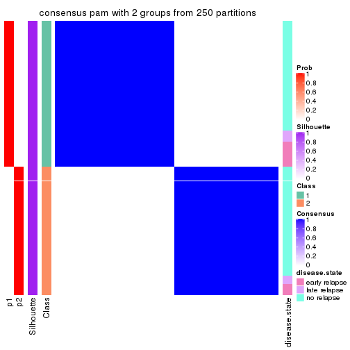</p>

</div>
<div id='tab-ATC-pam-consensus-heatmap-2'>
<pre><code class="r">consensus_heatmap(res, k = 3)
</code></pre>

<p>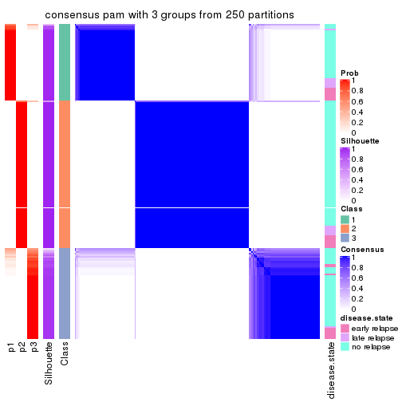</p>

</div>
<div id='tab-ATC-pam-consensus-heatmap-3'>
<pre><code class="r">consensus_heatmap(res, k = 4)
</code></pre>

<p>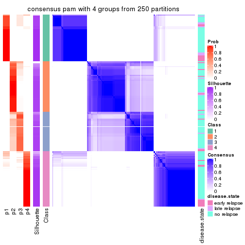</p>

</div>
<div id='tab-ATC-pam-consensus-heatmap-4'>
<pre><code class="r">consensus_heatmap(res, k = 5)
</code></pre>

<p>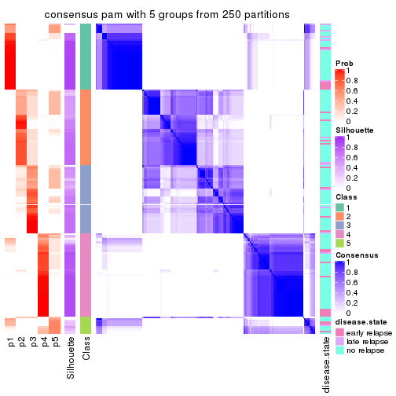</p>

</div>
<div id='tab-ATC-pam-consensus-heatmap-5'>
<pre><code class="r">consensus_heatmap(res, k = 6)
</code></pre>

<p>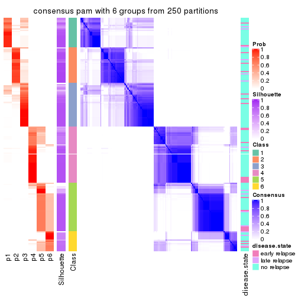</p>

</div>
</div>

Heatmaps for the membership of samples in all partitions to see how consistent they are:


<script>
$( function() {
	$( '#tabs-ATC-pam-membership-heatmap' ).tabs();
} );
</script>
<div id='tabs-ATC-pam-membership-heatmap'>
<ul>
<li><a href='#tab-ATC-pam-membership-heatmap-1'>k = 2</a></li>
<li><a href='#tab-ATC-pam-membership-heatmap-2'>k = 3</a></li>
<li><a href='#tab-ATC-pam-membership-heatmap-3'>k = 4</a></li>
<li><a href='#tab-ATC-pam-membership-heatmap-4'>k = 5</a></li>
<li><a href='#tab-ATC-pam-membership-heatmap-5'>k = 6</a></li>
</ul>
<div id='tab-ATC-pam-membership-heatmap-1'>
<pre><code class="r">membership_heatmap(res, k = 2)
</code></pre>

<p>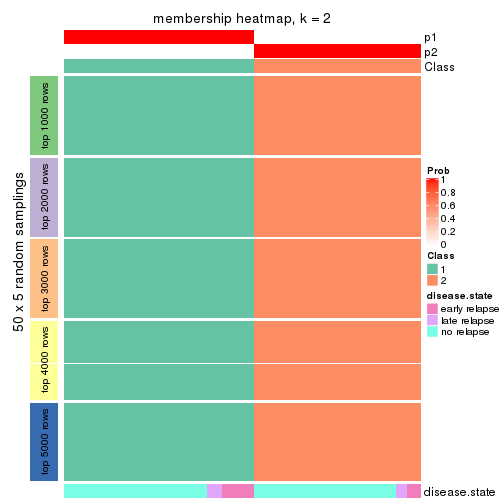</p>

</div>
<div id='tab-ATC-pam-membership-heatmap-2'>
<pre><code class="r">membership_heatmap(res, k = 3)
</code></pre>

<p>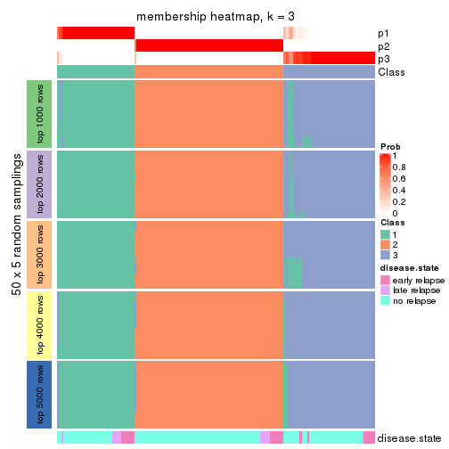</p>

</div>
<div id='tab-ATC-pam-membership-heatmap-3'>
<pre><code class="r">membership_heatmap(res, k = 4)
</code></pre>

<p>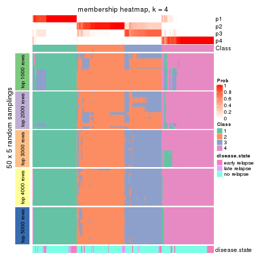</p>

</div>
<div id='tab-ATC-pam-membership-heatmap-4'>
<pre><code class="r">membership_heatmap(res, k = 5)
</code></pre>

<p>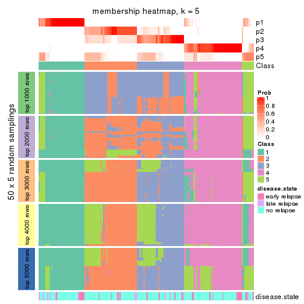</p>

</div>
<div id='tab-ATC-pam-membership-heatmap-5'>
<pre><code class="r">membership_heatmap(res, k = 6)
</code></pre>

<p>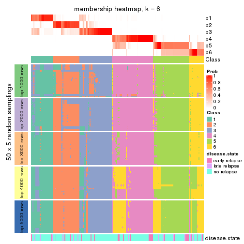</p>

</div>
</div>

As soon as we have had the classes for columns, we can look for signatures
which are significantly different between classes which can be candidate marks
for certain classes. Following are the heatmaps for signatures.


Signature heatmaps where rows are scaled:


<script>
$( function() {
	$( '#tabs-ATC-pam-get-signatures' ).tabs();
} );
</script>
<div id='tabs-ATC-pam-get-signatures'>
<ul>
<li><a href='#tab-ATC-pam-get-signatures-1'>k = 2</a></li>
<li><a href='#tab-ATC-pam-get-signatures-2'>k = 3</a></li>
<li><a href='#tab-ATC-pam-get-signatures-3'>k = 4</a></li>
<li><a href='#tab-ATC-pam-get-signatures-4'>k = 5</a></li>
<li><a href='#tab-ATC-pam-get-signatures-5'>k = 6</a></li>
</ul>
<div id='tab-ATC-pam-get-signatures-1'>
<pre><code class="r">get_signatures(res, k = 2)
</code></pre>

<p>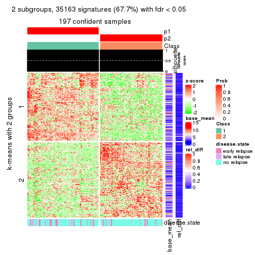</p>

</div>
<div id='tab-ATC-pam-get-signatures-2'>
<pre><code class="r">get_signatures(res, k = 3)
</code></pre>

<p>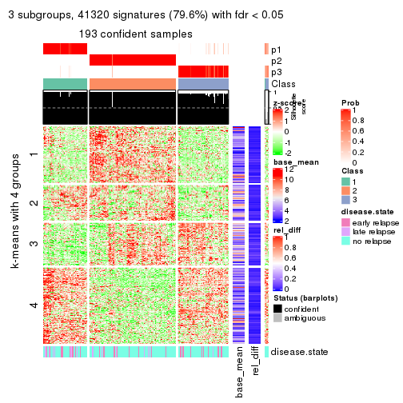</p>

</div>
<div id='tab-ATC-pam-get-signatures-3'>
<pre><code class="r">get_signatures(res, k = 4)
</code></pre>

<p>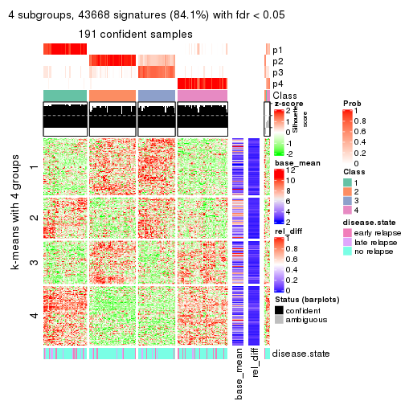</p>

</div>
<div id='tab-ATC-pam-get-signatures-4'>
<pre><code class="r">get_signatures(res, k = 5)
</code></pre>

<p>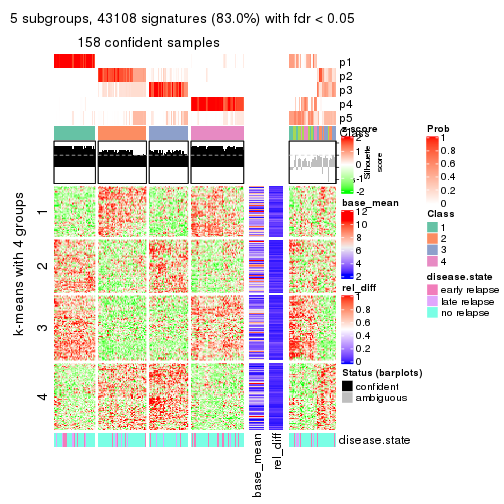</p>

</div>
<div id='tab-ATC-pam-get-signatures-5'>
<pre><code class="r">get_signatures(res, k = 6)
</code></pre>

<p>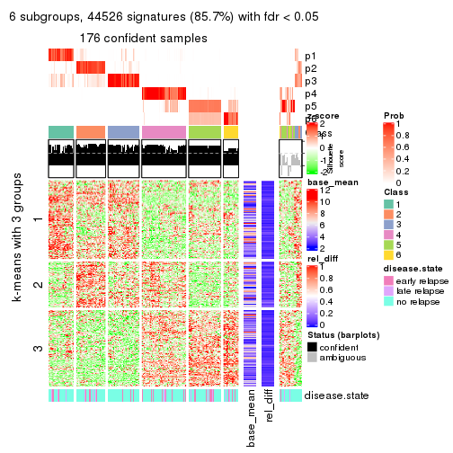</p>

</div>
</div>


Signature heatmaps where rows are not scaled:


<script>
$( function() {
	$( '#tabs-ATC-pam-get-signatures-no-scale' ).tabs();
} );
</script>
<div id='tabs-ATC-pam-get-signatures-no-scale'>
<ul>
<li><a href='#tab-ATC-pam-get-signatures-no-scale-1'>k = 2</a></li>
<li><a href='#tab-ATC-pam-get-signatures-no-scale-2'>k = 3</a></li>
<li><a href='#tab-ATC-pam-get-signatures-no-scale-3'>k = 4</a></li>
<li><a href='#tab-ATC-pam-get-signatures-no-scale-4'>k = 5</a></li>
<li><a href='#tab-ATC-pam-get-signatures-no-scale-5'>k = 6</a></li>
</ul>
<div id='tab-ATC-pam-get-signatures-no-scale-1'>
<pre><code class="r">get_signatures(res, k = 2, scale_rows = FALSE)
</code></pre>

<p>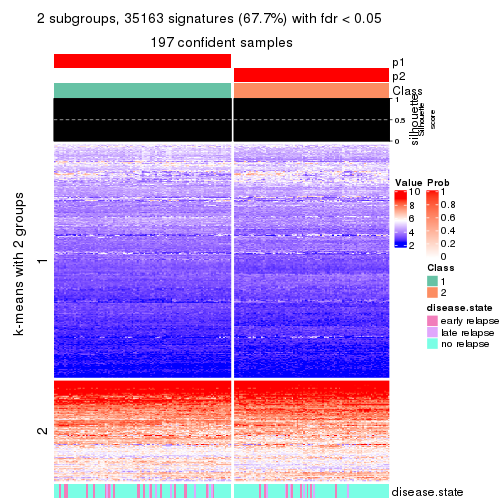</p>

</div>
<div id='tab-ATC-pam-get-signatures-no-scale-2'>
<pre><code class="r">get_signatures(res, k = 3, scale_rows = FALSE)
</code></pre>

<p>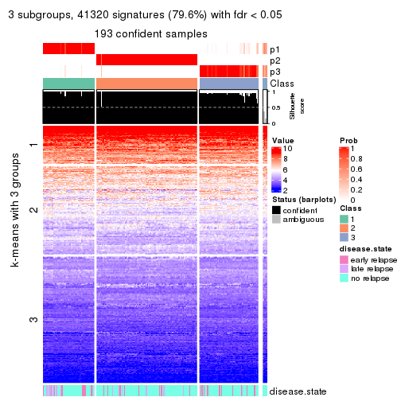</p>

</div>
<div id='tab-ATC-pam-get-signatures-no-scale-3'>
<pre><code class="r">get_signatures(res, k = 4, scale_rows = FALSE)
</code></pre>

<p>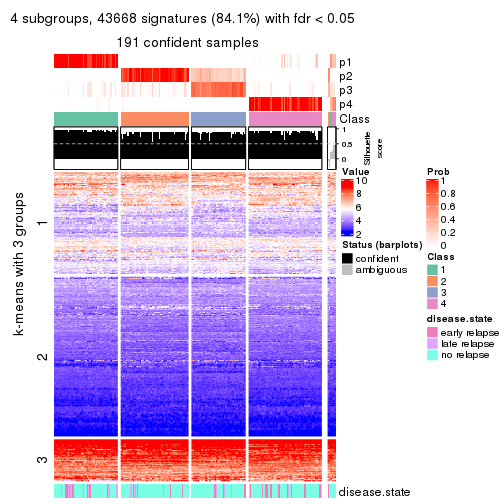</p>

</div>
<div id='tab-ATC-pam-get-signatures-no-scale-4'>
<pre><code class="r">get_signatures(res, k = 5, scale_rows = FALSE)
</code></pre>

<p>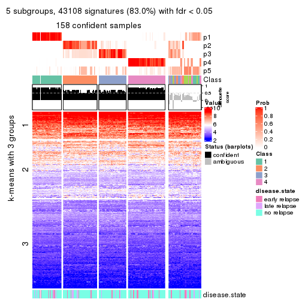</p>

</div>
<div id='tab-ATC-pam-get-signatures-no-scale-5'>
<pre><code class="r">get_signatures(res, k = 6, scale_rows = FALSE)
</code></pre>

<p>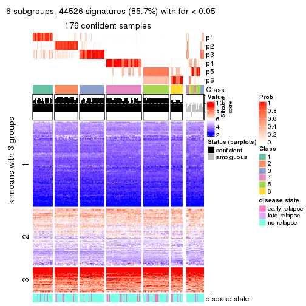</p>

</div>
</div>


Compare the overlap of signatures from different k:

```r
compare_signatures(res)
```

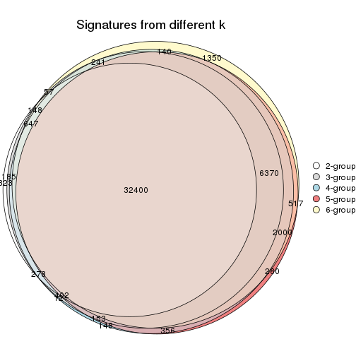

`get_signature()` returns a data frame invisibly. TO get the list of signatures, the function
call should be assigned to a variable explicitly. In following code, if `plot` argument is set
to `FALSE`, no heatmap is plotted while only the differential analysis is performed.

```r
# code only for demonstration
tb = get_signature(res, k = ..., plot = FALSE)
```

An example of the output of `tb` is:

```
#>   which_row         fdr    mean_1    mean_2 scaled_mean_1 scaled_mean_2 km
#> 1        38 0.042760348  8.373488  9.131774    -0.5533452     0.5164555  1
#> 2        40 0.018707592  7.106213  8.469186    -0.6173731     0.5762149  1
#> 3        55 0.019134737 10.221463 11.207825    -0.6159697     0.5749050  1
#> 4        59 0.006059896  5.921854  7.869574    -0.6899429     0.6439467  1
#> 5        60 0.018055526  8.928898 10.211722    -0.6204761     0.5791110  1
#> 6        98 0.009384629 15.714769 14.887706     0.6635654    -0.6193277  2
...
```

The columns in `tb` are:

1. `which_row`: row indices corresponding to the input matrix.
2. `fdr`: FDR for the differential test. 
3. `mean_x`: The mean value in group x.
4. `scaled_mean_x`: The mean value in group x after rows are scaled.
5. `km`: Row groups if k-means clustering is applied to rows.


UMAP plot which shows how samples are separated.


<script>
$( function() {
	$( '#tabs-ATC-pam-dimension-reduction' ).tabs();
} );
</script>
<div id='tabs-ATC-pam-dimension-reduction'>
<ul>
<li><a href='#tab-ATC-pam-dimension-reduction-1'>k = 2</a></li>
<li><a href='#tab-ATC-pam-dimension-reduction-2'>k = 3</a></li>
<li><a href='#tab-ATC-pam-dimension-reduction-3'>k = 4</a></li>
<li><a href='#tab-ATC-pam-dimension-reduction-4'>k = 5</a></li>
<li><a href='#tab-ATC-pam-dimension-reduction-5'>k = 6</a></li>
</ul>
<div id='tab-ATC-pam-dimension-reduction-1'>
<pre><code class="r">dimension_reduction(res, k = 2, method = &quot;UMAP&quot;)
</code></pre>

<p>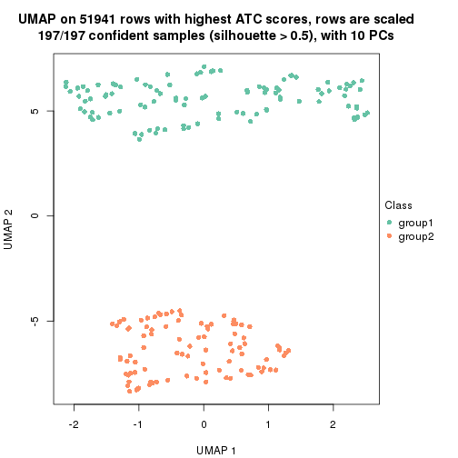</p>

</div>
<div id='tab-ATC-pam-dimension-reduction-2'>
<pre><code class="r">dimension_reduction(res, k = 3, method = &quot;UMAP&quot;)
</code></pre>

<p>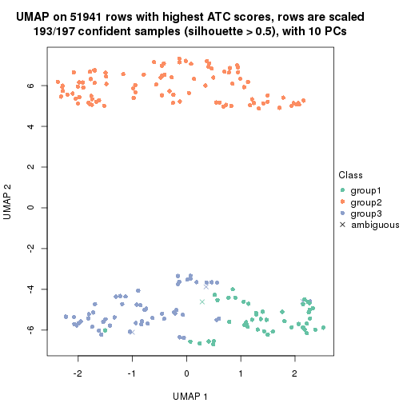</p>

</div>
<div id='tab-ATC-pam-dimension-reduction-3'>
<pre><code class="r">dimension_reduction(res, k = 4, method = &quot;UMAP&quot;)
</code></pre>

<p>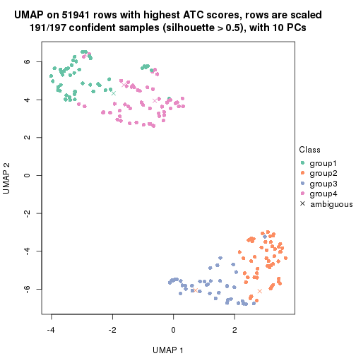</p>

</div>
<div id='tab-ATC-pam-dimension-reduction-4'>
<pre><code class="r">dimension_reduction(res, k = 5, method = &quot;UMAP&quot;)
</code></pre>

<p>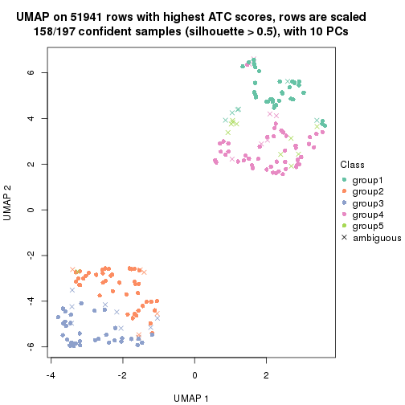</p>

</div>
<div id='tab-ATC-pam-dimension-reduction-5'>
<pre><code class="r">dimension_reduction(res, k = 6, method = &quot;UMAP&quot;)
</code></pre>

<p>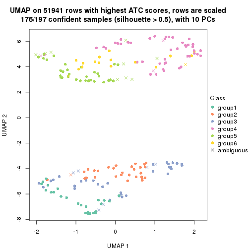</p>

</div>
</div>


Following heatmap shows how subgroups are split when increasing `k`:

```r
collect_classes(res)
```

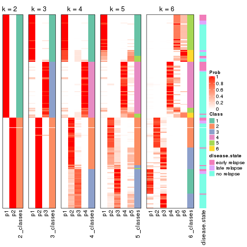


Test correlation between subgroups and known annotations. If the known
annotation is numeric, one-way ANOVA test is applied, and if the known
annotation is discrete, chi-squared contingency table test is applied.

```r
test_to_known_factors(res)
```

```
#>           n disease.state(p) k
#> ATC:pam 197           0.1926 2
#> ATC:pam 193           0.0382 3
#> ATC:pam 191           0.0914 4
#> ATC:pam 158           0.3627 5
#> ATC:pam 176           0.4455 6
```


If matrix rows can be associated to genes, consider to use `functional_enrichment(res,
...)` to perform function enrichment for the signature genes. See [this vignette](http://bioconductor.org/packages/devel/bioc/vignettes/cola/inst/doc/functional_enrichment.html) for more detailed explanations.


 

---------------------------------------------------


### ATC:mclust**


The object with results only for a single top-value method and a single partition method 
can be extracted as:

```r
res = res_list["ATC", "mclust"]
# you can also extract it by
# res = res_list["ATC:mclust"]
```

A summary of `res` and all the functions that can be applied to it:

```r
res
```

```
#> A 'ConsensusPartition' object with k = 2, 3, 4, 5, 6.
#>   On a matrix with 51941 rows and 197 columns.
#>   Top rows (1000, 2000, 3000, 4000, 5000) are extracted by 'ATC' method.
#>   Subgroups are detected by 'mclust' method.
#>   Performed in total 1250 partitions by row resampling.
#>   Best k for subgroups seems to be 6.
#> 
#> Following methods can be applied to this 'ConsensusPartition' object:
#>  [1] "cola_report"             "collect_classes"         "collect_plots"          
#>  [4] "collect_stats"           "colnames"                "compare_signatures"     
#>  [7] "consensus_heatmap"       "dimension_reduction"     "functional_enrichment"  
#> [10] "get_anno_col"            "get_anno"                "get_classes"            
#> [13] "get_consensus"           "get_matrix"              "get_membership"         
#> [16] "get_param"               "get_signatures"          "get_stats"              
#> [19] "is_best_k"               "is_stable_k"             "membership_heatmap"     
#> [22] "ncol"                    "nrow"                    "plot_ecdf"              
#> [25] "rownames"                "select_partition_number" "show"                   
#> [28] "suggest_best_k"          "test_to_known_factors"
```

`collect_plots()` function collects all the plots made from `res` for all `k` (number of partitions)
into one single page to provide an easy and fast comparison between different `k`.

```r
collect_plots(res)
```

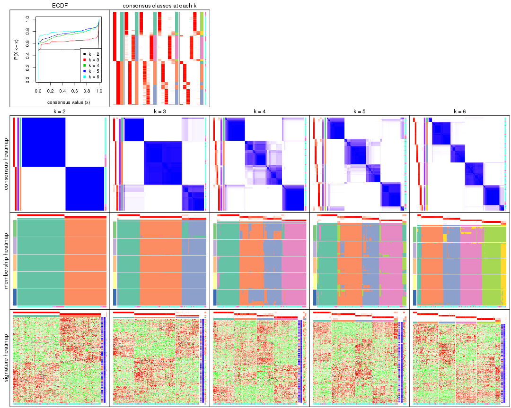

The plots are:

- The first row: a plot of the ECDF (empirical cumulative distribution
  function) curves of the consensus matrix for each `k` and the heatmap of
  predicted classes for each `k`.
- The second row: heatmaps of the consensus matrix for each `k`.
- The third row: heatmaps of the membership matrix for each `k`.
- The fouth row: heatmaps of the signatures for each `k`.

All the plots in panels can be made by individual functions and they are
plotted later in this section.

`select_partition_number()` produces several plots showing different
statistics for choosing "optimized" `k`. There are following statistics:

- ECDF curves of the consensus matrix for each `k`;
- 1-PAC. [The PAC
  score](https://en.wikipedia.org/wiki/Consensus_clustering#Over-interpretation_potential_of_consensus_clustering)
  measures the proportion of the ambiguous subgrouping.
- Mean silhouette score.
- Concordance. The mean probability of fiting the consensus class ids in all
  partitions.
- Area increased. Denote $A_k$ as the area under the ECDF curve for current
  `k`, the area increased is defined as $A_k - A_{k-1}$.
- Rand index. The percent of pairs of samples that are both in a same cluster
  or both are not in a same cluster in the partition of k and k-1.
- Jaccard index. The ratio of pairs of samples are both in a same cluster in
  the partition of k and k-1 and the pairs of samples are both in a same
  cluster in the partition k or k-1.

The detailed explanations of these statistics can be found in [the _cola_
vignette](http://bioconductor.org/packages/devel/bioc/vignettes/cola/inst/doc/cola.html#toc_13).

Generally speaking, lower PAC score, higher mean silhouette score or higher
concordance corresponds to better partition. Rand index and Jaccard index
measure how similar the current partition is compared to partition with `k-1`.
If they are too similar, we won't accept `k` is better than `k-1`.

```r
select_partition_number(res)
```

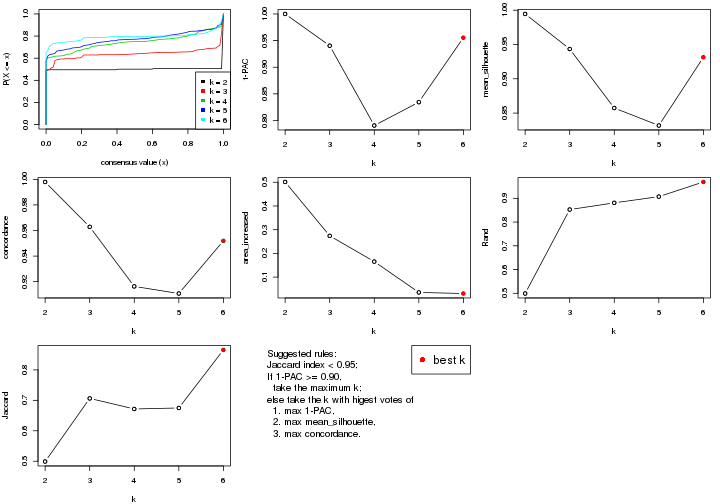

The numeric values for all these statistics can be obtained by `get_stats()`.

```r
get_stats(res)
```

```
#>   k 1-PAC mean_silhouette concordance area_increased  Rand Jaccard
#> 2 2 1.000           0.995       0.998         0.5012 0.499   0.499
#> 3 3 0.940           0.943       0.963         0.2739 0.853   0.706
#> 4 4 0.791           0.857       0.916         0.1654 0.881   0.672
#> 5 5 0.834           0.832       0.911         0.0354 0.907   0.675
#> 6 6 0.955           0.931       0.952         0.0307 0.969   0.865
```

`suggest_best_k()` suggests the best $k$ based on these statistics. The rules are as follows:

- All $k$ with Jaccard index larger than 0.95 are removed because increasing
  $k$ does not provide enough extra information. If all $k$ are removed, it is
  marked as no subgroup is detected.
- For all $k$ with 1-PAC score larger than 0.9, the maximal $k$ is taken as
  the best $k$, and other $k$ are marked as optional $k$.
- If it does not fit the second rule. The $k$ with the maximal vote of the
  highest 1-PAC score, highest mean silhouette, and highest concordance is
  taken as the best $k$.

```r
suggest_best_k(res)
```

```
#> [1] 6
#> attr(,"optional")
#> [1] 2 3
```

There is also optional best $k$ = 2 3 that is worth to check.

Following shows the table of the partitions (You need to click the **show/hide
code output** link to see it). The membership matrix (columns with name `p*`)
is inferred by
[`clue::cl_consensus()`](https://www.rdocumentation.org/link/cl_consensus?package=clue)
function with the `SE` method. Basically the value in the membership matrix
represents the probability to belong to a certain group. The finall class
label for an item is determined with the group with highest probability it
belongs to.

In `get_classes()` function, the entropy is calculated from the membership
matrix and the silhouette score is calculated from the consensus matrix.


<script>
$( function() {
	$( '#tabs-ATC-mclust-get-classes' ).tabs();
} );
</script>
<div id='tabs-ATC-mclust-get-classes'>
<ul>
<li><a href='#tab-ATC-mclust-get-classes-1'>k = 2</a></li>
<li><a href='#tab-ATC-mclust-get-classes-2'>k = 3</a></li>
<li><a href='#tab-ATC-mclust-get-classes-3'>k = 4</a></li>
<li><a href='#tab-ATC-mclust-get-classes-4'>k = 5</a></li>
<li><a href='#tab-ATC-mclust-get-classes-5'>k = 6</a></li>
</ul>

<div id='tab-ATC-mclust-get-classes-1'>
<p><a id='tab-ATC-mclust-get-classes-1-a' style='color:#0366d6' href='#'>show/hide code output</a></p>
<pre><code class="r">cbind(get_classes(res, k = 2), get_membership(res, k = 2))
</code></pre>

<pre><code>#&gt;           class entropy silhouette    p1    p2
#&gt; GSM342319     1   0.000      1.000 1.000 0.000
#&gt; GSM342323     1   0.000      1.000 1.000 0.000
#&gt; GSM342325     1   0.000      1.000 1.000 0.000
#&gt; GSM342326     1   0.000      1.000 1.000 0.000
#&gt; GSM342327     1   0.000      1.000 1.000 0.000
#&gt; GSM342329     1   0.000      1.000 1.000 0.000
#&gt; GSM342331     1   0.000      1.000 1.000 0.000
#&gt; GSM342334     1   0.000      1.000 1.000 0.000
#&gt; GSM342335     1   0.000      1.000 1.000 0.000
#&gt; GSM342354     1   0.000      1.000 1.000 0.000
#&gt; GSM342371     1   0.000      1.000 1.000 0.000
#&gt; GSM342380     1   0.000      1.000 1.000 0.000
#&gt; GSM342382     1   0.000      1.000 1.000 0.000
#&gt; GSM342399     1   0.000      1.000 1.000 0.000
#&gt; GSM342402     1   0.000      1.000 1.000 0.000
#&gt; GSM342404     1   0.000      1.000 1.000 0.000
#&gt; GSM342408     1   0.000      1.000 1.000 0.000
#&gt; GSM342409     1   0.000      1.000 1.000 0.000
#&gt; GSM342426     2   0.000      0.996 0.000 1.000
#&gt; GSM342441     2   0.000      0.996 0.000 1.000
#&gt; GSM342444     2   0.000      0.996 0.000 1.000
#&gt; GSM342451     2   0.000      0.996 0.000 1.000
#&gt; GSM342462     2   0.000      0.996 0.000 1.000
#&gt; GSM342467     2   0.000      0.996 0.000 1.000
#&gt; GSM342484     2   0.000      0.996 0.000 1.000
#&gt; GSM342491     2   0.000      0.996 0.000 1.000
#&gt; GSM342322     1   0.000      1.000 1.000 0.000
#&gt; GSM342338     1   0.000      1.000 1.000 0.000
#&gt; GSM342347     1   0.000      1.000 1.000 0.000
#&gt; GSM342356     1   0.000      1.000 1.000 0.000
#&gt; GSM342357     1   0.000      1.000 1.000 0.000
#&gt; GSM342366     1   0.000      1.000 1.000 0.000
#&gt; GSM342385     1   0.000      1.000 1.000 0.000
#&gt; GSM342421     1   0.000      1.000 1.000 0.000
#&gt; GSM342437     2   0.000      0.996 0.000 1.000
#&gt; GSM342454     2   0.000      0.996 0.000 1.000
#&gt; GSM342471     2   0.000      0.996 0.000 1.000
#&gt; GSM342477     2   0.000      0.996 0.000 1.000
#&gt; GSM342495     2   0.000      0.996 0.000 1.000
#&gt; GSM342496     2   0.000      0.996 0.000 1.000
#&gt; GSM342320     1   0.000      1.000 1.000 0.000
#&gt; GSM342321     1   0.000      1.000 1.000 0.000
#&gt; GSM342324     1   0.000      1.000 1.000 0.000
#&gt; GSM342328     1   0.000      1.000 1.000 0.000
#&gt; GSM342330     1   0.000      1.000 1.000 0.000
#&gt; GSM342332     1   0.000      1.000 1.000 0.000
#&gt; GSM342333     1   0.000      1.000 1.000 0.000
#&gt; GSM342336     1   0.000      1.000 1.000 0.000
#&gt; GSM342337     1   0.000      1.000 1.000 0.000
#&gt; GSM342339     1   0.000      1.000 1.000 0.000
#&gt; GSM342340     1   0.000      1.000 1.000 0.000
#&gt; GSM342341     1   0.000      1.000 1.000 0.000
#&gt; GSM342342     1   0.000      1.000 1.000 0.000
#&gt; GSM342343     1   0.000      1.000 1.000 0.000
#&gt; GSM342344     1   0.000      1.000 1.000 0.000
#&gt; GSM342345     1   0.000      1.000 1.000 0.000
#&gt; GSM342346     1   0.000      1.000 1.000 0.000
#&gt; GSM342348     1   0.000      1.000 1.000 0.000
#&gt; GSM342349     1   0.000      1.000 1.000 0.000
#&gt; GSM342350     1   0.000      1.000 1.000 0.000
#&gt; GSM342351     1   0.000      1.000 1.000 0.000
#&gt; GSM342352     2   0.973      0.322 0.404 0.596
#&gt; GSM342353     1   0.000      1.000 1.000 0.000
#&gt; GSM342355     1   0.000      1.000 1.000 0.000
#&gt; GSM342358     1   0.000      1.000 1.000 0.000
#&gt; GSM342359     1   0.000      1.000 1.000 0.000
#&gt; GSM342360     1   0.000      1.000 1.000 0.000
#&gt; GSM342361     1   0.000      1.000 1.000 0.000
#&gt; GSM342362     1   0.000      1.000 1.000 0.000
#&gt; GSM342363     1   0.000      1.000 1.000 0.000
#&gt; GSM342364     1   0.000      1.000 1.000 0.000
#&gt; GSM342365     1   0.000      1.000 1.000 0.000
#&gt; GSM342367     1   0.000      1.000 1.000 0.000
#&gt; GSM342368     1   0.000      1.000 1.000 0.000
#&gt; GSM342369     1   0.000      1.000 1.000 0.000
#&gt; GSM342370     1   0.000      1.000 1.000 0.000
#&gt; GSM342372     1   0.000      1.000 1.000 0.000
#&gt; GSM342373     1   0.000      1.000 1.000 0.000
#&gt; GSM342374     1   0.000      1.000 1.000 0.000
#&gt; GSM342375     1   0.000      1.000 1.000 0.000
#&gt; GSM342376     1   0.000      1.000 1.000 0.000
#&gt; GSM342377     1   0.000      1.000 1.000 0.000
#&gt; GSM342378     1   0.000      1.000 1.000 0.000
#&gt; GSM342379     1   0.000      1.000 1.000 0.000
#&gt; GSM342381     1   0.000      1.000 1.000 0.000
#&gt; GSM342383     1   0.000      1.000 1.000 0.000
#&gt; GSM342384     1   0.000      1.000 1.000 0.000
#&gt; GSM342386     1   0.000      1.000 1.000 0.000
#&gt; GSM342387     1   0.000      1.000 1.000 0.000
#&gt; GSM342388     1   0.000      1.000 1.000 0.000
#&gt; GSM342389     1   0.000      1.000 1.000 0.000
#&gt; GSM342390     1   0.000      1.000 1.000 0.000
#&gt; GSM342391     1   0.000      1.000 1.000 0.000
#&gt; GSM342392     1   0.000      1.000 1.000 0.000
#&gt; GSM342393     1   0.000      1.000 1.000 0.000
#&gt; GSM342394     1   0.000      1.000 1.000 0.000
#&gt; GSM342395     1   0.000      1.000 1.000 0.000
#&gt; GSM342396     1   0.000      1.000 1.000 0.000
#&gt; GSM342397     1   0.000      1.000 1.000 0.000
#&gt; GSM342398     1   0.000      1.000 1.000 0.000
#&gt; GSM342400     1   0.000      1.000 1.000 0.000
#&gt; GSM342401     1   0.000      1.000 1.000 0.000
#&gt; GSM342403     1   0.000      1.000 1.000 0.000
#&gt; GSM342405     1   0.000      1.000 1.000 0.000
#&gt; GSM342406     1   0.000      1.000 1.000 0.000
#&gt; GSM342407     1   0.000      1.000 1.000 0.000
#&gt; GSM342410     1   0.000      1.000 1.000 0.000
#&gt; GSM342411     1   0.000      1.000 1.000 0.000
#&gt; GSM342412     1   0.000      1.000 1.000 0.000
#&gt; GSM342413     1   0.000      1.000 1.000 0.000
#&gt; GSM342414     1   0.000      1.000 1.000 0.000
#&gt; GSM342415     1   0.000      1.000 1.000 0.000
#&gt; GSM342416     1   0.000      1.000 1.000 0.000
#&gt; GSM342417     1   0.000      1.000 1.000 0.000
#&gt; GSM342418     1   0.000      1.000 1.000 0.000
#&gt; GSM342419     1   0.000      1.000 1.000 0.000
#&gt; GSM342420     1   0.000      1.000 1.000 0.000
#&gt; GSM342422     1   0.000      1.000 1.000 0.000
#&gt; GSM342423     1   0.000      1.000 1.000 0.000
#&gt; GSM342424     2   0.000      0.996 0.000 1.000
#&gt; GSM342425     2   0.000      0.996 0.000 1.000
#&gt; GSM342427     2   0.000      0.996 0.000 1.000
#&gt; GSM342428     2   0.000      0.996 0.000 1.000
#&gt; GSM342429     2   0.000      0.996 0.000 1.000
#&gt; GSM342430     2   0.000      0.996 0.000 1.000
#&gt; GSM342431     2   0.000      0.996 0.000 1.000
#&gt; GSM342432     2   0.000      0.996 0.000 1.000
#&gt; GSM342433     2   0.000      0.996 0.000 1.000
#&gt; GSM342434     2   0.000      0.996 0.000 1.000
#&gt; GSM342435     2   0.000      0.996 0.000 1.000
#&gt; GSM342436     2   0.000      0.996 0.000 1.000
#&gt; GSM342438     2   0.000      0.996 0.000 1.000
#&gt; GSM342439     2   0.000      0.996 0.000 1.000
#&gt; GSM342440     2   0.000      0.996 0.000 1.000
#&gt; GSM342442     2   0.000      0.996 0.000 1.000
#&gt; GSM342443     2   0.000      0.996 0.000 1.000
#&gt; GSM342445     2   0.000      0.996 0.000 1.000
#&gt; GSM342446     2   0.000      0.996 0.000 1.000
#&gt; GSM342447     2   0.000      0.996 0.000 1.000
#&gt; GSM342448     2   0.000      0.996 0.000 1.000
#&gt; GSM342449     2   0.000      0.996 0.000 1.000
#&gt; GSM342450     2   0.000      0.996 0.000 1.000
#&gt; GSM342452     2   0.000      0.996 0.000 1.000
#&gt; GSM342453     2   0.000      0.996 0.000 1.000
#&gt; GSM342455     2   0.000      0.996 0.000 1.000
#&gt; GSM342456     2   0.000      0.996 0.000 1.000
#&gt; GSM342457     2   0.000      0.996 0.000 1.000
#&gt; GSM342458     2   0.000      0.996 0.000 1.000
#&gt; GSM342459     2   0.000      0.996 0.000 1.000
#&gt; GSM342460     2   0.000      0.996 0.000 1.000
#&gt; GSM342461     2   0.000      0.996 0.000 1.000
#&gt; GSM342463     2   0.000      0.996 0.000 1.000
#&gt; GSM342464     2   0.000      0.996 0.000 1.000
#&gt; GSM342465     2   0.000      0.996 0.000 1.000
#&gt; GSM342466     2   0.000      0.996 0.000 1.000
#&gt; GSM342468     2   0.000      0.996 0.000 1.000
#&gt; GSM342469     2   0.000      0.996 0.000 1.000
#&gt; GSM342470     2   0.000      0.996 0.000 1.000
#&gt; GSM342472     2   0.000      0.996 0.000 1.000
#&gt; GSM342473     2   0.000      0.996 0.000 1.000
#&gt; GSM342474     2   0.000      0.996 0.000 1.000
#&gt; GSM342475     2   0.000      0.996 0.000 1.000
#&gt; GSM342476     2   0.000      0.996 0.000 1.000
#&gt; GSM342478     2   0.000      0.996 0.000 1.000
#&gt; GSM342479     2   0.000      0.996 0.000 1.000
#&gt; GSM342480     2   0.000      0.996 0.000 1.000
#&gt; GSM342481     2   0.000      0.996 0.000 1.000
#&gt; GSM342482     2   0.000      0.996 0.000 1.000
#&gt; GSM342483     2   0.000      0.996 0.000 1.000
#&gt; GSM342485     2   0.000      0.996 0.000 1.000
#&gt; GSM342486     2   0.000      0.996 0.000 1.000
#&gt; GSM342487     2   0.000      0.996 0.000 1.000
#&gt; GSM342488     2   0.000      0.996 0.000 1.000
#&gt; GSM342489     2   0.000      0.996 0.000 1.000
#&gt; GSM342490     2   0.000      0.996 0.000 1.000
#&gt; GSM342492     2   0.000      0.996 0.000 1.000
#&gt; GSM342493     2   0.000      0.996 0.000 1.000
#&gt; GSM342494     2   0.000      0.996 0.000 1.000
#&gt; GSM342497     2   0.000      0.996 0.000 1.000
#&gt; GSM342498     2   0.000      0.996 0.000 1.000
#&gt; GSM342499     2   0.000      0.996 0.000 1.000
#&gt; GSM342500     2   0.000      0.996 0.000 1.000
#&gt; GSM342501     2   0.000      0.996 0.000 1.000
#&gt; GSM342502     2   0.000      0.996 0.000 1.000
#&gt; GSM342503     2   0.000      0.996 0.000 1.000
#&gt; GSM342504     2   0.000      0.996 0.000 1.000
#&gt; GSM342505     2   0.000      0.996 0.000 1.000
#&gt; GSM342506     2   0.000      0.996 0.000 1.000
#&gt; GSM342507     2   0.000      0.996 0.000 1.000
#&gt; GSM342508     2   0.000      0.996 0.000 1.000
#&gt; GSM342509     2   0.000      0.996 0.000 1.000
#&gt; GSM342510     2   0.000      0.996 0.000 1.000
#&gt; GSM342511     2   0.000      0.996 0.000 1.000
#&gt; GSM342512     2   0.000      0.996 0.000 1.000
#&gt; GSM342513     2   0.000      0.996 0.000 1.000
#&gt; GSM342514     2   0.000      0.996 0.000 1.000
#&gt; GSM342515     2   0.000      0.996 0.000 1.000
</code></pre>

<script>
$('#tab-ATC-mclust-get-classes-1-a').parent().next().next().hide();
$('#tab-ATC-mclust-get-classes-1-a').click(function(){
  $('#tab-ATC-mclust-get-classes-1-a').parent().next().next().toggle();
  return(false);
});
</script>
</div>

<div id='tab-ATC-mclust-get-classes-2'>
<p><a id='tab-ATC-mclust-get-classes-2-a' style='color:#0366d6' href='#'>show/hide code output</a></p>
<pre><code class="r">cbind(get_classes(res, k = 3), get_membership(res, k = 3))
</code></pre>

<pre><code>#&gt;           class entropy silhouette    p1    p2    p3
#&gt; GSM342319     1  0.0000      0.969 1.000 0.000 0.000
#&gt; GSM342323     3  0.4555      0.833 0.200 0.000 0.800
#&gt; GSM342325     1  0.0000      0.969 1.000 0.000 0.000
#&gt; GSM342326     3  0.1643      0.937 0.044 0.000 0.956
#&gt; GSM342327     3  0.1643      0.937 0.044 0.000 0.956
#&gt; GSM342329     3  0.4702      0.820 0.212 0.000 0.788
#&gt; GSM342331     3  0.1163      0.928 0.028 0.000 0.972
#&gt; GSM342334     3  0.1643      0.937 0.044 0.000 0.956
#&gt; GSM342335     3  0.6305      0.226 0.484 0.000 0.516
#&gt; GSM342354     3  0.1643      0.937 0.044 0.000 0.956
#&gt; GSM342371     3  0.3116      0.905 0.108 0.000 0.892
#&gt; GSM342380     1  0.0000      0.969 1.000 0.000 0.000
#&gt; GSM342382     1  0.0000      0.969 1.000 0.000 0.000
#&gt; GSM342399     1  0.0000      0.969 1.000 0.000 0.000
#&gt; GSM342402     1  0.0000      0.969 1.000 0.000 0.000
#&gt; GSM342404     3  0.1289      0.931 0.032 0.000 0.968
#&gt; GSM342408     3  0.1163      0.928 0.028 0.000 0.972
#&gt; GSM342409     3  0.4504      0.837 0.196 0.000 0.804
#&gt; GSM342426     2  0.0592      0.991 0.000 0.988 0.012
#&gt; GSM342441     2  0.0424      0.992 0.000 0.992 0.008
#&gt; GSM342444     2  0.0424      0.992 0.000 0.992 0.008
#&gt; GSM342451     2  0.0424      0.992 0.000 0.992 0.008
#&gt; GSM342462     2  0.0592      0.991 0.000 0.988 0.012
#&gt; GSM342467     2  0.1163      0.988 0.000 0.972 0.028
#&gt; GSM342484     2  0.0424      0.992 0.000 0.992 0.008
#&gt; GSM342491     2  0.0424      0.992 0.000 0.992 0.008
#&gt; GSM342322     1  0.0000      0.969 1.000 0.000 0.000
#&gt; GSM342338     1  0.0000      0.969 1.000 0.000 0.000
#&gt; GSM342347     3  0.5560      0.688 0.300 0.000 0.700
#&gt; GSM342356     1  0.0000      0.969 1.000 0.000 0.000
#&gt; GSM342357     1  0.0000      0.969 1.000 0.000 0.000
#&gt; GSM342366     1  0.0000      0.969 1.000 0.000 0.000
#&gt; GSM342385     1  0.0000      0.969 1.000 0.000 0.000
#&gt; GSM342421     3  0.1643      0.937 0.044 0.000 0.956
#&gt; GSM342437     2  0.0424      0.992 0.000 0.992 0.008
#&gt; GSM342454     2  0.0424      0.992 0.000 0.992 0.008
#&gt; GSM342471     2  0.0592      0.991 0.000 0.988 0.012
#&gt; GSM342477     2  0.0424      0.992 0.000 0.992 0.008
#&gt; GSM342495     2  0.0424      0.992 0.000 0.992 0.008
#&gt; GSM342496     2  0.0424      0.992 0.000 0.992 0.008
#&gt; GSM342320     3  0.1643      0.937 0.044 0.000 0.956
#&gt; GSM342321     1  0.6307     -0.155 0.512 0.000 0.488
#&gt; GSM342324     3  0.1643      0.937 0.044 0.000 0.956
#&gt; GSM342328     3  0.1643      0.937 0.044 0.000 0.956
#&gt; GSM342330     3  0.1289      0.931 0.032 0.000 0.968
#&gt; GSM342332     3  0.1964      0.933 0.056 0.000 0.944
#&gt; GSM342333     3  0.3879      0.874 0.152 0.000 0.848
#&gt; GSM342336     3  0.1643      0.937 0.044 0.000 0.956
#&gt; GSM342337     1  0.0000      0.969 1.000 0.000 0.000
#&gt; GSM342339     1  0.0000      0.969 1.000 0.000 0.000
#&gt; GSM342340     1  0.0000      0.969 1.000 0.000 0.000
#&gt; GSM342341     1  0.0237      0.965 0.996 0.000 0.004
#&gt; GSM342342     1  0.0000      0.969 1.000 0.000 0.000
#&gt; GSM342343     1  0.0000      0.969 1.000 0.000 0.000
#&gt; GSM342344     3  0.4654      0.824 0.208 0.000 0.792
#&gt; GSM342345     1  0.0000      0.969 1.000 0.000 0.000
#&gt; GSM342346     3  0.2356      0.926 0.072 0.000 0.928
#&gt; GSM342348     3  0.1643      0.937 0.044 0.000 0.956
#&gt; GSM342349     3  0.1643      0.937 0.044 0.000 0.956
#&gt; GSM342350     3  0.4654      0.824 0.208 0.000 0.792
#&gt; GSM342351     3  0.0592      0.915 0.012 0.000 0.988
#&gt; GSM342352     3  0.5072      0.691 0.012 0.196 0.792
#&gt; GSM342353     3  0.1643      0.937 0.044 0.000 0.956
#&gt; GSM342355     1  0.0000      0.969 1.000 0.000 0.000
#&gt; GSM342358     3  0.1289      0.931 0.032 0.000 0.968
#&gt; GSM342359     3  0.1643      0.937 0.044 0.000 0.956
#&gt; GSM342360     3  0.1753      0.936 0.048 0.000 0.952
#&gt; GSM342361     3  0.1163      0.928 0.028 0.000 0.972
#&gt; GSM342362     3  0.4605      0.829 0.204 0.000 0.796
#&gt; GSM342363     1  0.0000      0.969 1.000 0.000 0.000
#&gt; GSM342364     1  0.0000      0.969 1.000 0.000 0.000
#&gt; GSM342365     3  0.1643      0.937 0.044 0.000 0.956
#&gt; GSM342367     1  0.0000      0.969 1.000 0.000 0.000
#&gt; GSM342368     1  0.0237      0.965 0.996 0.000 0.004
#&gt; GSM342369     3  0.2448      0.924 0.076 0.000 0.924
#&gt; GSM342370     3  0.1753      0.936 0.048 0.000 0.952
#&gt; GSM342372     3  0.1643      0.937 0.044 0.000 0.956
#&gt; GSM342373     3  0.1964      0.933 0.056 0.000 0.944
#&gt; GSM342374     3  0.4062      0.865 0.164 0.000 0.836
#&gt; GSM342375     3  0.4605      0.829 0.204 0.000 0.796
#&gt; GSM342376     1  0.0000      0.969 1.000 0.000 0.000
#&gt; GSM342377     1  0.0000      0.969 1.000 0.000 0.000
#&gt; GSM342378     1  0.0000      0.969 1.000 0.000 0.000
#&gt; GSM342379     1  0.0000      0.969 1.000 0.000 0.000
#&gt; GSM342381     1  0.0000      0.969 1.000 0.000 0.000
#&gt; GSM342383     1  0.0000      0.969 1.000 0.000 0.000
#&gt; GSM342384     1  0.0000      0.969 1.000 0.000 0.000
#&gt; GSM342386     1  0.0000      0.969 1.000 0.000 0.000
#&gt; GSM342387     3  0.1643      0.937 0.044 0.000 0.956
#&gt; GSM342388     1  0.0000      0.969 1.000 0.000 0.000
#&gt; GSM342389     1  0.0000      0.969 1.000 0.000 0.000
#&gt; GSM342390     1  0.0000      0.969 1.000 0.000 0.000
#&gt; GSM342391     1  0.0000      0.969 1.000 0.000 0.000
#&gt; GSM342392     1  0.0000      0.969 1.000 0.000 0.000
#&gt; GSM342393     3  0.1163      0.928 0.028 0.000 0.972
#&gt; GSM342394     1  0.0000      0.969 1.000 0.000 0.000
#&gt; GSM342395     1  0.0000      0.969 1.000 0.000 0.000
#&gt; GSM342396     1  0.0000      0.969 1.000 0.000 0.000
#&gt; GSM342397     3  0.4654      0.824 0.208 0.000 0.792
#&gt; GSM342398     1  0.0000      0.969 1.000 0.000 0.000
#&gt; GSM342400     1  0.0000      0.969 1.000 0.000 0.000
#&gt; GSM342401     1  0.0000      0.969 1.000 0.000 0.000
#&gt; GSM342403     1  0.0000      0.969 1.000 0.000 0.000
#&gt; GSM342405     3  0.1163      0.928 0.028 0.000 0.972
#&gt; GSM342406     1  0.0000      0.969 1.000 0.000 0.000
#&gt; GSM342407     3  0.1643      0.937 0.044 0.000 0.956
#&gt; GSM342410     1  0.0000      0.969 1.000 0.000 0.000
#&gt; GSM342411     3  0.1643      0.937 0.044 0.000 0.956
#&gt; GSM342412     3  0.4654      0.824 0.208 0.000 0.792
#&gt; GSM342413     3  0.1643      0.937 0.044 0.000 0.956
#&gt; GSM342414     3  0.1643      0.937 0.044 0.000 0.956
#&gt; GSM342415     1  0.6079      0.236 0.612 0.000 0.388
#&gt; GSM342416     3  0.4062      0.865 0.164 0.000 0.836
#&gt; GSM342417     3  0.1860      0.935 0.052 0.000 0.948
#&gt; GSM342418     3  0.1643      0.937 0.044 0.000 0.956
#&gt; GSM342419     1  0.6204      0.122 0.576 0.000 0.424
#&gt; GSM342420     3  0.0747      0.919 0.016 0.000 0.984
#&gt; GSM342422     1  0.0000      0.969 1.000 0.000 0.000
#&gt; GSM342423     3  0.1643      0.937 0.044 0.000 0.956
#&gt; GSM342424     2  0.1643      0.976 0.000 0.956 0.044
#&gt; GSM342425     2  0.0424      0.992 0.000 0.992 0.008
#&gt; GSM342427     2  0.0592      0.991 0.000 0.988 0.012
#&gt; GSM342428     2  0.0592      0.991 0.000 0.988 0.012
#&gt; GSM342429     2  0.0424      0.992 0.000 0.992 0.008
#&gt; GSM342430     2  0.0424      0.992 0.000 0.992 0.008
#&gt; GSM342431     2  0.0424      0.992 0.000 0.992 0.008
#&gt; GSM342432     2  0.0424      0.992 0.000 0.992 0.008
#&gt; GSM342433     2  0.0424      0.992 0.000 0.992 0.008
#&gt; GSM342434     2  0.0592      0.991 0.000 0.988 0.012
#&gt; GSM342435     2  0.0424      0.992 0.000 0.992 0.008
#&gt; GSM342436     2  0.0424      0.992 0.000 0.992 0.008
#&gt; GSM342438     2  0.0237      0.993 0.000 0.996 0.004
#&gt; GSM342439     2  0.0424      0.992 0.000 0.992 0.008
#&gt; GSM342440     2  0.0237      0.993 0.000 0.996 0.004
#&gt; GSM342442     2  0.0237      0.993 0.000 0.996 0.004
#&gt; GSM342443     2  0.0424      0.992 0.000 0.992 0.008
#&gt; GSM342445     2  0.0424      0.992 0.000 0.992 0.008
#&gt; GSM342446     2  0.0424      0.992 0.000 0.992 0.008
#&gt; GSM342447     2  0.0424      0.992 0.000 0.992 0.008
#&gt; GSM342448     2  0.0424      0.992 0.000 0.992 0.008
#&gt; GSM342449     2  0.0237      0.993 0.000 0.996 0.004
#&gt; GSM342450     2  0.0424      0.992 0.000 0.992 0.008
#&gt; GSM342452     2  0.0237      0.993 0.000 0.996 0.004
#&gt; GSM342453     2  0.0237      0.993 0.000 0.996 0.004
#&gt; GSM342455     2  0.0424      0.992 0.000 0.992 0.008
#&gt; GSM342456     2  0.1643      0.976 0.000 0.956 0.044
#&gt; GSM342457     2  0.0424      0.992 0.000 0.992 0.008
#&gt; GSM342458     2  0.1643      0.976 0.000 0.956 0.044
#&gt; GSM342459     2  0.0424      0.992 0.000 0.992 0.008
#&gt; GSM342460     2  0.0424      0.992 0.000 0.992 0.008
#&gt; GSM342461     2  0.0424      0.992 0.000 0.992 0.008
#&gt; GSM342463     2  0.0237      0.993 0.000 0.996 0.004
#&gt; GSM342464     2  0.0424      0.992 0.000 0.992 0.008
#&gt; GSM342465     2  0.0424      0.992 0.000 0.992 0.008
#&gt; GSM342466     2  0.0424      0.992 0.000 0.992 0.008
#&gt; GSM342468     2  0.3116      0.911 0.000 0.892 0.108
#&gt; GSM342469     2  0.0424      0.992 0.000 0.992 0.008
#&gt; GSM342470     2  0.1163      0.988 0.000 0.972 0.028
#&gt; GSM342472     2  0.0592      0.991 0.000 0.988 0.012
#&gt; GSM342473     2  0.0424      0.992 0.000 0.992 0.008
#&gt; GSM342474     2  0.0424      0.992 0.000 0.992 0.008
#&gt; GSM342475     2  0.0424      0.992 0.000 0.992 0.008
#&gt; GSM342476     2  0.0592      0.991 0.000 0.988 0.012
#&gt; GSM342478     2  0.0424      0.992 0.000 0.992 0.008
#&gt; GSM342479     2  0.0424      0.992 0.000 0.992 0.008
#&gt; GSM342480     2  0.0424      0.992 0.000 0.992 0.008
#&gt; GSM342481     2  0.0237      0.993 0.000 0.996 0.004
#&gt; GSM342482     2  0.0424      0.992 0.000 0.992 0.008
#&gt; GSM342483     2  0.0424      0.992 0.000 0.992 0.008
#&gt; GSM342485     2  0.0424      0.992 0.000 0.992 0.008
#&gt; GSM342486     2  0.0424      0.992 0.000 0.992 0.008
#&gt; GSM342487     2  0.0237      0.993 0.000 0.996 0.004
#&gt; GSM342488     2  0.0424      0.992 0.000 0.992 0.008
#&gt; GSM342489     2  0.0424      0.992 0.000 0.992 0.008
#&gt; GSM342490     2  0.0424      0.992 0.000 0.992 0.008
#&gt; GSM342492     2  0.0424      0.992 0.000 0.992 0.008
#&gt; GSM342493     2  0.0424      0.992 0.000 0.992 0.008
#&gt; GSM342494     2  0.0424      0.992 0.000 0.992 0.008
#&gt; GSM342497     2  0.0424      0.992 0.000 0.992 0.008
#&gt; GSM342498     2  0.0424      0.992 0.000 0.992 0.008
#&gt; GSM342499     2  0.0424      0.992 0.000 0.992 0.008
#&gt; GSM342500     2  0.0424      0.992 0.000 0.992 0.008
#&gt; GSM342501     2  0.0237      0.993 0.000 0.996 0.004
#&gt; GSM342502     2  0.0237      0.993 0.000 0.996 0.004
#&gt; GSM342503     2  0.0424      0.992 0.000 0.992 0.008
#&gt; GSM342504     2  0.0592      0.992 0.000 0.988 0.012
#&gt; GSM342505     2  0.0237      0.993 0.000 0.996 0.004
#&gt; GSM342506     2  0.0424      0.992 0.000 0.992 0.008
#&gt; GSM342507     2  0.0424      0.992 0.000 0.992 0.008
#&gt; GSM342508     2  0.0424      0.992 0.000 0.992 0.008
#&gt; GSM342509     2  0.0237      0.993 0.000 0.996 0.004
#&gt; GSM342510     2  0.0424      0.992 0.000 0.992 0.008
#&gt; GSM342511     2  0.0592      0.991 0.000 0.988 0.012
#&gt; GSM342512     2  0.0424      0.992 0.000 0.992 0.008
#&gt; GSM342513     2  0.0424      0.992 0.000 0.992 0.008
#&gt; GSM342514     2  0.0237      0.993 0.000 0.996 0.004
#&gt; GSM342515     2  0.0424      0.992 0.000 0.992 0.008
</code></pre>

<script>
$('#tab-ATC-mclust-get-classes-2-a').parent().next().next().hide();
$('#tab-ATC-mclust-get-classes-2-a').click(function(){
  $('#tab-ATC-mclust-get-classes-2-a').parent().next().next().toggle();
  return(false);
});
</script>
</div>

<div id='tab-ATC-mclust-get-classes-3'>
<p><a id='tab-ATC-mclust-get-classes-3-a' style='color:#0366d6' href='#'>show/hide code output</a></p>
<pre><code class="r">cbind(get_classes(res, k = 4), get_membership(res, k = 4))
</code></pre>

<pre><code>#&gt;           class entropy silhouette    p1    p2    p3    p4
#&gt; GSM342319     1  0.0000     0.9620 1.000 0.000 0.000 0.000
#&gt; GSM342323     4  0.0000     0.9609 0.000 0.000 0.000 1.000
#&gt; GSM342325     1  0.0000     0.9620 1.000 0.000 0.000 0.000
#&gt; GSM342326     4  0.0000     0.9609 0.000 0.000 0.000 1.000
#&gt; GSM342327     4  0.0000     0.9609 0.000 0.000 0.000 1.000
#&gt; GSM342329     4  0.3610     0.7487 0.200 0.000 0.000 0.800
#&gt; GSM342331     4  0.0000     0.9609 0.000 0.000 0.000 1.000
#&gt; GSM342334     4  0.0000     0.9609 0.000 0.000 0.000 1.000
#&gt; GSM342335     4  0.4933     0.2355 0.432 0.000 0.000 0.568
#&gt; GSM342354     4  0.0000     0.9609 0.000 0.000 0.000 1.000
#&gt; GSM342371     4  0.0000     0.9609 0.000 0.000 0.000 1.000
#&gt; GSM342380     1  0.0000     0.9620 1.000 0.000 0.000 0.000
#&gt; GSM342382     1  0.0000     0.9620 1.000 0.000 0.000 0.000
#&gt; GSM342399     1  0.0000     0.9620 1.000 0.000 0.000 0.000
#&gt; GSM342402     1  0.0000     0.9620 1.000 0.000 0.000 0.000
#&gt; GSM342404     4  0.0000     0.9609 0.000 0.000 0.000 1.000
#&gt; GSM342408     4  0.0000     0.9609 0.000 0.000 0.000 1.000
#&gt; GSM342409     4  0.0336     0.9554 0.008 0.000 0.000 0.992
#&gt; GSM342426     2  0.0000     0.8249 0.000 1.000 0.000 0.000
#&gt; GSM342441     2  0.2973     0.8695 0.000 0.856 0.144 0.000
#&gt; GSM342444     3  0.0707     0.8475 0.000 0.020 0.980 0.000
#&gt; GSM342451     3  0.2469     0.8553 0.000 0.108 0.892 0.000
#&gt; GSM342462     3  0.2589     0.8527 0.000 0.116 0.884 0.000
#&gt; GSM342467     2  0.2469     0.7619 0.000 0.892 0.108 0.000
#&gt; GSM342484     2  0.3024     0.8669 0.000 0.852 0.148 0.000
#&gt; GSM342491     2  0.2973     0.8695 0.000 0.856 0.144 0.000
#&gt; GSM342322     1  0.0000     0.9620 1.000 0.000 0.000 0.000
#&gt; GSM342338     1  0.0188     0.9600 0.996 0.000 0.000 0.004
#&gt; GSM342347     4  0.3907     0.7004 0.232 0.000 0.000 0.768
#&gt; GSM342356     1  0.0188     0.9600 0.996 0.000 0.000 0.004
#&gt; GSM342357     1  0.0000     0.9620 1.000 0.000 0.000 0.000
#&gt; GSM342366     1  0.0000     0.9620 1.000 0.000 0.000 0.000
#&gt; GSM342385     1  0.0000     0.9620 1.000 0.000 0.000 0.000
#&gt; GSM342421     4  0.0000     0.9609 0.000 0.000 0.000 1.000
#&gt; GSM342437     2  0.2530     0.8641 0.000 0.888 0.112 0.000
#&gt; GSM342454     3  0.2408     0.8558 0.000 0.104 0.896 0.000
#&gt; GSM342471     3  0.0921     0.8408 0.000 0.028 0.972 0.000
#&gt; GSM342477     2  0.0000     0.8249 0.000 1.000 0.000 0.000
#&gt; GSM342495     2  0.2814     0.8681 0.000 0.868 0.132 0.000
#&gt; GSM342496     3  0.2469     0.8553 0.000 0.108 0.892 0.000
#&gt; GSM342320     4  0.0000     0.9609 0.000 0.000 0.000 1.000
#&gt; GSM342321     4  0.4730     0.4230 0.364 0.000 0.000 0.636
#&gt; GSM342324     4  0.0000     0.9609 0.000 0.000 0.000 1.000
#&gt; GSM342328     4  0.0000     0.9609 0.000 0.000 0.000 1.000
#&gt; GSM342330     4  0.0000     0.9609 0.000 0.000 0.000 1.000
#&gt; GSM342332     4  0.0000     0.9609 0.000 0.000 0.000 1.000
#&gt; GSM342333     4  0.0000     0.9609 0.000 0.000 0.000 1.000
#&gt; GSM342336     4  0.0000     0.9609 0.000 0.000 0.000 1.000
#&gt; GSM342337     1  0.0000     0.9620 1.000 0.000 0.000 0.000
#&gt; GSM342339     1  0.0000     0.9620 1.000 0.000 0.000 0.000
#&gt; GSM342340     1  0.0000     0.9620 1.000 0.000 0.000 0.000
#&gt; GSM342341     1  0.2589     0.8509 0.884 0.000 0.000 0.116
#&gt; GSM342342     1  0.0000     0.9620 1.000 0.000 0.000 0.000
#&gt; GSM342343     1  0.0000     0.9620 1.000 0.000 0.000 0.000
#&gt; GSM342344     4  0.0336     0.9554 0.008 0.000 0.000 0.992
#&gt; GSM342345     1  0.0188     0.9596 0.996 0.000 0.000 0.004
#&gt; GSM342346     4  0.0000     0.9609 0.000 0.000 0.000 1.000
#&gt; GSM342348     4  0.0000     0.9609 0.000 0.000 0.000 1.000
#&gt; GSM342349     4  0.0000     0.9609 0.000 0.000 0.000 1.000
#&gt; GSM342350     4  0.3610     0.7487 0.200 0.000 0.000 0.800
#&gt; GSM342351     4  0.2973     0.8338 0.000 0.144 0.000 0.856
#&gt; GSM342352     2  0.4866     0.2498 0.000 0.596 0.000 0.404
#&gt; GSM342353     4  0.0000     0.9609 0.000 0.000 0.000 1.000
#&gt; GSM342355     1  0.3726     0.7277 0.788 0.000 0.000 0.212
#&gt; GSM342358     4  0.0000     0.9609 0.000 0.000 0.000 1.000
#&gt; GSM342359     4  0.0000     0.9609 0.000 0.000 0.000 1.000
#&gt; GSM342360     4  0.0000     0.9609 0.000 0.000 0.000 1.000
#&gt; GSM342361     4  0.0000     0.9609 0.000 0.000 0.000 1.000
#&gt; GSM342362     4  0.0707     0.9462 0.020 0.000 0.000 0.980
#&gt; GSM342363     1  0.3172     0.8009 0.840 0.000 0.000 0.160
#&gt; GSM342364     1  0.0000     0.9620 1.000 0.000 0.000 0.000
#&gt; GSM342365     4  0.0000     0.9609 0.000 0.000 0.000 1.000
#&gt; GSM342367     1  0.0000     0.9620 1.000 0.000 0.000 0.000
#&gt; GSM342368     1  0.0469     0.9533 0.988 0.000 0.000 0.012
#&gt; GSM342369     4  0.0000     0.9609 0.000 0.000 0.000 1.000
#&gt; GSM342370     4  0.0000     0.9609 0.000 0.000 0.000 1.000
#&gt; GSM342372     4  0.0000     0.9609 0.000 0.000 0.000 1.000
#&gt; GSM342373     4  0.0000     0.9609 0.000 0.000 0.000 1.000
#&gt; GSM342374     4  0.0000     0.9609 0.000 0.000 0.000 1.000
#&gt; GSM342375     4  0.0000     0.9609 0.000 0.000 0.000 1.000
#&gt; GSM342376     1  0.0188     0.9600 0.996 0.000 0.000 0.004
#&gt; GSM342377     1  0.0188     0.9600 0.996 0.000 0.000 0.004
#&gt; GSM342378     1  0.0000     0.9620 1.000 0.000 0.000 0.000
#&gt; GSM342379     1  0.4761     0.4023 0.628 0.000 0.000 0.372
#&gt; GSM342381     1  0.0000     0.9620 1.000 0.000 0.000 0.000
#&gt; GSM342383     1  0.0000     0.9620 1.000 0.000 0.000 0.000
#&gt; GSM342384     1  0.0000     0.9620 1.000 0.000 0.000 0.000
#&gt; GSM342386     1  0.0000     0.9620 1.000 0.000 0.000 0.000
#&gt; GSM342387     4  0.0000     0.9609 0.000 0.000 0.000 1.000
#&gt; GSM342388     1  0.0000     0.9620 1.000 0.000 0.000 0.000
#&gt; GSM342389     1  0.0000     0.9620 1.000 0.000 0.000 0.000
#&gt; GSM342390     1  0.0188     0.9600 0.996 0.000 0.000 0.004
#&gt; GSM342391     1  0.0000     0.9620 1.000 0.000 0.000 0.000
#&gt; GSM342392     1  0.0000     0.9620 1.000 0.000 0.000 0.000
#&gt; GSM342393     4  0.0000     0.9609 0.000 0.000 0.000 1.000
#&gt; GSM342394     1  0.0000     0.9620 1.000 0.000 0.000 0.000
#&gt; GSM342395     1  0.0000     0.9620 1.000 0.000 0.000 0.000
#&gt; GSM342396     1  0.0000     0.9620 1.000 0.000 0.000 0.000
#&gt; GSM342397     4  0.1302     0.9255 0.044 0.000 0.000 0.956
#&gt; GSM342398     1  0.0000     0.9620 1.000 0.000 0.000 0.000
#&gt; GSM342400     1  0.0000     0.9620 1.000 0.000 0.000 0.000
#&gt; GSM342401     1  0.0000     0.9620 1.000 0.000 0.000 0.000
#&gt; GSM342403     1  0.0000     0.9620 1.000 0.000 0.000 0.000
#&gt; GSM342405     4  0.0000     0.9609 0.000 0.000 0.000 1.000
#&gt; GSM342406     1  0.1022     0.9373 0.968 0.000 0.000 0.032
#&gt; GSM342407     4  0.0000     0.9609 0.000 0.000 0.000 1.000
#&gt; GSM342410     1  0.3688     0.7339 0.792 0.000 0.000 0.208
#&gt; GSM342411     4  0.0000     0.9609 0.000 0.000 0.000 1.000
#&gt; GSM342412     4  0.3266     0.7924 0.168 0.000 0.000 0.832
#&gt; GSM342413     4  0.0000     0.9609 0.000 0.000 0.000 1.000
#&gt; GSM342414     4  0.0000     0.9609 0.000 0.000 0.000 1.000
#&gt; GSM342415     1  0.4916     0.2581 0.576 0.000 0.000 0.424
#&gt; GSM342416     4  0.0188     0.9582 0.004 0.000 0.000 0.996
#&gt; GSM342417     4  0.0000     0.9609 0.000 0.000 0.000 1.000
#&gt; GSM342418     4  0.0000     0.9609 0.000 0.000 0.000 1.000
#&gt; GSM342419     1  0.1389     0.9231 0.952 0.000 0.000 0.048
#&gt; GSM342420     4  0.2973     0.8338 0.000 0.144 0.000 0.856
#&gt; GSM342422     1  0.0188     0.9600 0.996 0.000 0.000 0.004
#&gt; GSM342423     4  0.0000     0.9609 0.000 0.000 0.000 1.000
#&gt; GSM342424     2  0.2469     0.7619 0.000 0.892 0.108 0.000
#&gt; GSM342425     3  0.4843     0.6157 0.000 0.396 0.604 0.000
#&gt; GSM342427     2  0.0188     0.8228 0.000 0.996 0.004 0.000
#&gt; GSM342428     2  0.0000     0.8249 0.000 1.000 0.000 0.000
#&gt; GSM342429     2  0.2973     0.8695 0.000 0.856 0.144 0.000
#&gt; GSM342430     3  0.4500     0.3919 0.000 0.316 0.684 0.000
#&gt; GSM342431     3  0.0336     0.8435 0.000 0.008 0.992 0.000
#&gt; GSM342432     2  0.3266     0.8514 0.000 0.832 0.168 0.000
#&gt; GSM342433     2  0.1302     0.8440 0.000 0.956 0.044 0.000
#&gt; GSM342434     2  0.0000     0.8249 0.000 1.000 0.000 0.000
#&gt; GSM342435     2  0.2973     0.8695 0.000 0.856 0.144 0.000
#&gt; GSM342436     2  0.2973     0.8695 0.000 0.856 0.144 0.000
#&gt; GSM342438     2  0.3688     0.8127 0.000 0.792 0.208 0.000
#&gt; GSM342439     3  0.2469     0.8553 0.000 0.108 0.892 0.000
#&gt; GSM342440     3  0.3528     0.8036 0.000 0.192 0.808 0.000
#&gt; GSM342442     3  0.2530     0.8539 0.000 0.112 0.888 0.000
#&gt; GSM342443     2  0.1022     0.8395 0.000 0.968 0.032 0.000
#&gt; GSM342445     3  0.3074     0.8390 0.000 0.152 0.848 0.000
#&gt; GSM342446     3  0.2469     0.8553 0.000 0.108 0.892 0.000
#&gt; GSM342447     3  0.0336     0.8435 0.000 0.008 0.992 0.000
#&gt; GSM342448     3  0.4304     0.7484 0.000 0.284 0.716 0.000
#&gt; GSM342449     3  0.2469     0.8553 0.000 0.108 0.892 0.000
#&gt; GSM342450     3  0.4454     0.7305 0.000 0.308 0.692 0.000
#&gt; GSM342452     3  0.4972     0.0375 0.000 0.456 0.544 0.000
#&gt; GSM342453     3  0.4996    -0.2834 0.000 0.484 0.516 0.000
#&gt; GSM342455     3  0.1940     0.8565 0.000 0.076 0.924 0.000
#&gt; GSM342456     2  0.2469     0.7619 0.000 0.892 0.108 0.000
#&gt; GSM342457     3  0.0000     0.8390 0.000 0.000 1.000 0.000
#&gt; GSM342458     2  0.2469     0.7619 0.000 0.892 0.108 0.000
#&gt; GSM342459     2  0.2973     0.8695 0.000 0.856 0.144 0.000
#&gt; GSM342460     2  0.0000     0.8249 0.000 1.000 0.000 0.000
#&gt; GSM342461     2  0.2973     0.8695 0.000 0.856 0.144 0.000
#&gt; GSM342463     2  0.4356     0.6955 0.000 0.708 0.292 0.000
#&gt; GSM342464     3  0.2469     0.8553 0.000 0.108 0.892 0.000
#&gt; GSM342465     3  0.0336     0.8435 0.000 0.008 0.992 0.000
#&gt; GSM342466     3  0.0000     0.8390 0.000 0.000 1.000 0.000
#&gt; GSM342468     2  0.2469     0.7619 0.000 0.892 0.108 0.000
#&gt; GSM342469     3  0.0592     0.8396 0.000 0.016 0.984 0.000
#&gt; GSM342470     2  0.2469     0.7619 0.000 0.892 0.108 0.000
#&gt; GSM342472     2  0.0000     0.8249 0.000 1.000 0.000 0.000
#&gt; GSM342473     2  0.2973     0.8695 0.000 0.856 0.144 0.000
#&gt; GSM342474     2  0.2973     0.8695 0.000 0.856 0.144 0.000
#&gt; GSM342475     2  0.2973     0.8695 0.000 0.856 0.144 0.000
#&gt; GSM342476     2  0.0000     0.8249 0.000 1.000 0.000 0.000
#&gt; GSM342478     2  0.2973     0.8695 0.000 0.856 0.144 0.000
#&gt; GSM342479     2  0.2973     0.8695 0.000 0.856 0.144 0.000
#&gt; GSM342480     2  0.0000     0.8249 0.000 1.000 0.000 0.000
#&gt; GSM342481     2  0.3266     0.8501 0.000 0.832 0.168 0.000
#&gt; GSM342482     2  0.2973     0.8695 0.000 0.856 0.144 0.000
#&gt; GSM342483     2  0.2973     0.8695 0.000 0.856 0.144 0.000
#&gt; GSM342485     3  0.3444     0.7989 0.000 0.184 0.816 0.000
#&gt; GSM342486     3  0.2469     0.8553 0.000 0.108 0.892 0.000
#&gt; GSM342487     3  0.4477     0.7264 0.000 0.312 0.688 0.000
#&gt; GSM342488     2  0.0000     0.8249 0.000 1.000 0.000 0.000
#&gt; GSM342489     2  0.0000     0.8249 0.000 1.000 0.000 0.000
#&gt; GSM342490     3  0.4866     0.6035 0.000 0.404 0.596 0.000
#&gt; GSM342492     2  0.2973     0.8695 0.000 0.856 0.144 0.000
#&gt; GSM342493     3  0.2469     0.8553 0.000 0.108 0.892 0.000
#&gt; GSM342494     2  0.2973     0.8695 0.000 0.856 0.144 0.000
#&gt; GSM342497     3  0.4304     0.7484 0.000 0.284 0.716 0.000
#&gt; GSM342498     3  0.2469     0.8553 0.000 0.108 0.892 0.000
#&gt; GSM342499     3  0.0336     0.8435 0.000 0.008 0.992 0.000
#&gt; GSM342500     2  0.2973     0.8695 0.000 0.856 0.144 0.000
#&gt; GSM342501     2  0.4605     0.6739 0.000 0.664 0.336 0.000
#&gt; GSM342502     2  0.4250     0.7211 0.000 0.724 0.276 0.000
#&gt; GSM342503     2  0.2973     0.8695 0.000 0.856 0.144 0.000
#&gt; GSM342504     2  0.2973     0.8695 0.000 0.856 0.144 0.000
#&gt; GSM342505     2  0.4222     0.7271 0.000 0.728 0.272 0.000
#&gt; GSM342506     2  0.4406     0.7205 0.000 0.700 0.300 0.000
#&gt; GSM342507     2  0.4776     0.6464 0.000 0.624 0.376 0.000
#&gt; GSM342508     3  0.0336     0.8435 0.000 0.008 0.992 0.000
#&gt; GSM342509     3  0.3907     0.7358 0.000 0.232 0.768 0.000
#&gt; GSM342510     2  0.2973     0.8695 0.000 0.856 0.144 0.000
#&gt; GSM342511     3  0.1118     0.8425 0.000 0.036 0.964 0.000
#&gt; GSM342512     3  0.0188     0.8413 0.000 0.004 0.996 0.000
#&gt; GSM342513     3  0.2216     0.8074 0.000 0.092 0.908 0.000
#&gt; GSM342514     3  0.3528     0.8031 0.000 0.192 0.808 0.000
#&gt; GSM342515     3  0.0000     0.8390 0.000 0.000 1.000 0.000
</code></pre>

<script>
$('#tab-ATC-mclust-get-classes-3-a').parent().next().next().hide();
$('#tab-ATC-mclust-get-classes-3-a').click(function(){
  $('#tab-ATC-mclust-get-classes-3-a').parent().next().next().toggle();
  return(false);
});
</script>
</div>

<div id='tab-ATC-mclust-get-classes-4'>
<p><a id='tab-ATC-mclust-get-classes-4-a' style='color:#0366d6' href='#'>show/hide code output</a></p>
<pre><code class="r">cbind(get_classes(res, k = 5), get_membership(res, k = 5))
</code></pre>

<pre><code>#&gt;           class entropy silhouette    p1    p2    p3    p4    p5
#&gt; GSM342319     1  0.0000     0.8963 1.000 0.000 0.000 0.000 0.000
#&gt; GSM342323     4  0.0963     0.9214 0.036 0.000 0.000 0.964 0.000
#&gt; GSM342325     1  0.0000     0.8963 1.000 0.000 0.000 0.000 0.000
#&gt; GSM342326     4  0.0000     0.9499 0.000 0.000 0.000 1.000 0.000
#&gt; GSM342327     4  0.0000     0.9499 0.000 0.000 0.000 1.000 0.000
#&gt; GSM342329     5  0.6700     0.6093 0.244 0.000 0.000 0.356 0.400
#&gt; GSM342331     4  0.1043     0.9383 0.000 0.000 0.000 0.960 0.040
#&gt; GSM342334     4  0.0000     0.9499 0.000 0.000 0.000 1.000 0.000
#&gt; GSM342335     5  0.5793     0.8016 0.348 0.000 0.000 0.104 0.548
#&gt; GSM342354     4  0.0000     0.9499 0.000 0.000 0.000 1.000 0.000
#&gt; GSM342371     4  0.0000     0.9499 0.000 0.000 0.000 1.000 0.000
#&gt; GSM342380     1  0.0000     0.8963 1.000 0.000 0.000 0.000 0.000
#&gt; GSM342382     1  0.0000     0.8963 1.000 0.000 0.000 0.000 0.000
#&gt; GSM342399     1  0.0000     0.8963 1.000 0.000 0.000 0.000 0.000
#&gt; GSM342402     1  0.0000     0.8963 1.000 0.000 0.000 0.000 0.000
#&gt; GSM342404     4  0.1043     0.9383 0.000 0.000 0.000 0.960 0.040
#&gt; GSM342408     4  0.1043     0.9383 0.000 0.000 0.000 0.960 0.040
#&gt; GSM342409     4  0.0162     0.9483 0.000 0.000 0.000 0.996 0.004
#&gt; GSM342426     2  0.0000     0.9101 0.000 1.000 0.000 0.000 0.000
#&gt; GSM342441     2  0.0324     0.9088 0.000 0.992 0.004 0.000 0.004
#&gt; GSM342444     3  0.0000     0.8730 0.000 0.000 1.000 0.000 0.000
#&gt; GSM342451     3  0.0609     0.8739 0.000 0.020 0.980 0.000 0.000
#&gt; GSM342462     3  0.2189     0.8384 0.000 0.012 0.904 0.000 0.084
#&gt; GSM342467     2  0.3949     0.6519 0.000 0.668 0.000 0.000 0.332
#&gt; GSM342484     2  0.1638     0.8610 0.000 0.932 0.064 0.000 0.004
#&gt; GSM342491     2  0.0162     0.9095 0.000 0.996 0.000 0.000 0.004
#&gt; GSM342322     1  0.0000     0.8963 1.000 0.000 0.000 0.000 0.000
#&gt; GSM342338     5  0.4538     0.6472 0.452 0.000 0.000 0.008 0.540
#&gt; GSM342347     5  0.6183     0.7609 0.276 0.000 0.000 0.180 0.544
#&gt; GSM342356     1  0.4165     0.0658 0.672 0.000 0.000 0.008 0.320
#&gt; GSM342357     1  0.0290     0.8887 0.992 0.000 0.000 0.008 0.000
#&gt; GSM342366     1  0.0000     0.8963 1.000 0.000 0.000 0.000 0.000
#&gt; GSM342385     1  0.0000     0.8963 1.000 0.000 0.000 0.000 0.000
#&gt; GSM342421     4  0.0000     0.9499 0.000 0.000 0.000 1.000 0.000
#&gt; GSM342437     2  0.0000     0.9101 0.000 1.000 0.000 0.000 0.000
#&gt; GSM342454     3  0.0000     0.8730 0.000 0.000 1.000 0.000 0.000
#&gt; GSM342471     3  0.2390     0.8365 0.000 0.020 0.896 0.000 0.084
#&gt; GSM342477     2  0.0000     0.9101 0.000 1.000 0.000 0.000 0.000
#&gt; GSM342495     2  0.0000     0.9101 0.000 1.000 0.000 0.000 0.000
#&gt; GSM342496     3  0.0000     0.8730 0.000 0.000 1.000 0.000 0.000
#&gt; GSM342320     4  0.0880     0.9411 0.000 0.000 0.000 0.968 0.032
#&gt; GSM342321     1  0.3816     0.1288 0.696 0.000 0.000 0.304 0.000
#&gt; GSM342324     4  0.1043     0.9383 0.000 0.000 0.000 0.960 0.040
#&gt; GSM342328     4  0.0000     0.9499 0.000 0.000 0.000 1.000 0.000
#&gt; GSM342330     4  0.1043     0.9383 0.000 0.000 0.000 0.960 0.040
#&gt; GSM342332     4  0.0162     0.9493 0.000 0.000 0.000 0.996 0.004
#&gt; GSM342333     4  0.0000     0.9499 0.000 0.000 0.000 1.000 0.000
#&gt; GSM342336     4  0.0000     0.9499 0.000 0.000 0.000 1.000 0.000
#&gt; GSM342337     1  0.0290     0.8902 0.992 0.000 0.000 0.008 0.000
#&gt; GSM342339     1  0.3143     0.5282 0.796 0.000 0.000 0.204 0.000
#&gt; GSM342340     1  0.0000     0.8963 1.000 0.000 0.000 0.000 0.000
#&gt; GSM342341     1  0.3210     0.5097 0.788 0.000 0.000 0.212 0.000
#&gt; GSM342342     1  0.0000     0.8963 1.000 0.000 0.000 0.000 0.000
#&gt; GSM342343     1  0.0162     0.8937 0.996 0.000 0.000 0.004 0.000
#&gt; GSM342344     4  0.0000     0.9499 0.000 0.000 0.000 1.000 0.000
#&gt; GSM342345     1  0.3039     0.5536 0.808 0.000 0.000 0.192 0.000
#&gt; GSM342346     4  0.1043     0.9383 0.000 0.000 0.000 0.960 0.040
#&gt; GSM342348     4  0.0000     0.9499 0.000 0.000 0.000 1.000 0.000
#&gt; GSM342349     4  0.0000     0.9499 0.000 0.000 0.000 1.000 0.000
#&gt; GSM342350     4  0.3366     0.5384 0.232 0.000 0.000 0.768 0.000
#&gt; GSM342351     4  0.4192     0.4318 0.000 0.000 0.000 0.596 0.404
#&gt; GSM342352     4  0.5467     0.3245 0.000 0.064 0.000 0.524 0.412
#&gt; GSM342353     4  0.1408     0.8996 0.044 0.000 0.000 0.948 0.008
#&gt; GSM342355     5  0.5288     0.7682 0.404 0.000 0.000 0.052 0.544
#&gt; GSM342358     4  0.0000     0.9499 0.000 0.000 0.000 1.000 0.000
#&gt; GSM342359     4  0.0290     0.9483 0.000 0.000 0.000 0.992 0.008
#&gt; GSM342360     4  0.1043     0.9383 0.000 0.000 0.000 0.960 0.040
#&gt; GSM342361     4  0.0162     0.9485 0.000 0.000 0.000 0.996 0.004
#&gt; GSM342362     4  0.0671     0.9358 0.016 0.000 0.000 0.980 0.004
#&gt; GSM342363     5  0.5288     0.7682 0.404 0.000 0.000 0.052 0.544
#&gt; GSM342364     1  0.0000     0.8963 1.000 0.000 0.000 0.000 0.000
#&gt; GSM342365     4  0.1043     0.9383 0.000 0.000 0.000 0.960 0.040
#&gt; GSM342367     1  0.0162     0.8937 0.996 0.000 0.000 0.004 0.000
#&gt; GSM342368     1  0.0290     0.8902 0.992 0.000 0.000 0.008 0.000
#&gt; GSM342369     4  0.1043     0.9383 0.000 0.000 0.000 0.960 0.040
#&gt; GSM342370     4  0.1043     0.9383 0.000 0.000 0.000 0.960 0.040
#&gt; GSM342372     4  0.0000     0.9499 0.000 0.000 0.000 1.000 0.000
#&gt; GSM342373     4  0.0000     0.9499 0.000 0.000 0.000 1.000 0.000
#&gt; GSM342374     4  0.0000     0.9499 0.000 0.000 0.000 1.000 0.000
#&gt; GSM342375     4  0.0000     0.9499 0.000 0.000 0.000 1.000 0.000
#&gt; GSM342376     1  0.0290     0.8902 0.992 0.000 0.000 0.008 0.000
#&gt; GSM342377     1  0.4165     0.0660 0.672 0.000 0.000 0.008 0.320
#&gt; GSM342378     1  0.0000     0.8963 1.000 0.000 0.000 0.000 0.000
#&gt; GSM342379     5  0.5330     0.7762 0.396 0.000 0.000 0.056 0.548
#&gt; GSM342381     1  0.0000     0.8963 1.000 0.000 0.000 0.000 0.000
#&gt; GSM342383     1  0.0000     0.8963 1.000 0.000 0.000 0.000 0.000
#&gt; GSM342384     1  0.0000     0.8963 1.000 0.000 0.000 0.000 0.000
#&gt; GSM342386     1  0.0000     0.8963 1.000 0.000 0.000 0.000 0.000
#&gt; GSM342387     4  0.1043     0.9383 0.000 0.000 0.000 0.960 0.040
#&gt; GSM342388     1  0.0000     0.8963 1.000 0.000 0.000 0.000 0.000
#&gt; GSM342389     1  0.0000     0.8963 1.000 0.000 0.000 0.000 0.000
#&gt; GSM342390     1  0.0290     0.8902 0.992 0.000 0.000 0.008 0.000
#&gt; GSM342391     1  0.0510     0.8817 0.984 0.000 0.000 0.016 0.000
#&gt; GSM342392     1  0.0290     0.8902 0.992 0.000 0.000 0.008 0.000
#&gt; GSM342393     4  0.0000     0.9499 0.000 0.000 0.000 1.000 0.000
#&gt; GSM342394     1  0.0000     0.8963 1.000 0.000 0.000 0.000 0.000
#&gt; GSM342395     1  0.3143     0.5282 0.796 0.000 0.000 0.204 0.000
#&gt; GSM342396     1  0.0000     0.8963 1.000 0.000 0.000 0.000 0.000
#&gt; GSM342397     4  0.1211     0.9296 0.024 0.000 0.000 0.960 0.016
#&gt; GSM342398     1  0.0000     0.8963 1.000 0.000 0.000 0.000 0.000
#&gt; GSM342400     1  0.0000     0.8963 1.000 0.000 0.000 0.000 0.000
#&gt; GSM342401     1  0.0000     0.8963 1.000 0.000 0.000 0.000 0.000
#&gt; GSM342403     1  0.0000     0.8963 1.000 0.000 0.000 0.000 0.000
#&gt; GSM342405     4  0.1043     0.9383 0.000 0.000 0.000 0.960 0.040
#&gt; GSM342406     1  0.1270     0.8178 0.948 0.000 0.000 0.052 0.000
#&gt; GSM342407     4  0.1043     0.9383 0.000 0.000 0.000 0.960 0.040
#&gt; GSM342410     1  0.5264    -0.4494 0.556 0.000 0.000 0.052 0.392
#&gt; GSM342411     4  0.0000     0.9499 0.000 0.000 0.000 1.000 0.000
#&gt; GSM342412     5  0.6703     0.6760 0.276 0.000 0.000 0.296 0.428
#&gt; GSM342413     4  0.0000     0.9499 0.000 0.000 0.000 1.000 0.000
#&gt; GSM342414     4  0.0162     0.9483 0.000 0.000 0.000 0.996 0.004
#&gt; GSM342415     5  0.5793     0.8016 0.348 0.000 0.000 0.104 0.548
#&gt; GSM342416     4  0.0162     0.9483 0.000 0.000 0.000 0.996 0.004
#&gt; GSM342417     4  0.0000     0.9499 0.000 0.000 0.000 1.000 0.000
#&gt; GSM342418     4  0.0000     0.9499 0.000 0.000 0.000 1.000 0.000
#&gt; GSM342419     1  0.2888     0.7519 0.888 0.000 0.020 0.056 0.036
#&gt; GSM342420     4  0.4161     0.4519 0.000 0.000 0.000 0.608 0.392
#&gt; GSM342422     1  0.0290     0.8902 0.992 0.000 0.000 0.008 0.000
#&gt; GSM342423     4  0.0000     0.9499 0.000 0.000 0.000 1.000 0.000
#&gt; GSM342424     2  0.4201     0.5635 0.000 0.592 0.000 0.000 0.408
#&gt; GSM342425     2  0.3852     0.7106 0.000 0.760 0.220 0.000 0.020
#&gt; GSM342427     2  0.0609     0.9003 0.000 0.980 0.000 0.000 0.020
#&gt; GSM342428     2  0.0000     0.9101 0.000 1.000 0.000 0.000 0.000
#&gt; GSM342429     2  0.0324     0.9088 0.000 0.992 0.004 0.000 0.004
#&gt; GSM342430     3  0.2516     0.8320 0.000 0.140 0.860 0.000 0.000
#&gt; GSM342431     3  0.0000     0.8730 0.000 0.000 1.000 0.000 0.000
#&gt; GSM342432     2  0.0451     0.9067 0.000 0.988 0.008 0.000 0.004
#&gt; GSM342433     2  0.0000     0.9101 0.000 1.000 0.000 0.000 0.000
#&gt; GSM342434     2  0.0162     0.9087 0.000 0.996 0.000 0.000 0.004
#&gt; GSM342435     2  0.0000     0.9101 0.000 1.000 0.000 0.000 0.000
#&gt; GSM342436     2  0.0162     0.9095 0.000 0.996 0.000 0.000 0.004
#&gt; GSM342438     2  0.0324     0.9088 0.000 0.992 0.004 0.000 0.004
#&gt; GSM342439     3  0.1197     0.8673 0.000 0.048 0.952 0.000 0.000
#&gt; GSM342440     2  0.3300     0.7327 0.000 0.792 0.204 0.000 0.004
#&gt; GSM342442     3  0.3109     0.7536 0.000 0.200 0.800 0.000 0.000
#&gt; GSM342443     2  0.0000     0.9101 0.000 1.000 0.000 0.000 0.000
#&gt; GSM342445     2  0.4167     0.6669 0.000 0.724 0.252 0.000 0.024
#&gt; GSM342446     3  0.1410     0.8659 0.000 0.060 0.940 0.000 0.000
#&gt; GSM342447     3  0.0000     0.8730 0.000 0.000 1.000 0.000 0.000
#&gt; GSM342448     2  0.4338     0.6224 0.000 0.696 0.280 0.000 0.024
#&gt; GSM342449     3  0.1671     0.8558 0.000 0.076 0.924 0.000 0.000
#&gt; GSM342450     2  0.3789     0.7209 0.000 0.768 0.212 0.000 0.020
#&gt; GSM342452     3  0.2674     0.8342 0.000 0.140 0.856 0.000 0.004
#&gt; GSM342453     3  0.2629     0.8350 0.000 0.136 0.860 0.000 0.004
#&gt; GSM342455     3  0.0000     0.8730 0.000 0.000 1.000 0.000 0.000
#&gt; GSM342456     2  0.3837     0.6771 0.000 0.692 0.000 0.000 0.308
#&gt; GSM342457     3  0.0000     0.8730 0.000 0.000 1.000 0.000 0.000
#&gt; GSM342458     2  0.3966     0.6478 0.000 0.664 0.000 0.000 0.336
#&gt; GSM342459     2  0.0000     0.9101 0.000 1.000 0.000 0.000 0.000
#&gt; GSM342460     2  0.0609     0.9003 0.000 0.980 0.000 0.000 0.020
#&gt; GSM342461     2  0.0324     0.9088 0.000 0.992 0.004 0.000 0.004
#&gt; GSM342463     3  0.4211     0.5852 0.000 0.360 0.636 0.000 0.004
#&gt; GSM342464     3  0.2230     0.8503 0.000 0.116 0.884 0.000 0.000
#&gt; GSM342465     3  0.0000     0.8730 0.000 0.000 1.000 0.000 0.000
#&gt; GSM342466     3  0.0000     0.8730 0.000 0.000 1.000 0.000 0.000
#&gt; GSM342468     2  0.4210     0.5586 0.000 0.588 0.000 0.000 0.412
#&gt; GSM342469     3  0.0162     0.8736 0.000 0.004 0.996 0.000 0.000
#&gt; GSM342470     2  0.4201     0.5635 0.000 0.592 0.000 0.000 0.408
#&gt; GSM342472     2  0.0000     0.9101 0.000 1.000 0.000 0.000 0.000
#&gt; GSM342473     2  0.0162     0.9095 0.000 0.996 0.000 0.000 0.004
#&gt; GSM342474     2  0.0162     0.9095 0.000 0.996 0.000 0.000 0.004
#&gt; GSM342475     2  0.0162     0.9095 0.000 0.996 0.000 0.000 0.004
#&gt; GSM342476     2  0.0000     0.9101 0.000 1.000 0.000 0.000 0.000
#&gt; GSM342478     2  0.0324     0.9088 0.000 0.992 0.004 0.000 0.004
#&gt; GSM342479     2  0.0162     0.9095 0.000 0.996 0.000 0.000 0.004
#&gt; GSM342480     2  0.0000     0.9101 0.000 1.000 0.000 0.000 0.000
#&gt; GSM342481     2  0.0324     0.9088 0.000 0.992 0.004 0.000 0.004
#&gt; GSM342482     2  0.0162     0.9095 0.000 0.996 0.000 0.000 0.004
#&gt; GSM342483     2  0.0324     0.9088 0.000 0.992 0.004 0.000 0.004
#&gt; GSM342485     3  0.2516     0.8418 0.000 0.140 0.860 0.000 0.000
#&gt; GSM342486     3  0.1410     0.8716 0.000 0.060 0.940 0.000 0.000
#&gt; GSM342487     2  0.3970     0.6884 0.000 0.744 0.236 0.000 0.020
#&gt; GSM342488     2  0.0000     0.9101 0.000 1.000 0.000 0.000 0.000
#&gt; GSM342489     2  0.0000     0.9101 0.000 1.000 0.000 0.000 0.000
#&gt; GSM342490     2  0.3724     0.7305 0.000 0.776 0.204 0.000 0.020
#&gt; GSM342492     2  0.0000     0.9101 0.000 1.000 0.000 0.000 0.000
#&gt; GSM342493     3  0.0162     0.8733 0.000 0.004 0.996 0.000 0.000
#&gt; GSM342494     2  0.0000     0.9101 0.000 1.000 0.000 0.000 0.000
#&gt; GSM342497     2  0.4132     0.6561 0.000 0.720 0.260 0.000 0.020
#&gt; GSM342498     3  0.0000     0.8730 0.000 0.000 1.000 0.000 0.000
#&gt; GSM342499     3  0.0000     0.8730 0.000 0.000 1.000 0.000 0.000
#&gt; GSM342500     2  0.0000     0.9101 0.000 1.000 0.000 0.000 0.000
#&gt; GSM342501     3  0.3790     0.7030 0.000 0.272 0.724 0.000 0.004
#&gt; GSM342502     3  0.4084     0.6379 0.000 0.328 0.668 0.000 0.004
#&gt; GSM342503     2  0.0324     0.9088 0.000 0.992 0.004 0.000 0.004
#&gt; GSM342504     2  0.0162     0.9095 0.000 0.996 0.000 0.000 0.004
#&gt; GSM342505     3  0.4321     0.5080 0.000 0.396 0.600 0.000 0.004
#&gt; GSM342506     3  0.3838     0.6938 0.000 0.280 0.716 0.000 0.004
#&gt; GSM342507     3  0.3635     0.7231 0.000 0.248 0.748 0.000 0.004
#&gt; GSM342508     3  0.1270     0.8705 0.000 0.052 0.948 0.000 0.000
#&gt; GSM342509     3  0.2719     0.8382 0.000 0.144 0.852 0.000 0.004
#&gt; GSM342510     2  0.0000     0.9101 0.000 1.000 0.000 0.000 0.000
#&gt; GSM342511     3  0.5187     0.5352 0.000 0.260 0.656 0.000 0.084
#&gt; GSM342512     3  0.0000     0.8730 0.000 0.000 1.000 0.000 0.000
#&gt; GSM342513     3  0.2074     0.8523 0.000 0.104 0.896 0.000 0.000
#&gt; GSM342514     2  0.3003     0.7519 0.000 0.812 0.188 0.000 0.000
#&gt; GSM342515     3  0.0000     0.8730 0.000 0.000 1.000 0.000 0.000
</code></pre>

<script>
$('#tab-ATC-mclust-get-classes-4-a').parent().next().next().hide();
$('#tab-ATC-mclust-get-classes-4-a').click(function(){
  $('#tab-ATC-mclust-get-classes-4-a').parent().next().next().toggle();
  return(false);
});
</script>
</div>

<div id='tab-ATC-mclust-get-classes-5'>
<p><a id='tab-ATC-mclust-get-classes-5-a' style='color:#0366d6' href='#'>show/hide code output</a></p>
<pre><code class="r">cbind(get_classes(res, k = 6), get_membership(res, k = 6))
</code></pre>

<pre><code>#&gt;           class entropy silhouette    p1    p2    p3    p4    p5    p6
#&gt; GSM342319     5  0.0260      0.937 0.000 0.000 0.000 0.008 0.992 0.000
#&gt; GSM342323     4  0.0909      0.961 0.000 0.000 0.000 0.968 0.012 0.020
#&gt; GSM342325     5  0.0000      0.945 0.000 0.000 0.000 0.000 1.000 0.000
#&gt; GSM342326     4  0.1124      0.962 0.008 0.000 0.000 0.956 0.000 0.036
#&gt; GSM342327     4  0.1124      0.962 0.008 0.000 0.000 0.956 0.000 0.036
#&gt; GSM342329     6  0.3925      0.875 0.000 0.000 0.000 0.056 0.200 0.744
#&gt; GSM342331     4  0.1333      0.957 0.008 0.000 0.000 0.944 0.000 0.048
#&gt; GSM342334     4  0.0713      0.964 0.000 0.000 0.000 0.972 0.000 0.028
#&gt; GSM342335     6  0.2854      0.919 0.000 0.000 0.000 0.000 0.208 0.792
#&gt; GSM342354     4  0.0713      0.964 0.000 0.000 0.000 0.972 0.000 0.028
#&gt; GSM342371     4  0.0632      0.965 0.000 0.000 0.000 0.976 0.000 0.024
#&gt; GSM342380     5  0.0000      0.945 0.000 0.000 0.000 0.000 1.000 0.000
#&gt; GSM342382     5  0.0000      0.945 0.000 0.000 0.000 0.000 1.000 0.000
#&gt; GSM342399     5  0.0000      0.945 0.000 0.000 0.000 0.000 1.000 0.000
#&gt; GSM342402     5  0.0000      0.945 0.000 0.000 0.000 0.000 1.000 0.000
#&gt; GSM342404     4  0.1333      0.957 0.008 0.000 0.000 0.944 0.000 0.048
#&gt; GSM342408     4  0.1196      0.959 0.008 0.000 0.000 0.952 0.000 0.040
#&gt; GSM342409     4  0.0458      0.966 0.000 0.000 0.000 0.984 0.000 0.016
#&gt; GSM342426     2  0.0547      0.979 0.020 0.980 0.000 0.000 0.000 0.000
#&gt; GSM342441     2  0.0146      0.979 0.004 0.996 0.000 0.000 0.000 0.000
#&gt; GSM342444     3  0.0000      0.940 0.000 0.000 1.000 0.000 0.000 0.000
#&gt; GSM342451     3  0.0000      0.940 0.000 0.000 1.000 0.000 0.000 0.000
#&gt; GSM342462     3  0.0520      0.939 0.008 0.008 0.984 0.000 0.000 0.000
#&gt; GSM342467     1  0.0547      0.949 0.980 0.020 0.000 0.000 0.000 0.000
#&gt; GSM342484     2  0.0405      0.975 0.004 0.988 0.008 0.000 0.000 0.000
#&gt; GSM342491     2  0.0146      0.980 0.004 0.996 0.000 0.000 0.000 0.000
#&gt; GSM342322     5  0.0000      0.945 0.000 0.000 0.000 0.000 1.000 0.000
#&gt; GSM342338     6  0.2854      0.919 0.000 0.000 0.000 0.000 0.208 0.792
#&gt; GSM342347     6  0.3073      0.913 0.000 0.000 0.000 0.008 0.204 0.788
#&gt; GSM342356     6  0.3607      0.817 0.000 0.000 0.000 0.000 0.348 0.652
#&gt; GSM342357     5  0.0458      0.928 0.000 0.000 0.000 0.016 0.984 0.000
#&gt; GSM342366     5  0.0000      0.945 0.000 0.000 0.000 0.000 1.000 0.000
#&gt; GSM342385     5  0.0000      0.945 0.000 0.000 0.000 0.000 1.000 0.000
#&gt; GSM342421     4  0.0547      0.966 0.000 0.000 0.000 0.980 0.000 0.020
#&gt; GSM342437     2  0.0458      0.980 0.016 0.984 0.000 0.000 0.000 0.000
#&gt; GSM342454     3  0.0000      0.940 0.000 0.000 1.000 0.000 0.000 0.000
#&gt; GSM342471     3  0.2264      0.893 0.012 0.004 0.888 0.000 0.000 0.096
#&gt; GSM342477     2  0.0458      0.980 0.016 0.984 0.000 0.000 0.000 0.000
#&gt; GSM342495     2  0.0458      0.980 0.016 0.984 0.000 0.000 0.000 0.000
#&gt; GSM342496     3  0.0000      0.940 0.000 0.000 1.000 0.000 0.000 0.000
#&gt; GSM342320     4  0.0972      0.965 0.008 0.000 0.000 0.964 0.000 0.028
#&gt; GSM342321     5  0.3993      0.154 0.000 0.000 0.000 0.400 0.592 0.008
#&gt; GSM342324     4  0.0865      0.962 0.000 0.000 0.000 0.964 0.000 0.036
#&gt; GSM342328     4  0.0713      0.964 0.000 0.000 0.000 0.972 0.000 0.028
#&gt; GSM342330     4  0.1196      0.959 0.008 0.000 0.000 0.952 0.000 0.040
#&gt; GSM342332     4  0.0790      0.966 0.000 0.000 0.000 0.968 0.000 0.032
#&gt; GSM342333     4  0.0713      0.964 0.000 0.000 0.000 0.972 0.000 0.028
#&gt; GSM342336     4  0.0713      0.964 0.000 0.000 0.000 0.972 0.000 0.028
#&gt; GSM342337     5  0.0000      0.945 0.000 0.000 0.000 0.000 1.000 0.000
#&gt; GSM342339     5  0.2871      0.661 0.000 0.000 0.000 0.192 0.804 0.004
#&gt; GSM342340     5  0.0000      0.945 0.000 0.000 0.000 0.000 1.000 0.000
#&gt; GSM342341     5  0.3012      0.649 0.000 0.000 0.000 0.196 0.796 0.008
#&gt; GSM342342     5  0.0000      0.945 0.000 0.000 0.000 0.000 1.000 0.000
#&gt; GSM342343     5  0.0000      0.945 0.000 0.000 0.000 0.000 1.000 0.000
#&gt; GSM342344     4  0.0260      0.966 0.000 0.000 0.000 0.992 0.000 0.008
#&gt; GSM342345     5  0.3046      0.656 0.000 0.000 0.000 0.188 0.800 0.012
#&gt; GSM342346     4  0.0937      0.960 0.000 0.000 0.000 0.960 0.000 0.040
#&gt; GSM342348     4  0.0713      0.964 0.000 0.000 0.000 0.972 0.000 0.028
#&gt; GSM342349     4  0.0363      0.967 0.000 0.000 0.000 0.988 0.000 0.012
#&gt; GSM342350     4  0.2933      0.693 0.000 0.000 0.000 0.796 0.200 0.004
#&gt; GSM342351     1  0.1572      0.921 0.936 0.000 0.000 0.028 0.000 0.036
#&gt; GSM342352     1  0.1408      0.926 0.944 0.000 0.000 0.020 0.000 0.036
#&gt; GSM342353     4  0.0865      0.963 0.000 0.000 0.000 0.964 0.000 0.036
#&gt; GSM342355     6  0.2854      0.919 0.000 0.000 0.000 0.000 0.208 0.792
#&gt; GSM342358     4  0.1124      0.961 0.008 0.000 0.000 0.956 0.000 0.036
#&gt; GSM342359     4  0.0891      0.966 0.008 0.000 0.000 0.968 0.000 0.024
#&gt; GSM342360     4  0.0547      0.965 0.000 0.000 0.000 0.980 0.000 0.020
#&gt; GSM342361     4  0.1895      0.935 0.016 0.000 0.000 0.912 0.000 0.072
#&gt; GSM342362     4  0.0632      0.965 0.000 0.000 0.000 0.976 0.000 0.024
#&gt; GSM342363     6  0.2854      0.919 0.000 0.000 0.000 0.000 0.208 0.792
#&gt; GSM342364     5  0.0000      0.945 0.000 0.000 0.000 0.000 1.000 0.000
#&gt; GSM342365     4  0.1265      0.959 0.008 0.000 0.000 0.948 0.000 0.044
#&gt; GSM342367     5  0.0000      0.945 0.000 0.000 0.000 0.000 1.000 0.000
#&gt; GSM342368     5  0.0000      0.945 0.000 0.000 0.000 0.000 1.000 0.000
#&gt; GSM342369     4  0.0937      0.960 0.000 0.000 0.000 0.960 0.000 0.040
#&gt; GSM342370     4  0.0937      0.960 0.000 0.000 0.000 0.960 0.000 0.040
#&gt; GSM342372     4  0.0865      0.963 0.000 0.000 0.000 0.964 0.000 0.036
#&gt; GSM342373     4  0.0632      0.965 0.000 0.000 0.000 0.976 0.000 0.024
#&gt; GSM342374     4  0.0632      0.965 0.000 0.000 0.000 0.976 0.000 0.024
#&gt; GSM342375     4  0.0458      0.966 0.000 0.000 0.000 0.984 0.000 0.016
#&gt; GSM342376     5  0.1075      0.887 0.000 0.000 0.000 0.000 0.952 0.048
#&gt; GSM342377     6  0.3672      0.786 0.000 0.000 0.000 0.000 0.368 0.632
#&gt; GSM342378     5  0.0000      0.945 0.000 0.000 0.000 0.000 1.000 0.000
#&gt; GSM342379     6  0.2854      0.919 0.000 0.000 0.000 0.000 0.208 0.792
#&gt; GSM342381     5  0.0000      0.945 0.000 0.000 0.000 0.000 1.000 0.000
#&gt; GSM342383     5  0.0000      0.945 0.000 0.000 0.000 0.000 1.000 0.000
#&gt; GSM342384     5  0.0000      0.945 0.000 0.000 0.000 0.000 1.000 0.000
#&gt; GSM342386     5  0.0000      0.945 0.000 0.000 0.000 0.000 1.000 0.000
#&gt; GSM342387     4  0.0547      0.965 0.000 0.000 0.000 0.980 0.000 0.020
#&gt; GSM342388     5  0.0000      0.945 0.000 0.000 0.000 0.000 1.000 0.000
#&gt; GSM342389     5  0.0000      0.945 0.000 0.000 0.000 0.000 1.000 0.000
#&gt; GSM342390     5  0.0000      0.945 0.000 0.000 0.000 0.000 1.000 0.000
#&gt; GSM342391     5  0.0547      0.922 0.000 0.000 0.000 0.020 0.980 0.000
#&gt; GSM342392     5  0.0000      0.945 0.000 0.000 0.000 0.000 1.000 0.000
#&gt; GSM342393     4  0.1643      0.942 0.008 0.000 0.000 0.924 0.000 0.068
#&gt; GSM342394     5  0.0000      0.945 0.000 0.000 0.000 0.000 1.000 0.000
#&gt; GSM342395     5  0.3168      0.663 0.000 0.000 0.000 0.172 0.804 0.024
#&gt; GSM342396     5  0.0000      0.945 0.000 0.000 0.000 0.000 1.000 0.000
#&gt; GSM342397     4  0.1092      0.956 0.000 0.000 0.000 0.960 0.020 0.020
#&gt; GSM342398     5  0.0000      0.945 0.000 0.000 0.000 0.000 1.000 0.000
#&gt; GSM342400     5  0.0000      0.945 0.000 0.000 0.000 0.000 1.000 0.000
#&gt; GSM342401     5  0.0000      0.945 0.000 0.000 0.000 0.000 1.000 0.000
#&gt; GSM342403     5  0.0000      0.945 0.000 0.000 0.000 0.000 1.000 0.000
#&gt; GSM342405     4  0.1196      0.959 0.008 0.000 0.000 0.952 0.000 0.040
#&gt; GSM342406     5  0.0000      0.945 0.000 0.000 0.000 0.000 1.000 0.000
#&gt; GSM342407     4  0.1196      0.959 0.008 0.000 0.000 0.952 0.000 0.040
#&gt; GSM342410     6  0.3620      0.811 0.000 0.000 0.000 0.000 0.352 0.648
#&gt; GSM342411     4  0.0865      0.963 0.000 0.000 0.000 0.964 0.000 0.036
#&gt; GSM342412     6  0.4039      0.866 0.000 0.000 0.000 0.060 0.208 0.732
#&gt; GSM342413     4  0.1124      0.962 0.008 0.000 0.000 0.956 0.000 0.036
#&gt; GSM342414     4  0.1124      0.961 0.008 0.000 0.000 0.956 0.000 0.036
#&gt; GSM342415     6  0.2854      0.919 0.000 0.000 0.000 0.000 0.208 0.792
#&gt; GSM342416     4  0.0713      0.964 0.000 0.000 0.000 0.972 0.000 0.028
#&gt; GSM342417     4  0.0632      0.965 0.000 0.000 0.000 0.976 0.000 0.024
#&gt; GSM342418     4  0.0865      0.963 0.000 0.000 0.000 0.964 0.000 0.036
#&gt; GSM342419     5  0.0508      0.929 0.004 0.000 0.000 0.012 0.984 0.000
#&gt; GSM342420     1  0.2979      0.797 0.840 0.000 0.000 0.116 0.000 0.044
#&gt; GSM342422     5  0.0000      0.945 0.000 0.000 0.000 0.000 1.000 0.000
#&gt; GSM342423     4  0.0458      0.967 0.000 0.000 0.000 0.984 0.000 0.016
#&gt; GSM342424     1  0.0363      0.951 0.988 0.012 0.000 0.000 0.000 0.000
#&gt; GSM342425     2  0.0820      0.975 0.016 0.972 0.012 0.000 0.000 0.000
#&gt; GSM342427     2  0.0547      0.979 0.020 0.980 0.000 0.000 0.000 0.000
#&gt; GSM342428     2  0.0547      0.979 0.020 0.980 0.000 0.000 0.000 0.000
#&gt; GSM342429     2  0.0146      0.979 0.004 0.996 0.000 0.000 0.000 0.000
#&gt; GSM342430     3  0.0260      0.940 0.000 0.008 0.992 0.000 0.000 0.000
#&gt; GSM342431     3  0.0000      0.940 0.000 0.000 1.000 0.000 0.000 0.000
#&gt; GSM342432     2  0.0146      0.979 0.004 0.996 0.000 0.000 0.000 0.000
#&gt; GSM342433     2  0.0458      0.980 0.016 0.984 0.000 0.000 0.000 0.000
#&gt; GSM342434     2  0.0547      0.979 0.020 0.980 0.000 0.000 0.000 0.000
#&gt; GSM342435     2  0.0458      0.980 0.016 0.984 0.000 0.000 0.000 0.000
#&gt; GSM342436     2  0.0146      0.979 0.004 0.996 0.000 0.000 0.000 0.000
#&gt; GSM342438     2  0.0146      0.979 0.004 0.996 0.000 0.000 0.000 0.000
#&gt; GSM342439     3  0.0363      0.940 0.000 0.012 0.988 0.000 0.000 0.000
#&gt; GSM342440     2  0.0508      0.974 0.004 0.984 0.012 0.000 0.000 0.000
#&gt; GSM342442     3  0.2482      0.807 0.004 0.148 0.848 0.000 0.000 0.000
#&gt; GSM342443     2  0.0458      0.980 0.016 0.984 0.000 0.000 0.000 0.000
#&gt; GSM342445     2  0.0508      0.974 0.004 0.984 0.012 0.000 0.000 0.000
#&gt; GSM342446     3  0.0458      0.939 0.000 0.016 0.984 0.000 0.000 0.000
#&gt; GSM342447     3  0.0000      0.940 0.000 0.000 1.000 0.000 0.000 0.000
#&gt; GSM342448     2  0.3023      0.700 0.004 0.784 0.212 0.000 0.000 0.000
#&gt; GSM342449     3  0.0713      0.934 0.000 0.028 0.972 0.000 0.000 0.000
#&gt; GSM342450     2  0.0508      0.976 0.004 0.984 0.012 0.000 0.000 0.000
#&gt; GSM342452     3  0.0777      0.936 0.004 0.024 0.972 0.000 0.000 0.000
#&gt; GSM342453     3  0.0363      0.940 0.000 0.012 0.988 0.000 0.000 0.000
#&gt; GSM342455     3  0.0000      0.940 0.000 0.000 1.000 0.000 0.000 0.000
#&gt; GSM342456     1  0.0632      0.945 0.976 0.024 0.000 0.000 0.000 0.000
#&gt; GSM342457     3  0.1714      0.904 0.000 0.000 0.908 0.000 0.000 0.092
#&gt; GSM342458     1  0.0547      0.949 0.980 0.020 0.000 0.000 0.000 0.000
#&gt; GSM342459     2  0.0458      0.980 0.016 0.984 0.000 0.000 0.000 0.000
#&gt; GSM342460     2  0.0458      0.980 0.016 0.984 0.000 0.000 0.000 0.000
#&gt; GSM342461     2  0.0146      0.979 0.004 0.996 0.000 0.000 0.000 0.000
#&gt; GSM342463     3  0.1958      0.867 0.004 0.100 0.896 0.000 0.000 0.000
#&gt; GSM342464     3  0.0858      0.933 0.004 0.028 0.968 0.000 0.000 0.000
#&gt; GSM342465     3  0.0000      0.940 0.000 0.000 1.000 0.000 0.000 0.000
#&gt; GSM342466     3  0.1765      0.902 0.000 0.000 0.904 0.000 0.000 0.096
#&gt; GSM342468     1  0.0363      0.951 0.988 0.012 0.000 0.000 0.000 0.000
#&gt; GSM342469     3  0.1765      0.902 0.000 0.000 0.904 0.000 0.000 0.096
#&gt; GSM342470     1  0.0363      0.951 0.988 0.012 0.000 0.000 0.000 0.000
#&gt; GSM342472     2  0.0547      0.979 0.020 0.980 0.000 0.000 0.000 0.000
#&gt; GSM342473     2  0.0146      0.980 0.004 0.996 0.000 0.000 0.000 0.000
#&gt; GSM342474     2  0.0146      0.979 0.004 0.996 0.000 0.000 0.000 0.000
#&gt; GSM342475     2  0.0146      0.979 0.004 0.996 0.000 0.000 0.000 0.000
#&gt; GSM342476     2  0.0458      0.980 0.016 0.984 0.000 0.000 0.000 0.000
#&gt; GSM342478     2  0.0146      0.979 0.004 0.996 0.000 0.000 0.000 0.000
#&gt; GSM342479     2  0.0146      0.979 0.004 0.996 0.000 0.000 0.000 0.000
#&gt; GSM342480     2  0.0458      0.980 0.016 0.984 0.000 0.000 0.000 0.000
#&gt; GSM342481     2  0.0146      0.979 0.004 0.996 0.000 0.000 0.000 0.000
#&gt; GSM342482     2  0.0146      0.979 0.004 0.996 0.000 0.000 0.000 0.000
#&gt; GSM342483     2  0.0146      0.979 0.004 0.996 0.000 0.000 0.000 0.000
#&gt; GSM342485     3  0.0458      0.940 0.000 0.016 0.984 0.000 0.000 0.000
#&gt; GSM342486     3  0.0547      0.937 0.000 0.020 0.980 0.000 0.000 0.000
#&gt; GSM342487     2  0.0508      0.976 0.004 0.984 0.012 0.000 0.000 0.000
#&gt; GSM342488     2  0.0458      0.980 0.016 0.984 0.000 0.000 0.000 0.000
#&gt; GSM342489     2  0.0458      0.980 0.016 0.984 0.000 0.000 0.000 0.000
#&gt; GSM342490     2  0.0820      0.975 0.016 0.972 0.012 0.000 0.000 0.000
#&gt; GSM342492     2  0.0458      0.980 0.016 0.984 0.000 0.000 0.000 0.000
#&gt; GSM342493     3  0.0000      0.940 0.000 0.000 1.000 0.000 0.000 0.000
#&gt; GSM342494     2  0.0458      0.980 0.016 0.984 0.000 0.000 0.000 0.000
#&gt; GSM342497     2  0.1556      0.898 0.000 0.920 0.080 0.000 0.000 0.000
#&gt; GSM342498     3  0.0000      0.940 0.000 0.000 1.000 0.000 0.000 0.000
#&gt; GSM342499     3  0.0000      0.940 0.000 0.000 1.000 0.000 0.000 0.000
#&gt; GSM342500     2  0.0260      0.981 0.008 0.992 0.000 0.000 0.000 0.000
#&gt; GSM342501     3  0.0692      0.937 0.004 0.020 0.976 0.000 0.000 0.000
#&gt; GSM342502     3  0.1588      0.902 0.004 0.072 0.924 0.000 0.000 0.000
#&gt; GSM342503     2  0.0146      0.979 0.004 0.996 0.000 0.000 0.000 0.000
#&gt; GSM342504     2  0.0146      0.979 0.004 0.996 0.000 0.000 0.000 0.000
#&gt; GSM342505     3  0.3547      0.560 0.004 0.300 0.696 0.000 0.000 0.000
#&gt; GSM342506     3  0.1753      0.883 0.004 0.084 0.912 0.000 0.000 0.000
#&gt; GSM342507     3  0.2214      0.897 0.000 0.016 0.888 0.000 0.000 0.096
#&gt; GSM342508     3  0.0363      0.939 0.000 0.000 0.988 0.000 0.000 0.012
#&gt; GSM342509     3  0.0858      0.933 0.004 0.028 0.968 0.000 0.000 0.000
#&gt; GSM342510     2  0.0458      0.980 0.016 0.984 0.000 0.000 0.000 0.000
#&gt; GSM342511     3  0.4578      0.633 0.020 0.204 0.712 0.000 0.000 0.064
#&gt; GSM342512     3  0.1765      0.902 0.000 0.000 0.904 0.000 0.000 0.096
#&gt; GSM342513     3  0.0260      0.940 0.000 0.008 0.992 0.000 0.000 0.000
#&gt; GSM342514     2  0.1152      0.943 0.004 0.952 0.044 0.000 0.000 0.000
#&gt; GSM342515     3  0.1765      0.902 0.000 0.000 0.904 0.000 0.000 0.096
</code></pre>

<script>
$('#tab-ATC-mclust-get-classes-5-a').parent().next().next().hide();
$('#tab-ATC-mclust-get-classes-5-a').click(function(){
  $('#tab-ATC-mclust-get-classes-5-a').parent().next().next().toggle();
  return(false);
});
</script>
</div>
</div>

Heatmaps for the consensus matrix. It visualizes the probability of two
samples to be in a same group.


<script>
$( function() {
	$( '#tabs-ATC-mclust-consensus-heatmap' ).tabs();
} );
</script>
<div id='tabs-ATC-mclust-consensus-heatmap'>
<ul>
<li><a href='#tab-ATC-mclust-consensus-heatmap-1'>k = 2</a></li>
<li><a href='#tab-ATC-mclust-consensus-heatmap-2'>k = 3</a></li>
<li><a href='#tab-ATC-mclust-consensus-heatmap-3'>k = 4</a></li>
<li><a href='#tab-ATC-mclust-consensus-heatmap-4'>k = 5</a></li>
<li><a href='#tab-ATC-mclust-consensus-heatmap-5'>k = 6</a></li>
</ul>
<div id='tab-ATC-mclust-consensus-heatmap-1'>
<pre><code class="r">consensus_heatmap(res, k = 2)
</code></pre>

<p>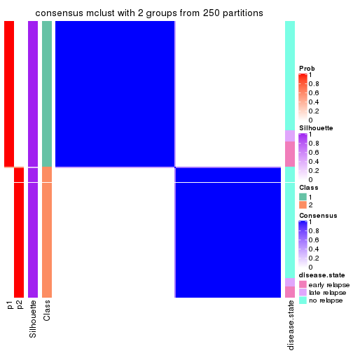</p>

</div>
<div id='tab-ATC-mclust-consensus-heatmap-2'>
<pre><code class="r">consensus_heatmap(res, k = 3)
</code></pre>

<p>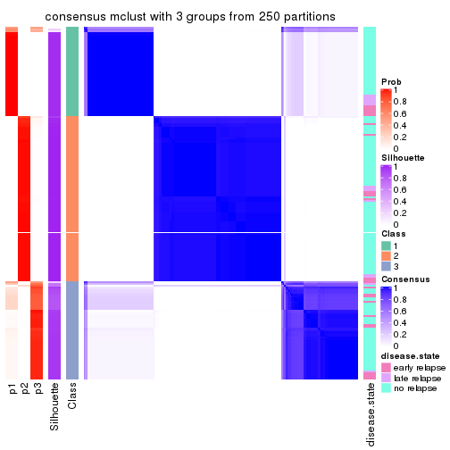</p>

</div>
<div id='tab-ATC-mclust-consensus-heatmap-3'>
<pre><code class="r">consensus_heatmap(res, k = 4)
</code></pre>

<p>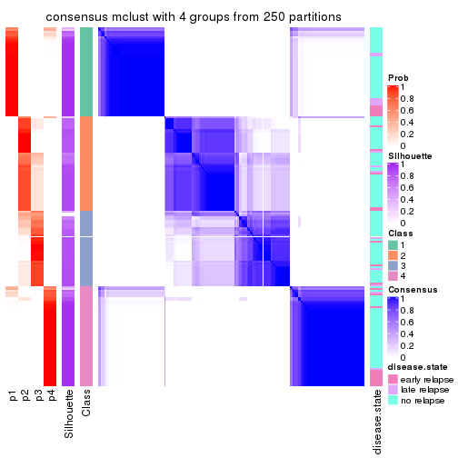</p>

</div>
<div id='tab-ATC-mclust-consensus-heatmap-4'>
<pre><code class="r">consensus_heatmap(res, k = 5)
</code></pre>

<p>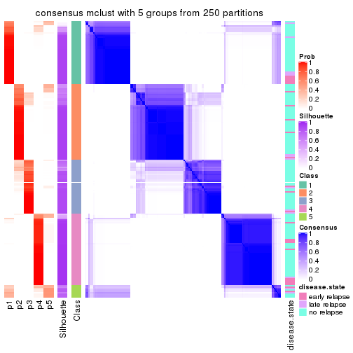</p>

</div>
<div id='tab-ATC-mclust-consensus-heatmap-5'>
<pre><code class="r">consensus_heatmap(res, k = 6)
</code></pre>

<p>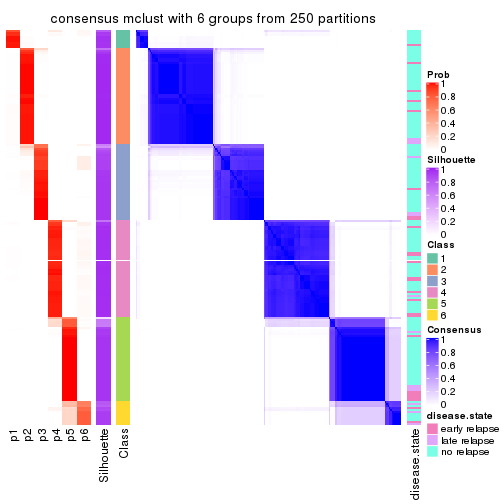</p>

</div>
</div>

Heatmaps for the membership of samples in all partitions to see how consistent they are:


<script>
$( function() {
	$( '#tabs-ATC-mclust-membership-heatmap' ).tabs();
} );
</script>
<div id='tabs-ATC-mclust-membership-heatmap'>
<ul>
<li><a href='#tab-ATC-mclust-membership-heatmap-1'>k = 2</a></li>
<li><a href='#tab-ATC-mclust-membership-heatmap-2'>k = 3</a></li>
<li><a href='#tab-ATC-mclust-membership-heatmap-3'>k = 4</a></li>
<li><a href='#tab-ATC-mclust-membership-heatmap-4'>k = 5</a></li>
<li><a href='#tab-ATC-mclust-membership-heatmap-5'>k = 6</a></li>
</ul>
<div id='tab-ATC-mclust-membership-heatmap-1'>
<pre><code class="r">membership_heatmap(res, k = 2)
</code></pre>

<p>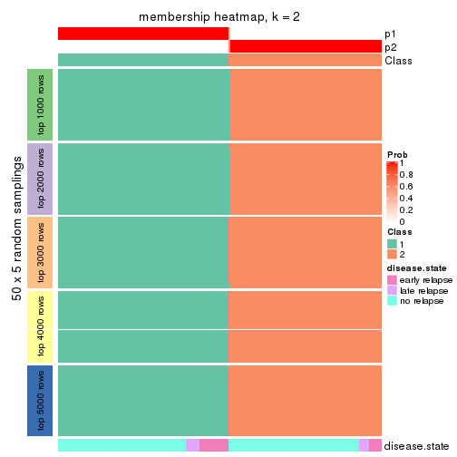</p>

</div>
<div id='tab-ATC-mclust-membership-heatmap-2'>
<pre><code class="r">membership_heatmap(res, k = 3)
</code></pre>

<p>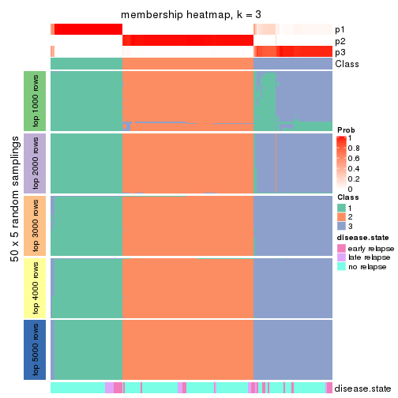</p>

</div>
<div id='tab-ATC-mclust-membership-heatmap-3'>
<pre><code class="r">membership_heatmap(res, k = 4)
</code></pre>

<p>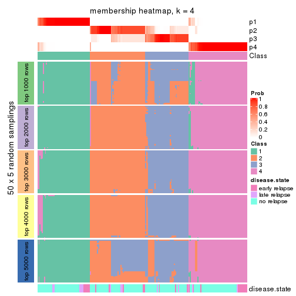</p>

</div>
<div id='tab-ATC-mclust-membership-heatmap-4'>
<pre><code class="r">membership_heatmap(res, k = 5)
</code></pre>

<p>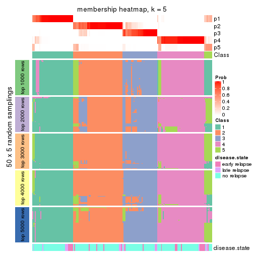</p>

</div>
<div id='tab-ATC-mclust-membership-heatmap-5'>
<pre><code class="r">membership_heatmap(res, k = 6)
</code></pre>

<p>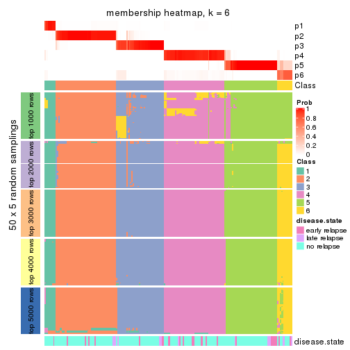</p>

</div>
</div>

As soon as we have had the classes for columns, we can look for signatures
which are significantly different between classes which can be candidate marks
for certain classes. Following are the heatmaps for signatures.


Signature heatmaps where rows are scaled:


<script>
$( function() {
	$( '#tabs-ATC-mclust-get-signatures' ).tabs();
} );
</script>
<div id='tabs-ATC-mclust-get-signatures'>
<ul>
<li><a href='#tab-ATC-mclust-get-signatures-1'>k = 2</a></li>
<li><a href='#tab-ATC-mclust-get-signatures-2'>k = 3</a></li>
<li><a href='#tab-ATC-mclust-get-signatures-3'>k = 4</a></li>
<li><a href='#tab-ATC-mclust-get-signatures-4'>k = 5</a></li>
<li><a href='#tab-ATC-mclust-get-signatures-5'>k = 6</a></li>
</ul>
<div id='tab-ATC-mclust-get-signatures-1'>
<pre><code class="r">get_signatures(res, k = 2)
</code></pre>

<p>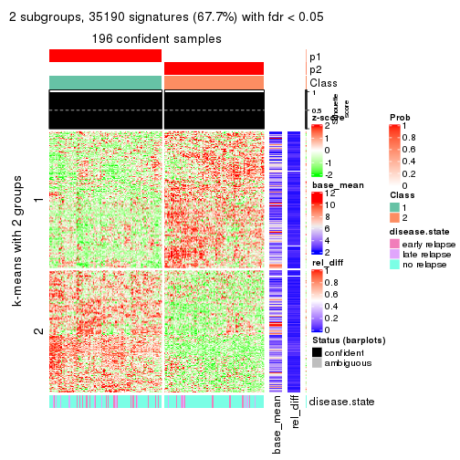</p>

</div>
<div id='tab-ATC-mclust-get-signatures-2'>
<pre><code class="r">get_signatures(res, k = 3)
</code></pre>

<p>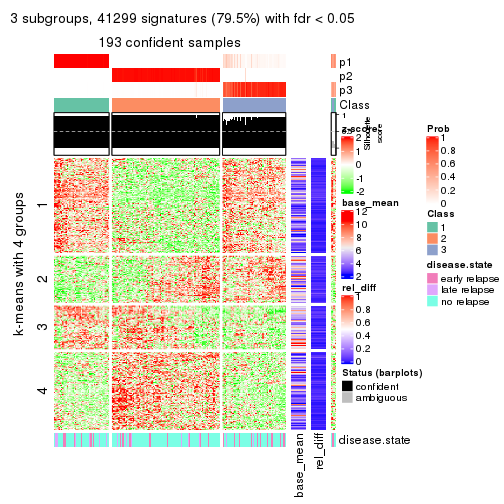</p>

</div>
<div id='tab-ATC-mclust-get-signatures-3'>
<pre><code class="r">get_signatures(res, k = 4)
</code></pre>

<p>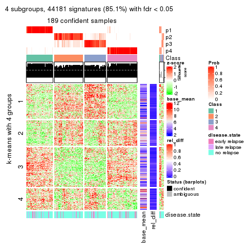</p>

</div>
<div id='tab-ATC-mclust-get-signatures-4'>
<pre><code class="r">get_signatures(res, k = 5)
</code></pre>

<p></p>

</div>
<div id='tab-ATC-mclust-get-signatures-5'>
<pre><code class="r">get_signatures(res, k = 6)
</code></pre>

<p>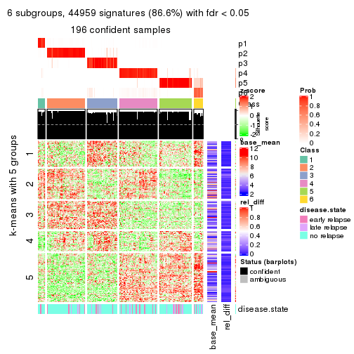</p>

</div>
</div>


Signature heatmaps where rows are not scaled:


<script>
$( function() {
	$( '#tabs-ATC-mclust-get-signatures-no-scale' ).tabs();
} );
</script>
<div id='tabs-ATC-mclust-get-signatures-no-scale'>
<ul>
<li><a href='#tab-ATC-mclust-get-signatures-no-scale-1'>k = 2</a></li>
<li><a href='#tab-ATC-mclust-get-signatures-no-scale-2'>k = 3</a></li>
<li><a href='#tab-ATC-mclust-get-signatures-no-scale-3'>k = 4</a></li>
<li><a href='#tab-ATC-mclust-get-signatures-no-scale-4'>k = 5</a></li>
<li><a href='#tab-ATC-mclust-get-signatures-no-scale-5'>k = 6</a></li>
</ul>
<div id='tab-ATC-mclust-get-signatures-no-scale-1'>
<pre><code class="r">get_signatures(res, k = 2, scale_rows = FALSE)
</code></pre>

<p>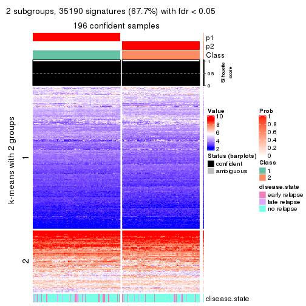</p>

</div>
<div id='tab-ATC-mclust-get-signatures-no-scale-2'>
<pre><code class="r">get_signatures(res, k = 3, scale_rows = FALSE)
</code></pre>

<p>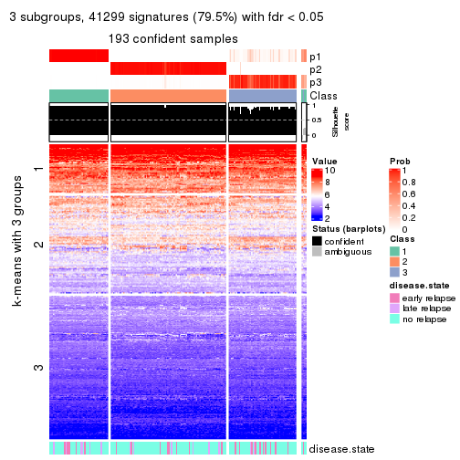</p>

</div>
<div id='tab-ATC-mclust-get-signatures-no-scale-3'>
<pre><code class="r">get_signatures(res, k = 4, scale_rows = FALSE)
</code></pre>

<p>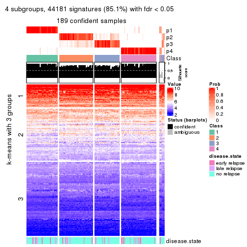</p>

</div>
<div id='tab-ATC-mclust-get-signatures-no-scale-4'>
<pre><code class="r">get_signatures(res, k = 5, scale_rows = FALSE)
</code></pre>

<p>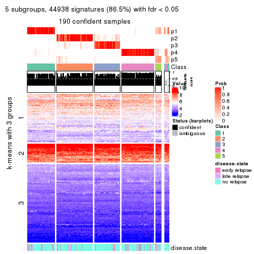</p>

</div>
<div id='tab-ATC-mclust-get-signatures-no-scale-5'>
<pre><code class="r">get_signatures(res, k = 6, scale_rows = FALSE)
</code></pre>

<p>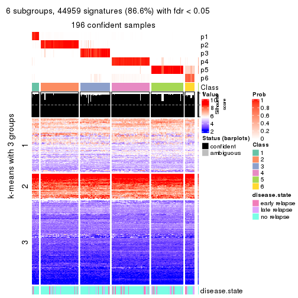</p>

</div>
</div>


Compare the overlap of signatures from different k:

```r
compare_signatures(res)
```

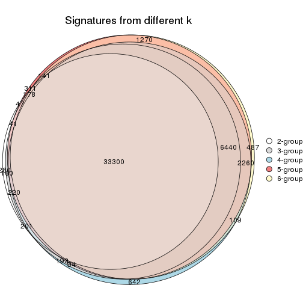

`get_signature()` returns a data frame invisibly. TO get the list of signatures, the function
call should be assigned to a variable explicitly. In following code, if `plot` argument is set
to `FALSE`, no heatmap is plotted while only the differential analysis is performed.

```r
# code only for demonstration
tb = get_signature(res, k = ..., plot = FALSE)
```

An example of the output of `tb` is:

```
#>   which_row         fdr    mean_1    mean_2 scaled_mean_1 scaled_mean_2 km
#> 1        38 0.042760348  8.373488  9.131774    -0.5533452     0.5164555  1
#> 2        40 0.018707592  7.106213  8.469186    -0.6173731     0.5762149  1
#> 3        55 0.019134737 10.221463 11.207825    -0.6159697     0.5749050  1
#> 4        59 0.006059896  5.921854  7.869574    -0.6899429     0.6439467  1
#> 5        60 0.018055526  8.928898 10.211722    -0.6204761     0.5791110  1
#> 6        98 0.009384629 15.714769 14.887706     0.6635654    -0.6193277  2
...
```

The columns in `tb` are:

1. `which_row`: row indices corresponding to the input matrix.
2. `fdr`: FDR for the differential test. 
3. `mean_x`: The mean value in group x.
4. `scaled_mean_x`: The mean value in group x after rows are scaled.
5. `km`: Row groups if k-means clustering is applied to rows.


UMAP plot which shows how samples are separated.


<script>
$( function() {
	$( '#tabs-ATC-mclust-dimension-reduction' ).tabs();
} );
</script>
<div id='tabs-ATC-mclust-dimension-reduction'>
<ul>
<li><a href='#tab-ATC-mclust-dimension-reduction-1'>k = 2</a></li>
<li><a href='#tab-ATC-mclust-dimension-reduction-2'>k = 3</a></li>
<li><a href='#tab-ATC-mclust-dimension-reduction-3'>k = 4</a></li>
<li><a href='#tab-ATC-mclust-dimension-reduction-4'>k = 5</a></li>
<li><a href='#tab-ATC-mclust-dimension-reduction-5'>k = 6</a></li>
</ul>
<div id='tab-ATC-mclust-dimension-reduction-1'>
<pre><code class="r">dimension_reduction(res, k = 2, method = &quot;UMAP&quot;)
</code></pre>

<p>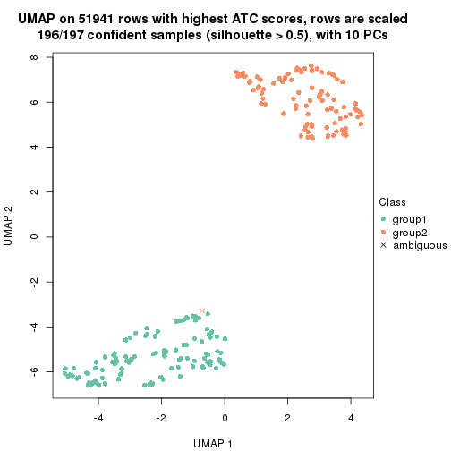</p>

</div>
<div id='tab-ATC-mclust-dimension-reduction-2'>
<pre><code class="r">dimension_reduction(res, k = 3, method = &quot;UMAP&quot;)
</code></pre>

<p>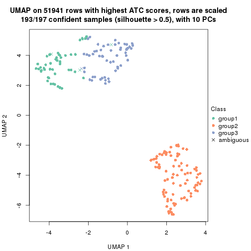</p>

</div>
<div id='tab-ATC-mclust-dimension-reduction-3'>
<pre><code class="r">dimension_reduction(res, k = 4, method = &quot;UMAP&quot;)
</code></pre>

<p>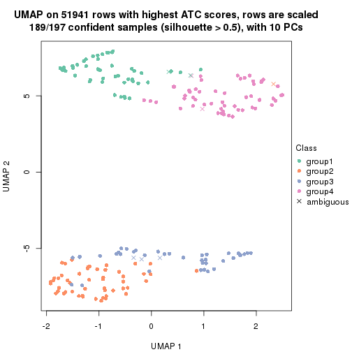</p>

</div>
<div id='tab-ATC-mclust-dimension-reduction-4'>
<pre><code class="r">dimension_reduction(res, k = 5, method = &quot;UMAP&quot;)
</code></pre>

<p>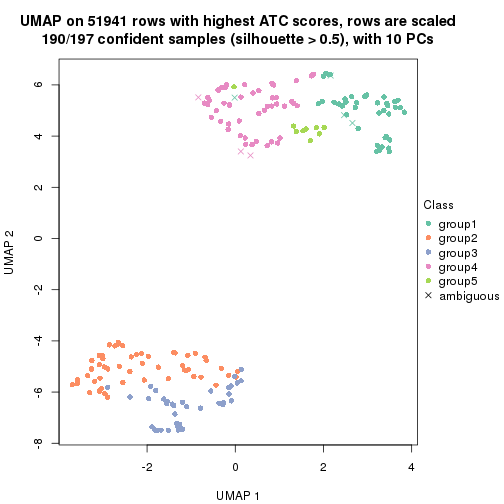</p>

</div>
<div id='tab-ATC-mclust-dimension-reduction-5'>
<pre><code class="r">dimension_reduction(res, k = 6, method = &quot;UMAP&quot;)
</code></pre>

<p>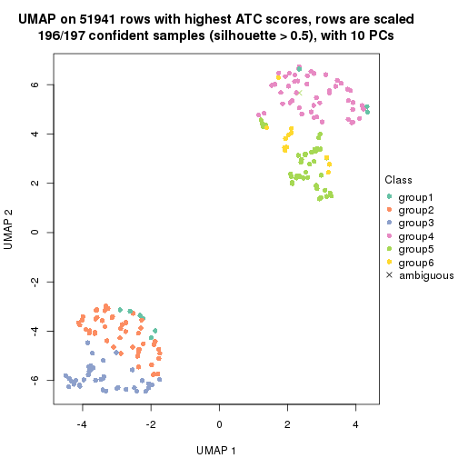</p>

</div>
</div>


Following heatmap shows how subgroups are split when increasing `k`:

```r
collect_classes(res)
```

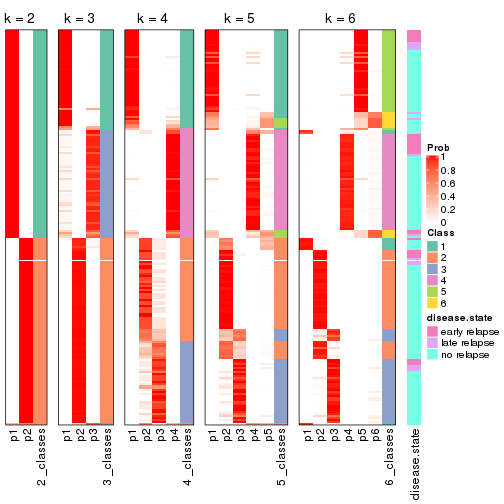


Test correlation between subgroups and known annotations. If the known
annotation is numeric, one-way ANOVA test is applied, and if the known
annotation is discrete, chi-squared contingency table test is applied.

```r
test_to_known_factors(res)
```

```
#>              n disease.state(p) k
#> ATC:mclust 196            0.182 2
#> ATC:mclust 193            0.130 3
#> ATC:mclust 189            0.321 4
#> ATC:mclust 190            0.232 5
#> ATC:mclust 196            0.204 6
```


If matrix rows can be associated to genes, consider to use `functional_enrichment(res,
...)` to perform function enrichment for the signature genes. See [this vignette](http://bioconductor.org/packages/devel/bioc/vignettes/cola/inst/doc/functional_enrichment.html) for more detailed explanations.


 

---------------------------------------------------


### ATC:NMF**


The object with results only for a single top-value method and a single partition method 
can be extracted as:

```r
res = res_list["ATC", "NMF"]
# you can also extract it by
# res = res_list["ATC:NMF"]
```

A summary of `res` and all the functions that can be applied to it:

```r
res
```

```
#> A 'ConsensusPartition' object with k = 2, 3, 4, 5, 6.
#>   On a matrix with 51941 rows and 197 columns.
#>   Top rows (1000, 2000, 3000, 4000, 5000) are extracted by 'ATC' method.
#>   Subgroups are detected by 'NMF' method.
#>   Performed in total 1250 partitions by row resampling.
#>   Best k for subgroups seems to be 2.
#> 
#> Following methods can be applied to this 'ConsensusPartition' object:
#>  [1] "cola_report"             "collect_classes"         "collect_plots"          
#>  [4] "collect_stats"           "colnames"                "compare_signatures"     
#>  [7] "consensus_heatmap"       "dimension_reduction"     "functional_enrichment"  
#> [10] "get_anno_col"            "get_anno"                "get_classes"            
#> [13] "get_consensus"           "get_matrix"              "get_membership"         
#> [16] "get_param"               "get_signatures"          "get_stats"              
#> [19] "is_best_k"               "is_stable_k"             "membership_heatmap"     
#> [22] "ncol"                    "nrow"                    "plot_ecdf"              
#> [25] "rownames"                "select_partition_number" "show"                   
#> [28] "suggest_best_k"          "test_to_known_factors"
```

`collect_plots()` function collects all the plots made from `res` for all `k` (number of partitions)
into one single page to provide an easy and fast comparison between different `k`.

```r
collect_plots(res)
```

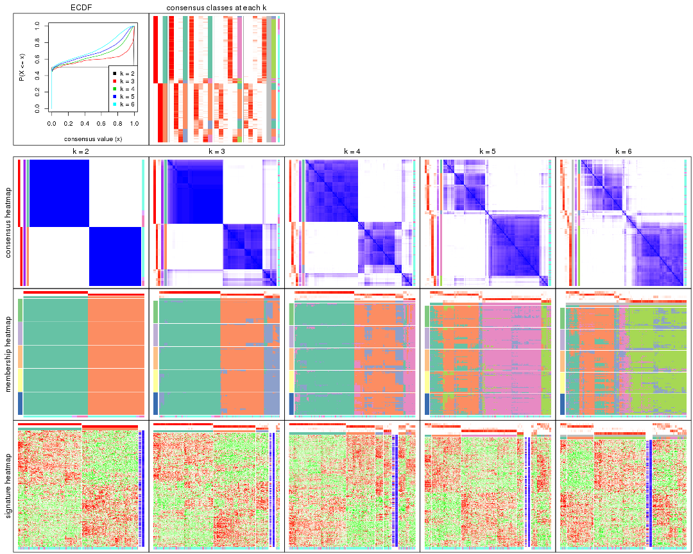

The plots are:

- The first row: a plot of the ECDF (empirical cumulative distribution
  function) curves of the consensus matrix for each `k` and the heatmap of
  predicted classes for each `k`.
- The second row: heatmaps of the consensus matrix for each `k`.
- The third row: heatmaps of the membership matrix for each `k`.
- The fouth row: heatmaps of the signatures for each `k`.

All the plots in panels can be made by individual functions and they are
plotted later in this section.

`select_partition_number()` produces several plots showing different
statistics for choosing "optimized" `k`. There are following statistics:

- ECDF curves of the consensus matrix for each `k`;
- 1-PAC. [The PAC
  score](https://en.wikipedia.org/wiki/Consensus_clustering#Over-interpretation_potential_of_consensus_clustering)
  measures the proportion of the ambiguous subgrouping.
- Mean silhouette score.
- Concordance. The mean probability of fiting the consensus class ids in all
  partitions.
- Area increased. Denote $A_k$ as the area under the ECDF curve for current
  `k`, the area increased is defined as $A_k - A_{k-1}$.
- Rand index. The percent of pairs of samples that are both in a same cluster
  or both are not in a same cluster in the partition of k and k-1.
- Jaccard index. The ratio of pairs of samples are both in a same cluster in
  the partition of k and k-1 and the pairs of samples are both in a same
  cluster in the partition k or k-1.

The detailed explanations of these statistics can be found in [the _cola_
vignette](http://bioconductor.org/packages/devel/bioc/vignettes/cola/inst/doc/cola.html#toc_13).

Generally speaking, lower PAC score, higher mean silhouette score or higher
concordance corresponds to better partition. Rand index and Jaccard index
measure how similar the current partition is compared to partition with `k-1`.
If they are too similar, we won't accept `k` is better than `k-1`.

```r
select_partition_number(res)
```

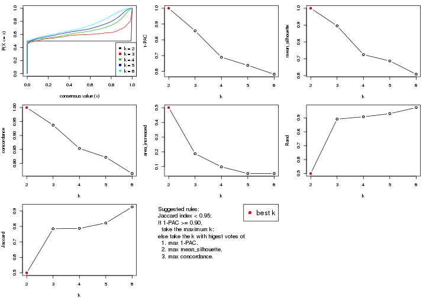

The numeric values for all these statistics can be obtained by `get_stats()`.

```r
get_stats(res)
```

```
#>   k 1-PAC mean_silhouette concordance area_increased  Rand Jaccard
#> 2 2 1.000           1.000       1.000         0.5009 0.500   0.500
#> 3 3 0.857           0.896       0.937         0.1878 0.891   0.785
#> 4 4 0.689           0.725       0.854         0.0980 0.908   0.787
#> 5 5 0.638           0.687       0.822         0.0528 0.931   0.822
#> 6 6 0.582           0.609       0.763         0.0530 0.974   0.926
```

`suggest_best_k()` suggests the best $k$ based on these statistics. The rules are as follows:

- All $k$ with Jaccard index larger than 0.95 are removed because increasing
  $k$ does not provide enough extra information. If all $k$ are removed, it is
  marked as no subgroup is detected.
- For all $k$ with 1-PAC score larger than 0.9, the maximal $k$ is taken as
  the best $k$, and other $k$ are marked as optional $k$.
- If it does not fit the second rule. The $k$ with the maximal vote of the
  highest 1-PAC score, highest mean silhouette, and highest concordance is
  taken as the best $k$.

```r
suggest_best_k(res)
```

```
#> [1] 2
```


Following shows the table of the partitions (You need to click the **show/hide
code output** link to see it). The membership matrix (columns with name `p*`)
is inferred by
[`clue::cl_consensus()`](https://www.rdocumentation.org/link/cl_consensus?package=clue)
function with the `SE` method. Basically the value in the membership matrix
represents the probability to belong to a certain group. The finall class
label for an item is determined with the group with highest probability it
belongs to.

In `get_classes()` function, the entropy is calculated from the membership
matrix and the silhouette score is calculated from the consensus matrix.


<script>
$( function() {
	$( '#tabs-ATC-NMF-get-classes' ).tabs();
} );
</script>
<div id='tabs-ATC-NMF-get-classes'>
<ul>
<li><a href='#tab-ATC-NMF-get-classes-1'>k = 2</a></li>
<li><a href='#tab-ATC-NMF-get-classes-2'>k = 3</a></li>
<li><a href='#tab-ATC-NMF-get-classes-3'>k = 4</a></li>
<li><a href='#tab-ATC-NMF-get-classes-4'>k = 5</a></li>
<li><a href='#tab-ATC-NMF-get-classes-5'>k = 6</a></li>
</ul>

<div id='tab-ATC-NMF-get-classes-1'>
<p><a id='tab-ATC-NMF-get-classes-1-a' style='color:#0366d6' href='#'>show/hide code output</a></p>
<pre><code class="r">cbind(get_classes(res, k = 2), get_membership(res, k = 2))
</code></pre>

<pre><code>#&gt;           class entropy silhouette p1 p2
#&gt; GSM342319     1       0          1  1  0
#&gt; GSM342323     1       0          1  1  0
#&gt; GSM342325     1       0          1  1  0
#&gt; GSM342326     1       0          1  1  0
#&gt; GSM342327     1       0          1  1  0
#&gt; GSM342329     1       0          1  1  0
#&gt; GSM342331     1       0          1  1  0
#&gt; GSM342334     1       0          1  1  0
#&gt; GSM342335     1       0          1  1  0
#&gt; GSM342354     1       0          1  1  0
#&gt; GSM342371     1       0          1  1  0
#&gt; GSM342380     1       0          1  1  0
#&gt; GSM342382     1       0          1  1  0
#&gt; GSM342399     1       0          1  1  0
#&gt; GSM342402     1       0          1  1  0
#&gt; GSM342404     1       0          1  1  0
#&gt; GSM342408     1       0          1  1  0
#&gt; GSM342409     1       0          1  1  0
#&gt; GSM342426     2       0          1  0  1
#&gt; GSM342441     2       0          1  0  1
#&gt; GSM342444     2       0          1  0  1
#&gt; GSM342451     2       0          1  0  1
#&gt; GSM342462     2       0          1  0  1
#&gt; GSM342467     2       0          1  0  1
#&gt; GSM342484     2       0          1  0  1
#&gt; GSM342491     2       0          1  0  1
#&gt; GSM342322     1       0          1  1  0
#&gt; GSM342338     1       0          1  1  0
#&gt; GSM342347     1       0          1  1  0
#&gt; GSM342356     1       0          1  1  0
#&gt; GSM342357     1       0          1  1  0
#&gt; GSM342366     1       0          1  1  0
#&gt; GSM342385     1       0          1  1  0
#&gt; GSM342421     1       0          1  1  0
#&gt; GSM342437     2       0          1  0  1
#&gt; GSM342454     2       0          1  0  1
#&gt; GSM342471     2       0          1  0  1
#&gt; GSM342477     2       0          1  0  1
#&gt; GSM342495     2       0          1  0  1
#&gt; GSM342496     2       0          1  0  1
#&gt; GSM342320     1       0          1  1  0
#&gt; GSM342321     1       0          1  1  0
#&gt; GSM342324     1       0          1  1  0
#&gt; GSM342328     1       0          1  1  0
#&gt; GSM342330     1       0          1  1  0
#&gt; GSM342332     1       0          1  1  0
#&gt; GSM342333     1       0          1  1  0
#&gt; GSM342336     1       0          1  1  0
#&gt; GSM342337     1       0          1  1  0
#&gt; GSM342339     1       0          1  1  0
#&gt; GSM342340     1       0          1  1  0
#&gt; GSM342341     1       0          1  1  0
#&gt; GSM342342     1       0          1  1  0
#&gt; GSM342343     1       0          1  1  0
#&gt; GSM342344     1       0          1  1  0
#&gt; GSM342345     1       0          1  1  0
#&gt; GSM342346     1       0          1  1  0
#&gt; GSM342348     1       0          1  1  0
#&gt; GSM342349     1       0          1  1  0
#&gt; GSM342350     1       0          1  1  0
#&gt; GSM342351     1       0          1  1  0
#&gt; GSM342352     1       0          1  1  0
#&gt; GSM342353     1       0          1  1  0
#&gt; GSM342355     1       0          1  1  0
#&gt; GSM342358     1       0          1  1  0
#&gt; GSM342359     1       0          1  1  0
#&gt; GSM342360     1       0          1  1  0
#&gt; GSM342361     1       0          1  1  0
#&gt; GSM342362     1       0          1  1  0
#&gt; GSM342363     1       0          1  1  0
#&gt; GSM342364     1       0          1  1  0
#&gt; GSM342365     1       0          1  1  0
#&gt; GSM342367     1       0          1  1  0
#&gt; GSM342368     1       0          1  1  0
#&gt; GSM342369     1       0          1  1  0
#&gt; GSM342370     1       0          1  1  0
#&gt; GSM342372     1       0          1  1  0
#&gt; GSM342373     1       0          1  1  0
#&gt; GSM342374     1       0          1  1  0
#&gt; GSM342375     1       0          1  1  0
#&gt; GSM342376     1       0          1  1  0
#&gt; GSM342377     1       0          1  1  0
#&gt; GSM342378     1       0          1  1  0
#&gt; GSM342379     1       0          1  1  0
#&gt; GSM342381     1       0          1  1  0
#&gt; GSM342383     1       0          1  1  0
#&gt; GSM342384     1       0          1  1  0
#&gt; GSM342386     1       0          1  1  0
#&gt; GSM342387     1       0          1  1  0
#&gt; GSM342388     1       0          1  1  0
#&gt; GSM342389     1       0          1  1  0
#&gt; GSM342390     1       0          1  1  0
#&gt; GSM342391     1       0          1  1  0
#&gt; GSM342392     1       0          1  1  0
#&gt; GSM342393     1       0          1  1  0
#&gt; GSM342394     1       0          1  1  0
#&gt; GSM342395     1       0          1  1  0
#&gt; GSM342396     1       0          1  1  0
#&gt; GSM342397     1       0          1  1  0
#&gt; GSM342398     1       0          1  1  0
#&gt; GSM342400     1       0          1  1  0
#&gt; GSM342401     1       0          1  1  0
#&gt; GSM342403     1       0          1  1  0
#&gt; GSM342405     1       0          1  1  0
#&gt; GSM342406     1       0          1  1  0
#&gt; GSM342407     1       0          1  1  0
#&gt; GSM342410     1       0          1  1  0
#&gt; GSM342411     1       0          1  1  0
#&gt; GSM342412     1       0          1  1  0
#&gt; GSM342413     1       0          1  1  0
#&gt; GSM342414     1       0          1  1  0
#&gt; GSM342415     1       0          1  1  0
#&gt; GSM342416     1       0          1  1  0
#&gt; GSM342417     1       0          1  1  0
#&gt; GSM342418     1       0          1  1  0
#&gt; GSM342419     1       0          1  1  0
#&gt; GSM342420     1       0          1  1  0
#&gt; GSM342422     1       0          1  1  0
#&gt; GSM342423     1       0          1  1  0
#&gt; GSM342424     2       0          1  0  1
#&gt; GSM342425     2       0          1  0  1
#&gt; GSM342427     2       0          1  0  1
#&gt; GSM342428     2       0          1  0  1
#&gt; GSM342429     2       0          1  0  1
#&gt; GSM342430     2       0          1  0  1
#&gt; GSM342431     2       0          1  0  1
#&gt; GSM342432     2       0          1  0  1
#&gt; GSM342433     2       0          1  0  1
#&gt; GSM342434     2       0          1  0  1
#&gt; GSM342435     2       0          1  0  1
#&gt; GSM342436     2       0          1  0  1
#&gt; GSM342438     2       0          1  0  1
#&gt; GSM342439     2       0          1  0  1
#&gt; GSM342440     2       0          1  0  1
#&gt; GSM342442     2       0          1  0  1
#&gt; GSM342443     2       0          1  0  1
#&gt; GSM342445     2       0          1  0  1
#&gt; GSM342446     2       0          1  0  1
#&gt; GSM342447     2       0          1  0  1
#&gt; GSM342448     2       0          1  0  1
#&gt; GSM342449     2       0          1  0  1
#&gt; GSM342450     2       0          1  0  1
#&gt; GSM342452     2       0          1  0  1
#&gt; GSM342453     2       0          1  0  1
#&gt; GSM342455     2       0          1  0  1
#&gt; GSM342456     2       0          1  0  1
#&gt; GSM342457     2       0          1  0  1
#&gt; GSM342458     2       0          1  0  1
#&gt; GSM342459     2       0          1  0  1
#&gt; GSM342460     2       0          1  0  1
#&gt; GSM342461     2       0          1  0  1
#&gt; GSM342463     2       0          1  0  1
#&gt; GSM342464     2       0          1  0  1
#&gt; GSM342465     2       0          1  0  1
#&gt; GSM342466     2       0          1  0  1
#&gt; GSM342468     2       0          1  0  1
#&gt; GSM342469     2       0          1  0  1
#&gt; GSM342470     2       0          1  0  1
#&gt; GSM342472     2       0          1  0  1
#&gt; GSM342473     2       0          1  0  1
#&gt; GSM342474     2       0          1  0  1
#&gt; GSM342475     2       0          1  0  1
#&gt; GSM342476     2       0          1  0  1
#&gt; GSM342478     2       0          1  0  1
#&gt; GSM342479     2       0          1  0  1
#&gt; GSM342480     2       0          1  0  1
#&gt; GSM342481     2       0          1  0  1
#&gt; GSM342482     2       0          1  0  1
#&gt; GSM342483     2       0          1  0  1
#&gt; GSM342485     2       0          1  0  1
#&gt; GSM342486     2       0          1  0  1
#&gt; GSM342487     2       0          1  0  1
#&gt; GSM342488     2       0          1  0  1
#&gt; GSM342489     2       0          1  0  1
#&gt; GSM342490     2       0          1  0  1
#&gt; GSM342492     2       0          1  0  1
#&gt; GSM342493     2       0          1  0  1
#&gt; GSM342494     2       0          1  0  1
#&gt; GSM342497     2       0          1  0  1
#&gt; GSM342498     2       0          1  0  1
#&gt; GSM342499     2       0          1  0  1
#&gt; GSM342500     2       0          1  0  1
#&gt; GSM342501     2       0          1  0  1
#&gt; GSM342502     2       0          1  0  1
#&gt; GSM342503     2       0          1  0  1
#&gt; GSM342504     2       0          1  0  1
#&gt; GSM342505     2       0          1  0  1
#&gt; GSM342506     2       0          1  0  1
#&gt; GSM342507     2       0          1  0  1
#&gt; GSM342508     2       0          1  0  1
#&gt; GSM342509     2       0          1  0  1
#&gt; GSM342510     2       0          1  0  1
#&gt; GSM342511     2       0          1  0  1
#&gt; GSM342512     2       0          1  0  1
#&gt; GSM342513     2       0          1  0  1
#&gt; GSM342514     2       0          1  0  1
#&gt; GSM342515     2       0          1  0  1
</code></pre>

<script>
$('#tab-ATC-NMF-get-classes-1-a').parent().next().next().hide();
$('#tab-ATC-NMF-get-classes-1-a').click(function(){
  $('#tab-ATC-NMF-get-classes-1-a').parent().next().next().toggle();
  return(false);
});
</script>
</div>

<div id='tab-ATC-NMF-get-classes-2'>
<p><a id='tab-ATC-NMF-get-classes-2-a' style='color:#0366d6' href='#'>show/hide code output</a></p>
<pre><code class="r">cbind(get_classes(res, k = 3), get_membership(res, k = 3))
</code></pre>

<pre><code>#&gt;           class entropy silhouette    p1    p2    p3
#&gt; GSM342319     1  0.0000      0.974 1.000 0.000 0.000
#&gt; GSM342323     1  0.0000      0.974 1.000 0.000 0.000
#&gt; GSM342325     1  0.0592      0.969 0.988 0.000 0.012
#&gt; GSM342326     1  0.3482      0.852 0.872 0.000 0.128
#&gt; GSM342327     1  0.4121      0.801 0.832 0.000 0.168
#&gt; GSM342329     1  0.0000      0.974 1.000 0.000 0.000
#&gt; GSM342331     1  0.5363      0.626 0.724 0.000 0.276
#&gt; GSM342334     1  0.0000      0.974 1.000 0.000 0.000
#&gt; GSM342335     1  0.0000      0.974 1.000 0.000 0.000
#&gt; GSM342354     1  0.0000      0.974 1.000 0.000 0.000
#&gt; GSM342371     1  0.0000      0.974 1.000 0.000 0.000
#&gt; GSM342380     1  0.0000      0.974 1.000 0.000 0.000
#&gt; GSM342382     1  0.0424      0.971 0.992 0.000 0.008
#&gt; GSM342399     1  0.0424      0.971 0.992 0.000 0.008
#&gt; GSM342402     1  0.0000      0.974 1.000 0.000 0.000
#&gt; GSM342404     1  0.3482      0.852 0.872 0.000 0.128
#&gt; GSM342408     1  0.3686      0.837 0.860 0.000 0.140
#&gt; GSM342409     1  0.0000      0.974 1.000 0.000 0.000
#&gt; GSM342426     3  0.3941      0.769 0.000 0.156 0.844
#&gt; GSM342441     2  0.2796      0.910 0.000 0.908 0.092
#&gt; GSM342444     2  0.0592      0.928 0.000 0.988 0.012
#&gt; GSM342451     2  0.1643      0.909 0.000 0.956 0.044
#&gt; GSM342462     2  0.1529      0.935 0.000 0.960 0.040
#&gt; GSM342467     3  0.2066      0.780 0.000 0.060 0.940
#&gt; GSM342484     2  0.1860      0.933 0.000 0.948 0.052
#&gt; GSM342491     2  0.3686      0.861 0.000 0.860 0.140
#&gt; GSM342322     1  0.0000      0.974 1.000 0.000 0.000
#&gt; GSM342338     1  0.0424      0.971 0.992 0.000 0.008
#&gt; GSM342347     1  0.0000      0.974 1.000 0.000 0.000
#&gt; GSM342356     1  0.0592      0.969 0.988 0.000 0.012
#&gt; GSM342357     1  0.0000      0.974 1.000 0.000 0.000
#&gt; GSM342366     1  0.0237      0.973 0.996 0.000 0.004
#&gt; GSM342385     1  0.0000      0.974 1.000 0.000 0.000
#&gt; GSM342421     1  0.0000      0.974 1.000 0.000 0.000
#&gt; GSM342437     3  0.6168      0.464 0.000 0.412 0.588
#&gt; GSM342454     2  0.0424      0.929 0.000 0.992 0.008
#&gt; GSM342471     2  0.1964      0.932 0.000 0.944 0.056
#&gt; GSM342477     2  0.3267      0.888 0.000 0.884 0.116
#&gt; GSM342495     3  0.5363      0.693 0.000 0.276 0.724
#&gt; GSM342496     2  0.0424      0.929 0.000 0.992 0.008
#&gt; GSM342320     1  0.5859      0.481 0.656 0.000 0.344
#&gt; GSM342321     1  0.0000      0.974 1.000 0.000 0.000
#&gt; GSM342324     1  0.0000      0.974 1.000 0.000 0.000
#&gt; GSM342328     1  0.0000      0.974 1.000 0.000 0.000
#&gt; GSM342330     1  0.1753      0.937 0.952 0.000 0.048
#&gt; GSM342332     1  0.0000      0.974 1.000 0.000 0.000
#&gt; GSM342333     1  0.0000      0.974 1.000 0.000 0.000
#&gt; GSM342336     1  0.0000      0.974 1.000 0.000 0.000
#&gt; GSM342337     1  0.2339      0.930 0.940 0.012 0.048
#&gt; GSM342339     1  0.0000      0.974 1.000 0.000 0.000
#&gt; GSM342340     1  0.0424      0.971 0.992 0.000 0.008
#&gt; GSM342341     1  0.0000      0.974 1.000 0.000 0.000
#&gt; GSM342342     1  0.0424      0.971 0.992 0.000 0.008
#&gt; GSM342343     1  0.2947      0.910 0.920 0.020 0.060
#&gt; GSM342344     1  0.0000      0.974 1.000 0.000 0.000
#&gt; GSM342345     1  0.0000      0.974 1.000 0.000 0.000
#&gt; GSM342346     1  0.0000      0.974 1.000 0.000 0.000
#&gt; GSM342348     1  0.0000      0.974 1.000 0.000 0.000
#&gt; GSM342349     1  0.0000      0.974 1.000 0.000 0.000
#&gt; GSM342350     1  0.0000      0.974 1.000 0.000 0.000
#&gt; GSM342351     3  0.3340      0.717 0.120 0.000 0.880
#&gt; GSM342352     3  0.5988      0.371 0.368 0.000 0.632
#&gt; GSM342353     1  0.0000      0.974 1.000 0.000 0.000
#&gt; GSM342355     1  0.0592      0.969 0.988 0.000 0.012
#&gt; GSM342358     1  0.0592      0.967 0.988 0.000 0.012
#&gt; GSM342359     1  0.1411      0.948 0.964 0.000 0.036
#&gt; GSM342360     1  0.0000      0.974 1.000 0.000 0.000
#&gt; GSM342361     3  0.5560      0.521 0.300 0.000 0.700
#&gt; GSM342362     1  0.0000      0.974 1.000 0.000 0.000
#&gt; GSM342363     1  0.0424      0.971 0.992 0.000 0.008
#&gt; GSM342364     1  0.0592      0.969 0.988 0.000 0.012
#&gt; GSM342365     1  0.5254      0.649 0.736 0.000 0.264
#&gt; GSM342367     1  0.0592      0.969 0.988 0.000 0.012
#&gt; GSM342368     1  0.0000      0.974 1.000 0.000 0.000
#&gt; GSM342369     1  0.0237      0.972 0.996 0.000 0.004
#&gt; GSM342370     1  0.0237      0.972 0.996 0.000 0.004
#&gt; GSM342372     1  0.0237      0.972 0.996 0.000 0.004
#&gt; GSM342373     1  0.0000      0.974 1.000 0.000 0.000
#&gt; GSM342374     1  0.0237      0.972 0.996 0.000 0.004
#&gt; GSM342375     1  0.0000      0.974 1.000 0.000 0.000
#&gt; GSM342376     1  0.0592      0.969 0.988 0.000 0.012
#&gt; GSM342377     1  0.0747      0.967 0.984 0.000 0.016
#&gt; GSM342378     1  0.0592      0.969 0.988 0.000 0.012
#&gt; GSM342379     1  0.0000      0.974 1.000 0.000 0.000
#&gt; GSM342381     1  0.0000      0.974 1.000 0.000 0.000
#&gt; GSM342383     1  0.0000      0.974 1.000 0.000 0.000
#&gt; GSM342384     1  0.0000      0.974 1.000 0.000 0.000
#&gt; GSM342386     1  0.0000      0.974 1.000 0.000 0.000
#&gt; GSM342387     1  0.0237      0.972 0.996 0.000 0.004
#&gt; GSM342388     1  0.0592      0.969 0.988 0.000 0.012
#&gt; GSM342389     1  0.0592      0.969 0.988 0.000 0.012
#&gt; GSM342390     1  0.0000      0.974 1.000 0.000 0.000
#&gt; GSM342391     1  0.0000      0.974 1.000 0.000 0.000
#&gt; GSM342392     1  0.2383      0.930 0.940 0.016 0.044
#&gt; GSM342393     3  0.6026      0.369 0.376 0.000 0.624
#&gt; GSM342394     1  0.0000      0.974 1.000 0.000 0.000
#&gt; GSM342395     1  0.0000      0.974 1.000 0.000 0.000
#&gt; GSM342396     1  0.0237      0.973 0.996 0.000 0.004
#&gt; GSM342397     1  0.0000      0.974 1.000 0.000 0.000
#&gt; GSM342398     1  0.0592      0.969 0.988 0.000 0.012
#&gt; GSM342400     1  0.0000      0.974 1.000 0.000 0.000
#&gt; GSM342401     1  0.0592      0.969 0.988 0.000 0.012
#&gt; GSM342403     1  0.0424      0.971 0.992 0.000 0.008
#&gt; GSM342405     1  0.4002      0.811 0.840 0.000 0.160
#&gt; GSM342406     1  0.0000      0.974 1.000 0.000 0.000
#&gt; GSM342407     1  0.0000      0.974 1.000 0.000 0.000
#&gt; GSM342410     1  0.0000      0.974 1.000 0.000 0.000
#&gt; GSM342411     1  0.0000      0.974 1.000 0.000 0.000
#&gt; GSM342412     1  0.0000      0.974 1.000 0.000 0.000
#&gt; GSM342413     1  0.4291      0.784 0.820 0.000 0.180
#&gt; GSM342414     1  0.1031      0.958 0.976 0.000 0.024
#&gt; GSM342415     1  0.0424      0.971 0.992 0.000 0.008
#&gt; GSM342416     1  0.0000      0.974 1.000 0.000 0.000
#&gt; GSM342417     1  0.0000      0.974 1.000 0.000 0.000
#&gt; GSM342418     1  0.0592      0.967 0.988 0.000 0.012
#&gt; GSM342419     1  0.2313      0.932 0.944 0.024 0.032
#&gt; GSM342420     3  0.3412      0.715 0.124 0.000 0.876
#&gt; GSM342422     1  0.2116      0.937 0.948 0.012 0.040
#&gt; GSM342423     1  0.0000      0.974 1.000 0.000 0.000
#&gt; GSM342424     3  0.2066      0.780 0.000 0.060 0.940
#&gt; GSM342425     2  0.3551      0.871 0.000 0.868 0.132
#&gt; GSM342427     3  0.2959      0.781 0.000 0.100 0.900
#&gt; GSM342428     3  0.2448      0.782 0.000 0.076 0.924
#&gt; GSM342429     2  0.1964      0.932 0.000 0.944 0.056
#&gt; GSM342430     2  0.1860      0.902 0.000 0.948 0.052
#&gt; GSM342431     2  0.0592      0.928 0.000 0.988 0.012
#&gt; GSM342432     2  0.1163      0.936 0.000 0.972 0.028
#&gt; GSM342433     2  0.3412      0.880 0.000 0.876 0.124
#&gt; GSM342434     3  0.4796      0.738 0.000 0.220 0.780
#&gt; GSM342435     3  0.4235      0.761 0.000 0.176 0.824
#&gt; GSM342436     2  0.2356      0.925 0.000 0.928 0.072
#&gt; GSM342438     2  0.1643      0.935 0.000 0.956 0.044
#&gt; GSM342439     2  0.0237      0.933 0.000 0.996 0.004
#&gt; GSM342440     2  0.1860      0.933 0.000 0.948 0.052
#&gt; GSM342442     2  0.1411      0.936 0.000 0.964 0.036
#&gt; GSM342443     3  0.6079      0.517 0.000 0.388 0.612
#&gt; GSM342445     2  0.1964      0.932 0.000 0.944 0.056
#&gt; GSM342446     2  0.1529      0.912 0.000 0.960 0.040
#&gt; GSM342447     2  0.1643      0.909 0.000 0.956 0.044
#&gt; GSM342448     2  0.2066      0.931 0.000 0.940 0.060
#&gt; GSM342449     2  0.1643      0.935 0.000 0.956 0.044
#&gt; GSM342450     2  0.2959      0.903 0.000 0.900 0.100
#&gt; GSM342452     2  0.1031      0.936 0.000 0.976 0.024
#&gt; GSM342453     2  0.0237      0.931 0.000 0.996 0.004
#&gt; GSM342455     2  0.1031      0.922 0.000 0.976 0.024
#&gt; GSM342456     3  0.2066      0.780 0.000 0.060 0.940
#&gt; GSM342457     2  0.0424      0.929 0.000 0.992 0.008
#&gt; GSM342458     3  0.2066      0.780 0.000 0.060 0.940
#&gt; GSM342459     3  0.6274      0.335 0.000 0.456 0.544
#&gt; GSM342460     2  0.3619      0.866 0.000 0.864 0.136
#&gt; GSM342461     2  0.1964      0.932 0.000 0.944 0.056
#&gt; GSM342463     2  0.1289      0.917 0.000 0.968 0.032
#&gt; GSM342464     2  0.0424      0.929 0.000 0.992 0.008
#&gt; GSM342465     2  0.1643      0.909 0.000 0.956 0.044
#&gt; GSM342466     2  0.0592      0.928 0.000 0.988 0.012
#&gt; GSM342468     3  0.2743      0.757 0.052 0.020 0.928
#&gt; GSM342469     2  0.0424      0.934 0.000 0.992 0.008
#&gt; GSM342470     3  0.2165      0.781 0.000 0.064 0.936
#&gt; GSM342472     3  0.2448      0.782 0.000 0.076 0.924
#&gt; GSM342473     2  0.2537      0.920 0.000 0.920 0.080
#&gt; GSM342474     2  0.2356      0.925 0.000 0.928 0.072
#&gt; GSM342475     2  0.2356      0.925 0.000 0.928 0.072
#&gt; GSM342476     3  0.4974      0.728 0.000 0.236 0.764
#&gt; GSM342478     2  0.1643      0.935 0.000 0.956 0.044
#&gt; GSM342479     2  0.2448      0.922 0.000 0.924 0.076
#&gt; GSM342480     3  0.5706      0.639 0.000 0.320 0.680
#&gt; GSM342481     2  0.1964      0.932 0.000 0.944 0.056
#&gt; GSM342482     2  0.2356      0.925 0.000 0.928 0.072
#&gt; GSM342483     2  0.2066      0.931 0.000 0.940 0.060
#&gt; GSM342485     2  0.1643      0.909 0.000 0.956 0.044
#&gt; GSM342486     2  0.1964      0.898 0.000 0.944 0.056
#&gt; GSM342487     2  0.2356      0.925 0.000 0.928 0.072
#&gt; GSM342488     2  0.4605      0.763 0.000 0.796 0.204
#&gt; GSM342489     3  0.5733      0.634 0.000 0.324 0.676
#&gt; GSM342490     2  0.3941      0.840 0.000 0.844 0.156
#&gt; GSM342492     3  0.6168      0.463 0.000 0.412 0.588
#&gt; GSM342493     2  0.0237      0.933 0.000 0.996 0.004
#&gt; GSM342494     3  0.5465      0.680 0.000 0.288 0.712
#&gt; GSM342497     2  0.2261      0.927 0.000 0.932 0.068
#&gt; GSM342498     2  0.0592      0.934 0.000 0.988 0.012
#&gt; GSM342499     2  0.1643      0.909 0.000 0.956 0.044
#&gt; GSM342500     2  0.3551      0.871 0.000 0.868 0.132
#&gt; GSM342501     2  0.1031      0.936 0.000 0.976 0.024
#&gt; GSM342502     2  0.1163      0.936 0.000 0.972 0.028
#&gt; GSM342503     2  0.1643      0.935 0.000 0.956 0.044
#&gt; GSM342504     2  0.2356      0.925 0.000 0.928 0.072
#&gt; GSM342505     2  0.1643      0.909 0.000 0.956 0.044
#&gt; GSM342506     2  0.0892      0.924 0.000 0.980 0.020
#&gt; GSM342507     2  0.0424      0.929 0.000 0.992 0.008
#&gt; GSM342508     2  0.1529      0.912 0.000 0.960 0.040
#&gt; GSM342509     2  0.1411      0.915 0.000 0.964 0.036
#&gt; GSM342510     2  0.6140      0.218 0.000 0.596 0.404
#&gt; GSM342511     2  0.1753      0.934 0.000 0.952 0.048
#&gt; GSM342512     2  0.0592      0.928 0.000 0.988 0.012
#&gt; GSM342513     2  0.1643      0.909 0.000 0.956 0.044
#&gt; GSM342514     2  0.1643      0.935 0.000 0.956 0.044
#&gt; GSM342515     2  0.1031      0.922 0.000 0.976 0.024
</code></pre>

<script>
$('#tab-ATC-NMF-get-classes-2-a').parent().next().next().hide();
$('#tab-ATC-NMF-get-classes-2-a').click(function(){
  $('#tab-ATC-NMF-get-classes-2-a').parent().next().next().toggle();
  return(false);
});
</script>
</div>

<div id='tab-ATC-NMF-get-classes-3'>
<p><a id='tab-ATC-NMF-get-classes-3-a' style='color:#0366d6' href='#'>show/hide code output</a></p>
<pre><code class="r">cbind(get_classes(res, k = 4), get_membership(res, k = 4))
</code></pre>

<pre><code>#&gt;           class entropy silhouette    p1    p2    p3    p4
#&gt; GSM342319     1  0.1637     0.9179 0.940 0.000 0.060 0.000
#&gt; GSM342323     1  0.0779     0.9220 0.980 0.000 0.016 0.004
#&gt; GSM342325     1  0.1576     0.9164 0.948 0.000 0.048 0.004
#&gt; GSM342326     1  0.6120     0.0550 0.520 0.000 0.048 0.432
#&gt; GSM342327     4  0.5866     0.4997 0.324 0.000 0.052 0.624
#&gt; GSM342329     1  0.1004     0.9216 0.972 0.000 0.024 0.004
#&gt; GSM342331     1  0.5252     0.4595 0.644 0.000 0.020 0.336
#&gt; GSM342334     1  0.2565     0.8992 0.912 0.000 0.056 0.032
#&gt; GSM342335     1  0.0895     0.9229 0.976 0.000 0.020 0.004
#&gt; GSM342354     1  0.2830     0.8918 0.900 0.000 0.060 0.040
#&gt; GSM342371     1  0.1452     0.9166 0.956 0.000 0.036 0.008
#&gt; GSM342380     1  0.1557     0.9143 0.944 0.000 0.056 0.000
#&gt; GSM342382     1  0.2530     0.8890 0.896 0.000 0.100 0.004
#&gt; GSM342399     1  0.0592     0.9233 0.984 0.000 0.016 0.000
#&gt; GSM342402     1  0.1792     0.9104 0.932 0.000 0.068 0.000
#&gt; GSM342404     1  0.3441     0.8555 0.856 0.000 0.024 0.120
#&gt; GSM342408     1  0.3099     0.8721 0.876 0.000 0.020 0.104
#&gt; GSM342409     1  0.1545     0.9159 0.952 0.000 0.040 0.008
#&gt; GSM342426     4  0.4356     0.4760 0.000 0.292 0.000 0.708
#&gt; GSM342441     2  0.2032     0.7123 0.000 0.936 0.028 0.036
#&gt; GSM342444     2  0.5000    -0.6672 0.000 0.504 0.496 0.000
#&gt; GSM342451     2  0.4331     0.2402 0.000 0.712 0.288 0.000
#&gt; GSM342462     2  0.4948    -0.4805 0.000 0.560 0.440 0.000
#&gt; GSM342467     4  0.1716     0.6739 0.000 0.064 0.000 0.936
#&gt; GSM342484     2  0.1118     0.7108 0.000 0.964 0.036 0.000
#&gt; GSM342491     2  0.3591     0.6299 0.000 0.824 0.008 0.168
#&gt; GSM342322     1  0.1637     0.9139 0.940 0.000 0.060 0.000
#&gt; GSM342338     1  0.0779     0.9228 0.980 0.000 0.016 0.004
#&gt; GSM342347     1  0.1305     0.9198 0.960 0.000 0.036 0.004
#&gt; GSM342356     1  0.0336     0.9241 0.992 0.000 0.008 0.000
#&gt; GSM342357     1  0.2149     0.9068 0.912 0.000 0.088 0.000
#&gt; GSM342366     1  0.1743     0.9156 0.940 0.000 0.056 0.004
#&gt; GSM342385     1  0.2197     0.9019 0.916 0.000 0.080 0.004
#&gt; GSM342421     1  0.1545     0.9158 0.952 0.000 0.040 0.008
#&gt; GSM342437     2  0.4522     0.4911 0.000 0.680 0.000 0.320
#&gt; GSM342454     2  0.4454     0.1581 0.000 0.692 0.308 0.000
#&gt; GSM342471     3  0.4819     0.8930 0.000 0.344 0.652 0.004
#&gt; GSM342477     2  0.3198     0.6853 0.000 0.880 0.040 0.080
#&gt; GSM342495     2  0.4643     0.4528 0.000 0.656 0.000 0.344
#&gt; GSM342496     2  0.4406     0.1929 0.000 0.700 0.300 0.000
#&gt; GSM342320     4  0.5925     0.1452 0.452 0.000 0.036 0.512
#&gt; GSM342321     1  0.1022     0.9207 0.968 0.000 0.032 0.000
#&gt; GSM342324     1  0.1151     0.9215 0.968 0.000 0.024 0.008
#&gt; GSM342328     1  0.2363     0.9040 0.920 0.000 0.056 0.024
#&gt; GSM342330     1  0.2593     0.8910 0.904 0.000 0.016 0.080
#&gt; GSM342332     1  0.1356     0.9178 0.960 0.000 0.032 0.008
#&gt; GSM342333     1  0.2376     0.9044 0.916 0.000 0.068 0.016
#&gt; GSM342336     1  0.2483     0.9015 0.916 0.000 0.052 0.032
#&gt; GSM342337     1  0.1109     0.9215 0.968 0.000 0.028 0.004
#&gt; GSM342339     1  0.3626     0.8313 0.812 0.000 0.184 0.004
#&gt; GSM342340     1  0.3088     0.8651 0.864 0.000 0.128 0.008
#&gt; GSM342341     1  0.4122     0.7692 0.760 0.000 0.236 0.004
#&gt; GSM342342     1  0.3893     0.7978 0.796 0.000 0.196 0.008
#&gt; GSM342343     1  0.3032     0.8693 0.868 0.000 0.124 0.008
#&gt; GSM342344     1  0.0817     0.9222 0.976 0.000 0.024 0.000
#&gt; GSM342345     1  0.1557     0.9203 0.944 0.000 0.056 0.000
#&gt; GSM342346     1  0.1118     0.9230 0.964 0.000 0.036 0.000
#&gt; GSM342348     1  0.2385     0.9045 0.920 0.000 0.052 0.028
#&gt; GSM342349     1  0.1888     0.9120 0.940 0.000 0.044 0.016
#&gt; GSM342350     1  0.1109     0.9200 0.968 0.000 0.028 0.004
#&gt; GSM342351     4  0.2908     0.6715 0.064 0.000 0.040 0.896
#&gt; GSM342352     4  0.6764     0.5265 0.260 0.000 0.144 0.596
#&gt; GSM342353     1  0.2385     0.9043 0.920 0.000 0.052 0.028
#&gt; GSM342355     1  0.1109     0.9240 0.968 0.000 0.028 0.004
#&gt; GSM342358     1  0.1733     0.9205 0.948 0.000 0.024 0.028
#&gt; GSM342359     1  0.3674     0.8495 0.848 0.000 0.036 0.116
#&gt; GSM342360     1  0.1151     0.9215 0.968 0.000 0.024 0.008
#&gt; GSM342361     4  0.4840     0.6086 0.240 0.000 0.028 0.732
#&gt; GSM342362     1  0.1398     0.9174 0.956 0.000 0.040 0.004
#&gt; GSM342363     1  0.0895     0.9235 0.976 0.000 0.020 0.004
#&gt; GSM342364     1  0.0779     0.9228 0.980 0.000 0.016 0.004
#&gt; GSM342365     1  0.4538     0.7247 0.760 0.000 0.024 0.216
#&gt; GSM342367     1  0.1743     0.9135 0.940 0.000 0.056 0.004
#&gt; GSM342368     1  0.1557     0.9149 0.944 0.000 0.056 0.000
#&gt; GSM342369     1  0.0804     0.9247 0.980 0.000 0.012 0.008
#&gt; GSM342370     1  0.0937     0.9238 0.976 0.000 0.012 0.012
#&gt; GSM342372     1  0.4181     0.8094 0.820 0.000 0.052 0.128
#&gt; GSM342373     1  0.1209     0.9191 0.964 0.000 0.032 0.004
#&gt; GSM342374     1  0.2943     0.8821 0.892 0.000 0.032 0.076
#&gt; GSM342375     1  0.2089     0.9112 0.932 0.000 0.048 0.020
#&gt; GSM342376     1  0.0524     0.9235 0.988 0.000 0.008 0.004
#&gt; GSM342377     1  0.0779     0.9235 0.980 0.000 0.016 0.004
#&gt; GSM342378     1  0.1743     0.9131 0.940 0.000 0.056 0.004
#&gt; GSM342379     1  0.0817     0.9227 0.976 0.000 0.024 0.000
#&gt; GSM342381     1  0.0817     0.9220 0.976 0.000 0.024 0.000
#&gt; GSM342383     1  0.2081     0.9116 0.916 0.000 0.084 0.000
#&gt; GSM342384     1  0.3208     0.8503 0.848 0.000 0.148 0.004
#&gt; GSM342386     1  0.4049     0.7782 0.780 0.000 0.212 0.008
#&gt; GSM342387     1  0.1356     0.9226 0.960 0.000 0.032 0.008
#&gt; GSM342388     1  0.3810     0.8054 0.804 0.000 0.188 0.008
#&gt; GSM342389     1  0.1209     0.9208 0.964 0.000 0.032 0.004
#&gt; GSM342390     1  0.0336     0.9231 0.992 0.000 0.008 0.000
#&gt; GSM342391     1  0.0188     0.9231 0.996 0.000 0.004 0.000
#&gt; GSM342392     1  0.3300     0.8539 0.848 0.000 0.144 0.008
#&gt; GSM342393     4  0.5594     0.4345 0.352 0.004 0.024 0.620
#&gt; GSM342394     1  0.1118     0.9197 0.964 0.000 0.036 0.000
#&gt; GSM342395     1  0.0921     0.9215 0.972 0.000 0.028 0.000
#&gt; GSM342396     1  0.4011     0.7818 0.784 0.000 0.208 0.008
#&gt; GSM342397     1  0.1118     0.9230 0.964 0.000 0.036 0.000
#&gt; GSM342398     1  0.2480     0.8958 0.904 0.000 0.088 0.008
#&gt; GSM342400     1  0.0469     0.9229 0.988 0.000 0.012 0.000
#&gt; GSM342401     1  0.2342     0.9000 0.912 0.000 0.080 0.008
#&gt; GSM342403     1  0.1824     0.9119 0.936 0.000 0.060 0.004
#&gt; GSM342405     1  0.2730     0.8895 0.896 0.000 0.016 0.088
#&gt; GSM342406     1  0.0592     0.9231 0.984 0.000 0.016 0.000
#&gt; GSM342407     1  0.1743     0.9223 0.940 0.000 0.056 0.004
#&gt; GSM342410     1  0.0188     0.9229 0.996 0.000 0.004 0.000
#&gt; GSM342411     1  0.3088     0.8831 0.888 0.000 0.060 0.052
#&gt; GSM342412     1  0.0657     0.9224 0.984 0.000 0.012 0.004
#&gt; GSM342413     4  0.5812     0.4914 0.328 0.000 0.048 0.624
#&gt; GSM342414     1  0.2983     0.8853 0.892 0.000 0.040 0.068
#&gt; GSM342415     1  0.1637     0.9134 0.940 0.000 0.060 0.000
#&gt; GSM342416     1  0.1890     0.9125 0.936 0.000 0.056 0.008
#&gt; GSM342417     1  0.2197     0.9073 0.928 0.000 0.048 0.024
#&gt; GSM342418     1  0.4801     0.7255 0.764 0.000 0.048 0.188
#&gt; GSM342419     1  0.2589     0.8658 0.884 0.000 0.116 0.000
#&gt; GSM342420     4  0.3505     0.6616 0.088 0.000 0.048 0.864
#&gt; GSM342422     1  0.0779     0.9235 0.980 0.000 0.016 0.004
#&gt; GSM342423     1  0.1452     0.9166 0.956 0.000 0.036 0.008
#&gt; GSM342424     4  0.1191     0.6772 0.004 0.004 0.024 0.968
#&gt; GSM342425     2  0.2565     0.7048 0.000 0.912 0.032 0.056
#&gt; GSM342427     4  0.3306     0.6240 0.000 0.156 0.004 0.840
#&gt; GSM342428     4  0.3569     0.6026 0.000 0.196 0.000 0.804
#&gt; GSM342429     2  0.0524     0.7199 0.000 0.988 0.008 0.004
#&gt; GSM342430     2  0.4936    -0.0254 0.000 0.624 0.372 0.004
#&gt; GSM342431     3  0.4955     0.8142 0.000 0.444 0.556 0.000
#&gt; GSM342432     2  0.3351     0.6488 0.000 0.844 0.148 0.008
#&gt; GSM342433     2  0.1637     0.7132 0.000 0.940 0.000 0.060
#&gt; GSM342434     4  0.4761     0.3100 0.000 0.372 0.000 0.628
#&gt; GSM342435     2  0.4843     0.3282 0.000 0.604 0.000 0.396
#&gt; GSM342436     2  0.1936     0.7138 0.000 0.940 0.032 0.028
#&gt; GSM342438     2  0.1118     0.7192 0.000 0.964 0.036 0.000
#&gt; GSM342439     2  0.2704     0.6367 0.000 0.876 0.124 0.000
#&gt; GSM342440     2  0.1557     0.7022 0.000 0.944 0.056 0.000
#&gt; GSM342442     2  0.1557     0.7024 0.000 0.944 0.056 0.000
#&gt; GSM342443     2  0.4543     0.4868 0.000 0.676 0.000 0.324
#&gt; GSM342445     2  0.1637     0.7004 0.000 0.940 0.060 0.000
#&gt; GSM342446     2  0.1940     0.6893 0.000 0.924 0.076 0.000
#&gt; GSM342447     3  0.4866     0.8752 0.000 0.404 0.596 0.000
#&gt; GSM342448     2  0.1940     0.6911 0.000 0.924 0.076 0.000
#&gt; GSM342449     2  0.2921     0.6161 0.000 0.860 0.140 0.000
#&gt; GSM342450     2  0.0657     0.7200 0.000 0.984 0.012 0.004
#&gt; GSM342452     2  0.3123     0.5841 0.000 0.844 0.156 0.000
#&gt; GSM342453     2  0.4283     0.3450 0.000 0.740 0.256 0.004
#&gt; GSM342455     2  0.4817    -0.2551 0.000 0.612 0.388 0.000
#&gt; GSM342456     4  0.1388     0.6790 0.000 0.028 0.012 0.960
#&gt; GSM342457     3  0.4661     0.8977 0.000 0.348 0.652 0.000
#&gt; GSM342458     4  0.0707     0.6775 0.000 0.020 0.000 0.980
#&gt; GSM342459     2  0.4356     0.5195 0.000 0.708 0.000 0.292
#&gt; GSM342460     2  0.2334     0.7071 0.000 0.908 0.004 0.088
#&gt; GSM342461     2  0.0188     0.7209 0.000 0.996 0.000 0.004
#&gt; GSM342463     2  0.2831     0.6990 0.000 0.876 0.120 0.004
#&gt; GSM342464     2  0.2530     0.6499 0.000 0.888 0.112 0.000
#&gt; GSM342465     3  0.4933     0.8375 0.000 0.432 0.568 0.000
#&gt; GSM342466     3  0.4356     0.8477 0.000 0.292 0.708 0.000
#&gt; GSM342468     4  0.0844     0.6789 0.004 0.004 0.012 0.980
#&gt; GSM342469     3  0.4500     0.8745 0.000 0.316 0.684 0.000
#&gt; GSM342470     4  0.2739     0.6666 0.000 0.060 0.036 0.904
#&gt; GSM342472     4  0.3123     0.6334 0.000 0.156 0.000 0.844
#&gt; GSM342473     2  0.3617     0.6707 0.000 0.860 0.076 0.064
#&gt; GSM342474     2  0.1356     0.7186 0.000 0.960 0.008 0.032
#&gt; GSM342475     2  0.3216     0.6837 0.000 0.880 0.076 0.044
#&gt; GSM342476     4  0.4961     0.0909 0.000 0.448 0.000 0.552
#&gt; GSM342478     2  0.1022     0.7194 0.000 0.968 0.032 0.000
#&gt; GSM342479     2  0.2197     0.7092 0.000 0.928 0.024 0.048
#&gt; GSM342480     2  0.4605     0.4719 0.000 0.664 0.000 0.336
#&gt; GSM342481     2  0.0469     0.7182 0.000 0.988 0.012 0.000
#&gt; GSM342482     2  0.0707     0.7208 0.000 0.980 0.000 0.020
#&gt; GSM342483     2  0.1059     0.7205 0.000 0.972 0.012 0.016
#&gt; GSM342485     2  0.3024     0.6050 0.000 0.852 0.148 0.000
#&gt; GSM342486     2  0.4356     0.2300 0.000 0.708 0.292 0.000
#&gt; GSM342487     2  0.1474     0.7057 0.000 0.948 0.052 0.000
#&gt; GSM342488     2  0.2921     0.6673 0.000 0.860 0.000 0.140
#&gt; GSM342489     2  0.4790     0.3796 0.000 0.620 0.000 0.380
#&gt; GSM342490     2  0.1474     0.7181 0.000 0.948 0.000 0.052
#&gt; GSM342492     2  0.4304     0.5256 0.000 0.716 0.000 0.284
#&gt; GSM342493     2  0.4643    -0.0234 0.000 0.656 0.344 0.000
#&gt; GSM342494     2  0.4804     0.3580 0.000 0.616 0.000 0.384
#&gt; GSM342497     2  0.1716     0.6992 0.000 0.936 0.064 0.000
#&gt; GSM342498     2  0.4679    -0.0675 0.000 0.648 0.352 0.000
#&gt; GSM342499     3  0.4776     0.8980 0.000 0.376 0.624 0.000
#&gt; GSM342500     2  0.2593     0.6848 0.000 0.892 0.004 0.104
#&gt; GSM342501     2  0.2125     0.6898 0.000 0.920 0.076 0.004
#&gt; GSM342502     2  0.1557     0.7025 0.000 0.944 0.056 0.000
#&gt; GSM342503     2  0.0895     0.7212 0.000 0.976 0.020 0.004
#&gt; GSM342504     2  0.0657     0.7219 0.000 0.984 0.004 0.012
#&gt; GSM342505     2  0.3448     0.6582 0.000 0.828 0.168 0.004
#&gt; GSM342506     2  0.3831     0.6306 0.000 0.792 0.204 0.004
#&gt; GSM342507     3  0.4713     0.8877 0.000 0.360 0.640 0.000
#&gt; GSM342508     3  0.4830     0.8790 0.000 0.392 0.608 0.000
#&gt; GSM342509     2  0.2530     0.6495 0.000 0.888 0.112 0.000
#&gt; GSM342510     2  0.3764     0.5897 0.000 0.784 0.000 0.216
#&gt; GSM342511     3  0.4977     0.7553 0.000 0.460 0.540 0.000
#&gt; GSM342512     3  0.4730     0.9005 0.000 0.364 0.636 0.000
#&gt; GSM342513     2  0.4991    -0.2342 0.000 0.608 0.388 0.004
#&gt; GSM342514     2  0.1389     0.7072 0.000 0.952 0.048 0.000
#&gt; GSM342515     3  0.4356     0.8476 0.000 0.292 0.708 0.000
</code></pre>

<script>
$('#tab-ATC-NMF-get-classes-3-a').parent().next().next().hide();
$('#tab-ATC-NMF-get-classes-3-a').click(function(){
  $('#tab-ATC-NMF-get-classes-3-a').parent().next().next().toggle();
  return(false);
});
</script>
</div>

<div id='tab-ATC-NMF-get-classes-4'>
<p><a id='tab-ATC-NMF-get-classes-4-a' style='color:#0366d6' href='#'>show/hide code output</a></p>
<pre><code class="r">cbind(get_classes(res, k = 5), get_membership(res, k = 5))
</code></pre>

<pre><code>#&gt;           class entropy silhouette    p1    p2    p3    p4    p5
#&gt; GSM342319     4  0.2833     0.8530 0.004 0.000 0.140 0.852 0.004
#&gt; GSM342323     4  0.0898     0.8881 0.000 0.000 0.020 0.972 0.008
#&gt; GSM342325     4  0.3300     0.8117 0.004 0.000 0.204 0.792 0.000
#&gt; GSM342326     4  0.4807     0.0519 0.000 0.000 0.020 0.532 0.448
#&gt; GSM342327     5  0.4747     0.3854 0.000 0.000 0.028 0.352 0.620
#&gt; GSM342329     4  0.1124     0.8828 0.004 0.000 0.036 0.960 0.000
#&gt; GSM342331     4  0.3128     0.7872 0.004 0.004 0.000 0.824 0.168
#&gt; GSM342334     4  0.2139     0.8676 0.000 0.000 0.032 0.916 0.052
#&gt; GSM342335     4  0.1430     0.8851 0.004 0.000 0.052 0.944 0.000
#&gt; GSM342354     4  0.2519     0.8592 0.004 0.000 0.036 0.900 0.060
#&gt; GSM342371     4  0.1168     0.8818 0.000 0.000 0.032 0.960 0.008
#&gt; GSM342380     4  0.2787     0.8563 0.004 0.000 0.136 0.856 0.004
#&gt; GSM342382     4  0.3662     0.7498 0.004 0.000 0.252 0.744 0.000
#&gt; GSM342399     4  0.1768     0.8813 0.004 0.000 0.072 0.924 0.000
#&gt; GSM342402     4  0.3243     0.8310 0.004 0.000 0.180 0.812 0.004
#&gt; GSM342404     4  0.2052     0.8707 0.000 0.004 0.004 0.912 0.080
#&gt; GSM342408     4  0.2141     0.8770 0.000 0.004 0.016 0.916 0.064
#&gt; GSM342409     4  0.1630     0.8787 0.004 0.000 0.036 0.944 0.016
#&gt; GSM342426     2  0.4480     0.2371 0.004 0.592 0.004 0.000 0.400
#&gt; GSM342441     2  0.1524     0.7293 0.016 0.952 0.016 0.000 0.016
#&gt; GSM342444     1  0.3671     0.6518 0.756 0.236 0.008 0.000 0.000
#&gt; GSM342451     1  0.4590     0.4528 0.568 0.420 0.012 0.000 0.000
#&gt; GSM342462     1  0.4505     0.5163 0.604 0.384 0.012 0.000 0.000
#&gt; GSM342467     5  0.3733     0.6027 0.004 0.160 0.032 0.000 0.804
#&gt; GSM342484     2  0.5830     0.4077 0.124 0.604 0.268 0.000 0.004
#&gt; GSM342491     2  0.2006     0.7001 0.000 0.916 0.012 0.000 0.072
#&gt; GSM342322     4  0.2921     0.8488 0.004 0.000 0.148 0.844 0.004
#&gt; GSM342338     4  0.1608     0.8815 0.000 0.000 0.072 0.928 0.000
#&gt; GSM342347     4  0.1041     0.8830 0.004 0.000 0.032 0.964 0.000
#&gt; GSM342356     4  0.1041     0.8867 0.004 0.000 0.032 0.964 0.000
#&gt; GSM342357     4  0.3266     0.8107 0.000 0.000 0.200 0.796 0.004
#&gt; GSM342366     4  0.2629     0.8575 0.004 0.000 0.136 0.860 0.000
#&gt; GSM342385     4  0.2471     0.8590 0.000 0.000 0.136 0.864 0.000
#&gt; GSM342421     4  0.1469     0.8786 0.000 0.000 0.016 0.948 0.036
#&gt; GSM342437     2  0.2439     0.6738 0.004 0.876 0.000 0.000 0.120
#&gt; GSM342454     1  0.4415     0.3979 0.552 0.444 0.004 0.000 0.000
#&gt; GSM342471     1  0.3238     0.4860 0.872 0.048 0.048 0.000 0.032
#&gt; GSM342477     2  0.6103     0.4836 0.192 0.588 0.004 0.000 0.216
#&gt; GSM342495     2  0.3462     0.6000 0.000 0.792 0.012 0.000 0.196
#&gt; GSM342496     1  0.4538     0.3606 0.540 0.452 0.008 0.000 0.000
#&gt; GSM342320     5  0.4401     0.4195 0.000 0.000 0.016 0.328 0.656
#&gt; GSM342321     4  0.1831     0.8814 0.000 0.000 0.076 0.920 0.004
#&gt; GSM342324     4  0.1216     0.8857 0.000 0.000 0.020 0.960 0.020
#&gt; GSM342328     4  0.1965     0.8717 0.000 0.000 0.024 0.924 0.052
#&gt; GSM342330     4  0.1484     0.8861 0.000 0.000 0.008 0.944 0.048
#&gt; GSM342332     4  0.1568     0.8883 0.000 0.000 0.036 0.944 0.020
#&gt; GSM342333     4  0.1710     0.8776 0.004 0.000 0.040 0.940 0.016
#&gt; GSM342336     4  0.1992     0.8704 0.000 0.000 0.032 0.924 0.044
#&gt; GSM342337     4  0.2719     0.8543 0.004 0.000 0.144 0.852 0.000
#&gt; GSM342339     4  0.4560     0.1664 0.008 0.000 0.484 0.508 0.000
#&gt; GSM342340     4  0.3895     0.6649 0.000 0.000 0.320 0.680 0.000
#&gt; GSM342341     3  0.4420     0.2414 0.028 0.000 0.692 0.280 0.000
#&gt; GSM342342     4  0.3534     0.7603 0.000 0.000 0.256 0.744 0.000
#&gt; GSM342343     4  0.3715     0.7553 0.004 0.000 0.260 0.736 0.000
#&gt; GSM342344     4  0.1195     0.8851 0.000 0.000 0.028 0.960 0.012
#&gt; GSM342345     4  0.2358     0.8784 0.000 0.000 0.104 0.888 0.008
#&gt; GSM342346     4  0.1195     0.8872 0.000 0.000 0.028 0.960 0.012
#&gt; GSM342348     4  0.2036     0.8727 0.000 0.000 0.024 0.920 0.056
#&gt; GSM342349     4  0.1915     0.8766 0.000 0.000 0.032 0.928 0.040
#&gt; GSM342350     4  0.1202     0.8828 0.004 0.000 0.032 0.960 0.004
#&gt; GSM342351     5  0.3756     0.6132 0.004 0.016 0.020 0.140 0.820
#&gt; GSM342352     5  0.3952     0.5788 0.012 0.000 0.024 0.176 0.788
#&gt; GSM342353     4  0.2740     0.8598 0.004 0.000 0.044 0.888 0.064
#&gt; GSM342355     4  0.2179     0.8773 0.004 0.000 0.100 0.896 0.000
#&gt; GSM342358     4  0.1981     0.8804 0.000 0.000 0.028 0.924 0.048
#&gt; GSM342359     4  0.4125     0.6797 0.004 0.000 0.020 0.740 0.236
#&gt; GSM342360     4  0.1386     0.8867 0.000 0.000 0.032 0.952 0.016
#&gt; GSM342361     5  0.5694     0.2674 0.004 0.032 0.020 0.436 0.508
#&gt; GSM342362     4  0.0865     0.8834 0.000 0.000 0.024 0.972 0.004
#&gt; GSM342363     4  0.1851     0.8786 0.000 0.000 0.088 0.912 0.000
#&gt; GSM342364     4  0.2338     0.8720 0.004 0.000 0.112 0.884 0.000
#&gt; GSM342365     4  0.4127     0.5369 0.000 0.000 0.008 0.680 0.312
#&gt; GSM342367     4  0.2068     0.8786 0.004 0.000 0.092 0.904 0.000
#&gt; GSM342368     4  0.3006     0.8526 0.004 0.000 0.156 0.836 0.004
#&gt; GSM342369     4  0.0703     0.8873 0.000 0.000 0.024 0.976 0.000
#&gt; GSM342370     4  0.0609     0.8861 0.000 0.000 0.020 0.980 0.000
#&gt; GSM342372     4  0.2325     0.8624 0.000 0.000 0.028 0.904 0.068
#&gt; GSM342373     4  0.0992     0.8833 0.000 0.000 0.024 0.968 0.008
#&gt; GSM342374     4  0.1822     0.8783 0.004 0.000 0.036 0.936 0.024
#&gt; GSM342375     4  0.1412     0.8811 0.004 0.000 0.036 0.952 0.008
#&gt; GSM342376     4  0.1282     0.8858 0.004 0.000 0.044 0.952 0.000
#&gt; GSM342377     4  0.1638     0.8856 0.004 0.000 0.064 0.932 0.000
#&gt; GSM342378     4  0.3048     0.8336 0.004 0.000 0.176 0.820 0.000
#&gt; GSM342379     4  0.1704     0.8858 0.004 0.000 0.068 0.928 0.000
#&gt; GSM342381     4  0.1892     0.8807 0.004 0.000 0.080 0.916 0.000
#&gt; GSM342383     4  0.4009     0.6660 0.000 0.000 0.312 0.684 0.004
#&gt; GSM342384     4  0.3741     0.7384 0.004 0.000 0.264 0.732 0.000
#&gt; GSM342386     4  0.4151     0.6308 0.004 0.000 0.344 0.652 0.000
#&gt; GSM342387     4  0.1818     0.8874 0.000 0.000 0.044 0.932 0.024
#&gt; GSM342388     3  0.4171     0.0660 0.000 0.000 0.604 0.396 0.000
#&gt; GSM342389     4  0.2389     0.8670 0.004 0.000 0.116 0.880 0.000
#&gt; GSM342390     4  0.1830     0.8840 0.000 0.000 0.068 0.924 0.008
#&gt; GSM342391     4  0.1638     0.8836 0.000 0.000 0.064 0.932 0.004
#&gt; GSM342392     4  0.2852     0.8428 0.000 0.000 0.172 0.828 0.000
#&gt; GSM342393     4  0.5842     0.1854 0.004 0.048 0.020 0.556 0.372
#&gt; GSM342394     4  0.2597     0.8634 0.004 0.000 0.120 0.872 0.004
#&gt; GSM342395     4  0.1357     0.8875 0.004 0.000 0.048 0.948 0.000
#&gt; GSM342396     4  0.3949     0.6444 0.000 0.000 0.332 0.668 0.000
#&gt; GSM342397     4  0.1281     0.8878 0.000 0.000 0.032 0.956 0.012
#&gt; GSM342398     4  0.3160     0.8286 0.004 0.000 0.188 0.808 0.000
#&gt; GSM342400     4  0.1638     0.8837 0.004 0.000 0.064 0.932 0.000
#&gt; GSM342401     4  0.2471     0.8605 0.000 0.000 0.136 0.864 0.000
#&gt; GSM342403     4  0.2629     0.8565 0.004 0.000 0.136 0.860 0.000
#&gt; GSM342405     4  0.1990     0.8780 0.000 0.004 0.008 0.920 0.068
#&gt; GSM342406     4  0.1410     0.8854 0.000 0.000 0.060 0.940 0.000
#&gt; GSM342407     4  0.1522     0.8870 0.000 0.000 0.044 0.944 0.012
#&gt; GSM342410     4  0.0963     0.8865 0.000 0.000 0.036 0.964 0.000
#&gt; GSM342411     4  0.2713     0.8513 0.004 0.000 0.036 0.888 0.072
#&gt; GSM342412     4  0.0865     0.8844 0.004 0.000 0.024 0.972 0.000
#&gt; GSM342413     5  0.4268     0.4895 0.000 0.000 0.024 0.268 0.708
#&gt; GSM342414     4  0.2419     0.8665 0.004 0.000 0.028 0.904 0.064
#&gt; GSM342415     4  0.1894     0.8836 0.008 0.000 0.072 0.920 0.000
#&gt; GSM342416     4  0.1461     0.8828 0.004 0.000 0.028 0.952 0.016
#&gt; GSM342417     4  0.1661     0.8773 0.000 0.000 0.024 0.940 0.036
#&gt; GSM342418     4  0.3495     0.7752 0.000 0.000 0.028 0.812 0.160
#&gt; GSM342419     4  0.3215     0.8353 0.092 0.000 0.056 0.852 0.000
#&gt; GSM342420     5  0.2197     0.6394 0.004 0.004 0.012 0.064 0.916
#&gt; GSM342422     4  0.1638     0.8856 0.004 0.000 0.064 0.932 0.000
#&gt; GSM342423     4  0.1386     0.8802 0.000 0.000 0.032 0.952 0.016
#&gt; GSM342424     5  0.3641     0.6036 0.076 0.020 0.060 0.000 0.844
#&gt; GSM342425     2  0.4119     0.6666 0.212 0.752 0.000 0.000 0.036
#&gt; GSM342427     5  0.4204     0.5546 0.012 0.216 0.020 0.000 0.752
#&gt; GSM342428     5  0.4449     0.4133 0.004 0.352 0.008 0.000 0.636
#&gt; GSM342429     2  0.2674     0.7103 0.140 0.856 0.004 0.000 0.000
#&gt; GSM342430     3  0.6354     0.1552 0.264 0.216 0.520 0.000 0.000
#&gt; GSM342431     1  0.3495     0.6217 0.812 0.160 0.028 0.000 0.000
#&gt; GSM342432     2  0.4066     0.6392 0.044 0.768 0.188 0.000 0.000
#&gt; GSM342433     2  0.1579     0.7336 0.032 0.944 0.000 0.000 0.024
#&gt; GSM342434     2  0.5219     0.4449 0.052 0.616 0.004 0.000 0.328
#&gt; GSM342435     2  0.3044     0.6405 0.004 0.840 0.008 0.000 0.148
#&gt; GSM342436     2  0.1549     0.7335 0.040 0.944 0.016 0.000 0.000
#&gt; GSM342438     2  0.2843     0.7085 0.144 0.848 0.008 0.000 0.000
#&gt; GSM342439     2  0.3861     0.5584 0.284 0.712 0.004 0.000 0.000
#&gt; GSM342440     2  0.3579     0.6276 0.240 0.756 0.004 0.000 0.000
#&gt; GSM342442     2  0.3607     0.6234 0.244 0.752 0.004 0.000 0.000
#&gt; GSM342443     2  0.2548     0.6728 0.004 0.876 0.004 0.000 0.116
#&gt; GSM342445     2  0.3579     0.6309 0.240 0.756 0.004 0.000 0.000
#&gt; GSM342446     2  0.3662     0.6128 0.252 0.744 0.004 0.000 0.000
#&gt; GSM342447     1  0.2818     0.6223 0.856 0.132 0.012 0.000 0.000
#&gt; GSM342448     2  0.3662     0.6164 0.252 0.744 0.004 0.000 0.000
#&gt; GSM342449     2  0.4151     0.4185 0.344 0.652 0.004 0.000 0.000
#&gt; GSM342450     2  0.2848     0.7028 0.156 0.840 0.004 0.000 0.000
#&gt; GSM342452     2  0.4196     0.3967 0.356 0.640 0.004 0.000 0.000
#&gt; GSM342453     2  0.6680    -0.2559 0.348 0.412 0.240 0.000 0.000
#&gt; GSM342455     1  0.4473     0.4792 0.580 0.412 0.008 0.000 0.000
#&gt; GSM342456     5  0.2149     0.6371 0.036 0.048 0.000 0.000 0.916
#&gt; GSM342457     1  0.2264     0.5434 0.912 0.060 0.024 0.000 0.004
#&gt; GSM342458     5  0.2756     0.6296 0.012 0.096 0.012 0.000 0.880
#&gt; GSM342459     2  0.2722     0.6684 0.004 0.868 0.008 0.000 0.120
#&gt; GSM342460     2  0.2208     0.7150 0.012 0.916 0.012 0.000 0.060
#&gt; GSM342461     2  0.1952     0.7294 0.084 0.912 0.004 0.000 0.000
#&gt; GSM342463     2  0.3757     0.6557 0.208 0.772 0.020 0.000 0.000
#&gt; GSM342464     2  0.3715     0.5998 0.260 0.736 0.004 0.000 0.000
#&gt; GSM342465     1  0.2690     0.6359 0.844 0.156 0.000 0.000 0.000
#&gt; GSM342466     1  0.3722     0.3944 0.812 0.040 0.144 0.000 0.004
#&gt; GSM342468     5  0.3146     0.6169 0.056 0.012 0.052 0.004 0.876
#&gt; GSM342469     1  0.4608     0.2279 0.700 0.036 0.260 0.000 0.004
#&gt; GSM342470     5  0.3132     0.5914 0.092 0.036 0.008 0.000 0.864
#&gt; GSM342472     5  0.3966     0.5542 0.012 0.224 0.008 0.000 0.756
#&gt; GSM342473     2  0.1818     0.7095 0.000 0.932 0.024 0.000 0.044
#&gt; GSM342474     2  0.1503     0.7294 0.020 0.952 0.008 0.000 0.020
#&gt; GSM342475     2  0.1524     0.7274 0.016 0.952 0.016 0.000 0.016
#&gt; GSM342476     2  0.3616     0.5710 0.004 0.768 0.004 0.000 0.224
#&gt; GSM342478     2  0.2416     0.7261 0.100 0.888 0.012 0.000 0.000
#&gt; GSM342479     2  0.2277     0.7273 0.028 0.920 0.024 0.000 0.028
#&gt; GSM342480     2  0.2741     0.6601 0.004 0.860 0.004 0.000 0.132
#&gt; GSM342481     2  0.2629     0.7115 0.136 0.860 0.004 0.000 0.000
#&gt; GSM342482     2  0.1412     0.7333 0.036 0.952 0.008 0.000 0.004
#&gt; GSM342483     2  0.1774     0.7332 0.052 0.932 0.016 0.000 0.000
#&gt; GSM342485     2  0.5629     0.3076 0.312 0.588 0.100 0.000 0.000
#&gt; GSM342486     1  0.4262     0.3953 0.560 0.440 0.000 0.000 0.000
#&gt; GSM342487     2  0.3366     0.6603 0.212 0.784 0.004 0.000 0.000
#&gt; GSM342488     2  0.2351     0.7097 0.016 0.896 0.000 0.000 0.088
#&gt; GSM342489     2  0.3575     0.6087 0.004 0.800 0.016 0.000 0.180
#&gt; GSM342490     2  0.3064     0.7286 0.108 0.856 0.000 0.000 0.036
#&gt; GSM342492     2  0.2284     0.6854 0.004 0.896 0.004 0.000 0.096
#&gt; GSM342493     1  0.4211     0.5609 0.636 0.360 0.004 0.000 0.000
#&gt; GSM342494     2  0.2694     0.6644 0.004 0.864 0.004 0.000 0.128
#&gt; GSM342497     2  0.3579     0.6288 0.240 0.756 0.004 0.000 0.000
#&gt; GSM342498     1  0.4150     0.5158 0.612 0.388 0.000 0.000 0.000
#&gt; GSM342499     1  0.2482     0.5758 0.892 0.084 0.024 0.000 0.000
#&gt; GSM342500     2  0.1205     0.7194 0.004 0.956 0.000 0.000 0.040
#&gt; GSM342501     2  0.6244     0.1605 0.156 0.496 0.348 0.000 0.000
#&gt; GSM342502     2  0.3789     0.6455 0.224 0.760 0.016 0.000 0.000
#&gt; GSM342503     2  0.2624     0.7209 0.116 0.872 0.012 0.000 0.000
#&gt; GSM342504     2  0.2439     0.7191 0.120 0.876 0.004 0.000 0.000
#&gt; GSM342505     2  0.4022     0.6857 0.104 0.796 0.100 0.000 0.000
#&gt; GSM342506     3  0.5689     0.2667 0.136 0.248 0.616 0.000 0.000
#&gt; GSM342507     3  0.5253     0.2476 0.384 0.036 0.572 0.000 0.008
#&gt; GSM342508     1  0.4681     0.4103 0.728 0.084 0.188 0.000 0.000
#&gt; GSM342509     2  0.3766     0.5867 0.268 0.728 0.004 0.000 0.000
#&gt; GSM342510     2  0.1877     0.7161 0.012 0.924 0.000 0.000 0.064
#&gt; GSM342511     1  0.4735     0.6289 0.668 0.300 0.020 0.000 0.012
#&gt; GSM342512     1  0.2389     0.6112 0.880 0.116 0.004 0.000 0.000
#&gt; GSM342513     3  0.6360     0.0651 0.352 0.172 0.476 0.000 0.000
#&gt; GSM342514     2  0.3366     0.6589 0.212 0.784 0.004 0.000 0.000
#&gt; GSM342515     1  0.2813     0.4516 0.880 0.032 0.084 0.000 0.004
</code></pre>

<script>
$('#tab-ATC-NMF-get-classes-4-a').parent().next().next().hide();
$('#tab-ATC-NMF-get-classes-4-a').click(function(){
  $('#tab-ATC-NMF-get-classes-4-a').parent().next().next().toggle();
  return(false);
});
</script>
</div>

<div id='tab-ATC-NMF-get-classes-5'>
<p><a id='tab-ATC-NMF-get-classes-5-a' style='color:#0366d6' href='#'>show/hide code output</a></p>
<pre><code class="r">cbind(get_classes(res, k = 6), get_membership(res, k = 6))
</code></pre>

<pre><code>#&gt;           class entropy silhouette    p1    p2    p3    p4    p5 p6
#&gt; GSM342319     5  0.2930     0.7890 0.000 0.000 0.124 0.000 0.840 NA
#&gt; GSM342323     5  0.1686     0.8139 0.000 0.000 0.012 0.000 0.924 NA
#&gt; GSM342325     5  0.4265     0.7325 0.000 0.000 0.100 0.000 0.728 NA
#&gt; GSM342326     4  0.4935     0.1412 0.000 0.000 0.004 0.484 0.460 NA
#&gt; GSM342327     4  0.4999     0.3019 0.000 0.000 0.004 0.564 0.364 NA
#&gt; GSM342329     5  0.3152     0.7712 0.000 0.000 0.008 0.004 0.792 NA
#&gt; GSM342331     5  0.3078     0.7328 0.000 0.000 0.000 0.192 0.796 NA
#&gt; GSM342334     5  0.1982     0.7928 0.000 0.000 0.004 0.016 0.912 NA
#&gt; GSM342335     5  0.3383     0.7195 0.000 0.000 0.004 0.000 0.728 NA
#&gt; GSM342354     5  0.2476     0.7790 0.000 0.000 0.004 0.024 0.880 NA
#&gt; GSM342371     5  0.1668     0.8085 0.000 0.000 0.004 0.008 0.928 NA
#&gt; GSM342380     5  0.3130     0.7845 0.000 0.000 0.124 0.000 0.828 NA
#&gt; GSM342382     5  0.4206     0.5333 0.000 0.000 0.356 0.000 0.620 NA
#&gt; GSM342399     5  0.2775     0.7982 0.000 0.000 0.040 0.000 0.856 NA
#&gt; GSM342402     5  0.3920     0.7535 0.000 0.000 0.148 0.000 0.764 NA
#&gt; GSM342404     5  0.2862     0.7725 0.000 0.000 0.008 0.080 0.864 NA
#&gt; GSM342408     5  0.3448     0.7476 0.000 0.000 0.016 0.092 0.828 NA
#&gt; GSM342409     5  0.1901     0.8005 0.000 0.000 0.004 0.008 0.912 NA
#&gt; GSM342426     2  0.3940     0.3261 0.000 0.640 0.000 0.348 0.000 NA
#&gt; GSM342441     2  0.2071     0.7193 0.044 0.916 0.012 0.000 0.000 NA
#&gt; GSM342444     1  0.3189     0.6602 0.796 0.184 0.000 0.000 0.000 NA
#&gt; GSM342451     1  0.4317     0.4581 0.636 0.336 0.016 0.000 0.000 NA
#&gt; GSM342462     1  0.3314     0.6301 0.764 0.224 0.000 0.000 0.000 NA
#&gt; GSM342467     4  0.4554     0.4148 0.000 0.272 0.008 0.668 0.000 NA
#&gt; GSM342484     2  0.6173     0.4406 0.092 0.604 0.220 0.016 0.000 NA
#&gt; GSM342491     2  0.1918     0.6892 0.000 0.904 0.000 0.088 0.000 NA
#&gt; GSM342322     5  0.3979     0.7391 0.000 0.000 0.172 0.000 0.752 NA
#&gt; GSM342338     5  0.2558     0.8057 0.000 0.000 0.028 0.000 0.868 NA
#&gt; GSM342347     5  0.2257     0.8080 0.000 0.000 0.008 0.000 0.876 NA
#&gt; GSM342356     5  0.2536     0.8063 0.000 0.000 0.020 0.000 0.864 NA
#&gt; GSM342357     5  0.3738     0.6530 0.000 0.000 0.280 0.000 0.704 NA
#&gt; GSM342366     5  0.4270     0.6877 0.000 0.000 0.052 0.000 0.684 NA
#&gt; GSM342385     5  0.2696     0.7941 0.000 0.000 0.116 0.000 0.856 NA
#&gt; GSM342421     5  0.1398     0.7987 0.000 0.000 0.000 0.008 0.940 NA
#&gt; GSM342437     2  0.2473     0.6561 0.000 0.856 0.000 0.136 0.000 NA
#&gt; GSM342454     1  0.4411     0.3996 0.612 0.356 0.004 0.000 0.000 NA
#&gt; GSM342471     1  0.5102     0.2929 0.672 0.000 0.032 0.084 0.000 NA
#&gt; GSM342477     2  0.4589     0.6179 0.096 0.708 0.000 0.188 0.000 NA
#&gt; GSM342495     2  0.3290     0.5789 0.000 0.776 0.000 0.208 0.000 NA
#&gt; GSM342496     1  0.3668     0.4959 0.668 0.328 0.000 0.000 0.000 NA
#&gt; GSM342320     4  0.5307     0.2601 0.000 0.000 0.008 0.508 0.404 NA
#&gt; GSM342321     5  0.1720     0.8119 0.000 0.000 0.040 0.000 0.928 NA
#&gt; GSM342324     5  0.1605     0.7999 0.000 0.000 0.004 0.016 0.936 NA
#&gt; GSM342328     5  0.1707     0.7977 0.000 0.000 0.004 0.012 0.928 NA
#&gt; GSM342330     5  0.3328     0.7902 0.000 0.000 0.000 0.064 0.816 NA
#&gt; GSM342332     5  0.0976     0.8117 0.000 0.000 0.008 0.008 0.968 NA
#&gt; GSM342333     5  0.2110     0.8044 0.000 0.000 0.004 0.012 0.900 NA
#&gt; GSM342336     5  0.1951     0.7899 0.000 0.000 0.000 0.016 0.908 NA
#&gt; GSM342337     5  0.3578     0.7710 0.000 0.000 0.052 0.000 0.784 NA
#&gt; GSM342339     3  0.4842     0.3170 0.000 0.000 0.600 0.000 0.324 NA
#&gt; GSM342340     5  0.4534     0.4446 0.000 0.000 0.380 0.000 0.580 NA
#&gt; GSM342341     3  0.3667     0.3963 0.000 0.000 0.788 0.000 0.132 NA
#&gt; GSM342342     5  0.4575     0.4866 0.000 0.000 0.352 0.000 0.600 NA
#&gt; GSM342343     5  0.4634     0.6115 0.000 0.000 0.284 0.000 0.644 NA
#&gt; GSM342344     5  0.1760     0.7977 0.000 0.000 0.020 0.004 0.928 NA
#&gt; GSM342345     5  0.3553     0.7560 0.000 0.000 0.128 0.004 0.804 NA
#&gt; GSM342346     5  0.2085     0.7939 0.000 0.000 0.024 0.008 0.912 NA
#&gt; GSM342348     5  0.2114     0.7891 0.000 0.000 0.008 0.012 0.904 NA
#&gt; GSM342349     5  0.2764     0.7778 0.000 0.000 0.020 0.024 0.872 NA
#&gt; GSM342350     5  0.1219     0.8048 0.000 0.000 0.000 0.004 0.948 NA
#&gt; GSM342351     4  0.4676     0.4067 0.000 0.004 0.000 0.684 0.216 NA
#&gt; GSM342352     4  0.5266     0.3663 0.012 0.000 0.000 0.616 0.264 NA
#&gt; GSM342353     5  0.3618     0.7362 0.000 0.000 0.032 0.032 0.812 NA
#&gt; GSM342355     5  0.3719     0.7309 0.000 0.000 0.024 0.000 0.728 NA
#&gt; GSM342358     5  0.3439     0.7487 0.000 0.000 0.016 0.096 0.828 NA
#&gt; GSM342359     5  0.4704     0.4071 0.000 0.000 0.004 0.304 0.632 NA
#&gt; GSM342360     5  0.1760     0.8010 0.000 0.000 0.020 0.004 0.928 NA
#&gt; GSM342361     5  0.5636    -0.1360 0.000 0.016 0.000 0.412 0.476 NA
#&gt; GSM342362     5  0.1267     0.8105 0.000 0.000 0.000 0.000 0.940 NA
#&gt; GSM342363     5  0.3671     0.7555 0.000 0.000 0.036 0.000 0.756 NA
#&gt; GSM342364     5  0.3719     0.7319 0.000 0.000 0.024 0.000 0.728 NA
#&gt; GSM342365     5  0.3721     0.6696 0.000 0.000 0.012 0.220 0.752 NA
#&gt; GSM342367     5  0.3149     0.7876 0.000 0.000 0.044 0.000 0.824 NA
#&gt; GSM342368     5  0.3912     0.7600 0.000 0.000 0.076 0.000 0.760 NA
#&gt; GSM342369     5  0.2053     0.8116 0.000 0.000 0.000 0.004 0.888 NA
#&gt; GSM342370     5  0.1531     0.8127 0.000 0.000 0.000 0.004 0.928 NA
#&gt; GSM342372     5  0.2384     0.7880 0.000 0.000 0.000 0.048 0.888 NA
#&gt; GSM342373     5  0.1219     0.8055 0.000 0.000 0.000 0.004 0.948 NA
#&gt; GSM342374     5  0.3056     0.7878 0.000 0.000 0.008 0.012 0.820 NA
#&gt; GSM342375     5  0.2848     0.7904 0.000 0.000 0.008 0.004 0.828 NA
#&gt; GSM342376     5  0.2750     0.8019 0.000 0.000 0.020 0.000 0.844 NA
#&gt; GSM342377     5  0.3487     0.7559 0.000 0.000 0.020 0.000 0.756 NA
#&gt; GSM342378     5  0.4164     0.7415 0.000 0.000 0.132 0.000 0.744 NA
#&gt; GSM342379     5  0.3152     0.7785 0.004 0.000 0.008 0.000 0.792 NA
#&gt; GSM342381     5  0.2887     0.7960 0.000 0.000 0.036 0.000 0.844 NA
#&gt; GSM342383     5  0.4300     0.3410 0.000 0.000 0.432 0.000 0.548 NA
#&gt; GSM342384     5  0.4408     0.5723 0.000 0.000 0.320 0.000 0.636 NA
#&gt; GSM342386     5  0.5147     0.4527 0.000 0.000 0.328 0.000 0.568 NA
#&gt; GSM342387     5  0.1794     0.8089 0.000 0.000 0.016 0.028 0.932 NA
#&gt; GSM342388     3  0.3582     0.3857 0.000 0.000 0.732 0.000 0.252 NA
#&gt; GSM342389     5  0.3975     0.7227 0.000 0.000 0.040 0.000 0.716 NA
#&gt; GSM342390     5  0.2201     0.8085 0.000 0.000 0.052 0.000 0.900 NA
#&gt; GSM342391     5  0.1549     0.8121 0.000 0.000 0.044 0.000 0.936 NA
#&gt; GSM342392     5  0.3893     0.7612 0.000 0.000 0.140 0.000 0.768 NA
#&gt; GSM342393     5  0.5363     0.3082 0.000 0.020 0.004 0.308 0.596 NA
#&gt; GSM342394     5  0.2752     0.7960 0.000 0.000 0.108 0.000 0.856 NA
#&gt; GSM342395     5  0.1334     0.8128 0.000 0.000 0.020 0.000 0.948 NA
#&gt; GSM342396     3  0.4802    -0.1328 0.000 0.000 0.496 0.000 0.452 NA
#&gt; GSM342397     5  0.2052     0.7954 0.000 0.000 0.028 0.004 0.912 NA
#&gt; GSM342398     5  0.4079     0.7460 0.000 0.000 0.084 0.000 0.744 NA
#&gt; GSM342400     5  0.3014     0.7936 0.000 0.000 0.036 0.000 0.832 NA
#&gt; GSM342401     5  0.2985     0.7978 0.000 0.000 0.100 0.000 0.844 NA
#&gt; GSM342403     5  0.3370     0.7785 0.000 0.000 0.124 0.000 0.812 NA
#&gt; GSM342405     5  0.2744     0.7792 0.000 0.000 0.012 0.052 0.876 NA
#&gt; GSM342406     5  0.2145     0.8123 0.000 0.000 0.028 0.000 0.900 NA
#&gt; GSM342407     5  0.3033     0.7782 0.000 0.000 0.056 0.012 0.856 NA
#&gt; GSM342410     5  0.1745     0.8107 0.000 0.000 0.012 0.000 0.920 NA
#&gt; GSM342411     5  0.2670     0.7749 0.000 0.000 0.004 0.040 0.872 NA
#&gt; GSM342412     5  0.1957     0.8088 0.000 0.000 0.000 0.000 0.888 NA
#&gt; GSM342413     4  0.5673     0.2539 0.000 0.000 0.004 0.464 0.396 NA
#&gt; GSM342414     5  0.3820     0.7126 0.000 0.000 0.012 0.100 0.796 NA
#&gt; GSM342415     5  0.3584     0.6778 0.004 0.000 0.000 0.000 0.688 NA
#&gt; GSM342416     5  0.1845     0.8072 0.000 0.000 0.004 0.008 0.916 NA
#&gt; GSM342417     5  0.1493     0.8051 0.000 0.000 0.004 0.004 0.936 NA
#&gt; GSM342418     5  0.4325     0.5533 0.000 0.000 0.000 0.244 0.692 NA
#&gt; GSM342419     5  0.5863     0.2517 0.164 0.000 0.008 0.000 0.492 NA
#&gt; GSM342420     4  0.1977     0.4784 0.000 0.008 0.000 0.920 0.040 NA
#&gt; GSM342422     5  0.3394     0.7493 0.000 0.000 0.012 0.000 0.752 NA
#&gt; GSM342423     5  0.1555     0.8068 0.000 0.000 0.004 0.004 0.932 NA
#&gt; GSM342424     4  0.4868     0.3565 0.028 0.024 0.012 0.660 0.000 NA
#&gt; GSM342425     2  0.3904     0.6458 0.232 0.732 0.000 0.032 0.000 NA
#&gt; GSM342427     4  0.5615     0.3632 0.020 0.312 0.008 0.576 0.000 NA
#&gt; GSM342428     4  0.4401     0.1305 0.000 0.464 0.000 0.512 0.000 NA
#&gt; GSM342429     2  0.3086     0.6805 0.156 0.820 0.004 0.000 0.000 NA
#&gt; GSM342430     3  0.5508    -0.0110 0.308 0.084 0.580 0.000 0.000 NA
#&gt; GSM342431     1  0.3812     0.6306 0.788 0.132 0.072 0.000 0.000 NA
#&gt; GSM342432     2  0.4361     0.5823 0.036 0.700 0.248 0.000 0.000 NA
#&gt; GSM342433     2  0.1511     0.7229 0.044 0.940 0.000 0.012 0.000 NA
#&gt; GSM342434     2  0.4551     0.6446 0.096 0.728 0.000 0.160 0.000 NA
#&gt; GSM342435     2  0.1807     0.7082 0.000 0.920 0.000 0.060 0.000 NA
#&gt; GSM342436     2  0.2479     0.7159 0.064 0.892 0.016 0.000 0.000 NA
#&gt; GSM342438     2  0.3626     0.6615 0.176 0.784 0.012 0.000 0.000 NA
#&gt; GSM342439     2  0.4899     0.3325 0.388 0.560 0.016 0.000 0.000 NA
#&gt; GSM342440     2  0.4661     0.4688 0.332 0.620 0.012 0.000 0.000 NA
#&gt; GSM342442     2  0.4773     0.4461 0.340 0.608 0.016 0.000 0.000 NA
#&gt; GSM342443     2  0.2006     0.6825 0.000 0.892 0.000 0.104 0.000 NA
#&gt; GSM342445     2  0.4049     0.5042 0.332 0.648 0.000 0.000 0.000 NA
#&gt; GSM342446     2  0.4312     0.4339 0.368 0.604 0.000 0.000 0.000 NA
#&gt; GSM342447     1  0.2058     0.5977 0.908 0.056 0.000 0.000 0.000 NA
#&gt; GSM342448     2  0.3874     0.4823 0.356 0.636 0.000 0.000 0.000 NA
#&gt; GSM342449     2  0.4300     0.2701 0.432 0.548 0.000 0.000 0.000 NA
#&gt; GSM342450     2  0.3348     0.6444 0.216 0.768 0.000 0.000 0.000 NA
#&gt; GSM342452     2  0.5706     0.1506 0.404 0.492 0.056 0.000 0.000 NA
#&gt; GSM342453     1  0.6862     0.3447 0.380 0.284 0.288 0.000 0.000 NA
#&gt; GSM342455     1  0.4668     0.5289 0.648 0.296 0.016 0.000 0.000 NA
#&gt; GSM342456     4  0.2817     0.4658 0.012 0.032 0.012 0.880 0.000 NA
#&gt; GSM342457     1  0.3617     0.4280 0.796 0.008 0.012 0.020 0.000 NA
#&gt; GSM342458     4  0.2848     0.4779 0.000 0.160 0.004 0.828 0.000 NA
#&gt; GSM342459     2  0.2118     0.6796 0.000 0.888 0.000 0.104 0.000 NA
#&gt; GSM342460     2  0.2306     0.6874 0.004 0.888 0.000 0.092 0.000 NA
#&gt; GSM342461     2  0.1699     0.7205 0.060 0.928 0.004 0.004 0.000 NA
#&gt; GSM342463     2  0.4828     0.5302 0.280 0.652 0.036 0.000 0.000 NA
#&gt; GSM342464     2  0.4569     0.4677 0.344 0.616 0.012 0.000 0.000 NA
#&gt; GSM342465     1  0.2006     0.6232 0.904 0.080 0.000 0.000 0.000 NA
#&gt; GSM342466     1  0.5575     0.3160 0.644 0.000 0.172 0.044 0.000 NA
#&gt; GSM342468     4  0.4615     0.4006 0.028 0.032 0.016 0.728 0.000 NA
#&gt; GSM342469     1  0.6628     0.0862 0.476 0.000 0.220 0.052 0.000 NA
#&gt; GSM342470     4  0.2339     0.4749 0.024 0.028 0.004 0.908 0.000 NA
#&gt; GSM342472     4  0.4624     0.4056 0.028 0.280 0.000 0.664 0.000 NA
#&gt; GSM342473     2  0.2395     0.6868 0.000 0.892 0.012 0.076 0.000 NA
#&gt; GSM342474     2  0.0993     0.7137 0.000 0.964 0.000 0.024 0.000 NA
#&gt; GSM342475     2  0.1078     0.7186 0.008 0.964 0.012 0.016 0.000 NA
#&gt; GSM342476     2  0.3298     0.5439 0.000 0.756 0.000 0.236 0.000 NA
#&gt; GSM342478     2  0.2565     0.7056 0.104 0.872 0.008 0.000 0.000 NA
#&gt; GSM342479     2  0.1862     0.7105 0.008 0.928 0.004 0.044 0.000 NA
#&gt; GSM342480     2  0.2389     0.6620 0.000 0.864 0.000 0.128 0.000 NA
#&gt; GSM342481     2  0.2531     0.6992 0.128 0.860 0.004 0.000 0.000 NA
#&gt; GSM342482     2  0.1262     0.7202 0.020 0.956 0.000 0.016 0.000 NA
#&gt; GSM342483     2  0.1628     0.7217 0.036 0.940 0.004 0.008 0.000 NA
#&gt; GSM342485     2  0.5459     0.2009 0.400 0.512 0.060 0.000 0.000 NA
#&gt; GSM342486     1  0.3908     0.6251 0.724 0.244 0.004 0.000 0.000 NA
#&gt; GSM342487     2  0.4065     0.5466 0.300 0.672 0.000 0.000 0.000 NA
#&gt; GSM342488     2  0.1787     0.7044 0.008 0.920 0.000 0.068 0.000 NA
#&gt; GSM342489     2  0.3290     0.5796 0.000 0.776 0.000 0.208 0.000 NA
#&gt; GSM342490     2  0.2420     0.7207 0.076 0.888 0.000 0.032 0.000 NA
#&gt; GSM342492     2  0.1471     0.7046 0.000 0.932 0.000 0.064 0.000 NA
#&gt; GSM342493     1  0.3738     0.5677 0.704 0.280 0.000 0.000 0.000 NA
#&gt; GSM342494     2  0.2312     0.6734 0.000 0.876 0.000 0.112 0.000 NA
#&gt; GSM342497     2  0.3791     0.5691 0.300 0.688 0.000 0.004 0.000 NA
#&gt; GSM342498     1  0.3650     0.5696 0.708 0.280 0.000 0.000 0.000 NA
#&gt; GSM342499     1  0.3332     0.4565 0.816 0.012 0.012 0.008 0.000 NA
#&gt; GSM342500     2  0.0405     0.7192 0.004 0.988 0.000 0.008 0.000 NA
#&gt; GSM342501     2  0.6795     0.2166 0.148 0.476 0.280 0.000 0.000 NA
#&gt; GSM342502     2  0.3630     0.6615 0.196 0.772 0.012 0.000 0.000 NA
#&gt; GSM342503     2  0.2222     0.7140 0.084 0.896 0.008 0.000 0.000 NA
#&gt; GSM342504     2  0.2400     0.7063 0.116 0.872 0.004 0.000 0.000 NA
#&gt; GSM342505     2  0.5357     0.5730 0.184 0.660 0.120 0.000 0.000 NA
#&gt; GSM342506     3  0.4496     0.3220 0.080 0.080 0.764 0.000 0.000 NA
#&gt; GSM342507     3  0.6290     0.1963 0.228 0.000 0.540 0.048 0.000 NA
#&gt; GSM342508     1  0.4886     0.4654 0.696 0.044 0.204 0.000 0.000 NA
#&gt; GSM342509     2  0.4378     0.4037 0.388 0.588 0.008 0.000 0.000 NA
#&gt; GSM342510     2  0.2113     0.7159 0.028 0.908 0.000 0.060 0.000 NA
#&gt; GSM342511     1  0.4562     0.5375 0.648 0.296 0.004 0.000 0.000 NA
#&gt; GSM342512     1  0.1838     0.6133 0.916 0.068 0.000 0.000 0.000 NA
#&gt; GSM342513     3  0.5913    -0.2223 0.424 0.084 0.452 0.000 0.000 NA
#&gt; GSM342514     2  0.4471     0.5362 0.292 0.660 0.008 0.000 0.000 NA
#&gt; GSM342515     1  0.5133     0.3210 0.688 0.000 0.084 0.048 0.000 NA
</code></pre>

<script>
$('#tab-ATC-NMF-get-classes-5-a').parent().next().next().hide();
$('#tab-ATC-NMF-get-classes-5-a').click(function(){
  $('#tab-ATC-NMF-get-classes-5-a').parent().next().next().toggle();
  return(false);
});
</script>
</div>
</div>

Heatmaps for the consensus matrix. It visualizes the probability of two
samples to be in a same group.


<script>
$( function() {
	$( '#tabs-ATC-NMF-consensus-heatmap' ).tabs();
} );
</script>
<div id='tabs-ATC-NMF-consensus-heatmap'>
<ul>
<li><a href='#tab-ATC-NMF-consensus-heatmap-1'>k = 2</a></li>
<li><a href='#tab-ATC-NMF-consensus-heatmap-2'>k = 3</a></li>
<li><a href='#tab-ATC-NMF-consensus-heatmap-3'>k = 4</a></li>
<li><a href='#tab-ATC-NMF-consensus-heatmap-4'>k = 5</a></li>
<li><a href='#tab-ATC-NMF-consensus-heatmap-5'>k = 6</a></li>
</ul>
<div id='tab-ATC-NMF-consensus-heatmap-1'>
<pre><code class="r">consensus_heatmap(res, k = 2)
</code></pre>

<p>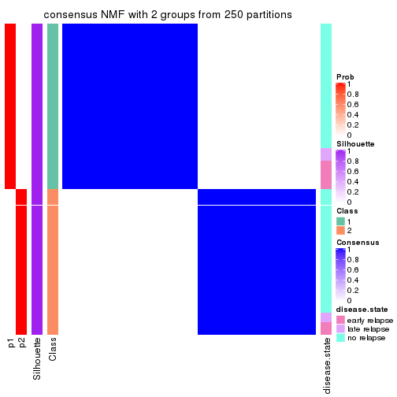</p>

</div>
<div id='tab-ATC-NMF-consensus-heatmap-2'>
<pre><code class="r">consensus_heatmap(res, k = 3)
</code></pre>

<p>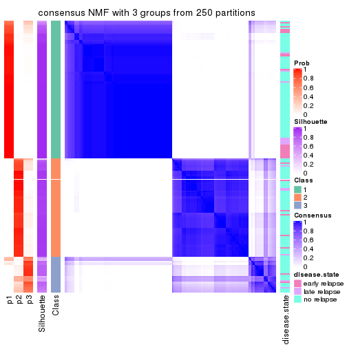</p>

</div>
<div id='tab-ATC-NMF-consensus-heatmap-3'>
<pre><code class="r">consensus_heatmap(res, k = 4)
</code></pre>

<p>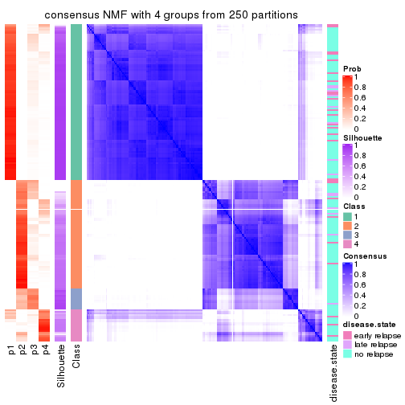</p>

</div>
<div id='tab-ATC-NMF-consensus-heatmap-4'>
<pre><code class="r">consensus_heatmap(res, k = 5)
</code></pre>

<p>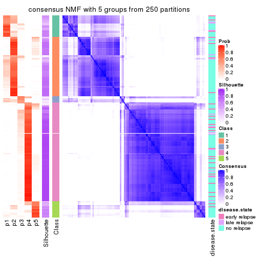</p>

</div>
<div id='tab-ATC-NMF-consensus-heatmap-5'>
<pre><code class="r">consensus_heatmap(res, k = 6)
</code></pre>

<p>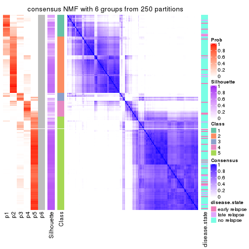</p>

</div>
</div>

Heatmaps for the membership of samples in all partitions to see how consistent they are:


<script>
$( function() {
	$( '#tabs-ATC-NMF-membership-heatmap' ).tabs();
} );
</script>
<div id='tabs-ATC-NMF-membership-heatmap'>
<ul>
<li><a href='#tab-ATC-NMF-membership-heatmap-1'>k = 2</a></li>
<li><a href='#tab-ATC-NMF-membership-heatmap-2'>k = 3</a></li>
<li><a href='#tab-ATC-NMF-membership-heatmap-3'>k = 4</a></li>
<li><a href='#tab-ATC-NMF-membership-heatmap-4'>k = 5</a></li>
<li><a href='#tab-ATC-NMF-membership-heatmap-5'>k = 6</a></li>
</ul>
<div id='tab-ATC-NMF-membership-heatmap-1'>
<pre><code class="r">membership_heatmap(res, k = 2)
</code></pre>

<p></p>

</div>
<div id='tab-ATC-NMF-membership-heatmap-2'>
<pre><code class="r">membership_heatmap(res, k = 3)
</code></pre>

<p>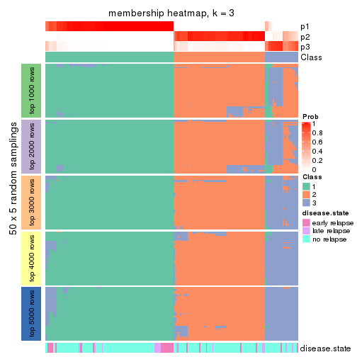</p>

</div>
<div id='tab-ATC-NMF-membership-heatmap-3'>
<pre><code class="r">membership_heatmap(res, k = 4)
</code></pre>

<p>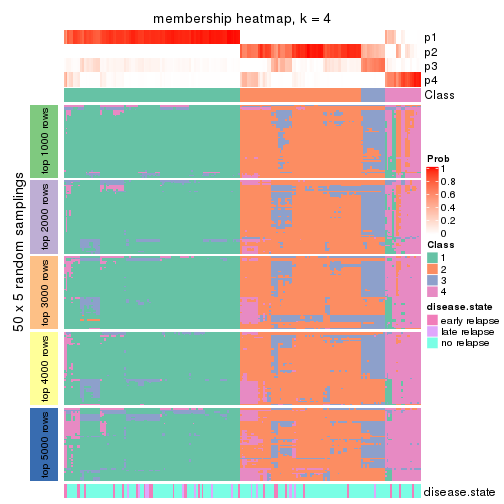</p>

</div>
<div id='tab-ATC-NMF-membership-heatmap-4'>
<pre><code class="r">membership_heatmap(res, k = 5)
</code></pre>

<p>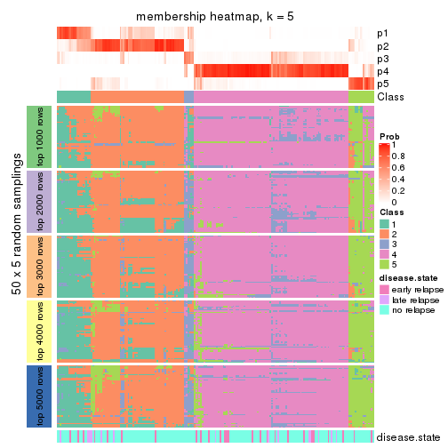</p>

</div>
<div id='tab-ATC-NMF-membership-heatmap-5'>
<pre><code class="r">membership_heatmap(res, k = 6)
</code></pre>

<p>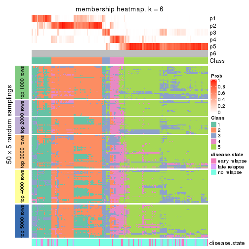</p>

</div>
</div>

As soon as we have had the classes for columns, we can look for signatures
which are significantly different between classes which can be candidate marks
for certain classes. Following are the heatmaps for signatures.


Signature heatmaps where rows are scaled:


<script>
$( function() {
	$( '#tabs-ATC-NMF-get-signatures' ).tabs();
} );
</script>
<div id='tabs-ATC-NMF-get-signatures'>
<ul>
<li><a href='#tab-ATC-NMF-get-signatures-1'>k = 2</a></li>
<li><a href='#tab-ATC-NMF-get-signatures-2'>k = 3</a></li>
<li><a href='#tab-ATC-NMF-get-signatures-3'>k = 4</a></li>
<li><a href='#tab-ATC-NMF-get-signatures-4'>k = 5</a></li>
<li><a href='#tab-ATC-NMF-get-signatures-5'>k = 6</a></li>
</ul>
<div id='tab-ATC-NMF-get-signatures-1'>
<pre><code class="r">get_signatures(res, k = 2)
</code></pre>

<p></p>

</div>
<div id='tab-ATC-NMF-get-signatures-2'>
<pre><code class="r">get_signatures(res, k = 3)
</code></pre>

<p>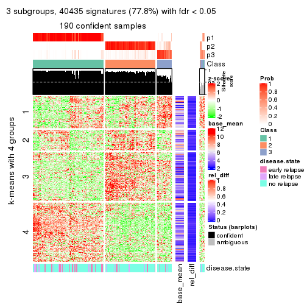</p>

</div>
<div id='tab-ATC-NMF-get-signatures-3'>
<pre><code class="r">get_signatures(res, k = 4)
</code></pre>

<p>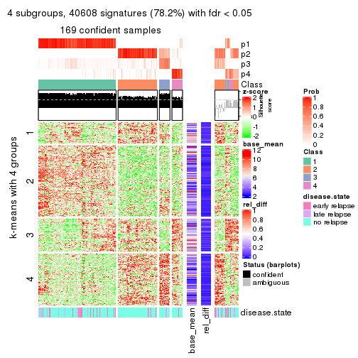</p>

</div>
<div id='tab-ATC-NMF-get-signatures-4'>
<pre><code class="r">get_signatures(res, k = 5)
</code></pre>

<p>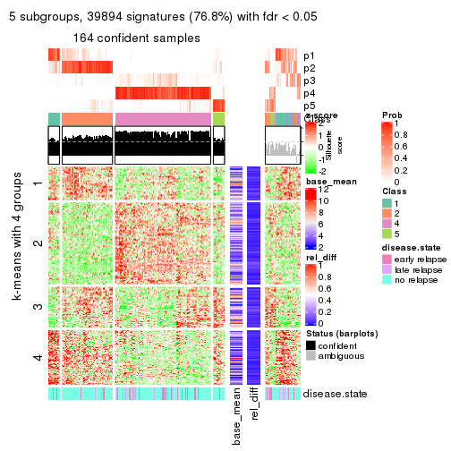</p>

</div>
<div id='tab-ATC-NMF-get-signatures-5'>
<pre><code class="r">get_signatures(res, k = 6)
</code></pre>

<p>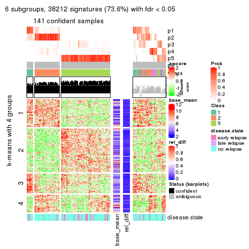</p>

</div>
</div>


Signature heatmaps where rows are not scaled:


<script>
$( function() {
	$( '#tabs-ATC-NMF-get-signatures-no-scale' ).tabs();
} );
</script>
<div id='tabs-ATC-NMF-get-signatures-no-scale'>
<ul>
<li><a href='#tab-ATC-NMF-get-signatures-no-scale-1'>k = 2</a></li>
<li><a href='#tab-ATC-NMF-get-signatures-no-scale-2'>k = 3</a></li>
<li><a href='#tab-ATC-NMF-get-signatures-no-scale-3'>k = 4</a></li>
<li><a href='#tab-ATC-NMF-get-signatures-no-scale-4'>k = 5</a></li>
<li><a href='#tab-ATC-NMF-get-signatures-no-scale-5'>k = 6</a></li>
</ul>
<div id='tab-ATC-NMF-get-signatures-no-scale-1'>
<pre><code class="r">get_signatures(res, k = 2, scale_rows = FALSE)
</code></pre>

<p></p>

</div>
<div id='tab-ATC-NMF-get-signatures-no-scale-2'>
<pre><code class="r">get_signatures(res, k = 3, scale_rows = FALSE)
</code></pre>

<p>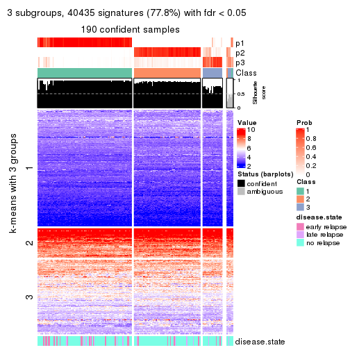</p>

</div>
<div id='tab-ATC-NMF-get-signatures-no-scale-3'>
<pre><code class="r">get_signatures(res, k = 4, scale_rows = FALSE)
</code></pre>

<p>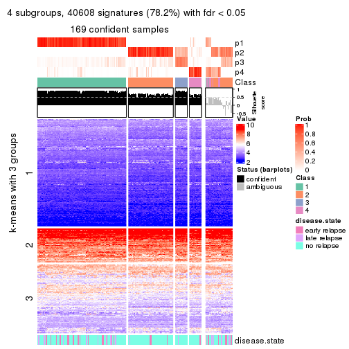</p>

</div>
<div id='tab-ATC-NMF-get-signatures-no-scale-4'>
<pre><code class="r">get_signatures(res, k = 5, scale_rows = FALSE)
</code></pre>

<p>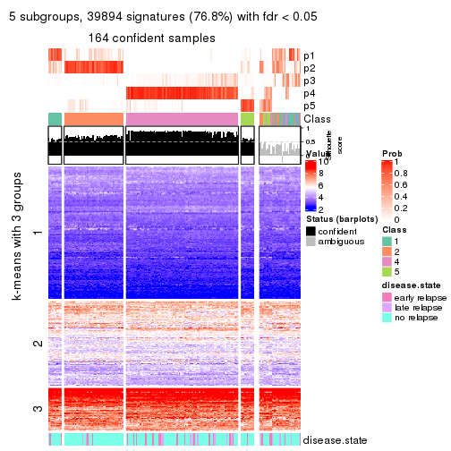</p>

</div>
<div id='tab-ATC-NMF-get-signatures-no-scale-5'>
<pre><code class="r">get_signatures(res, k = 6, scale_rows = FALSE)
</code></pre>

<p>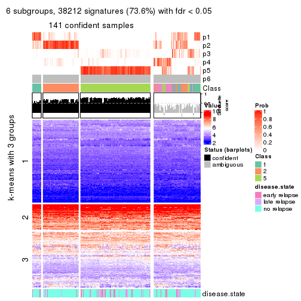</p>

</div>
</div>


Compare the overlap of signatures from different k:

```r
compare_signatures(res)
```

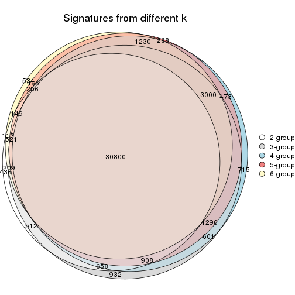

`get_signature()` returns a data frame invisibly. TO get the list of signatures, the function
call should be assigned to a variable explicitly. In following code, if `plot` argument is set
to `FALSE`, no heatmap is plotted while only the differential analysis is performed.

```r
# code only for demonstration
tb = get_signature(res, k = ..., plot = FALSE)
```

An example of the output of `tb` is:

```
#>   which_row         fdr    mean_1    mean_2 scaled_mean_1 scaled_mean_2 km
#> 1        38 0.042760348  8.373488  9.131774    -0.5533452     0.5164555  1
#> 2        40 0.018707592  7.106213  8.469186    -0.6173731     0.5762149  1
#> 3        55 0.019134737 10.221463 11.207825    -0.6159697     0.5749050  1
#> 4        59 0.006059896  5.921854  7.869574    -0.6899429     0.6439467  1
#> 5        60 0.018055526  8.928898 10.211722    -0.6204761     0.5791110  1
#> 6        98 0.009384629 15.714769 14.887706     0.6635654    -0.6193277  2
...
```

The columns in `tb` are:

1. `which_row`: row indices corresponding to the input matrix.
2. `fdr`: FDR for the differential test. 
3. `mean_x`: The mean value in group x.
4. `scaled_mean_x`: The mean value in group x after rows are scaled.
5. `km`: Row groups if k-means clustering is applied to rows.


UMAP plot which shows how samples are separated.


<script>
$( function() {
	$( '#tabs-ATC-NMF-dimension-reduction' ).tabs();
} );
</script>
<div id='tabs-ATC-NMF-dimension-reduction'>
<ul>
<li><a href='#tab-ATC-NMF-dimension-reduction-1'>k = 2</a></li>
<li><a href='#tab-ATC-NMF-dimension-reduction-2'>k = 3</a></li>
<li><a href='#tab-ATC-NMF-dimension-reduction-3'>k = 4</a></li>
<li><a href='#tab-ATC-NMF-dimension-reduction-4'>k = 5</a></li>
<li><a href='#tab-ATC-NMF-dimension-reduction-5'>k = 6</a></li>
</ul>
<div id='tab-ATC-NMF-dimension-reduction-1'>
<pre><code class="r">dimension_reduction(res, k = 2, method = &quot;UMAP&quot;)
</code></pre>

<p></p>

</div>
<div id='tab-ATC-NMF-dimension-reduction-2'>
<pre><code class="r">dimension_reduction(res, k = 3, method = &quot;UMAP&quot;)
</code></pre>

<p>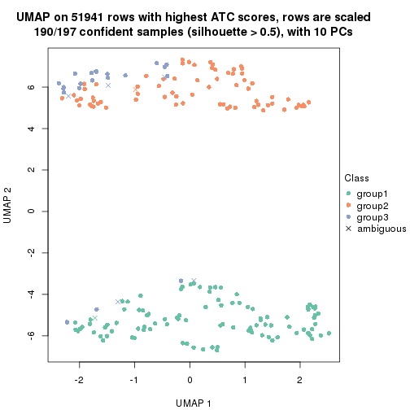</p>

</div>
<div id='tab-ATC-NMF-dimension-reduction-3'>
<pre><code class="r">dimension_reduction(res, k = 4, method = &quot;UMAP&quot;)
</code></pre>

<p>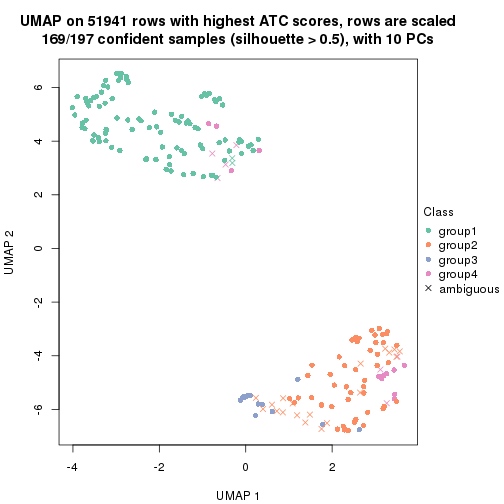</p>

</div>
<div id='tab-ATC-NMF-dimension-reduction-4'>
<pre><code class="r">dimension_reduction(res, k = 5, method = &quot;UMAP&quot;)
</code></pre>

<p>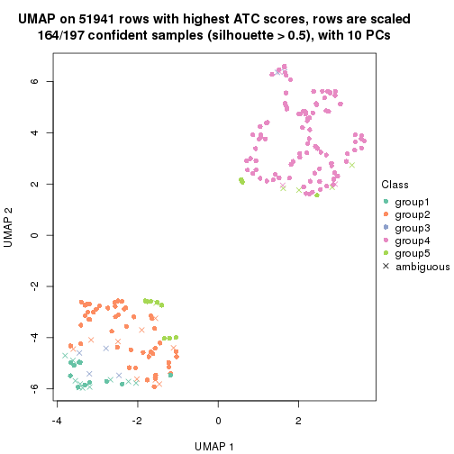</p>

</div>
<div id='tab-ATC-NMF-dimension-reduction-5'>
<pre><code class="r">dimension_reduction(res, k = 6, method = &quot;UMAP&quot;)
</code></pre>

<p>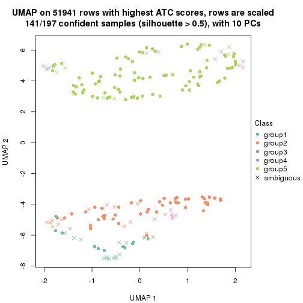</p>

</div>
</div>


Following heatmap shows how subgroups are split when increasing `k`:

```r
collect_classes(res)
```

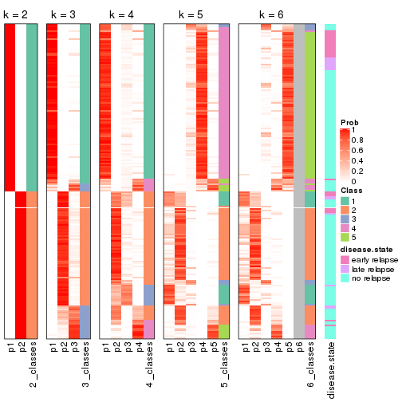


Test correlation between subgroups and known annotations. If the known
annotation is numeric, one-way ANOVA test is applied, and if the known
annotation is discrete, chi-squared contingency table test is applied.

```r
test_to_known_factors(res)
```

```
#>           n disease.state(p) k
#> ATC:NMF 197            0.193 2
#> ATC:NMF 190            0.354 3
#> ATC:NMF 169            0.188 4
#> ATC:NMF 164            0.192 5
#> ATC:NMF 141            0.172 6
```


If matrix rows can be associated to genes, consider to use `functional_enrichment(res,
...)` to perform function enrichment for the signature genes. See [this vignette](http://bioconductor.org/packages/devel/bioc/vignettes/cola/inst/doc/functional_enrichment.html) for more detailed explanations.


 

## Session info


```r
sessionInfo()
```

```
#> R version 3.6.0 (2019-04-26)
#> Platform: x86_64-pc-linux-gnu (64-bit)
#> Running under: CentOS Linux 7 (Core)
#> 
#> Matrix products: default
#> BLAS:   /usr/lib64/libblas.so.3.4.2
#> LAPACK: /usr/lib64/liblapack.so.3.4.2
#> 
#> locale:
#>  [1] LC_CTYPE=en_GB.UTF-8       LC_NUMERIC=C               LC_TIME=en_GB.UTF-8       
#>  [4] LC_COLLATE=en_GB.UTF-8     LC_MONETARY=en_GB.UTF-8    LC_MESSAGES=en_GB.UTF-8   
#>  [7] LC_PAPER=en_GB.UTF-8       LC_NAME=C                  LC_ADDRESS=C              
#> [10] LC_TELEPHONE=C             LC_MEASUREMENT=en_GB.UTF-8 LC_IDENTIFICATION=C       
#> 
#> attached base packages:
#> [1] grid      stats     graphics  grDevices utils     datasets  methods   base     
#> 
#> other attached packages:
#> [1] genefilter_1.66.0    ComplexHeatmap_2.3.1 markdown_1.1         knitr_1.26          
#> [5] GetoptLong_0.1.7     cola_1.3.2          
#> 
#> loaded via a namespace (and not attached):
#>  [1] circlize_0.4.8       shape_1.4.4          xfun_0.11            slam_0.1-46         
#>  [5] lattice_0.20-38      splines_3.6.0        colorspace_1.4-1     vctrs_0.2.0         
#>  [9] stats4_3.6.0         blob_1.2.0           XML_3.98-1.20        survival_2.44-1.1   
#> [13] rlang_0.4.2          pillar_1.4.2         DBI_1.0.0            BiocGenerics_0.30.0 
#> [17] bit64_0.9-7          RColorBrewer_1.1-2   matrixStats_0.55.0   stringr_1.4.0       
#> [21] GlobalOptions_0.1.1  evaluate_0.14        memoise_1.1.0        Biobase_2.44.0      
#> [25] IRanges_2.18.3       parallel_3.6.0       AnnotationDbi_1.46.1 highr_0.8           
#> [29] Rcpp_1.0.3           xtable_1.8-4         backports_1.1.5      S4Vectors_0.22.1    
#> [33] annotate_1.62.0      skmeans_0.2-11       bit_1.1-14           microbenchmark_1.4-7
#> [37] brew_1.0-6           impute_1.58.0        rjson_0.2.20         png_0.1-7           
#> [41] digest_0.6.23        stringi_1.4.3        polyclip_1.10-0      clue_0.3-57         
#> [45] tools_3.6.0          bitops_1.0-6         magrittr_1.5         eulerr_6.0.0        
#> [49] RCurl_1.95-4.12      RSQLite_2.1.4        tibble_2.1.3         cluster_2.1.0       
#> [53] crayon_1.3.4         pkgconfig_2.0.3      zeallot_0.1.0        Matrix_1.2-17       
#> [57] xml2_1.2.2           httr_1.4.1           R6_2.4.1             mclust_5.4.5        
#> [61] compiler_3.6.0
```


